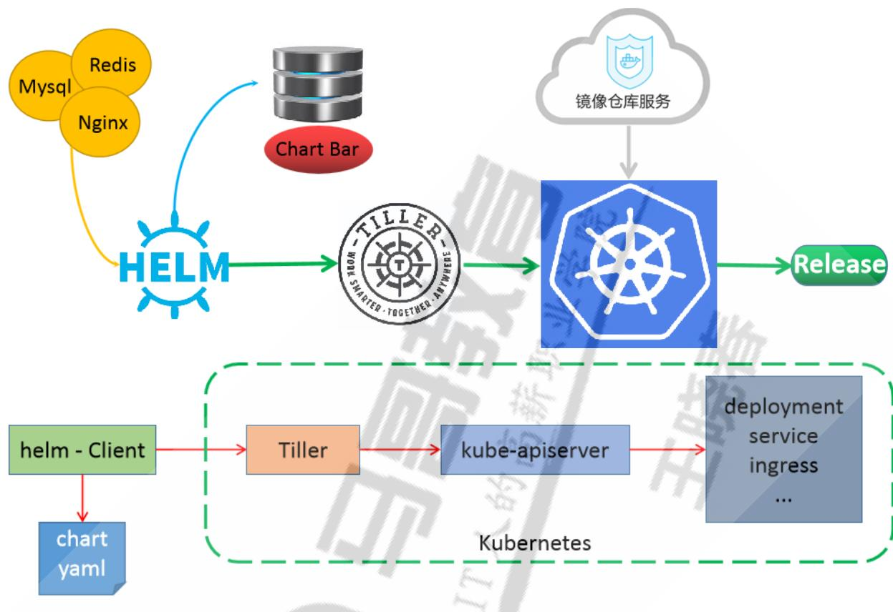
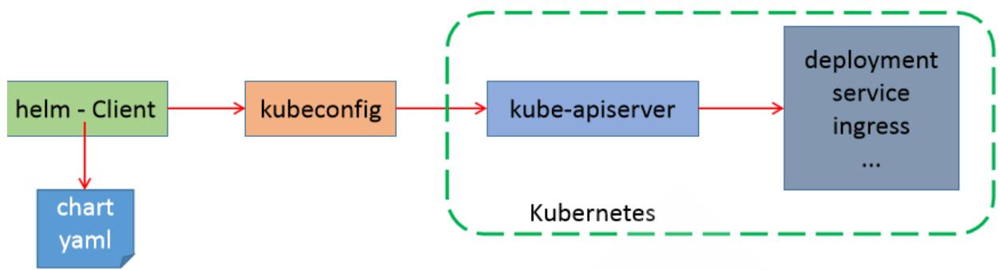

# 一小时玩转Kubernetes的包管理器 Helm

# 内容

- Helm 介绍
- Helm 部署
- Helm 命令用法
- 基于 Helm 部署
- 自定义 Chart 结构
- 自定义 Chart 内置对象函数变量流控制
- 自定义 Chart 案例

# 1 Helm 说明和部署

## 1.1 Helm 说明

### Helm 介绍

**将应用服务部署到Kubernetes集群的传统流程**

- 拉取代码
- 打包编译
- 构建镜像
- 准备一堆相关部署资源清单的 yaml 文件(如:deployment、statefulset、service、ingress等)
- kubectl apply 部署

**传统方式部署引发的问题**

- 随着资源引用的增多，需要维护大量的yaml文件
- 微服务场景下，每个微服务所需配置差别不大，众多的微服务的yaml文件无法高效复用
- 无法将相关yaml文件做为一个整体管理，并实现应用级别的升级和回滚等功能
- 无法根据一套yaml文件来创建多个环境，需要手动进行修改，尤其是微服务众多的情况，效率低下例如：部署的环境都分为开发、预生产、生产环境，在开发这套环境部署完了，后面再部署到预生产和生产环境，还需要重新复制出两套配置文件，并手动修改才能完成

**Kubernetes的软件管理器Helm介绍**

Helm is a tool for managing Charts. Charts are packages of pre- configured Kubernetes resources. 

Kubernetes也提供了类似于包管理机制Helm

Helm不是Kubernetes官方提供的工具，但它是由Kubernetes社区维护和支持的。

Helm是一个用于简化和管理Kubernetes应用部署的包管理器

Helm可以将部署应用所需要的所有配置清单文件YAML打包至一个Chart的包文件中，并支持针对多套环境的定制部署

Helm允许用户进行定义、安装和升级Kubernetes应用程序的资源，称为HelmCharts。

Helm在社区中得到了广泛的支持和采用，并成为Kubernetes生态系统中流行的部署工具之一。

Helm官网

```
https://helm.sh/
https://github.com/helm/helm
```

Helm文档

```
https://helm.sh/zh/docs/
https://helm.sh/zh/docs/intro/quickstart/
```

**Helm重要特性**

- 将各种资源文件进行打包，基于包的方式安装，更加方便
- 提供template功能，可以基于同一套template文件，但对于不同环境可以赋予不同的值从而实现的灵活部署
- 提供版本管理功能，比如，升级，回滚等

**Helm的历史**

- 2015年：Deis团队开发了Helm 1.0，最初称为Kubernetes Deployment Manager。
- 2016年：Helm 1.0与Kubernetes项目合并，並更名為Helm 2.0。Helm 2.0引入了Tiller服务器，它用于管理Helm图表。
- 2018年：Helm 2.0成为CNCF毕业项目。
- 2019年：Helm 3.0发布，刪除了Tiller服务器，并引入了新的功能，例如Chart templating和Chart hooks。
- 2020年：Helm 3.0成为CNCF毕业项目

### Helm相关概念

1.1.2 Helm相关概念- Helm：Helm的客户端工具，负责和API Server通信Helm和kubectl类似，也是Kubernetes API Server的命令行客户端工具支持kubeconfig认证文件需要事先从仓库或本地加载到要使用目标Chart，并基于Chart完成应用管理Chart可缓存于Helm本地主机上支持仓库管理和包管理的各类常用操作，例如Chart仓库的增、删、改、查，以及Chart包的制作、发布、搜索、下载等- Chart：打包文件，将所有相关的资源清单文件YAML的打包文件Chart是一种打包格式，文件后缀为tar.gz或者tgz，代表着可由Helm管理的有着特定格式的程序包，类似于RPM，DEB包格式Chart包含了应用所需的资源相关的各种yaml/json配置清单文件，比如：deployment,service等，但不包含容器的镜像Chart可以使用默认配置，或者定制用户自己的配置进行安装应用Chart中的资源配置文件通常以模板(go template)形式定义，在部署时，用户可通过向模板参数赋值实现定制化安装的目的

Chart中各模板参数通常也有默认值，这些默认值定义在Chart包里一个名为values.yml的文件中

- Release：表示基于chart部署的一个实例。通过chart部署的应用都会生成一个唯一的Release，即使同一个chart部署多次也会产生多个Release。将这些release应用部署完成后，也会记录部署的一个版本，维护了一个release版本状态，基于此可以实现版本回滚等操作

- Repository：chart包存放的仓库，相当于APT和YUM仓库

### Helm 版本

**Helm-v2**



C/S架构：

- Client：helm client，通过gRPC协议和Tiller通信- Server：称为Tiller，以Operator形式部署Kubernetes集群内，表现为相应的一个Pod，还需要做RBAC的授权

Tiller Server

Tiller Server是一个部署在Kubernetes集群内部的server，其与Helm client、Kubernetes API server进行交互。

Tiller server主要负责如下：

- 监听来自Helm client的请求- 通过chart及其配置构建一次发布- 安装chart到Kubernetes集群，并跟踪随后的发布- 通过与Kubernetes交互升级或卸载chart

权限管理：

- Helm客户端配置kubeconfig文件，以便能够与Kubernetes API服务器通信。这个配置通常在 ~/.kube/config文件中。加载认证配置文件的机制同kubectl- Tiller服务端需要在其运行的命名空间中具有足够的权限来管理Kubernetes资源。这通常通过创建一个服务账户（ServiceAccount）并绑定适当的角色（例如ClusterRole和

ClusterRoleBinding）来实现。

**Helm-v3**

2019年11月发布Helm- v3版本



**Helm3的变化**

- Tiller 服务器端被废弃仅保留helm客户端，helm通过kubeconfig认证到APIServer，加载认证配置文件的机制同kubectl

- Release可以在不同名称空间重用，每个名称空间名称唯一即可

- 支持将Chart推送至Docker镜像仓库

- 支持更强大的Chart templating语法，包括Go模板和新的templating函数。

这使得Helm3更灵活，可以用于更复杂的部署场景

- Helm3默认使用secrets来存储发行信息，提供了更高的安全性。

- Helm2默认使用configmaps存储发行信息

- 自动创建名称空间

在不存在的命名空间中创建发行版时，Helm2创建了命名空间。

- Helm3遵循其他Kubernetes对象的行为，如果命名空间不存在则返回错误。

- Helm3可以通过--create-namespace选项当名称空间不存在时自动创建

- 不再需要requirements.yaml，依赖关系是直接在Chart.yaml中定义。

- 命令变化

- 删除release命令变化

helm delete RELEASE_NAME - - purge  $\Rightarrow$  helm uninstall RELEASE_NAME

- 查看chart信息命令变化

helm inspect RELEASE_NAME  $\Rightarrow$  helm show RELEASE_NAME

- 拉取chart包命令变化

helm fetch CHART_NAME  $\Rightarrow$  helm pull CHART_NAME

- 生成release的随机名

helm- v3必须指定release名，如果想使用随机名，必须通过- - generate- name选项实现，helm- v2可以自动生成随机名helo install ./mychart - - generate- name

# 1.1.4 Chart 仓库

Chart仓库：用于实现Chart包的集中存储和分发，类似于Docker仓库Harbor

Chart仓库：

Chart仓库：- 官方仓库: https://artifacthub.io/- 微软仓库: 推荐使用，http://mirror.azure.cn/kubernetes/charts/- 阿里云仓库: http://kubernetes.oss- cn- hangzhou.aliyuncs.com/charts- 项目官方仓库：项目自身维护的Chart仓库- Harbor仓库：新版支持基于OCI://协议，将Chart存放在公共的docker镜像仓库

Chart官方仓库Hub:

  
https://artifacthub.io/

可以搜索需要的应用，如下示例：redis

  
选择点赞最多的chart


# 1.1.5使用Helm部署应用流程


# 使用Helm部署应用流程

- 查找合适的chart仓库- 配置chart仓库- 定位chart- 通过向Chart中模板文件中字串赋值完成其实例化，即模板渲染，实例化的结果就可以部署到目标Kubernetes上

模板字串的定制方式三种：

- 默认使用chart中的values.yaml中定义的默认值- 直接在helm install的命令行，通过--set选项进行- 自定义values.yaml，由helm install -f values.yaml命令加载该文件- 同一个chart可以部署出来的多个不同的实例，每个实例称为一个releaseChart和Release的关系，相当于OOP开发中的Class和对象的关系，相当于image和container应用release安装命令：helm install

# 1.2 Helm客户端安装

# 1.2.1官方说明

https://helm.sh/docs/intro/install/

# 安装方法

From the Binary ReleasesEvery release of Helm provides binary releases for a variety of OSes. These binary versions can be manually downloaded and installed.

Download your desired versionUnpack it (tar - zxvf helm - v3.0.0- linux- amd64. tar.gz)

Find the helm binary in the unpacked directory, and move it to its desired destination (mv linux- amd64/helm /usr/local/bin/helm) From there, you should be able to run the client and add the stable repo: helm help.

Note: Helm automated tests are performed for Linux AMD64 only during Circleci builds and releases. Testing of other OSes are the responsibility of the community requesting helm for the OS in question.

From Script

Helm now has an installer script that will automatically grab the latest version of Helm and install it locally.

You can fetch that script, and then execute it locally. It's well documented so that you can read through it and understand what it is doing before you run it.

$\mathfrak{s}$  curl - fssl - o get_helm.sh https://raw.githubusercontent.com/helm/helm/main/scripts/get- helm- 3  $\mathfrak{s}$  chmod 700 get_helm.sh  $\mathfrak{s}$  ./get_helm.sh Yes, you can curl https://raw.githubusercontent.com/helm/helm/main/scripts/gethelm- 3 | bash if you want to live on the edge.

# Helm下载链接

https://github.com/helm/helm/releases


# 1.2.2范例：安装Helm

# 在kubernetes的管理节点部署

[root@master1 \~]#wget https://get.helm- v3.12.12.0- linux- amd64. tar.gz [root@master1 \~]#tar xf helm- v3.12.0- linux- amd64. tar.gz - C /usr/local/ [root@master1 \~]#ls /usr/local/linux- amd64/ helm LICENSE README.md [root@master1 \~]#ln - s /usr/local/linux- amd64/helm /usr/local/bin/ [root@master1 \~]#1dd /usr/local/bin/helm 不是动态可执行文件

# #helm- v3版本显示效果如下

[root@master1 \~]#helm version version.BuildInfo{version:"v3.12.0", GitCommit:"c9f554d75773799f72ceef38c51210f1842a1dea", GitTreeState:"clean", GoVersion:"go1.20.3"}

# #helm- v2版本显示效果如下

[root@master1 \~]#helm version Client:

&version.version{semver:"v2.9.1",GitCommit:"c9f554d75773799f72ceef38c51210f1842a 1dea",GitTrees tate:"clean"} Server: &version.version{semver:"v2.9.1",GitCommit:"c9f554d75773799f72ceef38c51210f1842a 1dea",GitTrees tate:"clean"}

# Helm命令补会

方法1[root@master1 \~]#echo 'source <(helm completion bash)' >> - bashrc#方法2

[root@master1 ~]#helm completion bash > /etc/bash_completion.d/helm

# 重新登录生效

[root@master1 ~]#exit

# 1.2.3范例：官方脚本安装

[root@master1 ~]#curl - fssl - o get_helm.sh https://raw.githubusercontent.com/helm/helm/main/scripts/get- helm- 3 [root@master1 ~]#chmod +x get_helm.sh [root@master1 ~]#./get_helm.sh Downloading https://get.helm.sh/helm- v3.12.2- linux- amd64. tar.gz verifying checksum... done. Preparing to install helm into /usr/local/bin helm installed into /usr/local/bin/helm

[root@master1 ~]#helm version version.BuildInfo{version:"v3.12.2", GitCommit:"1e210a2c8c5117d1055bfaa5d40f51bbc2e345e", GitTreeState:"clean", Goversion:"go1.20.5"}

# 1.3 Helm命令用法

https://v3. helm.sh/zh/docs/helm/ https://docs.helm.sh/docs/helm/helm/

# 1.3.1Helm命令用法说明

常用的helm命令分类

- Repository管理repo命令，支持repository的add、list、remove、update和index等子命令- Chart管理create、package、pull、push、dependency、search、show和verify等操作- Release管理install、upgrade、get、list、history、status、rollback和uninstall等操作

Helm常见子命令：

version #查看helm客户端版本repo #添加、列出、移除、更新和索引chart仓库，相当于apt/yum仓库，可用于命令：add、index、list、remove、updatesearch #根据关键字搜索chart包show： #查看chart包的基本信息和详细信息，可用于命令：all、chart、readme、valuespull #从远程仓库中拉取chart包并解压到本地，通过选项- - untar解压，默认不解压create #创建一个chart包并指定chart包名字install #通过chart包安装一个release实例create #创建chart目录list #列出release实例名upgrade #更新一个release实例rollback #从之前版本回滚release实例，也可指定要回滚的版本号uninstall #卸载一个release实例history #获取release历史，用法：helm history release实例名

package #将chart目录打包成chart存档文件.tgz中get#下载一个release，可用子命令：all、hooks、manifest、notes、valuesstatus#显示release实例的状态，显示已命名版本的状态

# Helm常见命令用法

# #仓库管理

helm repo list #列出已添加的仓库helm repo add[REPO_NAME][URL] #添加远程仓库并命名，如下示例helm repo add bitnami https://charts.bitnami.com/bitnamihelm repo add ingress- nginx https://kubernetes.github.io/ingress- nginxhelm repo add myharbor https://harbor.wangxiaochun.com/chartrepo/myweb - - usernameadmin - - password 123456helm repo remove [REPO1 [REPO2 ...]] #删除仓库helm repo update #更新仓库，相当于apt updatehelm search hub [KEYWORD] #从artifacthub网站搜索，无需配置本地仓库，相当于docker searchhelm search repo [KEYWORD] #本地仓库搜索，需要配置本地仓库才能搜索，相当于apt searchhelm search repo [KEYWORD] - - versions #显示所有版本helm show chart [CHART] #查看chart包的信息，类似于apt infohelm show values [CHART] #查看chart包的values.yaml文件内容

# 拉取chart到本地

helm pull repo/chartname #下载charts到当前目录下，表现为tgz文件，默认最新版本，相当于wgethelm pull chart_URL #直接下载，默认为.tgz文件helm pull myrepo/myapp - - version 1.2.3 - - untar #直接下载指定版本的chart包并解压缩

创建chart目录结构helm create NAME

# #检查语法

helm lint [PATH] #默认检查当前目录

# #安装

helm install [NAME] [CHART] [-- version <string> ] #安装指定版本的charthelm install [CHART] - - generate- name #自动生成 RELEASE_NAMEhelm install - - set KEY1=VALUE1 - - set KEY2=VALUE2 RELEASE_NAME CHART ... #指定属性实现定制配置helm install - - f values.yaml RELEASE_NAME CHART... #引用文件实现定制配置helm install - - debug - - dry- run RELEASE_NAME CHART #调试并不执行，可以查看到执行的渲染结果

# #删除

helm uninstall RELEASE_NAME

#卸载RELEASE

# #查看

helm list #列出安装的release

helm status RELEASE_NAME #查看RELEASE状态helm get notes RELEASE_NAME - n NAMESPACE #查看RELEASE的说明helm get values RELEASE_NAME - n NAMESPACE > values.yaml #查看RELEASE的生成的值，可以导出方便以后使用

# 以导出方便以后使用

helm get manifest RELEASE_NAME - n NAMESPACE 单文件

查看RELEASE状态查看RELEASE的说明查看RELEASE的生成的值，可查看RELEASE的生成的资源清

# #升级和回滚

helm upgrade RELEASE_NAME CHART - - set key=newvalue #release 更新helm upgrade RELEASE_NAME CHART - f mychart/values.yaml #release 更新helm rollback RELEASE_NAME [REVISION] #release 回滚到指定版本，如果不指定版本，默认回滚至上一个版本helm history RELEASE_NAME #查看历史

打包helm package mychart/ #将指定目录的chart打包为.tgz到当前目录下

# helm install 说明

helm install - - help  Usage: helm install [NAME] [CHART] [flags]

# 安装的CHART有六种形式

1. By chart reference: helm install mymaria example/mariadb #在线安装  
2. By path to a packaged chart: helm install myweb ./nginx-1.2.3.tgz #离线安装  
3. By path to an unpacked chart directory: helm install myweb ./nginx #离线安装  
4. By absolute URL: helm install myweb https://example.com/charts/nginx-1.2.3.tgz #离线安装  
5. By chart reference and repo url: helm install - - repo https://example.com/charts/myweb nginx #离线安装  
6. By OCI registries: helm install myweb - - version 1.2.3 oci://example.com/charts/nginx #离线安装

Helm相关环境变量：

<table><tr><td>名称</td><td>描述</td></tr><tr><td>(HELM_CACHE_HOME</td><td>设置一个存储缓存文件的可选位置</td></tr><tr><td>(HELM_CONFIG_HOME</td><td>设置一个存储Helm配置的可选位置</td></tr><tr><td>(HELM_DATA_HOME</td><td>设置一个存储Helm数据的可选位置</td></tr><tr><td>(HELM_DEBUG</td><td>表示Helm是否在Debug模式系运行</td></tr><tr><td>(HELM_DRIVER</td><td>设置后台存储驱动，可选值包括：configmap, secret, memory, sql</td></tr><tr><td>(HELM_DRIVER_SQL_CONNECTION_STRING</td><td>设置SQL存储驱动使用连接字符串</td></tr><tr><td>(HELM_MAX_HISTORY</td><td>设置发布历史记录的最大值</td></tr><tr><td>(HELM_NAMESPACE</td><td>设置用于helm操作的命名空间</td></tr><tr><td>(HELM_NO_PLUGIN</td><td>禁用插件，HELM_NO_PLUGIN=1表示禁用插件</td></tr><tr><td>(HELM_PLUGIN</td><td>设置插件目录路径</td></tr><tr><td>(HELM_REGISTRY_CONFIG</td><td>设置注册配置文件的路径</td></tr><tr><td>(HELM_REPOSITORY_CACHE</td><td>设置仓库缓存目录路径</td></tr><tr><td>(HELM_REPOSITORY_CONFIG</td><td>设置仓库文件的路径</td></tr><tr><td>(KUBECONFIG</td><td>设置Kubernetes的可选配置文件(默认是&quot;-/.kube/config&quot;)</td></tr><tr><td>(HELM_KUBEAPISERVER</td><td>设置用于身份认证的Kubernetes API服务端</td></tr><tr><td>(HELM_KUBECAPFILE</td><td>设置Kubernetes证书机构文件</td></tr><tr><td>(HELM_KUBEASGROUPS</td><td>使用逗号分隔的列表设置用于模拟的组</td></tr><tr><td>(HELM_KUBEASUSER</td><td>为操作设置要模拟的用户名</td></tr><tr><td>(HELM_KUBECONTEXT</td><td>设置kubeconfig上下文的名称</td></tr><tr><td>(HELM_KUBETOKEN</td><td>设置用于身份验证的不记名KubeToken</td></tr><tr><td>(HELM_KUBEINSECURE_SKIP_TLS_VERIFY</td><td>设置Kubernetes API服务的证书验证是否跳过(不安全)</td></tr><tr><td>(HELM_KUBETLS_SERVER_NAME</td><td>设置用于验证Kubernetes API服务器证书的服务器名称</td></tr><tr><td>(HELM_BURST_LIMIT</td><td>设置当kubernetes服务包含很大量CRD时的默认上限值(默认100,1是不可用)</td></tr></table>

Helm基于以下配置顺序存储缓存，配置和添加数据：

- 如果设置了HELM*HOME环境变量，则使用该变量- 否则，在支持XDG基本目录规范的系统上，会使用XDG变量- 当没有设置其他位置时，将根据操作系统使用默认位置

默认情况下，默认目录取决于操作系统，默认值如下：

<table><tr><td>操作系统</td><td>缓存路径</td><td>配置路径</td><td>数据路径</td></tr><tr><td>Linux</td><td>$HOME/.cache/helm</td><td>$HOME/.config/helm</td><td>$HOME/.local/share/helm</td></tr><tr><td>macOS</td><td>$HOME/Library/Caches/helm</td><td>$HOME/Library/Preferences/helm</td><td>$HOME/Library/helm</td></tr><tr><td>Windows</td><td>%TEMP%helm</td><td>%APPDATA%helm</td><td>%APPDATA%helm</td></tr></table>

# 范例：查看帮助

查看helm命令用法

[root@master1 ~]#helm

The Kubernetes package manager

Common actions for helm:

- helm search: search for charts  
- helm pull: download a chart to your local directory to view  
- helm install: upload the chart to Kubernetes  
- helm list: list releases of charts

Environment variables:

| Name | Description || - - - - - - - - - - - - - - - - - - - - - - - - - - - - - - - - - - - - - - - - - - - - - - - - - - - - - - - - - - - - - - - - - - - - - - - - - - - - - - - - - - - - - - - - - - - - - - - - - - - - | | | | | | | | | | | | | | | | | | | | | | | | | | | | | | | | | | | | | | | | | | | | | | | | | | | | | | | | | | | | | | | | | | | | | | | | | | | | | | | | | | | | | | | | | | | | | | | | | | | | || | | | | | | | | | | | | | | | | | | | | | | | | | | | | | | | | | | | | | | | | | | | | | | | | | | | | | | | | | | | | | | | | | | | | | | | | | | | | | | | | | | | | | | | | | | | | | | | | | | | I | | | | | | | | | | | | | | | | | | | | | | | | | | | | | | | | | | | | | | | | | | | | | | | | | | | | | | | | | | | | | | | | | | | | | | | | | | | | | | | | | | | | | | | | | | | | | | | | | | | - - - - - - - - - - - - - - - - - - - - - - - - - - - - - - - - - - - - - - - - - - - - - - - - - - - - - - - - - - - - - - - - - - - - - - - - - - - - - - - - - - - - - - - - - - - - - - - - - - - I | | | | | | | | | | | | | | | | | | | | | | | | | | | | | | | | | | | | | | | | | | | | | | | | | | | | | | | | | | | | | | | | | | | | | | | | | | | | | | | | | | | | | | | | | | | | | | | | | | I || | | | | | | | | | | | | | | | | | | | | | | | | | | | | | | | | | | | | | | | | | | | | | | | | | | | | | | | | | | | | | | | | | | | | | | | | | | | | | | | | | | | | | | | | | | | | | | | | | | I I | | | | | | | | | | | | | | | | | | | | | | | | | | | | | | | | | | | | | | | | | | | | | | | | | | | | | | | | | | | | | | | | | | | | | | | | | | | | | | | | | | | | | | | | | | | | | | | | | | - I | | | | | | | | | | | | | | | | | | | | | | | | | | | | | | | | | | | | | | | | | | | | | | | | | | | | | | | | | | | | | | | | | | | | | | | | | | | | | | | | | | | | | | | | | | | | | | | | | I | I | | | | | | | | | | | | | | | | | | | | | | | | | | | | | | | | | | | | | | | | | | | | | | | | | | | | | | | | | | | | | | | | | | | | | | | | | | | | | | | | | | | | | | | | | | | | | | | | | I || I | | | | | | | | | | | | | | | | | | | | | | | | | | | | | | | | | | | | | | | | | | | | | | | | | | | | | | | | | | | | | | | | | | | | | | | | | | | | | | | | | | | | | | | | | | | | | | | | | | || I | | | | | | | | | | | | | | | | | | | | | | | | | | | | | | | | | | | | | | | | | | | | | | | | | | | | | | | | | | | | | | | | | | | | | | | | | | | | | | | | | | | | | | | | | | | | | | | | | I I || | | | | | | | | | | | | | | | | | | | | | | | | | | | | | | | | | | | | | | | | | | | | | | | | | | | | | | | | | | | | | | | | | | | | | | | | | | | | | | | | | | | | | | | | | | | | | | | | | I | || | | | | | | | | | | | | | | | | | | | | | | | | | | | | | | | | | | | | | | | | | | | | | | | | | | | | | | | | | | | | | | | | | | | | | | | | | | | | | | | | | | | | | | | | | | | | | | | | | I || || | | | | | | | | | | | | | | | | | | | | | | | | | | | | | | | | | | | | | | | | | | | | | | | | | | | | | | | | | | | | | | | | | | | | | | | | | | | | | | | | | | | | | | | | | | | | | | | | | | - | | | | | | | | | | | | | | | | | | | | | | | | | | | | | | | | | | | | | | | | | | | | | | | | | | | | | | | | | | | | | | | | | | | | | | | | | | | | | | | | | | | | | | | | | | | | | | | | | | I - | | | | | | | | | | | | | | | | | | | | | | | | | | | | | | | | | | | | | | | | | | | | | | | | | | | | | | | | | | | | | | | | | | | | | | | | | | | | | | | | | | | | | | | | | | | | | | | | | | - || | | | | | | | | | | | | | | | | | | | | | | | | | | | | | | | | | | | | | | | | | | | | | | | | | | | | | | | | | | | | | | | | | | | | | | | | | | | | | | | | | | | | | | | | | | | | | | | | | | || - | | | | | | | | | | | | | | | | | | | | | | | | | | | | | | | | | | | | | | | | | | | | | | | | | | | | | | | | | | | | | | | | | | | | | | | | | | | | | | | | | | | | | | | | | | | | | | | | | | || || | | | | | | | | | | | | | | | | | | | | | | | | | | | | | | | | | | | | | | | | | | | | | | | | | | | | | | | | | | | | | | | | | | | | | | | | | | | | | | | | | | | | | | | | | | | | | | | | | I - || | | | | | | | | | | | | | | | | | | | | | | | | | | | | | | | | | | | | | | | | | | | | | | | | | | | | | | | | | | | | | | | | | | | | | | | | | | | | | | | | | | | | | | | | | | | | | | | | | I I - | | | | | | | | | | | | | | | | | | | | | | | | | | | | | | | | | | | | | | | | | | | | | | | | | | | | | | | | | | | | | | | | | | | | | | | | | | | | | | | | | | | | | | | | | | | | | | | | | I || - | | | | | | | | | | | | | | | | | | | | | | | | | | | | | | | | | | | | | | | | | | | | | | | | | | | | | | | | | | | | | | | | | | | | | | | | | | | | | | | | | | | | | | | | | | | | | | | | | I | - | | | | | | | | | | | | | | | | | | | | | | | | | | | | | | | | | | | | | | | | | | | | | | | | | | | | | | | | | | | | | | | | | | | | | | | | | | | | | | | | | | | | | | | | | | | | | | | | | I - I | | | | | | | | | | | | | | | | | | | | | | | | | | | | | | | | | | | | | | | | | | | | | | | | | | | | | | | | | | | | | | | | | | | | | | | | | | | | | | | | | | | | | | | | | | | | | | | | | - | I | | | | | | | | | | | | | | | | | | | | | | | | | | | | | | | | | | | | | | | | | | | | | | | | | | | | | | | | | | | | | | | | | | | | | | | | | | | | | | | | | | | | | | | | | | | | | | | | | - - | | | | | | | | | | | | | | | | | | | | | | | | | | | | | | | | | | | | | | | | | | | | | | | | | | | | | | | | | | | | | | | | | | | | | | | | | | | | | | | | | | | | | | | | | | | | | | | | | I I I - | | | | | | | | | | | | | | | | | | | | | | | | | | | | | | | | | | | | | | | | | | | | | | | | | | | | | | | | | | | | | | | | | | | | | | | | | | | | | | | | | | | | | | | | | | | | | | | | I - | I | | | | | | | | | | | | | | | | | | | | | | | | | | | | | | | | | | | | | | | | | | | | | | | | | | | | | | | | | | | | | | | | | | | | | | | | | | | | | | | | | | | | | | | | | | | | | | | | I | - I | | | | | | | | | | | | | | | | | | | | | | | | | | | | | | | | | | | | | | | | | | | | | | | | | | | | | | | | | | | | | | | | | | | | | | | | | | | | | | | | | | | | | | | | | | | | | | | | I | I - | | | | | | | | | | | | | | | | | | | | | | | | | | | | | | | | | | | | | | | | | | | | | | | | | | | | | | | | | | | | | | | | | | | | | | | | | | | | | | | | | | | | | | | | | | | | | | | | I | I I - | | | | | | | | | | | | | | | | | | | | | | | | | | | | | | | | | | | | | | | | | | | | | | | | | | | | | | | | | | | | | | | | | | | | | | | | | | | | | | | | | | | | | | | | | | | | | | | I | I - I | | | | | | | | | | | | | | | | | | | | | | | | | | | | | | | | | | | | | | | | | | | | | | | | | | | | | | | | | | | | | | | | | | | | | | | | | | | | | | | | | | | | | | | | | | | | | | | I | I - - | | | | | | | | | | | | | | | | | | | | | | | | | | | | | | | | | | | | | | | | | | | | | | | | | | | | | | | | | | | | | | | | | | | | | | | | | | | | | | | | | | | | | | | | | | | | | | | | | - - I | | | | | | | | | | | | | | | | | | | | | | | | | | | | | | | | | | | | | | | | | | | | | | | | | | | | | | | | | | | | | | | | | | | | | | | | | | | | | | | | | | | | | | | | | | | | | | | | I - I I - | | | | | | | | | | | | | | | | | | | | | | | | | | | | | | | | | | | | | | | | | | | | | | | | | | | | | | | | | | | | | | | | | | | | | | | | | | | | | | | | | | | | | | | | | | | | | | | | - - | I | I - I | | | | | | | | | | | | | | | | | | | | | | | | | | | | | | | | | | | | | | | | | | | | | | | | | | | | | | | | | | | | | | | | | | | | | | | | | | | | | | | | | | | | | | | | | | | | | I | I - I | I - I | | | | | | | | | | | | | | | | | | | | | | | | | | | | | | | | | | | | | | | | | | | | | | | | | | | | | | | | | | | | | | | | | | | | | | | | | | | | | | | | | | | | | | | | | | | | | | I | I - I I - | | | | | | | | | | | | | | | | | | | | | | | | | | | | | | | | | | | | | | | | | | | | | | | | | | | | | | | | | | | | | | | | | | | | | | | | | | | | | | | | | | | | | | | | | | | | | I | I - I | - I | | | | | | | | | | | | | | | | | | | | | | | | | | | | | | | | | | | | | | | | | | | | | | | | | | | | | | | | | | | | | | | | | | | | | | | | | | | | | | | | | | | | | | | | | | | | | | | I | | I - I | I - I | | | | | | | | | | | | | | | | | | | | | | | | | | | | | | | | | | | | | | | | | | | | | | | | | | | | | | | | | | | | | | | | | | | | | | | | | | | | | | | | | | | | | | | | | | | I | I - I | I - | | | | | | | | | | | | | | | | | | | | | | | | | | | | | | | | | | | | | | | | | | | | | | | | | | | | | | | | | | | | | | | | | | | | | | | | | | | | | | | | | | | | | | | | | | | | | | | I | | I I - I | I I - I | I I - I | I I - I | I I - I | I I - I | I I - I | I I - I | I I - I | I I - I | I I - I | I I - I | I I - I | I I - I | I I - I | I I - I | I I - I | I I - I | I I - I | I I - I | I I - - I | I I - I | I I - I | I I - I | I I - I | I I - I | I I - I | I I - I | I I - I | I I - I | I I - I | I I - I | I I - I | I I - I | I I - I | I I - I | I I - I | I I - I | I I - I | I I - I | I | I I - I | I I - I | I I - I | I I - I | I I - I | I I - I | I I - I | I I - I | I I - I | I I - I | I I - I | I I - I | I I - I | I I - I | I I - I | I I - I | I I - I | I I - I | I I - I | I I

| \ $HELM_KUBECAFILE | set the Kubernetes certificate authority file. | | \$ HELM_KUBEASGROUPS | set the Groups to use for impersonation using a comma- separated list. | \ $HELM_KUBEASUSER | set the Username to impersonate for the operation. | \$ HELM_KUBECONTEXT | set the name of the kubeconfig context. | | \ $HELM_KUBETOKEN | set the Bearer kubeToken used for authentication. | | \$ HELM_KUBEINSECURE_SKIP_TLS_VERIFY | indicate if the Kubernetes API server's certificate validation should be skipped (insecure) | \ $HELM_KUBETLS_SERVER_NAME | set the server name used to validate the Kubernetes API server certificate | | \$ HELM_BURST_LIMIT | set the default burst limit in the case the server contains many CRDs (default 100, - 1 to disable)

Helm stores cache, configuration, and data based on the following configuration order:

- If a HELM_\*_HOME environment variable is set, it will be used 
- Otherwise, on systems supporting the xDG base directory specification, the xDG variables will be used 
- when no other location is set a default location will be used based on the operating system

By default, the default directories depend on the operating System. The defaults are listed below:

| Operating System | Cache Path | Configuration Path | Data Path | Linux | \\(HOME / .cache / helm |\)HOME/.config/he1m | \\(HOME / .local / share / helm | | macOS | \\)HOME/Library/Caches/helm | \$HOME/Library/Preferences/helm | \\(HOME/Library / helm | | windows | %TEMP%\he1m | %APPDATA%\he1m |

# Usage:

helm [command]

# Available Commands:

Available Commands:  completion generate autocompletion scripts for the specified shell  create create a new chart with the given name  dependency manage a chart's dependencies  env helm client environment information  get download extended information of a named release  help Help about any command  history fetch release history  install install a chart  lint examine a chart for possible issues  list list releases  package package a chart directory into a chart archive  plugin install, list, or uninstall Helm plugins  pull download a chart from a repository and (optionally) unpack it in  local directory

push push a chart to remote registry login to or logout from a registry repo add, list, remove, update, and index chart repositories rollback roll back a release to a previous revision search search for a keyword in charts show show information of a chart status display the status of the named release template locally render templates test run tests for a release uninstall uninstall a release upgrade upgrade a release verify verify that a chart at the given path has been signed and is valid version print the client version information

# Flags:

- -burst-limit int client-side default throttling limit (default 100) 
--debug enable verbose output 
-h, 
--help help for helm 
--kube-apiserver string the address and the port for the Kubernetes API server 
--kube-as-group stringArray group to impersonate for the operation, this flag can be repeated to specify multiple groups. 
--kube-as-user string username to impersonate for the operation 
--kube-ca-file string the certificate authority file for the Kubernetes API server connection 
--kube-context string name of the kubeconfig context to use 
--kube-insecure-skip-tls-verify if true, the Kubernetes API server's certificate will not be checked for validity, This will make your HTTPS connections insecure 
--kube-tls-server-name string server name to use for Kubernetes API server certificate validation. If it is not provided, the hostname used to contact the server is used 
--kube-token string bearer token used for authentication 
--kubeconfig string path to the kubeconfig file 
-n, 
--namespace string namespace scope for this request 
--registry-config string path to the registry config file (default "/root/.config/helm/registry/config.json") 
--repository-cache string path to the file containing cached repository indexes (default "/root/.cache/helm/repository") 
--repository-config string path to the file containing repository names and URLs (default "/root/.config/helm/repositories.yaml")

use "helm [command] 
--help" for more information about a command.

查看子命令用法 [root@master1 ~]#helm search - - help

Search provides the ability to search for Helm charts in the various places they can be stored including the Artifact Hub and repositories you have added. Use search subcommands to search different locations for charts.

Usage: helm search [command]

Available Commands:

hub search for charts in the Artifact Hub or your own hub instance repo search repositories for a keyword in charts

Flags:

- h, 
--help help for search

Global Flags:

- -burst-limit int client-side default throttling limit (default 100)

- -debug enable verbose output 
--kube-apiserver string the address and the port for the

Kubernetes API server

- -kube-as-group stringArray group to impersonate for the operation, this Flag can be repeated to specify multiple groups.

- -kube-as-user string username to impersonate for the operation

- -kube-ca-file string the certificate authority file for the Kubernetes API server connection

- -kube-context string name of the kubeconfig context to use 
--kube-insecure-skip-tls-verify if true, the Kubernetes API server's certificate will not be checked for validity. This will make your HTTPS connections insecure

- -kube-tls-server-name string server name to use for Kubernetes API server certificate validation. If it is not provided, the hostname used to contact the server is used

- -kube-token string bearer token used for authentication 
--kubeconfig string path to the kubeconfig file 
-n, 
--namespace string namespace scope for this request 
--registry-config string path to the registry config file (default

"/root/.config/helm/registry/config.json")

- -repository-cache string path to the file containing cached repository indexes (default "/root/.cache/helm/repository")

- -repository-config string path to the file containing repository names and URLs (default "/root/.config/helm/repositories.yaml")

Use "helm search [command] - - help" for more information about a command.

范例: helm install 帮助

[root@master1 ~]#helm install - - help

This command installs a chart archive.

The install argument must be a chart reference, a path to a packaged chart, a path to an unpacked chart directory or a URL.

To override values in a chart, use either the '- - values' flag and pass in a file or use the '- - set' flag and pass configuration from the command line, to force a string value use '- - set- string'. You can use '- - set- file' to set individual values from a file when the value itself is too long for the command line or is dynamically generated. You can also use '- - set- json' to set json values (scalars/objects/arrays) from the command line.

$ helm install - f myvalues.yaml myredis ./redis

\$ helm install - - set name=prod myredis ./redis

or

\$ helm install - - set- string long_int=1234567890 myredis ./redis

or

\$ helm install - - set- file my_script=dothings.sh myredis ./redis

or

\$ helm install - - set- json 'master.sidecars=[{"name":"sidecar","image":"myimage","imagePortPolicy":"always","ports":[{"name":"portname","containerPort":1234}]}]' myredis ./redis

You can specify the "- - values'/'- f' flag multiple times. The priority will be given to the last (right- most) file specified. For example, if both myvalues.yaml and override.yaml contained a key called 'Test', the value set in override.yaml would take precedence:

\$ helm install - f myvalues.yaml - f override.yaml myredis ./redis

You can specify the "- - set' flag multiple times. The priority will be given to the last (right- most) set specified. For example, if both 'bar' and 'newbar' values are set for a key called 'foo', the 'newbar' value would take precedence:

\$ helm install - - set foo=bar - - set foo=newbar myredis ./redis

Similarly, in the following example 'foo' is set to ["four"]:

\$ helm install - - set- json='foo=["one", "two", "three"] - - set- json='foo=["four"]' myredis ./redis

And in the following example, 'foo' is set to ["key1":"value1","key2":"bar"}:

\$ helm install - - set- json='foo={"key1":"value1","key2":"value2"}' - - set- json='foo.key2="bar"' myredis ./redis

To check the generated manifests of a release without installing the chart, the '- - debug' and '- - dry- run' flags can be combined.

If - - verify is set, the chart MUST have a provenance file, and the provenance file MUST pass all verification steps.

There are six different ways you can express the chart you want to install:

1. By chart reference: helm install mymaria example/mariadb  
2. By path to a packaged chart: helm install myweb ./nginx-1.2.3.tgz  
3. By path to an unpacked chart directory: helm install myweb ./nginx  
4. By absolute URL: helm install myweb https://example.com/charts/nginx-1.2.3.tgz

5. By chart reference and repo url: helm install - - repo https://example.com/charts/myweb nginx 
6. By ocI registries: helm install myweb - - version 1.2.3 oci://example.com/charts/nginx

# CHART REFERENCES

A chart reference is a convenient way of referencing a chart in a chart repository.

when you use a chart reference with a repo prefix ('example/mariadb'), Helm will look in the local configuration for a chart repository named 'example', and will then look for a chart in that repository whose name is 'mariadb'. It will install the latest stable version of that chart until you specify '- - devel' flag to also include development version (alpha, beta, and release candidate releases), or supply a version number with the '- - version' flag.

To see the list of chart repositories, use 'helm repo list'. To search for charts in a repository, use 'helm search'.

Usage:

helm install [NAME] [CHART] [flags]

Flags:

- 
--atomic if set, the installation process deletes the installation on failure. The 
--wait flag will be set automatically if 
--atomic is used--ca-file string verify certificates of HTTPS-enabled servers using this CA bundle--cert-file string identify HTTPS client using this SSL certificate file--create-namespace create the release namespace if not present--dependency-update update dependencies if they are missing before installing the chart--description string add a custom description--devel use development versions, too. Equivalent to version '>0.0.0-0'. If 
--version is set, this is ignored--disable-openapi-validation if set, the installation process will not validate rendered templates against the Kubernetes OpenAPI Schema--dry-run simulate an install--enable-dns enable DNS lookups when rendering templates--force force resource updates through a replacement strategy--g, 
--generate-name generate the name (and omit the NAME parameter)-h, 
--help help for install--insecure-skip-tls-verify skip tls certificate checks for the chart download--key-file string identify HTTPS client using this SSL key file--keyring string location of public keys used for verification (default "/root/.gnupg/pubring.gpg")

- -name-template string specify template used to name the release 
--no-hooks prevent hooks from running

during install

- o, 
--output format prints the output in the

specified format. Allowed values: table, json, yaml (default table)

- -pass-credentials pass credentials to all domains

- -password string chart repository password where to locate the requested chart

- -post-renderer postRendererString the path to an executable to be used for post rendering. If it exists in $PATH, the binary will be used, otherwise it will try to look for the executable at the given path

- -post-renderer-args postRendererArgssPrice an argument to the post-renderer (can specify multiple) (default [])

- -render-subchart-notes if set, render subchart notes along with the parent

- -replace re-use the given name, only if that name is a deleted release which remains in the history. This is unsafe in production

- -repo string chart repository url where to locate the requested chart

- -set stringArray set values on the command line (can specify multiple or separate values with commas: key1=val1,key2=val2)

- -set-file stringArray set values from respective files specified via the command line (can specify multiple or separate values with commas: key1=path1,key2=path2)

- -set-json stringArray set JSON values on the command line (can specify multiple or separate values with commas: key1=jsonval1,key2=jsonval2)

- -set-literal stringArray set a literal STRING value on the command line

- -set-string stringArray set STRING values on the command line (can specify multiple or separate values with commas: key1=val1,key2=val2)

- -skip-crds if set, no CRDs will be installed. By default, CRDs are installed if not already present

- -timeout duration time to wait for any individual Kubernetes operation (like Jobs for hooks) (default 5mOs)

- -username string chart repository username where to locate the requested chart

- -f, 
--values strings specify values in a YAML file or a URL (can specify multiple)

using it

- -version string specify a version constraint for the chart version to use. This constraint can be a specific tag (e.g. 1.1.1) or it may reference a valid range (e.g.  $\wedge 2.0.0$ ). If this is not specified, the latest version is used

- -wait if set, will wait until all Pods, PVCs, Services, and minimum number of Pods of a Deployment, StatefulSet, or ReplicaSet are in a ready state before marking the release as successful. It will wait for as long as 
--timeout

- -wait-for-jobs if set and 
--wait enabled, will wait until all Jobs have been completed before marking the release as successful. It will wait for as long as 
--timeout

Global Flags:

- -burst-limit int client-side default throttling limit (default 100) 
--debug enable verbose output 
--kube-apiserver string the address and the port for the Kubernetes API server 
--kube-as-group stringArray group to impersonate for the operation, this flag can be repeated to specify multiple groups. 
--kube-as-user string username to impersonate for the operation 
--kube-ca-file string the certificate authority file for the Kubernetes API server connection 
--kube-context string name of the kubeconfig context to use 
--kube-insecure-skip-tls-verify if true, the Kubernetes API server's certificate will not be checked for validity. This will make your HTTPS connections insecure 
--kube-tls-server-name string server name to use for Kubernetes API server certificate validation. If it is not provided, the hostname used to contact the server is used 
--kube-token string bearer token used for authentication 
--kubeconfig string path to the kubeconfig file 
-n, 
--namespace string namespace scope for this request 
--registry-config string path to the registry config file (default "/root/.config/helm/registry/config.json") 
--repository-cache string path to the file containing cached repository indexes (default "/root/.cache/helm/repository") 
--repository-config string path to the file containing repository names and URLs (default "/root/.config/helm/repositories.yaml")

# 1.3.2 Helm 命令范例

范例：添加仓库并下载MySQL chart

，默认没有仓库[root@master1 ~]#helm repo listError: no repositories to show，默认没有通过Helm安装的release[root@master1 ~]#helm listNAME NAMESPACE REVISION UPDATED STATUS CHART APP VERSION#从官方仓库搜索MySQL[root@master1 ~]#helm search hub mysqlURL CHART VERSION APP VERSIONDESCRIPTIONhttps://artifacthub.io/packages/helm/choerodon/... 8.5.1 8.5.1Chart to create a Highly available MySQL clusterhttps://artifacthub.io/packages/helm/bitnami- ak... 9.4.3 8.0.31MySQL is a fast, reliable, scalable, and easy t...https://artifacthub.io/packages/helm/kubegems/m... 8.9.6 8.0.29MySQL is a fast, reliable, scalable, and easy t...https://artifacthub.io/packages/helm/stakater/m... 1.0.6mysql chart that runs on kuberneteshttps://artifacthub.io/packages/helm/bitnami/mysql 11.1.2 8.4.0MySQL is a fast, reliable, scalable, and easy t...https://artifacthub.io/packages/helm/kvalitetsi... 9.10.4 8.0.33MySQL is a fast, reliable, scalable, and easy t...

https://artifacthub.io/packages/helm/saber/mysq1 8.8.21 8.0.27 Chart to create a Highly available MySQL cluster https://artifacthub.io/packages/helm/kubesphere...1.0.2 5.7.33 High Availability MySQL Cluster, Open Source. https://artifacthub.io/packages/helm/mysq1/mysq1 2.1.3 8.0.26 deploy mysql standalone or group- replication He...

添加仓库

[root@master1 ~]#helm repo add bitnami https://charts.bitnami.com/bitnami "bitnami" has been added to your repositories

添加第二个仓库

[root@master1 ~]#helm repo add ingress- nginx https://kubernetes.github.io/ingress- nginx "ingress- nginx" has been added to your repositories

查看本地配置的仓库

[root@master1 ~]#helm repo list NAME URL bitnami https://charts.bitnami.com/bitnami ingress- nginx https://kubernetes.github.io/ingress- nginx

查看配置的仓库，但没有安装的release

[root@master1 ~]#helm list NAME NAMESPACE REVISION UPDATED STATUS CHART APP VERSION

[root@master1 ~]#helm search repo mysql NAME CHART VERSION APP VERSION DESCRIPTION

bitnami/mysql 9.10.1 8.0.33 MySQL is a fast, reliable, scalable, and easy t... bitnami/phpmyadmin 11.1.2 5.2.1 phpMyAdmin is a free software tool written in P... bitnami/mariadb 12.2.4 10.11.3 MariaDB is an open source, community- developed... bitnami/mariadb- galera 8.2.4 10.11.3 MariaDB Galera is a multiprimary database clus...

新版路径支持OCI

[root@master1 ~]#helm pull oci://registry- 1. docker.io/bitnamicharts/mysql Pulled: registry- 1. docker.io/bitnamicharts/mysql:9.10.1 Digest: sha256:9649992e623df7d016a6a822ea034cf7b798ef9f9a5afc8e2ac3e6c9fea98a4c

旧版路径

[root@master1 ~]#cd /tmp [root@master1 tmp]#helm pull bitnami/mysq1

比较是相同的

[root@master1 ~]#11 mysql- 9.10.1. tgz /tmp/mysql- 9.10.1. tgz - rw- r- - r- - 1 root root 44000 5月 28 21:35 mysql- 9.10.1. tgz - rw- r- - r- - 1 root root 44000 5月 28 21:34 /tmp/mysql- 9.10.1. tgz

[root@master1 ~]#ls mysql Chart.lock charts chart.yaml README.md templates values.schema.json values.yaml [root@master1 ~]#tree mysql mysql


# 范例：添加aliyun和azure仓库

[root@master1 ~]#helm repo add aliyun http://kubernetes.oss- cn- hangzhou.aliyuncs.com/charts "aliyun" has been added to your repositories [root@master1 ~]#helm repo list NAME URL

[root@master1 ~]#helm search repo mysql NAME CHART VERSION APP VERSION DESCRIPTION

aliyun/mysql 0.3.5 Fast, reliable, scalable, and easy to use open- ... aliyun/percona 0.3.0 free, fully compatible, enhanced, open source d... aliyun/percona- xtradb- cluster 0.0.2 5.7.19 free, fully compatible, enhanced, open source d... aliyun/gcloud- sqlproxy 0.2.3 Google Cloud SQL Proxy aliyun/mariadb 2.1.6 10.1.31 Fast, reliable,

scalable, and easy to use open- ...

[root@master1 ~]#helm repo add azure http://mirror.azure.cn/kubernetes/charts/ "azure" has been added to your repositories [root@master1 ~]#helm repo list NAME URL

aliyun http://kubernetes.oss- cn- hangzhou.aliyuncs.com/charts azure http://mirror.azure.cn/kubernetes/charts/ [root@master1 ~]#helm search repo mysql NAME CHART VERSION APP VERSION DESCRIPTION

aliyun/mysql 0.3.5 Fast, reliable, scalable, and easy to use open- ... azure/mysql 1.6.9 5.7.30 DEPRECATED - Fast, reliable, scalable, and easy... azure/mysqldump 2.6.2 2.4.1 DEPRECATED! - A Helm chart to help backup mysql... azure/prometheus- mysql- exporter 0.7.1 v0.11.0 DEPRECATED A Helm chart for prometheus mysql ex... aliyun/percona 0.3.0 free, fully compatible, enhanced, open source d... aliyun/percona- xtradb- cluster 0.0.2 5.7.19 free, fully compatible, enhanced, open source d... azure/percona 1.2.3 5.7.26 DEPRECATED - free, fully compatible, enhanced, ... azure/percona- xtradb- cluster 1.0.8 5.7.19 DEPRECATED - free, fully compatible, enhanced, ... azure/phpmyadmin 4.3.5 5.0.1 DEPRECATED phpMyAdmin is an mysql administratio... aliyun/gcloud- sqlproxy 0.2.3 Google Cloud SQL Proxy aliyun/mariadb 2.1.6 10.1.31 Fast, reliable, scalable, and easy to use open- ... azure/gcloud- sqlproxy 0.6.1 1.11 DEPRECATED Google Cloud SQL Proxy

azure/mariadb 7.3.14 10.3.22 DEPRECATED Fast, reliable, scalable, and easy t...

删除仓库

[root@master1 ~]#helm repo remove aliyun azure "aliyun" has been removed from your repositories "azure" has been removed from your repositories

[root@master1 ~]#helm repo list Error: no repositories to show

# 2 Helm案例

# 2.1案例：部署MySQL

# 2.1.1案例：添加仓库并安装MySQL8.0

[root@master1 ~]#helm repo add bitnami https://charts.bitnami.com/bitnami "bitnami" has been added to your repositories

[root@master1 ~]#helm repo list

NAME URL bitnami https://charts.bitnami.com/bitnami

[root@master1 ~]#helm search repo mysql

NAME CHART VERSION APP VERSION DESCRIPTION

bitnami/mysql 11.1.2 8.4.0 MySQL is a fast, reliable, scalable, and easy t... bitnami/phpmyadmin 16.2.5 5.2.1 phpMyAdmin is a free software tool written in P... bitnami/mariadb 18.2.2 11.3.2 MariaDB is an open source, community- developed ... bitnami/mariadb- galera 13.2.3 11.3.2 MariaDB Galera is a multi- primary database cluster...

# 查看版本

[root@master1 ~]#helm search repo mysql - - versions

NAME CHART VERSION APP VERSION DESCRIPTION

bitnami/mysql 11.1.2 8.4.0 MySQL is a fast, reliable,

scalable, and easy t... bitnami/mysql 11.1.1 8.4.0 MySQL is a fast, reliable,

scalable, and easy t... 8.4.0 MySQL is a fast, reliable,

scalable, and easy t... 8.4.0 MySQL is a fast, reliable,

bitnami/mysql 11.1.0 8.4.0 MySQL is a fast, reliable,

scalable, and easy t... 8.4.0 MySQL is a fast, reliable,

bitnami/mysql 11.0.0 8.4.0 MySQL is a fast, reliable,

scalable, and easy t... 8.0.37 MySQL is a fast, reliable,

bitnami/mysql 10.3.0 8.0.37 MySQL is a fast, reliable,

scalable, and easy t...

bitnami/mysql 10.2.4 8.0.37 MySQL is a fast, reliable,

scalable, and easy t...

查看

[root@master1 ~]#helm show values bitnami/mysql - - version 10.3.0

Copyright Broadcom, Inc. All Rights Reserved.  # SPDX- License- Identifier: APACHE- 2.0

@section Global parameters  Global Docker image parameters  Please, note that this will override the image parameters, including dependencies, configured to use the global value  Current available global Docker image parameters: imageRegistry, imagePullSecrets and storageClass  ##

@param global.imageRegistry Global Docker image registry  @param global.imagePullSecrets Global Docker registry secret names as an array  @param global.storageClass Global StorageClass for Persistent Volume(s)  global:

imageRegistry: ""  ## E.g.  ## imagePullSecrets:  ## - myRegistryKeySecretName  ## imagePullSecrets: []

[root@master1 ~]#helm show all bitnami/mysql - - version 10.3.0 head annotations:

category: Database  images:

- name: mysql  image: docker.io/bitnami/mysql:8.0.37-debian-12-r2  #可修改为registry.cn-beijing.aliyuncs.com/wangxiaochun/bitnami-mysql:8.0.37-debian-12-r

debian- 12- r

- name: mysqld-exporter  image: docker.io/bitnami/mysql-exporter:0.15.1-debian-12-r16  
- name: os-shell  image: docker.io/bitnami/os-shell:12-debian-12-r21  licenses: Apache-2.0

安装时必须指定存储卷，否则会处于Pending状态

[root@master1 ~]#helm install mysql bitnami/mysql - - version 10.3.0 - - set primary.persistence.storageClass=sc- nfs

NAME: mysql

LAST DEPLOYED: Mon Jun 10 21:31:51 2024

NAMESPACE: default

STATUS: deployed

REVISION: 1

TEST SUITE: None

NOTES:

CHART NAME: mysql

CHART VERSION: 10.3.0

APP VERSION: 8.0.37

** Please be patient while the chart is being deployed **

Tip:

watch the deployment status using the command: kubectl get pods - w - - namespace default

Services:

echo Primary: mysql.default.svc.cluster.local:3306

Execute the following to get the administrator credentials:

echo Username: root MYSQL_ROOT_PASSWORD  $=$  (kubectl get secret - - namespace default mysql - o jsonpath="{.data.mysql- root- password}" | base64 - d)

To connect to your database:

1. Run a pod that you can use as a client:

kubectl run mysql- client - - rm - - tty - i - - restart='Never' - - image docker.io/bitnami/mysql:8.0.37- debian- 12- r2 - - namespace default - - env MYSQL_ROOT_PASSWORD  $=$  MYSQL_ROOT_PASSWORD - - command - - bash

2. To connect to primary service (read/write):

mysql - h mysql.default.svc.cluster.local - uroot - p"\$MYSQL_ROOT_PASSWORD"

WARNING: There are "resources" sections in the chart not set. Using "resourcesPreset" is not recommended for production. For production installations, please set the following values according to your workload needs: - primary.resources - secondary.resources

+info https://kubernetes.io/docs/concepts/configuration/manage- resources- containers/

安装时必须指定存储卷，否则会处于Pending状态，如下状态

[root@master1 ~]#kubectl get pvc NAME STATUS VOLUME CAPACITY ACCESS MODES STORAGECLASS AGE data- mysql- 0 Pending

# 查看相关资源

[root@master1 ~]#kubectl get all

NAME READY STATUS RESTARTS AGE pod/mysql- 0 1/1 Running 0 6m29s pod/nfs- client- provisioner- 65fdb45b5f- hwzw1 1/1 Running 10 (95m ago) 22d

NAME TYPE CLUSTER- IP EXTERNAL- IP PORT(S) AGE service/kubernetes ClusterIP 10.96.0.1 <none> 443/TCP 463d service/mysql ClusterIP 10.99.25.136 <none> 3306/TCP 6m29s service/mysql- headless ClusterIP None <none> 3306/TCP 6m29s

NAME READY UP- TO- DATE AVAILABLE AGE deployment.apps/nfs- client- provisioner 1/1 1 1 22d NAME DESIRED CURRENT READY AGE replicaset.apps/nfs- client- provisioner- 65fdb45b5f 1 1 1 22d

NAME READY AGE statefulset.apps/mysql 1/1 6m29s

[root@master1 \~]#helm list

NAME NAMESPACE REVISION UPDATED STATUS CHART APP VERSION mysql default 1 2024- 06- 10 21:31:51.348395216 +0800 CST deployed mysql- 10.3.0 8.0.37

# 查看Pod

[root@master1 \~]#kubectl get pod

NAME READY STATUS RESTARTS AGE mysql- 0 0/1 Running 0 37s

# 查看PVC

[root@master1 \~]#kubectl get pvc

NAME STATUS VOLUME CAPACITY ACCESS MODES STORAGECLASS AGE data- mysql- 0 Bound pvc- ed28d524- 1715- 4602- 806e- 2634c8f48a8c 8Gi RWO sc- nfs 7m44s

[root@master1 \~]#kubectl get pv

NAME CAPACITY ACCESS MODES RECLAIM POLICY STATUS CLAIM

STORAGECLASS REASON AGE

pvc- ed28d524- 1715- 4602- 806e- 2634c8f48a8c 8Gi RwO Delete Bound default/data- mysql- 0 sc- nfs 7m49s

# 查看输出信息

[root@master1 \~]#helm status mysql

NAME: mysql

LAST DEPLOYED: Mon Jun 10 21:31:51 2024

NAMESPACE: default

STATUS: deployed

REVISION: 1

TEST SUITE: None

NOTES:

CHART NAME: mysql

CHART VERSION: 10.3.0

APP VERSION: 8.0.37

# 获取root连接密码

[root@master1 \~]#MYSQL_ROOT_PASSWORD=\((kubectl get secret - - namespace default mysql - o jsonpath="{.data.mysql - root - password}" | base64 - d)

[root@master1 \~]#echo \$MYSQL_ROOT_PASSWORD j0i2wztj60

创建临时Pod测试访问

[root@master1 ~]#kubectl| run mysql- client - - rm - - tty - i - - restart='Never' - - image docker.io/bitnami/mysql:8.0.37- debian- 12- r2 - - namespace default - - env MYSQL_ROOT_PASSWORD  $=$  \$MYSQL_ROOT_PASSWORD - - command - - bash If you don't see a command prompt, try pressing enter. I have no name!@mysql- client:/\ $env KUBERNETES_SERVICE_PORT_HTTPS$ =443 $MYSQL_PORT$ = $tcp://10.102.4.207:3306 MYSQL_PORT_3306_ TCP_ADDR$ =10.102.4.207 $KUBERNETES_SERVICE_PORT$ =443 $MYSQL_PORT_3306_ TCP_PORT$ =3306 $HOSTNAME$ \equiv $mysql - client MYSQL_PORT_3306_ TCP$ = $tcp://10.102.4.207:3306$ PWD=/ OS_FLAVOUR- debian- 12 MYSQL_ROOT_PASSWORD\)\equiv $j0i2wztj60 HOME$ \equiv $/ KUBERNETES_PORT_443_ TCP$ \equiv $tcp://10.96.0.1:443 MYSQL_SERVICE_PORT_MysqL$ \equiv $3306 TERM$ \equiv $xterm MYSQL_SERVICE_PORT$ \equiv $3306 MYSQL_SERVICE_HOST$ \equiv $10.102.4.207 MYSQL_PORT_3306_ TCP PROTO$ \equiv $tcp SHLVL$ \equiv 1 $KUBERNETES_PORT_443_ TCP PROTO$ \equiv $tcp BITNAMI_APP_NAME$ \equiv $mysql KUBERNETES_PORT_443_ TCP_ADDR$ \equiv $10.96.0.1 APP_VERSION$ \equiv $8.0.37 KUBERNETES_SERVICE_HOST$ \equiv $10.96.0.1 KUBERNETES_PORT$ \equiv $tcp://10.96.0.1:443 KUBERNETES_PORT_443_ TCP_PORT$ \equiv $443 OS_NAME$ \equiv $linux PATH$ \equiv $/opt / bitnami / common / bin: / opt / bitnami / mysql / bin: / opt / bitnami / mysql / sbin: / usr / local / sbin: / usr / local / bin: / usr / sbin: / usr / bin: / sbin: / bin OS_ARCH$ \equiv $amd64$ \equiv\( / usr / bin / env

# #连接MYSQL

I have no name!@mysql- client:/\ $mysql - h mysql.default.svc.cluster.local - uroot - p"$ MYSQL_ROOT_PASSWORD" mysql: [Warning] Using a password on the command line interface can be insecure. welcome to the MySQL monitor. Commands end with ; or \g. Your MySQL connection id is 65 Server version: 8.0.37 source distribution

Copyright (c) 2000, 2024, Oracle and/or its affiliates.

Oracle is a registered trademark of Oracle Corporation and/or its affiliates. Other names may be trademarks of their respective owners.

Type 'help;' or '\h' for help. Type '\c' to clear the current input statement.

mysql> show databases;+ | Database | + | information_schema | | my_database |

| mysql | performance_schema | | sys |

5 rows in set (0.00 sec)

mysql> status

mysql Ver 8.0.37 for Linux on x86_64 (Source distribution)

Connection id: 65 Current database: Current user: root@10.244.2.86 SSL: Cipher in use is TLS_AES_256_GCM_SHA384 Current pager: stdout Using outfile: Using delimiter: Server version: 8.0.37 Source distribution Protocol version: 10 Connection: mysql.default.svc.cluster.local via TCP/IP Server characterset: utf8mb3 Db characterset: utf8mb3 Client characterset: utf8mb4 Conn. characterset: utf8mb4 TCP port: 3306 Binary data as: hexadecimal Uptime: 5 min 53 sec

Threads: 2 Questions: 152 Slow queries: 0 Opens: 137 Flush tables: 3 Open tables: 56 Queries per second avg: 0.430

# 删除

[root@master1 ~] #helm uninstall mysql release "mysql" uninstalled

[root@master1 ~] #helm list NAME NAMESPACE REVISION UPDATED STATUS CHART APP VERSION

[root@master1 ~] #kubectl get pvc NAME STATUS VOLUME CAPACITY ACCESS MODES STORAGECLASS AGE data- mysql- 0 Bound pvc- ed28d524- 1715- 4602- 806e- 2634c8f48a8c 8Gi RWO sc- nfs 9m30s

[root@master1 ~] #kubectl delete pvc data- mysql- 0 persistentvolumeclaim "data- mysql- 0" deleted

[root@master1 ~] #ls /data/sc- nfs/ archived- default- data- mysql- 0- pvc- ed28d524- 1715- 4602- 806e- 2634c8f48a8c

[root@master1 ~] #rm - rf /data/sc- nfs/*

# 2.1.2案例：指定值文件values.yaml内容实现定制Release

[root@master1 \~]#helm show values bitnami/mysql - - version 10.3.0 > values.yaml

定制内容[root@master1 \~]#vim values.yamimage:registry: docker.iorepository: bitnami/mysqltag:8.0.37- debian- 12- r2

auth: rootPassword:"123456" database:wangdb username:wang password:"654321"

primary: persistence: storageclass: sc- nfs

persistence:enabled: truestorageclass: "sc- nfs"accessMode:ReadWritetoencesize: 8Gi

[root@master1 \~]#helm install mysql bitnami/mysql - f values.yam[root@master1 \~]#helm status mysqlNAME: mysqlLAST DEPLOYED: Mon Jun 10 22:18:58 2024NAMESPACE: defaultSTATUS: deployedREVISION: 1TEST SUITE: NoneNOTES:CHART NAME: mysqlCHART VERSION: 11.1.2APP VERSION: 8.4.0

\*\* Please be patient while the chart is being deployed \*\*

Tip:

watch the deployment status using the command: kubectl get pods - w - - namespace default

Services:

echo Primary: mysql.default.svc.cluster.local:3306

Execute the following to get the administrator credentials:

echo Username: rootMYSQL_ROOT_PASSWORD=\((kubectl get secret - - namespace default mysql - o jsonpath="{.data.mysql - root - password}" | base64 - d)

To connect to your database:

1. Run a pod that you can use as a client:

kubectl run mysql- client - - rm - - tty - i - - restart='Never' - - image docker.io/bitnami/mysql:8.0.37- debian- 12- r2 - - namespace default - - env MYSQL_ROOT_PASSWORD=\(MYSQL_ROOT_PASSWORD - - command - - bash

2. To connect to primary service (read/write):

mysql - h mysql.default.svc.cluster.local - uroot - p"\(MYSQL_ROOT_PASSWORD"

WARNING: There are "resources" sections in the chart not set. using "resourcespreset" is not recommended for production. For production installations, please set the following values according to your workload needs: - primary.resources - secondary.resources +info https://kubernetes.io/docs/concepts/configuration/marriage- resources- containers/

SECURITY WARNING: Original containers have been substituted. This Helm chart was designed, tested, and validated on multiple platforms using a specific set of Bitnami and Tanzu Application Catalog containers. Substituting other containers is likely to cause degraded security and performance, broken chart features, and missing environment variables.

Substituted images detected:

docker.io/bitnami/mysql:8.0.37- debian- 12- r2

显示版本不匹配，需要修改Chart.yaml才可以

[root@master1 ~]#helm list

NAME NAMESPACE REVISION UPDATED

STATUS

CHART APP VERSION

mysql default 1 2024- 06- 10 22:18:58.842461092 +0800 CST deployed mysql- 11.1.2 8.4.0

测试访问

[root@master1 ~]# kubectl run mysql- client - - rm - - tty - i - - restart='Never' - - image docker.io/bitnami/mysql:8.0.37- debian- 12- r2 - - namespace default - - env MYSQL_ROOT_PASSWORD=\(MYSQL_ROOT_PASSWORD - - command - - bash If you don't see a command prompt, try pressing enter.

I have no name!@mysql- client:/\ $mysql - h mysql.default.svc.cluster.local - uwang - p654321 mysql: [Warning] using a password on the command line interface can be insecure. welcome to the MySQL monitor. Commands end with ; or$ \backslash\mathfrak{g}$ Your MySQL connection id is 43 Server version: 8.0.37 Source distribution

Copyright (c) 2000, 2024, Oracle and/or its affiliates.

Oracle is a registered trademark of Oracle Corporation and/or its affiliates. Other names may be trademarks of their respective owners.

Type 'help;' or '\h' for help. Type '\c' to clear the current input statement.

mysql> show databases;+| Database |+| information_schema || performance_schema || wangdb |+3 rows in set (0.01 sec)mysql> exitByeI have no name!@mysql- client:/\\(exitexitpod"mysql - client" deleted

# 清理环境

[root@master1 \~]#helm uninstall mysql release"mysql"uninstalled

[root@master1 \~]#kubectl get pvc NAME STATUS VOLUME ACCESS MODES STORAGECLASS AGE data- mysql- 0 Bound pvc- f4ced5d8- b278- 4aa3- b388- 54da6854903d 8Gi sc- nfs 5m44s

[root@master1 \~]#kubectl delete pvc data- mysql- 0

[root@master1 \~]#ls /data/sc- nfs/archived- default- data- mysql- 0- pvc- f4ced5d8- b278- 4aa3- b388- 54da6854903d

[root@master1 \~]#rm - rf /data/sc- nfs/\*

# 2.1.2案例：单节点

说明：是否为主从架构，取决于architecture参数的值，可用值有默认的standalone，以及支持主从的replication;

kubectl create namespace blog helm install mysql

- -set architecture  $=$  standalone \#此为默认值，可以省略--set auth.rootPassword  $\equiv$  'P@sswOrd' - - set primary.persistence.storageclass  $\equiv$  sc-nfs \#必须配置，否则会Pending--set auth.database-wordpress - - set auth.username  $=$  wordpress\--set auth.password  $\equiv$  'P@sswOrd' bitnami/mysql - n blog

# 范例：新版基于OCI协议

准备名称为sc- nfs的storageClass略

创建名称空间（可选），可以使用helm install - - create- namespace 创建[root@master1 \~]#kubectl create namespace wordpress

# Helm安装chart

[root@master1 \~]#helm install mysql \- - set auth.rootPassword  $\equiv$  'P@sswOrd' \- - set primary.persistence.storageclass  $\equiv$  sc- nfs \#必须提前配置对应的SC，否则会

# Pending

- -set auth.database  $\equiv$  wordpress \- -set auth.username  $\equiv$  wordpress \- -set auth.password  $\equiv$  'P@sswOrd' \oci://registry-1.docker.io/bitnamicharts/mysql \- n wordpress 
--create-namespace

Pulled: registry- 1.docker.io/bitnamicharts/mysql:9.10.1

Digest: shaz36:9649992e623df7d018a6a822ea054c7b798ef9f9a3ac3e6c9fea98a4c NAME: mysql

LAST DEPLOYED: Sun May 28 21:47:07 2023

NAMESPACE: wordpress

STATUS: deployed

REVISION: 1

TEST SUITE: None

NOTES:

CHART NAME: mysql CHART VERSION: 9.10.1 APP VERSION: 8.0.33

** Please be patient while the chart is being deployed **

Tip:

watch the deployment status using the command: kubectl get pods - w - - namespace wordpress

Services:

echo Primary: mysql.wordpress.svc.cluster.local:3306

Execute the following to get the administrator credentials:

echo Username: root MYSQL_ROOT_PASSWORD  $=$  (kubectl get secret - - namespace wordpress mysql - o jsonpath  $\equiv$  ".data.mysql- root- password"} | base64 - d)

To connect to your database:

1. Run a pod that you can use as a client:

kubectl run mysql- client - - rm - - tty - i - - restart  $\equiv$  'Never' - - image docker.io/bitnami/mysql:8.0.33- debian- 11- r12 - - namespace wordpress - - env MYSQL_ROOT_PASSWORD  $=$  MYSQL_ROOT_PASSWORD - - command - - bash

2. To connect to primary service (read/write):

mysql - h mysql.wordpress.svc.cluster.local - uroot - p\$MYSQL_ROOT_PASSWORD"

[root@master1 \~]#helm list - n wordpress

NAME NAMESPACE REVISION UPDATED STATUS CHART

APP VERSION

mysql wordpress 1 2023- 05- 28 21:47:07.788350418 +0800 CST deployed mysql- 9.10.1 8.0.33

# #查看生成的资源

[root@master1 ~]#kubectl get all - n wordpress

[root@master1 ~]#kubectl get podNAME READY STATUS RESTARTS AGEmysql- 0 0/1 Running 0 4m29s

[root@master1 ~]#kubectl get svc - n wordpress

NAME TYPE CLUSTER- IP EXTERNAL- IP PORT(S) AGE mysql ClusterIP 10.100.55.213 <none> 3306/TCP 8m18s mysql- headless ClusterIP None <none> 3306/TCP 8m18s

[root@master1 ~]#kubectl get pvc - n wordpress

NAME STATUS VOLUME CAPACITY

ACCESS MODES STORAGECLASS AGE data- mysql- 0 Bound pvc- 5a4096ba- f5b5- 42e0- 95b7- bcad86ce7d98 8Gi RWO sc- nfs 18m

[root@master1 ~]#helm get values mysql

USER- SUPPLIED VALUES:

auth:

database: wordpresspassword: P@sswOrdrootPassword: P@sswOrdusername: wordpress

# #查看状态

[root@master1 ~]#helm status mysql - n wordpress

#download the notes for a named release

[root@master1 ~]#helm get notes mysql - n wordpress

NOTES:

CHART NAME: mysql

CHART VERSION: 9.10.1

APP VERSION: 8.0.33

** Please be patient while the chart is being deployed **

Tip:

watch the deployment status using the command: kubectl get pods - w - - namespace default

Services:

echo Primary: mysql. wordpress.svc.cluster.local:3306

Execute the following to get the administrator credentials:

echo Username: root MYSQL_ROOT_PASSWORD  $=$  (kubectl get secret - - namespace wordpress mysql - o jsonpath="{.data.mysql- root- password}" | base64 - d)

To connect to your database:

1. Run a pod that you can use as a client:

kubectl run mysql- client - - rm - - tty - i - - restart='Never' - - image docker.io/bitnami/mysql:8.0.33- debian- 11- r12 - - namespace wordpress - - env MYSQL_ROOT_PASSWORD=\$MYSQL_ROOT_PASSWORD - - command - - bash

2. To connect to primary service (read/write):

mysql - h mysql.wordpress.svc.cluster.local - uroot - p'\$MYSQL_ROOT_PASSWORD"

[root@master1 ~]#helm history mysql

REVISION UPDATED STATUS CHART APP VERSION

DESCRIPTION

1 Sun May 28 21:47:07 2023 deployed mysql- 9.10.1 8.0.33 Install complete

修改配置重新部署，使用helm upgrade命令，用法同install

[root@master1 ~]#helm upgrade mysql

- -set auth.rootPassword='123456'

- -set primary.persistence.storageclass=sc-nfs \#必须提前配置对应的SC，否则会

Pending

- -set auth.database=wordpress 
--set auth.username=wordpress 
--set auth.password='P@sswOrd' \oci://registry-1.docker.io/bitnamicharts/mysql - n wordpress 
--create-namespace

#卸载

[root@master1 ~]#helm uninstall mysql - n wordpress release "mysql"uninstalled

[root@master1 ~]#helm list NAME NAMESPACE REVISION UPDATED STATUS CHART APP VERSION

# 2.2案例：部署Harbor

https://artifacthub.io/packages/he1m/harbor/harbor


# 实现流程

使用helm将harbor部署到subernetes集群使用ingress发布到集群外部使用PVC持久存储

# 范例：

# #安装前准备

#ingress controller基于nginx实现#SC名称为sc- nfs

# 在artifacthub官网搜索

[root@master1 ~]#helm search hub harbor

URL

CHART VERSION APP VERSION

DESCRIPTION

https://artifacthub.io/packages/helm/harbor/harbor 1.12.1 2.8.1

An open source trusted cloud native registry th...

https://artifacthub.io/packages/helm/zbl- harbor... 1.12.0 2.8.0

An open source trusted cloud native registry th...

# 添加仓库配置

[root@master1 ~]#helm repo add harbor https://helm.gobarbor.io

[root@master1 ~]#helm repo list

NAME URL

harbor https://helm.gobarbor.io

# 在repo中搜索

[root@master1 ~]#helm search repo harborNAME CHART VERSION APP VERSION DESCRIPTION

harbor/harbor 1.12.1 2.8.1 An open source trusted cloud native registry th...

方式1：使用默认默认安装，第一个harbor表示repo仓库名，第二个harbor表示chart名，此方式缺少持久化存储配置，会导致pending[root@master1 \~]#helm install myharbor harbor/harbor#卸载[root@master1 \~]#helm uninstall myharbor

方式2：定制配置#生成配置文件[root@master1 \~]#helm show values harbor/harbor  $\gimel$  harbor- values.yaml#修改配置文件[root@master1 \~]#v1m harbor- values.yaml[root@master1 \~]#cat harbor- values.yaml

expose:

type: ingresstls:enabled: truecertSource: auto

ingress:

hosts:

core: harbor.wang.org #指定harbor访问的域名

notary: notary.wang.org #公证人，用于Docker_image 签名和认证，开发者在发布镜像后使用 Notary 进行签名，并发布签名信息。运维团队在拉取镜像时使用 Notary 来验证镜像的签名，确保其没有被篡改

controller: default annotations: kubernetes.io/ingress.class: "nginx" #添加此行，指定ingress #ingressClassName: "nginx" #新版用法，添加此行，指定ingress

ipFamily:

ipv4:enabled: trueipv6:enabled: false

externalURL: https://harbor.wang.org #指定harbor访问的域名

# 持久化存储配置部分

persistence:

enabled: true

resourcePolicy: "keep"

persistentvolumeClaim:

registry:

storageClass: "sc- nfs" accessMode: ReadwriteMany size: 5Gi

chartmuseum:

storageClass: "sc- nfs" accessMode: ReadwriteMany size: 5Gi

jobservice:

jobLog: storageClass: "sc- nfs" accessMode: ReadwriteOnce size: 1Gi scanDataExports:

定义Harbor各个组件的pvc持久卷#registry组件（持久卷）#前面创建的StorageClass，其它组件同样配置#卷的访问模式，需要修改为ReadWriteMany

chartmuseum组件（持久卷）

storageclass: "sc- nfs" accessMode:ReadWriteonce size:1Gi database: #PostgreSQL数据库组件 storageclass:"sc- nfs" accessMode:ReadWriteMany size:2Gi redis: #Redis缓存组件 storageclass:"sc- nfs" accessMode:ReadWritemany size:2Gi trivy: #Trity漏洞扫描 storageclass:"sc- nfs" accessMode:ReadwriteMany size:1Gi

harborAdminPassword:"123456"

#创建名称空间（可选）[root@master1 \~]#kubectl create namespace harbor

#安装Harbor，指定release为myharbor，可以自动创建namespace[root@master1 \~]#helm install myharbor - f harbor- values.yaml harbor/harbor - n harbor - - create- namespace

NAME:myharborLAST DEPLOYED:Thu Jun 116:52:30 2023NAMESPACE: harborSTATUS:deployedREVISION:1

NOTES:

Please wait for several minutes for Harbor deployment to complete. Then you should be able to visit the Harbor portal at https://hub.magedu.com For more details, please visit https://github.com/goharbor/harbor

# 查看

[root@master1 \~]#helm list - n harbor NAME NAMESPACE REVISION UPDATED STATUS CHART APP VERSION myharbor harbor 1 2023- 06- 01 16:52:30.201618498 +0800 CST deployed harbor- 1.12.1 2.8.1

# 查看生成的值

[root@master1 \~]#helm get values myharbor - n harbor #查看生成的资源清单文件 [root@master1 \~]#helm get manifest myharbor - n harbor

[root@master1 \~]#kubectl get pod - n harbor

NAME READY STATUS RESTARTS AGE myharbor- core- 754dbd9d6- bwb7s 1/1 Running 1 (107s ago) 2m56s myharbor- database- 0 1/1 Running 0 2m56s myharbor- jobservice- 6f97974588- 8ksdm 1/1 Running 3 (69s ago) 2m56s myharbor- notary- server- 5d5bddc5b4- fq4z2 1/1 Running 2 (111s ago) 2m56s myharbor- notary- signer- 9666f889c- b9tqk 1/1 Running 2 (113s ago) 2m56s myharbor- portal- 75ccfd448- w8qgb 1/1 Running 0 2m56s myharbor- redis- 0 1/1 Running 0 2m56s myharbor- registry- ddd99c7ff- tjj4w 2/2 Running 0 2m56s myharbor- trivy- 0 1/1 Running 0 2m56s

root@master1 ~]#kubectl get pvc - n harbor

NAME STATUS VOLUME CAPACITY ACCESS MODES STORAGECLASS AGE data- myharbor- redis- 0 Bound pvc- 4f59ffd1- alaa- 4717- 86e0- 44a9cd12091c 2Gi RwX sc- nfs 10m data- myharbor- trivy- 0 Bound pvc- 0166920a- 84ea- 4f93- a3bf- a4266de00cc6 5Gi RwX sc- nfs 10m database- data- myharbor- database- 0 Bound pvc- b6f7de23- 32f2- 4548- 9bba- acb53dc32bf5 2Gi RwX sc- nfs 10m myharbor- j0bservice Bound pvc- c878c7a6- 030a- 4f53- b05e- d135b3c22a6f 1Gi RwO sc- nfs 10m myharbor- registry Bound pvc- 846f7e152- cab4- 46ed- adf6- 6279a0cd5baa 5Gi RwX sc- nfs 10m [root@master1 ~]#kubectl get pv NAME CAPACITY ACCESS MODES RECLAIM POLICY STATUS CLAIM STORAGECLASS REASON AGE pvc- 0166920a- 84ea- 4f93- a3bf- a4266de00cc6 5Gi RwX Delete Bound harbor/data- myharbor- trivy- 0 sc- nfs 10m pvc- 4f59ffd1- alaa- 4717- 86e0- 44a9cd12091c 2Gi RwX Delete Bound harbor/data- myharbor- redis- 0 sc- nfs 10m pvc- 848fef52- cab4- 46ed- aff6- 6279a0cd5baa 5Gi RwX Delete Bound harbor/myharbor- registry sc- nfs 10m pvc- b6f7de23- 32f2- 4548- 9bba- acb53dc32bf5 2Gi RwX Delete Bound harbor/database- data- myharbor- database- 0 sc- nfs 10m pvc- c878c7a6- 030a- 4f53- b05e- d135b3c22a6f 1Gi RwO Delete Bound harbor/myharbor- j0bservice sc- nfs 10m

[root@master1 ~]#kubectl get svc - n harbor

NAME TYPE CLUSTER- IP EXTERNAL- IP PORT(S) AGE myharbor- core ClusterIP 10.102.32.130 <none> 80/TCP 48m myharbor- database ClusterIP 10.100.180.83 <none> 5432/TCP 48m myharbor- j0bservice ClusterIP 10.110.17.44 <none> 80/TCP 48m myharbor- portal ClusterIP 10.98.180.53 <none> 80/TCP 48m myharbor- redis ClusterIP 10.98.159.41 <none> 6379/TCP 48m myharbor- registry ClusterIP 10.111.108.165 <none> 5000/TCP,8080/TCP 48m myharbor- trivy ClusterIP 10.97.127.41 <none> 8080/TCP 48m

# #名称解析

[root@master1 ~]#host myharbor- portal.harbor.svc.cluster.local. 10.96.0.10 Using domain server: Name: 10.96.0.10 Address: 10.96.0.10#53

Aliases:

myharbor- portal.harbor.svc.cluster.local has address 10.98.180.53

[root@master1 ~]#kubectl get ingress - n harbor

NAME CLASS HOSTS ADDRESS PORTS AGE myharbor- ingress <none> harbor.wang.org 10.0.0.99 80,443 11m myharbor- ingress- notary <none> notary.wang.org 10.0.0.99 80,443 11m

使用用户名密码：admin/123456登录验证http://harbor.wang.org

# 删除

[root@master1 ~]#helm delete myharbor - n harbor


# 3 自定义 Chart

# 3.1 自定义 Chart 说明

# 3.1.1 Chart 目录结构

https://docshelm.sh/docs/chart_template_guide/getting_started/

使用Golang模板语法

https://pkg.go.dev/text/templatehttps://helm.sh/zh/docs/chart_template_guide/data_types/

附录：Go数据类型和模板

Helm 模板语言是用强类型Go编程语言实现的。因此，模板中的变量是有类型的。大多数情况下，变量将作为以下类型之一显示：

string：文本字符串bool：true或falseint：整型值（包含8位，16位，32位，和64有符号和无符号整数）float64：64位浮点数（也有8位，16位，32位类型）字节切片（[]byte），一般用于保存（可能的）二进制数据struct：有属性和方法的对象上述某种类型的切片（索引列表）字符串键map（map[string]interface{）值是上述某种类型

Go里面有很多其他类型，有时你需要在模板里转换。调试对象类型最简便的方式是在模板中传递给printf"tck"，这样会打印类型。也可以使用tyneof和kindof函数。

如Charts指南所述，Helmchart的结构如下：

mychart/Chart.yamlvalues.yamlcharts/templates/

Chart.yaml文件必选项包含了该chart的描述。你可以从模板中访问它helm show chart[CHART]查看到即此文件内容

templates/目录

必选项

包括了各种资源清单的模板文件。比如：deployment,service,ingress,configmap,secret等

可以是固定内容的文本，也可以包含一些变量，函数等模板语法

当Helm评估chart时，会通过模板渲染引擎将所有文件发送到templates/目录中。然后收集模板的结果并发送给Kubernetes。

values.yaml文件

可选项

如果templets/目录下文件都是固定内容，此文件无需创建如果templates/目录中包含变量时，可以通过此文件提供变量的默认值这些值可以在用户执行helminstall或helmupgrade时被覆盖。helmshowvalues[CHART]查看到即此文件内容

- charts/目录可选项可以包含依赖的其他的chart，称之为子chart

# 3.1.2 常用的内置对象

Chart中支持多种内置对象，即相关内置的相关变量，可以通过对这些变量进行定义和引用，实现定制Chart的目的

- Release对象- Values对象- Chart对象- Capabilities对象- Template对象

# helm3的内置对象详解

- Release对象描述应用发布自身的一些信息，主要包括如下对象

- Release.Name #release的名称,Release.namespace #release的命名空间- Release.Revision #获取此次修订的版本号。初次安装时为1，每次升级或回滚都会递增- Release.Service #获取渲染当前模板的服务名称。一般都是helm- Release.IsInstall #如果当前操作是安装，该值为true- Release.IsUpgrade #如果当前操作是升级或回滚，该值为true- Release.Time #Chart发布时间

# #引用

{{.Release.Name}}

- Values对象

描述values.yaml文件（用于定义默认变量的值文件）中的内容，默认为空。使用Values对象可以获取到values.yaml文件中已定义的任何变量数值形式为key/value对

变量赋值：

key1:value1

info: key2:value2

变量引用：

注意：大写字母V {{.Value.key1 }} {{.value.info.key2 }}

# 定制值的两种方法

<table><tr><td>values.yaml文件</td><td>--set 选项</td></tr><tr><td>name: wang</td><td>--set name=wang</td></tr><tr><td>name: &quot;wang,xiao,chun&quot;</td><td>--set name=wang\xiao,chun</td></tr><tr><td>name: wang
age: 18</td><td>--set name=wang,age=18</td></tr><tr><td>info:
name: wang</td><td>--set info.name=wang</td></tr><tr><td>name:
-wang
-zhao
-li</td><td>--set name={wang,zhao,li}</td></tr><tr><td>info:
-name: wang</td><td>--set info[0].name=wang</td></tr><tr><td>info:
-name: wang
-age: 18</td><td>--set info[0].name=wang,info[0].age=18</td></tr><tr><td>nodeSelector:
kubernetes.io/role: worker</td><td>--set nodeSelector.&quot;kubernetes.io/role&quot;=worker</td></tr></table>

- Chart对象

用于获取Chart.yaml文件中的内容

Chart.Name #引用chart.yaml文件定义的chart的名称Chart.Version #引用chart.yaml文件定义的chart的版本

引用

{{.Chart.Name}}

- Capabilities对象

提供了关于kubernetes集群相关的信息。该对象有如下对象

.Capabilities.APIversions #返回kubernetes集群 API版本信息集合.Capabilities.APIversions.Has $version #检测指定版本或资源在k8s中是否可用，例如：apps/v1/Deployment，可用为true,Capabilities.KubeVersion和.Capabilities.KubeVersion.Version #都用于获取kubernetes 的版本，包括Major和Minor.Capabilities.KubeVersion.Major #引用kubernetes 的主版本号，第一位的版本号，比如：v1.18.2中为1.Capabilities.KubeVersion.Minor #引用kubernetes 的小版本号，第二位版本号，比如：v1.18.2中为18

引用

{{.Capabilities.APIversions}}

Template对象

用于获取当前模板的信息，它包含如下两个对象

Template.BasePath #引用当前模板的名称和路径（示例：mychart/templates/configmap.yaml）.Template.Name #引用当前模板的目录路径（示例：mychart/templates）

引用{{.Template.Name}}

# 3.1.3 函数

https://helm.sh/zh/docs/chart_template_guide/function_list/

到目前为止，我们已经知道了如何将信息传到模板中。但是传入的信息并不能被修改。

有时我们希望以一种更有用的方式来转换所提供的数据

比如：可以通过调用模板指令中的quote函数把.values对象中的字符串属性用双引号引起来，然后放到模板中。

api version: v1

kind: ConfigMap

metadata:

name: {{.Release.Name}}- configmap data:

myvalue: "Hello world"

#格式1

drink: {{.quote.values.favorite.drink}}

food: {{.quote.values.favorite.food}}

#格式2

#drink: {{.values.favorite.drink | quote }} #双引号函数quote#food: {{.values.favorite.food | squote }} #单引号函数squote

# 模板函数的语法是

#格式1functionName arg1 arg2...#格式2：多次函数处理arg1 | functionName1 | functionName2...

在上面的代码片段中，quote.values.values.favorite.drink调用了quote函数并传递了一个参数（.values.favorite.drink）。

Helm有超过60个可用函数。其中有些通过Go模板语言本身定义。其他大部分都是Sprig模板库。我们可以在示例看到其中很多函数。

Helm包含了很多可以在模板中利用的模板函数。以下列出了具体分类：

Cryptographic and SecurityDateDictionariesEncodingFilePathKubernetes and ChartLogic and Flow ControlListsMathFloat MathNetworkReflectionRegular ExpressionsSemantic VersionsStringType ConversionURLUUID

# 3.1.4变量

在helm3中，变量通常是搭配with语句和range语句使用，这样能有效的简化代码。变量的定义格式如下：

```$name := value:= 为赋值运算符，将后面值赋值给前面的变量：name```

- 使用变量解决对象作用域问题

因为with语句里不能调用父级别的变量，所以如果需要调用父级别的变量，需要声明一个变量名，将父级别的变量值赋值给声明的变量

helm流控制结构中使用with更改当前作用域的用法，当时存在一个问题是在with语句中，无法使用父作用域中的对象，需要使用$符号或者将语句移到{{- end}}的外面才可以。现在使用变量也可以解决这个问题。

```#values.yamlpeople:  info:    name: wang    age: 18    sex: boy```

```#configmap.yamlapiversion: v1kind: ConfigMapmetadata:  name: {{ .Release.Name }}- configmap  data:```

{{ - \(releaseName := .Release.Name \}}{{ - with .Values.people.info \}}name: {{ .name }}age: {{ .age }}#release1: {{ .Release.Name }} #在with语句内（因为改变了变量作用域），不能调用父级别的变量，且会报错release2: {{ (\(releaseName \)} #通过变量名解决调用父级别的变量{{ end }}release3: {{ - Release.Name }} #在with语句外，可以调用父级别的变量

变量在列表或元组中的使用

变量也常用在遍历列表或元组中，可以获取到索引和值

# values.yaml

address: - beijing - shanghai - guangzhou

# configmap.yaml

apiVersion: v1kind: ConfigMapmetadata:

name:{{ .Release.Name }}- configmap }namespace: {{ .Release.Namespace }}

data:

address: |- {{ - range  $index.$ add := .Values.address }} #将遍历的列表元素赋值给两个变量，一个是索引号，一个是元素值，并且通过range语句循环遍历出来{{ $index }}: {{ $add }}{{ - end }}

# 结果：

address: |- 0: beijing 1: shanghai 2: guangzhou

变量在字典中的使用

变量也能用于变量字典，获取每个键值对key/value

对于字典类型的结构，可以使用range获取到每个键值对的key和value

注意，字典是无序的，所以遍历出来的结果也是无序的。

示例：

# values.yaml 定义变量和赋值

person: info: name: wang sex: boy address: beijing age: 18

# configmap.yaml

apiVersion: v1

kind: ConfigMapmetadata:  name: {{ .Release.Name }}- configmapdata:  info: |-  {{ - range  $key,$ value := .Values.person.info }}  {{ $key }}: {{ $value }}  {{ - end }}

# 结果：

info: |-  address: beijing  age: 18  name: wang  sex: boy

# 3.1.5 调用子模板

# 3.1.5.1 定义并调用子模板说明

定义子模板的两个位置

- 主模板中  
- helpers.tpl文件内，helpers.tpl是专门提供的定义子模板的文件，实际使用中，通常建议放在helpers.tpl文件内

子模板的定义和调用

- 定义子模板：通过define定义  
- 调用子模板：通过template或者include调用（推荐），template和include用法一样，稍微有点区别

# 3.1.5.2 演示案例

使用define在主模板中定义子模板的，使用template进行调用子模板

注意：define定义的子模板，需要通过调用才能输出，如果不调用是不会有输出的。

# 格式：

{{- define "mychart.labels"}}  labels:  author: wangxiaochun  date: {{ now | htmlDate }}  {{- end}}

# 示例

编写一个自己需要的模板文件#./mychart/templates/configmap.yaml{{- define "mychart.labels"}}  labels:  author: wangxiaochun  date: {{ now | htmlDate }}  {{- end}}  apiVersion: v1  kind: ConfigMap  metadata:  name: {{ .Release.Name }}- configmap

{{- template "mychart.labels"}} data: message:"hello"

说明#define 定义一个子模板，子模板的名称是：mychart.labels#template 调用子模板，通过子模板的名称调用，输出子模板的内容

# 3.1.6 流控制

https://helm.sh/zh/docs/chart_template_guide/control_structures/

控制结构（在模板语言中称为"actions"）提供给你和模板作者控制模板迭代流的能力。Helm的模板语言提供了以下控制结构：

if/else，用来创建条件语句with，主要是用来控制变量的范围，也就是修改查找变量的作用域range，提供"foreach"类型的循环

# 3.1.4.1 If/Else

第一个控制结构是在按照条件在一个模板中包含一个块文本。即if/else块。

基本的条件结构看起来像这样：

{{ifPIPELINE}}#Do something{{else if OTHER PIPELINE }}#Do something else{{else}}#Default case{{end}}

注意我们讨论的是PIPELINE而不是值。这样做的原因是要清楚地说明控制结构可以执行整个管道，而不仅仅是计算一个值。

如果是以下值时，PIPELINE会被设置为false：

布尔false数字0空字符串nil（空或null）空集合(map slice tuple dict array)

在所有其他条件下，条件都为true。

让我们先在配置映射中添加一个简单的条件。如果饮品是coffee会添加另一个配置：

apiversion:vl kind:ConfigMap metadata: name:{{.Release.Name }}- configmap data: myvalue:"Hello world" drink:{{.Values.favorite.drink | default "tea"|quote }} food:{{.Values.favorite.food丨upper丨quote }} {{if eq.values.favorite.drink "coffee"}}mug:"true"{（end }}

由于我们在最后一个例子中注释了drink：coffee，输出中就不会包含mug："true"标识。但如果将这行添加到values.yaml文件中，输入就会是这样：

```yaml# Source: mychart/templates/configmap.yamlapiVersion: v1kind: ConfigMapmetadata:  name: eyewitness- elk- configmapdata:  myvalue: "Hello world"  drink: "coffee"  food: "PIZZA"  mug: "true"```

范例：

# #mychart/values.yaml#定义变量和赋值

person:

name: wangxiaochun  age: 18  sex: boy  address: beijing  ingress:

enabled: true

# #编写一个需要的模板文件

#./mychart/templates/configmap.yaml

apiVersion:v1

kind:ConfigMap

metadata:

name:{{.Release.Name }}- configmap  namespace:{{.Release.namespace}}

data:

name:{{.Values.person.name | default "wang"|quote }}  sex: {{.Values.person.sex | upper quote }}  {{- if .Values.ingress.enabled }}  ingress:"配置ingress..."#若ingress开关开启，做ingress相关配置  {{- else }}  ingress:"不配置ingress..."#否则ingress开关没开启，不配置ingress  {{- end }}  {{- if eq .values.person.address "beijing"}}  address: {{.Values.person.address | quote }}  {{- else }}  address:"other city"  {{- end }}

注意：执行报错时候，去掉下面注释#{{- }}表示向左删除空白包括删除空格和换行，不加可能会增加一个换行，前面加横线是为了去掉该行的空格，如果不加，该行渲染时会形成空格#{{- }}表示向右删除空白，并且会删除换行，一般慎用，因为删除换行时候，打印内容就乱了，还可能语法报错

# 3.1.4.2 控制空格

查看条件时，我们需要快速了解一下模板中控制空白的方式，格式化之前的例子，使其更易于阅读：

api version: v1 kind:ConfigMap metadata: name:{{.Release.Name}}- configmap data: myvalue:"Hello world" drink:{{.values.favorite.drink | default "tea"|quote.}} food:{{.values.favorite.food|upper|quote}} {{if eq.values.favorite.drink"coffee"}} mug:"true" {{end}}

初始情况下，看起来没问题。但是如果通过模板引擎运行时，我们将得到一个不幸的结果：

$\mathfrak{s}$  helm install - - dry- run - - debug ./mychart SERVER:"localhost:44134" CHART PATH:/Users/matthutcher/code/go/src/helm_sh/helm/.scratch/mychart Error: YAML parse error on mychart/templates/configmap.yaml: error converting YAML to JSON: yaml: line 9: did not find expected key

发生了啥？因为空格导致生成了错误的YAML。

Source: mychart/templates/configmap.yaml api version: v1 kind:ConfigMap metadata: name:eyewitness- elx- configmap data: myvalue:"Hello world" drink:"coffee" food:"PIZZA" mug:"true"

mug的缩进是不对的。取消缩进重新执行一下：

apiversion: v1kind: ConfigMapmetadata:  name: {{ .Release.Name }}- configmapdata:  myvalue: "Hello world"  drink: {{ .Values.favorite.drink | default "tea" | quote }}  food: {{ .Values.favorite.food | upper | quote }}  {{ if eq .Values.favorite.drink "coffee" }}  mug: "true"  {{ end }}

这个就得到了合法的YAML，但是看起来还是有点滑稽：

```python# Source: mychart/templates/configmap.yamlapiversion: v1kind: ConfigMapmetadata:  name: telling- chipp- configmapdata:  myvalue: "Hello world"  drink: "coffee"  food: "PIZZA"  mug: "true"```

注意在YAML中有一个空行，为什么？当模板引擎运行时，它移除了{{和}}里面的内容，但是留下的空白完全保持原样。

YAML认为空白是有意义的，因此管理空白变得很重要。幸运的是，Helm模板有些工具可以处理此类问题。

首先，模板声明的大括号语法可以通过特殊的字符修改，并通知模板引擎取消空白。{{- （包括添加的横杠和空格）表示向左删除空白，而- }}表示右边的空格应该被去掉。一定注意空格就是换行

要确保- 和其他命令之间有一个空格。{{- 3}}表示“删除左边空格并打印3”，而{{- 3}}表示“打印- 3”。

使用这个语法，我们就可修改我们的模板，去掉新加的空白行：

```yamlapiversion: v1kind: ConfigMapmetadata:  name: {{ .Release.Name }}- configmapdata:  myvalue: "Hello world"  drink: {{ .Values.favorite.drink | default "tea" | quote }}  food: {{ .Values.favorite.food | upper | quote }}  {{- if eq .Values.favorite.drink "coffee" }}  mug: "true"  {{- end }}```

只是为了把这一点搞清楚，我们来调整上述内容，用一个*来代替每个遵循此规则被删除的空白，在行尾的*表示删除新行的字符：

apiversion:vl kind:ConfigMap metadata: name:{{.Release.Name }}- configmap data: myvalue:"Hello world" drink:{{.Values.favorite.drink | default "tea"|quote }} food:{{.Values.favorite.food丨upper丨quote  $\}$  \*\*{{- if eq .values.favorite.drink "coffee"}} mug:"true"\*\*{{- end }}

记住这一点，我们可以通过Helm运行模板并查看结果：

```python# Source: mychart/templates/configmap.yamlapiversion: vlkind: ConfigMapmetadata:  name: clunky- cat- configmapdata:  myvalue: "Hello world"  drink: "coffee"  food: "PIZZA"  mug: "true"```

要注意这个删除字符的更改，很容易意外地出现情况：

```pythonfood: {{.Values.favorite.food | upper | quote }}  {{- if eq .values.favorite.drink "coffee" - }}  mug: "true"  {{- end - }}```

这样会变成food："PIZZA"mug:"true"，因为这把两边的新行都删除了。

关于模板中的空白控制，请查看官方Go模板文档

最终，有时这更容易告诉模板系统如何缩进，而不是试图控制模板指令间的间距。因此，您有时会发现使用indent方法（{{ indent 2 "mug:true"}}）会很有用。

# 3.1.4.3修改使用with的范围

下一个控制结构是with操作。这个用来控制变量范围。回想一下，是对当前作用域的引用。因此Values就是告诉模板在当前作用域查找Values对象。

with的语法与if语句类似：

{{with PIPELINE }}# restricted scope{{end}}

作用域可以被改变。with允许你为特定对象设定当前作用域（.）。比如，我们已经在使用.Values.favorite。修改配置映射中的.的作用域指向.Values.favorite：

apiversion: v1kind: ConfigMapmetadata:  name: {{ .Release.Name }}- configmapdata:  myvalue: "Hello world"  {{- with .Values.favorite }}  drink: {{ .drink | default "tea" | quote }}  food: {{ .food | upper | quote }}  {{- end }}

注意我们从之前的练习中移除了if条件，因为现在不需要了一- - with后面的块只有在PIPELINE的值不为空时才会执行。

注意现在我们可以引用.drink和.food了，而不必限定他们。因为with语句设置了.指向.values.favorite。.被重置为{{end}}之后的上一个作用域。

但是这里有个注意事项，在限定的作用域内，无法使用，访问父作用域的对象。错误示例如下：

{{- with .Values.favorite }}  drink: {{ .drink | default "tea" | quote }}  food: {{ .food | upper | quote }}  release: {{ .Release.Name }}  {{- end }}

这样会报错因为Release.Name不在，限定的作用域内。但是如果对调最后两行就是正常的，因为在{{end}}之后作用域被重置了。

{{- with .Values.favorite }}  drink: {{ .drink | default "tea" | quote }}  food: {{ .food | upper | quote }}  {{- end }}  release: {{ .Release.Name }}

或者，我们可以使用  $\Phi$  从父作用域中访问Release.Name对象。当模板开始执行后  $\Phi$  会被映射到根作用域，且执行过程中不会更改。下面这种方式也可以正常工作：

{{- with .Values.favorite }}  drink: {{ .drink | default "tea" | quote }}  food: {{ .food | upper | quote }}  release: {{  $.Release.Name \} \} \} \} \} \} \} \} \} \} \} \} \} \} \} \} \} \} \} \} \} \} \} \} \} \} \} \} \} \} \} \} \} \} \} \} \} \} \} \} \} \} \} \} \} \} \} \} \} \} \{ \} \} \} \} \} \} \} \} \} \} \} \} \} \} \} \} \} \} \} \} \} \} \} \} \} \} \} \} \} \} \} \} \} \} \} \} \} \} \} \} \} \} \} \} \} \} \} \} \}$

在介绍了range之后，我们会看看模板变量，提供了上述作用域问题的另一种解决方案。

范例：

```python#mychart/values.yaml #定义变量和赋值person:  info:    name: wangxiaochun    age: 18    sex: boy    address: beijing```

编写一个需要的模板文件#./mychart/templates/configmap.yamlapiversion:v1kind: ConfigMapmetadata:  name: {{ .Release.Name }}- configmap  namespace: {{ ,Release.Namespace}}data:  #方式1：通过一般方式实现  NAME: {{ .Values.person.info.name }}  SEX: {{ .Values.person.info.sex }}  AGE: {{ .Values.person.info.age }}  #方式2：通过with方式实现  {{- with .Value.people }}  NAME: {{ .info.name }}  SEX: {{ .info.sex }}  AGE: {{ .info.age }}  {{- end }}  #方式3：通过with方式实现  {{- with .Value.people.info }}  NAME: {{ .name }}  SEX: {{ .sex }}  AGE: {{ .age }}  {{- end }}

# 3.1.4.4使用range操作循环

很多编程语言支持使用for循环，foreach循环，或者类似的方法机制。在Helm的模板语言中，在一个集合中迭代的方式是使用range操作符。range用于提供循环遍历集合输出的功能range指定遍历指定对象，每次循环的时候，都会将作用域设置为当前的对象。直接使用来代表当前作用域并对当前的对象进行输出除了Values对象中的集合，range也可以对tuple、dict、list等进行遍历

# 用法格式：

{{- range要遍历的对象}}# do something{{- end }}

开始之前，我们先在values.yaml文件添加一个披萨的配料列表：

favorite:  drink: coffee  food: pizza  pizzaToppings:  - mushrooms  - cheese  - peppers  - onions

现在我们有了一个pizzaToppings列表（模板中称为切片）。修改模板把这个列表打印到配置映射中：

apiversion:vl kind:ConfigMap metadata: name:{{.Release.Name }}- configmap data: myvalue:"Hello world" {{- with.values.favorite }} drink:{{.drink | default "tea"|quote }} food:{{.food | upper | quote }} {{- end }} toppings: |- {{- range.values.pizzaToppings }} -{{.|title|quote }} {{- end }}

我可以使用  $\mathfrak{H}$  从父作用域访问values.pizzaToppings列表。当模板开始执行后  $\mathfrak{H}$  会被映射到根作用域，且执行过程中不会更改。下面这种方式也可以正常工作：

apiversion:vl kind:ConfigMap metadata: name:{{.Release.Name }}- configmap data: myvalue:"Hello world" {{- with.values.favorite }} drink:{{.drink | default "tea"|quote }} food:{{.food | upper | quote }} toppings: |- {{- range  $.5.$  values.pizzaToppings }} -{{.|title|quote }} {{- end }} {{- end }}

让我们仔细看看toppings：列表。range方法“涵盖”（选代）pizzaToppings列表。但现在发生了有意思的事情。就像with设置了，的作用域，range操作符也做了同样的事。每一次循环，，都会设置为当前的披萨配料。也就是说，第一次，设置成了mushrooms，第二次选代设置成了cheese，等等。

我们可以直接发送，的值给管道，因此当我们执行{{．|title丨quote}}时，它会发送，到title然后发送到quote。如果执行这个模板，输出是这样的：

Source: mychart/templates/configmap.yaml apiVersion:vl kind:ConfigMap metadata: name:edgy- dragonfly- configmap data: myvalue:"Hello world" drink:"coffee" food:"PIZZA" toppings:|- - "Mushrooms" - "Cheese" - "Peppers" - "Onions"

现在，我们已经处理了一些棘手的事情。toppings：|- 行是声明的多行字符串。所以这个配料列表实际上不是YAML列表，是个大字符串。为什么要这样做？因为在配置映射data中的数据是由键值对组成，key和value都是简单的字符串。要理解这个示例，请查看Kubernetes.ConfigMap文档。但对于我们来说，这个细节并不重要。

正如例子中所示，1- 标识在YAML中是指多行字符串。这在清单列表中嵌入大块数据是很有用的技术。

有时能在模板中快速创建列表然后迭代很有用，Helm模板的tuple可以很容易实现该功能。在计算机科学中，元组表示一个有固定大小的类似列表的集合，但可以是任意数据类型。这大致表达了tuple的用法。

sizes: |- {{- range tuple "small" "medium" "large" }}- {{.}}- {{- end}}

上述模板会生成以下内容：

sizes: |- - small - medium - large

除了列表和元组，range可被用于迭代有键值对的集合（像map或dict）。我们会在下一部分介绍模板变量是看到它是如何应用的。

# PREV

范例：

mychart/values.yaml #定义变量和赋值address:- beijing- shanghai- guangzhou

编写一个需要的模板文件

./mychart/templates/configmap.yaml

apiVersion:v1

kind: ConfigMap

metadata:

name: {{.Release.Name}}- configmap namespace: {{,Release.Namespace }}

data:

address: |- {{- range .values.address }}- {{. | title}}- {{- end}}- {{- range tuple "wang","zhao","song"}}- {{. | title}}- {{- end}}

range用于提供循环遍历集合输出的功能，

- {{.|title}}#用.表示输出，并使用title函数进行了修饰为首字母大写，或去掉title函数，仅使用其作为输出

上面是用range对获取的address变量字符串内容进行遍历输出  #下面是用range对元组进行遍历输出

# 3.2案例：自定义Chart实现部署升级回滚版本管理

# 3.2.1安装Helm

略

# 3.2.2自定义Chart

# 3.2.2.1固定配置的Chart

[root@master1 \~]#helm create myapp- chart

[root@masterl \~]#tree myapp- chart

myapp- chart

charts

Chart.yaml

templates

deployment.yaml

helmers.tpl

hpa.yaml

ingress.yaml

NOTES.txt

serviceaccount.yaml

service.yaml

tests

test- connection.yaml

values.yaml

3 directories,10 files

[root@masterl \~]#rm - rf myapp- chart/templates/\* myapp- chart/values.yaml myappchart/charts/

[root@masterl \~]#tree myapp- chart

myapp- chart

Chart.yaml

templates

1 directory,1 file

生成相关的资源清单文件

[root@masterl \~]#kubectl create deployment myapp - - image registry.cnbeijing.aliyuncs.com/wangxiaochun/pod- test:v0.1 - - replicas 3 - - dry- run=client - oyaml  $\gimel$  myapp- chart/templates/myapp- deployment.yaml

[root@masterl \~]#kubectl create service nodeport myapp - - tcp 80:80 - - dryrun=client - o yaml  $\gimel$  myapp- chart/templates/myapp- service.yaml

[root@masterl \~]#tree myapp- chart/myapp- chart/Chart.yaml

- templates- myapp-deployment.yaml- myapp-service.yaml

1 directory, 3 files

# 修改清单文件

[root@master1 \~]#vim myapp- chart/templates/myapp- deployment.yaml [root@master1 \~]#cat myapp- chart/templates/myapp- deployment.yaml api version: apps/v1 kind: Deployment

metadata:

labels:

app: myapp

name: myapp

spec:

replicas: 3

selector:

matchLabels:

app: myapp

template:

metadata:

labels:

app: myapp

spec:

containers: - image: registry.cn- beijing.aliyuncs.com/wangxiaochun/pod- test:v0.1 name: pod- test

[root@master1 \~]#vim myapp- chart/templates/myapp- service.yaml [root@master1 \~]#cat myapp- chart/templates/myapp- service.yaml

apiVersion: v1

kind: Service

metadata:

labels:

app: myapp

name: myapp

spec:

ports:

name: 80- 80 port: 80 protocol: TCP targetPort: 80

selector:

app: myapp

type: NodePort

# 修改配置

[root@master1 \~]#vim myapp- chart/chart.yaml

apiVersion: v2

name: myapp- chart

description: A Helm chart for Kubernetes

type: application

version: 0.0.1

appVersion: "0.1.0

# 检查语法

[root@master1 \~]#helm lint myapp- chart/

$= = >$  Linting myapp- chart/ [INFO] Chart.yaml: icon is recommended [INFO] values.yaml: file does not exist

1 chart(s) linted, 0 chart(s) failed

# #部署应用

[root@master1 ~]#helm install myapp ./myapp- chart/ - - create- namespace - - namespace demo

NAME: myappLAST DEPLOYED: Thu Jun 16 12:42:22 2022NAMESPACE: demoSTATUS: deployedREVISION: 1TEST SUITE: None

# #查看结果

[root@master1 ~]#kubectl get all - n demo

NAME READY STATUS RESTARTS AGE pod/myapp- 684cc94c55- fpcc8 1/1 Running 0 6s pod/myapp- 684cc94c55- hqb8v 1/1 Running 0 6s pod/myapp- 684cc94c55- wnppw 1/1 Running 0 6s

NAME TYPE CLUSTER- IP EXTERNAL- IP PORT(S) AGE service/myapp NodePort 10.100.218.129 <none> 80.12937/TCP 6s

NAME READY UP- TO- DATE AVAILABLE AGE deployment.apps/myapp 3/3 3 3 6s

NAME DESIRED CURRENT READY AGE replicaset.apps/myapp- 684cc94c55 3 3 3 6s

[root@master1 ~]#helm list - n demo

NAME NAMESPACE REVISION UPDATED STATUS CHART APP VERSION myapp demo 1 2022- 06- 16 12:42:22.109288895 +0800 CST deployed myapp- chart- 0.0.1 0.1.0

# 3.2.2.2 可变配置的Chart

[root@master1 ~]#helm create myweb- chartCreating myweb- chart[root@master1 ~]#tree myweb- chartmyweb- chart- charts- Chart.yaml- templates- deployment.yaml- _helpers.tpl- hpa.yaml- ingress.yaml- NOTES.txt- serviceaccount.yaml- service.yaml- tests

test- connection.yaml values.yaml

3 directories, 10 files

[root@master1 ~]#rm - rf myweb- chart/templates/*  [root@master1 ~]#tree myweb- chart  myweb- chart  |— charts  |— Chart.yaml  |— templates  |— values.yaml

2 directories, 2 files

[root@master1 ~]#kubectl create deployment myweb - - image nginx:1.22.0 - - replicas  3 - - dry- run=client - o yaml > myweb- chart/templates/myweb- deployment.yaml

[root@master1 ~]#kubectl create service nodeport myweb - - tcp 80:80 - - dry- run=client - o yaml > myweb- chart/templates/myweb- service.yaml

[root@master1 ~]#vim myweb- chart/templates/myweb- deployment.yaml  apiVersion: apps/v1  kind: Deployment  metadata:

name: {{.Values.deployment_name }}  #namespace: {{.Values.namespace }}  namespace: {{.Release.Namespace }}  spec:  replicas: {{.Values.replicas }}  selector:  matchLabels:  app: {{.Values.pod_label }}  template:  metadata:  labels:  app: {{.Values.pod_label }}  spec:  containers:  - image: {{.Values.image}}:{{.Values.imageTag }}  name: {{.Values.container_name }}  ports:  - containerPort: {{.Values.containerPort }}

[root@master1 ~]#vim myweb- chart/templates/myweb- service.yaml  apiVersion: v1  kind: Service  metadata:  name: {{.Values.service_name }}  #namespace: {{.Values.namespace }}  namespace: {{.Release.Namespace }}  spec:  type: NodePort  ports:  - port: {{.Values.port }}  protocol: TCP  targetPort: {{.Values.targetport }}

nodePort: {{.Values.nodeport }} selector: app: {{.Values.pod_label }}

[root@master1 ~]#vim myweb- chart/values.yaml #namespace: default deployment_name: myweb- deployment replicas: 3 pod_label: myweb- pod- label #image: wangxiaochun/pod- test image: registry.cn- beijing.aliyuncs.com/wangxiaochun/pod- test imageTag: v0.1 container_name: myweb- container service_name: myweb- service port: 80 targetport: 80 containerport: 80 nodeport: 30080

[root@master1 ~]#grep - v "#" myweb- chart/chart.yaml apiVersion: v2 name: myweb- chart description: A Helm chart for Kubernetes

type: application

version: 0.1.0

appversion: "1.16.0"

[root@master1 ~]#tree myweb- chart/myweb- chart/- charts- chart.yaml- templates- - myweb- deployment.yaml- - myweb- service.yaml- values.yaml

2 directories, 4 files

[root@master1 ~]#helm install myweb ./myweb- chart/ - - create- namespace namespace demoNAME: mywebLAST DEPLOYED: Tue May 28 21:39:24 2024NAMESPACE: demoSTATUS: deployedREVISION: 1TEST SUITE: None

# 3.2.3 验证 Chart

[root@master1 \~]#helm list - n demo NAME NAMESPACE REVISION UPDATED STATUS CHART APP VERSION myweb demo 1 2024- 05- 28 21:43:58.443981289 +0800 CST deployed myweb- chart- 0.1.0 1.16.0

查看生成的清单文件内容[root@master1 \~]#helm get manifest - n demo myweb- Source: myweb- chart/templates/myweb- service.yamlapiVersion: v1kind: Servicemetadata:  name: myweb- service#namespace: namespace: demospec:  type: NodePortports:  - port: 80    protocol: TCP    targetPort: 80    nodePort: 30080  selector:    app: myweb- pod- label- - -  # Source: myweb- chart/templates/myweb- deployment.yamlapiVersion: apps/v1kind: Deploymentmetadata:  name: myweb- deployment#namespace:  namespace: demospec:  replicas: 3  selector:    matchLabels:      app: myweb- pod- label  template:    metadata:      labels:        app: myweb- pod- label  spec:    containers:      - image: wangxiaochun/pod- test:v0.1        name: myweb- container        ports:        - containerPort: 80

[root@master1 \~]#kubectl get all - n demo

NAME READY STATUS RESTARTS AGE pod/myweb- deployment- 7f75d8d87b- m7x8g 1/1 Running 0 66s pod/myweb- deployment- 7f75d8d87b- r6g84 1/1 Running 0 66s

pod/myweb- deployment- 7f75d8d87b- zqqsv 1/1 Running 0 66sNAME TYPE CLUSTER- IP EXTERNAL- IP PORT(S)AGEservice/myweb- service NodePort 10.105.105.171 <none> 80:30080/TCP66sNAME READY UP- TO- DATE AVAILABLE AGEdeployment.apps/myweb- deployment 3/3 3 3 66sNAME DESIRED CURRENT READY AGEreplicaset.apps/myweb- deployment- 7f75d8d87b 3 3 3 66s

[root@master1 ~]#curl 10.0.0.200:30080kubernetes pod- test v0.1!! ClientIP: 10.244.0.0, ServerName: myweb- deployment- 79bfd564d5- hvxd7, ServerIP: 10.244.1.57![root@master1 ~]#curl 10.0.0.200:30080kubernetes pod- test v0.1!! ClientIP: 10.244.0.0, ServerName: myweb- deployment- 79bfd564d5- tzj47, ServerIP: 10.244.3.38![root@master1 ~]#curl 10.0.0.200:30080kubernetes pod- test v0.1!! ClientIP: 10.244.0.0, ServerName: myweb- deployment- 79bfd564d5- r828f, ServerIP: 10.244.2.44!

# 3.2.4升级和回滚

升级方法1

[root@master1 ~]#helm upgrade myweb ./myweb- chart - n demo - - set image=wangxiaochun/pod- test - - set imageTag=v0.2

显示如下

Release "myweb" has been upgraded. Happy Helming!NAME: mywebLAST DEPLOYED: Tue May 28 22:11:46 2024NAMESPACE: demoSTATUS: deployedREVISION: 2TEST SUITE: None

升级方法2

[root@master1 ~]#vim myweb- chart/values.yaml[root@master1 ~]#helm upgrade myweb ./myweb- chart - n demo - f myweb- chart/values.yaml

查看版本历史

[root@master1 ~]#helm history - n demo mywebREVISION UPDATED STATUS CHART APPVERSION DESCRIPTION1 Tue May 28 22:10:15 2024 superseded myweb- chart- 0.1.0 1.16.0Install complete2 Tue May 28 22:11:46 2024 deployed myweb- chart- 0.1.0 1.16.0Upgrade complete

验证升级成功[root@master1 ~]#kubectl get pod - n demo

NAME READY STATUS RESTARTS AGE myweb- deployment- c969dbc7d- 4cxgd 1/1 Running 0 118s myweb- deployment- c969dbc7d- j72st 1/1 Running 0 2m43s myweb- deployment- c969dbc7d- rsjb7 1/1 Running 0 92s

[root@master1 ~]#curl 10.0.0.200:30080 kubernetes pod- test v0.2!! ClientIP: 10.244.0.0, ServerName: myweb- deployment- c969dbc7d- 4cxgd, ServerIP: 10.244.3.39!

回滚到指定REVESION号 [root@master1 \~]#helm rollback - n demo myweb 1 Rollback was a success! Happy Helming!

[root@master1 \~]#helm history - n demo myweb REVISION UPDATED STATUS CHART APP VERSION DESCRIPTION 1 Tue May 28 22:10:15 2024 superseded myweb- chart- 0.1.0 1.16.0 Install complete 2 Tue May 28 22:11:46 2024 superseded myweb- chart- 0.1.0 1.16.0 Upgrade complete 3 Tue May 28 22:15:02 2024 deployed myweb- chart- 0.1.0 1.16.0 Rollback to 1

[root@master1 \~]#kubectl get pod - n demo NAME READY STATUS RESTARTS AGE myweb- deployment- 79bfd564d5- 4rqrh 1/1 Running 0 15s myweb- deployment- 79bfd564d5- 4znkv 1/1 Running 0 12s myweb- deployment- 79bfd564d5- c9ct2 1/1 Running 0 13s myweb- deployment- c969dbc7d- 4cxgd 1/1 Terminating 0 2m46s myweb- deployment- c969dbc7d- j72st 1/1 Terminating 0 3m31s myweb- deployment- c969dbc7d- rsjb7 1/1 Terminating 0 2m20s

[root@master1 \~]#curl 10.0.0.200:30080 kubernetes pod- test v0.1!! ClientIP: 10.244.0.0, ServerName: myweb- deployment- 79bfd564d5- 4rqrh, ServerIP: 10.244.1.59!

# 3.2.5打包至文件

[root@master1 \~]#helm package ./myweb- chart/ Successfully packaged chart and saved it to: /root/myweb- chart- 0.1.0. tgz [root@master1 \~]#11 myweb- chart- 0.1.0. tgz - rw- r- - r- - 1 root root 963 5月 28 21:48 myweb- chart- 0.1.0. tgz

# 3.2.6删除Chart

#卸载

[root@master1 \~]#helm uninstall - n demo myweb release "myweb"uninstalled

[root@master1 \~]#helm list - n demo NAME NAMESPACE REVISION UPDATED STATUS CHART APP VERSION

[root@master1 \~]#kubectl get all - n demo No resources found in demo namespace.

