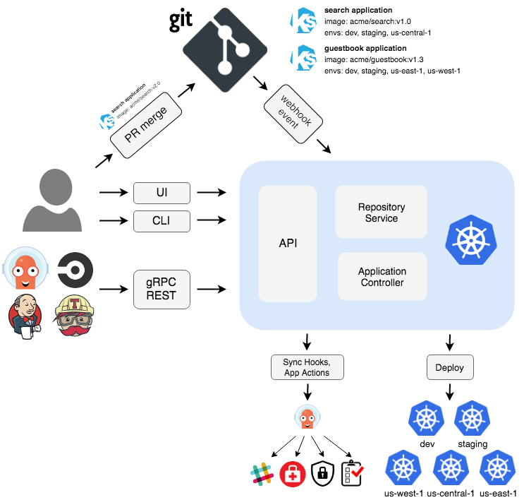

# 架构图

这张图非常清晰地描绘了ArgoCD作为GitOps工具的核心：以Git仓库为单一可信源。

**核心组件回顾（图中蓝色框内）**

1. **API Server**： 系统的入口，处理来自UI、CLI、Webhook的请求，并提供gRPC/REST API。
2. **Repository Service**： 负责克隆Git仓库、拉取应用配置清单（如Kubernetes YAML文件）。
3. **Application Controller**： 大脑所在。持续监控Git仓库（期望状态）和Kubernetes集群（实际状态），并在检测到差异时进行协调（同步）。

图中的工作流程主要由两种类型的触发方式驱动：**事件触发**和**用户主动触发**。

**触发方式一：Git变更事件触发（自动化流程）**

这是最经典的GitOps工作流，体现了“Git操作即部署指令”的理念。图中通过 `Search application`从 `v1.0`升级到 `v2.0`的例子完美展示了这一流程。

流程步骤：

1. 起点：代码变更（PR Merge）
   - 开发者将 `Search application`的镜像版本从 `acme/search:v1.0`更新为 `acme/search:v2.0`。
   - 这些变更通过创建并合并一个 Pull Request 提交到Git仓库的主分支。
2. 自动通知：Webhook事件
   - Git仓库（如GitHub/GitLab）配置了Webhook，在PR合并后会自动向ArgoCD的API Server发送一个`webhook event`。
   - 作用：这相当于告诉ArgoCD：“你监控的仓库有更新了，快去看看！”
3. 内部处理：状态获取与比较
   - API Server接收到Webhook事件后，会指示Repository Service去`git clone`（或`git pull`）最新的配置。
   - Application Controller开始工作：
     - 它从Repository Service获取Git中的期望状态（应用v2.0版本，部署到4个环境）。
     - 它通过Kubernetes API查询目标集群中的实际状态（应用仍是v1.0版本，只部署在3个环境）。
     - 比较后，它发现状态不同步。
4. 自动执行：部署同步
   - 如果该Application配置了自动同步，Application Controller会立即开始同步过程。
   - 它会计算出需要执行的操作（更新现有部署的镜像、在新的集群中创建资源）。
   - 最终，Application Controller通过Kubernetes API直接**部署**到各个目标集群，使集群状态与Git声明一致。

此触发方式的优势：全自动化，部署过程可追溯、可审计，确保了环境的一致性。

**触发方式二：用户手动触发（可控流程）**

这种方式给予运维人员更高的控制权，适用于生产环境或需要谨慎处理的部署。

流程步骤：

1. 状态监控：无论Git是否有变更，Application Controller都会持续监控状态。当用户发现UI上应用状态变为`OutOfSync`时，可以考虑进行同步。
2. 用户发起指令：用户通过以下方式与ArgoCD交互：
   - Web UI：在应用界面点击“Sync”按钮。
   - CLI：执行`argocd app sync <app-name>`命令。
   - 这些操作本质上都是通过**gRPC/REST**接口调用API Server。
3. 执行同步：
   - API Server将同步指令下达给Application Controller。
   - 后续的同步部署流程与自动化流程的第4步完全相同。
   - 在同步过程中，可以执行图中提到的**Sync Hooks**（用于数据库迁移、通知等）和**App Actions**（自定义操作）。

此触发方式的优势：人工审批，可控性强。可以在同步前预览变更内容，降低风险。

触发方式三：周期性同步（补充保障）

虽然图中没有直接画出“定时器”图标，但ArgoCD支持此功能，它是上述流程的补充。

- 原理：即使Webhook通知失败，Application Controller也会按照预设的时间间隔（例如每3分钟）自动执行一次“内部处理：状态获取与比较”的流程。
- 作用：作为Webhook机制的兜底方案，确保最终一致性。