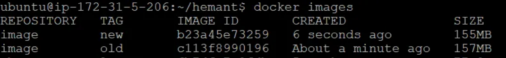

# 最小化镜像层

我们可以减少 Dockerfile 中的层数。

Dockerfile 中的每个 FROM、RUN、COPY 命令都会创建一个单独的层，并增加镜像的整体大小和构建时间。要减小 docker 镜像大小，请在单个 RUN 或 COPY 指令中执行多个命令来最小化 Dockerfile 中的层数。

```dockerfile
FROM ubuntu:latest
RUN apt update  - y
RUN apt install unzip - y
RUN apt install curl - y
RUN apt install python3 - y
```

与其对每个命令使用单独的指令，不如将它们组合起来：

```dockerfile
FROM ubuntu:latest
RUN apt update  -y && \
apt install unzip -y && \
apt install curl -y && \
apt install python3 -y
```

从下图中可以看出，通过减少层数，可以减少一些 MB 的大小。

