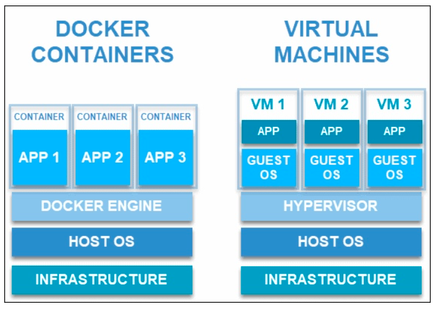

| 时间     | 版本 | 操作人 | 备注                               |
| -------- | ---- | ------ | ---------------------------------- |
| 20220826 | v1.0 | eden   | 梳理整体流程、删除不必要文字和样式 |
| 20240203 | v2.0 | eden   | 回顾docker基本结构                 |
| 20250526 |      |        | 贯穿路线                           |
| 20250927 |      |        | 复习，准备面试                     |


# 1. Docker基础

## Docker基本概念

### 初始Docker



从上图来看，每个虚拟机都有自己的完整的操作系统（上图的 GUEST OS 就是虚拟机的操作系统，但是此处，我们应该把它拆成两部分理解，GUEST OS是由其内核和运行环境包组成的），VM1虚拟机上的所有APP使用的是同一套运行库和内核，其他虚拟机同理，Hypervisor 层对硬件资源进行划分，各个虚拟机在整个操作系统发行版层面进行了隔离（注意，这里强调一下“发行版”三个字，以 linux 系统为例，组成一个“linux系统发行版”，首先需要有“linux内核”，其次还需要有相关软件依赖的运行环境软件包，比如说一些类库包、命令行工具等等，不同的 linux 发行版基于相同的linux内核开发，但是由于组成运行环境的包的不同，所以产生了不同的发行版，比如 ubuntu 和 centos 就是不同的linux发行版）。

而容器则不同，容器是将 APP 和其需要依赖的运行库打包成一个镜像，在 APP 进程和运行库层面进行了隔离（上图中CONTAINER中的 APP 就是应用程序镜像，这个镜像中包含应用本身和其需要的运行时依赖包），不同的APP各自使用自己的运行时环境，容器所运行的镜像中不需要内核，所有容器共用所在主机 HostOS 的内核，统一通过HostOS的内核与硬件进行交互，docker 就是运行在 HostOS 中的容器引擎。

理解了上图以后，我们就能明显感觉到它们的区别了，上图中最凸显的区别就是隔离层面的不同，虚拟机是针对整个系统发行版层面的隔离，而容器则是对程序进程和其依赖的运行环境的隔离，虚拟机的隔离性更强，隔离范围大，容器的隔离性没有虚拟机强，但是隔离范围更小，容器并不涉及Hypervisor层，它是一种进程隔离技术，从这个方面讲，它不应该算做“传统虚拟化”的范围，人们愿意把它称之为容器“虚拟化”技术。容器并不会取代虚拟机，它们之间也并不冲突，它们应该是相辅相成的。


### Docker架构


### 安装

#### 前提说明

Docker 运行在 CentOS 7 上，要求系统为64位、系统内核版本为 3.10以上。

Docker 运行在 CentOS-6.5 或更高的版本的 CentOS 上，要求系统为64位、系统内核版本为 2.6.32-431 或者更高版本。

> 查看自己的内核
> uname –r 命令用于打印当前系统相关信息（内核版本号、硬件架构、主机名称和操作系统类型等）。

#### docker基本组成

- docker主机(Host)：安装了Docker程序的机器（Docker直接安装在操作系统之上）；

- docker客户端(Client)：连接docker主机进行操作；

- docker仓库(Registry)：用来保存各种打包好的软件镜像；

- docker镜像(Images)：软件打包好的镜像；放在docker仓库中；

- docker容器(Container)：镜像启动后的实例称为一个容器；

Docker 镜像（Image）就是一个只读的模板。镜像可以用来创建 Docker 容器，一个镜像可以创建很多容器(形成集群)。容器是用镜像创建的运行实例。仓库（Repository）是集中存放镜像文件的场所。

仓库分为公开仓库(Public)和私有仓库(Private)两种形式。最大的公开仓库是 Docker Hub(https://hub.docker.com/)，存放了数量庞大的镜像供用户下载。国内的公开仓库包括阿里云 、网易云等。

#### centos7安装docker

> 可参考官网给出的安装教程：<https://docs.docker.com/install/linux/docker-ce/centos/>
>

确保 yum 包更新到最新：`yum -y update`

安装需要的软件包，`yum-util` 提供yum-config-manager功能，另外两个是devicemapper驱动依赖的

```
yum install -y yum-utils device-mapper-persistent-data lvm2
```

设置yum源，告诉yum在哪里去下载docker，如果指定国内镜像显然要快很多。

```bash
# 官方指定的
yum-config-manager --add-repo https://download.docker.com/linux/centos/docker-ce.repo
# 推荐使用国内的
yum-config-manager --add-repo https://mirrors.aliyun.com/docker-ce/linux/centos/docker-ce.repo
```

更新yum软件包索引

```bash
yum makecache fast
```

可以查看所有仓库中所有docker版本，并选择特定版本安装

```bash
yum list docker-ce --showduplicates | sort -r
```

安装docker

```bash
yum -y install docker-ce docker-ce-cli containerd.io  #由于repo中默认只开启stable仓库，故这里安装的是最新稳定版
```

设置一下阿里云镜像加速器（此步在安装完成之后设置！）如果直接从docker hub中拉取镜像的话因为服务器在国外就很慢，设置为国内镜像显然要快很多。

```shell
sudo mkdir -p /etc/docker
# 阿里云的镜像似乎不行了
sudo tee /etc/docker/daemon.json <<-'EOF'
{
  "registry-mirrors": ["https://atckcdf3.mirror.aliyuncs.com"]
}
EOF
sudo systemctl daemon-reload
sudo systemctl restart docker

# 可换用daocloud的镜像，但是还是会存在一些镜像无法拉取
sudo tee /etc/docker/daemon.json <<-'EOF'
{
  "registry-mirrors": ["https://docker.m.daocloud.io"]
}
EOF
```

启动并加入开机启动

```bash
systemctl start docker
systemctl enable docker
```

验证安装是否成功(有client和service两部分表示docker安装启动都成功了)

```bash
docker version
```

停止docker

```
systemctl stop docker
```

#### 卸载docker

```
systemctl stop docker

yum remove docker \
                  docker-client \
                  docker-client-latest \
                  docker-common \
                  docker-latest \
                  docker-latest-logrotate \
                  docker-logrotate \
                  docker-engine
```


#### 阿里云镜像加速

获取加速器地址


配置本机docker镜像加速

`vi /etc/docker/daemon.json`

```json
{
  "registry-mirrors": ["https://atckcdf3.mirror.aliyuncs.com"]
}
```

```bash
systemctl daemon-reload
systemctl restart docker
```

启动docker服务，测试运行：`docker run hello-world`

## Docker命令实战

### 基础实战

#### 找镜像

> 去[docker hub](http://hub.docker.com)，找到nginx镜像

```shell
docker pull nginx  #下载最新版

镜像名:版本名（标签）

docker pull nginx:1.20.1


docker pull redis  #下载最新
docker pull redis:6.2.4

## 下载来的镜像都在本地
docker images  #查看所有镜像

redis = redis:latest

docker rmi 镜像名:版本号/镜像id
```

#### 启动容器

> 启动nginx应用容器，并映射88端口，测试的访问

```shell
docker run [OPTIONS] IMAGE [COMMAND] [ARG...]

【docker run  设置项   镜像名  】 镜像启动运行的命令（镜像里面默认会有的，一般不会写）

# -d：后台运行
# --restart=always: 开机自启
docker run --name=mynginx   -d  --restart=always -p  8848:80   nginx


# 查看正在运行的容器
docker ps
# 查看所有
docker ps -a
# 删除停止的容器
docker rm  容器id/名字
docker rm -f mynginx   #强制删除正在运行中的

#停止容器
docker stop 容器id/名字
#再次启动
docker start 容器id/名字

#应用开机自启
docker update 容器id/名字 --restart=always
```


#### 修改容器内容

> 修改默认的index.html 页面

**1、进入容器内部修改**

```shell
# 进入容器内部的系统，修改容器内容
docker exec -it 容器id  /bin/bash

cd /usr/share/nginx/html
echo "<h1>Welcome to Eden</h1>" > index.html
```

**2、挂载数据到外部修改**

```shell
docker run --name=mynginx   \
-d  --restart=always \
-p  88:80 -v /data/html:/usr/share/nginx/html:ro  \
nginx

# 修改页面只能需要去 主机的 /data/html，因为容器对应目录使用ro（只读模式）
```

#### 提交改变

> 将自己修改好的镜像提交。这里有个非常重要的注意点：通过-v 挂载到宿主机启动容器后，如果基于目前的容器commit镜像，那么无法将-v的文件提交到新生成的镜像中！！！已实验证明
>

```
docker commit [OPTIONS] CONTAINER [REPOSITORY[:TAG]]

docker commit -a "leifengyang"  -m "首页变化" 341d81f7504f guignginx:v1.0

docker inspect 容器或镜像ID   查看容器或者镜像详细信息
```

**镜像传输**

```
# 将镜像保存成压缩包
docker save -o abc.tar guignginx:v1.0

# 别的机器加载这个镜像
docker load -i abc.tar

```

#### 推送远程仓库

> 推送镜像到docker hub；应用市场

```
docker tag local-image:tagname new-repo:tagname
docker push new-repo:tagname
```

```shell
# 把旧镜像的名字，改成仓库要求的新版名字
docker tag guignginx:v1.0 leifengyang/guignginx:v1.0

# 登录到docker hub
docker login       

docker logout（推送完成镜像后建议退出）

# 推送
docker push leifengyang/guignginx:v1.0


# 别的机器下载
docker pull leifengyang/guignginx:v1.0
```


### 整体命令流程图

> [docker | Docker Documentation](https://docs.docker.com/engine/reference/commandline/docker/)


#### Stop与Kill区别

`docker stop` 命令会向容器发送一个 SIGTERM 信号，然后等待一段时间（默认为10秒），给容器一个正常停止当前运行进程的机会。如果在这段等待时间之后容器仍然运行，它会发送一个 SIGKILL 信号来强制结束容器进程。由于 `docker stop` 会首先尝试正常关闭容器，所以它是停止容器的更优雅的方法，允许应用程序做一些清理工作或者优雅地关闭。

相比之下，`docker kill` 命令会直接向容器发送一个 SIGKILL 信号或者由用户指定的其他信号，立即停止容器。由于这种方式不给容器任何正常停止和清理自身的机会，可能会导致数据丢失或者其他未预料的后果。

在生产环境中，通常推荐先尝试 `docker stop` 来优雅地停止容器，只有在必要时（例如容器无法正常响应）才使用 `docker kill`。

#### Stop与Pause状态的区别

1. Stop 状态: 当容器处于Stop状态时，意味着容器内的所有进程都已经被停止，容器不再消耗CPU资源。但是，容器的文件系统会保留在宿主机上，因此容器的元数据和磁盘数据仍然存在，并且可以在将来重新启动容器。停止容器通常用于不再需要运行容器中的服务，或者为了释放系统资源。使用`docker stop`或者`docker kill`命令可以将容器置于Stop状态。
2. Pause 状态: 当容器处于Pause状态时，容器中的所有进程都会被暂停，即它们的执行将被暂时冻结，但是容器仍然保留在内存中，并且它的状态保持不变。这意味着容器可以快速恢复到运行状态（unpause）。暂停容器用于临时释放CPU资源，而不是完全停止容器。使用`docker pause`命令可以将容器置于Pause状态。

总结：

- Stop操作是将容器完全停止，释放CPU和内存资源，但保留容器的文件系统。
- Pause操作是临时冻结容器中的所有进程，暂时释放CPU资源，但不释放内存资源，并可以快速恢复到运行状态。

在实际使用中，如果你想要暂时停止容器，以便稍后可以快速恢复，那么使用Pause可能是更合适的选项。如果你想要长时间停止容器或者释放所有资源，那么使用Stop会更加合适。

#### 镜像的导入导出：export与import、save与load

**使用export与import**

- 这两个命令是通过容器来导入、导出镜像。首先我们使用`docker ps -a`命令查看本机所有的容器。
- 使用`docker export`命令根据容器 ID 将镜像导出成一个文件：`docker export f299f501774c > hangger_server.tar`,上面命令执行后，可以看到文件已经保存到当前的docker终端目录下。
- 使用`docker import`命令则可将这个镜像文件导入进来：`docker import - new_hangger_server < hangger_server.tar`，执行`docker images`命令可以看到`new_hangger_server`镜像确实已经导入进来了。

**使用save与load**

- 这两个命令是通过镜像来保存、加载镜像文件的。首先我们使用`docker images`命令查看本机所有的镜像。
- 下面使用`docker save`命令根据 ID 将镜像保存成一个文件：`docker save 0fdf2b4c26d3 > hangge_server.tar`；我们还可以同时将多个 image 打包成一个文件，比如下面将镜像库中的 postgres 和 mongo 打包：`docker save -o images.tar postgres:9.6 mongo:3.4`。
- 使用 `docker load` 命令则可将这个镜像文件载入进来：`docker load < hangge_server.tar`

**两种方案的区别**

1、是否包含镜像历史

- `docker export` 用于将容器的当前文件系统状态导出为一个 tar 归档文件，仅仅是容器文件系统的一个快照。
- `docker import` 用于从一个 tar 归档文件中创建一个新的 Docker 镜像。由于 `export` 出来的 tar 文件仅包含文件系统快照，因此通过 `import` 创建的新镜像不会携带任何原始镜像的历史或层信息。这意味着，使用这种方式迁移的镜像是无法进行回滚操作的。
- `docker save` 用于将一个或多个 Docker 镜像（包括它们的所有层、标签和元数据）保存到一个 tar 归档文件中。这样做可以保持镜像的完整历史和结构信息。
- `docker load` 用于从一个 tar 归档文件中加载一个或多个镜像，并且会重新创建镜像的所有层和标签。因为 `save` 出来的镜像包含了完整的历史记录和层信息，所以通过 `load` 加载的镜像可以回滚到之前的任何层。


#### -init层

使用docker inspect命令查看容器的详细信息，在详细信息的GraphDriver段可以看到容器的层信息

```shell
#如下命令的返回信息较长，横向拖动滚动条查看完整信息
[root@kvm32docker2 ~]# docker inspect nginx-demo1 | jq '.[].GraphDriver'
{
  "Data": {
    "LowerDir": "/var/lib/docker/overlay2/9cd5a29ca37a208659e5ce8954ed145019e91a1be2d28c257e1a46fc0166c5fe-init/diff:/var/lib/docker/overlay2/c664c481c1a39215cde43d969f2649d260e925ae8d36d8fdac92053635214b45/diff:/var/lib/docker/overlay2/d9a6541fa1de8d066aa9a8352cf6e172dff35e86c2f79951c246c2db4cb7db07/diff:/var/lib/docker/overlay2/777bcd6002d1dde7ab312f356f9a195c614a91704d009ee755b50c67ca0acb1f/diff:/var/lib/docker/overlay2/7992c0933aeffbd9ff62c628df59b8095df980f95faecac0160234ca300f1f9a/diff:/var/lib/docker/overlay2/e5064a8306c3cc0e995031a618ad16be571a78a72651a12d3f5eb88ffd456998/diff:/var/lib/docker/overlay2/7053cd873a61626df3fb61f2448bade40072d04167008db291a7de1162fa3093/diff",
    "MergedDir": "/var/lib/docker/overlay2/9cd5a29ca37a208659e5ce8954ed145019e91a1be2d28c257e1a46fc0166c5fe/merged",
    "UpperDir": "/var/lib/docker/overlay2/9cd5a29ca37a208659e5ce8954ed145019e91a1be2d28c257e1a46fc0166c5fe/diff",
    "WorkDir": "/var/lib/docker/overlay2/9cd5a29ca37a208659e5ce8954ed145019e91a1be2d28c257e1a46fc0166c5fe/work"
  },
  "Name": "overlay2"
}
```

在 `docker inspect` 命令输出中的 `GraphDriver` 段的 `LowerDir` 部分列出了容器的所有只读层（LowerDir），这些层是以冒号分隔的路径列表。在这个列表中，包含了一个以 `-init` 结尾的目录路径，这个 `-init` 层是 Docker 为每个新创建的容器设置的一个初始化层。

`-init`层实际上是在容器的基础镜像层之上，但在容器的可写层之下的一个特殊的临时层。它的作用包括：

- 为容器的启动过程设置一些初始化状态，例如网络配置文件（如 `/etc/hosts`、`/etc/hostname` 和 `/etc/resolv.conf`）。这些文件是根据容器的网络配置和启动参数动态生成的，它们对于容器的网络连接至关重要。这也就意味着当通过`docker commit`命令将容器提交为镜像时不会包含-init层！！！
- 作为容器的可写层（UpperDir）和只读镜像层（LowerDir）之间的一个中间层，有助于隔离容器的运行时更改。

当我们在容器中修改/etc/hosts文件时，会发现宿主机中的`/var/lib/docker/containers/容器ID/`目录下的hosts文件内容也发生了同样的变化，其实，docker就是将宿主机中的`/var/lib/docker/containers/容器ID/hosts`文件挂载到了容器中的，既然这些状态应该属于容器，那么当我们基于容器创建镜像时，就不应该把容器中的这些信息带入到新创建的镜像中，当我们使用`docker commit`命令基于容器创建镜像时，会把容器的可读写层变成新创建出的镜像的最上层，所以，如果容器的可读写层中包含hosts文件，新镜像中就会带入容器的hosts信息，而容器因为init层和挂载操作的存在，避免了这些信息进入到容器的可读写层，所以可以保障我们基于容器创建镜像时，得到的镜像是“纯净”的。


#### 游离镜像

重复提交相同的镜像名:tag 导致之前的那个镜像变成游离镜像，可通过docker image prune 删除原来的游离镜像。


```
docker logs 容器名/id   排错
docker exec -it 容器id /bin/bash

##################################################################
# docker 经常修改的文件，一般挂载到宿主机上面，方便修改
docker run -d -p 80:80 \
-v /data/html:/usr/share/nginx/html:ro \
-v /data/conf/nginx.conf:/etc/nginx/nginx.conf \
--name mynginx-02 \
nginx

####################################################################
#把容器指定位置的东西复制出来 
docker cp 5eff66eec7e1:/etc/nginx/nginx.conf  /data/conf/nginx.conf
#把外面的内容复制到容器里面
docker cp  /data/conf/nginx.conf  5eff66eec7e1:/etc/nginx/nginx.conf

###################################################################
# 镜像是怎么做成的。基础环境+软件
redis的完整镜像应该是： linux系统+redis软件
alpine：超级经典版的linux 5mb；+ redis = 29.0mb
没有alpine3的：就是centos基本版
# 以后自己选择下载镜像的时候尽量使用
alpine、slim

###################################################################
docker rmi -f $(docker images -aq) #删除全部镜像
docker image prune #移除游离镜像 dangling：游离镜像（没有镜像名字的）
docker tag 原镜像:标签 新镜像名:标签 #重命名

###################################################################
docker create [OPTIONS] IMAGE [COMMAND] [ARG...]
docker create [设置项] 镜像名 [启动] [启动参数...]   创建新容器，但并不启动
docker create redis                      : 按照redis:latest镜像启动一个容器

docker kill 是强制kill -9（直接拔电源）；
docker stop 可以允许优雅停机(当前正在运行中的程序处理完所有事情后再停止)

docker create --name myredis -p 6379（主机的端口）:6379（容器的端口） redis

docker run --name myredis2 -p 6379:6379 -p 8888:6379 redis       ：默认是前台启动的，一
般加上-d 让他后台悄悄启动, 虚拟机的很多端口绑定容器的一个端口是允许的
docker run -d == docker create + docker start 

#####################################################################
#启动了nginx；一个容器。要对nginx的所有修改都要进容器
如何进容器：
docker attach            绑定的是控制台. 可能导致容器停止。不要用这个

docker exec -it -u 0:0 --privileged mynginx4 /bin/bash         0用户，以特权方式进入容器
docker inspect docker对象

#####################################################################
# 一般运行中的容器会常年修改，我们要使用最终的新镜像
docker commit -a leifengyang -m "first commit" mynginx4 mynginx:v4
#把新的镜像放到远程docker hub，方便后来在其他机器下载


###############################export操作容器/import#################
docker export导出的文件被import导入以后变成镜像，并不能直接启动容器，需要知道之前的启动命令
（docker ps --no-trunc   就是command那一列），然后再用下面启动。
docker run -d -P 镜像名/镜像id 启动命令
或者docker image inspect 看之前的镜像，把 之前镜像的 Entrypoint的所有和 Cmd的连接起来就
能得到启动命令

#################################save/load-操作镜像##################
docker save -o busybox.tar busybox:latest 把busybox镜像保存成tar文件
docker load -i busybox.tar 把压缩包里面的内容直接导成镜像


##################################镜像为什么能长久运行#################
镜像启动一定得有一个阻塞的进程，一直干活。
docker run [OPTIONS] IMAGE [COMMAND] [ARG...]
docker run --name myredis2 -p 6379:6379 -p 8888:6379 redis  镜像启动以后做镜像里面默认规定的活。
docker run busybox		  运行这个镜像，由于没有进程干活，马上就退出了
docker run -it busybox     交互模式进入当前镜像启动的容器，这个时候容器需要保持这种交互模式，所以程序不会退出，自然容器一直在干活，所以不会退出。
docker run -d busybox ping www.baidu.com   后台启动busybox，增加启动命令，这样就有事情干了，就不会启动后立刻停掉。


#####################################产生镜像##########################
1、基于已经存在的容器，提取成镜像
2、人家给了我tar包，导入成镜像
3、做出镜像
-1)、准备一个文件Dockerfile
    FROM busybox
    CMD ping baidu.com
-2)、编写Dockerfile
-3)、构建镜像
docker build -t mybusy66:v6 -f Dockerfile .(这个点表示构建的上下文环境，后面详细介绍dockerfile构建镜像)


---做redis的镜像---
FROM alpine（基础镜像）
//下载安装包
//解压
//准备配置文件
CMD redis-server redis.conf


----------
build 是根据一个Dockerfile构建出镜像
commit 是正在运行中的容器提交成一个镜像
 
```

- 容器的状态
  Created（新建）、Up（运行中）、Pause（暂停）、Exited（退出） 
- docker run 可以立即启动，docker create 得稍后自己启动


**export和import**

通过`docker ps --no-trunc`获取完成启动命令


我们也可以通过`docker inspect 容器id`获得启动参数


把之前镜像的 Entrypoint的所有和 Cmd的连接起来就能得到启动命令。

# 2. 存储原理

## docker存储

> 参考文档 https://docs.docker.com/storage/storagedriver/


### 镜像如何存储

镜像究竟存储在哪里呢？

这部分内容建议学习：https://www.zsythink.net/archives/4345

### 容器如何挂载

> https://docs.docker.com/storage/volumes/


这部分内容建议学习：https://www.zsythink.net/archives/4362

### docker cp

cp的细节

> docker cp [OPTIONS] CONTAINER:SRC_PATH DEST_PATH ：把容器里面的复制出来 
>
> docker cp [OPTIONS] SRC_PATH CONTAINER:DEST_PATH：把外部的复制进去


# 3. 深入Dockerfile

一般而言，Dockerfile可以分为四部分：基础镜像信息、维护者信息、镜像操作指令、启动时执行指令

## 基本使用


编写好上面的Dockerfile文件之后，执行下面的命令即可构建镜像，注意我们文件名叫Dockerfile1，上下文环境就是当前目录，说明当前目录下存在Dockerfile1这个可以构建的文件。


### docker build命令

下面是一些常用的选项：

- `-t, --tag`：给创建的镜像设置一个标签，通常用于指定镜像的名字和标签，如 `myimage:latest`。
- `--build-arg`：设置构建时的变量，可以在 `Dockerfile` 中通过 `ARG` 指令使用这些变量。
- `--file, -f`：指定要使用的 `Dockerfile` 路径，如果不是默认的 `./Dockerfile`。
- `--no-cache`：构建镜像时不使用缓存，使得每一步都会重新执行。

**示例**

下面的解释终于让我明白了上下文目录的作用！！！，来自GPT

如果你当前位于 `/mydir` 目录，并且 `Dockerfile` 文件位于 `/data/test/MyDockerfile`，你可以使用 `-f` 或 `--file` 选项指定 `Dockerfile` 的路径，并且在 `docker build` 命令中指定上下文目录。上下文目录是 Docker 在构建镜像时用来寻找构建所需文件（如 `COPY`、`ADD` 指令所需的文件）的路径。

在这种情况下，你可以使用以下命令来构建你的镜像：

```sh
docker build -f /data/test/MyDockerfile -t myimage:latest /data/test/
```

这里 `-f /data/test/MyDockerfile` 指明了 `Dockerfile` 的路径，`-t myimage:latest` 为构建出的镜像设置了名称和标签，`/data/test/` 指定了上下文目录，Docker 将使用该目录中的文件和资源来构建镜像。

请留意，上下文目录 `/data/test/` 需要包含所有 `Dockerfile` 中引用的文件和目录。在执行 `docker build` 命令时，Docker 会将整个上下文目录发送到 Docker 守护进程，因此如果上下文目录包含大量不必要的文件，可能会导致构建过程变慢。因此，通常建议使用 `.dockerignore` 文件来排除不需要包含在上下文中的文件和目录。


## 指令详细说明

### FROM

在编写 Dockerfile 时使用 `FROM` 指令选择一个基础镜像（base image）是为了提供运行应用程序所需的用户空间环境，而不是提供操作系统内核。容器确实使用宿主机的内核，但是它们仍然需要一个用户空间来执行应用程序，这包括文件系统、系统库、工具和其他运行时组件。

以下是从基础镜像开始构建容器镜像的几个原因：

1. **系统库和工具**：许多应用程序需要标准的系统库和工具来运行，例如 C 标准库、shell、核心工具集等。基础镜像通常已经包含了这些基础组件。

2. **环境一致性**：基础镜像提供了一个一致的环境，使得不同开发者和环境之间的构建可以保持一致性，减少了 “在我机器上可以运行” 问题。

3. **依赖管理和打包**：提供了软件包管理器和打包系统（如 Debian 的 apt、Red Hat 的 yum），它们可以简化依赖管理和安装过程。

5. **方便和可扩展**：基础镜像提供了一个可以轻松构建和扩展来满足特定需求的起点。你可以在此基础上安装需要的软件、配置环境和添加应用程序文件。

6. **最小化和定制**：虽然基础镜像包含了一组标准组件，但是许多流行的基础镜像也提供了最小化版本，比如 Alpine Linux，它非常小巧，但仍然提供了必要的工具和库来运行很多应用程序。


因此，即使容器不包括内核，基础镜像在创建容器时仍然扮演着关键的角色，它们为应用程序提供了运行所需的环境和依赖。这也是为什么 Dockerfile 中几乎总是从一个基础 OS 镜像开始的原因。

### LABEL


###  RUN


run 和 cmd 之间什么区别呢？


### CMD 和 ENTRYPOINT

ENTRYPOINT 或者 CMD 作为唯一入口，只能写一个，最后一个生效。即：多个 CMD 只有最后一次生效，多个ENTRYPOINT 只有最后一次生效。

均可作为容器启动入口。cmd 可以通过 docker run 进行修改，而 entryporint 无法修改


两者结合使用最终效果图如下：


```dockerfile
# 官方推荐的写法，变化的写CMD，而CMD是提供参数给ENTRYPOINT
# docker run imageName  cmd1  一旦传递了cmd1，CMD指定的所有参数都会被覆盖，
# 自定义参数的情况下一定要传完
CMD [ "5","baidu.com" ]

# exec的写法 不变的写 ENTRYPOINT；未来他是容器启动的唯一入口，
ENTRYPOINT [ "ping","-c" ]
```

#### GPT

您的描述基本正确，让我更详细地解释一下 `ENTRYPOINT` 和 `CMD` 的使用以及它们之间的关系。

**CMD**

`CMD` 指令在 `Dockerfile` 中用于指定容器启动时默认执行的命令。如果定义了多个 `CMD` 指令，只有最后一个会生效。`CMD` 指令可以在运行容器时被 `docker run` 命令行提供的参数覆盖。

例如，如果你的 `Dockerfile` 包含：

```Dockerfile
CMD ["echo", "Hello"]
CMD ["echo", "World"]
```

只有 `CMD ["echo", "World"]` 会在容器启动时执行。

但是，如果运行容器时提供了额外的参数，如：

```bash
docker run myimage echo "Goodbye"
```

这将覆盖 `Dockerfile` 中的 `CMD`，容器将执行 `echo "Goodbye"`。

**ENTRYPOINT**

与 `CMD` 类似，`ENTRYPOINT` 用于指定容器启动时默认执行的命令。如果定义了多个 `ENTRYPOINT`，同样只有最后一个生效。不过，与 `CMD` 不同的是，`ENTRYPOINT` 指令不会被 `docker run` 提供的命令行参数直接覆盖，而是将这些参数作为 `ENTRYPOINT` 指定命令的参数。

例如，如果你的 `Dockerfile` 包含：

```Dockerfile
ENTRYPOINT ["echo", "Hello"]
ENTRYPOINT ["echo", "World"]
```

只有 `ENTRYPOINT ["echo", "World"]` 会在容器启动时执行。

现在，运行容器并提供额外的参数：

```bash
docker run myimage Goodbye
```

这将执行 `echo World Goodbye`，因为 `Goodbye` 被添加为了 `echo World` 命令的参数。

**组合使用 CMD 和 ENTRYPOINT**

`CMD` 和 `ENTRYPOINT` 可以组合使用。当两者一起使用时，`CMD` 提供的参数会成为 `ENTRYPOINT` 指定命令的默认参数。如果在运行容器时提供了额外的命令行参数，那么它们将替换掉 `CMD` 中的默认参数。

例如：

```Dockerfile
ENTRYPOINT ["echo"]
CMD ["Hello"]
```

如果运行容器时没有提供任何参数：

```bash
docker run myimage
```

那么默认执行的命令将是 `echo Hello`。

但如果提供了参数：

```bash
docker run myimage World
```

那么执行的命令将变成 `echo World`，参数 "World" 替换了 `CMD` 中的 "Hello"。

**修改 ENTRYPOINT**

虽然通常不修改 `ENTRYPOINT`，但实际上可以在 `docker run` 时使用 `--entrypoint` 选项进行覆盖：

假设你有一个 Docker 映像，`Dockerfile` 中定义了如下 `ENTRYPOINT`：

```
ENTRYPOINT ["echo", "World"]
```

如果你想覆盖这个 `ENTRYPOINT`，在运行时指定一个不同的命令，可以使用 `--entrypoint`：

```bash
docker run --entrypoint /bin/bash myimage -c "echo Hello, Goodbye"
```

- `--entrypoint /bin/bash`：指定新的 `ENTRYPOINT` 为 `/bin/bash`。
- `myimage`：要运行的 Docker 镜像名称。
- `-c "echo Hello, Goodbye"`：传递给新 `ENTRYPOINT` 的参数，这里是 `/bin/bash` 的参数，用于执行 `echo Hello, Goodbye`。

总结：`CMD` 和 `ENTRYPOINT` 是定义容器启动行为的 `Dockerfile` 指令，它们可以单独使用或组合使用。`CMD` 可以被 `docker run` 的命令行参数直接覆盖，而 `ENTRYPOINT` 则不会被直接覆盖，但可以使用 `--entrypoint` 选项来修改。


### ARG和ENV

#### arg基本使用

注意ARG不能在运行时生效，只能在构建时生效。

我们在使用 docker build 构建镜像的时候可以通过 --build-arg 参数传递 arg 变量值。可以添加`--no-cache` 不使用缓存


#### env基本使用

```dockerfile
#可以在任意位置定义，并在以后取值使用，
#使用--build-arg version=3.13 改变；以我们传入的为准
ARG version=3.13.4
# 3.13  
FROM alpine:$version

LABEL maintainer="leifengyang" a=b \
c=dd

#构建期+运行期都可以生效；但是只能在运行期进行修改
#怎么修改：构建期修改和运行期修改
#构建期不能改 ENV的值
#运行期：docker run -e app=atguigu 就可以修改
ENV app=itdachang


##测试构建期间生效
RUN echo $app

# 定义以后的剩下环节（不包括运行时）能生效：取值$param；
#可以在构建时进行变化，docker build
ARG msg="hello docker"

RUN echo $msg

#运行时期我们会运行的指令(根据之前创建的镜像启动一个容器，容器启动默认运行的命令)
#（docker run/docker start）
# CMD和ENTRYPOINT` 都是指定的运行时的指令
CMD ["/bin/sh","-c","echo 1111;echo app_${app}"]
```

#### GPT介绍

在Docker中，`ARG`和`ENV`是用来设置变量的两个不同的指令，它们在`Dockerfile`中有不同的使用场景和目的。

**ARG**

`ARG` 指令用于定义构建时变量，它们在Docker镜像构建过程中使用。这些变量在构建完成后不会保留在最终的镜像中。你可以在命令行中使用 `docker build` 命令时通过 `--build-arg` 标志来传递这些变量的值。

例如，你可以在 `Dockerfile` 中这样使用 `ARG`：

```Dockerfile
# 设置默认值，当然可以不用设置默认值，但是docker build构建时必须通过--build-arg VERSION=3.20传入参数值
ARG VERSION=latest

# 使用ARG设置的变量来作为其他指令的参数
FROM alpine:${VERSION}

# ARG可以在FROM之后重新定义，以在后续步骤中使用
ARG VERSION
RUN echo $VERSION
```

然后在构建时使用：

```bash
docker build --build-arg VERSION=3.20 -t test:v1 -f Dockerfile .
# => [1/2] FROM docker.io/library/alpine:3.20
# => [2/2] RUN echo 3.20  

docker build --build-arg VERSION=3.20 --build-arg TEST=1.1 -t test:v1 -f Dockerfile .
# 并没有警告信息，不影响构建
```

**ENV**

`ENV` 指令用于设置环境变量，这些变量会被包含在镜像中，并且可以在容器运行时使用。它们通常用于提供运行时配置，例如数据库的地址、端口号或其他服务的配置信息。

下面是如何在 `Dockerfile` 中使用 `ENV`：

```Dockerfile
FROM alpine:latest
# 设置环境变量
ENV APP_HOME /root/data

# 使用ENV设置的环境变量
WORKDIR $APP_HOME
COPY . $APP_HOME
```

当你基于这样的 `Dockerfile` 创建并运行容器时，`APP_HOME` 环境变量将可用于容器内部。

**区别**

- `ARG` 是用于构建过程，一旦镜像构建完成，与之相关的变量就不可用了。
- `ENV` 是用于运行时，它设置的环境变量会成为最终镜像的一部分，并且在容器运行时可用。
- `ARG` 变量在构建时可以通过命令行参数 `--build-arg` 传递值，而 `ENV` 变量的值通常在 `Dockerfile` 中定义，但也可以在运行时通过 `docker run` 命令的 `-e` 或 `--env` 选项覆盖。

选择使用 `ARG` 或 `ENV` 取决于你是否希望变量在构建之后持续存在，以及这些变量是仅用于构建过程还是需要在应用运行时提供配置。


### ADD和COPY

```dockerfile
FROM alpine

# 把上下文指定的内容添加到镜像中，如果是压缩包，自动解压，
# 如果是远程文件，自动下载；
# 如果是压缩包，自动解压；
ADD https://download.redis.io/releases/redis-6.2.1.tar.gz  /dest/

# 自动解压
ADD *.tar.gz   /app/
# RUN ls -l

# 不自动解压和下载
COPY  *.tar.gz  /redis/

# RUN指令上下并没有上下文关系！！！！！！！！！！！！！！！！！！！！！！！！！！！！！
# RUN cd /dest
# 当前还是列举的根目录
# RUN ls -l

RUN cd /dest && ls -l
RUN cd /app && ls -l
RUN cd /redis && ls -l
```


### USER


### WORKDIR和VOLUME

#### WORKDIR

先看看WORKDIR基本使用：

```dockerfile
FROM alpine
# 默认是根目录
RUN pwd && ls -l
# 为以下所有的命令运行指定了基础目录
WORKDIR /app
# 可以为进入容器指定一个默认目录
WORKDIR abc
# /app/abc  多个WORKDIR可以嵌套
RUN pwd && ls -l

##比如我们的nginx镜像可以做成这样
#WORKDIR /usr/share/nginx/html

#复制到当前目录下
COPY *.txt   ./
RUN  pwd && ls -l
# 通过exec -it 进入容器，所在位置就是workdir指定的路径
CMD ping baidu.com
```

##### GPT

在 Dockerfile 中，`WORKDIR` 指令用来设置工作目录，也就是接下来的 `RUN`, `CMD`, `ENTRYPOINT`, `COPY` 和 `ADD` 指令的执行环境路径。如果指定的工作目录不存在，Docker 会自动为你创建这个目录。

这个指令主要用来改变当前工作目录。类似于在命令行中使用 `cd` 命令切换目录。设置工作目录可以让你在构建 Docker 镜像的后续命令中使用相对路径，从而使 Dockerfile 更易于阅读和维护。

**使用 WORKDIR**

下面是一个简单的例子，展示了如何在 Dockerfile 中使用 `WORKDIR`：

```Dockerfile
# 设置工作目录为 /app
WORKDIR /app

# 以下指令中的相对路径都是基于 /app 目录
# 将构建上下文中的所有文件和目录复制到镜像的当前工作目录下
COPY . .

# 运行命令时也是在 /app 目录下
RUN npm install

CMD ["node", "server.js"]
```

在这个例子中，`WORKDIR /app` 指令设置了工作目录为 `/app`。后续的 `COPY`, `RUN` 和 `CMD` 命令都是在这个目录下执行。

**注意事项**

1. 使用 `WORKDIR` 指令可以避免多次使用 `RUN cd` 并且配合其他命令，这样不仅可以减少层数，还可以使 Dockerfile 更清晰。
2. 如果指定了多个 `WORKDIR` 指令，每个 `WORKDIR` 会基于前一个 `WORKDIR` 的路径。例如：
   ```Dockerfile
   WORKDIR /a
   WORKDIR b
   WORKDIR c
   # 最终的工作目录是 /a/b/c
   ```
3. 推荐使用绝对路径作为 `WORKDIR` 的参数，这样可以避免混淆和依赖前面的 `WORKDIR` 指令。
4. 使用 `WORKDIR` 也是一种 Dockerfile 的最佳实践，可以增强可读性和可维护性。


#### VOLUME

我们先看一个最简单的案例


然后我们 inspect 容器看看挂载信息


下面说明非常重要：

```dockerfile
FROM alpine

RUN mkdir /hello && mkdir /app
RUN echo 1111 > /hello/a.txt
RUN echo 222 > /app/b.txt

# 使用 VOLUME 和 -v 挂载出去的目录。
# 1) 通过 docker commit 提交当前容器的所有变化为镜像的时候，就会丢弃。当删除容器时挂载到主机的内容仍保存未删除
# 2）VOLUME [ "/hello","/app" ]  启动容器以后自动挂载，之后在Dockerfile中对VOLUME的所有修改都不生效

# 所以这个指令一般都写在最后，应用场景一般都是把容器的log挂载出去，这样commit镜像时候不会将日志也保存到镜像中。


VOLUME [ "/hello","/app" ]
# VOLUME 指定的挂载目录


# 暴露 ，这个只是一个声明；主要给程序员看。
# 启动容器时通过 -P 选项随机将宿主机的端口和EXPOSE指定的端口进行映射： docker -d -P（随机分配端口）
EXPOSE 8080
EXPOSE 999

# 
CMD ping baidu.com
```

##### GPT

`VOLUME` 指令用于在 Dockerfile 中定义匿名卷。当你创建一个容器时，Docker 会根据 Dockerfile 中的 `VOLUME` 指令自动挂载卷到容器内指定的路径。卷是 Docker 用于持久化和共享数据的一种机制，它不会随容器删除而丢失，并且可以在容器之间共享。

**使用 VOLUME**

以下是一个简单的 Dockerfile 示例，它在 `/data` 目录下定义了一个卷：

```Dockerfile
VOLUME /data
```

这条指令意味着每次使用这个镜像创建容器时，Docker 都会创建一个新的匿名卷，并将其挂载到容器的 `/data` 目录。由于卷是独立于容器的，因此在 `/data` 目录下创建的数据将在容器删除后仍然保留。

**注意事项**

1. `VOLUME` 指令可以指定一个或多个卷的挂载路径。如果要指定多个卷，可以使用 JSON 数组格式：
   
   ```Dockerfile
   VOLUME ["/data", "/backup"]
   ```
2. `VOLUME` 指令创建的是匿名卷。这意味着卷的名称由 Docker 随机生成，而不是由用户指定。
3. 在容器运行时，可以使用 `docker run` 命令的 `-v` 或 `--volume` 选项来覆盖 Dockerfile 中通过 `VOLUME` 指令定义的卷。这允许将宿主机上的目录或已命名卷挂载到容器中。（你需要确保 `-v` 指定的容器目录与 `VOLUME` 定义的目录相同。）
4. 一旦 `VOLUME` 指令在 Dockerfile 中定义，之后的任何写入到这个卷的操作（如 COPY 或 RUN 指令）都不会更改镜像的内容。这是因为卷的内容在容器运行时才会被初始化。

**最佳实践**

不良示例：在构建过程中向卷中添加大量数据

假设我们有以下 `Dockerfile`：

```dockerfile
FROM alpine
VOLUME /app/data
COPY big-data-file /app/data/
RUN echo "hello" > /app/data/greeting
```

这里的 `COPY` 指令尝试在构建过程中向定义为卷的 `/app/data` 路径添加一个大文件（`big-data-file`）。然而，由于 `/app/data` 被定义为卷，所以在构建过程中对其的修改（如`COPY`、`RUN`指令添加的文件）实际上不会反映在最终的镜像中。这意味着 `big-data-file` 不会包含在镜像内，且这个操作只会增加镜像构建时的时间。

当启动容器时，Docker 会在容器内部为 `/app/data` 目录创建一个匿名卷，但是并不会存在`/app/data/greeting` 文件，因为我们之前在 `Dockerfile` 中往卷中写入的内容不会被保留。实际上，如果我们进入到容器内部查看 `/app/data/greeting` 文件，将会发现它不存在。

那 VOLUME 指令的意义是什么，如何正确的使用它？

当你确定一个目录需要用于存储持久化数据（如数据库文件、配置文件、日志等），你可以在 `Dockerfile` 中使用 `VOLUME` 来指定这个目录：

```
FROM alpine
RUN mkdir /app
VOLUME /app/data
```

在这个例子中，`/app/data` 被定义为一个卷，用于存储持久化数据。

然后，当你需要运行基于这个镜像的容器时，你有几个选择：

1. **不指定挂载**：如果在运行容器时没有指定挂载点，Docker 会自动为卷创建一个匿名卷。匿名卷被挂载到 Docker 主机的某个目录，但不容易管理，因为它们没有具体的名称。这称之为“匿名卷”。

   ```
   docker run -d --name myapp myimage
   ```

2. **挂载宿主机目录**：你可以指定一个宿主机目录作为卷的挂载点，这样容器中卷的数据就会存储在宿主机的这个目录中。这称之为“绑定挂载”。

   ```
   docker run -d --name myapp -v /path/on/host:/app/data myimage
   ```

3. **使用命名卷**：你也可以为卷创建一个名称，以便于管理和引用。

   ```
   docker run -d --name myapp -v named-volume:/app/data myimage
   ```

总的来说，`VOLUME` 指令的意义在于为容器提供一个与容器生命周期独立的数据存储空间，而正确的使用方法取决于你如何管理这些卷以及你的数据持久化需求。不应在 `Dockerfile` 中往卷中添加数据，而是应当在容器运行时通过挂载来提供数据。


### EXPOSE

我们使用上面的dockerfile文件，然后运行`docker -d -P`随机分配端口，ps 看看：


可以看到主机给暴露的端口做了映射。


### 多阶段构建

**1. 是什么？**

Docker多阶段构建（Multi-stage Build）允许在一个 `Dockerfile`中定义多个**构建阶段**（通常用 `FROM`语句标识）。每个阶段从一个基础镜像开始，执行一系列指令，并可以将其产出物有选择地复制到后续阶段。最终镜像仅包含最后一个阶段的内容。

**2. 为什么需要？（解决什么问题？）**

核心痛点：构建环境与运行环境的需求不同。

- **构建环境**：需要编译器、构建工具、开发库等。例如，您的示例中 `maven:3.6.1-jdk-8-alpine`提供了Maven和JDK（含编译器），用于将源代码编译打包成 `app.jar`。这个镜像通常比较大。
- **运行环境**：只需要运行时的依赖。例如，您的示例中 `openjdk:8-jre-alpine`仅包含JRE（Java运行时环境），足以运行 `app.jar`。这个镜像非常小巧。

如果没有多阶段构建，传统做法通常有两种，都有明显缺陷：

- **单阶段构建**：在同一个镜像中包含构建和运行环境，导致最终镜像极其臃肿，包含了大量运行时不需要的软件，增加了安全风险和传输部署成本。
- **脚本分离构建**：在Docker外部先用本地工具构建，再通过 `Dockerfile`的 `COPY`将构建产物（如jar包）加入镜像。这要求维护者本地环境和CI/CD环境必须一致，**破坏了容器化“可重现构建”的初衷**。

**可重现构建**

“可重现构建”（Reproducible Build）指的是：在任何时间、任何地点（不同的开发机器、不同的CI/CD服务器），只要给定同一份源代码和同一个构建命令，就能得到完全相同的、比特位级别一致的构建产物（比如jar包）。


 这是构建一个springboot项目的文件结构


```dockerfile
FROM  maven:3.6.1-jdk-8-alpine AS buildapp
# 指定工作路径
WORKDIR /app
# 从宿主机copy文件到/app目录下
COPY pom.xml .
COPY src .

RUN mvn clean package -Dmaven.test.skip=true

# /app 下面有 target
RUN pwd && ls -l

RUN cp /app/target/*.jar  /app.jar
RUN ls -l
### 以上第一阶段结束，我们得到了一个 app.jar


## 运行jar包其实只要一个JRE
FROM openjdk:8-jre-alpine

RUN ln -sf /usr/share/zoneinfo/Asia/Shanghai /etc/localtime && echo 'Asia/Shanghai' >/etc/timezone
LABEL maintainer="534096094@qq.com"
# 把上一个阶段的东西复制过来
COPY --from=buildapp /app.jar  /app.jar

# docker run -e JAVA_OPTS="-Xmx512m -Xms33 -" -e PARAMS="--spring.profiles=dev --server.port=8080" -jar /app/app.jar 
# 启动java的命令
ENV JAVA_OPTS=""
ENV PARAMS=""
ENTRYPOINT [ "sh", "-c", "java -Djava.security.egd=file:/dev/./urandom $JAVA_OPTS -jar /app.jar $PARAMS" ]
```

您的Dockerfile清晰地展示了两个阶段：

**第一阶段：构建阶段（标签：`buildapp`）**

```dockerfile
FROM maven:3.6.1-jdk-8-alpine AS buildapp # 1. 基础镜像是包含Maven和JDK的构建环境
WORKDIR /app
COPY pom.xml .
COPY src .                              # 2. 复制源代码
RUN mvn clean package -Dmaven.test.skip=true # 3. 执行Maven命令，编译打包生成jar包
RUN cp /app/target/*.jar  /app.jar      # 4. 将生成的jar包复制到根目录，方便下一阶段提取
```

- 目的：在隔离的容器环境中，可靠地生成构建产物 `app.jar`。
- 特点：此阶段结束后，会产生一个中间镜像，其中包含源代码、Maven、JDK、编译产生的`target/`目录等。这些在最终镜像中都不会存在。

**第二阶段：运行阶段（最终阶段）**

```dockerfile
FROM openjdk:8-jre-alpine # 1. 基础镜像是仅包含JRE的轻量级运行环境
RUN ln -sf /usr/share/zoneinfo/Asia/Shanghai /etc/localtime && echo 'Asia/Shanghai' >/etc/timezone # 2. （优化项）设置容器时区
LABEL maintainer="534096094@qq.com"
COPY --from=buildapp /app.jar /app.jar # 3. 【关键操作】从上一阶段（buildapp）复制仅需要的jar包
ENV JAVA_OPTS=""
ENV PARAMS=""
ENTRYPOINT [ "sh", "-c", "java -Djava.security.egd=file:/dev/./urandom $JAVA_OPTS -jar /app.jar $PARAMS" ] # 4. 启动应用
```

- 目的：创建一个用于生产环境部署的最小化镜像。
- 特点：通过 `COPY --from=buildapp`这个“魔法指令”，它只从庞大的上一阶段中取走了唯一需要的文件——`/app.jar`。最终镜像不包含源代码、Maven、JDK，甚至不包含第一阶段的`target`目录，极其精简和安全。


## 生成更小的镜像

- 选择最小的基础镜像 
- 合并RUN环节的所有指令，少生成一些层 
- RUN期间可能安装其他程序会生成临时缓存，要自行删除。如：

```dockerfile
RUN apt-get update && apt-get install -y \
    bzr \
    cvs \
    git \
    mercurial \
    subversion \
    && rm -rf /var/lib/apt/lists/*
```

- 使用 `.dockerignore` 文件，排除上下文中无需参与构建的资源
- 使用多阶段构建
- 合理使用构建缓存加速构建。

# 4. Docker网络

> docker网络官网 https://docs.docker.com/network/

## 1、计算机网络模型


## 2、Linux中网卡

### 2.1 查看网卡[网络接口]

> 01-	ip link show 
>
> 02-	ls /sys/class/net 
>
> 03-	ip a


### 2.2 网卡

#### 2.2.1 ip a解读

> 状态：UP/DOWN/UNKOWN等 
>
> link/ether：MAC地址 
>
> inet：绑定的IP地址

#### 2.2.2 配置文件

> 在Linux中网卡对应的其实就是文件，所以找到对应的网卡文件即可 
>
> 比如：cat /etc/sysconfig/network-scripts/ifcfg-eth0

#### 2.2.3 给网卡添加IP地址

```
当然，这块可以直接修改ifcfg-*文件，但是我们通过命令添加试试

(1)ip addr add 192.168.43.100/24 dev enp0s3
(2)删除IP地址
	ip addr delete 192.168.43.100/24 dev enp0s3
```


给网卡新增IP地址后，我们使用另一台虚拟机看看是否可以ping通


可以发现完全没有问题。

#### 2.2.4 网卡启动与关闭

```
重启网卡 ：service network restart / systemctl restart network
启动/关闭某个网卡 ：ifup/ifdown eth0    or     ip link set eth0 up/down
```

## 3、Network Namespace

### 3.0 ip netns简介

我们可以使用`ip`命令对network namespace进行操作，`ip`命令来自于iproute安装包，一般系统会默认安装`ip`命令。使用`ip`命令需要root权限。

`ip netns`命令创建的 netns 会出现在`/var/run/netns/`目录下，如果想管理不是由`ip netns`管理的netns的话，需要创建文件链接，链接被管理的netns文件到`/var/run/netns/`目录下。

每个netns都有自己的网卡、路由表、ARP 表、iptables 等。可以通过`ip netns exec NAMESPACE COMMAND` 子命令进行查看，该命令允许我们在特定的netns下执行任何命令，不仅仅是网络相关的命令。我们可以利用这个命令查看red的netns下都有些什么：

```bash
# 查看red里面的路由表（目前是空的）
$ ip netns exec red route -n
Kernel IP routing table
Destination     Gateway         Genmask         Flags Metric Ref    Use Iface

# 查看red里面的网卡
$ ip netns exec red ip addr
1: lo: <LOOPBACK> mtu 65536 qdisc noop state DOWN group default qlen 1000
    link/loopback 00:00:00:00:00:00 brd 00:00:00:00:00:00

# 查看red里面的arp表（目前是空的）
$ ip netns exec red arp
$ 
```

在linux上，网络的隔离是通过network namespace来管理的，不同的network namespace是互相隔离的 

```
ip netns list #查看当前机器上的network namespace
ip netns add ns1 #添加 
ip netns delete ns1 #删除
```


### 3.1 namespace实战

```
(1)创建一个network namespace
ip netns add ns1

(2)查看该namespace下网卡的情况
ip netns exec ns1 ip a

(3)启动ns1上的lo网卡
ip netns exec ns1 ifup lo
or
ip netns exec ns1 ip link set lo up

(4)再次查看  可以发现state变成了UNKOWN
ip netns exec ns1 ip a

(5)再次创建一个network namespace
ip netns add ns2
并启动ns2上的lo网卡
ip netns exec ns2 ifup lo
```


```
(6)此时想让两个namespace网络连通起来
veth pair ：Virtual Ethernet Pair，是一个成对的端口，可以实现上述功能
```


```
(7)创建一对link，也就是接下来要通过veth pair连接的link
ip link add veth-ns1 type veth peer name veth-ns2

(8)查看link情况
ip link show
```


```
(9)将veth-ns1加入ns1中，将veth-ns2加入ns2中
ip link set veth-ns1 netns ns1
ip link set veth-ns2 netns ns2

(10)查看宿主机和ns1，ns2的link情况
ip link show
ip netns exec ns1 ip link
ip netns exec ns2 ip link
```


```
(11)此时veth-ns1和veth-ns2还没有ip地址，显然通信还缺少点条件
ip netns exec ns1 ip addr add 192.168.0.11/24 dev veth-ns1
ip netns exec ns2 ip addr add 192.168.0.12/24 dev veth-ns2

(12)再次查看，发现state是DOWN
ip netns exec ns1 ip a
ip netns exec ns2 ip a

(13)启动veth-ns1和veth-ns2
ip netns exec ns1 ip link set veth-ns1 up
ip netns exec ns2 ip link set veth-ns2 up

(14)再次查看，发现state是UP，同时有IP
ip netns exec ns1 ip a
ip netns exec ns2 ip a

(15)此时两个network namespace互相ping一下，发现是可以ping通的
ip netns exec ns1 ping 192.168.0.12
ip netns exec ns2 ping 192.168.0.11
```


### 3.1.0 route和arp解析

> https://zhuanlan.zhihu.com/p/199298498


```bash
# 开启veth-red，赋予它IP地址192.168.15.1，子网掩码为255.255.255.0
$ ip netns exec red ip addr add 192.168.15.1/24 dev veth-red
$ ip netns exec red ip link set veth-red up

# 开启veth-blue，赋予它IP地址192.168.15.2，子网掩码为255.255.255.0
$ ip netns exec blue ip addr add 192.168.15.2/24 dev veth-blue
$ ip netns exec blue ip link set veth-blue up
```

到目前为止，我们完成了red和blue的链接。查看red的路由表我们发现了一条自动添加的路由记录，gateway为0.0.0.0，表示发往192.168.15.0/24的数据包无需路由，走veth-red网卡出站。 相应的blue的路由表中也自动添加了一条类似的记录，只不过出站网卡为veth-blue。

```bash
$ ip netns exec red route -n
Kernel IP routing table
Destination     Gateway         Genmask         Flags Metric Ref    Use Iface
192.168.15.0    0.0.0.0         255.255.255.0   U     0      0        0 veth-red

$ ip netns exec blue route -n
Kernel IP routing table
Destination     Gateway         Genmask         Flags Metric Ref    Use Iface
192.168.15.0    0.0.0.0         255.255.255.0   U     0      0        0 veth-blue
```

分别查看red和blue的arp表，我们发现blue的arp表中出现了red的ip地址以及MAC地址记录，相应的red的arp表中也出现了blue的记录。

```bash
$ ip netns exec blue arp
Address                  HWtype  HWaddress           Flags Mask            Iface
192.168.15.1             ether   12:0a:79:4f:f4:67   C                     veth-blue
$ ip netns exec red arp
Address                  HWtype  HWaddress           Flags Mask            Iface
192.168.15.2             ether   e2:4b:50:d3:14:0d   C                   veth-red
```

整个`ip netns exec red ping 192.168.15.2`命令的执行过程可以总结如下：

1. 在red的命名空间中，根据`ping`的目标地址`192.168.15.2`，查询red的路由表得知，`192.168.15.2`就在本地网络中，无需路由；
2. red先在自己的arp表中查询`192.168.15.2`的MAC地址，发现没有记录（新建的命名空间arp表都是空的），于是发起ARP广播到本地网络，询问`192.168.15.2`的MAC地址；
3. blue收到red发起的ARP 询问，回复自己的MAC地址。red收到回复后，填上目的MAC地址为blue的MAC地址，将数据包从veth-red网卡发出，与此同时，red还在自己的arp表中缓存blue的MAC地址，以方便以后继续访问；
4. blue从veth-blue收到red发来的数据包后，也在自己的arp中缓存red的MAC地址，并且通过veth-blue给red发送ping的response。

到此为止我们的网络拓扑结构为：


### 3.1.1 使用brigde连接不同的namespace

在上文中，我们用`veth pair`实现了2个namespace之间的连接。但如果2个以上的namespace 需要互相连通的，用`veth pair`就有点力不从心了。在现实网络中，如果需要连通多个相同网络中的设备，我们会用到交换机，相应的，linux也提供虚拟的交换机也就是bridge 。我们可以使用bridge作为中转站来连通多个相同网络的namespace，打造出一个虚拟的LAN。首先放出我们将要实现的网络拓扑图：


整个`ip netns exec red ping 192.168.15.2`命令的执行过程可以总结如下：

1. 在red的命名空间中，根据ping的目标地址192.168.15.2，查询red的路由表得知，192.168.15.2就在本地网络中，无需路由；
2. red先在自己的arp表中查询192.168.15.2的MAC地址，发现没有记录，于是发起ARP广播到本地网络，询问192.168.15.2的MAC地址；
3. blue通过vbridge-0收到red发起的ARP 询问，回复自己的MAC地址。red收到回复后，填上目的MAC地址为blue的MAC地址，将数据包从veth-red网卡发出，与此同时，red还在自己的arp表中缓存blue的MAC地址，以方便以后继续访问；
4. vbridge-0从veth-red-br收到数据包后，转发（FORWARD）给veth-blue-br；
5. blue从veth-blue收到red发来的数据包后，也在自己的arp中缓存red的MAC地址，并且通过veth-blue给red发送ping的response。

到目前为止，我们完成了red <--> vbridge-0 <--> blue的网络拓扑结构，有了brigde以后，如果我们想要在192.168.15.0/24网络中增加新的netns，并且使他与现有的netns能够连通，我们只需让新的netns与bridge连通即可。


### 3.2 Container的NS

```
按照上面的描述，实际上每个container，都会有自己的network namespace，并且是独立的，我们可以进入
到容器中进行验证

(1)不妨创建两个container看看？
docker run -d --name tomcat01 -p 8081:8080 tomcat
docker run -d --name tomcat02 -p 8082:8080 tomcat

(2)进入到两个容器中，并且查看ip
docker exec -it tomcat01 ip a
docker exec -it tomcat02 ip a

(3)互相ping一下是可以ping通的
值得我们思考的是，此时tomcat01和tomcat02属于两个network namespace，是如何能够ping通的？
有些小伙伴可能会想，不就跟上面的namespace实战一样吗？注意这里并没有veth-pair技术
```


​                                              