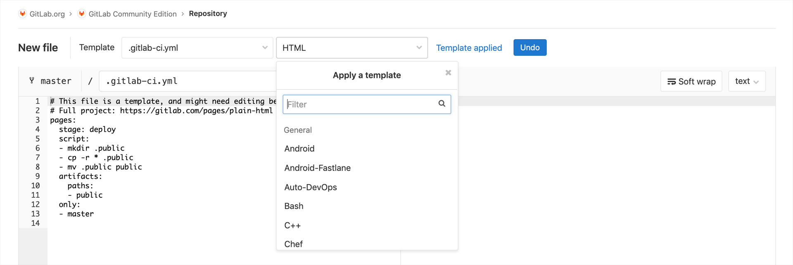
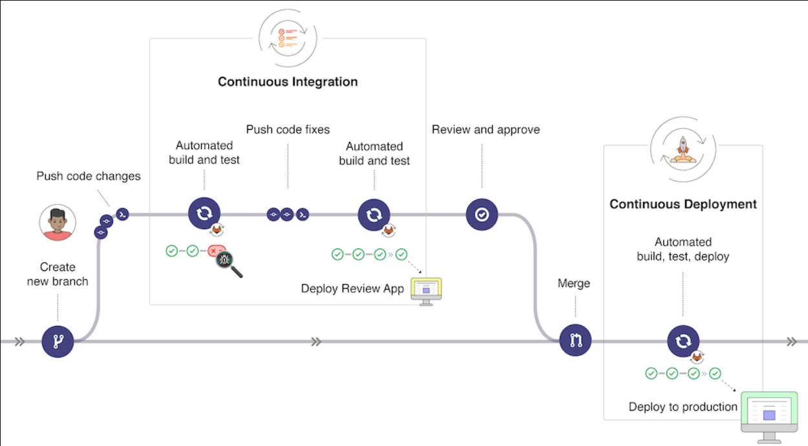
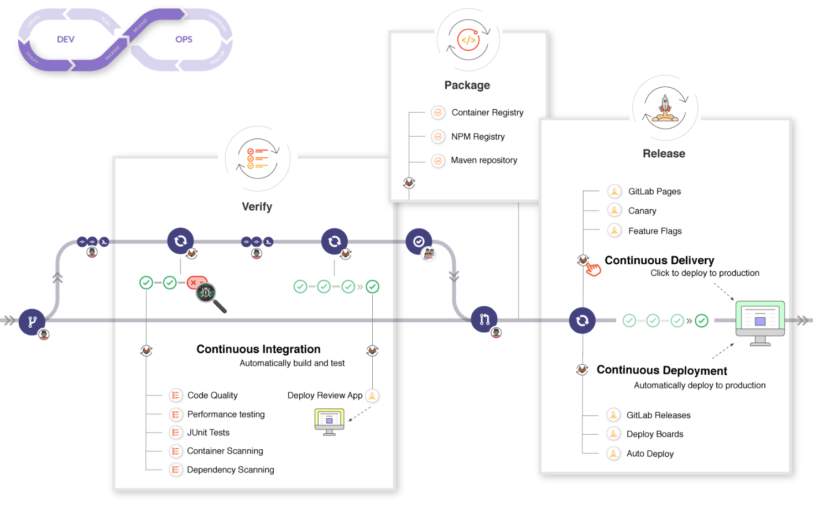

# 01-为什么要做CI/CD？

## 传统模式的问题

- **错误发现不及时**  ：很多错误在项目的早期可能就存在，到最后集成的时候才发现问题。
- **人工低级错误发生** ：产品和服务交付中的关键活动全都需要手动操作。
- **团队工作效率低** ：需要等待他人的工作完成后才能进行自己的工作。
- **开发运维对立 ** ：开发人员想要快速更新，运维人员追求稳定，各自的针对的方向不同。

经过上述问题我们需要作出改变，如何改变？

## 持续集成与持续交付

### 持续集成 （CI）

CI是Continuous Integration的缩写，意为持续集成。联系到具体的开发运维场景，就是指开发者在完成项目中的一个小特性后，将自己分支的代码合并到测试分支，这个过程就是集成，在这一集成过程中会运行一系列代码格式的检查、单元测试等严格保证项目质量的检查作业。每一次提交，都需要经过严格的自动化测试，代码才能被合并，这样可以极大降低集成的风险，保证项目的稳定。

CI可以帮助开发人员更加频繁地（有时甚至每天）将代码更改合并到共享分支或“主干”中。一旦开发人员对应用所做的更改被合并，系统就会通过自动构建应用并运行不同级别的自动化测试（通常是单元测试和集成测试）来验证这些更改，确保这些更改没有对应用造成破坏。

### 持续交付 （CD） &  持续部署   (CD)

CD有两种含义，这两种含义对应的过程都是在CI阶段完成后进行的。

第一种含义，CD是指持续交付(Continuous Delivery)。完成CI中的所有作业后，持续交付可自动将已验证的代码发布到存储库。持续交付的目标是拥有可随时部署到生产环境的artifacts或者镜像，这一过程一般是手动实现的。

第二种含义，CD是指持续部署(Continuous Deployment)。鉴于部署环境和部署方式的差异以及各种应用之间的耦合，部署这一项任务不再是用简单的几行命令能搞定的了。注意，持续交付是手动实现的，而持续部署是自动实现的，这就是两者最大的区别。持续部署意味着只要提交了代码，就可以实现自动将代码部署到开发环境、测试环境甚至生产环境。这无疑是非常方便、快捷的。


## CICD的价值体现

- 尽早反馈，尽早发现错误。
- 减少集成问题，每次发现问题当时解决，避免问题堆积。
- 每次更改都能成功发布，降低发布风险。
- 更加频繁的交付价值，客户反馈。


## 总结

对于这篇文档，只理解了“CICD的价值体现”、“推荐常用的CICD工具”，其他部分过于理论化，通过后期实践后再来理解。

# 02-GitLab CI/CD功能简介

## GitLab CI/CD架构

### GitLab CI / CD 

GitLab CI/CD是GitLab的一部分，GitLab是一个Web应用程序。

### GitLab Runner 

是一个处理构建的应用程序。它可以单独部署，并通过API与GitLab CI / CD一起使用。

### .gitlab-ci.yml

定义流水线作业运行，位于应用项目根目录下 。



**为了运行测试，至少需要一个 GitLab 实例、一个 GitLab Runner、一个gitlab-ci文件**


## GitLab CI/CD工作原理

此工作流显示了极狐GitLab 流程中的主要步骤。 您不需要任何外部工具来交付您的软件，并且您可以在 GitLab UI 中可视化所有步骤。



如果您深入了解工作流程，您可以看到 GitLab 在 DevOps 生命周期的每个阶段可用的功能。




## 总结

该部分内容仍然过于理论，主要理解“GitLab CI/CD架构”、“GitLab CI/CD工作原理”

# 03-GitLabCI VS Jenkins

## 总结

这篇其实对于两个技术都不了解的人来说，建议直接跳过，因为其中涉及的各种特点我们完全不了解。在充分使用了两者之后对于二者的比较才会有深刻的认识。

# 04-安装部署GitLab服务

## rpm方式

源地址：https://mirrors.tuna.tsinghua.edu.cn/gitlab-ce/yum/el7/

```shell
wget https://mirrors.tuna.tsinghua.edu.cn/gitlab-ce/yum/el7/gitlab-ce-12.9.0-ce.0.el7.x86_64.rpm


rpm -ivh gitlab-ce-12.9.0-ce.0.el7.x86_64.rpm

vim /etc/gitlab.rb   # 编辑站点地址
gitlab-ctl reconfigure  # 配置


#服务控制
gitlab-ctl start 
gitlab-ctl status
gitlab-ctl stop 
```


## Docker方式

```shell
mkdir -p ~/data/gitlab/config ~/data/gitlab/logs ~/data/gitlab/data
docker pull gitlab/gitlab-ce:12.9.0-ce.0

# 启动
docker run -d  -p 443:443 -p 80:80 -p 222:22 --name gitlab --restart always -v /root/data/gitlab/config:/etc/gitlab -v /root/data/gitlab/logs:/var/log/gitlab -v /root/data/gitlab/data:/var/opt/gitlab gitlab/gitlab-ce:12.9.0-ce.0

# 编辑gitlab配置文件
 cd /root/data/gitlab/config       #进入配置文件所在目录下
 cp gitlab.rb gitlab.rb.bak        #修改配置文件之前先备份
 vim gitlab.rb                      #下列显示的都是编辑器中内容
 # external_url 'GENERATED_EXTERNAL_URL'           #找到这一行,修改为下面这一行
  external_url 'http://192.168.58.143'           #后面的地址改为gitlab地址
# gitlab_rails['gitlab_shell_ssh_port'] = 22      #找到这一行,修改为下面一行
  gitlab_rails['gitlab_shell_ssh_port'] = 222    #开启gitlab的ssh功能并且端口改为222;

#服务控制
docker restart gitlab
docker start gitlab
docker stop gitlab
docker rm gitlab

# 如果忘记root密码
docker exec -it gitlab   bash # 进入容器
root@897b598a109d:/# gitlab-rails console production
# 如果执行上面的指令提示
Traceback (most recent call last):
        8: from bin/rails:4:in `<main>'
        7: from bin/rails:4:in `require'
        6: from /opt/gitlab/embedded/lib/ruby/gems/2.6.0/gems/railties-6.0.2/lib/rails/commands.rb:18:in `<top (required)>'
        5: from /opt/gitlab/embedded/lib/ruby/gems/2.6.0/gems/railties-6.0.2/lib/rails/command.rb:46:in `invoke'
        4: from /opt/gitlab/embedded/lib/ruby/gems/2.6.0/gems/railties-6.0.2/lib/rails/command/base.rb:69:in `perform'
# 则可能是Gitlab版本不一样，然后参数方式不一样，需要用如下方式：
root@897b598a109d:/# gitlab-rails console -e production
--------------------------------------------------------------------------------
 GitLab:       12.9.0 (9a382ff2c82) FOSS
 GitLab Shell: 12.0.0
 PostgreSQL:   10.12
--------------------------------------------------------------------------------

Loading production environment (Rails 6.0.2)
irb(main):001:0>
# 查询用户
irb(main):002:0>  user = User.where(username:"root").first
=> #<User id:1 @root>
# 修改密码
irb(main):003:0> user.password = "12345678"
=> "12345678"
# 保存
irb(main):004:0> user.save!
Enqueued ActionMailer::DeliveryJob (Job ID: 018fdb35-d12e-40d7-8fa7-9682a2cbd70f) to Sidekiq(mailers) with arguments: "DeviseMailer", "password_change", "deliver_now", #<GlobalID:0x00007f4bf2ea94e0 @uri=#<URI::GID gid://gitlab/User/1>>
=> true
irb(main):005:0>

# 浏览器访问
http://192.168.58.143/       root/12345678
```


## Kubernetes部署

文件地址： https://github.com/zeyangli/devops-on-k8s/blob/master/devops/gitlab.yaml

```yaml
---
kind: Deployment
apiVersion: apps/v1
metadata:
  labels:
    k8s-app: gitlab
  name: gitlab
  namespace: devops
spec:
  replicas: 1
  revisionHistoryLimit: 10
  selector:
    matchLabels:
      k8s-app: gitlab
  template:
    metadata:
      labels:
        k8s-app: gitlab
      namespace: devops
      name: gitlab
    spec:
      containers:
        - name: gitlab
          image: gitlab/gitlab-ce:12.6.0-ce.0
          imagePullPolicy: Always
          ports:
            - containerPort: 30088
              name: web
              protocol: TCP
            - containerPort: 22
              name: agent
              protocol: TCP
          resources:
            limits:
              cpu: 1000m
              memory: 4Gi
            requests:
              cpu: 500m
              memory: 512Mi
          livenessProbe:
            httpGet:
              path: /users/sign_in
              port: 30088
            initialDelaySeconds: 60
            timeoutSeconds: 5
            failureThreshold: 12
          readinessProbe:
            httpGet:
              path: /users/sign_in
              port: 30088
            initialDelaySeconds: 60
            timeoutSeconds: 5
            failureThreshold: 12
          volumeMounts:
            - name: gitlab-conf
              mountPath: /etc/gitlab
            - name: gitlab-log
              mountPath: /var/log/gitlab
            - name: gitlab-data
              mountPath: /var/opt/gitlab
          env:
            - name: gitlab_HOME
              value: /var/lib/gitlab
      volumes:
        - name: gitlab-conf
          hostPath: 
            path: /data/devops/gitlab/config
            type: Directory
        - name: gitlab-log
          hostPath: 
            path: /data/devops/gitlab/logs
            type: Directory
        - name: gitlab-data
          hostPath: 
            path: /data/devops/gitlab/data
            type: Directory
      serviceAccountName: gitlab
---
apiVersion: v1
kind: ServiceAccount
metadata:
  labels:
    k8s-app: gitlab
  name: gitlab
  namespace: devops
---
kind: Service
apiVersion: v1
metadata:
  labels:
    k8s-app: gitlab
  name: gitlab
  namespace: devops
spec:
  type: NodePort
  ports:
    - name: web
      port: 30088
      targetPort: 30088
      nodePort: 30088
    - name: slave
      port: 22
      targetPort: 22
      nodePort: 30022
  selector:
    k8s-app: gitlab
---
kind: Role
apiVersion: rbac.authorization.k8s.io/v1beta1
metadata:
 name: gitlab
 namespace: devops
rules:
 - apiGroups: [""]
   resources: ["pods"]
   verbs: ["create","delete","get","list","patch","update","watch"]
 - apiGroups: [""]
   resources: ["pods/exec"]
   verbs: ["create","delete","get","list","patch","update","watch"]
 - apiGroups: [""]
   resources: ["pods/log"]
   verbs: ["get","list","watch"]
 - apiGroups: [""]
   resources: ["secrets"]
   verbs: ["get"]
---
apiVersion: rbac.authorization.k8s.io/v1beta1
kind: RoleBinding
metadata:
 name: gitlab
 namespace: devops
roleRef:
 apiGroup: rbac.authorization.k8s.io
 kind: Role
 name: gitlab
subjects:
 - kind: ServiceAccount
   name: gitlab
   namespace: devops

```


```
kubectl create -f gitlab.yaml
kubectl delete -f gitlab.yaml
```


## 总结

本次我尝试了使用Docker方式安装GitLab，很顺利，详细步骤写在了相应小节。对于K8S的方式，后期再来看一下如何安装，目前就是先简单使用起来。