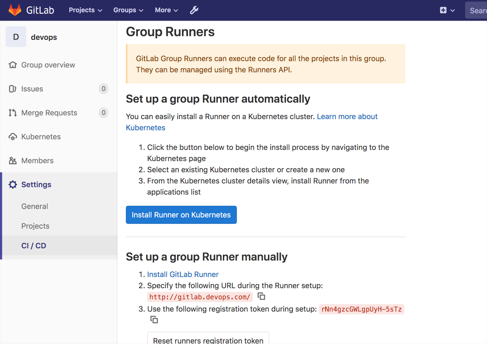

# GitLabRunner简介

## 总结

本节我主要看了“要求”部分，“特点” 这些仍然是需要使用后才有体会的东西，建议在基本使用之后再看回顾。其实这也是很多入门课程需要注意的点，刚开始强调了很多理论的东西，然而这些东西对于初学者来说真的看不懂，会挫败信心，应该刚开始直接将项目跑起来，给出一种直观的感受，结合实战给出总结和特性分析，而不是直接一来就长篇累牍的介绍理论；当然，在有了基本使用之后，这些理论还是很重要的，只是总结理论的时机要把握好。

# GitLabRunner安装

## 1. 使用GItLab官方仓库安装

- 重点掌握CentOS系统的安装方式
- 重点掌握Ubuntu系统的安装方式

我们提供Debian，Ubuntu，Mint，RHEL，Fedora和CentOS当前受支持版本的软件包。

| Distribution | Version | End of Life date      |
| :----------- | :------ | :-------------------- |
| Debian       | stretch | approx. 2022          |
| Debian       | jessie  | June 2020             |
| Ubuntu       | bionic  | April 2023            |
| Ubuntu       | xenial  | April 2021            |
| Mint         | sonya   | approx. 2021          |
| Mint         | serena  | approx. 2021          |
| Mint         | sarah   | approx. 2021          |
| RHEL/CentOS  | 7       | June 2024             |
| RHEL/CentOS  | 6       | November 2020         |
| Fedora       | 29      | approx. November 2019 |


Add GitLab’s official repository:  添加官方仓库

```shell
# For Debian/Ubuntu/Mint
curl -L https://packages.gitlab.com/install/repositories/runner/gitlab-runner/script.deb.sh | sudo bash

# For RHEL/CentOS/Fedora
curl -L https://packages.gitlab.com/install/repositories/runner/gitlab-runner/script.rpm.sh | sudo bash
```

Install the latest version of GitLab Runner: 安装最新版本

```shell
# For Debian/Ubuntu/Mint
sudo apt-get install gitlab-runner

# For RHEL/CentOS/Fedora
sudo yum install gitlab-runner
```

To install a specific version of GitLab Runner: 安装指定版本

```shell
# for DEB based systems
apt-cache madison gitlab-runner
sudo apt-get install gitlab-runner=10.0.0

# for RPM based systems
yum list gitlab-runner --showduplicates | sort -r
sudo yum install gitlab-runner-10.0.0-1
```

更新runner

```shell
# For Debian/Ubuntu/Mint
sudo apt-get update
sudo apt-get install gitlab-runner

# For RHEL/CentOS/Fedora
sudo yum update
sudo yum install gitlab-runner
```


## 2. 在GNU / Linux上手动安装GitLab Runner

如果您不能使用[deb / rpm存储库](https://docs.gitlab.com/12.6/runner/install/linux-repository.html)安装GitLab Runner，或者您的GNU / Linux操作系统不在支持的版本中，则可以使用以下一种方法手动安装它，这是最后的选择。

### 通过`deb`或`rpm`软件包

**下载软件包**

1. 在[https://gitlab-runner-downloads.s3.amazonaws.com/latest/index.html上](https://gitlab-runner-downloads.s3.amazonaws.com/latest/index.html)找到最新的文件名和选项 。
2. 选择一个版本并下载二进制文件，如文档所述，该文件用于[下载任何其他标记的](https://docs.gitlab.com/12.6/runner/install/bleeding-edge.html#download-any-other-tagged-release) GitLab Runner发行版。

例如，对于Debian或Ubuntu：

```shell
curl -LJO https://gitlab-runner-downloads.s3.amazonaws.com/latest/deb/gitlab-runner_<arch>.deb

dpkg -i gitlab-runner_<arch>.deb

dpkg -i gitlab-runner_<arch>.deb
```


例如，对于CentOS或Red Hat Enterprise Linux：

```shell
curl -LJO https://gitlab-runner-downloads.s3.amazonaws.com/latest/rpm/gitlab-runner_<arch>.rpm

rpm -i gitlab-runner_<arch>.rpm

rpm -Uvh gitlab-runner_<arch>.rpm
```


### 使用二进制文件

参考地址： https://docs.gitlab.com/12.6/runner/install/bleeding-edge.html#download-any-other-tagged-release

下载指定版本： 将上面URL中的latest切换为 v12.6。

```shell
# Linux x86-64
sudo curl -L --output /usr/local/bin/gitlab-runner https://gitlab-runner-downloads.s3.amazonaws.com/latest/binaries/gitlab-runner-linux-amd64

# Linux x86
sudo curl -L --output /usr/local/bin/gitlab-runner https://gitlab-runner-downloads.s3.amazonaws.com/latest/binaries/gitlab-runner-linux-386

# Linux arm
sudo curl -L --output /usr/local/bin/gitlab-runner https://gitlab-runner-downloads.s3.amazonaws.com/latest/binaries/gitlab-runner-linux-arm

# Linux arm64
sudo curl -L --output /usr/local/bin/gitlab-runner https://gitlab-runner-downloads.s3.amazonaws.com/latest/binaries/gitlab-runner-linux-arm64
```

添加执行权限

```shell
sudo chmod +x /usr/local/bin/gitlab-runner
```

创建一个gitlab用户

```shell
sudo useradd --comment 'GitLab Runner' --create-home gitlab-runner --shell /bin/bash
```

安装并作为服务运行

```shell
sudo gitlab-runner install --user=gitlab-runner --working-directory=/home/gitlab-runner
sudo gitlab-runner start
```

更新

```bash
#停止服务
sudo gitlab-runner stop

#下载新版本二进制包
sudo curl -L --output /usr/local/bin/gitlab-runner https://gitlab-runner-downloads.s3.amazonaws.com/latest/binaries/gitlab-runner-linux-amd64

#赋予执行权限
sudo chmod +x /usr/local/bin/gitlab-runner

#启动服务
sudo gitlab-runner start
```


## 4. 在容器中运行GitLab Runner

```shell
# --rm 这个选项表示当容器停止运行后自动删除容器。
# -t 这个选项分配一个伪TTY终端，通常与 -i 选项结合使用。
# -i 表示以交互模式运行容器，即使没有连接到标准输入也保持打开。
# -d 表示以分离模式（detached mode）运行容器，使容器在后台运行。

mkdir -p ~/data/gitlab-runner/config
docker run --rm -t -id -v ~/data/gitlab-runner/config:/etc/gitlab-runner --name gitlab-runner  gitlab/gitlab-runner:v16.10.0
docker exec -it gitlab-runner   bash
root@75ab6ebd177b:/# gitlab-runner -v
Version:      12.6.0
Git revision: ac8e767a
Git branch:   12-6-stable
GO version:   go1.13.4
Built:        2019-12-22T11:55:34+0000
OS/Arch:      linux/amd64

docker run -d --name gitlab-runner --restart always \
  -v ~/data/gitlab-runner/config:/etc/gitlab-runner \
  -v /var/run/docker.sock:/var/run/docker.sock \
  gitlab/gitlab-runner:v16.10.0
  
```

`-v /var/run/docker.sock:/var/run/docker.sock` 这个挂载的目的是为了让 GitLab Runner 容器能够与宿主机的 Docker 守护进程进行通信，实现在容器内部执行 Docker 相关的操作。这个挂载的实际作用是将宿主机上的 Docker 守护进程的 UNIX 套接字（socket）挂载到 GitLab Runner 容器内的相同路径上，从而使容器内的进程可以与宿主机的 Docker 守护进程进行通信。

通过这种方式，GitLab Runner 容器内的作业可以使用宿主机的 Docker 守护进程来创建、运行和管理其他 Docker 容器，实现了容器内部对外部 Docker 环境的访问和操作，比如构建和部署 Docker 镜像等操作。这种通信机制在实现 CI/CD 流水线中的 Docker 集成时非常常见。

总结一下，挂载 `/var/run/docker.sock` 到 GitLab Runner 容器的 `/var/run/docker.sock` 目的是在容器中使用宿主机的 Docker 守护进程，以便在容器内执行 Docker 相关操作，如构建、运行 Docker 容器等。


## 总结

对于软件的安装，可以体系学习一下鸟哥私房菜里面关于软件安装的部分，当然，目前我还没来得及看。这里我使用docker的方式安装GitLab Runner。

# GitLabRunner注册

参考链接：https://help.aliyun.com/document_detail/106968.html#title-xfl-dp6-kta

大概过程： 获取runner token -> 进行注册

## GitLabRunner 类型

- shared 共享类型： 运行整个平台项目的作业（gitlab）
- group 项目组类型： 运行特定group下的所有项目的作业（group）
- specific 项目类型:  运行指定项目的作业（project）

**状态**

- locked 锁定状态： 无法运行项目作业 
- paused 暂停状态： 不会运行作业

## 基本概念

GitLab CI/CD由以下两部分构成。

(1)运行流水线的环境。它是由GitLab Runner提供的，这是一个由GitLab开发的开源软件包，要搭建GitLab CI/CD就必须安装它，因为它是流水线的运行环境。

(2)定义流水线内容的.gitlab-ci.yml文件。这是一个YAML文件，它以一种结构化的方式来声明一条流水线—— 官方提供了很多关键词来覆盖各种业务场景，使你在编写极少Shell脚本的情况下也能应对复杂的业务场景。

除此之外，在定义的流水线中，还需要掌握的概念有以下几个。

(1)流水线(pipeline)。在GitLab CI/CD中，流水线由.gitlab-ci.yml文件来定义。实际上，它是一系列的自动化作业。这些作业按照一定顺序运行，就形成了一条有序的流水线。触发流水线的时机可以是代码推送、创建tag、合并请求，以及定时触发等。通常，由创建tag触发的流水线叫作tag流水线，由合并请求触发的流水线叫作合并请求流水线。此外，还有定时触发的定时流水线、跨项目流水线以及父子流水线等。

(2)阶段(stages)。阶段在流水线之下，主要用于给作业分组，并规定每个阶段的运行顺序。它可以将几个作业归纳到一个群组里，比如构建阶段群组、测试阶段群组和部署阶段群组。

(3)作业(job)。作业在阶段之下，是最基础的执行单元。它是最小化的自动运行任务，比如安装Node.js依赖包、运行测试用例。

在GitLab的UI中，流水线的详情如图1-1所示。


可以看到，流水线包含3个阶段，分别是Install、Build和Deploy。其中，Install阶段包含两个作业，即install_job和job_name。

至此，我们介绍了GitLab CI/CD的几个基本概念。理解这几个概念，有助于快速地构建基本的GitLab CI/CD知识体系。如果你要使用GitLab CI/CD，只需要安装一个GitLab Runner，然后在项目根目录创建一个.gitlab-ci.yml文件。是不是很简单？你不需要使用复杂的插件来实现自己的需求，也不需要写太多的Shell脚本，只需一个可用的runner以及七八个关键词，就能将一个项目的流水线运行起来。

## 获取runner token

**获取`shared`类型runner token**

进入系统设置 -> Runners


**获取`group`类型的runner token**

进入group -> Settings -> CI/CD -> Runners -> Group Runners




**获取`specific`类型的runner token**

进入具体的项目 -> Settings -> CI/CD -> Runners -> Specific Runners


## 进行注册

在设备上安装了GitLab Runner后，让我们看一下如何使用它。要使用GitLab Runner运行某个项目的流水线，需要使用GitLab Runner为这个项目注册一个runner。注册runner的过程就是将一个runner与项目绑定起来。这个runner会与GitLab建立联系，并在适当的时候进行通信。

方式1： 启动容器交互式注册

```shell
docker run --rm -t -id -v ~/data/gitlab-runner/config:/etc/gitlab-runner --name gitlab-runner  gitlab/gitlab-runner:v12.6.0
[root@localhost ~]# docker exec -it gitlab-runner   bash
root@f4d1e5610264:/# gitlab-runner register
Runtime platform                                    arch=amd64 os=linux pid=34 revision=ac8e767a version=12.6.0
Running in system-mode.

Please enter the gitlab-ci coordinator URL (e.g. https://gitlab.com/):
http://192.168.58.143/ # 本次测试shared 类型的runner，复制页面上面的URL
Please enter the gitlab-ci token for this runner:
EQfvKmdYCVvRTDvVM1aA # 复制页面上面的token
Please enter the gitlab-ci description for this runner:
[f4d1e5610264]: test shared runner # 给这个runner增加描述信息
Please enter the gitlab-ci tags for this runner (comma separated):
build # 增加tag
Registering runner... succeeded                     runner=EQfvKmdY
Please enter the executor: ssh, docker+machine, kubernetes, custom, docker-ssh, parallels, shell, docker, virtualbox, docker-ssh+machine:
shell # 选择执行器
Runner registered successfully. Feel free to start it, but if it's running already the config should be automatically reloaded!
root@f4d1e5610264:/#

```

方式2：直接注册

```shell
docker run --rm -v ~/data/gitlab-runner/config:/etc/gitlab-runner gitlab/gitlab-runner:v12.6.0 register \
  --non-interactive \  # 非交互模式，不会提示用户输入信息，所有需要的信息都通过其他参数提供。
  --executor "docker" \ # 指定使用 Docker 作为执行器。
  --docker-image alpine:latest \ # 指定使用 alpine:latest 作为 runner 的默认 Docker 镜像。
  --url "http://192.168.1.200:30088/" \ # 指定 GitLab 实例的 URL
  --registration-token "JRzzw2j1Ji6aBjwvkxAv" \ # 用于注册 runner 的令牌，从 GitLab 实例中获取。
  --description "docker-runner" \ # 为这个 runner 设置描述
  --tag-list "docker,aws" \ # 给 runner 设置标签，方便在 GitLab 中进行任务调度，这里是 docker 和 aws。
  --run-untagged="true" \ # 允许 runner 执行没有标签的任务
  --locked="false" \ # 设定这个 runner 不被锁定，可以给其他项目使用
  --access-level="not_protected" # 将这个 runner 的访问级别设定为 "not_protected"，意味着它可以运行在非保护分支和提交上。
```

```shell
docker run -it --rm -v ~/data/gitlab-runner/config:/etc/gitlab-runner gitlab/gitlab-runner:v12.6.0 register \
  --non-interactive \
  --executor "shell" \ # 指定使用shell作为执行器
  --url "http://gitlab.devops.com" \
  --registration-token "FZwnmCacrXfk37yZzfNJ" \
  --description "devops-runner" \
  --tag-list "build,deploy" \
  --run-untagged="true" \
  --locked="false" \
  --access-level="not_protected"
```

```shell
docker run -itd --rm -v ~/data/gitlab-runner/config:/etc/gitlab-runner  gitlab/gitlab-runner:v12.6.0 register \
  --non-interactive \
  --executor "shell" \
  --url "http://192.168.1.200:30088/" \
  --registration-token "JRzzw2j1Ji6aBjwvkxAv" \
  --description "devops-runner" \
  --tag-list "build,deploy" \
  --run-untagged="true" \
  --locked="false" \
  --access-level="not_protected"
```

效果


## 其他变量

关于注册的选项

```
   -c value, --config value                                     指定配置文件
   --template-config value                                      指定模板配置文件
   --tag-list value                                             指定runner的标签列表，逗号分隔
   -n, --non-interactive                                        无交互进行runner注册 
   --leave-runner                                               如果注册失败，不用删除runner 
   -r value, --registration-token value                         runner的注册token
   --run-untagged                              注册运行未加标签的构建，默认当标签列表为空时值为true
   --locked                                                     锁定runner 默认true
   --access-level value        设置访问等级 not_protected or ref_protected; 默认 not_protected 
   --maximum-timeout value                             为作业设置最大运行超时时间 默认零 单位秒
   --paused                                            设置runner为 paused,默认 'false' 
   --name value, --description value                            Runner 名称 
   --limit value                                       程序处理的最大构建数量default: "0"
   --output-limit value                                最大的构建大小单位kb default: "0"
   --request-concurrency value                         作业请求的最大并发数 default: "0"
   -u value, --url value                                        GitlabCI服务器地址
   -t value, --token value                                      GitlabCI服务器token
```


```shell
root@82948f0a37e3:/# gitlab-runner register --help
Runtime platform                                    arch=amd64 os=linux pid=168 revision=ac8e767a version=12.6.0
NAME:
   gitlab-runner register - register a new runner

USAGE:
   gitlab-runner register [command options] [arguments...]

OPTIONS:
   
   --tls-ca-file value                                          File containing the certificates to verify the peer when using HTTPS [$CI_SERVER_TLS_CA_FILE]
   --tls-cert-file value                                        File containing certificate for TLS client auth when using HTTPS [$CI_SERVER_TLS_CERT_FILE]
   --tls-key-file value                                         File containing private key for TLS client auth when using HTTPS [$CI_SERVER_TLS_KEY_FILE]
   
   
   --executor value                                             选择执行器，例如shell，docker 
   --builds-dir value                                           设置构建存储目录
   --cache-dir value                                            设置构建缓存目录
   --clone-url value                                            覆盖默认通过git克隆的URL
   --env value                                                  注入自定义环境变量以构建环境
   --pre-clone-script value                           在提取代码之前执行的特定于运行程序的命令脚本
   --pre-build-script value              特定于运行程序的命令脚本，在提取代码之后，在构建执行之前执行
   --post-build-script value            特定于运行程序的命令脚本，在提取代码后以及在构建执行后立即执行
   --debug-trace-disabled               设置为true时，Runner将禁用使用CI_DEBUG_TRACE功能的可能性                        
   --shell value                        选择 bash, cmd or powershell [$RUNNER_SHELL]
   --custom_build_dir-enabled           启用作业特定的构建目录[$CUSTOM_BUILD_DIR_ENABLED]
   --ssh-user value                                             ssh用户名称 [$SSH_USER]
   --ssh-password value                                         ssh用户密码[$SSH_PASSWORD]
   --ssh-host value                                             ssh远程主机[$SSH_HOST]
   --ssh-port value                                             ssh远程主机端口 [$SSH_PORT]
   --ssh-identity-file value                               ssh认证文件 [$SSH_IDENTITY_FILE]
   
   
   --docker-host value                                          Docker主机地址 [$DOCKER_HOST]
   --docker-cert-path value                                Docker证书路径 [$DOCKER_CERT_PATH]
   --docker-tlsverify                             Docker使用TLS并验证远程 [$DOCKER_TLS_VERIFY]
   --docker-hostname value                                自定义容器主机名称 [$DOCKER_HOSTNAME]
   --docker-image value                                         定义Docker镜像[$DOCKER_IMAGE]
   --docker-runtime value                        Docker runtime to be used [$DOCKER_RUNTIME]
   --docker-memory value                   内存限制 Unit [b, k, m, or g]  4M [$DOCKER_MEMORY]
   --docker-memory-swap value 内存限制memory + swap，Unit[b, k, m, or g][$DOCKER_MEMORY_SWAP]
   --docker-memory-reservation value                   内存软限制[$DOCKER_MEMORY_RESERVATION]
   --docker-cpuset-cpus value                                   cpu限制[$DOCKER_CPUSET_CPUS]
   --docker-cpus value                                         cpu数量 [$DOCKER_CPUS]
   --docker-cpu-shares value                 CPU shares (default: "0") [$DOCKER_CPU_SHARES]
   --docker-dns value                                           A list of DNS servers for the container to use [$DOCKER_DNS]
   --docker-dns-search value                                    A list of DNS search domains [$DOCKER_DNS_SEARCH]
   --docker-privileged                                          Give extended privileges to container [$DOCKER_PRIVILEGED]
   --docker-disable-entrypoint-overwrite                        Disable the possibility for a container to overwrite the default image entrypoint [$DOCKER_DISABLE_ENTRYPOINT_OVERWRITE]
   --docker-userns value                                        User namespace to use [$DOCKER_USERNS_MODE]
   --docker-cap-add value                                       Add Linux capabilities [$DOCKER_CAP_ADD]
   --docker-cap-drop value                                      Drop Linux capabilities [$DOCKER_CAP_DROP]
   --docker-oom-kill-disable                                    Do not kill processes in a container if an out-of-memory (OOM) error occurs [$DOCKER_OOM_KILL_DISABLE]
   --docker-oom-score-adjust value                              Adjust OOM score (default: "0") [$DOCKER_OOM_SCORE_ADJUST]
   --docker-security-opt value                                  Security Options [$DOCKER_SECURITY_OPT]
   --docker-devices value                                       Add a host device to the container [$DOCKER_DEVICES]
   --docker-disable-cache                                       Disable all container caching [$DOCKER_DISABLE_CACHE]
   --docker-volumes value                                       Bind-mount a volume and create it if it doesn't exist prior to mounting. Can be specified multiple times once per mountpoint, e.g. --docker-volumes 'test0:/test0' --docker-volumes 'test1:/test1' [$DOCKER_VOLUMES]
   --docker-volume-driver value                                 Volume driver to be used [$DOCKER_VOLUME_DRIVER]
   --docker-cache-dir value                                     Directory where to store caches [$DOCKER_CACHE_DIR]
   --docker-extra-hosts value                                   Add a custom host-to-IP mapping [$DOCKER_EXTRA_HOSTS]
   --docker-volumes-from value                                  A list of volumes to inherit from another container [$DOCKER_VOLUMES_FROM]
   --docker-network-mode value                                  Add container to a custom network [$DOCKER_NETWORK_MODE]
   --docker-links value                                         Add link to another container [$DOCKER_LINKS]
   --docker-services value                                      Add service that is started with container [$DOCKER_SERVICES]
   --docker-wait-for-services-timeout value                     How long to wait for service startup (default: "0") [$DOCKER_WAIT_FOR_SERVICES_TIMEOUT]
   --docker-allowed-images value                                Whitelist allowed images [$DOCKER_ALLOWED_IMAGES]
   --docker-allowed-services value                              Whitelist allowed services [$DOCKER_ALLOWED_SERVICES]
   --docker-pull-policy value                                   Image pull policy: never, if-not-present, always [$DOCKER_PULL_POLICY]
   --docker-shm-size value                                      Shared memory size for docker images (in bytes) (default: "0") [$DOCKER_SHM_SIZE]
   --docker-tmpfs value                                         A toml table/json object with the format key=values. When set this will mount the specified path in the key as a tmpfs volume in the main container, using the options specified as key. For the supported options, see the documentation for the unix 'mount' command (default: "{}") [$DOCKER_TMPFS]
   --docker-services-tmpfs value                                A toml table/json object with the format key=values. When set this will mount the specified path in the key as a tmpfs volume in all the service containers, using the options specified as key. For the supported options, see the documentation for the unix 'mount' command (default: "{}") [$DOCKER_SERVICES_TMPFS]
   --docker-sysctls value                                       Sysctl options, a toml table/json object of key=value. Value is expected to be a string. (default: "{}") [$DOCKER_SYSCTLS]
   --docker-helper-image value                                  [ADVANCED] Override the default helper image used to clone repos and upload artifacts [$DOCKER_HELPER_IMAGE]
   
   
   --parallels-base-name value                                  VM name to be used [$PARALLELS_BASE_NAME]
   --parallels-template-name value                              VM template to be created [$PARALLELS_TEMPLATE_NAME]
   --parallels-disable-snapshots                                Disable snapshoting to speedup VM creation [$PARALLELS_DISABLE_SNAPSHOTS]
   --parallels-time-server value                                Timeserver to sync the guests time from. Defaults to time.apple.com [$PARALLELS_TIME_SERVER]
   --virtualbox-base-name value                                 VM name to be used [$VIRTUALBOX_BASE_NAME]
   --virtualbox-base-snapshot value                             Name or UUID of a specific VM snapshot to clone [$VIRTUALBOX_BASE_SNAPSHOT]
   --virtualbox-disable-snapshots                               Disable snapshoting to speedup VM creation [$VIRTUALBOX_DISABLE_SNAPSHOTS]
   --cache-type value                                           Select caching method [$CACHE_TYPE]
   --cache-path value                                           Name of the path to prepend to the cache URL [$CACHE_PATH]
   --cache-shared                                               Enable cache sharing between runners. [$CACHE_SHARED]
   --cache-s3-server-address value                              A host:port to the used S3-compatible server [$CACHE_S3_SERVER_ADDRESS]
   --cache-s3-access-key value                                  S3 Access Key [$CACHE_S3_ACCESS_KEY]
   --cache-s3-secret-key value                                  S3 Secret Key [$CACHE_S3_SECRET_KEY]
   --cache-s3-bucket-name value                                 Name of the bucket where cache will be stored [$CACHE_S3_BUCKET_NAME]
   --cache-s3-bucket-location value                             Name of S3 region [$CACHE_S3_BUCKET_LOCATION]
   --cache-s3-insecure                                          Use insecure mode (without https) [$CACHE_S3_INSECURE]
   --cache-gcs-access-id value                                  ID of GCP Service Account used to access the storage [$CACHE_GCS_ACCESS_ID]
   --cache-gcs-private-key value                                Private key used to sign GCS requests [$CACHE_GCS_PRIVATE_KEY]
   --cache-gcs-credentials-file value                           File with GCP credentials, containing AccessID and PrivateKey [$GOOGLE_APPLICATION_CREDENTIALS]
   --cache-gcs-bucket-name value                                Name of the bucket where cache will be stored [$CACHE_GCS_BUCKET_NAME]
   --machine-idle-nodes value                                   Maximum idle machines (default: "0") [$MACHINE_IDLE_COUNT]
   --machine-idle-time value                                    Minimum time after node can be destroyed (default: "0") [$MACHINE_IDLE_TIME]
   --machine-max-builds value                                   Maximum number of builds processed by machine (default: "0") [$MACHINE_MAX_BUILDS]
   --machine-machine-driver value                               The driver to use when creating machine [$MACHINE_DRIVER]
   --machine-machine-name value                                 The template for machine name (needs to include %s) [$MACHINE_NAME]
   --machine-machine-options value                              Additional machine creation options [$MACHINE_OPTIONS]
   --machine-off-peak-periods value                             Time periods when the scheduler is in the OffPeak mode [$MACHINE_OFF_PEAK_PERIODS]
   --machine-off-peak-timezone value                            Timezone for the OffPeak periods (defaults to Local) [$MACHINE_OFF_PEAK_TIMEZONE]
   --machine-off-peak-idle-count value                          Maximum idle machines when the scheduler is in the OffPeak mode (default: "0") [$MACHINE_OFF_PEAK_IDLE_COUNT]
   --machine-off-peak-idle-time value                           Minimum time after machine can be destroyed when the scheduler is in the OffPeak mode (default: "0") [$MACHINE_OFF_PEAK_IDLE_TIME]
   --kubernetes-host value                                      Optional Kubernetes master host URL (auto-discovery attempted if not specified) [$KUBERNETES_HOST]
   --kubernetes-cert-file value                                 Optional Kubernetes master auth certificate [$KUBERNETES_CERT_FILE]
   --kubernetes-key-file value                                  Optional Kubernetes master auth private key [$KUBERNETES_KEY_FILE]
   --kubernetes-ca-file value                                   Optional Kubernetes master auth ca certificate [$KUBERNETES_CA_FILE]
   --kubernetes-bearer_token_overwrite_allowed                  Bool to authorize builds to specify their own bearer token for creation. [$KUBERNETES_BEARER_TOKEN_OVERWRITE_ALLOWED]
   --kubernetes-bearer_token value                              Optional Kubernetes service account token used to start build pods. [$KUBERNETES_BEARER_TOKEN]
   --kubernetes-image value                                     Default docker image to use for builds when none is specified [$KUBERNETES_IMAGE]
   --kubernetes-namespace value                                 Namespace to run Kubernetes jobs in [$KUBERNETES_NAMESPACE]
   --kubernetes-namespace_overwrite_allowed value               Regex to validate 'KUBERNETES_NAMESPACE_OVERWRITE' value [$KUBERNETES_NAMESPACE_OVERWRITE_ALLOWED]
   --kubernetes-privileged                                      Run all containers with the privileged flag enabled [$KUBERNETES_PRIVILEGED]
   --kubernetes-cpu-limit value                                 The CPU allocation given to build containers [$KUBERNETES_CPU_LIMIT]
   --kubernetes-memory-limit value                              The amount of memory allocated to build containers [$KUBERNETES_MEMORY_LIMIT]
   --kubernetes-service-cpu-limit value                         The CPU allocation given to build service containers [$KUBERNETES_SERVICE_CPU_LIMIT]
   --kubernetes-service-memory-limit value                      The amount of memory allocated to build service containers [$KUBERNETES_SERVICE_MEMORY_LIMIT]
   --kubernetes-helper-cpu-limit value                          The CPU allocation given to build helper containers [$KUBERNETES_HELPER_CPU_LIMIT]
   --kubernetes-helper-memory-limit value                       The amount of memory allocated to build helper containers [$KUBERNETES_HELPER_MEMORY_LIMIT]
   --kubernetes-cpu-request value                               The CPU allocation requested for build containers [$KUBERNETES_CPU_REQUEST]
   --kubernetes-memory-request value                            The amount of memory requested from build containers [$KUBERNETES_MEMORY_REQUEST]
   --kubernetes-service-cpu-request value                       The CPU allocation requested for build service containers [$KUBERNETES_SERVICE_CPU_REQUEST]
   --kubernetes-service-memory-request value                    The amount of memory requested for build service containers [$KUBERNETES_SERVICE_MEMORY_REQUEST]
   --kubernetes-helper-cpu-request value                        The CPU allocation requested for build helper containers [$KUBERNETES_HELPER_CPU_REQUEST]
   --kubernetes-helper-memory-request value                     The amount of memory requested for build helper containers [$KUBERNETES_HELPER_MEMORY_REQUEST]
   --kubernetes-pull-policy value                               Policy for if/when to pull a container image (never, if-not-present, always). The cluster default will be used if not set [$KUBERNETES_PULL_POLICY]
   --kubernetes-node-selector value                             A toml table/json object of key=value. Value is expected to be a string. When set this will create pods on k8s nodes that match all the key=value pairs. (default: "{}") [$KUBERNETES_NODE_SELECTOR]
   --kubernetes-node-tolerations value                          A toml table/json object of key=value:effect. Value and effect are expected to be strings. When set, pods will tolerate the given taints. Only one toleration is supported through environment variable configuration. (default: "{}") [$KUBERNETES_NODE_TOLERATIONS]
   --kubernetes-image-pull-secrets value                        A list of image pull secrets that are used for pulling docker image [$KUBERNETES_IMAGE_PULL_SECRETS]
   --kubernetes-helper-image value                              [ADVANCED] Override the default helper image used to clone repos and upload artifacts [$KUBERNETES_HELPER_IMAGE]
   --kubernetes-terminationGracePeriodSeconds value             Duration after the processes running in the pod are sent a termination signal and the time when the processes are forcibly halted with a kill signal. (default: "0") [$KUBERNETES_TERMINATIONGRACEPERIODSECONDS]
   --kubernetes-poll-interval value                             How frequently, in seconds, the runner will poll the Kubernetes pod it has just created to check its status (default: "0") [$KUBERNETES_POLL_INTERVAL]
   --kubernetes-poll-timeout value                              The total amount of time, in seconds, that needs to pass before the runner will timeout attempting to connect to the pod it has just created (useful for queueing more builds that the cluster can handle at a time) (default: "0") [$KUBERNETES_POLL_TIMEOUT]
   --kubernetes-pod-labels value                                A toml table/json object of key-value. Value is expected to be a string. When set, this will create pods with the given pod labels. Environment variables will be substituted for values here. (default: "{}")
   --kubernetes-service-account value                           Executor pods will use this Service Account to talk to kubernetes API [$KUBERNETES_SERVICE_ACCOUNT]
   --kubernetes-service_account_overwrite_allowed value         Regex to validate 'KUBERNETES_SERVICE_ACCOUNT' value [$KUBERNETES_SERVICE_ACCOUNT_OVERWRITE_ALLOWED]
   --kubernetes-pod-annotations value                           A toml table/json object of key-value. Value is expected to be a string. When set, this will create pods with the given annotations. Can be overwritten in build with KUBERNETES_POD_ANNOTATION_* variables (default: "{}")
   --kubernetes-pod_annotations_overwrite_allowed value         Regex to validate 'KUBERNETES_POD_ANNOTATIONS_*' values [$KUBERNETES_POD_ANNOTATIONS_OVERWRITE_ALLOWED]
   --kubernetes-pod-security-context-fs-group value             A special supplemental group that applies to all containers in a pod [$KUBERNETES_POD_SECURITY_CONTEXT_FS_GROUP]
   --kubernetes-pod-security-context-run-as-group value         The GID to run the entrypoint of the container process [$KUBERNETES_POD_SECURITY_CONTEXT_RUN_AS_GROUP]
   --kubernetes-pod-security-context-run-as-non-root value      Indicates that the container must run as a non-root user [$KUBERNETES_POD_SECURITY_CONTEXT_RUN_AS_NON_ROOT]
   --kubernetes-pod-security-context-run-as-user value          The UID to run the entrypoint of the container process [$KUBERNETES_POD_SECURITY_CONTEXT_RUN_AS_USER]
   --kubernetes-pod-security-context-supplemental-groups value  A list of groups applied to the first process run in each container, in addition to the container's primary GID
   --kubernetes-services value                                  Add service that is started with container
   --custom-config-exec value                                   Executable that allows to inject configuration values to the executor [$CUSTOM_CONFIG_EXEC]
   --custom-config-args value                                   Arguments for the config executable
   --custom-config-exec-timeout value                           Timeout for the config executable (in seconds) [$CUSTOM_CONFIG_EXEC_TIMEOUT]
   --custom-prepare-exec value                                  Executable that prepares executor [$CUSTOM_PREPARE_EXEC]
   --custom-prepare-args value                                  Arguments for the prepare executable
   --custom-prepare-exec-timeout value                          Timeout for the prepare executable (in seconds) [$CUSTOM_PREPARE_EXEC_TIMEOUT]
   --custom-run-exec value                                      Executable that runs the job script in executor [$CUSTOM_RUN_EXEC]
   --custom-run-args value                                      Arguments for the run executable
   --custom-cleanup-exec value                                  Executable that cleanups after executor run [$CUSTOM_CLEANUP_EXEC]
   --custom-cleanup-args value                                  Arguments for the cleanup executable
   --custom-cleanup-exec-timeout value                          Timeout for the cleanup executable (in seconds) [$CUSTOM_CLEANUP_EXEC_TIMEOUT]
   --custom-graceful-kill-timeout value                         Graceful timeout for scripts execution after SIGTERM is sent to the process (in seconds). This limits the time given for scripts to perform the cleanup before exiting [$CUSTOM_GRACEFUL_KILL_TIMEOUT]
   --custom-force-kill-timeout value                            Force timeout for scripts execution (in seconds). Counted from the force kill call; if process will be not terminated, Runner will abandon process termination and log an error [$CUSTOM_FORCE_KILL_TIMEOUT]
```


## 总结

这部分基本都是实操环境了，可以动手测试验证。

# Runner-命令

GitLab Runner包含一组命令，可用于注册，管理和运行构建。

## 启动命令

```shell
gitlab-runner --debug <command>   #调试模式排查错误特别有用。
gitlab-runner <command> --help    #获取帮助信息
gitlab-runner run       #普通用户模式  配置文件位置 ~/.gitlab-runner/config.toml
sudo gitlab-runner run  # 超级用户模式  配置文件位置/etc/gitlab-runner/config.toml
```


## 注册命令

```shell
gitlab-runner register  # 默认交互模式下使用，非交互模式添加 --non-interactive

root@f4d1e5610264:/# gitlab-runner list           # 此命令查看当前配置的所有已注册的 GitLab Runner 的详细信息
Runtime platform                                    arch=amd64 os=linux pid=49 revision=ac8e767a version=12.6.0
Listing configured runners                          ConfigFile=/etc/gitlab-runner/config.toml
test shared runner                                  Executor=shell Token=Kn-LvxcQrQCQMRdGr3Pp URL=http://192.168.58.143/
root@f4d1e5610264:/etc/gitlab-runner# ls
config.toml
root@f4d1e5610264:/etc/gitlab-runner# cat config.toml
concurrent = 1
check_interval = 0

[session_server]
  session_timeout = 1800

[[runners]]
  name = "test shared runner"
  url = "http://192.168.58.143/"
  token = "Kn-LvxcQrQCQMRdGr3Pp"
  executor = "shell"
  [runners.custom_build_dir]
  [runners.cache]
    [runners.cache.s3]
    [runners.cache.gcs]
root@f4d1e5610264:/etc/gitlab-runner# gitlab-runner verify # 命令用于验证已经注册的 GitLab Runner 是否可以与指定的 GitLab 实例正常通信
Runtime platform                                    arch=amd64 os=linux pid=60 revision=ac8e767a version=12.6.0
Running in system-mode.

Verifying runner... is alive                        runner=Kn-LvxcQ
root@f4d1e5610264:/etc/gitlab-runner#

gitlab-runner unregister   #该命令使用GitLab取消已注册的runner。

#使用令牌注销
gitlab-runner unregister --url http://gitlab.example.com/ --token t0k3n

#使用名称注销（同名删除第一个）
gitlab-runner unregister --name test-runner

#注销所有
gitlab-runner unregister --all-runners
```


## 服务管理

```shell
gitlab-runner install --user=gitlab-runner --working-directory=/home/gitlab-runner

OPTIONS:
   --service value, -n value            Specify service name to use (default: "gitlab-runner")
   --working-directory value, -d value  Specify custom root directory where all data are stored (default: "/etc/gitlab-runner")
   --config value, -c value             Specify custom config file (default: "/etc/gitlab-runner/config.toml")
   --syslog                             Setup system logging integration
   --user value, -u value               Specify user-name to secure the runner

gitlab-runner uninstall #该命令停止运行并从服务中卸载GitLab Runner。

OPTIONS:
   --service value, -n value  Specify service name to use (default: "gitlab-runner")


gitlab-runner start     #该命令启动GitLab Runner服务。

gitlab-runner stop      #该命令停止GitLab Runner服务。

gitlab-runner restart   #该命令将停止，然后启动GitLab Runner服务。

gitlab-runner status #此命令显示GitLab Runner服务的状态。当服务正在运行时，退出代码为零；而当服务未运行时，退出代码为非零。

```

# 运行流水线任务

## 推送测试代码

我们搭建好了GitLab肯定要将代码推送上来，那如何推送代码呢？可以通过在页面上“New project”的方式创建新项目然后通过`git clone`来拉取项目到本地，上传项目代码。这里我们为了方便通过`import project`的方式将老师的代码直接导入到GitLab中。

测试java项目： https://github.com/zeyangli/gitlabci-demo-maven-service

## 编写一个简单的yaml文件

```yaml
stages:
  - build
  - deploy
 
build:
  stage: build
  tags:
    - build
  only:
    - master
  script:
    - echo "mvn clean "
    - echo "mvn install"


deploy:
  stage: deploy
  tags:
    - deploy
  only:
    - master
  script:
    - echo "hello deploy"

```


## 简单流水线示例

为了让读者对.gitlab-ci.yml文件有清晰的认识，我们来看一个简单流水线示例。

```yaml
stages:
  - build
  - install2
  - deploy
  - xxx # 定义的阶段没有被使用并不会报错
  
install_job:
  stage: install2
  script: echo 'hello install2'
  
build_job:
  stage: build
  script: echo 'hello build'
  
deploy_job:
  stage: deploy
  script: echo 'hello deploy'
```

作业的执行顺序一般由阶段来定义。一个阶段是由一组作业组成的，同一个阶段的作业是并行运行的。也就是说，运行完一个阶段的所有作业再去运行下一阶段的作业。当然，也有例外，例如使用关键词need来实现作业之间的依赖。

