# 关键词概述

在14.1.0版本中，共有35个关键词（其中variables既是全局关键词，也是作业关键词），包括31个作业关键词（定义在作业上的，只对当前作业起作用，分别是after_script、allow_failure、artifacts、before_script、cache、coverage、dependencies、dast_configuration、environment、except、extends、image、inherit、interruptible、needs、only、pages、parallel、release、resource_group、retry、rules、script、secrets、services、stage、tags、timeout、trigger、variables和when，以及5个全局关键词（定义在流水线全局的，对整个流水线起作用，分别是stages、workflow、include、default和variables）。使用这些关键词，开发者可以很方便地编写流水线。

# 初阶关键词

## stages

stages是一个全局的关键词，它的值是一个数组，用于说明当前流水线包含哪些阶段，一般在.gitlab-ci.yml文件的顶部定义。stages有5个默认值，如下所示。

- .pre
- build
- test
- deploy
- .post

注意，.pre与.post不能单独在作业中使用，必须要有其他阶段的作业才能使用。如果官方提供的stages不满足业务需要，开发者可以自定义stages的值，如清单4-1所示。

```yaml
stages:
  - pre-compliance
  - build
  - test
  - pre-deploy-compliance
  - deploy
  - post-compliance
```

在清单4-1中，我们定义了6个阶段(stages)。如前所述，通常，作业的执行顺序是根据定义阶段顺序来确定的。在上述示例中，流水线会先执行pre-compliance阶段的作业，直到该阶段的所有作业顺利完成后，才会执行build阶段的作业，以此类推。

## stage

stage关键词是定义在具体作业上的，定义了当前作业的阶段，其配置值必须取自全局关键词stages。注意，全局关键词是stages，定义作业的阶段是stage。如果流水线中没有定义stages的值，那么作业的stage有以下几个默认值可供使用。

- .pre
- build
- test
- deploy
- .post

开发者可以在不定义全局stages的情况下直接定义作业的stage，例如，清单4-2中的示例就使用了默认的stage。

```yaml
ready_job:
  stage: build  
  script: echo '1'
test_code:
  stage: test  
  script: echo '1'
test_business:
  stage: test  
  script: echo '1'
deploy_job:
  stage: deploy  
  script: echo '1'
```

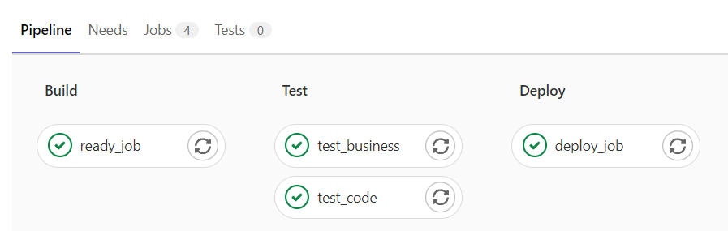

**作业的stage属性默认值是test。如果一条流水线既没有定义stages，其中的作业也没有指定stage，那么该流水线的所有作业都属于test阶段。**

**注意：如果定义了stages，就必须把作业使用的stage值都定义出来，即使使用的默认值，不然流水线会报错**。

可能遇到的问题： 阶段并没有并行运行。在这里我把这两个阶段在同一个runner运行了，所以需要修改runner每次运行的作业数量。默认是1，改为10。

vim /etc/gitlab-runner/config.toml 更改后自动加载无需重启。

```
concurrent = 10
```

## script

script关键词用于定义当前作业要执行的脚本。通常情况下，每个作业都需要定义script的内容（除了使用trigger触发的作业）。用script定义的内容会在runner的执行器中执行。让我们来看清单4-3所示的示例。

```yaml
npm_inst:
  script: npm install
```

这里定义了一个`npm_inst`的作业，`script`关键词定义了一行内容`npm install`，这是一个`npm`命令，用于安装Node.js依赖包。

需要说明的是，在每个作业开始时，runner会进行一系列的初始化，这些初始化包括将当前的项目代码下载到执行器的工作目录（working-directory），并进入项目的根目录，同时清空一些不需要的文件。在不同的执行器上，会有一些差异，详见2.4节。

在执行`npm install`时，其实就是在项目的根目录下执行。如果GitLab Runner是直接在宿主机上安装的，而不是使用Docker，那么在执行`npm install`之前，你需要在宿主机上安装`Node.js`。但如果开发者的执行器是Docker，就需要在这个作业上指定node镜像，这样`script`的内容才可以正常执行。

下面我们使用node镜像来编写多行脚本作业

```yaml
npm_inst:
  image: node
  script: 
    - npm install
    - npm build
```

多行脚本内容使用YAML文件中的数组来表示，使用`-`开头来表示每一行脚本。如果script中的内容有引号，则需要用单引号将整段内容包裹起来，如清单4-5所示。

```yaml
use_curl_job:
  script:
    - 'curl --request POST --header "Content-Type: application/json" "https://gitlab.com/api/v4/projects"'
```

### runner的初始化过程

每当一个作业开始时，GitLab Runner 会执行一系列初始化步骤：

1. **检出项目代码**：GitLab Runner 会将当前项目的代码从 GitLab 仓库检出到执行器的工作目录中。
2. **进入项目根目录**：执行器会进入项目的根目录，以确保 `script` 部分中定义的命令在正确的目录下执行。
3. **处理环境变量和缓存**：GitLab Runner 会设置必要的环境变量，并处理可能的缓存和工件（artifacts）以优化构建过程。

**直接在宿主机上运行与使用 Docker**

如果 GitLab Runner 直接安装在宿主机上（非 Docker 环境），那么在执行 `npm install` 之前，宿主机上必须已经安装了 Node.js 和 npm。(由于我是通过docker安装的gitlab-runner，所以需要进入gitlab-runner容器中安装Node.js等)

但是，对于使用 Docker 执行器的 Runner，通常项目中的依赖应通过 Docker 镜像来提供。通过指定一个包含 Node.js 环境的 Docker 镜像，可以确保脚本能够正常运行。

例如，使用 Docker 执行器，可以这样指定：

```yaml
stages:
  - install
  - test

npm_inst:
  stage: install
  image: node:14 # 指定 Node.js Docker 镜像
  script:
    - npm install
```

我们可以扩展 `.gitlab-ci.yml` 文件以包括测试阶段：

```yaml
stages:
  - install
  - test

npm_inst:
  stage: install
  image: node:14
  script:
    - npm install

run_tests:
  stage: test
  image: node:14
  script:
    - npm test
```

在这个示例中：

- `npm_inst` 作业在 `install` 阶段运行，使用 Node.js 14 的 Docker 镜像并执行 `npm install`。
- `run_tests` 作业在 `test` 阶段运行，同样使用 Node.js 14 的 Docker 镜像并执行 `npm test`。

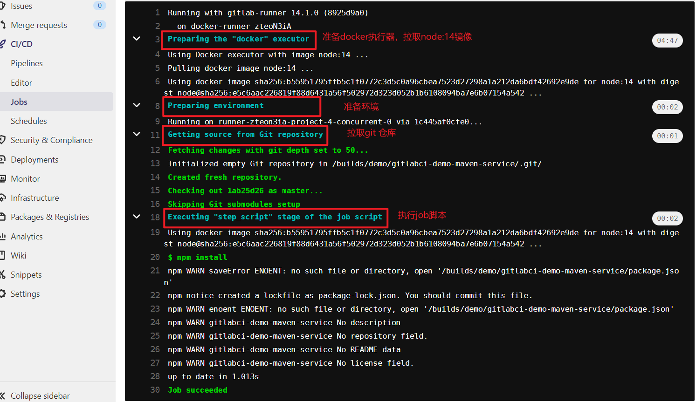

**总结**

在 GitLab CI/CD 中，使用 `script` 关键字定义作业要执行的具体脚本是至关重要的，脚本会在 Runner 的执行器上下文中执行。根据 Runner 的类型（宿主机或 Docker），可能需要相应地配置执行器的环境来确保所需的依赖和工具可用。通过清楚地定义阶段和作业，可以实现有序和自动化的 CI/CD 流程。

### 多个runner的工作流程

当项目具有多个 GitLab Runner 时，执行流程涉及以下几个关键步骤，从作业调度到作业执行，并确保优化资源和调度策略的有效性。

1. **注册 Runner**：每个 Runner 必须先通过 GitLab-Runner  配置注册到 GitLab 实例。每个 Runner 注册时，都会向 GitLab CI 服务器汇报其能力和可用性。

2. **作业调度**：当有新的 CI/CD 作业触发时，GitLab CI/CD 管道将根据配置和可用性确定作业被哪个 Runner 执行。

3. **匹配 Runner 标签**：如果作业或 Runner 使用了标签（标签用于限定某些特定类型的 Runner 去执行作业），那么 GitLab 会先根据这些标签进行匹配。例如：

   ```yaml
   stages:
     - build
     - test
   
   job:
     stage: build
     script:
       - echo "Building"
     tags:
       - docker
   ```

   只有具有 `docker` 标签的 Runner 才能竞争执行这个 `job`。

4. **加载均衡**：

   - GitLab 会根据每个 Runner 的负载和空闲状态来动态分配作业。
   - 如果多个 Runner 使用相同的标签，则 GitLab 会将作业分配给最先响应的空闲 Runner。

5. **执行作业**：

   - 一旦作业分配给一个 Runner，该 Runner 会开始执行作业定义的脚本（如 `script` 部分）。
   - 每个 Runner 会按如下步骤进行操作：
     - 初始化工作环境。
     - 检出项目代码。
     - 切换到项目根目录。
     - 执行定义的 `script`（例如，运行 `npm install`、`npm test` 等）。

6. **报告结果**：

   - 作业执行完成后，Runner 将结果返回给 GitLab CI/CD。
   - GitLab 更新作业的状态，并根据作业的成功或失败，继续后续的管道阶段或作业。

**示例：多 Runner 配置的 `.gitlab-ci.yml`**

假设有两个 Runner，一个是 Docker 环境，另一个是宿主机环境，并且这两个 Runner 使用不同的标签。

```yaml
stages:
  - build
  - test

docker_build:
  stage: build
  script:
    - echo "Building in Docker"
  tags:
    - docker

host_test:
  stage: test
  script:
    - echo "Testing on Host"
  tags:
    - host
```

**注册 Runner 时指定标签**

Docker Runner 标签示例：

```bash
gitlab-runner register \
  --url https://gitlab.example.com/ \
  --registration-token YOUR_REGISTRATION_TOKEN \
  --executor docker \
  --description "Docker Runner" \
  --tag-list "docker" \
  --docker-image "node:14"   # 这是默认的镜像，当job没有image字段时就使用这个默认镜像
```

Shell Runner 标签示例：

```bash
gitlab-runner register \
  --url https://gitlab.example.com/ \
  --registration-token YOUR_REGISTRATION_TOKEN \
  --executor shell \
  --description "Host Runner" \
  --tag-list "host"
```

**调度过程**

1. **Docker Build 作业**：`docker_build` 作业由于使用了 `docker` 标签，GitLab 会分配给注册时带有 `docker` 标签的 Docker Runner 来执行。
2. **Host Test 作业**：`host_test` 作业由于使用了 `host` 标签，GitLab 会分配给注册时带有 `host` 标签的 Shell Runner 来执行。

**负载均衡和并行作业**

- GitLab CI/CD 会尝试均匀地分配作业以确保 Runner 的高效利用和系统负载平衡。
- 如果多个 Runner 满足标签和作业需求，并且它们都处于闲置状态，GitLab 将随机选择一个 Runner 来执行作业。
- 如果作业量较大，GitLab 可以同时启动多个 Runner 来并行执行不同的作业，从而加快整体的作业执行时间。

**总结**

当项目具有多个 GitLab Runner 时，GitLab CI/CD 会根据作业的标签、Runner 的标签、负载和可用性来动态调度作业。通过合理配置标签和取舍注册策略，可以确保不同类型的 Runner 更有效地执行作业负载，实现自动化 CI/CD 流程的高效运行。


## cache

为什么会用到缓存呢？这是因为流水线中的每个作业都是独立运行的，如果没有缓存，运行上一个作业时安装的项目依赖包，运行下一个作业还需要安装一次。如果将上一个作业安装的依赖包缓存起来，在下一个作业运行时将其恢复到工作目录中，就可以大大减少资源的浪费。

缓存用得最多的场景就是缓存项目的依赖包。每一种编程语言都有自己的包管理器，例如，Node.js应用使用NPM来管理依赖包，Java应用使用Maven来管理依赖包，Python应用使用pip来管理依赖包。这些依赖包安装完成后，可能不只为一个作业所使用，项目的构建作业需要使用它们，测试作业也需要使用它们。由于多个作业的执行环境可能不一致，而且在某些执行器中作业被执行完成后会自动清空所有依赖包，在这些情况下，就需要将这些依赖包缓存起来，以便在多个作业之间传递使用。

注意要缓存的文件，路径必须是当前工作目录的相对路径。

关键词cache的配置项有很多，最重要的是paths这个属性，用于指定要缓存的文件路径。配置cache的代码如清单4-6所示。

```yaml
npm_init:
  script: npm install
  cache:
    paths:
      - node_modules
      - binaries/*.apk
      - .config
```

可以看到，`npm_init`作业执行npm install，安装了项目所需要的依赖包。在这个作业结束后，执行器会将工作目录中的node_modules目录、binaries目录下所有以.apk为扩展名的文件以及当前目录下的.config文件压缩成一个压缩包，缓存起来。

如果项目有多个分支，想要设置多个缓存，这时可以使用全局配置cache的key来设置，如清单4-7所示。

```yaml
default:
  cache:
    key: "$CI_COMMIT_REF_SLUG"
    paths:
      - binaries/
```

key的值可以使用字符串，也可以使用变量，其默认值是default。在清单4-7中，key的值就是CI中的变量、当前的分支或tag。在执行流水线的过程中，对于使用相同key缓存的作业，执行器会先尝试恢复之前的缓存。

更加专业的缓存使用：

```yaml
test-job:
  stage: build
  cache:
    - key:
        files: # files属性用于指定生成缓存键时需要考虑的文件列表
        # 这样做的目的是确保生成的缓存键是基于特定文件内容的，以便在文件内容发生变化时正确地更新或重新生成缓存。
        # 在该例中，如果 Gemfile.lock 文件内容被修改，会导致缓存失效，根据新的Gemfile.lock文件内容重新生成缓存。
          - Gemfile.lock
      paths:
        - vendor/ruby
    - key:
        files:
          - yarn.lock
      paths:
        - .yarn-cache/
  script:
    - bundle install --path=vendor
    - yarn install --cache-folder .yarn-cache
    - echo 'install done'
```

## image

image关键词用于指定一个Docker镜像作为基础镜像来执行当前的作业，比如开发者要使用Node.js来构建前端项目，可以像清单4-9这样写。

```yaml
use_image_job:
  image: node:12.21.0
  script: npm - v
```

如果runner的执行器是Docker，这样指定image是没什么问题的。但如果注册的runner执行器是Shell，那么image是没有任何作用的。Shell执行器需要在宿主机上安装Node.js才能运行NPM的指令。这是Docker执行器与Shell执行器的一大区别。

如果当前的作业既需要Node.js的镜像，又需要Golang的镜像，那么可以采用的处理方法有两种：一种是将其拆分成两个作业，一个作业使用Node.js镜像执行对应的脚本，另一个作业使用Golang镜像处理对应的内容；另一种是构建一个新的镜像，将Golang镜像和Node.js的镜像包括在其中，使之包含所需要的Golang环境和Node.js环境。开发者甚至可以将流水线中所有用到的镜像构建到一个镜像中，虽然镜像会比较大，但是很方便。此外，image关键词也支持使用私有仓库的镜像。

### 注意

现注册一个docker执行器的runner

```toml
[[runners]]
  name = "docker-runner"
  url = "http://192.168.220.129"
  token = "zteoN3iAN11pPQscUBoe"
  executor = "docker"
  [runners.custom_build_dir]
  [runners.cache]
    [runners.cache.s3]
    [runners.cache.gcs]
    [runners.cache.azure]
  [runners.docker]
    tls_verify = false
    image = "node:14"
    privileged = false
    disable_entrypoint_overwrite = false
    oom_kill_disable = false
    disable_cache = false
    volumes = ["/cache"]
    shm_size = 0
```

项目的.gitlab-ci.yml文件如下：

```yaml
stages:
  - install
  - test

npm_inst:
  stage: install
  script:
    - node -v

run_tests:
  stage: test
  image: golang:1.19.0
  script:
    - go env
```

CICD执行结果如下：

对于`npm_inst`这个job，使用的镜像为runner注册时输入的默认镜像

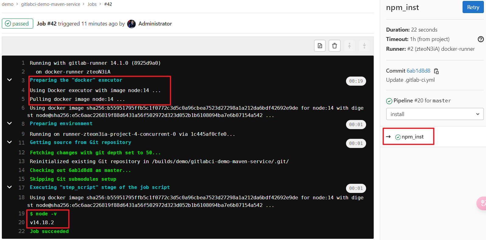

对于`run_tests`这个job使用的是yml文件中image指定的镜像

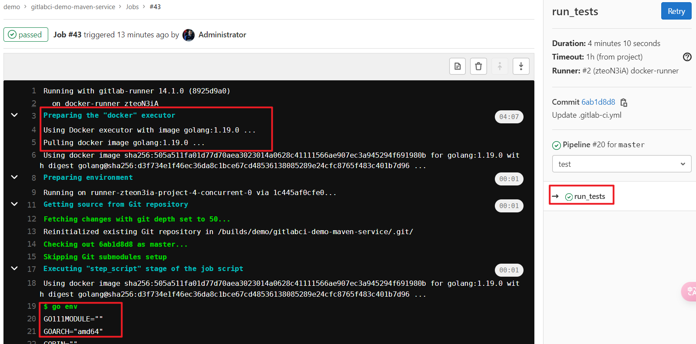

## tags

tags关键词用于指定使用哪个runner来执行当前作业。在为项目注册runner时，开发者需要填写runner的tags—— 这是一个用逗号分隔的字符串数组，用于表明一个runner可以有多个标签。项目所有可用的runner包含在项目的runner菜单中，每个runner至少有一个标签。

如图4-2所示，该项目有两个可用runner，右侧的是共享runner，该runner有两个标签，分别是dockercicd和share-runner。左侧的是项目私有的runner，有一个标签docker-runner。

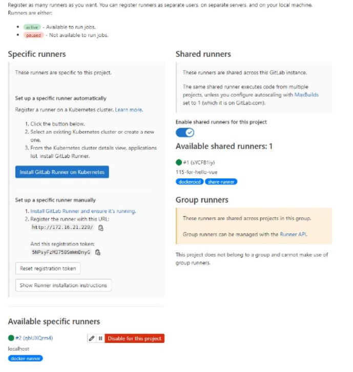

如果开发者想要流水线使用左侧的runner来执行，那么可以在作业中像清单4-10这样配置tags。

```yaml
tags_example:
  tags:
    - docker-runner
  script: echo 'hello fizz'
```

在上述示例中，指定作业的tags为docker-runner，这样作业就能找到对应的runner来执行了。如果指定的tags能找到多个runner，那么作业会在多个runner之间进行调度。一般来讲，除非必要，建议使用同一个runner执行整条流水线，这样可以保持一致性和可靠性。


## .pre & .post=

.pre始终是整个管道的第一个运行阶段，.post始终是整个管道的最后一个运行阶段。 用户定义的阶段都在两者之间运行。`.pre`和`.post`的顺序无法更改。如果管道仅包含`.pre`或`.post`阶段的作业，则不会创建管道。


## variables

在开发流水线的过程中，开发者可以使用variables关键词来定义一些变量。这些变量默认会被当作环境变量，变量的引入让流水线的编写更具灵活性、更具扩展性，可满足各种复杂业务场景的需要。GitLab CI/CD中的变量的定义与使用方式也是非常丰富的。

### 在.gitlab-ci.yml文件中定义变量

在.gitlab-ci.yml文件中，开发者可以使用variables关键词定义变量，如清单4-11所示。

```yaml
variables:
  USER_NAME: "fizz"
print_var:
  script: echo $USER_NAME
```

变量名的推荐写法是使用大写字母，使用下画线_来分隔多个单词。在使用时，可以直接使用变量名，也可以使用$变量名，或使用${变量名}。为了与正常字符串区分开来，我们推荐使用后一种方式。如果将变量定义在全局范围，则该变量对于任何一个作业都可用；如果将变量定义在某个作业，那么该变量只能在当前作业可用；如果局部变量与全局变量同名，则局部变量会覆盖全局变量。

我们来看清单4-12中的示例。在作业test中，全局变量USER_NAME的值fizz会被局部变量USER_NAME的值ZK所覆盖，因此最终输出的结果是hello ZK。

```yaml
variables:
  USER_NAME: 'fizz'
test:
  variables:
    USER_NAME: 'ZK'
  script: echo 'hello' $USER_NAME
```

注意：如果在某一个作业的script中修改了一个全局变量的值，那么新值只在当前的脚本中有效。对于其他作业，全局变量依然是当初定义的值。

### 在CI/CD设置中定义变量

除了在.gitlab-ci.yml中显式地定义变量，开发者还可以在项目的CI/CD中设置一些自定义变量，如图4-3所示。

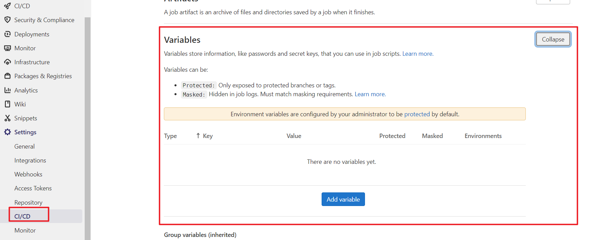

在这里，开发者可以定义一些比较私密的变量，例如登录DockerHub的账号、密码，或者登录服务器的账号、密码或私钥。

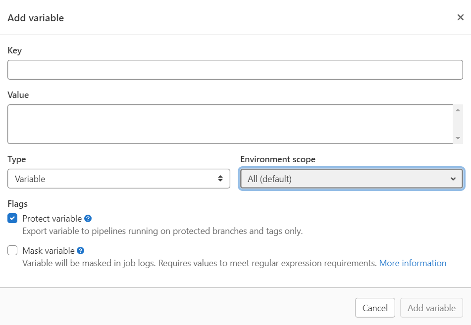

将隐秘的信息变量定义在这里，然后勾选Mask variable复选框，这样在流水线的日志中，该变量将不会被显式地输出（但对变量值有一定格式要求）。这可以使流水线更安全，不会直接在代码中暴露隐秘信息。开发者还可以将一些变量设置为只能在保护分支使用。

如果有些变量需要在一个群组的项目中使用，可以设置群组CI/CD变量。群组CI/CD变量设置入口如图4-5所示。

注意，开发者也可以在群组的范围下注册runner。注册的runner对于在群组中的每一个项目都可使用。

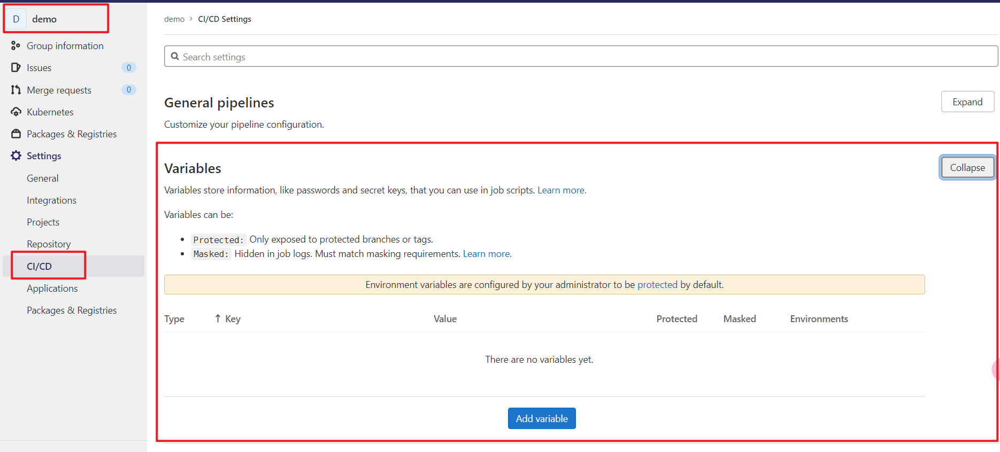

如果想查看当前流水线所有的变量，可以在script中执行export指令。

### 预设变量

除了用户自定义变量，在GitLab CI/CD中也有很多预设变量，用于描述当前操作人、当前分支、项目名称、当前触发流水线的方式等。使用这些预设变量可以大幅度降低开发流水线的难度，将业务场景分割得更加精确。一些常见的预设变量如下所示。

- CI_COMMIT_BRANCH ：提交分支的名称。
- GITLAB_USER_NAME：触发当前作业的GitLab用户名。
- CI_COMMIT_REF_NAME：正在构建项目的分支或tag名。
- CI_COMMIT_SHA：提交的修订号。
- CI_COMMIT_SHORT_SHA：提交的8位数修订号。
- CI_COMMIT_TAG：提交的tag名称，只在tag流水线中可见。
- CI_JOB_NAME：作业的名称。
- CI_PROJECT_NAME：项目的名称。

## when

when关键词提供了一种监听作业状态的功能，只能定义在具体作业上。如果作业失败或者成功，则可以去执行一些额外的逻辑。例如当流水线失败时，发送邮件通知运维人员。

when的选项如下所示。

- on_success：此为默认值，如果一个作业使用`when: on_success`，那么在此之前阶段的所有作业都成功执行后，才会触发当前的作业。
- on_failure：如果一个作业使用`when: on_failure`，当在此之前阶段中所有作业失败后，才会触发该作业。
- always：不管之前的作业的状态如何，都会执行该作业。
- manual：当用`when: manual`修饰一个作业时，该作业只能被手动执行。
- delayed：当某个作业设置了`when: delayed`时，当前作业将被延迟执行，而延迟多久可以用`start_in`来定义，如定义为5 seconds、30 minutes、1 day、1 week等。
- never：流水线不被执行或者使用rule关键词限定的不被执行的作业。

如果开发者想要监听当前流水线的失败状态，并在流水线失败时执行作业，可以将清单4-14所示的这个作业放到最后的阶段来执行。

```yaml
fail_job:
  script: echo 'Everything is going to be alright,Maybe not today but eventually'
  when: on_failure
```

注意：该作业必须放到最后一个阶段来执行，只有这样，才能监听到之前所有阶段的作业失败状态。如果之前的作业没有失败，该作业将不会被执行；如果之前的作业有一个失败，该作业就会被执行。

## artifacts

在执行流水线的过程，开发者可能需要将一些构建出的文件保存起来，比如一些JAR包、测试报告，这时就可以使用artifacts关键词来实现。**开发者可以使用artifacts关键词配置多个目录或文件列表，作业一旦完成，这些文件或文件夹会被上传到GitLab—— 这些文件会在下一个阶段的作业中被自动恢复到工作目录，以便复用。**通过这种方式，开发者可以很好地持久化测试报告和其他文件，也可以在GitLab上自由查看和下载这些文件。

通过artifacts的配置项，开发者可以很容易地设置其大小和有效期，也可以使用通配符来选择特定格式的文件。清单4-15给出了一个将文件目录保存到artifacts下的简单示例。

```yaml
artifacts_test_job:
  script: npm run build
  artifacts:
    paths:
      - /dist
```

上面的作业，会在执行完npm run build后，将/dist目录作为artifacts上传到GitLab上。在14.x的版本中，开发者可以直接在GitLab在线查看artifacts的内容而不用下载。

清单4-16给出了一个artifacts的复杂配置示例。

```yaml
upload:
  script: npm run build
  artifacts:
    paths:
      - /dist
      - *.jar
    exclude:
      - binaries/**/*.o
    expire_in: 1 week
    name: "$CI_JOB_NAME"
```

在上述示例中，我们定义了一个upload作业，在作业完成后，它会将/dist和当前目录下所有以.jar为扩展名的文件存储起来，并将binaries目录下的所有以.o为扩展名的文件排除掉。文件的有效期是1周，artifacts名称使用当前的作业名称来命名。

## before_script

before_script关键词与script关键词类似，都用于定义作业需要执行的脚本、命令行。不同之处在于before_script必须是一个数组。更重要的是，before_script内容执行的时机是执行script内容之前、artifacts被恢复之后。开发者也可以在default关键中定义全局的before_script，定义后其将在每个作业中执行。

## after_script

after_script关键词用于定义一组在作业执行结束后执行的脚本，这必须是一个数组。与before_script的不同之处在于它的执行时机以及执行环境——after_script是在单独的Shell环境中执行的，对于在before_script或者script中定义或修改的变量，它是无权访问的。after_script还有一些其他特殊之处：如果当前作业失败，它也会被执行；如果作业被取消或者超时，它将不会被执行。

可以在全局定义，也可以在job中定义。在job中定义会覆盖全局。

```yaml
before_script:
  - echo "before-script!!"

variables:
  DOMAIN: example.com

stages:
  - build
  - test

go_test:
  variables:
    ONE_YEAR: "peace for world"
  before_script:
    - ls -la
    - echo "before-script in job"
    - ONE_YEAR="111 year"
    - echo $ONE_YEAR
  stage: test
  after_script:
    - pwd
    - ls -la
    - echo $ONE_YEAR
    - echo "after script in job"
  image: golang
  script:
    - pwd
    - ls -la
    - echo $ONE_YEAR
```


## only与except

only与except这两个关键词用于控制当前作业是否被执行，或当前作业的执行时机。only是只有当条件满足时才会执行该作业；except是排除定义的条件，在其他情况下该作业都会被执行。

如果一个作业没有被only、except或者rules修饰，那么该作业将默认被 `only` 修饰，值为所有的分支和标签，即 `only: [ branches, tags ]`。（则默认适用于所有分支和标签）。最常用的语法就是，控制某个作业只有在修改某个分支时才被执行。如清单4-17所示，只有修改了test分支的代码，该作业才会被执行。

```yaml
only_example:
  script: deploy test
  only:
    - test
```

only与except可以配置4种值，如下所示。

- refs
- variables
- changes
- Kubernetes

### only:refs/except:refs

如果only/except关键词配置的是refs，表明作业只有在某个分支或某个流水线类型下才会被添加到流水线中或被排除。清单4-18给出了only:refs的使用示例。

```yaml
test:
  script: deploy test
  only:
    - test # 表示只有在名为 test 的分支上提交代码时才会执行。
build:
  script: deploy test
  only:
    refs:
    # 只要引用(可以是分支名、标签名)中包含名称为 test 的情况下，即使不是具体分支，作业也会执行。
    # 你有一个分支命名为 feature-test，或者一个标签名为 release-test，那么这个作业就会针对这些分支或标签执行。
      - test 
deploy:
  script: deploy test
  only:
    refs:
      - tags
      - schedules
```

在上述示例中，虽然test作业与build作业下only的定义方式不一样，但是作用都是一样的，即只有修改了test分支的代码后，作业才会被执行。deploy作业下的only是使用refs来定义的—— 使用tags与schedules。这意味着只有项目创建了tags或者当前是定时部署该作业才会被执行。像tags与schedules这样的refs限定条件还有很多，如下所示。

- api：使用pipeline API触发的流水线。
- branches：表示作业将在所有分支上触发执行
- chat：使用GitLab ChatOps命令触发的流水线
- merge_requests：流水线由创建或更新merge_request触发。
- web：使用GitLab Web上的Run pipeline触发的流水线。

此外，refs的值也可以配置成正则表达式，如`/^issue-.*$/`。

### only:variables/except:variables

only:variables与except:variables可以根据CI/CD中的变量来动态地将作业添加到流水线中。清单4-19所示的示例就是使用变量来控制作业的执行。

```yaml
test:
  script: deploy test
  only:
    variables:
      - $USER_NAME === "fizz"
```

在上述示例中，只有定义的变量USER_NAME等于fizz时，该作业才会被执行。开发者可以配置多个only:variables的条件判断，只要有一个条件符合，作业就会被执行。

### only:changes/except:changes

使用changes来修饰关键词only适用于某些文件改变后触发作业的情景，例如，只有项目中Dockerfile文件改变后，才执行构建Docker镜像的作业。可以用于控制作业是否在特定文件或目录变化时执行。这提供了一种更加精细化的控制方式，尤其在大型项目中可以有效减少不必要的作业执行，从而提高效率。这些针对文件改变执行或不执行的作业都可以使用only:changes或except:changes来定义。

```yaml
假设你有一个项目，包含以下目录结构：
.
├── Dockerfile
├── fe/
│   ├── src/
│   │   ├── main.js
│   │   └── utils.js
│   └── index.html
├── be/
│   ├── main.py
│   └── requirements.txt
└── .gitlab-ci.yml
你想要设置一个 CI 作业，仅在 Dockerfile 或 fe 目录下的文件发生改变时执行。

# 在 .gitlab-ci.yml 文件中，你可以像这样定义：
stages:
  - build
  - test

build_docker: # build_docker 作业将在 Dockerfile 改变时触发。
  stage: build
  script:
    - echo "Building Docker image"
  only:
    changes:
      - Dockerfile

test_fe: # test_fe 作业将在 fe 目录下的任何文件发生改变时触发。
  stage: test
  script:
    - echo "Running frontend tests"
  only:
    changes:
      - fe/**/* # 通配符 **/* 表示匹配目录及其子目录下的所有文件。

test_all: # test_all 作业将在除了 fe 目录和 Dockerfile 改变之外的任何改变时触发。
  stage: test
  script:
    - echo "Running all tests"
  except:
    changes:
      - fe/**/*
      - Dockerfile
```

在 Tag 流水线或定时触发的流水线中，作业不会检查 `changes` 条件，而是直接执行。

#### Tag流水线

**Tag 流水线**是在创建 Git 标签（tag）时触发的流水线，这种流水线在标签被推送到仓库时自动执行。标签通常用于标记项目中的重要版本或里程碑，例如发布版本或版本升级。

对于 Tag 流水线中作业的执行规则：

1. 默认情况下，所有作业会运行：在 Tag 流水线中，一般情况下，所有作业都会执行，不受 `only: tags` 的限制。
2. 如果设置了 `only: tags` 条件，那么该作业将只在标签被推送时触发。

假设你有一个标签 `v1.0`，当你推送这个标签到 Git 仓库时，将触发 Tag 流水线。

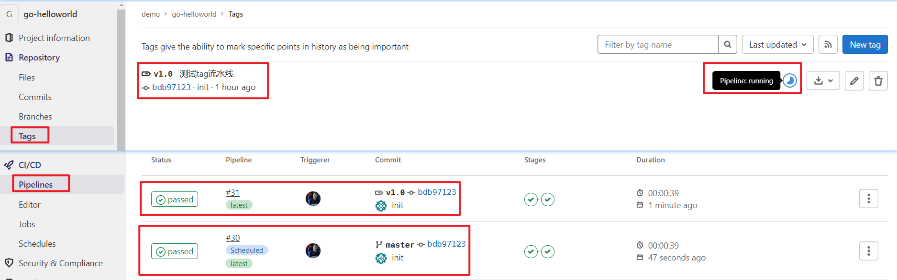


#### 定时触发流水线

**定时触发流水线**（Scheduled Pipeline）是在预设的时间间隔或特定时间点自动触发的流水线。使用定时触发流水线，你可以安排 CI 任务在固定的时间间隔内自动运行，例如每日构建、每周自动测试等。

定时触发流水线中作业的执行规则：

1. **默认情况下，所有作业会运行：** 在定时触发的流水线中，除非明确指定了其他条件来限制作业的运行，否则所有作业将会执行。
2. **使用 `only` 来限制作业的触发条件：** 如果想要某个作业只在定时触发时执行，可以使用 `only: schedules` 来指定。这样，该作业将仅在定时触发时执行，而在其他触发条件下不执行。

举个例子，假设在 `.gitlab-ci.yml` 中有如下作业配置：

```yaml
test:
  stage: test
  script:
    - echo "Running tests"
  only:
    - schedules
```

在这种情况下，只有当定时任务触发流水线时，`test` 作业才会运行。如果没有设置 `only: schedules`，那么无论什么触发方式，该作业都会运行。

对于定时触发流水线的总结：

- 默认情况下，所有作业会在定时触发时运行。
- 如果希望作业只在定时触发时运行，可以使用 `only: schedules`。

你可以在项目中的 "CI/CD  /  Schedules " 中配置一个定时触发任务。

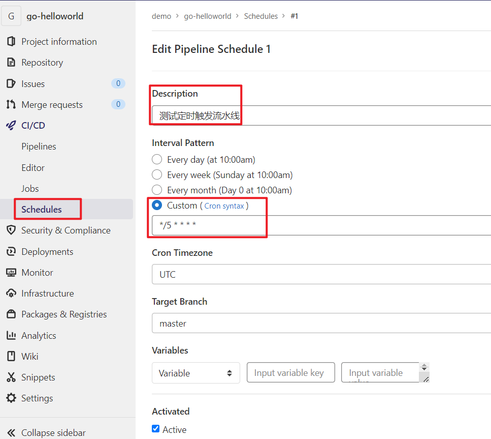

看看执行的结果，发现确实被定时调度了

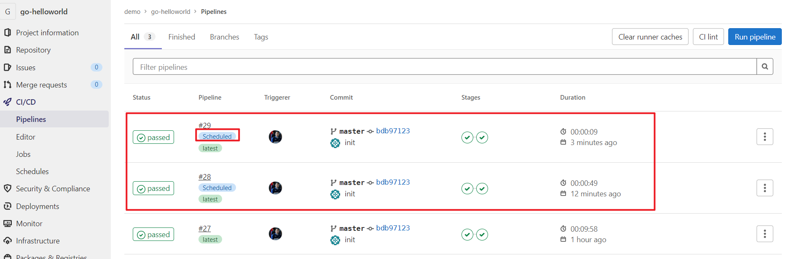


**`only: changes` 与 `except: changes` 在 Tag 和定时触发流水线中的行为**

在 Tag 流水线和定时触发的流水线中，`only: changes` 和 `except: changes` 的规则通常会被忽略。换句话说，这些作业会直接触发，而不检查具体文件的变化。这是因为：

- 对于标签推送，标签本身不代表具体文件的变化。
- 对于定时触发，定时任务的重点在于按时执行，而非监控特定文件的变化。

# 中阶关键词

## dependencies

dependencies关键词可以定义当前作业下载哪些前置作业的artifacts，或者不下载之前的artifacts。dependencies的值只能取自之前阶段的作业名称，可以是一个数组，如果是空数组，则表明不下载任何artifacts。在GitLab CI/CD中，所有artifacts会在之后的作业被默认下载的，如果artifacts非常大或者一条流水线有很多artifacts，则默认下载全部artifacts就会很低效。正确的做法是使用dependencies来控制，仅下载必要的artifacts。清单5-2给出了一个dependencies的示例。

```yaml
stages:
  - build  
  - deploy
build_windows:
  stage: build   
  script: 
    - echo "start build on windows"
  artifacts:
    paths:
      - binaries/
build_mac:
  stage: build
  script: 
    - echo "start build on mac"
  artifacts:
    paths:
      - binaries/
deploy_mac:
  stage: deploy
  script: echo 'deploy mac'
  dependencies:
    - build_mac
deploy_windows:
  stage: deploy
  script: echo 'deploy windows'
  dependencies:
    - build_windows
release_job:
  stage: deploy
  script: echo 'release version'
  dependencies:[]
```

注意事项：

- `dependencies` 可以有效地防止不必要的构建产物下载，减少CI资源的消耗。
- 如果不显式地设置 `dependencies`，那么默认情况下，当前作业将下载所有前置阶段所有作业的产物。
- `dependencies` 指定的作业必须存在且产生了 `artifacts`，否则会导致作业失败。
- 同一个阶段的多个作业（jobs）之间无法直接共享彼此的产物（artifacts）

理由：

- **阶段隔离**：GitLab CI/CD设计阶段（stages）的初衷是为了将编译、测试、部署等过程分离开来。每个阶段中的作业是并行执行的，因此同一个阶段中的多个作业之间不能直接共享产物。
- **提高并行效率**：在一个阶段内部同一时间允许多个作业并行执行，不同作业之间可能相互依赖会导致数据同步等问题，影响CI/CD流程的效率。


## allow_failure

allow_failure关键词用于设置当前作业失败时流水线是否继续运行，也就是说，是否允许当前作业失败。在一般场景下，allow_failure的默认值为false，即不允许作业错误，作业错误流水线就会停止往下运行。但如果一个作业是手动触发的，则该作业的allow_failure默认为true。如果一个作业配置了allow_failure为true，并且在运行时出现了错误，那么在该作业的名称后会有一个黄色的感叹号，并且流水线会继续往下运行。一般将allow_failure设置为true的作业都是非硬性要求的作业。比如在一个临时分支做的代码检查作业，允许代码检查作业失败。清单5-3给出了一个allow_failure的示例。

```yaml
test1:
  stage:test
  script: echo 'start test1'
test2:
  stage:test
  script: echo 'Life is sometimes not to risk more dangerous than adventure'
  allow_failure: true
deploy:
  stage: deploy
  script: echo 'start deploy'
```

在上述示例中，test1与test2同属test阶段，会同时执行，并且test2中配置了allow_failure:true。如果test1执行失败，流水线就会停止运行，下一阶段中的deploy作业也将不会执行。如果只是test2执行失败，那么流水线会继续运行，作业deploy将会执行。

## extends

extends关键词可用于继承一些配置模板。利用这个关键词，开发者可以重复使用一些作业配置。extends关键词的值可以是流水线中的一个作业名称，也可以是一组作业名称。清单5-4给出了一个extends的示例。

```yaml
.test:
  script: npm lint
  stage: test
  only:
    refs:
      - branches
test_job:
  extends: .test 
  script: npm test
  only:
    variables:
      - $USER_NAME
```

在上述的示例中，有两个作业，一个是.test，另一个是test_job。可以看到，在test_job中配置了extends: .test。

在GitLab CI/CD中，如果一个作业的名称以“.”开头，则说明该作业是一个隐藏作业，任何时候都不会执行。这也是注释作业的一种方法，上文说的配置模板就是指这类被注释的作业。test_job继承了作业.test的配置项，两个作业的配置项会进行一次合并。test_job中没有而.test作业中有的，会被追加到test_job中。test_job中已经有的不会被覆盖。

最后，test_job的作业内容如清单5-5所示。

```yaml
test_job:
  stage: test
  script: npm test
  only:
     refs:
       - branches
     variables:
       - $USER_NAME
```

开发者可以将流水线中一组作业的公共部分提取出来，写到一个配置模板中，然后使用extends来继承。这样做可以大大降低代码的冗余，提升可读性，并方便后续统一修改。

## default

default是一个全局关键词，定义在.gitlab-ci.yml文件中，但不能定义在具体的作业中。default下面设置的所有值都将自动合并到流水线所有的作业中，这意味着使用default可以设置全局的属性。能够使用default设置的属性有after_script、artifacts、before_script、cache、image、interruptible、retry、services、tags和timeout。

清单5-6所示的例子展示了default关键词的用法。

```yaml
default:
  image: nginx
  before_script:
    - echo 'job start'
  after_script:
    - echo 'job end'
  retry: 1
build:
  script: npm run
test:
  image: node
  before_script:
    - echo 'let us run job'
  script: npm lint
```

可以看到，在default下定义了image、before_script、after_script和retry这4个属性。这些属性会被合并到所有作业里。如果一个作业没有定义image、before_script、after_script或retry，则使用default下定义的；如果定义了，则使用作业中定义的。default下定义的属性只有在作业没有定义时才会生效。根据default的合并规则，作业build和作业test合并后的代码如清单5-7所示。

```yaml
default:
  image: nginx
  before_script:
    - echo 'job start'
  after_script:
    - echo 'job end'
  retry: 1
build:
  image: nginx
  before_script:
    - echo 'job start'
  after_script:
    - echo 'job end'
  retry: 1
  script: npm run
test:
  after_script:
    - echo 'job end'
  retry: 1
  image: node
  before_script:
    - echo 'let us run job'
  script: npm lint
```

如果开发者想要实现在某些作业上不使用default定义的属性，但又不想设置一个新的值来覆盖，这时可以使用关键词inherit来实现。

## inherit

inherit关键词可以限制作业是否使用default或者variables定义的配置。inherit下有两个配置，即default与variables。我们先来看一下如何使用inherit:default。

清单5-8所示的例子展示了如何在一个作业中使用inherit:default。

```yaml
default:
  retry: 2
  image: nginx
  before_script:
    - echo 'start run'
  after_script:
    - echo 'end run'
test:
  script: echo 'hello'
  inherit:
    default: false
deploy:
  script: echo 'I want you to be happy,but I want to be the reason'
  inherit:
    default: 
      - retry
      - image
```

在上述的例子中，我们定义了一个default，并设置了4个全局的配置，即retry、image、before_script和after_script。在test作业中，我们设置inherit为default: false，这表明该作业不会合并default的属性，也就意味着default的4个属性都不会设置到test作业中。在另一个作业deploy中，我们设置inherit的default的retry和image，这样设置后，作业deploy将会合并default的retry和image属性。也就是说，inherit: default下可以设置true或false，也可以设置一个数组，数组中的值取自default的属性。

让我们再来看一下inherit:variables的用法。inherit:variables下可以设置true或者false，也可以设置一个数组，数组的值取自全局定义的variables。清单5-9展示了inherit:variables的用法。

```yaml
variables:
  NAME: "This is variable 1"
  AGE: "This is variable 2"
  SEX: "This is variable 3"
test:
  script: echo "该作业不会继承全局变量"
  inherit:
    variables: false
deploy:
  script: echo "该作业将继承全局变量 NAME和AGE"
  inherit:
    variables:
      - NAME
      - AGE
```

在上述的例子中，我们定义了3个全局变量，并在test作业中设置inherit为variables:false，这样设置后，全局变量不会被引入test作业中；在deploy作业中，将inherit设置为variables:-NAME-AGE，这样设置后，全局变量NAME和AGE将被引入deploy作业中。

## interruptible


## needs

needs关键词用于设置作业之间的依赖关系。跳出依据阶段的运行顺序，为作业之间设置依赖关系，可以提高作业的运行效率。通常，流水线中的作业都是按照阶段的顺序来运行的，前一个阶段的所有作业顺利运行完毕，下一阶段的作业才会运行。但如果一个作业使用needs设置依赖作业后，只要所依赖的作业运行完成，它就会运行。这样就会大大提高运行效率，减少总的运行时间。

清单5-11展示了needs的用法。

```yaml
stages:
  - install
  - build
  - deploy
install_java:
  stage: install
  script: echo 'start install'
install_vue:
  stage: install
  script: echo 'start install'
build_java:
  stage: build
  needs: ["install_java"]
  script: echo 'start build java'
build_vue:
  stage: build
  needs: ["install_vue"]
  script: echo 'start build vue'
build_html:
  stage: build
  needs: []
  script: echo 'start build html'
job_deploy:
  stage: deploy
  script: echo 'start deploy'
```

在上面的例子中，我们定义了3个阶段，即install、build和deploy。按照常规的运行顺序，install阶段的作业会优先运行；等到install阶段所有的作业都完成后，build阶段的作业才会运行；最后deploy阶段的作业得以运行。但由于该项目是一个前、后端不分离的项目，即包含了Java后端应用和Vue前端应用—— 这两个应用的安装依赖和构建是相互独立的，因此我们在build_java和build_vue两个作业中设置了各自的依赖作业，即build_java作业依赖install_java作业，build_vue作业依赖install_vue作业。这样设置后，只要install_java作业运行完毕，build_java就会开始运行。build_vue与此同理。我们在作业build_html中设置了needs:[]，这样设置后，虽然它属于第二队列build阶段，该作业将会放到第一队列运行，当流水线触发时它就会运行。待作业build_vue与build_java运行完毕后，deploy阶段的job_deploy作业才会运行。

我们在GitLab上可以看到作业的依赖关系，如图5-2所示。


## pages

pages关键词用于将作业artifacts发布到GitLab Pages，其中需要用到GitLab Pages服务—— 这是一个静态网站托管服务。注意，需要将网站资源放到artifacts根目录下的public目录中，且作业名必须是pages。

清单5-14展示了pages的用法，即如何使用pages关键字将artifacts发布到GitLab Pages上。

```yaml
pages:
  stage: deploy
  script:
    - mkdir .public
    - cp -r * .public
    - mv .public public
  artifacts:
    paths:
      - public
```

在上述的例子中，我们定义了一个名为pages的作业，然后将网站的静态资源都复制到public目录中—— 为避免复制死循环，可以先创建一个临时目录，最后配置artifacts的路径为public。这样作业运行后，就会将artifacts发布到GitLab Pages上。如果GitLab是私有化部署，需要管理员开启GitLab Pages功能。

## parallel

parallel关键词用于设置一个作业同时运行多少次，取值范围为2～50，这对于非常耗时且消耗资源的作业来说是非常合适的。要在同一时间多次运行同一个任务，开发者需要有多个可用的runner，或者单个runner允许同时运行多个作业。

清单5-15展示了parallel的简单用法。

```yaml
test:
   script: echo 'hello WangYi'
   parallel: 5
```

在上述例子中，我们定义了一个test作业，并设置该作业的parallel为5，这样该作业将会并行运行5次。作业名称以test 1/5、test 2/5、test 3/5这样命名，以此类推，如图5-3所示。

## retry

retry关键词用于设置作业在运行失败时的重试次数，取值为0、1或2，默认值为0。如果设置为2，则作业最多再运行2次。除了可以在作业上设置，retry关键词还可以在default关键词下设置，为每个作业设置统一的重试次数。

清单5-17展示了retry的简单用法。

```yaml
build:
  script: npm build
  retry: 2
```

在上面的例子中，我们定义了一个build作业，如果该作业第一次运行失败，将会继续尝试运行，且最多再尝试运行2次。

除了简单设置重试次数，retry还可以设置为当特定错误出现时进行重试，如清单5-18所示。

```yaml
build:
  script: npm build
  retry: 
    max: 2
    when: runner_system_failure
```

在上述例子中，如果错误类型是runner_system_failure则进行重试，如果为其他错误类型则不会进行重试。类似的错误类型还有如下几种。● always：任务错误都会重试。● unknown_failure：未知失败时重试。● script_failure：当执行脚本失败时重试。● api_failure：当错误类型是API失败时重试。

## timeout


## release


# 高阶关键词

## rules


### rules:if

rules:if用于条件判断，可以配置多个表达式，当表达式的结果为true时，该作业将被运行。清单6-1显示了rules:if的用法。


### rules:changes


### rules:exists


### rules:allow_failure


### rules:variables


## workflow


## trigger


## include


## resource_group


## environment


## services


## secrets


## dast_configuration


