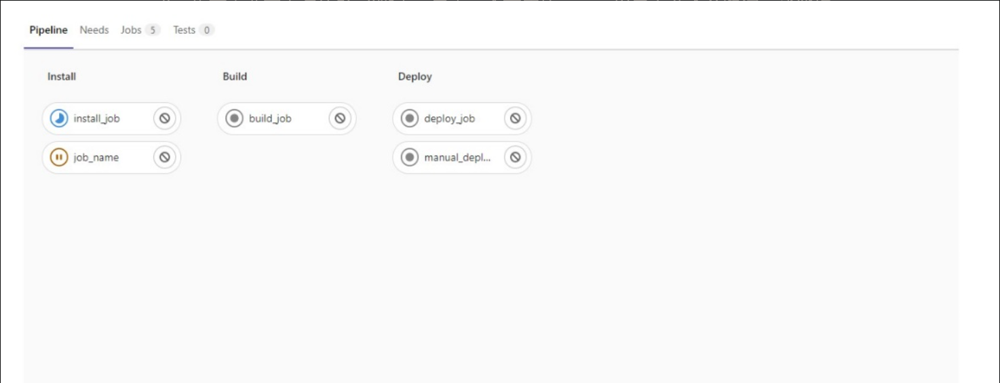

# CI/CD的含义

在学习GitLab CI/CD之前，我们需要先了解一下什么是CI/CD。

CI是Continuous Integration的缩写，意为持续集成。联系到具体的开发运维场景，就是指开发者在完成项目中的一个小特性后，将自己分支的代码合并到测试分支，这个过程就是集成，在这一集成过程中会运行一系列代码格式的检查、单元测试等严格保证项目质量的检查作业。每一次提交，都需要经过严格的自动化测试，代码才能被合并，这样可以极大降低集成的风险，保证项目的稳定。CI可以帮助开发人员更加频繁地（有时甚至每天）将代码更改合并到共享分支或“主干”中。一旦开发人员对应用所做的更改被合并，系统就会通过自动构建应用并运行不同级别的自动化测试（通常是单元测试和集成测试）来验证这些更改，确保这些更改没有对应用造成破坏。

CD有两种含义，这两种含义对应的过程都是在CI阶段完成后进行的。第一种含义，CD是指持续交付(Continuous Delivery)。完成CI中的所有作业后，持续交付可自动将已验证的代码发布到存储库。持续交付的目标是拥有可随时部署到生产环境的artifacts或者镜像，这一过程一般是手动实现的。第二种含义，CD是指持续部署(Continuous Deployment)。鉴于部署环境和部署方式的差异以及各种应用之间的耦合，部署这一项任务不再是用简单的几行命令能搞定的了。**注意，持续交付是手动实现的，而持续部署是自动实现的，这就是两者最大的区别。**持续部署意味着只要提交了代码，就可以实现自动将代码部署到开发环境、测试环境甚至生产环境。这无疑是非常方便、快捷的。

# GitLab CI/CD简介

在1.1节中，我们介绍了CI/CD的含义以及它在开发运维过程中的重要作用。接下来，我们来聊聊本书的“主角”—— GitLab CI/CD。

GitLab CI/CD最初是GitLab于2015年6月发布的一个特性，它支持在项目中编写一个.gitlab-ci.yml文件来定义一组自动化作业，这些自动化作业组成一条自动化流水线；2016年，GitLab又推出自研的GitLab Runner软件包，以此作为流水线的运行环境。时至今日，.gitlab-ci.yml文件与GitLab Runner仍然是GitLab CI/CD的两大基本概念。

GitLab CI/CD是一个与GitLab紧密协作的工具。众所周知，GitLab是一个开源的代码管理平台，也是目前全球最受软件开发公司欢迎的代码管理平台之一，而CI/CD与代码管理在软件生命周期中是密不可分的两个部分，就像茶杯和茶盖一样。试想一下，当开发者合并了代码之后，GitLab CI/CD会自动运行测试用例，构建、部署环境，并且开发者能在GitLab中看到整个流程的所有信息，包括日志、流程和artifacts，不需要登录GitLab之外的任何平台。它就像一个超级市场，提供一站式服务，囊括了CI/CD过程中的所有信息。

GitLab CI/CD还有很多优秀的特性，例如自动取消流水线、部署环境、管理多种变量，可以让你的流水线在任何主流系统平台运行；多种复杂流水线可并行运行，如父子流水线、跨项目流水线；具有安全部署、部署冻结、实时日志、流水线调试、可定制的流水线编辑器、实时校验等特性。这些特性在本书后面的章节中都会有所涉及。使用这些特性会让项目集成部署流程更加安全、稳定、可靠。

总的来说，GitLab CI/CD有以下几个特性：

- 良好的用户体验。
- 部署覆盖场景广。
- 运行足够快。
- 多平台支持。
- 开源。
- 简单，可快速上手。

# GitLab CI/CD的几个基本概念

我们说了GitLab CI/CD那么多的优点，那么它到底是由哪几部分组成的？有哪些基本概念？搭建它又需要哪些知识？

在本节中，我们先来整体介绍一下GitLab CI/CD的几个概念、它由哪几部分构成，以及各个组件是如何相互搭配工作的。

GitLab CI/CD由以下两部分构成。

(1)运行流水线的环境。它是由GitLab Runner提供的，这是一个由GitLab开发的开源软件包，要搭建GitLab CI/CD就必须安装它，因为它是流水线的运行环境。

(2)定义流水线内容的.gitlab-ci.yml文件。这是一个YAML文件，它以一种结构化的方式来声明一条流水线—— 官方提供了很多关键词来覆盖各种业务场景，使你在编写极少Shell脚本的情况下也能应对复杂的业务场景。

除此之外，在定义的流水线中，还需要掌握的概念有以下几个。

(1)流水线(pipeline)。在GitLab CI/CD中，流水线由.gitlab-ci.yml文件来定义。实际上，它是一系列的自动化作业。这些作业按照一定顺序运行，就形成了一条有序的流水线。触发流水线的时机可以是代码推送、创建tag、合并请求，以及定时触发等。通常，由创建tag触发的流水线叫作tag流水线，由合并请求触发的流水线叫作合并请求流水线。此外，还有定时触发的定时流水线、跨项目流水线以及父子流水线等。

(2)阶段(stages)。阶段在流水线之下，主要用于给作业分组，并规定每个阶段的运行顺序。它可以将几个作业归纳到一个群组里，比如构建阶段群组、测试阶段群组和部署阶段群组。

(3)作业(job)。作业在阶段之下，是最基础的执行单元。它是最小化的自动运行任务，比如安装Node.js依赖包、运行测试用例。

在GitLab的UI中，流水线的详情如图1-1所示。

可以看到，流水线包含3个阶段，分别是Install、Build和Deploy。其中，Install阶段包含两个作业，即install_job和job_name。

至此，我们介绍了GitLab CI/CD的几个基本概念。理解这几个概念，有助于快速地构建基本的GitLab CI/CD知识体系。

如果你要使用GitLab CI/CD，只需要安装一个GitLab Runner，然后在项目根目录创建一个.gitlab-ci.yml文件。是不是很简单？你不需要使用复杂的插件来实现自己的需求，也不需要写太多的Shell脚本，只需一个可用的runner以及七八个关键词，就能将一个项目的流水线运行起来。

虽然GitLab CI/CD的概念很少，学习曲线也比较平缓，但是相关的中文学习资料和教程并不多，相关的视频教程也很少。有人觉得GitLab CI/CD难学，除了上述原因，大概还因为GitLab CI/CD有很多配置项、关键词和流水线变量需要理解。除了GitLab Runner与.gitlab-ci.yml这两大概念，还有很多其他概念和配置项。如GitLab Runner的安装方式就有不少于5种，且每种安装方式又有不同的配置项以及不同的特性。

GitLab Runner安装好之后，并不能被GitLab直接调用，还需要开发者为项目或项目组注册一个可用的runner —— 它将负责执行流水线的内容，并与GitLab通信、上传执行结果与日志。注册runner时，开发者需要了解runner的执行器—— 不同的执行器有不同的特性，在执行流水线时可能会有些许差异。开发者除了需要掌握GitLab Runner多种多样的安装方式和执行器，还要掌握.gitlab-ci.yml文件中的很多内容。要编写.gitlab-ci.yml文件内容，开发者必须使用GitLab CI/CD官方网站给出的关键词。

之所以设计那么多关键词和配置项，是因为软件项目的业务场景是多种多样的，GitLab CI/CD必须要考虑到各种业务场景。在学习初期，开发者只需要了解七八个关键词，就足以应对日常的业务开发。我们会在后续章节中详细介绍GitLab CI/CD的这些关键词和配置项，还将展示如何快速搭建一个完整的GitLab CI/CD的环境以及如何进行一些高阶的流水线操作，以帮助你完成各种复杂的项目集成、解决项目部署难题。

为了帮助你快速、高效地学习GitLab CI/CD，我们设计了一条较为平缓且力求短期受益最大化的学习路线，如下所示：

熟悉GitLab CI/CD的基本概念 → 搭建并配置基础的GitLab CI/CD环境 → 熟悉流水线常用的关键词 → 编写简单的流水线 → 熟悉GitLab Runner高级配置 → 熟悉高阶关键词 → 实践更为复杂的CI/CD场景。