# 第2章 初识容器运行时

## 2.3 容器运行时概述

### 2.3.2 OCI规范

#### 镜像规范

OCI 镜像规范是以 Docker 镜像规范 v2 为基础制定的，定义了镜像的主要格式和内容，用于镜像仓库存放和分发镜像。通过统一容器镜像格式，可以在跨容器平台对相同的镜像进行构建、分发及准备容器镜像。

OCI 镜像规范定义的镜像主要包含以下4个部分。

(1) 镜像索引(Image Index)：该部分是可选的，可以看作镜像清单(Image Manifest)的 Manifest(更高维度的清单聚合器)，是 JSON 格式的描述文件。Image Index 指向不同平台的 Manifest 文件，确保一个镜像可以跨平台使用，每个平台拥有不同的 Manifest 文件。

(2) 镜像清单(Image Manifest)：是 JSON 格式的描述文件，包含镜像的配置(Configuration)和层文件(Layer)以及镜像的各种元数据信息，是组成一个容器镜像所需的所有组件的集合。

(3) 镜像层(Image Layer)：是以 Layer 保存的文件系统，是镜像的主要内容，一般是压缩后的二进制数据文件格式。一个镜像有一个或多个 Layer 文件。每个 Layer 保存了与上层相比变化的部分（如在某一 Layer 上增加、修改和删除的文件等）。

(4) 镜像配置(Image Configuration)：也是 JSON 格式的描述文件，保存了容器 rootfs 文件系统的层级信息，以及容器运行时需要的一些信息（如环境变量、工作目录、命令参数、mount列表）。内容同 nerdctl/docker inspect \<image id> 中看到的类似。

镜像各部分之间通过摘要(digest)来相互引用，相关引用的关系如图2.15所示。

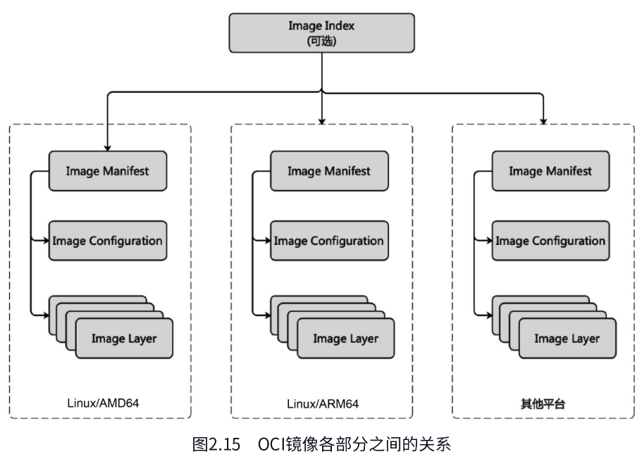

下面对 OCI 镜像的各部分做一个详细的介绍。

1) 镜像索引

镜像索引是镜像中非必需的部分，该内容主要是区分镜像的不同架构平台（如Linux/AMD64、Linux/ARM64、Windows/AMD64等）。同一个镜像支持跨平台时，可根据镜像索引引用不同架构平台的镜像清单。在不同架构平台上使用同一个镜像时，可以使用相同的镜像名。

镜像索引文件的示例如下。

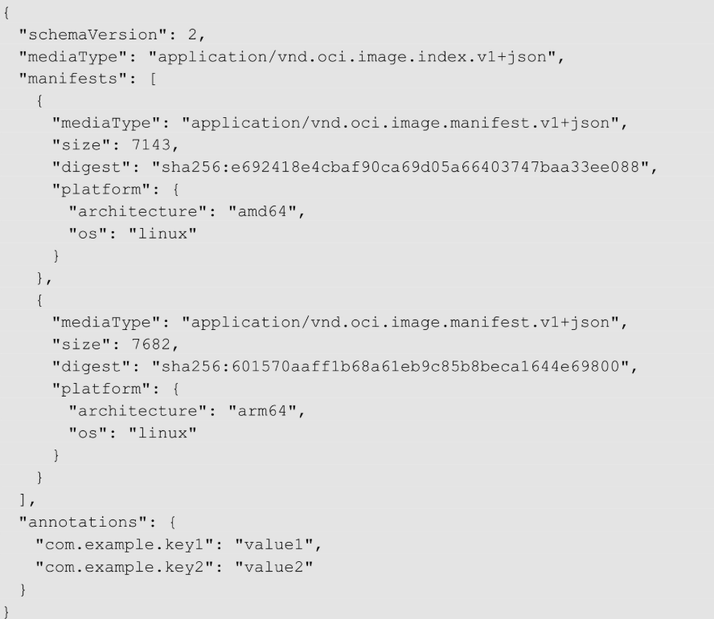

镜像索引文件中包含的参数如下：

- schemaVersion：规范的版本号，为了与旧版本的Docker兼容，此处必须是2。
- mediaType：媒体类型，如 application/vnd.oci.image.index.v1+json 表示 Index 文件，application/vnd.oci.image.manifest.v1+json 则表示 Manifest 文件。
- manifests：表示 Manifest 的列表集合，是一个数组。
- size：表示内容大小，单位为字节(byte)。
- digest：摘要，OCI 镜像各个部分之间通过摘要来建立引用关系，命名格式是所引用内容的 sha256 值，如sha256:xxxxxxx，在镜像仓库或宿主机本地通过 digest 对镜像的各内容进行寻址。
- platform：平台架构类型，包含操作系统类型、CPU架构类型等。其中包含两个必选的值，即 architecture 和 os。architecture 表示 CPU 架构类型，如ARM64、AMD64、ppc64le等。os 表示操作系统类型，如Linux、Windows等。
- annotations：可选项，使用键-值对表示的附加信息。

支持多平台架构的镜像在下载时，客户端解析镜像索引文件后，根据自身所在的平台架构和上述 platform 字段中的列表匹配，去拉取指定的 Manifest 文件。例如 Linux AMD64 架构下的客户端会拉取 Linux AMD64 架构对应的 Manifest 文件。


2) 镜像清单

镜像清单文件针对特定架构平台，主要包含镜像配置和镜像的多个层文件。

镜像清单文件的示例如下。

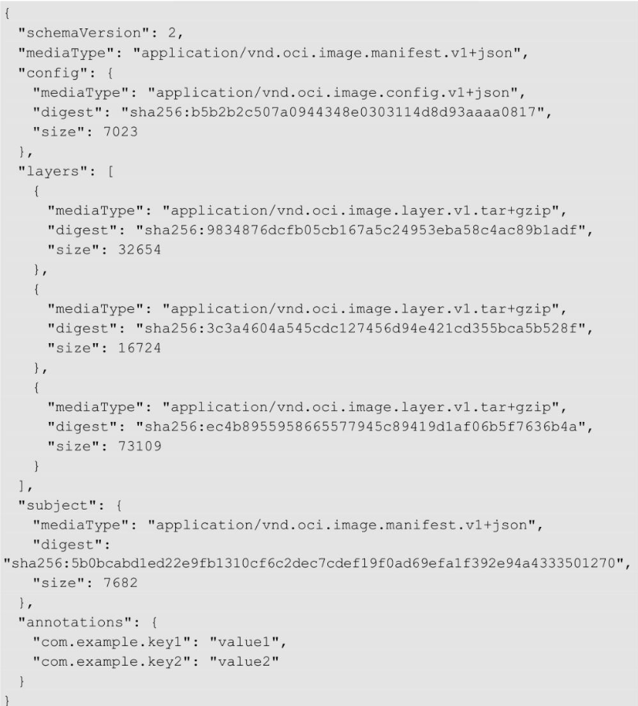

可以看到，镜像清单文件大部分字段与镜像索引文件类似，其中不同的字段解释如下：

config：镜像配置文件的信息，其中 mediaType 的值为“application/vnd.oci.image.config.v1+json”，表示镜像配置类型。

layers：表示镜像层列表，是镜像层文件信息的数组，其中mediaType为“application/vnd.oci.image.layer.v1.tar+gzip”表示的是 targz 类型的二进制数据信息。该示例中，总共包含3层，OCI 规范规定，镜像解压时，按照数组的 index 从第一个开始，即 layers[0] 为第一层，依次按顺序叠加解压，组成容器运行时的根文件系统 rootfs。其中的 size 表示层的大小，digest 表示层文件的摘要。


3) 镜像层文件

在镜像清单文件中可以看到，镜像是由多个层文件叠加成的。每个层文件在分发时均被打包成 tar 文件：在传输时通常通过压缩的方式，如 gzip 或 zstd 等，把每层的内容打包成单个 tar 文件，然后基于 sha256 生成 tar 文件对应的摘要，便于寻址与索引。用户通过镜像清单的 layers 字段可以看到，除了摘要，还包含 tar 文件压缩的格式，如 gzip，则对应的 mediaType 为“application/vnd.oci.image.layer.v1.tar+gzip”。

镜像层文件解压后一层一层叠加组成镜像的根文件系统，上层文件叠加在父层文件之上，若上层文件与父层文件有重复，则覆盖父层文件。每个层文件都包含了对父层所做的更改，包含增加、删除、修改等类型。针对父层增加和修改的文件，镜像使用时直接使用上层的文件即可，父层的文件被覆盖不可见。对于删除的文件，会通过 whiteout 的方式进行标记。在生成镜像根文件系统时，如果识别到 whiteout 文件，则将父层的对应文件隐藏。


4) 镜像配置

镜像配置文件即镜像清单中的 config，也是一个 JSON 格式的文件，描述的是容器的根文件系统和容器运行时所使用的执行参数(CMD)，以及环境变量(ENV)、存储卷(volume)等。镜像配置中包含镜像的根文件系统(rootfs)、程序运行的配置(config)、构建历史(history)等。其中 rootfs 部分包含组成该根文件系统所需的镜像层文件的列表，这里的 diff_ids 要区别于镜像层文件 layer，diff_ids 对应的是解压后的文件夹，而 layer 则是压缩后的单个文件。

当启动容器时，会根据镜像配置转换为对应的 OCI runtime bundle，进而通过 OCI runtime 启动容器。

一个典型的镜像配置文件示例如下。

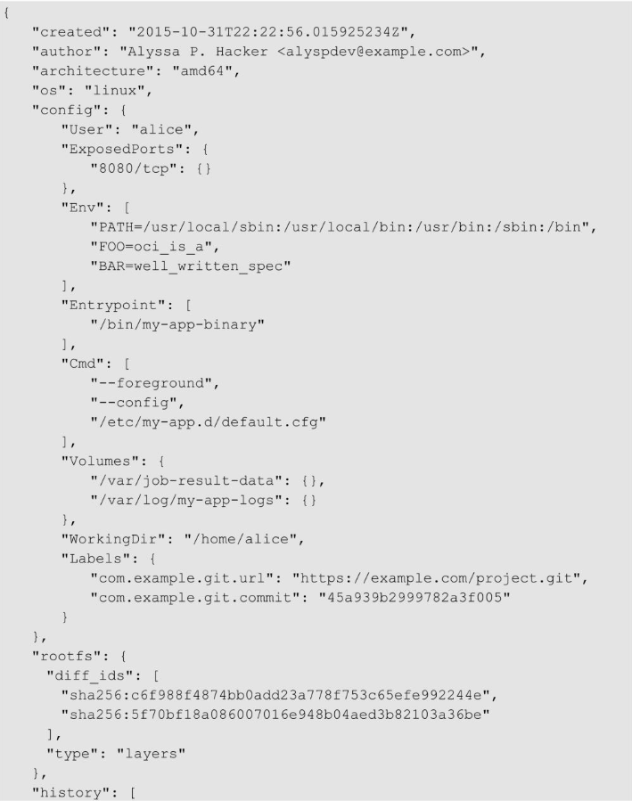

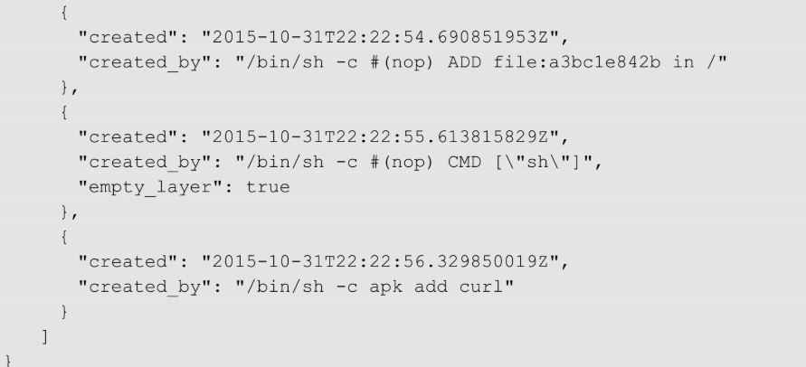

镜像配置文件中包含的参数说明如下：

- created：镜像创建时间。
- author：镜像作者。
- architecture：镜像支持的CPU架构。
- os：镜像的操作系统。
- config：镜像运行的一些参数，包括服务端口、环境变量、入口命令、命令参数、数据卷、用户和工作目录等。
- rootfs：镜像的根文件系统信息，由多个解压后的层文件组成。
- history：镜像的构建历史信息。


#### 运行时规范

OCI 运行时规范指定了容器运行所需要的配置、执行环境以及容器的生命周期，同时定义了低级容器运行时（如runc）的行为和配置接口。运行时规范主要包含以下两部分内容。

- 运行时文件系统包：即 OCI runtime bundle，该部分定义了如何将容器涉及的文件及配置保存在本地文件系统上，内容包含容器启动所需的所有必要数据和元数据。
- 容器生命周期：该部分定义了容器的运行状态和生命周期，以及 OCI 容器运行时运行容器的接口和规范。

1) 运行时文件系统包

一个标准的 OCI 运行时文件系统包包含容器运行所需要的所有信息，主要内容为 config.json 和 rootfs。运行时文件系统包在宿主机上的示例如下。

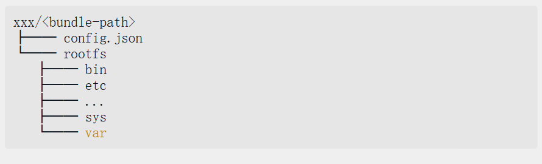

config.json 位于文件系统包的根目录，是容器运行的配置文件，主要包含容器运行的进程，要注入的环境变量，要挂载的存储卷、设备，以及 rootfs 所在的文件路径等。下面是 config.json 的一个典型示例：

> https://github.com/opencontainers/runtime-spec/blob/main/config.md

下面对 config.json 中比较重要的字段进行说明：

- ociVersion：当前社区最新支持的版本是1.0.1。
- process：容器进程的执行信息，包含进程启动参数args、进程环境变量env，以及进程Linux capability设置等。
- root：容器的根文件系统所在的目录，其中的 path 是 rootfs 相对于 OCI runtime bundle 路径的相对路径，也可以设置宿主机的绝对路径。
- hostname：容器中的进程看到的主机名，在Linux中可以通过UTS namespace来改变容器进程的主机名。
- mounts：容器中根目录下挂载的挂载点，运行时挂载点需按顺序依次挂载。其中挂载点 destination 是容器内的路径；source 可以是设备名，也可以是文件或文件夹，当是文件或文件夹时，为宿主机上的绝对路径或相对于OCI runtime bundle的相对路径。
- hooks：容器生命周期的回调接口，可以在容器对应的生命周期执行特定的命令。当前OCI runtime-spec 1.0.1版本支持的 hook 点有 prestart、createRuntime、createContainer、startContainer、poststart、poststop。
- linux：该字段为平台特定的配置，可以理解为 process 中的配置为全局配置。对于不同平台的配置则在不同的平台配置字段下，如 linux、windows、solaris、vm、zos 等。示例中展示的是 linux 平台。对于示例中的linux配置，resources 中对应的是 cgroup 限制（如cpu、memory等），devices 为挂载到容器中的设备。

2) 容器生命周期

OCI运行时规范规定了容器的运行状态，如图2.16所示。容器的运行状态主要有以下4种。

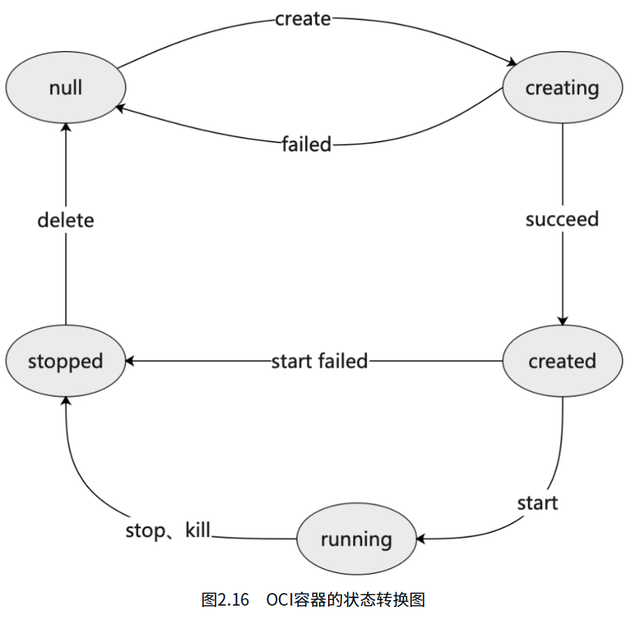

(1) creating：容器正在创建中，是指调用了OCI容器运行时的 create 命令之后的阶段，该过程容器运行时会基于OCI runtime bundle来启动容器，如果启动成功，则进入 created 阶段。

(2) created：该阶段是指调用了OCI容器运行时 create 之后的阶段，此时容器运行所需的所有依赖都已经准备好，但是进程还没有开始运行。

(3) running：该阶段容器正在执行用户进程，即 config.json 中 process 字段指定的进程。该阶段进程还没有退出。

(4) stopped：容器进程运行退出之后的状态。可以是进程正常运行完成，也可以是进程运行出错结束。该阶段容器的信息还保存在宿主机中，并没有被删除。当调用OCI容器运行时的 delete 命令之后，容器的信息才会被完全删除。

同样，运行时规范对容器的状态也做了声明，状态信息可以通过调用OCI容器运行时的 state 命令来查询，如下所示。

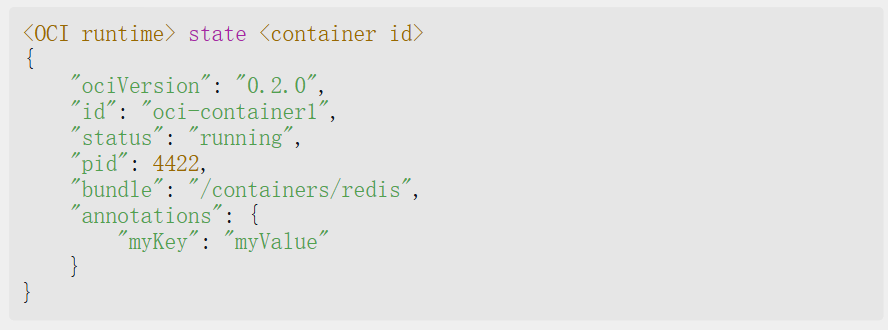

其中：

- status 字段表示容器的运行状态。
- bundle 字段表示容器的运行时文件系统包的路径。
- pid 字段表示程序进程号。

运行时规范中还定义了容器的生命周期回调(lifecycle hook)，允许用户在容器启动阶段的不同时间段执行相应的命令。当前支持的生命周期回调阶段有：

- prestart：该回调发生在在调用容器运行时 create 命令之后，当容器所有依赖的环境准备好之后，pivot_root 操作之前。prestart 回调会在 createRuntime 回调之前执行。注意该回调已被弃用，推荐使用createRuntime、createContainer、startContainer。
- createRuntime：该回调发生在调用容器运行时 create 命令之后，并在 prestart 回调之后被执行。该回调同样发生在 pivot_root 操作之前。
- createContainer：该回调发生在调用容器运行时 create 命令之后，在 createRuntime 回调之后执行，同样发生在pivot_root 操作之前，但是该阶段Mount namespace已经被创建并被设置。
- startContainer：该回调发生在容器启动阶段，在启动用户进程之前。
- poststart：该回调发生在调用容器运行时 start 命令之后，启动用户进程之后会发生该调用，之后OCI容器运行时返回 start 的结果。
- poststop：该回调发生在调用容器运行时 delete 命令之后，在 delete 命令返回之前。

> 注意：关于运行时规范，可以在其官网 https://github.com/opencontainers/runtime-spec 了解更多详情。

#### 分发规范


# 第3章 使用containerd

containerd 作为一个高级容器运行时，简单来说，是一个守护进程，在单个主机上管理完整的容器生命周期，包括创建、启动、停止容器以及存储镜像、配置挂载、配置网络等。

containerd 本身设计旨在嵌入更大的系统中。例如，Docker 底层通过 containerd 来运行容器，Kubernetes 通过 CRI 使用 containerd 来管理容器。当然，除了Docker与Kubernetes这种更上层的系统调用方式，还可以通过客户端命令行的方式来调用containerd，如ctr、nerdctl、crictl等命令行。containerd的几种常见的使用方式如图3.1所示。

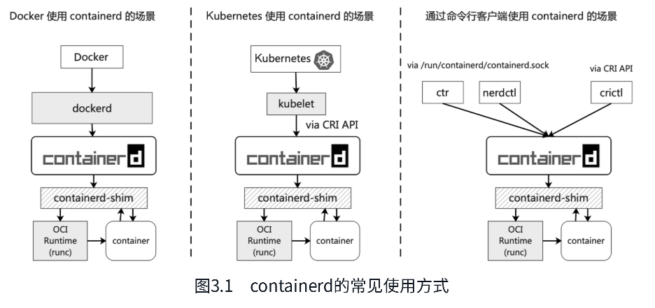


## 3.2 ctr的使用

安装完 containerd 之后，ctr 也就默认安装好了。ctr 是 containerd 提供的客户端工具，内置在 containerd 项目中。执行 ctr --help 可以查看 ctr 支持的命令。

通过 help 命令可以看到 ctr 支持的命令有几大类：plugins、container、image、task 等。接下来详细介绍。

containerd 相比 Docker 多了 namespace 的概念，主要是用于对上层编排系统的支持。常见的 namespace 有3个：default、moby 和 k8s.io。

- default 是默认的 namespace，如果不指定 -n，则所有的镜像、容器操作都在 default 命名空间下，这一点一定要注意。
- moby 是 Docker 使用的 namespace。Docker 作为 containerd 的上层编排系统之一，底层对容器的管理也是通过containerd，它使用的 namespace 是 moby。
- k8s.io 是 kubelet 与 crictl 所使用的 namespace。注意，containerd 所使用的 namespace 与 k8s 中的 namespace不是一个概念。

不同项目使用 containerd namespace 的情况如图3.2所示。


## 3.3 nerdctl的使用

对于习惯使用 Docker 的用户而言，ctr 可能并不是很友好，于是 nerdctl 应运而生。nerdctl 是 containerd 官方提供的兼容 Docker 命令行的工具，支持 Docker CLI 关于容器生命周期管理的所有命令，并且支持 docker compose (nerdctl compose up)。因此，如果读者已经熟悉了 Docker 或者 podman 的使用，那么对 nerdctl 也一定不会陌生。

### nerdctl的设计初衷

nerdctl 并不是 Docker CLI 的复制品，因为兼容 Docker 并不是 nerdctl 的最终目标，nerdctl 的目标是促进 containerd 创新实验特性的发展。Docker 并不支持这些实验特征，如镜像延迟加载(stargz)、镜像加密(ocicrypt)等能力。

Docker 迟早也会支持这些新特性，但是重构 Docker 来完整地支持 containerd 似乎是不太可能的，~~因为 Docker 目前的设计为仅使用 containerd 的少数几个子系统~~。因此 containerd 的维护者们决定创建一个完全使用 containerd 的全新命令行工具：containerd CTL，即 nerdctl。nerdctl 与 Docker 分别调用 containerd 的架构如图3.3所示。

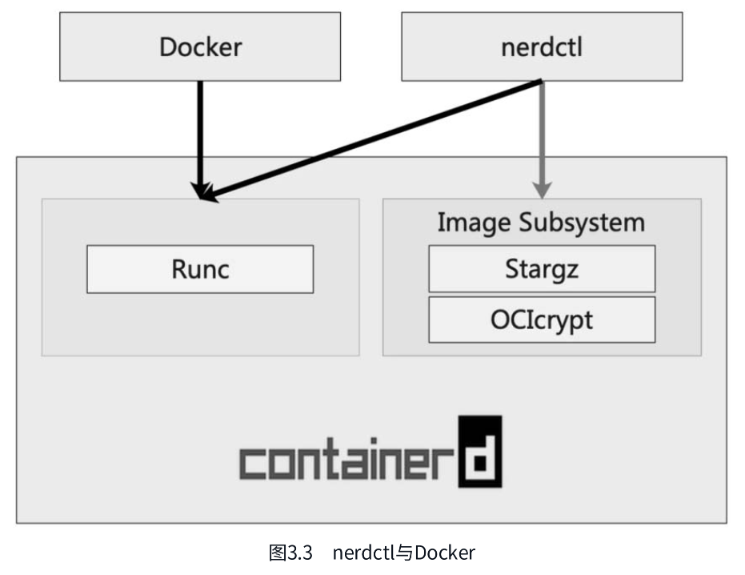

# 第4章 containerd与云原生生态

## 4.1 Kubernetes与CRI

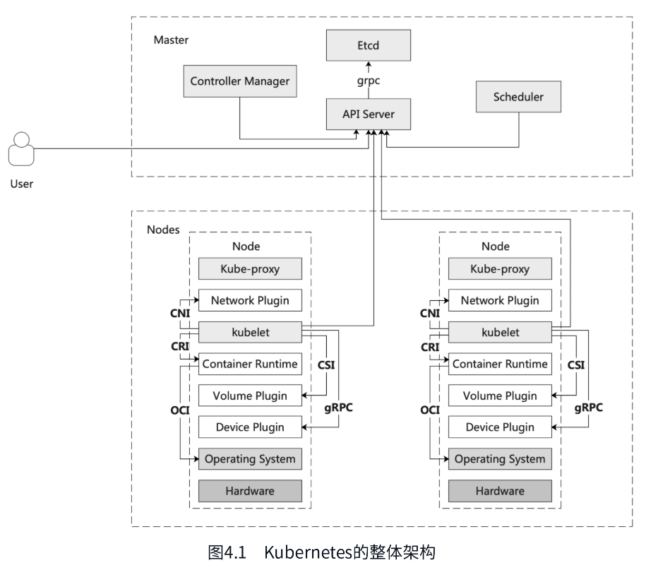

kubelet: Node上最核心的组件，对上负责和 Master 通信，对下和容器运行时通信，负责容器的生命周期管理、容器网络、容器存储能力建设。

- 通过容器运行时接口(container runtime interface, CRI)与各种容器运行时通信，管理容器生命周期。
- 通过容器网络接口(container network interface, CNI)与容器网络插件通信，负责集群网络的管理。
- 通过容器存储接口(container storage interface, CSI)与容器存储插件通信，负责集群内容器存储资源的管理。

Network Plugin：网络插件，如 Flannel、Cilium、Calico 负责为容器配置网络，通过 CNI 被 kubelet 或者 CRI 的实现来调用，如 containerd 等。

Container Runtime：容器运行时，如 containerd、Docker 等，负责容器生命周期的管理，通过 CRI 被 kubelet 调用，通过 OCI 与操作系统交互，运行进程、资源隔离与限制等。

Device Plugin: Kubernets提供的一种设备插件框架，通过该接口可将硬件资源发布到 kubelet，如管理GPU、高性能网卡、FPGA等。

## 4.2 containerd与CRI Plugin

### containerd中的CRI Plugin

CRI Plugin 是 Kubernetes 容器运行时接口 CRI 的具体实现，在 containerd 1.0 版本之前是作为独立的二级制形式存在的（GitHub地址为https://github.com/containerd/cri，该仓库已于2022年3月9日归档，当前为只读状态）。如图4.17所示，它通过 gRPC 请求分别与 kubelet 和 containerd 交互。

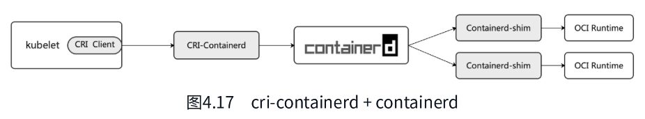

cri-containerd 在 containerd 1.1 版本中合入了 containerd 主干代码（由containerd/cri/pkg移入containerd/containerd/pkg/cri），内置在 containerd 中，作为 containerd 的原生插件并默认开启。CRI Plugin 合入containerd 主线后，通过 kubelet 调用 containerd 的调用链如图4.18所示。

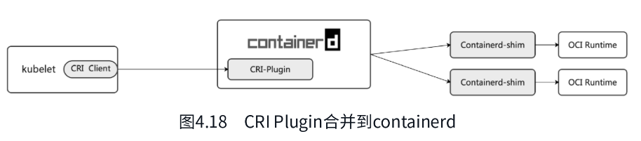

CRI Plugin 插件实现了 kubelet CRI 中的 ImageService 和 RuntimeService，其架构如图4.19所示。其中，ImageServer 和 RuntimeService 通过 containerd Client SDK 调用 containerd 接口来管理容器和镜像；RuntimeService通过 CNI 插件给 pod 配置容器网络，go-cni 为 containerd 封装的调用 CNI 插件的 go 代码库。

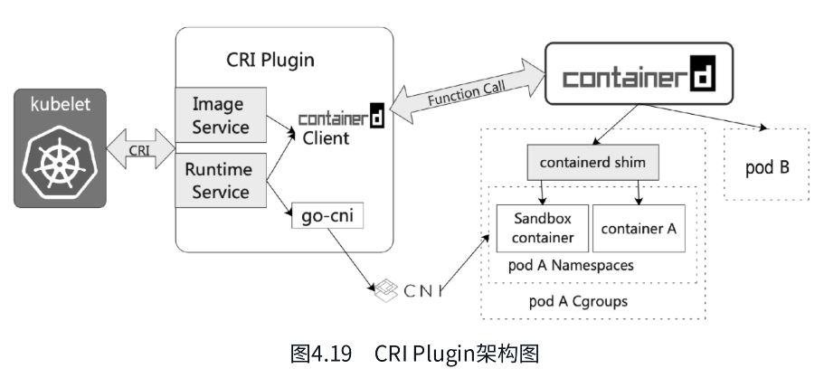

下面通过一个单容器的 pod 举例说明 pod 启动时 CRI Plugin 的工作流程。

(1) kubelet 通过 CRI 调用 CRI Plugin 中的 RunSandbox API，创建 pod 对应的 Sandbox 环境。

(2) 创建 Pod Sandbox 时，CRI Plugin 会创建 pod 网络命名空间，然后通过 CNI 配置容器网络；之后会为 Sandbox 创建并启动一个特殊的容器，即 Pause 容器，然后将该容器加入上述的网络命名空间中。

(3) 创建完 Pod Sandbox 后，kubelet 调用 CRI Plugin 的 ImageService API 拉取容器镜像，如果 node 上不存在该镜像，则 CRI Plugin 会调用 containerd 的接口去拉取镜像。

(4) kubelet 利用刚刚拉取的镜像调用 CRI Plugin 的 RuntimeService API，在 Pod Sandbox 中创建并启动容器。

(5) CRI Plugin 最终通过 containerd client sdk 调用 containerd 的接口创建容器，并在 pod 所在的Cgroups和namespace中启动容器。

经过上述过程之后，pod 和 pod 内的容器就正常启动了。

### CRI Plugin中的重要配置

CRI Plugin作为containerd中的插件，同样是通过 containerd configuration 配置的。containerd configuration路径为/etc/containerd/config.toml。

首先来看CRI Plugin的配置项。通过 containerd config default 可以查看containerd中默认的全部配置项，下面看其中CRI Plugin插件的配置。

```toml

```

CRI Plugin 插件的配置基本上是containerd中最复杂的配置了，可以看到 CRI Plugin 的全局配置项在[plugins."io.containerd.grpc.v1.cri"] 中，按照功能模块分为以下几个部分。

(1) CNI 容器网络配置，该配置在 [plugins."io.containerd.grpc.v1.cri".cni] 项目下，主要是 cni 插件的路径、conf 模板等。

(2) CRI 中 containerd 的配置，如各种 runtime 配置、默认的 runtime 配置、默认的 snapshotter 等，该配置在[plugins."io.containerd.grpc.v1.cri".containerd] 项目下。

(3) CRI 中的镜像和仓库配置，该配置在 [plugins."io.containerd.grpc.v1.cri".image_decryption] 和[plugins."io.containerd.grpc.v1.cri".registry] 项目下。

> 注意：CRI Plugin 的配置项仅仅作用于 CRI Plugin 插件，对于通过其他方式的调用，如ctr、nerdctl、Docker等，均不起作用。

下面介绍containerd中的几项重要配置：Cgroup Driver配置、snapshotter配置、RuntimeClass配置、镜像仓库配置、镜像解密配置以及CNI配置。


# 第5章 containerd与容器网络


# 第6章 containerd与容器存储