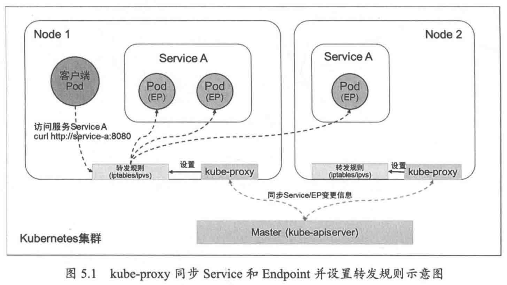
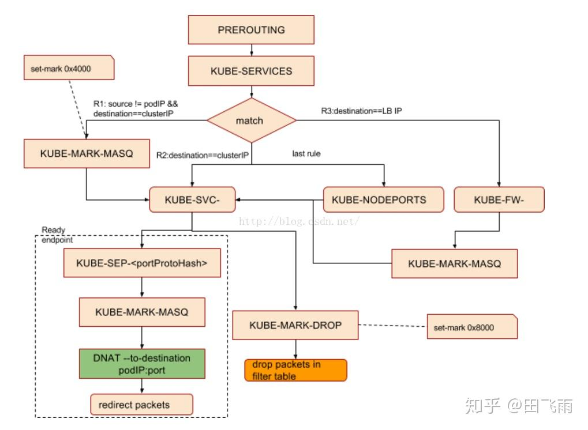

一个 Service 对应的“后端”由 Pod 的 IP 地址和容器端口号组成，即一个完整的“IP:Port”访问地址，它在 Kubernetes 系统中被称作 Endpoint(端点)。通过查看Service的详细信息，可以看到其后端Endpoints列表：

```shell
root@master:~/yamlDir/K8sDefinitiveGuide-V6-A/Chapter05# kubectl describe svc webapp
Name:              webapp
Namespace:         default
Labels:            <none>
Annotations:       <none>
Selector:          app=webapp
Type:              ClusterIP
IP Family Policy:  SingleStack
IP Families:       IPv4
IP:                10.50.196.202
IPs:               10.50.196.202
Port:              <unset>  8080/TCP
TargetPort:        8080/TCP
Endpoints:         10.60.104.46:8080,10.60.166.160:8080
Session Affinity:  None
Events:            <none>
```

实际上，Kubernetes 自动创建了与 Service 关联的 Endpoint 资源对象，这可以通过查询 endpoints 对象进行查看：

```shell
root@master:~/yamlDir/K8sDefinitiveGuide-V6-A/Chapter05# kubectl get endpoints
NAME         ENDPOINTS                              AGE
webapp       10.60.104.46:8080,10.60.166.160:8080   118m
```

从 Kubernetes v1.21 版本开始，Kubernetes 系统也会默认创建 endpointslice (端点分片)资源对象

```shell
root@master:~/yamlDir/K8sDefinitiveGuide-V6-A/Chapter05# kubectl get endpointslice
NAME           ADDRESSTYPE   PORTS   ENDPOINTS                    AGE
webapp-wd6db   IPv4          8080    10.60.166.160,10.60.104.46   119m
```

当一个 Service 对象在 Kubernetes 集群中被定义出来时，集群中的客户端应用就可以通过服务 IP 地址访问具体的 Pod 容器提供的服务了。从 Master 中获取 Service 和 Endpoint 的变更，以及在节点上设置 Service 到后端的多个 Endpoint (图中简写为EP)的负载均衡策略，则是由每个 Node 上的 kube-proxy 负责实现的，如图5.1所示。  



## kube-proxy的代理模式

kube-proxy 目前提供了以下几种代理模式(通过启动参数 --proxy-mode 设置)。

(1) iptables 模式(仅适用于Linux操作系统)

在 iptables 模式下，kube-proxy 通过设置 Linux Kernel 的 iptables 规则，实现了从 Service 到后端 Endpoints 列表的负载分发规则。由于使用的是 Linux 操作系统内核的 Netfilter 机制，所以流量转发效率很高，也很稳定。

每次新建的 Service 或者 Endpoint 发生变化时，kube-proxy 都会刷新本 Node 的全部 iptables 规则，在大规模集群(如 Service 和 Endpoint 的数量达到数万个)中这会导致刷新时间过长，并进一步导致系统性能下降，这时可以在 kube-proxy 的配置资源对象 kube-proxy 中通过以下参数调整 iptables 规则的同步行为：

```yaml
    iptables:
      localhostNodePorts: null
      masqueradeAll: false
      masqueradeBit: null
      minSyncPeriod: 0s
      syncPeriod: 0s
```

**syncPeriod（同步周期）**

- 作用：控制全量 iptables 规则同步的间隔时间
- 工作机制：
  - kube-proxy 每隔 `syncPeriod`时间执行一次全量规则刷新
  - 期间发生的变更会累积，在下一个周期统一处理
- 设置 iptables 规则的同步时间间隔，用于与 Service 或 EndpointSlice 变化无关的 iptables 规则的同步(有时候其他系统可能会干扰 kube-proxy 设置的 iptables 规则)，以及用于定时清理 iptables 规则，单位为 s。

**minSyncPeriod（最小同步间隔）**

- 作用：限制两次全量刷新之间的最小时间间隔
- 关键机制：
  - 当 Service/Endpoint 变更时，触发异步刷新请求
  - 若距上次刷新不足 `minSyncPeriod`，则延迟执行
  - 保证刷新间隔 ≥ `minSyncPeriod`
- 该属性值被设置为 0 时表示只要有 Service 或 Endpoint 发生变化，kube-proxy 就会立刻同步所有 iptables 规则。
  

(2) ipvs 模式(仅适用于Linux操作系统)

在 ipvs 模式下，kube-proxy 通过 Linux Kernel 的 netlink 接口来设置 ipvs 规则。ipvs 模式基于 Linux 操作系统内核的netfilter 钩子函数(hook)，类似于 iptables 模式，但使用了散列表作为底层数据结构，并且工作在内核空间，这使得 ipvs 模式比 iptables 模式的转发性能更高、延迟更低，同步 Service 和 Endpoint 规则的效率也更高，还支持更高的网络吞吐量。

ipvs 模式要求 Linux Kernel 启用 IPVS 内核模块，如果 kube-proxy 在 Linux 操作系统中未检测到 IPVS 内核模块，kube-proxy 会自动切换至 iptables 模式。


# Iptables 模式

> https://zhuanlan.zhihu.com/p/196393839
>
> https://zhuanlan.zhihu.com/p/110861227
>
> https://morningspace.github.io/tech/k8s-net-service-2/

## 监控Service和Endpoints对象

kube-proxy 组件负责维护 node 节点上的防火墙规则和路由规则，在 iptables 模式下，会根据 Service 以及 Endpoints 对象的改变来实时刷新规则。

```
Client → Service (稳定VIP) → Endpoints (动态Pod IP列表) → Pod (实际容器)
```

**为什么需要监控 Service 对象的变化？**

```yaml
apiVersion: v1
kind: Service
metadata:
  name: my-service
spec:
  selector:
    app: nginx
  ports:
    - protocol: TCP
      port: 80        # Service 端口
      targetPort: 80  # Pod 端口
  type: ClusterIP
```

Service 变化时 kube-proxy 需要更新规则的情况：

1. Service 创建/删除

   - 新服务创建：需要添加对应的 iptables 规则
   - 服务删除：需要清理相关规则

2. Service 端口变化

   ```yaml
   # 端口从80改为8080
   ports:
     - protocol: TCP
       port: 8080      # 变化！
       targetPort: 80
   ```

   - kube-proxy 需要更新 NAT 规则中的目标端口

3. Service 类型变化

4. ClusterIP 变化（虽然少见，但可能发生）

**为什么需要监控 Endpoints 对象的变化？**

Endpoints 自动维护着 Service 后端 Pod 的列表：

```yaml
apiVersion: v1
kind: Endpoints
metadata:
  name: my-service  # 与 Service 同名
subsets:
- addresses:
  - ip: 10.244.1.2  # Pod IP
  - ip: 10.244.1.3  # Pod IP
  - ip: 10.244.2.1  # Pod IP
  ports:
  - port: 80
    protocol: TCP
```

Endpoints 变化时 kube-proxy 需要更新规则的情况：

1. Pod 扩缩容（最常见）
   - Endpoints 中会增加新的 Pod IP
   - kube-proxy 需要在新规则中添加这些后端
2. Pod 故障/重启
   - 故障 Pod 从 Endpoints 中移除
   - 新启动的 Pod IP 被添加到 Endpoints
   - kube-proxy 需要及时更新，避免流量发往故障 Pod
3. 滚动更新
   - 旧 Pod 逐步终止，新 Pod 逐步创建
   - Endpoints 持续变化，kube-proxy 需要实时跟踪
4. 节点故障
   - 如果节点宕机，该节点上的 Pod IP 从 Endpoints 移除
   - kube-proxy 需要停止向故障节点转发流量


## 示例演示

使用下面这个 yaml 创建一个简单的部署，其实就是 1 个 service 后面代理着 3 个 nginx pod，还有一个 web-server 用来访问这个 service。本例的 service type 是 ClusterIP，后面再继续分析 NodePort 类型。

```yaml
apiVersion: apps/v1
kind: Deployment
metadata:
  name: nginx-deployment
  labels:
    app: nginx
spec:
  replicas: 3
  selector:
    matchLabels:
      app: nginx
  template:
    metadata:
      labels:
        app: nginx
    spec:
      containers:
      - name: nginx
        image: nginx
        ports:
        - containerPort: 80
---
apiVersion: v1
kind: Service
metadata:
  name: nginx-service
spec:
  selector:
    app: nginx
  ports:
    - protocol: TCP
      port: 80
      targetPort: 80
---
apiVersion: v1
kind: Pod
metadata:
  name: web-server
  labels:
    app: web-server
spec:
  containers:
  - name: nginx
    image: nginx
    ports:
    - containerPort: 80
```

等所有 resource 准备就绪之后，查看资源详情。我们发现有 3 个 nginx-pod，它们的 IP 分别是 172.17.0.4，172.17.0.5，172.17.0.6；一个web-server pod，它的 IP 为 172.17.0.14；此外还有一个 nginx-service，它的 IP 是 10.111.175.78。

```shell
$ kubectl get all -o wide
NAME                                   READY   STATUS    RESTARTS   AGE     IP            NODE       NOMINATED NODE   READINESS GATES
pod/nginx-deployment-d46f5678b-847qb   1/1     Running   0          6h37m   172.17.0.5    minikube   <none>           <none>
pod/nginx-deployment-d46f5678b-99wkt   1/1     Running   0          6h37m   172.17.0.6    minikube   <none>           <none>
pod/nginx-deployment-d46f5678b-c9flw   1/1     Running   0          6h37m   172.17.0.4    minikube   <none>           <none>
pod/web-server                         1/1     Running   0          31s     172.17.0.14   minikube   <none>           <none>

NAME                    TYPE        CLUSTER-IP      EXTERNAL-IP   PORT(S)   AGE     SELECTOR
service/nginx-service   ClusterIP   10.111.175.78   <none>        80/TCP    6h37m   app=nginx

NAME                               READY   UP-TO-DATE   AVAILABLE   AGE     CONTAINERS   IMAGES   SELECTOR
deployment.apps/nginx-deployment   3/3     3            3           6h37m   nginx        nginx    app=nginx

NAME                                         DESIRED   CURRENT   READY   AGE     CONTAINERS   IMAGES   SELECTOR
replicaset.apps/nginx-deployment-d46f5678b   3         3         3       6h37m   nginx        nginx    app=nginx,pod-template-hash=d46f5678b
```

### ClusterIP

现在使用 web-server 的 Pod 访问 nginx-service（10.111.175.78:80），web-server 的 IP 为 172.17.0.14。即数据包从 172.17.0.14:xxxx（xxxx为随机端口）发往 10.111.175.78:80，即

```
Original Packet: 172.17.0.14:xxxx --> 10.111.175.78:80
```

我们来跟踪这个数据包流向来逐条查看 iptables 的规则，分析 ClusterIP 类型的 Service 的实现。


## 总结

kube-proxy 使用了 iptables 的 filter 表和 nat 表，并对 iptables 的链进行了扩充，自定义了 KUBE-SERVICES、KUBE-EXTERNAL-SERVICES、KUBE-NODEPORTS、KUBE-POSTROUTING、KUBE-MARK-MASQ、KUBE-MARK-DROP、KUBE-FORWARD 七条链，另外还新增了以“KUBE-SVC-xxx”和“KUBE-SEP-xxx”开头的数个链。

kube-proxy 是以 daemonSet 的形式部署在所有节点上的，所以每个节点都会有相同的 iptables 规则（所有节点具有相同的负载均衡规则）。

在 Kubernetes 网络中，从 Node 节点直接访问 Service 和从该 Node 上的 Pod 访问 Service，在流量路径上是有区别的。下面我们详细分析一下。

1、流量路径对比

从 Node 节点直接访问 Service：

```
Node进程 → 节点网络栈 → iptables OUTPUT 链 → KUBE-SERVICES 链 → DNAT → 后端Pod
```

从 Node 上的 Pod 访问 Service：

```
Pod进程 → Pod网络栈 → veth pair → 节点网络栈 → iptables PREROUTING 链 → KUBE-SERVICES 链 → DNAT → 后端Pod
```

2、关键区别分析

SNAT 行为不同（最重要！）

Node 直接访问：

```shell
# 通常需要额外的 SNAT 规则
-A KUBE-POSTROUTING -m comment --comment "kubernetes service traffic requiring SNAT" \
  -j MASQUERADE --random-fully
```

Pod 访问：

```shell
# 有专门的标记规则，避免不必要的 SNAT
-A KUBE-POSTROUTING -m comment --comment "kubernetes service traffic requiring SNAT" \
  -m mark --mark 0x4000/0x4000 -j MASQUERADE --random-fully
```





创建一个 ClusterIP 访问方式的 service 以及带有两个副本，从 POD 中访问 ClusterIP 的 iptables 规则流向为：

```
PREROUTING --> KUBE-SERVICE --> KUBE-SVC-XXX --> KUBE-SEP-XXX
```


### 使用tcpdump


假设我们从位于节点 kube-node-2 上的 lab-sleeper 容器内部向位于节点 kube-node-1 上的 test-pod 容器发起一个HTTP请求，Kubernetes在网络层面到底做了哪些事情呢？

为此，我们在节点 kube-node-2 安装了`tcpdump`工具。利用它，我们可以对流经该节点网络接口的数据包进行分析。

先来看一下 lab-sleeper 容器在宿主机一端的 veth 接口，观察一下流经这个接口的数据包。为此，我们需要在 kube-node-2 上找到 lab-sleeper 容器的 veth 接口。先看一下 lab-sleeper 容器内部的 eth0 接口：

```shell
$ kubectl exec -it lab-sleeper-7ff95f64d7-6p7bh ip link
... ...
5: eth0@if11: <BROADCAST,MULTICAST,UP,LOWER_UP> mtu 1500 qdisc noqueue state UP mode DEFAULT group default 
    link/ether ae:6c:5c:6d:d5:83 brd ff:ff:ff:ff:ff:ff link-netnsid 0
```

可以看到，@符号后面跟的序号为11，这说明和它相对应的宿主机一端的veth接口序号为11。再来看一下宿主机上的网络接口：

```shell
$ ip link
... ...
11: veth707db50e@if5: <BROADCAST,MULTICAST,UP,LOWER_UP> mtu 1500 qdisc noqueue master dind0 state UP mode DEFAULT group default 
    link/ether 76:d5:ba:61:7c:7c brd ff:ff:ff:ff:ff:ff link-netnsid 1
... ...
```

这里，序号为11的网络接口为veth707db50e，这就是我们要监听的接口。而且，veth707db50e的@符号后面跟的序号为5，这说明容器端和它相对应的veth接口，其序号也应该是5。这和我们前面查看容器内网络接口的输出结果是一致的。

下面我们开始监控veth707db50e接口，在kube-node-2上执行如下命令：

```shell
$ tcpdump -i veth707db50e -nn
tcpdump: verbose output suppressed, use -v or -vv for full protocol decode
listening on veth707db50e, link-type EN10MB (Ethernet), capture size 262144 bytes
```

这里，参数`-i`用于指定监控的网络接口，即：veth707db50e；参数`-nn`用于告诉`tcpdump`，在输出结果里以数字方式显示IP和端口。

然后，我们从另一个终端窗口登录到master节点，在lab-sleeper容器里执行curl命令，向test-svc发送请求：

```shell
08:14:47.120669 IP 10.244.3.5.34361 > 10.96.0.10.53: 90+ A? test-svc.default.svc.cluster.local. (52)
08:14:47.121229 IP 10.96.0.10.53 > 10.244.3.5.34361: 90*- 1/0/0 A 10.107.169.79 (102)
08:14:47.121373 IP 10.244.3.5.34361 > 10.96.0.10.53: 8557+ AAAA? test-svc.default.svc.cluster.local. (52)
08:14:47.121834 IP 10.96.0.10.53 > 10.244.3.5.34361: 8557*- 0/1/0 (145)
08:14:47.124539 IP 10.244.3.5.41408 > 10.107.169.79.80: Flags [S], seq 3978858651, win 29200, options [mss 1460,sackOK,TS val 217014590 ecr 0,nop,wscale 7], length 0
08:14:47.124719 IP 10.107.169.79.80 > 10.244.3.5.41408: Flags [S.], seq 3710748951, ack 3978858652, win 28960, options [mss 1460,sackOK,TS val 217014590 ecr 217014590,nop,wscale 7], length 0
08:14:47.124775 IP 10.244.3.5.41408 > 10.107.169.79.80: Flags [.], ack 1, win 229, options [nop,nop,TS val 217014590 ecr 217014590], length 0
08:14:47.124960 IP 10.244.3.5.41408 > 10.107.169.79.80: Flags [P.], seq 1:73, ack 1, win 229, options [nop,nop,TS val 217014590 ecr 217014590], length 72: HTTP: GET / HTTP/1.1
08:14:47.125037 IP 10.107.169.79.80 > 10.244.3.5.41408: Flags [.], ack 73, win 227, options [nop,nop,TS val 217014590 ecr 217014590], length 0
08:14:47.125445 IP 10.107.169.79.80 > 10.244.3.5.41408: Flags [P.], seq 1:239, ack 73, win 227, options [nop,nop,TS val 217014590 ecr 217014590], length 238: HTTP: HTTP/1.1 200 OK
08:14:47.125490 IP 10.244.3.5.41408 > 10.107.169.79.80: Flags [.], ack 239, win 237, options [nop,nop,TS val 217014590 ecr 217014590], length 0
08:14:47.127164 IP 10.244.3.5.41408 > 10.107.169.79.80: Flags [F.], seq 73, ack 851, win 247, options [nop,nop,TS val 217014590 ecr 217014590], length 0
```

这里我们可以看到，前4行显示，容器（IP地址为`10.244.3.5`）是在和kube-dns（IP地址为`10.96.0.10`）进行通信；从第5行开始，就在和test-svc（IP地址为`10.107.169.79`）进行真正的HTTP通信了。因此，对容器来说，所有发送出去的数据包，其目标地址都是Service的IP地址；相应地，所有返回的数据包，其源地址也都是Service的IP地址。在容器看来，它始终都是在和Service通信，并没有和“躲”在Service背后的Pod有直接交流。

接下来，我们再往上一层，看一看流经宿主机网卡eth0的数据包，所有从当前节点发往其他节点的数据包都会经过这个网络接口：

```
$ tcpdump -i eth0 -nn port 53 or port 80
tcpdump: verbose output suppressed, use -v or -vv for full protocol decode
listening on eth0, link-type EN10MB (Ethernet), capture size 262144 bytes
```

这里，我们给`tcpdump`加了过滤条件。这样可以让我们真正关心的数据包不会淹没在大量无关的输出结果里。通过参数`port`，我们告诉`tcpdump`只监听端口53和80。前者是DNS服务的端口；后者是HTTP服务的端口，即lab-web，也就是躲在test-svc背后我们要访问的目标Pod。

再次从lab-sleeper容器里通过curl命令发起对test-svc的请求，我们得到了类似下面这样的输出：

```shell
10:22:17.990253 IP 10.192.0.4.39982 > 10.244.2.2.53: 19731+ A? test-svc.default.svc.cluster.local. (52)
10:22:17.991031 IP 10.192.0.4.39982 > 10.244.2.2.53: 2856+ AAAA? test-svc.default.svc.cluster.local. (52)
10:22:17.992065 IP 10.244.2.2.53 > 10.192.0.4.39982: 2856*- 0/1/0 (145)
10:22:17.993465 IP 10.244.2.2.53 > 10.192.0.4.39982: 19731*- 1/0/0 A 10.107.169.79 (102)
10:22:18.001390 IP 10.192.0.4.38010 > 10.244.2.4.80: Flags [S], seq 519874336, win 29200, options [mss 1460,sackOK,TS val 217780596 ecr 0,nop,wscale 7], length 0
10:22:18.001516 IP 10.244.2.4.80 > 10.192.0.4.38010: Flags [S.], seq 17221823, ack 519874337, win 28960, options [mss 1460,sackOK,TS val 217780596 ecr 217780596,nop,wscale 7], length 0
10:22:18.001574 IP 10.192.0.4.38010 > 10.244.2.4.80: Flags [.], ack 1, win 229, options [nop,nop,TS val 217780596 ecr 217780596], length 0
10:22:18.002088 IP 10.192.0.4.38010 > 10.244.2.4.80: Flags [P.], seq 1:73, ack 1, win 229, options [nop,nop,TS val 217780596 ecr 217780596], length 72: HTTP: GET / HTTP/1.1
10:22:18.002196 IP 10.244.2.4.80 > 10.192.0.4.38010: Flags [.], ack 73, win 227, options [nop,nop,TS val 217780596 ecr 217780596], length 0
10:22:18.002311 IP 10.244.2.4.80 > 10.192.0.4.38010: Flags [P.], seq 1:239, ack 73, win 227, options [nop,nop,TS val 217780596 ecr 217780596], length 238: HTTP: HTTP/1.1 200 OK
10:22:18.002335 IP 10.192.0.4.38010 > 10.244.2.4.80: Flags [.], ack 239, win 237, options [nop,nop,TS val 217780596 ecr 217780596], length 0
10:22:18.002373 IP 10.244.2.4.80 > 10.192.0.4.38010: Flags [P.], seq 239:851, ack 73, win 227, options [nop,nop,TS val 217780596 ecr 217780596], length 612: HTTP
10:22:18.002399 IP 10.192.0.4.38010 > 10.244.2.4.80: Flags [.], ack 851, win 247, options [nop,nop,TS val 217780596 ecr 217780596], length 0
10:22:18.009205 IP 10.192.0.4.38010 > 10.244.2.4.80: Flags [F.], seq 73, ack 851, win 247, options [nop,nop,TS val 217780597 ecr 217780596], length 0
10:22:18.009392 IP 10.244.2.4.80 > 10.192.0.4.38010: Flags [F.], seq 851, ack 74, win 227, options [nop,nop,TS val 217780597 ecr 217780597], length 0
10:22:18.009422 IP 10.192.0.4.38010 > 10.244.2.4.80: Flags [.], ack 852, win 247, options [nop,nop,TS val 217780597 ecr 217780597], length 0
```

可以看到，和之前一样，前面4行仍然是容器和DNS服务之间的通信；从第5行开始，则是容器和HTTP服务之间的通信。不同的地方在于，从容器里发送出来的数据包在经过eth0的时候，源地址已经变成了节点的IP。在我们的例子里，也就是kube-node-2的IP地址`10.192.0.4`。相应地，所有eth0接收到的数据包，其目标地址也变成了`10.192.0.4`。

另外，在和DNS服务交互的数据包里，DNS服务的IP地址也变成了真正提供服务的Pod——coredns的地址了。如果查一下kube-system下的Pod就会发现，coredns的IP地址就是`10.244.2.2`：

```shell
$ kubectl get pods -n kube-system -o wide
NAME                                  READY   STATUS    RESTARTS   AGE     IP           NODE          NOMINATED NODE   READINESS GATES
coredns-fb8b8dccf-nggnj               1/1     Running   0          7h47m   10.244.2.2   kube-node-1   <none>           <none>
... ...
```

最后，原来test-svc的IP地址，也被替换成了真正提供HTTP服务的Pod地址，即：位于节点kube-node-1上的lab-web，IP地址为`10.244.2.4`。

从lab-sleeper发出的数据包，其目标地址总是Service的虚拟IP，包括kube-dns和我们的test-svc。但当经过主机的eth0以后，目标地址就会被替换成真正提供服务的后端Pod，即coredns和test-pod，而源地址则会被替换成主机的IP。同样地，对于返回的数据包，其源地址和目标地址又会被逆向还原。这样，在lab-sleeper看来，它始终是在和Service进行通信，而没有和Service所管理的后端Pod存在任何直接的交流。


我们在 lab-sleeper Pod 所在的 kube-node-2 上执行`iptables-save`命令，将会得到了类似下面这样的输出：

```shell
$ iptables-save
⎢ ...
① -A PREROUTING -m comment --comment "kubernetes service portals" -j KUBE-SERVICES
⎢ ...
⑨ -A POSTROUTING -m comment --comment "kubernetes postrouting rules" -j KUBE-POSTROUTING
⎢ ...
④ -A KUBE-MARK-MASQ -j MARK --set-xmark 0x4000/0x4000
⑩ -A KUBE-POSTROUTING -m comment --comment "kubernetes service traffic requiring SNAT" -m mark --mark 0x4000/0x4000 -j MASQUERADE
⎢ ...
⎢ -A KUBE-SEP-CLAGU7VMF4VCXE4X -s 10.244.2.2/32 -j KUBE-MARK-MASQ
⎢ -A KUBE-SEP-CLAGU7VMF4VCXE4X -p tcp -m tcp -j DNAT --to-destination 10.244.2.2:9153
⑦ -A KUBE-SEP-E2HMOHPUOGTHZJEP -s 10.244.2.4/32 -j KUBE-MARK-MASQ
⑧ -A KUBE-SEP-E2HMOHPUOGTHZJEP -p tcp -m tcp -j DNAT --to-destination 10.244.2.4:80
⎢ -A KUBE-SEP-H7FN6LU3RSH6CC2T -s 10.244.2.2/32 -j KUBE-MARK-MASQ
⎢ -A KUBE-SEP-H7FN6LU3RSH6CC2T -p tcp -m tcp -j DNAT --to-destination 10.244.2.2:53
⎢ -A KUBE-SEP-TCIZBYBD3WWXNWF5 -s 10.244.2.2/32 -j KUBE-MARK-MASQ
⎢ -A KUBE-SEP-TCIZBYBD3WWXNWF5 -p udp -m udp -j DNAT --to-destination 10.244.2.2:53
⎢ ...
② -A KUBE-SERVICES -d 10.96.0.10/32 -p udp -m comment --comment "kube-system/kube-dns:dns cluster IP" -m udp --dport 53 -j KUBE-MARK-MASQ
⎢ -A KUBE-SERVICES -d 10.96.0.10/32 -p udp -m comment --comment "kube-system/kube-dns:dns cluster IP" -m udp --dport 53 -j KUBE-SVC-TCOU7JCQXEZGVUNU
⎢ -A KUBE-SERVICES -d 10.96.0.10/32 -p tcp -m comment --comment "kube-system/kube-dns:dns-tcp cluster IP" -m tcp --dport 53 -j KUBE-MARK-MASQ
⎢ -A KUBE-SERVICES -d 10.96.0.10/32 -p tcp -m comment --comment "kube-system/kube-dns:dns-tcp cluster IP" -m tcp --dport 53 -j KUBE-SVC-ERIFXISQEP7F7OF4
⎢ -A KUBE-SERVICES -d 10.96.0.10/32 -p tcp -m comment --comment "kube-system/kube-dns:metrics cluster IP" -m tcp --dport 9153 -j KUBE-MARK-MASQ
⎢ -A KUBE-SERVICES -d 10.96.0.10/32 -p tcp -m comment --comment "kube-system/kube-dns:metrics cluster IP" -m tcp --dport 9153 -j KUBE-SVC-JD5MR3NA4I4DYORP
③ -A KUBE-SERVICES -d 10.107.169.79/32 -p tcp -m comment --comment "default/test-svc: cluster IP" -m tcp --dport 80 -j KUBE-MARK-MASQ
⑤ -A KUBE-SERVICES -d 10.107.169.79/32 -p tcp -m comment --comment "default/test-svc: cluster IP" -m tcp --dport 80 -j KUBE-SVC-W3OX4ZP4Y24AQZNW
⎢ ...
⎢ -A KUBE-SVC-ERIFXISQEP7F7OF4 -j KUBE-SEP-H7FN6LU3RSH6CC2T
⎢ -A KUBE-SVC-JD5MR3NA4I4DYORP -j KUBE-SEP-CLAGU7VMF4VCXE4X
⎢ -A KUBE-SVC-TCOU7JCQXEZGVUNU -j KUBE-SEP-TCIZBYBD3WWXNWF5
⑥ -A KUBE-SVC-W3OX4ZP4Y24AQZNW -j KUBE-SEP-E2HMOHPUOGTHZJEP
```

首先，我们略去了无关的规则，只保留了关心的部分；其次，为了方便后面解释说明，我们在某些规则前面加上了序号。

- 当数据包从 lab-sleeper Pod 发出，并经过 eth0 的时候，首先会命中行①处的 PREROUTING 规则。因为没有任何额外的匹配条件，所以这条规则总是会命中；
- 紧接着，根据行①的规则，它会跳转到 KUBE-SERVICES 链，即：从行②处开始的一系列 KUBE-SERVICES 规则。这里前几条规则都是和DNS服务相关的，因为原理大同小异，所以我们就略过了。假设目前这个数据包就是发往 test-svc 的，那么最后它将匹配行③处的 KUBE-SERVICES；
- 行③处的规则代表了目标地址为`10.107.169.79`，端口号为`80`的数据包，它将跳转到行④处的 KUBE-MARK-MASQ 规则；
- 行④处的 KUBE-MARK-MASQ 实际代表了IP地址伪装(MASQUERADE)，准确地说是对源地址进行伪装。至于怎么伪装，我们等一下再说。因为目前还在 PREROUTING 链上，所以这里并不是进行真正地伪装，而是利用`--set-xmark`设置了一个特殊的标记`0x4000/0x4000`，表示这个数据包是需要地址伪装的。后面，我们会看POSTROUTING 链是如何根据这个标记对数据包进行IP地址伪装的；
- 由于行④处的 KUBE-MARK-MASQ 规则后面跟了一个非终止目标（non-terminating target，即：不像ACCEPT，DROP，REJECT那样，会终止整个`iptables`规则链的解析），所以它会重新跳回行③处，沿着KUBE-SERVICES 链继续往下走到行⑤处；
- 行⑤处的 KUBE-SERVICES 同样匹配目标地址为`10.107.169.79`，端口号为`80`的数据包，它将跳到行⑥处的 KUBE-SVC-W3OX4ZP4Y24AQZNW 规则，然后再到行⑦处开始的 KUBE-SEP-E2HMOHPUOGTHZJEP 链上；
- 从行⑦处开始的两条 KUBE-SEP-E2HMOHPUOGTHZJEP 规则里，只有第二条规则满足我们的数据包，即行⑧处。这里，我们会进行一次针对目标地址的网络地址转换(DNAT)，把目标地址替换成`10.244.2.4:80`，即真正在 test-svc 后端提供HTTP服务的 test-pod。这也是为什么我们在 eth0 上监控到发送出去的数据包里，目标地址被替换成 test-pod 的 IP 的原因；
- 最后，从行⑨处开始我们进入 POSTROUTING 链，然后跳转到行⑩处的 KUBE-POSTROUTING 规则；
- 行⑩处的 KUBE-POSTROUTING 规则会对数据包进行判断，如果发现它有`0x4000/0x4000`标记，就会跳到MASQUERADE规则，也就是真正对数据包的源地址进行IP地址伪装。具体来说，就是自动把数据包里的源地址替换成主机网卡eth0的IP地址，即：`10.192.0.4`。这也是为什么我们在eth0上监控到发送出去的数据包里，源地址被替换成主机IP的原因；

最后，数据包在经过网络地址转换以后，被发送到了 test-pod，当有数据包从 test-pod 返回的时候，操作系统（实际上是位于Linux kernel层的 netfilter）会进行相应的逆向转换，把地址又重新替换成原来的值。所以，在 lab-sleeper看来，它是一直在和 test-svc 打交道。