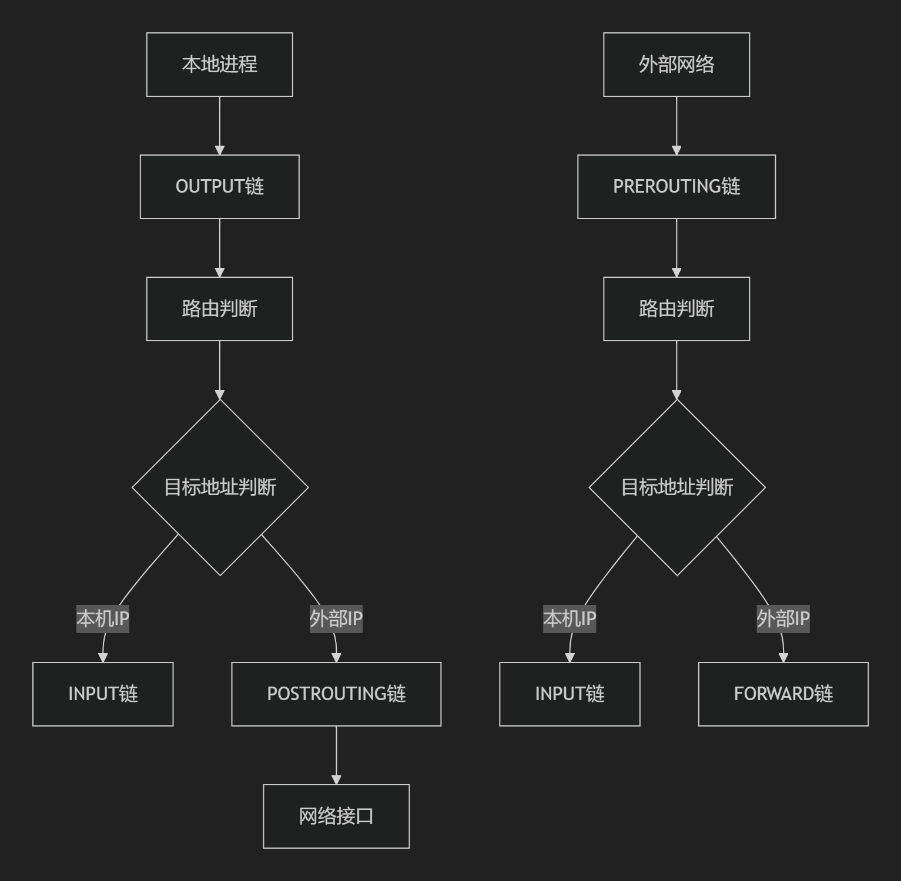
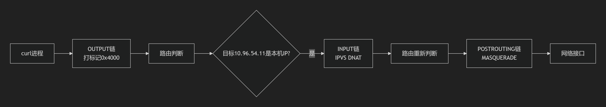
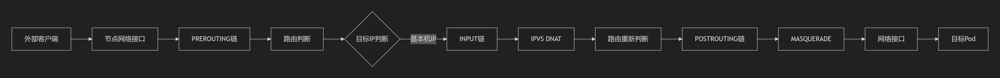
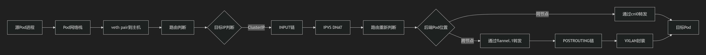
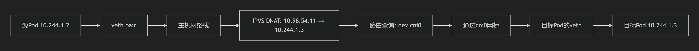

一个 Service 对应的“后端”由 Pod 的 IP 地址和容器端口号组成，即一个完整的“IP:Port”访问地址，它在 Kubernetes 系统中被称作 Endpoint(端点)。通过查看Service的详细信息，可以看到其后端Endpoints列表：

```shell
root@master:~/yamlDir/K8sDefinitiveGuide-V6-A/Chapter05# kubectl describe svc webapp
Name:              webapp
Namespace:         default
Labels:            <none>
Annotations:       <none>
Selector:          app=webapp
Type:              ClusterIP
IP Family Policy:  SingleStack
IP Families:       IPv4
IP:                10.50.196.202
IPs:               10.50.196.202
Port:              <unset>  8080/TCP
TargetPort:        8080/TCP
Endpoints:         10.60.104.46:8080,10.60.166.160:8080
Session Affinity:  None
Events:            <none>
```

实际上，Kubernetes 自动创建了与 Service 关联的 Endpoint 资源对象，这可以通过查询 endpoints 对象进行查看：

```shell
root@master:~/yamlDir/K8sDefinitiveGuide-V6-A/Chapter05# kubectl get endpoints
NAME         ENDPOINTS                              AGE
webapp       10.60.104.46:8080,10.60.166.160:8080   118m
```

从 Kubernetes v1.21 版本开始，Kubernetes 系统也会默认创建 endpointslice (端点分片)资源对象

```shell
root@master:~/yamlDir/K8sDefinitiveGuide-V6-A/Chapter05# kubectl get endpointslice
NAME           ADDRESSTYPE   PORTS   ENDPOINTS                    AGE
webapp-wd6db   IPv4          8080    10.60.166.160,10.60.104.46   119m
```

当一个 Service 对象在 Kubernetes 集群中被定义出来时，集群中的客户端应用就可以通过服务 IP 地址访问具体的 Pod 容器提供的服务了。从 Master 中获取 Service 和 Endpoint 的变更，以及在节点上设置 Service 到后端的多个 Endpoint (图中简写为EP)的负载均衡策略，则是由每个 Node 上的 kube-proxy 负责实现的，如图5.1所示。  


# kube-proxy的代理模式

kube-proxy 目前提供了以下几种代理模式(通过启动参数 --proxy-mode 设置)。

(1) iptables 模式(仅适用于Linux操作系统)

在 iptables 模式下，kube-proxy 通过设置 Linux Kernel 的 iptables 规则，实现了从 Service 到后端 Endpoints 列表的负载分发规则。由于使用的是 Linux 操作系统内核的 Netfilter 机制，所以流量转发效率很高，也很稳定。

每次新建的 Service 或者 Endpoint 发生变化时，kube-proxy 都会刷新本 Node 的全部 iptables 规则，在大规模集群(如 Service 和 Endpoint 的数量达到数万个)中这会导致刷新时间过长，并进一步导致系统性能下降，这时可以在 kube-proxy 的配置资源对象 kube-proxy 中通过以下参数调整 iptables 规则的同步行为：

```yaml
    iptables:
      localhostNodePorts: null
      masqueradeAll: false
      masqueradeBit: null
      minSyncPeriod: 0s
      syncPeriod: 0s
```

**syncPeriod（同步周期）**

- 作用：控制全量 iptables 规则同步的间隔时间
- 工作机制：
  - kube-proxy 每隔 `syncPeriod`时间执行一次全量规则刷新
  - 期间发生的变更会累积，在下一个周期统一处理
- 设置 iptables 规则的同步时间间隔，用于与 Service 或 EndpointSlice 变化无关的 iptables 规则的同步(有时候其他系统可能会干扰 kube-proxy 设置的 iptables 规则)，以及用于定时清理 iptables 规则，单位为 s。

**minSyncPeriod（最小同步间隔）**

- 作用：限制两次全量刷新之间的最小时间间隔
- 关键机制：
  - 当 Service/Endpoint 变更时，触发异步刷新请求
  - 若距上次刷新不足 `minSyncPeriod`，则延迟执行
  - 保证刷新间隔 ≥ `minSyncPeriod`
- 该属性值被设置为 0 时表示只要有 Service 或 Endpoint 发生变化，kube-proxy 就会立刻同步所有 iptables 规则。
  

(2) ipvs 模式(仅适用于Linux操作系统)

在 ipvs 模式下，kube-proxy 通过 Linux Kernel 的 netlink 接口来设置 ipvs 规则。ipvs 模式基于 Linux 操作系统内核的netfilter 钩子函数(hook)，类似于 iptables 模式，但使用了散列表作为底层数据结构，并且工作在内核空间，这使得 ipvs 模式比 iptables 模式的转发性能更高、延迟更低，同步 Service 和 Endpoint 规则的效率也更高，还支持更高的网络吞吐量。

ipvs 模式要求 Linux Kernel 启用 IPVS 内核模块，如果 kube-proxy 在 Linux 操作系统中未检测到 IPVS 内核模块，kube-proxy 会自动切换至 iptables 模式。


# Iptables 模式

> https://zhuanlan.zhihu.com/p/196393839
>
> https://zhuanlan.zhihu.com/p/110861227
>
> https://morningspace.github.io/tech/k8s-net-service-2/

Iptables模式在 K8S v1.1 版本开始使用，v1.2 版本 iptables 成为默认代理模式。

一个 service 一般对应生成20条左右 iptables 规则，因此如果是中等规模的K8S集群（service有几百个）能够承受，但是大规模的集群（service有几千个）维护达几万条规则，性能较差。

kube-proxy 在 iptables 模式下时间复杂度为O(n)。

## 监控Service和Endpoints对象

kube-proxy 组件负责维护 node 节点上的防火墙规则和路由规则，在 iptables 模式下，会根据 Service 以及 Endpoints 对象的改变来实时刷新规则。

```
Client → Service (稳定VIP) → Endpoints (动态Pod IP列表) → Pod (实际容器)
```

**为什么需要监控 Service 对象的变化？**

```yaml
apiVersion: v1
kind: Service
metadata:
  name: my-service
spec:
  selector:
    app: nginx
  ports:
    - protocol: TCP
      port: 80        # Service 端口
      targetPort: 80  # Pod 端口
  type: ClusterIP
```

Service 变化时 kube-proxy 需要更新规则的情况：

1. Service 创建/删除

   - 新服务创建：需要添加对应的 iptables 规则
   - 服务删除：需要清理相关规则

2. Service 端口变化

   ```yaml
   # 端口从80改为8080
   ports:
     - protocol: TCP
       port: 8080      # 变化！
       targetPort: 80
   ```

   - kube-proxy 需要更新 NAT 规则中的目标端口

3. Service 类型变化

4. ClusterIP 变化（虽然少见，但可能发生）

**为什么需要监控 Endpoints 对象的变化？**

Endpoints 自动维护着 Service 后端 Pod 的列表：

```yaml
apiVersion: v1
kind: Endpoints
metadata:
  name: my-service  # 与 Service 同名
subsets:
- addresses:
  - ip: 10.244.1.2  # Pod IP
  - ip: 10.244.1.3  # Pod IP
  - ip: 10.244.2.1  # Pod IP
  ports:
  - port: 80
    protocol: TCP
```

Endpoints 变化时 kube-proxy 需要更新规则的情况：

1. Pod 扩缩容（最常见）
   - Endpoints 中会增加新的 Pod IP
   - kube-proxy 需要在新规则中添加这些后端
2. Pod 故障/重启
   - 故障 Pod 从 Endpoints 中移除
   - 新启动的 Pod IP 被添加到 Endpoints
   - kube-proxy 需要及时更新，避免流量发往故障 Pod
3. 滚动更新
   - 旧 Pod 逐步终止，新 Pod 逐步创建
   - Endpoints 持续变化，kube-proxy 需要实时跟踪
4. 节点故障
   - 如果节点宕机，该节点上的 Pod IP 从 Endpoints 移除
   - kube-proxy 需要停止向故障节点转发流量


## 示例演示

使用下面这个 yaml 创建一个简单的部署，其实就是 1 个 service 后面代理着 3 个 nginx pod，还有一个 web-server 用来访问这个 service。本例的 service type 是 ClusterIP，后面再继续分析 NodePort 类型。

```yaml
apiVersion: apps/v1
kind: Deployment
metadata:
  name: nginx-deployment
  labels:
    app: nginx
spec:
  replicas: 3
  selector:
    matchLabels:
      app: nginx
  template:
    metadata:
      labels:
        app: nginx
    spec:
      containers:
      - name: nginx
        image: nginx
        ports:
        - containerPort: 80
---
apiVersion: v1
kind: Service
metadata:
  name: nginx-service
spec:
  selector:
    app: nginx
  ports:
    - protocol: TCP
      port: 80
      targetPort: 80
---
apiVersion: v1
kind: Pod
metadata:
  name: web-server
  labels:
    app: web-server
spec:
  containers:
  - name: nginx
    image: nginx
    ports:
    - containerPort: 80
```

等所有 resource 准备就绪之后，查看资源详情。我们发现有 3 个 nginx-pod，它们的 IP 分别是 172.17.0.4，172.17.0.5，172.17.0.6；一个web-server pod，它的 IP 为 172.17.0.14；此外还有一个 nginx-service，它的 IP 是 10.111.175.78。

```shell
$ kubectl get all -o wide
NAME                                   READY   STATUS    RESTARTS   AGE     IP            NODE       NOMINATED NODE   READINESS GATES
pod/nginx-deployment-d46f5678b-847qb   1/1     Running   0          6h37m   172.17.0.5    minikube   <none>           <none>
pod/nginx-deployment-d46f5678b-99wkt   1/1     Running   0          6h37m   172.17.0.6    minikube   <none>           <none>
pod/nginx-deployment-d46f5678b-c9flw   1/1     Running   0          6h37m   172.17.0.4    minikube   <none>           <none>
pod/web-server                         1/1     Running   0          31s     172.17.0.14   minikube   <none>           <none>

NAME                    TYPE        CLUSTER-IP      EXTERNAL-IP   PORT(S)   AGE     SELECTOR
service/nginx-service   ClusterIP   10.111.175.78   <none>        80/TCP    6h37m   app=nginx

NAME                               READY   UP-TO-DATE   AVAILABLE   AGE     CONTAINERS   IMAGES   SELECTOR
deployment.apps/nginx-deployment   3/3     3            3           6h37m   nginx        nginx    app=nginx

NAME                                         DESIRED   CURRENT   READY   AGE     CONTAINERS   IMAGES   SELECTOR
replicaset.apps/nginx-deployment-d46f5678b   3         3         3       6h37m   nginx        nginx    app=nginx,pod-template-hash=d46f5678b
```

### ClusterIP

现在使用 web-server 的 Pod 访问 nginx-service（10.111.175.78:80），web-server 的 IP 为 172.17.0.14。即数据包从 172.17.0.14:xxxx（xxxx为随机端口）发往 10.111.175.78:80，即

```
Original Packet: 172.17.0.14:xxxx --> 10.111.175.78:80
```

我们来跟踪这个数据包流向来逐条查看 iptables 的规则，分析 ClusterIP 类型的 Service 的实现。

可直接看“总结”部分的示例。

### NodePort

从大体上讲，NodePort 类型的 Service 的 iptables 规则基本和 ClusterIP 的类似。下面仅列出几处不同的地方，首先是在 nat 的 KUBE-SERVICES 链：

```shell
Chain KUBE-SERVICES (2 references)
 pkts bytes target     prot opt in     out     source               destination         
    ...
1264 75952 KUBE-NODEPORTS  all  --  *      *       0.0.0.0/0            0.0.0.0/0            /* kubernetes service nodeports; NOTE: this must be the last rule in this chain */ ADDRTYPE match dst-type LOCAL
```

发往 NodePort 类型的数据包会命中最后一条，进入 nat 表的 KUBE-NODEPORTS 链：

```shell
Chain KUBE-NODEPORTS (1 references)
 pkts bytes target     prot opt in     out     source               destination         
    ...
    0     0 KUBE-MARK-MASQ  tcp  --  *      *       0.0.0.0/0            0.0.0.0/0            /* default/nginx-service: */ tcp dpt:31628
    0     0 KUBE-SVC-GKN7Y2BSGW4NJTYL  tcp  --  *      *       0.0.0.0/0            0.0.0.0/0            /* default/nginx-service: */ tcp dpt:31628
    ...
```

可以看到数据包先会命中第一条规则 KUBE-MARK-MASQ：

```shell
Chain KUBE-MARK-MASQ (21 references)
 pkts bytes target     prot opt in     out     source               destination         
    0     0 MARK       all  --  *      *       0.0.0.0/0            0.0.0.0/0            MARK or 0x4000
```

在这里数据包会被标记上 0x4000 标记，然后回到 KUBE-NODEPORTS 链中继续匹配下一条规则，我们发现下一条规则就是 KUBE-SVC-GKN7Y2BSGW4NJTYL，接下来一路到 nat 的 POSTROUTING 为止都与 ClusterIP 模式相同。


## 总结

kube-proxy 使用了 iptables 的 filter 表和 nat 表，并对 iptables 的链进行了扩充，自定义了 KUBE-SERVICES、KUBE-EXTERNAL-SERVICES、KUBE-NODEPORTS、KUBE-POSTROUTING、KUBE-MARK-MASQ、KUBE-MARK-DROP、KUBE-FORWARD 七条链，另外还新增了以“KUBE-SVC-xxx”和“KUBE-SEP-xxx”开头的数个链。

kube-proxy 是以 daemonSet 的形式部署在所有节点上的，所以每个节点都会有相同的 iptables 规则（所有节点具有相同的负载均衡规则）。

在 Kubernetes 网络中，从 Node 节点直接访问 Service 和从该 Node 上的 Pod 访问 Service，在流量路径上是有区别的。

从 Node 节点直接访问 Service：

```
Node进程 → 节点网络栈 → iptables OUTPUT 链 → KUBE-SERVICES 链 → DNAT → 后端Pod
```

从 Node 上的 Pod 访问 Service：

```
Pod进程 → Pod网络栈 → veth pair → 节点网络栈 → iptables PREROUTING 链 → KUBE-SERVICES 链 → DNAT → 后端Pod
```


### 使用 tcpdump

> https://morningspace.github.io/tech/k8s-net-service-2/


假设我们从位于节点 kube-node-2 上的 lab-sleeper 容器内部向位于节点 kube-node-1 上的 test-pod 容器发起一个HTTP请求，Kubernetes 在网络层面到底做了哪些事情呢？

为此，我们在节点 kube-node-2 安装了`tcpdump`工具。利用它，我们可以对流经该节点网络接口的数据包进行分析。

先来看一下 lab-sleeper 容器在宿主机一端的 veth 接口，观察一下流经这个接口的数据包。为此，我们需要在 kube-node-2 上找到 lab-sleeper 容器的 veth 接口。先看一下 lab-sleeper 容器内部的 eth0 接口：

```shell
$ kubectl exec -it lab-sleeper-7ff95f64d7-6p7bh ip link
... ...
5: eth0@if11: <BROADCAST,MULTICAST,UP,LOWER_UP> mtu 1500 qdisc noqueue state UP mode DEFAULT group default 
    link/ether ae:6c:5c:6d:d5:83 brd ff:ff:ff:ff:ff:ff link-netnsid 0
```

可以看到，@符号后面跟的序号为11，这说明和它相对应的宿主机一端的 veth 接口序号为11。再来看一下宿主机上的网络接口：

```shell
$ ip link
... ...
11: veth707db50e@if5: <BROADCAST,MULTICAST,UP,LOWER_UP> mtu 1500 qdisc noqueue master dind0 state UP mode DEFAULT group default 
    link/ether 76:d5:ba:61:7c:7c brd ff:ff:ff:ff:ff:ff link-netnsid 1
... ...
```

这里，序号为11的网络接口为 veth707db50e，这就是我们要监听的接口。而且，veth707db50e 的@符号后面跟的序号为 5，这说明容器端和它相对应的 veth 接口，其序号也应该是 5。这和我们前面查看容器内网络接口的输出结果是一致的。

下面我们开始监控 veth707db50e 接口，在 kube-node-2 上执行如下命令：

```shell
$ tcpdump -i veth707db50e -nn
tcpdump: verbose output suppressed, use -v or -vv for full protocol decode
listening on veth707db50e, link-type EN10MB (Ethernet), capture size 262144 bytes
```

这里，参数`-i`用于指定监控的网络接口，即：veth707db50e；参数`-nn`用于告诉`tcpdump`，在输出结果里以数字方式显示IP和端口。

然后，我们从另一个终端窗口登录到 master 节点，在 lab-sleeper 容器里执行 curl 命令，向 test-svc 发送请求：

```shell
$ kubectl exec -it lab-sleeper-7ff95f64d7-6p7bh curl http://test-svc
```

这个时候，我们会在`tcpdump`所在的终端窗口看到类似下面这样的输出：

```shell
08:14:47.120669 IP 10.244.3.5.34361 > 10.96.0.10.53: 90+ A? test-svc.default.svc.cluster.local. (52)
08:14:47.121229 IP 10.96.0.10.53 > 10.244.3.5.34361: 90*- 1/0/0 A 10.107.169.79 (102)
08:14:47.121373 IP 10.244.3.5.34361 > 10.96.0.10.53: 8557+ AAAA? test-svc.default.svc.cluster.local. (52)
08:14:47.121834 IP 10.96.0.10.53 > 10.244.3.5.34361: 8557*- 0/1/0 (145)
08:14:47.124539 IP 10.244.3.5.41408 > 10.107.169.79.80: Flags [S], seq 3978858651, win 29200, options [mss 1460,sackOK,TS val 217014590 ecr 0,nop,wscale 7], length 0
08:14:47.124719 IP 10.107.169.79.80 > 10.244.3.5.41408: Flags [S.], seq 3710748951, ack 3978858652, win 28960, options [mss 1460,sackOK,TS val 217014590 ecr 217014590,nop,wscale 7], length 0
08:14:47.124775 IP 10.244.3.5.41408 > 10.107.169.79.80: Flags [.], ack 1, win 229, options [nop,nop,TS val 217014590 ecr 217014590], length 0
08:14:47.124960 IP 10.244.3.5.41408 > 10.107.169.79.80: Flags [P.], seq 1:73, ack 1, win 229, options [nop,nop,TS val 217014590 ecr 217014590], length 72: HTTP: GET / HTTP/1.1
08:14:47.125037 IP 10.107.169.79.80 > 10.244.3.5.41408: Flags [.], ack 73, win 227, options [nop,nop,TS val 217014590 ecr 217014590], length 0
08:14:47.125445 IP 10.107.169.79.80 > 10.244.3.5.41408: Flags [P.], seq 1:239, ack 73, win 227, options [nop,nop,TS val 217014590 ecr 217014590], length 238: HTTP: HTTP/1.1 200 OK
08:14:47.125490 IP 10.244.3.5.41408 > 10.107.169.79.80: Flags [.], ack 239, win 237, options [nop,nop,TS val 217014590 ecr 217014590], length 0
08:14:47.127164 IP 10.244.3.5.41408 > 10.107.169.79.80: Flags [F.], seq 73, ack 851, win 247, options [nop,nop,TS val 217014590 ecr 217014590], length 0
```

这里我们可以看到，前4行显示，容器（IP地址为`10.244.3.5`）是在和 kube-dns（IP地址为`10.96.0.10`）进行通信；从第5行开始，就在和 test-svc（IP地址为`10.107.169.79`）进行真正的HTTP通信了。因此，对容器来说，所有发送出去的数据包，其目标地址都是 Service 的 IP 地址；相应地，所有返回的数据包，其源地址也都是 Service 的IP地址。在容器看来，它始终都是在和 Service 通信，并没有和“躲”在 Service 背后的 Pod 有直接交流。

接下来，我们再往上一层，看一看流经宿主机网卡 eth0 的数据包，所有从当前节点发往其他节点的数据包都会经过这个网络接口：

```shell
$ tcpdump -i eth0 -nn port 53 or port 80
tcpdump: verbose output suppressed, use -v or -vv for full protocol decode
listening on eth0, link-type EN10MB (Ethernet), capture size 262144 bytes
```

这里，我们给`tcpdump`加了过滤条件。这样可以让我们真正关心的数据包不会淹没在大量无关的输出结果里。通过参数`port`，我们告诉`tcpdump`只监听端口 53 和 80。前者是DNS服务的端口；后者是HTTP服务的端口，即 test-pod，也就是躲在 test-svc 背后我们要访问的目标 Pod。

再次从 lab-sleeper 容器里通过 curl 命令发起对 test-svc 的请求，我们得到了类似下面这样的输出：

```shell
10:22:17.990253 IP 10.192.0.4.39982 > 10.244.2.2.53: 19731+ A? test-svc.default.svc.cluster.local. (52)
10:22:17.991031 IP 10.192.0.4.39982 > 10.244.2.2.53: 2856+ AAAA? test-svc.default.svc.cluster.local. (52)
10:22:17.992065 IP 10.244.2.2.53 > 10.192.0.4.39982: 2856*- 0/1/0 (145)
10:22:17.993465 IP 10.244.2.2.53 > 10.192.0.4.39982: 19731*- 1/0/0 A 10.107.169.79 (102)
10:22:18.001390 IP 10.192.0.4.38010 > 10.244.2.4.80: Flags [S], seq 519874336, win 29200, options [mss 1460,sackOK,TS val 217780596 ecr 0,nop,wscale 7], length 0
10:22:18.001516 IP 10.244.2.4.80 > 10.192.0.4.38010: Flags [S.], seq 17221823, ack 519874337, win 28960, options [mss 1460,sackOK,TS val 217780596 ecr 217780596,nop,wscale 7], length 0
10:22:18.001574 IP 10.192.0.4.38010 > 10.244.2.4.80: Flags [.], ack 1, win 229, options [nop,nop,TS val 217780596 ecr 217780596], length 0
10:22:18.002088 IP 10.192.0.4.38010 > 10.244.2.4.80: Flags [P.], seq 1:73, ack 1, win 229, options [nop,nop,TS val 217780596 ecr 217780596], length 72: HTTP: GET / HTTP/1.1
10:22:18.002196 IP 10.244.2.4.80 > 10.192.0.4.38010: Flags [.], ack 73, win 227, options [nop,nop,TS val 217780596 ecr 217780596], length 0
10:22:18.002311 IP 10.244.2.4.80 > 10.192.0.4.38010: Flags [P.], seq 1:239, ack 73, win 227, options [nop,nop,TS val 217780596 ecr 217780596], length 238: HTTP: HTTP/1.1 200 OK
10:22:18.002335 IP 10.192.0.4.38010 > 10.244.2.4.80: Flags [.], ack 239, win 237, options [nop,nop,TS val 217780596 ecr 217780596], length 0
10:22:18.002373 IP 10.244.2.4.80 > 10.192.0.4.38010: Flags [P.], seq 239:851, ack 73, win 227, options [nop,nop,TS val 217780596 ecr 217780596], length 612: HTTP
10:22:18.002399 IP 10.192.0.4.38010 > 10.244.2.4.80: Flags [.], ack 851, win 247, options [nop,nop,TS val 217780596 ecr 217780596], length 0
10:22:18.009205 IP 10.192.0.4.38010 > 10.244.2.4.80: Flags [F.], seq 73, ack 851, win 247, options [nop,nop,TS val 217780597 ecr 217780596], length 0
10:22:18.009392 IP 10.244.2.4.80 > 10.192.0.4.38010: Flags [F.], seq 851, ack 74, win 227, options [nop,nop,TS val 217780597 ecr 217780597], length 0
10:22:18.009422 IP 10.192.0.4.38010 > 10.244.2.4.80: Flags [.], ack 852, win 247, options [nop,nop,TS val 217780597 ecr 217780597], length 0
```

可以看到，和之前一样，前面4行仍然是容器和DNS服务之间的通信；从第5行开始，则是容器和HTTP服务之间的通信。不同的地方在于，从容器里发送出来的数据包在经过 eth0 的时候，源地址已经变成了节点的 IP。在我们的例子里，也就是 kube-node-2 的 IP 地址`10.192.0.4`。相应地，所有 eth0 接收到的数据包，其目标地址也变成了`10.192.0.4`。

另外，在和 DNS 服务交互的数据包里，DNS 服务的 IP 地址也变成了真正提供服务的 Pod —— coredns 的地址了。如果查一下 kube-system 下的 Pod 就会发现，coredns 的 IP 地址就是`10.244.2.2`：

```shell
$ kubectl get pods -n kube-system -o wide
NAME                                  READY   STATUS    RESTARTS   AGE     IP           NODE          NOMINATED NODE   READINESS GATES
coredns-fb8b8dccf-nggnj               1/1     Running   0          7h47m   10.244.2.2   kube-node-1   <none>           <none>
... ...
```

最后，原来 test-svc 的IP地址，也被替换成了真正提供HTTP服务的 Pod 地址，即：位于节点 kube-node-1 上的 test-pod，IP地址为`10.244.2.4`。

从 lab-sleeper 发出的数据包，其目标地址总是 Service 的虚拟 IP，包括 kube-dns 和我们的 test-svc。但当经过主机的 eth0 以后，目标地址就会被替换成真正提供服务的后端 Pod，即 coredns 和 test-pod，而源地址则会被替换成主机的 IP。同样地，对于返回的数据包，其源地址和目标地址又会被逆向还原。这样，在 lab-sleeper 看来，它始终是在和 Service 进行通信，而没有和 Service 所管理的后端 Pod 存在任何直接的交流。

kube-proxy 负责"哪个Pod"（服务发现和负载均衡），CNI插件负责"如何到达"（网络连通性）。

### veth pair

veth pair是Linux内核提供的基础网络设施，与CNI插件无关：

1. 网络命名空间隔离：每个容器都有自己的网络命名空间
2. veth pair桥梁：veth pair是连接容器网络命名空间和宿主机根网络命名空间的"网络电缆"
3. 容器运行时创建：由Docker、containerd等容器运行时自动创建

不同CNI插件的差异在更高层级，虽然veth接口的创建是相同的，但不同CNI插件在veth之上的处理不同：

| CNI插件 | veth接口之上的处理                                   |
| :------ | :--------------------------------------------------- |
| Flannel | veth连接到网桥，然后通过VXLAN或host-gw实现跨节点通信 |
| Calico  | veth接口配置路由规则，通过BGP协议传播路由            |
| Cilium  | veth接口与eBPF程序配合，实现高性能网络和数据平面     |

### 使用 iptables


我们在 lab-sleeper Pod 所在的 kube-node-2 上执行`iptables-save`命令，将会得到了类似下面这样的输出：

```shell
$ iptables-save
⎢ ...
① -A PREROUTING -m comment --comment "kubernetes service portals" -j KUBE-SERVICES
⎢ ...
⑨ -A POSTROUTING -m comment --comment "kubernetes postrouting rules" -j KUBE-POSTROUTING
⎢ ...
④ -A KUBE-MARK-MASQ -j MARK --set-xmark 0x4000/0x4000
⑩ -A KUBE-POSTROUTING -m comment --comment "kubernetes service traffic requiring SNAT" -m mark --mark 0x4000/0x4000 -j MASQUERADE
⎢ ...
⎢ -A KUBE-SEP-CLAGU7VMF4VCXE4X -s 10.244.2.2/32 -j KUBE-MARK-MASQ
⎢ -A KUBE-SEP-CLAGU7VMF4VCXE4X -p tcp -m tcp -j DNAT --to-destination 10.244.2.2:9153
⑦ -A KUBE-SEP-E2HMOHPUOGTHZJEP -s 10.244.2.4/32 -j KUBE-MARK-MASQ
⑧ -A KUBE-SEP-E2HMOHPUOGTHZJEP -p tcp -m tcp -j DNAT --to-destination 10.244.2.4:80
⎢ -A KUBE-SEP-H7FN6LU3RSH6CC2T -s 10.244.2.2/32 -j KUBE-MARK-MASQ
⎢ -A KUBE-SEP-H7FN6LU3RSH6CC2T -p tcp -m tcp -j DNAT --to-destination 10.244.2.2:53
⎢ -A KUBE-SEP-TCIZBYBD3WWXNWF5 -s 10.244.2.2/32 -j KUBE-MARK-MASQ
⎢ -A KUBE-SEP-TCIZBYBD3WWXNWF5 -p udp -m udp -j DNAT --to-destination 10.244.2.2:53
⎢ ...
② -A KUBE-SERVICES -d 10.96.0.10/32 -p udp -m comment --comment "kube-system/kube-dns:dns cluster IP" -m udp --dport 53 -j KUBE-MARK-MASQ
⎢ -A KUBE-SERVICES -d 10.96.0.10/32 -p udp -m comment --comment "kube-system/kube-dns:dns cluster IP" -m udp --dport 53 -j KUBE-SVC-TCOU7JCQXEZGVUNU
⎢ -A KUBE-SERVICES -d 10.96.0.10/32 -p tcp -m comment --comment "kube-system/kube-dns:dns-tcp cluster IP" -m tcp --dport 53 -j KUBE-MARK-MASQ
⎢ -A KUBE-SERVICES -d 10.96.0.10/32 -p tcp -m comment --comment "kube-system/kube-dns:dns-tcp cluster IP" -m tcp --dport 53 -j KUBE-SVC-ERIFXISQEP7F7OF4
⎢ -A KUBE-SERVICES -d 10.96.0.10/32 -p tcp -m comment --comment "kube-system/kube-dns:metrics cluster IP" -m tcp --dport 9153 -j KUBE-MARK-MASQ
⎢ -A KUBE-SERVICES -d 10.96.0.10/32 -p tcp -m comment --comment "kube-system/kube-dns:metrics cluster IP" -m tcp --dport 9153 -j KUBE-SVC-JD5MR3NA4I4DYORP
③ -A KUBE-SERVICES -d 10.107.169.79/32 -p tcp -m comment --comment "default/test-svc: cluster IP" -m tcp --dport 80 -j KUBE-MARK-MASQ
⑤ -A KUBE-SERVICES -d 10.107.169.79/32 -p tcp -m comment --comment "default/test-svc: cluster IP" -m tcp --dport 80 -j KUBE-SVC-W3OX4ZP4Y24AQZNW
⎢ ...
⎢ -A KUBE-SVC-ERIFXISQEP7F7OF4 -j KUBE-SEP-H7FN6LU3RSH6CC2T
⎢ -A KUBE-SVC-JD5MR3NA4I4DYORP -j KUBE-SEP-CLAGU7VMF4VCXE4X
⎢ -A KUBE-SVC-TCOU7JCQXEZGVUNU -j KUBE-SEP-TCIZBYBD3WWXNWF5
⑥ -A KUBE-SVC-W3OX4ZP4Y24AQZNW -j KUBE-SEP-E2HMOHPUOGTHZJEP
```

我们略去了无关的规则，只保留了关心的部分；其次，为了方便后面解释说明，我们在某些规则前面加上了序号。

- 当数据包从 lab-sleeper Pod 发出，并经过 eth0 的时候，首先会命中行①处的 PREROUTING 规则。因为没有任何额外的匹配条件，所以这条规则总是会命中；
- 紧接着，根据行①的规则，它会跳转到 KUBE-SERVICES 链，即：从行②处开始的一系列 KUBE-SERVICES 规则。这里前几条规则都是和DNS服务相关的，因为原理大同小异，所以我们就略过了。假设目前这个数据包就是发往 test-svc 的，那么最后它将匹配行③处的 KUBE-SERVICES；
- 行③处的规则代表了目标地址为`10.107.169.79`，端口号为`80`的数据包，它将跳转到行④处的 KUBE-MARK-MASQ 规则；
- 行④处的 KUBE-MARK-MASQ 实际代表了 IP 地址伪装(MASQUERADE)，准确地说是对源地址进行伪装。至于怎么伪装，我们等一下再说。因为目前还在 PREROUTING 链上，所以这里并不是进行真正地伪装，而是利用`--set-xmark`设置了一个特殊的标记`0x4000/0x4000`，表示这个数据包是需要地址伪装的。后面，我们会看POSTROUTING 链是如何根据这个标记对数据包进行 IP 地址伪装的；
- 由于行④处的 KUBE-MARK-MASQ 规则后面跟了一个非终止目标（non-terminating target，即：不像ACCEPT，DROP，REJECT那样，会终止整个`iptables`规则链的解析），所以它会重新跳回行③处，沿着KUBE-SERVICES 链继续往下走到行⑤处；
- 行⑤处的 KUBE-SERVICES 同样匹配目标地址为`10.107.169.79`，端口号为`80`的数据包，它将跳到行⑥处的 KUBE-SVC-W3OX4ZP4Y24AQZNW 规则，然后再到行⑦处开始的 KUBE-SEP-E2HMOHPUOGTHZJEP 链上；
- 从行⑦处开始的两条 KUBE-SEP-E2HMOHPUOGTHZJEP 规则里，只有第二条规则满足我们的数据包，即行⑧处。这里，我们会进行一次针对目标地址的网络地址转换(DNAT)，把目标地址替换成`10.244.2.4:80`，即真正在 test-svc 后端提供 HTTP 服务的 test-pod。这也是为什么我们在 eth0 上监控到发送出去的数据包里，目标地址被替换成 test-pod 的 IP 的原因；
- 最后，从行⑨处开始我们进入 POSTROUTING 链，然后跳转到行⑩处的 KUBE-POSTROUTING 规则；
- 行⑩处的 KUBE-POSTROUTING 规则会对数据包进行判断，如果发现它有`0x4000/0x4000`标记，就会跳到MASQUERADE规则，也就是真正对数据包的源地址进行 IP 地址伪装。具体来说，就是自动把数据包里的源地址替换成主机网卡 eth0 的IP地址，即：`10.192.0.4`。这也是为什么我们在 eth0 上监控到发送出去的数据包里，源地址被替换成主机 IP 的原因；

最后，数据包在经过网络地址转换以后，被发送到了 test-pod，当有数据包从 test-pod 返回的时候，操作系统（实际上是位于Linux kernel层的 netfilter）会进行相应的逆向转换，把地址又重新替换成原来的值。所以，在 lab-sleeper 看来，它是一直在和 test-svc 打交道。

### 多Pod间的负载均衡

下面我们来看一下，Service 后端连接多个 Pod 的情况。看一下在多个 Pod 的情况下，Service 是如何做负载均衡的。我们先利用`kubectl scale`命令，把 test-pod 的个数从当前的1个扩展到3个：

```shell
$ kubectl scale --replicas=3 deployment/test-pod
deployment.extensions/test-pod scaled
```

然后通过`kubectl get pods`命令确认所有 test-pod 都已经成功启动：

```shell
$ kubectl get pods -o wide
NAME                           READY   STATUS    RESTARTS   AGE   IP           NODE          NOMINATED NODE   READINESS GATES
lab-sleeper-7ff95f64d7-6p7bh   1/1     Running   0          23h   10.244.3.5   kube-node-2   <none>           <none>
test-pod-9dd7d4f7b-56znc       1/1     Running   0          27h   10.244.2.4   kube-node-1   <none>           <none>
test-pod-9dd7d4f7b-7jtcv       1/1     Running   0          15s   10.244.3.6   kube-node-2   <none>           <none>
test-pod-9dd7d4f7b-qdmvd       1/1     Running   0          15s   10.244.2.6   kube-node-1   <none>           <none>
```

最后，再次执行`iptables-save`命令，并把输出结果和扩展 Pod 之前的结果进行对比，我们发现下面几条`iptables`规则是新加的：

```shell
⎢ -A KUBE-SEP-EEXR7SABLH35O4XP -s 10.244.3.6/32 -j KUBE-MARK-MASQ
⎢ -A KUBE-SEP-EEXR7SABLH35O4XP -p tcp -m tcp -j DNAT --to-destination 10.244.3.6:80
⎢ -A KUBE-SEP-WFXGQBTRL5EC2R2Y -s 10.244.2.6/32 -j KUBE-MARK-MASQ
⎢ -A KUBE-SEP-WFXGQBTRL5EC2R2Y -p tcp -m tcp -j DNAT --to-destination 10.244.2.6:80
① -A KUBE-SVC-W3OX4ZP4Y24AQZNW -m statistic --mode random --probability 0.33332999982 -j KUBE-SEP-E2HMOHPUOGTHZJEP
② -A KUBE-SVC-W3OX4ZP4Y24AQZNW -m statistic --mode random --probability 0.50000000000 -j KUBE-SEP-WFXGQBTRL5EC2R2Y
③ -A KUBE-SVC-W3OX4ZP4Y24AQZNW -j KUBE-SEP-EEXR7SABLH35O4XP
```

其中，前4条规则是 test-pod 扩展以后，针对新生成的两个 Pod 进行网络地址转换用的。因为原理相同，所以这里我们就略过了。下面我们重点关注一下后 3 条规则。

我们看到，行①和行②处的规则使用了`statistic`模块，这是对进入网卡的数据包进行概率计算用的，即：通过概率计算的结果来决定是否匹配规则。下面我们具体来看一下：


- 假设数据包现在到达行①处，由于行①设定的概率值为`0.33332999982`，所以在所有数据包里，将会有 1/3 的数据包匹配这条规则，而剩下 2/3 的数据包则会到达行②。和当前规则相匹配的数据包，它的目标地址会被替换成`10.244.2.4`，对应`test-pod-9dd7d4f7b-56znc`；
- 由于行②设定的概率值为`0.50000000000`，所以在余下的数据包里，将会有 1/2 的数据包匹配这条规则，而剩下 1/2 的数据包则会到达行③。这里，2/3 的一半就是 1/3。和当前规则相匹配的数据包，它的目标地址会被替换成`10.244.2.6`，对应`test-pod-9dd7d4f7b-qdmvd`；
- 最后还剩下 1/3 的数据包到达了行③，由于行③并没有设定概率值，所以相当于概率值为`1`，即：所有剩下的数据包都将匹配这条规则。匹配这条规则的数据包，其目标地址会被替换成`10.244.3.6`，对应`test-pod-9dd7d4f7b-7jtcv`；

经过上述处理以后，发往 test-svc 的数据包最终被平均分布到了 3 个 test-pod 上，从而实现了负载均衡。

这种负载均衡有一个要求，那就是和 Service 相连的每一个后端 Pod，提供的应该都是相同的服务。而且，因为经过负载均衡处理以后，发往同一 Service 的前后两次请求无法保证会到达同一 Pod，所以这些 Pod 应该都是无状态的，也就是不依赖于任何客户端状态。

### 主机访问的iptables规则

我们不仅可以从 Pod 内部访问集群里的某个 Service，还可以直接在主机（即：集群节点）上对 Service 进行访问，这同样是通过设置`iptables`规则做到的。

如果我们回顾前面`iptables-save`的输出结果，应该会注意到里面有一条类型为OUTPUT的规则：

```shell
-A OUTPUT -m comment --comment "kubernetes service portals" -j KUBE-SERVICES
```

根据`iptables`的文档，如果数据包是直接由本地应用产生的，那么OUTPUT链就会被触发。在集群节点的主机上直接发起`curl`命令访问 test-svc，就属于这种情况。因此，就会匹配这条OUTPUT规则，并跳转到 KUBE-SERVICES链上。而对照前面的分析，从这条规则往后，数据包在`iptables`规则链上的走向就和来自Pod内部的普通数据包一摸一样了。不过，由于主机没有配置使用 kube-dns，所以我们只能用 IP 地址访问 Service，而无法通过名称来访问。


# IPVS 模式

> https://zhuanlan.zhihu.com/p/94418251

K8S v1.8 引入ipvs代理模块，v1.11 版本成为默认设置。流量的负载均衡功能由ipvs实现，余下的其他功能任由iptables完成。

在IPVS模式下是使用 hash 表作为底层数据结构，时间复杂度为O(1)。


创建一个 ClusterIP Service 如下：

```shell
# kubectl get svc | grep kubernetes-bootcamp-v1
kubernetes-bootcamp-v1   ClusterIP   10.96.54.11   <none>        8080/TCP   2m11s
```

查看 ipvs 配置如下：

```shell
# 在K8S集群任意节点均可以
# ipvsadm -S -n | grep 10.96.54.11
-A -t 10.96.54.11:8080 -s rr
-a -t 10.96.54.11:8080 -r 10.244.1.2:8080 -m -w 1
-a -t 10.96.54.11:8080 -r 10.244.1.3:8080 -m -w 1
-a -t 10.96.54.11:8080 -r 10.244.2.2:8080 -m -w 1

# RS为Pod的IP
```

ipvs 的 VIP 必须在本地存在，我们可以验证：

```shell
# 在K8S集群任意节点均可以
# ip addr show kube-ipvs0
4: kube-ipvs0: <BROADCAST,NOARP> mtu 1500 qdisc noop state DOWN group default
    link/ether 46:6b:9e:af:b0:60 brd ff:ff:ff:ff:ff:ff
    inet 10.96.0.1/32 brd 10.96.0.1 scope global kube-ipvs0
       valid_lft forever preferred_lft forever
    inet 10.96.0.10/32 brd 10.96.0.10 scope global kube-ipvs0
       valid_lft forever preferred_lft forever
    inet 10.96.54.11/32 brd 10.96.54.11 scope global kube-ipvs0
       valid_lft forever preferred_lft forever
# ethtool -i kube-ipvs0 | grep driver
driver: dummy
```

可见 kube-proxy 首先会创建一个 dummy 虚拟网卡 kube-ipvs0，然后把所有的 Service IP 添加到 kube-ipvs0 中。

我们知道基于 iptables 的 Service，ClusterIP 是一个虚拟的 IP，因此这个 IP 是 ping 不通的，但 ipvs 中这个 IP 是在每个节点上真实存在的，因此可以 ping 通:


在Linux网络栈中，数据包有两条主要路径：



## 节点访问ClusterIP

```shell
# 在节点上执行
curl 10.96.54.11:8080
```

数据包流向：



由于 kube-proxy 已经将 Service IP 绑定到了 kube-ipvs0 网卡，因为目标IP是本机IP，所以数据包不应该发送到外部网络，应该交给本机的上层协议栈处理，因此数据包进入INPUT链，而不是直接到POSTROUTING。

步骤1：OUTPUT链处理

```shell
# 数据包刚从curl进程发出
源IP: 192.168.240.104:12345
目标IP: 10.96.54.11:8080

# 经过OUTPUT链，匹配规则：
-A KUBE-SERVICES ! -s 10.244.0.0/16 -m set --match-set KUBE-CLUSTER-IP dst,dst -j KUBE-MARK-MASQ

# 打上标记0x4000
```

步骤2：路由判断

```shell
# 内核查询路由表：目标10.96.54.11应该发到哪里？
ip route get 10.96.54.11

# 结果：local 10.96.54.11 dev kube-ipvs0 src 192.168.240.104
# 关键：显示为"local"，表示是本机地址
```

步骤3：进入INPUT链

因为目标IP是本机地址，数据包进入INPUT链，在这里被IPVS拦截：

```shell
# IPVS在INPUT链的钩子检测到数据包
# 发现目标10.96.54.11:8080对应IPVS服务
# 执行DNAT：
目标IP: 10.96.54.11:8080 → 10.244.2.2:8080
```

步骤4：重新路由

DNAT后目标IP变成了Pod IP，需要重新路由：

```shell
# 重新查询路由
ip route get 10.244.2.2
# 10.244.2.2 via 10.244.0.1 dev flannel.1 src xxxx

# 正确的理解：
- 数据包通过flannel.1设备发送
- 下一跳是10.244.0.1（节点B的flannel.1）
- MASQUERADE使用flannel.1设备的IP，不是via的IP
```

步骤5：POSTROUTING处理

```shell
# 数据包进入POSTROUTING链
# 匹配之前的标记0x4000
-A KUBE-POSTROUTING -m mark --mark 0x4000/0x4000 -j MASQUERADE

# 执行MASQUERADE SNAT：
原始数据包：源 192.168.240.104 → 目标 10.244.2.2
# MASQUERADE执行过程：
1. 查看出接口：flannel.1
2. 获取接口IP：ip addr show flannel.1 → 10.244.0.0
3. 执行SNAT：源IP改为 10.244.0.0
# 结果：
源 10.244.0.0 → 目标 10.244.2.2
```

### Flannel网络路由表

假设我们有3个节点的集群：

```
节点A: 192.168.240.104, Pod子网: 10.244.1.0/24, flannel.1 IP: 10.244.0.0
节点B: 192.168.240.105, Pod子网: 10.244.2.0/24, flannel.1 IP: 10.244.0.1  
节点C: 192.168.240.106, Pod子网: 10.244.3.0/24, flannel.1 IP: 10.244.0.2
```

节点A的完整路由表分析

```shell
# 节点A的路由表
ip route show

# 关键路由条目：
xxxx
10.244.1.0/24 dev cni0 proto kernel scope link src 10.244.1.1
10.244.2.0/24 via 10.244.0.1 dev flannel.1 onlink
10.244.3.0/24 via 10.244.0.2 dev flannel.1 onlink
xxxx
```

详细解析：

本地Pod子网路由

```shell
10.244.1.0/24 dev cni0 proto kernel scope link src 10.244.1.1

# 目的网络：10.244.1.0/24（节点A的Pod子网）
# 出口设备：cni0（本地网桥）
# 源IP：10.244.1.1（cni0网桥IP）
# 含义：发往本节点Pod的流量直接通过cni0网桥转发
```

远程Pod子网路由

```shell
10.244.2.0/24 via 10.244.0.1 dev flannel.1 onlink
10.244.3.0/24 via 10.244.0.2 dev flannel.1 onlink

# 目的网络：其他节点的Pod子网
# 下一跳：目标节点的flannel.1 IP
# 出口设备：flannel.1（VXLAN隧道端点）
# 含义：发往其他节点Pod的流量通过VXLAN隧道
```


## 外部客户端访问NodePort

```
外部客户端 (192.168.1.100) 
         ↓
节点IP: 192.168.240.104:30080
         ↓
Service ClusterIP: 10.96.54.11:80
         ↓
Pod IP: 10.244.2.2:8080
```



步骤1：外部客户端发送请求

```shell
# 外部客户端执行
curl 192.168.240.104:30080

# 初始数据包：
源IP: 192.168.1.100:54321
目标IP: 192.168.240.104:30080
```

步骤2：数据包到达节点网络接口

数据包通过物理网卡(eth0)进入节点：

```shell
eth0: 接收数据包
源: 192.168.1.100:54321 → 目标: 192.168.240.104:30080
```

步骤3：PREROUTING链处理

数据包首先进入PREROUTING链，这里可能有Kubernetes规则：

```shell
# 查看PREROUTING链规则
iptables -t nat -S PREROUTING | grep KUBE

# 典型规则：
-A PREROUTING -j KUBE-SERVICES
-A KUBE-SERVICES -p tcp -m tcp --dport 30080 -j KUBE-NODE-PORT
```

**关键点**：PREROUTING链主要用于外部流入的数据包，这里可能进行初步的标记或跳转。

步骤4：路由判断

内核查询路由表，判断目标IP是否为本机IP：

```shell
# 查询路由
ip route get 192.168.240.104
# local 192.168.240.104 dev lo src 192.168.240.104

# 结果显示"local"，确认是本机IP
```

步骤5：进入INPUT链（IPVS拦截）

因为目标IP是本机IP，数据包进入INPUT链，在这里被IPVS拦截：

```shell
# IPVS规则匹配NodePort
ipvsadm -Ln | grep 30080
# TCP  192.168.240.104:30080 rr

# IPVS执行DNAT：
目标: 192.168.240.104:30080 → 10.244.2.2:8080
```

此时数据包变为：

```shell
源: 192.168.1.100:54321 → 目标: 10.244.2.2:8080
```

步骤6：重新路由判断

DNAT后需要重新路由：

```shell
# 查询Pod IP的路由
ip route get 10.244.2.2
# 10.244.2.2 via 10.244.0.1 dev flannel.1 src xxxx

# 需要通过网络插件(flannel.1)发送
```

步骤7：POSTROUTING链的MASQUERADE

数据包进入POSTROUTING链，这里进行SNAT处理：

```shell
# 查看NodePort相关的MASQUERADE规则
iptables -t nat -S KUBE-POSTROUTING
iptables -t nat -S KUBE-SERVICES | grep nodeport

# NodePort特定规则示例：
-A KUBE-SERVICES -p tcp -m tcp --dport 30080 -j KUBE-MARK-MASQ
```

MASQUERADE执行：

```shell
源: 192.168.1.100:54321 → 目标: 10.244.2.2:8080
                         ↓ SNAT
源: 10.244.0.0:54321 → 目标: 10.244.2.2:8080
网络插件(flannel.1)的IP
```

步骤8：通过网络插件发送

数据包通过 flannel.1 设备发送：

```shell
# 通过VXLAN隧道封装发送
源: 10.244.0.0 → 目标: 10.244.2.2 (Pod所在节点)
```


## Pod内部访问Service

```shell
# 环境拓扑
源Pod: 10.244.1.2 (在节点A上)
目标Service: ClusterIP 10.96.54.11:8080
后端Pod: 
  - 10.244.1.3:8080 (节点A, 同节点)
  - 10.244.2.2:8080 (节点B, 跨节点)
网络插件: flannel (VXLAN)

# 相关网络配置
# 节点A网络接口
eth0: 192.168.240.104
flannel.1: 10.244.0.0
cni0: 10.244.1.1
vethxxx: 连接到Pod 10.244.1.2

# 节点B网络接口  
eth0: 192.168.240.105
flannel.1: 10.244.0.1  
cni0: 10.244.2.1

```



步骤1：Pod内部发起请求

```shell
# 在Pod 10.244.1.2内部执行
curl 10.96.54.11:8080

# 初始数据包：
源IP: 10.244.1.2:54321
目标IP: 10.96.54.11:8080
```

步骤2：数据包离开Pod网络命名空间

通过veth pair进入主机网络栈：

```shell
vethxxx → 主机网络栈
源: 10.244.1.2:54321 → 目标: 10.96.54.11:8080
```

步骤3：路由判断和关键差异

这是最关键的区别：Pod发出的数据包源IP属于Pod网段(10.244.0.0/16)

```shell
# 查看MASQ规则的条件
iptables -t nat -S KUBE-SERVICES | grep MASQ
# -A KUBE-SERVICES ! -s 10.244.0.0/16 -m set --match-set KUBE-CLUSTER-IP dst,dst -j KUBE-MARK-MASQ

# 条件判断：
源IP(10.244.1.2) ∈ 10.244.0.0/16  ✅
! -s 10.244.0.0/16  ❌ (条件不成立)
# 因此不会打MASQUERADE标记！
```

步骤4：路由到本机INPUT链

内核路由判断目标10.96.54.11是本机IP（在kube-ipvs0上）：

```shell
ip route get 10.96.54.11
# local 10.96.54.11 dev kube-ipvs0 src 10.244.1.2
```

数据包进入INPUT链，被IPVS拦截。

步骤5：IPVS DNAT处理

```shell
# IPVS规则匹配
ipvsadm -Ln | grep 10.96.54.11:8080
# TCP  10.96.54.11:8080 rr

# IPVS执行DNAT（假设选择10.244.2.2）：
目标: 10.96.54.11:8080 → 10.244.2.2:8080
```

此时数据包：

```
源: 10.244.1.2:54321 → 目标: 10.244.2.2:8080
```

步骤6：重新路由判断

查询目标Pod的路由：

```shell
# 查询10.244.2.2的路由
ip route get 10.244.2.2
# 10.244.2.2 via 10.244.0.1 dev flannel.1 src 10.244.1.2

这个输出告诉我们：
目标：10.244.2.2（节点B上的Pod）
下一跳：10.244.0.1（节点B的flannel.1 IP）
出接口：flannel.1（节点A的flannel设备）
建议源IP：10.244.1.2（但实际使用Pod的真实源IP）
```

步骤7：跨节点转发路径

由于目标Pod在节点B，数据包通过 flannel.1 发送：

关键点：因为源IP是Pod IP(10.244.1.2)，不需要MASQUERADE！

```shell
数据包直接发送：
源: 10.244.1.2:54321 → 目标: 10.244.2.2:8080
```

步骤8：VXLAN封装和传输

```shell
# flannel进行VXLAN封装
外层: 源 192.168.240.104 → 目标 192.168.240.105
内层: 源 10.244.1.2 → 目标 10.244.2.2
```

## 同节点Pod通信

```shell
节点A (192.168.240.104):
- eth0: 192.168.240.104
- flannel.1: 10.244.0.0/32
- cni0: 10.244.1.1/24 (网桥)
  ├── veth1: 连接到 Pod1 (10.244.1.2)
  └── veth2: 连接到 Pod2 (10.244.1.3)
```

路由查询结果分析

```shell
# 在节点A上查询同节点Pod的路由
ip route get 10.244.1.3
# 10.244.1.3 dev cni0 src 10.244.1.1

关键字段解释：
10.244.1.3: 目标Pod IP
dev cni0: 通过cni0网桥设备直接连接
src 10.244.1.1: cni0网桥的IP地址（建议的源IP）
```



步骤1：Pod内部发起请求

```shell
# 在Pod1(10.244.1.2)内部执行
curl 10.96.54.11:8080

# 初始数据包：
源IP: 10.244.1.2:54321
目标IP: 10.96.54.11:8080
```

步骤2：数据包进入主机网络栈

通过veth pair从Pod网络命名空间进入主机根命名空间。

步骤3：IPVS DNAT处理

```shell
# IPVS将ClusterIP转换为同节点Pod IP
目标: 10.96.54.11:8080 → 10.244.1.3:8080

# 此时数据包：
源IP: 10.244.1.2:54321 → 目标IP: 10.244.1.3:8080
```

步骤4：路由查询的关键分析

```shell
ip route get 10.244.1.3
# 10.244.1.3 dev cni0 src 10.244.1.1

这个结果说明：
直接连接：dev cni0表示目标IP与cni0在同一个子网
二层转发：不需要路由到其他节点，直接在网桥内转发
src字段的意义：src 10.244.1.1是cni0网桥的IP，但实际源IP保持Pod IP
```

数据包路径：

```shell
源Pod → veth → 主机网络栈 → IPVS DNAT → cni0网桥 → 目标Pod
```

完全在节点内部完成，不经过overlay网络。