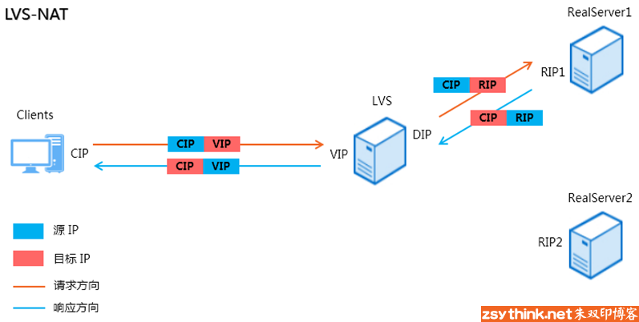

下面两个文章值得全篇仔细阅读：

> 从0搭建Linux虚拟网络：https://zhuanlan.zhihu.com/p/199298498
>
> bridge模式拆解与实例分析：https://zhuanlan.zhihu.com/p/206512720 该文章中涉及较多iptables规则的分析，可以大致浏览一下即可。


# LVS

LVS是Linux Virtual Server的缩写，从字面意思上翻译，LVS应该译为”Linux虚拟服务器”，但是这样的翻译对于初学者来说可能不容易理解，我们暂且不用纠结，等了解完了相关概念，我们自然会明白它的含义。

通过LVS实现负载均衡集群的方案属于”软件方案”，当然，既然有”软件方案”，那么肯定有对应的”硬件方案”，但是，硬件方案所需的成本比较高，我们需要购买特定的负载均衡硬件设备，以达到负载均衡的目的，比较知名的负载均衡硬件设备厂商有F5、Citrix等，但是硬件方案并不是此处讨论的重点，我们了解即可。而能够实现负载均衡之目的软件也不只有LVS一种，我们也可以通过nginx、haproxy等软件实现负载均衡的目的。当然，这篇文章就是介绍LVS的，所以其他方法我们不用理会，先来看看LVS是怎样实现负载均衡的。

LVS有多种模式（或者称为模型），在不同的模式下，LVS实现负载均衡的方式也不同，也就是说，我们可以通过不同的”姿势”来配置LVS，但是为了尽量降低我们认识LVS的门槛，我们可以先从较为简单的、容易理解的模式开始。

我们先来了解一下LVS的NAT模型（此模型较为容易理解），LVS-NAT模型的结构示意图如下。



整个过程是一个DNAT的过程，所以，此种LVS模型被称之为LVS-NAT模型。

上图中，LVS服务器主要负责调度，所以，我们也称上图中的LVS主机为调度器，聪明如你一定想到了，我们需要在角色为调度器的主机上进行一定的配置，比如，我们需要定义，当客户端访问调度器的VIP+80端口时，就表示客户端想要访问http服务，当然，对于客户端来说，LVS集群是透明的，客户端并不知道有一个”集群”的存在，客户端只知道访问VIP:80时，可以访问到自己的需要的网页，但是我们则必须清楚整个集群结构的来龙去脉，所以，我们需要在调度器上配置，当客户端访问VIP+80端口时，就代表客户端访问了一个”http服务集群”，同时，我们需要定义这个集群中哪些主机扮演”RealServer”，还需要定义调度器通过什么算法，将请求负载到后端的RealServer中。

如果我们想要实现这些定义，需要借助一个管理工具，它就是ipvsadm

我们可以将ipvsadm理解成一个用户工具，我们需要借助这个工具定义LVS集群规则。

但是，我们通过ipvsadm定义的规则最终还要依靠ipvs才能生效，我们可以这样理解，ipvs才是核心，但是作为管理员，我们需要通过ipvsadm才能定义规则，ipvs会根据我们定义的规则进行工作，ipvsadm工作于用户空间，ipvs工作于内核空间，ipvsadm与ipvs的关系，就好比iptables与netfilter的关系。


综上所述，LVS由两部分组成，ipvs与ipvsadm

ipvsadm：LVS管理工具，管理员通过ipvsadm定义或管理集群规则。

ipvs：LVS核心实现，根据定义好的集群规则进行工作。


其实，ipvs是与netfilter结合在一起使用的，2.4.X版本以后的内核中，ipvs作为netfilter的模块存在。ipvs其实就是附属在INPUT链上进行工作的，示意图如下：


当客户端访问服务时，会访问 VIP+端口，所以，客户端的请求报文会发往调度器，请求报文会先经过 PREROUTING 链，然后进行路由判断，由于此刻报文的目标 IP 为 VIP，而 VIP 对于调度器来说，就是本身的IP，所以报文会经过 INPUT 链，此刻，如果 IPVS 发现报文访问的 VIP+端口 与我们定义的 LVS 集群规则相符，ipvs 则会根据定义好的规则与算法，将报文直接发往 POSTROUTING 链，然后报文则会发出，最后到达后端的 RealServer 中。


如果我们想要配置一个LVS-NAT集群，可以在角色为调度器的主机上执行如下 ipvsadm 命令：

```shell
# 这条命令表示，创建一个LVS集群服务，这个服务为tcp协议的服务，集群服务的IP为VIP，端口号为port，使用rr算法（轮询算法）分发请求到后端的RealServer中。
# -A 选项表示添加一条虚拟服务记录，即创建一个LVS集群服务。
# -t 选项表示创建LVS集群服务为tcp服务，“VIP:port” 表示集群服务的IP与端口号。
# -s 选项为 Scheduling（调度）之意，用于指定具体的调度算法，可用算法有 rr 、wrr 、lc 、wlc 、lblc 、lblcr 、dh 、sh 、sed 、nq。
ipvsadm -A -t VIP:port -s rr
# -a 选项表示添加一个RealServer到集群中。
# -r 选项用于指定将要添加的Realserver的IP地址。
# -m 选项表示LVS集群的工作模式为LVS-NAT模式，当然，如果想要LVS工作于其他模式，那么在添加Realserver时，则不能使用-m选项，而需使用其他对应选项。
ipvsadm -a -t VIP:port -r RIP1 -m
ipvsadm -a -t VIP:port -r RIP2 -m
ipvsadm -a -t VIP:port -r RIPN -m


# 为同一个VIP的不同端口创建不同的虚拟服务
ipvsadm -A -t 192.168.1.100:80 -s rr    # HTTP服务
ipvsadm -A -t 192.168.1.100:443 -s wlc  # HTTPS服务，不同算法
ipvsadm -A -t 192.168.1.100:22 -s sh    # SSH服务，源地址哈希
# 为每个虚拟服务添加后端服务器
ipvsadm -a -t 192.168.1.100:80 -r 10.0.1.1:80 -m
ipvsadm -a -t 192.168.1.100:80 -r 10.0.1.2:80 -m

ipvsadm -a -t 192.168.1.100:443 -r 10.0.1.1:443 -m
ipvsadm -a -t 192.168.1.100:443 -r 10.0.1.2:443 -m

# 查看所有虚拟服务
ipvsadm -L -n

# 查看特定虚拟服务的详细信息
ipvsadm -L -t 192.168.1.100:80 -n

# 删除虚拟服务（会同时删除所有关联的真实服务器）
ipvsadm -D -t 192.168.1.100:80

# 只删除虚拟服务中的某个真实服务器
ipvsadm -d -t 192.168.1.100:80 -r 10.0.1.1:80
```


