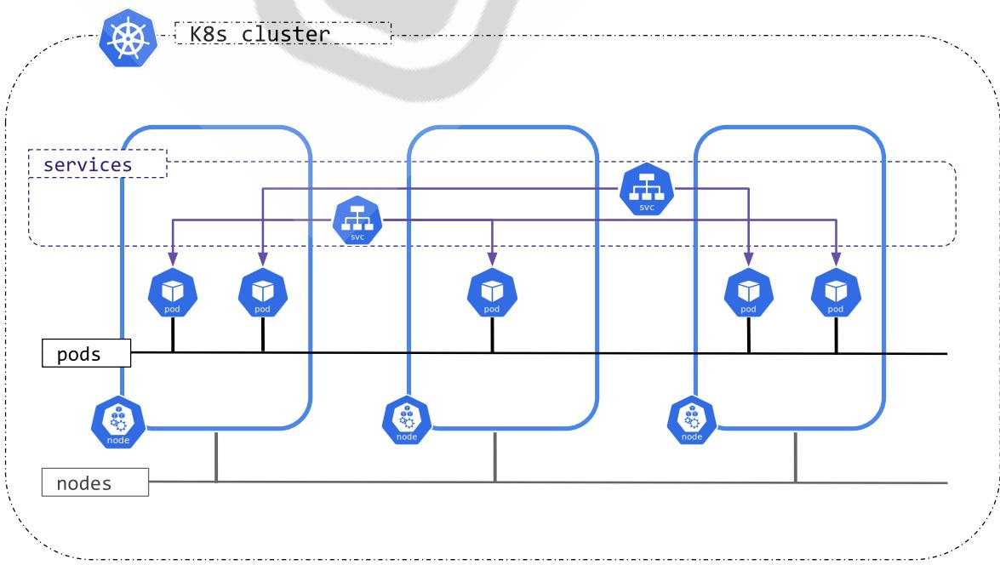
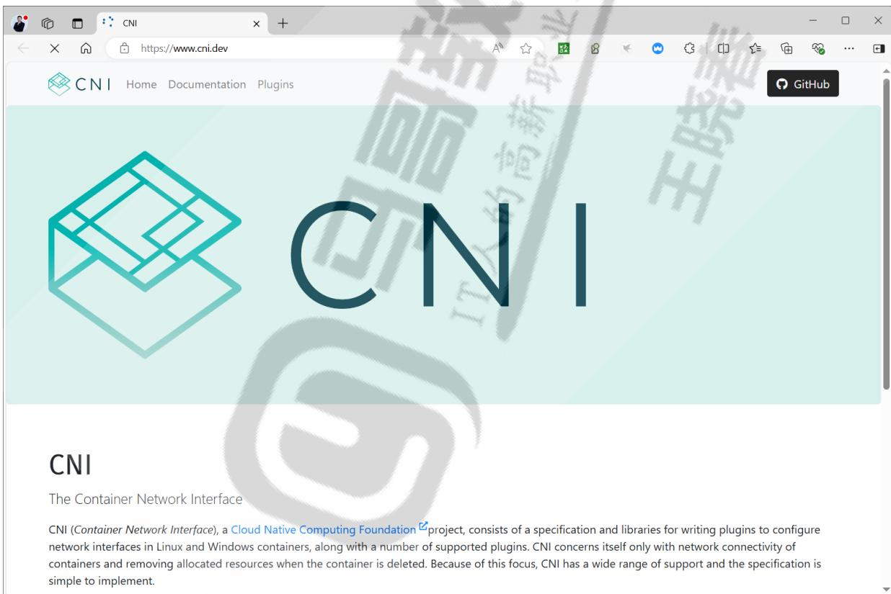
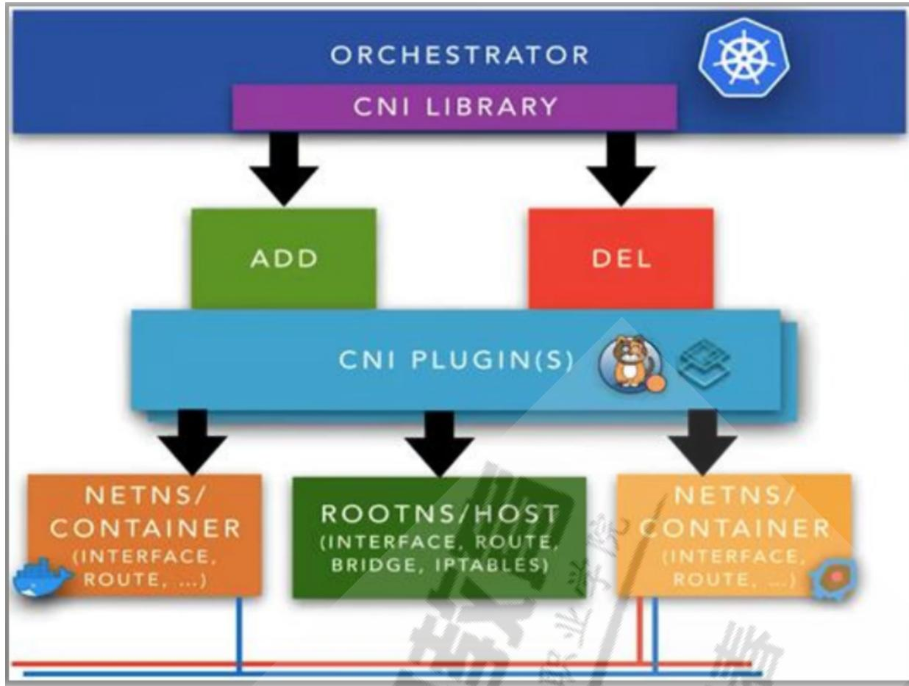
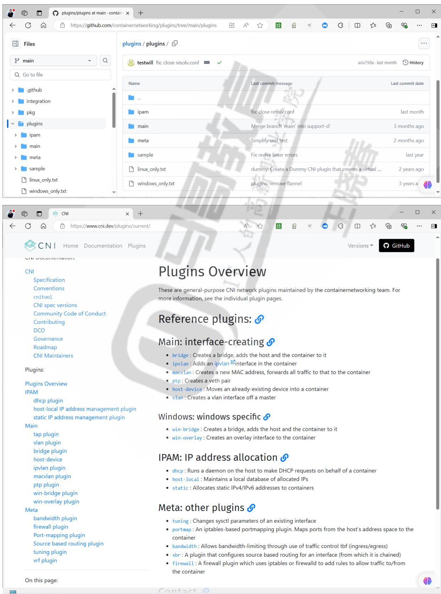

# Kubernetes 网络附件 Flannel

# 主要内容

- Kubernetes 网络模型- 容器接入网络方式- Kubernetes 常见网络附件- Flannel 工作机制- Flannel 网络模型- Flannel 案例

# 1 Kubernetes 网络

# 1.1 Kubernetes 网络机制

https://kubernetes.io/zh- cn/docs/concepts/extend- kubernetes/compute- storagenet/network- plugins/https://github.com/containernetworking/cni

# 1.1.1 Kubernetes 的网络模型

Kubernetes 集群内一般有三种网络：节点网络, Service 网络, Pod 网络

# 因此有如下的四类通信

- 同一Pod内容器间的通信（Container to Container）：Pod内所有容器共享同一个网络命名空间,容器间通过loopback直接通信- Pod间的通信（Pod to Pod）：network plugin is configured to assign IP addresses to Pods.- Service到Pod间的通信（Service to Pod）：依赖Kube-proxy的所管理的Service 在内核实现,比如:Iptables或IPVS策略实现- 集群外部与Service之间的通信（external to Service）：依赖于不同的Service 类型,比如:NodePort或者LoadBalancer等

KubeProxy功能

- 指供service网络通信- iptables或IPVS规则- 实现服务发现

# 1.1.2 CNI

https://www.cni.dev/https://github.com/containernetworking/cni

Kubernetes中并没有提供一个核心组件完成Pod之间的网络通信功能，而是Kubernetes定义了CNI（Container Network Interface）接口标准

Kubernetes将Pod间的网络通信功能通过CNI委托给了第三方的外部的插件

只要由第三方的网络插件遵守CNI规范，即可支持Kubernetes的Pod通信

在创建kubernetes集群时，需要安装CNI兼容的网络插件，否则多个节点间无法正常通信，每个节点都会处于NotReady状态。

CNI容器网络接口是CNCF的项目，是由google和CoreOS主导制定的容器网络标准，但自身并非负责具体实现，只是一种协议和标准

CNI是容器引擎与遵循该规范网络插件的中间层，专用于为容器配置网络子系统

使用CNI插件编排网络，Pod初始化或删除时，kubelet会调用默认CNI插件，创建虚拟设备接口附加到相关的底层网络，设置IP、路由并映射到Pod对象网络名称空间。

CNI基本思想：创建容器时，先创建好网络名称空间，然后调用CNI插件配置这个网络，而后启动容器内的进程

CNI网络插件主要功能

- 创建Pod的网络设备- IPAM IP Address Management，用于给Pod分配IP地址    
- flannel: 10.244.0.0/16    
- calico: 192.168.0.0/16    
- cilium: 192.168.0.0/16- 同一个节点Pod间通信- 不同节点的Pod间通信- 也可以支持额外功能，比如：流量控制

CNI将Pod接入Pod网络流程

- 创建Pod网络- 创建Pod时为每个Pod创建对应虚拟网络接口- 将新创建的Pod的虚拟网络接口连接至Pod网络中- 给启动的Pod的虚拟网络接口分配IP地址

# CNI插件可以分为三部分：

main、meta、ipam（按照源代码中的存放目录可以看出）

https://github.com/containernetworking/plugins/tree/main/pluginshttps://www.cni.dev/plugins/current/

- Main

主要负责创建和删除网络以及向络中添加删除容器

专注于连通容器与容器之间以及容器与宿主机之间的通信

该类插件还负责创建和容器相关网络设备，例如：bridge、ipvlan、macvlan、loopback、ptp、veth以及vlan等虚拟设备

- IPAM:

IP Address Management，仅用于给当前节点的Pod分配IP地址，不提供网络实现

IPAM Plugin 作为 CNI NetPlugin的一部分，与 CNI Plugin 一起工作

该类插件API负责创建/删除地址池以及分配/回收容器的IP地址

目前，该类型插件的实现主要有dhcp，host- local和static

- DHCP: 通过上节点运行dhcp服务进程通过DHCP协议获取地址

- host-local: 基于预置的本地地址范围库进行地址分配

- Static: 静态IP

- Meta:

其它的plugins，包括如下

- tuning: Changes sysctl parameters of an existing interface- portmap: An iptables-based portmapping plugin. Maps ports from the host's address space to the container- bandwidth: Allows bandwidth-limiting through use of traffic control tbf (ingress/egress)- sbr: A plugin that configures source based routing for an interface (from which it is chained)- firewall: A firewall plugin which uses iptables or firewalld to add rules to allow traffic to/from the container

# 1.2 容器接入网络方式

不同的容器虚拟化网络解决方案中为Pod的网络名称空间创建虚拟接口设备的方式也会有所不同

# 1.2.1 容器接入网络的方式

目前较为流行的实现方式有虚拟以太网设备（veth）、多路复用及硬件交换三种

虚拟网桥Bridge/veth设备：

用纯软件的方式实现一个虚拟网络，用一个虚拟网卡接入到虚拟网桥上去。先在宿主机上创建一个网桥，并为每个容器创建一对虚拟以太网接口（veth）每一对网卡一半留在pod之上一半留在宿主机之上，并添加为Linux内核桥接功能或OpenVSwitch（OVS）网桥的从设备甚至能接入到真实的物理网桥上实现物理桥接的方式这样就能保证每一个容器和每一个pod都能有一个专用的网络接口对Linux内核版本要求较低此方式适用虚拟机环境，但性能较差当前此方式支持网络模型更灵活和广泛，所以在企业中使用最为主流

多路复用：

多路复用由一个中间软件实现的虚拟网络设备组成，它暴露多个虚拟接口，使用数据包转发规则来控制每个数据包转到的目标接口

节点上的Pod直接使用物理网卡并直接使用物理网卡进行跨节点之间进行通信。

需要借助于Linux较高版本的内核级的VLAN模块来实现

此方式适用于物理机环境，性能较好，一般在运营商中使用更为广泛

主要有下面两种实现

主要有下面两种实现- MACVLAN技术为每个容器的虚拟网卡接口配置一个独立的MAC地址，并将宿主机模拟为一个交换机，基于此地址完成二层报文收发- IPVLAN技术则是每个容器的虚拟网卡分配一个独立的IP地址，但共享宿主机的同一个MAC，根据目标IP完成容器报文转

硬件交换：

通过硬件实现的技术

当前很多网卡都支持单根I/O虚拟化（SR- IOV Single Root I/O Virtualization），也是创建虚拟设备的一种实现方式

一个网卡支持直接在物理机虚拟出多个接口来，所以称为单根的网络连接方式

一个网卡能够虚拟出在硬件级多个网卡来。然后让每个容器使用一个网卡

每个虚拟设备自身表现为一个独立的网卡设备，自己的MAC地址，VLAN及硬件强制关联的QoS

SR- IOV提供了接近硬件级别的性能，但是依赖特有硬件

三种方式中硬件交换的方式性能是最好的

但是很多情况下用户期望去创建二层或三层的一些逻辑网络子网，这就需要借助于叠加的网络协议来实现

在多种解决方案中第一种使用虚拟网桥能够实现更为强大的控制能力的解决方案，但是此方式对网络传输有额外的性能开销，毕竟它称为隧道网络或者叠加网络，要多封装IP首部或者封装mac首部

# 1.2.2 veth 网卡实现

范例：通过veth网卡在不同名称空间通信

# #查看网络名称空间

[root@node1 ~]#ip netns

# #创建网络名称空间

[root@node1 ~]#ip netns add ns1  [root@node1 ~]#ip netns add ns2  [root@node1 ~]#ip netns ns2  ns1

# #创建veth的网卡对

[root@node1 ~]#ip link add veth- ns1 type veth peer name veth- ns2

将网卡对分别加入不同的名称空间

[root@node1 ~]#ip link set veth- ns1 netns ns1

[root@node1 ~]#ip link set veth- ns2 netns ns2

# #查看网络名称空间的网卡信息

[root@node1 ~]#ip netns exec ns1 ip a

1: lo: <LOOPBACK> mtu 65536 qdisc noop state DOWN group default qlen 1000  link/loopback 00:00:00:00:00:00 brd 00:00:00:00:00:00

8: veth- ns1@if7: <BROADCAST,MULTICAST> mtu 1500 qdisc noop state DOWN group default qlen 1000  link/ether d6:36:47:df:80:1e brd ff:ff:ff:ff:ff:ff link- netns ns2

[root@node1 ~]#ip netns exec ns2 ip a

1: lo: <LOOPBACK> mtu 65536 qdisc noop state DOWN group default qlen 1000  link/loopback 00:00:00:00:00:00 brd 00:00:00:00:00:00

7: veth- ns2@if8: <BROADCAST,MULTICAST> mtu 1500 qdisc noop state DOWN group default qlen 1000

link/ether ba:ca:48:ad:d9:c5 brd ff:ff:ff:ff:ff:ff link- netns ns1

# #启用网卡对

[root@node1 ~]#ip netns exec ns1 ip link set veth- ns1 up

[root@node1 ~]#ip netns exec ns2 ip link set veth- ns2 up

# #给网卡对配置IP

[root@node1 ~]#ip netns exec ns1 ip a a 1.1.1.1/24 dev veth- ns1 [root@node1 ~]#ip netns exec ns1 ip a

1: lo: <LOOPBACK> mtu 65536 qdisc noop state DOWN group default qlen 1000 link/loopback 00:00:00:00:00 brd 00:00:00:00:00:00 8: veth- ns1@if7: <BROADCAST,MULTICAST,UP,LOWER_UP> mtu 1500 qdisc noqueue state UP group default qlen 1000 link/ether d6:36:47:df:80:1e brd ff:ff:ff:ff:ff:ff link- netns ns2 inet 1.1.1.1/24 scope global veth- ns1 valid_lft forever preferred_lft forever inet6 fe80::d436:47ff:fead:801e/64 scope link valid_lft forever preferred_lft forever

[root@node1 ~]#ip netns exec ns2 ip a a 1.1.1.2/24 dev veth- ns2 [root@node1 ~]#ip netns exec ns2 ip a

1: lo: <LOOPBACK> mtu 65536 qdisc noop state DOWN group default qlen 1000 link/loopback 00:00:00:00:00 brd 00:00:00:00:00:00

7: veth- ns2@if8: <BROADCAST,MULTICAST,UP,LOWER_UP> mtu 1500 qdisc noqueue state UP group default qlen 1000

link/ether ba:ca:48:ad:d9:c5 brd ff:ff:ff:ff:ff link- netns ns1 inet 1.1.1.2/24 scope global veth- ns2 valid_lft forever preferred_lft forever inet6 fe80::b8ca:48ff:fead:d9c5/64 scope link valid_lft forever preferred_lft forever

# #测试不同名称空间的网卡对相互访问

[root@node1 ~]#ip netns exec ns1 ping =c1 1.1.1.2 PING 1.1.1.2 (1.1.1.2) 56(84) bytes of data. 64 bytes from 1.1.1.2: icmp_seq=1 ttl=64 time=0.055 ms

# #默认无法访问自身

[root@node1 ~]#ip netns exec ns1 ping - c1 1.1.1.1 PING 1.1.1.1 (1.1.1.1) 56(84) bytes of data. - - - 1.1.1.1 ping statistics - - - 1 packets transmitted, 0 received, 100% packet loss, time 3055ms

# #查看原因lo网卡没有启用

[root@node1 ~]#ip netns exec ns1 ip a 1: lo: <LOOPBACK> mtu 65536 qdisc noop state DOWN group default qlen 1000 link/loopback 00:00:00:00:00 brd 00:00:00:00:00:00

8: veth- ns1@if7: <BROADCAST,MULTICAST,UP,LOWER_UP> mtu 1500 qdisc noqueue state UP group default qlen 1000 link/ether d6:36:47:df:80:1e brd ff:ff:ff:ff:ff:ff link- netns ns2 inet 1.1.1.1/24 scope global veth- nsl valid_lft forever preferred_lft forever inet6 fe80::d436:47ff:fead:801e/64 scope link valid_lft forever preferred_lft forever

# #启用lo网卡

[root@node1 ~]#ip netns exec ns1 ip link set lo up

# #再次访问成功

[root@node1 ~]#ip netns exec ns1 ping - c1 1.1.1.1

PING 1.1.1.1 (1.1.1.1) 56(84) bytes of data. 64 bytes from 1.1.1.1: icmp_seq=1 ttl=64 time=0.027 ms  - - - 1.1.1.1 ping statistics 1 packets transmitted, 1 received,  $0\%$  packet loss, time 1025ms  rtt min/avg/max/mdev = 0.027/0.029/0.031/0.002 ms

清理环境：删除网络名称空间和veth网卡对  [root@node1 ~]#ip netns delete ns1  [root@node1 ~]#ip netns delete ns2  [root@node1 ~]#ip netns

范例：通过网卡桥接veth网卡对，实现不同名称空间网卡相互通信

# 创建网络名称空间

[root@node1 ~]#ip netns  [root@node1 ~]#ip netns add ns1  [root@node1 ~]#ip netns add ns2

# 创建网桥

[root@node1 ~]#ip link add br0 type bridge

[root@node1 ~]#apt update && apt - y install bridge- utils  [root@node1 ~]#brctl show  bridge name bridge id STP enabled interfaces  br0 8000: e2c6c6b49ece78 no

[root@node1 ~]#ip a show br0  9: br0: <BROADCAST,MULTICAST> mtu 1500 qdisc noop state DOWN group default qlen 1000  link/ether e2:6c:6b:49:ee:78 brd ff:ff:ff:ff:ff:ff

启用网桥  [root@node1 ~]#ip link set br0 up

# 创建veth网卡对

[root@node1 ~]#ip link add veth1 type veth peer name veth1- ns1  [root@node1 ~]#ip link add veth2 type veth peer name veth2- ns2

# #将网卡对加入不同的名称空间

[root@node1 ~]#ip link set veth1- ns1 netns ns1  [root@node1 ~]#ip link set veth2- ns2 netns ns2

# #启用不同网络空间的网卡对

[root@node1 ~]#ip netns exec ns1 ip link set veth1- ns1 up  [root@node1 ~]#ip netns exec ns2 ip link set veth2- ns2 up

# #给不同网络空间的网卡配置IP

[root@node1 ~]#ip netns exec ns1 ip a a 1.1.1.1/24 dev veth1- ns1  [root@node1 ~]#ip netns exec ns2 ip a a 1.1.1.2/24 dev veth2- ns2

# #查看网桥

[root@node1 ~]#brctl show  bridge name bridge id STP enabled interfaces  br0 8000. e26c6b49ee78 no  cni0 8000. eaaff474161e4 no

# #测试不同名空间的网络通信不成功

[root@node1 ~]#ip netns exec ns1 ping - c1 1.1.1.2  PING 1.1.1.2 (1.1.1.2) 56(84) bytes of data.

- -- 1.1.1.2 ping statistics 
-- 1 packets transmitted, 0 received, 100% packet loss, time 0ms

# #将网卡桥接至br0

[root@node1 ~]#ip link set veth1 master br0  [root@node1 ~]#ip link set veth2 master br0

[root@node1 ~]#brctl show  bridge name bridge id STP enabled interfaces  br0 8000. e26c6b49ee78 no veth1  veth2  cni0 8000. eaaff474161e4 no

# #启用网卡对

[root@node1 ~]#ip link set veth1 up  [root@node1 ~]#ip link set veth2 up

# #测试不同名称空间的网卡相互访问成功

[root@node1 ~]#ip netns exec ns1 ping - c1 1.1.1.2  PING 1.1.1.2 (1.1.1.2) 56(84) bytes of data.  64 bytes from 1.1.1.2: icmp_seq=1 ttl=64 time=0.135 ms

- -- 1.1.1.2 ping statistics 
- -- 1 packets transmitted, 1 received, 0% packet loss, time 0ms  rtt min/avg/max/mdev = 0.135/0.135/0.135/0.000 ms

[root@node1 ~]#ip netns exec ns2 ping - c1 1.1.1.1  PING 1.1.1.1 (1.1.1.1) 56(84) bytes of data.  64 bytes from 1.1.1.1: icmp_seq=1 ttl=64 time=0.087 ms

- -- 1.1.1.1 ping statistics 
- -- 1 packets transmitted, 1 received, 0% packet loss, time 0ms  rtt min/avg/max/mdev = 0.087/0.087/0.087/0.000 ms

# #清理环境

[root@node1 ~]#ip netns

ns2(id:1)  ns1(id:0)  [root@node1 ~]#ip netns delete ns1  [root@node1 ~]#ip netns delete ns2  [root@node1 ~]#ip netns  [root@node1 ~]#ip link delete br0

# 1.3 Underlay Network和Overlay Network

Kubernetes的NetPlugin目前常用的实现Pod网络的方案有承载网络（Underlay Network）和叠加网络（Overlay Network）两类

# - Underlay Network高层（承载）网络

即实际的物理网络，包括所有的物理设备（如路由器，交换机，电缆等），以及它们之间的网线连接。

在大多数情况下，Underlay网络负责数据包的物理传输，包括IP路由，网络拓扑，带宽等。

基础网络通常由网络管理员直接管理，并使用传统的网络协议和技术（如IP，Ethernet，MPLS等）

# 底层（承载）网络支持两种模型：

# 路由模型

承载网络通常使用direct routing（直接路由，即将节点做为路由器）技术在Pod的各子网间路由Pod的IP报文

把节点当路由器，每个节点背后都是一个末端网络，即持有的Pod子网（PodCIDR）

每个节点的路由表通过查询中央数据库（如：ETCD）或BGP协议生成到达其它节点上的Pod目标子网的路由记录

Pod的网络接口一般使用vethPair实现

# 二层网络

使用Brideg，MACVLAN或IPVLAN等技术直接将容器暴露至外部网络中

承载网络的解决方案就是一类非借助于隧道协议而构建的容器通信网络

容器网络中的承载网络是指借助驱动程序将宿主机的底层网络接口直接暴露给容器使用的一种网络构建技术

# 此方式不支持节点间的跨网段通信

# Overlay Network叠加网络

即虚拟网络

在Underlay Network之上创建的虚拟网络被称为Overlay Network叠加网络。

叠加网络使用软件来抽象Underlay Network的硬件细节，从而创建虚拟的网络设备和连接。

叠加网络可以用来创建复杂的网络拓扑，实现网络虚拟化，实现多租户隔离，以及满足特定应用程序的特殊网络需求。

叠加网络使用各种封装隧道协议（如VXLAN，IPIP，GRE，STT等）在Underlay Network上封装和传输数据包。

通过隧道协议报文封装Pod间的通信报文（IP报文或以太网帧）来构建虚拟网络

相较于承载网络，叠加网络由于存在额外的隧道报文封装，会存在一定程度的性能开销

叠加网络的底层网络也就是承载网络

但希望创建跨越多个L2或L3的逻辑网络子网时，只能借助于叠加封装协议实现节点间跨网段通信

此方式生产较为常见

总的来说，Underlay Network和Overlay Network的主要区别在于：

- Underlay Network是物理的，实际的，负责数据包的实际传输- Overlay Network是虚拟的，由软件实现，并且提供了对网络资源的更灵活的管理和使用。

# 1.4 Kubernetes 常见网络插件

https://github.com/containernetworking/cni https://kubernetes.io/zh- cn/docs/concepts/cluster- administration/addons/

# 联网和网络策略

- ACI通过Cisco ACI提供集成的容器网络和安全网络。

- Antrea在第3/4层执行操作，为Kubernetes提供网络连接和安全服务。Antrea利用Open vSwitch作为网络的数据面。- Calico是一个联网和网络策略供应商。Calico支持一套灵活的网络选项，因此你可以根据自己的情况选择最有效的选项，包括非覆盖和覆盖网络，带或不带BGP。Calico使用相同的引擎为主机、Pod和（如果使用Istio和Envoy）应用程序在服务网格层执行网络策略。- Canal结合Flannel和Calico，提供联网和网络策略。

- Cilium是一种网络、可观察性和安全解决方案，具有基于eBPF的数据平面。Cilium提供了简单的1层扁平网络，能够以原生路由（routing）和覆盖/封装（overlay/encapsulation）模式跨越多个集群，并且可以使用与网络寻址分离的基于身份的安全模型在L3至L7上实施网络策略。Cilium可以作为kube-proxy的替代品；它还提供额外的、可选的可观察性和安全功能。

- CNI-Genie使Kubernetes无缝连接到Calico、Canal、Flannel或Weave等其中一种CNI插件。

- Contiv为各种用例和丰富的策略框架提供可配置的网络（带BGP的原生L3、带vXlan的覆盖、标准L2和Cisco-SDN/ACI）。Contiv项目完全开源。其安装程序提供了基于kubeadmin和非kubeadmin的安装选项。

- Contrail基于Tungsten Fabric，是一个开源的多云网络虚拟化和策略管理平台。Contrail和Tungsten Fabric与业务流框系统（例如Kubernetes、OpenShift、OpenStack和Mesos）集成在一起，为虚拟机、容器或Pod以及模拟工作负载提供了隔离模式。

- Flannel是一个可以用于Kubernetes的overlay网络提供者。

- Knitter是在一个Kubernetes Pod中支持多个网络接口的插件。

- Multus是一个多插件，可在Kubernetes中提供多种网络支持，以支持所有CNI插件（例如Calico、Cilium、Contiv、Flannel），而且包含了在Kubernetes中基于SRIOV、DPDK、OVS-DPDK和VPP的工作负载。

- OVN-Kubernetes是一个Kubernetes网络驱动，基于OVN（Open Virtual Network）实现，是从Open vSwitch（OVS）项目衍生出来的虚拟网关实现。OVN-Kubernetes为Kubernetes提供基于覆盖网络的网络实现，包括一个基于OVS实现的负载/功能器和网相策略。

- Nodus是一个基于OVN的CNI控制器插件，提供基于云原生的服务功能链（SFC）。

- NSX-T容器插件（NCP）提供了VMware NSX-T与容器协调器（例如Kubernetes）之间的集成，以及NSX-T与基于容器的CaaS/PaaS平台（例如关键容器服务（PKS）和OpenShift）之间的集成。

- Nuage是一个SDN平台，可在KubernetesPods和非Kubernetes环境之间提供基于策略的联网，并具有可视化和安全监控。

- Romana是一个Pod网络的第三层解决方案，并支持NetworkPolicy API。

- WeaveNet提供在网络分组两端参与工作的联网和网络策略，并且不需要额外的数据库。

# 网络插件主要功能：

Pod间的网络通信，最为核心的功能

构建一个网络

将pod接入到这个网络中

实时维护所有节点上的路由信息，实现所有节点上Pod之间的通信

- 网络策略，实现网络通信的安全控制

- 通信加密，默认Pod间的通信是明文的，但安全要求较高时，也可以实现tls的安全加密通信

注意：这些网络插件可以完成所有的功能，也可以完成部分的功能，再借助于其他方案实现完整的方案但是需要注意的是：不要同时部署多个插件来做同一件事情，因为对于CNI来说，只会有一个生效。

常见的CNI解决方案有：

- Flannel

是CoreOS团队开源的最早的支持kubernetes的网络插件

用于让集群中不同节点创建的容器都具有集群内全局唯一的网络（集群外无法感知），也是当前Kubernetes开源方案中比较成熟的方案

支持HostGW和VXLAN模式，基于linuxTUN/TAP，使用UDP封装IP报文来创建叠加网络，并借助etcd维护网络分配情况

功能简单，特性较少，无法实现网络流量的控制等高级功能

Calico

纯3层的数据中心网络方案，支持IPIP和BGP模式，后者可以无缝集成像OpenStack这种IaaS云架构，能够提供可控的VM、容器、裸机之间的IP通信。

但是，需要网络设备对BGP的支持，比如阿里云vpc子网内是不支持BGP的

在每台机器上运行一个vRouter，利用内核转发数据包

性能优秀，而且借助iptables实现网络策略控制等功能

不支持多播

Canal

由Flannel和Calico联合发布的一个统一网络插件，相当于两者的合体

即集成了flannel和Calico的特性，也支持网络策略

当前活跃度较低

cilium

https://github.com/cilium/cilium

Cilium是一款基于eBPF技术的KubernetesCNI插件

Cilium在其官网上对产品的定位为“eBPF- based Networking, Observability, Security”，致力于为容器工作负载提供基于eBPF的网络、可观察性和安全性的一系列解决方案。

Cilium通过使用eBPF技术在Linux内部动态插入一些控制逻辑，可以在不修改应用程序代码或容器配置的情况下进行应用和更新，从而实现网络、可观察性和安全性相关的功能。

Cilium最初由Isovalent创建，于2021年10月成为CNCF孵化项目，现在有来自7家不同公司的维护者和800多名个人贡献者。就提交数量而言，Cilium在CNCF项目的活跃度中排名第二，仅次于Kubernetes。

2023年10月11日，CNCF发文宣布容器网络开源项目Cilium正式毕业。

Cilium使用eBPF（Extended Berkeley Packet Filter）技术，它可以在Linux内核中运行高性能的程序来处理网络数据包，从而实现高效的网络功能。Cilium通过eBPF程序来管理网络流量，执行负载均衡、安全策略、服务发现等任务

当你选择使用Cilium作为网络插件时，Cilium会接管网络功能，包括服务发现和负载均衡，Cilium会替代kube- proxy来提供更强大和高效的网络功能。因此不再依赖于kube- proxy，不再需要安装或配置kube- proxy。

支持多集群和安装多个CNI插件来增强功能

此插件相对复杂，如果想实现BGP还需要安装额外的插件，比如：kube- router

Terway

Terway是阿里云开源的基于VPC网络的CNI插件，支持VPC和ENI(弹性网卡)模式，后者可实现容器网络使用VPC子网网络。

Pod会通过弹性网卡资源直接被分配使用VPC中的IP地址，而不需要额外指定虚拟Pod网段。

Pod地址即为VPC中地址，无NAT损耗支持独占ENI模式，几乎无损。

支持基于Kubernetes标准的网络策略(Network Policy)来定义容器间的访问策略，并兼容Calico的网络策略。

支持对单个容器做带宽的限流。

- Contiv

思科开源的用于跨虚拟机、裸机、公有云或私有云的异构容器部署的开源容器网络架构方案直接提供多租户网络，支持L2(VLAN)、L3(BGP)、Overlay(VXLAN)

- kube-router

K8s网络一体化解决方案，可取代kube- proxy实现基于ipvs的Service，支持网络策略、完美兼容BGP的高级特性

- Weave Net

由weaveworks公司开发，当前此公司已倒闭

WeaveNet最初是为容器开发的，但后来演变成了Kubernetes网络插件

多主机容器的网络方案，支持去中心化的控制平面，数据平面上，通过UDP封装实现L2Overlay这些方案中，当前主流的是：calico、flannel、Cilium、kube- router

# 2 Flannel

# 2.1 Flannel介绍

Flannel是Kubernetes的一种兼容CNI的API的开源的网络插件，基于Golang开发，由CoreOS研发

Kubernetes在发布CNI之前，使用的是kubenet网络规范，当时唯一网络实现就是Flannel

因此Flannel是kubernetes最早的网络解决方案

支持Kubernetes、OpenShift、Cloud Foundry、Mesos、Amazon ECS、Singularity和OpenSVC等平台

2013年1月CoreOS发布CoreOS操作系统，后改名为Container Linux，是一个基于Linux内核的轻量级操作系统，为了让计算机集群的基础设施建设而生，专注于自动化、轻松部署、安全、可靠及可扩缩性。作为一个操作系统，CoreOS提供了在应用容器内部署应用所需要的基础功能环境以及一系列用于服务发现和配置共享的内建工具。

2013年7月21日：Flannel由CoreOS开发，作为一个用于容器网络的解决方案

2013年7月30日：etcd在CoreOS的开发过程中首次发布

2015年：CoreOS发布了自已的容器运行时rkt

2016年12月7日：CoreDNS在原有的Caddy服务器基础上开发出来，最初作为一个轻量级的DNS服务器，旨在提供可插拔的架构和模块化功能。

2017年：CoreDNS开始被广泛用于Kubernetes，作为集群内部DNS解决方案，取代了之前使用的kube- dns。

2018年1月30日，RedHat宣布已经签署了收购CoreOS。

2020年5月26日，CoreOS Container Linux达到其寿命的终结，不再接收更新。Fedora CoreOS是其正式继任者

Flannel使用虚拟网桥和veth设备的方式为Pod创建虚拟网络接口

通过可配置的"后端"定义Pod间的通信网络，支持基于VXLAN和UDP的Overlay网络，以及基于三层路由的Underlay网络

官网：

官网：http://coreos.com/flannel/https://github.com/flannel- io/flannelhttps://github.com/flannel- io/flannel#deploying- flannel- manuallyhttps://docs.openshift.com/container- platform/3.4/architecture/additional_concepts/flannel.html

# 2.2 Flannel原理

# 2.2.1 Flannel工作机制

Cluster

# Flannel的相关术语

veth

veth是一种虚拟以太网设备。veth可作为netns间的隧道，创建桥接另一个netns中物理网络设备，也可作为独立的网络设备使用

每个Pod启动后，会自动在所在节点生成一个对应的veth虚拟以太网网卡

cno

cno是一种Linux网桥设备。

所有Pod的虚拟网卡veth设备将连接到该网桥，使得所有位于同一节点的Pod间可相互通信。

cno的IP为此主机上所有Pod的默认网关，一般为节点Pod对应子网的第1个IP，比如：10.244.1.1/24

flannel.1

flannel.1是VXLAN终端设备，也被称为VXLAN通道终端（VETP），它是VXLAN通道的起点和终点

flannel.1做为VXLAN接口的主要功能是确保Pod及其网络间的通信经由Overlay二层网络

让各节点的 VXLAN 如同连接在同一个大的网络(默认为10.244.0.0/16)中工作。每个节点具有一个独立的子网(10.244. X.0/24)，每个 Pod 的 IP 位于该子网中。即每个节点的 VXLAN 网络自成体系,有自己独立的子网，但同时也处于同一个大网络域内。flannel.1 接口地址一般为子网的第 0 个，比如:10.244.1.0/32

- flanneld

flanneld 是一个进程，由每个节点的 daemonset 的 kube- flannel Pod 提供此功能由于 flannel 是以 pod 的形式存在，flannel 启动后就相当于在每个节点上启动了一个守护进程

该守护进程：

- 该进程会负责当前节点上的所有报文封装解封等动作- 通过 kube- apiserver 组件从集群的 jetcd 服务中，获取每个节点的网络信息，并生成本地路由表信息- 给本地的 flannel.1 网卡配置相关的 ip 地址

# Flannel 的工作机制

Flannel 将预留的一个专用网络（默认为 10.244.0.0/16）针对每个集群节点切分成相对应的一个 CIDR 子网

每个节点上 CIDR 子网专用于给该上节点上的 Pod 分配 IP，而后由节点以 IPAM 插件 host- local 进行地址分配，并将子网分配信息保存于 etcd 之中

Flannel 在每个主机上运行一个名为 flanneld 的二进制代理程序

该程序负责从预留的网络中按照指定或默认的掩码长度为每个集群节点申请分配一个子网，并将网络配置、已分配的子网和辅助数据（例如主机的公网 IP 等）存储于 Kubernetes API 或 etcd 之中

所有节点的 Pod 使用默认分配置在 10.244.0.0/16 这样一个大的网段

kube- controller- manager 会从这个大的网段中再会为每个节点分配一个小的子网网段 podCIDR10.244.0.0/24

从 podCIDR 中的子网值为节点上的 Pod 分配 IP 地址。

由于所有节点上的 podCIDR 是不相交的子网，因此它允许为每个 Pod 分配唯一的 IP 地址默认使用 10.244.0.0/16 的网段，并给每个节点划分子网 10.244.0.0/24，

每个节点的子网网段 PodCIDR 分配给每个节点上的 Pod 使用，比如：

Master1 上的 Pod:10.244.0.0/24

Master2 上的 Pod:10.244.1.0/24

Master3 上的 Pod:10.244.2.0/24

Node1 上的 Pod:10.244.3.0/24

Node2 上的 Pod:10.244.4.0/24

Node3 上的 Pod:10.244.5.0/24

即支持 2^8 个子网，每个节点的子网支持 2^8- 2=254 个 Pod

每个节点的 flannel.1 占用每个子网的 0 号 IP，同时每个 flannel.1 做为到达集群中其它节点上各个 Pod 网段对应路由的网关

比如 Master1 上 flannel.1 为 10.244.0.0/32，Node1 上的 flannel.1 为 10.244.3.0/32

每个节点的cni0虚拟网桥会占用子网的第一个IP，所有本节点的Pod的网卡都会创建一对veth网卡，一端在Pod上，另一端在节点上，节点上的接口都桥接到cni0网桥上，同时做为本节点上面的所有Pod的网关

比如Master1上cni0为10.244.0.1/24,Node1上的cni0为10.244.3.1/24

Pod之间的通信被用VXLAN的UDP协议封装后，向目标Pod所在的主机8472/VDP端口发送

网段的分配原理

- 集群的kube-controller-manager负责控制每个节点的网段分配- 集群的etcd负责存储所有节点的网络配置存储- 集群的flannel负责各个节点的路由表定制及其数据包的拆分和封装

所以flannel各个节点是平等的，仅负责数据平面的操作。网络功能相对来说比较简单

官网Flannel的网络通信

# 注意：官网图中docker0是错误的，应该为cni0

https://docs.openshift.com/container- platform/3.4/architecture/additional_concepts/flannel.html

OPENSHIFT

kube- apiserver为了更方便后续flannel与etcd直接的交流，单独分配一个url用于flannel和etcd的交流- 在二进制部署集群中可以看到效果。

# 2.2.2 Flannel网络模型

Flannel使用称为后端（backend）的容器网络机制转发跨节点的Pod报文它目前支持的主流backend如下，即flannel网络通信模型

<table><tr><td>模型</td><td>解析</td></tr><tr><td>vxlan</td><td>此为Flannel的默认模式
使用Linux内核中的vxlan模块封装隧道报文，以overlay叠加网络模型支持跨节点的Pod间互联互通
Pod与Pod之间的通信是经由隧道封装后实现，各节点彼此间能通信就行，不要求在同一个二层网络
vxlan后端模式中，flanneld监听于8472/UDP发送封装的数据包</td></tr><tr><td>host-gw</td><td>Pod与Pod不经隧道封装而直接通信，要求各节点必须位于同一个二层网络，属于UnderLay网络
由于这种方式强制要求各节点本身必须在同一个二层网络中，不太适用于较大的网络规模
此模式有着较好的转发性能，且易于设定，推荐对报文转发性能要求较高的场景使用</td></tr><tr><td>vxlan directrouting</td><td>vxlan也支持直接路由（Direct Routing）模式
如果在同一个二层网络的不同节点上的Pod间通信，无须隧道封装直接路由通信即可
如果在不同的二层网络的不同节点上的Pod间通信，仍须隧道封装VXLAN通信</td></tr><tr><td>udp</td><td>使用常规UDP报文封装完成隧道转发，性能较前两种方式低很多
UDP后端模式中，flanneld监听于8285/UDP发送封装的报文
仅应该用在不支持前两种后端环境中使用</td></tr></table>

# 2.2.2.1 VXLAN 模式

# 2.2.2.1.1 VXLAN 介绍

Flannel默认网络模型就是以VXLAN(Visual eXtensible Local Area Network)的隧道模型来实现正常的跨节点的网络通信。

VxLAN本质上是一种隧道封装技术。支持kernels的节点跨网段通信

它使用TCP/IP协议栈的封装/解封装技术，将Layer2的以太网帧（Ethernet frames）封装成Layer4的UDP数据报（datagrams），然后在Layer3的网络中传输，效果就像Layer2的以太网帧在一个广播域中传输一样，实际上是跨越了L3网络，但却感知不到Layer3网络的存在。

如下图所示，左右两边是Layer2广播域，中间跨越一个Layer3网络，VTEP(VxLAN Tunnel Point)是VxLAN隧道端点（可以是源和目的端点），当Layer2以太网帧到达VTEP的时候，通过VxLAN进行封装，跨越L3层网络到达目标VTEP，目标VTEP将XVLAN解封装，还原为原始报文，最终完成通信

由于VxLAN的封装屏蔽了Layer3网络的存在，所以整个过程就像在同一个L2广播域中传输一样。

# 2.2.2.1.2VXLAN报文结构

VxLAN是一种隧道封装技术，那自然它的报文格式也是一种封装的结构，如下图展现了VxLAN的封装报文格式。

首先，最里面是原始的L2以太网帧，也就是虚拟机发出的数据帧，接着封装上VxLAN的头部，然后整个VxLAN帧再封装在物理网络中的UDP报文中，接着是IP包头，MAC头。

为了和内部的原始以太网帧区别，外部封装的都加上外层IP头，外层MAC头。

在Flannel网络插件中，VXLAN模式的默认MTU设置通常为1450字节。这是因为Flannel会为VXLAN封装预留50字节的开销，从而避免因封装而导致的IP分片或丢包。

计算方式如下：

- 标准以太网的MTU通常为1500字节。- VXLAN封装会增加50字节的开销（包括VXLAN头部、UDP头部和IP头部等）。- 因此，Flannel将默认MTU设置为1450字节（1500-50），确保封装后的数据包大小不会超过底层网络的MTU限制。

其中，VxLAN Header 头由 8Bytes 组成，分别是：

- Flags: 占 8bits，具体是 RRRRRRRR，其中 I 必须设置为 1，表示是一个合法的 VxLAN ID，其它 7bits 的 R 作为保留字段并且设置为 0。- VNI(VxLAN Network Identifier): VxLAN 的 ID 标识占 24 位，支持 ID 个数为 2^24=16777216，约等于 16M 个。而 VLAN 的 ID 只有 12 位- Reserved: 有两个字段，分别占 24 bits 和 8 bits，作为保留字段并且设置为 0。

对于 UDP 头部，目的端口(dist port) 默认设置为 8472，这是IANA 分配的 VxLAN 协议使用端口号。

# 2.2.2.1.3 VXLAN 通信过程

节点上的pod通过虚拟网卡对，连接到cni0的虚拟网桥上

当和同一个节点的Pod进行内部通信时，通过cni0虚拟网桥直接利用ARP就可进行通信当和不同节点的Pod进行外部网络通信时，将cni0的IP做为网关查询路由表，再借助于flannel.1网卡进行VxLAN的封装后再向外发出数据包当和非Pod的节点主机通信时，会利用当前Pod所在节点的IP通过SNAI做地址转换后再进行通信

经过flannel.1网卡的数据包，借助于flanneld实现数据包的封装和解封

最后送给宿主机的物理接口，发送出去

对于Pod来说，它以为是直接通过flannel.x- >vxlan tunnel- >flannel.x实现跨主机Pod间的数据通信

因为它们的隧道标识都是".1"，所以认为是一个vxlan，直接路由过去，没有意识到底层的通信机制。

注意：由于这种方式，是对数据报文进行了多次的封装，降低了单个数据包的有效载荷。所以效率有所降低

范例：用Wireshark和tcpdump抓包分析

  
https://www.cnblogs.com/bakari/p/11131268.html

# #测试访问Pod

[root@master1 ~]#kubectl create deployment myapp - - image registry.cn- beijing.aliyuncs.com/wangxiaochun/pod- test:v0.1

[root@master1 ~]#kubectl run client- test- $RANDOM - - image registry.cn- beijing.aliyuncs.com/registry.cn- beijing.aliyuncs.com/wangxiaochun/admin- box:v0.1:v0.1 - - restart=Never - - rm - it - - command - - /bin/bash root@client- test- 646 \# curl 10.244.2.108 kubernetes pod- test v0.1!! ClientIP: 10.244.1.113, ServerName: myapp- 684cc94c55- p5mdz, ServerIP: 10.244.2.10!

在cni和flannel.1接口抓包显示未封装为XVLAN之前的原始的Pod 10.244.2.108 通信的数据包[root@node1 ~]#tcpdump - i cni0 - nn host 10.244.2.108 and tcp port 80[root@node1 ~]#tcpdump - i flannel.1 - nn host 10.244.2.108 and tcp port 80tcpdump: verbose output suppressed, use - v[v]... for full protocol decode

listening on cni0, link- type ENlOMB (Ethernet), snapshot length 262144 bytes 19:19:09.524645 IP 10.244.1.113.54114 > 10.244.2.108.80: Flags [s], seq 2324384965, win 64860, options [mss 1410,sackok,TS val 2210939309 ecr 0,nop,wscale 7], length 0 19:19:09.529258 IP 10.244.2.108.80 > 10.244.1.113.54114: Flags [s.], seq 3781617286, ack 2324384966, win 64308, options [mss 1410,sackok,TS val 3567778559 ecr 2210939309,nop,wscale 7], length 0 19:19:09.529295 IP 10.244.1.113.54114 > 10.244.2.108.80: Flags [.], ack 1, win 507, options [nop,nop,TS val 2210939313 ecr 3567778559], length 0 19:19:09.529409 IP 10.244.1.113.54114 > 10.244.2.108.80: Flags [P.], seq 1:77, ack 1, win 507, options [nop,nop,TS val 2210939313 ecr 3567778559], length 76: HTTP: GET / HTTP/1.1 19:19:09.529696 IP 10.244.2.108.80 > 10.244.1.113.54114: Flags [.], ack 77, win 502, options [nop,nop,TS val 3567778560 ecr 2210939313], length 0 19:19:09.531934 IP 10.244.2.108.80 > 10.244.1.113.54114: Flags [P.], seq 1:18, ack 77, win 502, options [nop,nop,TS val 3567778562 ecr 2210939313], length 17: HTTP: HTTP/1.0 200 OK 19:19:09.531959 IP 10.244.1.113.54114 > 10.244.2.108.80: Flags [.], ack 18, win 507, options [nop,nop,TS val 2210939316 ecr 3567778562], length 0 19:19:09.532487 IP 10.244.2.108.80 > 10.244.1.113.54114: Flags [FP.], seq 18:266, ack 77, win 502, options [nop,nop,TS val 3567778562 ecr 2210939313], length 248: HTTP 19:19:09.532595 IP 10.244.1.113.54114 > 10.244.2.108.80: Flags [F.], seq 77, ack 267, win 506, options [nop,nop,TS val 2210939317 ecr 3567778562], length 0 19:19:09.532872 IP 10.244.2.108.80 > 10.244.1.113.54114: Flags [.], ack 78, win 502, options [nop,nop,TS val 3567778563 ecr 2210939317], length 0

#

#在节点物理网卡上抓包显示为VXLAN协议，默认使用8472/UDP [root@node1 ~]#tcpdump - i eth0 - nn host 10.0.0.202 and udp port 8472 tcpdump: verbose output suppressed, use - v[v]... for full protocol decode listening on eth0, link- type ENlOMB (Ethernet), snapshot length 262144 bytes 19:26:21.334773 IP 10.0.0.201.43036 > 10.0.0.202.8472: OTV, flags [I] (0x08), overlay 0, instance 1 IP 10.244.1.113.37374 > 10.244.2.108.80: Flags [S], seq 1708490886, win 64860, options [mss 1410,sackok,TS val 2211371119 ecr 0,nop,wscale 7], length 0 19:26:21.335161 IP 10.0.0.202.37513 > 10.0.0.201.8472: OTV, flags [I] (0x08), overlay 0, instance 1 IP 10.244.2.108.80 > 10.244.1.113.37374: Flags [S.], seq 2331134419, ack 1708490887, win 64308, options [mss 1410,sackok,TS val 3568210363 ecr 2211371119,nop,wscale 7], length 0 19:26:21.335218 IP 10.0.0.201.43036 > 10.0.0.202.8472: OTV, flags [I] (0x08), overlay 0, instance 1 IP 10.244.1.113.37374 > 10.244.2.108.80: Flags [.], ack 1, win 507, options [nop,nop,TS val 2211371119 ecr 3568210363], length 0 19:26:21.335297 IP 10.0.0.201.43036 > 10.0.0.202.8472: OTV, flags [I] (0x08), overlay 0, instance 1 IP 10.244.1.113.37374 > 10.244.2.108.80: Flags [P.], seq 1:77, ack 1, win 507, options [nop,nop,TS val 2211371119 ecr 3568210363], length 76: HTTP: GET / HTTP/1.1 19:26:21.335476 IP 10.0.0.202.37513 > 10.0.0.201.8472: OTV, flags [I] (0x08), overlay 0, instance 1 IP 10.244.2.108.80 > 10.244.1.113.37374: Flags [.], ack 77, win 502, options [nop,nop,TS val 3568210364 ecr 2211371119], length 0 19:26:21.336662 IP 10.0.0.202.37513 > 10.0.0.201.8472: OTV, flags [I] (0x08), overlay 0, instance 1 IP 10.244.2.108.80 > 10.244.1.113.37374: Flags [P.], seq 1:18, ack 77, win 502, options [nop,nop,TS val 3568210365 ecr 2211371119], length 17: HTTP: HTTP/1.0 200 OK

19:26:21.336687 IP 10.0.0.202.37513 > 10.0.0.201.8472: OTV, flags [I] (0x08), overlay 0, instance 1IP 10.244.2.108.80 > 10.244.1.113.37374: Flags [FP.], seq 18:266, ack 77, win 502, options [nop,nop,TS val 3568210365 ecr 2211371119], length 248: HTTP19:26:21.336706 IP 10.0.0.201.43036 > 10.0.0.202.8472: OTV, flags [I] (0x08), overlay 0, instance 1IP 10.244.1.113.37374 > 10.244.2.108.80: Flags [., ack 18, win 507, options [nop,nop,TS val 2211371121 ecr 3568210365], length 019:26:21.336832 IP 10.0.0.201.43036 > 10.0.0.202.8472: OTV, flags [I] (0x08), overlay 0, instance 1IP 10.244.1.113.37374 > 10.244.2.108.80: Flags [F.], seq 77, ack 267, win 506, options [nop,nop,TS val 2211371121 ecr 3568210365], length 019:26:21.337044 IP 10.0.0.202.37513 > 10.0.0.201.8472: OTV, flags [I] (0x08), overlay 0, instance 1IP 10.244.2.108.80 > 10.244.1.113.37374: Flags [., ack 78, win 502, options [nop,nop,TS val 3568210365 ecr 2211371121], length 0

查看node1的路由表，发现只要到达10.244.2.0/24网段的IP，需要走flannel.1. 接口下一跳到达10.244.2.0网关

[root@node1 ~]#route - n

内核IP路由表

目标 网关 子网掩码 标志 跃点 引用 使用 接口0.0.0.0 10.0.0.2 0.0.0.0 UG 0 0 0 eth010.0.0.0 0.0.0.0 255.255.255.0 U 0 0 0 eth010.244.0.0 10.244.0.0 255.255.255.0 UG 0 0 0flannel.110.244.1.0 0.0.0.0 255.255.255.0 U 0 0 0 cni010.244.2.0 10.244.2.0 255.255.255.0 UG 0 0 0flannel.110.244.3.0 10.244.3.0 255.255.255.0 UG 0 0 0flannel.1172.17.0.0 0.0.0.0 255.255.0.0 U 0 0 0 docker0

从节点node1访问node2的flannel.1接口

[root@node1 ~]#ping 10.244.2.0 - c1PING 10.244.2.0 (10.244.2.0) 56(84) bytes of data.64 bytes from 10.244.2.0: icmp_seq=1 ttl=64 time=1.05 ms

- -- 10.244.2.0 ping statistics 
--1 packets transmitted, 1 received, 0% packet loss, time 0msrtt min/avg/max/mdev = 1.054/1.054/1.054/0.000 ms

在节点node2上抓包可以看到下面显示

[root@node2 ~]#tcpdump - i eth0 - nn port 8472tcpdump: verbose output suppressed, use - v[v]... for full protocol decodelistening on eth0, link- type EN10MB (Ethernet), snapshot length 262144 bytes15:36:22.062571 IP 10.0.0.201.35775 > 10.0.0.202.8472: OTV, flags [I] (0x08), overlay 0, instance 1IP 10.244.1.0 > 10.244.2.0: ICMP echo request, id 7, seq 1, length 6415:36:22.062690 IP 10.0.0.202.53977 > 10.0.0.201.8472: OTV, flags [I] (0x08), overlay 0, instance 1IP 10.244.2.0 > 10.244.1.0: ICMP echo reply, id 7, seq 1, length 64

从节点node1访问node2的cni0接口

[root@node1 ~]#ping 10.244.2.1 - c1PING 10.244.2.1 (10.244.2.1) 56(84) bytes of data.64 bytes from 10.244.2.1: icmp_seq=1 ttl=64 time=0.692 ms

- --- 10.244.2.1 ping statistics 
- - 1 packets transmitted, 1 received,  $0\%$  packet loss, time Oms rtt min/avg/max/mdev  $=$  0.692/0.692/0.692/0.000 ms

# #在节点node2上抓包可以看到下面显示

[root@node2 \~]#tcpdump - i eth0 - nn port 8472 tcpdump: verbose output suppressed, use - v[v]... for full protocol decode listening on eth0, link- type ENlOMB (Ethernet), snapshot length 262144 bytes 15:38:33.673738 IP 10.0.0.201.32805 > 10.0.0.202.8472: OTV, flags [I] (0x08), overlay 0, instance 1 IP 10.244.1.0 > 10.244.2.1: ICMP echo request, id 9, seq 1, length 64 15:38:33.673816 IP 10.0.0.202.60718 > 10.0.0.201.8472: OTV, flags [I] (0x08), overlay 0, instance 1 IP 10.244.2.1 > 10.244.1.0: ICMP echo reply, id 9, seq 1, length 64

# #从节点node1访问node2的flannel.1接口接口

[root@node1 \~]#ping 10.244.2.0 - c1 PING 10.244.2.0 (10.244.2.0) 56(84) bytes of data. 64 bytes from 10.244.2.0: icmp_seq=1 ttl=64 time=0.626 ms

- --- 10.244.2.0 ping statistics 
- - 1 packets transmitted, 1 received,  $0\%$  packet loss, time Oms rtt min/avg/max/mdev  $=$  0.626/0.626/0.626/0.000 ms

# #节点node1访问node2的crit0.1

[root@node1 \~]#ping 10.244.2.1 - c1 PING 10.244.2.1 (10.244.2.1) 56(84) bytes of data. 64 bytes from 10.244.2.1: icmp_seq=1 ttl=64 time=1.14 ms

- --- 10.244.2.1 ping statistics 
- - 1 packets transmitted, 1 received,  $0\%$  packet loss, time Oms rtt min/avg/max/mdev  $=$  1.141/1.141/1.141/0.000 ms

# #在节点node2上的flanne1.1接口抓包可以看到下面显示

[root@node2 \~]#tcpdump - i flannel.1 - nn tcpdump: verbose output suppressed, use - v[v]... for full protocol decode listening on flannel.1, link- type ENlOMB (Ethernet), snapshot length 262144 bytes 15:43:34.701743 IP 10.244.1.0 > 10.244.2.0: ICMP echo request, id 15, seq 1, length 64 15:43:34.701809 IP 10.244.2.0 > 10.244.1.0: ICMP echo reply, id 15, seq 1, length 64 15:43:36.682527 IP 10.244.1.0 > 10.244.2.1: ICMP echo request, id 16, seq 1, length 64 15:43:36.682590 IP 10.244.2.1 > 10.244.1.0: ICMP echo reply, id 16, seq 1, length 64

# 2.2.2.1.4VXLAN配置

# 范例：

[root@master1 \~]#kubectl get cm - n kube- flannel NAME DATA AGE kube- flannel- cfg 2 56d kube- root- ca.crt 1 56d

[root@master1 ~]#kubectl get cm kube- flannel- cfg - o yaml - n kube- flannelapiVersion: v1data:    cni- conf.json:    {        "name": "cbr0",        "cniversion": "0.3.1",        "plugins":    {        {            "type": "flannel",            "delegate": {                "hairpinMode": true,                "isDefaultGateway": true            }        },        {            "type": "portmap",            "capabilities": {                "portMappings": true            }        }    }    ]    }    net- conf.json:    {        "Network": "10.244.0.0/16",        "Backend": {            "Type": "vxlan"  #默认使用VXLAN模式        }    }    kind: ConfigMapmetadata:    annotations:    kubectl.kubernetes.io/last- applied- configuration:    {"apiVersion": "v1", "data": {"cni- conf.json": {"n  \\"name\": \"cbr0\",\"cniversion\": \"0.3.1\",\"plugins\": [\n  \\"type\": \"flannel\",\"n  \\"delegate\": {\"hairpinMode\": true,\"isDefaultGateway\": true\n  }\"n  \\"type\": \"portmap\",\"n  \\"capabilities\": {\"portMappings\": true\n\"n  \\"n  \\"n\ j\n\}n", "net- conf.json": {"n  \\"Network\": \"10.244.0.0/16",\"backend\": {\"type\": \"vxlan\"n\"n\"n\}n", "kind": "configMap", "metadata": {"annotations": {, "labels": {"app": "flannel", "k8s- app": "flannel", "tier": "node", "name": "kube- flannel- cfg", "namespace": "kube- flannel"}"    creationTimestamp:    labels:        app: flannel        k8s- app: flannel        tier: node    name: kube- flannel- cfg    namespace: kube- flannel    resourceversion: "1119278"    uid: f8cb1488- 41bf- 46dc- 8492- 24f361295f61    [root@master1 ~]#kubectl describe cm kube- flannel- cfg - n kube- systemName: kube- flannel- cfgNamespace: kube- system

Labels: app=flannel tier=node Annotations: <none>

Data

Data

"Network": "10.244.0.0\x16", "Backend": { "Type": "vxlan" #默认模式 } }

cni- conf.json:

"name": "cbro", "cniversion": "0.3.1", "plugins": [ { "type": "flannel", "delegate": { "hairpinMode": true, "isDefaultGateway": true } } } { "type": "portmap", "capabilities": { "portMappings": true } } ]

1

BinaryData

Events: <none>

# #worker节点的路由表

[root@node1 _]#route - n

内核IP路由表

目标

0.0.0.0 10.0.0.2 0.0.0.0 UG 0 0 0 eth0

10.0.0.0 0.0.0.0 255.255.255.0 U 0 0 0 eth0

10.244.0.0 10.244.0.0 255.255.255.0 UG 0 0 0

flannel.1

10.244.1.0 0.0.0.0 255.255.255.0 U 0 0 0 cni0

10.244.2.0 10.244.2.0 255.255.255.0 UG 0 0 0

flannel.1

10.244.3.0

flannel.1

172.17.0.0

0.0.0.0 255.255.0.0 U 0 0 0 docker0

# [root@node2 ~]#route -n

内核IP路由表

<table><tr><td>目标</td><td>网关</td><td>子网掩码</td><td>标志</td><td>跃点</td><td>引用</td><td>使用</td><td>接口</td></tr><tr><td>0.0.0.0</td><td>10.0.0.2</td><td>0.0.0.0</td><td>UG</td><td>0</td><td>0</td><td>0</td><td>eth0</td></tr><tr><td>10.0.0.0</td><td>0.0.0.0</td><td>255.255.255.0</td><td>U</td><td>0</td><td>0</td><td>0</td><td>eth0</td></tr><tr><td>10.244.0.0</td><td>10.244.0.0</td><td>255.255.255.0</td><td>UG</td><td>0</td><td>0</td><td>0</td><td>0</td></tr><tr><td>flannel.1</td><td></td><td></td><td></td><td></td><td></td><td></td><td></td></tr><tr><td>10.244.1.0</td><td>10.244.1.0</td><td>255.255.255.0</td><td>UG</td><td>0</td><td>0</td><td>0</td><td>0</td></tr><tr><td>flannel.1</td><td></td><td></td><td></td><td></td><td></td><td></td><td></td></tr><tr><td>10.244.2.0</td><td>0.0.0.0</td><td>255.255.255.0</td><td>U</td><td>0</td><td>0</td><td>0</td><td>cni0</td></tr><tr><td>10.244.3.0</td><td>10.244.3.0</td><td>255.255.255.0</td><td>UG</td><td>0</td><td>0</td><td>0</td><td>0</td></tr><tr><td>flannel.1</td><td></td><td></td><td></td><td></td><td></td><td></td><td></td></tr><tr><td>172.17.0.0</td><td>0.0.0.0</td><td>255.255.0.0</td><td>U</td><td>0</td><td>0</td><td>0</td><td>docker0</td></tr></table>

# [root@node3 ~]#route -n

内核IP路由表

<table><tr><td>目标</td><td>网关</td><td>子网掩码</td><td>标志</td><td>跃点</td><td>引用</td><td>使用</td><td>接口</td></tr><tr><td>0.0.0.0</td><td>10.0.0.2</td><td>0.0.0.0</td><td>UG</td><td>0</td><td>0</td><td>0</td><td>eth0</td></tr></table>

<table><tr><td>&lt;fcel&gt;</td><td>&lt;fcel&gt;</td><td>&lt;fcel&gt;</td><td>&lt;fcel&gt;</td><td>&lt;fcel&gt;</td><td>&lt;fcel&gt;</td><td>&lt;nl&gt;</td></tr></table>

<table><tr><td>&lt;fcel&gt;</td><td>&lt;fcel&gt;</td><td>&lt;fcel&gt;</td><td>&lt;fcel&gt;</td><td>&lt;fcel&gt;</td><td>&lt;fcel&gt;</td><td>&lt;nl&gt;</td></tr></table>

<table><tr><td>&lt;fcel&gt;</td><td>&lt;fcel&gt;</td><td>&lt;fcel&gt;</td><td>&lt;fcel&gt;</td><td>&lt;fcel&gt;</td><td>&lt;fcel&gt;</td><td>&lt;nl&gt;</td></tr></table>

<table><tr><td>&lt;fcel&gt;</td><td>&lt;fcel&gt;</td><td>&lt;fcel&gt;</td><td>&lt;fcel&gt;</td><td>&lt;fcel&gt;</td><td>&lt;fcel&gt;</td><td>&lt;nl&gt;</td></tr></table>

<table><tr><td>&lt;fcel&gt;</td><td>&lt;fcel&gt;</td><td>&lt;fcel&gt;</td><td>&lt;fcel&gt;</td><td>&lt;fcel&gt;</td><td>&lt;fcel&gt;</td><td>&lt;nl&gt;</td></tr></table>

<table><tr><td>&lt;fcel&gt;</td><td>&lt;fcel&gt;</td><td>&lt;fcel&gt;</td><td>&lt;fcel&gt;</td><td>&lt;fcel&gt;</td><td>&lt;fcel&gt;</td><td>&lt;nl&gt;</td></tr></table>

# 2.2.2.2 host-gw模式

如果所有集群中的主机节点处于同一个可以直接通信的二层网络，本来就可以直接连通，那么还做VXLAN的二次的数据包封装，pod通信效率受到影响，所以flannel就出现了host- gw的通信模式Host- gw即HostGateWay的简写，只支持所有节点在同一个网段

Host- gw模式下的通信过程

节点上的pod通过虚拟网卡对，连接到cni0的虚拟网络网桥上

pod向外通信的时候，到达CNI0的时候，不再交给flannel.1由flannel2来进行打包处理- 基于保存在API Server和ETCD中的网络数据库信息会自动生成的每个节点的内核的路由表- cni0直接借助于此节点上的路由表通过宿主机的网卡交给同网段的其他主机节点- 对端节点查看内核中的路由表，发现目标就是当前节点，所以交给对应的cni0，进而找到对应的pod- 通过在每个节点上创建到达各目标容器地址的路由表而完成报文的转发- 此模式下，flannel.1的虚拟接口不再存在和需要，但cni0接口仍然存在- 此模式要求各node节点本身必须处于同一个二层网络中，不能跨多个不同网段- 不适用于网络变动频繁或都比较大型的复杂多网段的环境- 此方式性能较好

# 2.2.2.3 VXLAN Directrouting 模式

host- gw 模式有一个限制，集群主机的节点必须处于同一个二层网络中。如果集群节点还需要跨网段通信，则无法支持此模式

为了平衡上面的两种场景，就出现了第三种模式：VxLAN Directrouting模式

pod向外通信的时候，到达CNI0的时候，不再直接交给flannel.1由flanneld来进行打包处理了。- 如果两个pod不是处于同一网段，那么还是通过VXLAN的原始的方式进行正常的隧道封装通信。- 如果两个pod是处于同一网段内。  - cni0直接借助于内核中的路由表，通过宿主机的网卡交给同网段的其他主机节点  - 对端节点查看内核中的路由表，发现目标就是当前节点，所以交给对应的cni0，进而找到对应的pod

注意：

这种Directrouting就大大提高了同网段间的跨节点的pod数据传输效率  由此可知，flannel可以不要求所有的节点都处于同一个二层网络中

# 2.3 Flannel 案例

通常一个网络解决方案要实现多个功能：

构建一个网络  - 将pod接入到这个网络中  - 实时维护所有节点上的路由信息，实现隧道的通信

但并不是每个解决方案都能实现所有的步骤功能

对于flannel来说，它实现的仅仅是第一步- 构建虚拟网络的功能，而其他的步骤是需要借助于其他功能来实现。

# 2.3.1 Flannel 部署和默认环境

flannel默认会在每个节点上创建cni0的网桥，并将该节点上的每个Pod对应生成对应的vethXXXX网卡并桥接至cni0

要接入到虚拟网络的功能，在部署flannel的时候，有一个配置文件，在这个配置文件中的configmap中就定义了虚拟网络的接入功能。

[root@master1 ~]#wget https://github.com/flannel- io/flannel/releases/latest/download/kube- flannel.yml  [root@master1 ~]#wget https://raw.githubusercontent.com/flannel- io/flannel/master/Documentation/kube- flannel.yml

[root@master1 ~]#grep Akind kube- flannel.yml  kind: Namespace  kind: ServiceAccount  kind: ClusterRole  kind: ClusterRoleBinding  kind: ConfigMap  kind: DaemonSet

[root@master1 ~]#cat kube- flannel.yml  apiVersion: v1  data:

cni- conf.json: | #cni插件的功能配置{    "name": "cbro",    "cniversion": "0.3.1",    "plugins": [        {            "type": "flannel", #基于flannel实现网络通信            "delegate": {                "hairpinMode": true,                "isdefaultGateway": true            }        },        {            "type": "portmap", #未实现端口映射的功能            "capabilities": {                "portMappings": true            }        }    ]}net- conf.json: | #flannel的网址分配{    "Network": "10.244.0.0/16", #默认为10.244.0.0/16    "Backend": {        "Type": "vxlan" #新节点时，基于vxlan从network中获取子网    }}kind: ConfigMapmetadata:  labels:    app: flannel    k8s- app: flannel    tier: node  name: kube- flannel- cfg  namespace: kube- flannel  [root@master1 ~]#kubectl apply - f kube- flannel.yml

# 每个节点上都有一个路由表

[root@node1 ~]#route - nKernel IP routing table

Destination Gateway Genmask Flags Metric Ref Use Iface 0.0.0.0 10.0.0.2 0.0.0.0 U 0 0 0 eth0 10.0.0.0 0.0.0.0 255.255.255.0 U 0 0 0 eth0 10.244.0.0 10.244.0.0 255.255.255.0 UG 0 0 0 flannel.1 10.244.1.0 0.0.0.0 255.255.255.0 U 0 0 0 cni0 10.244.2.0 10.244.2.0 255.255.255.0 UG 0 0 0 flannel.1 10.244.3.0 10.244.3.0 255.255.255.0 UG 0 0 0 flannel.1 10.244.4.0 10.244.4.0 255.255.255.0 UG 0 0 0 flannel.1 10.244.5.0 10.244.5.0 255.255.255.0 UG 0 0 0 flannel.1 172.17.0.0 0.0.0.0 255.255.0.0 U 0 0 0 docker0

[root@node2 ~]#route - nKernel IP routing tableDestination Gateway Genmask Flags Metric Ref Use Iface

<table><tr><td>0.0.0.0</td><td>10.0.0.2</td><td>0.0.0.0</td><td>UG</td><td>0</td><td>0</td><td>0 eth0</td></tr><tr><td>10.0.0.0</td><td>0.0.0.0</td><td>255.255.255.0</td><td>U</td><td>0</td><td>0</td><td>0 eth0</td></tr><tr><td>10.244.0.0</td><td>10.244.0.0</td><td>255.255.255.0</td><td>UG</td><td>0</td><td>0</td><td>0 flannel.1</td></tr><tr><td>10.244.1.0</td><td>10.244.1.0</td><td>255.255.255.0</td><td>UG</td><td>0</td><td>0</td><td>0 flannel.1</td></tr><tr><td>10.244.2.0</td><td>0.0.0.0</td><td>255.255.255.0</td><td>U</td><td>0</td><td>0</td><td>0 cni0</td></tr><tr><td>10.244.3.0</td><td>10.244.3.0</td><td>255.255.255.0</td><td>UG</td><td>0</td><td>0</td><td>0 flannel.1</td></tr><tr><td>10.244.4.0</td><td>10.244.4.0</td><td>255.255.255.0</td><td>UG</td><td>0</td><td>0</td><td>0 flannel.1</td></tr><tr><td>10.244.5.0</td><td>10.244.5.0</td><td>255.255.255.0</td><td>UG</td><td>0</td><td>0</td><td>0 flannel.1</td></tr><tr><td>172.17.0.0</td><td>0.0.0.0</td><td>255.255.0.0</td><td>U</td><td>0</td><td>0</td><td>0 docker0</td></tr></table>

[root@node3 ~]#route - n

Kernel IP routing table

<table><tr><td>Destination</td><td>Gateway</td><td>Genmask</td><td>Flags</td><td>Metric</td><td>Ref</td><td>Use</td><td>Iface</td></tr><tr><td>0.0.0.0</td><td>10.0.0.2</td><td>0.0.0.0</td><td>UG</td><td>0</td><td>0</td><td>0</td><td>eth0</td></tr><tr><td>10.0.0.0</td><td>0.0.0.0</td><td>255.255.255.0</td><td>U</td><td>0</td><td>0</td><td>0</td><td>eth0</td></tr><tr><td>10.244.0.0</td><td>10.244.0.0</td><td>255.255.255.0</td><td>UG</td><td>0</td><td>0</td><td>0</td><td>flannel.1</td></tr><tr><td>10.244.1.0</td><td>10.244.1.0</td><td>255.255.255.0</td><td>UG</td><td>0</td><td>0</td><td>0</td><td>flannel.1</td></tr><tr><td>10.244.2.0</td><td>10.244.2.0</td><td>255.255.255.0</td><td>UG</td><td>0</td><td>0</td><td>0</td><td>flannel.1</td></tr><tr><td>10.244.3.0</td><td>0.0.0.0</td><td>255.255.255.0</td><td>U</td><td>0</td><td>0</td><td>0</td><td>cni0</td></tr><tr><td>10.244.4.0</td><td>10.244.4.0</td><td>255.255.255.0</td><td>UG</td><td>0</td><td>0</td><td>0</td><td>flannel.1</td></tr><tr><td>10.244.5.0</td><td>10.244.5.0</td><td>255.255.255.0</td><td>UG</td><td>0</td><td>0</td><td>0</td><td>flannel.1</td></tr><tr><td>172.17.0.0</td><td>0.0.0.0</td><td>255.255.0.0</td><td>U</td><td>0</td><td>0</td><td>0</td><td>docker0</td></tr></table>

# 结果显示：

- 如果数据包的目标是当前节点的Pod，这直接通过cni来进行处理- 如果数据包的目标是其他节点的Pod，根据路由配置转交给当前节点上的flannel.1网卡来进行处理- 然后交给flanneld对数据包进行封装

flannel.1子网内处理

当flannel.1接收到子网请求的时候，首先有flanneld进行数据包的解封。会从etcd中获取相关的网络细节配置。为了避免每次请求都去etcd中获取相关的数据信息，所以会在第一次查询后，会在本地生成一个历史的查询记录

[root@node1 ~]#ip neigh | grep flanne1

10.244.0.0 dev flannel.1 11addr de:95:94:85:ad:12 PERMANENT  10.244.5.0 dev flannel.1 11addr 56:3c:fc:74:1c:57 PERMANENT  10.244.3.0 dev flannel.1 11addr 2a:d2:bb:0b:d8:5c PERMANENT  10.244.4.0 dev flannel.1 11addr 96:bd:44:a3:41:b4 PERMANENT  10.244.2.0 dev flannel.1 11addr 46:1e:de:bf:3b:f7 PERMANENT

注意：这些条目记录，都是由flanneld来进行自动维护的，一旦节点去弃或者关闭后，这里面的信息会自动更新的。

flannel的转发逻辑，对于节点上的数据包转发，都保存在内核的FDB(Forwarding Database entry)的二层转发表中

- 如果涉及到转发的会有相关的目标- 如果不涉及转发的会直接有对应的记录信息

[root@node1 ~]#bridge fdb show flannel.1 | grep flannel.1  46:1e:de:bf:3b:f7 dev flannel.1 dst 10.0.0.105 self permanent  06:2f:17:8e:f5:f9 dev flannel.1 dst 10.0.0.103 self permanent  92:90:4c:28:d1:f8 dev flannel.1 dst 10.0.0.102 self permanent

5e:be:15:59:28:52 dev flanne1.1 dst 10.0.0.101 self permanent 96:bd:44:a3:41:b4 dev flanne1.1 dst 10.0.0.103 self permanent ca:ed:a5:0e:b8:a6 dev flanne1.1 dst 10.0.0.105 self permanent 2a:d2:bb:0b:d8:5c dev flanne1.1 dst 10.0.0.106 self permanent d6:50:76:40:6e:dc dev flanne1.1 dst 10.0.0.103 self permanent 12:d1:a1:d3:1c:a2 dev flanne1.1 dst 10.0.0.102 self permanent de:95:94:85:ad:12 dev flanne1.1 dst 10.0.0.101 self permanent 56:3c:fc:74:1c:57 dev flanne1.1 dst 10.0.0.102 self permanent #前面的mac地址是本地对应dst ip地址的信息。

[root@node1 ~]#bridge fdb show dev flanne1.1 2e:f5:17:b6:9f:7b dst 10.0.0.200 self permanent d2:dd:17:e8:24:98 dst 10.0.0.200 self permanent 22:cf:41:f7:05:92 dst 10.0.0.203 self permanent da:bd:d6:48:b6:99 dst 10.0.0.202 self permanent 0a:5f:07:60:60:88 dst 10.0.0.202 self permanent a6:30:69:72:76:92 dst 10.0.0.202 self permanent 5e:b2:f8:2c:4a:67 dst 10.0.0.203 self permanent

# 范例:

[root@master1 ~]#kubectl create deployment pod- test - - image=registry.cn- beijing.aliyuncs.com/wangxiaochun/pod- test:v0.1 - - replicas 3

[root@master1 ~]#kubectl get pod - o wide

NAME READY STATUS RESTARTS AGE IP NODE NOMINATED NODE READINESS CATES pod- test- 5b8795b9bc- 8k6sd 1/1 Running 0 85m 10.244.1.18 node1. wang.org <none> <none> pod- test- 5b8795b9bc- thx5k 1/1 Running 0 85m 10.244.3.11 node3. wang.org <none> <none> pod- test- 5b8795b9bc- tmctw 1/1 Running 0 85m 10.244.2.15 node2. wang.org <none> <none>

从node1的Pod访问node2中的Pod

[root@master1 ~]#kubectl exec - it pod- test- 5b8795b9bc- 8k6sd - - sh

[root@pod- test- 5b8795b9bc- 8k6sd /]# route - n

Kernel IP routing table

Destination Gateway Genmask Flags Metric Ref Use Iface 0.0.0.0 10.244.1.1 0.0.0.0 UG 0 0 0 eth0 10.244.0.0 10.244.1.1 255.255.0.0 UG 0 0 0 eth0 10.244.1.0 0.0.0.0 255.255.255.0 U 0 0 0 eth0

[root@pod- test- 5b8795b9bc- 8k6sd /]# ping - c1 10.244.2.15  PING 10.244.2.15 (10.244.2.15): 56 data bytes 64 bytes from 10.244.2.15: seq=0 ttl=62 time=0.914 ms

- -- 10.244.2.15 ping statistics 
--

1 packets transmitted, 1 packets received,  $0\%$  packet loss round- trip min/avg/max = 0.914/0.914/0.914 ms [root@pod- test- 5b8795b9bc- 8k6sd /]# curl 10.244.2.15 kubernetes pod- test v0.1!! ClientIP: 10.244.1.18, ServerName: pod- test- 5b8795b9bc- tmctw, ServerIP: 10.244.2.15!

# 网桥信息

[root@node1 ~]#brctl show

bridge name bridge id STP enabled interfaces cni0 8000.32bd6cf9242c no veth6977fe6c docker0 8000.02422420184b no

# [root@node1 \~]#ip a

1: lo: <LOOPBACK,UP,LOWER_UP> mtu 65536 qdisc noqueue state UNKNOWN group default qlen 1000

link/loopback 00:00:00:00:00 brd 00:00:00:00:00:00 inet 127.0.0.1/8 scope host lo valid_lft forever preferred_lft forever inet6 ::1/128 scope host valid_lft forever preferred_lft forever

2: eth0: <BROADCAST,MULTICAST,UP,LOWER_UP> mtu 1500 qdisc fq_code1 state UP

group default qlen 1000

link/ether 00:0c:29:2b:7d:2b brd ff:ff:ff:ff:ff:ff inet 10.0.0.104/24 brd 10.0.0.255 scope global eth0 valid_lft forever preferred_lft forever inet6 fe80::20c:29ff:fe2b:7d2b/64 scope link valid_lft forever preferred_lft forever

3: docker0: <NO- CARRIER,BROADCAST,MULTICAST,UP> mtu 1500 qdisc noqueue state DOWN group default

link/ether 02:42:24:20:18:4b brd ff:ff:ff:ff:ff:ff inet 172.17.0.1/16 brd 172.17.255.255 scope global docker0 valid_lft forever preferred_lft forever

4: flannel.1: <BROADCAST,MULTICAST,UP,LOWER_UP> mtu 1450 qdisc noqueue state UNKNOWN group default

link/ether 36:29:31:bb:04:ff brd ff:ff:ff:ff:ff:ff inet 10.244.1.0/32 scope global flannel.1 valid_lft forever preferred_lft forever inet6 fe80::3429:31ff:febb:4ff/64 scope link valid_lft forever preferred_lft forever

5: cni0: <BROADCAST,MULTICAST,UP,LOWER_UP> mtu 1450 qdisc noqueue state UP group default qlen 1000

link/ether 32:bd:6c:f9:24:2c brd ff:ff:ff:ff:ff:ff inet 10.244.1.1/24 brd 10.244.1.255 scope global cni0 valid_lft forever preferred_lft forever inet6 fe80::30bd:6cff:fef9:242c/64 scope link valid_lft forever preferred_lft forever

6: vethd995d92f@if2: <BROADCAST,MULTICAST,UP,LOWER_UP> mtu 1450 qdisc noqueue master cni0 state UP group default

link/ether 46:ce:48:4f:e8:68 brd ff:ff:ff:ff:ff:ff link- netns cni- 1c837b3d32e7- 48dc- fbac- 10f95d2ae1df inet6 fe80::44ce:48ff:fe4f:e868/64 scope link valid_lft forever preferred_lft forever

# #查看网络名称空间

[root@node1 \~]#ip netns cni- 1c837b3d- 32e7- 48dc- fbac- 10f95d2ae1df (id: 0)

# #查看指定网络名称空间的IP信息

[root@node1 \~]#ip netns exec cni- 1c837b3d- 32e7- 48dc- fbac- 10f95d2ae1df ip a 1: lo: <LOOPBACK,UP,LOWER_UP> mtu 65536 qdisc noqueue state UNKNOWN group default qlen 1000

link/loopback 00:00:00:00:00 brd 00:00:00:00:00:00 inet 127.0.0.1/8 scope host lo valid_lft forever preferred_lft forever inet6 ::1/128 scope host valid_lft forever preferred_lft forever

2: eth0@if6: <BROADCAST,MULTICAST,UP,LOWER_UP> mtu 1450 qdisc noqueue state UP group default

link/ether a6:59:f2:61:41:26 brd ff:ff:ff:ff:ff:ff link- netnsid 0 inet 10.244.1.60/24 brd 10.244.1.255 scope global eth0 valid_lft forever preferred_lft forever inet6 fe80::a459:f2ff:fe61:4126/64 scope link valid_lft forever preferred_lft forever

#抓包分析，因为是跨主机的Pod通信，可以看到下面8472/UDP的通信，但如果在同一个节点的Pod间通信，将不会产生通过eth0的8472/UDP的流量

[root@node1 ~]#tcpdump - i eth0 - nn - x udp port 8472 tcpdump: verbose output suppressed, use - v or - vv for full protocol decode listening on eth0, link- type EN10MB (Ethernet), capture size 262144 bytes 12:12:53.842607 IP 10.0.0.104.37483 > 10.0.0.105.8472: OTV, flags [I] (0x08), overlay 0, instance 1 IP 10.244.1.18.33534 > 10.244.2.15.80: Flags [S], seq 1142944494, win 64860, options [mss 1410,sackok,TS val 1922593000 ecr 0,nop,wscale 7], length 0 12:12:53.843070 IP 10.0.0.105.50519 > 10.0.0.104.8472: OTV, flags [I] (0x08), overlay 0, instance 1 IP 10.244.2.15.80 > 10.244.1.18.33534: Flags [S.], seq 3183550743, ack 1142944495, win 64308, options [mss 1410,sackok,TS val 3433060110 ecr 1922593000,nop,wscale 7], length 0 12:12:53.843200 IP 10.0.0.104.37483 > 10.0.0.105.8472: OTV, flags [I] (0x08), overlay 0, instance 1 IP 10.244.1.18.33534 > 10.244.2.15.80: Flags [., ack 1, win 507, options [nop,nop,TS val 1922593001 ecr 3433060110], length 0 12:12:53.843340 IP 10.0.0.104.37483 > 10.0.0.105.8472: OTV, flags [I] (0x08), overlay 0, instance 1 IP 10.244.1.18.33534 > 10.244.2.15.80: Flags [P.], seq 1:76, ack 1, win 507, options [nop,nop,TS val 1922593001 ecr 3433060110], length 75: HTTP: GET / HTTP/1.1 12:12:53.844383 IP 10.0.0.105.50519 > 10.0.0.104.8472: OTV, flags [I] (0x08), overlay 0, instance 1 IP 10.244.2.15.80 > 10.244.1.18.33534: Flags [., ack 76, win 502, options [nop,nop,TS val 3433060111 ecr 1922593001], length 0 12:12:53.847403 IP 10.0.0.105.50519 > 10.0.0.104.8472: OTV, flags [I] (0x08), overlay 0, instance 1 IP 10.244.2.15.80 > 10.244.1.18.33534: Flags [P.], seq 1:18, ack 76, win 502, options [nop,nop,TS val 3433060114 ecr 1922593001], length 17: HTTP: HTTP/1.0 200 OK 12:12:53.847574 IP 10.0.0.104.37483 > 10.0.0.105.8472: OTV, flags [I] (0x08), overlay 0, instance 1 IP 10.244.1.18.33534 > 10.244.2.15.80: Flags [., ack 18, win 507, options [nop,nop,TS val 1922593005 ecr 3433060114], length 0 12:12:53.847992 IP 10.0.0.105.50519 > 10.0.0.104.8472: OTV, flags [I] (0x08), overlay 0, instance 1 IP 10.244.2.15.80 > 10.244.1.18.33534: Flags [P.], seq 28:155, ack 76, win 502, options [nop,nop,TS val 3433060115 ecr 1922593005], length 137: HTTP 12:12:53.848085 IP 10.0.0.105.50519 > 10.0.0.104.8472: OTV, flags [I] (0x08), overlay 0, instance 1 IP 10.244.2.15.80 > 10.244.1.18.33534: Flags [FP.], seq 155:267, ack 76, win 502, options [nop,nop,TS val 3433060115 ecr 1922593005], length 112: HTTP 12:12:53.848117 IP 10.0.0.104.37483 > 10.0.0.105.8472: OTV, flags [I] (0x08), overlay 0, instance 1 IP 10.244.1.18.33534 > 10.244.2.15.80: Flags [., ack 155, win 506, options [nop,nop,TS val 1922593005 ecr 3433060115], length 0

12:12:53.848421 IP 10.0.0.104.37483 > 10.0.0.105.8472: OTV, flags [I] (0x08), overlay 0, instance 1IP 10.244.1.18.33534 > 10.244.2.15.80: Flags [F.], seq 76, ack 268, win 506, options [nop,nop,TS val 1922593006 ecr 3433060115], length 012:12:53.849025 IP 10.0.0.105.50519 > 10.0.0.104.8472: OTV, flags [I] (0x08), overlay 0, instance 1IP 10.244.2.15.80 > 10.244.1.18.33534: Flags [.], ack 77, win 502, options [nop,nop,TS val 3433060116 ecr 1922593006], length 0

[root@node1 ~]#tcpdump - i flannel.1 - nn port 80tcpdump: verbose output suppressed, use - v or - vv for full protocol decodelistening on flannel.1, link- type EN10MB (Ethernet), capture size 262144 bytes11:16:37.962398 IP 10.244.1.18.50640 > 10.244.2.15.80: Flags [S], seq3061136550, win 64860, options [mss 1410,sackoK,TS val 1919217120 ecr0, nop,wscale 7], length 011:16:37.962922 IP 10.244.2.15.80 > 10.244.1.18.50640: Flags [S.], seq2630752844, ack 3061136551, win 64308, options [mss 1410,sackoK,TS val3429684228 ecr 1919217120,nop,wscale 7], length 011:16:37.963040 IP 10.244.1.18.50640 > 10.244.2.15.80: Flags [.], ack 1, win507, options [nop,nop,TS val 1919217121 ecr 3429684228], length 011:16:37.963132 IP 10.244.1.18.50640 > 10.244.2.15.80: Flags [P.], seq 1:76, ack1, win 507, options [nop,nop,TS val 1919217121 ecr 3429684228], length 75: HTTP:GET / HTTP/1.111:16:37.963516 IP 10.244.2.15.80 > 10.244.1.18.50640: Flags [.], ack 76, win502, options [nop,nop,TS val 3429684228 ecr 1919217121], length 011:16:37.964803 IP 10.244.2.15.80 > 10.244.1.18.50640: Flags [P.], seq 1:18, ack76, win 502, options [nop,nop,TS val 3429684229 ecr 1919217121], length 17:HTTP: HTTP/1.0 200 OK11:16:37.964945 IP 10.244.1.18.50640 > 10.244.2.15.80: Flags [.], ack 18, win507, options [nop,nop,TS val 1919217123 ecr 3429684229], length 011:16:37.965398 IP 10.244.2.15.80 > 10.244.1.18.50640: Flags [FP.], seq 18:267,ack 76, win 502, options [nop,nop,TS val 3429684230 ecr 1919217121], length 249:HTTP11:16:37.965781 IP 10.244.1.18.50640 > 10.244.2.15.80: Flags [F.], seq 76, ack268, win 506, options [nop,nop,TS val 1919217124 ecr 3429684230], length 011:16:37.966270 IP 10.244.2.15.80 > 10.244.1.18.50640: Flags [.], ack 77, win502, options [nop,nop,TS val 3429684231 ecr 1919217124], length 0

# [root@node1 ~]#tcpdump - i cni0 -nn port 80

[root@node1 ~]#tcpdump - i cni0 - nn port 80tcpdump: verbose output suppressed, use - v or - vv for full protocol decodelistening on cni0, link- type EN10MB (Ethernet), capture size 262144 bytes11:23:43.083841 IP 10.244.1.18.58468 > 10.244.2.15.80: Flags [S], seq2191470360, win 64860, options [mss 1410,sackoK,TS val 1919642242 ecr0, nop,wscale 7], length 011:23:43.084538 IP 10.244.2.15.80 > 10.244.1.18.58468: Flags [S.], seq2831609287, ack 2191470361, win 64308, options [mss 1410,sackoK,TS val3430109349 ecr 1919642242,nop,wscale 7], length 011:23:43.084584 IP 10.244.1.18.58468 > 10.244.2.15.80: Flags [.], ack 1, win507, options [nop,nop,TS val 1919642242 ecr 3430109349], length 011:23:43.085352 IP 10.244.1.18.58468 > 10.244.2.15.80: Flags [P.], seq 1:76, ack1, win 507, options [nop,nop,TS val 1919642243 ecr 3430109349], length 75: HTTP:GET / HTTP/1.111:23:43.085801 IP 10.244.2.15.80 > 10.244.1.18.58468: Flags [.], ack 76, win502, options [nop,nop,TS val 3430109351 ecr 1919642243], length 0

11:23:43.088352 IP 10.244.2.15.80 > 10.244.1.18.58468: Flags [P.], seq 1:18, ack 76, win 502, options [nop,nop,TS val 3430109353 ecr 1919642243], length 17: HTTP: HTTP/1.0 200 OK 11:23:43.088381 IP 10.244.2.15.80 > 10.244.1.18.58468: Flags [FP.], seq 18:267, ack 76, win 502, options [nop,nop,TS val 3430109353 ecr 1919642243], length 249: HTTP 11:23:43.088414 IP 10.244.1.18.58468 > 10.244.2.15.80: Flags [., ack 18, win 507, options [nop,nop,TS val 1919642246 ecr 3430109353], length 0 11:23:43.088814 IP 10.244.1.18.58468 > 10.244.2.15.80: Flags [F.], seq 76, ack 268, win 506, options [nop,nop,TS val 1919642247 ecr 3430109353], length 0 11:23:43.089932 IP 10.244.2.15.80 > 10.244.1.18.58468: Flags [., ack 77, win 502, options [nop,nop,TS val 3430109355 ecr 1919642247], length 0

[root@model ~]#tcpdump - i veth6977fedc - nn port 80 tcpdump: verbose output suppressed, use - v or - vv for full protocol decode listening on veth6977fe6c, link- type EN10MB (Ethernet), capture size 262144 bytes 11:28:42.727437 IP 10.244.1.18.32872 > 10.244.2.15.80: Flags [S], seq 1549841377, win 64860, options [mss 1410,sackok,TS val 1919941885 ecr 0,nop,wscale 7], length 0 11:28:42.728023 IP 10.244.2.15.80 > 10.244.1.18.32872: Flags [S.], seq 4172558891, ack 1549841378, win 64308, options [mss 1410,sackok,TS val 3430408993 ecr 1919941885,nop,wscale 7], length 0 11:28:42.728046 IP 10.244.1.18.32872 > 10.244.2.15.80: Flags [., ack 1, win 507, options [nop,nop,TS val 1919941886 ecr 3430408993], length 0 11:28:42.728269 IP 10.244.1.18.32872 > 10.244.2.15.80: Flags [F.], seq 1:76, ack 1, win 507, options [nop,nop,TS val 1919941886 ecr 3430408993], length 75: HTTP: GET / HTTP/1.1 11:28:42.728554 IP 10.244.2.15.80 > 10.244.1.18.32872: Flags [., ack 76, win 502, options [nop,nop,TS val 3430408994 ecr 1919941886], length 0 11:28:42.730291 IP 10.244.2.15.80 > 10.244.1.18.32872: Flags [P.], seq 1:18, ack 76, win 502, options [nop,nop,TS val 3430408995 ecr 1919941886], length 17: HTTP: HTTP/1.0 200 OK 11:28:42.730311 IP 10.244.2.15.80 > 10.244.1.18.32872: Flags [FP.], seq 18:267, ack 76, win 502, options [nop,nop,TS val 3430408995 ecr 1919941886], length 249: HTTP 11:28:42.730331 IP 10.244.1.18.32872 > 10.244.2.15.80: Flags [., ack 18, win 507, options [nop,nop,TS val 1919941888 ecr 3430408995], length 0 11:28:42.730555 IP 10.244.1.18.32872 > 10.244.2.15.80: Flags [F.], seq 76, ack 268, win 506, options [nop,nop,TS val 1919941888 ecr 3430408995], length 0 11:28:42.730818 IP 10.244.2.15.80 > 10.244.1.18.32872: Flags [., ack 77, win 502, options [nop,nop,TS val 3430408996 ecr 1919941888], length 0

# 在宿主机的物理网卡抓包

ip.addr == 10.0.0.104 and ip.addr == 10.0.0.105  #注意: 先在wireshark中配置如下的分析中的解码方式再抓包才能解码VXLAN

# 2.3.2 VXLAN 模式

VXLAN 模式下在每个节点上：

虚拟网桥：cni0

每个节点都会创建cni0网桥设备，cni0设备获得的ip地址是该节点分配到的网段的第一个地址。

每个节点创建一个pod时都会创建一对veth pair，其中一端对应于pod中的eth0，另一端是cni0网桥中的网卡vethXXX

每个Pod从eth0发出的流量都会发送到cni0网桥设备的桥接的网卡vethXXX

隧道设备：隧道报文的出入口，flannel.1,overlay网络的设备

Flannel.1 用来进行 vxlan 报文的封包和解包处理，如果要实现跨节点之间的 Pod 通讯，Pod 的流量先到达 cni 网桥，查询路由表后，都从 Flannel.1 设备以隧道的形式封装后发送到对端的 Flannel.1 设备，再解封装，转发到 cni0 网桥，再转发给相应的 Pod

范例：查看

[root@node1 ~]#brct1 showbridge name bridge id STP enabled interfacescni0 8000. ce904d8918e0 no vethb04cd1e7vethb77ce501docker0 8000.0242f9a566e7 no[root@node1 ~]#ip a show flannel.14: flannel.1: <BROADCAST,MULTICAST,UP,LOWER_UP> mtu 1450 qdisc noqueue stateUNKNOWN group defaultlink/ether le:8d:ab:49:f3:fe brd ff:ff:ff:ff:ff:ffinet 10.244.1.0/32 scope global flannel.1valid_lft forever preferred_lft foreverinet6 fe80::1c8d:abff:fe49:f3fe/64 scope linkvalid_lft forever preferred_lft forever[root@node1 ~]#ip a show cni05: cni0: <BROADCAST,MULTICAST,UP,LOWER_UP> mtu 1450 qdisc noqueue state UP groupdefault qlen 1000link/ether ce:90:4d:89:18:e0 brd ff:ff:ff:ff:ff:ffinet 10.244.1.1/24 brd 10.244.1.255 scope global cni0valid_lft forever preferred_lft foreverinet6 fe80::cc90:4dff:fe89:18e0/64 scope linkvalid_lft forever preferred_lft forever

范例：默认使用 vxlan 模式

[root@master1 ~]#kubectl get cm kube- flannel- cfg - o yaml - n kube- flannelapiversion: v1data:    cni- conf.json: |    {        "name": "cbro",        "cniversion": "0.3.1",        "plugins": [            {                "type": "flannel",                "delegate": {                    "hairpinMode": true,                    "isdefaultGateway": true                }            },            {                "type": "portmap",                "capabilities": {                    "portMappings": true                }            }        ]    }    net- conf.json: |    {        "Network": "10.244.0.0/16",        "Backend": {

"Type": "vxlan" 1 1 kind: ConfigMap metadata: annotations: kubectl.kubernetes.io/last- applied- configuration: { "apiversion": "v1", "data": {"cni- conf.json": {"n \\"name": \"cbr0\",\"cn\"n \\"cniversion\": \"0.3.1\",\"n \"plugins\": [\n \\"type\": \"flanne1\",\"n \"delegate\": {\"hairpinMode\": true,\\"isDefaultGateway\": true\"n \\"n \},\"n \\"type\": \"portmap\",\"n \"capabilities\": {\"n \"portMappings\": true\"n \\"n \\"n ]\"n\"n",\"net- conf.json": {"n \\"Network\": \"10.244.0.0/16\",\"n \"backend\": {\"n \"type\": \"vxlan\"n \\"n \\"n\"n\"},\"kind": "ConfigMap",\"metadata": {"annotations": {},\"labels": {"app": "flannel", "k8s- app": "flannel", "tier": "node"}, "name": "kube- flannel- cfg", "namespace": "kube- flannel"}} creationTimestamp: labels: app: flannel k8s- app: flannel tier: node name: kube- flannel- cfg namespace: kube- flannel resourceversion: "3682845" uid: f8cb1488- 41bf- 46dc- 8492- 24f361295f61

# 开启第1个测试容器

[root@master1 ~]#kubectl run pod- client - - image="registry.cn- beijing.aliyuncs.com/wangxiaochun/admin- box:v0.1" - it - - rm - - command - - /bin/sh If you don't see a command prompt, try pressing enter. /# ifconfig eth0 eth0 Link encap:Ethernet HWaddr 0A:2C:4F:F2:EA:08 inet addr:10.244.1.21 Bcast:10.244.1.255 Mask:255.255.255.0

# 查看节点部署效果

[root@master1 ~]#kubectl get pod - o wide NAME READY STATUS RESTARTS AGE IP NODE NOMINATED NODE READINESS GATES pod- client 1/1 Running 0 30s 10.244.1.21 node1. wang.org <none> <none>

# 开启第2个测试容器

[root@master1 ~]#cat pod- test.yaml apiVersion: v1 kind: Pod metadata: name: pod- test spec: containers: - name: pod- test image: registry.cn- beijing.aliyuncs.com/wangxiaochun/pod- test:v0.1

[root@master1 ~]#kubectl apply - f pod- test.yaml

[root@master1 ~]#kubectl get pod - o wideNAME READY STATUS RESTARTS AGE IP NODE NOMINATED NODE READINESS GATESpod- client 1/1 Running 0 30s 10.244.1.21 node1. wang.org<none> <none>pod- test 1/1 Running 0 104s 10.244.3.17 node3. wang.org<none> <none>

从node1上的pod中发起访问node3的pod网络请求root@pod- client #/ # ping - c110.244.3.17PING10.244.3.17 (10.244.3.17): 56 data bytes64 bytes from10.244.3.17: seq=0 ttl=62 time=0.439 ms

根据上面的结果，在node3节点上启动一个数据包的抓取工具，抓取从node1发过来的数据注意：Flannel默认使用8285端口作为UDP封装报文的端口，VxLan使用8472端口[root@node3 ~]#tcpdump - i eth0 - vvv - en host 10.0.0.104 and udp port 8472注意：抓取从node1节点主机10.0.0.104主机发过来到达node2本机的数据#可以看到抓包信息tcpdump: verbose output suppressed, use - v or - vv for full protocol decodelistening on eth0, link- type EN10MB (Ethernet), capture size 262144 bytes19:21:51.172031 00:0c:29:1b:f4:31 > 00:0c:29:a8:71:33, ethertype IPv4 (0x0800),length 148: 10.0.0.104.54728 > 10.0.0.106.8472: OTV, flags [I] (0x08), overlay0, instance 106:3b:df:68:3d:67 > 2a:d2:bb:0b:d8:5c, ethertype IPv4 (0x0800), length98:10.244.1.21 >10.244.3.17: ICMP echo request, id 3072, seq 0, length 6419:21:51.172164 00:0c:29:a8:71:33 > 00:0c:29:1b:f4:31, ethertype IPv4 (0x0800),length 148: 10.0.0.106.58843 > 10.0.0.104.8472: OTV, flags [I] (0x08), overlay0, instance 12a:d2:bb:0b:d8:5c > 06:3b:df:68:3d:67, ethertype IPv4 (0x0800), length98:10.244.3.17 >10.244.1.21: ICMP echo reply, id 3072, seq 0, length 64#结果显示：这里面每一条数据，都包括了两层ip数据包

# 2.3.3 host-gw模式

开启flannel的host- gw直连路由模型

方法1：在线编辑CM

[root@master1 ~]#kubectl edit cm kube- flannel- cfg - n kube- flannel

net- conf.json: {    "Network": "10.244.0.0/16",    "Backend": {        "Type": "host- gw"  #修改此行的vxlan为host- gw    }}

方法2：修改配置文件

[root@master1 ~]#kubectl get cm kube- flannel- cfg - o yaml - n kube- flannel > /tmp/kube- flannel.yml[root@master1 ~]#vim /tmp/kube- flannel.yml

net- conf.json: {    "Network": "10.244.0.0/16",    "Backend": {        "Type": "host- gw"  #修改此行的vxlan为host- gw    }}

}

重启flannel相关的pod[root@master1 ~]#kubectl apply - f /tmp/kube- flannel.yml

删除旧的flannel相关Pod才能使配置生效

方法1：

[root@master1 ~]#kubectl rollout restart ds - n kube- flannel kube- flannel- ds

方法2：

新版：

[root@master1 ~]#kubectl delete pod - n kube- flannel - l app=flannel

[root@master1 ~]#kubectl delete pod - n kube- system - l app=flannel

# 自动重新创建pod

[root@master1 ~]#kubectl get pod - A |grep flannel

kube- system kube- flannel- ds- 4g9vf /1 Running 0

22s

kube- system kube- flannel- ds- c427k /1 Running 0

21s

kube- system kube- flannel- ds- gtghz /1 Running 0

21s

kube- system kube- flannel- ds- hhh5d /1 Running 0

22s

kube- system kube- flannel- ds- r791s /1 Running 0

21s

kube- system kube- flannel- ds- vkzp9 /1 Running 0 21s

# 重启所有节点，可以看到flannel.1接口不再存在

[root@node1 ~]#ip a

1: lo: <LOOPBACK,UP,LOWER_UP> mtu 65536 qdisc noqueue state UNKNOWN group default qlen 1000

link/loopback 00:00:00:00:00 brd 00:00:00:00:00:00

inet 127.0.0.1/8 scope host lo valid_lft forever preferred_lft forever inet6 :1/128 scope host valid_lft forever preferred_lft forever

2: eth0: <BROADCAST,MULTICAST,UP,LOWER_UP> mtu 1500 qdisc fq_code1 state UP group default qlen 1000

link/ether 00:0c:29:ad:94:b5 brd ff:ff:ff:ff:ff:ff

altname enp231

altname ens33

inet 10.0.0.104/24 brd 10.0.0.255 scope global eth0

valid_lft forever preferred_lft forever

inet6 fe80::20c:29ff:fead:94b5/64 scope link

valid_lft forever preferred_lft forever

3: docker0: <NO- CARRIER,BROADCAST,MULTICAST,UP> mtu 1500 qdisc noqueue state

DOWN group default

link/ether 02:42:7f:51:43:31 brd ff:ff:ff:ff:ff:ff inet 172.17.0.1/16 brd 172.17.255.255 scope global docker0 valid_lft forever preferred_lft forever

4: cni0: <BROADCAST,MULTICAST,UP,LOWER_UP> mtu 1500 qdisc noqueue state UP group default qlen 1000

link/ether 9e:d1:d4d:3f:5a:78 brd ff:ff:ff:ff:ff:ff

inet 10.244.1.1/24 brd 10.244.1.255 scope global cni0 valid_lft forever preferred_lft forever inet6 fe80::9cd1:4dff:fe3f:5a78/64 scope link valid_lft forever preferred_lft forever 5: vethd13af8c4@if2::kBROADCAST,MULTICAST,UP,LOWER_UP> mtu 1500 qdisc noqueue master cni0 state UP group default link/ether ca:1c:86:4d:8e:b3 brd ff:ff:ff:ff:ff:ff:ff link- netnsid 0 inet6 fe80::d40a:56ff:fee6:b7b6/64 scope link valid_lft forever preferred_lft forever 6: veth7fd9f854@if2::kBROADCAST,MULTICAST,UP,LOWER_UP> mtu 1500 qdisc noqueue master cni0 state UP group default link/ether 3a:ce:36:79:98:4d brd ff:ff:ff:ff:ff:ff:ff link- netnsid 1 inet6 fe80::38ce:36ff:fe79:984d/64 scope link valid_lft forever preferred_lft forever

# 查看路由效果，

[root@master1 ~]#route - nKernel IP routing table

Destination Gateway Genmask Flags Metric Ref Use Iface 0.0.0.0 10.0.0.2 0.0.0.0 U 0 0 eth0 10.0.0.0 0.0.0.0 255.255.255.0 U 0 0 eth0 10.244.0.0 0.0.0.0 255.255.255.0 U 0 0 cni0 10.244.1.0 10.0.0.104 255.255.255.0 UG 0 0 eth0 10.244.2.0 10.0.0.105 255.255.255.0 UG 0 0 eth0 10.244.3.0 10.0.0.106 255.255.255.0 UG 0 0 eth0 10.244.4.0 10.0.0.103 255.255.255.0 UG 0 0 eth0 10.244.5.0 10.0.0.102 255.255.255.0 UG 0 0 eth0 172.17.0.0 0.0.0.0 255.255.0.0 U 0 0 docker0

所有的路由转发，都不再使用flannel了，直接进行路由转发了

如果是第一次安装flannel的时候，使用这种模式，flannel.1网卡不会生成

显示的路表由表和VXLAN DirectRouting模式一样

开启两个测试pod

[root@master1 ~]#kubectl run pod- client - - image="registry.cneijing.aliyuncs.com/wangxiaochun/admin- box:v0.1:v0.1" - it - - rm - - command - - /bin/sh

开启第2个测试容器

方法1

[root@master1 ~]#kubectl run pod- test - - image registry.cneijing.aliyuncs.com/wangxiaochun/pod- test:v0.1

方法2

[root@master1 ~]#cat pod- test.yaml

apiversion: v1

kind: Pod

metadata:

name: pod- test spec:

containers:

name: pod- test

image: registry.cn- beijing.aliyuncs.com/wangxiaochun/pod- test:v0.1

[root@master1 ~]#kubectl apply - f pod- test.yaml

# 查看pod的IP

[root@master1 ~]#kubectl get pod - o wide

NAME READY STATUS RESTARTS AGE IP NODE NOMINATED NODE READINESS GATES pod- client 1/1 Running 0 2m58s 10.244.1.22 node1. wang.org <none> <none> pod- test 1/1 Running 0 35m 10.244.3.17 node3. wang.org <none> <none>

在第2个pod运行的节点node3上tcpdump抓包目标是本机Pod的http请求[root@node3 ~]#tcpdump - i eth0 - nn host 10.244.3.17 and tcp port 80

# 在测试容器里面使用cur1来进行访问

root@pod- client # curl 10.244.3.17 kubernetes pod- test v0.1!? ClientIP:10.244.1.22, ServerName: pod- test, ServerIP:10.244.3.17!

由于这种模式下，与直连路由的工作方式一致，所以抓包效果是一样的。

19:58:27.519784 IP0.244.1.22.53752 >10.244.3.17.80: Flags [S], seq 1504809261, win 64860, options [mss 1410, sackOK,TS val 3890284537 ecr [f,nop,wscale 7], length 0 19:58:27.519962 IP0.244.3.17.80 >10.244.1.22.53752: Flags [S.], seq 2311390902, ack 1504809262, win 64308, options [mss 1410, sackOK,TS val 1865518312 ecr 3890284537,nop,wscale 7],length 0 19:58:27.520177 IP0.244.1.22.53752 >10.244.3.17.80: Flags [.], ack 1, win 507, options [nop,nop,TS val 3890284538 ecr 1865518312], length 0 19:58:27.528113 IP0.244.1.22.53752 >10.244.3.17.80: Flags [r.], seq 1:76, ack 1, win 507, options [nop,nop,TS val 3890284546 ecr 1865518312], length 75: HTTP: GET / HTTP/1.1 19:58:27.528202 IP0.244.3.17.80 >10.244.1.22.53752: Flags [.], ack 76, win 502, options [nop,nop,TS val 1865518320 ecr 3890284546], length 0 19:58:27.529133 IP0.244.3.17.80 >10.244.1.22.53752: Flags [P.], seq 1:18, ack 76, win 502, options [nop,nop,TS val 1865518321 ecr 3890284546], length 17: HTTP: HTTP/1.0 200 OK 19:58:27.529303 IP0.244.3.17.80 >10.244.1.22.53752: Flags [FP.], seq 18:249, ack 76, win 502, options [nop,nop,TS val 1865518322 ecr 3890284546], length 231: HTTP 19:58:27.529324 IP0.244.1.22.53752 >10.244.3.17.80: Flags [.], ack 18, win 507, options [nop,nop,TS val 3890284547 ecr 1865518321], length 0 19:58:27.529512 IP0.244.1.22.53752 >10.244.3.17.80: Flags [F.], seq 76, ack 250, win 506, options [nop,nop,TS val 3890284547 ecr 1865518322], length 0 19:58:27.529560 IP0.244.3.17.80 >10.244.1.22.53752: Flags [.], ack 77, win 502, options [nop,nop,TS val 1865518322 ecr 3890284547], length 0

# 2.3.4 VXLAN DirectRouting 模式

# 修改flannel为直连路由模型

方法1：在线修改CM

[root@master1 ~]#kubectl edit cm kube- flannel- cfg - n kube- flannel

net- conf.json: { "Network": "10.244.0.0/16", "Backend": { "Type": "vxlan", "DirectRouting": true #添加此行 } }

# 方法2：修改配置文件

[root@master1 ~]#kubectl get cm kube- flannel- cfg - o yaml - n kube- flannel > /tmp/kube- flannel.yml  [root@master1 ~]#vim /tmp/kube- flannel.yml

net- conf.json: {    "Network": "10.244.0.0/16",    "Backend": {        "Type": "vxlan", #注意：添加一个逗号        "DirectRouting": true  #添加此行    }}

重启flannel相关的pod

[root@master1 ~]#kubectl apply - f kube- flannel.yml

删除旧的flannel相关Pod，才能生效

新版：

[root@master1 ~]#kubectl get daemonset - n kube- flannel

NAME DESIRED CURRENT READY UP- TO- DATE AVAILABLE NODE

SELECTOR AGE kube- flannel- ds 4 4 4 4 4 <none> 56d

配置生效

方法1

[root@master1 ~]#kubectl rollout restart daemonset kube- flannel- ds - n kube- flannel

方法2

新版

[root@master1 ~]#kubectl delete pod - n kube- flannel - l app=flannel

旧版

[root@master1 ~]#kubectl delete pod - n kube- system - l app=flannel

自动重新生成pod

新版

[root@master1 ~]#kubectl get pod - A |grep flannel

kube- flannel kube- flannel- ds- 57xzq 1/1 Running

0

kube- flannel

0

kube- flannel

kube- flannel

0

0

kube- flannel

0

kube- flannel

0

0

kube- flannel

0

110s

旧版

[root@master1 ~]#kubectl get pod - A |grep flannel

kube- system kube- flanne1- ds- 55rb8 1/1 Running 0 35s kube- system kube- flanne1- ds- 97k6s 1/1 Running 0 35s kube- system kube- flanne1- ds- pnwbb 1/1 Running 0 35s kube- system kube- flanne1- ds- q22pd 1/1 Running 0 35s kube- system kube- flanne1- ds- r6sjn 1/1 Running 0 35s kube- system kube- flanne1- ds- txvdn 1/1 Running 0 35s

如果节点间没有跨网段的环境，查看路由效果和most- gw模式相同

[root@master1 \~]#route - n

Kernel IP routing table

Destination Gateway Genmask Flags Metric Ref Use Iface 0.0.0.0 10.0.0.2 0.0.0.0 U 0 0 eth0 10.0.0.0 0.0.0.0 255.255.255.0 U 0 0 eth0 10.244.0.0 0.0.0.0 255.255.255.0 U 0 0 cni0 10.244.1.0 10.0.0.104 255.255.255.0 UG 0 0 eth0 10.244.2.0 10.0.0.105 255.255.255.0 UG 0 0 eth0 10.244.3.0 10.0.0.106 255.255.255.0 UG 0 0 eth0 10.244.4.0 10.0.0.103 255.255.255.0 UG 0 0 eth0 10.244.5.0 10.0.0.102 255.255.255.0 UG 0 0 eth0 172.17.0.0 0.0.0.0 255.255.0.0 U 0 0 docker0

结果显示：所有的路由转发，都不再使用flanne1了，直接进行路由转发了，这是因为当前环境没有涉及到跨网段的主机节点

自动生成flanne1.1网卡接口

[root@node1 \~]#ip a

1: lo: <LOOPBACK,UP,LOWER_UP> mtu 65536 qdisc noqueue state UNKNOWN group default qlen 1000

link/loopback 00:00:00:00:00 brd 00:00:00:00:00:00

inet 127.0.0.1/8 scope host lo valid_lft forever preferred_lft forever inet6 ::1/128 scode host valid_lft forever preferred_lft forever

2: eth0: <BROADCAST,MULTICAST,UP,LOWER_UP> mtu 1500 qdisc fq_code1 state UP group default qlen 1000

link/ether 00:0c:29:ad:94:b5 brd ff:ff:ff:ff:ff:ff altname enp2s1 altname ens33 inet 10.0.0.201/24 brd 10.0.0.255 scope global eth0 valid_lft forever preferred_lft forever inet6 fe80::20c:29ff:fead:94b5/64 scope link valid_lft forever preferred_lft forever

3: docker0: <NO- CARRIER,BROADCAST,MULTICAST,UP> mtu 1500 qdisc noqueue state DOWN group default

link/ether 02:42:7f:51:43:31 brd ff:ff:ff:ff:ff:ff inet 172.17.0.1/16 brd 172.17.255.255 scope global docker0 valid_lft forever preferred_lft forever

4: cni0: <BROADCAST,MULTICAST,UP,LOWER_UP> mtu 1500 qdisc noqueue state UP group default qlen 1000

link/ether 9e:d1:d4d:3f:5a:78 brd ff:ff:ff:ff:ff:ff inet 10.244.1.1/24 brd 10.244.1.255 scope global cni0 valid_lft forever preferred_lft forever inet6 fe80::9cd1:4dff:fe3f:5a78/64 scope link

valid_lft forever preferred_lft forever 5: vethd13af8c4@if2: <BROADCAST,MULTICAST,UP,LOWER_UP> mtu 1500 qdisc noqueue master cni0 state UP group default

link/ether ca:1c:86:4d:8e:b3 brd ff:ff:ff:ff:ff:ff link- netnsid 0 inet6 fe80::d40a:56ff:fee6:b7b6/64 scope link valid_lft forever preferred_lft forever

6: veth7fd9f854@if2: <BROADCAST,MULTICAST,UP,LOWER_UP> mtu 1500 qdisc noqueue master cni0 state UP group default

link/ether 3a:ce:36:79:98:4d brd ff:ff:ff:ff:ff:ff link- netnsid 1 inet6 fe80::38ce:36ff:fe79:984d/64 scope link valid_lft forever preferred_lft forever

7: flannel.1: <BROADCAST,MULTICAST,UP,LOWER_UP> mtu 1450 qdisc noqueue state UNKNOWN group default

link/ether 3a:bd:dd:02:ea:18 brd ff:ff:ff:ff:ff:ff inet 10.244.1.0/32 scope global flannel.1 valid_lft forever preferred_lft forever inet6 fe80::58bd:ddff:fe02:ea18/64 scope link tentative valid_lft forever preferred_lft forever

# 开启第1个测试pod

[root@master1 ~]#kubectl run pod- client - - image="registry.cn- beijing.aliyuncs.com/wangxiaochun/admin- box:v0.1" - it - - rm - - command - - /bin/sh

# 开启第2个测试容器

方法1

[root@master1 ~]#kubectl run pod- test - - image registry.cn- beijing.aliyuncs.com/wangxiaochun/pod- test:v0.1

方法2

[root@master1 ~]#cat pod- test.yaml apiVersion: v1 kind: Pod metadata:

name: pod- test spec:

containers: - name: pod- test image: registry.cn- beijing.aliyuncs.com/wangxiaochun/pod- test:v0.1

[root@master1 ~]#kubectl apply - f pod- test.yaml

# 查看pod的IP

[root@master1 ~]#kubectl get pod - o wide

NAME READY STATUS RESTARTS AGE IP NODE NOMINATED NODE READINESS GATES pod- client 1/1 Running 0 2m58s 10.244.1.22 node1. wang.org <none> <none> pod- test 1/1 Running 0 35m 10.244.3.17 node3. wang.org <none> <none>

在第2个pod运行的节点node3上tcpdump抓包[root@node3 ~]#tcpdump - i eth0 - nn host10.244.3.17 and tcp port 80

在测试容器里面使用curl来进行访问root@pod- client # curl10.244.3.17kubernetes pod- test v0.1!! ClientIP:10.244.1.22, ServerName: pod- test, ServerIP:10.244.3.17!

# 查看抓包效果，显示不再通KVLAN封装跨节点的通信

查看抓包效果，显示不再通KVLAN封装跨节点的通信[root@node1 ~]#tcpdump - i cni0 - nn host 10.244.1.22 and tcp port 80tcpdump: verbose output suppressed, use - v or - vv for full protocol decodelistening on eth0, link- type EN10MB (Ethernet), capture size 262144 bytes19:47:12.801993 IP10.244.1.22.53748 >10.244.3.17.80: Flags [S], seq 4273757738,win 64860, options [mss 1410,sackok,TS val 3889609820 ecr 0,nop,wscale 7],length 019:47:12.802103 IP10.244.3.17.80 >10.244.1.22.53748: Flags [S.], seq 3860130752,ack 4273757739, win 64308, options [mss 1410,sackok,TS val 1864843594 ecr3889609820,nop,wscale 7], length 019:47:12.802244 IP10.244.1.22.53748 >10.244.3.17.80: Flags [.], ack 1, win 507,options [nop,nop,TS val 3889609820 ecr 1864843594], length 019:47:12.802310 IP10.244.1.22.53748 >10.244.3.17.80: Flags [P.], seq 1:76, ack1, win 507, options [nop,nop,TS val 3889609820 ecr 1864843594], length 75:HTTP:GET / HTTP/1.119:47:12.802324 IP10.244.3.17.80 >10.244.1.22.53748: Flags [.], ack 76, win 502,options [nop,nop,TS val 1864843595 ecr 3889609820], length 019:47:12.803411 IP10.244.3.17.80 >10.244.1.22.53748: Flags [P.], seq 1:18, ack76, win 502, options [nop,nop,TS val 1864843596 ecr 3889609820], length 17:HTTP:HTTP/1.0 200 OK19:47:12.803549 IP10.244.3.17.80 >10.244.1.22.53748: Flags [FP.], seq 18:249,ack 76, win 502, options [nop,nop,TS val 1864843596 ecr 3889609820], length 231:HTTP19:47:12.803578 IP10.244.1.22.53748 >10.244.3.17.80: Flags [.], ack 18, win 507,options [nop,nop,TS val 3889609821 ecr 1864843596], length 019:47:12.803759 IP10.244.1.22.53748 >10.244.3.17.80: Flags [P.], seq 76, ack250, win 506, options [nop,nop,TS val 3889609821 ecr 1864843596], length 019:47:12.803786 IP10.244.3.17.80 >10.244.1.22.53748: Flags [.], ack 77, win 502,options [nop,nop,TS val 1864843596 ecr 3889609821], length 0