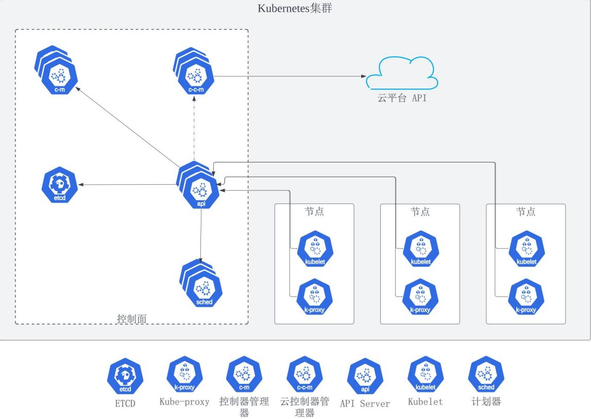
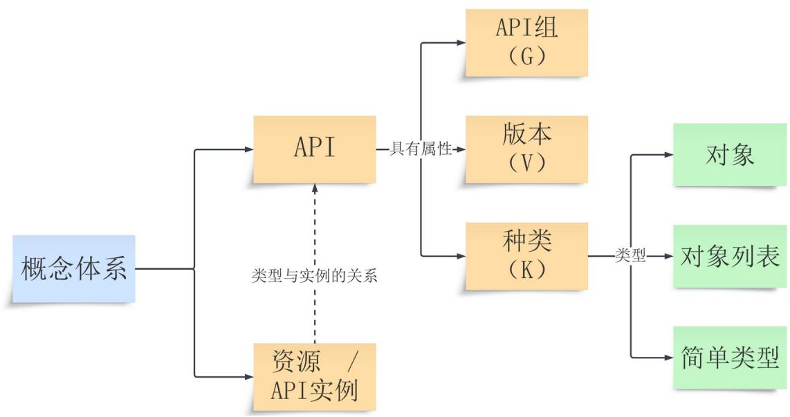
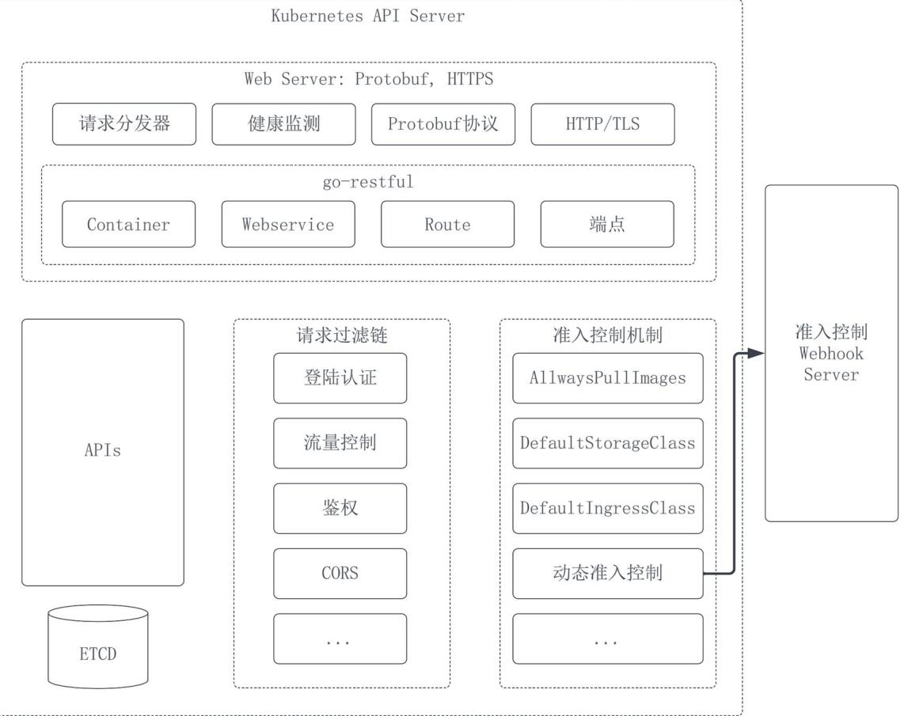

# 内容简介

本书第一主题为解析Kubernetes API Server源代码，第二主题是结合源码知识进行扩展开发。全书分为3篇12章。

首篇为基础篇，含两章。第一章简介Kubernetes及其组件，并迅速切入API Server，统一全书使用的概念名词，介绍其主要设计模式。第二章介绍Kubernetes项目组织和社区治理。组织结构对系统的设计有着直接影响，这部分帮助读者理解代码背后的人和组。在第二章读者也会看到如何参与Kubernetes项目，特别是贡献代码的过程。

第二篇为源码篇，这是本书的核心篇章，将分六章。第三章宏观展示API Server源代码的组织，总体架构设计等。其中关于启动流程的源码部分与本篇后续章节衔接紧密；第四章聚焦整个系统核心对象——Kubernetes API，本章将API分为几大类并讲解为API进行的代码生成；第五章到第八章分别解析API Server的各个子Server源码，它们是Generic Server、主Server、扩展Server、聚合器与聚合Server。

第三篇为实战篇，分四章讲解三种主流API Server扩展方式。作为辅助理解源码的手段之一，第九章不借助脚手架开发一个聚合Server；第十章为后两章基础，聚焦API Server Builder和Kubebuilder两款官方开发脚手架；第十一章用API Server Builder重写第九章的聚合Server；第十二章用Kubebuilder开发一个操作器（Operator）。

本书适合Kubernetes系统运维人员、扩展开发人员、使用Go的开发者以及希望提升设计水平的软件从业人员阅读，需具备Go语言和Kubernetes基础知识。

# 前言

# 为什么写作本书

时间回到2022年，那一年底中国再为世界奉上一部基建杰作：白鹤滩水电站全部机组投产发电，这一当时世界技术难度最高的水电工程被中国人成功完成。港珠澳大桥、南水北调、中国高铁、空间站建设、探月工程等重大工程一次次证明中国工程师的勤劳与智慧。同样是在2022年底，美国硅谷一家几百人的公司OpenAPI以其AI产品ChatGPT震惊科技界，在AI领域领先了包括国内科技大厂在内的全球IT巨头们至少一代。如果说我国在基建领域独步全球，则在科技领域与国际顶尖水平还有距离。

需要追赶的又何止AI一个领域。单就软件工程范畴而言，主流操作系统、主流商用数据库、电子设计自动化软件（EDA）、软件开发语言、主流开发IDE、甚至软件开发思想鲜有源自我国的。作为汇集超过700万聪明头脑的庞大群体，国内软件工作者不能再满足于达到会用、能用好这一层次，应更进一步深入优秀软件的核心，探寻其设计的成功之源，从中汲取思想精华以期厚积薄发。在这方面，Kubernetes这类成功开源项目为我们提供了

丰富养料。这便是笔者今年来做视频、写书籍分享优秀开源项目源码设计的原动力。道阻且长，行则将至。随着越来越多中国软件工程师的觉醒，相信国内软件工程师终将看齐基建同仁，为世界贡献具有创新性的顶级软件作品！

毫无疑问，云平台已成为政企应用的主流支撑平台，云原生作为可最大化云平台资源利用率的一套软件设计原则备受业界推崇。谈云原生就绕不开Kubernetes，它是云原生应用的底座：容器技术的普及加速了单体应用的微服务化，微服务化是实现云原生诸多原则的前提条件，而微服务化必须解决服务编排问题，Kubernetes就是为解决这个问题而生的。众所周知Kubernetes源自谷歌内部产品，其前身已历经大规模应用的实践考验，又有大厂做后盾，一经推出便势如破竹统一了容器编排领域，成为事实上的标准。从应用层面讲解Kubernetes的书籍与资料已经十分丰富，这使得滚动更新、系统自动伸缩、系统自愈等曾经时髦的概念以及在Kubernetes上的配置方式现如今早已深入人心。但作为软件工程师，不仅可得益于Kubernetes提供的这些能力，同样可受益于它内部实现这些能力的方式，理解其精髓可显著提高工程师业务水平。而这鲜有除源码之外的优秀资料了，本书希望在一定程度上弥补这方面的缺憾。笔者选取Kubernetes的核心组件——APIServer进行源代码讲解，从代码级别拆解控制器模式、准入控制机制、登录鉴权机制、APIServer聚合机制等等，力争涵盖APIServer所有核心逻辑。为了缓解理解源码的枯燥感，笔者添加数章扩展开发的实践内容，也使得学习与应用相辅相成。

带领读者体验Go语言魅力是写作本书的另一个目的。

Go语言诞生于2007年，灵感来自一场  $\mathrm{C + + }$  新特性布道会议中发生的讨论，现如今已经走过16个年头。Go语言的创立者大名鼎鼎，一位是C语言创建者KenThompson，另一位是UNIX的开发者RobPike，可以说Go的起点相当高。这门新语言确实不辱使命，主流的容器引擎均是用Go开发，Kubernetes作为容器编排的事实标准也使用Go开发，单凭这两项成就就足以证明其价值。

Go语言在服务端应用开发、命令行实用工具开发等领域应用越来越广，作为开发语言界的后起之秀，Go语言具有后发优势。以Go语言开发的应用被编译为目标平台的本地应用，所以在效率上相对依赖虚拟机的应用有优势；它在语法上比C简单内存管理也更出众，具有易用性；而相对  $\mathrm{C + + }$  ，Go更简单，用户也不用操心指针带来的安全问题。如果只看语法，Go是相对简单的一门编程语言。若有C语言基础则上手速度几乎可以用小时计，但要充分发挥Go的强悍能力则需较为深入的理解和实践。为了帮助开发者更好地使用它，Go语言团队撰写了《EffectiveGo》一文，给出诸多使用的最佳实践，几乎所有这些最佳实践在Kubernetes的源码中都有应用，这就使得学习Kubernetes源码成为提升Go语言能力的一条路径。

# 目标读者

本书内容围绕Kubernetes API Server源代码展开，力图分析清楚它的设计思路，其内容可以帮助到如下几类读者。

**1.希望提升系统设计能力的开发者**

他山之石，可以攻玉。

入门软件开发并非难事，但成为高阶人才去主导大型系统设计却实属不易。优秀架构师在能够游刃有余地挥洒创意之前均做了常年积累。除了不断更新技术知识、学习经典设计理论、在实践中不断摸索外，从成功项目中汲取养料也是常用的进阶之道。Kubernetes项目足够成功，其社区成员已是百万计。它聚数十万优秀软件开发人员之力于一点，每一个源文件、每一个函数均经过认真思考与审核，其中考量耐人品味。从源代码分析Kubernetes的设计正是本书的立足点。

API Server所应用的诸多设计实现为开发者提供了有益参考。例如控制器模式，准入控制机制，各种Webbook机制，登录认证策略，请求过滤的实现，OpenAPI服务说明的生成，Go代码生成机制，以Generic Server为底座的子Server构建方式…上述每一项设计思路均可应用到其它项目，特别是用Go语言开发的项目中。

本书中包含大量源代码的讲解，需要读者具有基本的Go语言语法知识；同时，涉及Kubernetes的基本概念和操作时本书不会深入讲解，需要读者具备Kubernetes的基础知识。不过读者阅读本书前不必成为这些方面的专家。

**2.Kubernetes运维团队成员、扩展开发人员**

知其然且知其所以然始终是做好软件运维工作的有力保证。了解Kubernetes功能的具体实现可让运维人员对系统能力有更深刻认识，提升对潜在问题的预判能力，对已出现故障迅速定位。相较于软件开发工程师，运维工程师一般不具备很强开发能力，所以探究源码会比较吃力。本书有条理地带领读者厘清API Server各个组件的设计，拉低了源码阅读的门槛。

笔者始终认为Kubernetes最强的一面恰恰是它最被忽视的高扩展能力。根据公开报道，国内外科技大厂如谷歌、AWS、微软、字节跳动等均有利用这些扩展能力做适合自身平台的客制化。目前讲解API Server客制化的资料并不系统。本书希望将API Server的客制化途径讲解清楚：既介绍扩展机制的源代码实现，又讲解利用扩展机制进行客制化开发，希望为扩展开发人员提供合格参考。

**3.希望提升Kubernetes知识水平的从业者**

由表及里是领会任何技术的一个自然过程。随着线上办公最近三年的火爆，云平台的普及大大提速，Kubernetes作为云应用的重要支撑工具已广泛应用，一批优秀的系统管理员在成长过程中开始产生深入了解Kubernetes功能背后原理的需求，拿众所周知的滚动更新机制举例，通过文档可以了解到其几个参数的含义，但很是拗口难记，有不明就里的感觉；但通过查看Deployment控制器源代码，将这些参数映射到程序的几个判断语句后一切也就简单明朗了。

**4.Go语言的使用者**

Go语言的使用者完全可以利用Kubernetes项目来快速提升自己的工程能力。作为Kubernetes中最核心也是最复杂的组件，API Server的源码充分体现Go的多种最佳实践。读者会看到管道（channel）如何编织出复杂的Server状态转换网，会看到优雅应用协程（goroutine）的方式，也会学习到如何利用函数对象，以及诸多技术的应用方式。通过阅读API Server源码来提升自身Go水平一举多得。

**5.期望了解开源项目的开发者**

开源在过去30年里极大加速了软件行业的繁荣，在主要的应用领域开源产品都起到顶梁柱的作用，例如Linux，安卓，Kubernetes，Cloud Foundry，Eclipse，PostgreSQL等等。软件开源早已超出代码共享的范畴，成为一种无私、共同进步的精神象征。众多软件从业者都以参与开源项目为荣。

本书在介绍源码的同时也展示了Kubernetes的社区治理，读者会看到这样一个百万人级别的社区角色如何设定，任务怎么划分，代码提交流程，质量保证手段。通过这些简要介绍，读者可以获得对开源项目管理的基本知识，为参与其中打下基础。如果聚焦API Server这一较小领域，读者在本书的帮助下将掌握项目结构和核心代码逻辑，辅以一定量的自我学习便可参与其中。

# 致谢

特别感谢读者花时间阅读此书。本书的撰写历经坎坷。准备工作从2022年便已开始，为了保证严谨笔者翻阅了API Server的所有源文件，让每个知识点都能落实到代码经得起推敲。写作则贯穿2023年一整年，这几乎占去了笔者工作之余、教育儿女之外所有空闲时间。笔者水平有限，书中仍有可能存在谬误之处，期望读者能给与谅解并不吝指正，感激不尽！

笔者深知如果没有外部的帮助很难走到出版这一步，在此感谢所有人的付出。

首先特别感恩笔者所在公司和团队所提供的机会，让笔者在过去的多年里有机会接触云与Kubernetes，并能有深挖的时间。2023年笔者团队痛失栋梁，困难时刻团队成员勇于担当共度难关，也让这本书的写作得以继续。仅以此书纪念那位已逝去同事。

其次感谢家人的付出，作为两个孩子的父亲，没有家人的分担是无法从照顾孩子的重任中分出时间写作的，这本书的问世得益于你们的支持。

感谢清华大学出版社的赵佳霓编辑，谢谢您在写作前的提点、审批协助以及校稿过程中的辛勤付出。

张海龙  2024元旦于上海

# 第一篇基础

稳固的根基是巍峨上层建筑的保证。本书目标是抽丝剥茧地解析 API Server 源代码的设计与实现，这需要 Kubernetes 基础知识的支撑。第一篇将介绍理解 Kubernetes 项目代码的必备知识，为全书知识体系构建打下根基。通过阅读本篇，读者可以获取如下信息：

（1）Kubernetes 和 API Server 概览。从描述 Kubernetes 基本组件入手，然后聚焦控制面的 API Server，探讨其构成、作用和技术特点，并对声明式 API 和控制器模式进行解读。（2）明确的概念定义。Kubernetes 项目中名词众多，对于很多概念的定义也比较模糊，这种不严谨会对行文造成影响。笔者结合自身经验与理解，对 Kubernetes API Server 所涉及的重要概念进行规范命名，这对在本书范围内避免混淆至关重要。

（3）Kubernetes 项目和社区治理。作为拥有数百万社区成员的开源项目，Kubernetes 需要一个松紧得当的管理制度和高效的组织形式。本章简介该项目的几大组织机构，社区成员的不同角色和贡献者参与形式。考虑到本书的众多读者定是对代码兴趣浓厚，笔者也会介绍讲解如何向该项目提交代码。

需要指出，介绍 Kubernetes 中主要 API 的功能和使用方式并不是本书写作目标，读者不会看到如 Pod、Deployment、Service 是什么以及作何使用，建议读者在开始源码阅读前，自行储备这方面知识。同时丰富的使用经验并不是阅读本书所必须的。

# 第一章 Kubernetes与APIServer概要

第一章 Kubernetes 与 API Server 概要在云原生领域 Kubernetes 大名鼎鼎，回望过去的十年，它的流行助推了云计算的蓬勃发展，也直接加速了软件体系结构从单体应用向微服务转变，其影响力令人叹为观止。有理由相信，如此成绩必然建立在一个坚实的技术底座之上。从 Kubernetes 体系结构角度去分析，控制面是整个系统的根基，而 API Server 又是控制面的核心，摸清 Kubernetes 技术架构绕不开 API Server。本章从 Kubernetes 整体架构着手，逐步聚焦 API Server，从宏观上讲解其构造。

## 1.1 Kubernetes组件

1.1 Kubernetes 组件Kubernetes 集群本质上是一个普通的分布式系统，本身并没有难以理解的部分。其主体有两部分，一个是控制面（Control Plane），另一个是各个节点（Node），如图 1- 1 所示。



### 1.1.1 控制面上组件

1.1.1 控制面上组件控制面承载了服务于整个集群的组件，包括 API Server、控制器管理器（Controller Manager）、计划器（Scheduler）以及和 API Server 密切配合的数据库——ETCD。API Server 是一个 Web Server，用于管理系统中的 API 及其对象，它利用 ETCD 来存储这些 API 实例；控制器管理器可以说是 Kubernetes 集群的灵魂所在，它所管理的诸多控制器负责调整系统，从而达到 API 对象所指定的目标状态，1.4 节将要介绍的声明式 API 和控制器

模式就是由控制器具体落实的，而控制器管理器汇集了控制面上大部分内置管理器；计划器负责选择节点去运行容器从而完成工作负载，它观测 API Server 中 API 对象的变化，为它们所代表的工作负载安排节点，然后把安排结果写回 API 对象，以便节点上的 Kubelet 组件消费。

**1. API Server**

API Server 是整个集群的记忆中枢。Kubernetes 采用声明式 API 模式，系统的运作基于来自各方的 API 对象，每个对象描述了一个对系统的期望，由不同控制器获取对象并实现其期望。这些对象的存储和获取均发生在 API Server 上，这就奠定了 API Server 的核心地位，如图 1- 2 所示。1.3 小节会进一步展开讨论。

  
图 1-2 API Server 核心地位

**2. 控制器管理器**

介绍控制器管理器前先要讲解什么是控制器。控制器是一段持续循环运行的程序，正常情况下它们不会主动退出。每个控制器都有自己关注的 API 对象，而 API 对象会在 spec 中声明用户期望，控制器根据其内容对系统进行调整。一些典型的控制器包括 Deployment 控制器，作业控制器（Job Controller），节点控制器（Node Controller），服务账户控制器（ServiceAccount Controller）等等。通过下面的例子进一步了解控制器的作用。

如下代码给出一个 CronJob API 对象的定义：

apiVersion: batch/v1  kind: CronJob

metadata: name: busybox- cron spec: schedule:"/1\*\*\*\*" jobTemplate: spec: template: spec: containers: name: busybox image: busybox:latest command:["/bin/sh","- c","echo 'Hello world'"] restartPolicy:OnFailure

这个API对象在spec中指出作业运行周期、运行的镜像以及容器启动后需要执行的命令，这便形成了用户的期望；当该资源文件提交至API Server后，一直不断观察CronJob实例变化的CronJob控制器就会多一条工作条目，在处理完先行到达的其它条目后，控制器就会按照这个实例的spec创建Pod并执行指明的命令。

注意：资源的创建和控制器对其处理二者是异步的。控制器内具有一个队列数据结构，发生变化的API对象会作为其条目入列，等待控制器在下一次控制循环中处理。

系统中存在着大量控制器，显而易见，它们的稳定运行对系统顺利运转举足轻重，Kubernetes需要特别关注它们，以便异常出现时做恢复的动作，这部分工作中控制器管理器承担。控制器管理器是一个单独的可执行程序，Kubernetes把绝大部分内建控制器包含其中，有它管理。逻辑上看，该管理器应该包含一个守护进程（Daemon）和众多控制器进程，守护进程监控控制器进程的健康；但实践中利用了Go语言的协程（goroutine）机制，管理器和控制器代码被编译成单一可执行文件，运行在同一个进程内，每一个控制器以协程的形式运行于该进程中。

**3.云控制器管理器**

云控制器管理器又有何用呢？它在Kubernetes集群和云平台之间架起桥梁。技术上看，一个Kubernetes集群需要的资源可以来自集群所处的云平台，例如公网IP这个资源便是如此。云平台以API的形式提供服务，而针对同样资源不同平台的API肯定是有差异的，为了屏蔽这种差异，云控制器管理器被开发出来。它将集群中所有需要与云平台API交互的组件集中起来由自己管理，从而将这方面的复杂性隔离出来；同时，制定插件机制来统一资源操作接口，允许各大平台实现插件与Kubernetes集群对接。云控制器管理器管理着多个云控制器，它们是云平台API的直接调用者。

云平台最基本的服务是提供算力——也就是提供服务器，如何将一台从平台买来的服务器挂到一个Kubernetes集群呢，云控制器管理器内运行着一个节点云控制器，它会对接所在云平台，来获取当前客户的租户内服务器信息，形成种类为节点（Node）的Kubernetes API对象并存入API Server中，这样所有云服务器就可以为集群所用了。

此外，Kubernetes集群中的容器必须彼此之间可达，这需要路由云控制器进行配置，该控制器也是云控制器管理器的一部分。

除此之外，服务云控制器同样是云控制器管理器的一部分：有一种服务类型是LoadBalancer，该类型的服务要求云平台为其分配一个集群外可达的IP地址，地址的获取就是由服务云控制器来完成的。

**4.计划器**

API对象的本质是描述使用者期望系统处于的状态，一般来说这会伴有工作负载，最终落实到具体Pod去执行。而集群中有大量节点，系统如何选取某个节点来运行Pod呢？这一过程其实并不简单。影响节点选取的因素有很多，包括但不限于：

（1）执行任务必备的系统资源，例如算力，内存，显卡需求。(2）各个节点的可用软硬件资源(3）系统中存在的资源分配策略、使用限制等。(4）资源定义指明的亲和、反亲和规则。（5）各节点间工作负载的平衡。

可见节点的选择是件复杂精细的工作。为了处理好它，Kubernetes开发计划器模块来专门应对，计划器通盘考虑各种因素来做出选择。计划器对使用者是透明的。

### 1.1.2节点上组件

节点代表提供算力等资源的服务器，容器就是在这里被创建、运行并随后销毁的，实际的工作都在这里完成。节点需要按照控制面的要求进行配置并完成工作，这就需要Kubelet组件和KubeProxy组件，前者主要任务是对接节点上的容器环境完成管理任务，后者负责达成容器网络的连通性。节点上组件并不是本书写作目标，但为了读者能有一个整体概念，下面对Kubelet和KubeProxy做简单介绍，感兴趣的读者可以自行查阅相关资料。

# 1.Kubelet

Agent在分布式系统中比较常见，它们分布在集群的各个成员上，像粘合剂一样关联整个系统，Kubelet就类似这样的一个Agent。每个节点都会有一个Kubelet，它连接控制面和节点，准确地说是API Server与节点，使得API Server与所有节点构成一个星型结构。它的任务繁重，最核心的有：

（1）向Kubernetes集群注册当前节点。

（2）观测系统需要当前节点运行的Pod，并在当前节点运行之。

节点的注册是指告知API Server当前节点的具体信息，如IP地址、CPU和内存情况。在API Server中，万物皆是资源节点也不例外，Kubelet的注册动作最终会在API Server上创建一个节点资源，关于这个节点的所有信息都记录在其内。值得一提的是，Kubelet能和API Server交互的前提是能通过控制面的登录和鉴权流程，这就需要在启动Kubelet时为其指定合法并权限足够的ServiceAccount。

和注册节点到 API Server 相比，启动并观测 Pod 更为关键。在 Kubernetes 系统中，工作负载的最终执行一定是在 Pod 所包含的容器中完成，整个过程为：首先用户通过资源定义给出任务的描述；然后相应控制器分析资源定义，并进行丰富，这时需要什么镜像、跑几个容器等已经明确；接下来计划器为这些 Pod 选取节点，并把这些信息写入 Pod 的定义；最后 Kubelet 登场，它及时发现那些需要自己所在节点创建的 Pod，把它们的定义读回来，通知节点上的容器运行时创建出之，之后持续关注容器健康状况并上报 API Server。可见，缺少了 Kubelet 的工作将导致 Pod 无法最终创建。

# 2. Kube Proxy

Kubernetes 集群中所有 Pod 需要相互联通，彼此可达，这并不容易实现，网络一直是 Kubernetes 中较复杂的话题。对于同一个节点上的两个 Pod 来说，借助 Kubelet 创建的 CNI 网桥就可以联通它们，过程如下：每个 Pod 和网桥之间都通过一个 veth 对（veth pair）连接，从 veth 对一端进入的数据包会到达另一端，两个相互通信的 Pod 会先把给对方的消息交给网桥，经网桥进行转发，这样连通性就达成了。

对于跨主机通信，两个 Pod 分处在不同的节点上，过程就会坎坷一点。各路网络插件各显神通，有的建立跨节点的覆盖网络，如 Flannel；有的把底层 OS 作为路由器转发流量，如 Calico。网络插件在 Kubernetes 集群网络构建过程中起到了重要作用，它们均建立在 CNI 规范基础上，是它的不同实现。网络插件会被容器运行时在创建 Pod 过程中调用。

由此可见网络相关工作是繁琐的，涉及到它的工作也需要专业知识。有一类资源非常依赖网络的支持，它就是服务（Service）。服务把一个应用在集群内和/或集群外暴露，使得其它的应用可以消费它。建立服务的主要工作集中在网络配置上，要能把流量转发到服务后台应用所在的 Pod 上，Kubernetes 引入 Kube Proxy 专门负责服务的网络配置。

Kube Proxy 并不直接负责集群网络的建立，如上所述这活儿主要由网络插件干，但 Kube Proxy 隔离出利用网络插件配置 Service API 对象网络的所有工作，从而屏蔽这方面的复杂性。当一个服务对象创建出来后，系统会根据其类型为它做网络配置：

（1）对于类型为 ClusterIP 的服务，为其分配一个虚的 IP，并保证集群内部对该虚 IP 的特定端口的访问能够到达相应 Pod。集群外部访问不到该 IP。

（2）对于类型为 NodePort 的服务，除了像 ClusterIP 类型一样为其分配虚 IP 并保证流量能到达背后 Pod 外，在集群的每一个节点上，开放一个特定端口给外部，所有对该端口的访问都会被路由到这个服务的 Pod。

（3）对于类型为 LoadBalancer 的服务，外部 IP 提供者会把一个 IP 分配给该服务，对该服务的访问会被转给 Kubernetes 集群，集群保证请求到达背后 Pod，而一种方式也利用了 ClusterIP。

不难看出，ClusterIP 类型的服务是 NodePort 和 LoadBalancer 的基础，它能得以实现的要点是：对该虚 IP 的特定端口的访问能到达对应的 Pod，Kube Proxy 包揽了这部分工作。它通过多种方式达到目的：用户空间（UserSpace）模式，iptables 模式和 IPVS 模式，这里不做展开。

# 1.2KubernetesAPI基本概念

1.2 Kubernetes API 基本概念Kubernetes 中频繁使用一些基本概念，不加以区分将极易造成混淆，这一小节来明确它们的含义。Kubernetes API 的重要概念体系如图 1- 3 所示。

 

# 1.2.1API和API对象

Kubernetes中的API并不完全等同于编程世界中一般意义上的ApplicationProgrammingInterface。一般意义上的API是一种当前程序接收外部指令的技术手段，这非常像一个出入口所以形象地称它们为接口。而KubernetesAPI不仅仅有接口这一层次的含义，还代表了指令本身，这确实有些特立独行。可以类比生活中“快递”一词的含义：它在一些场景下代表了一种物流手段，而在另外一些场景下又代表被递送的货物本身。

Kubernetes系统内各个模块之间的交互是以APIServer为中心的松耦合交互，请求发起模块把自己对系统状况的期望描述出来，形成API对象，并把它交给APIServer；响应方则从APIServer获取API对象并依其所期望状态尽力满足。在这个过程中，API对象起到了关键的解耦作用。这样的API对象可以分为很多种类，例如apps/v1中的Deployment，用户可以建立许多具体Deployment实例，这些实例就是API对象。

KubernetesAPI对象被用来指代对系统状态的期望，是一个个具体的实例，也称为API实例；而API是对象的类型，它代表的是元数据层面内容。社区的很多讨论中，在不造成混淆的情况下经常混用API对象和API，但本书行文中将严格区分。

# 1.2.2API种类

1.2.2 API 种类种类的英文原文是 Kind，直译成中文的话是种类，类型的意思。显而易见在计算机技术领域“种类”或“类型”一词指代过于宽泛，容易和其它事物冲突，所以在本书中谈到

API Kind 时，一律直接用 API Kind 或用“API 种类”来表述，这样既保留了概念本意，又尽量与其它概念区分。

API 种类从事物所具有的属性角度描述 API，而不是属性的值；它代表了一类资源的共有属性集合。根据 Kubernetes API 规约<sup>3</sup>，API 种类可分成三大类：

# 1.对象类型

对象类型定义出的实体会持久化在系统中。用户通过创建一个对象类型的实例来描述某一意图。用户可通过 get、delete 等 HTTP 方法操作这些实体。例如 Pod、Service 都是对象类型，人们可以用它们创建出具体的 pod 和 service 实例。对象类型的属性‘metadata’下必须有‘name’，‘uid’，‘namespace’属性。用户所接触的 API 资源大多数都是对象类型的实例；用户所撰写的资源定义文件，绝大部分用于创建对象类型的实例。

# 2.列表类型

对象类型用于定义单个实体，而列表类型定义一组实体。例如 PodList，ServiceList，NodeList。列表类型在命名时必须以‘List’结尾，在列表类型内必须定义有属性‘items’，这个属性用于容纳被列表实例所包含的 API 实例。列表类型最常用于 API Server 给客户端的返回值，用户不会单独去为列表类型实例写资源定义文件。例如，当执行命令从 API Server 读取某一命名空间内所有 Pod 时，得到的返回值也是一个 Kubernetes API 实例，它的 API Kind 将是 PodList，PodList 的类型便是列表类型。

# 3.简单类型

简单类型用于定义非独立持久化的实体，即它们的实例不会单独保存在系统内，但可以作为对象类型实例的附属信息持久化到数据库。简单类型的存在是为支持一些操作，例如 Status 就是一个简单类型，它会被控制器用来在 API 实例上记录现实状况。简单类型常常被用于子资源的定义，Status 和 Scale 是 Kubernetes 广泛支持的子资源。子资源也会有 RESTful 端点（Endpoint），/status 和 /scale 分别是 Status 和 Scale 子资源的端点。

Kubernetes 项目约定 API 种类在命名时使用英文单数驼峰式，例如 ReplicaSet。

# 1.2.3 API 组和版本

如果说 API 种类是从事物具有的属性角度去对 API 进行归类的话，组(Group)和版本 (Version) 就是从隶属关系与时间顺序两个维度去划分 API。API 组、版本和种类——也被称为 GVK——共同刻画了 API。

Kubernetes 的贡献者来自五湖四海，每个贡献者都有可能单独设计和贡献 API，那么如何避免彼此资源的冲突呢？引入 API 组便是来回答这一问题。它借用了命名空间的理念，每个贡献者都在自己的空间内定义自己的 API，这也是为什么很多 API 组都与域名有关的原因。API 组是后来概念，项目初期并不存在，初期参与者较少根本不需要这样的区分。为了向后兼容，引入组概念前就已存在的 API 都被归入核心组，该组内 API 资源的 RESTful 端点将不包含组名，介绍 API 端点时会再提及。

聚焦单独一个API组，同一个API也会有不断迭代的需求，如何避免这种迭代影响到使用了已发布版本的用户呢？版本的概念被引入来应对这一问题。同一个API可以存在于不同版本中，新老版本技术上被看作不同API，当新版本最终成熟时老版本用户会被要求升级替换。

由于API Group和Version在Kubernetes社区被广泛使用，本书有时会直接使用其英文名称。

# 1.2.4 API资源

资源一词来源于REST，API Server通过RESTful的形式对外提供服务接口，而在RESTful的概念中，服务所针对的对象是资源。所谓API资源，就是API Server中的API在REST背景下的名称，系统以RESTful的形式对外暴露针对Kubernetes API的服务接口。API资源在命名时使用英文复数全小写，例如replicasets。

注意：API资源这个概念在很多场景下常被用于指代其它概念，如果不加以说明容易引起困惑：

（1）指代API资源实例。它是某类API资源的具体实例，是通过向API资源的Endpoint发送CREATE HTTP请求创建出来的实体。在RESTful服务的概念体系里，资源和资源实例实际上是不怎么区分的，统称为资源，而在URL层面二者是有不同：如果在URL最后有给出id，则代表资源实例，而如果没有给出id，则代表这类资源。在不引起混淆的情况下，本书同样使用API资源指代API资源实例。

(2）指代API或API对象。API资源是Kubernetes API在RESTful下的表述，所以很多时候人们会用API资源来表达API，不严谨的场景下也无伤大雅；API对象想表达的意思更多是一个具体的API实例，所以它和API资源实例相对应，但由于人们常常混用API资源和API资源实例，导致也不怎么区分API资源和API对象。本书中将避免用API资源指代API或API对象。

读者在文档阅读时也要意识到以上混用的存在，利用上下文去理解区分一个名词所表述的具体含义，并在自己的表达过程中尽量不混用名词。

用户通过向API资源的端点发送RESTful请求来操作该资源，端点对API资源来说是常用的信息。一个API资源在API Server上的端点具有固定模式：

<server地址与端口>/apis（或api）/<API组>/<版本>/namespaces/<命名空间>/<资源名>

通过kubectl api- resources命令可以查看集群中存在的API资源，一个Minikube单节点本地系统内的部分API资源如图1- 4所示。

<table><tr><td>NAME</td><td>SHORTNAMES</td><td>APIVERSTON</td><td>NAME SPACED</td><td>KIND</td></tr><tr><td>bindings</td><td></td><td>v1</td><td>true</td><td>Binding</td></tr><tr><td>componentstatus</td><td>cs</td><td>v1</td><td>false</td><td>ComponentStatus</td></tr><tr><td>configmaps</td><td>cm</td><td>v1</td><td>true</td><td>ConfigMap</td></tr><tr><td>epipoints</td><td>ep</td><td>v1</td><td>none</td><td>Sequence</td></tr><tr><td>events</td><td>ev</td><td>v1</td><td>true</td><td>Event</td></tr><tr><td>lmintranges</td><td>limits</td><td>v1</td><td>true</td><td>Minitrange</td></tr><tr><td>namespaces</td><td>ns</td><td>v1</td><td>false</td><td>Namespace</td></tr><tr><td>nodes</td><td>no</td><td>v1</td><td>false</td><td>Node</td></tr><tr><td>persistentvolumeclaims</td><td>pc</td><td>v1</td><td>true</td><td>PersistentVolumeClaim</td></tr><tr><td>persistentvolumes</td><td>pv</td><td>v1</td><td>false</td><td>PersistentVolume</td></tr><tr><td>pods</td><td>po</td><td>v1</td><td>true</td><td>Pod</td></tr><tr><td>podtemplates</td><td>po</td><td>v1</td><td>true</td><td>PodTemplate</td></tr><tr><td>replicationcontrollers</td><td>rc</td><td>v1</td><td>true</td><td>ReplicationController</td></tr><tr><td>resourcequotas</td><td>quota</td><td>v1</td><td>true</td><td>ResourceQuota</td></tr><tr><td>secrets</td><td>sa</td><td>v1</td><td>true</td><td>Secret</td></tr><tr><td>serviceaccounts</td><td>sa</td><td>v1</td><td>true</td><td>ServiceAccount</td></tr><tr><td>services</td><td>svc</td><td>v1</td><td>true</td><td>Service</td></tr><tr><td>challenges</td><td></td><td>acme.cert-manager.io/v1</td><td>true</td><td>Challenge</td></tr><tr><td>orders</td><td></td><td>acme.cert-manager.io/v1</td><td>true</td><td>Order</td></tr></table>

# 1.3 API Server

Kubernetes 的大脑在控制面，而控制面的核心是 API Server。它是一个 Web Server，整个系统的信息以不同 API 对象的形式存储在 API Server 中，它对外提供查询、创建、修改和删除等 RESTful 接口访问这些 API 对象，众所周知，Kubernetes 中有大量开箱即用的内置 API，用户也可以通过扩展来引入客制化 API，为它们提供访问接口是非常繁杂的工作。同时，控制面外的节点、外围控制器等都会向 API Server 请求数据，访问量还是非常庞大且频率非常高的，这就要求 Server 足够健壮。Kubernetes API Server 出色地满足了这些要求，其内部结构如图 1- 5 所示。

  
图 1-4 Minikube 内 API 资源 图 1-5 API Server 要素

# 1.3.1 一个 Web Server

API Server 的底层是一个安全、完整、高可用的 Web Server，在构建这个 Web Server 时，API Server 主要利用了 Go 的 http 库和 go- restful 框架。http 库是 Go 的基础库之一，非常之强大：用它只需几十行代码便可写出一个高效可用的 Server。

# 1.基本功能

如Tomcat等其它Web服务器一样，APIServer具有与客户端建立基于证书的安全连接、对请求进行分发等标准功能。不仅如此，在支持HTTP/HTTPS协议外，APIServer还支持HTTP2协议和基于HTTP2的Protobuf。

（1）APIServer在HTTP(S)基础上对外提供RESTful服务，客户端可以针对Server上的资源发起GET，CREATE，UPDATE，PATCH，DELETE等操作。客户端和Server之间的交互信息以符合OpenAPI规范的JSON格式表述。APIServer的RESTful能力来自于开源框架go-restful，该框架将一个RESTful服务定义为一些列角色协作的结果，在该框架下开发者实现了各个角色从而实现服务。

(2）基于HTTP2，利用gRPC远程调用框架，APIServer可以响应客户端发来的远程过程调用（RPC）请求。Kubernetes集群内部，其它组件与APIServer的交互首选基于gRPC，组件和组件之间交互首选也是  $\mathtt{gRPC}_0$  gRPC客户端和Server之间的交互信息是以Protocolbuffer的协议格式表述的，效率更高。

# 2.gRPC远程系统调用框架

gRPC起源于谷歌内部的Stubby项目，Stubby目标是对谷歌各个数据中心上的微服务进行高效连接。到2015年谷歌将其开源，并更名为  $\mathtt{gRPC}_0$  gRPC是基于HTTP2协议设计的一个开源高性能RPC框架。借助gRPC机制，跨数据中心的服务可实现高效交互，它还能以可插拔的方式去支持负载均衡、跟踪、健康监控和登录操作。gRPC具有如下特点：

# 1）简化服务的定义

1）简化服务的定义服务定义用于描述服务器对外提供哪些远程过程，这是任何RPC框架都需要通过某种方式给出的。gRPC默认选用ProtocolBuffer（简称Protobuf）作为基础协议，它的好处之一是默认提供了接口定义语言（IDL），当然也允许用其它接口定义语言来代替它。有了IDL，就可以以语言无关的方式定义出消息以及过程：消息是客户端与过程交互时信息的结构，可以简单理解为调用参数和返回值；而过程是对被调用方法的描述。

# 2）跨平台，跨语言

2）跨平台，跨语言服务的定义会最终落实为一个或几个.proto文件，你可以用它去生成不同编程语言下的实现。目前主流编程语言的代码生成插件都已经有了，例如Go、C++、Java、Python等等。利用这些插件，就可以基于.proto文件生成gRPC的服务端和客户端代码框架，这些都是几条命令的工作无需消耗开发人员太多精力。之后，开发人员需要增强服务端代码去实现定义出的过程，这部分是编码的主要工作；而客户端代码基本不用更改，可直接用于调用远程过程。

# 3）高效的交互

3）高效的交互除了提供接口定义语言，Protobuf也定义了一种紧凑的信息序列化格式，在这种格式下，信息的压缩率更高，从而提高传输效率节约带宽。各个主流语言下数据与Protobuf格

式之间相互转换的 API 都已经提供，开发者可以直接使用。例如在 Go 中这种序列化/反序列化能力是由 google.go.org/grpc/codes 包提供的。同时考虑到上述代码生成能力，gRPC 和 Protobuf 插件使开发人员在主流编程语言下的编码工作大为简化。

# 4）支持双向流模式

在普通的 Web 服务中单向数据流较常见：客户端向服务端发起一个请求，连接建立后被请求数据由客户端流向服务端，客户端进入等待模式；服务端进行响应并通过同一个连接发送结果给客户端，整个过程结束。单向数据流以一种串行的方式进行，总有一方处于等待状态。双向数据流与此不同，客户端与服务端可以同时向对方发起请求或发送数据，逻辑上可以理解为有两个流（连接）存在，一个用于支持客户端发起的通讯请求，一个用于支持服务端发起的，这样站在任何一端，任何时刻都可能接收到对方的数据，也可以向对方发送数据。双向数据流为应用提供了更高的灵活性，但也带来复杂性，通讯双方必须制定好交互规则。

gRPC 的前身 Stubby 立足于微服务之间通信，作为继承者，gRPC 在这方面自然青出于蓝。时至今日，微服务早已大行其道，其间通信很多简单基于 HTTP1.1，与 gRPC 所使用的 Protobuf 相比效率上还是有较大的差距的，在巨量微服务体系内这种浪费是巨大的，开发人员应该尽量采用 gRPC 与 Protobuf 或类似方案。

# 1.3.2 服务于 API

顾名思义，API Server 的主要内涵是 API，API Server 为 API 提供的服务可以分为两个方面：

# 1. 将 Kubernetes API 暴露为端点

先要讲解 API 端点所起到的作用。API Server 以 RESTful 的方式对外暴露 API 从而形成 API 资源，用户可以使用的每个 Kubernetes API 都对应着 RESTful 端点。客户端针对 API 资源的创建、修改、删除等请求均是透过端点进入 API Server，最后由请求处理器将请求的内容落实到对应的 API 资源实例上。

注意：从 URL 组成上来看 API 的端点可被分为两大类，分别以/api/和/apis/作为上层路径。路径/api/下包含核心 API 组内的 API 资源；而/apis/下包含其它 API 组下的资源。

API Server 的客户端有很多种，例如 Kubelet、Kube- Proxy、计划器等等都是 API Server 的客户端，它们中的一部分就选用 RESTful 端点与 API Server 交互。用户命令行工具 Kubectl 便是如此，通过在命令行加入 “- v=8” 标志，用户可以看到其和 API Server 交互的全部内容，一个命令触发了对哪些端点的访问都可以看到。基于 API 资源端点，开发者完全可以自己写一个客户端，如果用 Go 写的话，Kubernetes 项目的 client- go 库为这部分工作提供了工具集，用起来很是便利。部分资源端点如图 1- 6 所示。

  
图1-6部分KubernetesAPI端点

技术上说，为一个API资源制作端点需要遵从go- restful框架的设计，实现各个角色如container、webservice和route，并将对该API资源URL的GET，CREATE，UPDATE以及DELETE等请求映射到相应的响应函数上。问题是Kubernetes有很多内置API，由来自不同公司的不同开发人员贡献，如果每个API都独立开发上述内容，则重复逻辑太多了，而且质量、代码风格一定迥异。APIServer将端点生成统一化，开发人员只需用Go定义出API，然后通过APIServer提供的InstallAPIs()函数把该定义提交便可，go- restful框架对API的开发者来说甚至是透明的。APIServer的端点生成机制是其设计上的一个亮点，在第二篇中会看到这是怎么达成的。

# 2.支持对API实例的高效存取

API Server存储了整个集群的API实例，周边组件都是它的客户端对其进行高频访问，所以APIServer必须有高效存取能力，这就不得不提APIServer选用的数据存储解决方案ETCD。

注意：有没有觉得ETCD这个名字比较眼熟？其实它受到Linux系统中的/etc目录的启发，后面加个d用于表示分布式（英文distributed的首字母），这就是ETCD这个名字的由来。

绝大多数分布式系统都需要分布式协同解决方案去存储全系统共享的信息，正是这些信息把分布式系统的各个部分粘合在一起共同工作，Kubernetes也不例外，它选择了ETCD。ETCD是一个高可用键值对数据库，它追求简单，快速和可靠。对于分布式数据存储服务来说，数据的一致性极为关键，ETCD可以达到很高的数据一致性。它还对外提供了信息变更监测服务，使得客户端能及时响应某个键值对的变化。Kubernetes API Server正是利用了这一功能去服务客户端对自己发起的WATCH请求。

值得指出的是，ETCD的Version2和Version3并不兼容，不同点非常多，其中它们在数据的存储方式上完全不同。在ETCDVersion2中，数据以树形层级结构存储在内存中，当需要存至硬盘时会被转化为Json格式存储。数据的键构成层级结构，它以类似数据结构

中的字典树（Trie）的形式存储数据，Version2中数据节点（node）所使用的数据结构代码如下：

//https://github.com/etcd- io/etcd/server/etcdserver/api/v2store/node.go type node struct{ Path string CreatedIndex uint64 ModifiedIndex uint64 Parent \*nodejson:"- "// ExpireTime time.Time Value string // Children map[string]\*node// //一个指向本节点所使用的store的指针 store \*store }

注意该结构的Parent属性和Children属性，基于它们所有数据节点构成树形结构。而到了ETCDVersion3，这种结构被扁平化，上述node结构体也不再使用了。为了保持兼容性，ETCD3会通过键的前缀部分大概模拟出一个数据在树中位置，从而支持老API。

详细描述ETCD超出了本书写作范畴，最后用如下例子简单展示APIServer与ETCD的协作过程：

（1）Deployment控制器利用Informer和APIServer建立连接，来观测Deployment实例的变化。（2）用户通过命令行创建一个Deployment。（3）kubectl把用户输入的Yaml转化为Json，作为请求Payload传送至APIServer。（4）APIServer把收到的Deployment从外部版本转化为内部版本，把它分解为一组键值对，交给ETCD。（5）ETCD存储之。（6）ETCD（间接）通知Informer有Deployment实例的创建，这会在控制器的工作队列中插入新条目。（7）Deployment控制器的下一次控制循环会考虑新建出的实例，为它建立ReplicaSet实例等。

# 1.3.3请求过滤链与准入控制

1.3.3 请求过滤链与准入控制发往 Web Server 的请求最终会被交予该请求对应的响应函数处理。众所周知，请求无关的处理步骤广泛存在：登录鉴权、流量控制、安全检测等等都是不需要区分请求的。既然如此，何不在业务逻辑处理开始前将这些步骤集中逐个做一遍？既然 API Server 有能力统一所有 API 的端点生成，做到这点并不困难。这就形成了过滤链，如图 1- 7 所示。

  
图1-7请求处理过程

API Server对响应函数内部逻辑进行了进一步划分，大致分为两个部分：过滤和准入控制，这两步完成后就可操作ETCD存取数据。过滤部分顺次执行多个过滤器，只要有过滤器叫停那么处理流程立即结束，过滤过程无论是查询还是修改操作都需要执行。设置准入控制部分更多考量是规范请求中所传递的内容，使其逻辑上合理，只有创建，修改和删除类请求会经过准入控制过程。同时这也是信息安全机制的一部分。准入控制分两个阶段，分别是修改和校验，在修改阶段可以对请求内容进行改写，例如向为Pod添加边车；校验阶段则是检验将要持久化到ETCD的API实例逻辑上具有一致性。准入控制机制构建了插件机制，一个插件可以参与修改和校验的一个或两个阶段。

准入控制是可扩展的，开发者可以将自有逻辑做到一个Server中，然后通过动态准入控制机制在修改和校验阶段调用之，这称为准入控制Webhook。第三篇中会演示创建准入控制Webhook。

# 1.4声明式API和控制器模式

Kubernetes系统设计上一个大胆的决定是采用声明式API。声明式API以及其在Kubernetes中的落地方式——控制器模式深刻影响了API Server的总体设计。本节从一个例子开始认识它们。

# 1.4.1声明式API

假设用户在购物网站上购买了一本书，但第二天反悔了，希望取消订单并退款，这时应该如何操作呢？首先用户需要到购物网站打开该订单查看其状态，如果是已经发货甚至已经到货了，则需要点击“售后服务”，联系客服安排退货退款；如果卖家还没有发货，则可以直接点击退款，等待一段时间后退款过程就可以完成。用伪代码来描述这一过程，伪代码如下：

if（订单状态为已发货或其后续状态）{联系客服；如已收件，联系快递上门取件；}else{点击退款；确认退款完成；}

以上这个过程代表了当今程序处理的典型过程，用户作为购物网站的使用者需要根据订单状态作出判断，采取正确的操作进行退款。为了正常拿到退款，用户需要具有工作流程的知识，这是一种负担。这个购物网站的设计不是一种声明式的设计。

作为购物者，对购物网站制定的退款操作规则不感兴趣，想做的只是把订单改为申请退款的状态，希望能购物网站能根据订单当前状态来自我调整，尽一切可能来满足用户要求。也就是说，理想的过程如下：

要改订单状态为“申请退款”；离开网站；...接收到系统操作结果的通知；...

能够实现以上过程的设计就是一种声明式的设计。声明式设计产生一种对使用者极为友善的系统，使得使用者摆脱了根据系统现状和流程设计采取不同操作的要求，只需申明希望系统达到的最终状态即可。

与非声明式设计相比，声明式设计在减轻使用者脑力负担的同时，也有其自身的弊端：在复杂系统中一般不会保证使用者即刻获得反馈，其所期望达到的状态也不是当时就可以达到，何时能到完全依赖系统，也就是说使用者已经不能完全控制后续的执行了，所以说采用声明式设计是Kubernetes最大胆的决定。商用系统对于错误和延迟的容忍度一般较低，错误往往意味着损失，延迟代表着低效，都是非常负面的事情。商业软件对于精确和高效十分在意，针对用户的一个操作，系统最好马上给出明确的反馈。

精确高效、使用者低负担和复杂的系统状态转换三者间存在潜在的冲突，可同时取其二但很难三者皆得，如图1- 8所示。例如，我门可以选择精确高效+复杂的系统状态转换，牺牲掉使用者低负担，也就是说通过让使用者明确指出执行过程来克服复杂性带来的处理延迟；也可以选择精确高效+使用者低负担，这时就要把你的系统状态转换设计得简单明了一些，从而减少系统在转换状态时的巨大开销。声明式设计选择了使用者低负担+复杂的系统状态转换，而牺牲掉精确高效。

  
图1-8因素的相互牵制

图1- 8因素的相互牵制Kubernetes用户使用系统的主要媒介是API资源实例，系统用户通过创建、调整API实例来提出自身需求，Kubernetes系统以异步方式，按照既定逻辑，逐一响应这些需求，过程中无需用户参与。这种请求与响应的模式符合声明式设计，称为声明式API。下面通过Kubernetes滚动更新机制来体验声明式API带给使用者的优秀体验。

# 1.滚动更新

应用程序提供者希望部署在Kubernetes集群中的应用  $7*24$  可用，这样业务就可以不间断从而避免任何损失。但程序可能由于各种客观原因停机，典型的是升级，新版年本替换老版本。在Kubernetes出现前，这是一个老大难问题，需要操作人员大量的精心准备。以容器为基础的云原生架构从容地解决了这个问题，因为云原生应用支持多实例并不是什么难事，底层平台可以通过逐步替换实例到新版本的方式，在不停止服务的前提下完成升级。Kubernetes平台上这种机制是滚动更新。

设想有如下微服务，其核心业务代码放在镜像M中，PodA、B、C运行该镜像来输出服务，由于所运行镜像一致，ABC三者服务也完全一致，互相可替代，它们都由一个Deployment资源实例来管理，而Deployment又是通过一个ReplicaSet实际管理Pod的；系统通过ServiceS把这个微服务在集群内暴露，供其它服务调用。各元素相互关系如图1- 9所示。

  
图1-9 示例应用结构

初始时镜像M的版本是v1，管理容器A，B，C的Deployment资源定义文件如下：

api version:apps/v1 kind:Deployment metadata: name:my- deployment labels: app:my- service spec: replicas:3 selector: matchLabels: app:my- service template: metadata: labels: app:my- service spec:

<table><tr><td>containers:
- name: service-s
  image: M:v1
  ports:
- containerPort: 80</td></tr></table>

现在把镜像M的版本升级到v2，管理员将Deployment的资源定义文件做如下修改，提交给API Server即可：

<table><tr><td>apiVersion: apps/v1</td></tr><tr><td>kind: Deployment</td></tr><tr><td>metadata:</td></tr><tr><td>name: my-deployment</td></tr><tr><td>labels:</td></tr><tr><td>app: my-service</td></tr><tr><td>spec:</td></tr><tr><td>replicas: 3</td></tr><tr><td>selector:</td></tr><tr><td>matchLabels:</td></tr><tr><td>app: my-service</td></tr><tr><td>template:</td></tr><tr><td>metadata:</td></tr><tr><td>labels:</td></tr><tr><td>app: my-service</td></tr><tr><td>spec:</td></tr><tr><td>containers:</td></tr><tr><td>- name: service-s</td></tr><tr><td>image: M:v2</td></tr><tr><td>ports:</td></tr><tr><td>- containerPort: 80</td></tr></table>

正常情况下，这是管理员所有需要做的操作！只需指出新版本镜像，不必描述新老版本的替换步骤，该过程完全由系统自主决定。以上修改触发了Kubernetes滚动更新机制，该机制分多次关停现有PodA，B，C，保证时刻有容器对外提供服务，再启动相同数量的运行M:v2镜像的容器，并划归原Deployment管理，直到全部Pod被更新至v2。

注意：这里略去了滚动更新的配置和执行细节，每次最多停掉多少Pod、最少保证有多少Pod存在等，都可以通过配置指定。

在以上例子中，Kubernetes不要求用户手动关停Deployment中各个Pod，然后启动新Pod去更新，也不要求用户指定是先关后启还是反之，诸如此类细节都交给系统处理了，使用者只需通过变更API实例（Deployment)的定义文件阐明期望的状态。这充分体现了声明式设计带来的卓越用户体验。

# 1.4.2控制器和控制器模式

声明式API非常酷，但实现它却需要一番考量。Kubernetes设计出控制器模式来实现它，该模式执行过程如图1- 10所示。

  
图1-10控制器

一个API背后有一个叫做控制器（Controller）的对象，控制器可以被理解为一段无限循环程序，除非被人为终止它会一直运行。这个永不停止的循环被称为控制循环。控制循环的第一项工作是查看自上次循环运行完毕后，有哪些该种类API实例被创建、修改或删除，这是借助一个工作队列来完成的：工作队列会记录这些定义发生变动的实例，为控制循环提供工作目标。

控制循环从队列中取出待处理API实例，读出该API实例的期望状态和当前实际状态，它们分别记录在资源描述的spec和status部分，根据二者的差异得出需要的操作并执行。如果成功变更到目标状态，控制循环会更新实例的状态描述，并从工作队列中移除这个该实例；相反如果操作无法完成，则控制器会保留资源实例在工作队列中，以待下次循环再次尝试处理。

上述描述的整个过程被称为控制器模式。为了更深入理解控制器和控制器模式，下面小节来解析Kubernetes的Job控制器源码，这部分需要读者具有Go的基本知识。

# 1.Job控制器

Job代表可由系统在无人值守的情况下自主一次性完成的工作，具体的工作事项可以由一个或多个Pod去执行。Job控制器的主要工作内容：

（1）为新Job创建Pod。（2）跟踪Pod的状态，对成功和失败进行计数，并据此更新Job的状态。

这里忽略了控制器中非核心的工作，只关注重点。下面到 Job 控制器源码文件看一下控制器基座结构体，代码如下所示：


<table><tr><td>podUpdateBatchPeriod time.Duration</td></tr><tr><td>clock clock.WithTicker</td></tr><tr><td>backoffRecordStore *backoffStore</td></tr><tr><td>}</td></tr></table>

要点  $①$  和  $(2)$  处定义了两个重要结构体字段：syncHandler和queue，它们在控制循环中起到如下作用：

（1）queue：这是控制循环的工作队列，内含待处理的Job资源实例的ID，包括待创建、已修改和未完成的Job，一次循环的启动是从检测队列内容开始的。（2）syncHandler：一个方法，控制循环的核心业务逻辑，每次运行最终会跑这个方法。

虽然Kubernetes的控制器多种多样，但它们的实现思路极为类似，以上两个属性几乎在任何控制器内都可以找到，这样的设计安排使得代码更易阅读。除了字段，基座结构体还具有诸多方法，其中Run()，processNextWorkItem()，syncJob()，worker()，manageJob()和trackJobStatusAndRemoveFinalizers()方法对理解Job控制器及其工作机制至关重要，它们之间的调用关系如图1- 11(a)所示；Controller全部方法如图1- 11(b)所示。


# （a）关键方法调用关系

  
（b）基座结构体的全部方法图1-11 Job控制器

# 1）Run()方法

Run()方法是控制器的启动方法。它首先启动工作队列，然后启动指定数量的协程，如有协程中途退出，1秒后再次启动之；每个协程不断运行worker方法去处理queue中的Job资源，体现在以下代码的要点  $①$  处。当控制器停止运行时会做一些错误处理和清理工作，由defer关键字修饰的语句完成。

//代码1- 2 Run方法实现 func (jm \*Controller) Run(ctx context.Context, workers int）{ defer utiluntime.handtecrash() //启动事件处理pipeline. jm.broadcaster.StartStructuredLogging(0) jm.broadcaster.StartRecordingToSink(&v1core.EventSinkImpl{ Interface: jm.kubeClient.CoreV1().Events("")}) defer jm.broadcaster.Shutdown() defer jm.queue.ShutDown() defer jm.orphanQueue.ShutDown() klog.Infof("Starting job controller") defer klog.Infof("Shutting down job controller") if !cache.WaitForNamedCacheSync("job",ctx.Done(), jm.podStoreSynced, jm.jobStoreSynced）{ return } //要点  $(1)$  for i  $\coloneqq 0$  ；i  $<$  workers;  $\dot{1} ++$  { go wait.UntilwithContext(ctx, jm.worker, time.Second) } go wait.UntilwithContext(ctx, jm.orphanWorker, time.Second) <-ctx.Done() }

# 2）worker()方法和processNextWorkItem()方法

由上述代码要点  $①$  处循环体可知，jm.worker()方法会被Run()方法中启动的协程调用。在每个协程中，worker方法每次退出1秒后会被再次启动，如此往复。worker()方法内部直接调用processNextWorkItem()方法，该方法核心功能是从工作队列queue拿出一个待处理的Job实例的key，然后启动控制循环的主逻辑——syncHandler字段所指代的方法进行处理，如以下代码1- 3的要点  $①$  所示。syncHandler是基座结构体第一个字段，在构造控制器对象时被指向syncJob()方法，所以控制器主逻辑实际是在syncJob()方法内。

//代码1- 3worker方法与processNextworkItem方法实现 func （jm \*Controller) worker(ctx context.Context）{ for jm.processNextworkItem(ctx）{ 1 1 func （jm \*Controller) processNextworkItem(ctx context.Context) bool{ key,quit:  $=$  jm.queue.Get（) if quit{ return false 1 defer jm.queue.Done(key) //要点  $(1)$  err :  $=$  jm.syncHandler(ctx, key.(string)) if err  $= =$  nil{ jm.queue.Forget(key) return true 1 utilruntime.HandleError(fmt.Errorf("syncing job:%w err)) jm.queue.AdhRateLimited(key) return true 1

# 3）syncJob()方法

syncJob()方法是控制循环的主逻辑，代码比较长不在这里全部罗列，简述一下其内部处理的过程。首先程序用传入的Job key在本地缓存中找到该Job实例，深拷贝从而生成一个新的Job资源实例，后续控制循环对Job信息的更新是在这个新实例上进行的，不能直接更新缓存中的资源实例。

接下来控制循环读取该Job的当前状态信息，例如上次成功运行了多少Pod、失败了多少、上次循环后又有多少Pod成功和失败，从而得到最新数字。据此判断Job的当前状态：

（1）如果Job完全符合完成要求，则更新Job状态并退出，这时它也从工作队列退出。（2）如果当前Job实例被暂停了，则把这个Job实例重新放入工作队列，等待下次控制循环的运行。（3）这个Job还没有运行完毕，控制循环计算还需要多少Pod去执行什么任务，并且指定其他参数，例如最大并行处理数。这部分工作是在方法manageJob()中进行，在以下环节介绍。

以上处理均结束后，需要检验 Job 实例有关的 Pod，统计系统跑完的 Pod，决定是否符合结束条件，并将最新状态信息写回数据库。这些是在方法 trackJobStatusAndRemoveFinalizer()中进行。

# 4) manageJob()方法

manageJob()方法比较 Job 实例的目标和当前状态，从而作出操作。每个 API 的控制器都会有类似先比较再处理的逻辑，这部分代码是最具资源类型特色的。

对于 Job 资源来说，它主要的状态就是与其有关的 Pod 实例信息：多少 Pod 正在运行；最大可并行运行数量；共需运行多少次，与目标次数相比还需要跑几次。根据比较结果调整系统，向目标状态前进。方法核心代码如下所示：

//代码1- 4 manageJob方法实现节选 podsToDelete := activePodsForRemoval(job, activePods, int(rmAtLeast)) if len(podsToDelete) > MaxPodCreateDeletePerSync { podsToDelete = podsToDelete[:MaxPodCreateDeletePerSync] } if len(podsToDelete) > 0 { //要点① jm.expectations.ExpectDeletions(jobKey, len(podsToDelete)) klog.V(4).InfoS("Too many pods running for job", ...) removed, err := jm.deleteJobPods(ctx, job, jobKey, podsToDelete) active = removed // job 需要同时创建和删除 Pod 最有可能的 return active, metrics.JobSyncActionPodsDeleted, err } if active < wantActive { //要点② remainingTime := backoff.getRemainingTime( ... ) if remainingTime > 0 { jm.enqueueControllerDelayed(job, true, remainingTime) return 0, metrics.JobSyncActionPodsCreated, nil } diff := wantActive - active if diff > int32(MaxPodCreateDeletePerSync) { diff = int32(MaxPodCreateDeletePerSync) } jm.expectations.ExpectCreations(jobKey, int(diff)) errCh := make(chan error, diff) klog.V(4).InfoS("Too few pods running job %q, ... ) wait := sync.WaitGroup{} var indexesToAdd []int if isIndexedJob(job) {

```javascriptindexesToAdd = firstPendingIndexes(activePods, succeededIndexes, int(diff), int(*job.Spec.Completions))diff = int32(len(indexesToAdd))}active += diffpodTemplate := job.Spec.Template.DeepCopy()if isIndexedJob(job) {    addCompletionIndexEnvariables(podTemplate)}podTemplate.Finalizers = appendJobCompletionFinalizerIfNotFound (podTemplate.Finalizers)```

在上述代码中看到，比较的结果有两种可能：

（1）目前运行次数超出了剩余运行次数，则程序需要停止一定数量的Pod。这与代码中要点①对应。(2）目前运行次数没有达到要求的运行次数，则控制循环会为这个Job资源实例启动一定数目的Pod。代码中要点②对应这种检测结果。

# 5）trackJobStatusAndRemoveFinalizer()方法

经过以上处理，控制器启动或关停了一些Pod满足该Job的期望，接下来对Pod的状态进行一次检验和再统计，统计结果会决定Job是否已完成工作。这些信息会作为状态写入job.status中。这里不再展开，请读者自行查阅源码。

本节以Job控制器代码为例，介绍了控制器的基本结构，着重展示一个控制循环内所包含的逻辑。所有控制器都具有类似的代码结构，读者可以自行浏览Kubernetes工程的pkg/controller包查看其它内置API的控制器源代码。

通过这些控制器，Kubernetes实现了声明式API。内置API的控制器和客制化API的控制器共同构成控制器集合，支撑起Kubernetes系统的运转流程，前者Kubernetes项目开发，由控制面集中运行它们并监控其健康状况。客制化API的控制器由用户编程实现，对它们的监控同样需由用户实现。客制化API及其控制器的引入可以通过开发操作器（Operator）达成，第三篇将讲解如何开发操作器。

# 1.5 本章小结

作为本书的首章，本书首先介绍了Kubernetes的基本组件，然后对Kubernetes API的名词、概念做了集中定义，这为本书的后续讨论打下基础；紧接着聚焦在API Server，从多个角度阐述API Server的作用，介绍它的特点。

声明式 API 是 Kubernetes 的一大特色，Kubernetes 通过控制器实现了声明式 API，理解控制器和控制循环对理解 Kubernetes 源代码就很有帮助。本章花费了大量篇幅介绍声明式设计、控制器、控制循环，希望对读者进一步阅读源码起到加速作用。

# 第二章Kubernetes项目

毫无疑问，开源早已经成为软件工程的一道亮丽风景。特别是过去的十年，开源工程数量急剧增长，单谷歌一家就贡献了众多知名项目，有代表性的如Android系统和Go语言，以及与本书主题密切相关的Kubernetes系统。包括贡献者和使用者在内，Kubernetes社区成员数量在2020年就已经突破三百万，没有官方的统计其中贡献者的占比，但相信总数不会低于一家中等规模软件公司的雇员总数。如此规模的项目其维护难度可想而知。笔者认为，开源项目的成功严重依赖一个周密的规划与组织，如果你希望来自五湖四海的贡献者形成合力，必然要把行为准则定义好，项目活动规划好。

理解Kubernetes项目治理也是理解源码的重要一环。软件工程领域有一个知名法则，称为康威定律（Conway'sLaw）：一个组织所做的系统设计将复制其内部机构交流结构。笔者认为这是一条易被忽视的至理名言。

本章会对Kubernetes项目的组织进行介绍

# 2.1Kubernetes社区治理

2.1 Kubernetes 社区治理Kubernetes 项目有几大组织机构，它们是：指导委员会（Steering Committee），特别兴趣组（Special Interest Group），工作组(Working Group)以及用户组(User Group)，其中特别兴趣组下又设有子项目组（Sub Project）。这几大组织是从行政机构角度对项目人员进行划分，就像国家有环保局、工商局、警察局各自负责国家治理的不同方面。项目机构与任务如图 2- 1 所示。

  
Kubernetes

  
图2-1 Kubernetes社区模式

社区设有多种交流渠道将成员联系在一起，主要有：

（1）Slack。Slack是本项目一般性讨论交流的主要渠道，其中有众多Kubernetes社区的官方Channel，如果想加入，需要获得邀请4。（2）论坛和邮件列表。Kubernetes论坛https://discuss.kubernetes.io热度较低，但总归是个交流渠道。每个SIG和工作组都会有一个邮件列表，目前主要用于在开发人员特别是核心项目成员之间发布信息。（3）Github的PullRequest和Issue。一般用户发现Bug可以在项目的Github主页上提交Issue给社区；而贡献代码、文档等都是通过PullRequest的形式走审核流程的。（4）在线会议。每个SIG都会有定期会议，所有感兴趣的人都可以旁听；除此之外，定期会有全社区层面的交流会议，与会者可以自行注册参加。希望第一时间获知Kubernetes最新动向的读者需要多关注上述渠道中的信息，Kubernetes项目目前依然高度活跃，一日千里，不断更新自己的知识是必要的。

# 2.1.1特别兴趣组

2.1.1 特别兴趣组特别兴趣组（SIG）是份量很重的机构，因为具体的功能发起、蓝图设计与实现都是在各个SIG的主导下进行的。Kubernetes中有众多的SIG，一个SIG的职责可以是纵向包揽某一类事物的所有方面，例如Network，Storage，Node等；或是横向跨越多个模块去处理共同问题，例如Architecture，Scalability；亦或是为整个项目服务，例如测试、文档等均有单独的SIG存在。SIG内设置有主席，技术领导等角色。当前Kubernetes的所有SIG如图2- 2所示。

  
图2-2KubernetesSIG

所有SIG都有其存在的必要性，以下介绍与重要功能关系紧密的几个。

（1）API Machinery。该SIG负责API Server的方方面面：API注册与发现、API增删改查通用语义、准入控制、编解码、版本转换、默认值设定、OpenAPI、CustomResourceDefinition、垃圾收集以及客户端库等等。

（2）Architecture。负责维护和演化Kubernetes设计原则，提供保持一致的专家意见来确保体系结构随着时间推移仍保持一致。

（3）Network。该SIG全权负责Kubernetes网络相关功能。

（4）Storage。本SIG负责确保无论容器被计划到哪里运行文件或块存储均可用、提供存储能力管理、计划容器时考虑存储能力、以及针对存储的一般性操作。

(5) ETCD。负责 ETCD 的开发组织，让它不仅可作为 Kubernetes 的一部分，同时可被独立应用于其它云原生应用。

(6) Scheduling。本 SIG 负责计划器模块。计划器用于决定 Pod 运行的节点。

(7) Apps。API 组 apps 下含有支持部署与运维应用程序在 Kubernetes 上运行的功能，本 SIG 负责组织该 API 组内容的开发。它关注 Developer 和运维人员的使用需求，将之转化为功能进行发布。

(8) Testing。本 SIG 聚焦高效测试 Kubernetes，使得社区可以简单地运行测试。

(9) Autoscaling。该 SIG 负责开发与维护 Kubernetes 自动伸缩组件。这包括 Pod 的自动水平、垂直伸缩；初始资源预估；系统组件随集群规模的自动伸缩以及 Kubernetes 集群的自动伸缩。

(10) Scalability。本 SIG 负责制定和推动实现 Kubernetes 在可伸缩性方面的目标。同时也协调推动全系统级别可伸缩性和性能改进相关的话题，也负责提供这方面的建议。这个 SIG 会持续积极寻找和移除各种伸缩瓶颈从而推动系统达到更高可伸缩级别。

(11) Auth。负责开发登录、鉴权和集群安全策略相关部分。

(12) Node。该 SIG 负责的模块会支持 Pod 与主机资源之间的交互。

# 2.1.2 SIG 内的子项目组

SIG 所负责的具体工作是在 SIG 内的子项目组中拆解并执行的。每个项目组内有 4 种角色：成员，审核员，审批员，子项目拥有者（Owner），角色不同职责不同。各角色的任务和胜任条件在社区文档中有说明。一般成员是主要的贡献者，负责写代码、测试、编写文档等；审核员主要是检查成员提交上来的内容质量几何，一种对审核员的误解是只有水平非常高，资历非常深的人才有资格成为审核员，实则不然，审核员的要求是在子项目中有过贡献就可以，这些年由于 Kubernetes 中等待审核的 Pull Request 太多了，审核员的门槛已变得很低；而审批员就不是谁都可以做的了，该角色具有一票否决权，需要有经验的审核员去承担；子项目拥有者更重要，他/她需要把控项目的方向，具有非常出众的技术判断力。

# 2.1.3 工作组

由上述 SIG 的介绍可见，不同 SIG 之间在职责划分上泾渭分明，几乎不会重合。软件项目运作过程肯定没有这么理想，一个话题往往需要跨 SIG 合作，这时又如何是好呢？答案是工作组机制。

工作组为不同团体提供围绕共同关心话题的讨论场所，例如组织周期会议、创建 Slack 中频道（Channel）、论坛讨论组等。它是一种轻量级的组织机构，由某个话题、问题催生，随问题的解决而解散。这种轻量还体现在不拥有代码上，一旦工作组涉及代码编写，则必须将代码库设立于某个 SIG 内。社区期望通过工作组将特定问题的所有相关方组织起来，从而形成最广泛的共识与最优解。工作组是 Kubernetes 项目的正式组织机构，需由指导委员会批准设立和解散。社区成员可以申请创建工作组，前提是目标事项满足如下基本条件：

(1) 不需要拥有代码。(2) 具有清晰的目标交付物。(3) 具有临时属性，目标达成后可立即解散。工作组与SIG的区别是比较明显的，它主要目的是协助跨SIG的讨论，并且围绕单一问题、话题，具有简化的管理流程。

# 2.2 开发人员如何贡献代码

向社区贡献的方式有很多种的，并非唯独贡献代码一种。撰写使用文档、参与测试设施的维护、做代码审核员、在Slack中指导新手，都是好的参与方式。考虑到本书的读者中开发人员众多，这一小节着重讲述如何做代码层面的修改，包括修Bug和增强功能开发等。

# 2.2.1 开发流程

从代码签出到提交PullRequest的过程如图2- 3所示，这和很多公司的开发过程是一致的。

  
图2-3 代码贡献流程

开发的第一步是把Kubernetes项目fork到自己的github账户，这时在自己的账户内出现一个项目副本，可以任意修改之；然后在本地把刚刚fork下来的工程克隆下来，并在本地创建分支进行开发；在开发过程中要注意尽量频繁地合并kubernetes/kubernetes代码库中的最新代码，至少要在向kubernetes工程提交PR前要做一次，目的是尽量确保提交的代码和Kubernetes最新代码没有冲突；开发完成后进行commit并推送至线上，这时代码进入你github账户内的工程拷贝；登录github，基于你的工程拷贝发起一个PR，等待审核、测试的开始，其内部过程在下一部分会介绍。

注意：除了功能代码，开发人员还需提供单元测试代码去保证质量，缺失的话会面临审核的失败。在代码修改完成后，不要急于提交，做好充足的本地测试，从而确保这次改动没有影响到已发布功能，开发人员在本地几乎可以运行所有自动化测试。

# 2.2.2代码提交与合并流程

每个成员都可以向Kubernetes贡献。贡献可以是代码：对Bug的修复或对Kubernetes功能的增强；也可以是非代码：给出增强建议（Kubernetes Enhancement Proposal），文档撰写。本小节聚焦代码的贡献流程。

代码能够被采纳需要符合质量要求，编写符合编码规范，功能正常运行并不影响已有功能。社区定义了一整套保障流程，如图2- 4所示。

  
图2-4代码提交流程

整个过程中有两层保护机制，第一层是人工审核，首先通过SIG成员或目标模块拥有者对变更进行详细审批，审核，保证这次修改的目标清晰合理，逻辑也正确，代码可读可维护等；第二层是机器执行的自动化测试，Kubernetes引入了诸多种类的测试，例如：

（1）单元测试（UnitTest）（2）集成测试（IntegrationTest）（3）端到端测试（EndtoEndTest）

# (4）一致性测试（ConformanceTest）

(4) 一致性测试（Conformance Test）为了进行自动化测试，谷歌公司贡献了测试用基础设施，设立在谷歌云上，称为测试网格。社区成员可以通过Github代码库kubernetes/test-infra对该测试基础设施进行设置。Kubernetes的自动化测试结果可以在线查看，地址是https://testgrid.k8s.io，这里可以看到各个模块过去两周的自动化测试结果，Kubernetes Gardener项目的端到端测试结果如图2-5所示。

  
图2-5 Gardener模块自动化测试结果

# 2.3源代码下载与编译

# 2.3.1下载

Kubernetes项目托管在Github，开发者可以从项目主页克隆源码到本地，如果只为查阅源代码，则放在哪里都可以；如果还想本地编译出Kubernetes的各个应用程序，则源码放在本地的哪个目录下将有重要影响，原因要从Go的依赖管理方式变迁说起。

Go的初始版本中是没有任何依赖管理机制的，但这种需求一直存在，2012年和2013年相关的讨论和探索就在进行了。在没有依赖管理工具的情况下，一个工程如何引用其它工程的产出呢？很简单粗暴：把被引用工程的产出下载到本地\$GOPATH/src目录下，然后在本工程内通过import引用它。这种方式增加了开发人员的工作不说，当两个本地项目依赖同一个库时，要求二者使用该库的同一版本，这个要求还是比较苛刻的。时间来到2014年，Go1.5发布时引入了vendor文件夹机制。它的想法很好理解：每个工程根目录下的vendor子目录将专门用于存放本工程的依赖，这样各个工程之间不再互相影响；在程序编译过程中，编译器会优先到vendor目录寻找需要的依赖。围绕着vendor目录机制，社区也开发了一些工具来简化依赖管理，这一机制的引入确实缓解了对依赖管理的迫切需求，但并没有解决全部问题。到了2018年，全新的Go1.11发布时，新的依赖管理工具——go mod被引入，它随Go语言一起安装。到了Go1.13，go mod成为默认的依赖管理方式，一个新的Go工程将默认启用它。编译器在解析依赖时，首先会考虑go mod配置文件go.mod。需要特别注意的是，go mod并不影响vendor机制，在1.14及后续版本中，如果工程根目录下有vendor文件夹，则编译器会优先在启用vendor机制而不是go mod机制。

但Kubernetes项目伊始并没有gomod这种依赖管理工具存在，它先采用了vendor机制，把自身引用的第三方包全部放在vendor目录下，这样开发人员下载了整个项目后依赖就是完善的，编译也可以进行。在gomod引入后Kubernetes拥抱了这一变化，同时并没有

废弃vendor目录：依赖的加入和升级等均借助gomod，但最终需要借助gomodvendor命令将它们放入vendor中，编译时真正起作用的是vendor机制。但需注意：vendor机制的工作方式会受到当前工程是否处于\$GOPATH下的影响！举个例子，如果你的工程处于\~/git文件夹下，而你的\$GOPATH是\~/go目录，那么编译器只考虑工程根目录下的vendor文件夹，其它地方一概不考虑，这会造成一些令人费解的编译失败。笔者曾试着在非\$GOPATH目录下存放源码并编译Kubernetes工程，结果是失败的，转而把同样的工程移动到\$GOPATH/src/k8s.io/下后，一切顺利完成。而关于源代码正确的存放地点问题，在2018年社区对新贡献者的培训中有明确说明：源代码要放在\$GOPATH/src/k8s.io/kubernetes下。所以建议读者在这一点上不要过度好奇，直接把工程下载到\$GOPATH/src/k8s.io/会减少很多不必要的麻烦。

通过如下命令克隆整个代码库到本地，代码库非常庞大，网络环境一般的情况下会持续很长一段时间。运行完成后，在\$GOPATH/src/k8s.io/kubernetes下会保存所有源码，APIServer是其中的一个部分。

$\Phi$  cd \ $GOPATH / src / k8s.io$  git clone https://github.com/kubernetes/kubernetes

# 2.3.2本地编译与运行

本地编译并不是阅读源码的前置条件，如果只是浏览源代码完全不需要编译。但通过编译的过程读者可以更进一步了解Kubernetes，同时当需要改源代码验证自己的想法时，如何编译测试是必备知识。本小节讲解编译和在本地运行单节点集群，供感兴趣的读者参考。

Kubernetes的编译有两种方式：通过容器去编译或本地裸机编译。受益于工程内完善的脚本，两种方式均不复杂，本节不采用容器编译，而是裸机编译。运行本地单节点集群的工作也被一个脚本简化了，比较繁琐的工作就剩下在本地安装一些前置软件包，例如containerd，ETCD及其它。编译与启动步骤大体如下：

（1）安装必要的软件包。编译时需要的软件包只是Go和GUNDevTools；而运行时的软件包就要多一些，可以由Kubernetes项目文档中找到，笔者进行了一些整理，放在笔者的github主页上供读者参考。

（2）本地编译。可通过以下命令编译全部应用或单独一个模块的应用（例如APIServer），命令如下：

$\Phi$  cd \$GOPATH/src/k8s.io/kubernetes  $\Phi$  sudo make all  $\Phi$  sudo make what  $= ^{\prime \prime}$  cmd/kube- apiserver"

（3）命令成功运行后，相应的应用程序编译完成。可执行文件存放在了哪里呢？留给读者自行研究。

（4）本地运行。可以直接在本地运行一个单节点集群，命令如下

$\Phi$  cd \$GOPATH/src/k8s.io/kubernetes

$ sudo ./hack/local- up- cluster.sh

上述启动的本地单节点集群肯定无法承担正式的工作任务，只可用于测试自己开发的新功能，跑端到端测试等。

以上概括地给出了整个过程，略过诸多细节，有需要的读者可以参考笔者的Github库获取更为详细的信息。

# 2.4 本章小结

学习源码绝不是单单读代码，如此宏大的开源项目如何组织有序取得今天这种成就本身就很有学问，值得开发者学习，也有助于理解其系统设计。本章介绍了Kubernetes项目的治理模式，讲解了如何向该项目贡献代码；最后下载了Kubernetes源代码，演示如何编译Kubernetes应用程序和运行本地单节点集群。下一篇将正式开启Kubernetes源码阅读之门！

# 第二篇 API Server 源码

本篇将正式展开 API Server 的源码讲解，是本书最核心部分。API Server 的整体设计清晰，但内容比较多，逻辑复杂，讲解采用会化整为零的方式，将 API Server 划分为多个子模块，各个击破。全篇包括的核心知识点有：

（1）API Server 的各个子 Server：聚合器，主 Server，扩展 Server 以及聚合 Server。每个子 Server 提供不同的 Kubernetes API。逐个分析它们的代码实现。（2）关键控制器的实现。（3）Generic Server：各子 Server 的底座，对外输出通用能力。它是 API Server 众多关键机制的实现者，例如 HTTP 请求分发流程。这是理解 API Server 内部结构的关键。（4）API Server 所使用的两个关键技术框架：Cobra，go-restful，其作用与使用方式。（5）注册表机制（Scheme）。（6）请求过滤机制，及其提供的所有登录鉴权策略。（7）准入控制机制。

本书所附《API Server 结构及组件关系图》描绘出 API Server 的主体框架和关键元素。除了图中的控制器管理器和 Webhook Server 外，本篇内容涵盖所有图中元素，它们分散在不同章节。该图理清这些知识的相对位置，帮读者在信息的海洋中导航。本篇结束，读者将具有深度定制 API Server 的基础知识。

第三章从 API Server 的整体代码结构上描绘它。我们会从 Kubernetes 工程的包结构入手，API Server 是该工程的核心之一，其源代码被分割放置在工程的各个目录内，了解清楚包结构有助于快速定位代码。与此同时，本章会讲解 Kubernetes 如何把独立部分切分至子工程并引用之。然后介绍 Cobra 项目，它提供了用 Go 语言编写命令行工具的框架，Kubernetes 的各个应用程序都在 Cobra 框架上开发。接着给出 API Server 的子模块，即主 Server，聚合器和扩展 Server，这三个模块从最上层把 API Server 切分开来，它们的实现框架相同，而细节不同。最后，本章给出 API Server 的启动过程作为结尾。

第三章从整体上介绍了 API Server，接下来的各章将深入关键局部。第四章描述 API Server 所管理的内容 - API - 的代码实现。这里面会涉及到 API 的设计理念，以及对应的 Go 结构体等。API 的大量代码由代码生成而来，这也会是第四章介绍的重要内容。

第五章到第八章会剖析 API Server 的三大子 Server：主 Server、扩展 Server、聚合器与聚合 Server。主 Server 负责提供内置 API，扩展 Server 单独处理 CRD，而聚合器最为强大，它引入了在 API Server 中加入自开发 API Server - 也就是聚合 Server - 的机制。这三个子 Server 具有共同的底座 - Generic Server，这使得它们的整体框架极为类似，本篇会花大量篇幅来介绍 Generic Server 的设计与实现。

# 第三章 API Server

API Server是控制面的主体，其代码量比较大，本书将采用“先整体，后局部”的方式讲解其代码，本章聚焦整体。作为一个命令行程序，API Server的程序入口是什么样子的？与它相关的目录（包）结构是什么样子的？API Server启动流程的代码调用关系是怎样的？回答这些宏观的问题会带读者入门其源代码设计，本章以这些问题为抓手，逐步走进Kubernetes项目源码的世界。

# 3.1 Kubernetes工程结构

API Server的源代码是嵌在Kubernetes工程中的，第二章介绍了如何下载源代码到本地，之后就可以通过支持Go的IDE在本地查看项目源码了。笔者使用的是Visual Studio Code，在安装好Go语言插件后，便可开始愉快地浏览这一工程。

# 3.1.1 顶层目录

Kubernetes根目录下的内容如图3- 1所示，本节将介绍其中几个重要子目录。

  
图3-1项目结构体

# 1. 子目录api

API Server所提供的对外接口是符合OpenAPI规范的。利用OpenAPI规范，API Server将其接口所有技术细节严谨地描述出来，能够理解该规范的客户端便具备了与API Server交互的能力。顶层目录下的api子目录包含的正是这些OpenAPI服务定义文件。同时，其内容提供了一个便捷方式去获取API Server内置API的全部RESTful端点。

# 2.子目录cmd

2. 子目录 cmd整个 Kubernetes 工程会产出许多可执行程序，这些应用程序的编写都利用了 Cobra 框架，该框架建议在工程根目录下建立 cmd 文件夹做为存放命令定义及其实现源文件的根目录。在 3.2 节将介绍 Cobra 框架。虽然 cmd 不包含核心业务逻辑，但它却是查看源码实现的最好入口。

# 3.子目录hack

3. 子目录 hack为了方便贡献者的工作，许多脚本被编写出来去自动化某些操作，它们全部放在这个文件夹下。例如脚本 .hack/update-codegen.sh，它会重新执行代码生成。这些脚本也间接统一了贡献者行为。

# 4.子目录pkg

4. 子目录 pkgKubernetes 的业务逻辑代码存放地，各个模块的核心代码都在这里，例如 API Server、Kubelet、kubece1 等等。需要注意区分它和 cmd 目录的内容：cmd 目录包含 Cobra 框架下定义出的命令，它们很重要但不能算是核心业务逻辑。

# 5.子目录staging和vendor

vendor 文件夹服务于 Go 的 vendor 机制。这个文件夹的存在会促使编译器直接从其中寻找本工程的依赖，而不是启用 go mod 依赖管理机制。关于 vendor 机制在 2.3 节已经简要介绍过，请读者参阅。

注意：虽然编译过程不启用 go mod 机制，但 Kubernetes 的开发过程中的依赖管理还是借助 go mod 进行的，例如添加依赖和版本升级等，只是在执行编译前，需要运行 go mod vendor 命令把最新的依赖包复制到 vendor 目录下。

而 staging 目录是 Kubernetes 在模块化过程中的过渡工具。该项目不断把自身的模块剥离成一个个独立的 Github 代码库，很多代码库甚至可以脱离 Kubernetes 被单独使用，例如将要介绍的 Generic Server 便是如此。独立成为代码库进而形成独立项目是需要一个过程的，在这个过程完成前，针对这些被剥离模块的开发并不是在它们各自的代码库上进行，而是在 Kubernetes 项目里，这就要借助 staging 这个目录：其内会承载被剥离模块的最新代码，贡献者在这里进行开发去增强其功能，而这些修改会被定期同步到其 Github 代码库。可见 staging 包含的模块也是 Kubernetes 的依赖，它们如何被 vendor 机制使用到呢？通过查看 vendor/k8s.io/目录下的内容会发现，staging 所含的库被通过软链接引入该目录从而纳入 vendor 机制，如图 3- 2 所示。也正是由于这里使用了软链接，在 Windows 操作系统下去开发和编译 Kubernetes 障碍重重。

  
图3-2 staging到vendor目录的软连接

# 3.1.2 staging目录

3.1.2 staging目录staging目录值得用更多时间探究。本质上讲，staging下保存的库代码也是Kubernetes项目的源码，是Kubernetes项目的“子产品”。下面介绍其中与API Server紧密相关的成员。

# 1.apimachinery库

该库提供Kubernetes的基础类型包、工具包等，源码位于子目录staging/src/k8s.io/apimachinery中。其内定义了整个项目的元数据结构，例如用于描述API的G(roup)、V(ersion)、K(ind)三属性的Go类型定义，实现了注册表（Scheme，非英文直译）机制，内外部类型实例之间转换的运作机制（Converter），以及API实例信息在Go数据结构和Json之间转换的机制（Encoder和Decoder）。

说它是基础包，是因为APIServer、client- go库、api库（下文）、对APIServer的扩展、及所有需要和APIServer交互的自开发程序几乎都会用到它，在本书的后续章节中会经常出现这个包的身影。将其抽出来放在单独代码库中发布方便了各个使用方去引用。

# 2.api库

api库位于子目录staging/src/k8s.io/api。Kubernetes内置许多API，例如Pod、ReplicaSet等等，api库会包含这些API的外部类型定义。API会有所谓“外部类型”和“内部类型”之分，外部类型供客户端与APIServer交互用，内部类型供系统内算法所用，第四章4.1节将会讲解。这两种类型都归APIServer所有，由它定义。本库主要包含内置API的外部类型定义。

简单地说，外部类型是API的一种技术类型，在技术上刻画了一个API具有的字段，也是API资源定义文件中属性的根源。每个版本的Kubernetes都可能发布同一API的新外部类型。外部类型用于APIServer外的程序与其交互，一个典型的例子是client- go包，

这个包是项目提供的用于与 API Server 交互的标准包，假如要写一个自己的 Go 程序去访问 API Server，最简单的方式是引用 client- go 包。client- go 天然地紧密依赖外部类型。

api 包的剥离首先是为了避免在所有使用的地方重复定义这些外部类型，各方将其作为项目依赖直接引用便可。同时，Kubernetes 工程下的各个应用程序都将使用同一份外部类型定义，这成功规避了“菱形依赖”（Diamond Dependency）问题。

这个库和 3.1.3 小节提到的 pkg/apis 有关系，正是由于有了本包的存在，pkg/apis 中不必重新定义外部类型，而是直接引用本包。

# 3. apiserver 库

apiserver 库是 Generic Server 的源代码库，位于子目录 staging/src/k8s.io/apiserver。Kubernetes 定义了一种扩展 API Server 的方式：聚合 Server，它使得用户可以自己写一个 API Server，将它与核心 API Server 集成，从而引入客制化 API。那么如何让用户快速准确写出这样的一个 server 呢？这就要靠 apiserver 库了。当然，为了支持这种扩展方式，单靠一个 apiserver 库是不够的，Kubernetes 的聚合器也称为聚合层（Aggregation Layer）同样起到了至关重要的作用。

这个库定义并实现了标准 API Server 的各种关键机制，例如委托式登录与鉴权（委托给 Kubernetes API Server），准入控制机制（Admission）等。在 Kubernetes 构建自己的 API Server 时也是直接在该库基础上进行开发的。第五章主要就是拆解这个库的内容。

# 4. kube-aggregator 库

kube- aggregator 库是聚合器源代码库，位于子目录 staging/src/k8s.io/kube- aggregator。如上所述，聚合 Server 提供了一种非常灵活的 API Server 扩展机制，用户不必向 Kubernetes 项目添加代码便可引入客制化 API。但通过这种方式扩展 API Server 时，需要一种手段将聚合 Server 纳入控制面，从而去响应用户请求。库 kube- aggregator 提供的聚合器提供了这种能力。聚合器是 API Server 内部 Server 链的头，在运行时，各个子 Server 都会向聚合器注册自己所支持的 API，包括聚合 Server，聚合器利用这些信息将全部子 Server 整合。

# 5. code-generator 库

code- generator 库基于 Go 代码生成框架提供 Kubernetes 的代码生成工具，位于子目录 staging/src/k8s.io/code- generator。请读者暂时跳出细节，站在 API Server 之外考虑一下它究竟价值何在，不难得出结论：API 及其实例是其主要内涵。API Server 内部承载着各种 API，客户端会围绕这些 API 实例与它进行交互，例如读取单个或一组资源，创建等。

一方面，API Server 需要其内的 API 都遵从固定的接口，从而能更好操作它们，例如，每个 API 需要有 DeepCopy() 方法，内部版本和外部版本之间需要有转换方法等；另一方面，Kubernetes 针对每个 API 提供的“服务”也非常类似，如和 API Server 版本相符的 client- go 包中会同时提供针对该 API 的访问方法，直接调用它们就可以获取该 API 的实例；

再例如 API Server 能根据条件返回 API 实例的一个列表，而不仅仅是单个实例。“一致性”与“重复”往往代表着优化空间，有没有办法减少人工代码的编写量，为这些 API 自动提供这些高度重复的代码呢？于是就有了 code- generator 这个包。它的主要使用场景如下：

(1) Kubernetes 项目自己的开发人员为内置 API 生成代码，例如在新版本中引入一个新 API 时，需要为其基座结构体自动生成 DeepCopy() 等方法。(2) 用户定义 CustomResourceDefinition 及其控制器时，生成与之对应的 client、informer 代码。(3) 用户创建聚合 Server 时，为其引入的客制化 API 生成必要的代码。核心 API Server 的代码中一大部分都是自动生成的，后续各章节会展开讲解生成过程。

# 3.1.3 pkg 目录

接下来，进入到核心业务逻辑目录 pkg，进一步讲解和 API Server 相关的子目录。pkg 目录结构如图 3- 3 所示。

  
图3-3 pkg目录结构

# 1. 子目录 pkg/api

这里提供了针对核心 API 的一些实用方法。核心 API 是从 Kubernetes 早期版本就开始以内置的形式提供的，直到最新版本依然存在的那些 Kubernetes API。例如 Service, Pod, Node 等

# 2.子目录pkg/apis

2. 子目录 pkg/apis这是个重要的包，API 的类型定义以及向系统注册表（Scheme）注册的代码都包含在这个包下。apis 按照 API 组来分类管理众多内置 API 种类，该包下的每个子包对应一个 API 组（Group），例如 apps 中包含了 apps 这个组的 API 定义；而在每个 API 组内，又按照版本组织文件：每个外部版本对应一个子目录，名为版本号，例如 apps 目录下的 v1 子目录和 v1beta1 子目录分别包含了版本 v1 和 v1beta1 的 API 定义；而 API 内部版本直接定义在 API 组目录下：apps/types.go 中是所有该 API 组下 API 种类的内部类型定义。在后续章节将展开讲解。

# 3.子目录pkg/controller

3. 子目录 pkg/controller控制器代码所在地。一般情况下每一个内置 API 种类都会配有一个控制器，可以在这里找到它们的代码。这些代码将被编译进控制器管理器应用程序。

# 4.子目录pkg/controlplane

4. 子目录 pkg/controlplane主要包含核心 API Server 代码。核心 API Server 是指由本书后续章节逐个介绍的几种内置子 Server 互相连接成的一条 Server 链，是一般意义上所指的 API Server。其内含的子 Server 有：主 Server（Master），扩展 Server（Extension Server）和聚合器。最为重要的是，在 controlplane 包下可以找到创建和启动主 server 的代码，以此为突破口，进而找到后两种 Server 是如何与之组合形成核心 API Server 的。

# 5.子目录pkg/kubeapiserver

5. 子目录 pkg/kubeapiserver3.1.2 小节介绍了 staging/src/k8s.io/apiserver 库，它提供了一个 Generic Server 供用户复用制作聚合 Server。核心 API Server 的主 Server 也是基于 Generic Server 编写的，但具有 Generic Server 所不具有的一些属性，与这些主 Server 特性相关的代码放在这个包下。

# 6.子目录pkg/registry

API实例最终存储在ETCD中，这就涉及到与ETCD的交互，这部分代码都包含在这个目录下。不仅如此，APIServer对外提供的RESTful端点的响应函数也是在这个目录下实现的，例如支持对Pod的GET、CREATE等。这常常让开发人员困惑，笔者就曾经在Kubernetes的Slack讨论中看到有开发者询问RESTful端点响应函数的源文件所在地。

展开registry包观察它的子包，会看到基本上每个API组都会对应到一个子包，例如有apps包，core包（包含核心API，如pod）等等。每个API组的包下包含：

（1）与其下API种类同名的子包，其下会有该API种类与ETCD交互的代码，它们一般放在以storage为名的目录或文件中，例如apps/deployment。

（2）该API组的RESTful端点响应函数源代码，一般会放在rest子目录下，但令人费解的是，该源文件也是以storage前缀开头的，非常不易读。registry子目录的整体结构如图3-4所示。

  
图3-4 registry目录

本节讲解了整个项目的重要目录。需要特别强调的是，对这些目录有深入认识会为后续代码阅读带来巨大帮助，希望读者多思考，多查阅。本着先总体后局部的讲解思路，下一小节会展开介绍构建API Server应用程序所使用的命令行框架——Cobra。

# 3.2 Cobra

众所周知，API Server是一个通过命令行进行操作的可执行程序。虽然没有华丽的UI，时至今日这类命令行应用程序依然有大批忠实粉丝，它的简洁和悠久历史圈粉无数。服务器应用多是运行在无图形界面（GUI）的服务器版Linux、UNIX上，其管理员等角色每天都工作在不同的命令行工具上。正是由于没有易懂的GUI引导用户，构建命令行应用程序不像想象中简单，如果不能良好设计命令与参数，使用者将迅速迷失。试想一个具有3个命令、每个命令包含3层子命令、各个命令又都可以有自己命令标志（即参数）的中小型程序，即使不考虑实现命令业务逻辑所耗费的精力，单单为了正确理解用户的输入，就已经需要撰写很多的代码了，毕竟用户参数输入的顺序等“琐事”均具有不可预测性，程序要都能正确处理并不容易。一个对开发有利的因素是，目前专业的命令行工具基本都遵循POSIX标准中制定的命令参数定义规范，这就使得命令行工具开发框架有可能去接管这部分工作，从而节省一大部分开发精力，让开发人员更专注于业务逻辑。

Go编写的程序可以被编译成各个操作系统下的本地应用，其运行效率是有保证的，制作命令行工具是Go一个比较火爆的应用场景，有多个开源命令行工具框架被开发出来，Cobra框架就是其中强大而完善的一个，它提供：

（1）简洁的子命令构建方式。

(2) 支持符合 POSIX 标准的命令参数形式。

(3) 自动命令提示的能力。

(4) 自动为命令和参数添加帮助信息的能力。

等等好用的特性。本节会简单讲解 Cobra 框架，速览其内部概念，并通过几段代码去理解如何通过 Cobra 来开发命令行应用，从而展示该框架的确简单易用。理解 Cobra 对理解 Kubernetes 源码很重要，因为每一个 Kubernetes 组件，例如 API Server，本质上都是一个命令行应用，并且都在 Cobra 上构建，有了 Cobra 知识可以迅速找到理解 Kubernetes 组件的入手点。

# 3.2.1 命令的格式规范

Cobra 将一行命令分为几个部分：

# APPNAME COMMAND ARG -FLAG

APPNAME 自不必说，是可执行程序的名字，其余三个部分有各自的意义，在讲解之前先看如下示例：

$ git clone https://github.com/JackyZhangFuDan/goca - - bare

这是 Git 的代码库拉取命令，它的各个部分与 Cobra 命令模式的对应关系如下：

(1) APPNAME 对应 git。(2) COMMAND 对应 clone。(3) ARG 对应 https://github.com/JackyZhangFuDan/goca。(4) FLAG 对应 bare。

注意：如果读者直接拿操作系统的系统命令来和以上模式做对比会发现并不匹配，例如 Linux 中浏览文件夹内容的命令 ls，看起来 APPNAME 部分并没有，直接到了 COMMAND 部分。一种理解方式是这样的：该命令由操作系统提供，没有必要指出由哪个程序提供该命令，或者说那个程序就是 OS 本身。

# 1.COMMAND

COMMAND 即命令。它代表本程序提供的一个功能，一般是一个动作或动作产生的结果，看命名习惯。对比以上 git clone 的例子，clone 就是命令，它指出这条命令要求程序去做一个代码库的克隆操作。下面这个指令会把一个 application 推送到 Cloud Foundry 平台上去，这里的 push 即是命令：

$ cf push SERVICE- NAME

# 2.ARG

ARG 即参数，目标事物。笼统地说 ARG 是命令的参数，考虑到参数一词覆盖的范围太大，有必要更精确一些阐明：ARG 用于给出上述命令实施过程中用到的信息，可类比程

序中方法调用时的入参。一个命令可以有多个 ARG，也可以没有 ARG。例如 Linux 的 ls 命令是没有 ARG 参数的

# 3.FLAG

FLAG 即标志，命令修饰。FLAG 可以理解为命令的修饰性参数，它使得命令执行过程符合用户的特定要求。一般情况下 FLAG 都会有默认值，在用户没有指定该 FLAG 时命令使用默认值。FLAG 与 ARG 并没有硬性区分标准，如果是必须的参数一般考虑用 ARG，而 FLAG 多用于调整应用的行为。在 POSIX 标准中 FLAG 也被称为 Option，即选项 Cobra 完全支持以符合 POSIX 标准的格式定义标志。POSIX 定义了命令的选项格式规范，主要包括以下几项。

（1）以-开头的参数代表一个 Option，也就是 Cobra 中的标志。（2）ARG 和 FLAG 的区别是 FLAG 以-作为前缀，而 ARG 没有该前缀。（3）多个连续的 option 可以共用一个-，例如-a -b -c 等价于-abc。（4）FLAG 也可以有 ARG，例如要求程序输出结果到一个用户指定的本地文件，一般的做法是定义一个 FLAG-o，其后跟一个文件地址，作为其 ARG。（5）-是一个特殊的参数，其后所有的 FLAG 都将被视为没有 ARG 的 FLAGGUN 在 POSIX 的基础上加了一条常用规则：可以用 -作为一个 FLAG 的前缀，然后以一种稍长的格式表述该 FLAG，从而提供更好的可读性。如果该 FLAG 带 ARG，则为其指定 ARG 值的方式是等号形式。拿上面指定输出文件的例子来说，一般的表述形式如下：

\$ o - /myuser/test.txt

假设 o 标志完整表述为 outputfile，则它的可读写法为：

\$ - - outputfile  $\equiv \cdot$  - /myuser/test.txt

Cobra 使用开源项目 pflag 替代了 Go 的 flag 包从而支持 POSIX，pflag 项目的发起者也是 Cobra 项目的发起者。

# 3.2.2 用 Cobra 写命令行应用

一个基于 Cobra 框架的命令行程序的代码结构如何是重要知识，因为 Kubernetes 的各个组件都是 Cobra 命令行程序。本节简述一下该结构，读者可以查阅 Cobra 项目的 Github 主页找到更详细解释。

# 1.工程结构

首先，一个 Cobra 应用程序的典型包结构简单明了，如下所示：

<table><tr><td>appName/</td></tr><tr><td>cmd/</td></tr><tr><td>root.go</td></tr><tr><td>&lt;your command&gt;.go</td></tr><tr><td>main.go</td></tr></table>


</your>

它只包含两个部分：

第一部分：main.go 是主程序的所在，每个 Go 程序都会有，在 Cobra 框架下，它起到创建根命令、接收命令行输入、然后启动处理的作用。

第二部分：cmd 目录会包含对本应用所具有命令的实现，每个命令都是类型为结构体 cobra.Command 的对象。一般情况下不同命令定义在不同源文件中，但这不是必需的，即使把所有命令的实现放在一个 go 文件中也没有问题，示例代码中就是这么做的。Cobra 的命令是层级形式组织的：一个应用一定有一个顶层命令，其它命令都是其后代命令，这个顶层命令称为根命令。默认情况下，运行子命令时需要指明其祖先命令。但根命令被特殊对待了，运行其后代命令时可以省略根命令。由于根命令在定义中必须要有，所以在 cmd 文件夹中会有个定义它的源文件，上述包结构中根命令所在文件命名为 root.go，但文件命名无所谓，重要的是其内定义了根命令。

# 2.主函数

main() 函数是 Go 程序的执行入口，Cobra 已经生成了初始内容，代码如下：

```javascript// Cobra 主程序示例package main{    import ("{工程主目录}:cmd")    func main() {        command := ... <获取命令对象>        command.Execute()    }}```

它的内容非常固定，简单场景几行代码就足够了：首先引入 cmd 包；然后调用该包的接口方法去创建根命令结构体实例；最后调用根命令的 Execute() 方法启动对用户输入的响应；结束。

# 3.命令实现

最后来看 cmd 包下为命令编写的 go 文件包含什么内容。引入一个小例子：假设要制作一个命令行应用，其有两个核心命令：sing_a_chinese_song 和 sing_a_english_song，它们位于根命令 sing_a_song 之下；用户可以指定一首歌曲的名字作为命令的 ARG，命令会调用播放器来播放歌曲。其中 sing_a_chinese_song 命令有两个 FLAG：- m 和 - f，用于指出希望让男生唱还是女生唱，显然一条命令不能同时使用 - m 和 - f。如下命令都是合法的命令（cobraTutorial 是应用程序名字）：

``` $./cobraTutorial sing_a_english_song"yesterday once more"$  ./cobraTutorial sing_a_chinese_song “我爱你，中国” $./cobraTutorial sing_a_chinese_song"我爱你，中国"- m$  ./cobraTutorial sing_a_chinese_song “我爱你，中国"- f```

\$./cobraTutorial sing_a_chinese_song“我爱你，中国”- - female

但如下命令是不合法的，因为FLAGm和f同时被指定，违背了规定：

\$./cobraTutorial sing_a_chinese_song“我爱你，中国”- m - f

这个示例命令行程序的核心代码如代码3- 1所示。代码中要点  $(1)$  处调用的函数NewCommand()是命令创建的主函数，所有命令都是在它内部创建的，包括根命令。这些命令组成一个两层结构，即根命令sing_a_song下面挂两个子命令sing_a_chinese_song和sing_a_english_song；方法makeChineseSongCmd()和makeEnglishSongCmd()分别负责生成两个子命令；两个子命令的结构体实例中包含了属性Run，见要点  $(2)$ $(4)$  ，该属性值是函数，代表命令被执行时由哪个函数响应，本例中分别是singChineseSong()和singEnglishSong()。

在定义sing_a_chinese_song命令时，用Cobra提供的方法添加了两个Flag：male和female，可以用- m/- male和- f/- female的方式在命令行中给定这些参数值，并且

Cobra允许明确设定二者不能同时使用，见要点  $(3)$  0

//代码3- 1Cobra示例程序 package cmd import（ "fmt" "github.com/spf13/cobra" ） func NewCommand（）\*cobra.Command{//要点  $(1)$  rootCmd :  $=$  &cobra.Command{ Use: "sing_a_song", Short:"sing a song for user", Long:"this command will sing a song in .", } englishSongCmd :  $=$  makeEnglishSongCmd() rootCmd.AddCommand（englishSongCmd) chineseSongCmd :  $=$  makeChineseSongCmd() rootCmd.AddCommand(chineseSongCmd) return rootCmd } func makeChineseSongCmd（）\*cobra.Command{ chineseSongCmd :  $=$  &cobra.Command{

Use: "sing_a_chinese_song", Short: "sing a Chinese song for user", Long: "this command will sing a Chinese song ...", Run: singChineseSong, //要点② } chineseSongCmd.flags().BoolP("male", "m", true, "the singer is male") chineseSongCmd.Flags().BoolP("female", "f", false, "the singer is female") chineseSongCmd.MarkFtagsMutuallyExclusive("male", "female") //要点③ return chineseSongCmd } func makeEnglishSongCmd() *cobra.Command { englishSongCmd := &cobra.Command{ Use: "sing_a_english_song", Short: "sing a English song for user", Long: "this command will sing a English song ...", Run: singEnglishSong, //要点④ } return englishSongCmd } func singChineseSong(cmd *cobra.Command, args []string) { if len(args) == 0 { fmt.Println("which Chinese song do you like?") } else { sex := "male" if cmd.Flag("female").Value.String() == "true" { sex = "female" } fmt.Printf("Now a %s starts to sing %s \r\n", sex, args[0]) } } func singEnglishSong(cmd *cobra.Command, args []string) { if len(args) == 0 { fmt.Println("which English song do you like?") } else { fmt.Printf("Now a singer starts to sing %s \r\n", args[0]) } }

# 3.3 整体结构

# 3.3.1 子 Server

从外部看，API Server 表现为单一的 Web Server，响应来自用户、其它组件的关于 API 实例的请求。然而从内部看，API Server 由多个子 Server 构成，它们分别是主 Server（Master），扩展 Server（Extension Server），聚合器（Aggregate Layer）和聚合 Server（Aggregated Server），它们均以 Generic Server 为底座构建。其中主 Server，扩展 Server 和聚合器构成单一 Web Server，称为核心 API Server。这些 Server 组件之间最本质的区别是各自提供不同的 API。各子 Server 相互关系如图 3- 5 所示。

  
图3-5 API Server 的子 Server

# 1.主Server

这是 Kubernetes 最早引入的 Server，它提供了大部分内置 API，例如 apps 组下的各个 API，batch 组下的 API，等等。这些内置 API 的定义是无法被用户更改的，它们的属性定义变更随 Kubernetes 新版本一起发布。

# 2.扩展Server

扩展 Server 主要服务于通过 CustomResourceDefinition（CRD）扩展出的 API。API Server 不接受用户对内置 API 的定义更改，那么用户特有的需求如何满足呢？目前最为高效的一种途径就是使用 CRD，Kubernetes 生态中大量的开源项目利用 CRD 去定义需要的 API，例如 Istio；Kubernetes 首推的 API Server 扩展方式也是 CRD，虽然这的确牺牲了一点点的灵活性，但它的使用难度也的确是最低的。

# 3.聚合器与聚合Server

基于CRD的扩展机制应该说十分强大了，但首先，其能定义的API在内容上还是会受到一些限制，例如对资源实例的验证手段就比较有限，只能使用OpenAPISchemav3中定义的规则；其次CRD实例还是运行在核心APIServer这个程序上，二者是一个强绑定的关系，处理用户的客制化API会成为APIServer的实际负担。为提供终极强大的扩展能力，Server的聚合机制被设计出来。

3.1.2节介绍了聚合器库（staging/src/k8s.io/kube- aggregator），它实现了一种聚合机制，使得一个用户自制的Server（聚合Server）可以被挂载到控制面上，去响应用户针对其内定义的客制化API的请求。每个聚合Server都具有和主Server十分类似结构，因为它们具有共同的代码基础：GenericServer。在聚合Server中，用户撰写自己的API，也可以借助GenericServer提供的Admission插件机制去实现针对自己API实例的修改、检验等操作。聚合Server和CRD相比，体现出更大的灵活性，能力也极为强大，对集群的副作用也要小很多，本书第三篇会以多种方式开发聚合Server。

# 4.GenericServer

每个子Server都基于GenericServer构建，它由3.1.2节所介绍的k8s.io/apiserver库实现，将所有Server都通用的功能囊括其中。每个子Server只需针对底层GenericServer做个性化配置，并提供各自API的RESTful端点响应器便可。

虽然在编码构建时核心APIServer的三大子Server各自以一个GenericServer为基座，但运行时只有聚合器的GenericServer会被启用。毕竟核心APIServer是单一程序，同时运行多个WebServer完全没有必要，图3- 5中主Server与扩展Server的基座都被标为空心就是这个用意，而这不会造成问题是由于主Server与扩展Server中针对各自GenericServer的配置会被转入聚合器的GenericServer，所以功能并没有少；同时聚合器会委托这两个子Server的端点响应器去处理针对相应API的请求，这样API响应逻辑也不会丢。

# 3.3.2再谈聚合器

2017年，一项题为AggregatedAPIServer的设计提议在Kubernetes项目社区被提出。它指出，向核心APIServer引入新API过于漫长，项目中待审核的PR如此之多，足以淹没任何包含新API的合并请求。其实即使PR能够被及时看到并被审核又如何？还是不能保证审核通过从而被接纳为内置API啊。那么作为替代方案，能否找到一种方式去快速灵活扩展API呢？这项提议建议创立一种聚合机制，它可以把用户自开发的、包含客制化API的APIServer纳入控制面，让这些Server像核心Server一样去响应请求。kube- aggregator就是这一提议的产物。

聚合器会收集当前集群控制面上所有的API以及其提供者，至于如何收集，本书会在聚合器的相关章节讲解。按照是否由核心APIServer来响应，可以将KubernetesAPI分为两大类：一类是APIServer原生的，包括内置的和用户CRD；另一类是聚合Server所提供的客制化API。如果一个请求针对的是前者，则聚合器什么也不做，直接把该请求交

给主 Server，让它去再分发，图 3- 5 中称为委派；如果是针对后者的，聚合器将扮演一个反向代理服务器的角色，把请求路由到正确的聚合 Server 上，称为代理。

聚合器的功能不仅是委派和代理，它也和权限管理相关。一个聚合 Server 无法完成集群的登录和鉴权功能，所有涉及到权限相关的处理都要请核心 API Server 代劳，这时聚合器会协助聚合 Server 联络核心 API Server。

# 3.4 API Server 的创建与启动

本节以 Server 为主线，分析 API Server 的创建与启动过程源代码。在编译出 API Server 可执行文件、并在本地机器安装了必要的前置软件包后，就可以通过如下命令本地启动它：

$\Phi$  sudo  $\Phi$  {GOPATH]/src/k8s.io/kubernetes/_output/bin/kube- apiserver - - authorization- mode  $\equiv$  Node,RBAC - - cloud- provider  $\equiv$  - - cloud- config  $\equiv$  - - v=3 - - vmodule  $\equiv$  - - audit- policy- file  $=$  /tmp/kube- audit- policy- file - - audit- logpath  $\equiv$  /tmp/kube- apiserver- audit.log - - authorization- webhook- config- file  $\equiv$  - - authentication- token- webhook- config- file  $\equiv$  - - cert- dir  $\equiv$  /var/run/kubernetes - - egress- selector- config- file  $\equiv$  /tmp/kube_egress_selector_configuration.yaml l - - client- ca- file  $\equiv$  /var/run/kubernetes/client- ca.crt - - kubelet- clientcertificate  $\equiv$  /var/run/kubernetes/client- kube- apiserver.crt - - kubeletclient- key  $\equiv$  /var/run/kubernetes/client- kube- apiserver.key - - serviceaccount- key- file  $\equiv$  /tmp/kube- serviceaccount.key - - service- accountlookup  $\equiv$  true - - service- account- issuer  $\equiv$  https://kubernetes.default.svc - - service- account- jwks- uri  $\equiv$  https://kubernetes.default.svc/openid/v1/jwks - - service- account- signing- key- file  $\equiv$  /tmp/kube- serviceaccount.key - - enableadmission- plugins  $\equiv$  NamespaceLifecycle,LimitRanger,ServiceAccount,DefaultStorageClass ,DefaultTolerationSeconds,Priority,MutatingAdmissionWebhook,ValidatingAdmissionWebhook,ResourceQuota,NodeRestriction - - disable- admission- plugins  $\equiv$  - - admission- control- config- file  $\equiv$  - - bind- address  $= 0$  .0.0.0 - - secure- port  $= 6443$  - - tls- cert- file  $\equiv$  /var/run/kubernetes/serving- kube- apiserver.crt - - tls- private- key- file  $\equiv$  /var/run/kubernetes/serving- kube- apiserver.key - - storage- backend  $\equiv$  etcd3 - - storage- media- type  $\equiv$  application/vnd.kubernetes.protobuf - - etcd- servers=http://127.0.0.1:2379 - - service- cluster- ip- range  $= 10$  .0.0.0/24 - - feature- gates  $\equiv$  AllAlpha  $\equiv$  false - - external- hostname  $\equiv$  localhost - - requestheader- username- headers  $\equiv$  X- Remote- User - - requestheader- groupheaders  $\equiv$  X- Remote- Group - - requestheader- extra- headers- prefix  $\equiv$  X- RemoteExtra- - - requestheader- client- ca- file  $\equiv$  /var/run/kubernetes/request- header- ca.crt - - requestheader- allowed- names  $\equiv$  system:auth- proxy - - proxy- client- cert- file  $\equiv$  /var/run/kubernetes/client- auth- proxy.crt - - proxy- client- key- file  $\equiv$  /var/run/kubernetes/client- auth- proxy.key - - cors- allowed- origins  $=$  "/127.0.0.1:([0- 9]+)? $/ / \text{localhost} (:[0 - 9]+)?$ /

这段命令很长但非常好理解，第一行指出 API Server 的可执行文件，其余行均是设定命令标志，API Server 是没有参数（arg）的，配置信息全是通过标志（flag）传递的。那么该命令会触发怎样的内部处理代码呢？进入源码一探究竟。

# 3.4.1 创建 Cobra 命令

3.2 节介绍过，API Server 的可执行程序是基于 Cobra 构建的，按照 Cobra 的代码结构，去根目录下找到 cmd 文件夹，并定位到属于 API Server 的子文件夹 kube- apiserver，应用程序的 main() 函数就在 cmd/kube- apiserver/apiserver.go 中，代码如下：

//代码3- 2kubernetes/cmd/kube- apiserver/apiserver.go package main import（ "os" _"time/tzdata" // for timeZone support in CronJob "k8s.io/component- base/cli" "k8s.io/component- base/logs/json/register" "k8s.io/component- base/metrics/prometheus/clientgo" "k8s.io/component- base/metrics/prometheus/version" "k8s.io/kubernetes/cmd/kube- apiserver/app" ） func main（）{ command :  $=$  app.NewAPIServerCommand（）//要点  $(1)$  code :  $=$  cli.Run（command) os.Exit(code) 了

这段程序十分干净，主函数一共才3行！要点  $(1)$  调用方法app.NewAPIServerCommandO来构造类型为cobra.Command结构体的变量是核心，由Cobra的知识知道，该变量内部定义了所有处理逻辑；下一行虽然没有直接调用CobraCommand结构体的ExecuteO方法，而是利用cli包加了一层自有逻辑后间接调用之，但本质上没有区别。

继续探寻command结构体变量的内部详情。函数NewAPIServerCommandO构造了它，这一过程就是给cobra.Command实例的各个字段赋值的过程，包括字段Use、Long、RunE和Args等。其中要点  $(2)$  处赋予Args字段的匿名方法印证了上文说的kube- apiserver没有任何ARG类参数，代码如下：

//代码3- 3kubernetes/cmd/kube- apiserver/app/server.go func NewAPIServerCommand（）\*cobra.Command{  $\epsilon =$  options.NewServerRunOptions（）//要点  $(3)$  cmd :  $=$  &cobra.Command{

Use: "kube- apiserver", Long: `The Kubernetes API server validates ...`, // 命令出错时停止打印输出SilenceUsage: true, PersistentPreRunE: func(*cobra.Command, []string) error {    // 停止client- go 告警    rest.SetDefaultWarningHandler(rest.NowWarnings{})    return nil}, RunE: func(cmd *cobra.Command, args []string) error {    verflag.PrintAndExitIfRequested()    fs := cmd.Flags()    ...    if err := logsapi.ValidateAndApply(sLogs, utilFeature.DefaultFeatureGate); err != nil {        return err    }    cflag.PrintFlags(fs)    // 完善各个选项    completeOptions, err := Complete(s)    if err != nil {        return err    }    // 要点④    if errs := completedOptions.Validate(); len(errs) != 0 {        return utilErrors.NewAggregate(errs)    }    // 添加功能开启度量    utilFeature.DefaultMutableFeatureGate.AddMetrics()    return Run(completedOptions, genericapiserver.SetupSignalHandler()) // 要点①}, Args: func(cmd *cobra.Command, args []string) error { // 要点②    for _, arg := range args {        if len(arg) > 0 {            return fmt.Errorf("%q does not take any arguments, got %q", cmd.CommandPath(), args)    }    }}

<table><tr><td>return nil
},
}</td></tr></table>

# 3.4.2 命令的核心逻辑

API Server 启动命令的核心逻辑包含在 Command 变量的 RunE 字段中。代码 3- 3 中对 RunE 字段进行了赋值操作，给它的是一个匿名函数，该函数的实现勾勒出 API Server 的创建与启动过程，如图 3- 6 所示。

  
图3-6 RunE()匿名函数逻辑

# 1. 补全 Option

命令行标志实际上代表了 API server 运行时使用的各种参数，它们决定了 Server 一部分的执行逻辑。在构造 Cobra Command 变量时，代码已经把 API Server 所有的标志关联到了该 Command 变量上，在此基础上，代码 3- 3 要点 (3) 处的方法调用会促使 Cobra 将获取到的标志值（包括用户于命令行中输入的和标志默认值）映射至一个类型为 Option 结构体的变量 s 上，程序就是通过这个变量还获知标志值的。

注意：从另外角度看，变量 s 实际上反映了 API Server 有哪些命令行标志，感兴趣的读者可以到如下源文件中一探究竟：cmd/kube- apiserver/app/options.go，其中的 Flags() 方法内可以看到 s 有哪些属性，以及如何被组织成命令行参数。

继续看 RunE 的匿名函数，虽然变量 s 包含了用户命令行中直接输入的标志值和其余标志的默认值，但还需进行进一步补全，因为某些参数值需要汇同多个信息计算得到，例如：如果 ETCD 属性 EnableWatchCache 被设置为 true，则需要计算与其紧密相关的另一属性 WatchCacheSizes。这通过调用 Complete() 函数来完成。经补全后的参数由变量 completedOptions 代表，其类型是只在包内可见的结构体 completedServerRunOptions。

# 2. 校验 Option

以上得到的运行参数融合了用户输入和系统默认值，二者有可能出现冲突，所以必须要做一个检验。要点 (4) 处 RunE() 方法调用了 options 的 Validate() 方法，就是做这个事情。

# 3. 制作并启动 Server

现在，放在变量 completedOptions 中的 Server 运行参数完全准备好了，一切准备工作已就绪，Server 实例的创建和运行工作得以继续进行，对应到代码 3- 3 就是要点 (1) 处对 Run() 函数进行的调用。Run() 函数内代码如下：

// 代码 3- 4 kubernetes/cmd/kube- apiserver/app/server.go

func Run(completeOptions completedServerRunOptions,stopCh <- chan struct{）error{ //为帮助排错，立即向日志输出版本号 klog.Infofof("version:  $\% +v^{\prime \prime}$  ，version.Get（)） klog.InfoS("Golang .... server, err :  $=$  CreateServerChain(completeOptions) if err  $! =$  nil{ return err } prepared, err :  $=$  server.PrepareRun（) if err  $! =$  nil{ return err } return prepared.Run(stopCh) }

上述代码做了三件事情：

（1）制作 Server 链，得到链头 Server（你能猜到链头是哪个类型的子 Server 码？）。(2) Server 启动准备。(3) 启动。

第一步是制作 Server 链，也就是对 CreateServerChain() 函数的调用，它解释了什么是 Server 链，包含什么元素，怎么构建等，下一小节介绍其内代码。第二步和第三步描述了对一个用 go- restful 框架编写的 web server 进行启动的过程，后续会分两章节讲解：其一是第五章 Generic Server 的 5.6.1 节，其二是第八章聚合器的 8.2.3 节。现在聚焦第一步制作 Server 链，看看 CreateServerChain() 函数做了什么。

# 3.4.3 CreateServerChain() 函数

3.3 节揭示 API Server 是主 Server、扩展 Server、聚合 Server 以及聚合器的复合体；除去聚合 Server，其余部分组合构成核心 API Server，而这一过程就是在本函数内完成的。所谓 ServerChain 指核心 API Server 逻辑上呈现出链状结构，该链由以聚合器为头的三大子 Server 以及永远返回 HTTP 404 的 NotFound Server 所组成。核心 API Server 对请求的处理形象地展示了这条链：一个请求会顺序经过这些子 Server 所定义的端点响应处理器，直到遇到正确响应函数为止，形成了一条处理链，代码如下：

// 代码 3- 5 cmd/kube- apiserver/app/server.go

func CreateServerChain(completedOptions completedServerRunOptions) (*aggregatorapiserver.APIAggregator, error) {    kubeAPIServerConfig, serviceResolver, pluginInitializer,    err := CreateKubeAPIServerConfig(completedOptions) //要点①    if err != nil {        return nil, err    }    // ...    apiExtensionsConfig, err := createAPIExtensionsConfig( // 要点②    *kubeAPIServerConfig.GenericConfig,......)    if err != nil {        return nil, err    }    notFoundHandler := notfoundhandler.New(......)    apiExtensionsServer, err := createAPIExtensionsServer( // 要点③    apiExtensionsConfig, genericapiserver.New ...)    if err != nil {        return nil, err    }    kubeAPIServer, err := CreateKubeAPIServer(kubeAPIServerConfig, apiExtensionsServer.GenericAPIServer) // 要点④    if err != nil {        return nil, err    }    // 聚合器放在链尾    aggregatorConfig, err := createAggregatorConfig( // 要点⑤    *kubeAPIServerConfig.GenericConfig,    completedOptions.ServerRunOptions, ...)    if err != nil {        return nil, err    }    // 要点⑥    aggregatorServer, err := createAggregatorServer(aggregatorConfig, kubeAPIServer.GenericAPIServer, apiExtensionsServer.Informers)    if err != nil {        ...        return nil, err    }

return aggregatorServer, nil}

# 1.创建运行配置

上述代码首先将前序环节得到的 Server 运行参数 completedOptions 转化为 Server 运行配置（Config）。其实这两者是同样信息的不同表述形式：Option 面向用户，准确地说被用于对应命令行中的标志，接收用户的输入；而 Config 则面向程序，会被“喂”给 Server 让其按照配置行事。由 Option 到 Config 的转换是通过在要点①处调用 CreateKubeAPIServerConfig() 函数完成的，它有三个产物：

（1）kubeAPIServerConfig：APIServer 的运行配置，主要用于构建主 Server，也服务于链中所有的 Server（2）serviceResolver：将用于选取一个 Service API 实例的地址，从而使用该 Service 提供的服务。由于聚合 Server 是通过 Service 在集群内暴露，所以聚合器需要它来获取聚合 Server 的地址（3）pluginInitializer：准入控制插件的初始化器

# 2.创建扩展 Server

用得到的 kubeAPIServerConfig 制作扩展 Server 的运行配置，这通过在要点②处调用 createAPIExtensionsConfig() 函数完成。在代码中扩展 Server 被称为 Extension Server，但笔者注意到在 Kubernetes 官方文档中并没有坚持这种命名，很多时候 Extension Server 一同被用来指代聚合 Server，文档和代码命名的不一致容易造成混乱。本书中，笔者选择使用扩展 Server 来避免混淆。

现在，有了扩展 Server 的运行配置，程序在要点③处调用 createAPIExtensionsServer() 函数制作了一个扩展 Server 的实例。需要注意的是，在 Server 链上扩展 Server 的下一环被设置为一个 Not Found 响应器，也称它为 NotFound Server，它成为整个链条的最后一环。读者可以简单把它理解成一个永远返回 404 的请求响应函数：只要一个请求最后流到它这里了，那一定会得到一个状态为 404 的响应。

# 3.创建主 Server

开始创建 Server 链的另一环：主 Server。要点④处调用 createKubeAPIServer() 函数正是这个目的。这个方法除了接收主 Server 的运行配置 kubeAPIServerConfig 作为输入外，还接收了其下游 Server，即扩展 Server 实例。在内部组装环节，主 Server 会把扩展 Server 提供的请求响应处理器放到处理链的下一环，把自己无法响应的请求都转给它。

# 4.创建聚合器

最后，需要制作链头Server- 聚合器了。首先生成Server运行配置，然后制作Server实例，而在制作实例时，又接收了主Server，将来作为Server链的下一环。最终聚合器被作为CreateServerChain的结果返回给调用者。

本节通过讲解CreateServerChainO函数清晰展示这样一条Server链是如何一环一环构造出来的，有两点值的注意：

（1）如果考虑聚合Server，这不是一条“链”，而是以聚合器为根的一棵树，其中一个分枝是聚合器  $\rightarrow$  主Server  $\rightarrow$  扩展Server  $\rightarrow$  NotFoundServer；而另一条是聚合器 $\rightarrow$  聚合Server。一个请求要么经过分支一，要么经过分支二。

(2）严格地说链上的不是一个个Server，而是一个个HTTP请求响应函数。主Server，扩展Server和NotFoundServer只是“贡献”出了自己的请求处理器，让它们形成链条。

# 3.4.4总结与展望

3.4.4 总结与展望CreateServerChain()函数执行完毕，返回一个聚合器为头的 Server 链给 Run() 函数后，Run() 函数会继续调用该聚合器的 Run() 方法将其启动，整个 API Server 的创建与启动完毕。整个过程如图 3- 7 所示。

  
图3-7 API Server 启动过程

毋庸置疑，启动过程的介绍省略了一些重要内容。首先，暂时搁置了函数CreateServerChain()中创建扩展Server，主Server和聚合器实例的三个函数：createAPIExtensionServer()、createKubeAPIServer()、createAggregatorServer()。这三个方法的内容都非常重要，但目前不了解其具体内容并不影响理解API Server的启动过程；而如果展开，将使读者陷入过多的细节，有悖于先整体后细节的源码阅读理念。在后续相关章节中会逐一解读它们。

其次，本章也没有提及API的RESTful端点是如何注册到API Server的，这部分内容同样极为重要，因为API Server存在的目的就是提供这些端点供集群内外各方调用，这部分内容的剖析留待介绍完Kubernetes API后，讲解Generic Server时再进行。

最后，Run()函数会执行得到的链头（聚合器）的PrepareRun()和Run()两个方法，从而最终完成启动，本章并没有细讲这一部分，它们将在聚合器一章被解析。

# 3.5 本章小结

本章意在引领读者进入API Server源码阅读之门。从学习Kubernetes项目代码组织开始，了解了各个与API Server紧密相关的目录，这将为后续理解整个系统节省大量时间。

Kubernetes 项目源码量过大，在查阅时可根据项目目录结构快速定位到相关部分。本章还介绍了 Cobra 框架，从而开启了解 Kubernetes 可执行文件如何构造的大门。最后，本章引入 API Server 的整体结构，指出整个 API Server 由多个子 Server 复合而成并介绍了各个子 Server 的主要作用。在此基础上，本章从 API Server 可执行文件的主函数开始，带读者学习了整个 Server 的创建和启动过程，阐明了子 Server 在何处创建以及如何创建。本章的介绍侧重整体和宏观，子 Server 相关细节留到后续分章节介绍。本章为进一步了解 Server 的运作开了好头。

接下来，在更深一步探索 API Server 机制之前，先讲解一下 API Server 内维护的核心内容——Kubernetes API。

# 第四章 Kubernetes API

第四章 Kubernetes APIAPI Server 以符合 REST( REpresentational State Transfer) 原则的形式对外提供服务。REST 是一种网络应用体系结构设计原则，对服务端提供 API 的方式进行规约，从而标准化客户端与服务进行交互行为。REST 体现为一系列指导原则而非实施细则。REST 的主要原则如下。

# 1.一致的交互接口

1. 一致的交互接口REST 要求客户端与服务端以一种统一的格式交互，也就是说资源的对外暴露形式要统一。在这种格式下，客户端可以用服务端能理解的形式指明操作的所有细节：针对谁、操作的信息和进行什么操作。当底层协议是 HTTP 时，针对“什么操作”RESTful 服务一般用 HTTP 定义的方法来指定，这包括 GET, POST, PATCH, DELETE 等。而服务方同样以预定义的格式向请求方返回响应结果，其中同时包含对资源进行下一步操作时需用的信息例如资源创建操作的响应中会含有新资源的 ID。

# 2.无状态交互

2. 无状态交互客户端与服务端的交互完全是没有状态的，服务端不会记得一次交互的上下文，需要客户端在新请求中完全给定。无状态交互便利了后端服务的伸缩。

# 3.分层式结构

服务端以分层的架构搭建，下层可依赖上层但反之不然。由此产生层级间的独立带来灵活性。在分层式结构下，一般各层都以负载均衡器或服务器端反向代理服务作为入口，这强制客户端不能假设与固定的服务器相绑定，使得在不影响客户端的情况下，对服务进行伸缩称为可能。

“资源”一词正是由REST所定义的：由服务端提供，客户端消费的事物统称为资源。例如通过网络传递的图片、文本、应用程序等等。这个定义足够宽泛，以至于任何网络上传递的信息都隶属其中。

符合REST架构原则的Web服务称为RESTful服务。APIServer就是这样一组服务的提供者，它的这组服务是客户端操作KubernetesAPI资源的接口。技术上这些服务体现为Server上的端点（Endpoint）集合，每个API都向该集合中贡献形式类似的一组端点。由于RESTful服务对外暴露的形式是统一的，所以客户端使用这些端点时所使用的URL和请求参数有规律可寻。

# 4.1KubernetesAPI源代码

4.1 Kubernetes API 源代码本节聚焦 Kubernetes API 的技术形态，讲解 Kubernetes 代码中如何表现这一事物。为了便于读者理解，本节选 Deployment 这一常用的 API 来做示例。Deployment 资源的定义文件如下：

apiVersion:apps/v1 kind: Deployment metadata: name: nginx- deployment labels: app: nginx spec: replicas:3 selector: matchLabels: app: nginx template: metadata: labels: app: nginx spec: containers: name: nginx image: nginx:1.14.2 ports: containerPort:80

资源定义文件用于描述API实例，所以其内容反映了API的部分属性。一个API至少有如下属性或属性集合：

（1）apiVersion:由API所在的组和版本构成，中间加斜线分割。

（2）kind：API种类。它和apiVersion一起给出了API的GVK信息，GVK精确确定了API，确定了其技术类型。这一点在源码的Scheme部分有印证：Scheme内部维护了GVK和用于承载API的Go基座结构体的映射关系。

（3）metadata：API的元数据，主要是名字，标签，注解（Annotation）等等。

（4）spec：对目标状态期望的描述，例如这里我们指定希望有3个副本同时运行

一般来说，资源定义文件并不会使用API的所有属性，所以上述属性（或属性集合）不是全部，例如描述一个实例当前状态的status属性集合就不在列。我们可以通过kubectl提供的describe命令来获得完整的资源属性：使用上述资源定义文件在API Server上创建出Deployment后，针对创建出的Deployment运行describe命令查看到如图4- 1所示信息。

  
图4-1 Deployment 详情

通过资源定义文件和describe命令，读者确实看到了不少API属性，但也只是系统显示的那一部分，依然不完全。其实，可以通过代码来获取Deployment所具有的所有属性，这是更为精确的。在进入代码前，先要认识API实例的内外部版本。

# 4.1.1 内部版本和外部版本

API是以组（Group）为单位，按照版本演化的，一般来说，组的演化过程是这样的：最开始是alpha版，如v1alpha1；然后是beta版，如v1beta1，v1beta2；最后是正式版本v1，如此延续。Deployment所在的apps组就经过了这样一个过程：

$$
\mathrm{v1beta1}\rightarrow \mathrm{v1beta2}\rightarrow \mathrm{v1}
$$

Deployment在最早的v1beta1中就被引入了，在后续版本中也一直存在，那么这里就有个问题：用户基于老版本Deployment编写的资源定义文件是否能被新版本APIServer正确理解呢？答案是肯定的，这是如何实现的呢？

支持向后兼容的关键是在接到老版本信息后，能把它转换为新版本以及具有反向转换的能力，达成每个版本之间都能互相转化的状态。一种笨办法如图4- 2所示，在各个版本之间进行两两转换，如果有3个版本就会有6段转换逻辑，分别是1到2、1到3、2到3、以及逆向过程。推而广之，如果有N个版本，转换关系将是个网状的结构，数量级是N的平方，规模很大的。

  
图4-2 版本两两转换

Kubernetes引入了内部版本和外部版本来简化转换过程。内部版本只在Kubernetes代码内部使用，业务逻辑代码是基于内部版本编写的。内部版本始终只有一个，不需要版本编号。在每个新Kubernetes的发布版本中，众多API的内部版本都会被更新，从而能同时承载该API在老版本中已有属性和在新版本中加入的属性。而外部版本是为API Server的消费者准备的，一个API会有多个外部版本，分别对应API组在演化过程中出现的各个版本：v1beta1、v1beta2、v1等等。与内部版本不同，一个外部版本是固定的，后续版本的发布不会影响前序版本的定义。

API Server以及控制器的代码始终基于内部版本编写，而从用户处接收到的API实例信息一定是基于某个外部版本的——可能是最新外部版本，也可能是比较老的，所以程序首先把接收到的API实例从外部版本转化为内部版本，然后才进行处理。处理完毕后，再转化成用户期望的外部版本作为响应结果输出给客户端。版本之间转换关系如图4- 3所示。不难看出，系统内不会在两个外部版本之间直接转换，而是通过内部版本这个桥梁间接进行，原本网状的转换关系被化为星型，转换逻辑数量大大减少。

  
图4-3 内外部版本转换

再进一步，看代码上内外部版本的技术类型。由于始终只有一个，API的内部版本只需要一个Go结构体就可以表示了。以Deployment为例，其内部版本的Go结构体定义如下：


而外部版本则不然，需要多个Go结构体表示，每个结构体都与该外部版本的G(roup), V(ersion)和K(ind)一一对应（这个对应关系会反映在scheme中），由于G和K都不会变化，所以实际上一个API的外部类型的Go结构体由V（版本）确定。拿上面Deployment实例来说，它的资源定义文件给出的属性apiVersion指出其版本是v1，会有个Go结构体表示该版本下的Deployment，代码如下所示：


注意这个types.go 所在的包名是v1，不难猜测，v1beta1 版本的Deployment 基座结构体一定是定义在staging/src/k8s.io/api/apps/v1beta1/types.go中，的确如此，请读者自行验证。

# 4.1.2 API的属性

具有了内外部版本的知识，现在可以更进一步，从代码上查阅一个API的属性了。本节依旧以Development为例。

先看最贴近用户的外部类型。资源定义文件内容决定于外部类型基座结构体字段。上述代码4- 2展示了Deployment的v1版本的基座结构体，其名字也是Deployment，它定义中所含的字段很有代表性，每个API资源类型的结构体基本都具有如下字段：

# 1.通过内嵌TypeMeta结构体获得其字段

根据Go结构体嵌套的规则，TypeMeta的字段会直接“传递”给Deployment结构体，于是APIVersion和Kind两个TypeMeta的字段就被放到了Deployment结构体上。读者是不是对这两个属性名字眼熟？对了，它们与资源定义文件中apiVersion和kind对应。程序运行时Deployment结构体实例会用这两个字段承接资源文件中的apiVersion和kind信息。

# 2.通过内嵌ObjectMeta结构体获得其字段

类似TypeMeta结构体的情况，Deployment通过内嵌ObjectMeta结构体获取了它的所有字段。ObjectMeta的字段均是用来表示一个Deployment实例自身信息的，典型的有：

（1）Name：API实例的名称。（2）UID：唯一标识。（3）NameSpace：所隶属的命名空间。

(4) Annotations: 实例上的注解。注解不同于普通标签，它不会被用于实例查询操作。(5) Labels: 实例上的标签。(6) Finalizers: 一组字符串构成的数组，当系统删除一个 API 实例时，会要求这个数组为空，否则不删除等待下次控制循环再检查。这为外界影响一个实例的销毁提供途径。

# 3.Spec

用户对系统最终状态的期望，它是对接资源定义文件内容的重要字段。第一章 1.4 节讲声明式 API 时候说过，Kubernetes 会根据用户期望不断调整内部状态，直到满足用户期望。用户是通过资源定义文件描述期望的，资源定义文件最终又被加载到 Go 结构体实例中供控制器使用，期望内容正是放到这个 Spec 字段中。

# 4.Status

上述 Spec 承载了用户描述的期望状态，那实例的当前状态放哪里呢？答案是 Status 字段。

每个 API 结构体都会有名为 Spec 和 Status 字段，但不同 API 中的 Spec 与 Status 的 Go 类型则不相同，因为每个资源都会有独特的属性。要查看 Deployment 的 Spec 都有什么子字段，只需到代码中找到 Spec 的类型“DeploymentSpec”一探究竟便可。本节不再逐个介绍其各个字段，它们为 Deployment 特有并不具备一般意义。代码如下所示：

//代码4- 3 staging/src/k8s.io/api/apps/v1/types.go type DeploymentSpec struct{ //+optional Replicas \*int32json:"replicas,omitempty" protobuf:"varint,1,opt,name  $\coloneqq$  replicas" Selector \*metav1. LabelSelectorjson:"selector" protobuf:"bytes,2,opt,name=selector" Template v1. PodTemplateSpecjson:"template" protobuf:"bytes,3,opt,name=template" //+optional //+patchStrategy=retainKeys Strategy DeploymentStrategyjson:"strategy,omitempty" patchStrategy:"retainKeys" protobuf:"bytes,4,opt,name=strategy" //+optional MinReadySeconds int32json:"minReadySeconds,omitempty" protobuf:"varint,5,opt,name=minReadySeconds" //+optional

RevisionHistoryLimit *int32 `json:"revisionHistoryLimit,omitempty" protobuf:"varint,6,opt,name=revisionHistoryLimit"`// +optionalPaused bool `json:"paused,omitempty" protobuf:"varint,7,opt,name=paused"`ProgressDeadlineSeconds *int32 `json:"progressDeadlineSeconds,omitempty" protobuf:"varint,9,opt,name=progressDeadlineSeconds"`

不难发现，资源定义文件中的‘Spec'下定义的属性和DeploymentSpec结构体的字段有着明显的对应关系，例如replicas对应Replicas，而且这种对应关系已经被结构体属性后面的注解明确标识出来了，来看Replicas的注解：

Replicas *int32 `json:"replicas,omitempty" protobuf:"varint,1,opt,name=replicas"`

上述注解翻译一下含义是：Replicas这个字段对应json格式下的replicas属性，或protobuf格式下的replicas属性。用户一般使用Yaml文件表述资源定义文件，但在代码级别Yaml格式的信息会被转为Json格式，再由Json直接向Go结构体实例转换，要知道Go是天然支持Json与其数据结构进行相互转换的。

Status属性也类似，Deployment结构体的Status类型是DeploymentStatus。Status用于承载一个Deployment实例的当前状态信息，当用户调用kubectl的describe命令查看API实例的详细信息时，Status属性也包含其中。对于Deployment来说，它的状态信息包括总副本数量，可用/不可用副本的数量，就绪副本数量，条件（conditions）信息。这里“条件”是一组用于衡量Deployment实例是否正常的标准。DeploymentStatus在v1版本下的代码如下所示：

//代码4- 4 staging/src/k8s.io/api/apps/v1/types.go type DeploymentStatus struct { //deployment控制器观测到的生成. //+optional ObservedGeneration int64 `json:"observedGeneration,omitempty" protobuf:"varint,1,opt,name=observedGeneration"` //本deployment所拥有的未结束pod总数 //+optional Replicas int32 `json:"replicas,omitempty" protobuf:"varint,2,opt,name=replicas"` //本deployment所拥有的未结束的、具有期望template spec的pod总数。 //+optional

UpdatedReplicas int32 `json:"updatedReplicas,omitempty" protobuf:"varint,3,opt,name=updatedReplicas"`

// 本 deployment 所拥有的、具有 Ready 条件的 pod 总数// +optionalReadyReplicas int32 `json:"readyReplicas,omitempty" protobuf:"varint,7,opt,name=readyReplicas"`

// 本 deployment 所拥有的可用 pod（在 minReadySeconds 内就绪）总数// +optional

AvailableReplicas int32 `json:"availableReplicas,omitempty" protobuf:"varint,4,opt,name=availableReplicas"`

// 本 deployment 所拥有的暂不可用 pod 总数。也就是本 deployment 还需启动的 pod 数量。

// 未可用既可能是由于创建了还不就绪，也可能是没创建

// +optional

UnavailableReplicas int32 `json:"unavailableReplicas,omitempty" protobuf:"varint,5,opt,name=unavailableReplicas"`

// 代表对本 deployment 状态的最近一次观测结果

// +patchMergeKey=type

// +patchStrategy=merge

Conditions []DeploymentCondition `json:"conditions,omitempty"

patchStrategy:"merge"patchMergeKey:"type"

protobuf:"bytes,6,rep,name=conditions"

// 本 deployment 所发生的冲突计数。Deployment 控制器用它来建立

// 创建 replicaset 时的防冲突机制。

// +optional

CollisionCount *int32 `json:"collisionCount,omitempty"

protobuf:"varint,8,opt,name=collisionCount"

}

再来看内部类型。我们说一个 API 的内部版本始终只有一个结构体，但这个结构体的属性确是不断变化的，随着版本的更新不断而更新，因为一个 API 所具有的属性可能会在不同版本中变更。一般来说，内部版本的结构体和最高版本外部类型的结构体相似度最高毕竟废弃已有属性的情况不是很多，更多的是在 API 上添加属性。Deployment 内部版本的 Go 基座结构体如下所示：

//代码4- 5 pkg/apis/apps/types.go type Deployment struct { metav1. TypeMeta //+optional

metav1. ObjectMeta// 本 Deployment 期望状态的说明// +optionalSpec DeploymentSpec// 本 Deployment 状态的最近观测结果// +optionalStatus DeploymentStatus}

这和 v1 版的基座结构体十分类似，最明显的区别是这个结构体的属性没有带注解，因为根本没有把信息从 YAML 向 Json 进而再向内部版本结构体实例转化的需求。除此之外有个隐含的不同：字段 Spec 和外部版本字段 Spec 的类型只是同名，但是不同结构体；属性 Status 也一样。内部版本 Spec 类型是 DeploymentSpec，定义在 pkg/apis/apps 包下，而外部版本的却不是。

# 4.1.3 API 的方法与函数

以上讲解了 API 的基座结构体定义代码，接下来介绍与 API 紧密相关的方法与函数。它们有的直接定义在 API 基座结构体上，有的则单独存在。如果参考内置 API，每个 API 必须具有如下几类方法：

（1）深拷贝相关方法（DeepCopy）

API 的内外部版本都需要具有这组方法，它会把当前 API 实例做一次深拷贝得到一个新实例。控制器中，控制循环处理请求队列中的请求时，需从本地缓存取出待处理的实例做一次深拷贝，把改变放在新实例上而不改变老实例，最后用新实例更新缓存和 ETCD，这避免了破坏缓存机制。Deployment 的深拷贝方法实现代码如下所示：

// 代码 4- 6 pkg/apis/apps/zz_generated.deepcopy.gofunc (in *Deployment) DeepCopyInto(out *Deployment) {    *out = *in    out.TypeMeta = in.TypeMeta    in.ObjectMeta.DeepCopyInto(&out.ObjectMeta)    in.Spec.DeepCopyInto(&out.Spec)    in.Status.DeepCopyInto(&out.Status)    return}// DeepCopy 是一个自动生成的深拷贝方法，它将接收器深拷贝生成新 deploymentfunc (in *Deployment) DeepCopy() *Deployment {    if in == nil {        return nil    }}

out := new(Deployment)  in.DeepCopyInto(out)  return out  // DeepCopyObject 是一个自动生成的深拷贝方法，它将接收器深拷贝生成 runtime.Object  func (in *Deployment) DeepCopyObject() runtime.Object {      if c := in.DeepCopy(); c != nil {          return c      }      return nil  }

上述代码中共有三个方法，都是提供在 Deployment 结构体指针上<sup>6</sup>。DeepCopyInto()方法把当前实例复制到指定实例中；DeepCopy()方法则新创建实例，然后调用DeepCopyInto(); DeepCopyObject()方法和前者相比，只是返回值类型不同。

(2) 类型转换相关函数(Converter)

以修改API资源为例，系统接收到的用户请求是针对一个API资源的，目标在请求中以某一个外部版本表示，而系统内代码是针对内部版本进行编写的，这就需要将请求中的资源从外部版本转化为内部版本；反之，当系统要给客户端响应时，又需要把内部版本转化为客户端需要的外部版本。这组Converter函数负责这些工作。Deployment的v1版与内部版本互相转换的实现代码如下：

//代码4- 7 pkg/apis/apps/v1/coverage.go func Convert_apps_DeploymentSpec_To_v1_DeploymentSpec(in \*apps.DeploymentSpec,out \*appsv1. DeploymentSpec,s conversion.Scope) error{ if err :  $=$  autoConvert_apps_DeploymentSpec_To_v1_DeploymentSpec( in,out,s);err  $! =$  nil{ return err } return nil } func Convert_v1_Deployment_To_apps_Deployment(in \*appsv1. Deployment, out \*apps.Deployment,s conversion.Scope) error{ if err :  $=$  autoConvert_v1_Deployment_To_apps_Deployment( in,out,s);err  $! =$  nil{ return err } //复制废除的rollbackTo字段到annotation上 //TODO：删除extensions/v1beta1和apps/v1beta1后也删除它

if revision :  $\equiv$  in.Annotations[appsv1. DeprecatedRollbackTo]; revision  $! =$  ""{ if revision64, err :  $=$  strconv.ParseInt(revision, 10, 64); err  $! =$  nil{ return fmt.Errorf("failed to parse annotation[%s]=%s as int64: %v", appsv1. deprecatedRollbackTo, revision, err) } else{ out.Spec.RollbackTo  $=$  new(apps.RollbackConfig) out.Spec.RollbackTo.Revision  $=$  revision64 } out.Annotations  $=$  deepCopystringMap(out.Annotations) delete(out.Annotations, appsv1. DeprecatedRollbackTo) }else{ out.Spec.RollbackTo  $=$  nil } return nil } func Convert_apps_Deployment_To_v1_Deployment(in \*apps.Deployment, out \*appsv1. Deployment, s conversion.Scope) error{ if err :  $=$  autoConvert_apps_Deployment_To_v1_Deployment(in, out, s); err  $! =$  nil{ return err } out.Annotations  $=$  deepCopystringMap(out.Annotations) //复制废除的rollbackTo字段到annotation上 //TODO：删除extensions/v1beta1和apps/v1beta1后也删除它 if in.Spec.RollbackTo  $! =$  nil{ if out.Annotations  $= =$  nil{ out.Annotations  $=$  make(map[string]string) } out.Annotations[appsv1. DeprecatedRollbackTo]  $=$  strconv.FormatInt(in.Spec.RollbackTo.Revision, 10) }else{ delete(out.Annotations, appsv1. DeprecatedRollbackTo) } return nil }

上述代码包含两个函数，代表两个方向的转换，内容虽多但每个方法都只做两件事情：第一件，调用函数autoConvert_v1_Deployment_To_apps_Deployment()或函数

autoConvert_apps_Deployment_To_v1_Deployment()，执行实际的转换；第二件，把转换结果做一些调整。被调用的两个函数完成实际转换操作，代码如下所示：

//代码4- 8 pkg/apis/apps/v1/zz_generated_conversion.go func autoConvert_v1_Deployment_To_apps_Deployment(in \*v1. Deployment, out \*apps.Deployment,s_conversion.Scope) error{ out.ObjectMeta  $=$  in.ObjectMeta if err :  $=$  Convert_v1_DeploymentSpec_To_apps_DeploymentSpec( &in.Spec,&out.Spec,s); err  $! =$  nil{ return err } if err :  $=$  Convert_v1_DeploymentStatus_To_apps_DeploymentStatus( &in.Status,&out.Status,s); err  $! =$  nil{ return err } return nil } func autoConvert_apps_Deployment_To_v1_Deployment(in \*apps.Deployment, out \*v1. Deployment,s conversion.Scope) error{ out.ObjectMeta  $=$  in.ObjectMeta if err :  $=$  Convert_apps_DeploymentSpec_To_v1_DeploymentSpec( &in.Spec,&out.Spec,s); err  $! =$  nil{ return err } if err :  $=$  Convert_apps_DeploymentStatus_To_v1_DeploymentStatus( &in.Status,&out.Status,s); err  $! =$  nil{ return err } return nil }

上述两个函数继续调用 Deployment 基座结构体字段对应的转换函数，逐一转换 Spec 和 Status 子资源，这样逐层递进地完成全部信息的转换。源码查询线索已经给出，细节留给有兴趣的读者自行查阅。

注意：这些 converter 函数不是外部版本结构体的方法，而是独立存在于 v1 这个 Go 包下函数。方法需要接收者，而函数并不需要。

（3）默认值设置（Default）

顾名思义，默认值设置函数为新创建出的 API 实例赋默认值。依然以 Deployment 为例，它 v1 版本的 Default 函数实现代码如下所示：

//代码 4- 9 pkg/apis/app/v1/zz_generated_defaults.go func SetObjectDefaults_Deployment(in *v1. Deployment) {    SetDefaults_Deployment(in)

corev1. SetDefaults_PodSpec(&in.Spec.Template.Spec) for i := range in.Spec.Template.Spec.Volumes { a := &in.Spec.Template.Spec.Volumes[i] corev1. SetDefaults_Volume(a) if a.VolumeSource.HostPath != nil { corev1. SetDefaults_HostPathVolumeSource( a.VolumeSource.HostPath) } if a.VolumeSource.Secret != nil { corev1. SetDefaults_SecretVolumeSource( a.VolumeSource.Secret) } if a.VolumeSource.ISCSI != nil{ corev1. SetDefaults_ISCSIVolumeSource(a.VolumeSource.ISCSI) } if a.VolumeSource.RBD != nil{ corev1. SetDefaults_RBDVolumeSource(a.VolumeSource.RBD) } if a.VolumeSource.DownwardAPI != nil{ corev1. SetDefaults_DownwardAPIVolumeSource( a.VolumeSource.DownwardAPI ) for j := range a.VolumeSource.DownwardAPI.Items { b := &a.VolumeSource.DownwardAPI.Items[j] if b.FieldRef != nil{ corev1. SetDefaults_ObjectFieldSelector(b.FieldRef) } } } if a.VolumeSource.ConfigMap != nil{ corev1. SetDefaults_ConfigMapVolumeSource( a.VolumeSource.ConfigMap) } if a.VolumeSource.AzureDisk != nil{ corev1. SetDefaults_AzureDiskVolumeSource( a.VolumeSource.AzureDisk) }

上述方法非常长，限于篇幅这里只截取最开始的一部分。它的第一行先调用了同包下的SetDefaults_Deployment方法，该方法是开发人员手动编写的（难道当前这个方法不是手写的？的确不是，它是自动生成的，4.4节将讲解代码生成），对一些属性的默认值进行人为设定。

以上就是各个API基座结构体相关的重要方法、函数以及它们的实现。观察全部内置API，这些方法总的代码量还是很客观的，手工写起来工作量巨大而且容易出错。仔细对比各个API的同类方法的实现，发现内容大同小异，十分有规律，这就给计算机自动生成部分代码提供了条件。细心的读者已经发现，以上介绍的几段源代码所在源文件文件名名称均是以‘zz_generated_开头，所有这样的文件，其内容均是代码生成工具的产物，开发人员不用（也不能）进行修改就可以使用。只有当生成代码不能满足需要时，才需手动加入自有逻辑，上述代码4- 9所在的conversion.go包含的就是这类代码。4.4节将单独介绍Kubernetes代码生成原理。

本节完整介绍了API的基座结构体定义和主要方法、函数的实现，它们呈现出API种类的技术形态，实际并不是非常复杂。

# 4.1.4API定义与实现的约定

4.1.4 API定义与实现的约定为了统一不同API的定义方式，Kubernetes项目制定了一些规约。4.1.2小节的内容已经将部分规约体现出来，本小节在此基础上提炼总结，同时查漏补缺对重要内容进行介绍了解这些规约对理解系统设计很有帮助，这也是定义客制化API的必备知识。

# 1.对象类型API的要求

对象类型API的实例会独立存储于ETCD，它们也是系统中API集合的主体。在定义其Go基座结构体时，必须具有如下字段：

# 1）metadata字段

metadata字段用于表示API实例元数据，其下必须有子字段namespace、name和uid。namespace提供了一种资源隔离的软机制，是Kubernetes体系内实现多租户的基础。具有namespace属性并不代表一定要给API实例的namespace属性赋值，有些资源就是跨namespace的；name属性是必须的，每个API实例在一个namespace内不能同该API种类的其它实例同名，但不同API种类的实例之间同名是允许的；uid属性由系统生成并赋予API实例，将作为该API实例在集群内的唯一标识。

metadata下还应该具有如下子属性：resourceVersion、generation、creationTimestamp、deletionTimestamp、labels和annotations。前三个属性是系统维护的，用户不必处理；labels和annotations是系统和用户共同维护的，在定义API资源定义文件时，用户可以给出期望的labels和annotations；而系统也会根据处理需要额外添加。Labels会被用于资源的查询与选取，而annotations则被程序主要用于内部处理。

# 2）Spec和Status字段

2）Spec和Status字段Kubernetes API需要分离对期望状态的描述和当前状态的描述：期望状态存放于Spec中，而当前状态存放在Status中。Spec的部分由人和系统共同维护，用户会在资源定义文件中给出自己的期望，而系统会在请求接收与处理过程中进行补全甚至修改。而Status则显示该API实例有关的最新系统状态，它的信息可能同API实例一起存在ETCD中，也可

能在需要该信息时进行即时抓取以确保最新状态。APIServer的代码逻辑确保用户不能够直接更新资源的Status内容，例如通过PUT操作不能更改目标资源实例的Status内容，在实践篇编写聚合Server中的客制化API时会看到如何实现。

status中的Conditions被用来简化消费端对当前对象的状态理解。例如Deployment的AvailableCondition实际上综合考虑了readyReplicas和replicas字段的内容而给出的。在定义status结构体时，Conditions应被作为其顶层子字段。

# 2.可选属性和必备属性

定义API的基座结构体时，用代码注解指明可选属性（指该字段上可以没有值）和必备属性（该属性上必须有值）是必要的，这将指导代码生成正常工作。定义可选字段时应保持：

（1）该字段的Go类型应该是指针类型。（2）Server处理POST和PUT请求时，应不依赖可选字段值。（3）定义基座结构体时，可选字段的字段标签应该含有‘omitempty”，这样Go和Json、Protobuf做数据转换时也允许该字段为空。

而处理必备字段时则正相反：

（1）该字段的Go类型非指针。（2）Server不接受请求中缺失该属性的值。（3）该字段的字段标签不能包含‘omitempty’。

定义中设置可选和必备比较简单，只要在属性定义上方加//+optional或//+required注解。

//代码4- 10：可选与必选注解type StatefulSet struct {    metav1. TypeMeta    // +optional    metav1. ObjectMeta    // 定义本SS中Pods的期望标识    // +optional    Spec StatefulSetSpec    // 本SS中Pods的当前状态。这个字段中的信息相对特定时间窗口有可能是过时的    // +optional    Status StatefulSetStatus}

# 3.API实例的默认值设定

Kubernetes希望API编写者明确为API的各个字段设置默认值，不欢迎笼统地规定“...没有提及的字段具有某个默认的值或行为”。明确设定默认值的好处包括：

（1）默认值可以随着版本而演化，在新版本启用新默认值不影响系统对老版本对象的默认值设置。（2）系统拿到的API实例的属性值是用户明确指定的，而那些由于各种原因没有值的属性就真的是系统可以自行决定的。系统不必担心例外，这会简化代码逻辑。默认值特别适合那些逻辑上必须并且绝大部分情况其取值都固定的字段。设定默认值主要有两种手段，其一是静态指定，其二是通过准入控制机制动态设定。

# 1）静态指定

每个版本都硬编码这些默认值，只要在API属性的定义之上加“//+default=”注解就可以。这样的硬编码也可以有简单逻辑：根据其它一些字段来决定出当前属性的值。只是这样的话需要程序处理额外的复杂性，因为当更新了被依赖属性时，同时需要更新当前属性4.41小节将讲解的Defaulter代码生成器简化了静态指定默认值的编码工作。

# 2）通过准入控制机制设定默认值

静态指定默认值是比较死板的。举个例子，PersistentVolumeClaim（PVC）的StorageClass属性逻辑上必须要一个StorageClassAPI实例，且绝大多数PVC的创建者会选用集群管理员做的全局设定，管理员指定什么这个PVC实例就用什么。这时静态指定默认值就无法胜任了，因为管理员的设定并非固定或有章可循。这时准入控制机制就派上用场。该机制是系统在处理用户请求时调用的一些插件，每个插件都实现对请求所含API实例信息的修改和/或校验，可以通过修改接口进行默认值的设定。

# 4.并发处理

API的编写者在编写控制器时需要牢记如下事实：系统中的API实例可能被多个请求并发触达，Kubernetes将采用乐观锁的机制协调并发处理。4.1.4节展示了API的metadata字段，看到它有一个子字段resourceVersion，它由系统维护，每一个到达API Server的请求都会带有目标资源的一个版本信息，标明这次操作是基于哪个版本进行的，Server在预处理请求时会进行一次检查，如果当前该资源的resourceVersion高于请求中指明的，则拒绝请求，返回HTTP409。对于创建操作，不涉及并发问题所以不必指明resourceVersion；而对于更改操作，resourceVersion是需要的，客户端可以从前序交互中获得API实例信息，包括resourceVersion。如果多个修改请求同时通过预检查，在修改数据库时还是可能发生版本冲突，开发者需要合理处理。

# 4.2内置API

整个API Server都是在围绕API运作。一方面用户的需求全部被表述为API实例，另一方面API Server自己也以API实例来存储内部信息，它的运作机制也被设计成依赖API实例。那么API种类是否丰富，是否足够满足方方面面的需求就很重要了。

API Server已经构建好了众多的API，称为内置API，绝大部分的功能需求都能被这些API种类所满足。内置API以功能为准则划分为不同的组，以1.27版为例，除了下一节将介绍的核心API组外，所有内置组见表4- 1。

表4-1除核心API外内置API  

<table><tr><td>API组</td><td>API种类示例</td><td>功能描述</td></tr><tr><td>abac.authorization.kubernetes.io</td><td>Policy</td><td>基于属性的访问控制</td></tr><tr><td rowspan="2">admissionregistration.k8s.io</td><td>ValidatingWebhookConfiguration</td><td rowspan="2">准入控制器机制</td></tr><tr><td>MutatingWebhookConfiguration</td></tr><tr><td>apidiscovery.k8s.io</td><td>APIGroupDiscovery
APIVersionDiscovery
APIResourceDiscovery</td><td>支持构建API的注册与发现机制</td></tr><tr><td>internal.apiserver.k8s.io</td><td>StorageVersion
StorageVersionList</td><td>API Server内部使用的一些API</td></tr><tr><td>apps</td><td>StatefulSet
Deployment</td><td>构建用户应用的众多API</td></tr><tr><td>authentication.k8s.io</td><td>TokenReview
TokenRequest</td><td>登录鉴权相关的几个API</td></tr><tr><td>authorization.k8s.io</td><td>SubjectAccessReview</td><td>实现委派鉴权需要的API</td></tr><tr><td>autoscaling</td><td>Scale</td><td>系统自伸缩，从而合理利用资源</td></tr><tr><td>batch</td><td>CronJob
Job</td><td>批处理，作业</td></tr><tr><td>certificates.k8s.io</td><td>CertificateSigningRequest
ClusterTrustBundle</td><td>API Server的证书管理相关</td></tr><tr><td>coordination.k8s.io</td><td>Lease</td><td>资源的分配与回收</td></tr><tr><td>“”空字符串（包名是core）</td><td>Pod
Service
Volume</td><td>核心API种类，整个系统的基础性API，且历史最为悠久。代码中常被称为“遗留”（Legacy）API</td></tr><tr><td>discovery.k8s.io</td><td>Endpoint
EndpointSlice</td><td>服务端点用到的API种类，主要是Endpoint</td></tr><tr><td>events.k8s.io</td><td>Event
EventList</td><td>Event API</td></tr><tr><td>extensions</td><td></td><td>较古老的一个组，但其中内容已经大多分拨到其它组，最终将会退役</td></tr><tr><td>flowcontrol.apiserver.k8s.io</td><td>FlowSchema
Subject</td><td>实现API重要性分级和访问公平性时需要的API</td></tr><tr><td>imagepolicy.k8s.io</td><td>ImageReview</td><td>检查Pod的镜像</td></tr><tr><td>networking.k8s.io</td><td>NetworkPolicy
Ingress</td><td>容器网络管理，服务暴露等，内容不多</td></tr><tr><td>node.k8s.io</td><td></td><td>集群节点管理相关的几个API种类，但内容不多</td></tr></table>

<table><tr><td>policy</td><td>Eviction
PodSecurityPolicy</td><td>Pod管理规则相关的API，例如抢占机制，安全规则等</td></tr><tr><td>rbac.authorization.k8s.io</td><td>Role
RoleBinding
ClusterRole</td><td>基于角色的权限管理相关的API</td></tr><tr><td>resource.k8s.io</td><td>ResourceClass</td><td>一个比较新的租，用于动态地资源分配，目前还在Alpha阶段</td></tr><tr><td>scheduling.k8s.io</td><td>PriorityClass</td><td>内容较少，只包含Pod的Priority Class的API</td></tr><tr><td>storage.k8s.io</td><td>StorageClass</td><td>存储相关的一些API</td></tr></table>

读者可能已经发现了，以上很多API组名称都是以k8s.io或者kubernetes.io为后缀的，这并而偶然，而是一种命名规约，也会出现不符合该规约的命名，那属于历史遗留问题。在如上这些组中，有两个特别巨大、也就是其所包含的API种类非常多组：一个是core组，一个是apps组。core组在下一小节单独讲解，apps组是用户使用最多的组，它包含在集群中部署应用程序时使用的各种API，例如Deployment，建议读者精读部分代码。选一些API的代码精读也可为第三篇构建聚合Server扩展打下良好基础。可按照如下指引定位内置API的代码：

（1）内部版本的定义。位于包pkg/apis，每个API组在该包下有一个子包，通常内部版本定义于该子包下的types.go文件。API的内部版本的代码有可能会随着新Kubernetes版本的发布而被调整，从而被增强，这和外部版本不同，已发布的外部版本的代码一般不大变，除非bug修复。

（2）外部版本的定义。位于包staging/src/k8s.io/api，内置API的外部版本被抽取到staging中，作为单独代码库发布，便于在众多客户端代码中复用。每一个API组在该包下有一个子包；每一个版本会在该子包下又有一个子包，外部版本定义就位于此。

（3）控制器逻辑。位于包pkg/controller。除了API的定义，每个API的业务逻辑包含在各自控制器的控制循环中，每个API组对应一个子包，可以在其中找到相关内置API的控制器代码。

控制器代码揭示了系统根据各个API实例执行操作的逻辑，很值的阅读。每个控制器的代码框架都十分类似，一旦框架掌握，将一通百通。本书第六至八章讲解各个子Server代码时，会选典型的有关控制器进行代码剖析，这将极大加深读者理解Kubernetes系统的深度。

# 4.3核心API

本节邀请读者先来一次时光之旅，回到Kubernetes1.0.0版，一览当时的工程结构。借助git这十分容易做到，只需在项目根目录下运行：

git checkout v1.0.0

用IDE打开工程，读者会发现目录结构和1.27版有众多不同，本节聚焦在内置API种类相关代码。“咦，pkg/apis这个包哪里去啦？”的确，那时还没有apis这个包，社区还没有繁荣到今天那样有如此之多的API。虽没有pkg/apis包，但pkg/api这个包已经存在了，

其顶层内容如图 4- 4 所示，该包下已有 types.go 源文件和貌似以版本号为名的子包。彼时的 pkg/api 包举足轻重，地位相当于后来的 pkg/apis，包含了所有 API 的定义，内部版本和外部版本也都在里面。

> admission >api > endpoints >errors >latest >meta >registered > resource >rest >testapi >testing >v1 >v1beta3 >validation - GO context_test.go - GO context.go - GO conversion_test.go - GO conversion.go - GO copy_test.go - GO deep_copy_generated.go - GO deep_copy_test.go - GO doc.go - GO generate_test.go - GO generate.go - GO helpers_test.go - GO helpers.go - GO meta_test.go - GO meta.go {} node_example.json {} pod_example.json - GO ref_test.go - GO ref.go - GO register.go {} replication_controller_example.json - GO requestcontext.go - GO resource_helpers_test.go - GO resource_helpers.go - GO serialization_test.go - GO types.go - GO unversioned.go

当时都有哪些内置API呢？打开pkg/api/types.go文件，根据上节知识，这个文件应该是API内部版本的定义源文件，看看便知。里面的API种类包括：

PodPodListPodStatusResultPodTemplatePodTemplateListReplicationControllerListReplicationControllerServiceListServiceNodeListNodeStatusEndpointsEndpointsListBindingEventEventListListLimitRangeLimitRangeListResourceQuotaResourceQuotaListNamespaceNamespaceListServiceAccountServiceAccountListSecretSecretListPersistentVolumePersistentVolumeListPersistentVolumeClaimPersistentVolumeClaimListDeleteOptionsListOptionsPodLogOptionsPodExecOptionsPodProxyOptionsComponentStatusComponentStatusList

- SerializedReference- RangeAllocation

读者可以对比这个列表和1.27版本的pkg/apis/core中定义的内置API种类，就会发现，后者基本可以覆盖前者。也就是说，随着代码的不断重构，最初版本中元老级的API种类都被转入pkg/apis/core包中。core中文意为核心，故我们称这个API组为核心API组，称这个组里的API为核心API。Kubernetes源代码中很多地方也以遗留API（legacy API）来称呼它们，这只是该API组的不同称呼。

对于应用广泛的软件进行重构是很头痛的事情，因为要兼容已有使用情况。核心API出现最早，用例已经遍布天下，修改其使用方式（API接口，参数等）影响巨大难以被接受，这造成了核心API一些与众不同之处。核心API与其它内置API具有如下不同：

（1）组的名称很特殊。其它内置API组的名称大多以k8s.io或kubernetes.io结尾，即使不带这后缀也会有个名字，但核心API组特立独行，它的名字是“”（空字符串），没有名字就是它的名字！

（2）资源的URI构成模式不同。普通内置API的资源URI具有这个模式：

/apis/<API组></版本>/namespaces/<命名空间></资源>

而核心API的资源URI模式稍有不同，是这样的：

/api/<版本>/namespaces/<命名空间></资源>

区别在于：其它API以‘apis'为前缀，核心API是‘api'；其它API包含组名称，核心组没有。

（3）资源定义文件中的apiVersion内容不同。由于组名是空字符串，所以在定义核心API资源时，apiVersion这一属性直接就是‘v1'，不带API组的。

# 4.4代码生成

Go语言缺少面向对象语言的继承机制。类、继承带来的一个好处是可以在上层类中实现通用的算法、操作、框架等，它们会直接被子类继承，这为代码复用提供了不少便利。Go没有这么好用的机制，Kubernetes怎么处理代码复用呢？笔者认为它给的答案非常简单粗暴：把逻辑重复写很多遍，只是每一次重复都由机器完成。这就是这节将讨论的代码生成。

4.1.3节介绍API实例的深拷贝（DeepCopy）、内外部版本的转换（Converter）和默认值的设定（Defaulter）代码逻辑在各个API之间基本相同，它们位于名称以zz_generated为前缀的文件，也都是代码生成的产物，读者可以通过比较不同API的zz_generated_xxx.go源文件进行相似性验证。在Kubernetes中代码生成主要服务如下场景：

（1）为API基座结构体添加深拷贝、版本转换和默认值设置函数或方法。

（2）为API生成client-go代码。client-go包单独发布，是客户端和APIServer交互的基础库，内置API的外部版本定义也会包含在其中。

首先生成Clientset。为客户端程序提供一组操作API实例的编程接口，它们负责从APIServer即时获取目标API实例，当然创建修改等也没问题。所有交互细节客户端不必关心

然后生成 Informer。客户端从 API Server 获知 API 实例变更的高效机制，API Server 允许客户端对某个 API 种类状态变化进行 WATCH 操作，客户端利用 Informer 来对接 API Server 进行状态观测。Informer 内置缓存机制，它的存在将大大降低 API Server 的负担。Informer 存在于以上的 client- go 包中，主要用于控制器的代码。

最后会生成 Lister。作用类似 Informer，可以从 API Server 获取某一类资源的实例列表。但内部没有缓存，比 Informer 简单，适用简单场景。同样地，Lister 也存在于 client- go 包中

（3）为 API 的注册生成代码。API Server 的注册表机制要求每个 API 组都注册自己的 API 种类到注册表中，这部分代码也可以自动生成。

（4）为 API 种类生成 OpenAPI 的服务定义文件。每个 API 资源都会以端点形式暴露于 API Server，其格式符合 OpenAPI 规范，这就需要服务定义。

# 4.4.1 代码生成工作原理

Kubernetes 的代码生成基于库 code- generator。这是一个 Kubernetes 项目下的子库，算是项目的一个副产品。而 code- generator 的代码生成能力最终源于另外一个基础库：gengo，而 gengo 也是 Kubernetes 项目的一个副产品，最初就是为了解决 Kubernetes 中大量重复代码编写的问题而创立的。gengo 项目可以服务于 Kubernetes 之外的开发——理论上说所有 Go 项目都在它的服务范围之内。而 code- generator 基于 gengo，为 Kubernetes API Server 的开发、聚合 Server 的开发以及 CustomResourceDefinition 的开发进行功能定制。本书立足于讲解 Kubernetes 源码，所以只关注 code- generator 库而不会深入 gengo 库。code- generator 源码位于 staging/src/k8s.io/code- generator 包中。

code- generator 为 Kubernetes 制定了一系列注解，注解需要以代码注释的方式放置在目标代码的上方，code- generator 在运行时对目标源代码进行扫描<sup>10</sup>，找到这些注解进而进行相应的代码生成，最后把生成结果输出到目标文件夹。一个注解是具有如下格式的注释语句：

// +<tag name>=<value> // +<tag name>

例如：// +groupName=admission.k8s.io，// +k8s:deepcopy- gen=package. 注解又有全局和局部之分。

# 1.全局注解

全局注解放置在包级别，对整个包起作用的注解。它们被放在一个包的定义语句——也就是 package 语句之上。Go 推荐将包定义于 doc.go 文件中，这便于为该包提供注释文档等。Kubernetes 遵从了这一建议，所以在 Kubernetes 源码中的各个 doc.go 文件内找到这些全局注解。举例来说，每个 API 种类的基座结构体都需要实现 runtime.Object 接口，只需在包定义语句上添加如下全局注解就可以确保这一点：

// 代码 4- 11 pkg/apis/apps/doc.go // +k8s:deepcopy- gen=package // 要点①

package apps // import "k8s.io/kubernetes/pkg/apis/apis"

有了要点  $①$  处的注解，对于apps内的每一个类型定义，code- generator都会去生成DeepCopy系列方法，同时code- generator也提供了其它注解从包中剔除不需要生成这系列方法的类型。主要的全局注解以及它们的作用见表4- 2。

表4-2主要全局注解  

<table><tr><td>序号</td><td>标签</td><td>作用</td></tr><tr><td>1</td><td>//+k8s:deepcopy-gen=&lt;value&gt;</td><td>为内部版本生成Deepcopy系列方法。作为全局注解使用时，value可以是“package”（为包内所有类型都生成DeepCopy系列方法）或“false”（不生成）</td></tr><tr><td>2</td><td>//+k8s:conversion-gen=&lt;value&gt;</td><td>指导生成API内外部版本的转换代码。value为false时，不生成；value为一个包的路径时，代表内部版本的类型定义所在的包</td></tr><tr><td>3</td><td>//+k8s:conversion-gen-external-types=&lt;value&gt;</td><td>同样指导生成API内外部版本的转化代码。它的value是外部版本的类型定义所在的包，一般等同于外部版本的types.go文件所在的目录；这个注解可以省略，默认就在当前doc.go文件所在的包</td></tr><tr><td>4</td><td>//+k8s:defaulter-gen=&lt;value&gt;</td><td>当这个注解出现在package之上时，value将代表一个字段名，例如TypeMeta：如果一个结构体内包含以其为名的一个字段，则为这个结构体生成默认值生成器</td></tr><tr><td>5</td><td>//+groupName=&lt;value&gt;</td><td>指定API的组名，组名在生成Lister和Informer代码时会用到</td></tr><tr><td>6</td><td>//+k8s:openapi-gen=true</td><td>为当前包生成OpenAPI服务定义文件</td></tr></table>


</value></value></value></value></value></value></value></value></value></value></value></value></value></value></value></value></value></value></value></value></value></value></value></value></value></value></value></value></value></value></value></value></value></value></value></value></value></value></value></value></value></value></value></value></value></value></value></value></value></value></value>

# 2.局部注解

局部注解放置在类型/字段定义处，一般是在定义内外部类型的types.go文件中。局部注解的作用域只限于其下方的一个类型/字段，影响针对它们的代码生成。它的主要作用是让目标类型/字段摆脱全局注解的设置，所以我们会看到大部分局部标签与全局标签同名。常见的局部注解见表4- 3。

表4-3常见局部注解  

<table><tr><td>序号</td><td>标签</td><td>作用</td></tr><tr><td>1</td><td>//+k8s:deepcopy-gen=true|false</td><td>当这个标签出现在某一个内部类型定义之上时，value可以是 true 或 false，代表是否为该类型生成DeepCopy系列方法</td></tr><tr><td>2</td><td>//+k8s:conversion-gen=true|false</td><td>当这个标签出现在某一个类型定义之上或结构体内某个字段定义之上时，value可以是 true 或 false，代表是否为该类型/字段生成内外部版本转换代码</td></tr></table>

<table><tr><td>3</td><td>// +k8s:defaulter-gen=true|false</td><td>当这个标签出现在类型之上时，value 将是 true 或 false，代表是否为结构体生成默认值生成器</td></tr><tr><td>4</td><td>// +k8s:openapi-gen=false</td><td>这个标签放在一个类型定义上方时，代表不为该类型生成 OpenAPI 服务定义文件。</td></tr><tr><td>5</td><td>// +genclient
// +genclient:nonNamespaced
// +genclient:noStatus
// +genclient:noVerbs
// +genclient:skipVerbs=&lt;verbs&gt;
// +genclient:onlyVerbs=&lt;verbs&gt;
// +genclient:method=&lt;...&amp;gt;</td><td></td></tr></table>


</verbs></verbs></verbs></verbs></verbs></verbs></verbs></verbs></verbs></verbs></verbs></verbs></verbs></verbs></verbs></verbs></verbs></verbs></verbs></verbs></verbs></verbs></verbs></verbs></verbs></verbs></verbs></verbs></verbs></verbs></verbs></verbs></verbs></verbs></verbs></verbs></verbs></verbs></verbs></verbs></verbs></verbs></verbs></verbs></verbs></verbs></verbs></verbs></verbs></verbs></verbs>

由于code- generator的目标场景限于Kubernetes生态系统，比较小众化，可以获取的使用文档很有限，接下来对重要的代码生成器使用方式进行讲解，这对进行聚合APIServer的开发很有帮助。

# 3.Conversion代码生成器

Conversion生成器用于生成API内外部版本的转换代码。生成的代码可以把一个以内部版本数据结构表示的资源实例转换为外部版本数据结构的实例，以及反向转换。为了完成这项任务，Conversion代码生成器需要三个输入信息：

（1）一组包含内部版本类型定义的包

（2）一个包含目标外部版本类型定义的包

（3）生成代码的存放地，也是一个包。

Conversion如何得到运行需要的三个输入参数呢？依靠注解，对于第一个输入参数内部版本定义所在包，通过如下全局注解来给出：

// +k8s:conversion- gen=<内部版本类型定义的导入路径>

除此之外，代码生成程序的命令行参数‘base- peer- dirs'和‘extra- peer- dirs'指定的相对路径也会被扫描寻找内部版本。对于第二个输入参数——外部版本定义所在包，同样通过全局注解给出，形式如下：

// +k8s:conversion- gen- external- types=<外部版本类型定义的import路径

这个标签是可以省略的，默认外部类型定义在第一个标签所在的包。如果希望排除某些类型，可以在其定义之上加如下标签：

// +k8s:conversion- gen=false

第三个参数——生成代码的目标包，需要通过命令行参数给定，默认放置在外部版本定义所在包。

Conversion代码生成器在运行时会比较参数指定的各包内发现的内部版本类型名称和外部版本类型名称，为名称一致的内外部类型生成命名格式如下的两个转换函数：

autoConvert_<pkg1>_<type>_To_<pkg2>_<type>

这两个函数分别做两个方向的转换：由内向外和由外向内各一个。生成工具会递归地完成两个类型之间信息的转化：如果源和目标的类型是简单数据类型，不是结构体，则比较二者类型是否匹配，匹配则生成信息copy代码，否则生成失败；如果二者类型为复合类型如结构体，则过程如图4- 5所示。

  
图4-5转换函数逻辑

与autoConvert函数“配套”，工具还生成了两个名称以“Convert”为前缀的函数，它们的命名模式为：

Convert_<pkg1>_<type>_<To_<pkg2>_<type>

这两个函数很有用处：开发人员只要在运行代码生成器前，在目标包下手工创建同名的Convert方法，就可以阻止代码生成器生成它们，这使得开发人员可以注入自有转换逻辑。很多时候这是必要的，因为很多时候代码生成器并不能正确处理两个复杂类型的转换工作。

除了上述 autoConvert 和 Convert 方法，代码生成器还会生成把 Convert 方法向注册表（Scheme）注册的方法，名称为 RegisterConversions()。注册表需要这个信息，当系统需要进行转换时才能从注册表中找到正确的方法进行调用。

为了方便项目人员工作，Kubernetes 工程下的 hack/update- codegen.sh 文件中定义了如何调用各个代码生成器的 shell 脚本，这给了读者学习如何调用代码生成器的参考。其中调用 Conversion 生成器的代码如下：

//代码4- 12 hack/update- codegen.sh /back/run- in- gopath.sh"\${gen_conversion_bin1"} - - v"\({KUBE_VERBOSE}" - - logtostderr - h"\){BOILERPLATE_FILENAME}" - 0"\({output_base}"\){printf - - "- extra- peer- dirs %s""}\({extra_peer_pkgs[@]}")\){printf - - "- extra- dirs %s""}\({tag_pkgs[@]}")\){printf - - "- i %s""}\({tag_pkgs[@]}")\)\(\)\@$ if[["\({\ttDBG_CODEGEN}" == 1]]；then kube::log::status"Generated conversion code" fi

# 4.DeepCopy 生成器

Go 语言有一个很棒的特性：一个类型的定义和以该类型为接收器的方法定义可以处于不同源文件中。这和 Java 语言不同，灵活性更高。DeepCopy 生成器利用了这个特性。这个生成器可以为指定的包内的所有类型生成一系列深拷贝方法，当然也可以单独为某一个类型生成，只要在合适的地方加注解即可。

在代码生成过程中，如果目标类型已经具有这一系列方法，则生成的代码直接调用它；没有时，生成器则试着生成基于直接赋值的 copy 实现；如果直接赋值不能做到深拷贝，则生成器按照自己的逻辑给出一个实现。生成的代码会被放在目标类型所在的包下。

启用 DeepCopy 生成器比较简单，只需在包的 package 语句上方加如下标签：

// +k8s:deepcopy=package

生成器会默认为这个包内所有类型生成 DeepCopy 系列方法；可以在某个具体类型定义上方加如下注解来将其排除在外：

// +k8s:deepcopy=false

类似地，没有在包级别启用该生成器时，可以通过在某个具体类型定义的上方加如下注解，来为该类型生成 DeepCopy：

// +k8s:deepcopy=true

Kubernetes 源码中也常常见到如下注解，它的作用是为被修饰的类型生成一个名为DeepCopy<接口名  $>0$  的方法，这里接口名就是注解中等号后所指定的接口名称。

// +k8s:deepcopy- gen:interfaces=k8s.io/apimachinery/pkg/runtime.Object

该方法的返回值类型将是注解所指定的接口类型。标签中可以指定多个类型，用逗号分隔开，这时生成器会为每个接口生成一个如上深拷贝方法。这类方法内部实现如下逻辑先直接调用DeepCopy()，然后把得到的结果直接返回。DeepCopy()方法得到的副本类型与源实例的类型相同，那么该副本能被当作目标接口类型返回的前提是：源实例类型实现了返回值接口，所以注解上的接口并不能随意指定，一定要确保被修饰的类型实现了它。

DeepCopy生成器的生成结果是一个单独文件，所有生成的深拷贝方法均在其中。这一过程中没有改动类型定义文件，从而不必担心其破坏原来的代码。这很酷。

# 5.Default生成器

当一个API的外部类型对象被创建出来后，其各个属性——也就是类型结构体的字段，还都是初始值——各自类型的零值，可以为它们赋予默认值，这就是Defaulter系列方法的作用。相对于前两种代码生成器，Defaulter生成器稍有不同。

首先，需要使用全局注解，指出目标包中哪些结构体需要设置默认值，例如在Kubernetes工程中常见如下标签：

// +k8s:defaulter- gen=TypeMeta

上述注解告诉Defaulter生成器：请扫描当前包，找到那些有字段TypeMeta的结构体，为该结构体生成填充默认值的方法。就这个例子而言，API基座结构体都会内嵌结构体metav1. TypeMeta，那么它们都会有以TypeMeta为名字的字段，于是当前包下所有API的基座结构体都将是Defaulter生成器服务的对象。除了使用全局注解圈定候选结构体，还可以直接在候选结构体上设置这个注解：

// +k8s:defaulter- gen=true

然后，需要逐个编写SetDefaults_<候选结构体类型名>的函数，在其中对期望设置默认值的字段编写值填充代码。这部分代码一定是人工编写的，不然机器无法知道需要用什么作为那些字段的默认值。Defaulter代码生成器运行时，将会逐个审查候选结构体，看看包中能否找到SetDefaults_<结构体名  $>0$  函数，能则为它生成一个SetObjectDefaults_<结构体名  $>0$  方法。这个方法：

（1）第一步会去调用找到的SetDefaults_<结构体名  $>0$  函数。

（2）接下来生成器检查目标结构体所有字段的类型（如果该字段也是结构体，则逐层递归检验并处理之），如果某个子孙字段的类型存在一个SetDefaults_<类型名  $>0$  函数与之对应，就生成代码去调用该函数从而完成对该子孙字段的默认值设定。

以v1 apps/Deployment资源类型为例，开发人员手为其手工编写了SetDefault_Deployment()函数，其中为Spec.Strategy, Spec.Replicas等几个子孙字段设置了默认值。函数代码如下所示：

//代码4- 13 pkg/apis/apps/v1/defaults.go func SetDefaults_Deployment(obj \*appsv1. Deployment）{ //如果Replicas字段空，设为默认值1 if obj.Spec.Replicas  $= =$  nil{ obj.Spec.Replicas  $=$  new(int32) \*obj.Spec.Replicas  $= 1$  } strategy :  $=$  &obj.Spec.Strategy //设置DeploymentStrategyType的默认值为RollingUpdate. if strategy.Type  $= =$  ""{ strategy.Type  $=$  appsv1. RollingUpdateDeploymentStrategyType } if strategy.Type  $= =$  appsv1. RollingUpdateDeploymentStrategyType{ if strategy.RollingUpdate  $= =$  nil{ rollingUpdate :  $=$  appsv1. RollingUpdateDeployment{} strategy.RollingUpdate  $=$  &rollingUpdate } if strategy.RollingUpdate.MaxUnavailable  $= =$  nil{ //设置MaxUnavailable默认值为  $25\%$  maxUnavailable :  $=$  intstr.FromString("25%") strategy.RollingUpdate.MaxUnavailable  $=$  &maxUnavailable } if strategy.RollingUpdate.MaxSurge  $= =$  nil{ //设置MaxSurge默认值为  $25\%$  maxSurge :  $=$  intstr.FromString("25%) strategy.RollingUpdate.MaxSurge  $=$  &maxSurge } } if obj.Spec.RevisionHistoryLimit  $= =$  nil{ obj.Spec.RevisionHistoryLimit  $=$  new(int32) \*obj.Spec.RevisionHistoryLimit  $= 10$  } if obj.Spec.ProgressDeadlineSeconds  $= =$  nil{ obj.Spec.ProgressDeadlineSeconds  $=$  new(int32) \*obj.Spec.ProgressDeadlineSeconds  $=$  600 } }

上述函数只为 Deployment 基座结构体的部分字段设置了默认值，但除此之外还有大量其它子孙字段，Defaulter 生成器都会去检查它们的类型，最终发现有如下后代字段（Volumes，InitContainers，Containers，EphemeralContainers）或其后代字段的类型具有相应的 SetDefaults_<类型名> 函数，于是生成器会生成调用这些函数的代码。以下代码每个

for 循环中都是对一个子孙字段 SetDefaults 函数的调用，为了节省篇幅，这里省略 for 循环体内的代码。

//代码4- 14 pkg/apis/apps/v1/zz_generated.defaults.go func SetobjectDefaults_Deployment(in \*v1. Deployment）{ SetDefaults_Deployment(in) corev1. SetDefaults_PodSpec(&in.Spec.Template.Spec) for i  $\coloneqq$  range in.Spec.Template.Spec.Volumes { } for i  $\coloneqq$  range in.Spec.Template.Spec.InitContainers {.. } for i  $\coloneqq$  range in.Spec.Template.Spec.Containers {.. } for i  $\coloneqq$  range in.Spec.Template.Spec.EphemeralContainers {.. } corev1. SetDefaults_ResourceList(&in.Spec.Template.Spec.Overhead) }

# 6.client-go 代码生成器

client- go 是 Kubernetes 项目的子工程，源代码源于 Kubernetes 工程但以单独代码库发布。它被广泛用于构建与 Kubernetes API Server 交互的客户端，例如 kubectl 命令行工具。客户端也包含运行于工作节点但需要和 API Server 交互的程序，例如 Kubelet，Kube Proxy，聚合 Server 等，可见 client- go 的应用十分广泛。

为了理解 client- go 的作用，先看一下客户端与 API Server 的交互过程，这一过程如图 4- 6 所示。API Server 通过端点对外暴露其内的 API 资源，客户端利用这些端点对资源进行 CRUD 等操作。一个 Web Server 端点接收的请求和发送的响应都是格式化的内容，对于 API Server，是以 Json 或 Protobuf 表述的消息。以 Json 为例，当用 HTTP GET 向一个资源的端点发出请求读取一个 API 资源时，Server 内部会把该资源的信息从 ETCD 读进内存，以 Go 结构体实例表示，然后通过 Go 的序列化机制把该实例转成 Json 字符串，发回给客户端。

  
图 4-6 请求过程中 API 实例在格式间转换

客户端程序拿到响应结果后是无法直接处理的，需要再转换为客户端所用编程语言的数据结构，如果是 Go 编写的客户端，那就再转换回 Go 结构体实例。问题来了：

（1）客户端代码需要知道该资源的 Go 基座结构体定义，否则转换无从谈起。这可以通过 Kubernetes 的另一个库——staging/src/k8s.io/api 来获得；（2）从返回结果向 Go 结构体实例的转换以及连带的处理比较繁琐，客户端程序员可以自己做但难保不出错，而这正是 client-go 可以解决的问题。

client- go 按照 API 组和版本，将操作内置 API 的接口组织到一个 client 内，可通过它在 Go 程序内直接这些资源。client 屏蔽了格式转换以及连带操作的复杂性。例如 apps 组有 v1beta1, v1beta2, v1 三个版本，client- go 包含 3 个 client 与之对应。clientset 是在 client 基础上定义出来的，它聚合了某一个 Kubernetes 版本所包含的所有 client，clientset 的初始化需要 API Server 连接信息，从而对接 API Server 完成用户需要的 CRUD 操作。

client- go 没有止步于此，在优化与 API Server 交互上做了更多工作。首先，提供 API 资源的 Lister，它的作用是从 Server 批量获取资源；其次，考虑到众多控制器程序利用 watch 操作从 API Server 获取资源即时信息的需求非常大，而 watch 会造成众多长时连接，处理不妥会拖垮 Server，client- go 又提供了 Informer，其内利用缓存机制化解这一风险。由此可见，client- go 极大降低了客户端程序的开发成本。

从代码结构来看，Lister 和 Informer 比较相似，本节通过 Lister 来讲解。展开 Listers 包，不难发现其子包对应所有 API 组，读者可以对比 pkg/apis 包内容。Listers 包下的代码都在为一件事情服务：帮助用户从 API Server 拉取某一资源所有或部分实例。针对每一个 API 的外部版本 client- go 都包含代码来做列表拉取，可以在对应的 API 组和外部版本目录下找到这些代码。拿 v1 版的 Deployment 来举例，如图 4- 7 所示其源代码位于 staging/src/k8s.io/client- go/listers/apps/v1/deployment.go。

  
图4-7 lister包内容

Deployment的client提供两个接口供客户端程序使用：

（1）DeploymentNamespaceLister接口。提供了List()和Get()两个方法，用于获取某一个命名空间内的Deployment实例。

(2）DeploymentLister接口。提供了List()方法，具有过滤能力，只返回所有符合条件的Deployment；还提供一个Deployments()方法返回DeploymentNamespaceLister对象，该对象用于在单一命名空间内获取Deployment实例。

如果打开另一个API资源的Lister，例如core/pod.go，发现其核心内容和Deployment的Lister如出一辙，具有类似的两个Lister接口，各个接口内的方法也类似：

（1）PodNamespaceLister接口。提供了List()和Get()两个方法，用于获取某一个命名空间内的Pod;（2）PodLister接口。提供了List()方法，筛选所有符合条件的Pod；提供一个Pods()方法返回PodNamespaceLister实例，该对象用于在单一命名空间内找Deployment。

实际上，上述clientset，lister和informer对于每个API资源来说代码结构都极为类似，适合用代码生成来减轻开发工作量。code- generator中提供了与之对应的三种代码生成器：clientset- gen、lister- gen和informer- gen，并且这三个生成器共享一系列注解。当我们需要把某一个内置API的某一外部版本加入clientset中时，只需在该API种类的基座结构体上方加如下注解：

// +genclient

这样，clientset代码生成器就会为：

（1）在clientset结构体中为该API组的该外部版本生成字段，称为client。client将作为访问该API资源的入口。源码位于staging/src/k8s.io/client-go/kubernetes/clientset.go。

（2）同时生成上述client的实现，完成对相应资源的CRUD等操作。源码位于staging/src/k8s.io/client-go/kubernetes/typed包下。

由于上述CRUD操作涉及通过端点和Server交互，而端点的URL结构受资源是否有命名空间影响，所以若这个资源是命名空间无关的，则需额外加如下注解：

// +genclient:nonNamespaced

对一个API资源可以做的所有操作（也称为verb）包括：create、update、updateStatus、delete、deleteCollection、get、list、watch、patch、apply和applyStatus，代码生成器支持为它们生成实现方法。可以通过如下注解来限定或排除某些操作：

// +genclient:onlyverbs  $= <$  ..> // +genclient:skipverbs  $= <$  ..>

在这些操作中updateStatus和applyStatus比较特殊，它们是针对API资源的Status子资源的，但有时一个API资源没有Status子资源，为这两个verb生成代码没有意义，对于这种情况可以通过如下标签阻止代码生成：

// +genclient:noStatus

list和watch操作蕴含比较丰富的内容。首先，如果client- gen代码生成器在注解上发现它们在列，则会为相应的client生成List方法和Watch方法，它们一个用来从API Server拉取一列资源，一个和API Server建立长时连接，不断获取目标资源的最新状态。这两个方法是不带本地缓存的，每次调用都会对Server发出请求。

lister- gen 代码生成器和 informer- gen 代码生成器是 client- go 生成器的辅助工具，当它们运行时，会扫描 genclient 标签出现在哪些资源类型定义上，哪些包含了 list 和 watch 操作：lister- gen 为支持 list 的 API 外部版本生成上述的 List 接口等代码，参见本小节前文；informer- gen 会为支持 list 和 watch 的 API 外部版本生成 Informer 代码。Informer 引入缓存机制减轻 API Server 负担，优化了与 API Server 的交互，当然难免引入编程时的复杂度，特别是开发人员要格外小心对资源的修改不应直接影响缓存中的资源实例。

除了以上标准的verb，client- gen代码生成器还支持自定义的非标准操作，例如在源码中经常看到如下标签：

// +genclient:method=GetScale,verb=get,subresource=scale, result=k8s.io/api/autoscaling/v1. Scale

上述标注定义了一个非标准操作，向 API Server 发送 GET 请求，获取当前 API 资源实例的 Scale 子资源，并要求为该操作生成的方法名为 GetScale()。最终生成的 client- go 代码可参考 v1 app/StatefulSet：

// 代码 4- 15// staging/src/k8s.io/client- go/kubernetes/typed/apps/v1/statefulset.go// GetScale 方法获取 statefulSet 的 autoscalingv1. Scale 实例拼返，或返回错误.func (c *statefulSets) GetScale(ctx context.Context, statefulSetName string, options metav1. GetOptions) (result *autoscalingv1. Scale, err error) {    result = &autoscalingv1. Scale{    err = c.client.Get().    Namespace(c.ns).    Resource("statefulsets").    Name(statefulSetName).    SubResource("scale").    VersionedParams(&options, scheme.ParameterCodec).    Do(ctx).    Into(result)    return}

# 4.4.2 代码生成举例

上一小节介绍了代码生成原理，详细介绍了重要的代码生成器。为了加深读者理解，本节选取 apps 这个 API 组和其下的 Deployment API 为例，看为代码生成设置的注解、代码生成的产出和干预代码生成的机会。

# 1.DeepCopy

API 的基座结构体需要 DeepCopy 相关方法。对于内部版本，在包 pkg/apis/apps/doc.go 中加全局注解：

// 代码 4- 16 pkg/apis/apps/doc.go// +k8s:deepcopy- gen=package

package apps

对于 API 的基座结构体，还需要返回值类型为 runtime.Object 的 DeepCopy 方法，需要在这类结构体上加如下注解，以 Deployment 为例：

// 代码 4- 17 pkg/apis/apps/types.go// Deployment 提供对 Pods 和 ReplicaSets 更新的声明type Deployment struct {    metav1. TypeMeta    // +optional    metav1. ObjectMeta    // 描述本 Deployment 期望的行为.    // +optional    Spec DeploymentSpec    // 本 Deployment 最新状态.    // +optional    Status DeploymentStatus}

上述代码中注解促使一个 go 源文件被生成，位于 pkg/apis/apps/zz_generated.deepcopy.go，内含 DeepCopy 相关的源代码。

对于外部版本，DeepCopy 同样需要。注解的设置和内部版本并没有不同。唯一需要注意的是，外部版本的类型定义是作为单独代码库发布的，在 pkg/apis/apps/<版本号>下是找不到它们的源码，要到 staging/src/k8s.io/api/apps/<版本号>下，注解分别加在其内的 doc.go 和 types.go 中，所生成的代码也是放置在其下。

# 2\.Conversion

API 的内外部版本之间转换是必须的，本节以外部版本 v1 和内部版本的转换为例说明。在 v1 的包定义文件 pkg/apis/apps/v1/doc.go 中有 conversion 相关的两个注解：

// 代码 4- 18 pkg/apis/apps/v1/doc.go// +k8s:conversion- gen=k8s.io/kubernetes/pkg/apis/apps// +k8s:conversion- gen- external- types=k8s.io/api/apps/v1// +k8s:defaulter- gen=TypeMeta// +k8s:defaulter- gen- input=k8s.io/api/apps/v1package v1 // import "k8s.io/kubernetes/pkg/apis/apps/v1"

虽然内外部版本的转换是两个方向的，但注解设置只需在外部版本的包上进行。

由于自动生成无法完全实现 Deployment 版本之间的转换，需要手动在 pkg/apps/v1/conversion.go 下添加代码，如下所示（略过反向转换方法）：

//代码4- 19 pkg/apps/apps/v1/conversion.go func Convert_Apps_Deployment_To_v1_Deployment(in \*apps.Deployment, out \*appsv1. Deployment, s conversion.Scope) error{ if err :  $=$  autoConvert_apps_Deployment_To_v1_Deployment(in,out,s); err  $! =$  nil{ return err } out.Annotations  $=$  deepCopystringMap(out.Annotations)//后续会改所以深拷贝 //... if in.Spec.RollbackTo  $! =$  nil{ if out.Annotations  $= =$  nil{ out.Annotations  $=$  make(map[string]string) } out.Annotations[appsv1. DeprecatedRollbackTo]  $=$  stronv.FormatInt(in.Spec.RollbackTo.Revision,10) }else{ delete(out.Annotations,appsv1. DeprecatedRollbackTo) } return nil }

这个 Convert 函数将会被所生成的代码调用。自动生成的代码将被放入源文件 pkg/apis/apps/v1/zz_generated.conversion.go 中。

# 3. Defaulter

默认值代码生成只需对外部版本进行，所以全局注解设置在 pkg/apis/apps/v1/doc.go 中。如代码 4- 18 所示，它圈定所有具有 TypeMeta 字段的顶层结构体，为它们生成默认值设置方法。为了注入自有逻辑，在 pkg/apis/apps/v1/defaults.go 中开发人员为基座结构体编写了 SetDefaults_<类型>()方法。所生成的代码位于 pkg/apis/apps/v1/zz_generated.defaults.go。

# 4. client-go 相关代码

只有 API 的外部版本具有 client- go 相关的代码，所以相应注解会设置在外部版本的基座结构体类型定义上，由 4.4.1 节介绍可知，Clientset，Lister 和 Informer 全部是局部注解。针对 apps/v1 的 Deployment，其类型定义所在源文件为 staging/src/k8s.io/api/apps/v1/types.go，注解部分代码如下所示：

//代码4- 20 staging/src/k8s.io/api/apps/v1/types.go

// +genclient // +genclient:method=GetScale,verb=get,subresource=scale, result=k8s.io/api/autoscaling/v1. Scale // +genclient:method=UpdateScale,verb=update,subresource=scale, input=k8s.io/api/autoscaling/v1. Scale, result=k8s.io/api/autoscaling/v1. Scale // +genclient:method=ApplyScale,verb=apply,subresource=scale, input=k8s.io/api/autoscaling/v1. Scale result=k8s.io/api/autoscaling/v1. Scale // +k8s:deepcopy- gen:interfaces=k8s.io/apimachinery/pkg/runtime.Object // ... type Deployment struct { metav1. Meta `json:",inline"` // ... // +optional metav1. ObjectMeta `json:"metadata,omitempty" protobuf: "bytes,1, opt,name=metadata"` // ... // +optional Spec DeploymentSpec `json:"spec,omitempty" protobuf: "bytes,2, opt,name=spec"` // ... // +optional Status DeploymentStatus `json:"status,omitempty" protobuf: "bytes,3, opt,name=status"` }生成的 client- go 代码存放在 staging/src/k8s.io/client- go 下，作为 client- go 库的组成部分独立发布。

生成的client- go代码存放在staging/src/k8s.io/client- go下，作为client- go库的组成部分独立发布。

# 4.4.3触发代码生成

code- generator工程提供了诸多代码生成器，每一个都以一个可执行文件的形式存在，例如defaulter生成器对应可执行文件名为defaulter- gen，将被置于\$GOPATH/bin下。编译Kubernetes系统前要确保代码生成已经完毕，否则一定失败。成功生成代码需要：

（1）所有代码生成器的可执行文件都已经置于\$GOPATH/bin下。

（2）要确保调用各个生成器时所使用的参数都正确

由于生成器数量较多，手动满足上述条件比较繁琐的，且对于CI工具来说，手动执行上述步骤是行不通的。于是，Kubernetes工程在hack目录下提供了脚本update- codegen.sh，可直接完成所有代码生成相应的工作。

该脚本代为执行上述两步：它先确保代码生成器的可执行文件已经存在，否则自动使用go命令编译code- generator并安装——即将可执行文件放入\$GOPATH/bin；然后组织参数对各个代码生成器进行调用。调用Informer生成器的核心代码如下所示：

//代码4- 21 hack/update- codegen.sh function codegen::informers（）{ GO111MODULE \(\equiv\) on GOPROXY \(\equiv\) off go install k8s.io/code- generator/cmd/informer- gen local informergen informergen \(\equiv\) 5(kube::util::find- binary "informer- gen") local ext_apis \(\equiv\) () kube::util::read- array ext_apis < <( cd "\\({KUBE_ROOT}\}/staging / src" git_find - z':（glob)k8s.io/api/** / types.go' |xargs - 0 - n1 dirname | sort - u) kube::log::status "Generating informer code for \\){wxt_apis[@]} targets" if [["\){DBG_CODEGEN}" == 1 ]]; then kube::log::status "DBG: running \\({informergen} for:" for api in"\){ext_apis[@]}"; do kube::log::status "DBG: \\(api" done fi git_grep - l - - null - e' / / Code generated by informer - gen.DO NOT EDIT.\)' - - \ :（glob)staging /src / k8s.io/client- go / \* / \* .go\ |xargs - 0 rm - f "\\({informergen}" - - go- header - file"\){BOILERPLATE_FILENAME}" - - output - base"\){KUBE_ROOT} / vendor" - - output - package "k8s.io/client- go/informers" - - single- directory - - versioned- clientset- package k8s.io/client- go/kubernetes - - listers- package k8s.io/client- go/listers \$(printf - - - input- dirs %s" "\\({ext_apis[@]}")\)\mathbb{I}\mathbb{S}\mathbb{Q}$

if [[ " $DBG_CODEGEN$ " == 1]]; then kube::log::status "Generated informer code" fi }

每当API资源类型被修改后，开发人员都需要调用该脚本进行重新进行代码生成工作。如果不确定是否需要重新生成，我们可以运行hack/verify- codegen.sh脚本来检验改动，当改动需要重新生成代码时，这个脚本的输出会提示。

# 4.5 本章小结

本章聚焦API Server所服务的核心对象——Kubernetes API，是理解Server源码的基础性章节。本章首先剖析了API具有的属性，深入到其Go结构体找出完整属性集合，并探究它们的由来，其间也介绍了API内外部版本，看到了二者的不同定位。然后讲解内置API和及其子集——核心API。内置API不仅是Kubernetes为云原生应用保驾护航的核心能力，也是开发客制化API的良好参考。最后详细剖析了API代码生成原理，并以v1版apps/Deployment为例展示如何添加注解从而进行代码生成，这也是通过聚合Server引入客制化API必备知识。

从下一章开始，本书将用几章的篇幅解析APIServer的设计与实现，详尽讲述其方方面面。

# 第五章 Generic Server

API Server 内部由四类子 Server 构成，分别是：主 Server、扩展 Server、聚合器和聚合 Server，从实现角度看，子 Server 的构造高度同质化，包括但不限于：

（1）都需要WebServer的基本功能，如端口监听，安全链接机制。（2）将所负责的API以RESTful形式对外暴露。（3）提供装载和暴露KubernetesAPI的统一接口。（4）请求的过滤、权限检查和准入控制。

为避免重复造轮子，Kubernetes项目为所有子Server开发了统一基座—GenericServer来集中提供通用能力。本章将抽丝拨茧，讲解GenericServer的设计与实现。

# 5.1 Go 实现 Web Server

Generic Server 首先是一个 Web Server，在 Go 语言中构造 Web Server 用到的全部依赖均在包 net.http 中。一个基础 Web Server 的代码如下所示：

func main（）{ company := employees{"Jacky":40,"Tom":35} mux := http.NewServerMux（） mux.HandleFunc（"employees",http.HandleFunc（company.allEmployees)） mux.HandleFunc（"age",http.HandleFunc（company.age）：//要点  $(1)$  Log.Fatal(http.ListenAndServe("localhost:8000",mux) } type employees map[string]int func （company employees) allEmployees(w http.ResponseWriter, req \*http.Request）{ for name,age := range company{ fmt.Fprintf(w,"%s:%s\n",name,age) } } func （company employees) age(w http.ResponseWriter, req \*http.Request）{ item :=req.URL.Query（).Get("name") age,ok :=company[item] if!ok{ w.WriteHeader(http.StatusNotFound) fmt.Fprintf(w,"no such people in company:%q\n",item) return } fmt.Fprintf(w,"%s\n",age)

这个简单的 Server 揭示了编写一个 Web Server 需要的主要构件：

（1）http 包。这个包提供了端口监听等底层服务，有它的辅助，制作一个 Web Server 只需调用名为 ListenAndServe()的方法。

（2）Handler。一个名为 Handler 的对象会被 http 包中代码用来接收所有请求并调用目标函数，去响应请求。之所以被称为 Handler，是因为它实现了 http.Handler 接口，该接口定义有 ServeHTTP()方法，在 Generic Server 源码中将常常看到它。在以上示例代码中，变量 mux 就是这个 Handler。在调用 http.ListenAndServe 方法时，mux 被作为实参交给启动的 Server。后续到来的请求都被交给它，http 包通过调用 mux 的 ServeHTTP()方法完成请求转交。

（3）请求处理函数。这个是用户实现的函数，名字任取，但参数类型需要固定，示例中的 allEmployees()方法和 age()方法都是请求处理函数。请求处理函数会被上述 Handler 调用到，正式在这些函数中，一个请求最终得到响应。

一个简单的 Web Server 通过以上三个构件便可构造出来。当 Server 变得复杂时一个潜在问题便会突显出来：http.ListenAndServe()方法只接收了一个 Handler 对象，所有请求都将转交于它，当 Server 对外提供众多服务，单一 Handler 的内部逻辑有迅速膨胀失控的风险。为了管控这一风险，ServerMux——也就是示例中的变量 mux 对象具有的类型——被应用上来，ServerMux 是 http 包提供的请求分发器。

ServerMux 是一个 Handler，同样实现 http.Handler 接口，所以它就能被作为实参调用 http.ListenAndServe()方法。但 ServerMux 这个 Handler 比较特殊，它只做请求的分发而不含响应逻辑。ServerMux 握有 URL 模式与其 Handler 的映射关系，分发的过程是将符合一个 URL 模式的请求路由到相应 Handler 的过程。示例代码中要点①处调用 mux.HandleFunc()方法就是在 mux 内构建 URL 到下层 Handler 的映射关系。

这里请读者自行解答一个问题：上述代码要点①处调用了方法 http.HandlerFunc()将另一个方法 company.age()包装成接口 http.Handler 的实例，使得它有资格成为方法 http.ListenAndServe()的实参，http.HandlerFunc()方法是怎么做到这一点的呢？答案在其源码中。

以上 Web Server 是极度简化后的结果，没有考虑支持 TLS、没有控制 Http Header、没有超时设置等等，这样的 Server 直接用于生产显然不行。事实也的确如此，Go 提供了功能更加完善的选择：http.Server 结构体。需要强调的是，http.Server 最终仍是依靠与 http.ListenAndServe()方法同根同源的其它方法来构建出 Web Server，它最大的价值在提供了更简便的 Server 配置方式。同时，Handler 和 ServerMux 在 http.Server 中作用照旧。http.Server 提供了丰富的配置选项，该结构体的关键字段如下所示：

//代码 5- 1 net/http/server.go  type Server struct {      Addr string      Handler Handler      DisableGeneralOptionsHandler bool

TLSConfig *tls.ConfigReadTimeout time.DurationReadHeaderTimeout time.DurationWriteTimeout time.DurationIdleTimeout time.DurationMaxHeaderBytes intTLSNextProto map[string]func(*Server, *tls.Conn, Handler)ConnState func(net.Conn, ConnState)ErrorLog *log.LoggerBaseContext func(net.Listener) context.ContextConnContext func(ctx context.Context, c net.Conn) context.ContextinShutdown atomic.NooldisableKeepAlives atomic.BoolnextProtoOnce sync.OncenextProtoErr errormu sync.Mutexlisteners map[*net.Listener]struct{}activeConn map[*conn]struct{}onShutdown []func()listenerGroup sync.WaitGroup}

http.Server结构体的Handler字段在实践中会接收一个ServerMax转发器，这和上述简单Web Server是一致的。使用http.Server时，需要首先声明该结构体变量并给该变量的各个字段赋值，然后只需调用变量的Server方法便可完成启动。Kubernetes的Generic Server正是如此构建起来的，变量声明部分的代码如下所示：

//代码5- 2 staging/k8s.io/apiserver/pkg/server/secure_serving.go secureServer := &http.Server{Addr: s.Listener.Addr().String(),Handler: handler,MaxHeaderBytes: 1 << 20,TLSConfig: tlsConfig,IdleTimeout: 90 * time.Second,ReadHeaderTimeout: 32 * time.Second,}

变量secureServer被作为实数调用另一个方法，在该方法内，secureServer实例的Serve()方法被调用从而启动Server，代码如下所示：

//代码5- 3 staging/k8s.io/apiserver/pkg/server/secure_serving.go go func（）{ defer utilruntime.HandleCrash() defer close（listenerStoppedCh) var listener net.Listener listener  $=$  tcpKeepAliveListener{ln} if server.TLSConfig  $! =$  nil{ listener  $=$  tls.NewListener(listener，server.TLSConfig) } err :  $=$  server.Serve（listener）//启动Server msg :  $=$  fmt.Sprintf("Stopped listening on %s"，InAddr（).String（)） select{ case <- stopCh: klog.Info(msg) default: panic(fmt.Sprintf("s due to error: %v"，msg，err)) } }（)

为了简化以便于理解，以上两个代码片段没有包含 TLS，HTTP/2.0 等相关设置环节，感兴趣的读者可以 secure_serving.go 为入口查阅。

# 5.2 go-restful

# 5.2.1 go-restful 简介

API Server 可以 RESTful 的形式对外提供服务，它用 Json 为信息表述格式，以 HTTP 的 POST、PUT、DELETE、GET 和 PATCH 等方法来分别表示创建，全量修改，删除，读取和部分修改等操作。为了支持 RESTful，在 Web Server 的基础能力之上，Generic Server 借助额外框架来构建相关的能力。在 Java 世界里，VMware 的 Spring Web 框架包含了这部分能力；而在 Go 的世界里也有框架做这个事情，Kubernetes 选择了 go- restful。为了全面理解 API Server 的 RESTful 能力，读者需要认识一下 go- restful。

go- restful 库为开发者构建支持 RESTful 的 Web 应用提供开箱即用的能力，包括但不限于：

（1）对服务请求进行路由能力。粒度细到可以根据路径参数映射到响应函数。（2）路由器可配置，路由算法更出众。（3）强大的请求对象（Request）API，可以从 Json/XML 解析为结构体实例并获取其中的路径参数、一般参数和请求头等信息。（4）方便的响应对象（Response）API，序列化结果到 Json/XML 并支持客制化格式、设置响应头等。

(5) 请求处理的拦截能力。可在处理流程中以加 Filter 的形式截留处理请求。(6) 提供 Container，来汇集多个 Web Service，它扮演了 ServerMux 的角色。(7) 跨源资源共享（CORS）的能力。(8) 支持 OpenAPI。(9) 自动拦截恐慌（Panic），形成 HTTP 500 返回。(10) 映射错误到 HTTP 404/405/406/415。(11) 可配置的 log/trace。

# 5.2.2 go-restful 中核心概念

go- restful 是简单易用的框架，如果读者有网络应用编程经验，很快便可参悟其工作原理。它有很少的几个核心概念：Container，Web Service 和 Route，围绕着它们 go- restful 构建了主体功能。go- restful 核心概念及其相互关系如图 5- 1 所示。

  
图 5-1 go-restful 核心概念

# 1. Web Service

一个 Web 服务是服务器暴露给外部的一个访问入口，在 RESTful 背景下，一个 Web 服务代表一个资源。它具有一个端点，即一个 URL，对该类资源的增删改查均透过该端点进行。例如以 RESTful 形式暴露一个 Web 服务用于操作“用户”这一资源，这个 Web 服务的端点便可以是：

employeedb/user

如果该服务暴露于域名 https://www.<我的域名>.com/下，则通过类似如下 HTTP 请求可以创建一个叫 'jacky' 的用户：

$\Phi$  curl - X POST - H "Content- Type: application/json" - d '\{"name": "jacky", "department": "HR"\}' https://www.<我的域名>.com/employeedb/user

在 go- restful 中，代表一个 Web Service 的变量具有类型 WebService 结构体。

# 2.Container

go- restful 中的 Container 位于 Web 服务的上面一层，是 Web 服务的容器。一个 Web Server 当然不只提供一个资源，所以需要一个机制把 Web 服务组织起来暴露出去，这就是 Container 的责任。从另一个角度讲更容易理解其作用，读者是否还记得 ServerMux? Container 也实现了 httpHandler 接口，它将扮演请求转发器的角色。如代码 5- 4 所示。

// 代码 5- 4 Container 实现了 httpHandler 接口  func (c *Container) ServeHTTP(httpWriter http.ResponseWriter, httpRequest *http.Request) {      // 如果对内容的 encoding 被禁止的话跳过这一步      if !c.contentEncodingEnabled {          c.ServeMux.ServeHTTP(httpWriter, httpRequest)          return      }      // 内容 encoding 被启用了      // 如果 httpWriter 已经是 CompressingResponseWriter 类型，跳过这一步      if _, ok := httpWriter.(*CompressingResponseWriter); ok {          c.ServeMux.ServeHTTP(httpWriter, httpRequest)          return      }      writer := httpWriter      // CompressingResponseWriter 在所有操作完成后需要被关闭      defer func() {          if compressWriter, ok := writer.(*CompressingResponseWriter); ok {              compressWriter.Close()          }      } ()      doCompress, encoding := wantsCompressedResponse(httpRequest, httpWriter)      if doCompress {          var err error          writer, err = NewCompressingResponseWriter(httpWriter, encoding)          if err != nil {              log.Print("unable to install compressor:", err)              httpWriter.WriteHeader(http.StatusInternalServerError)              return          }      }  }

c.ServeMux.ServeHTTP(writer, httpRequest)

Container具有Add方法，通过它可以逐个把Web服务实例纳入Container的转发服务范围，后续这个Container实例将被作为Hanlder交给http.Server实例，这样所有请求都会交由该Container去分发。

# 3.Route

路径（Route）位于Web服务的下面一层，程序上看每个WebService结构体变量会包含一个或多个Route，每个Route负责路由一类针对资源的操作请求到正确的响应函数。Route上会有几个关键信息：

（1）做什么操作（HTTP方法所代表）。（2）有没有参数？有的话其值是什么。（3）由哪个函数来响应针对该资源的该类操作。至于对哪种资源进行操作，这个已经由Route所属的WebService决定了。

# 5.2.3使用go-restful

有了上述概念就可以构建支持RESTful的WebServer了。下面这段示例代码创建了一个RESTful服务，对应上述“用户”端点的例子。代码如下所示：

```gofunc main() {    ws := new(restful.WebService)    ws.        Path("/user").        Consumes(restful.MIME_XML, restful.MIME_JSON).        Produces(restful.MIME_JSON, restful.MIME_XML)    ws.Route(ws.GET("\{user- id\}).To(findUser))    container := restful.NewContainer()    container.Add(ws)    server := &http.Server{Addr: ":8080", Handler: container}    log.Fatal(server.ListenAndServe())}func findUser(req *restful.Request, resp *restful.Response) {    io.WriteString(resp, "hello, there is only one user - Jacky")}```

上述代码先是创建一个Web服务实例，指明端点为/user；然后为它添加一个Route，把针对某个用户id的GET请求路由到函数findUser(); 接下来创建Container，容纳以上Web服务；最后以该Container为Handler，构造http.Server并启动它。一个支持RESTful服务的Web Server就构建完成了。

# 5.3 OpenAPI

# 5.3.1什么是OpenAPI

OpenAPI是一个HTTP程序编程接口描述规范，要解决的问题是兼顾人类可读与机器可读可理解，以统一格式准确描述基于HTTP的服务接口。服务的生产者为了让使用者正确消费，一般都会附加文档去描述如何对服务进行调用，描述一般涵盖API的名称，参数列表及其类型，返回值类型和意义等。传统式描述由人撰写文档供开发者阅读，这种形式的描述既不精确也容易过时，不利于使用。

机器可读可理解是围绕API进行各种自动化的前提。以自动化测试领域为例，针对一个即将发布的API需要进行完整的测试，测试用例越多越有利，仅依靠手工构建测试用例工作量可想而知。对于一个API来说，给定输入，则其输出是一定的；并且每个输入的边界值深受数据类型影响，可以根据类型推算出来；如此一来，如果工具能够读懂一个API的输入和输出类型，则让工具生成边界值测试用例和主场景测试用例就是可行的。

及其可读可理解的另一个典型应用场景是生成供人类阅读的API文档。文档质量的高低取决于更新的频度，如果不能及时将最新情况更新上去则再优美的文档也是价值寥寥。相比于文档撰写，开发人员更注重程序的编写。借助机器可读的API描述，可以根据预制格式模板生成供人阅读的文档，这种生成不需要耗费人力，只需作为工程打包的一部分，通过脚本自动生成内容。

OpenAPI不是第一个RESTfulAPI描述解决方案，但是最成功的一个，这归功于它的简单轻便。OpenAPI主张，针对一个Web应用提供的服务接口，应以Yaml/Json格式撰写一份规格说明书，且该说明书是一份自包含的文档，即不需要借助外部信息就能理解内部内容。采用Yaml/Json使得机器和人都可以阅读，且文档相对于XML等其它格式稍小。OpenAPIv3文档的重要元素见表5- 1。

表5-1OpenAPI节点  

<table><tr><td>#</td><td>名称</td><td>作用</td></tr><tr><td>1</td><td>(空)</td><td>最顶层节点，在JSON格式下代表定义于最外层的Object，符号上就是一对大括号“{ }”，其内包含直接属性，称为子节点</td></tr><tr><td>2</td><td>openapi</td><td>顶层节点的直接子节点，指明使用的OpenAPI版本号，目前大版本有两个v2和v3，小版本众多</td></tr><tr><td>3</td><td>info</td><td>顶层节点的直接子节点，给出文档的一些元属性，例如标题，作者等</td></tr><tr><td>4</td><td>paths</td><td>顶层节点的直接子节点，给出了各个RESTful服务的端点，操作及输入输出参数等。非常重要</td></tr><tr><td>5</td><td>components</td><td>顶层节点的直接子节点，用于定义可复用的信息。例如在paths内定义的各个端点会用到相同的参数，便可以放在这里定义一次，多处复用</td></tr></table>

其中信息量最大的也是最重要的节点是paths，每个RESTful服务都会在paths中有一条描述信息，除了服务路径信息，同时给出服务支持的HTTP方法、输入输出参数及其类型、输出HTTP状态值等等。

# 5.3.2 Kubernetes使用OpenAPI规格说明

5.3.2 Kubernetes 使用 OpenAPI 规格说明早在 v1.5 中 Kubernetes 就开始使用 OpenAPI v2 严谨描述 Kubernetes API Server 中所有内置 API 的端点了。从 v1.23 开始，在支持 v2 的同时引入了 OpenAPI v3，在 v1.24 版中对 v3 的支持到达 beta 状态<sup>12</sup>，并最终在 v1.27 中 GA 正式发布。本书所基于的 Kubernetes 版本恰是 v1.27，打开其源代码，导航到 api/openapi- spec/v3 目录，可以看到其内有一系列 Json 文件，它们是 API 端点的 OpenAPI 规格说明文件。Kubernetes 将全部 API 端点按照 API Group 和 Version 分组提供规范描述，每个 API Group 和 Version 一份规格说明，部分文件如图 5- 2 所示。

  
图5-2API端点规格说明文件

注意：用OpenAPI描述的并非KubernetesAPI，而是它们的端点。基于OpenAPI规格说明文件，客户端可以向它们发起GET，POST等HTTP请求。

用户可以通过访问如下端点来向APIServer索取集群提供的OpenAPI规格说明文档：

（1）/openapi/v2：获取v2版本的文档（2）/openapi/v3：获取v3版本的文档。v3中Kubernetes以多个文件的形式对API端点进行描述，所以会有多个文件。这一端点将返回所有文件的获取地址

没有无缘无故的爱恨，Kubernetes为什么拥抱OpenAPI？利用OpenAPI，Kubernetes达成了如下目的：

（1）为开发人员自动生成APIServer端点文档。虽然基于机器可读可理解的OpenAPI描述文档，程序已经可以自主做很多事情了，但人始终是决策者，为开发人员提供文档从而帮助其理解API的能力和使用方式是必要的，问题是如何高效准确地撰写。有Java经验的读者一定知道Javadoc这一机制：通过在类、方法上加特定格式的注释就可以生成html格式的程序文档。辅以一些格式定义，基于OpenAPI描述文档也可以生成针对APIServer端点的html文档，供人阅读。技术上这完全行得通，毕竟OpenAPI文档中已经具有了完备的API端点信息。Kubernetes这么做了，为v1.27版生成的端点描述文档发布在https://kubernetes.io/docs/reference/generated/kubernetes-api/v1.27/。同时，Kubernetes开放了工具帮助用户在本地自助构建这些html文档13。

（2）支持数据一致性校验。Kubernetes官网上描述了一个很有说服力的例子，在v1.8之前，如果用户在定义一个Deployment时错误地将replicas拼写为replica，则可能产生灾难性后果。因为ReplicaSet控制器将会使用默认的replicas值（是1）去调整Pod的数量。可想而知，目标服务极有可能因此下线。这个问题的解决是改进客户端程序，让它下载APIServer所有端点的OpenAPI规格说明，在发送每个请求至APIServer前，均须用规格说明校验用户提交的请求，校验失败停止发送。这很有效，在OpenAPI描述文档内，针对请求的参数有准确的描述。以apps/v1为例，其下API端点规格说明中关于Deployment的一个端点的描述如图5-3所示。

  
图5-3 apps/v1下端点描述文档节选

注意它的 requestBody 内的 schema 信息“#/components/schemas/io.k8s.api.apps.v1. Deployment”，该 schema 定义可以在规格说明的 components 节点下找到，它完整描述了 Deployment 的 v1 外部版本具有的属性，如图 5- 4 所示。

  
图5-4 apps/v1/Deployment的OpenAPI描述

有如此精确的信息在手，客户端胜任众多校验。获取OpenAPI描述文件的工作也被简化了，客户端可以借助client- go工具库提供的client完成。

# 5.3.3生成APOpenAPI规格说明

用OpenAPI规范精确描述RESTAPI也是有代价的：工作量大，且不容有错。APIServer提供那么多API资源，有如此之多的端点，手工为它们撰写OpenAPI服务规格说明不可接受。解决办法是通过代码生成来自动生成。生成与消费的过程如图5- 5所示。

  
图5-5生成与使用API端点的OpenAPI描述文档

# 1.加注解

打开任意一个Kubernetes API组的外部类型定义包，找到其内doc.go文件，例如staging/src/k8s.io/api/apps/v1.doc.go，会看到如下注解：

//代码5- 5 staging/src/k8s.io/api/apps/v1/doc.go //+k8s:deepcopy- gen=package //+k8s:protobuf- gen=package //+k8s:openapi- gen=true //要点① package v1 //import "k8s.io/api/apps/v1"

代码中要点  $①$  处的注解标明需要为本包下定义的所有类型生成符合OpenAPI的描述，称之为Kubernetes API的Schema。这些类型描述将被用于在OpenAPI规格说明中定义API端点的参数。请读者查看关于Deployment的Schema截图5- 4。

# 2.执行生成

注解只是标明哪些Go类型需要生成OpenAPI内Schema，而真正的生成需要触发，并且要在编译API Server为可执行文件前进行。脚本update- codegen.sh包含了触发OpenAPI Schema的代码生成。最终结果是在工程的/pkg/generated/openapi/v3下生成一个巨大的文件zz_generated.openapi.go，该文件内含用于为每个内置API基座结构体生成OpenAPI Schema的函数，调用这些函数就可以获得对应内置API基座结构体的Schema。apps/v1Deployment的Schema生成方法的代码如下所示：

//代码5- 6/pkg/generated/openapi/v3/zz_generated.openapi.go func schema_k8sio_api_apps_v1_Deployment(ref common.ReferenceCallback) common.OpenAPIDefinition { return common.OpenAPIDefinition{


},},},},Dependencies: []string{ "k8s.io/api/apps/v1. DeploymentSpec", "k8s.io/api/apps/v1. DeploymentStatus", "k8s.io/apimachinery/pkg/apis/meta/v1. ObjectMeta"}},}

# 3.启动时生成并缓存

经过前面两步，获取了Kubernetes API在OpenAPI规格说明文档中的Schema，但Server上还并不存在各API端点的OpenAPI规格说明文档。启动时，Server会根据已向其注册的端点（go- restful中的web service）和上述Schema信息，在内存中为每个API版本内的所有端点生成对应的OpenAPI规格说明文档，并缓存于内存中，等待客户端访问请求的到来。5.3.4节会介绍Generic Server生成该文档的过程。

从APIServer获取一个API组的某个版本下所有API端点规格描述文档可以访问/openapi/v3/api/<group>/<version>或openapi/v3/api/<version>。

# 5.3.4 Generic Server与OpenAPI

端点/openapi/v3的定义以及响应都是在Generic Server中实现的。由于主Server、扩展Server、聚合器和聚合Server都在Generic Server之上构建出来，它们自动继承响应/openapi/v3这种能力<sup>14</sup>。接下来讲解Generic Server这部分实现细节。

3.4节介绍了APIServer的启动过程，总共分三步：制作Server链；调用Server链头的启动准备函数；最后启动。其中第二步调用启动准备函数实际上是调用名为PrepareRun()的方法，它会触发对其底座Generic Server的同名方法的调用，链头Server（聚合器）会调用到Generic Server的这个方法来完成自己的启动准备工作。代码如下所示：

//代码5- 7: staging/src/k8s.io/apiserver/pkg/server/genericapiserver.go func(s \*GenericAPIServer)PrepareRun（）preparedGenericAPIServer{ s.delegationTarget.PrepareRun（) if s.openAPIConfig != nil && !s.skipOpenAPIInstallation{ s.OpenAPIVersionedService,s.StaticOpenAPISpec  $=$  routes.OpenAPI{ Config:s.openAPIConfig, }.Installv2(s.Handler.GoRestfulContainer, s.Handler.NonGoRestfulMux)

} //要点  $(1)$  if s.openAPlV3Config  $! =$  nil && !s.skipOpenAPIInstallation{ if utilfeature.DefaultFeatureGate.Enabled(features.OpenAPlV3）{ s.OpenAPIv3VersionedService  $\equiv$  routes.OpenAPI{ Config:s.openAPlV3Config, }.InstallV3(s.Handler.GoRestfulContainer, s.Handler.NonGoRestfulMux) } } s.installHealthz() s.installLivez() //一旦关机指令被触发，readiness应该开始返回否定结果 readinessStopCh :  $=$  s.lifecycleSignals.ShutdownInitiated.Signaled() err :  $=$  s.addReadyzShutdownCheck(readinessStopCh) if err  $! =$  nil{ klog.Errorf("Failed to install readyz shutdown check %s",err) } s.installReadyz() return preparedGenericAPIServer{s} }

看上述代码中要点  $(1)$  处的if语句，经过简单判断后调用了InstallV30这个方法，它就是注册/openapi/v3端点的地方，该方法做如下两件事情：

（1）把openapi的访问端点设置为/openapi/v3，并关联请求处理分发器.这个分发器实际上就是调用本方法时传入的第二个参数：s.Handler.NonGoRestfulMux。

(2）为每个groupversion内API的端点生成openapiv3规格说明文档。调用InstallV30时给第一个形参的实参是s.Handler.GoRestfulContainer对象，这个对象代表go-restful中的一个Container，每一个gourp/version都已经在其上注册了Route，基于这些Route中的信息就知道需要为哪些端点生成openapi规格说明了。

# 5.4 Scheme机制

软件工程的一大课题是解耦。经典设计模式中给出23种模式，它们一大部分都是在解耦。解耦的一种手段是引入中间层，2005年前后，随着WebService的流行，业界特别热衷于创建中间件，中间件本质上是在多个异构系统之外引入中间层，借助它打通所有系统，从而既获得异构系统带来的技术灵活性，也得到系统协作带来的功能丰富性。

APIServer可以分为API和Server两个部分来看待：

（1）Server 的主要目标是提供一个以 go-restful 为基础的 Web 服务器，在设计与实现时不会受 API 的结构影响，每个 API 在 Server 看来都是一组端点、一组 Route，Server 提供方法把 API 转化为 WebService 和 Route；

（2）API 可以视作信息的容器，是用户向 Server 提交信息的载体。它专注在自己具有的属性、属性默认值、各个版本之间的转换方式等，而不应该受下层 Server 的设计影响。对 API Server 能力的扩展主要是指不断引入新的 API，让 API Server 服务的范畴得到扩展，如果说每次引入新的 API 都需要对 Server 本身的代码进行改动，则这种设计显然是不太理想的。

二者的独立促成两个方面的灵活性：第一，设计时不互相影响；第二，扩展时各自可变。但这要求深度解耦 API 和 Server，Scheme 是 Kubernetes 达到这一目的的重要工具。Scheme 技术上由一个 Go 结构体代表，代码如下所示：


// 用于保存注册过程中各个版本出现的顺序observedVersions []schema.GroupVersion// 注册表名称：排错时有用。如果不指定则默认用 NewScheme()方法调用栈作为其名字schemeName string}

# 5.4.1 注册表的内容

注册表（Scheme）有“方案”，“策划”的意思，甚至还有“阴谋”的含义，笔者觉得都不恰如其份，本书将称它为注册表。由上述代码5- 8展示了其所有内容，其中主要部分有：

# 1. GVK到API的Go基座结构体的正反向映射

组、版本和种类（GVK）刻画了一个API，而该API技术上又对应一个Go结构体，称为其基座结构体。所以GVK和Go结构体之间有一对一关系，该关系以map数据结构保存在注册表中。map的键和值是GVK和Go结构体，而技术上可以通过反射获取Go结构体的元数据，类型为reflect.Type，这一元数据完全代表该结构体，所以map的键和值将分别是GVK和类型为reflect.Type的对象。注册表中存在两个map分别对应两个方向的映射：其一从GVK到reflect.Type，其二从reflect.Type到GVK。该对应关系有何用处呢？试想一个客户端对API Server发起创建apps/v1/Deployment的请求，API Server从HTTP请求中只能得到目标API的GVK，系统需要一个解码过程：把HTTP请求中目标API对象信息放入该API的Go结构体实例中，那么就必须能从GVK创建出该结构体实例，这时由GVK到reflect.Type的映射非常关键。

# 2. API的Go基座结构体到其默认值设置函数的映射

第四章讲解代码生成时详细讨论了默认值函数的生成过程，为了在需要时能找得到一个API的默认值设置函数，并避免硬编码，系统把它们记录在注册表中的一个map中，该map的键值是API的Go基座结构体，它可以从GVK映射而来，而值就是它的默认值设置函数<sup>16</sup>。

# 3. API内外部版本转换函数

类似默认值设置函数，版本之间的转换函数也需要存在注册表中。保存映射的数据结构没再使用map，而是用apimachinery库中的conversion.Converter结构体包装了一下，不过最终作用相同。

# 4. 各API组内各个版本的重要性排名

随着时间的推移，一个组下可能出现多个版本，那么处理过程中，当出现版本不明确时如何决定使用的版本呢？这可以通过设定各个版本的优先级别来确定。

# 注意：用命令“kubectl api-resources”获取当前 Server 具有的所有资源时，只列出优先级最高的版本

以上便是注册表主要内容。在这个中间层的作用下，当 Web Server 接收了服务请求，它不必懂得目标 API 的技术细节，更不用把 API 的代码硬编码到自己的逻辑当中：当需要把 HTTP 请求中传入的 Json 解码为 Go 结构体时，通过注册表找到正确的 Go 结构体类型；进行响应前，把请求中的 API 实例从客户端使用的外部版本转化为内部版本，转换函数同样通过注册表找到。这样的解耦使得 API 和 Web Server 之间相对独立，各自演化。一个新的内置 API 的引入，技术上只需如下步骤

（1）实现API的各种接口。

（2）把该API对应的RESTful服务注册到WebServer。

（3）最后注册该API入注册表。

过程中不涉及WebServer代码的改动。但请读者注意，APIServer不支持动态导入内置API，需要在Server启动时决定支持，如需变动要重启Server。

# 5.4.2注册表的构建

5.4.2 注册表的构建注册表内容的填入是在 Server 启动过程中完成的，后续运行时不会更改。整个程序设计非常优雅，体现了 Go 语言优良特性。该过程对每个 Go 开发者都有启发，这一小节介绍一下它。

# 1.构造者（Builder）模式

注册表的填充是遵循了构造者模式，经典构造者模式角色关系如图5- 6所示。先讲解一下该设计模式，熟悉的读者请跳过本节。

  
图5-6经典构造者模式

该模式中有4个角色，其中产品（Product）在本模式中没有逻辑不必细说，ConcreteBuilder是Builder这个抽象角色的具体实现，所以二者扮演同一角色。Director和Builder各有责任：

（1）Director：通过定义产品零部件决定规格。例如同品牌同版本的手机，存储大小不同造就出不同的产品，市场售价会不同。Director决定最终产品包含哪些零部件以及规格，但它不负责具体加工过程。

（2）Builder和ConcreteBuilder：负责把产品零部件组合成产品，掌握组合流程。Director决定给什么样的零件，Builder负责把它们按照正确的方式装起来。图5-5没有反映出Builder的构造要求，一般来说，在构建一个Builder的时候，需要给足创建一个产品的必备零部件，不能少掉哪个，否则Builder肯定不能工作；而那些可选零部件会通过Builder暴露的方法去指定。

Builder一般会定义方法Build()或GetProduct()从而获取生产出的产品。以上就是经典设计模式中的建造者模式，不难理解。

注意：实践中该经典模式演化出了简化版本，感兴趣的读者可以查询一下在Java中简化模式是怎样的，或者查询一下Java Spring框架中众多的Builder的源代码，大部分都是简化版本。

# 2.注册表的Builder

SchemeBuilder扮演了构造者模式中的Builder角色。编程语言不同，对同一个模式的实现手法也就不同，Go是一种非面向对象的语言，其必然有独特的手法去做，正所谓模式是死的，人是活的。

//代码5- 9 staging/k8s.io/apimachinery/pkg/runtime/scheme_builder.go package runtime type SchemeBuilder []func(\*Scheme) error //AddToScheme用入参scheme去调用SchemeBuilder内的函数 //返回error的话表明至少一个调用失败了. func（sb \*SchemeBuilder）AddToScheme(s \*Scheme) error{ for_,f :=range \*sb{ if err  $\coloneqq$  f(s);err  $! =$  nil{ return err } } return nil } //将一个scheme函数加入SchemeBuilder列表中 func（sb \*SchemeBuilder）Register(funcs...func(\*Scheme) error）{ for_,f :=range funcs{

\*sb  $=$  append(\*sb,f) } } //NewSchemeBuilder为你调用注册函数 func NewSchemeBuilder(func ...func(\*Scheme) error) SchemeBuilder { var sb SchemeBuilder sb.Register(func...) return sb }

以上代码定义了SchemeBuilder，一共就48行，做了两件事情：第一定义类型SchemeBuilder；第二为该类型加方法。SchemeBuilder被定义为一个数组，方法的数组，在Go中方法是可以被当作变量使用的。这个数组里的方法的签名有要求：只能有一个输入参数，其类型为Scheme的引用；返回值类型为error，只有在出错时返回值才非nil。在Go中，任何类型都可以作为方法的接收器，这很像为该类型添加方法，而在面向对象语言中，有类/接口才能有方法，这也算Go特色。上述代码为SchemeBuilder数组定义了三个方法：

（1）NewSchemeBuilder()方法：Builder的工厂方法，通过它获取一个Builder实例。设计模式中的Builder构造函数接收那些必须的零部件，所以这个方法提供了一个输入参数：可以放入SchemeBuilder数组的函数。读者可能猜到了，SchemeBuilder使用的“零部件”都是以函数形式存在的。

(2）Register()方法：把可选零部件放入SchemeBuilder数组中。同样的，这里的“零部件”是函数。

(3）AddToScheme()方法：用零部件构造出产品——一个Scheme实例。它相当于经典模式中Builder的GetProduct方法：当零部件都给全了，调用这个方法，用这些零部件填充本方法的传入参数得到完整的Scheme实例。其内部实现很简洁，是对SchemeBuilder数组内保存的“零部件”做一个遍历，如上所述它们是一个个函数，遍历它们能干什么？自然是调用，以本方法获得的实际参数scheme为入参去调用这些函数。而这些函数内部会把自己掌握的信息交给该Scheme实例，完成Scheme实例的构建。

# 3.注册表的Director-register.go

有了Builder，接下来看模式中的Director是怎么实现的。模式中的Director会决定给什么“零部件”，前面看到SchemeBuilder接收的零部件是以Scheme指针为形式参数的函数，那么在Director中我们就应该能看到这些函数。

Kubernetes Scheme构建中的Director有多个，每个API Group的每一个内部版本和全部外部版本各有一个Director，这和模式中Director的定位是吻合的：每个API版本中的API逻辑上都是不同的，所以不能共用同一个。在API Server的实现中，这个角色由不同的register.go文件来承担。读者可能不太习惯由一个文件来承担设计模式中角色的做法，Go没有类，所以文件也被用来提供一定的代码组织功能。

以apps组中内部版本的register.go文件为例，一窥究竟。代码如下所示：

// 代码 5- 10 pkg/apis/apps/register.govar (    // 注册表 Builder    SchemeBuilder = runtime.NewSchemeBuilder(addKnownTypes) //要点①    // 在本包上暴露 Builder 的 AddToScheme()方法    AddToScheme = SchemeBuilder.AddToScheme //要点④)

// 本 package 内用的组名const GroupName = "apps"

// SchemeGroupVersion 是注册这些对象时使用的组和版本var SchemeGroupVersion = schema.GroupVersion{Group: GroupName, Version: runtime.APIVersionInternal}

// 由 API 种类获取 GroupKindfunc Kind(kind string) schema.GroupKind {    return SchemeGroupVersion.WithKind(kind).GroupKind()

// 由 Resource 获取一个 GroupResourcefunc Resource(resource string) schema.GroupResource {    return SchemeGroupVersion.WithResource(resource).GroupResource()

# // 将一列类型添加到给定的注册表内

func addKnownTypes(scheme \*runtime.Scheme) error { //要点②

// ...scheme.AddKnownTypes(SchemeGroupVersion,    &DaemonSet{}, //要点③    &DaemonSetList{},    &Deployment{},    &DeploymentList{},    &DeploymentRollback{},    &autoscaling.Scale{},    &StatefulSet{},    &StatefulSetList{},    &ControllerRevision{},    &ControllerRevisionList{},    &ReplicaSet{},    &ReplicaSetList{},)return nil

关注上述代码要点  $①$  处SchemeBuilder类型实例的构造和要点  $①$  处addKnownTypes(方法。Builder实例的获取借助前面介绍的NewSchemeBuilder(方法，它的唯一形参类型是Scheme指针，在register.go中调用该方法时使用的实际参数是addKnownTypes(方法，这个方法把当前这个API Group中的所有API都交给目标Scheme实例：这里目标Scheme实例是通过参数传进来的，Group中的API则是以它们的Go结构体实例表示的，见要点  $(3)$  及其下方代码。

Scheme类型的AddKnownTypes(方法会填充注册表中GVK和API基座结构体的双向映射表。代码5- 10中已经看到register.go中的addKnownTypes(方法被交给了Builder，当Builder的AddToScheme方法被调用时，它就会被调用。Scheme类型的AddKnowTypes(方法源代码如下：

//代码5- 11 staging/k8s.io/apimachinery/pkg/runtime/scheme.go func (s \*Scheme) AddKnownTypes(gv schema.GroupVersion, types ...object）{ s.addObservedVersion(gv) for _,obj :  $=$  range types{ t := reflect.TypeOf(obj) if t.Kind（）  $! =$  reflect.Pointer{ panic("All types must be pointers to structs.") } t=t.Elem（) s.AddKnownTypewithName(gv.withKind(t.Name（)),obj) } }

总结一下：只要Builder的AddToScheme方法被调用，当前API Group的内部版本API与GVK映射关系会被填充到目标Scheme实例中。

其次，关注前面代码5- 10要点  $④$  。这一行把刚刚获得的Builder实例的AddToScheme()方法暴露为当前包（在本例中就是包apps）上的同名方法AddToScheme()，这样工程内其它代码就可以通过调用apps包下的AddToScheme()方法间接触发Builder填充一个给定的Scheme实例。这很重要，因为到目前为止，前面的所有工作只是为某API版本制作一个Builder的实例，并没有真正去填充某个Scheme，甚至连目标Scheme实例是谁都不知道，需要后期通过apps.AddToScheme()方法的调用触发对某个Scheme的填充。

上例示例代码的register.go对应的是内部版本，对于apps这个group来说源码位于pkg/apis/apps/register.go；而外部版本register.go极为类似，不同的是它位于staging/src/k8s.io/api/apps/v1/register.go中。

下面还是以apps组为例，探究默认值设置函数和版本转换函数是如何注册进注册表的。这次选取外部版本apps.v1来讲解。外部版本在pkg/apis/apps/v1下有一个register.go，部分代码如下所示：

//代码5- 12 pkg/apis/apps/v1/register.go

var (    localSchemeBuilder = &appsv1. SchemeBuilder    AddToScheme = localSchemeBuilder.AddToScheme)func init() {    // 这里只注册人工撰写的默认值函数，自动生成的已经有被生成的代码注册    // 如此分开的好处是即使代码生成没有进行，这部分编译还是会成功    localSchemeBuilder.Register(addDefaultingFuncs)}

在v1这个包的初始化过程中，调用了Builder方法的Register()方法，向Builder添加了addDefaultingFuncs()方法，读者应该能猜到这个方法功用，它将向注册表中添加默认值设置函数。当v1版本对应的Builder被触发时，v1版本的默认值设置方法将被注册进目标Scheme实例。

Converter又是在哪里被注册进注册表的呢？实际上和addDefaultingFuncs一样，在包v1的初始化过程中，同样通过Register()方法交给Builder，只不过这一部分源码不在v1/register.go中而是在v1/zz_generated.conversion.go中，代码如下所示：

//代码5- 13 pkg/apps/apps/v1/zz_generated.conversion.gofunc init() {    localSchemeBuilder.Register(RegisterConversions) //要点①}

代码5- 12和5- 13虽然不在同一源文件，但它们都隶属于包v1。v1在被引用时所有的包初始化——init()函数都会被调用，包括v1/register.go中的init()和v1/zz_generated.conversion.go的init()函数。而这次，把Conversion的注册函数交给了Builder，见代码5- 13的要点①处。

注册表有四个主要信息，到此已经找到了其中三个的注入地，分别是：GVK与API基座结构体映射关系、默认值设置方法和内外部版本转换函数。至于最后一个主要信息“API Group内各版本的重要级别”，马上展开讲解其注册地。

# 4.触发注册表的构建

经过上述代码准备，每个API Group的每个内外部版本都有了一个被Director设置好的Builder，并且该Builder的产品构造触发方法AddToScheme()被暴露到该版本对应的Go包上，万事俱备，就等触发构造。但从解耦角度看还有待解决问题：Builder是暴露在各个版本的包上的，要调用它们必须导入这些版本的包，外部触发程序岂不是要与这些包硬绑定？

为了处理好这个问题，在每个API Group下，都建立了一个install/install.go文件，工程里其它代码只要导入了一个API Group包的install子包，就会触发该API Group下各个版本对应的Scheme Builder，把信息填入一个全部API Group共享的Scheme实例，还是拿apps这个Group举例，代码如下：

//代码5- 14 pkg/apis/apps/install/install.go func init（）{ Install（legacyscheme.Scheme) } //Install会注册API组，并向Scheme中添加组内类型 func Install（scheme \*runtime.Scheme）{ utilruntime.Must(apps.AddToScheme（scheme)) utilruntime.Must（v1beta1. AddToScheme（scheme)) utilruntime.Must（v1beta2. AddToScheme（scheme)) utilruntime.Must（v1. AddToScheme（scheme)) utilruntime.Must（scheme.SetVersionPriority（v1. SchemeGroupVersion, v1beta2. SchemeGroupVersion,v1beta1. SchemeGroupVersion)) }

install包的初始化方法init()会调用Install方法，该方法逐个调用每个版本所暴露出的AddToScheme方法，把各个版本下的API信息填写入指定的注册表：pkg/api/legacyscheme.go中定义的名为Scheme、类型为runtime.Scheme的变量。除此以外，Install方法还设置了这个Group下所有版本的优先级，这也是注册表中的一个信息，算上前序介绍的三个主要内容，已找到了注册表全部四个主要信息的注入点。

现在，每个内置API Group都提供了一种方便触发Builder工作的方式：导入该Group的Install子包即可。注册表构建的实际触发是在APIServer启动时完成的，一经构建，运行时不再对其更改，过程如图5- 7所示。

  
图5-7 API Server启动自动触发内建API向注册表注册信息

API Server的应用程序从main包内代码开始运行，第一件事情就是导入依赖的包，这最终触发了注册表的填充。就如它的名字所揭示的一样，图5- 7中提及的pkg/controlplane/import_known_versions.go文件唯一的目的就是触发内建API向注册表的注册，读者可以查看其内容进行验证。

用包的导入触发注册表信息的填充非常隐蔽，以至于足以让绝大多数不了解Kubernetes项目的开发人员茫然，而构建注册表并不是这种手法唯一的应用场景。笔者对这种手法持保留意见，感觉是牺牲过多的可读性去获取一点点代码简洁，实属得不偿失。

至此，本章完整讲解了APIServer注册表的创建过程，花费了不少篇幅在这里，首先是由于注册表内信息在Server运行过程中常被引用；其次它是工程内各个register.go文件、

install.go 文件的创建目的，掌握了它就掌握了工程结构的重要部分；最后通过理解这部分源代码，体会到了 Go 的一些特性如何被应用，例如怎么实现构造者模式、如何利用包导入去做事情。这些特性在 Kubernetes 工程内被广泛应用。

# 5.5 Generic Server 的构建

本节聚焦 Generic Server 的创建过程，各个 Server 的部件如何被组装起来是重点。Generic Server 有几大核心能力：

（1）请求过滤机制。一个请求在抵达目标处理逻辑之前，要经过一组通用的处理过滤器，从而完成限流，登录鉴权等必要处理。（2）Server 链。两个 Generic Server 实例可以相互连接，上游 Server 处理不了的请求传递给下游继续处理，即形成 Server Chain 的能力。第三章所述 API Server 内部的 Server 链正是在各个子 Server 的基座 Generic Server 基础上构建的。（3）装配 Kubernetes API。在 Generic Server 的源码中看不到任何具体的 Kubernetes API，这是其上层 Server 运行时注入进来的，Generic Server 提供了将 API 注入 Server 并进行装配的接口方法。Server 的创建过程包含了请求过滤机制和 Server 链，而 API 的注入与装配较重要，将在 5.7 小节专门介绍。

注意：Generic Server 是主 Server，扩展 Server，聚合器和聚合 Server 的底座，所以它的构建过程也是以上三类 Server 的构建过程的一部分，这部分内容值得重视。

# 5.5.1 准备 Server 运行配置

获得 Server 运行配置（Config）是创建 Serer 实例的前提。Generic Server 不会独立里运行，而是作为各子 Server 的底座之用，所以它的运行配置均来自使用它的各子 Server。

源文件 config.go 中定义的 NewConfig() 函数是 Generic Server 运行配置的工厂函数，它会返回一个推荐配置实例。子 Server 会调用它来创建其底座 Generic Server 运行配置实例，进行信息填充然后用它创建出底座 Generic Server。填充所用信息来自多个源，包括用户命令行输入的参数、命令行参数默认值和子 Server 专有调整。信息流的大致方向为：由启动参数流转至运行选项（Option）、再由运行选项到 Config。

（1）从启动参数到 Option 这一过程在 3.4 节有讲解。主要步骤为：首先用户输入命令行参数值，它们是利用 Cobra 定义出的标志（flag），然后这些标志被转化为 Option 结构体实例；接着该 Option 实例会用自己的 Validate() 方法校验自身内容。

（2）信息由 Option 流转至 Config 则由各个子 Server 主导，中间会添加子 Server 需要的专有调整，例如改变 Generic Server 的某些运行配置值和添加子 Server 专有运行配置项，在 6.1.2 节、7.2.2 节和 8.2.2 节中会介绍。具体实施上，Option 的 Apply() 方法被用来将信息转移至 Config 结构体实例。

# 5.5.2创建Server实例

5.5.2 创建 Server 实例Generic Server 的创建代码位于源文件 staging/src/k8s.io/apiserver/pkg/server/config.go 中。无论上层的 Server 是主、扩展或其它，其底层的 Generic Server 都是通过两次方法调用的得到的：首先调用 Config 结构体实例的 Complete() 方法得到 CompletedConfig 结构体实例，然后调用它的 New() 方法得到 Generic Server。这个两步走制作 Server 实例的过程很有代表性。主 Server、扩展 Server 以及聚合 Server 实例的创建过程如出一辙：它们各自具有 Config、CompletedConfig 结构体，对应结构体上也会有 Complete() 方法和 New() 方法，在获取各自实例时经历上述两步调用。当上层 Server 的 Complete() 和 New() 方法执行时，会调用其底座 Generic Server 的 Complete() 和 New() 方法。Generic Server 实例的创建过程如图 5- 8 所示。

  
图5-8 Generic Server 的创建

各步的具体工作内容如下。

（1）Config结构体实例是这个过程的源头。可由源文件config.go中定义的NewConfig()方法得到一个Generic Server的空Config实例，使用前要对其进行内容的填充。Config中信息的源头是APIServer的启动命令参数，信息由启动参数流转至运行选项（Option）、再由运行选项到Config。

从启动参数到Option这一过程在3.4节有讲解。主要步骤为：首先用户输入命令行参数值，它们是利用Cobra定义出的标志（flag），然后这些标志被转化为Option结构体实例；接着该Option实例会用自己的Validate()方法校验自身内容。

信息由Option流转至Config则由各个子Server主导，在6.1.2节、7.2.2节和8.2.2节中介绍。具体实施上，Option的Apply()方法被用来将信息转移至Config结构体实例。

（2）Config的Complete()方法作用是对参数设定进行查漏补缺。在Generic Server这个层面，它检查并完善了Server的IP和端口设置，以及登录鉴权的参数。Complete()方法最终制作了一个CompletedConfig结构体实例作为结果返回。

（3）而CompletedConfig结构体的New()方法将正式开始一个Generic Server实例的创建。本节通过讲解Server核心能力的构造过程来详解这个方法。New()方法签名部分代码如下所示：

//代码5- 15 Generic Server实例的构造方法节选//New（）将创造一个内部组合了所传入server处理链的新Server实例。//所传入Server不能为nil。Name参数用于在log中标示这个Serverfunc （c completedConfig) New(name string, delegationTargetDelegationToken)（\*GenericAPIServer,error）{if c.Serialization  $= =$  nil{return nil, fmt.Errorf("Genericapiserver.New() called withconfig.Serialization  $= =$  nil")1if c.LoopbackclientConfig  $= =$  nil{return nil, fmt.Errorf("Genericapiserver.New() called withconfig.LoopbackclientConfig  $= =$  nil")1if c EquivalentResourceRegistry  $= =$  nil{return nil, fmt.Errorf("Genericapiserver.New() called withconfig EquivalentResourceRegistry  $= =$  nil")1//要点①handlerChainBuilder :  $=$  func(handler http.Handler) http.Handler {return c.BuildHandlerChainFunc(handler, c.Config)}var debugSocket \*routes.DebugSocketif c.DebugSocketPath  $! =$  ""{debugSocket  $=$  routes.NewDebugSocket(c.DebugSocketPath)

} //要点② apiServerHandler := NewAPIServerHandler(name, c相关内容, handlerChainBuilder, delegationTarget.UnprotectedHandler())

New()方法将主要完成两个任务：首先，制作请求处理链。包含了添加请求过滤器和构造 Server 链。然后，设置 Server 的启动后和关闭前的钩子函数，在 Server 启动后和关闭前，这些钩子函数将被逐个执行。

# 5.5.3 构建请求处理链

关注代码 5- 15 的要点①和要点②。前者制作了一个处理链 Builder，是一个名为 handlerChainBuilder 的函数，这个 Builder 实际作用是为处理链加上各种请求过滤器；要点②处利用这个 Builder 作为参数之一调用方法 NewAPIServerHandler()，生成了 apiServerHandler 这一变量，它将成为 Server 的请求处理者，本小节后续会分析它的生成过程。

# 1. 请求过滤机制

首先讲解请求过滤器（Filter）。大多数用过其它 Web Server 的开发人员应该对 Web 服务器的过滤器机制不陌生，以 Tomcat 为例，它的管理员通过配置，让服务器接收到请求后对请求内容、或给出响应前对将要发出的响应内容做一些处理。这些处理一般不需要去理解请求或响应的业务含义，而是一般的、跨业务的处理。例如请求的筛选过滤，CSRF、CORS 等安全方面、日志记录方面等等。过滤器一般有多个，它们相互连接形成过滤器链，摆放在一个 HTTP 请求处理过程的最前或最后端。

Kubernetes Generic Server 同样设有请求过滤机制，也提供了一组请求过滤器，用于把请求交给处理器之前做预处理工作。请求到达 Server 后立即进入过滤链，这一过程甚至早于请求中所包含的 Kubernetes API 实例被解码为 Go 结构体实例，因为请求过滤器不需要理解业务逻辑。下面通过分析代码讲解这条过滤器链的构建过程。

通过代码 5- 15 的要点①可以看到，handerChainBuilder() 函数内部依靠 CompletedConfig 的 BuildHandlerChainFunc 字段（类型为函数）去给 http.Handler 类型的入参加过滤器。追溯类型为 CompletedConfig 的变量 c 的出处，最终可以找到 BuildHandlerChainFunc 的赋予地：位于上述 config.go 文件的 NewConfig() 方法，代码如下所示：

//代码5- 16 staging/src/k8s.io/apiserver/pkg/server/config.go return &Config{ Serializer: codecs, BuildHandlerChainFunc: DefaultBuildHandlerChain, //要点① NonLongRunningRequestWaitGroup: new(utilwaitgroup.SafeWaitGroup), WatchRequestWaitGroup: &utilwaitgroup.RateLimitedSafeWaitGroup{},

LegacyAPIGroupPrefixes: sets.NewString(DefaultLegacyAPIPrefix), DisabledPostStartHooks: sets.NewString(), PostStartHooks: map[string]PostStartHookConfigEntry{}, HealthzChecks: append([]healthz.HealthChecker{}, defaultHealthChecks...), ReadyzChecks: append([]healthz.HealthChecker{}, defaultHealthChecks...), LivezChecks: append([]healthz.HealthChecker{}, defaultHealthChecks...), EnableIndex: true, EnableDiscovery: true, EnableProfiling: true, DebugSocketPath: "", EnableMetrics: true, MaxRequestsInFlight: 400, MaxMutatingRequestsInFlight: 200, RequestTimeout: time.Duration(60) * time.Second, MinRequestTimeout: 1800, LiveGracePeriod: time.Duration(0), ShutdownDelayDuration: time.Duration(0), JSONPatchMaxCopyBytes: int64(3 * 1024 * 1024), MaxRequestBodyBytes: int64(3 * 1024 * 1024), LongRunningFunc: genericfilters.BasicLongRunningRequestCheck( sets.NewString("watch"), sets.NewString()), lifecycleSignals: lifecycleSignals, StorageObjectCountTracker: flowcontrolrequest.NewStorageObjectCountTracker(), ShutdownWatchTerminationGracePeriod: time.Duration(0), APIServerID: id, StorageVersionManager: storageversion.NewDefaultManager(), TracerProvider: tracing.NewNoopTracerProvider(),

由上述代码要点①可见，Generic Server 默认会用自身的 DefaultBuildHandlerChain() 方法作为过滤器添加函数，将一组过滤器加入到 Server 的请求处理器上。在构建上层 Server（例如聚合器）时，可以通过改变 Config 的该字段值来改变这一行为，不过实践中

Generic Server所提供的所有请求过滤器都被核心API Server保留使用了，它们足够底层和通用。方法DefaultBuildHandlerChain()中为请求处理添加的过滤器见表5- 2。

表5-2DefaultBuildHandlerChain（所添加的过滤器  

<table><tr><td>#</td><td>添加过滤器</td><td>作用</td></tr><tr><td>1</td><td>genericapifilters.WithAuthorization</td><td>权限</td></tr><tr><td>2</td><td>genericfilters.WithMachldFightLimit</td><td>流量控制</td></tr><tr><td>3</td><td>genericapifilters.WithImpersonation</td><td>冒名请求</td></tr><tr><td>4</td><td>genericapifilters.WithAudit</td><td>审计</td></tr><tr><td>5</td><td>genericapifilters.WithFailedAuthenticationAudit</td><td>审计-登录失败</td></tr><tr><td>6</td><td>genericapifilters.WithAuthentication</td><td>登录</td></tr><tr><td>7</td><td>genericfilters.WithCOERS</td><td>跨与资源贡献</td></tr><tr><td>8</td><td>genericfilters.WithTimeoutForNonLongRunningRequests</td><td>超时时对客户端的响应</td></tr><tr><td>9</td><td>genericapifilters.WithRequestDeadline</td><td>设置处理时限</td></tr><tr><td>10</td><td>genericfilters.WithWaitGroup</td><td>将请求加入 wait group</td></tr><tr><td>11</td><td>genericfilters.WithWatchTerminationDuringShutdown</td><td>设置了优雅关闭时长时，在系统关闭期间观测系统状态</td></tr><tr><td>12</td><td>genericfilters.WithProbabilisticGoaway</td><td>HTTP2 模式下适时发送 GOAWAY 请求</td></tr><tr><td>13</td><td>genericapifilters.WithWarningRecorder</td><td>向 Header 中添加 Warning</td></tr><tr><td>14</td><td>genericapifilters.WithCacheControl</td><td>设置 cache-control 请求头</td></tr><tr><td>15</td><td>genericfilters.WithHSTS</td><td>启用 HTTP 严格传输安全</td></tr><tr><td>16</td><td>genericfilters.WithRetryAfter</td><td>关机信号发出并过了延迟期，拒绝链接</td></tr><tr><td>17</td><td>genericfilters.WithHTTPLogging</td><td>记录请求到日志中</td></tr><tr><td>18</td><td>genericapifilters.WithTracing</td><td>为支持在分布式 API Server 中追踪请求而设置</td></tr><tr><td>19</td><td>genericapifilters.WithLatencyTrackers</td><td>用于记录请求在 API Server 各个组件间的延迟</td></tr><tr><td>20</td><td>genericapifilters.WithRequestInfo</td><td>放一个 RequestInfo 实例到 context 中</td></tr><tr><td>21</td><td>genericapifilters.WithRequestReceivedTimestamp</td><td>用于添加请求到达 API Server 的时间戳</td></tr><tr><td>22</td><td>genericapifilters.WithMuxAndDiscoveryComplete</td><td>Server 还没完全启动就收到请求，在 context 中放入特殊标志从而返回特定 HTTP Status code</td></tr><tr><td>23</td><td>genericfilters.WithBasicRecovery</td><td>异常发生时记录日志并试图恢复。但 http.ErrAbortHandler 不可恢复</td></tr><tr><td>24</td><td>genericapifilters.WithAuditInit</td><td>创建 Audit context</td></tr></table>

由5.1节知道，一个HTTP请求最终会交由处理器去响应，处理器类型需要实现http.Handler接口，该接口定义唯一方法，其签名为：ServeHTTP(wHttpRequestWriter,r\*Request)。以上这些WithXXX方法是如何把过滤器加到处理器响应之前的呢？通过WithAuthorizationO的源码来一探究竟。

//代码5- 17staging/k8s.io/apiserver/pkg/endpoints/filters/authorization.go //WithAuthorizationCheck将阻拦未通过鉴权的请求，通过的将被转交处理器 func WithAuthorization(handler http.Handler, a authorizer.Authorizer,

s runtime.NegotiatedSerializer) http.Handler { if a  $= =$  nil{ klog.warning("Authorization is disabled") return handler } return http.HandlerFunc( func(w http.ResponseWriter, req \*http.Request){//要点  $①$  ctx:  $=$  req.Context() attributes, err :  $=$  GetAuthorizerAttributes(ctx) if err  $! =$  nil{ responsewriters内外Error(w, req, err) return } authorized, reason, err :  $=$  a.Authorize(ctx, attributes) // if authorized  $= =$  authorizer.DecisionAllow（//要点  $(2)$  audit.AddAuditAnnotations(ctx, decisionAnnotationKey,decisionAllow, reasonAnnotationKey, reason) handler.ServeHTTP(w, req) return } if err  $! =$  nil{ audit.AddAuditAnnotation(ctx,reasonAnnotationKey, reasonError) responsewriters内外Error(w, req, err) return } klog.V(4).InfoS("Forbidden","URI",req.RequestURI, "reason", reason) audit.AddAuditAnnotations(ctx, decisionAnnotationKey, decisionForbid, reasonAnnotationKey, reason) responsewriters.Forbidden(ctx, attributes, w, req, reason, s) })

WithXXX()方法均会以原始请求处理器对象作为入参，WithAuthorization()也一样，该参数在上述代码中名为handler。所谓加鉴权过滤器，就是设法确保在handler的

ServeHTTP()方法被调用前，先检查请求是否能通过权限验证，失败的话马上结束请求过程；而只有通过了才会把请求交给原始handler，即调用它的ServeHTTP()去处理请求。

WithAuthorization()返回了一个类型为http.HandlerFunc的实例，这个实例由要点①处的匿名函数通过类型转换得来，为何一定要转换为该类型呢？类型http.HandlerFunc的作用是把名称任意但形式参数为“(w.ResponseWriter, r *Request)”的方法“重命名”为ServeHTTP()方法，并保持形参不变，可见，经过这样的类型转换返回的对象将符合http.Handler接口，可以作为请求处理器，这意味着WithAuthorization()的返回结果可以作为下一个WithXXX()方法的handler型参的实参，这确保过滤链条的生成技术上可行。综上所述，WithAuthorization()方法接收一个http.Handler实例，对它进行包装，最后返回包装后的结果，结果类型同样为http.Handler。

代码5- 17中要点  $①$  处的匿名函数就是包装结果，它会在原始请求处理器前进行鉴权，通过后将请求交给原始处理器。要点  $(2)$  处代码进行了校验权限，如果验证通过，把请求交给原始handler；而如果验证失败，直接返回错误代码给客户端。

以上这种“包装”方法利用了设计模式中的装饰器模式。当所有这些过滤器都被装饰到原始处理器之上后，将得到一个结构如图5- 9所示、型如洋葱的新请求处理器。

  
图5-9加入过滤器后的Http请求处理器

将焦点切回CompletedConfig的New()方法，以上看到它构造了handlerChainBuilder变量，后续当以原始请求处理器为参数去调用这个Builder时，原始处理器会被包裹一个个请求过滤器。而这个Builder何时被调用呢？就在代码5- 5要点  $(2)$  处方法NewAPIServerHandler()内完成的，接下来剖析它的代码逻辑。

# 2.构造Server链

New()方法的最终会为Server制造出一个HTTP请求处理器，这个处理器需要挂有上述准备的过滤器，还要能把自身无法处理的请求，转交请求委派处理器——也就是其入参delegationTarget。在核心APIServer的构建过程中，该入参的实参是当前子Server的下游子Server。正是请求的传递处理使得所有子Server逻辑上形成一条链，即本书所说的Server链。它实际上是一条请求处理链，请求从一端流向另一端，直到找到可处理的Server。

Server链是在代码5- 15要点  $(2)$  处对NewAPIServerHandler(方法的调用中完成，该方法是理解Server链的关键，将分步讲解。其代码如下所示：

//代码5- 18 staging/src/k8s.io/apiserver/pkg/server/handler.go func NewAPIServerHandler(name string, s runtime.NegotiatedSerializer, handlerChainBuilder HandlerChainBuilderFn,notFoundHandler http.Handler) \*APIServerHandler{ nonGoRestfulMux :  $=$  mux.NewPathRecorderMux(name) if notFoundHandler  $! =$  nil{ nonGoRestfulMux.NotFoundHandler（notFoundHandler）//要点  $(1)$  } gorestfulContainer :  $=$  restful.NewContainer（）//要点  $(2)$  gorestfulContainer.ServeMux  $=$  http.NewServeMux（) //e.g.for proxy/{kind}/{name}/{\*} gorestfulContainer.Router（restful.CurlyRouter{） gorestfulContainer.RecoverHandler( func(panicReason interface{），httpwriter http.ResponseWriter）{ logStackonRecover(s,panicReason,httpwriter) }) gorestfulContainer.ServiceErrorHandler( func(serviceErr restful.ServiceError, request \*restful.Request,response \*restful.Response）{ serviceErrorHandler(s, serviceErr, request, response) }) director :  $=$  director{//要点  $(3)$  name: name, goRestfulContainer: gorestfulContainer, nonGoRestfulMux: nonGoRestfulMux, } return &APIServerHandler{ FullHandlerChain: handlerChainBuilder（director), GoRestfulContainer: gorestfulContainer,

<table><tr><td>NonGoRestfulMux:
    Director:
}</td></tr></table>

# 1）调用NewAPIServerHandlerO函数使用的实际参数

NewO中对NewAPIServerHandlerO函数调用时，最后一个形参notFoundHandler的实参是delegationTarget.UnprotectedHandler;

（1）GenericServer 基座结构体的delegationTarget字段称为请求委派处理器，代表当前Server无法处理一个请求时该由哪个处理器去接替处理。一个APIServer子Server在构造自己的底座GenericServer时会予以指定，参见3.4.3节对CreateServerChainO函数的讲解。拿核心APIServer来说，主Server的下一子Server为扩展Server，扩展Server的下一个是NotFound Server。

（2）而delegationTraget的UnprotectedHandler字段代表未加过滤两条的请求处理器。在第3）点中会讲到。

# 2）NewAPIServerHandlerO构造Server链

代码5- 18要点  $①$  处，NewAPIServerHandlerO方法的形参notFoundHandler被交给nonGoRestfulMux变量。就如其名字所揭示的，该变量代表一个请求处理分发器，会被作为当前Server请求分发器的一部分。当前Server不含该请求的处理器时，请求会被交由nonGoRestfulMux去分发，最终转至notFoundHandler。通过对HTTP请求的接力处理，各个Server形成了链。

# 3）构造KubernetesAPI端点的请求分发器

要点  $(2)$  处NewAPIServerHandlerO构造了一个go- restful中的Container，名为gorestfulContainer，用于为KubernetesAPI对外暴露RESTful服务。目前这个Container还是空的，没有任何服务，在5.7节会详细讲解内置KubernetesAPI是如何被装载进去形成go- restful中的WebService的；除了go- restful框架内服务，Server也会在go- restful体系之外提供非服务，这是由之前构造的nonGoRestfulMux来提供。

gorestfulContainer和nonGoRestfulMux是两个请求分发器，还需要一个分发器去在它们之间进行请求分发才行。这就是代码5- 18中要点  $(3)$  处director变量的作用：gorestfulContainer和nonGoRestfulMux被放入director结构体实例中，director会判断一个请求到底该由谁来处理并将请求交给它。director是一个非常重要的变量，它是不包含过滤器的HTTP请求处理器，所以有些场合下也被称为UnprotectedHandler，上文提及的delegationTarget.UnprotectedHandler，实际上就是Server链上下一个Server的director。

# 3.完成请求处理链的构建

NewAPIServerHandler的最终返回值是一个APIServerHandler结构体实例，它就是GenericServer的请求处理链。该实例有几个重要的属性：

（1）FullHandlerChain：这个属性的值是以director为实参，调用前序所制作的handlerChainBuilder()函数来获得的。director之所以有资格作为该方法调用的实参，是因为该结构体也实现了http.Handler接口，是一个合法的Http请求处理器。前面已经分析过handlerChainBuilder内部逻辑，它将为director添加过滤链。

（2）GoRestfulContainer：就是刚刚讲过的变量gorestfulContainer，它是一个RESTful Container，也就是请求转发器，也是一个合法的请求处理器。Kubernetes API将被注册进GoRestfulContainer，形成其WebService。同时也包含logs和OpenID相关的端点。

（3）NonGoRestfulMux：值为刚刚讲过的nonGoRestfulMux，负责分发非go-restful负责处理的请求。

（4）Director：值为前面制作的director变量。

（4）Director：值为前面制作的director变量。APIServerHandler结构体实例就是当前Server对HTTP请求的处理器，准确地说它是一个请求分发器：虽然它实现了http.Handler接口，但并不处理请求而是分发给FullHandlerChain（最终交给GoRestfulContainer）和NonGoRestfulMux（其中一条路径是转交请求委派处理器）去处理。感兴趣的读者可以查看一下这个结构体源码，了解其实现http.Handler接口的细节。根据代码5-15要点②，被返回的APIServerHandler结构体实例在New()方法中被存入变量apiServerHandler，在New()方法制作的Generic Server实例的后续步骤中，apiServerHandler被赋予基座结构体的handler字段，被用于响应HTTP请求17。

# 5.5.4添加启动和关闭钩子函数

大型服务器的启动和关闭是严肃和复杂的过程，需要遵循一定顺序并要做好状态检验，步步为营。Generic Server是Kubernetes的一个通用服务器，被作为子Server的底座，它不可能涵盖所有上层服务器在启动后和关闭前这两个阶段的所有考量，这时就需要提供钩子机制，让上层服务器将启动和关闭逻辑注入到Generic Server的启动与关闭流程中。在构建Generic Server的New()方法后半部分，来自三个来源的钩子函数被放入两组中，在两个不同的时点运行。三个来源包括：Server链中的下一个Server、Server运行配置信息（CompletedConfig）和Generic Server自身定义；两个运行时点指：服务器启动后运行PostStartHooks和服务器关闭前运行PreShutdownHooks。Generic Server的PostStartHooks包含：

（1）Server链中下一个Server的PostStartHooks（2）Server运行配置信息中定义的PostStartHooks（3）自定的generic-apiserver-start-informers（4）自定义的priority-and-fairness-config-consumer（5）自定义的priority-and-fairness-filter（6）自定义的max-in-flight-filter（7）自定义的storage-object-count-tracker-hook

而PreShutdownHooks包含Server链中下一个Server所具有的PreShutdownHooks。为了节省篇幅不再展开介绍这些钩子，感兴趣的读者可以自行查阅。

至此，CompletedConfig 的 New()方法制作并返回了一个 GenericAPIServer 结构体实例，待其启动方法被调用后，它将最终将支撑起整个 API Server，下一小节将展开介绍其启动过程。

# 5.6 Generic Server 的启动

启动以上得到的 Generic Server 实例分两个阶段完成：准备阶段和启动阶段。

# 5.6.1 启动准备

故名思意，准备阶段做一些准备工作，例如必要的参数调整。Generic Server 的准备阶段工作是由 GenericAPIServer 结构体的 PrepareRun()方法实现的，它的实现包含如下内容：

（1）触发它的请求委派处理器的 PrepareRun()。在 API Server 的实现中，请求委派处理器也是一个 Generic Server，参见代码 3-5 中的 CreateServerChain()函数。

（2）安装 OpenAPI 的端点。这在 5.3.4 节介绍 OpenAPI 时讲过了。

（3）安装健康检测端点、Server 运转检测端点和 Server 就续检测端点。这三个端点同样由 Server 实例中 handler 字段代表的请求处理器处理——精确地说是该处理器中的 NonGoRestfulMux 处理器响应的。

最终 PrepareRun()方法返回一个类型为 preparedGenericAPIServer 的新 Server 实例。该类型是小写字母开头，所以只包内可见外部不可见，它提供了一个 Run()方法用于进行第二阶段：Server 的启动，接下来展开介绍 preparedGenericAPIServer.Run()方法逻辑。以上 PrepareRun()方法的源代码位于 staging/src/k8s.io/apiserver/pkg/server/genericapiserver.go 中。

# 5.6.2 启动

像 Kubernetes API Server 这样的 Web 应用启动，绝不单单是在目标端口上开启监听这么简单。如果在开启过程中就接收到了客户端请求怎么处理？服务器证书在哪里，怎么配置给服务器？此外，虽然是在启动 Server，但 preparedGenericAPIServer.Run()方法的内部实现的一大部分是在安排 Server 停机时的扫尾工作。Go 内建的 http.Server 所提供的关机钩子机制不完善，不给开发者优雅善后的机会，所以需要需要自行安排。Run()方法内部做了这么几件事情：

（1）与请求过滤器配合，拒绝 Server 就续前到来的请求，返回错误代码 503 给客户端，而不是 404。（2）安排服务器停机时善后事项。（3）配置并启动 http 服务。把技术参数应用到服务器并启动之。

# 1. 配置并启动 HTTP 服务

如果考虑安全证书的使用和对 HTTP2 的支持，Generic Server 技术上还是有些复杂性的，http 包已提供便捷的工具构造一个 Web 服务器，那么启动时对服务器进行配置就成为关键。HTTP 服务的启动过程如图 5- 10 所示，图中 tlsconfig.go 和 secure_serving.go 是源文件，http.Server 是基础 Go 包，其它三个对象是类型，读者不难通过在工程内搜索定位它们。

  
图5-10HTTP服务启动时序图

Generic Server HTTP 服务的启动是preparedGenericAPIServer.Run()方法中如下语句触发的：

//代码staging/src/k8s.io/apiserver/pkg/server/genericapiserver.go stoppedCh, listenerStoppedCh, err := s.NonBlockingRun( stopHttpServerCh, shutdownTimeout) if err != nil { return err }

这里变量s的类型是preparedGenericAPIServer，它的NonBlockingRun()方法包装了HTTP服务的启动逻辑，这部分比较复杂所以用单独方法把这层逻辑包起来，切割出来增加了代码的可读性。名称以NonBlock为前缀，标识所启动的HTTP服务被跑在一个单独协程中，对NonBlockingRun的调用会立刻得到返回而不会阻塞当前进程。值的注意的是，Server启动后运行的钩子函数组PostStartHooks也是在这个方法中被触发运行的。以NonBlockingRun()方法为入口按图索骥，阅读这部分源码不困难，本节展开讲解以下要点。

# 1）TLS证书的处理

Server是由结构体SecureServingInfo创建并启动起来的，证书相关信息也保存在该结构体上的，具体来说有三个证书相关的字段，分别是：

（1）Cert：为HTTPS所准备的服务器证书和私钥，是建立HTTPS连接时发给客户端的证书。当APIServer启动时，可以通过参数tls-cert-file和tls-private-key指定证书文件和私钥文件的路径。

(2）SNICerts：作用和以上Cert字段包含的证书一样，不过适用于单个IP部署了多个Web服务的场景。一个请求到达服务器后，服务器需要决定用哪个Web服务的证书进行交互，决定的依据就是SNICerts，它是个域名和证书的映射表。当APIServer启动时，可以通过参数tls-sni-cert-key来给定一个文本文件，该文件包含多个域名、证书和私钥的三元组，例如该文件的一行可以是如下内容：

foo.crt, foo.key: *.foo.com, foo.com

(3）ClientCA：API Server和它的客户端之间通过mTLS进行交互，这个过程用一种不严谨但易理解的方式描述为：除了HTTPS中的客户端对服务器的验证过程外，还附加一个反向的服务器对客户端的验证。在HTTPS的握手过程中，客户端需要能够验证服务器发来的证书合法性从而认证服务器；那么在mTLS过程中，服务器也要能够认证各个客户端的证书，这就需要服务器具有客户端证书签发机构的证书，这存放在ClientCA中。在API Server启动过程中，参数client-ca-file用来指定从哪里读取到这些证书。

一个技术细节：http.Server能消费的证书信息需要通过crypto库的tls包所提供的Config结构体实例提供，而以上三份证书信息包含在SecureServingInfo结构体中，需要把它们再包装，合并为一个Config实例交给Server。

如果每个到来的连接请求都需要去读取这些文件、进行必要的格式转换、进而构造Config实例的话，系统效率定会大大降低，所以在Server启动时会根据以上证书信息构造好一个Config实例，之后Server便可直接从这个实例中获取信息。看起来很美好，但为提高安全级别，APIServer中证书需要定时刷新，每次刷新都需要更新Server所使用的Config实例，这就有些繁琐了，如何破解？答案要到源码中寻找。SecureServingInfo中的tlsconfig(方法集中负责证书的配置，它将揭示应对方案。

tlsconfig(方法的实现中涉及两个相互协作的控制器，它们由两个Go基座结构体实现：定义于staging/k8s.io/apiserver/pkg/server/dynamiccertificates/dynamic_caffe_content.go的DynamicFileCAContent和staging/k8s.io/apiserver/pkg/server/dynamiccertificates/tlsconfig.go中定义的DynamicServingCertificateController。

（1）结构体DynamicFileCAContent实现的控制器可以监控一个证书文件，一旦文件发生变化就会向这个控制器的处理队列中加一条记录。在它的下一个控制循环中，所有当前控制器的观察者（Listener)就会被通知变化的发生。DynamicFileCAContent保有一个观察者队列，实际运行时，这个队列内容只有一个DynamicServingCertificateController结构体的实例。所谓通知观察者，就是向观察者控制器的工作队列中插入一条记录，供它们的控制循环去消费。

(2）结构体DynamicServingCertificateController实现的控制器负责更新GenericServer所使用的Config实例，如果它的控制器队列中出现条目，就代表有证书文件被更新，需要针对新证书重新生成Config实例。

方法tlsconfig(构造了4个控制器实例，其中三个是DynamicFileCAContent控制器实例，分别对应SecureServingInfo结构体的Cert，SNICerts和ClientCA字段，通过这三个控制器实例去监控三类证书的变化；还有一个DynamicServingCertificateController控制器实例，负责在证书变动时更新Server可用的证书信息。它们之间的协作如图5- 11所示。

  
图5-11证书更新

控制器模式不仅被用来构建Kubernetes的资源变更监控，也被用在如上的证书更新监控，这给每个开发人员以启示：模式要活学活用，万万不可作茧自缚。我想这也是读源码的一个目的：学习成熟应用的优良设计，然后应用到实际工作中去。

# 2）关于HTTP2的设置

HTTP2的实现细节非必要不必了解，但读者需要知道在Go中让一个Web Server支持HTTP2只需对http.Server做额外配置就好。在Generic Server中，如果用户启用了HTTP2

服务，则相关配置就会加到 Server 上，这是在 SecureServingInfo 的 Serve()方法中完成的，代码如下所示。

//代码5- 19向Server中添加HTTP2服务的配置 http2options:  $=$  &http2. Server{ IdleTimeout:90\*time.Second，//.. } //将单流缓存和framesize从1MB缩小一些能满足大部分POST请求 http2options.MaxUploadBufferPerStream  $=$  resourceBody99Percentile http2options.MaxReadFrameSize  $=$  resourceBody99Percentile // if s.HTTP2MaxStreamsPerConnection  $>\Theta$  { http2options.MaxConcurrentStreams  $=$  uint32(s.HTTP2MaxStreamsPerConnection) }else{ http2options.MaxConcurrentStreams  $=$  250 } //增加链接的缓存大小，从而应对指定的流并发数量 http2options.MaxUploadBufferPerConnection  $=$  http2options.MaxUploadBufferPerStream \* int32(http2options.MaxConcurrentStreams) if !s.DisableHTTP2{ //在Server上应用这些配置 if err :  $=$  http2. ConfigureServer(secureServer,http2options); err  $! =$  nil{ return nil, nil, fmt.Errorf("error configuring http2: %v", err) } }

# 3）非阻塞运行 HTTP 服务

在启动时序图中我们看到 secure_serving.go 中有个方法 RunServer()被调用，这是最终启动 HTTP 服务的地方。代码如下所示：

//代码5- 20 staging/k8s.io/apiserver/pkg/server/secure_serving.go go func（）{ defer utilruntime.HandleCrash() defer close（listenerStoppedCh) var listener net.Listener listener  $=$  tcpKeepAliveListener{In}

if server.TLSConfig  $! =$  nil{ listener  $=$  tls.NewListener(listener,server.TLSConfig) } err:  $=$  server.Serve（listener）//要点  $(1)$  msg :  $=$  fmt.Sprintf("Stopped listening on %s"，lnAddr（).String（)) select{ case  $\epsilon_{*}^{*}$  stopch: klog.info(msg) default: panic(fmt.Sprintf("%s due to error:%v"，msg，err)) } }（)

对http.Server.Server()方法的调用位于上述代码要点①处，该语句是被包含在外层协程中运行的，结果就是server.Serve会阻塞该协程，却不会阻塞当前进程，达到了非阻塞的效果。

# 2.Server停机流程

当停机指令发出时，无法预测服务器正处在什么微观状态。例如，它有未处理完毕的请求吗？有客户端正在通过watch命令观测API实例吗？既不知道，也不能武断猜测。Generic Server制定了Server的生命周期状态，每个状态都具有一个Go管道（Channel），用于向外界发出状态转换信息。这些声明周期状态的存在，使得优雅管理Generic Server成为可能，包括停机时能按部就班完成善后处理。

代码5- 21给出所有生命周期状态的定义，一共八个，前六个停机时会历经，后两个在启动时出现。

//代码5- 21 staging/k8s.io/apiserver/pkg/server/lifecycle_signals.go type lifecycleSignals struct { //该事件发生代表api server关机信号已发出 //主程序的stopCh管道收到KILL信号并因此被关闭会触发这个信号 ShutdownInitialed lifecycleSignal //该事件发生代表从收到ShutdownInitialed后已经过 //ShutdownDelayDuration这么长的时间。ShutdownDelayDuration的存在 //使得api server可以延迟退出 AfterShutdownDelayDuration lifecycleSignal //该事件发生代表所有注册的关闭钩子函数均执行完毕 PreShutdownHooksStopped lifecycleSignal //该事件发生代表Server不再接收任何新请求


启动状态较少，第一个是启动完成进入正常运转的标志，即状态HasBeenReady的达成；第二个是加载所有服务端点的过程，这一过程完成的标志是状态MuxAndDiscoveryComplete的达成。

而停机涉及到的状态转换就比较多了。体面地收场更能反映系统的强大，这么多的状态本身就反映出开发人员对该过程周密的安排。关机时系统状态转换如图5- 12所示。状态的转换是preparedGenericAPIServer.Run（）方法的重要部分。

注意：图5- 12假设服务器开启了所有可选开关，例如ShutdownSendRetryAfter开关、AuditBackend开关等等都打开。

  
图5-12 Generic Server 停机状态流转

图5- 12显示，状态流转间善后操作穿插其中都完成了，非常优雅！总结一下这些操作包括：

（1）等待设置的秒数再停机，这是留给Server的“优雅退出时间”（2）调用PreShutdownHooks里设置的停机钩子函数（3）等待已收到的客户端请求全部处理完成（4）通知httpServer，关闭对端口的监听

preparedGenericAPIServer的RunO方法一经运行就不会终止，直到收到停机指令，而当指令到来时，伴随着状态的切换，上述操作开始执行，这些状态切换以及操作的执行有的串行，更多的是并行，图5- 12将这点展示得很清楚。先解释一下技术上是如何定义生命周期状态的相互关系，进行状态切换，并执行伴随切换的操作的。每个生命周期状态都具有类型lifecycleSignal，它的定义如下代码所示：

//代码5- 22Server生命周期状态都基于一个管道type lifecycleSignal interface{//Signal发出事件，指出这个生命周期事件已经发生了//Signal具有幂等性（idempotent），当信号到来时它立即发行等待在//该事件上的goroutineSignal（）//返回一个管道。该管道在其等待的事件发生时被关闭。Signaled（）<- chan struct{//生命周期状态信号的名称Name（）string}

在Go中实现并行推荐的方式是借助协程（goroutine），RunO方法就是这么做的。在它内部启动了许多的协程，它们定义了生命周期状态之间的转换关系，也实现了转换时需要执行的操作，这一过程可以简述为：当进入A状态后——也就是它关注的管道关闭了，协程进行此时该做的操作，然后协程关闭状态A持有的管道从而切换到B状态，等待状态B的协程会被激活。来看一个例子：

//代码5- 23利用协程定义生命周期状态的转换关系nonLongRunningRequestDrainedCh := make(chan struct{})go func（）{//要点①defer close(nonLongRunningRequestDrainedCh);//要点②defer klog.V(1).Info("[graceful- termination] in- flight ...")//等待前序状态通知自己其处理已完成，进入当前状态<- notAcceptingNewRequestCh.Signaled()s.NonLongRunningRequestWaitGroup.Wait（）//要点②}（）

上例中要点  $①$  处通过 go func() {} 启动了一个协程，该协程先等待 NotAcceptingNewRequest 状态完成其内部处理转入当前状态，一旦达成便在要点  $②$  处开始做处于当前状态应作任务——清空已收到的客户端请求。结束后，要点  $③$  defer 语句被执行，关闭管道 nonLongRunningRequestDrainedCh，这会通知等待当前状态的其它协程本状态已经完成，它们可以继续处理，下面这个协程就是其中一员，代码如下所示：

//代码5- 24另一个协程的执行条件被触发 go func（）{ defer klog.v(1).InfoS("[graceful- termin."，"name"，drainedCh.Name（）) defer drainedCh.Signal（）//要点  $(1)$  <-nonLongRunningRequestDrainedCh <-activewatchesDrainedCh }（)

这个例子来自 Generic Server 关机状态转化的真实实现，当上述这个协程也执行完毕后，系统将切换到生命周期的 InFlightRequestsDrained 状态，这是代码 5- 24 的要点  $①$  处的执行结果。

# 5.7 API 的注入与请求响应

5.7 API 的注入与请求响应5.5.3 节讲过 Generic Server 创建了一个 go- restful 中的 Container 实例并放入结构体 GenericAPIServer 结构体的 Handler 属性中<sup>19</sup>，用于暴露 Kubernetes API 的 RESTful 服务，但目前这个 Container 还是空的，没有任何 WebService 注册其中。当然，Generic Server 自己也不会有任何的 Kubernetes API 需要注册，基于它构建的上层 Server 才会有，它需要提供一个接口给上层 Server，用于传递 API 进来填充 Container。本节讲解这一 API 注入过程，以及为随之形成的端点设置响应函数的过程。注入完成后 Generic Server 内部的 go- restful 框架内将创建出如图 5- 13 所示的概念实例。

  
图5-13 API在Generic Server形成的go-restful对象

每个API组版本将形成一个go- restful的WebService，一个组版本下的所有GVK都会成为这个WebService的Route。由于每个GVK都可能支持多个操作，如查询、创建等，所以一个GVK完全可能形成多个Route。

# 5.7.1 注入处理流程

Generic Server对外提供了API注入接口，这些接口又会调用内部方法完成注入操作。接口、方法的调用过程如图5- 14所示。本节将讲解这一过程。

  
图5-14 Generic Server 注册 Kubernetes API 的方法调用链

# 1.GenericAPIServer.InstallAPIGroupsO方法

Generic Server 提供了两个同质的接口方法：InstallAPIGroup()和 InstallAPIGroups()方法，前者可以注册一个API组，后者可以注册一组API组；前者调用后者来完成工作。形式参数对于接口方法来说比较重要的，InstallAPIGroups()方法的签名如下：

func (s *GenericAPIServer)  InstallAPIGroups(apiGroupInfos ...*APIGroupInfo)error

上层 Server 在调用该方法注册 API 时，只需要提供一个元素为 APIGroupInfo 结构体引用的数组。第六至八章讲解三个上层 Server 时会介绍它们如何为各自具有的 API 组构造该结构体实例并向底座 Generic Server 代码注册。APIGroupInfo 结构体的定义代码如下所示：

// 代码 5- 25 staging/k8s.io/apiserver/pkg/server/genericapiserver.go  type APIGroupInfo struct {      PrioritizedVersions []schema.GroupVersion      // 版本，资源和存储对象的映射      VersionedResourcesStorageMap map[string]string[string]rest.Storage      // ...      OptionsExternalVersion *schema.GroupVersion      // ...      MetaGroupVersion *schema.GroupVersion  }

// 注册表Scheme *runtime.Scheme// 编解码器NegotiatedSerializer runtime.NegotiatedSerializer// 查询参数转换器ParameterCodec runtime.ParameterCodec// 调用 InstallAPIGroups, InstallAPIGroup 和 InstallLegacyAPIGroup 时// 生成的OpenAPI规格说明文档StaticOpenAPISpec map[string]*spec.Schema}

APIGroupInfo结构体的每个字段都有其作用，尤其字段

APIGroupInfo结构体的每个字段都有其作用，尤其字段VersionedResourcesStorageMap。这是一个Map，它把各个API组的版本映射到rest.Storage接口类型的实例，这种实例同时实现了用于响应HTTP请求（GET，POST等）的众多接口，这些接口也定义在Storage接口所在文件内。也就是说它们实际包含了请求响应逻辑。在Kubernetes API的注册过程中，GenericAPIServer结构体的getAPIGroupVersion()方法会被调用，就是它把Storage实例从VersionedResourcesStorageMap中取出，交给注册过程去设置端点响应函数。

# 2.GenericAPIServer.installAPIResourcesO方法

上述InstallAPIGroupsO方法的职责是对接上层Server，真正去触发注入的是installAPIResourcesO方法。这是GenericServer的一个私有方法，它转化接收到的参数，把上层Server给出的APIGroup（即APIGroupInfo结构体实例）的各个Version分别注入GenericServer中。APIGroupInfo结构体的PrioritizedVersions字段包含了该Group具有的所有Version，遍历之调用endpoints包的注入方法endpoints.APIGroupVersion.InstallRESTO即可。

installAPIResourcesO方法根据APIGroupInfo实例构建出了多个APIGroupVersion结构体实例，Group的每个Version一个，如上所述API的注入就是以这些APIGroupVersion实例为单位逐一进行的，后续方法中将大量使用这一信息。APIGroupVersion实例的构造主要由两个方法完成，代码如下所示：

//代码5- 26 staging/k8s.io/apiserver/pkg/server/genericapiserver.go func（s \*GenericAPIServer）getAPIGroupVersion(apiGroupInfo \*APIGroupInfo, groupVersion schema.Groupversion, apiPrefix string) (\*genericapi.APIGroupVersion,error）{ storage  $\coloneqq$  make(map[string]rest.Storage) //要点  $(1)$  for k,v := range apiGroupInfo.VersionedResourcesStorageMap[ groupVersion.Version] { if strings.ToLower(k)  $! = k$  {

return nil, fmt.Errorf("resource names must... not %q", k) } storage[k] = v } version := s.newAPIGroupVersion(apiGroupInfo, groupVersion) version.Root = apiPrefix version.Storage = storage return version, nil } func (s *GenericAPIServer) newAPIGroupVersion(apiGroupInfo *APIGroupInfo, groupVersion schema.GroupVersion) *genericapi.APIGroupVersion { return &genericapi.APIGroupVersion{ GroupVersion: groupVersion, MetaGroupVersion: apiGroupInfo.MetaGroupVersion, ParameterCodec: apiGroupInfo.ParameterCodec, Serializer: apiGroupInfo.NegotiatedSerializer, Create: apiGroupInfo.Scheme, Convertor: apiGroupInfo.Scheme, ConvertabilityChecker: apiGroupInfo.Scheme, UnsafeConverter: runtime.UnsafeObjectConverter( apiGroupInfo.Scheme), Defaulter: apiGroupInfo.Scheme, Typer: apiGroupInfo.Scheme, Namer: runtime.Namer(meta.NewAccessor()), EquivalentResourceRegistry: s.EquivalentResourceRegistry, Admit: s.admissionControl, //要点② MinRequestTimeout: s.minRequestTimeout, Authorizer: s.Authorizer, } }

上述代码有两个值得特别关注的信息：

（1）要点①处开始从VersionedResourcesStorageMap属性中的Storage信息，上文已经提及该信息的重要性。

（2）要点②处把准入控制插件信息从Generic Server的admissionControl字段抽取到APIGroupVersion实例的Admit字段中，在5.7.2节生成route响应函数时会使用Admit字段，使得针对Kubernetes API的Create、Update、Delete和Connect请求经过这些准入控制器处理。各个Server的章节会介绍各自准入控制插件如何进入Generic Server的admissionControl字段。

# 3.APIGroupVersion.InstallREST()方法和APIInstaller.Install()方法

InstallREST()和Install()两个方法主要起到拆解细化的作用，为一个Group Version生成一个go- restful的WebService对象。

Install()方法会拆解一个Group Version，得到它包含的GVK集合并遍历这个集合，以当前GVK为入参调用方法(registerResourceHandlers()，为它生成go- restful中route对象并绑定好route响应函数，最后把route交给Group Version的WebService实例，返回该WebService给调用者。这里使用到的registerResourceHandlers()方法是5.7.2节的重点，它起到了非常重要作用。

InstallREST()方法会调用Install()获得WebService实例，并把这个WebService变量放入GoRestfulContainer中，这样一个Group Version向Generic Server的注入就完成了。

# 5.7.2WebService及其Route生成过程

图5- 1中endpoints包中结构体APIInstaller的registerResourcehandlers()方法是魔法所在地，是最终生成go- restful的route并为其绑定响应函数的地方。这个方法有1000行左右，可见其任务之繁重。从大的步骤来看，这个方法虽长但逻辑并不复杂，重要的步骤如图5- 15所示。

  
图5-15registerResourcehandlers()方法主要逻辑

图5- 15省略了大量细节，例如针对不同作用域（集群范围或命名空间范围）的API，其URL路径的计算逻辑不同，这些细节留给读者自行阅读源码。

# 1.获取每个GVK支持的端点

如5.7.1节所述，APIInstaller.Install()方法会为每一个GV生成一个go- restful WebService对象，然后用GVK的path和storage为实参调用registerResourcehandlers()方法，把该GV下所有GVK所支持的端点注册为这个WebService下的route。要达到这个目的首先要搞清楚当前GVK支持什么端点，包括所支持的HTTP方法以及各种HTTP方法对应的处理器是什么。答案都蕴含在5.7.1节中提及的rest.Storage接口实例中。registerResourcehandlers()方法是这么从Storage中获取以上信息的源码如下所示：

//代码5- 27 staging/k8s.io/apiserver/pkg/endpoints/installer.go //获取storage对象都支持哪些verb，也就是HTTP方法 creater,isCreater :  $=$  storage.(rest.Creater) namedCreater,isNamedCreater :  $=$  storage.(rest.NamedCreater) lister,isLister :  $=$  storage.(rest.Lister) getter,isGetter :  $=$  storage.(rest.Getter) getterwithOptions,isGetterwithOptions :  $=$  storage. (rest.GetterwithOptions) gracefulDeleter,isGracefulDeleter :  $=$  storage.(restGracefulDeleter) collectionDeleter,isCollectionDeleter :  $=$  storage. (rest.CollectionDeleter) updater,isUpdater :  $=$  storage.(rest.Updater) patcher,isPatcher :  $=$  storage.(rest.Patcher) watcher,isWatcher :  $=$  storage.(rest.Watcher) connecter,isConnecter :  $=$  storage.(rest.Connecter) storageMeta,isMetadata :  $=$  storage.(rest.StorageMetadata) storageVersionProvider,isStorageVersionProvider :  $=$  storage. (rest.StorageVersionProvider) gvAcceptor,  $\mathrm{\underline{\Pi}} = \mathrm{\underline{\Pi}}$  storage.(rest.GroupVersionAcceptor) if !isMetadata{ storageMeta  $=$  defaultStorageMetadata{} } if isNamedCreate { isCreater  $=$  true }

上述代码试着把当前GVK的变量storage向rest包下的多个接口做运行时类型转换，这些接口就是HTTP请求响应对象应具有的类型，包括Create、NameCreate、Lister、Getter、Updater、Patcher等等。这样既获知了当前GVK是否支持某HTTP方法，又获得了该HTTP方法的响应对象——经过类型转换后的storage实例。

# 2.获取端点参数

2. 获取端点参数一个HTTP端点可能接受不同的URL参数，这些参数可以通过问号后跟的名值对给出，也可以是URL路径的一部分，在go-restful中参数将成为route的构成信息。每个GVK所支持的每个HTTP方法都有自己所支持的参数，系统需要获取这些参数，以备制作route时之用。拿GET参数的制作为例，获取参数的代码如下所示：

//代码5- 28 staging/k8s.io/apiserver/pkg/endpoints/installer.go if isGetterwithOptions { getoptions,getSubpath,  $\mathrm{\underline{\Pi}} =$  getterwithOptions.NewGetOptions() getOptionsInternalKinds,  $\underline{\mathbf{\Pi}}_{r}$  err :  $=$  a.group.Typer.ObjectKinds( getOptions) if err  $! =$  nil{ return nil, nil, err } getOptionsInternalKind  $=$  getOptionsInternalKinds[0] versionedGetOptions, err  $=$  a.group.Creater.New（//要点  $(1)$  a.group.Groupversion.WithKind(getOptionsInternalKind.Kind)） if err  $! =$  nil{ versionedgetOptions, err  $=$  a.group.Creater.New( optionsExternalVersion.WithKind( getOptionsInternalKind.Kind)） if err  $! =$  nil{ return nil, nil, err } } isGetter  $=$  true }

这段代码要点  $(1)$  表明，上层Server给出的APIGroupInfo实例提供了获取GET参数的方法，因为代码中的agroup就来自于该实例。

接下来，程序把已经获得的HTTP响应对象和URL参数包装到action结构体实例中，形成一个actions数组，这么做并没有特别的目的，只是方便后续遍历它从而创建出route数组，逻辑更清晰一些吧。可见域为命名空间时，actions数组构造代码如下所示：

//代码staging/k8s.io/apiserver/pkg/endpoints/installer.go actions  $=$  appendIf（actions,action{"LIST",resourcePath, resourceParams,namer,false},isLister) actions  $=$  appendIf（actions,action{"POST",resourcePath, resourceParams,namer,false},isCreater) actions  $=$  appendIf（actions,action{"DELETECOLLECTION",resourcePath, resourceParams,namer,false},isCollectionDeleter) //于v1.11中废弃 actions  $=$  appendIf（actions,action{"WATCHLIST","watch/"  $^+$  resourcePath,

resourceParams, namer, false},allowWatchList) actions  $=$  appendIf（actions,action{"GET",itemPath,nameParams, namer,false},isGetter) if getSubpath{ actions  $=$  appendif（actions,action{"GET",itemPath,  $\pi /\{\mathtt{path}:\pi \}$  proxyParams, namer, false}, isGetter) 1 actions  $=$  appendIf（actions,action{"PUT",itemPath,nameParams, namer,false},isUpdater) actions  $=$  appendIf（actions,action{"PATCH",itemPath,nameParams, namer,false},isPatcher) actions  $=$  appendIf（actions,action{"DELETE",itemPath,nameParams, namer,false},isGracefulDeleter) //于v1.11中废弃 actions  $=$  appendIf（actions,action{"WATCH","watch/"  $^+$  itemPath, nameParams, namer, false}, isWatcher) actions  $=$  appendIf（actions,action{"CONNECT",itemPath,nameParams, namer,false},isConnector) actions  $=$  appendIf（actions,action{"CONNECT",itemPath  $^+$  "/{path:\*} proxyParams, namer, false}, isConnector && connectSubpath)

# 3.生成go-restfulRoute数组

需要为当前GVK的WebService创建route，这项工作是基于上述actions数组来做的，每个action都会成为一个go- restful route交给WebService。一个action所对应的HTTP方法可能会不同，程序用了一个case语句去区分，GET操作的route生成代码如下所示：

//代码5- 29 staging/k8s.io/apiserver/pkg/endpoints/installer.go case"GET"：//Get a resource. var handler restful.RouteFunction if isGetterwithOptions{ handler  $=$  restfulGetResourcewithOptions(getterwithOptions, reqScope,isSubresource) }else{ handler  $=$  restfulGetResource(getter, reqscope) } if needoverride{ handler  $=$  metrics.InstrumentRouteFunc(verboverride. OverrideMetricsVerb(action. Verb), group, versi....

} else {      handler = metrics.InstrumentRouteFunc(action. Verb, group, version, resource, subresource, request......)      handler = utilwarning.AddWarningsHandler(handler, warnings)      doc := "read the specified " + kind      if isSubresource {          doc = "read " + subresource + " of the specified " + kind      }      route := ws.GET(action.Path).To(handler). //要点①          Doc(doc).          Param(ws.QueryParameter("pretty", "If 'true', then the output is pretty printed."). Operation("read"+namespaced+kind+strings.Title(subresource)+operationSuffix). Produces(append(storageMeta.ProducesMIMETypes(action. Verb), mediaTypes....)). Returns(http.StatusOK, "OK", producedObject). writes(producedObject)      if isGetterWithOptions {          if err := AddObjectParams(ws, route, versionedGetOptions); err != nil {          return nil, nil, err      }  }  }  addParams(route, action.Params)  routes = append/routes, route) //要点②

上述代码在要点①处制作了一个route，它是一个rest.RouteBuilder类型的实例，其核心要素是handler，即请求响应对象，这一信息在前面第1步已经获得；最后要点②处把该route存入routes数组。

# 4.将routes数组交给WebService

这一步就相对简单，遍历得到的routes数组，调用WebService的方法把所有route加入其中，大功告成。

//代码5- 30 staging/src/k8s.io/apiserver/pkg/endpoints/installer.go for _, route := range routes {      route.Metadata(ROUTE_METADATA_GVK, metav1. GroupVersionKind{          Group: reqScope.Kind.Group,          Version: reqScope.Kind.Version,      }  }

```kotlinKind: reqScope.Kind.Kind,})    route.Metadata(Route_METADATA, strings.ToLower(actionVerb))    ws.Route(route)}```

# 5.7.3 响应对 Kubernetes API 的 HTTP 请求

Kubernetes API 被注入到 Generic Server 中形成了 WebService 以及 Route，当有 HTTP 请求到来时，Server 根据 URL 最终调用到 Route 上的处理器去响应，本节讲解处理器的内部工作流程。

# 1. 请求数据解码和准入控制

route 上的响应处理器（handler）是如何构造出来的可以揭示它将做如何工作。以处理对某 Kubernetes API 的 HTTP POST 请求为例，其 handler 设置代码如下所示：

//代码5- 31 staging/src/k8s.io/apiserver/pkg/endpoints/installer.go case"POST"：//创建一个资源. var handler restful.RouteFunction if isNamedGreater { handler  $=$  restfulCreateNamedResource(namedGreater, reqScope, admit) }else{ //要点  $(1)$  handler  $=$  restfulCreateResource(creator, reqScope, admit) } //要点  $(2)$  handler  $=$  metrics.InstrumentRouteFunc(action. Verb, group, version, resource, subresource, requestScc.... handler  $=$  utilwarning.AddWarningsHandler(handler, warnings) article :  $=$  GetArticleForNoun(kind,"") doc:  $=$  "create"  $^+$  article  $^+$  kind if isSubresource{ doc  $=$  "create"  $^+$  subresource  $^+$  "of"  $^+$  article  $^+$  kind } route :  $=$  ws.POST(action.Path).To(handler). Doc(doc). Param（ws.QueryParameter("pretty"，"If 'true', then the output is pretty printed."). Operation("create"+namespaced+kind+strings.Title( subresource)+operationSuffix).

Produces(append(storageMeta.ProducesMIMETypes(action. Verb),

mediaTypes...). . Returns（http.StatusCreated,"Created"，producedobject). Returns（http.StatusAccepted,"Accepted"，producedobject). Reads（defaultVersionedobject). Writes（producedobject) if err :  $=$  AddobjectParams（ws,route,versionedCreateOptions); err  $! =$  nil{ return nil, nil, err } addParams（route,action.Params) routes  $=$  append（routes,route)

如果以可见性为集群的资源创建为例，代码中要点  $①$  处的方法restfulCreateResource()构造了资源创建handler²²。可见性为集群意味着建出的资源命名空间不相关，相关的情况是完全类似的。调用该方法时使用了三个输入参数：

（1）creator：这是由当前GVK的rest.Storage实例向rest.Creater做动态类型转换得来，本质上还是GVK的rest.Storage实例。（2）reqScope：提供一些辅助信息，主要来自API注入时使用的APIGroupInfo。它会有一个Serializer字段，后续被用于把HTTP消息体内的信息“反序列化”为目标API的基座结构体实例。（3）admit：准入控制器集合(Admission)，准入控制机制是在进入业务逻辑前对请求做的一些修改与校验，主要是安全方面的控制。

注意：准入控制和请求过滤机制的区别：过滤器对所有到来的HTTP请求有效，而准入控制只针对目标为KubernetesAPI的创建，修改，删除和Connect请求；过滤器发生在请求内容被反序列化为KubernetesAPI的Go基座结构体实例之前，而准入控制器发生在之后。5.8节将详细讲解准入控制。

在代码的要点  $(2)$  处对该handler做了进一步处理，加入测量和异常处理，无关大局，而如果继续深入restfulCreateResource()方法内部，探究handler如何处理请求，最终会定位到handlers包下的createHandler()方法，其中含有handler的实现。该方法非常长，声明部分代码如下：

//代码5- 32 staging/k8s.io/apiserver/pkg/endpoints/handlers/create.go func createHandler(r rest.NamedCreater, scope \*RequestScope, admit admission.Interface,签名Name bool）http.HandlerFunc{ return func（w http.ResponseWriter, req \*http.Request）{ ctx  $\equiv$  req.Context（) //出于追踪性能的目的 ctx,span  $\equiv$  tracing.Start(ctx,"Create"，traceFields(req)...） defer span.End(500 \*time.Millisecond)

namespace,name,err :  $=$  scope.Namer.Name(req) if err  $! =$  nil{ if includeName{ //name was required, return scope.err(err,w, req) return 1 //.. namespace,err  $=$  scope.Namer.Namespace(req) if err  $! =$  nil{ scope.err(err,w, req) return } }

它直接返回了一个匿名函数，其形式参数（w http.ResponseWriter, req *http.Request）是不是很眼熟？这个匿名函数将来会负责接收HTTP请求的request和response并处理，这是魔法所在地。该匿名方法内容很多，解读两个要点。第一是请求数据解码，第二是准入控制器的调用。

数据解码是指把HTTP请求消息体提取出来，转化为目标GVK的Go基座结构体实例，这是一个由字符串到Go程序变量的过程。数据解码是执行业务逻辑的前提。如果以上创建API实例为例，客户端放在消息体内的是待创建API资源实例的内容，要先把它转化为Go变量才能进行后续的处理。在上述匿名函数中，首先根据HTTP请求的MediaType信息从当前GVK支持的所有序列化器中选出一个适用的；然后利用这个序列化器和HTTP请求所使用的API版本，制造一个解码器；最后利用这个解码器从HTTP请求体中得到GVK的Go实例和GVK信息。解码和获取GVK信息的代码如下所示：

//代码5- 33 staging/k8s.io/apiserver/pkg/endpoints/handlers/create.go decoder :  $=$  scope Serializer.DecodeToVersion(decodeSerializer, scope.HubGroupVersion) span.AddEvent("About to convert to expected version") obj,gvk,err :  $=$  decoder.Decode（body,&defaultGVK,original)

再看如何调用准入控制器。准入控制器是外部交给本匿名函数的，直接使用就好。每个准入控制器都有两个能力：修改（mutate）HTTP请求给出的API实例信息；在ETCD操作前，校验（validate）API实例信息。每个HTTP请求处理器都会分两个阶段调用准入控制器的这两个接口方法，修改操作在前，校验操作在后。准入控制器为用户提供了一个有用的扩展点，可以把特殊的需求注入APIServer内，例如SideCar模式中边车容器就可以在修改阶段注入Pod。在资源创建场景的处理器中，准入控制器的两个能力是这么被调用的：

//代码5- 34 staging/k8s.io/apiserver/pkg/endpoints/handlers/create.go

span.AddEvent("About to store object in database") admissionAttributes := admission.NewAttributesRecord(obj, nil, scope.Kind, namespace, name, scope.Resource, scope.Sub...... requestFunc := func() (runtime.Object, error) { return r.Create( ctx, name, obj, rest.AdmissionToValidateObjectFunc(admit, //要点① admissionAttributes, scope), options, ) } // ... dedupOwnerReferencesAndAddWarning(obj, req.Context(), false) result, err := finisher.FinishRequest(ctx, func() (runtime.Object, error) { if scope.FieldManager != nil { liveObj, err := scope.Creater.New(scope.Kind) if err != nil { return nil, fmt.Errorf("fail... %v): %v", scope.Kind, err) } obj = scope.FieldManager.UpdateNoErrors(liveObj, obj, managerOrUserAgent(options.FieldManag...... admit = fieldmanager. NewManagedFieldsValidatingAdmissionController(admit) } if mutatingAdmission, ok := admit. (admission.MutationInterface); ok && mutatingAdmission.Handles(admission.Create) { //要点③ if err := mutatingAdmission.Admit(ctx, admissionAttributes, scope); err != nil { return nil, err } } // ... dedupOwnerReferencesAndAddWarning(obj, req.Context(), true) result, err := requestFunc() //要点②

代码中要点①处把准入控制的校验函数交给 rest.Create 方法，当 Create 被调用到时就会被启用，而 Create 是在要点被真正调用的；准入控制器的修改操作是要点②处被调用的。

数据解码和准入控制相当于运行业务逻辑之前的预处理，接下来将进入业务逻辑部分，这部分基本都会与ETCD交互进行数据的存取，所以不妨称其为数据存取。

# 2.数据存取

5.7.1节强调了结构体APIGroupInfo的字段VersionedResourcesStorageMap很重要，它提供了从一个GVK到类型为rest.Storage接口的实例的映射，这些rest.Storage接口的实例会最终负责完成HTTP请求中所要求的操作，也就是响应C(reate)R(ead)U(date)D(elete)以及Watch等Verb，这意味着这些实例要根据自身需要，实现部分如下Verb相关接口：

（1）rest.Creater接口（2）rest.NamedCreate接口(3）rest.Lister接口(4）rest.Getter接口(5）rest.GetterWithOptions接口(6）rest.GracefulDeleter接口(7）rest.CollectionDeleter接口(8）rest.Updater接口(9）rest.Patcher接口(10）rest.Watcher接口（11）rest.Connecter接口（12）rest.StorageMetadata接口（13）rest.StorageVersionProvider接口（14）rest.GroupVersionAcceptor接口

针对不同Kubernetes API的HTTP请求，处理逻辑不同，创建一个Pod和创建一个Deployment不可能一样，于是就需要针对不同Kubernetes API定义不同结构体去实现rest.Storage接口和以上Verb接口，然后用该类型实例去填充VersionedResourcesStorageMap。那么，通过在源代码中查找所有rest.Storage接口的实现者，就应该可以找到所有API的HTTP请求处理方法了，在IDE的帮助下这很容易做到，当前版本中查找到的源文件如图5- 16所示。

  
图5-16rest.Storage接口的实现者

为了方便理解，还是以Deployment为例。其rest.Storage实例的实际类型是如下REST结构体：


REST结构体基本是空的，除了匿名嵌套generic/registry.Store结构体。嵌套的结果是它“继承”了generic/registry.Store的所有属性与方法，源文件位于staging/k8s.io/apiserver/pkg/registry/generic/registry/store.go，内容如图5- 17（a）、（b）所示。


# (b) Store结构体的方法

# 图5-17Store结构体

在图5- 17（b）所示方法列表中，Create、Get、Update、Delete、List、Watch等等非常醒目，它们的存在使得generic/registry.Store结构体实现了rest.Create、rest.Getter等接口，能够去响应对应的KubernetesVerb。而Deployment通过匿名嵌套获得了这些方法，也具有了同等能力。

注意：generic/registry.Store定义于GenericServer代码库内，目的在于让众多KubernetesAPI复用其方法的实现。Deployment的REST结构体匿名嵌套它的做法并不是特例，几乎所有内置KuberneteAPI都采用这种嵌套复用了generic/registry.Store的HTTP响应实现，不同的是各个GVK的结构体位于不同包，名字大多数为REST或Storage。

以上复用极大减轻了各个GVK实现HTTP响应逻辑的压力，但问题是：如果大家都嵌套同一个结构体复用它的方法，岂不是大家的HTTP响应逻辑都一样了吗？创建Pod和Deployment不可能一样。规避这个问题的方法隐藏在generic/registry.Store结构体的字段中，

这些字段绝大多数都是扩展点，不同API通过给这些扩展点赋予不同的值来控制响应方法的内部操作，比较典型的是\*Strategy系列属性：

CreateStrategy、DeleteStrategy、UpdateStrategy。

策略设计模式在软件开发中经常被用到，它的作用是抽象出一组类似逻辑中的不同部分，形成策略对象，从而统一余下的部分进行复用，不同使用场景使用不同的策略对象。generic/registry.Store中的这组策略属性就是这个套路，Pod会提供Pod的策略到自己的REST结构体实例上，而Deployment会有Deployment的策略。

最后来总结Generic Server如何为Kubernetes API提供Verb的响应逻辑，如图5- 18所示。为了方便展示，图中以一些核心APIServer的资源为例，也未考虑命名空间。

  
图5-18响应HTTP请求过程

# 5.8准入控制机制

5.8 准入控制机制安全可以说是当前IT系统所考量的头等大事，有什么功能决定了一个产品是否卖得出去，而是否安全决定这个厂商需不需要倒贴钱。为了更好服务于Kubernetes用户，社区不遗余力地加固Kubernetes，并且提供方便扩展和客制化的安全机制。准入控制的出现就是由安全考量出发，在API Server底层构建的一个可扩展安全机制。

# 5.8.1什么是准入控制

在基于Kubernetes搭建系统，或在其上运行一个应用时，你是否曾有如下需求：

（1）怎么强制系统内所有Pod消耗的资源不超过约定的警戒线？（2）怎么保证系统内所有Pod都不会使用某个容器镜像？（3）如何确保某个Deployment具有最高的优先级？（4）已知某个Pod需要的权限范围，如何确保生产环境下它不被错误地关联一个权限很大的Service Account?

准入控制（AdmissionControl）是这类问题的一个理想答案：为了解决上述问题，可以在APIServer上加准入控制器，在控制器中完成对请求的必要调整和校验，从而消除安

全担忧。准入控制机制会截获所有对目标API的创建、修改和删除请求，交给该准入控制器预处理。

准入控制是APIServer接收到Verb为创建、修改、删除和CONNECT的HTTP请求后，将资源信息存入ETCD前，对请求做修改和校验的过程。准入控制在请求处理过程中被触发的时点如图5- 19所示。准入控制机制依靠准入控制器对请求做修改和检验，Kubernetes内建近30个准入控制器，用户也可以通过网络钩子（Webhook）挂载自开发控制器。

  
图5-19HTTP请求过程中的准入控制

准入控制机制因安全而被引入，但其作用却不限于安全领域，在不滥用的前提下，可以利用该机制完成如下类型的任务：

（1）安全检测：准入控制可以在整个集群或一个命名空间范围内落实安全基线。例如内建准入控制器中有一个专门用于Pod的配置：PodSecurityPolicy控制器，它会禁止目标容器以root运行，并可以确保容器的root文件系统的挂载模式为只读。

(2）配置管控：准入控制还是落实各种规约的好地方。应用系统一般都会有些构建要求，例如每一个Pod都需要声明资源限制，都需要打好某个特定标签等等。这就像纪律，需要有机制确保纪律被遵守。在APIServer中准入控制就常常被用来集中打标签（label）和注解（annotation）。

值得注意的是准入控制只针对创建，删除，修改和CONNECT请求，其中对Connect请求的支持是最近版本才加入的；而对于读取类请求（Get，Watch，List）准入控制不加干预，对于其它客制化的verb也不起作用。可以这么理解：准入控制实际是“准许信息进入ETCD的控制”。这反映出该机制的局限性，它只能保证信息持久化到系统时安全规则被遵守，一旦进入，后续其被使用时将不再受准入控制的约束。这种职责范围非常清晰的设计不失为一种明智之举，在使用该机制时（特别是借助Webhook创建动态准入规则时），应该继承这种思想，不滥用准入控制。

整个准入控制机制分为两个阶段：修改阶段和校验阶段。在修改阶段几乎可以不受限制地修改请求中包含的API实例，这是非常强大的存在，借助它可以加资源使用限制、修改暴露的端口、补全重要信息，也可以在Pod中悄悄注入容器，边车模式中的边车往往如此进入Pod，就像ISTIO项目中注入网络代理边车那样。校验阶段无权修改目标资源，而是从信息一致性、完备性角度去验证请求内容的准确性，如果校验的结果是失败，则立即返回错误给客户端，不再执行后续校验。这两个阶段先后执行，修改在前，校验在后。修改阶段的准入控制器串行执行，但系统不保证执行顺序；校验阶段的控制器并行执行。

读者可能无法准确区分过滤器与准入控制，感觉二者都发生在请求处理过程中，一件事情似乎既可以在过滤器中做，也可以在准入控制中做，那么有必要明确区分它们吗？复杂处理分阶段是个很好的策略，API Server把冗长的请求处理划分为三个部分：

（1）首先过滤阶段：请求首先进入过滤阶段，目的是高效地做全局性访问控制，典型操作如：登录、吞吐量控制，本阶段不对请求体包含的信息进行深入解析，因为它是普适的，不依赖业务信息。同时每一个到来的请求都需要经过过滤，无论Verb是什么。集群管理员在启动APIServer时可以利用命令行标志启用或关闭特定过滤器。

（2）然后准入控制阶段：创建、修改、删除和Connect类请求持有，目的是确保进入系统的信息是合规的，安全方面是主要考量。准入控制的主要输入是目标API实例，通过解码请求内容得到。管理员在启动APIServer时可以利用命令行标志启用或关闭特定准入控制器。

（3）最后持久化阶段：信息存入ETCD。

请求过滤与准入控制分处前两个阶段，输入不同，目标也不同。此外，准入控制机制为用户提供了扩展机制——Webhook控制器，而过滤器机制并没有这种可能。

# 5.8.2准入控制器

准入控制的核心是准入控制器，每个控制器都具有独到的作用，所有控制器共同支撑起准入控制机制。从外部看，准入控制机制和控制器是一体的，然而从内部看，控制器独立存在，它们以插件形式加入到整个准入控制机制中，插件化使得引入新的控制器变得容易。在APIServer启动时，管理员可以利用命令行标志指出启用哪些准入插件而禁用哪些。例如，如下命令启动APIServer的同时开启两个控制器：

kube- apiserver - - enable- admission- plugins  $\equiv$  NamespaceLifecycle,LimitRanger

而如下标志则禁用两个：

kube- apiserver - - disable- admission- plugins  $\equiv$  PodNodeSelector,AlwaysDeny

Kubernetes已经提供了34个开箱即用的准入控制器，上面两个命令用到的NamespaceLifecyclel、LimitRanger、PodNodeSelector和AlwaysDeny均来自这组控制器。v1.27中内建的准入控制器见表5- 3。

表5-3内建准入控制器  

<table><tr><td>#</td><td>ID</td><td>类型</td><td>作用</td></tr><tr><td>1</td><td>AlwaysAdmit</td><td>校验</td><td>已废弃。允许所有 Pod 进入集群</td></tr><tr><td>2</td><td>AlwaysDeny</td><td>校验</td><td>已废弃。拒绝所有 Pod 进入集群</td></tr><tr><td>3</td><td>AlwaysPullImages</td><td>修改，校验</td><td>修改 Pod 的镜像拉取策略为始终拉取。否则一旦一个镜像在一个节点上被拉取成功一次，该节点上所有应用启动时都始终优先使用该镜像而不会再去拉取，有时这并不是期望行为，特别是在开发调试阶段</td></tr><tr><td>4</td><td>CertificateApproval</td><td>校验</td><td>检验对 CertificateSigningRequest 的批复是否出自具有批复资格的用户，也即 spec签下erName 所指定的用户</td></tr><tr><td>5</td><td>CertificateSigning</td><td>校验</td><td>检验对 CertificateSigningRequest 的 statusCertificate 字段</td></tr></table>

<table><tr><td></td><td></td><td></td><td>进行更新操作出自具有批复资格的用户，也即 spec.signerName 所指定的用户</td></tr><tr><td>6</td><td>CertificateSubjectRestriction</td><td>校验</td><td>检验新创建 CSR 的请求，如果 CSR 的 spec.signerName 是 kubernetes.io/kube-apiserver-client，则该 CSR 的 group/organization 不能是 system:masters，避免能建 CSR 的用户借机自己提升自己的权限</td></tr><tr><td>7</td><td>DefaultIngressClass</td><td>修改</td><td>观察 Ingress 的创建请求，如果它没有指定 Ingress Class，把该属性设置为默认 Class</td></tr><tr><td>8</td><td>DefaultStorageClass</td><td>修改</td><td>观察 PersistentVolumeClaim 的创建请求，如果没有指定 storage class 属性，把该属性设置为默认 Class</td></tr><tr><td>9</td><td>DefaultTolerationSeconds</td><td>修改</td><td>应用 default-not-ready-toleration-seconds 和 default-unreachable-toleration-seconds 两个命令行标志值到 Pod，对 node.kubernetes.io/not-ready:NoExecute 和 node.kubernetes.io/unreachable:NoExecute 两个污点的容忍时长进行设置</td></tr><tr><td>10</td><td>DenyServiceExternalIPs</td><td>校验</td><td>不允许 Service 的 externalIPs 字段有新 IP 加入；不允许 新创建的 Service 使用 externalIPs 字段</td></tr><tr><td>11</td><td>EventRateLimit</td><td>校验</td><td>应对请求存储 Event 的 HTTP 请求过于密集的情况</td></tr><tr><td>12</td><td>ExtendedResourceToleration</td><td>修改</td><td>为保护具有特殊资源的节点，会利用污点机制拒绝在其上创建不需要该资源的 Pod。本准入控制器可以为真正需要该资源的 Pod 自动加Toleration，从而可以在该节点上创建</td></tr><tr><td>13</td><td>ImagePolicyWebhook</td><td>校验</td><td>指定一个后端服务，去检查 Pod 希望使用的镜像在当前组织机构内是否允许使用。只有具有注解“*.image-policy.k8s.io/*”的 Pod 才会触发这个检测</td></tr><tr><td>14</td><td>LimitPodHardAntiAffinityTo pology</td><td>校验</td><td>用于避免一个 Pod 利用反亲和性阻止其它 Pod 向一个节点上部署，它禁止一个 Pod 在定义 RequiredDuringScheduling 类反亲和性时使用 Topologykey，只能使用 hostname</td></tr><tr><td>15</td><td>LimitRanger</td><td>修改，校验</td><td>配合 LimitRange API 实例，确保去往一个命名空间的请求量不超标。也可以用于给没有声明资源使用量的 Pod 加上默认的资源量</td></tr><tr><td>16</td><td>MutatingAdmissionWebhook</td><td>修改</td><td>是由 Generic Server 提供的动态准入控制机制的一部分，在修改阶段调用动态准入控制器（Webhooks），从而使得用户定义的准入控制插件起作用。</td></tr><tr><td>17</td><td>NamespaceAutoProvision</td><td>修改</td><td>检查针对一个命名空间内 API 的请求，如果该命名空间不存在，先创建它</td></tr><tr><td>18</td><td>NamespaceExists</td><td>校验</td><td>确保那些请求中使用的命名空间一定存在，如果不存在直接拒绝</td></tr><tr><td>19</td><td>NamespaceLifecycle</td><td>校验</td><td>由 Generic Server 提供，确保：
-不在正被关停的命名空间内创建 API 对象
-拒绝请求不存在的命名空间</td></tr></table>

<table><tr><td></td><td></td><td></td><td>- 阻止删除系统保留的三个命名空间：default, kube-system, kube-public</td></tr><tr><td>20</td><td>NodeRestriction</td><td>校验</td><td>用于限制一个 kubelete 可修改的节点或 Pod 的标签</td></tr><tr><td>21</td><td>OwnerReferencesPermission Enforcement</td><td>校验</td><td>只允许具有删除权限的用户修改 metadata.ownerReferences 信息</td></tr><tr><td>22</td><td>PersistentVolumeClaimRestrice</td><td>校验</td><td>不允许调整 PersistentVolumeClass 所声明的大小，除非该 PVC 的 StorageClass 明确设置 allowVolumeExpansion 为 true</td></tr><tr><td>23</td><td>PersistentVolumeLabel</td><td>修改</td><td>自动为 PersistentVolumes 加 region 或 zone 标签。这将有利于确保为 Pod 挂载的 PersistentVolumes 与该 Pod 处于同一区域</td></tr><tr><td>24</td><td>PodNodeSelector</td><td>校验</td><td>读取命名空间上或全局设置中关于节点选择器的注解，确保该命名空间中 API 实例会使用这些节点选择器</td></tr><tr><td>25</td><td>PodSecurity</td><td>校验</td><td>依据目标命名空间定义的 Pod 安全标准和请求的安全上下文，决定一个 Pod 创建请求是否 ok</td></tr><tr><td>26</td><td>PodTolerationRestriction</td><td>修改，校验</td><td>检查 Pod 的 Toleration 和其所在命名空间的 Toleration 没有冲突，有就拒绝 Pod 的创建和修改；没有就合并命名空间和 Pod 的 Toleration，为 Pod 实例生成新的 Toleration</td></tr><tr><td>27</td><td>Priority</td><td>修改，校验</td><td>根据 priorityClassName，为 Pod 计算生 priority 属性值；如果根本没有设置前者，拒绝该 Pod 创建和修改请求</td></tr><tr><td>28</td><td>ResourceQuota</td><td>校验</td><td>检验请求确保一个命名空间中 ResourceQuota API 实例中的设置起作用，也就是说如果请求的资源导致超限，拒绝之</td></tr><tr><td>29</td><td>RuntimeClass</td><td>修改，校验</td><td>观测 Pod 创建请求，根据 Pod 设置的 RuntimeClass 计算.spec.overhead 并设置；如果请求中 Pod 已经设置了 overhead，直接拒绝</td></tr><tr><td>30</td><td>SecurityContextDeny</td><td>校验</td><td>已废弃。拒绝对 Pod 设置某些 SecurityContext</td></tr><tr><td>31</td><td>ServiceAccount</td><td>修改，校验</td><td>自动向 Pod 中注入 ServiceAccounts</td></tr><tr><td>32</td><td>StorageObjectUseProtection</td><td>修改</td><td>向新创建的 PVC 和 PV 中加 kubernetes.io/pvc-protection 或 kubernetes.io/pv-protection finalizer。</td></tr><tr><td>33</td><td>TaintNodesByCondition</td><td>修改</td><td>目的是为新创建的节点打上 NotReady 和 NoSchedule 污点，从而阻止在该节点完全就绪前向它部署 Pod</td></tr><tr><td>34</td><td>ValidatingAdmissionPolicy</td><td>校验</td><td>由 Generic Server 提供，对请求执行 CEL 校验</td></tr><tr><td>35</td><td>ValidatingAdmissionWebhook</td><td>校验</td><td>由 Generic Server 提供的动态准入控制机制的一部分，在校验阶段调用动态控制器（webhooks）。和 MutatingAdmissionWebhooks 类似，为用户提供了扩展点。</td></tr></table>

技术上说，一个准入控制器插件主要涉及如图5-20所示的三个接口：

（1）admission.Interface：控制器插件必须实现的接口。

(2）admission.MutationInterface：参与修改阶段必须实现的接口，它使得本插件成为修改准入控制器。(3）admission.ValidationInterface：参与校验阶段必须实现的接口，它使得本插件成为校验准入控制器。

上述接口定义的源文件为 staging/k8s.io/apiserver/pkg/admission/interfaces.go。


  
图5-20准入控制器相关接口

以上每个接口都很简洁，各有一个接口方法。admission.Interface的Handles()方法会接收Operation类型的参数，它是一个字符串，值可以是CREATE、UPDATE、DELETE和CONNECT。如果Handles()返回true，则这个插件可以处理该类HTTP请求。Handles()方法会被准入控制机制调用以确认该控制器插件是否需要参与当前请求的处理。而接口admission.MutationInterface和admission.ValidationInterface各自有一个方法去修改或去校验请求内容，这些方法入参中的一个类型为Attributes，该入参会提供目标资源的基本信息，通过它也可以直接获取到请求中的资源，在大多数场景下基于这些信息足够完成准入控制的工作。另一个类型为ObjectInterfaces的入参可以从请求中获取Defaulter、Converter这种不太常用的信息，在处理CRD时有可能需要它们。

开发一个内建准入控制器并不难，只要以一个Go结构体为基座制作一个插件，实现以上三个接口，并注入到准入控制机制中就可以了。作为Kubernetes的普通用户并没有定义内建准入控制器的机会，需要通过动态准入控制器（Webhooks）注入自己的控制逻辑。但在自开发聚合Server的场景中，准入控制器的开发是完全可行并且比较重要的工作，在本书第三篇中，读者将看到相关开发例子。

# 5.8.3动态准入控制

在内建的准入控制器中，有两个特殊的控制器——MutatingAdmissionWebhook和ValidatingAdmissionWebhook。它们本质上各自代表了一系列由用户自己开发出来的准入控

制器，是 Kubernetes 为客户提供的一种扩展机制。在第三篇中也会包含一个建立动态准入控制器的例子，本小节着重介绍其结构和工作原理。

# 1.工作原理

一般的准入控制器代码是随 API Server 源码一起编译打包的，属于 API Server 可执行文件的一部分，用户不可能去把自己的控制逻辑以这种方式放入 API Server，而动态准入控制的两个准入控制器为用户扩展开了口子：用户只需将自己的准入控制逻辑编写为独立运行的网络服务并部署在集群内或集群外，通过配置告知上述动态准入控制器如何使用这些服务，这样就完成了准入机制的扩展。准入控制除了做安全控制，技术上也可以做任何其它控制，这一点通过观察内建准入控制器也可以体会得到，由此可见，动态准入控制实际上为扩展 Kubernetes 开辟了一条重要的通道。动态准入控制机制涉及一些 Kubernetes API，整个体系并不复杂，如图 5- 21 所示。

动态准入控制机制涉及一些KubernetesAPI，整个体系并不复杂，如图5- 21所示。

  
图5-21动态准入控制工作方式

上图中WebhookServer指代用户自开发的包含准入控制逻辑的Web服务。

当动态准入控制器被 API Server 调用时，它会把待校验、修改的 HTTP 请求内容包装成一个 AdmissionReview 实例发往 Webhook Server。AdmissionReview 是一个瞬时的 Kubernetes API，内部包含了目标请求中的关键信息，供 Webhook Server 中的客户代码做判断之用。而 Webhook Server 也会以 AdmissionReview 的格式给出判断结果。拿到结果后，动态准入控制器会把用户意志反应到针对 HTTP 请求的响应中，准入控制过程结束。

动态准入机制能调用WebhookServer的前提是：

（1）知道它的存在，包括在哪里、如何调用。（2）知道它能参与修改和校验的哪个阶段。一般的准入控制器插件会实现admission.Interface接口，其中的HandlesO方法可以告知准入控制机制当前这个插件是否可

以处理一个到来的请求，这样准入机制可以预先决定要不要在修改和校验阶段调用它。但这一套不能直接套用到动态准入控制器上，因为动态准入控制器只是起中转作用。这些问题都由Webhook Server的配置信息回答。有两个Kubernetes API专门用于为动态准入控制器提供配置，它们是：ValidatingWebhookConfiguration和MutatingWebhookConfiguration。它们含有如下信息：

（1）有哪些Webhook Server存在，名称是什么。（2）Webhook Server关注的HTTP请求匹配规则。规则可以基于Kubernetes API的属性——例如所在组，也可以是灵活的通用表达语句（CEL）（3）Webhook Server的访问方式。地址可通过URL或集群内的Service资源来指定，还可能包含必要的认证设置。Webhook Server的部署可以采用集群内部署，也可放到集群外。如果部署到集群内，可以将该服务包装成Deployment资源，然后通过一个Service资源在集群内暴露它。

# 2.构造动态准入器插件

两类动态准入控制器也是以插件形式存在的，这部分以MutatingAdmissionWebhook为例讲解其插件的代码实现。其它内建准入器插件都是以非常类似的过程开发，自然包括ValidatingWebhook。关键部分代码如下所示。

//代码5- 36 //staging/k8s.io/apiserver/pkg/admission/plugin/webhook/mutating/ plugin- g//o const（ //PluginName给出准入控制插件的名字 PluginName  $=$  "MutatingAdmissionWebhook" ） //用于向准入控制机制注册本插件 func Register(plugins \*admission.Plugins）{ plugins.Register(PluginName, func(configFile io.Reader)（admission.Interface,error）{ plugin,err :  $=$  NewMutatingWebhook(configfile) if err  $! =$  nil{ return nil,err 1 return plugin, nil }) } //Plugin实现接口admission.Interface. type Plugin struct{

\*generic.Webhook 了 var _ admission.MutationInterface  $=$  &Plugin{} //返回一个动态准入控制插件 func NewMutatingWebhook(configFile io.Reader）(\*Plugin,error）{//要点  $(1)$  handler :  $=$  admission.NewHandler(admission.Connect, admission.Create, admission.Delete, admission.Update) p :  $=$  &Plugin{} var err error p.Webhook, err  $=$  generic.NewWebhook(handler, configFile, configuration.NewMutatingWebhookConfigurationManager, newMutatingDispatcher(p))//要点  $(2)$  if err  $! =$  nil{ return nil, err } return p, nil } //实现接口InitializationValidator，检验初始化情况. func (a \*Plugin) ValidateInitialization() error{ if err :  $=$  a.Webhook.ValidateInitialization(); err  $! =$  nil{ return err } return nil } //根据请求属性做出修改类准入控制决定 //要点  $(3)$  func (a \*Plugin) Admit(ctx context.Context, attr admission.Attributes, o admission.ObjectInterfaces) error{ return a.Webhook.Dispatch(ctx, attr, o) }

由名字就可以看出，结构体Plugin将用于代表MutatingAdmissionWebhook，确实如此，它通过嵌套结构体generic.Webhook获得了后者的众多方法，其中就包括admission.MutationInterface要求的Handles()方法，这使得Plugin结构体有资格成为准入控制插件。

最上面的Register方法是留给外部调用的接口，准入控制机制会调用它将当前插件加入到插件库。从该方法中可以看到，方法NewMutatingWebhook()会负责制作该插件的实例，从要点①处开始，该方法首先做一个handler变量，指明MutatingAdmissionWebhook可以

处理 Create、Update、Delete 和 Connect 类 HTTP 请求；然后利用 generic.NewWebhook 方法，基于刚才的 handler 和配置信息——也就是 API Server 中的 MutatingWebhookConfiguration API 实例，以及 newMutatingDispatcher() 方法的返回值制作一个 webhook 存入插件的 Webhook 字段。

要点  $(2)$  处对 newMutatingDispatcher() 方法的调用特别重要：它为 Webhook Server 做了一个分发器 Dispatcher。查看要点  $(3)$  处的 Admit 方法逻辑：当有目标 HTTP 请求到来时，准入控制机制会调用它进行修改操作，而它直接让插件 Webhook 字段把它分发出去，这里的分发便是利用了 Dispatcher。分发器的代码位于 staging/k8s.io/apiserver/pkg/admission/plugin/webhook/mutating/dispatcher.go，复杂程度由其代码长度就能看出。由其源码中可见，分发操作主要发生在 Dispatch() 和 callAttrMutationHook() 方法，它们一共有 300 行，篇幅所限就不在这里展开其逻辑了，感兴趣的读者可以自行阅读。

注意：这里要提一下 MutatingAdmissionWebhook 与 ValidatingAdmissionWebhook 在调用其 Webhook Server 时的重要不同：ValidatingAdmissionWebhook 使用并行的方式调用注册其上的 Webhook Server，对每个 Webhook Server 的调用都在单独协程中进行；而 MutatingAdmissionWebhook 采用串行但不保证顺序的方式。二者都体现出一种无序性，这是设计有意为之：它要求开发者在写动态准入控制器逻辑时，不能假设其它控制器已经执行完毕。

对动态准入控制器的介绍到此为止，这节知识为第三篇动手编写准入控制器打下坚实的基础。

# 5.9 一个 HTTP 请求的处理过程

经过本章的介绍，读者对 Generic Server 所输出的能力有了较好了解，在这一小节换一个视角看 Generic Server 的工作方式。一个 Web Server 所有的服务都是通过处理 HTTP 请求来实现的，如果从 HTTP 请求出发，观察它在 Server 内部经历哪些流转和处理过程、各触及哪些方法，则能更好理解 Generic Server。这一过程如图 5- 22 所示。

Generic Server 提供的端点有多种，最主要的是针对 Kubernetes API 的，它们的相对地址以 apis（针对具有组的 API）或 api（针对核心 API）开头；其次 Server 还提供辅助性的端点供外界查询，典型的有健康状况检查端点 readyz、livez 和 healthz，不过 healthz 端点在新版本中被前面两个替代。

经过简单转发后，请求被逐个交给过滤链中的过滤器，完成各项基本检测，包括登录、鉴权、审计、CORS 防护等等。值得留意的是登录和鉴权，它们的触发地是在过滤器中，在第六章讲解主 Server 时会用到。

请求顺利通过过滤器后来到一个关键的分流时刻：handlers 包的 director 结构体会判断当前请求是针对 Kubernetes API 的，还是其它。如果是前者，请求将被转交 go- restful 的转发器——GoRestfulContainer；如果是后者，请求将交给普通转发器——NonGoRestfulMux。

对于针对系统健康状况查询端点的请求，director 会将其流转给 healthz 包的 handleRootHealth 方法去处理，请求过程随之结束。

  
图5-22 Generic Server 内HTTP 请求流转

对于请求Kubernetes API 的请求，由handlers 包下的各个资源处理器去处理。处理过程包含三步：

（1）除了Get 和List 请求，先解析出请求体中传递过来的GVK 信息，形成对应的Kubernetes API 的Go 基座结构体实例。这是借助序列化器进行的，Generic Server 提供了三种解析器应对三种格式：Json 解析器，Yaml 解析器和Protobuf 解析器。（2）对解析出的Kubernetes API 实例，逐个调用准入控制器插件的修改逻辑，之后再逐个调用校验逻辑，完成准入控制的所有处理。（3）利用GVK 的rest.Storage 接口实例，针对请求的Verb 去进行CRUD 等操作，结束后请求响应也随之结束。Generic Server 在generic/registry 包中提供了Store 结构体，它实现了rest.Getter，rest.Updater 等接口，供各个GVK 在自己的Storage 结构体上去匿名嵌套从而复用这些实现。

# 5.10 本章小结

Generic Server 是Kubernetes API Server 的基础框架，本章从如何在Go 中构造一个Web Server 入手，讲解了在Go 语言中构建Web Server 的基本原理，这部分看似非常基础，但对后续理解API Server 的架构有举足轻重的作用；进一步引入API Server 所使用的RESTful 框架——go- restful，在该框架辅助下为Web Server 增加RESTful 能力非常简单，API Server 中所有Kubernetes API 都是以go- restful 定义的Web Service 对外暴露的，建议读者再多花些时间去查找和学习该框架；OpenAPI 是API Server 暴露Kubernetes API 为端点时所遵循的规范，客户端也会利用OpenAPI 的服务规格说明对用户输入的请求内容做初始校验，本章介绍了Generic Server 如何使用OpenAPI；接下来注册表（Scheme）机制闪亮

登场，GVK 实例默认值的设置、内外部版本之间进行转换等 API Server 特色性的操作都需要向注册表登记，本章 5.4 节聚焦注册表的内容含义和构建过程，进行了全面讲解。

在完成上述基础知识介绍后，本章正式进入 Generic Server 源代码。在 Server 创建小节，请求处理链的构建和服务器启动与关闭时勾子函数设置是重点内容，其中包含了过滤器与 Server 链的构建过程。Server 启动小节讲解了几个复杂的功能，其一是证书的加载和动态更新，它利用到了控制器模式，是学习和使用该模式的好例子；其二是停机流程，这里面用了大量的 Go 管道来协调停机时伴随状态转换发生的操作，设计很精巧。然后介绍 Kubernetes API 向 Generic Server 的注入过程，虽然 Generic Server 自己只是瓶，没有自己的酒——API，但它需要向上层 Server 提供注入 API 的能力。Server 还需要能向外暴露这些 Kubernetes API 从而接收与处理用户关于 API 的请求，这部分原理本章也进行了详细介绍，列出了涉及的文件，结构体和方法。

笔者建议开发人员重视 Generic Server 的内容。从技术上讲，Generic Server 囊括了 API Server 的精华，对于在 Go 语言中构建高效、安全、专业的 Web 服务大有裨益。他山之石可以攻玉，在不断学习与借鉴中，相信读者的工程水平会日臻化境。

# 第六章主Server

主Server（又称为MasterServer或Master）是APIServer的核心，它承载了几乎所有面向使用者的内置KubernetesAPI。在核心APIServer的Server链中，主Server处于聚合器与扩展Server之间，起着承上启下的作用。主Server从聚合器接收HTTP请求，处理自己所负责的类型，并将不能处理的分发至下游的扩展Server。主Server是Kubernetes项目中历史最悠久的控制面部件，扩展Server、聚合Server以及聚合器机制的创立都晚于主Server。主Server是APIServer的精华所在。

本篇首章介绍了APIServer的启动过程，讲解了各个子Server在何处创建以及哪部分代码把它们组装起来，形成server链；又在GenericServer一章剖析了各个子Server如何以HTTP请求处理为主线形成Server链，这些知识为读者从宏观描绘了APIServer的结构。从本章开始，本篇的剩余章节将为读者逐个详解几大子Server的内部细节，这些信息在前序章节有意略过。本章的焦点是主Server。

# 6.1主Server的实现

书接本篇首章结尾3.4.3节，该节提到CreateServerChainO函数负责构造Server链，这就需要先构造出各个子Server，通过查看该函数的实现可知主Server的构造是在函数CreateKubeAPIServerO中完成的。这个函数内部极为简洁，只是以形式参数kubeAPIServerConfig为起点做了一个链式方法调用：

//代码6- 1 cmd/kube- apiserver/app/server.go //创建并编织出一个可用APIServer func CreateKubeAPIServer(kubeAPIServerConfig \*controlplane.Config, delegateAPIServer genericapiserver.DelegationTarget) (\*controlplane.Instance, error）{ return kubeAPIServerConfig.Complete().New（delegateAPIServer) }

这行代码背后触发了主Server的完整构造过程，本节将从它的起点kubeAPIServerConfig讲起，详解这一过程。但在这之前，需要先讲解注册表（Scheme）的填充过程。

# 6.1.1填充注册表

注册表的填充利用了构造者模式，这在GenericServer的章节已经详细介绍过了，这里不必累述。但注册的触发程序做的十分隐蔽不容易发现，在讲解每一种Server时都会再重申一下该Server如何填充注册表，从而加深读者的理解。下面讲主Server如何填充。

每一个内置KubernetesAPI组都有一个install.go文件，就像它的名字揭示的一样，这个API组的所有API的GVK与Go基座结构体的映射、内外部版本转换函数等信息都会由

它注册进给定的注册表，而且只要该文件所在的 Go 包（一般包名也是 install）被导入就会自动触发注册的执行。apps 组内部版本对应的 install.go 所含代码如下所示：

//代码6- 2pkg/apis/apps/install/install.go func init（）{ Install（legacyscheme.Scheme) } //向scheme中注册apps组信息 func Install（scheme \*runtime.Scheme）{ utilruntime.Must(apps.AddToScheme（scheme)) utilruntime.Must（v1beta1.AddToScheme（scheme)) utilruntime.Must（v1beta2.AddToScheme（scheme)) utilruntime.Must（v1. AddToScheme（scheme)) utilruntime.Must（scheme.SetVersionPriority（v1. SchemeGroupVersion, v1beta2. SchemeGroupVersion,v1beta1. SchemeGroupVersion)) }

以上代码片段还展示了另一个细节：apps 组下的 API 是被注册进 legacyscheme.Scheme 这个注册表实例中的。事实上不仅是 apps 组，所有内置 API 组都是注册进这个注册表实例的。

继续追问，这些内置 API 组的 install 包们又是何时被导入的呢？这是一个两步走的过程：第一步：包 controlplane 会导入这些 install 包，代码如下所示：

//代码6- 3pkg/controlplane/import_known_versions.go 17 package controlplane 18 19 import（ 20 // These imports are the API groups the API server will support. 21 _"k8s.io/kubernetes/pkg/apis/admission/install" 22 _"k8s.io/kubernetes/pkg/apis/admissionregistration/install" 23 _"k8s.io/kubernetes/pkg/apis/apiserverinternal/install" 24 _"k8s.io/kubernetes/pkg/apis/apps/install" 25 _"k8s.io/kubernetes/pkg/apis/authentication/install" 26 _"k8s.io/kubernetes/pkg/apis/authorization/install" 27 _"k8s.io/kubernetes/pkg/apis/autoscaling/install" 28 _"k8s.io/kubernetes/pkg/apis/batch/install" 29 _"k8s.io/kubernetes/pkg/apis/certificates/install" 30 _"k8s.io/kubernetes/pkg/apis/coordination/install" 31 _"k8s.io/kubernetes/pkg/apis/core/install" 32 _"k8s.io/kubernetes/pkg/apis/discovery/install" 33 _"k8s.io/kubernetes/pkg/apis/events/install" 34 _"k8s.io/kubernetes/pkg/apis/extensions/install" 35 _"k8s.io/kubernetes/pkg/apis/flowcontrol/install"

<table><tr><td>36</td><td>“k8s.io/kubernetes/pkg/apis/imagepolicy/install”</td></tr><tr><td>37</td><td>“k8s.io/kubernetes/pkg/apis/networking/install”</td></tr><tr><td>38</td><td>“k8s.io/kubernetes/pkg/apis/node/install”</td></tr><tr><td>39</td><td>“k8s.io/kubernetes/pkg/apis/policy/install”</td></tr><tr><td>40</td><td>“k8s.io/kubernetes/pkg/apis/rbac/install”</td></tr><tr><td>41</td><td>“k8s.io/kubernetes/pkg/apis/resource/install”</td></tr><tr><td>42</td><td>“k8s.io/kubernetes/pkg/apis/scheduling/install”</td></tr><tr><td>43</td><td>“k8s.io/kubernetes/pkg/apis/storage/install”</td></tr><tr><td>44</td><td>)</td></tr></table>

第二步：controlplane包又会被APIServer主程序导入，具体位置为cmd/kube- apiserver/app/server.go，函数CreateServerChain()也在该源文件中。由此可见，当APIServer被命令行调用启动的第一时间，所有主Server负责的内置API组信息会被注册到注册表中。

# 6.1.2准备Server运行配置

回到CreateKubeAPIServer()函数的讲解。在调用它时使用的实际参数——kubeAPIServerConfig得来也颇费周折，需要由命令行标志生成Option<sup>25</sup>，再由Option生成Config也就是运行配置。用户录入的命令行标志值、命令行未被使用标志的默认值都会映射到一个Option结构体实例内；在对该实例进行补全和校验后，以它为实参调用函数CreateKubeAPIServerConfig()生成主Server运行时配置（Config）结构体实例——kubeAPIServerConfig，其类型为controlplane.Config的引用。这便是kubeAPIServerConfig的由来。

注意：kubeAPIServerConfig不仅为创建主Server实例提供运行配置，也服务于创建其它子Server的过程。

# 1.由命令行输入到Option结构体

由于命令行标志都需要映射到Option结构体，所以可用的命令行标志受Option结构体字段的制约：这在代码6- 4所展示的Flags()方法中得以体现。Flags()方法部分代码如下所示：

//代码6- 4 /cmd/kube- apiserver/app/options/options.go func（s \*ServerRunOptions）Flags（）（fss cliflag.NamedFlagSets）{ //要点  $(1)$  s.GenericServerRunOptions.AddUniversalFlags（fss.FlagSet("generic")) s.Etcd.AddFlags(fss.FlagSet("etcd")) s.SecureServing.AddFlags（fss.FlagSet("secure serving")) s.Audit.AddFlags（fss.FlagSet("auditing")) s.Features.AddFlags(fss.FlagSet("features")) s.Authentication.AddFlags(fss.FlagSet("authentication")) s.Authorization.AddFlags(fss.FlagSet("authorization")) s.CloudProvider.AddFlags(fss.FlagSet("cloud provider"))

s.APIEnablement.AddFlags(fss.FlagSet("API enablement"))  s.EgressSelector.AddFlags(fss.FlagSet("egress selector"))  s.Admission.AddFlags(fss.FlagSet("admission"))  s.Metrics.AddFlags(fss.FlagSet("metrics"))  logsapi.AddFlags(s.Logs, fss.FlagSet("logs"))  s.Traces.AddFlags(fss.FlagSet("traces"))  //...  fs := fss.FlagSet("misc")  fs.Duration(var(&s.EventTL, "event-ttl", s.EventTL, "Amount of time to retain events.")  fs.BoolVar(&s.AllowPrivileged, "allow- privileged", ...  ...

如Flags(0)中要点①及其下数行所示，所有命令行标志被分为不同集合，这些集合包括：

- generic  
- etcd  
- secure serving  
- auditing  
- features  
- authentication  
- authorization  
- cloud provider  
- API enablement  
- egress selector  
- admission  
- metrics  
- logs  
- traces  
- misc

这些集合大部分由 Option 具有的字段生成，这体现了 Option 对可用命令行标志的影响。Flags(0)方法的接收器 s 的类型是 ServerRunOptions 结构体，它的字段被各自的 AddFlags()方法关联到不同命令行标志集合中。正是由于这里的关联，后续在用户输入标志后，cobra 框架才会自动把输入的命令行标志值放入 ServerRunOptions 结构体实例内。

# 2. 由 Option 生成 Server 运行配置

主 Server 运行配置分为两个部分：底座 Generic Server 定义的配置和自己扩展出的配置，代码 6- 5 展示了它的构成。

// 代码 6- 5 kubernetes/cmd/kube- apiserver/app/server.go  config := &controlplane.Config{      GenericConfig: genericConfig, // 要点①


生成该运行配置也相应分为两个部分：其一为 Generic Server 定义的配置赋值，其二为扩展配置赋值。CreateCubeAPIServerConfig()函数就是这么做的。先看扩展配置部分。代码6- 5要点  $(2)$  下内容清楚展示了这类配置项，内容较繁杂但值大部分来自Option入参——即变量s。再说为Generic Server运行配置赋值。第五章5.5.1介绍过Generic Server提供了方法NewConfig()来创建自己的运行配置，它从自身出发为各个配置项设置了默认值。对于主Server来说需要调整这些默认值从而适应主Server的要求。调整的内容很丰富，由函数buildGenericConfig()完成。限于篇幅不展开介绍该函数，但考虑到这些调整将影响整个核心API Server，列出其所作的主要调整：

（1）API版本，API的启用与禁止设置。（2）HTTPS安全配置。

(3) API Server 功能开关（Feature Gate）的设置。(4) Egress 设置。(5) OpenAPI v1 和 v3 配置。(6) 对 ETCD 参数进行调整。(7) 登录和鉴权器的设置。(8) 审计设置。(9) 准入控制。(10) 启用准入控制机制。

注意：以上调整十分重要，核心API Server与Generic Server的不同表现由它们造就。

# 3. 补全 Server 运行配置

制作主 Server 的第一步是补全以上生成的 Server 运行配置——kubeAPIServerConfig，它具有的方法 Complete() 可以完成这项工作。在 Option 阶段也发生过补全<sup>26</sup>，而 Config 又基于 Option 生成，所以主要信息应该是完善的，这一步再补全主要有两个目的：

(1) 触发 Generic Server 的 Config 实例的补全操作。在讲 Generic Server 的创建时阐述，它的创建过程也是以补全后的运行配置为基础的，既然 Generic Server 是主 Server 的底座，那自然需要对 Generic Server 运行配置进行补全。

(2) 添加或调整一些主 Server 特有的运行配置。例如 API Server 的 IP 地址，其内 Service 可使用的 IP 地址段（CIDR）。

# 6.1.3 创建主 Server

补全后的 Server 运行配置结构体实例具有创建主 Server 的工厂方法：New()。这一设计十分类似 Generic Server，它的创建也是基于补全后的运行配置。本节将 New() 方法的执行分为三个大步骤，逐一进行讲解。主 Server 创建过程如图 6- 1 所示。

  
图6-1 Master Server 的创建方法逻辑

# 1.创建实例

首先，创建一个Generic Server 实例，它提供了 Server 的底层能力，接着向 Generic Server 的 Handler.GoRestfulContainer 属性加入几个专用端点：

（1）/logs：通过这个端点可直接获取 API Server 中/var/log 目录下的日志文件。（2）/.well-known/openid-configuration：客户端可以通过该端点取得 OpenID Server 的地址等信息。当集群启用 OpenID 登录认证时，客户端（例如 kubectl）可以通过这个端点来获取到 OpenID Idp 的地址。（3）/openid/v1/jwks：同样是当集群启用了基于 OpenID 的登录认证时，客户端通过这个端点获取 OpenID Idp 提供者的 JSON Web Key 文档，这个文档中包含了 jwt 验证秘钥。然后，创建一个主 Server 实例，它的类型是 controlplane 包下的 Instance 结构体，该结构体含有两个字段，一个是 Generic Server 结构体实例，另一部分是集群的登录认证方式的信息。其源代码如下所示：

// 代码 6- 6 pkg/controlplane/instance.go  type Instance struct {      GenericAPIServer *genericapiserver.GenericAPIServer

# 2.注入API

主Server的KubernetesAPI分两批注入底座GenericServer：

（1）注入核心API，调用GenericServer实例的InstallLegacyAPIGroupO方法完成。

(2）注入其它内置API，调用GenericServer实例的InstallAPIGroupsO方法完成。

注入接口的核心输入参数是APIGroupInfo结构体的实例或数组，每个APIGroup有一个该类型实例。API的注入过程在讲解GenericServer时介绍过，主Server如何构造出该输入参数是本段要点。

核心API都在名为空的API组内，所以调用InstallLegacyAPIGroupO时只需传入该Group的APIGroupInfo实例，这个实例的构造时序图如图6- 2所示。

注意：由于Go并非面向对象语言，用标准UML描述Go程序逻辑很有挑战。图6- 2中的四个实体都是结构体，它们所在的定义文件标注在其名称上方。

  
图6-2核心API注入主Server方法调用顺序

图6- 2略去大部分和API注入无关的方法调用，但为了和GenericServer中介绍的API注入相呼应，图中保留了调用GenericServer注入接口的部分。LegacyRESTStorageProvider结构体是核心API的APIGroupInfo结构体实例生成者，其NewLegacyRESTStorageO方法负责根据一个核心API生成APIGroupInfo实例。

获取其它内置API的APIGroupInfo实例则要复杂一些，因为它们分布在不同APIGroup内，若由单一对象为所有API生成则体现出较高耦合性，与现有设计格格不入。于

是设计出RESTStorageProvider接口（注意不是结构体），要求各个API自行实现该接口生成APIGroupInfo结构体实例，主Server代码会逐个调用。这部分内置API的注入过程如图6- 3所示，其中也包含APIGroupInfo数组的构建。除RESTStorageProvider是一个接口外，图中其它实体均为结构体。

  
图6-3非核心内置API注入主Server方法调用时序图

图6- 3中completedConfig结构体的New()方法从各个API Group收集APIGroupInfo实例生成器，形成元素类型为RESTStorageProvider接口的数组，该接口定义有NewRESTStorage()方法用于获取一个API Group的APIGroupInfo实例。Instance实例负责遍历该数组，调用元素的NewRESTStorage()方法获取APIGroupInfo实例，最后以这组APIGroupInfo实例为实参调用Generic Server的InstallAPIGroups()方法，完成注入。

# 3.设置启动后运行的钩子函数

回到New()方法的主逻辑。注入API到Generic Server后，代码开始将一些函数加入启动后运行的钩子函数组（PostStartHooks），例如负责启动一系列处理CRD的控制器的名为start- apiextensions- controllers的钩子。PostStartHooks在Generic Server部分已有介绍，Generic Server自己也会添加了许多钩子进去。

至此，主Server实例构造完毕，这个实例将被嵌入以聚合器为头的Server链中，等待接收针对内置API（涵盖核心API）和CRD的请求，其中CRD部分将被转发至下游子Server。

# 6.2主Server的几个控制器

主Server承载了全部内置API实例，它根据客户端的请求对API实例进行增删改查，确保ETCD中具有这些API实例的最新信息，这很好但还不够。如果要API实例所代表的

用户期望落实到系统中，则还需控制器对API实例内容进行细化并驱动计划器等组件调整系统。

注意：控制器的作用举足轻重。Kubernetes以容器技术为基础，应用程序的任务最终通过在节点上运行容器来完成，从API实例到节点容器之间有很长的距离需要控制器、计划器等去桥接。控制器起到的作用是解读API实例内容，将其细化到计划器、Kube- Proxy等组件能消费的粒度，它驱动了系统的运转。以Deployment为例，其控制器会由其单一Deployment实例派生出ReplicaSet实例；再由ReplicaSet控制器接力派生Pod实例；接下来计划器消费Pod，为其选取节点。

主Server负责的API的控制器绝大部分不运行在API Server中，而是由控制器管理器这一可执行程序去执行并管理。本书重点不在控制器管理器，不会展开介绍它的设计和实现，但为了给读者一个对API Server的完整认识，本节选择几种重要且常见API的控制器源代码进行简要介绍。

# 6.2.1 ReplicaSet控制器

ReplicaSet API的前身是ReplicationController，简称RC。虽然名字中含有Controller，但它实际上是API而不是控制器。一个RC可以确保任何时刻都有指定数量的Pod副本在运行，当然这里的“任何时刻”是逻辑上的，现实中无法达到如此细的粒度。可将它比作管家，时刻看着家中佣人是不是都在工作正常。RC的定位非常简单明了，就只负责这些。为了能计数，RC的selector属性记录了筛选目标Pod用的标签；为了能创建Pod，它的template属性记录了Pod应具有的属性；另外一个重要属性是replicas，它的值是一个整数，标明需要多少个Pod副本。一个ReplicationController实例如图6- 4所示。

  
图6-4 RC示例

RC已经被ReplicaSet（RS）所替代，RS是RC的加强版。为了获得更多能力RS基本不会被单独使用，总是通过Deployment API间接使用它。

# 1.控制器的基座结构体

ReplicaSet控制器完全构建在ReplicaSetController这个结构体上，本书称这类结构体为基座结构体。所有控制器都建立在自己的基座结构体之上。它所有字段如图6- 5所示，其中如下几个较关键：

（1）kubeClient：与API Server连通，获取RS实例和Pod实例等。（2）podControl：操作Pod的接口，例如创建、删除。（3）podLister和rsLister：从informer实例上获取的访问本地缓存中Pod和ReplicaSet实例的接口。（4）syncHandler：其类型是函数，内含控制循环所执行的核心逻辑，当RS参数变化或底层Pod情况有变时，控制循环最终会调用该方法进行系统调整。（4）queue：控制器工作队列，存储待处理的RS实例主键。

  
图6-5RSC结构体字段

基座结构体上还附加了许多方法，如图6- 6所示。其中重要的有：

（1）Run()方法：负责启动控制器。这是控制器暴露给包外的唯一方法，外部只需在合适的时候调用这个方法启动控制器即可。（2）worker()方法：控制器工作的执行者，它不断从控制器工作队列中拿出任务进行处理。一个控制器可以在Run()中启动多个协程跑worker()方法以达到并行处理的目的。（3）processNextWorkItem()方法：worker()内部就是一个死循环，每次循环都执行这个方法，该方法驱动worker()获取的每一项任务的执行。（4）syncReplicaSet()方法：在Run中它被赋予RS的syncHandler字段所代表的函数，每次有RS变动需要调整Pod数量时，控制循环就会调用这个方法。（5）manageReplicas()方法：比较RS需要的Pod数与实际存在的Pod数量，实际不够就创建新Pod，多出了就停掉一些。（5）addXXX，deleteXXX和updateXXX方法：当有RS实例或由RS管理的Pod实例发生变动时，检验变动是否触发对Pod数量的调整，是的话把受影响的RS放入queue中。

  
图6-6RSC结构体方法

# 2.控制器的执行逻辑

控制器管理器会调用控制器基座结构体提供的Run()方法来逐个启动控制器。之后控制器便自行运转直至控制器管理器关停。ReplicaSet控制器的内部运作逻辑如图6- 7所示。

  
图6-7ReplicaSet控制器运作机制

Run()方法内部启动工作队列queue，然后启动多个协程，每个都跑控制器的worker()方法。worker方法的内部以死循环的方式不断重复运行processNextWorkItem()方法，这个方法每次运行首先检查队列中有无ReplicaSet实例，一旦有就意味着和该RS实例相关的Pod副本数量已被调整，需要落实到系统。于是它做初步检查，以确认需要调整系统中Pod数量，一旦得到数量便调用manageReplicas()方法去实际创建或删除Pod。

Informer 具有事件机制，当其关联的 API 发生变化时——例如新实例的创建，相应事件将被触发，事件所关联的回调函数将被执行。RS Informer 和 Pod Informer 充当了工作队列内容的生产者角色，RS Informer 事件上的回调函数会把造成事件的 RS 实例加入队列；而 Pod Informer 事件上的回调函数则会首先确定被 Pod 变化影响到的 RS 实例，然后将这个实例放入队列。

# 6.2.2 Deployment 控制器

Deployment 是常用的 API，它将 Pod 副本管理工作交于一个 ReplicaSet，自身则提供高层次功能。Deployment 提供给用户的典型能力有：

（1）发布应用的更新。用户只需改变 Deployment 实例中的 Pod 属性，控制器全权负责把修改向系统发布。如果采用滚动更新策略会有新的 ReplicaSet 被创建出来并逐步关停老的 ReplicaSet。

（2）版本回退。当发现新版本有问题时，用户可以让 Deployment 回退到前序版本，及时恢复生产。

（3）系统伸缩。高峰时多起 Pod 应对高负载，低谷时关停部分 Pod 节省资源。Deployment 借助 Scale 子资源提供这项能力。

（4）暂停发布。当 Deployment 在逐步更新所具有的 Pod 时，用户可以暂停更新，这为系统管理带来更多可能性。

这些功能均由 Deployment 控制器主导完成的。

# 1.控制器的基座结构体

与 ReplicaSet 的实现非常类似，Deployment 控制器的实现同样围绕一个结构体，而且主要的控制器字段名字都相同，这大大降低了理解代码的难度。Deployment 控制器结构体具有的字段如图 6- 8 所示。

  
图6-8 Deployment控制器基座结构体字段

（1）queue、syncHandler和client字段的意义同ReplicaSet控制器结构体一致。（2）rsControl：操作ReplicaSet实例的接口。一个Deployment底层需要一个ReplicaSet去管理Pod副本。（3）podLister，rsLister和dLister：由不同informer构造，是访问APIServer中ReplicaSet、Deployment和Pod的工具。

Deployment控制器结构体具有的方法如图6- 9所示。其中同样具有worker()、processNextWorkItem()、addXXX()、updateXXX()、deleteXXX()，它们的作用完全类似ReplicaSet控制器上的相应方法。


Deployment需要关注的自身实例的变化的同时，还需要关注其拥有的ReplicaSet实例的变化，二者都会造成相关Deployment进入控制循环监控的队列，这就是为什么既有add/update/deleteDeployment()方法，也需要add/update/deleteReplicaSet()方法。特别地，如果一个Deployment的所有Pod都被删除，系统是需要重新创建该Deployment的，所以这里也定义了deletePod()方法去关注这个事件，当发生这种情况时把受影响的Deployment入队列从而触发重建。

方法syncDeployment()是Deployment控制器的核心逻辑，当有Deployment实例信息发生了变化需要做系统调整时，这个方法就会被执行。

# 2.控制器的执行逻辑

控制器管理器程序通过Run方法在多个协程中分别启动worker()方法，它内部以死循环的方式调用processNextWorkItem()方法，这个方法只有在queue中有内容时才拿一个来处理。queue中含有可能需要调整的Deployment实例，其内容来自三个Informer:Deployment Informer、ReplicaSet Informer和Pod Informer。三个Informer的Add、Update和Delete事件被绑定了响应方法，当事件发生时会找出受影响的Deployment实例放入工作队列。Deployment控制器运作机制如图6- 10所示。

  
图6-9 Deployment控制器基座结构体方法 图6-10Deployment控制器运作机制

processNextWorkItem()拿到需要处理的Deployment实例后，需要进一步调用syncDeployment()，这个方法内部分清实际情况，按需调用下游方法完成调整：

（1）sync()方法：如果Deployment在发布时被暂停而现在要继续执行，或接收到伸缩指令，则需调用本方法进行处理。（2）rollback()方法：回退到之前版本。（3）rolloutRecreate()方法：以重建的方式更新Pod。当Deployment实例采取“停掉老的ReplicaSet，然后创建新的”的策略时，这个方法会被启用。

(4）rolloutRolling()方法：目的同上，当Deployment实例采用滚动更新策略，逐步关停老ReplicaSet上的Pod的同时逐步启动新的ReplicaSet，这个方法被启用。

结合上一节介绍的ReplicaSet，综合来看一个Deployment实例被创建出来后，系统内的各个组件是如何协作的。这个过程如图6- 11所示。

  
图6-11系统响应Deployment实例创建

# 6.2.3StatefulSet控制器

Deployment通过ReplicaSet创建并管理一组Pod，它们具有完全相同的参数，彼此可以相互替代，遇有失败也可以直接用新Pod替代。Deployment非常适用于部署无状态应用，例如大型Web系统经常会设置在最前端的负载均衡服务就适合用Deployment来部署。但是并非所有应用都如此，Pod之间虽然参数相同但各有不同使命、彼此不可替代的场景也不少。这类应用是一种有状态应用，它们具有如下特点：

（1）各Pod往往利用自有存储保存一些自己负责、并影响应用程序状态的信息。（2）Pod之间相互依赖，所以它们的启动和关闭顺序是要固定的。（3）Pod的DNS标识需要相对固定以便其它服务与之联系。Kubernetes设立StatefulSet（SS）来满足这类应用的需求。

# 1.控制器的基座结构体

Go结构体StatefulSetController是这个控制器的基座，它承载了控制器的典型属性和方法。有了前面介绍的控制器知识，很快判断出XXXLister，queue和XXXControl等字段的

作用。实际上相对前面介绍的几个控制器，StatefulSet控制器设计被简化了，它甚至省略了重要字段：syncHandler。但这不代表SS控制器没有类似其它控制器的syncHandler，实际上StatefulSetController的sync()方法替代了syncHandler字段。SS控制器基座结构体的主要字段如图6- 12所示。

  
图6-12StatefulSet控制器基座结构体字段

StatefulSet控制器的方法个数同样较少。worker(), processNextWorkItem()和Run()的作用可参照之前控制器；StatefulSet控制器关心Pod的变化，addPod()、updatePod()和deletePod()方法被绑定到Pod Informer的相应事件上，从而把受影响的StatefulSet实例放入工作队列；除此之外，SS控制器显然也关心StatefulSet实例自身的变化，方法enqueueStatefulSet()被直接绑定到SS Informer的相应事件上，把变化的StatefulSet实例放入队列。SS控制器基座结构体主要方法如图6- 13所示。

  
图6-13StatefulSet控制器基座结构体方法

# 2.控制器的执行逻辑

2. 控制器的执行逻辑SS 控制器的运行逻辑如图 6-14 所示。需要特殊说明的只有第 8 步对方法 updateStatefulSet()的调用。syncStatefulSet()方法会在有 StatefulSet 实例发生变化时被调用，但它并不“实操”去改变系统状态，那是由 defaultStatefulSetControl 结构体的 updateStatefulSet()方法来完成。StatefulSet 的特殊之处是它的各个 Pod 不能互相替代，启动和关停时各个 Pod 的顺序不能乱，这些都是在 updateStatefulSet()方法中保证的，感兴趣的读者可自行阅读。

  
图6-14StatefulSet控制器运作机制

# 6.2.4ServiceAccount控制器

顾名思义，ServiceAccount代表一种账号的概念，但它不是分配给人用的用户，而是分配给程序使用。ServiceAccount提供了一种用于在Kubernetes集群内标识一个实体的API，各种实体可以使用获得的SA向APIServer声明自己的身份，例如Pod、Kubelet等系统组件便是如此。ServiceAccount的典型应用场景如下：

（1）一个Pod需要和APIServer交互就要通过APIServer的登录和鉴权（6.4节），该Pod可以使用一个SA实例来完成。（2）一个Pod需要和一个外部服务建立联系，该服务已经和Kubernetes集群建立了信任关系，认可集群内的SA。这时SA机制提供了一个简易的用户数据库。（3）SA可以被用来作为私有镜像库的用户。

Service Account 是一种 Kubernetes API，引入新的 SA 实例只需通过资源定义文件在 API Server 中建立一个 SA 资源就可以了。每一个 SA 实例都隶属某一个命名空间，在创建时 SA 将被赋予 default 命名空间，管理员后续可以改变。SA 和另外一种 API——Secret 有着密切关系。对于一个账号来说，“密码”是必不可少的信息，SA 是借用 Secret API 来管理器密码的。正是由于关系密切，实现 SA 控制器的 Go 包 serviceaccount 内特别写了一个控制器，专门处理哪些由 SA 使用的 Secret，称为 Token 控制器。

# 1.控制器的基座结构体

SA 和 Token 控制器分别基于结构体 ServiceAccountsController（SAC）和 TokensController（TC）构建，相比 Deployment 控制器等，它们结构是简单的。Token 控制器结构体有两个 queue，分别是 syncSecretQueue 和 syncServiceAccountQueue，前者用于存放变化了的 Secret 实例而后者存放变化了的 SA 实例。SA 的变化会牵扯到 Secret，例如当删除一个 SA 实例时，和它关联的 Secret 极有可能也要被删除。但其实这里完全可以把两个 queue 合并，只需再 SA 变化而影响 Secret 时，取出受影响的 Secret 放入工作队列就可以了，这种做法在前面介绍的控制器实现中很常见。SA 控制器的结构体则只有一个 queue，用于存放变化了的命名空间。

注意：与其它控制器不同，SAC 的工作队列 queue 并非存放其对应的 API——SA，而是存放命名空间。SA 的性质就决定了不需要系统针对该类 API 实例做什么落实工作，唯一要做的 Secret 维护已经被 TC 承担。转而将为一个命名空间创建名为 default 的某人 SA 这一任务交给了 SAC。

TC 与 SAC 结构体字段如图 6- 15 所示。

  
(a)TC 控制器结构体的字段

  
图6-15TC与SAC控制器结构体的字段 (a)SAC控制器结构体方法

# (b)SAC控制器结构体的字段

TC与SAC控制器结构体的重要方法如图6- 16所示。由于需要介入的情况较少，SAC结构体上的方法不多，也精简了一些无足重轻的方法，如图6- 16(a)所示。runWorker()方法相当于其它控制器中的worker()；SA资源内容简单，需要控制器介入进行处理的情况主要和命名空间有关：

（1）命名空间创建或改变，这时需要检查是否需要创建一个default的SA实例给它。

（2）命名空间内defaultSA实例被删除，需要马上重建一个给它。

为了监控到这些事件，方法serviceAccountDeleted()被注册到SA Informer的删除事件上，从而把受影响的命名空间入列；方法namespaceAdded()和namespaceDeleted()被注册到命名空间 Informer 的相应事件上，将把受影响的命名空间入列。当有命名空间变化需要控制循环去处理时，方法 syncNamespace()被调用。


# (b)TC控制器结构体方法

# 图6-16TC和SAC控制器结构体方法

图6- 16 TC和SAC控制器结构体方法Token控制器要复杂一些，其方法如图6- 16(b)所示。它既要关心SA实例的变化，也要关心隶属于SA的Secret实例的变化。方法queueServiceAccountSync()会把新创建的SA入列，queueServiceAccountUpdateSync()把更改的SA入列；方法queueSecretSync()和queueSecretUpdateSync()针对Secret做类似的事情。在Token控制器上没有看到控制循环方法worker()和processNextWorkItem()，这是由于方法syncSecret()和syncServiceAccount()被直接放在协程内循环调用了。这两个方法会检查各自队列，有内容则拿出一个处理，剩余的等待下一个控制循环。

# 2.控制器的执行逻辑

2. 控制器的执行逻辑ServiceAccount控制器的执行逻辑如图6-17所示。和前序介绍的控制器没有不同，由于操作简单所以由syncNamespace()方法利用ServiceAccount的客户端编程接口——SAC的client字段直接创建SA。

  
图6-17 ServiceAccount控制器运作机制

图6- 17 ServiceAccount控制器运作机制Token控制器的逻辑和其它控制器有较大不同：如果单看一个控制循环，例如Secret的控制循环，结构是简化了，因为它省略了worker()、processNextWorkItem()方法，syncXXX方法直接从队列取目标API实例，然后马上调整目标API资源；但如果看总体，它比其它控制器多了一个控制循环，所以总体内容更多。笔者比较喜欢Token控制器省略worker()和processNextWorkItem()的做法，其它控制器的实现应该效仿，这会让代码更好理解学习曲线更平缓。Token控制器的运行逻辑如图6- 18所示。

  
图6-18 Token控制器运作机制

# 6.3 主 Server 的准入控制

本节讲解主 Server 如何启用 Generic Server 提供的诸多准入控制器。准入控制机制是由 Generic Server 构建起来，上层 Server 只需选取控制器并按需调整参数。

第五章 5.7.1 节介绍 Kubernetes API 向 Generic Server 的注入流程时有如下重要结论：准入控制器由 Generic Server（GenericAPIServer 实例）的 admissionControl 字段所代表，它会被 Kubernetes API 端点响应函数调用，使得准入控制机制发挥作用。那么准入控制器是怎么进入到 GenericAPIServer.admissionControl 属性就是问题的关键了。

梳理一下主 Server 的处理方式。由 6.1 节可见，主 Server 的构造分为两个阶段：准备 Server 运行参数与创建主 Server 实例。准入控制器是在第一个阶段准备完毕，并在第二个阶段交给其底座 Generic Server。在第一阶段准备准入控制相关运行参数时经历两个环节：

（1）第一个环节是根据用户的命令行输入决定出最终控制器列表，该列表最终会落入选项结构体（Option）；（2）第二环节是根据选项结构体中的控制器列表，生成 Server 运行配置中准入控制器列表。准入控制器相关参数信息流向如图 6-19 所示。

  
图6-19准入控制相关参数流转

# 6.3.1运行选项和命令行参数

在APIServer启动的最初阶段，一个类型为ServerRunOptions结构体实例就被构造出来，称它为运行选项，它也是生成命令行可用参数的基础。构造运行选项的部分代码如下：

//代码6- 7 cmd/kube- apiserver/app/options/options.go func NewServerRunOptions（）\*ServerRunOptions{ s:  $=$  ServerRunOptions{ GenericServerRunOptions:genericoptions.NewServerRunOptions（), Etcd: genericoptions.NewEtcdOptions(storagebackend.NewDefaultConfig(kubeoptions.DefaultEtcdPathPrefix, nil)), SecureServing: kubeoptions.NewSecureServingOptions（), Audit: genericoptions.NewAuditOptions（), Features: genericoptions.NewFeatureOptions（), Admission: kubeoptions.NewAdmissionOptions（），//要点  $(1)$  Authentication:kubeoptions.NewBuiltInAuthenticationOptions（). WithAll（), Authorization:kubeoptions.NewBuiltInAuthorizationOptions（), CloudProvider: kubeoptions.NewCloudProviderOptions（),

要点  $①$  处Admission字段由kubeOptions.NewAdmissionOptions(方法生成的。这个方法的工作包括：

（1）利用GenericServer的如下方法构造出准入控制机制选项。该机制由GenericServer提供，可用的基本选项也有提供。相关代码如下。

//代码6- 8 staging/k8s.io/apiserver/pkg/server/options/admission.go func NewAdmissionOptions（）\*AdmissionOptions{ options:  $=$  &AdmissionOptions{ Plugins: admission.NewPlugins（），//要点  $(1)$  Decorators: admission.Decorators{admission.DecoratorFunc( admissionmetrics.withControllerMetrics)}, //这个列表中既包含修改插件也包括校验插件，但系统定会保证先运行修改插件 //所以不必担心它们混合出现在表中 RecommendedPluginOrder: []string{ lifecycle�� PluginName, mutatingwebhook�� PluginName, validatingadmissionpolicy.Plug...

```json{  "..."  },  DefaultOffPlugins: sets.NewString(),}server.RegisterAllAdmissionPlugins(options.Plugins) //要点②return options}```

这里的Plugins字段将会承载所有准入控制插件，包括Generic Server默认激活的和上层Server创建并注册进来的。Generic Server默认启用的几个插件是：NamesapceLifecycle、ValidatingAdmissionWebhook、MutatingAdmissionWebhook和ValidatingAdmissionPolicy。通过在要点②处调用RegisterAllAdmissionPlugins()方法将它们加入options.Plugins数组。

（2）将其它内建准入控制器都加入到以上准入控制机制中，主Server后续根据命令行输入决定启用哪些。

如此这般，运行选项的Admission.GenericAdmission.Plugins属性中将包含所有内建的准入控制器。但这些准入控制器在启动时未必都需要启用，用户可以通过命令行参数决定启用哪些，这又是怎么做到的呢？Admission.GenericAdmission除了有Plugins字段，还有EnabledPlugins和DisabledPlugins字段，它们被绑定到命令行参数enanled- admission- plugins和disabled- admission- plugins。程序会根据Plugins、EnanledPlugins和DisabledPlugins三个字段决定启用的准入控制器。

经过以上方法的运作，运行选项（ServerRunOptions结构体实例）将包含所有准入控制插件以及构建准入控制机制需要的辅助信息。运行选项会经过补全操作，形成类型为completedServerRunOptions结构体的变量，但这两个结构体是嵌套关系，可以认为所具有的字段一致。

# 6.3.2 从运行选项到运行配置

运行选项面向用户输入，其信息只有进入到Server运行配置中才会影响Server的启动与运行。6.1.2节介绍了如何准备Server运行配置——变量kubeAPIServerConfig，它是方法CreateServerChain()所做的第一件事。准入控制信息也是在这个过程中完成迁移的，转移过程如图6- 20所示。

  
图6-20命令行参数流转至运行配置

图6- 20指出，最终着手抽取准入控制机制信息到运行配置的是方法buildGenericConfig()，其中有关代码段如下：

//代码6- 9 cmd/kube- apiserver/app/server.go

admissionConfig := &kubeapiserveradmission.Config{    ExternalInformers: versionedInformers,    LoopbackClientConfig: genericConfig.LoopbackClientConfig,    CloudConfigFile: s.CloudProvider.CloudConfigFile,}serviceResolver = buildServiceResolver(s.EnableAggregateRouting,    genericConfig.LoopbackClientConfig.Host, versionedInformers)schemaResolver := resolver.NewDefinitionsSchemaResolver(k8sscheme.Scheme,    genericConfig.OpenAPIConfig.GetDefinitions)pluginInitializers, admissionPostStartHook, err =    admissionConfig.New(proxyTransport,        genericConfig.EgressSelector, service......)if err != nil {    lastErr = fmt.Errorf("failed to create admission plugin    initializer: %v", err)    return}err = s.Admission.ApplyTo( //要点①    genericConfig,    versionedInformers,    kubeClientConfig,    utilFeature.DefaultFeatureGate,    pluginInitializers...)if err != nil {    lastErr = fmt.Errorf("failed to initialize admission: %v", err)    return}

要点①处变量s类型是ServerRunOptions，包含Server运行选项，其Admission字段包含准入控制信息，而ApplyTo()方法29作用是把调用者——也就是s.Admission中的某些信息抽取放入某个入参中——这里是genericConfig。这意味着变量genericConfig将拥有准入控制信息，它将为主Server运行配置结构体GenericConfig字段提供内容，所以主Server运行配置将含有准入控制配置。ApplyTo()方法还接收名为pluginInitializers的变量作为参数，它含有一组准入插件的资源赋予器，起到初始化准入控制插件的作用。例如一个准入控制插件可以通过实现WantsCloudConfig接口来声明需要这项配置，资源赋予器就会把该信息交给它。

上述ApplyTo()方法由GenericServer定义与实现，代码如下所示：

//代码6- 10 staging/k8s.io/apiserver/pkg/server/options/admission.go func (a \*AdmissionOptions) ApplyTo(

c \*server.Config, informers informers.SharedInformerFactory, kubeAPIServerClientConfig \*rest.Config, features featuregate.FeatureGate, pluginInitializers ..admission.PluginInitializer,) error { if a == nil{ return nil } //Admission依赖CoreAPI去设置SharedInformerFactory和ClientConfig. if informers  $= =$  nil{ return fmt.Errorf("admission depends on a kube.") } pluginNames :  $=$  a.enabledPluginNames() pluginsConfigProvider, err :  $=$  admission.ReadAdmissionConfiguration( pluginNames, a.ConfigFile, configScheme) if err  $! =$  nil{ return fmt.Errorf("failed to read plugin config: %v", err) } clientset, err :  $=$  kubernetes.NewForConfig(kubeAPIServerClientConfig) if err  $! =$  nil{ return err } dynamicClient, err := dynamic.NewForConfig(kubeAPIServerClientConfig) if err  $! =$  nil{ return err } genericInitializer :  $=$  initializer.New(clientset, dynamicClient, informers, c.uthorization.Authorizer, features, c.DrainedNotify()) initializersChain := admission.PluginInitializers{genericInitializer} initializersChain  $=$  append(initializersChain, pluginInitializers..) //要点  $(1)$  admissionChain, err :  $=$  a.Plugins.NewFromPlugins(pl uginNames, pluginsConfigProvider, initializersChain, a.Decorators) if err  $! =$  nil{ return err }

c.AdmissionControl = admissionmetrics.WithStepMetrics(admissionChain) return nil

ApplyTo()方法把运行选项中的Admission转化为Generic Server运行配置的AdmissionControl属性。代码中要点  $①$  处所有被启用的插件被做成一个链，在加装指标测量器（metrics）后，被赋予运行配置的AdmissionControl属性。

要点  $①$  处所调用的a.Plugins.NewFromPlugins()方法会把所有被启用的准入控制器放入一个数组，然后把这个数组用一个结构体包装起来，并让该包装结构体成一个标准的准入控制器——实现admission.Interface、admission.MutationInterface、admission.ValidationInterface三个接口。这样Server在调用准入控制机制时直接调用包装结构体上的接口方法即可，感觉不到是在触发一系列准入控制器，简化了调用方逻辑。

# 6.3.3 从运行配置到Generic Server

现在，Generic Server和主Server的运行配置信息中都具有了准入控制信息，放在属性AdmissionControl中，只要这个信息交到Generic Server的实例的admissionControl字段中，Generic Server就会把它应用到针对API的创建、修改、删除和Connect的请求处理中。

每个Server的实例都是由补全后的运行配置结构体生成的，对于主Server就是controlplane.CompletedConfig结构体的New()方法负责创建；Generic Server则是由server.CompletedConfig的New()方法。主Server的构造会先行触发Generic Server的构造，这就确保了准入控制机制将被构建。回到5.51节介绍的创建Generic Server实例的New()方法，其中准入控制相关的环节代码如下：

//代码6- 11: staging/k8s.io/apiserver/pkg/server/config.go func (c completedConfig) New(name string, delegationTarget DelegationTarget)（\*GenericAPIServer,error）{ apiServerHandler :  $=$  NewAPIServerHandler(name,c. Serializer, handlerChainBuilder,delegationTarget.UnprotectedHandler（）） s := &GenericAPIServer{ discoveryAddresses: c.DiscoveryAddresses, LoopbackClientConfig: c.LoopbackClientConfig, legacyAPIGroupPrefixes: c.LegacyAPIGroupPrefixes, admissionControl: c.AdmissionControl，//要点 ① Serializer: c.Serialization, AuditBackend: c.AuditBackend,

<table><tr><td>Authorizer:
c.Authorization.Authorizer,
    delegationTarget: 
EquivalentResourceRegistry:
c.EquivalentResourceRegistry,
    NonLongRunningRequestWaitGroup:
c.NonLongRunningRequestWaitGroup,
    watchRequestWaitGroup: 
    Handler: 
    unprotectedDebugSocket: 
    ...</td><td>delegationTarget,
    apiServerHandler, 
    debugSocket,</td></tr></table>

以上代码中要点  $①$  清楚显示，completedConfig.AdmissionControl被赋予了Generic Server实例的admissionControl，大功告成。

注意：虽然本章以主Server为背景讲解准入控制机制的设置，但创建聚合器、扩展Server同样使用了kubeAPIServerConfig中关于GenericServer的运行配置，这由3.4.3节讲解的CreateServerChain()函数就可验证3，所以它们的底座GenericServer在构建API端点处理器时将使用同样的聚合器。故本小节所讲过程同样适用聚合器与扩展Server的准入控制构建。

# 6.4 API Server的登录验证机制

登录事关安全，对任何系统来说都是件很严肃的事情，对于Kubernetes也是一样。Kubernetes制定的目标更高，希望具备适应各种不同登录方案的能力。本节讲解Kubernetes如何建立登录机制。

# 6.4.1 API Server登录验证基础

一般来说，一个IT系统会构建自己的用户管理模块，这个模块能够回答“有哪些用户”，“用户信息是什么”，也会负责用户登录时对登录凭据进行验证。然而Kubernetes完全没有这样一个模块，或者说它把这个模块切割出去，交给其它解决方案去实现了。这样的设计带来了灵活性，企业可以根据自己的需要选择不同方案。Kubernetes通过不同方式确保被外部用户模块认证的合法用户也会被Kubernetes自身认可。

Kubernetes中的用户和一般意义上的用户稍有不同，可以分为两类：

（1）真人：通过客户端工具连接API Server，进行各种操作。可以是集群的管理员，可以是使用集群的开发人员等。（2）程序：自主和API Server连接，根据既定逻辑自动完成任务。例如Pod，Jenkins中的作业，Kubelet，Kube-Proxy等等。

注意：老版本中还有匿名用户，但新版本中不再可用，以下讨论也不考虑这种用户。

由于自身没有用户数据库，所以无论是以上哪种用户，通过什么样的认证方式通过登录验证，API Server必须能根据请求中身份凭证判定出其身份：它是谁，用户名以及所属

组，并且该判定必须是可靠的。

Kubernetes的用户认证模块遵循一条行为准则：完全依赖管理员配置的验证请求携带的认证凭据的能力，一旦凭据通过验证，系统会根据其用户名和组信息确定权限。至于一个用户源自哪里则根本不重要，当然该用户数据源一定是Kubernetes信任的，这需要管理员做一些配置工作。在底层，Kubernetes主要依靠两个技术手段去检验认证凭据的真伪：数字证书机制和JSONWebTokens（JWT）机制，先来讲解一下这两个机制。

# 1.数字证书机制

访问过HTTPS网站的读者都已经使用过数字证书了，只是绝大部分人会不关心其中原理。数字证书解决的是信任问题，常常被用来在互联网中确认身份。例如支持HTTPS协议的网站，它实际上会向访问者（浏览器）出示自己的证书来亮明身份，这份证书由公认权威机构签发；访问者具有该权威机构提供的工具，用来校验收到的证书真伪，浏览器在接收到网站发来的证书后，立即使用该工具进行校验，通过了则正常访问，没通过就向用户发出告警，由用户决定是否继续访问。

数字证书之所以能做身份证明，有赖于如下两个工具/规则：

（1）非对称加密技术：非对称加密体系包含一对不同密码，这对密码有个特点，用一个加密的信息只能用另一个解密。数字证书体系内，一个主体（例如一个Web服务器，或证书颁发机构）都会具有这么一对密码，它把其中一个留为己用，称为私钥；而把另一个交给任何需要的人——对方只要需要就可以给他，所以是公开的，称为公钥。

(2）签名和验证签名（验签）规则：数字世界里的签名和现实世界非常类似，也是对一份文档内容进行确认后，按上自己的手印或签上自己的名字。假设有这么一个文件，里面记录了一个网站的域名，隶属组织等信息，一家权威机构检阅后确认无误，接下来如何进行一个签名从而让该机构的信徒们知道机构是验证过这份文件中的信息的呢？只需签名加验签两个过程即可。机构签名过程如下：把这个文件内容做一次摘要，也就是把它的内容映射成一段固定长的字符串。当然，摘要算法要确保内容不同的文件映射成不同字符串；然后，用自己的私钥把这个定长字符串做一次加密，得到的结果就是我对这份文件的签名。概括地说，签名  $=$  用私钥加密摘要。签名的目的是让这个机构的信徒看到带签名的文件后，能确认其内容和该机构看到的一模一样，怎么确认？这就是验签，过程如下：信徒手里握有机构公钥，它用公钥解密签名得到机构做的文件内容摘要，然后自己也用机构使用的摘要算法对文件内容做一次摘要，只要这两个摘要内容一样，那么内容就没有变化过。所以，验签  $=$  用公钥解密摘要  $^+$  摘要对比。

由此可见，非对称加密服务于签名和验签过程，而不是直接用于交互双方（例如浏览器和网站）对交流内容的加密，这是常常被误解的一点。非对称加密过于耗时，是不适合对大量交互内容加密的使用场景的。

在数字世界里，以上权威机构被称为Certificate Authority(CA)，它特别重要因为一个普通主体无论如何不能证明自己的内容是真实的，要借助这样的一个公认的权威机构做裁决；那份被签名的文件实际上是一个主体向CA递交的待认证信息，包含本主体的标识信

息，称为Certificate Signing Request (CSR)；而证书是由CA针对一份CSR颁发的认证文件，它是被认证主体的身份证明，其内容包含：

（1）被认证主体的信息，如域名、组织机构名、地址等。（2）被认证主体的公钥。（3）CA的签名。（4）其它，如CA做摘要的Hash算法、证书有效期等。

证书的持有者（例如一个网站，Kubernetes中的一个用户）主动提供认证需要的信息，并提交给CA，最后获得证书从而能够向CA的信徒们证明自己的身份；“机构的信徒”对应的是信任该CA的主体，如浏览器、操作系统等，它们握有该CA自己的身份证书，其中包含CA的公钥，而该公钥是CA提供的验签工具。这一点非常重要：具有并信任上游签发所用证书，是检验下游证书是否合法的前提。在Kubernetes中许多配置项都要提供数字证书，很多是要CA的证书，目的就是用它们去验证其它证书的真实性，从而认证该证书持有者。

# 2.JSONWebTokens机制

JWT是实现了RFC7519规范的信息传递格式。它以Json为基础表述格式，用于在主体之间安全传递重要信息。在传递时，JWT信息可以先经过加密处理再传送，这样它就可以被用于机密信息的传递了；但现如今它更为广泛地用于不加密地传递小批量信息，最典型的就是微服务间传递用户角色信息。我们这里只围绕不加密的场景讨论，这种使用场景下，JWT运用签名机制，保证所传递信息准确无篡改，但信息本身只经过base64再编码，算是明文传递的。

JWT规范定义一份信息有三个部分：

（1）头部（header）：给出元信息，例如签名涉及到的算法。（2）载荷（payload）：信息的主体，例如当前用户具有的权限信息。（3）签名（signature）：利用自己的一个秘钥、头部进行base64编码的结果、载荷的base64编码结果这三个元素、以及头部指出的签名算法，做一个签名出来。这个签名的作用和数字证书中签名一样，都是为确保消息没有被篡改。

一个标准的JWT形如：

xxx.yyyy.zzzz

其中xxx是头部的base64编码结果；yyyy代表载荷的base64编码结果；zzzz是签名信息。注意，签名时用到的秘钥可以是非对称密码体系中的私钥，验签用公钥；也可以是对称密码中的单一密码，既用来签发又用来验签。前者适用于签名者非验签者的情况，而后者适用于同一主体的不同模块一个先签、一个后验。无论哪种方式，秘钥、私钥的安全性都非常重要，一旦丢失就没有安全性可言了。

其实从内容上来看，JWT非常像一张数字证书，只是在使用场景上二者有不同，签名和验签过程中JWT不会涉及基于CA的信任链，顶多运用到一对非对称秘钥，这就很轻便，使用时同样简单，这一过程如图6- 21所示。

  
图6-21 JWT登录验证过程

在访问资源之前，应用程序要先获取到代表当前用户权限的JWT，会经过登录和鉴权工作，这一过程可以很复杂，不在JWT所管范畴，例如基于OAuth2、基于SAML和基于OpenID Connect等，但最终这些机制会产生一个JWT代表当前用户权限。应用程序会带着这个权限去资源服务器访问其内容。

站在资源服务器的角度看，能够验证一个JWT出自自己信任的权限服务器，并且内容无篡改是关键的，怎么保证？只要有秘钥或公钥，用它能够顺利验签，以上两个要求就都满足了。也就是说关键是要得到验签秘钥，在API Server的启动配置中包含这个秘钥条目。

# 6.4.2 API Server的登录验证策略

利用数字证书，JWT规范，辅以一些其它朴素的验证策略，API Server提供了多种登录验证方案，为了给技术实现部分做铺垫，本节对这些方案做简单介绍，更详细信息的信息可以在官方文档找到。

# 1.基于数字证书的登录验证策略

# 1）X509客户证书

X509证书是基于国际电信联盟的X509标准制定的数字证书，使用非常广泛，openssl一类工具对X509证书的操作支持也很完善，这助推了它的大面积应用。证书的主要作用是证明身份，这不是和登录场景非常契合吗？

首先，Kubernetes系统管理员为每一个合法的用户颁发一张X509证书，我们知道在证书签发时需要用到某个CA的私钥，一般集群自己会生成一个CA，具有私钥和公钥（证

书），可以用它去签发。用户证书的颁发也可以由集群信任的机构去做，这时集群只要持有CA机构的公钥，后续就可以用它对用户证书进行验签了，而公钥一般包含在证书里，所以集群只要持有签发机构的CA证书。这个证书可以通过启动API Server时的参数‘- - client- ca- file'来指定，系统把它存放在kube- system命名空间内一个名为extension- apiserver- authentication的ConfigMap中。

当用户利用客户端工具登录API Server去操作集群时，他/她先把自己的X509证书提交给API Server来亮明身份，Server拿到后遵循验签流程，用CA证书去验证客户证书，如果通过，在该用户的后续会话中标注其合法地位，也就不用再次验证了，直到过期。

X509证书方式适用于程序、机器和人类用户，证书的subject信息会被用来代表用户名，organization信息被用来标示用户组。

# 2）身份认证代理

身份认证代理方式是为聚合器与聚合Server之间交互而特别设计的。API Server允许用户自定义聚合Server来对其扩展，聚合Server和聚合器之间是相互独立的，可以理解为跑在两台物理服务器上。一个针对聚合Server中资源的访问请求会首先到达聚合器，经过常规的登录过程后，请求内容和登录结果（用户名，用户组登信息）将被转发给聚合Server，这时主Server起到的是一个中间代理的作用。但聚合Server必须能确认到来的请求是真正的主Server转发过来的，而不是恶意第三方。这怎么做呢？还是依赖数字证书机制。整个过程如图6- 22所示。

  
图6-22身份认证代理策略过程

关键点在主Server向聚合Server转发请求时，需要提供一张聚合Server可以验签的“客户端证书”，聚合Server在接收到请求后第一时间验证请求所使用证书是否合法。聚合Server验签所使用的CA以及主Server所使用的“客户端证书”都是启动核心API Server

时通过命令行参数指定的（参数- - requestheader- client- ca- file），然后会被系统存入 kube- system 命名空间中名为 extension- apiserver- authentication 的 ConfigMap 资源中，这个 ConfigMap 也保存了 X509 客户端证书的 CA。这里假设 API Server 持有的客户端证书不会泄露，它只存在 API Server 的 kube- system 命名空间上，其它人碰不到它。这提醒我们需要严格控制 kube- system 命名空间的访问权限，否则没有安全可言。

这就是身份认证代理策略，虽然它为聚合 Server 而设计，但细想完全可以推广到一般情况<sup>33</sup>：先把进入 API Server 的请求转发到一个登录服务器，完成登录后转发回 API Server 继续处理，登录服务器和 API Server 之间通过 X509 证书进行互信。

关于聚合 Server 会在单独章节详细介绍。

# 2.基于 JWT 的登录验证策略

# 1）服务账号（ServiceAccount）

X509 证书可服务于人类用户登录，那么另一类集群用户——程序该借由何种方式来登录呢？答案是服务账号 Service Account<sup>34</sup>。

Service Account 是种类为 ServiceAccount 的 Kubernetes API，它专门用于为集群中程序（例如 Pod 中的）提供登录 API Server 的账号，一个 ServiceAccount 实例就是一个可登录账号。每个 ServiceAccount 实例关联一个 Secret 实例，该 Secret 专门用于保存 ServiceAccount 实例的 JWT 凭证，它是登录时 API Server 验证的主体。

集群中所有节点上的 Pod<sup>35</sup> 都是可以和 API Server 交互的，它们之所以能够通过 API Server 的身份验证，是由于获得了某一 ServiceAccount 实例代表的提供的账号。该账号是由节点上的 Kubelet 组件从 API Server 中获取，并通过名为 ServiceAccount 的准入控制器以映射卷的方式绑定到 Pod 实例上去的，一个 Pod 相关的资源定义片段如图 6- 23 所示。

  
图 6-23 Pod 绑定 ServiceAccount Token

当 Pod 需要请求 API Server 时，它以读取本地文件的方式拿到 JWT 令牌，放入 HTTP Header 中，这可以保证它通过登录验证。

# 2）OpenID Connect

OpenID Connect 是一种实现了 OAuth 2.0 规范的登录鉴权协议。在 OAuth 2.0 规范下，身份提供者可以独立于应用服务，这样一个登录服务可以服务于多个不同的应用。OAuth

2.0 在互联网生态下应用广泛，例如常在一些国内 App 上见到可利用微信账号登录，这是由于微信后台实现了 OpenID Connect 协议中的身份提供者角色。OpenID 对 OAuth 2.0 做了一个小扩展：引入了 ID Token，它是身份提供者在完成登录认证后，返回给请求者的一个令牌，它是一个标准的 JWT 令牌，其中含有多种标识用户身份的信息，例如：

(1) iss：身份服务提供者(2) sub：被认证用户的标识(3) aud：令牌发给谁使用，对应 OAuth 中的 client_id(4) exp：过期时间

API Server 可以消费 OpenID Connect 中身份服务提供者的服务，它从最终的 ID Token 中获得用户信息。很多公司内部都有统一的登录服务器，这时就可以基于 OpenID Connect 协议把已有的登录服务接入 Kubernetes 集群。API Server 和 OpenID Connect 服务提供者的互动如图 6- 24 所示。

  
图 6-24 OpenID Connect 登录验证流程

# 3. 特殊用途的登录验证策略

接下来这三个登录验证策略要么非常简单朴素，要么有特殊用途，本段加以简单介绍。

# 1）静态令牌

这是最简单的一种登录验证策略：API Server 启动时通过参数 - token- auth- file 来指定一个 CSV 文件，其内容包含多行，每行代表一个用户；每行包含多列，分别是令牌、用户名、ID、组信息。当客户端请求 API Server 时，只需在 HTTP 头中加入如下条目就可以证明身份：

Authorization:Bearer <CSV 中第一列的某个 token>

提供了合法 Authorization 头的请求都可以通过登录验证。

# 2）启动引导令牌

这种令牌主要的应用场景是创建新集群或在集群中加入新节点。这时新节点的Kubelet组件需要连接APIServer读取信息完成必要的配置，这就需要通过登录认证，而启动引导令牌就是为这种场景准备的。

一个启动引导令牌格式满足这个正则表达式：[a- z0- 9]{6}.[a- z0- 9]{16}，例如781292. db7bc3a58fc5f07e，点号前是令牌的ID，后半部分代表一个密码。当使用kubeadm这一工具把一个新节点加入集群时，可以通过token参数指定启动引导令牌。

# 3）Webhook令牌身份认证

设想如下场景，管理员在配置一个的Kubernetes集群，将使用公司内部基于SAML协议的登录验证服务器进行用户认证。设计的登录流程为：首先用户通过客户端——如kubectl顺利获取了SAML令牌，然后将令牌随资源请求一起提交给APIServer，最后APIServer验证之。但APIServer显然无法直接理解该令牌，无法确定用户合法性，这时该怎么处理呢？这种情况下APIServer可以向第三方发出解读请求，第三方会检验令牌，如果合法就返回该用户的信息。第三方对APIServer来说就是以Webhook方式暴露的接口。这种通过调用Webhook来确定用户身份的策略就是Webhook令牌身份认证。

很多令牌协议APIServer都不可理解，这时Webhook令牌身份认证策略就可以被启用，邀请第三方协助处理。实践中第三方往往由签发令牌的身份服务器担当。

以上就是APIServer所提供的所有登录认证方案。无论是哪种方案，认证的结果无非就是两类：合法或非法。对于合法用户，结果中会包含如下信息：

（1）用户名：用来辨识用户的字符串，例如用户的邮件地址。（2）用户ID：用来辨识最终用户的字符串，具有唯一性。（3）用户组：一组字符串，每个字符串都表示一个用户集合，应用程序可以根据集合来决定一个用户可进行的操作。例如每个成功登录用户的组信息中都会有system:authenticated，代表这个用户属于成功登录这一用户组。（4）附加信息：一组额外的键值对，用来保存鉴权组件可能需要的信息。上述信息在登录成功后，被附加到请求中供后续处理之用，一般放入HTTPHeader中。

# 6.4.3APIServer中构建登录认证机制

Kubernetes提供了如此丰富的登录验证策略，那么它们在登录验证过程中如何和谐共生呢？APIServer的登录验证机制基于插件化的思想，将各个策略分别构建成不同登录插件，在进行验证时逐个调用，只要有一个登录插件成功认证了请求用户，则登录成功。

注意：通过与否的准则与准入控制机制不同：准入控制机制下一个请求只要被一个准入控制器拒绝，请求就失败了；而登录认证是只需在一种方式下成功便通过。

APIServer登录认证机制的构建过程如图6- 25所示。从配置信息流转上看与准入控制机制的构建过程十分类似。但它与准入控制机制也有重要不同，登录认证是在过滤器中实

现的。回顾 Generic Server 的创建过程，在构建请求过滤器链时有一个名为 Authentication 的过滤器，其作用就是提供登录认证服务。过滤器在请求刚刚进入 API Server 就会被执行，这的确是登录、鉴权以及其它安全保护逻辑理想的触发时机。

  
图6-25登录认证机制构建过程

# 1.运行选项和命令行参数

API Server 在启动时第一项工作就是做一个类型为 ServerRunOptions 的变量，它是后续制作可用命令行参数和 Server 运行配置的数据来源，需要搞清楚这个数据源中关于登录认证的信息是怎么得来的。以 cmd/kube- apiserver/app/server.go 源文件中 API Server 启动命令生成方法 NewAPIServerCommand() 为入口，找到该变量是经如下方法制作并返回的：

//代码6- 12 cmd/kube- apiserver/app/options/options.go func NewServerRunOptions（）\*ServerRunOptions{ s:  $=$  ServerRunOptions{ GenericServerRunOptions:genericoptions.NewServerRunOptions(), Etcd: genericoptions.NewEtcdOptions(storagebackend.NewDefaultConfig(kubeoptions.DefaultEtcdPathPrefix, nil)), SecureServing:kubeoptions.NewSecureServingOptions(), Audit: genericoptions.NewAuditOptions(), Features: genericoptions.NewFeatureOptions(), Admission: kubeoptions.NewAdmissionOptions(), //要点（） Authentication:kubeoptions.NewBuiltInAuthenticationOptions() withAll(), Authorization:kubeoptions.NewBuiltInAuthorizationOptions(), CloudProvider:kubeoptions.NewCloudProviderOptions(), APIEnablement: genericoptions.NewAPIEnablementOptions(), EgressSelector: genericoptions.NewEgressSelectorOptions(),

代码6- 12要点  $(1)$  表明，用户认证相关选项数据是NewBuiltInAuthenticationOptions()方法，以及对其返回值的WithAllO方法调用得来的。技术上说，在这之后还有可能对Authentication内信息做进一步修改，但实际上Authentication属性的内容后续就不会修改了，只要搞清楚NewBuiltInAuthenticationOptionsO和WithAllO方法，就清楚了登录认证配置从何而来。

//代码6- 13 pkg/kubeapiserver/options/authentication.go func NewBuiltInAuthenticationOptions（）\*BuiltInAuthenticationOptions{ return &BuiltInAuthenticationOptions{ TokenSuccessCacheTTL:10 \* time.Second,

TokenFailureCacheTTL: 0 * time.Second,  }  }  func (o *BuiltInAuthenticationOptions) WithAll()  *BuiltInAuthenticationOptions {  return o.  WithAnonymous().  WithBootstrapToken().  WithClientCert().  WithOIDC().  WithRequestHeader().  WithServiceAccounts().  WithTokenFile().  WithWebHook()  }

第一个方法做了一个类型为BuiltInAuthenticationOptions结构体实例并返回，第二个方法向接收者——也就是第一个方法的返回值添加各种登录认证插件，包括：

（1）匿名登录认证策略：由WithAnonymous()方法加入。（2）启动引导认证策略：由WithBootstrapToken()方法加入。（3）X509证书认证策略：由WithClientCert()方法加入。（4）OpenIDConnect认证策略：由WithOIDC()方法加入。（5）代理认证策略：由WithRequestHeader()方法加入。（6）ServiceAccount认证策略：由WithServiceAccounts()方法加入。（7）静态令牌验证策略：由WithTokenFile()方法加入。（8）Webhook验证策略：由WithWebHook()方法加入。

以上就是运行选项中Authentication属性信息的来源。这一信息在运行选项的补全阶段会被做一个小修改：禁止匿名登录策略。运行选项补全发生在Complete()方法中<sup>36</sup>，这里Authentication属性的ApplyAuthorization()方法会被调到，而它只做了一件事情：在一定条件下禁止匿名登录策略，见代码6- 14。

//代码6- 14 pkg/kubeapiserver/options/authentication.go func（o \*BuiltInAuthenticationOptions）ApplyAuthorization( authorization \*BuiltInAuthenticationOptions）{ if o == nil || authorization  $= =$  nil || o.Anonymous  $= =$  nil{ return } //当鉴权模式为ModeAlwaysAllow时，禁止匿名用户登录AnonymousAuth. if o.Anonymous.Allow && sets.NewString(authorization.Modes...）.

<table><tr><td>Has(authzmodes.ModeAlwaysAllow) {
    klog.warningsf(&quot;...&quot; )
    o.Anonymous.Allow = false
}</td></tr></table>

大多数登录认证插件都有自己的配置，例如OpenID Connect策略需要设置校验JWT凭据时用到的密钥或证书，这些配置需要管理员在启动API Server时通过命令行参数设置；另外通过命令行参数也可以启用或禁用一些登录认证插件。这些命令行参数都由ServerRunOptions.Authentication字段来承载。该字段类型为BuiltInAuthenticationOptions结构体，它具有方法AddFlags()，这个方法把所有可用登录插件的命令行参数加入到Cobra框架中，Cobra负责把用户的相关输入赋值给ServerRunOptions.Authentication。

# 2.从运行选项到运行配置

运行选项结构体（ServerRunOptions）面向命令行，负责用组织包含命令行输入信息在内的所有选项配置信息；而主Server运行配置结构体(controlplan.Config)面向Server，选项信息是它的主要信息来源，辅以一些其它逻辑决定的信息。登录认证信息也有一个从运行选项到运行配置转移的一个过程。

登录认证机制完全是由Generic Server提供的，主Server直接把这部分工作交给自己的底座Generic Server；类似地，主Server的运行配置结构体通过Generic Server的运行配置结构体（genericapiserver.Config）代持Authentication信息，代码上可看到controlplan.Config直接定义了一个属性GenericConfig来嵌入Generic Server运行配置：


登录认证策略的运行选项传递至运行配置的过程如图6- 26所示。

  
图6-26登录认证参数从命令行选项到运行配置

登录认证参数从命令行选项到运行参数的转移过程与准入控制参数的过程如出一辙，这里重温一下。方法buildGenericConfig()以前续得到的ServerRunOptions结构体实例为入参，构造一个Generic Server的Config结构体实例；这个Config结构体实例会成为主Server运行配置的一部分——也就是前面看到的controlplan.Config结构体的GenericConfig字段。

buildGenericConfig()方法的源代码显示，ServerRunOptions中的Authentication字段通过一个方法调用传递给Config结构体实例。相关的代码如下：

//代码6- 15 cmd/kube- apiserver/app/server.go if lastErr  $=$  s.Authentication.ApplyTo( &genericConfig.Authentication, genericConfig.SecureServing, genericConfig.EgressSelector, genericConfig.OpenAPiConfig, genericConfig.OpenAPIv3Config, clientgoExternalClient, versionedInformers);lastErr  $! =$  nil{ return }

s.Authentication是已得到的运行选项上的Authentication，它的ApplyTo()方法会把其上信息交给其第一个入参：genericConfig.Authentication，而变量genericConfig将作为buildGenericConfig()方法的返回值，成为主Server运行配置的一部分。这样登录验证信息完成从运行选项到运行配置的传递。ApplyTo()方法内部也很精彩，其内部逻辑如图6- 27所示。

  
图6-27 s.Authentication.ApplyTo()方法逻辑

由图6- 27可知，ApplyTo()方法生成了一个authenticator.Request接口实例，这个实例非常重要，暂且称其为链头。登录验证策略有很多种，在执行时它们都会起作用，在图6- 27中New()方法内，所有这些策略被做成策略链条，其头就是这个链头实例。当有登录认证请求时，直接调用链头的Authenticate.Request()方法就可得到结果。Request接口定义：

//代码6- 16 //staging/k8s.io/apiserver/pkg/authentication/authenticator/interfaces.g0 type Request interface {

AuthenticateRequest(req *http.Request) (*Response, bool, error)

这个链头会成为 Generic Server 运行配置的 Authentication. Authenticator 属性。

# 3.从运行配置到 Generic Server 过滤器

Generic Server 如何构造请求过滤器已经在前文讲解过，在此基础上理解登录认证器如何成为过滤器没有障碍。回顾前文，过滤器的构造在 DefaultBuildHandlerChain()方法中进行，对它的调用是在如下方法中完成：

//代码6- 17 staging/k8s.io/apiserver/pkg/server/config.go func (c completedConfig) New(name string, delegationTarget DelegationTarget) （\*GenericAPIServer,error）{ if c疣ilizer  $= =$  nil{ return nil, fmt.Errorf("Genericapiserver.New()..") } if c.LoopbackclientConfig  $= =$  nil{ return nil, fmt.Errorf("Genericapiserver.New()..") } if c.EquivalentResourceRegistry  $= =$  nil{ return nil, fmt.Errorf("Genericapiserver.New()..") } handlerChainBuilder :  $=$  func(handler http.Handler) http.Handler { return c.BuildHandlerChainFunc(handler, c.Config) //要点  $(1)$  }

要点  $(1)$  处的 BuildHandlerChainFunc 字段被赋予方法 DefaultBuildHandlerChain()，所以实际被调用的是后者。注意实际参数：c.Config 就是 Generic Server 的运行配置，由第 2 段可知它的 Authentication. Authenticator 就是认证处理链头。DefaultBuildHandlerChain()方法构造登录认证处理器的代码如下所示：

//代码6- 18 staging/k8s.io/apiserver/pkg/server/config.go failedHandler := genericapifilters.Unauthorized(c.Seriaizer) failedHandler = genericapifilters.WithFailedAuthenticationAudit( failedHandler, c.AuditBackend, c.AuditPolicyRuleEvaluator) failedHandler = filterlatency.TrackCompleted(failedHandler) handler = filterlatency.TrackCompleted(handler) handler = genericapifilters.WithAuthentication( //要点  $(1)$  handler,

<table><tr><td>c.Authentication.AuthenticationHandler,
    failedHandler,
    c.Authentication.APIAudiences,
    c.Authentication.RequestHeaderConfig)
handler = filter latency.TrackStarted(
    handler, c.TracerProvider, &quot;authentication&quot;)</td></tr></table>

要点  $①$  处调用WithAuthenticationO方法会构造登录认证过滤器，这里它使用的就是运行配置中的认证链头——c.Authentication.Authentication。篇幅所限不再深入该方法，感兴趣的读者自行查阅。

经过上述步骤1、2、3，登录认证配置由命令输入最终作用到启动的API Server。

注意：与准入控制机制类似，本节以主Server为背景讲解登录认证机制的配置，但运行时主Server的底座Generic Server并不会被启动，聚合Server的底座Generic Server会依据同样的配置对外提供登录认证服务。

# 6.5 本章小结

在Generic Server知识的基础上，本章本章首先讲解了主Server的构建，其底层会以一个Generic Server实例为底座，众多功能由它提供。主Server向底座Generic Server注入所有内置Kubernetes API，这些API包含Kubernetes核心业务逻辑。虽然不是本书重点，本章介绍了几种内置控制器的设计和实现，控制器与API配合，负责细化API内容，从而驱动各组件将之落实到系统中。

本章剖析了Kubernetes集群的登录认证，并讨论主Server如何引入准入控制器。Kubernetes摆在最前端的安全控制有三个：登录认证，权限认证和准入控制，本章讲了其中两个，剩下的权限认证从代码实现角度与登录认证十分类似。

# 第七章扩展Server

全球范围内做企业软件最成功的公司非德国老牌ERP提供商SAP（思爱普）莫属，这家已创立50多年的公司至今已经火了40多年，连ERP（Enterprise Resource Planning）这个词都是它在几十年前创造的。时至今日常常出现的有趣一幕是：SAP是什么公司人们并不知道，但一提ERP对方立刻报以“噢，就是它呀”的恍然大悟。SAP ERP成功的一大原因是它找到了功能标准化和可扩展性的平衡点，在不丢失一般性的前提下为企业提供数以千计的扩展点，便利企业针对特有需求进行二次开发。优良的扩展性成就了SAP的品牌，也培育了一个以其产品为核心的生态圈，毕竟独行快众行远，一个繁荣的生态确保了它能历经半个世纪的风雨，依旧生机盘然。

SAP ERP的例子揭示了一个道理：可扩展性对一款软件产品的重要性不容小。Kubernetes作为一个社区驱动的开源系统，可扩展性必然不会缺席。通过前面几章的介绍读者已经看到了Kubernetes是以其API为核心的，系统内建提供了数十种开箱即用的API，它们有承担具体工作负载的，有针对存储的，有负责批处理的很是全面，但这就涵盖了所有现实中全部场景吗？恐怕谁也不敢说。于是两种扩展Kubernetes API的方式被创造出来，这一章聚焦其中一种：Extension Server（也称“扩展Server"）和其所支持的核心API- CustomResourceDefinition（CRD）。

# 7.1CustomResourceDefinition介绍

请读者回顾前序章节，思考一个Kubernetes API是如何存在以及怎样起作用的。每一个Kubernetes API都在API Server上作为一种类型存在，本质上定义了该类型的对象可具有的属性集合；类型由系统定义好，而实例则由用户按需去创建，创建的方式是借助该API对应的RESTful端点完成的。在REST概念体系内API实例又被称为资源；对于每一Kubernetes API种类，系统还需要为其配备控制器，去监控该API的实例增删改事件，根据实例中所指定的信息对系统进行调整。绝大多数Kubernetes API种类的控制器提供在控制器管理器模块中，独立于API Server程序。由此可见，类型的描述和控制器是一个Kubernetes API发挥作用的两个核心要素。如果要定义新的Kubernetes API，核心工作将是在系统中提供这两个信息。

可不可以直接使用创建内置API同样的方式去引入新Kubernetes API？一个内置API的类型本质上由一组Go结构体定义，这组结构体给出该API类型的实例可以具有的属性，它们被以GVK为“标识”注册到API Server的注册表中。如果以类似的方式引入扩展API，则用户就需要进行代码开发，并把开发出的类型信息依照API Server注册表的要求进行注册，这太复杂了，只适用于特别熟悉API Server内部机制的群体。更笨拙的是，这种方式必须重新编译生成API Server应用程序，这不是一种可热插拔的方式。所以效仿内置API的构建方式进行Kubernetes API的扩展并不是一个好主意。

Kubernetes采取了一个稍抽象但十分巧妙的方式去支持客制化API的引入——CustomResourceDefinition，简称CRD。在Kubernetes中万事皆为API，CRD也只是一个内

置 API，只不过它比较特殊：它的每一个实例都代表一个客制化 API 类型，针对这个客制化 API 用户就可以创建 API 实例来表达自己的期望了。说 CRD 抽象也就是源于这里。app/Deployment 与 CRD 的对比如图 7- 1 所示。

  
图 7-1 CRD 与 Deployment 的对比

图 7- 1 中名为 crontabs.stable.example.com 的 CRD 实例定义了一个 GVK 分别为 stable.example.com、v1。CronTab 的客制化 API，基于这个 API 类型创建出一系列实例，其中一个名为 my- new- cron- object。然而众所周知，Deployment 的实例是不能作为 API 类型用于创建实例的。

注意：CRD 实例与客制化 API 的 GVK 并不是一一对应的关系，一个 CRD 内可以定义客制化 API 的多个版本所以严格地说 CRD 可含多个 GVK。

# 7.1.1 CRD 的属性

# 1. 所有顶层属性

用 API（CRD）去定义 API（客制化 API），听起来就不简单。首先了解 CRD 具有的顶层属性包括：apiVersion，kind，metadata，spec 和 status。都是标准的内置 API 属性，意义明显无需过多解释。再看客制化 API，既然是 Kubernetes API，那么就需要有 API 该有的信息，例如：metadata，GVK 和 spec。metadata 中大部分属性均不用明确定义，系统会自动为客制化 API 添加，而 GVK 和 spec 的内容则要根据规则在 CRD 实例的 spec 中指定。下面是一个 CRD 实例：

```yamlapiVersion: apiextensions.k8s.io/v1kind: CustomResourceDefinitionmetadata:  name: crontabs.stable.example.comspec:  group: stable.example.com  versions:    - name: v1```


请注意CRD的metadata.name属性，它的值有特殊要求，必须符合如下格式：

<资源名>.<组名>

由于资源名就是API名称的小写复数，所以格式也可以用CRD属性表述为

<names.plural>.<group>

本例中“crontabs.stable.example.com”实际上是由资源名“crontabs”和组名“stable.example.com”共同构成。如果要创建上述定义的客制化API的实例，则可以撰写如下资源定义文件，通过kubectl交给API Server：

<table><tr><td>kind: CronTab</td></tr><tr><td>metadata:</td></tr><tr><td>name: my-new-cron-object</td></tr><tr><td>spec:</td></tr><tr><td>cronSpec: &quot; * * * * * /5&quot;</td></tr><tr><td>image: my-awesome-cron-image</td></tr></table>

使用体验与内置API毫无区别，使用者根本感受不到自己创建的资源是由CRD定义的客制化API。

# 2.spec

在所有顶层属性中，spec最为重要，客制化API就是在这个属性中定义的，接下来聚焦CRD的spec属性。spec有多个子属性，它们共同刻画出客制化API。

1）spec.group

必有属性。spec.group给出客制化API的组名，即GVK中的G。当用户访问客制化API的实例时，端点URL格式将为“/apis/<group>/...”，可见group是必不可少的。

2）spec.names

必有属性。spec.names定类型名（names.kind，GVK中的K）、资源名称的单数(names.singular)、复数（names.plural，等同于资源名）、分类名(names.categories)、资源列表名（names.listKind）、资源名的简短名称(names.shortNames)等等。

3）spec.scope

必有属性。spec.scope指出客制化API是集群级别资源还是命名空间内的资源。合法值是Cluster和Namespaced。

4）spec.versions

必有属性。spec.versions内容为一个数组，给出该客制化API的所有版本。同内置API一样，随着时间的推移客制化API会出现多个可用的版本。版本名称决定了它在所有版本中的排位。排位将决定GVK在客户调用API发现接口时得到的返回列表中的位次。排序规则为：

（1）遵循Kubernetes版本编制命名规则的版本号排在不遵循该规则的版本之前。（2）非规则的版本号按照字典排序。（3）正式版本（GA）排在非正式版本之前（beta，alpha）。（4）beta排在alpha之前。（5）高版本排在低版本之前。例如，某个API的所有版本从高到低排序：v9,v2,v1,v11beta2,v10beta3,v3beta1,v12alpha1,v11alpha2,fo01,foo10。versions下还有子属性，作用重要的有：

(1) versions.served: 该版本是否需要通过 REST API 对外暴露。(2) versions.storage: 该版本是否为在 ETCD 中存储时使用的版本。所有的版本中只能有一个版本在这个属性上为 true。(3) versions.schema: 这个属性定义了客制化 API 的 spec 有哪些属性，当创建客制化 API 实例时它的信息也会被用于校验内容是否正确。鉴于其重要性，7.1.2 节将单独介绍其内容。(4) version.subresources: 客制化 API 也可以有子资源，例如 status 和 scale，7.1.3 节单独讲解

# 5) spec_conversion

内置 API 不同版本之间通过代码生成创建内外版本相互转化的函数，并且代码将被打包在 API Server 可执行文件内，客制化 API 不同版本之间如何转换呢？就是在 spec_conversion 内进行定义的。conversion.strategy 定义大方向：如果是 None 则将简单处理，转换时直接改变 apiVersion 值至目标版本，其它内容保持不变；如果是 Webhook 则 API Server 在需要进行版本转换时去调用外部钩子服务，这时 conversion.webhook 中需要含有目标服务的地址。

# 7.1.2 客制化 API 属性的定义与校验

上一小节讲解了在 CRD 的 spec 中如何设定客制化 API 的 G，V，K 等属性，现在请读者思考一下：在 CRD 的 spec 中如何完整、正规地定义客制化 API 的属性？所谓正规定义这里有多层含义：

(1) 对属性值类型的定义要准确。字符串型和数字类型的属性是不同的。假如有个客制化 API，它的 spec.replica 属性用于指定需要多少副本，显然这必须是一个整数，定义 replica 时需要能够声明该属性值的类型。

(2) 属性的层级结构定义要明确。还是以 spec.replica 为例，既需要定义出客制化 API 具有 spec 属性和 replica 属性，也需要明确指出 replica 是 spec 的直接子属性。

需要一种正规化语言去完成客制化 API 属性定义的任务。一个正规的定义除了为使用者提供明确的指导，还是进行校验的依据。计算机能多便利地使用校验规则取决于定义语言在什么程度上机器可读可理解。一个极端是完全使用人类的语言，写一份详实的文档去说明客制化 API 有何属性、结构如何、类型是什么；另一个极端则是使用计算机可执行的方式去描述，例如客制化 API 的作者编写程序去描述规则。这两个极端都不可取而是希望一种折中的方案：既要人类易读可编写，又要易于计算机去执行。读者是否联想到了 5.3 节介绍的 OpenAPI？

Kubernetes 选择了 OpenAPI Schema，该 Schema 完全满足以上需求。相对于 v2，在属性规约方面 OpenAPI v3 具有绝对优势，并且 v3 是 Kubernetes 官方推荐，所以后文使用 v3 讲解。5.3 节介绍过 OpenAPI，它能够以语言独立的方式完整描述一个应用 API<sup>37</sup>。应用 API 的重要组成部分是输入和输出参数，使用 OpenAPI 的 Schema 就可以对参数进行正规的描述，包括其类型和结构。不仅如此，OpenAPI Schema 本质上是一种采用 JSON 格式定义

的描述结构化信息的“元语言”，用它就可以准确定义客制化API具有的属性。JSON文档格式兼顾了人类与计算机双方的可读可理解要求：人们可以很快看懂可用的字段，并使用它们去定义自己的资源属性；计算机也可以顺畅解析JSON，很好地理解元语言给出的规约，也就能对用户给出的资源描述进行校验。

具体来说，客制化API的特有属性在CRD资源的spec.versions.schema.openAPIv3Schema节点下定义。每一个version都可以有自己的schema元素，对本version下具有的属性进行正规描述。毕竟随着版本的演化的确会有属性的增加，减少和改变。openAPIv3Schema下内容可使用的属性由两方面因素决定，首先由OpenAPISchemaV3定义了全部属性，这是个很大的属性集合，其中一部分见表7- 1。

表7-1OpenAPISchemaV3部分元素  

<table><tr><td>#</td><td>注解</td><td>作用</td></tr><tr><td>1</td><td>allOf</td><td>指定一组子规则，被修饰属性必须全部满足</td></tr><tr><td>2</td><td>anyOf</td><td>指定一组子规则，被修饰属性必须满足其一</td></tr><tr><td>3</td><td>default</td><td>设置默认值</td></tr><tr><td>4</td><td>enum</td><td>枚举出可能值</td></tr><tr><td>5</td><td>format</td><td>目标所使用的表示规范</td></tr><tr><td>6</td><td>maxItems</td><td>非负整数，定义数组的最大元素数</td></tr><tr><td>7</td><td>maxLength</td><td>非负整数，定义字符串最大长度</td></tr><tr><td>8</td><td>maxProperties</td><td>非负整数，一个对象能具有的最多属性数</td></tr><tr><td>9</td><td>maximum</td><td>定义最大值</td></tr><tr><td>10</td><td>minItems</td><td>非负整数，定义数组的最少元素数</td></tr><tr><td>11</td><td>minLength</td><td>非负整数，定义字符串最小长度</td></tr><tr><td>12</td><td>minProperties</td><td>非负整数，一个对象能具有的最少属性数</td></tr><tr><td>13</td><td>minimum</td><td>定义最小值</td></tr><tr><td>14</td><td>multipleOf</td><td>正整数，被修饰属性必须是它的整数倍</td></tr><tr><td>15</td><td>not</td><td>取反</td></tr><tr><td>16</td><td>nullable</td><td>目标属性的值可以是 null</td></tr><tr><td>17</td><td>oneOf</td><td>指定一组子规则，被修饰属性恰好满足一条</td></tr><tr><td>18</td><td>pattern</td><td>一个正则表达式</td></tr><tr><td>19</td><td>properties</td><td>指定目标应具有的属性</td></tr><tr><td>20</td><td>required</td><td>必须指定的属性</td></tr><tr><td>21</td><td>title</td><td>短名称</td></tr><tr><td>22</td><td>type</td><td>指定数据类型：null, boolean, object, array, number 或者 string</td></tr><tr><td>23</td><td>uniqueItems</td><td>布尔值，为 true 时被修饰的属性（为数组）不能含有重复元素</td></tr></table>

其次，并非所有OpenAPISchema定义的属性都在CRD中可用，要参考各版本Kubernetes的规定。本节写作时所针对的版本是v1.27，这个版本中如下OpenAPISchema元素是不能在定义客制化API时使用的：

- definitions,- dependencies,- deprecated,

discriminator, id, patternProperties, readOnly, writeOnly, xml, \$ref

此外，Kubernetes 根据 OpenAPI 的 Schema 扩展规则定义了一些特殊属性，见表 7- 2。

表7-2Kubernetes扩展OpenAPISchema  

<table><tr><td>#</td><td>注解</td><td>作用</td></tr><tr><td>1</td><td>x-kubernetes-embedded-resource</td><td>被修饰属性是否代表一个子资源</td></tr><tr><td>2</td><td>x-kubernetes-list-type</td><td>只能是 atomic、set 或 map。指出被修饰属性为一个列表。配合其它注解使用。</td></tr><tr><td>3</td><td>x-kubernetes-list-map-keys</td><td>x-kubernetes-list-type 为 map 时可以使用。指定被修饰属性的哪个子属性被用作 map 的键</td></tr><tr><td>4</td><td>x-kubernetes-map-type</td><td>进一步描述一个类型为 map 的属性。值为 granular 时，属性值是真实的键值对；为 atomic 时，属性值是单一实体</td></tr><tr><td>5</td><td>x-kubernetes-preserve-unknown-fields</td><td>是否保存未定义的属性</td></tr><tr><td>6</td><td>x-kubernetes-validations</td><td>用 CEL 表达式语言编写的验证规则表</td></tr></table>

这些属性各有功用，其中 x- kubernetes- preserve- unknown- fields 很重要，它控制了是否在 ETCD 中保留客制化 API 实例所含的未定义属性。虽然通过这种方式正规定义了客制化 API 的属性，但 Kubernetes 还是允许客户在资源定义时使用未定义的属性，当向 ETCD 存储一个客制化 API 实例时，可以选择直接忽略未知属性不去保存它，也可以选择保存。至于选择何种策略需要通过参数的设定来达成（x- kubernetes- preserve- unknown- fields = false）。不过非常明确，Kubernetes 官方推荐使用 OpenAPI Schema v3 定义所有属性并忽略所有未知属性。

# 7.1.3 启用 Status 和 Scale 子资源

客制化 API 同样可以具有 Status 和 Scale 子资源。Status 子资源给出当前 API 实例的状态信息，在客户请求一个 API 资源时作为信息之一返回，从而反应资源的状态；而 Scale 子资源主要服务于系统的伸缩。客制化 API 的子资源定义在 CRD 的 spec.versions.subresources 节点中，注意 subresources 是每个 spec.versions 中定义，也就是说不同的 version 都可以单独定义自己的子资源。

# 1.Status 子资源

如果一个客制化 API 需要 status 子资源，只需把 versions.subresources.status 设置为一个空 Json 对象 - “{}”，它起的作用就像一个开关。API Server 已经为 status 内容做好了定义，只要开启这个开关就可以使用了。而一旦开启，针对客制化 API 资源的 HTTP Put/Post/Patch 请求所包含的 Status 信息（例如 patch 请求中带有的修改 Status 的内容）将被忽略；如要修改 Status，用户可以在该客制化 API 端点的 URL 后添加“/status”后缀，向其

发Put请求去，此时所使用的请求体实际上是该客制化API的一个实例，只是Server在响应该请求时完全忽略除Status信息外的其它信息。

# 2.Scale子资源

Scale子资源存在的目的是实现系统伸缩：用量高峰时提高资源供应，而低谷时减少分配的资源。系统资源主要是以Pod为单位组织起来的。Scale子资源的定义是在节点version.subresources.scale下进行的，只要这个属性出现在CRD的spec中，Scale子资源就算启用了。这时用户向scale这个端点发Get请求会得到当前客制化资源的scale信息，这将是一个内置API autoscaling/v1 Scale的对象。version.subresources.scale对应一个结构体，根据该结构体定义，这个属性下还可以有三个子属性，代码如下所示

//代码7- 1//staging/src/k8s.io/apiextensions- apiserver/pkg/apis/apiextensions/types//.gotype CustomResourceSubresourceScale struct{//指出.spec.下用于定义副本数的属性的json路径，其中要去除数组标识SpecReplicasPath string//指出.status.下用于记录副本数的属性的json路径，其中要去除数组标识StatusReplicasPath string//+optionalLabelSelectorPath *string}

# 7.1.4版本转换的Webhook

一个CRD的实例可以定义一个客制化API的多个版本，这是在spec.versions中进行的，当向ETCD存储数据时一定会以某一固定版本去存储，当然这个被选定的固定版本也不是一成不变的，当初选定的存储版本完全有可能在后续被废弃不再支持。客制化API实例在不同版本之间相互转换是无法避免的，例如出于以下原因：

（1）客户端请求的版本和ETCD中存储的版本不同，包含Watch请求所指定的版本不同于ETCD中该资源的实际存储版本的情况。(2）修改一个客制化资源时，请求中携带的资源信息版本不同于ETCD存储用版本。（3）更换存储版本。在某些情况下会触发已有老版本资源向新版本转换。

客制化API实例间进行版本转换有两种策略，其一是None策略（默认策略），其二是Webhook策略。None策略几乎等于什么都不做，只是把原资源的apiVersion从老的改成新的；而Webhook则把转换规则留给CRD的创建者：在创建该CRD实例时，指定一个外部服务负责进行版本转化。

# 1.制作版本转换Webhook

# 1）撰写Webhook服务

1）撰写Webhook服务一个Webhook服务是一个可以接收并处理HTTP请求的网络服务，它可以运行于集群内，也可以跑在集群外。开发者可以用任何自己熟悉的方式在Go中实现一个网络服务，对它的要求是：第一对外暴露可以接收转换请求的端点，第二进行转换操作后按既定格式返回结果，第三与APIServer间建立信任关系。开发者可以参考Kubernetes e2e测试中使用的webhook38来创建自己的，这可以省去一些编码工作。Webhook遵循的一条原则是：进行转换工作时，不可以修改除了标签（labels）和注解（annotations）之外metadata内的其它信息，例如name，UID和namespace这些都不可以改，这些信息一旦修改APIServer就无法把它们对应回原始资源了。

# 2）部署Webhook服务

2）部署Webhook服务如果部署在集群内，则把它暴露为一个Service从而集群内可见；如果部署在集群外，则部署方式开发者决定，最后要确保提供一个可访问的URL。Webhook服务证书配置稍微复杂一些，证书的作用是让Webhook能确认请求方（APIServer）的身份，这个和部署一个准入控制Webhook非常类似。

# 3）配置CRD来启用版本转换Webhook

在CRD资源定义文件中，spec_conversion用来进行Webhook的配置，首先把转换策略设置为Webhook，然后给出Webhook的技术参数。当Webhook运行于集群内时，它应该被暴露为一个Service，这时只需设定该Service的至spec_conversion中；当Webhook运行于集群外时，则需要指出它的URL。下例针对集群内情况：

<table><tr><td>conversion:</td></tr><tr><td>strategy: Webhook</td></tr><tr><td>webhook:</td></tr><tr><td>conversionReviewVersions: [&quot;v1&quot;,&quot;v1beta1&quot;]</td></tr><tr><td>clientConfig:</td></tr><tr><td>service:</td></tr><tr><td>namespace: default</td></tr><tr><td>name: example-conversion-webhook-server</td></tr><tr><td>path: /crdconvert</td></tr><tr><td>caBundle: &quot;CI6tLLS0tQk...&lt;base64-encoded PEM&gt;</td></tr><tr><td>bundle&amp;gt;...tLS0K&quot;</td></tr></table>


</base64-encoded PEM>

下例针对集群外情况：

conversion: strategy:Webhook webhook:

# 2.使用版本转换Webhook

2. 使用版本转换 WebhookWebhook 部署就绪后，当 API Server 需要做版本转换时就会调用它，整个过程由客户端行为触发，由 API Server 向 Webhook 服务发起请求，转换完成后结果将传回 API Server，过程如图 7-2 所示。

  
图7-2版本转换Webhook工作示意

图7- 2 版本转换 Webhook 工作示意API Server 发往 Webhook 的请求以一个 apiextensions.k8s.io/v1 ConversionReview API 实例为载体，它的 objects 属性下含有原版本的客制化资源；而 Webhook 返回给 API Server 的转换结果依然以这个类型的资源实例为载体，转换得到的目标版本放在 convertedobjects 属性下。

# 7.2扩展Server的实现

7.2 扩展 Server 的实现在介绍了 CRD 概念以及使用方式后，读者对这一扩展机制有了基本的了解，这为本小节打下必要的基础。本节剖析 CRD 机制的源码，讲解它是如何构建起来的。与主 Server 相同，扩展 Server 也是以 Generic Server 为底座，二者关系如图 7- 3 所示。

  
图7-3扩展Server内部构件

图7- 3扩展Server内部构件Generic Server提供可复用的基础能力。准入控制、过滤器链、基于go- restful的RESTful设施和登录鉴权机制是扩展Server特别依赖的。有坚实的基础，扩展Server只需将自身业务相关的内容注入其中便可。APIServer中万事皆API，所以它的内容就是扩展业务相关的API，这又包含两部分：第一是CRD，第二是CRD实例定义出的客制化API。它们是本节介绍的主要内容。

# 7.2.1独立模块

7.2.1独立模块在v1.27中，扩展Server已经成为独立模块：k8s.io/apiextensions- apiserver，并且完全可以脱离APIServer作为一个独立的可执行程序去运行。扩展Server的主程序如图7- 4所示。

  
图7-4扩展Server项目结构和主函数

上述代码表明，apiextensions- apiserver这个模块具有一个main包和main函数，这保证它可以成为独立可执行文件。main函数内容与核心APIServer如出一辙（参见3.4节），它也是利用了cobra命令行程序框架接收命令行发来的启动命令，对server进行启动。图中第30行的方法调用cli.Run()将对启动命令进行响应，这最终启动一个Web服务。虽然扩展Server在APIServer中并不单独运行，而是成为核心APIServer可执行程序的一部分，但它具有独立提供以下功能的能力：

登录鉴权准入控制请求过滤链有序的启动和关闭状态转化针对CRD的RESTful服务针对客制化API的RESTful服务

这与主Server非常相似，最大的不同是一个提供内置API，一个提供CRD与客制化API。这种相似并非巧合而是设计上有意为之，第八章介绍的聚合器也是这样一个基于Generic Server构建起来的可以独立运行的Server。扩展Server的独立可运行打开了未来的可能性，在必要的情况下，将扩展Server从核心APIServer程序中切割出来，跑在独立的基础设施上技术上是可行的。就像切割大的单体应用为小规模微服务，可获得高可用、可伸缩等好处。

在本书写作的时点，扩展Server在控制面上并非独立于核心APIServer运行，它不需要单独的请求过滤链（包括登录鉴权）而是与其它子Server共用一套，这提升了处理效率。但似乎独立于核心Server运行扩展Server的大幕已经开启，这能带来的优势是减轻核心APIServer的工作负载从而得到更稳定的集群，要知道CRD的数量以及客制化API实例的

数量均取决于集群使用场景，完全有可能引入海量客制化 API 实例，这将挤压核心 API 的可获资源而影响集群健康。这一趋势值得关注。

# 7.2.2 准备 Server 运行配置

构造扩展 Server 前要先得到其配置信息，这由 createAPIExtensionsConfig()函数完成，获取配置的过程包括如下主要事项：

（1）继承主 Server 的底座 Generic Server 运行配置信息。绝大部分均保持与主 Server 相同，例如准入控制。主 Server 运行配置的生成 6.1.2 节介绍过，这里不再赘述。（2）设置 ETCD 信息，从而让端点处理器与之连通。（3）为扩展 Server 中定义的 API 组版本设置编解码器（coder 和 decoder）。（4）设定 API 在 ETCD 中的存储版本为 v1beta1。（5）获取 API 端点所支持的参数。（6）清空启动钩子函数，这些函数在赋值主 Server 配置时获得，不适用扩展 Server，清除之。

完成上述修改后，createAPIExtensionsConfig(函数返回扩展Server运行配置结构体的实例，该实例涵盖了底座GenericServer需要的与扩展Server特有的配置。代码如下所示：

//代码kubernetes/cm/kube- apiserver/app/apiextensions.go apiextensionsConfig :  $=$  &apiextensionsapiserver.Config{ GenericConfig:&genericapiserver.RecommendedConfig{ Config: genericConfig, SharedInformerFactory: externalInformers, } ExtraConfig:apiextensionsapiserver.ExtraConfig{ CRDRESToptionsGetter: crdRESToptionsGetter, MasterCount: masterCount, AuthResolverWrapper: authResolverWrapper, ServiceResolver: serviceResolver, }， }

# 7.2.3 创建扩展 Server

API Server 中的扩展 Server 的构造同样是在 CreateServerChain()函数中触发的，在 Server 链中处在主 Server 之后的一环。代码 3- 5 要点②处，基于主 Server 的运行配置构造出扩展 Server 的配置；要点③处，利用配置信息构造出扩展 Server；要点④处则是把该扩展 Server 作为参数去构造主 Server，它将与主 Server 一起构成 Server 链中的两环。CreateServerChain()函数的代码环环相扣，一气呵成。

createKubeAPIExtensionsServer()函数负责创建扩展 Server，它接收两个参数，一个是上述运行配置信息，一个是其在 Server 链上的下一个 Server。对于扩展 Server 来说，链上下一个 Server 是只会返回 HTTP 404 的 NotFound Server。函数内部通过两各步骤完成 Server 创建：调用运行配置结构体的 Complete()方法完善扩展 Server 配置信息，这将得到

一个CompletedConfig结构体实例；紧接着调用这个实例的New()方法去创建扩展Server。从CreateServerChain()方法到New()方法的调用链如图7- 5所示，图中只保留了方法名，省去了接收者。

  
图7-5扩展Server创建过程

New()方法内容非常关键，仔细查看其源码，它主要完成了三项工作

（1）把CRD这个Kubernetes API通过Generic Server提供的InstallAPIGroup()方法注入Server从而生成API端点。（2）为通过CRD定义出的客制化API制作HTTP请求响应方法。（3）通过控制器监听CRD实例的创建，当有新CRD时，更新客制化API组等信息。

其间还穿插完成较琐碎事项，例如确保所有HTTP端点就续前客户端发来的请求将得到HTTP503而不是404。本节剩余部分分三个小节详细讲解上述三个主要步骤。但在这之前，和介绍主Server时类似先探究一下扩展Server的注册表如何填充，这是创建Server的必备条件。

# 1.准备工作：填充注册表

注册表在APIServer程序中作用重要，它的填充不可忽略。扩展Server的注册表填充遵循了主Server类似的过程，其具有的内置API组会有install包去注册组内API信息。扩展Server只具有一个内置API组——apiextensions，所以注册过程也被简化了。apiextensionis组的install包内只有一个源文件install.go，其内源代码如下所示。

//代码7- 2 //vendor/k8s.io/apiextensions- apiserver/pkg/apis/apiextensions/install/ in//stall.go package install import（ "k8s.io/apiextensions- apiserver/pkg/apis/apiextensions" v1 "k8s.io/apiextensions- apiserver/pkg/apis/apiextensions/v1" "k8s.io/apiextensions- apiserver/pkg/apis/apiextensions/v1beta1" "k8s.io/api machinery/pkg/runtime" utilruntime "k8s.io/api machinery/pkg/util/runtime" ） //向注册表注册API组

func Install（scheme \*runtime.Scheme）{ utilruntime.Must（apiextensions.AddToScheme（scheme)) utilruntime.Must（v1beta1. AddToScheme（scheme)) utilruntime.Must（v1. AddToScheme（scheme)) utilruntime.Must（scheme.SetVersionPriority(v1. SchemeGroupVersion, v1beta1. SchemeGroupVersion)) 1

它定义了一个InstallO函数，但没有像主Server的内置API组那样，在install包的初始化方法内去调用该函数，而是在扩展Server的apiserver包初始化函数initO中调用，代码如下所示：

//代码7- 3: //vendor/k8s.io/apiextensions- apiserver/pkg/apiserver/apiserver.go var（ Scheme  $=$  runtime.NewScheme（）//要点  $(1)$  Codecs  $=$  serializer.NewCodecFactory(Scheme) //如果你修改了这部分代码，需确保同时更新crEncoder unversionedVersion  $=$  schema.GroupVersion{Group:"",Version:"v1"} unversionedTypes  $\equiv$  []runtime.Object{ &metav1. Status{}, &metav1. WatchEvent{}, &metav1. APIVersions{}, &metav1. APIGroupList{}, &metav1. APIGroup{}, &metav1. APIResourceList{}, } ） func init（）{ install.Install（Scheme）//要点  $(2)$  //metav1. AddToGroupVersion（Scheme, schema.GroupVersion{Group:"",Version:"v1"}） Scheme.AddUnversionedTypes(unversionedVersion,unversionedTypes ..) 1

上述代码要点  $(2)$  处调用了Install方法。apiserver包也是New(方法所在的包，在包initO函数内进行调用确保New(方法被调用前注册表填充已经完成。同时请读者注意，扩展Server的注册表实例是要点  $(1)$  处新建出的，和主Server并不是同一个。

# 2.CRD API的注入

注入的目的是让Generic Server为内置API暴露RESTful端点。老样子，注册是以API组为单位进行的，扩展Server只需把自己的API组包装成genericserver.APIGroupInfo结构体实例，去调用接口方法就好了。由于扩展Server只有一个API组apiextensions，其内也只有一个APICustomResourceDefinition，注入过程很简单，代码如下所示：

//代码7- 4: //vendor/k8s.io/apiextensions- apiserver/pkg/apiserver/apiserver.go apiGroupInfo  $\coloneqq$  genericapiserver.NewDefaultAPIGroupInfo( apiextensions.GroupName, Scheme, metav1. ParameterCodec, Codecs) storage :  $=$  map[string]rest.Storage{} // customresourcedefinitions if resource :  $=$  "customresourcedefinitions"; apiResourceConfig. ResourceEnabled（v1. SchemeGroupVersion.WithResource(resource)）{ //要点  $(1)$  customResourceDefinitionStorage, err :  $=$  customresourcedefinition. NewREST(Scheme,c.GenericConfig.RESTOptionsGetter) if err  $! =$  nil{ return nil, err } storage[resource]  $=$  customResourceDefinitionStorage storage[resource  $^+$  "/status"]  $=$  customresourcedefinition.NewStatusREST( Scheme, customResourceDefinitionStorage) } if len(storage)  $>\Theta$  { apiGroupInfo.VersionedResourcesStorageMap [v1. SchemeGroupversion.Version]  $=$  storage } //要点  $(2)$  if err :  $=$  s GenericAPIServer.InstallAPIGroup(&apiGroupInfo); err  $! =$  nil{ return nil, err }

上述代码首先造一个apiGroupInfo变量，它根据扩展Server信息构造出来，但其中缺失了rest.Storage信息，每个API都依赖它去落实HTTP请求所要求的增删改查。要点  $①$  处为CRD构造两个rest.Storage，其一为CRD自身准备，其二为CRD的Status子资源。Status子资源的Storage是复制CRD的Storage后稍加修改得到的。CRD的rest.Storage实例实际类型是结构体REST<sup>39</sup>，定义在文件vendor/k8s.io/apiextensions- apiserver/pkg/registry/customresourcedefinition/etcd.go中。同样在这个文件中，函数NewREST()负责生成一个实

例。在一个 Storage 中，Create、Update、Delete 等策略是最重要的部分，每种策略都是 REST 结构体中的一个属性，对于 CRD 的 Storage 来说，同一个 strategy 实例被赋予四个 Strategy 属性，如图 7- 6 所示。

  
图 7-6 CRD Storage 的策略

有了 Storage 信息，apiGroupInfo 需要的信息便完善了。要点3处用 apiGroupInfo 变量作为参数调用 Generic Server 的 InstallAPIGroup()方法，完成了 CRD 这个 API 的注册。

# 3. 响应对客制化资源的请求

CRD 实例定义出客制化 API，从使用者角度看，客制化 API 和 Kubernetes API 并无不同，用户同样可以通过 HTTP 请求去创建其实例。那么客制化 API 的端点如何制作出的？内置 API 均可借助 Generic Server 提供的接口完成注入和端点生成，客制化 API 可以借用同样的方式进行吗？很遗憾，并没有这么便利。

客制化 API 相比内置 API 有重要不同。在内置 API 注入 Generic Server 前，它们的相关信息需要都已注册进了注册表，例如 GVK、Go 结构体等，这些信息确保了端点正确生成。但客制化 API 不具备这样的条件，它的结构、属性所有信息都是在 CRD 资源中动态指定的，甚至没有专门的 Go 结构体去对应一个客制化 API。另外，内置 API 并不会动态地在控制面上创建和移除，例如 apps/v1 Deployment 不可能被一条命令从系统里拿掉，如果要移除一种 API 种类需要重启 API Server。但客制化 API 天然地允许动态创建和删除，Generic Server 只有 API 的注入接口，并没有移除。

既然 Generic Server 没办法为客制化 API 准备端点，那扩展 Server 只能自力更生。在 New() 方法中可以找到这部分逻辑。首先如下两行代码很醒目：

```javascript// 代码 7- 5// vendor/k8s.io/apiextensions- apiserver/pkg/apiserver/apiserver.gos.s.GenericAPIServer.Handler.NonGoRestfulMux.Handle("apis", crdHandler)s.GenericAPIServer.Handler.NonGoRestfulMux.HandlePrefix("apis"), crdHandler)```

它把路由到 NonGoRestfulMux 的、目标端点以 “/apis” 或以 “/apis/” 为前缀的请求，全部交给变量 crdHandler 去处理。NonGoRestfulMux 和 GoRestfulContainer 字段已经被反复提及，后者负责接收并转发针对 Kubernetes API 的 HTTP 请求；而前者兜底，处理所有后者不能处理的请求。两者有一个技术上的显著不同：GoRestfulContainer 在 go- restful 框架下构

建，而NonGoRestfulMux就像它名字说的，没有用go- restful，能接收它所分发的请求的处理器只需实现http.Handler接口，这多少提供了些灵活性。代码7- 5显示，针对客制化资源的请求也被注册到NonGoRestfulMux上去，并且crdHandler变量是请求处理器，不难猜到crdHandler的类型一定实现了http.Handler接口。该变量的创建逻辑可以在New()方法中找到，虽然构造它需要大量传入参数，但作用重大的并不多。接下来聚焦crdHandler对HTTP请求的响应逻辑，来讲解系统如何响应针对客制化API的请求。

# 客制化API的HTTP请求响应

crdHandler所接收到的请求要么针对/apis，要么针对/apis/开头的一个端点，这背后隐藏了如下几类请求目的：

（1）第一类：获取扩展Server所有的客制化API组，此时端点格式为/apis（2）第二类：获取扩展Server中某一客制化API组的所有版本，此时端点格式为/apis/<api组名称>（3）第三类：获取扩展Server中某一版本下客制化API，此时端点格式为/apis>/<api组名称>/<版本>（4）第四类：操作扩展Server中某一客制化API资源，此时端点格式为/apis/<api组名称>/<版本>...

注意：对端点/apis发GET请求，代表要Server返回所有内置API组的信息，这里虽让crdHandler响应它，但实际上crdHandler是处理不了的，因为它只负责客制化API，一旦真的接到这个请求，它只能返回一个HTTP404。其实，一般情况下扩展Server永远不会接收到针对/apis的请求，这个请求将被下一章要介绍的聚合器拦下并处理，当然聚合器是需要扩展Server来提供它支持哪些内置API组的，下一章会看到扩展Server如何提供这一信息。

变量crdHandler的类型是个结构体，名称也是crdHandler，它的ServeHTTP()方法给出了请求的处理逻辑。请求到来后，首先要区分一下是以上哪类请求：如果是第一类会交给NotFoundHandler去处理；第二类或第三类交由组发现器或版本发现器去处理，下文介绍；如果是第四类，将是最复杂的，由ServeHTTP()方法自身处理这种情况。HTTP请求响应总体过程如图7- 7所示。

  
图7-7 crdHandler.ServeHTTP方法逻辑

下面介绍第四类请求处理流程。首先要进行一些列校验工作，这包括：

（1）检验针对命名空间。例如目标API是不带命名空间的，而请求中指定了命名空间，那么直接流转请求到下一Server处理。（2）看目标API是不是有在役的版本。如果所有spec.versions下的版本在served属性上全是false，则这个API没办法对外服务。

顺利通过所有校验后，一个请求将被根据目标资源分派给crdHandler的三个方法处理：针对status子资源的请求交给方法serveStatus()所生成的请求响应器处理；针对scale子资源交给serveScale()方法生成的请求响应器处理；剩下的就是针对客制化资源的请求，都交给方法serveResource()生成的请求响应器，继续分析这个分支。

回顾一下Generic Server中一个HTTP请求的响应器是怎么来的，简单来说就是APIGroupInfo中所包含的Storage实例被类型转换到rest.Creater等接口，然后利用它做参数调用handlers.createHandler()方法制造出请求处理器。客制化API的HTTP请求响应器制作过程完全类似。serveResource()方法为针对客制化API资源的get、list、watch、create、update、patch、delete和deletecollection请求，用handlers包提供的方法，分别生成请求响应器，代码如下所示：

//代码7- 6:

//vendor/k8s.io/apiextensions- apiserver/pkg/apiserver/customresource_hand//ler.gocase "get":    return handlers.GetResource(storage, requestScope)case "list":        forceWatch := false        return handlers.ListResource(storage, storage, requestScope, forceWatch, r.minRequestTimeout)case "watch":        forceWatch := true        return handlers.ListResource(storage, storage, requestScope, forceWatch, r.minRequestTimeout)case "create":    // ...    justCreated := time.Since(apixtensionshelpers.FindCRDCondition(    crd, apiextensionsv1. Established).LastTransitionTime.Time)        < 2*time.Second    if justCreated {        time.Sleep(2 * time.Second)    }    if terminating {        err := apierrors.NewMethodNotSupported(schema.GroupResource{Group: requestInfo.APIGroup, err.ErrStatus.Message = fmt.Sprintf("%v not allowed while custom resource definition is terminating", requestInfoVerb)    responsewriters.ErrorNegotiated(err, Codecs, schema.GroupVersion{Group: requestInfo.APIGroup, Ve ...    return nil}    return handlers.CreateResource(storage, requestScope, r.admission)case "update":    return handlers.UpdateResource(storage, requestScope, r.admission)case "patch":    return handlers.PatchResource(storage, requestScope, r.admission, supportedTypes)case "delete":    allowsOptions := true    return handlers.DeleteResource(storage, allowsOptions, requestScope, r.admission)case "deletecollection":    checkBody := true    return handlers.DeleteCollection(storage, checkBody,

在上述代码中，生成每种handler时storage都是必要的参数，这是一个针对客制化API的rest.Storage对象。像内置API的Storage对象一样，它负责提供HTTP请求所需要的操作。rest.Storage对象是在crdHandler.ServeHTTP()方法中通过调用crdHandler.getOrCreateServingInfoFor()方法获得的，这个方法会读取目标CRD实例，把它的重要信息放到一个crdInfo结构体实例中并返回，这就包含了各个版本下该客制化API的storage信息，该方法有400行长，感兴趣的读者自行查阅源文件<sup>4</sup>。

# 响应“组发现”和“版本发现”请求

在crdHandler.ServeHTTP()的逻辑中，当目标端点是“/apis/<组>”或“/apis/<组>/<版本>”时，请求会被交由组发现器和版本发现器去处理。

（1）组发现：客户端想获取当前Server所支持的某一个API组下所有版本，可以向端点/apis/<组>发Get请求，一个组发现器会负责响应这个请求。组发现器类型为结构体versionDiscoveryHandler（定义于New()方法所在的apiserver包），它具有ServeHTTP()方法，实现了http.Handler接口。

（2）版本发现：客户端想获取当前Server所支持的某一个API组的某一版本内所有API资源以及各个资源所支持的操作（Get，Post，Watch...），可以向端点/apis/<组>/<版本>发送Get请求，一个版本发现器会负责响应这个请求。版本发现器类型为groupDiscoveryHandler结构体（同样定义于New()方法所在的apiserver包），它同样具有ServeHTTP()方法，实现http.Handler接口。

如上所述，组发现器和版本发现器均在New()方法中创建，并交由crdHandler供其使用，New()中相关代码如下所示。

//代码7- 7: //vendor/k8s.io/apiextensions- apiserver/pkg/apiserver/apiserver.go //要点  $(1)$  versionDiscoveryHandler :  $=$  &versionDiscoveryHandler{ discovery:map[schema.GroupVersion]\*discovery.APIVersionHandler{}, delegate: delegateHandler, } //要点  $(2)$  groupDiscoveryHandler :  $=$  &groupDiscoveryHandler{ discovery:map[string]\*discovery.APIGroupHandler{}, delegate: delegateHandler, } establishingController :  $=$  establish.NewEstablishingController( s.Informers.Apixextensions（).v1（）.CustomResourceDefinitions（), crdClient.Apixextensionsv1（)）

crdHandler, err := NewCustomResourceDefinitionHandler( //要点③versionDiscoveryHandler,groupDiscoveryHandler,s.Informers.Apiextensions().V1().CustomResourceDefinitions(),delegateHandler,c ExtraConfig.CRDRESTOptionsGetter,c.GenericConfig.AdmissionControl,establishingController,c.ExtraConfig.ConversionFactory,c.ExtraConfig.MasterCount,s.GenericAPIServer.Authorizer,c.GenericConfig.RequestTimeout,time.Duration(c.GenericConfig.MinRequestTimeout)\*time.Second,apiGroupInfo.StaticOpenAPISpec,c.GenericConfig.MaxRequestBodyBytes,)

要点  $①$  与  $(2)$  处所定义的就是版本发现器和组发现器，要点  $(3)$  处它们被作为入参去构造crdHandler变量。由代码7- 9可见，定义之初二者内部的字段discovery都是空map，但discovery字段是发现器的ServeHTTPO方法执行时的信息来源，内容不能空，它们的填充是在一个称为发现控制器（discoveryController）的控制器中进行的，7.3节专门讲解扩展Server用到的控制器，包括发现控制器。现在请假设两个发现器的discovery字段均已完全填充。

组发现器的discovery字段中，键存放组名，而值是一个指针，指向discovery包（vendor/k8s.io/apiextensions- apiserver/pkg/apiserver/customresource_discovery.go）内APIGroupHandler结构体实例。APIGroupHandler结构体同样实现http.Handler接口，可以响应HTTP请求。当discovery被完全填充后，当前Server所支持的客制化API组分别与各自对应的APIGroupHandler实例配对出现在其中。组发现器的ServeHTTPO方法会从这个map中找到目标API组的APIGroupHandler实例，调用它的ServeHTTPO方法来响应请求，返回该组下所有版本。

版本发现器的工作方式完全类似，只不过它的discoverymap的健是组与版本；而值是discovery包的APIVersionHandler结构体实例。请读者自行查阅实现源码。

# 4.监听CRD实例创建

在扩展Server的构建方法NewO的后半部分，一系列控制器被构建出来，它们是：

（1）发现控制器：用于填充客制化API组和版本发现器的discovery属性，也为服务于聚合器的resourceManager填充信息。

（2）名称控制器：用于校验客制化API的命名（单数名，复数名，短名和kind）会不会已经在同API组下存在了。

(3）非结构化规格控制器：根据CRD实例中定义的客制化API规格——spec.Scheme节点所含内容，校验一个客制化资源的定义是否符合。

(4）API审批控制器：如果要在命名空间k8s.io，、*.k8s.io、kubernetes.io或*.kubernetes.io内创建CRD，需要具有名为api- approved.kubernetes.io的注解，注解的内容是一个URL，指向该CRD的设计描述页面；而如果该客制化API还没有被批准，值必须是一个以‘unapproved"开头的字符串。该控制器会把这个信息反应到CRD实例的status属性上去。

(5）CRD清理控制器：当一个CRD实例被删除时，这个控制器会删除所有它的客制化API实例，从而达到彻底清理的目的。

以上就是扩展Server涉及的重要控制器，7.3节专门介绍它们的实现。New()方法利用各个控制器的工厂方法分别创建出它们的一个实例，并在扩展Server启动后运行的名为start- apiextensions- controllers的钩子中去启动它们。

至此，扩展Server的构造过程就完成了，这个实例会在CreateServerChain()方法中被嵌入Server链中，最终成为APIServer的一部分。

# 7.2.3启动扩展Server

如前所述，扩展Server可以被编译为单独可执行应用程序去运行。扩展Server启动代码只有在其独立运行时才会执行。程序主函数秉承了Cobra设计风格，非常简单：创建一个命令，然后运行之。扩展Server的主函数代码如下所示：

//代码7- 8vendor/k8s.io/apiextensions- apiserver/main.go func main（）{ stopCh :  $=$  genericapiserver.SetupSignalHandler（) cmd :  $=$  server.NewServerCommand(os.Stdout,os.Storer,stopCh) code :  $=$  cli.Run(cmd) os.Exit(code) }

上述代码中，NewServerCommand()方法所制作的命令对象是关键。该方法首先为所生成的命令对象设置可用的命令行标志，以供用户提供参数。这些参数均来自底层的GenericServer，包含三个方面：

（1）通用标志，来自ServerRunOptions结构体的AddUniversalFlags()方法。（vendor/k8s.io/apiserver/pkg/server/options/server_run_options.go）（2）推荐标志，来自RecommendedOptions结构体的AddFlags()方法。（vendor/k8s.io/apiserver/pkg/server/options/server_run_options.go）（3）开启、关闭API的标志，来自APIEnablementOptions的AddFlags()方法。（vendor/k8s.io/apiserver/pkg/server/options/api_enablement.go）

然后为该命令对象的RunE属性赋予一个匿名函数，它会在用户启动本程序时被调用，从而将扩展Server运行起来。其代码如下所示：

//代码7- 9 vendor/k8s.io/apiextensions- apiserver/pkg/cmd/server/server.go cmd := &cobra.Command{ Short: "Launch an API extensions API server", Long: "Launch an API extensions API server", RunE: func(c *cobra.Command, args []string) error { if err := o.Complete(); err != nil { return err } if err := o.Validate(); err != nil { return err } if err := Run(o, stopCh); err != nil { return err } return nil },

用户通过命令行输入的参数会被cobra转交到选项结构体实例——代码7.9的变量o中，通过变量o该匿名函数在执行时便得到了包含用户输入的所有参数值，在经过o.Complete()的补全和o.Validate()的校验后，以变量o为一个参数去执行Run()函数。Run()函数的代码如下所示：

//代码7- 10 vendor/k8s.io/apiextensions- apiserver/pkg/cmd/server/server.go func Run(o \*options.CustomResourceDefinitionsServerOptions,stopCh <- chan struct{} error{ config, err :  $=$  o.Config（) if err != nil{ return err } server, err := config.Complete().New( genericapiserver.NewEmptyDelegate（)) if err != nil{ return err } return server GenericAPIServer.PrepareRun().Run(stopCh) }

上述代码中，Run()方法分三步将Server启动起来：

（1）由选项结构体制作Server运行配置结构体实例。（2）对运行配置结构体实例进行完善（Complete()方法）并由此创建扩展Server实例，过程就是7.2.3节已经讲解的New()方法。

(3）最后启动扩展Server的底座GenericServer，这会启动一个WebServer等待响应请求。

扩展Server的代码值得一看的一个重要原因是，它展示了如何基于GenericServer做一个子Server，代码非常清晰简明，开发者看得懂。本书第三篇会采取这种方式制作聚合Server，代码结构极为相似，例如以上的启动代码设计思路几乎可以完全复用到聚合Server上。

# 7.3扩展Server中控制器的实现

APIServer起到的主要作用是承载KubernetesAPI，保存其定义并容纳它们的实例，但空有这些信息是无法对系统产生任何影响的，还需要控制器根据这些信息去调整系统到期望的状态。扩展Server内的CRD及客制化API都有控制器，它们会持续监听CRD实例的创建、修改和删除，根据最新API实例内容开展自己的业务逻辑。

每个控制器均遵从第一章所介绍的控制器设计模式，内部结构十分类似，这里简单回顾。首先，控制器以一个Go结构体为核心数据结构，称为基座结构体，该结构体内会包含一个工作队列（queue）用于记录增删改了的API实例，会有一个类型为方法的字段用于处理增删改，字段名一般为syncFn；然后，以该结构体为接收者定义一系列方法。这些方法有的是控制器用方法；如Run()来启动控制器，runWorker()启动控制循环，enqueueXXX()方法用来判断增删改的发生并将API实例放入队列；而有的代表当前控制器的主逻辑，用于处理API实例的增删改，可以称为同步方法，将被赋予控制器结构体的syncFn字段。同步方法是一个控制器的核心逻辑。控制器核心元素如图7- 8所示。

  
图7-8控制器主要元素

# 7.3.1发现控制器

7.3.1 发现控制器7.2.3 节中提到两个发现器的 discovery 字段是必须填充的，这两个 map 把客制化 API 的组名(或组内版本名）映射到可以给出组（或版本）内容的结构体实例。填充它们并不简单。和 Kubernetes 内置 API 非常不同，客制化 API 可以是用户动态创建的，没有办法一次性找出所有客制化 API，而是要在 API Server 中出现新 CRD 或有 CRD 变更发生时采取行动，调整 discovery 属性内容。此外，当聚合器（第八章介绍）响应针对端点/apis 的 GET 请求时，会给出主 Server、扩展 Server 以及聚合 Server 所支持的所有 API 组，包括客制化 API 组，所以聚合器也需要及时获知 CRD 实例的增改删。这种运行时动态调整的操作特别适合用控制器模式去实现。扩展 Server 开发了发现控制器来服务于上述需求，发现控制器的基座结构体及其方法代码如下所示：

//代码7- 11 //vendor/k8s.io/apiextensions- apiserver/pkg/apiserver/ customresource_disc//overy_controller.go type DiscoveryController struct{ versionHandler \*versionDiscoveryHandler groupHandler \*groupDiscoveryHandler resourceManager discoveryendpoint.ResourceManager crdLister listers.CustomResourceDefinitionLister crdsSynced cache.InformerSynced // To allow injection for testing. syncFn func（version schema.Groupversion） error queue workqueue.RatelimitingInterface 了 func (c \*DiscoveryController） sync（version schema.Groupversion） error { 1 func (c \*DiscoveryController）Run(stopCh <- chan struct{, synchedCh chan<- struct{}）{ 1 func (c \*DiscoveryController）runWorker（）{ 1 func (c \*DiscoveryController）processNextworkItem（）bool{ 1

func (c \*DiscoveryController) enqueue( obj \*apiextensionsv1. CustomResourceDefinition）{ } func (c \*DiscoveryController) addCustomResourceDefinition(obj interface{）{ 1 } func (c \*DiscoveryController) updateCustomResourceDefinition( oldobj,newobj interface{）{ 1 } func (c \*DiscoveryController) deleteCustomResourceDefinition( obj interface{）{ 1 }

发现控制器基座结构体的字段versionHandler和groupHandler对应组和版本发现器，发现控制器会填充它们的discovery字段；resourceManager字段负责为聚合器提供所有客制化API组的信息；crdLister用于获取APIServer中所有的CRD实例；syncFn是一个方法，每一次控制循环发现有CRD的增改删，去执行的主要逻辑就在这里；而queue是个队列，新创建，被修改的CRD实例会被放入其中等待在控制循环中去处理。工厂函数NewDiscoveryController()可以创建一个发现控制器实例，其代码如下所示：

//代码7- 12: //vendor/k8s.io/apiextensions- apiserver/pkg/apiserver/ customresource_disc//overy_controller.go func NewDiscoveryController( crdInformer informers.CustomResourceDefinitionInformer, versionHandler \*versionDiscoveryHandler, groupHandler \*groupDiscoveryHandler, resourceManager discoveryendpoint.ResourceManager, ）\*DiscoveryController{ c := &DiscoveryController{ versionHandler: versionHandler, groupHandler: groupHandler, resourceManager: resourceManager, crdLister: crdInformer.Lister（), crdsSynced: crdInformer.Informer（）.HasSynced, queue: workqueue.NewNamedRateLimitingQueue(workqueue.

```javaDefaultControllerRateLimiter(), "DiscoveryController"), } crdInformer.Informer().AddEventHandler( //要点① cache.ResourceEventHandlerFuncs{ AddFunc: c.addCustomResourceDefinition, UpdateFunc: c.updateCustomResourceDefinition, DeleteFunc: c.deleteCustomResourceDefinition, }) c.syncFn = c.sync return c }```

上述代码展示了如下信息：

（1）组发现器、版本发现器以及 resourceManager 字段都是通过入参赋值的，它们会在控制循环中被不断填充。（2）crdLister 被赋值为一个由 CRD Informer 所产生的 Lister， Informer 机制是客户端从 API Server 获取 API 实例的高效手段。（3）工作队列被赋值为一个具有限流功能的队列，增改删的 CRD 的 Key 都会先放入其中。队列的填充实际上是由 crdInformer 进行，它充当了“生产者”：要点①处的方法调用告诉该 Informer，当有增改删时分别去调用 DiscoverController 的 addCustomResourceDefinition()、updateCustomResourceDefinition() 和 deleteCustomResourceDefinition() 方法。

（4）而发现控制器的控制循环主逻辑方法——字段 syncFn 被赋值为 DiscoverController.sync() 方法，读者了解清楚该方法的逻辑就清楚了该控制器的主逻辑。Sync() 方法是工作队列的“消费者”。

当控制循环发现 queue 中有待处理内容，就会逐个取出交给 sync() 方法去处理，sync() 负责填充组发现器、版本发现器和 resourceManager。

# 7.3.2 名称控制器

客制化 API 会有名字，包括单数名称、复数名称、短名称；也会有种类（kind）和 ListKind 信息。名字在 CRD 实例内定义，系统需要检查这些名称是否在同组内出现冲突。例如同组、同种类只应出现在单一 CRD 实例中。检查工作由名称控制器完成。名称控制器的基座结构体定义如下代码所示：

```java//代码 7- 13//vendor/k8s.io/apiextensions- apiserver/pkg/controller/status/naming_cont//roller.gotype NamingConditionController struct {    crdClient client.CustomResourceDefinitionsGetter}```


控制器的检验结果需要写回API实例的Status，这里crdClient属性用来执行写回。syncFn属性被赋值为该结构体的sync()方法，这个方法的内部逻辑是比较冲突是否存在，记录合法的名字等信息，并根据冲突状态设置CRD实例的condition，并写回CRD实例。被写回Status的信息如图7- 9所示。注意AcceptedNames和Conditions中关于名字的信息。

  
图7-9 CRD实例的Status

# 7.3.3 非结构化规格控制器

CRD实例会针对其定义的客制化API所具有的字段和属性进行规格定义，例如类型是整数还是字符串，长度限制等。而CRD实例是用户使用资源定义文件写出来的，对规格的表述是否符合OpenAPI Schema的语法定义很有必要验证。这项任务由非结构化规格控制器来完成。

# 1.校验逻辑

本控制器核心的逻辑自然是如何做规格校验，其实现在calculateCondition()函数（源码位于vendor/k8s.io/apiextensions- apiserver/pkg/controller/nonstructuralschema/nonstructuralschema_controller.go）。该方法接收一个CRD为入参，然后对这个CRD中定义的客制化API的版本列表进行循环，均做如下几步：

（1）将该版本的schema内容（类型为结构体CustomResourceValidation）从当前版本转化为内部版本。

（2）用以内部版本表示的Schema制作结构化规格（structural schema），结构化规格的类型是 Structural，它的定义位于vendor/k8s.io/apiextensions-apiserver/pkg/apiserver/schema/structural.go。如果制作结构化规则失败，意味着CRD实例的资源定义文件有违规，不必进行下去，整个方法直接返回错误。

（3）针对上一步制作出的结构化规格，调用如下方法进行校验并记录下发现的错误，该方法源代码如下：

//代码7- 14 //vendor/k8s.io/apiextensions- apiserver/pkg/apiserver/schema/ validation.g//of func ValidateStructuraflfdPath \*field.Path,s \*Structural) field.ErrorList{ allErrs :  $=$  field.ErrorList{} allErrs  $=$  append(allErrs,validateStructuralInvariants(s, rootLevel, fdPath) ...) allErrs  $=$  append(allErrs, validateStructuralCompleteness(s, fdPath) ...) // sort.Slice(allErrs,func(i,j int) bool{ return allErrs[i].Error（）  $\<$  allErrs[j].Error() }) return allErrs }

上述循环执行完毕后，如果任何一个版本有检验失败，该方法就返回一个CustomResourceDefinitionCondition结构体实例，其内记录错误情况；而如果没有失败发生，将返回nil。

# 2.sync()方法

本控制器的syncFn字段被赋值为方法sync()，它针对CRD实例的增删改调用上述规格校验逻辑。其内部执行逻辑如下：

（1）取出目标CRD实例。

(2) 调用上述 calculateCondition()函数，计算校验结果，得到CustomResourceDefinitionCondition，这代表 CRD 实例最新的非结构化规格状态。(3) 获取 CRD 实例的 Status 中类型是 “NonStructuralSchema” 的 condition 信息，这代表了之前 CRD 实例的非结构化规格状态。(4) 比较 
(2) 与 
(3) 的两个状态，如果不一致，更新之；让 Status 中类型是 “NonStructuralSchema” 的 condition 为最新状态。

# 7.3.4 API 审批控制器

2019 年，Kubernetes 的 Github 库中出现一项提议42：社区应该着手在 CRD 领域保护属于社区的 API 组，这些组要么名为 k9s.io、kubernetes.io，要么是以之结尾，符合“*.k9s.io”和“*.kubernetes.io”模式。

保护的方式是这样：如果在 CRD 中定义客制化 API 使用的组名符合上述模式，则代表要在 kubernetes 专有组内进行新 API 创建，这需要经社区审批，作者要在该 API 上通过注解给出审批通过的 pull request，例如：

"api- approved.kubernetes.io": "https://github.com/kubernetes/kubernetes/pull/78458"

如果由于某些原因暂时还没有获批，但依然需要创建，则需要在该注解上使用 “unapproved” 开头的文字。API 审批控制器就是针对这条规则对一个 CRD 实例进行校验。校验的结果会反映到 CRD 实例的 Status 上。

# 1. 校验逻辑

理解了本控制器的目的后再看校验逻辑就很简单了：如果目标 CRD 实例正在向 Kubernetes 专有组中引入新 API，拿到该 CRD 实例的注解 api- approved.kubernetes.io，看是否合规，据此形成 condition 返回。这正是方法 calculateCondition() 所做的事情，其代码如下所示：

//代码7- 15: //vendor/k8s.io/apiextensions- apiserver/pkg/controller/apiapproval/ apiapp//roval_controller.go func calculateCondition（crd \*apiextensionsv1. CustomResourceDefinition) \*apiextensionsv1. CustomResourceDefinitionCondition{ if !apihelpers.IsProtectedCommunityGroup（crd.Spec.Group）{ return nil } approvalstate,reason := apihelpers.GetAPIApprovalState（crd.Annotations) switch approvalstate{ case apihelpers.APIApprovalInvalid: return &apiextensionsv1. CustomResourceDefinitionCondition{ Type: apiextensionsv1.

KubernetesAPIApprovalPolicyConformant, Status: apiextensionsv1. ConditionFalse, Reason: "InvalidAnnotation", Message: reason, } case apihetpers.APIApprovalMissing: return &apiextensionsv1. CustomResourceDefinitionCondition{ Type: apiextensionsv1. KubernetesAPIApprovalPolicyConformant, Status: apiextensionsv1. ConditionFalse, Reason: "MissingAnnotation", Message: reason, } case apihetpers.APIApproved: return &apiextensionsv1. CustomResourceDefinitionCondition{ Type: apiextensionsv1. KubernetesAPIApprovalPolicyConformant, Status: apiextensionsv1. ConditionTrue, Reason: "ApprovedAnnotation", Message: reason, } case apihetpers.APIApprovalBypassed: return &apiextensionsv1. CustomResourceDefinitionCondition{ Type: apiextensionsv1. KubernetesAPIApprovalPolicyConformant, Status: apiextensionsv1. ConditionFalse, Reason: "UnapprovedAnnotation", Message: reason, } default: return &apiextensionsv1. CustomResourceDefinitionCondition{ Type: apiextensionsv1. KubernetesAPIApprovalPolicyConformant, Status: apiextensionsv1. ConditionUnknown, Reason: "UnknownAnnotation", Message: reason, } }

# 2.sync()方法

完全类似非结构化规格控制器的sync()方法，甚至连计算condition的方法都同名，这里不再赘述。Sync()方法的最终执行结果要么是更新名为

KubernetesAPIApprovalPolicyConformant的condition，要么是什么都不做。

# 7.3.5CRD清理控制器

7.3.5 CRD 清理控制器如果一个 CRD 实例被删除，则依附其上的客制化资源同样应该被删除，皮之不存毛将焉附嘛。本控制器就是做客制化资源的删除清理的，下面提及的方法均在源文件 vendor/k8s.io/apiextensions- apiserver/pkg/controller/finalizer/crd finalizer.go 中。

# 1.删除客制化资源的逻辑

方法deleteInstances(包含了客制化资源的删除逻辑，它的执行过程如下：

（1）找到目标CRD实例的所有客制化资源（2）以命名空间为单位，逐个清理其中的目标客制化资源（3）以5秒为间隔检查清理的状态，看否全部清理完毕，最长等一分钟（4）返回清理状态，如果有错误连同错误一起返回。

本方法返回一个类型为CustomResourceDefinitionCondition的状态，用于标识删除结果。

# 2.syncO方法

2. sync()方法当有 CRD 实例被删除时，本方法被调用来进行清理操作。它会调用 deleteInstances()方法，然后把该方法返回的 condition 写回被删除 CRD 实例的 Status 中<sup>43</sup>，接着移除 CRD 实例上的名为 customresourcecleanup.apiextensions.k8s.io 的 Finalizer，确保系统可以删除 CRD 实例。

# 7.4本章小结

7.4 本章小结本章聚焦扩展 Server。相对于主 Server 及其内置 Kubernetes API，扩展 Server 和它的主要 API——CustomResourceDefinition 并非耳熟能详，所以本章从 CRD 的定义开始介绍，不仅描述了它的属性，也介绍了 CRD 定义过程中的主要信息，这为理解扩展 Server 的代码打下基础。接着剖析了扩展 Server 的代码实现，重点是 Server 的构造方法 New()。由于有了 Generic Server 和主 Server 的知识，读者可以很好理解 CRD 相关端点是如何暴露出去的，但客制化资源的端点生成以及响应过程较复杂，本章予以了讲解。最后，扩展 Server 的一组控制器对其正常工作起着决定性作用，属于必讲内容，本章基于第一章所介绍的控制器模式知识，讲解了扩展 Server 的几大控制器实现。

# 第八章 聚合器和聚合 Server

本章将进入核心 API Server 的最后一块拼图——聚合器以及扩展 API Server 的另一种途径——聚合 Server。作为 API Server 链的头，聚合器和 Server 链上其它子 Server 一样，也是以 Generic Server 为底座构建的。

# 8.1 聚合器与聚合 Server 介绍

# 8.1.1 背景与目的

在引入并在 API Server 上实现了 CRD 后，社区对 API Server 扩展的需求得以释放，大量的 Kubernetes 解决方案开始使用 CRD 机制制作客制化 API。时至今日这一做法依然是扩展 API Server 的主流方式。也许是 CRD 打开了人们的想象空间，越来越多的公司、项目和专家期望通过引入 API 来扩展 Kubernetes 的能力，并且渐渐不再满足 CRD 这种模仿内置 API 的方式，而是希望引入地道的 Kubernetes API。开发者首先想到的是引入新的内置 API。结果是 Github 上积压了大量需要去 Review 的关于新 API 的代码提交，根本没有足够的力量及时审核。即使人力不是问题，绝大部分提交也会被拒绝，因为这些期望被引入的 API 并不具备足够的普遍性。此路不通，需要另寻他途。

2017 年 8 月，一份通过创建聚合 Server 来引入新 API 的增强建议被提了出来，最终这份提议通过了评审被正式采纳。它的核心思想是把原本单体的 API Server 改装成由多个子 Server 构成的集合，有一点儿微服务化的意思。提出了两个目标：

（1）每个 Developer 都可以通过自建子 Server（称为聚合 Server）的方式来向集群引入新的客制化 API。

（2）这些新 API 应该无缝扩展内置 API，就是说它们与内置 API 相比无明显使用差别。

这一提议最终确立了当今 API Server 的整体架构，如第三章结构图 3- 5 所示。主 Server、扩展 Server、第三方自主开发的聚合 Server 以及将它们连为一体的聚合器共同构成了当今控制面上的 API Server，它们分管不同 API 并提供请求处理器处理来自客户端的请求。引入聚合器是为了能协调和管理这些子 Server，聚合器起到三方面作用：

（1）提供一个 Kubernetes API，供子 Server 注册自己所支持的 API。

（2）汇集发现信息（Discovery）。简单来说就是收集子 Server 所支持的 API Group 和 Version，供外界通过/apis 端点来直接获取，这样当查询请求到来时就不必去询问各子 Server 了。发现信息的典型消费者包括 lubectl 和控制器管理器。拿控制器管理器来说，它需要查询集群具有的 API，从而决定哪些控制器需要启动而哪些不必。

（3）做一个反向代理，把客户端来的请求转发到聚合 Server 上去。

为了让每个开发者都可以高效创建聚合 Server，Kubernetes 的 Generic Server 库被构造得足够易用。通过第五、六、七章介绍，读者已充分了解了 Generic Server，也明白主 Server、扩展 Server 如何在其基础上构建，对 Generic Server 的可重用性应该有了充分认识。每个开发者都可以依葫芦画瓢，用 Generic Server 创建自己的聚合 Server。从工具的角度来

讲，Kubernetes 社区也提供了众多脚手架。这方面的成果有很多，例如 Kubernetes SIG 开发的 API Server Builder 就专业做聚合 Server 开发。

注意：本书中聚合 Server 指由企业或个人基于 Generic Server 框架开发的子 API Server，用于引入客制化 API；聚合器指处于 API Server 最前端的部件，它负责将客户端请求直接传递至与其同处核心 API Server 的主 Server 和扩展 Server，或通过代理机制转发至远端的聚合 Server。一些文档中也采用英文直译，将聚合器称为聚合层（Aggregated Layer）。

# 8.1.2 再谈 API Server 结构

回顾第三章 API Server 结构图 3- 5，它显示聚合 Server 与其它子 Server 的地位明显不同。虽然核心 Server 中的聚合器、主 Server 和扩展 Server 都基于 Generic Server 独立构建，也可以编译成单独应用程序独立运行，但在 Kubernetes API Server 的实现中它们被放入一个应用程序，即核心 API Server。而聚合 Server 则不同，一般来说每一个聚合 Server 都是一个独立的 Web Server，独立运行于核心 API Server 之外。

# 1.核心 API Server

人们在各种讨论中常说的“启动控制面上的 API Server”实际指启动核心 API Server，它是一个可执行程序。当编译 Kubernetes 工程时可以生成所有组件，这是一系列可执行程序，核心 API Server 就是其中之一。它内部包含了聚合器、主 Server 和扩展 Server 所支持的所有内置 API，能处理客户端发送给各个子 Server 的 HTTP 请求。主 Server 和扩展 Server 均基于 Generic Server 并且具有成为独立可执行程序的能力，但当它们和聚合器一起构成核心 API Server 时它们之间并没有独立，核心 API Server 对三者的整合如图 8- 1 所示。

  
图8-1核心APIServer共用GenericServer

图8- 1选取有代表性的几个方面来展示核心APIServer的构成方式，这些方面是：所支持的API、准入控制器、请求过滤、准入控制机制和底层WebServer的基本能力。这里忽略了其它方面，例如和各自API密切相关的控制器、启动后关闭前的钩子函数。

核心APIServer是一个纯粹的组合体，它的各个组成部分分别来自三个子Server：

（1）底层WebServer，准入控制机制和请求过滤的能力来自聚合器底座GenericServer。（2）所支持API是聚合器、主Server和扩展Server所支持API的合集。（3）准入控制机制含有三个子Server的准入控制器合集。

注意：核心APIServer准入控制器是子Server准入控制器的合集并不意味着一个请求需要经过所有准入控制器处理，实际上它只会经过目标API所在子Server定义的准入控制器。v1.27中，核心APIServer的三个子Server启用了完全一致的准入控制器。

这种组合是一种逻辑上而非物理上的组合，主Server和扩展Server中没有被采用的部分依然存在，只是它们永远也不会被系统调用到，最典型的就是它们的底座GenericServer的Web服务器被弃置不用。这当然是代码上的余，却带来工程上的巨大便利。

# 2.APIServer整体结构

现在把聚合Server也考虑进来，APIServer将构成如图8- 2所示的结构。

  
图8-2 API Server 全部子 Server 及相互关系

核心 API Server 中各个子 Server 同处于一个可执行程序内，它们构成了前文提及的 Server 链。当一个针对 Kubernetes API 的请求到来时，聚合器先行判断出正确的响应子 Server，然后采取不同处理方式：

（1）那些针对 API APIService 的请求被聚合器自身响应

（2）如果是主 Server 或扩展 Server 的 API，则直接将请求委派给自己手中握有的 Delegation 就好了，该 Delegation 实际上是主 Server 的引用。拿到请求后主 Server 一样会判断是否归自己处理，不是的话也会交给它的 Delegation——扩展 Server。

（3）如果是某个聚合 Server，则通过自己的代理功能，将请求发送给目标 Server，等待结果。

聚合器和聚合 Server 之间由网络连接，一种常见的做法是让聚合 Server 跑在当前集群内的某个 Pod 内，此时处于控制面的聚合器通过集群内网和该 Server 交互。交互过程中聚合器启用了自己的代理（Proxy）能力。

聚合器的一个能力是收集各个子 Server 的发现信息，据此直接响应针对“/apis”的 Get 请求。这个请求的含义是询问 API Server 它所支持的所有 API Group 以及 Version 信息。一种简单的做法是当有请求来时去遍历子 Server，索要这一信息并返回给客户端；而聚合器则是事先从子 Server 获取然后保存在自己的缓存中，从而加速响应效率。由于 CRD 和聚合 Server 的存在，Group 和 Version 不是静态不变的，例如新的 CRD 的创建或新的聚合 Server 的加入都会带来新的 Group 和 Version，为了及时更新自己的缓存，聚合器引入了控制器，8.3 节将详细介绍。后文图 8- 5（b）展示了端点/apis 的返回结果片段。

# 8.2 聚合器的实现

与扩展 Server 类似，聚合器同样处于单独的模块：k8s.io/kube- aggregator，形成单独代码库。由于基于 Generic Server，所以同样具有准入控制、登录鉴权等基础功能；而且这个模块也可以被编译成为单独应用程序去运行。在设计思路上和扩展 Server 的如出一辙，这里不再赘述。

# 8.2.1 APIService简介

聚合器具有由它管理和使用的Kubernetes API: apiregistration.k8s.io组内的APIService。查看当前集群中具有的APIService实例的命令如下：

$ kubectl get APIService

在一个Minikube本地单节点集群中运行上述命令，将得到如图8- 3所示的返回结果。

  
图8-3 APIService实例

一个APIService实例代表一个API Group和Version的组合。在聚合器内，API Server的每一个API Group的每个Version都会有一个APIService实例与之对应。这一点特别重要，聚合器依赖这些信息确定一个请求的响应Server并进行请求委派或代理转发。一个APIService的spec中具有的信息如下：


```java// +optionalCABundle []byteGroupPriorityMinimum int32// ...VersionPriority int32```

APIServiceSpec 对理解聚合器工作机制非常重要，它的主要字段含义为：

（1）Group 和 Version 字段记录这个 APIService 实例为哪一个 API 组与版本所创建，这印证了每个 Group 和 Version 的组合会有一个 APIService 实例。

（2）Service 代表目标子 Server 的地址：如果该子 Server 是一个聚合 Server，则 Service 会是引用一个 Kubernetes Service 实例；如果是聚合器、主 Server 或扩展 Server，则 Service 字段将会是 nil，因为这三者同处核心 API Server，相对聚合器来说为本地。

（3）GroupPriorityMinimum 和 VersionPriority 字段决定了这个组和版本出现在发现信息列表的位置：各个组之间用 GroupPriorityMinimum 排序；同组内的各个版本用 VersionPriority 排序。都是倒序。

（4）最后看字段 CABundle，当聚合 Server 与核心 API Server 联络时，核心 API Server 需要能够验签聚合 Server 所出示的证书，且要求该证书是颁给<service>.<namespace>.svc 的。验签过程需要签发聚合 Server HTTPS 证书的 CA 证书，这个 CABundle 字节数组存放该 CA 证书 base64 编码后的内容。注意：聚合 Server 也有认证核心 API Server 的要求，也就是说核心 API Server 也要向聚合 Server 出示证书并且聚合 Server 要能验签它，这实际上在二者之间建立了 mutual-TLS 关系。讲委派代理（8.4.3 与 8.4.4 节）时会解释聚合 Server 验签核心 API Server 证书。

举一个 APIService 资源的例子，代码如下所示：

```javapsiVersion: apiRegistration.k8s.io/v1beta1kind: APIServicemetadata:  name: v1alpha1. dummy  spec:    caBundle: <base64- encoded- serving- ca- certificate>      group: dummyGroup      version: v1alpha1      groupPriorityMinimum: 1000      versionPriority: 15      service:        name: dummy- server        namespace: dummy- namespace    status:```

# 8.2.2准备Server运行配置

为了创建聚合器首先要得到它的运行配置信息，函数createAggregatorConfigO会完成这项工作。该函数不必从零开始，只需在主Server的底座GenericServer运行配置信息基础上进行修改便可，它的主要修改的内容是：

（1）删除主Server的启动后钩子函数，这是为了避免这一信息的重复。将来主Server会作为delegation（即链上的下一Server）传给聚合器构造函数，聚合器在构造其底座GenericServer实例时，delegation中的启动钩子函数会被抽取出来放入该GenericServer。如果这里不删除，聚合器底座GenericServer将重复导入主Server的启动钩子函数。

（2）指明GenericServer不必为OpenAPI的端点安装请求处理器。第五章GenericServer讲解过，它的PrepareRun()方法会为端点/openapi/v2和/openapi/v3设置请求处理器，但聚合器会专门设置，不需要GenericServer接手，故这里需要设置。

（3）阻止GenericServer生成OpenAPI的请求处理器（handler）。原因同上，聚合器做了客制化的处理器，不希望GenericServer接手这一工作。

（4）ETCD配置信息。它针对APIService配置了实例进出ETCD时的编解码器。

（5）根据命令行参数设定是否启用APIService的各版本。

(6）设置证书和私钥。作为代理服务器向聚合Server转发请求时，需要证书等与聚合Server建立互信。

# 8.2.3创建聚合器

聚合器的创建依然是在CreateServerChain()函数内触发的。聚合器是核心APIServer内的Server链头，所以它最后一个被构建出来，它在链上的下级Server是主Server。聚合器构建完成后，整个CreateServerChain()函数也随之结束，聚合器实例被作为最终结果返回。CreateServerChain()函数中聚合器相关代码如下所示：

//代码8- 2 cmd/kube- apiserver/app/server.go aggregatorConfig,err :  $=$  createAggregatorConfig( \*kubeAPIServerConfig.GenericConfig, completedOptions.ServerRunOptions, kubeAPIServerConfig.ExtraConfig.VersionedInformers, serviceResolver, kubeAPIServerConfig.ExtraConfig.ProxyTransport, pluginInitializer) if err  $! =$  nil{ return nil,err } aggregatorServer,err :  $=$  createAggregatorServer( aggregatorConfig, kubeAPIServer.GenericAPIServer,

<table><tr><td>apiExtensionsServer.Informers)</td></tr><tr><td>if err != nil {
    // ...</td></tr><tr><td>return nil, err</td></tr><tr><td>}</td></tr><tr><td>return aggregatorServer, nil</td></tr></table>

聚合器的创建过程如图8- 4所示。它重复了主Server与扩展Server的流程，但内部细节肯定不同，是需要特别讲解之处。

  
图8-4创建聚合器的方法调用

基于运行配置信息、主Server的Generic Server实例和由扩展Server构造的Informers，函数CreateAggregatorServer()将创建出聚合器。

注意：最后一个入参Informers将用于监控扩展Server中的CRD实例变化，这个信息可以由扩展Server中已经有的Informers直接得来，从而避免了重复构建，故作为入参传入。

本段聚焦CreateAggregatorServer()函数，包括它直接和间接调用的方法，来讲解这一创建过程。CreateAggregatorServer()的实现同主Server与扩展Server大体相同，同时局部稍有不同。该方法同样进行了创建的两步走：

（1）调用运行配置信息的Complete()方法来完善配置，得到一个类型为aggregatorpiserver.CompletedConfig的变量。

（2）调用该变量的NewWithDelegate()方法创建聚合器实例。

不同的是CreateAggregatorServer()函数在这之后又做了额外的操作——引入两个控制器：自动注册控制器（autoRegisterController）和CRD注册控制器

（crdRegistrationController）。这两个控制器共同完成一项任务：帮CRD定义的客制化API完成API的注册，即创建、删除或变更客制化API对应的APIService实例。当一个CRD实例出现变更时，由它所定义的客制化API极有可能发生了变化。例如新的Version被引入，属性的微调等。与该客制化API组和Version的组合所对应的APIService实例应该随客制化API的变化为调整，这便是这两个控制器存在的意义。有关它们的更多内容留到后续8.3节讲解，这里继续展开（1）、（2）两步。

在第（1）步配置信息的完善（方法Complete()）过程中，Generic Server的API信息发现功能被关闭了，也就是屏蔽Generic Server提供的服务于端点/apis和/api的处理器。这是因为聚合器提供了自己的实现方式，不需要其底座Generic Server接手，后续8.2节中介绍这一实现。相关移除代码如下所示：

//代码8- 3 vendor/k8s.io/kube- aggregator/pkg/apiserver/apiserver.go func（cfg \*Config)Complete（）CompletedConfig{ c := completedConfig{ cfg.GenericConfig.Complete（), &cfg ExtraConfig, } //聚合器提供了自己的发现机制 c.GenericConfig.EnableDiscovery  $=$  false version :  $=$  version.Get（) c.GenericConfig.Version  $=$  &version return CompletedConfig{&c} }

NewWithDelegate()方法构建聚合器的逻辑稍显复杂。它首先为聚合器构建一个Generic Server实例，这个实例应用了第（1）布得到的运行配置信息；同时该Geneic Server实例会使用聚合器的下游Server所提供的处理器作为自身无法响应的请求的处理器。

然后该方法创建了client- go中的ClientSet。在该ClientSet基础上创建一个用于读取APIServerAPI实例的Informer。

注意：ClientSet由client- go库提供，包装了从APIServer获取API实例的技术细节，也是创建Informer的基石。由NewWithDelegate()方法可见，即使在核心APIServer自身的代码中client- go也大有用处。

接着开始构建聚合器实例。这是一个类型为结构体APIAggregator的变量，它通过Generic Server提供的InstallAPIGroup()接口方法注入聚合器所管理和使用的API，即APIService，这促使Generic Server为其生成RESTful端点。APIService是聚合器引入的唯一一个Kubernetes API。

为API信息发现端点“/apis"设置处理器是下一项工作。对该端点发Get请求会得到APIServer所支持的所有Group和所有Version。这部分留到后续8.2.4节单独讲解。

接下来三个控制器被创建出来：APIService注册控制器，将用于监控APIService实例的变动；代理用证书监控控制器，用于及时应用最新的证书和私钥；APIService的状态监控控制器，用于检查并缓存各个APIService所包含的API的状态。第一个控制器在8.3.2节讲解，第三个在8.3.3讲解。关于证书监控控制器，5.6.2节讲解了Generic Server对证书变动的监控，这里如出一辙，且使用的控制器也是在同样的包中实现的，控制器的基座结构体定义代码如下所示：

//代码8- 4//vendor/k8s.io/apiserver/pkg/server/dynamiccertificates/dynamic_serving_//content.gotype DynamicCertKeyPairContent struct {    name string}

keyFile stringcertKeyPair atomic.Valuelisteners []Listenerqueue workqueue.RatelimitingInterface}func (c *DynamicCertKeyPairContent) AddListener(listener Listener) {...}func (c *DynamicCertKeyPairContent) loadCertKeyPair() error {...}func (c *DynamicCertKeyPairContent) RunOnce(ctx context.Context) error {...}func (c *DynamicCertKeyPairContent) Run(ctx context.Context, workers int) {...}func (c *DynamicCertKeyPairContent) watchCertKeyFile(stopCh <-chan struct{}) error {...}func (c *DynamicCertKeyPairContent) handleWatchEvent(e fsnotify.Event, w *fsnotify.Watcher) error {...}func (c *DynamicCertKeyPairContent) runWorker() {...}func (c *DynamicCertKeyPairContent) processNextWorkItem() bool {...}func (c *DynamicCertKeyPairContent) Name() string {...}func (c *DynamicCertKeyPairContent) CurrentCertKeyContent() ([byte, []byte) {...}

NewWithDelegate()方法的最后一项工作是把 Informer 的启动、三个控制器的启动全部注册为 Server 启动钩子函数。这样聚合器实例创建完毕，等待执行启动操作。

# 8.2.4启动聚合器

作为核心APIServer的Server链头，聚合器的启动也就是核心APIServer的启动。处于聚合器下游的主Server和扩展Server需要在启动前后执行的逻辑都会由聚合器的启动触发执行，例如逐个调用子Server所注册的启动钩子函数。

回顾3.4节介绍的APIServer启动过程，用户通过命令行启动APIServer时，Run(方法会被调用，它触发构造Server链，然后调用链头节点的PrepareRunO和RunO方法完成启动，关键代码如下所示：

//代码8- 5cmd/kube- apiserver/app/server.go prepared, err  $\equiv$  server.PrepareRun（) if err  $! =$  nil{ return err } return prepared.Run(stopCh)

上述代码中变量server即是聚合器，由此可见，分析PrepareRunO与RunO的实现是剖析聚合器启动的关键。

# 1.PrepareRunO方法

顾名思义，PrepareRunO方法进行启动准备。这包括聚合器的自身准备逻辑和调用其delegation的PrepareRunO方法。Delegation实际上是主Server的底座GenericServer，而它的PrepareRunO逻辑已经在GenericServer一章的5.6.1节讲解过，这一小节聚焦聚合器所含两项工作准备逻辑，分别在第2、3中深入讲解：

（1）为OpenAPI的端点设置响应机制。完善后的配置信息中已明确指出不希望其底层GenericServer为OpenAPI的端点设置响应器，而是由自己在这里单独设置。聚合器针对OpenAPI端点的响应结果片段如图8-5（a）所示。

（2）为API信息发现端点（/apis）设置响应器。完善后的运行配置信息中聚合器指出不希望底层GenericServer响应针对/apis端点的请求，真正的响应机制设置由它在这里完成。聚合器针对信息发现端点的响应结果片段如图8-5（b）所示。

"paths":E{ "well- known/openid- configuration":E{ "serverRelativeURL":/openapi/v3/.well- known/openid- configuration?hash=18CF16ED{ "api":E{ "serverRelativeURL":/openapi/v3/api?hash=A99B133801158EA735EF6F9B9D28764F5CD33{ "api":E{ "serverRelativeURL":/openapi/v3/api/v1?hash=DFD9519ETC704D49792E1.561348701D0EE{ "apis":E{ "serverRelativeURL":/openapi/v3/api?hash=88820770344848484848484848484848484848484848484848484848484848484848484848484848484848484848484848484848484848448484848484848484848484848484848484848484848484848484848484848484848484848484848484848484848484848  "apis/acme.cert- manager.io/v1":E{ "serverRelativeURL":/openapi/v3/apis/acme.cert- manager.io/v1?hash=F8ESDE4B9467{ "apis/admissionregistration.k8s.io":E{ "serverRelativeURL":/openapi/v3/apis/admissionregistration.k8s.io?hash=ED540A8{ "apis/admissionregistration.k8s.io/v1":E{ "serverRelativeURL":/openapi/v3/apis/admissionregistration.k8s.io/v1?hash=5C0C{ "apis/apiextensions.k8s.io":E{ "serverRelativeURL":/openapi/v3/apis/apiextensions.k8s.io?hash=2D3E155D99E3AB2{ "apis/apiextensions.k8s.io/v1":E{ serverRelativeURL":/openapi/v3/apis/apiextensions.k8s.io/v1?hash=54BFD17CFD15{ "apis/apps":E{ "serverRelativeURL":/openapi/v3/apis/apps?hash=5AP63D6706368968018BCB91E07D0EC{ "apis/apps/v1":E{ "serverRelativeURL":/openapi/v3/apis/apps/v1?hash=78F89FA725553CF430EDC9471C573{

"kind":"APIResourceList", "apiVersion":"v1", "groupVersion":"apps/v1", "resources":[    Object{...},    E("name":"daemonsets", "singularName":"daemonset", "namespaced":true, "kind":"DaemonSet", "verbs":EArray[8], "shortNames":E("ds"), "categories":E("all"), "storageVersionHash":dd7pWHU1MKQ=    E("name":"deployments", "singularName":"deployment", "namespaced":true, "kind":"Deployment", "verbs":E("create", "delete", "deletecollection", "get", "list", "patch", "update", "watch")

# (b)端点/apis返回结果

# 2.PrepareRun() - 设置OpenAPI端点响应器

OpenAPI的端点/openapi/v3/apis返回一个规格说明<sup>45</sup>，包含当前API Server所支持的所有API组及版本；访问端点/openapi/v3/apis/<组>/<版本>（访问核心API时将apis替换为api并省略组信息）则会返回该组版本下所有API的RESTful服务规格说明。聚合器自身管理的只是APIService 这一个Kubernetes API，其它的API的OpenAPI规格说明需要从各个子Server中获取。如果等到请求到来时去轮询子Server，则有获取效率的问题。设想一下每个子Server都去查询ETCD找出相应信息，结果不会快。相比核心APIServer，聚合Server的返回效率就更加不可控了。为缓解这一问题，聚合器采用了缓存策略：把所有OpenAPI规格说明文档从各个子Server上收集过来存于本地缓存，当有规格说明的变化时也会通过一个控制器来更新缓存，基于这些信息去响应对OpenAPI规格的请求。

# 1）构造OpenAPI规格下载器

OpenAPI规格下载器具有从各个子Server的OpenAPI端点上下载其规格说明的能力。

# 2）构造并注册OpenAPI端点响应器

访问/openapi/v3端点的HTTP请求会被专有响应器处理。所有子Server中API的OpenAPI规格说明就是缓存于该响应器内部，规格说明的下载也发生于此。函数BuildAndRegisterAggregator()完成了相关设置，代码如下所示：

//代码8- 6 //vendor/k8s.io/kube- aggregator/pkg/controllers/openapiv3/aggregator/ aggr//egator.go func BuildAndRegisterAggregator( downloader Downloader, delegationTarget server.DelegationTarget, pathHandler common.PathHandlerByGroupVersion)（SpecProxier,error）{ //要点  $(1)$  s := &specProxier{ apiServiceInfo: map[string]\*openAPIv3APIServiceInfo{}, downloader: downloader, } i :=1 for delegate :  $=$  delegationTarget; delegate  $! =$  nil；//要点  $(4)$  delegate  $=$  delegate.NewDelegate（）{ handler :  $=$  delegate.UnprotectedHandler（) if handler  $= =$  nil{ continue } apiServiceName :  $=$  fmt.Sprintf（localDelegateChainNamePattern, i) localAPIService :  $=$  v1. APIService{} localAPIService.Name  $=$  apiServiceName s.UpdateAPIService(handler,&localAPIService) s.UpdateAPIServiceSpec（apiServiceName）//要点  $(3)$ $\dot{1} ++$  } handler :  $=$  handler3. NewOpenAPIService（) s.openAPIv2ConverterHandler  $=$  handler openAPIv2ConverterMux :  $=$  mux.NewPathRecorderMux（openAPIv2Converter) s.openAPIv2ConverterHandler.RegisterOpenAPIv3VersionedService(

"/openapi/v3", openAPIv2ConverterMux) openAPIv2ConverterAPIService := v1. APIService{ openAPIv2ConverterAPIService.Name = openAPIv2Converter s.AddUpdateAPIService( openAPIv2ConverterMux, &openAPIv2ConverterAPIService) s.register(pathHandler) //要点② return s, nil }

上述代要点  $①$  处声明的结构体specProxier实例s将被设置为处理针对/openapi/v3或以/openapi/v3/开头的HTTP请求，这是在要点  $(2)$  完成的。specProxier结构体的如下两个方法将分别处理上述两类端点上的请求：

（\*specProxier） handleDiscovery func(w http.Resonsewriter, r \*http.Request) （\*specProxier）handleGroupVersion func( w http.Resonsewriter, r \*http.Request)

该specProxier实例的字段apiServiceInfo上缓存了全部OpenAPI规格说明信息，规格说明的数据结构为openAPIv3APIServiceInfo结构体。apiServiceInfo是一个map，它的key类型为string，value类型为结构体openAPIv3APIServiceInfo。二者关系如图8- 6所示。

  
图8-6 specProxier与openAPIv3APIServiceInfo关系

结构体openAPIv3APIServiceInfo主要字段意义为：

（1）apiService字段：代表一个APIServiceAPI的实例，但并非严格如此，聚合器在处理过程中造一些虚拟的APIService实例，马上会看到这一点。（2）handler字段：聚合器会触发它对/openapi/v3端点的响应，从而获取这个APIService实例的OpenAPI规格说明。当apiService代表一个API组版本时，得到的结果将是这个API组版本下所有API的规格说明。（3）discovery字段：由handler返回的结果将保存在这个字段中。是聚合器的发现信息直接信息源。

当聚合器的/openapi/v3端点被访问时，specProxier.handleDiscovery()方法将进行响应。这个方法将进行嵌套的双重遍历：第一层遍历字段apiServiceInfo，第二层遍历每个apiServiceInfo元素的discovery字段，用discovery的信息形成对请求的响应。

当聚合器的/openapi/v3/apis/<组>/<版本>端点被访问时，specProxier.handleGroupVersion()方法将进行响应，它也是通过上述双重遍历找到目标组与版本对应的discovery并形成响应结果。

由此可见，apiServiceInfo是聚合器响应OpenAPI规格请求的核心变量。该变量的内容填写并非一步到位，方法BuildAndRegisterAggregator()会将核心API Server的内置API（除了APIService）以子Server为单位加载进去，这是通过创建specProxier时向apiServiceInfo添加两个虚拟APIService实例来做到的，见代码8- 6要点④处的for循环。这两条apiServiceInfo记录的关键信息如下：

（1）key为k8s_internal_local_delegation_chain_1，value的handler被设置为主Server的UnprotectedHandler。（2）key为k8s_internal_local_delegation_chain_2，value的handler被设置为扩展Server的UnprotectedHandler。

紧接着要点  $(3)$  触发了对value.handler的调用，于是主Server与扩展Server中内置API的端点信息被加载到value.discovery字段内。BuildAndRegisterAggregator()方法遗留了部分API没有加载，包括聚合器自己的API——APIService和来自聚合Server的API。遗留不做是有原因的。BuildAndRegisterAggregator()方法为APIService API的加载做了一些准备工作，它将key为openapi2converter、value为聚合器底座GenericServer提供的/openapi/v3处理器加入了apiServiceInfo中，但没有触发下载，因为在这段代码运行之时聚合器正在启动，还没有能力响应对端点的请求。BuildAndRegisterAggregator()方法无法加载来自聚合Server的API是由于聚合Server的热插拔属性，聚合器不能假设在它启动时聚合Server已经就位。

考虑到上述待加载的信息，以及CRD与聚合Server引入客制化API的动态性，聚合器设立了OpenAPI规格说明控制器进行动态加载。

# 3）制作OpenAPI聚合控制器

PrepareRun()方法通过调用方法openapiv3controller.NewAggregationController()创建出一个OpenAPI聚合控制器，将其保存在聚合器基座结构体的openAPIv3AggregationController字段上。控制器的构造方法以一个specProxier实例作为形参，实参用的就是上文所创建的specProxier实例。这个控制器的控制循环只做一件事情：利用specProxier实例，为其工作队列中的APIService实例重新下载API组版本的OpenAPI规格说明，并更新specProxier实例上的缓存——apiServiceInfo字段。在如下情况中会向该控制器的工作队列中添加内容：

（1）在创建该控制器时，specProxier实例的apiServiceInfo内保有的APIService信息都会被加入到工作队列。（2）当有新APIService实例变动时，聚合器会调用本控制器的AddAPIService()、UpdateAPIService()、RemoveAPIService()方法，将目标APIService加入到控制器工作队列中。

注意：这里留一个问题请读者思考，如何知道有新 APIService 实例变动呢？答案在 8.3.2 节揭晓。

这样，在 OpenAPI 聚合控制器的协助下，聚合器的 /openapi/v3 端点响应器——上述 specProxier 结构体实例将始终缓存 API Server 的 API 组版本下所有 API 的 OpenAPI 规格说明书。当客户端请求时可以直接从缓存中取出信息返回，大大提升响应效率。

# 3.PrepareRun() - 设置 API 信息发现响应器

PrepareRun() 中为响应/apis 端点做了配置工作。在理解了 OpenAPI 端点响应器设置后，这部分就容易多了。响应 API 信息发现请求和响应 OpenAPI 规格说明请求具有类似的难点：结果分布在整个 API Server 的各个子 Server 上，为了提速聚合器需要在本地缓存这些信息。而代码的实现思路几乎一致。在 PrepareRun() 方法中，相关代码如下：

//代码8- 7 vendor/k8s.io/kube- aggregator/pkg/apiserver/apiserver.go if utilfeature.DefaultFeatureGate.Enabled(genericfeatures. AggregatedDiscoveryEndpoint）{ s.discoveryAggregationController  $=$  NewDiscoveryManager（//要点  $(1)$  s.GenericAPIServer.AggregatedDiscoveryGroupManager withSource(aggregated.AggregatorSource), ) s.GenericAPIServer.AddPostStartHookOrDie（//要点  $(2)$  "apiservice- discovery- controller", func(context genericapiserver.PostStartHookContext） error{ //启动发现管理器的worker来监控APIService的变更 go s.discoveryAggregationController.Run(context.StopCh) return nil } ) }

代码8- 7的核心是制作并启动API发现聚合控制器。它首先在要点  $(1)$  处创建一个API发现聚合控制器，并保存在聚合器的discoveryAggregationController属性上，然后要点  $(2)$  处制作启动后钩子函数，用于启动该控制器。由要点  $(1)$  可见，API发现聚合控制器是基于聚合器的GenericAPIServer.AggregatedDiscoveryGroupManager属性所创建，这个属性内部缓存了所有API的发现信息，控制器的控制循环会不断更新它。

AggregatedDiscoveryGroupManager 属性很重要，因为它是/apis 端点的请求响应器，这是方法 NewWithDelegate() 在创建聚合器时做的设置，代码如下所示：

//代码8- 8 vendor/k8s.io/kube- aggregator/pkg/apiserver/apiserver.go apisHandler := &apisHandler{    codecs:        aggregatorscheme.Codecs,    lister:        s.lister,    discoveryGroup: discoveryGroup(enabledVersions),}

if utilfeature.DefaultFeatureGate.Enabled( //要点① genericfeatures.AggregatedDiscoveryEndpoint) { apisHandlerwithAggregationSupport := aggregated. //要点② WrapAggregatedDiscoveryToHandler(apiHandler, s.GenericAPIServer.AggregatedDiscoveryGroupManager) s.GenericAPIServer.Handler.NonGoRestfulMux.Handle("/apis", apisHandlerWithAggregationSupport) } else { s.GenericAPIServer.Handler.NonGoRestfulMux.Handle("/apis", apisHandler) } s.GenericAPIServer.Handler.NonGoRestfulMux.UnlistedHandle("/apis/", apisHandler)

上述代码要点  $①$  处的if语句判断功能“聚合式API信息发现端点”是否启用了，没有启用就找出所有的APIService实例，取出它们的group和version信息，去响应请求；启用了则优先使用GenericAPIServer.AggregatedDiscoveryGroupManager，它实现了http.Handler接口可以直接响应HTTP请求。前一种方式则作为备用。V1.27中默认该功能是启用的。

API发现聚合控制器基于如图8- 7所示结构体构建。对其重要字段与方法稍作解释。


# (b)基座结构体方法

（1）字段mergedDiscoveryHandler保有聚合器的AggregatedDiscoveryGroupManager，在控制循环中它内部信息会被更新从而一直具有各个APIService所代表的最新API信息。

（2）字段apiServices扮演了控制器的工作队列的角色，该队列内容的生产者是方法AddAPIService()和方法RemoveAPIService()，当有新的APIService实例变动时，这两个方法会被调用让目标APIService入队，下一次控制循环就会针对它进行更新。

注意：这里再留一个问题请读者思考，如何知道“有新的 APIService 实例变动”？答案在 8.3.2 节一同揭晓。

（3）方法 syncAPIService 是控制循环的主要逻辑，其内主要逻辑只有一个：更新 mergedDiscoveryHandler。

在 API 发现聚合控制器的辅助下，/apis 端点响应器内一直具有最新的 API 信息，可直接应用于查询响应，大大提高了效率。

# 4.PrepareRun() - 触发底层 Generic Server 的 PrepareRun()

PrepareRun() 中有一行容易被忽略的代码，其内容如下。它调用了其下层 Generic Server 的 PrepareRun()，保证它的准备工作也得以执行。

prepared := s.GenericAPIServer.PrepareRun()

在 Generic Server 的 PrepareRun() 的第一步就是触发其自身的请求委派处理器的 PrepareRun()，使得下游 Server 有机会完成准备工作。聚合器的请求委派处理器是主 Server 的底座 Generic Server，主 Server 的请求委派处理器是扩展 Server 的底座 Generic Server，它们的 PrepareRun() 会被逐层触发。

这一方法调用的结果被存入 prepared 变量，其类型是 preparedGenericAPIServer，代表了做好启动准备的底座 Generic Server。它会作为整个 PrepareRun() 方法返回值的一部分，将被赋值给 preparedAPIAggregator 的 runnable 字段，而这也是后续 Run 方法的运行基础。代码如下所示：

return preparedAPIAggregator{APIAggregator: s, runnable: prepared}, nil

# 5.Run() 方法

启动聚合器的下一步是执行经 PrepareRun() 方法处理后的聚合器实例，该实例有 Run() 方法。和 PrepareRun() 的任务繁重完全不同，Run 方法如此之简单：

//代码 8- 9 vendor/k8s.io/kube- aggregator/pkg/apiserver/apiserver.go func (s preparedAPIAggregator) Run(stopCh <- chan struct{}) error { return s.runnable.Run(stopCh) }

runnable 属性的实际类型是 Generic Server 库中定义的 preparedGenericAPIServer，所以它的 Run 方法就是在启动聚合器的底座 Generic Server，这部分逻辑在 Generic Server 一章 5.6.2 节讲解过。

# 8.2.5 聚合器代理转发 HTTP 请求

聚合器最为显著的特点是其需要转发针对 Kubernetes API 的 HTTP 请求到正确的子 Server，毕竟它自己只能处理针对 APIService 的请求。本节梳理它的转发机制。

可以用如下命令来查询某一个 API 实例的详细信息：

$ kubectl describe <API> <实例名字>

例如请求聚合器直接管理的名为“v1. ”的APIService实例，命令如下：

$ kubectl describe APIService v1.

注意，目标API是由哪个子Server管理对客户端透明，因为命令中根本没有指定。请求发出后，kubectl首先根据用户输入组织出要访问的URL，格式为https://ip:port/apis/<API组>/<API版本>/<API>/<实例名>46，然后向这个URL发起HTTPGet请求。聚合器会最先接收到这一HTTP请求，分情况进行处理：

（1）针对APIService的，聚合器的Generic Server会截留处理。（2）针对其它内置API的，则交给它的Delegation，即主Server去处理。（3）针对来自聚合Server的客制化API，则启动一个反向代理服务，利用它将请求转发给该聚合Server。

这个判断并不是通过写if语句实现的，聚合器通过给不同端点绑定不同响应器的方式来达成。对于第一种情况，它的Generic Server已经为其注册了响应器；对于第二、三种情况，聚合器把分发和响应逻辑都放在了apiserver包下一个名为proxyHandler的结构体中，它的定义如代码8- 10所示。

//代码8- 10:vendor/k8s.io/kube- aggregator/pkg/apiserver/handler_proxy.go type proxyHandler struct{ localDelegate http.Handler proxyCurrentCertKeyContent certKeyFunc proxyTransport \*http.Transport serviceResolver ServiceResolver handlingInfo atomic.Value egressSelector \*egressselector.EgressSelector rejectForwardingRedirects bool } func (r \*proxyHandler) ServeHTTP(w http.ResponseWriter, req \*http.Request）{ 1 } func(r \*proxyHandler）setServiceAvailable（value bool）{ 1 } func(r \*proxyHandler）updateAPIService( apiService \*apiregistrationv1api.APIService）{ 1

这个结构体实现了http.Handler，可以作为端点响应器。每当有APIService实例被创建出来，聚合器就会根据该实例信息，创建一个proxyHandler结构体的实例，并调用其updateAPIService方法完成内部信息初始化，最后将它设置为端点“/apis/<该API组>/<该API版本>”的响应器。ProxyHandler结构体在客户端请求分发过程中的作用如图8- 8所示。

注意：这里再次出现“当有 APIService 实例被创建出来”，依然暂时不回答如何落实到代码上，8.3.2 节一同揭晓。

  
图8-8 聚合器通过 proxyHandler 分发请求

proxyHandle.updateAPIService()方法将创建反向代理服务时需要的信息组织到 handlingInfo 字段中，包括但不限于：代理服务用于和聚合 Server 建立互信的证书和私钥与 CA 证书、目标 Service 的 host 和 port 等信息。

proxyHandler.ServeHTTP()方法首先会取出 handlingInfo，据此判断是不是由主 Server 和扩展 Server 负责的 API，是的话交由 localDelegate 字段所代表的主 Server 去处理，否则就需要交由聚合 Server 了。如果需要与聚合 Server 交互，则需先创建代理服务，这用到 handlingInfo 中的信息：类型为 url.URL 的地址信息、类型为 http.RoundTriper 的请求操作信息，它们被同请求内容一起交给反向代理服务提供者来获得代理服务。apimachinery 库实现了反向代理服务提供者，它包装了基础库 net/http 中 httputil.ReverseProxy 结构体所提供的能力，感兴趣的读者可以从 ServeHTTP()的代码开始查阅，相关代码如下所示：

//代码 8- 11vendor/k8s.io/kube- aggregator/pkg/apiserver/handler_proxy-gohandler := proxy.NewUpgradeAwareHandler(location, proxyRoundTripper, true, upgrade, &responder{w: w})if r.rejectForwardingRedirects {    handler.RejectForwardingRedirects = true}utilflowcontrol.RequestDelegated(reg.Context())handler.ServeHTTP(w, newReq)

针对本节开头的例子，当从 kubectl 发出的 describe 命令被转成 http 请求并到达聚合器时，根据目标端点的不同，请求将流转到不同的响应器去处理。

# 8.3 聚合器中控制器的实现

8.3 聚合器中控制器的实现聚合器的控制器不涉及由控制器管理器负责运行的内置控制器，它们全部同聚合器一起跑在核心 API Server 程序中。在前几节中谈到不少控制器，各自起着非常重要的作用。前几小节留的三个思考问题的答案就是在某个控制器上。

# 8.3.1自动注册控制器与CRD注册控制器

因为APIService实例和API组版本间有一一对应的关系，所以每当有新API组的引入都需要为其每个版本建立APIService实例。不同类型的API建立APIService实例的方式不同：

（1）内置API的引入需要编码，重启APIServer时它们的APIService实例会被创建并加载。（2）通过聚合Server引入新的API组，当聚合Server完成部署后，需要管理员手工为其创建APIService实例，这部分也不用程序特殊处理。（3）通过定义CRD来引入的客制化API则需要代码创建APIService实例。这个问题是由自动注册控制器和CRD注册控制器联手解决。它们的协作过程如图8-9所示。

  
图8-9两个控制器内部结构

步骤1：CRD注册控制器会用一个CRD Informer关注CRD的增删收事件，把目标CRD实例放入工作队列。

步骤2：handleVersionUpdate()方法是CRD注册控制器的控制循环主逻辑，工作队列中有CRD实例时它会被调用。为CRD实例定义的客制化API制作APIService实例，并放入自动注册控制器的工作队列

步骤3：自动注册控制器的控制循环主逻辑是方法checkAPIService()，当工作队列中有APIService实例时，它会被调用，将接收到的APIService实例最新信息持久化到ETCD：该创建就创建，该修改就修改。这样CRD中定义的客制化API的APIService实例体现到数据库中。

在这一过程中，CRD注册控制器扮演了自动注册控制器的工作队列内容生产者的角色，而自动注册控制器则负责将最新的APIService信息保存进数据库。数据库中APIService实例的变化又会触发其它关注APIService变化的控制器去执行操作，形成连锁反应。

这两个控制器的创建是在createAggregatorServer()方法中完成的，代码片段如下，从中看到CRD注册控制器的构造方法需要一个自动注册控制器实例为入参，因为前者需要把“产品”放入后者的工作队列。同样是在这个方法中，这两个控制器的启动被制作为启动钩子函数，在Server启动后被执行。

//代码8- 12 cmd/kube- apiserver/app/aggregator.go autoRegistrationController :  $=$  autoregister.NewAutoRegisterController( aggregatorServer.APIRegistrationInformers. Apiregistration().v1(.APISer...） apiServices :  $=$  apiServicesToRegister( delegateAPIServer, autoRegistrationController) crdRegistrationController crdregistration.NewCRDRegistrationController( apiExtensionInformers.Apixextensions().v1(). CustomResourcesDefinitions（), autoRegistrationController )

这两个控制器分别基于结构体autoRegisterController和crdRegistrationController，其结构体定义如图8- 10所示。可以从上述代码段找到它们所在的定义文件进行查阅。

autoRegisterController struct{..} apiServiceClient apiregistrationclient.APIServicesGetter apiServiceLister listers.APServiceLister apiServicesAtStart map[string]bool apiServicesToSync map[string]\*v1. APIService apiServicesToSyncLock sync.RWMutex apiServiceSynced cache.informerSynced queue workqueue.RatelimitingInterface syncedSuccessfully map[string]bool syncedSuccessfullyLock \*sync.RWMutex syncHandler func(apiServiceName string) error

  
图8-10自动注册控制器和CRD注册控制器的基座结构体

# 8.3.2 APIService注册控制器

8.2节中留下三个问题请读者思考，分别是在制作OpenAPI端点响应器时、制作端点/apis的响应器时和为每个API组版本的端点制作响应器（proxyHandler）时该如何监控APIService实例的变动。答案是本节要介绍的APIService注册控制器。

# 1.控制器的创建

1. 控制器的创建APIService注册控制器的创建发生在NewWithDelegate()方法中，工厂函数NewAPIServiceRegistrationController()被调用创建了它，它的代码如下：

//代码8- 13: //vendor/k8s.io/kube- aggregator/pkg/apiserver/apiservice_controller.go func NewAPIServiceRegistrationController(apiServiceInformer informers.APIServiceInformer, apiHandlerManager APIHandlerManager) \*APIServiceRegistrationController { c:  $=$  &APIServiceRegistrationController{ apiHandlerManager: apiHandlerManager, apiServiceLister: apiServiceInformer.Lister(), apiServiceSynced: apiServiceInformer.Informer（）.HasSynced, queue: workqueue.NewNamedRateLimitingQueue( workqueue.DefaultControllerRateLimiter（, "APIServiceRegistrationController"), 1 apiServiceInformer.Informer（）.AddEventHandler( cache.ResourceEventHandlerFuncs{ AddFunc: c.addAPIService, UpdateFunc: c.updateAPIService, DeleteFunc: c.deleteAPIService, })

<table><tr><td>c.syncFn = c.sync</td></tr><tr><td>return c</td></tr><tr><td>}</td></tr></table>

NewAPIServiceRegistrationController()函数接收两个入参：第一个名是 AriServiceInformer的Informer，用来监控ETCD中APIService实例的变化并发出事件；第二个参数类型是接口APIHandlerManager，实参用的就是构建中的聚合器实例，聚合器是实现了该接口的。APIServiceManager定义如下：

//代码8- 14 //vendor/k8s.io/kube- aggregator/pkg/apiserver/apiservice_controller.go type APIServiceManager interface{ AddAPIService(apiService \*v1. APIService) error RemoveAPIService(apiServiceName string) }

# 2.控制器的内部结构

2. 控制器的内部结构 AriService注册控制器遵从了标准的控制器模式，基于前面对各种控制器的介绍并不难以理解其内部构造。它的实现基于结构体APIServiceRegistrationController，其字段如图8-11(a)所示，方法如图8-11(b)所示。

APIServiceRegistrationController struct{..

$\mathfrak{S}$  apiHandlerManager APIMandlerManager  $\mathfrak{S}$  apiServiceLister listers.APIServiceLister  $\mathfrak{S}$  apiServiceSynced cache.InformerSynced  $\mathfrak{S}$  queue workqueue.Ratelimitinginterface syncFn func(key string) error

# (a)控制器字段

$\mathfrak{S}$  (\*APIServiceRegistrationController).addAPIService func(obj interface{))  $\mathfrak{S}$  (\*APIServiceRegistrationController).deleteAPIService func(obj interface{))  $\mathfrak{S}$  (\*APIServiceRegistrationController).Enqueue func()  $\mathfrak{S}$  (\*APIServiceRegistrationController).enqueueInternal func(obj \*v1. APIService)  $\mathfrak{S}$  (\*APIServiceRegistrationController).processNextWorkItem func()bool  $\mathfrak{S}$  (\*APIServiceRegistrationController).Run func(stopch  $\epsilon_{*}^{*}$  chan struct{),handlerSyncedCh chan  $\epsilon_{*}^{*}$  struct{))  $\mathfrak{S}$  (\*APIServiceRegistrationController).runWorker func()  $\mathfrak{S}$  (\*APIServiceRegistrationController).sync func(key string) error  $\mathfrak{S}$  (\*APIServiceRegistrationController).updateAPIService func(obj,_interface{))

# (b)控制器方法

图8- 11 APIService控制器的字段和方法理解一个控制器的关键是理解其控制循环的主逻辑，这通常是控制器基座结构体上的一个方法，而且这个方法名字一般都以sync为前缀。对于APIService注册控制器来说，这个方法就是sync()，它的逻辑非常简洁和清晰：

//代码8- 15 //vendor/k8s.io/kube- aggregator/pkg/apiserver/apiservice_controller.go func (c \*APIServiceRegistrationController) sync(key string) error{ apiService,err :  $=$  c.apiServiceLister.Get(key) if apierrors.IsNotFound(err){ c.apiHandlerManager.RemoveAPIService(key) return nil } if err :  $=$  nil{ return err } return c.apiHandlerManager.AddAPIService(apiService) }

sync()方法通过查询ETCD的方式确定目标APIService实例是否被删除，是的话调用apiHandlerManager（也就是聚合器实例）的RemoveAPIService()方法删除它；否则属于新增或删除的情况，调用AddAPIService()方法添加。就是这么简单。那么聚合器的RemoveAPIService()和AddAPIService()方法都做了什么事情就是关键了。

# 3.聚合器的AddAPIService()

当新增和修改APIService实例时，聚合器的这个方法被调用，它的签名如下：

func (s \*APIAggregator) AddAPIService(apiService \*v1. APIService) error

该方法内部处理如下几件事情：

# 1）为该APIService实例所决定的端点制作（或修改）端点响应器

一个APIService实例决定了一组以这个字符串开头的端点：/apis/<组名>/<版本>，客户端通过向/apis/<组名></版本>发Get、Post等请求来完成操作。当目标API由聚合Server提供时，需要反向代理做请求的转发，聚合器通过创造一个8.2.5节介绍的proxyHandler结构体实例来作为这组端点的响应器，它实现了http.Handler接口并且内置了反向代理服务用于请求转发，详见8.2.5节。端点响应器代码如下：

//代码8- 16 vendor/k8s.io/kube- aggregator/pkg/apiserver/apiserver.go proxyHandler :  $=$  &proxyHandler{ tocatDelegate: s.delegateHandler, proxyCurrentCertKeyContent: s.proxyCurrentCertKeyContent, proxyTransport: s.proxyTransport, serviceResolver: s.serviceResolver, egressSelector: s.egressSelector, rejectForwardingRedirects: s.rejectForwardingRedirects, } proxyHandler.updateAPIService（apiService）//要点  $(1)$

要点  $①$  处以该APIService实例为入参调用了proxyHandler的updateAPIService()方法，这确保了proxyHandler能够从中抽取目标聚合Server的地址等信息。

这回答了8.2.5节留的问题，APIService注册控制器实现了监控APIService实例的变更并触发proxyHandler的创建和初始化。

# 2）通知API发现聚合控制器和OpenAPI聚合控制器

在介绍这两个控制器时留了两个问题，谁来替它们关注APIService实例的变化。答案也是APIService注册控制器。在本控制器的AddAPIService()方法中具有如下的代码：

//代码8- 17 vendor/k8s.io/kube- aggregator/pkg/apiserver/apiserver.go if s.openAPIAggregationController != nil{ s.openAPIAggregationController.AddAPIService( proxyHandler, apiService) } if s.openAPIv3AggregationController != nil{ s.openAPIv3AggregationController.AddAPIService( proxyHandler, apiService) } if s.discoveryAggregationController != nil{ s.discoveryAggregationController.AddAPIService( apiService, proxyHandler) }

这两个控制器都有名为AddAPIService()的方法，它们会把目标APIService实例放入各自的工作队列，在后续控制循环中去更新它们内部信息。

# 3）为该APIService实例所决定的API组设置发现端点响应器

一个APIService实例决定了一个API组发现端点：/apis/<组名>，通过向这个端点发送GET请求会得到该组所有可用版本列表。结构体apiGroupHandler负责提供相应实现，它的ServeHTTP()方法从ETCD读出所有APIService实例，把属于该组的版本信息读取出来返回。以下是制作组发现响应器以及向端点绑定的代码：

//代码8- 18 vendor/k8s.io/kube- aggregator/pkg/apiserver/apiserver.go groupPath := "/apis/" + apiService.Spec.Group groupDiscoveryHandler := &apiGroupHandler{ codecs: aggregatorscheme.Codecs, groupName: apiService.Spec.Group, lister: s.lister, delegate: s.delegateHandler, } // aggregation is protected s.GenericAPIService.Handler.NonGoRestfulMux.Handle( groupPath, groupDiscoveryHandler)

s.GenericAPIServer.Handler.NonGoRestfulMux.UnlistedHandle(  groupPath+"/", groupDiscoveryHandler)  s.handledGroups.Insert(apiService.Spec.Group)

前序章节也设置了许多响应器，到现在为止，端点/apis、/apis/<组名>、/apis/<组名>/<版本>和/apis/<组名>/<版本>/<资源>都具有了响应器，发向它们的HTTP请求都会被处理。

# 4.聚合器的RemoveAPIService

当删除一个APIService实例时，聚合器的这个方法被调用，相对于AddAPIService方法它的逻辑要简单的多，只需进行一些清理工作：

（1）从聚合器的proxyHandlers列表中移除该APIServer的proxyHandler实例  
（2）移除端点/apis/<组名>/<版本>上的响应器  
（3）调用OpenAPI聚合控制器和发现聚合控制器的RemoveAPIService方法，从而从它们内部清除相应信息

# 8.3.3 API Service状态监测控制器

聚合Server的存在使得APIServer成为分布式的结构，这种体系结构下各组件的可用性是需要特别关注的。聚合器会对每一个APIService实例的增删改进行监控，事件发生时去检测支撑它的Kubernetes Service是否处于连通可用的状态，据此更新该APIService实例的Status信息——status_conditions.status和status_conditions.type。

上述检测和更新是APIService控制器完成的。该控制器基于结构体AvailableConditionController，其上有控制器模式的一般属性，例如工作队列queue，指向控制循环核心逻辑的属性syncFn，访问三种API用的Lister属性。控制器模式标准方法也都被赋予了该结构体，如runWorker()、processNextWorkItem()、向工作队列添加内容的addXXX()、updateXXX()和deleteXXX()方法。控制器的运作机制如图8- 12所示。

  
图8-12 APIService控制器运作机制

控制循环的核心逻辑是方法sync()。一个APIService的资源定义中有spec.service属性代表了这个API组版本所在的Server。如果目标是核心APIServer则这个属性是空。对于来自聚合Server的API组版本，spec.service指向一个集群内的ServiceAPI实例，聚合Server通过该实例暴露自己的连接信息。一个Service会通过一个同名的Endpoints实例来管理其所在Pod的地址，如果部署在多个Pod上则它们都会出现在Endpoints的信息上，一个Service实例如图8- 13所示，它的Endpoints如图8- 14所示。所以当APIService、Service和Endpoints发生增删改时，需要启动对相关APIService实例关联的Service可达性进行检验，检测的方式是首先从Service对象提取连接信息，然后用一个反向代理服务去请求该地址上的端点“/apis/<API组>/<API版本>”（如果是核心API则是/api/<版本>），如果得到的响应状态码不在区间[200,300)内，代表服务失败；连续尝试5次，没有一次成功就认定该Service不能服务，改变APIService实例的状态信息。

  
图8-13 Service信息

  
图8-14 Service的Endpoints

除此之外sync()方法还有一些简单的检查，例如Service干脆就没有则直接返回错误。读者可以在源文件vendor/k8s.io/kube- aggregator/pkg/controllers/status/available_controller.go中查看到完整信息。APIService状态检测控制器基座结构体的字段与方法如图8- 15所示。

  
图8-15控制器结构体字段和方法

# 8.4聚合Server

聚合Server指基于GenericServer框架开发的子APIServer，用于引入客制化API。在Kubernetes中没有哪一项内置API服务由聚合Server提供，聚合Server是用户专属的扩展方式。社区提供了名为APIServerBuilder的工具辅助聚合Server的开发，同时在项目代码库中提供了聚合Server的例子，但对于如何开发聚合Server并没有详细的文档指导。软件开发绝不应、也不会完全成为黑盒，开发人员需要知其然并知其所以然，以便遇到问题时迅速找到解决方向。

聚合Server的构建与可独立运行的扩展Server极为类似，本章不再赘述重复的环节，而是专注讲解其特有部分的实现。本章内容会对读者理解与制作聚合Server提供帮助。

# 8.4.1最灵活的扩展方式

聚合Server核心的价值是提供了对APIServer终极扩展功能。从能力上看，一个扩展Server可以同核心Server中的任何子Server一样强大，而且可以随时上下线，不必重启APIServer。这使得它区别于CRD成为不同级别的选手。能力强大的代价是构建和管理上的复杂，创建一个CRD只要编写资源定义文件就好了，而创建聚合Server需要编码、部署。当需要扩展API时，是使用轻量的CRD还是使用厚重的聚合Server最终要看需求，Kubernetes官网对二者进行的对比比较权威，见表8- 1。

表8-1CRD与聚合Server对APIServer的扩展能力比较  

<table><tr><td>功能</td><td>介绍</td><td>CRD</td><td>聚 合 Server</td></tr><tr><td>校验</td><td>API数据校验可以帮助用户独立于客户端迭代自己的API版本。当消费API的客户端很多时校验功能非常有用</td><td>支持。大多数校验需求都已通过OpenAPI v3的Schema进行支持。功能开关CRDValidationRatcheting允许在失败部分没有被更改的前提下忽略这部分校验的失败。此外，特殊的校验可以用网络钩子(webhook)实现。</td><td>支持。支持任意校验。</td></tr><tr><td>设置默认值</td><td>目的同校验时十分类似。</td><td>支持。可以通过OpenAPI v3校验能力的default关键字来设置；也可以用变更Webhook（注意这种方式在从etcd读取老对象时不起作用）</td><td>支持。</td></tr><tr><td>多版本</td><td>允许为同一API种类定义多个版本。可以帮助简化像字段改名之类的实现。但如果你能完全控制客户端版本的话多版本就不是特别重要了。</td><td>支持</td><td>支持</td></tr><tr><td>客制化存储</td><td>如果有特别高的性能要求，或有隔离敏感信息等需求，就需要考虑使用ETCD之外的存储</td><td>不支持。</td><td>支持</td></tr><tr><td>客制化的业务逻辑</td><td>在增删改查API对象时做任何操作</td><td>支持，使用webhook</td><td>支持</td></tr><tr><td>子资源-</td><td>允许系统动态调整资源。如</td><td>支持</td><td>支持</td></tr></table>

<table><tr><td>Scale</td><td>HorizontalPodAutoscaler和PodDisruptionBudget API代表的机制</td><td></td><td></td></tr><tr><td>子资源-Status</td><td>将用户和控制器各自可写入的部分隔离开来</td><td>支持</td><td>支持</td></tr><tr><td>子资源-其它</td><td>添加除了CRUD之外的其他操作，例如“logs”和“exec”</td><td>不支持</td><td>支持</td></tr><tr><td>strategic-merge-patch</td><td>新端点，支持Content-Type为application/strategic-merge-patch+json的PATCH方法。该端点为支持同时在本地和Server端进行实例更新提供便利。</td><td>不支持</td><td>支持</td></tr><tr><td>Protocol Buffers</td><td>引入的客制化API是否支持客户端使用Protocol Buffers来交互</td><td>不支持</td><td>支持</td></tr><tr><td>OpenAPI规范</td><td>是否可以从Server获取到服务的OpenAPI规格说明？类似用户拼错字段名等小错误是否能被有效检查？是否保证类型相符？</td><td>支持，但限于OpenAPI v3的Validation规范所提供的能力（从1.16开始支持）</td><td>支持</td></tr></table>

表8- 1显示聚合API对所有条目都是支持的，毕竟开发者需要编码实现它，想实现什么都是可以的。同时也要看到，CRD对表中众多项目也是支持的，对于很多应用场景来说，这种支持程度已足够，不必费时费力开发自己的聚合Server。两种扩展方式不仅有不同，也有众多共同的能力，见表8- 2。

表8-2CRD与聚合Server共有的扩展能力  

<table><tr><td>功能</td><td>作用</td></tr><tr><td>CRUD</td><td>通过 kubectl 或 HTTP 请求来对扩展出的新资源进行 CRUD 操作</td></tr><tr><td>Watch</td><td>新资源的端点支持 Watch 操作</td></tr><tr><td>Discovery</td><td>客户端（如 kubectl 和 dashboard）提供针对新资源的罗列、显示和字段编辑操作</td></tr><tr><td>json-patch</td><td>新资源的端点支持 Content-Type: application/json-patch+json</td></tr><tr><td>HTTPS</td><td>启用 HTTPS，更安全</td></tr><tr><td>内置登录校验</td><td>利用核心 API Server 的登录校验功能</td></tr><tr><td>内置权限校验</td><td>利用核心 API Server 的权限校验功能</td></tr><tr><td>Finalizer</td><td>一种机制，在清理工作完成前，阻止系统删除新 API 的实例</td></tr><tr><td>准入控制 Webhook</td><td>在 CUD 前对新资源设置默认值并进行校验用的 Webhook</td></tr><tr><td>UI 与 CLI 端显示</td><td>kubectl 和 dashboard 可以展示扩展出的新资源</td></tr><tr><td>没设值 VS 空值</td><td>客户端可以区分出字段的值是没有设置还是用户设置了 Go 中该字段类型的零值</td></tr><tr><td>生成客户端库</td><td>这是 Kubernetes 提供的标准功能，既能够生成通用客户端库，也可以借助工具生成类型相关的客户端库。这些库可供客户端程序使用，去操作扩展出的新资源</td></tr><tr><td>标签和注解</td><td>通过元数据类型（metaV1.TypeMeta 和 metav1.ObjectMeta）提供与内置 API 一样的标签和注解能力，Kubernetes 的众多功能依赖这些标签。</td></tr></table>

# 8.4.2聚合Server的结构

8.4.2 聚合 Server 的结构一个聚合 Server 在结构上与扩展 Server 等非常类似，同样以 Generic Server 为底座构建，自动具有 Generic Server 所提供的众多能力，例如可以利用 Generic Server 的 InstallAPIGroup() 方法将扩展出的 API 注入并生成端点。如果读者对前面介绍的各个 Server

了然于胸，构建聚合 Server 将易如反掌。聚合 Server 的整体架构如图 8- 16 所示，这几乎就是主 Server、扩展 Server 和聚合器的架构翻版。

  
图8-16聚合Server架构

核心 Server 启动过程中，聚合器的 PrepareRun() 和 Run() 方法会被执行，而主 Server 与扩展 Server 干脆没有这两个方法<sup>47</sup>，这是由于聚合器提供了 Server 的基础设施，托起主 Server 和扩展 Server，除了提供各自的 API、钩子函数等配置，它们根本不需要直接面对 Web Server。但聚合 Server 则不然，通常情况下它会被作为一个 Service 单独跑在一个 Pod 里面，是一个可执行程序，它需要自备底层 Server、准备配置信息并启动它。所以当构建聚合 Server 时，开发者会效仿核心 API Server 和其聚合器的做法：运行时首先创建该 Server 的一个实例，该实例会有 PrepareRun() 方法，通过调用它完成准备工作，而且 PrepareRun() 内会触发对底层 Generic Server 的 PrepareRun() 的调用；最后，调用底层 Generic Server 的 Run() 方法启动底层 Server。当然，这一过程也与扩展 Server 作为独立应用时的运行过程一致。

细心的读者可能会有疑惑，一个发给聚合 Server 的请求岂不要经过两条请求过滤链？一条是聚合器的，一条是聚合 Server 的，是否多余了？这种冗余无法完全避免，毕竟聚合 Server 是一个独立的 Server，也需要考虑来自核心 API Server 之外的非法请求，请求过滤链中的环节会检验请求。

登录（authentication）和鉴权（authorization）部分值得特别注意。一般情况下聚合 Server 需要和核心 API Server 的处理方式保持一致。试想一下，可不可能出现核心 Server 允许一个用户做操作 API 实例而聚合 Server 不让呢？显然需要保持二者的逻辑一致性，如果出现了这种情况看起来更像不一致。聚合器以及聚合 Server 是协同完成登录和鉴权的过程如图 8- 17 所示。

  
图8-17登录鉴权流程

# 8.4.3委派登录认证

8.4.3 委派登录认证委派登录认证是Generic Server为聚合Server所准备的认证方案，它复合了三种基本的登录认证方式。下面从两种场景中引出这三种基本登录认证。

# 1.认证转发的请求

对于由核心APIServer代理转发过来的请求，聚合Server启用身份认证代理策略对其做登录认证。这是GenericServer内置的一种认证策略，在6.4.2节有基本介绍。聚合器通过反向代理转发请求时，它会在请求头添加对该请求的认证结果。有两个相关Header：

（1）X-Remote-User（名称可配置）：聚合器认证后的用户名（2）X-Remote-Group（名称可配置）：聚合器认证后的用户组。

问题是聚合Server如何确认带有上述Header的请求来自聚合器，而不是非法第三方，这就需要证书来保证链接的安全了，如图8- 18所示。进行请求转发时，所有反向代理服务可使用一张X509证书与聚合Server建立安全链接，该证书所用CN必须为“aggregator”（启动时可更改）。在核心APIServer启动时，需要使用命令行标志- - proxy- client- cert- file和- - proxy- client- key- file来指定这张证书及私钥；与这张证书相关的根证书则以- - requestheader- client- ca- file标志指定。这些证书将会以ConfigMap的形式，保存在核心APIServer上，聚合Server从核心APIServer读取它。据此，聚合Server校验请求所使用的证书，如果通过就完全信任请求头上的用户名和用户组信息。

注意：如果启动核心Server时没有用上述参数给出CA证书就会麻烦一些：首先启动聚合Server时需要用同样的参数给出CA；然后要设法让核心APIServer创建反向代理联系聚合Server时，为该代理使用由这个CA签发的证书。也可以干脆让聚合Server不验证反向

代理所使用的证书——只要在启动聚合 Server 时使用参数- - authentication- skip- lookup，但这样的副作用是 X509 客户证书认证策略也不起作用了，可以配合参数- - client- ca- file 来给出 X509 的 CA 来避免这个问题。

  
图8-18 代理过程中的证书校验

# 2.认证非转发的请求

对于不是从核心 API Server 来的请求，聚合 Server 可以使用 Generic Server 所提供的任何一种登录认证策略，但 Generic Server 推荐启用下面两种：

（1）X509 客户证书策略。6.4.2 节介绍过这种策略，请读者查阅。

（2）TokenReview 策略（一种 webhook 登录认证）。这种策略的工作过程是：如果在请求头中有 Authorization: Bearer <token>，则通过 webhook 向核心 API Server 创建 TokenReview API 实例，核心 API Server 会立刻给予确认，这样聚合 Server 即刻获知用户的合法性。进行认证的也可以不是核心 API Server，这种情况下在启动聚合 Server 时，用参数- - authentication- kubeconfig 指出认证服务器的连接信息即可，当然这需要目标认证服务器能够处理 TokenReview 实例。

# 3.委派登录认证

以上涉及了多种登录认证策略，Generic Server 推荐三种策略：身份认证代理、X509 客户证书和 TokeReview 策略。在构建聚合 Server 时如何同时启用三者呢？Generic Server 也已经准备好可复用方案，它生成复合以上三个登录认证策略的新策略，称为委派登录认证。

下面分析委派登录认证的源码。由核心 API Server 的认证策略构建可知，一切从生成 Option 开始，Option 决定了命令行有哪些参数可供用户使用，用户的命令行输入会改变 Option 的原始默认值；程序以 Option 为基础生成 Server 运行配置（Config）；配置最终应用到生成的 Server 实例上。而登录认证策略的构建一样从 Option 开始，聚合 Server 的 Option 分两个部分：第一属于底座 Generic Server 的，第二自己特有的。登录认证策略是在 Generic Server 的 Option 上设置的，Generic Server 库通过函数 NewRecommendedOptions() 推荐了 Option，其上包含推荐的登录认证策略设置。聚合 Server 只需在构建时用该方法构建 Generic Server 的 Option 即可。NewRecommendedOptions() 函数代码如下所示：

//代码8- 19 vendor/k8s.io/apiserver/pkg/server/options/recommended.go func NewRecommendedOptions(prefix string, codec runtime.Codec) \*RecommendedOption S{ SsO := NewSecureServingOptions（) // sso.HTTP2MaxStreamsPerConnection  $=$  1000 return @RecommendedOptions{ Etcd: NewEtcdOptions( storagebackend.NewDefaultConfig(prefix, codec)), SecureServing: sso.withLoopback(), Authentication: NewDelegatingAuthenticationOptions（),//要点  $(1)$  Authorization: NewDelegatingAuthorizationOptions(), Audit: NewAuditOptions(), Features: NewFeatureOptions(), CoreAPI: NewCoreAPIOptions(), // FeatureGate: feature.DefaultFeatureGate, ExtraAdmissionInitializers: func(c \*server.RecommendedConfig）（ [admission.PluginInitializer, error）{ return nil, nil }, Admission: NewAdmissionOptions(), EgressSelector: NewEgressSelectorOptions(), Traces: NewTracingOptions(), } }

上述代码要点  $(1)$  处生成了委派登录认证的Option。

有了 Option，下一步就是生成 Server 配置。基于要点  $(1)$  处函数调用所生成的 Option，可以制作一个类型为 DelegatingAuthenticatorConfig 结构体的实例，利用它的 New() 方法将得到一个登录验证策略——这便是复合了身份代理认证策略、X509 客户证书策略和 TokenReview 策略的委派登录认证，可作为聚合 Server 的登录认证策略。读者可查阅源文件 vendor/k8s.io/apiserver/pkg/authentication/authenticatorfactory/delegating.go 去了解上述 New() 方法和 DelegatingAuthenticatorConfig 结构体的实现。

# 8.4.4 委派权限认证

权限的信息被核心 API Server 集中管理，Kubernetes 集群常用 Role- Based- Access- Control（RBAC）来作为权限控制的方式。本文以 RBAC 为权限管理方式进行讲解，其它方式类似。在这种模式下，Role 这种 API 用于设定一个角色具有什么权限，一个 Role 实例如图 8- 19 所示。API RoleBinding 则把 Role 实例和一个 User 或一组 User 绑定在一起，一个 RoleBinding 实例如图 8- 20 所示。

  
图8-19 Role实例

  
图8-20 RoleBinding

聚合Server需要知道请求的用户是否具有做某个操作的权限时，它需要联络核心APIServer进行确认，这一确认请求被包装成APISubjectReviewReview的实例，聚合Server利用一个webhook向核心APIServer发起创建请求，该请求最终会被核心APIServer立即响应，响应代码如下：

//代码8- 20 pkg/registry/authorization/subjectaccessreview/rest.go func (r \*REST) Create(ctx context.Context, obj runtime.Object, createValidation rest.ValidateObjectFunc, options \*metav1. CreateOptions)（runtime.Object，error）{ subjectAccessReview, ok ：  $=$  obj. (\*authorizationapi.SubjectAccessReview) if !ok{ return nil, apierrors.NewBadRequest(fmt.Sprintf("#v",obj)) } if errs :  $=$  authorizationvalidation. ValidateSubjectAccessReview(subjectAccessReview); len(errs) >0 { return nil, apierrors.NewInvalid( authorizationapi.Kind(subjectAccessReview.Kind), "", errs) }


上述代码要点  $①$  处给出了鉴权结果，它利用了核心API Server所配置的authorizer属性，这样是否有权限做一个操作的决定最终是由核心API Server的鉴权机制做出，保证了一致性。

以上就是聚合Server权限鉴定的过程，下面讲解聚合Server如何建立委派鉴权机制。回顾核心API Server的鉴权器生成过程可知：Server实例由Server配置生成，Server配置来自Option，一切从生成Option开始，鉴权器也是如此。聚合Server鉴权器设置完全类似。Generic Server为委派鉴权器相关的Option准备了一个工厂方法：

//代码8- 21 vendor/k8s.io/apiserver/pkg/server/options/authorization.go func NewDelegatingAuthorizationOptions() \*DelegatingAuthorizationOptions { return &DelegatingAuthorizationOptions{ // AllowCacheTTL: 10 \* time.Second, DenyCacheTTL: 10 \* time.Second,

ClientTimeout: 10 * time.Second,  WebhookRetryBackoff: DefaultAuthWebhookRetryBackoff(),  // 这保证 kubelet 总是能得到将健康状况信息。如非所期望，调用者可以后续更改 之美  AlwaysAllowPaths: []string"/healthz", "/readyz", "/livez"},  // ...  AlwaysAllowGroups: []string{"system:masters"},  }  }

聚合 Server 在创建 Option 时，可以直接使用它获取鉴权器相关的 Option，作为其底层 Generic Server 的鉴权配置，这样便启用了委派鉴权器。还可以再简单点：为聚合 Server 的底层 Generic Server 生成 Option 时，直接借用 Generic Server 的推荐 Option，它默认已经使用了委派鉴权器，其工厂方法如代码 8- 19 所示。大多数的聚合 Server 都会这么做，毕竟在上述推荐 Option 的基础上进行更改调整会更省力一些。有了委派鉴权器的 Option 就有了生成鉴权器的基础，再深挖一步，看 Generic Server 是怎么在此基础上构造委派鉴权器的。相关代码如下：

//代码8- 22:vendor/k8s.io/apiserver/pkg/server/options/authorization.go func（s \*DelegatingAuthorizationoptions）toAuthorizer（client Kubernetes.Interface）（authorizer.Authorizer,error）{ var authorizers []authorizer.Authorizer if len(s.AlwaysAllowGroups)  $>0$  { authorizers  $=$  append（authorizers,authorizerafactory. NewPrivilegedGroups(s.AlwaysAllowGroups...) 1 } if len(s.AlwaysAllowPaths)  $>0$  { a,err:  $=$  path.NewAuthorizer(s.AlwaysAllowPaths) if err  $! =$  nil{ return nil, err } authorizers  $=$  append（authorizers,a) 1 if client  $= =$  nil{ klog.warning("No authorization- kubeconfig ..") }else{ cfg:  $=$  authorizerfactory.DelegatingAuthorizerConfig{//要点  $(1)$  SubjectAccessReviewClient:client.AuthorizationV1（), AllowCacheTTL: s.AllowCacheTTL,

```javaDenyCacheTTL: s.DenyCacheTTL,    WebhookRetryBackoff: s.WebhookRetryBackoff,}delegatedAuthorizer, err := cfg.New()if err != nil {    return nil, err}authorizers = append(authorizers, delegatedAuthorizer)}return union.New(authorizers..., nil}```

Option里面的AlwaysAllowPaths会有设置不受权限保护的路径，例如健康监测端点，toAuthorizer()方法首先为它们单独制作子鉴权器；然后制作Webhook鉴权器：它先在要点 $①$  处从Option生成Config，然后用Config的New()方法生成该鉴权器。最后，所有这些子鉴权器被方法union.New组合起来，作为单独鉴权器——委派鉴权器返回。cfg.New()方法代码如下：

//代码8- 23: //vendor/k8s.io/apiserver/pkg/authorization/authorizerafter factory/ delegating.//go func (c DelegatingAuthorizerConfig) New(）(authorizer.Authorizer,error) { if c.WebhookRetryBackoff  $= =$  nil{ return nil, errors.New("retry ..") } return webhook.NewFromInterface( c.SubjectAccessReviewClient, c.AllowCacheTTL, c.DenyCacheTTL, \*c.WebhookRetryBackoff, webhook.AuthorizerMetrics{ RecordRequestTotal: RecordRequestTotal, RecordRequestLatency: RecordRequestLatency, }， ） }

New()方法内会调用webhook包的NewFromInterface()函数来生成webhook鉴权器，核心API Server处于聚合Server的远程，所以这里需用webhook来包装对核心API Server的访问，NewFromInterface()方法最终返回一个WebhookAuthorizer结构体实例，其上有

Authorize()方法用于执行 SubjectAccessReview 的创建和结果检查等，源码在vendor/k8s.io/apiserver/plugin/pkg/authorizer/webhook/webhook.go。

至此，Generic Server 为聚合 Server 准备的委派鉴权器构建完毕。

# 8.5 本章小结

虽然放在第二篇的最后介绍，但聚合器和聚合 Server 在整个 API Server 这个领域至关重要。聚合器是请求的第一接收者，负责将它们分发给正确的子 Server 去处理，也正是聚合器捏合了核心 API Server 和聚合 Server，使得原先单体的 API Server 可成为分布式架构。

本章从聚合器出现的背景入手，向读者介绍它所解决的问题以及它的出现带给整个 API Server 架构的变化。接着像其它子 Server 一样，介绍聚合器创建和启动的过程，并展开讲解了它是如何利用反向代理把请求转发出去的。自动注册控制器、CRD 注册控制器、APIService 注册控制器和 API Service 状态监控控制器是聚合器所依赖的几种重要控制器器，本章予以展开介绍。

聚合 Server 是相对于 CRD 来说更为强大的扩展 API Server 的方式，它的构建完全可以参照核心 API Server 的子 Server 构建方式，所以本章只是简介其架构，并着重剖析了 Generic Server 所推荐聚合 Server 使用的登录认证策略（委派登录认证）和鉴权器（委派权限认证）。第三篇中会动手实现一个聚合 Server，权限和登录相关的知识必不可少。

# 第三篇 API Server 扩展开发

光说不练假把式。在深入 API Server 项目源码良久，剖析了其设计和实现细节后，相信读者对动手操练已经跃跃欲试了。毕竟学习原理的最终目的还是服务实践。这一篇将选取扩展 API Server 的几种重要方式，带领读者进行开发练习，在实践中巩固和加深对 API Server 机制的理解。

首当其冲的扩展场景是开发聚合 Server。第八章中看到，在聚合器的协调下一个聚合 Server 可以与核心 API Server 协作，提供对非 Kubernetes 内置 API 的支持。折衷扩展机制是开发者手中的核武器，在所有扩展手段中起着兜底的作用。此外，聚合 Server 的内部结构和核心 API Server 的各个子 Server 一致，学习开发它将加深对 API Server 的设计理解，一举多得。制作聚合 Server 有两种方式：直接基于 Generic Server 进行开发和利用开发脚手架 API Server Builder。直接基于 Generic Server 开发契合本书介绍源码的初衷，而使用脚手架更贴近实战，本篇会分别使用它们开发功能相同的聚合 Server。

第二大扩展场景是利用 CustomResourceDefinition（CRD）引入客制化资源并开发其控制器。相比于聚合 Server，CRD 的方式更为简便轻量，所以被更为广泛地采用。读者应该对操作器（Operator）有所耳闻，操作器有三大核心元素：CRD，Custom Resource 和控制器，本篇将使用 Kubebuilder 这款由社区开发的工具、用 CRD 引入客制化资源并开发配套控制器，最终得到一个操作器，从而展示这一扩展场景。

第三类扩展场景是动态准入控制器（Webhook）的使用。之所以称为 Webhook，是由于其实现机制要求启动一个单独 Web 应用，将扩展逻辑放入其中等待准入控制机制在合适的时机调用。准入控制机制在动态准入控制器中留了两个扩展点：第一修改扩展点，第二校验扩展点；此外，针对客制化资源的版本转换也提供了转换扩展点。上述三个扩展点都是以 Webhook 的模式提供的。本篇示例应用会涵盖前两个扩展点，第三个的开发过程完全类似。

本篇所有示例都可运行，源码在本书配套材料中可以找到。所采用的测试运行环境如下：

（1）操作系统：Linux Ubuntu 22.04 LTS。（2）Kubernetes 环境：Minikube v1.31.2。（3）数据库：etcd 3.5.7。（4）容器环境：Server 为 Docker Engine Comminute v24.0.6；Containerd 版本 v1.7.0。（5）Go: 1.20.2。

# 第九章 开发聚合 Server

如果读者试图到互联网上寻找一份制作聚合 Server 的教程，会发现这一主题的碎片化资料不难找到，但条理化系统讲解的文档寥寥。好似手里拿着美味的食材却苦于没有好菜谱。希望本章能弥补这一缺憾。

# 9.1 目标

开发前需要选定一个示例场景以便进行演示。该一场景不必完全真实，但要提供契机应用需要展示的技术手段，现对本章场景描述如下。假设公司向其它企业提供人事管理的云解决方案，为降低成本，公司要求整个解决方案支持多租户。所有客户共享同一套代码，但敏感部分要求做到绝对隔离，例如每家企业均拥有独立的数据库实例存放业务数据，系统 ID Service 支持客户对接自有用户数据库。

产品开发团队选用 Kubernetes 平台作为解决方案的生产环境。应用主体部署在一个特定命名空间内，同时该命名空间包含了所有客户共享的其它资源和服务，例如 Ingress；采用 Kubernetes 命名空间隔离不同企业的敏感资源：每家客户都会独有自己的命名空间，其内部署数据库等敏感资源。

不难分析，上线一家新客户对运维团队来说意味着针对共享命名空间和独有命名空间的操作，运维团队自然希望系统能自动完成这一过程，据此引入客制化 Kubernetes API

—ProvisionRequest。每一个该 API 实例代表一个为某客户进行系统初始化的请求，其内描述了初始化使用的参数值。Kubernetes 关注每一个新请求，并按照请求参数自动执行初始化任务，这包括：

（1）为客户创建新的命名空间。（2）在新命名空间内创建敏感资源，本章将以数据库（MySQL）为例。（3）调整 Ingress 参数，为新客户添加入口49。

考虑到业务系统的负载安全和将来的扩展需求，API ProvisionRequest 将由一个聚合 Server 单独提供，这样一来，该 API 带来的负载将能够从控制面节点转移到聚合 Server 所在节点，为运维团队提供了更多灵活性。示例应用概况如图 9- 1 所示。

  
图9-1示例应用概况

该API提供众多属性来支持配置需求，但在示例中没有必要体现全部。以下资源描述的spec部分展示了选取的示例属性；处理进度则由ProvisionRequest API的子资源status记录：

```yamlapiVersion: provision.mydomain.com/v1alpha1kind: ProvisionRequestmetadata:  name: pr- for- company- abc  labels:    company: abcspec:  ingressEntrance: /abc/ # ingress上的入口，是一个URL片段  businessDbVolume: SMALL  #业务数据规模，决定数据库大小  namespaceName: companyAbc  #命名空间名称status:  ingressReady: false  dbReady: false```

综上，一个新客户的上线初始化过程为：运维团队创建ProvisionRequest资源；聚合Server持久化该资源到ETCD；ProvisionRequest的控制器创建命名空间和其内资源，调整应用的Ingress，并更新ProvisionRequest资源的状态。

# 9.2 聚合Server的开发

现在开始聚合Server的实现。这会涉及多个步骤，作者把每一个步骤设置为一小节，并且在代码库中为每个小节所实现的结果设置一个分支，便于读者查阅并与自己的实践结果对照。

# 9.2.1创建工程

9.2.1 创建工程一切从一个新的 Go 工程开始。笔者建议将工程建立在\$GOPATH/src 目录下，虽然通过适当的参数设置，Go 已经支持在任意文件夹下建立工程，但考虑到在过去的很长一段时间内 Go 工程都必须处于\$GOPATH 下，建议读者依然遵循这一约定，这会规避许多潜在的不兼容情况。示例工程创建过程如下：

\ $mkdir - p$ GOPATH/src/github.com/kubernetescode- aaserver \ $cd$ GOPATH/src/github.com/kubernetescode- aaserver \ $go mod init$

上述命令将创建kubernetescode- aaserver目录并在其下生成一个go.mod文件，再无其它内容。由于示例工程处于\$GOPATH下，上述最后一条命令会自动计算出当前工程的module信息—github.com/kubernetescode- aaserver并将其添加到go.mod中。效仿Kubernetes核心API Server，示例工程将使用cobra框架来制作命令行工具，添加cobra能力至工程最容易的方式是使用其脚手架，这需要先安装它：

\ $go install github.com/spf13 / cobra - cli@latest$ \ $cobra - cli help$

如果安装成功，上述第二条命令会打印出cobra脚手架的使用帮助，接下来就可以用cobra- cli工具来生成cobra框架代码了。

\ $cobra - cli init$

在工程目录下运行上面这条命令，cobra会根据自身推荐的项目结构生成框架，示例工程遵从这一推荐，当前目录结构为：

<table><tr><td>kubernetescode-aaserver</td></tr><tr><td>cmd</td></tr><tr><td>root.go</td></tr><tr><td>main.go</td></tr><tr><td>go.mod</td></tr><tr><td>go.sum</td></tr></table>

虽然还没开始任何业务逻辑的编写，但现在就可以对工程进行编译，结果会是一个名为kubernetescode- aaserver的可执行文件，试着打印它的帮助信息会得到如下输出：

\\(go build.\)\\(./kubernetescode- aaserver - h

A longer description that spans multiple lines and likely contains examples and usage of using your application. For example:

Cobra is a CLI library for Go that empowers applications. This application is a tool to generate the needed files to quickly create a Cobra application.

至此，工程创建完成。接下来各节将逐步向其添加聚合 Server 的内容。

# 9.2.2 设计 API

首先确定一个 API 组的名称，示例 API 将会归于该组下。不妨将其命名为 provision，其全限定名为 provision.mydomain.com。全限定名在代码中不常用，反而是前者会被用于定义目录。

接下来设计 API。目标一节给出了新 API ProvisionRequest 应具有的属性，这一节需要把这些属性落实到 Go 代码。实现时，每一个 API 都需要两个主要的结构体支撑：一个代表单个 API 实例，另一个代表一组。

# 1. ProvisionRequest 结构体

按照惯例，一个 Kubernetes API 会有一个结构体与之对应，结构体名称与 API 的 Kind 属性一致，本书中称之为 API 的基座结构体。ProvisionRequest 这一 API 的基座结构体名就是 ProvisionRequest。类似众多内置 API，ProvisionRequest 结构体会有四大字段：TypeMeta，ObjectMeta，Spec 和 Status。

由目标可知，ProvisionRequest 的 spec 中应可以指定业务数据库的规模（businessDbVolume），敏感资源所在的命名空间（namespaceName）和客户专有系统入口（ingressEntrance）。故为 Spec 字段定义如下结构体作为其类型：

```javascript// 代码 9- 1 Spec 结构体定义type DbVolume stringconst DbVolumeBig DbVolume = "BIG"const DbVolumeSmall DbVolume = "SMALL"const DbVolumeMedium DbVolume = "MEDIUM"type ProvisionRequestSpec struct {    IngressEntrance string    BusinessDbVolume DbVolume    NamespaceName string}```

ProvisionRequest 的 Status 字段需要能反映业务数据库的创建完毕与否和客户专有系统入口是否就续这两个状态信息，控制器负责填写真实信息进去。如下结构体将作为 Status 字段的类型：

```javascript// 代码 9- 2 Status 结构体定义type ProvisionRequestStatus struct {    IngressReady bool    DbReady bool}```

除了 Spec 和 Status 字段外，ProvisionRequest 必须具有一组字段用于反映类型信息和另一组字段反映实例信息。Kubernetes 为这两组字段定义了两个结构体放在库 apimachinery

中，ProvisionRequest 只需内嵌这两个结构体就可以获得这两组字段。最终，ProvisionRequest 定义如下：

//代码9- 3ProvisionRequest基座结构体定义type ProvisionRequest struct{metav1. TypeMeta //反应类型信息的一组字段metav1. ObjectMeta//反应实例信息的一组字段Spec ProvisionRequestSpecStatus ProvisionRequestStatus}

# 2.ProvisionRequestList结构体

ProvisionRequest结构体的实例可以代表单个API实例，而多个API实例同时被处理的情况也会有很多，它们可以被看为一个整体使用，于是定义ProvisionRequestList结构体：

//代码9- 4List结构体定义type ProvisionRequestList struct{metav1. TypeMetametav1. ListMetaItems[]ProvisionRequest}

这样，API的重要结构定义就有了，那么该在哪里编写上述代码呢？这就要谈一谈内部版本和外部版本的定义了。

# 3.内部版本

回顾4.1.1节介绍的内部版本。内部版本用于系统内部处理之用，客户端使用不同的外部版本向系统发出请求，系统将它们统统转换为内部版本进而处理。相对于外部版本，内部版本往往具有更多字段，这是因为它需要具有承载所有外部版本信息的能力。换句话说，如果将两个版本做一次环形转换，最终得到的API实例相比原实例应该是信息无损的。目前，示例工程没有引入多个外部版本的必要，此时内外部版本的结构体所具有的字段可以完全一致，这一点会在接下来的外部版本定义中看到。

按照Kubernetes API Server代码的惯例，内部版本将定义在pkg/apis/<API组>/types.go中，所以示例工程将ProvisionRequest的内部版本写到pkg/apis/provision/types.go。目前这个阶段，该文件的主要内容就是上述介绍的几个结构体定义，读者可以参考随书附带源文件。在provision这个package中需要定义一个doc.go文件，其主要目的是为这个package提供文档，同时后续代码生成时全局标签也是添加在这个文件内。

# 4.外部版本

外部版本服务于API Server的客户端如kubectl。示例工程唯一外部版本为v1alpha1，故为其建立专有包51：

$ mkdir $GOPATH/src/kubernetescode- aaserver/pkg/apis/provision/v1alpha1

首先为该包建立doc.go，内容也只有一行“package v1alpha1”，以备后续使用；然后建立文件types.go，其中容纳外部版本的定义。

外部版本可容纳的API信息理论上不会比内部版本更多，在只有一个外部版本的情况下，内外部版本的结构体字段完全一致。外部版本结构体的字段将具有字段标签，用于API实例在传输过程中所用的表述格式（Json）与Go结构体之间进行转换。示例工程只支持json格式，则外部版本定义如代码9- 5所示。

//代码9- 5 pkg/apis/provision/v1alpha1/types.go package v1alpha1 import metav1"k8s.io/apimachinery/pkg/apis/meta/v1" type DbVolume string const DbVolumeBig DbVolume  $=$  "BIG" const DbVolumeSmall DbVolume  $=$  "SMALL" const DbVolumeMedium DbVolume  $=$  "MEDIUM" type ProvisionRequestSpec struct{ IngressEntrance stringjson:"ingressEntrance BusinessDbVolume DbVolumejson:"businessDbVolume" NamespaceName stringjson:"namespaceName" } type ProvisionRequestStatus struct{ IngressReady booljson:"ingressReady" - DbReady booljson:"dbReady" } type ProvisionRequest struct{ metav1.TypeMeta json:",inline" metav1. ObjectMetajson:"metadata,omitempty" SpecProvisionRequestSpecjson:"spec,omitempty Status ProvisionRequestStatusjson:"status,omitempty

}type ProvisionRequestList struct {    metav1. TypeMeta `json:", inline"`    metav1. ListMeta `json:"metadata,omitempty"`    Items []ProvisionRequest `json:"items"`}

每个字段后部以json开头的字符串即字段标签，这是Go的json包提供的功能，它们定义了该字段转入json格式时使用的字段名及其类型信息，以示例工程用到的一些标签举例：

（1）json:"dbReady"：该字段转入json时，使用dbReady作为字段名称。（2）json:"spec,omitempty"：该字段转入json时，使用spec作为名称，并且如果Go结构体中该字段为零值，则不再json中生成该字段。（3）json:",inline"：该标签一般用于被内嵌到当前结构体的另一结构体字段。生成json时，拿出被内嵌的Go结构体的所有字段，直接放入目标json，成为当前层级下子字段。API的基本类型定义都完成了，像上一小节一样，我们可以编译一下当前工程，以保证一切正常。

# 9.2.3生成代码

完成内外部版本API的基本类型定义距离形成一个可以注入Generic Server的API还有不短的距离。首先，ProvisionRequest和ProvisionRequestList还没有实现runtime.Object接口，这是成为Kubernetes API所必须的。runtime.Object接口定义了两个方法：

//代码9- 6 k8s.io/apimachinery/pkg/runtime/interfaces.go type Object interface{ GetObjectKind()schema.ObjectKind DeepCopyObject（）Object }

ProvisionRequest和ProvisionRequestList都内嵌了metav1. TypeMeta类型，从而具有了方法GetOnjectKind()；但DeepCopyObject()方法还没有。另外，内外部版本对象之间的转换函数还没有，这也是必不可少的。最后，为外部版本的API实例填写字段默认值函数还没有。以上这些工作均由代码生成来完成。

# 1.设置全局标签

在内外部版本各自package文档文件—doc.go中设置一些全局标签，全局标签对整个包起作用，这些标签是：

//代码9- 7 kubernetescode- aaserver/pkg/apis/provision/doc.go //+k8s:deepcopy- gen=package //+groupId=provision.mydomain.com

package provision

// 代码 9- 8 kubernetescode- aaserver/pkg/apis/provision/v1alpha1/doc.go// +k8s:openapi- gen=true// +k8s:conversion- gen=github.com/kubernetescode- aaserver/pkg/apis/provision// +k8s:defaulter- gen=TypeMeta// +k8s:deepcopy- gen=package// +groupName=provision.mydomain.compackage v1alpha1

（1）代码9-7与9-8中将k8s:deepcopy-gen标签设为package意为为包内定义的全部结构体生成深拷贝方法，其中包含ProvisionRequest和ProvisionRequestList。

（2）代码9-8中k8s:conversion-gen的设置目的是指出转换的目标类型在哪个包，也就是内部版本定义所在的包。代码生成程序会从源（v1alpha1）中找到待转换类型，再从目标包中找到同名目标类型，生成转换代码并放入v1alpha1/zz_generated.conversion.go文件中。

（3）代码9-8中k8s:defaulter-gen指定为v1alpha1中的哪些结构体生成默认值设置函数。这里设为TypeMeta是指为那些具有该字段的结构体生成。根据类型定义，ProvisionRequest和ProvisionRequestList会被选中。

# 2.设置本地标签

本地标签将被直接加到目标类型上方，作用域也只限于该类型。第四章介绍了诸多本地标签，当前需要用到的有两个：genclient和deepcopy- gen。

（1）genclient：它会促使生成client-go相关的代码，这些代码将被用于客户端与Server交互。内部版本只用于Server内部，所以它是不需要该标签的，外部版本的ProvisionRequest则需要它。

（2）deepcopy-gen：在全局标签中也使用到它，它出现在本地是为了生成方法DeepCopyObject()。前面说ProvisionRequest和ProvisionRequestList需要有该方法从而完全实现接口runtime.Object，如果只有全局deepcopy-gen标签，则系统会生成DeepCopy()、DeepCopyInto()等方法而没有DeepCopyObject()方法。内外部版本中需要实现runtime.Object接口的类型都需要加。

标签的添加发生在两个types.go文件中，以外部版本为例，它们被添加在了两个结构体定义的上方。添加后的代码如下所示：

//代码9- 9 kubernetescode- aaserver/pkg/apis/provision/v1alpha1/types.go //+genclient //+k8s:deepcopy- gen:interfaces=k8s.io/apimachinery/pkg/runtime.Object type ProvisionRequest struct{ metav1.TypeMetajson:",inline" metav1. ObjectMetajson:"metadata,omitempty"

Spec ProvisionRequestSpec `json:"spec,omitempty"`  Status ProvisionRequestStatus `json:"status,omitempty"`  }  // +k8s:deepcopy- gen:interfaces=k8s.io/apimachinery/pkg/runtime.Object  type ProvisionRequestList struct {      metav1.TypeMeta `json:",inline"`      metav1.ListMeta `json:"metadata,omitempty"`      Items []ProvisionRequest `json:"items"`  }

# 3.准备代码生成工具

代码生成的能力源于 gento库并经由库code- generator进行包装，它们都是Kubernetes的子项目。为了把code- generator引入项目中，需要建立一个没有实质内容的工具源文件：

$ mkdir - p $GOPATH/src/kubernetescode- aaserver/hack/tools.go

该文件的内容只有一个作用：导入code- generator包，使得该包成为工程的一部分，如代码9- 10所示。注意import语句中的空标识符的用法，这是一个常用技巧，Go不允许引用了包却不使用，除非这样用空标识符来重命名被导入包。

//代码9- 10 kubernetescode- aaserver/hack/tools.go package tools import（ _"k8s.io/code- generator" ）

编辑好tools.go后需要运行如下命令将code- generator加入go.mod并下载至vendor目录。放入vendor目录是必须的，因为将要编写的脚本会调用该目录下的code- generator脚本。

$\Phi$  go mod tidy  $\Phi$  go mod vendor

代码生成之所以需要一个shell脚本是因为对code- generator的调用比较麻烦，每次都直接通过命令行输入各个命令的话将非常繁琐。这一脚本格式基本固定，读者可以直接copy示例工程的，修改几个参数便可用于自己项目。示例工程脚本文件hack/code- generator.sh如下所示

//代码9- 11：kubernetescode- aaserver/hack/code- generation.sh  SCRIPT_ROOT= $(dirname$ {BASH_SOURCE[0]})/..  CODEGEN_PKG= ${CODEGEN_PKG: - }$ (script_root);  ls - d - 1 . /vendor / k8s.io/code- generator 2>/dev/null \

| | echo ../code- generator)}source "\({CODEGEN_PK}\)github.com/kubernetescode- aserver/pkg/apis \- - input- pkg- root github.com/kubernetescode- aserver/pkg/apis \- - output- base "\({dirname "\){BASH_SOURCE[0]}\} / / / / /.\n\- - boilerplate "\({SCRIPT_ROOT}\)hack/boilerplate.go.txt"kube::codegen::gen_client \- - with- watch \- - input- pkg- root github.com/kubernetescode- aserver/pkg/apis \- - output- pkg- root github.com/kubernetescode- aserver/pkg/generated\- - output- base "\({dirname "\){BASH_SOURCE[0]}\} / / / / /.\n\- - boilerplate "\({SCRIPT_ROOT}\)hack/boilerplate.go.txt"if [[ - n "\({API_KNOWN_VIOLATIONS_DIR: - \}"]]; then report_filename="\){API_KNOWN_VIOLATIONS_DIR}/aapiserver_violation_exceptions.list"if [[ "\({UPDATE_API_KNOWN_VIOLATIONS: - \} " = = "true" ]]; then update_report = "- - update- report"fifi kube::codegen::gen_openapi \- - input- pkg- root github.com/kubernetescode- aserver/pkg/apis \- - output- pkg- root github.com/kubernetescode- aserver/pkg/generated\- - output- base "\){dirname "\({BASH_SOURCE[0]}\} / / / / /.\n\- - report- filename "\){report_filename: - "/dev/null"}"\){update_report: + "\({update_report}"\} \- - boilerplate "\){SCRIPT_ROOT}\)hack/boilerplate.go.txt"

上述脚本首先定义全局变量用于定位 code- generator 中代码生成工具，然后分别调用 gen_client、gent_openapi 等脚本方法执行代码生成。较易忽视的一点是：调用过程中必须为 boilerplate 参数指定一个文本文件，上述代码用的是 boilerplate.go.txt 文件。该文件包含一段声明文字，将放在各个生成的源文件头部，内容可以任意改。读者可以直接参考 hack/boilerplate.go.txt。

# 4.生成代码

有了前序准备，一切就绪可以进行代码生成了。直接调用上述脚本即可：

<table><tr><td>$ .hack/code-generator.sh</td></tr><tr><td>$ go mod tidy</td></tr><tr><td>$ go mod vendor</td></tr></table>

两个go mod命令的调用是必须的，因为生成的代码依赖不存在于工程中的包，需要生成完毕后通过tidy命令引入go.mod中。现在示例工程中出现了一些新的文件和文件夹，它们是代码生成的成果，即图9- 2中zz_开头的文件和generated文件夹内容。

  
图9-2代码生成结果

生成的这些代码会包含语法错误，原因是它们引用了一些目前还不存在的变量或方法，后面的小节逐个添加完善，请读者姑且容忍这些错误的存在。这些缺失的元素是：

（1）v1alpha1.AddToScheme 
（2）v1alpha1.SchemeGroupVersion 
（3）v1alpha1.localSchemeBuilder 
（4）方法v1alpha1.Resource

至此，代码生成阶段的工作完成。

# 9.2.4填充注册表

9.2.4 填充注册表注册表中保存了GVK与Go结构体之间的对应关系、外部版本API实例的默认值填写函数等重要信息，内外部类型转换函数也可以在其中找到。虽然内外部版API都需要向注册表注册，但是考虑到代码生成后出现的四个语法错误中，有两个和外部版本的注册有关，

本节选取外部版本为例讲解这一过程，内部版本的参见工程源码。如果已经生疏，请读者先回顾一下5.3.2节讲解的注册表构建所使用的建造者模式，这将辅助理解本节代码。

# 1.创建Director与Builder53

在外部版本的目录v1alpha1下建立register.go文件，它扮演建造者模式中的Director角色。该文件中定义注册表的建造者——Builder。参考内置API的实现，Kubernetes的apimachinery库已经在runtime包中提供了现成的Builder，示例工程直接引用就好，引用方式如代码9- 12要点  $(1)$  处所示。

//代码9- 12 //kubernetescode- aaserver/pkg/apis/provision/v1alpha1/register.go var（ SchemeBuilder runtime.SchemeBuilder //要点  $(1)$  localSchemeBuilder  $=$  &SchemeBuilder AddToScheme  $=$  localSchemeBuilder.AddToScheme

同时声明变量localSchemeBuilder为指向上述Builder的引用，并且进一步声明了AddToScheme变量，其类型为方法。由于缺失这两个变量，代码生成结果有两个语法错误，现在这两个错误将被消除。

由5.3.2节知识可知，SchemeBuilder实际上为一个方法数组，每个元素（类型是方法）都具有以Scheme为类型的传入参数，它会把API的结构体信息放入该Scheme实例中。目前这个数组还是空的，其内容的填充分几步。首先做出一个可作为SchemeBuilder数组元素的方法addKnownTypes(0，然后在包初始化方法中将其添加到该数组中，添加动作可借助SchemeBuilder提供的方法Register进行，代码9- 13展示了这一过程。

//代码9- 13 //kubernetescode- aaserver/pkg/apis/provisionrequest/v1alpha1/register.go func init（）{ //这里去注册本version的类型，以及它们向internalversion的转换函数 localSchemeBuilder.Register(addKnownTypes) } //被SchemeBuilder调用，从而把自己知道的object（Type）注册到scheme中 func addKnownTypes(scheme \*runtime.Scheme） error{ scheme.AddKnownTypes( SchemeGroupVersion, &ProvisionRequest{}， &ProvisionRequestList{}， ） metav1. AddToGroupVersion(scheme,SchemeGroupversion) return nil

}

代码9- 13用到了变量SchemeGroupVersion，它含有当前API的Group和Version信息，而它恰巧也是代码生成后所缺失的一个变量，在添加其定义后，代码生成带来的语法错误只剩下一个：缺失v1alpha1. Resource()方法，而它完全可以基于SchemeGroupVersion实现，故一并在代码9- 14给出。

//代码9- 14 //kubernetescode- aaserver/pkg/apis/provision/v1alpha1/register.go const GroupName  $=$  "provision.mydomain.com" var SchemeGroupversion  $=$  schema.GroupVersion{Group: GroupName, Version:"v1alpha"} //按给定的resource名字生成Groupresource实例 func Resource(resource string) schema.GroupResource { return SchemeGroupVersion.WithResource(resource).GroupResource() }

至此，v1alpha1版本向Scheme注册的准备工作都已就绪，等待调用者以一个Scheme变量为入参调用v1alpha1. AddToScheme()函数。内部版本注册的准备工作类似外部版本，请读者参阅示例工程的源文件pkg/apis/provisionrequest/register.go。

# 2.触发注册表的填充

为了调用方便，我们希望由单一方法触发ProvisionRequest的各个版本向注册表的填充。于是效仿内置API的处理方式，创建install.go文件并定义函数Install()。内容如代码9- 15所示。

//代码9- 15kubernetescode- aaserver/pkg/apis/provision/install/install.go package install import（ provisionrequest "github.com/kubernetes/pkg/apis/provision" "github.com/kubernetesc0aserver/pkg/apis/provision/vlalpha1" "k8s.io/apimachinery/pkg/runtime" util"k8s.io/apimachinery/pkg/util/runtime" ） func Install（scheme \*runtime.Scheme）{ util.Must（provisionrequest.AddToScheme（scheme)) util.Must（v1alpha1. AddToScheme（scheme)) util.Must（scheme.SetVersionPriority（v1alpha1. SchemeGroupVersion))

# 9.2.5资源存取

本小节将考虑存储API实例到ETCD。一个ProvisionRequest实例的信息将被分为逻辑上的两个部分：主实例即资源provisionrequests，和它的子资源status。

第五章介绍了内置API是如何实现对ETCD的操作的，思路是复用GenericServer库所提供的registry.Store结构体实现的ETCD对接框架，完成实例数据的存取。个性化的设置则通过两种方式注入到registry.Store的处理过程中：

（1）策略模式：创建策略、更新策略、删除策略、字段重置策略等。(2）直接修改registry.Store属性：例如创建API实例的方法会通过赋值给NewFunc属性来指定。示例工程按照同样的思路来做provisionrequest和status的存取。这部分实现代码集中在目录registry下。

# 1.存取provisionrequests资源

# 1）REST结构体

需要创建一个结构体承载API资源的存取逻辑，取名为REST是因为RESTful请求最终都会落实到对ETCD的存取，将同样由该结构体来响应的。结构体定义代码如下：

//代码9- 16 kubernetes- aaserver/pkg/registry/registry.go type REST struct { \*gRegistry.Store }

REST内嵌了强大的Store结构体，从而获得了Store的属性和方法，获得了对接ETCD的能力。

# 2）制作策略

策略用来落实存储前后的个性化需求。实现一个策略只需要实现它对应的接口，这些接口由GenericServer库定义，常用的有：

rest.RESTCreateStrategy、rest.RESTUpdateStrategy、rest.RESTDeleteStrategy。示例APIProvisionRequest将利用创建策略做一些存储前的检查。rest.RESTCreateStrategy接口的内容：

//代码9- 17 vendor/k8s.io/apiserver/pkg/registry/rest/create.go type RESTCreateStrategy interface { runtimeObjectType // names.NameGenerator // NamespaceScoped（）bool

//... PrepareForCreate(ctx context.Context, obj runtime.Object) //... Validate(ctx context.Context, obj runtime.Object) field.ErrorList //... WarningsOnCreate(ctx context.Context, obj runtime.Object) []string //... Canonicalize(obj runtime.Object)

介绍一下该接口的几个重要方法作用：

（1）NamespaceScoped()：如果该API实例必须明确隶属于命名空间，则这个方法需要返回true。（2）PrepareForCreate()：对实例信息进行整理，例如从实例属性上抹去那些不想保存的信息，对顺序敏感的内容排序等等。它发生在Validate()方法之前。（3）Validate()：对实例信息进行校验，返回发现的所有错误的列表。（4）WarningsOnCreate()：给客户端返回告警信息，例如请求中使用了某个即将废弃的字段。它发生在Validate()之后、Canonicalize()方法之前，数据也还没有保存进ETCD。本方法内不可以修改API实例信息。

（5）Canonicalize()：在保存进ETCD前修改API实例。这些修改一般出于信息格式化的目的，使得格式更符合惯例。如果不需要那它的实现也可以留空。

示例程序将使用NamespaceScoped()和Validate()方法，用来确保ProvisionRequest资源都被放入某个命名空间。Validate()检查每个ProvisionRequest实例的NamespaceName属性必须非空。代码9- 18给出实现的策略。

//代码9- 18 kubernetescode- aaserver/pkg/registry/provision/strategy.go type provisionRequestStrategy struct { runtime.ObjectTypernames.NameGenerator } func NewStrategy(typerruntime.ObjectTyperr) provisionRequestStrategy { return provisionRequestStrategy{typer, names.SimpleNameGenerator} } func (provisionRequestStrategy) NamespaceScoped() bool { return true } func (provisionRequestStrategy) PrepareForCreate(ctx context.Context, obj runtime.Object) {

} func（provisionRequestStrategy）Validate(ctx context.Context, obj runtime.Object) field.ErrorList{ errs :  $=$  field.ErrorList{} js :  $=$  obj.(\*provision.ProvisionRequest) if len（js.Spec.NamespaceName)  $= = 0$  { errs  $=$  append(errs, field.Required( field.NewPath("spec").Key("namespaceName"), "namespace name is required" 1 1 } if len(errs)  $>\theta$  { return errs }else{ return nil 1 1 func（provisionRequestStrategy）WarningsOnCreate(ctx context.Context, obj runtime.Object) []string { return []string{} 1 func（provisionRequestStrategy）Canonicalize(obj runtime.Object）{ 1

虽然示例程序没有期望在 Update 和 Delete 场景做任何校验等工作，后续程序需要的缘故还是要实现 rest.RESTUpdateStrategy 和 rest.RESTDeleteStrategy 两个接口，我们让 provisionRequestStrategy 结构体同时承担起这两个任务，细节略去请读者参考工程代码。

# 3）工厂函数

工厂函数 NewREST() 负责创建 REST 结构体实例，系统会在适当的时候调用它来获取处理该 API 存取请求的对象。由于 REST 只是内嵌了 registry.Store 结构体，所以其实例的创建主要是创建 registry.Store 实例。NewREST() 的实现如下。

//代码 9- 19 kubernetescode- aaserver/pkg/registry/provision/store.go func NewREST(scheme \*runtime.Scheme, optsGetter generic.RESTOptionsGetter) (\*registry.REST, error）{ strategy := NewStrategy(scheme) //要点①

store := &gRegistry.Store{    NewFunc: func() runtime.Object {        return &provision.ProvisionRequest{},        NewListFunc: func() runtime.Object {            return &provision.ProvisionRequestList{},            PredicateFunc: MatchJenkinsService,            DefaultQualifiedResource: provision.Resource("provisionrequests"),            SingularQualifiedResource: provision.Resource("provisionrequest"),            CreateStrategy: strategy, //要点②            UpdateStrategy: strategy,            DeleteStrategy: strategy, //要点③            TableConverter: rest.NewDefaultTableConverter(provision.Resource("provisionrequests")),    }    options := &generic.StoreOptions{        RESTOptions: optsGetter,        AttrFunc: GetAttrs}    if err := store.CompleteWithOptions(options); err != nil {        return nil, err    }    return &registry.REST{Store: store}, nil}

要点  $①$  处变量startegy类型是provisionRequestStrategy，在要点  $(2)$  与  $(3)$  处该变量被同时给了CreateStrategy、UpdateStrategy、DeleteStrategy字段，这是必要的，否则运行时会出错。

# 2.存取Status子资源

API资源定义文件中的spec属性供用户描述对系统的需求，status属性供控制器去设置当前实际状态。二者各司其职，目的不同，使用者也不同。但由于它们隶属一个API所以关联紧密。这种既紧密又隔离的关系也反应到了实现中：对主资源provisionrequests（主要是spec部分)和子资源status的更新将均基于一个API实例进行的，技术上说是负责更新spec内容的Update()方法和负责更新status内容的UpdateStatus()方法具有一样的入参——一个完整的ProvisionRequestAPI实例。更新时，前者会忽略其上status的信息，而后者略除status之外的信息。接下来会看到这是如何实现的。

status子资源的制作过程与provisionrequests逻辑上完全一致，先做一个StatusREST结构体做基座，再实现相应接口来制作增删改策略，最后通过一个工厂方法来简化REST结构体实例的创建- 示例工程中仅对上述NewREST()函数进行了增强，让它既返回

provisionrequests 的 REST 也返回 status 子资源的 StatusREST 实例。这里略去大部分代码，请读者参考示例工程源码。

代码生成过程会为 ProvisionRequest API 生成如下的 client- go 方法：

//代码9- 20 //pkg/generated/clientset/ versioned/typed/provision/v1alpha1/ provisionreq//uest.go func（c \*provisionRequests)Update(ctx context.Context,provisionRequest \*vlalpha1. ProvisionRequest, opts v1. UpdateOptions)（result \*vlalpha1. ProvisionRequest, err error）{ 1

第一个方法负责更新provisionrequests 资源而后者负责更新其 status 子资源，它们的主要输入参数完全一致，新信息均是来自第二个参数 provisionRequest。怎么达到前文说的 Update() 方法忽略 status 信息而 UpdateStatus() 正相反呢？

还是利用策略：只需向二者的 REST 结构体的 ResetFieldsStrategy 字段赋值正确的策略，就像给它们的 CreateStrategy 字段赋值一样。该字段的作用是在做更新操作时将哪些字段上的修改重置从而保持不变，其类型是 rest.ResetFieldsStrategy 接口。示例工程中承载主资源策略的结构体 provisionRequestStrategy 和承载 Status 子资源策略的结构体 provisionRequestStatusStrategy 都去实现这个接口，以便提供 ResetFieldsStrategy 字段的值。接口实现代码如 9- 21 所示。

// 代码 9- 21 kubernetescode- aaserver/pkg/registry/provision/strategy.gofunc (provisionRequestStrategy) GetResetFields() map[fieldpath.APIVersion] * fieldpath.Set {    // 要点①    fields := map[fieldpath.APIVersion] * fieldpath.Set {        "provision.mydomain.com/v1alpha1": fieldpath.NewSet(fieldpath.MakePathOrDie("status"),    ),}    return fields}func (provisionRequestStatusStrategy) GetResetFields() map[fieldpath.APIVersion] * fieldpath.Set {    // 要点②}

return map[fieldpath.APIVersion]\*fieldpath.Set{ "provision.mydomain.com/v1alpha1": fieldpath.NewSet( fieldpath.MakePathOrDie("spec"), fieldpath.MakePathOrDie("metadata","labels"), 1 了 1

上述代码逻辑简单，要点  $(1)$  处指出抹去Json中的status属性；要点  $(2)$  处指出抹去spec以及metadata.labels属性。工厂函数NewRESTO也需要增强，代码9- 22展示了相对于代码9- 19的原始版本所更新的部分。

//代码9- 22 kubernetescode- aaserver/pkg/registry/provision/store.go func NewREST（scheme \*runtime.Scheme, optsGetter generic.RESTOptionsGetter）（\*registry.REST，\*registry.StatusREST,error) { strategy :  $=$  NewStrategy(scheme) store :  $=$  &gRegistry.Store{ ResetFieldsStrategy: strategy, } statusStrategy :  $=$  NewStatusStrategy(strategy) statusStore :  $=$  \*store statusStore.UpdateStrategy  $=$  statusStrategy statusStore.ResetFieldsStrategy  $=$  statusStrategy return &registry.REST{Store: store}, &registry.StatusREST{Store:&statusStore},nil }

至此，示例API资源完成对接ETCD，虽然目前还不能进行资源的创建，但可以对当前工程做一次编译，确保无语法错误。以下命令可以执行成功。

$\Phi$  go mod tidy  $\Phi$  go mod vendor  $\Phi$  go build .  $\Phi$  ./kubernetescode- aaserver - h

# 9.2.6编写准入控制

9.2.6 编写准入控制与业务部门探讨后得出结论：不应为同一客户上线多个租户，这可以通过限制系统中属于同一客户的ProvisionRequest实例数量为1来达到目的。准入控制机制是较理想的落地手段。

准入控制发生在对API实例进行增删改之前，它给开发人员一个机会去调整与校验将要存入ETCD的数据。相较于上一小节介绍的资源存储进ETCD时的调整和校验，准入控制发生在更早期。准入控制机制基于插件思想构建：开发人员针对某方面的调整与校验需求开发出单个插件，称为准入控制器，然后把这些插件注册进准入控制机制。Generic Server不仅实现了准入控制机制，也提供了常用准入控制器，它们在Server启动时被注入。

对于一个APIServer的开发人员来说，他可以直接开发准入控制器，然后注入；而对于APIServer的使用者，则需要通过准入控制Webhook去注入需要的客制化逻辑。本小节立足在聚合Server的开发者这一角色，直接采用第一种方式，第十二章有准入控制Webhook的示例。

准入控制器有两类工作：调整和校验，前者需要实现admission.MutationInterface接口，后者需要实现admission.ValidationInterface接口，一个准入控制器插件既可以同时实现调整和校验，也可以只实现一个。同时插件必须实现admission.Interface接口。系统会根据实际情况在对应的阶段正确调用。示例程序会创建一个准入控制器插件实现对系统中ProvisionRequest实例数量的校验。这部分代码集中在新建的pkg/admission目录中。该插件基于如下结构体：

//代码9- 23 //kubernetescode- aserver/pkg/admission/plugin/provisionplugins.go type ProvisionPlugin struct { \*admission.Handler Lister listers.ProvisionRequestLister }

这段代码声明了准入控制器插件的基座结构体，对各个接口的实现都会由它完成。该结构体内嵌了\*admission.Handler结构体，而它已经实现了admission.Interface接口，故ProvisionPlugin也实现了该接口。主结构体还具有一个Lister字段，其类型正是代码生成阶段的Clientset相关产物，该字段将被用于获取当前系统所具有的ProvisionRequest实例。

接下来实现admission.ValidationInterface，也就是创建Validate方法，其业务逻辑是：统计目标客户已经具有的ProvisionRequest资源数量，必须为0才可以继续创建。

//代码9- 24 //kubernetescode- asserver/pkg/admission/plugin/provisionplugins.go func (plugin \*ProvisionPlugin) Validate(ctx context.Context, a admission.Attributes, interfaces admission.ObjectInterfaces) error{ if a.GetOperation（）  $! =$  admission.Create{ return nil } //要点  $(1)$  if a.GetKind().GroupKind（）  $! =$  provision.Kind("ProvisionRequest"){ return nil

}if !plugin.waitForReady() {    return admission.NewForbidden(a, fmt.Errorf("the plugin isn't ready for handling request"))}req, err := labels.NewRequirement("company", selection.Equals, []string{""})if err != nil {    return admission.NewForbidden(a, fmt.Errorf("failed to create label requirement"))}reqs, err := plugin.Lister.List(labels.NewSelector().Add(*req))if len(reqs) > 0 {    return admission.NewForbidden(a, fmt.Errorf("the company already has provision request"))}return nil}

要点  $(1)$  处的条件语句非常重要，所有API实例的创建都将经所有插件的Validate()方法，需要筛选出示例API。还需要为向准入控制机制注册这一插件做准备工作，代码9- 25的Register()函数专为此而生。在后续要编写的Web Server启动代码中，该函数会被启动代码调用，完成添加工作。

//代码9- 25 //kubernetescode- aaserver/pkg/admission/plugin/provisionplugins.go func New（）（\*ProvisionPlugin,error）{ return &ProvisionPlugin{ Handler: admission.NewHandler(admission.Create), },nil } func Register（plugin \*admission.Plugins）{ plugin.Register("Provision", func(config io.Reader)（admission.Interface,error）{ return New() }) }

New()函数生成插件主结构体实例，并给其Handler字段赋值，注意这个值明确声明只处理创建（admission.Create），这确保只有在对象创建时该插件才会被调用；而Register()是提供给Server代码使用的，它用New()方法创建插件然后添加到插件列表中。

读者是否发现，New()方法中没有为主结构体的Lister字段赋值，但该字段在Validate()方法的逻辑中起到重要作用，Lister的赋值何时进行呢？每个准入控制器插件都可以定义自己的初始化器，初始化器是一个实现了admission.PluginInitializer接口的对象。类似注册准入控制器，开发人员也需要向Generic Server注册初始化器，示例程序的初始化器定义如下：

//代码9- 26 Kubernetescode- aserver/pkg/admission/pluginInitializer.go type WantsInformerFactory interface { SetInformerFactory(informers.SharedInformerFactory) //要点① } type provisionPluginInitializer struct { informerFactory informers.SharedInformerFactory } func (i provisionPluginInitializer) Initialize(plugin admission.Interface) { if wants, ok := plugin.(WantsInformerFactory); ok { wants.SetInformerFactory(i.informerFactory); //要点② } }

上述代码9- 26实现了依赖注入。任何实现了要点①处定义的接口WantsInformerFactory的准入控制器都会被这里定义的初始化器注入一个InformerFactory实例，见要点②。

# 9.2.7添加WebServer

聚合Server的诸多内容都已经构建起来了，现在将Generic Server引入进来，形成一个可运行的Web Server。这一构建过程同时将涵盖如下未尽事项：

（1）准备Scheme实例，并触发API信息向其注册。(2）将API注入Generic Server，使得Server生成API端点并能响应对它们的请求。(3）向准入控制机制注册准入控制器。(4）调用Generic Server启动，成为一个Web Server。完成后，聚合Server所有代码开发工作将完成。

回顾Kubernetes各个子Server的构建，均遵从如图9- 3所示流程，示例程序也会如此构建Server，这会帮读者加深源码理解。技术上看Options、Config和Server都是以各自基座结构体为根底构建起来的，考虑到依赖关系，下面从右向左逐个实现它们。

  
图9-3子Server构建过程

# 1.Server

首先创建MyServer结构体代表整个聚合Server，在示例程序中地位十分重要。原本这将是一个极为复杂的构建过程，但有了Generic Server这个底座，聚合Server主结构体只需代码9- 27中的几行。

//代码9- 27 kubernetescode- aaserver/pkg/apiserver/apiserver.go  type MyServer struct {      GenericAPIServer *gserver.GenericAPIServer  }

MyServer的GenericAPIServer指向一个Generic Server，这样示例聚合Server就具有了所有Generic Server的能力！

# 2.Config

Config结构体用于承载生成一个Server所必须的运行配置信息。遵从核心APIServer的一贯做法，针对Config会设一个补全的过程，即Complete()方法。该方法中添加当前Server特有配置，这些配置是不受用户的命令行输入影响的，否则应在Options中就有这部分内容。在示例程序中，聚合Server版本号在代码9- 28要点①处进行设置。

//代码9- 28 kubernetescode- aaserver/pkg/apiserver/apiserver.go  type Config struct {      GenericConfig *gserver.RecommendedConfig  }  type completedConfig struct {      GenericConfig gserver.CompletedConfig  }  type CompletedConfig struct {      *completedConfig  }  func (cfg *Config) Complete() CompletedConfig {      // version      cconfig := completedConfig {          cfg.GenericConfig.Complete(),      }      cconfig.GenericConfig.Version = &version.Info { //要点①

Major: "1", Minor: "0", } return CompletedConfig{&cconfig} } func（ccfg completedConfig) NewServer（）（\*MyServer,error）{//要点  $(2)$  1

MyServer实例是由Config生成的，由代码9- 28中要点  $(2)$  处的NewServer()方法完成。在实例创建过程中除了要构建GenericServer实例进而构建MyServer 实例外，还有重要一步：将APIProvisionRequest注入进GenericServer，如代码9- 29所示。

//代码9- 29 kubernetescode- aaserver/pkg/apiserver/apiserver.go apiGroupInfo := gserver.NewDefaultAPIGroupInfo( provision.GroupName, Scheme, //要点  $(1)$  metav1. ParameterCodec, Codecs, ) v1alphastorage := map[string]rest.Storage{} v1alphastorage["provisionrequests"] = registry.RESTWithErrorHandler( provisionstore.NewREST(Scheme, ccfg.GenericConfig.RESTOptionsGetter)) apiGroupInfo.VersionedResourcesStorageMap["v1alpha1"] = v1alphastorage if err := server.GenericAPIServer.InstallAPIGroup(&apiGroupInfo); err != nil { return nil, err }

代码9- 29要点  $(1)$  反应出在API的注入过程中需要用到填充好的Scheme，Scheme实例的创建和填充逻辑显示在代码9- 30中。

//代码9- 30 kubernetescode- aaserver/pkg/apiserver/apiserver.go var ( Scheme  $=$  runtime.NewScheme() Codecs  $=$  serializer.NewCodecFactory(Scheme) ) func init（）{ install.Install(Scheme) metav1. AddToGroupVersion(Scheme, schema.GroupVersion{Version: "v1")） unversioned :  $=$  schema.Groupversion{Group:"",Version:"v1"} Scheme.AddUnversionedTypes(

unversioned, &metav1. Status{}, &metav1. APIVersions{}, &metav1. APIGroupList{}, &metav1. APIGroup{}, &metav1. APIResourceList{}, ) }

上述代码显示，当Config结构体所在package被引入时，Scheme实例被自动创建，之后包初始化函数init()自动执行，对Scheme进行了填充。这就确保Scheme实例在Config创建MyServer实例前就已经填充完毕。Install()函数是9.2.4节中定义的。

# 3.Options

选项结构体的作用是承接用户的命令行输入，并基于这些信息创建Config。所以它的内容受有何命令行参数影响。Generic Server自身提供了诸多参数，示例程序的选项结构体需要包含这些参数。Generic Server将推荐参数定义在结构体RecommendedOptions中，并提供了获得该推荐参数实例的工厂函数，这便利了聚合Server复用。示例程序的选项结构体还承载了一个Informer Factory，虽然用户命令行输入不会影响到Informer Factory，但这简化了程序。代码9- 31展示了选项结构体以及它的工厂函数NewServerOptions()。

//代码9- 31 kubernetescode- aaserver/cmd/options.go type ServerOptions struct{ RecommendedOptions \*genericoptions.RecommendedOptions SharedInformerFactory informers.SharedInformerFactory } func NewServerOptions（）\*ServerOptions{ o := &ServerOptions{ RecommendedOptions: genericoptions.NewRecommendedOptions( //registry/provision- apiserver.mydomain.com", apiserver.Codecs.LegacyCodec(v1alpha1. SchemeGroupVersion), ), } return o }

命令行参数到达Options结构体后会经过两个预处理步骤：补全和校验。补全由Options的Complete()方法完成，校验由Validate()方法完成。Complete()在执行过程中完成了一项重要工作：将自定义的准入控制器插件及其初始化器注入准入控制机制中。代码9- 32展示了Complete()方法，要点①处使用9.2.6节所写插件的Register()方法注入插件，要点②注入初始化器工厂函数NewProvisionPluginInitializer。

//代码9- 32 kubernetescode- aaserver/cmd/options.go

func (o \*ServerOptions) Complete() error { //准入控制插件 plugin.Register(o.RecommendedOptions.Admission.Plugins) //要点① o.RecommendedOptions.Admission.RecommendedPluginOrder  $=$  append(o.RecommendedOptions.Admission.RecommendedPluginOrder, "Provision") //准入控制插件初始化器 o.RecommendedOptions.ExtraAdmissionInitializers  $=$  func(cfg \*gserver.RecommendedConfig)（ [ ]admission.PluginInitializer,error）{ client, err :  $=$  clientset.NewForConfig(cfg.LoopbackClientConfig) if err  $! =$  nil{ return nil, err } informerFactory :  $=$  informers.NewSharedInformerFactory( client, cfg.LoopbackClientConfig.Timeout) o.SharedInformerFactory  $=$  informerFactory return [ ]admission.PluginInitializer{ //要点② myadmission.NewProvisionPluginInitializer(informerFactory) }， nil } return nil }

经过补全和校验，就可以在Options结构体基础上生成Server运行配置——Config结构体实例了，这部分逻辑被封装在方法Config()中，该方法所生成的Server配置将作为制作MyServer实例的基石。为节省篇幅这里省去Config()的描述。

# 4.启动Server

何时调用代码9- 28中的NewServer()方法创建Server实例并启动它呢？回答这个问题要从Cobra框架说起。该框架的核心对象是命令——Command，用户在命令行调用可执行程序时，第一个参数将被当做命令标识看待，Cobra框架根据命令标识创建命令对象，然后调用其Execute()方法响应。而如果在命令行中没有指定命令，那框架将用根命令去响应。9.2.1创建工程时使用cobra- cli生成了基本的命令行程序，包含一个main.go文件和cmd/root.go文件，其中最核心的内容是代码9- 33所示的根命令对象——rootCmd变量：

//代码9- 33 kubernetescode- aaserver/cmd/root.go var rootCmd  $=$  &cobra.Command{ Use: "kubernetescode- aaserver",

Short: "An aggregated API Server", Long: `This is an aggregated API Server, wrote manually`,}

应用程序入口main函数只是调用rootCmd.Execute()方法去响应用户输入。目前rootCmd内容是空的，需要对它进行增强从而让它具有如下能力：

（1）将用户输入的命令行标志转入上述的Options结构体实例。(2）对Options实例进行补全和校验，然后生成Server运行配置Config。(3）用Server配置生成Server实例，并启动之。

编写代码9- 34中的工厂函数，它会将期望的增强加入rootCmd。注意rootCmd.RunE属性指代的方法会被该命令的Execute()方法调用。在RunE中可通过options变量获取用户输入，因为Cobra框架会负责把命令行标志值存入options变量：要点①处对AddFlags()方法的调用实际上建立了options变量的各子孙字段和命令行标志的对应关系。

//代码9- 34 kubernetescode- aaserver/cmd/root.go func NewCommandStartServer(stopCh <- chan struct{}) \*cobra.Command { options :  $=$  NewServerOptions() rootCmd.RunE  $=$  func(c \*cobra.Command, args []string) error{ if err :  $=$  options.Complete();err  $! =$  nil{ return err } if err :  $=$  options.Validate(); err  $! =$  nil{ return err } if err :  $=$  run(options,stopCh);err  $! =$  nil{//要点  $(2)$  return err } return nil } flags :  $=$  rootCmd.Flags（) options.Recommendedoptions.AddFlags(flags）//要点  $(1)$  return rootCmd }

上述代码要点②处调用的run()函数也很重要，它负责创建Server运行配置、创建Server、启动Server的底座Generic Server。run()函数代码如9- 35所示。

//代码9- 35 kubernetescode- aaserver/cmd/root.go func run(o \*ServerOptions,stopCh <- chan struct{}) error{ c,err :  $=$  c.Config() if err  $! =$  nil{ return err } s,err :  $=$  c.Complete().NewServer()

if err != nil {    return err}s.GenericAPIServer.AddPostStartHook("start- provision- server- informers", func(context gserver.PostStartHookContext) error {c.GenericConfig.SharedInformerFactory.Start(context.StopCh)    e.SharedInformerFactory.Start(context.StopCh)    return nil}return s.GenericAPIServer.PrepareRun().Run(stopCh)}

有了这些准备，应用程序入口main函数将十分优雅，核心内容只需涵盖：

（1）通过工厂函数NewCommandStartServer()获取增强后的rootCmd。

（2）调用rootCmd的Execute()方法处理用户输入。

//代码9- 36 kubernetescode- aaserver/main.go func main（）{ stopCh :  $=$  genericserver.SetupSignalHandler（) command :  $=$  cmd.NewCommandStartServer（stopCh) command.Flaps（).AddGoFlagSet(flag.CommandLine) logs.InitLogs() defer logs.FlushLogs() if err :  $=$  command.Execute（);err  $! =$  nil{ klog.Fatal(err) } }

至此，聚合Server编码工作全部完成，代码能够被正确编译产生聚合Server的可执行程序。虽然让这个聚合Server在本地运行起来还欠缺诸多配置，但是已经可以让它打印该Server提供的所有命令行参数了，运行如下命令：

$\Phi$  go mod tidy  $\Phi$  go mod vendor  $\Phi$  go build :  $\Phi$  ./kubernetescode- aaserver - h

程序将打印出如图9- 4所示结果，图中只截取部分。

  
图9-4打印聚合Server参数列表

# 9.2.8部署与测试

代码的编写只是制作聚合Server的一部分，为了能使其在集群中履职还需要将它部署运行。聚合Server的部署方式有多种，既可以选择运行于集群外，也可以是集群内，本书采用集群内部署的方式，即：将聚合Server运行于集群内某节点的一个Pod，通过ServerAPI来对其向核心APIServer暴露。部署步骤如下：

（1）镜像打包。将聚合Server应用程序打包成一个镜像，并推送到镜像库备用。（2）创建命名空间和服务账户（ServiceAccount）。聚合Server的相关资源会放入单独的命名空间下所以需要先创建出该空间；它和核心Server交互时需要以一个服务账户标识自己，这也需要提前创建。（3）权限配置。创建RBAC角色，并为服务账户绑定角色。（4）准备ETCD。示例聚合Server采用专有数据库模式，这就需要在集群内部署出ETCD以备后续使用。（5）部署Server实例并暴露为Service。创建Deployment和Service，用以在集群内运行聚合Server。（6）向控制面注册聚合Server所提供的API组版本。需要创建APIServiceAPI实例，达到向控制面注册聚合Server所支持的API组版本的目的。每个组+外部版本的组合需要一个APIService实例。

上述步骤中，除了镜像的制作，其余均是在Kubernetes中正确地创建不同类型的资源。对这些资源进行了汇总如图9- 5所示。

  
图9-5部署资源汇总

# 1.制作镜像

当需要运行一个应用程序于Docker类虚拟化环境时就需要打包应用到一个镜像。示例聚合Server将会部署至Kubernetes集群内，故这一步是需要的。与一般的镜像制作相比，聚合Server不需要任何特别的步骤，只要做出镜像并正确设置其入口程序（Enterpoint）即可。镜像的Dockerfile文件如代码9- 37所示。

代码9- 37 kubernetescode- aaserver/Dockerfile FROM golang:1.26 as build WORKDIR /go/src/github.com/kubernetescode- aaserver COPY RUN CGO_ENABLED  $=$  0 GOARCH  $\equiv$  amd64 GOOS  $\equiv$  linux GOPROXY  $\equiv$  "<代理地址>" go build . FROM alpine:3.14 RUN apk - - no- cache add ca- certificates COPY - - from  $\equiv$  build \ /go/src/github.com/kubernetescode- aaserver/kubernetes / ENTRYPOINT ["/kubernetescode- aaserver"]

上述代码中打包过程分成了两个步骤。首先，在Go:1.20这一镜像基础上编译生成聚合Server应用程序，笔者启用了Go的国内代理，这将大大加快编译时Go模块的下载速度。然后从编译镜像中拷贝出结果，即聚合Server可执行文件kubernetescod- aaserver，放入以alpine:3.14为基础镜像的聚合Server镜像，并设置镜像入口程序为聚合Server可执行程序。

Dockerfile编写完毕后，在工程根目录下执行如下第一条命令会在本地生成镜像，进而执行第二条命令将其推送至DockerHub，注意：命令中“jackyzhangfd"为笔者DockerHub账户名，读者在实操时需要替换。

$\Phi$  docker build - t jackyzhangfd/kubernetes:1.0  $\Phi$  docker push jackyzhangfd/kubernetes:1.0

# 2.创建命名空间和服务账户

为了便于管理，把聚合Server相关的资源放入单独命名空间中。示例Server的命名空间设为kubernetescode- aapiserver，这需要手工创建出来。命名空间的资源定义文件如代码9- 38所示。

代码9- 38 kubernetescode- aaserver/config/deploy/1- ns.yaml  apiVersion: v1  kind: Namespace  metadata:    name: kubernetescode- aapiserver  spec: {}

此外，当聚合 Server 请求核心 Server 时需要向核心 Server 出示自己的身份，于是需要建立一个服务账户，后续步骤中会将该账户绑定到聚合 Server 所在的 Pod。服务账户的资源定义文件如代码 9- 38 所示。

代码 9- 39 kubernetescode- aaserver/config/deploy/2- sa.yaml  apiVersion: v1  kind: ServiceAccount  metadata:    name: aapiserver    namespace: kubernetescode- aapiserv

注意，上述服务账号是创建在刚刚定义的命名空间“kubernetescode- aapiserver”下的。

# 3.配置权限

核心 API Server 对于与自己交互的客户端能否做某项操作有权限的检验，而聚合 Server 会在核心 API Server 存取诸多内容，也是客户端之一所以也逃不过权限检验这一步。示例所用集群采用 Role Based Access Control 作为权限机制，RBAC 通过 Role 和 ClusterRole 来定义权限的集合以备授予；通过 RoleBinding 和 ClusterRoleBinding 来把权限集合赋予服务账号。一个聚合 Server 需要如下权限：

# 1）准入控制 Webhook 相关

聚合 Server 也可以具有动态准入控制器——Webhook。Webhook 的开发人员会创建 mutatingwebhookconfigurations 和 validatingwebhookconfiguration 资源来描述其技术信息，它们存储在核心 API Server 中，所以聚合 Server 需要具有从那里读取到这两种资源的权限。这需要创建 Role/ClusterRole 来包含对这两个 API 的权限。

# 2）委派登录认证相关

聚合 Server 依赖于核心 Server 去做登录认证，该过程需要从核心 API Server 获取 ID 为 extension- apiserver- authentication 的 ConfigMap 信息，核心 API Server 定义了 Role extension- apiserver- authentication- reader，只需把它绑定到聚合 Server 所使用的服务账号。

# 3）委派权限认证相关

类似于委派登录，核心 API Server 可以代替客户端做用户权限认证，但客户端需要被赋予名为 system:auth- delegator 的 ClusterRole。

# 4）自身控制器涉及的资源权限

这一权限要根据控制器的实际需要，按需加入。示例中涉及到了命名空间的创建等操作，需要将操作命名空间的权限创建成 Role 并赋予上述服务账户。

在把以上系统提供的和自己创建的角色都绑定到聚合 Server 的服务账号后，本步骤结束。工程的 config/deploy/3- clusterrole- and- binding.yaml 文件包含上述资源的定义。

# 4.准备ETCD

4. 准备 ETCD示例聚合 Server 利用一个独立的 ETCD 来存放数据。准备 ETCD 要做两件事情：第一创建一个 StatefulSet 来启动一个 ETCD 实例；第二创建一个 Service 在集群内暴露这个 ETCD，以便聚合 Server 发现和使用，示例选用 etcd-svc 作为服务名，在下一步中它将作为 Server 启动参数传入聚合 Server。请读者参考示例工程的 config/deploy/4-etcd.yaml 文件。

# 5.部署Server实例并暴露为ServiceAPI

5. 部署 Server 实例并暴露为 Service API这一步的目的是将聚合 Server 部署成集群内的一个服务从而在集群内暴露。首先用一个 Deployment 将前面做的镜像在集群内跑起来，参见代码 9-40。这个 Deployment 的副本数（replicas）设置为了 1，实际中可以按需增加。由于各个实例所连的 ETCD 都是一个，并且聚合 Server 可以无状态运行，所以启用多副本并不会有问题。ETCD 的连接信息会作为 Pod 的启动参数传入聚合 Server 应用程序，底层 Generic Server 自行消费它。

代码9- 40 #kubernetescode- aaserver/config/deploy/5- aggregated- apiserver.yaml apiVersion:apps/v1 kind:Deployment metadata: name:kubernetescode- aapiserver- dep namespace:kubernetescode- aapiserver labels: api:kubernetescode- aapiserver apiserver:"true" spec: selector: matchLabels: api:kubernetescode- aapiserver apiserver:"true" replicas:1 template: metadata: labels: api:kubernetescode- aapiserver apiserver:"true" spec: serviceAccountName:apiserver #要点① containers: name:apiserver image:jackyzhangfd/kubernetescode- aapiserver:1.0 imagePullPolicy:Always volumeMounts:


代码9- 40的要点  $①$  处将前面创建的服务账号绑定到聚合Server的Pod上，这样这个Pod就会以该账号的名义去请求核心APIServer，也就具有了需要的权限。节点上的Kubelet组件会观测分派到当前节点的Pod，将关联的服务账号所具有的访问token从核心APIServer中读出来，并存入Pod本地的特定目录。每个Pod都会有一个服务账号与之关联，资源定义文件中没有明确指定时，系统会选用Pod所在命名空间下的default服务账号。如此一来，从聚合Server发往核心APIServer的请求会带上该token，于是会被识别为相应的服务账号。如图9- 6所示。

  
图9-6聚合Server请求核心Server

代码9- 40的要点  $②$  处通过命令行参数‘- tls- cert- file'和‘- tls- private- key- file'指出了聚合Server的TLS证书及其私钥位置。一个WebServer如果需要支持HTTPS，那么就需要

生成私钥，制作签发申请，然后找证书颁发机构签发或自签证书。得到的证书和私钥会部署在服务器上供服务器程序使用。有了TLS加持，聚合Server的所有客户端都需要以HTTPS协议和其交互，包括核心API Server。如图9- 7所示。

  
图9-7聚合Server的HTTPS

上述两个命令行参数就是告诉聚合Server到目录/apiserver.local.config/certificates下获取证书和私钥；为什么是这个文件夹呢？代码9- 40中的资源定义已经给出了答案：该目录是通过把一个名为kubernetescode- aapiserver- srt的Secret资源绑定到Pod本地形成的，而Secret的内容一般就是证书、私钥和Token等，会形成该文件夹内的文件。该Secret资源定义如代码9- 41所示，其内有tls.crt和tls.key两项内容。

这里留一个伏笔：图9- 7中的TLS CA需要交给核心API Server，它能够验证TLS证书是否合法，客户端需要用它来验证服务端出具的证书，那么如何将其交给核心API Server呢？答案会在第6步中揭晓。

代码9- 41#kubernetescode- aaserver/config/deploy/5- aggregated- apiserver.yamlapiVersion: v1kind: Secrettype: kubernetes.io/tlsmetadata:  name: kubernetescode- aapiserver- srt  namespace: kubernetescode- aapiserver  labels:    api: kubernetescode- aapiserver    apiserver: "true"data:  tls.crt: LS0TLS1CRUDJTiBDRVJUSUZJQ0FURS0tL......  tls.key: LS0TLS1CRUDJTiBFQyBQuklwQVRFIEfT......

最后定义如下Service实例来在集群内暴露聚合Server。注意Service名字与上述TLS证书之间有关系：TLS证书的签发对象（也就是证书中的CN属性）需要与这个服务名相合，证书的CN格式需要符合“<Service名>.<Service所在命名空间>.svc”，对于示例服务其值为：kubernetescode- aapiserver- service.kubernetescode- aapiserver.svc

代码9- 42#kubernetescode- aaserver/config/deploy/5- aggregated- apiserver.yamlapiVersion: v1kind: Service

metadata: name: kubernetescode- aapiserver- service namespace: kubernetescode- aapiserver labels: api: kubernetescode- aapiserver apiserver: "true" spec: ports: port:443 protocol: TCP targetPort:443 selector: api: kubernetescode- aapiserver apiserver:"true"

# 6.向控制面注册API组版本

如果运行如图9- 8所示的命令，系统会打印当前集群所具有的所有APIService实例，每个实例的名字模式为  $<$  版本  $>$  .<API组  $>$  。如果一个API组下有多个版本，则会有多个APIService实例。

APIService在控制面上起着非常重要的作用，它为控制面屏蔽了API的实际提供者，无论一个API是由核心APIServer内置的，还是由聚合Server提供的，APIServer都会以APIService中记录的信息为依据寻找其提供者。

  
图9-8查询所有APIService实例

对于示例聚合Server来说，它只提供了一个组（provision.mydomain.com）和一个版本（v1alpha1），那么只需创建如下APIService：

代码9- 43 kubernetescode- aaserver/config/deploy/6- apiservice.yaml apiVersion: apiregistration.k8s.io/v1 kind: APIService metadata: name: v1alpha1. provision.mydomain.com labels:

api: kubernetescode- aapiserver  apiserver: "true"  spec:      version: v1alpha1      group: provision.mydomain.com      groupPriorityminimum: 2000      service:          name: kubernetescode- aapiserver- service          namespace: kubernetescode- aapiserver      versionPriority: 10      insecureSkipTLSVerify: true      caBundle: LS0tLS1CRuDdTjIBDRVJUSUZJQ0FURS0tLS0tCK1JSURDREND....

值得注意的是spec.caBundle这一属性，它给出的是一个CABundle进行Base64编码后的字符串，它就是前文提及的TLSCA。核心APIServer通过APIService实例上的spec.caBundle来找到验签聚合ServerTLS证书的CABundle。

# 7.向集群提交资源定义文件

现在完成了部署用资源的定义工作，接下来只需逐一向集群提交上述资源定义文件，就可完成示例聚合Server的部署。注意，由于资源之间的相互依赖关系，最好按上述步骤的顺序进行提交，在示例工程中笔者已经把各个资源文件按序号编排好。以下是提交命令。

$cd < 工程主目录 > /config / deploy$  kubectl apply - f 1- ns.yaml   $kubectl apply - f 2 - sa.yaml$  kubectl apply - f 3- clusterrole- and- binding.yaml   $kubectl apply - f 4 - etcd.yaml$  kubectl apply - f 5- aggregated- apiserver.yaml   $kubectl apply - f 6 - apiservice.yaml$

待系统初始化完毕后，通过以下命令可以查看provision.mydomain.com这个API组内的资源：

$ kubectl get - - raw /apis/provision.mydomain.com/v1alpha1 | jq

系统将以Json格式输出资源信息。

# 8.测试

这一步将用三个用例来对刚刚部署好的聚合Server进行测试。

# 1）创建ProvisionRequest

本测试用例创建本章目标小节所给出的那个ProvisionRequest资源，它的内容已放入config/test/company1. yaml中。将其提交到集群并查询创建结果：

\(cd < 工程主目录 > / config / test\) kubectl apply - f \(kubectl describe provisionrequests

上述第二条命令会在default命名空间中创建一个名为pr- for- company- abc的ProvisionRequest实例；最后一条命令会输出刚刚创建出的、也是目前唯一的ProvisionRequest实例，如图9- 9所示。

  
图9-9查询ProvisionRequest实例

# 2）检验命名空间非空

资源创建和修改时代码会检测ProvisionRequest的namespaceName是否有，如果没有则通不过验证。创建如下资源定义文件来测试该场景：


注意上述文件中注释掉了最后一行所以没有给出命名空间。通过如下命令提交后，会得到系统拒绝的反馈。这与预期完全一致：

$cd < 工程主目录 > / config / test$  kubectl apply - f customer2- no- namespace.yamlThe ProvisionRequest "pr- for- company- bcd" is invalid:spec[namespaceName]: Required value: namespace name is required

# 3) 验证准入控制

在准入控制中要求一个客户只有一个ProvisionRequest实例存在于系统中，拒绝更多的创建申请，用如下用例进行测试：

代码9- 45 #kubernetescode- aaserver/config/test/customer3- multiple- pr- error.yaml #准入控制中限制一个company只能有一个PR #那第一个PR会提交成功，第二个会失败 apiVersion: provision.mydomain.com/v1alpha1 kind:ProvisionRequest metadata: name:pr- for- company- def labels: company: def spec: ingressentrance: def businessDbVolume:SMALL namespaceName:companydef apiVersion: provision.mydomain.com/v1alpha1 kind:ProvisionRequest metadata: name:pr- for- company- def2 labels: company: def spec: ingressentrance: def businessDbVolume:BIG namespaceName:companydef

# 它的执行结果如下：

$cd < 工程主目录 > / config / test$  kubectl apply - f customer3- multiple- pr- error.yamlprovisionrequest.provision.mydomain.com/pr- for- company- def created

Error from server (Forbidden): error when creating "customer3- multiple- pr- error.yaml": provisionrequests.provision.mydomain.com "pr- for- company- def2" is forbidden: the company already has provision request

第一个PR成功创建，而第二个则被系统决绝掉了。

经过以上简单测试得出结论，示例聚合Server支持了ProvisionRequestAPI，实现了对API实例的各项校验，聚合Server代码编写和部署完毕。

# 9.3 相关控制器的开发

ProvisionRequestAPI资源已经可以在集群中创建出来，目前仅此而已，还不会有期望的命名空间以及其内的数据库实例的创建，这些工作需要控制器来完成。第二篇源码阅读过程中我们看到了控制器的两种运行方式：

（1）运行于APIServer应用程序内部。例如扩展Server中的发现控制器。这类控制器的编写方法与后一种完全一致，所不同的只是在用client-go代码库连接APIServer时所使用的连接地址指向本地。

(2）运行于控制器管理器应用程序内部。例如Deployment的控制器。这类控制器的代码会被编译到控制器管理器中，随着管理器的运行而运行，并服从管理器对其进行的生命周期管理。由于不随APIServer程序处于同一进程，所以独立性更好，即使控制器失败也不会影响到APIServer的稳定性。

聚合Server的开发者也一定会为自建API开发配套的控制器，一般采取专做一个应用程序跑在单独进程中的方式，这很类似第二种。但如果只是演示控制器的开发，大可不必如此兴师动众。本章将采用第一种方式构建示例聚合Server的配套控制器，这既简化了开发和部署的过程，又没有遗漏开发要点。

# 9.3.1设计

示例聚合Server提供了唯一资源provisionrequests，为它配备的控制器将起到的作用是当有新的ProvisionRequest实例被创建出后：

（1）以实例中namespaceName属性值为名，创建一个命名空间。

（2）在上述命名空间中创建一个Deployment运行MySQL容器

（3）更新实例的status属性，以反映DB的创建结果

下面运用从源码中学习到的控制器开发模式来开发它。需要声明，示例工程的目的并非开发一个逻辑严谨的应用程序，只单纯演示控制器的开发过程。

示例控制器的主要元素和工作过程如图9- 10所示。在创建控制器时，聚合Server利用Informer观测ProvisionRequest的实例创建。通过调用被给予的回调函数，Informer将新实例的key放入工作队列。控制器的Run()方法作为接口方法供Server调用，用于Server启动后启动控制器。Run()方法会创建一个工作队列和一组控制循环，每个控制循环内部都在跑着同样的三个方法：runWorker()、processNextWorkItem()和sync()，其中sync()包含核心逻辑。

  
图9-10控制器内部结构

# 9.3.2实现

控制器的底座是Controller结构体，它的定义见代码9- 46。它保有的两个ClientSet- coreAPIClient和prClient，分别用于操作核心Server提供的API实例和操作聚合Server提供的ProvisionRequestAPI实例。prLister属性值将来自监听ProvisionRequest实例创建的Informer。Informer会由聚合Server创建和启动，prSynced代表Informer是否完成了从聚合Server到本地的信息同步，只有完成后prLister才可以使用。

//代码9- 46 kubernetescode- aaserver/pkg/controller/provision_controller.go type Controller struct{ coreAPIClient clientset.Interface prclient prclientset.Interface prLister prlist.ProvisionRequestLister prSynced cache.InformerSynced queue workqueue.RatelimitingInterface syncHandler func(ctx context.Context, key string) error }

queue和syncHandler属性在讲解控制器时重复看到，本工程中意义不变。

控制器的构造过程稍有复杂，所以示例工程编写一个工厂函数封装该过程，供聚合 Server 会使用。其函数签名有三个入参，分别对应上述 Controller 结构体的两个 ClientSet 和一个 Lister 属性。

//代码9- 47 kubernetescode- aaserver/pkg/controller/provision_controller.go func NewProvisionController(prClient prclientset.Interface, prinfo prInformer.ProvisionRequestInformer, coreAPiClient clientset.Interface) \*Controller{ c := &Controller{ coreAPiClient: coreAPiClient, prclient: prclient, prListe: prInfo.Liste(), prSynced: prInfo.Informer().HasSynced, queue: workqueue.NewNamedRateLimitingQueue( workqueue.DefaultControllerRateLimiter(), "provisionrequest"), 了 c.syncHandler  $=$  c.sync//要点  $(2)$  prinfo.Informer().AddEventHandler(cache.ResourceEventHandlerFuncs{ //创建发生时 AddFunc:Func(obj interface)）{//要点  $(1)$  klog.Info("New Provision Request is found") cast :  $=$  obj.(\*v1alpha1.ProvisionRequest) key, err :  $=$  cache.MetaNamespaceKeyFunc(cast) if err  $! =$  nil{ klog.ErrorS(err,"Failed when extracting .") return 1 c.queue.Add(key) }， }) return c }

代码9- 47 要点①处向 Informer 注册创建事件的监听函数，把每个新创建的 ProvisionRequest 实例的 key 都放入工作队列中。示例中不再监听其它 API 的其它事件，但一个生产级别的控制器往往需要监听多种 API 实例的多种变化。要点②处将 Controller 结构体的 sync 方法设为控制循环主逻辑，这也是常规操作。

注意：针对同一个 ProvisionRequest 实例，sync() 方法可能被重复执行，所以你的代码逻辑要针对重要操作进行必要性检查。Sync() 被重复处理一个实例的原因是前一次处理中途出现失败。

sync()中完成了控制器的三大工作。它首先通过 key 获取到新创建的ProvisionRequest，放入代码 9- 48 中的变量 pr，然后完成第一个需求：命名空间的创建。如代码 9- 48 所示。

//代码9- 48 kubernetescode- aaserver/pkg/controller/provision_controller.go custNameSpaceName :- pr.Spec.NamespaceName _err  $=$  c.coreAPiClient.CoreV1().Namespaces（).Get( ctx,custNameSpaceName,metav1. GetOptions{））//要点  $(1)$  if errors.IsNotFound(err）{ custNameSpace :  $=$  v1. Namespace{//要点  $(2)$  TypeMeta:metav1. TypeMeta{APIVersion:"v1",Kind:"Namespace"}, ObjectMeta:metav1. ObjectMeta{ UID: uuid.NewUUID(), Name: custNameSpaceName, Annotations: make(map[string]string), }, Spec:v1. NamespaceSpec{}, } _err  $=$  c.coreAPiClient.CoreV1().Namespaces（).Create( ctx,&custNameSpace,metav1. CreateOptions{））//要点  $(3)$  if err  $! =$  nil{ return errors.StatusError{ ErrStatus:metav1. Status{ Status: "Failure", Message:"fail to create customer namespace", }} } }

命名空间由核心 Server 管理，控制器需要通过 coreAPiClient 来执行读取和创建。其创建流程比较有代表性：

（1）首先在进行创建前应该做一下必要性检查，如果已经创建过就跳过本过程，代码为要点  $①$  0(2）然后制作目标API的实例，对命名空间来说就是v1. Namespace结构体，见代码要点  $(2)$  
（3）最后通过clientset执行操作，见代码要点  $(3)$

sync()的第二项工作是在该命名空间内创建 Deployment 来运行 MySQL 容器。该过程与创建命名空间是一致的所以不再赘述其细节，代码 9- 49 给出相关代码。需要注意的是：pr.Status.DbReady 属性代表 Deployment 是否已经存在，所以可以通过检查它来判断是否需要进行新建。通过 API 实例的 Status 来获知系统当前状态也是控制器的主流做法。

//代码 9- 49 kubernetescode- aaserver/pkg/controller/provision_controller.go

if !pr.Status.DbReady { var replicas int32  $\equiv \textbf{1}$  selector :  $=$  map[string]string{} selector["type"]  $=$  "provisioinrequest" selector["company"]  $=$  pr.Labels["company"] d :  $=$  apps.Deployment{ 1 - , err  $=$  c.coreAPiClient.AppsV1().Deployments(custNameSpaceName). Get(ctx, d.Name, metav1. GetOptions{)) if errors.IsNotFound(err){ - , err  $=$  c.coreAPiClient.AppsV1().Deployments(custNameSpaceName). Create(ctx, &d, metav1. CreateOptions{)) if err  $! =$  nil{ klog.ErrorS(err, "Failed when creating DB dep ..") return err } } else if err  $! =$  nil{ return &errors.StatusError{ErrStatus: metav1. Status{ Status: "Failure", Message: "fail to read DB deployment", }} } }

第三项工作是更新ProvisionRequest实例的Status，从而记录现实状态，代码9- 50展示相关内容。注意要点  $①$  处变量pr2，它是用pr.DeepCopy()对pr进行深拷贝的结果。状态变化是放入pr2后交给ClientSet去向数据库更新的。为何不直接在pr上进行状态改变并进行更新呢？pr来自Informer，它应该被视为只读，在编写控制器逻辑时要留意。

//代码9- 50 kubernetescode- aaserver/pkg/controller/provision_controller.go pr2. Status.IngressReady  $=$  true//要点  $(1)$  pr2. Status.DbReady  $=$  true pr2. Kind  $=$  "ProvisionRequest" - , err  $=$  c.prClient.ProvisionViaIphal().ProvisionRequests(pr2. Namespace). UpdateStatus(context.TOdo(), pr2, metav1. UpdateOptions{)) if err  $! =$  nil{ klog.ErrorS(err, "Fail to update request status") return &errors.StatusError{ErrStatus: metav1. Status{ Status: "Failure", Message: "fail to update provision request status", }}

sync()方法实现完毕。控制器开发的最后一项工作是调整聚合 Server 的服务账号权限。由于控制器中操作了 ProvisionRequest、命名空间和 Deployment 三种 Kubernetes API，需要给服务账号赋予相应的权限，代码 9- 51 要点①开始做这些设置。

代码9- 51 #kubernetescode- aaserver/config/deploy/3- clusterrole- and- binding.yaml apiVersion:rbac.authorization.k8s.io/v1 kind:ClusterRole metadata: name: aapiserver- clusterrole rules: - apiGroups:[""]#要点  $(1)$  resources:["namespaces"] verbs:["get","watch","list","create","update","delete","patch"] - apiGroups:["apps"] resources:["deployments"] verbs:["get","watch","list","create","delete","update","patch"] - apiGroups:["provision.mydomain.com"] resources:["provisionrequests","provisionrequests/status"] verbs:["get","watch","list","create","update","patch"]

# 9.3.3 如何启动

示例控制器和聚合 Server 同处一个可执行程序，期望它的启动伴随 Server 的启动。这需要增强聚合 Server 的工厂函数 NewServer()，加入控制器的创建。本小节代码均在 NewServer()方法中。

首先需要创建出控制器实例。控制器实例的创建可以通过代码 9- 47 中定义的工厂函数 NewProvisionController()来完成，但它有三个入参需要提前准备：核心 API 的 ClientSet，聚合 Server API（ProvisionRequest）的 Client Set，和 ProvisionRequest 的 Informer。

创建核心 API Client Set 的中心问题是如何得到核心 API Server 的连接信息。其实每个 Pod 在被创建时都被赋予了这一信息，Pod 中的应用程序可以方便地获取到。对于使用核心 API 的 client- go 库的 Go 程序来说这一过程更加简单，只需调用 client- go 提供的 InClusterConfig()函数。获取 ProvisionRequest 的 Client Set 的中心问题同样是得到 Server 的连接信息，但这次是聚合 Server 的。而控制器和聚合 Server 同处一个应用程序，Generic Server 的 LoopbackClientConfig 属性正是指向本地的连接信息。如此一来，创建两个 Client Set 易如反掌，代码 9- 52 要点①与要点②展示了两个 ClientSet 的创建。

//代码9- 52 kubernetescode- aaserver/pkg/apiserver/apiserver.go config, err :  $=$  clientgorest.InClusterConfig（) if err  $! =$  nil{ // fallback to kubeconfig kubeconfig :  $=$  filepath.Join("- ",".kube", "config") if envvar :  $=$  os.Getenv("KUBECONFIG"); len(envvar)  $= 0$  { kubeconfig  $=$  envvar } config, err  $=$  clientcmd.BuildConfigFomFlags("", kubeconfig) if err  $! =$  nil{ klog.Errorf(err,"The kubeconfig cannot be loaded:%v\n") panic(err) } } coreAPIClientset,err :  $=$  kubernetes.NewForConfig（config）//要点  $(1)$  client, err :  $=$  prclientset.NewForConfig( genericServer.LoopbackClientConfig）//要点  $(2)$  if err  $! =$  nil{ klog.Error("Can't create client set for provision ..") }

ProvisionRequest的Informer创建没有难度，示例工程的代码生成步骤已经在pkg/generated/informers下生成了Informer的基础设置，只需调用创建就好。这样创建控制器的三个入参都已具备，可以调用工厂函数创建它了，代码9- 53展示这部分内容。

//代码9- 53 kubernetescode- aaserver/pkg/apiserver/apiserver.go prInformerFactory :  $=$  prinformerfactory.NewSharedInformerFactory(client, 0) controller :  $=$  prcontroller.NewProvisionController( client, prInformerFactory.Provision（).V1alpha1（).ProvisionRequests（), coreAPIClientset )

最后需要启动控制器和ProvisionRequest的Informer实例。Informer实例启动后才会不断监控目标API的实例变化并调用回调函数。这两者的启动都作为聚合Server启动后的钩子函数去执行，代码9- 54是这两个钩子。

//代码9- 54 kubernetescode- aaserver/pkg/apiserver/apiserver.go genericServer.AddPostStartHookOrDie("aapiserver- controller", func(ctx gserver.PostStartHookContext) error { ctxpr := wait.ContextForChannel(ctx.StopCh) go func() { controller.Run(ctxpr, 2)

```javascript})(return nil)})genericServer.AddPostStartHookOrDie("aapiserver- informer", func(context gserver.PostStartHookContext) error {    prInformerFactory.Start(context.StopCh)    return nil})return server, nil```

# 9.3.4 测试

本节复用部署测试时所使用的资源定义文件来测试控制器的执行，该文件中定义了唯一的一个ProvisionRequest，提交后聚合Server会创建该资源，期望新加入的控制器会为该资源创建一个名为companyabc的命名空间，并在其中创建运行MySQL的Deployment，然后将该ProvisionRequest实例的status状态信息设置好。

代码9- 55 kubernetescode- aaserver/config/test/customer1. yamlapiVersion: provision.mydomain.com/v1alpha1kind: ProvisionRequestmetadata:  name: pr- for- company- abc2  labels:    company: abcspec:  ingressEntrance: /abc/  businessDbVolume: SMALL  namespaceName: companyabc

控制器作用后的结果如图9- 11和9- 12所示，期望结果均实现，控制器开发成功完成。

  
图9-11创建的ProvisionRequest

  
图9-12 创建的命名空间和Deployment

# 9.4 本章小结

本章效仿API Server的子Server构建方式，利用Generic Server提供的基础设施构建出了一个聚合Server。整个聚合Server包含两个大部分，Server本身和控制器。前者负责支持API实例的增删改查，后者落实API实例所包含的需求。从工程的创建开始，本章展示了编写聚合Server的主要过程。在支持API增删改查方面包括定义API、添加代码标签来生成代码、注册表填充、编写准入控制和构造Web Server这些步骤；在控制器编写方面则涵盖入手阶段的设计、进而实现和测试。本章向读者展示了一个聚合Server的完成创建过程，可作为读者工作中实战的指引。

后续章节会介绍如何借助工具快速创建聚合Server来扩展APIServer，与那种方法相比，本章介绍的方式稍显低效，但不可忽视的是这里的方法展现出更多的技术细节，把Server的工作方式完全暴露，也提供了更灵活的技术可能性。这种开放性在需要深度定制聚合Server时非常关键。与此同时，使用这种方式的过程就是加深理解Kubernetes APIServer的过程，相信读者在阅读示例工程代码时会不时有“原来如此”的感叹。

软件开发是一门动手的科学，学习原理不能脱离源码。本章示例工程公开在笔者Github代码库中，名为kubernetescode- aapiserver。该代码库包含了多个分支，每个分支代表构建过程的一个阶段，请读者在阅读本书时对照参阅，事半功倍。同时主分支的源代码会包含在随书代码中供读者扫码下载。

# 第十章 API Server Builder 与 Kubebuilder

一个生态的蓬勃发展离不开灵活的扩展能力和经济简洁的扩展方式，这方面越强越能吸引大小厂商的关注。Kubernetes API Server 的扩展点已经比较丰富，可扩展的方面很多，在支持扩展的工具方面 Kubernetes 社区也投入了很大力量，已经开发出了不少工具，例如开发 CRD、控制器与准入控制 Webhook 的 Kubebuilder；制作 Operator 的 Operator- SDK，开发聚合 Server 的 API Server Builder 等。

本章将重点介绍 API Server Builder 和 Kubebuilder 这两款工具。它们是由 Kubernetes 官方提供的，功能强大且权威。

# 10.1 controller-runtime

在第二篇中，读者不仅看到内置控制器，也看到如何写自己的控制器，不难得出这如下结论：控制器代码的核心逻辑完全包含在控制循环所调用的一个名为 sync() 的方法中，其它部分均是程式化的，各个控制器之间可保持不变。controller- runtime 项目正是以这一点为突破口，将程式化的部分交给库，让开发者专注在 sync() 中的业务逻辑。

controller- runtime 开发了一组工具库(Library) 来加速控制器的开发，开发者使用工具库来实现非业务逻辑部分，并把业务逻辑部分实现为指定的 Go 类型和方法即可。controller- runtime 由 Kubernetes appmachinery SIG 主导，是 Kubebuilder 项目的子项目，它是 Kubebuilder 和 API Server Builder 的基础。

# 10.1.1 核心概念

controller- runtime 对控制器的构成元素进行抽象形成一些概念，在它们的基础上对控制器职责进行划分，哪些由框架提供，哪些由开发人员负责界定得很清晰。进一步地，controller- runtime 将这些概念落实到 Go 结构体和接口上，提供开发框架去实现控制器代码的固定部分和工具对象，而将业务相关的部分留给使用者。

# 1.Client

Client 是一个工具对象。Client 的作用是与 API Server 对接，操作 API 实例，既可以读也可以改。Client 与 API Server 之间不存在缓存机制，所以量大时效率稍慢，在进行大批量读写时要考虑这个因素；无缓存的好处也比较明显，更改实例时最新信息实时进入 API Server 不会有延迟。Client 由 controller- runtime 库中的 client.Client 结构体代表，其实例可由该包下的工厂函数创建。

# 2.Cache

Cache 也是一个工具对象。上述 Client 在读大量数据时劣势明显，读者可能立刻想到了 client- go 所提供的 Informer，controller- runtime 可以利用 Informer 来优化读取吗？这正是引入 Cache 的初衷，它内部封装 Informer。Cache 由 controller- runtime 中的 cache.Cache 接口代

表，实例可由该包下的工厂函数创建。可以在Cache上注册事件监听回调函数来响应cache的更新。

# 3.Manager

非常重要的角色，全局管理目标控制器、Webhook等，同时也服务于它们，为其提供client、cache、scheme等等工具。控制器的启动需要通过Manager的Start()方法进行。Manager是由manager包下的Manager接口代表，可由该包下工厂函数New()进行创建。

# 4.Controller

Controller是controller- runtime对控制器的抽象，由controller- runtime中controller包下Controller接口代表。一般来说一个控制器针对某一个Kubernetes API，监控它的创建删除和修改，发生时将相关API实例入队列，在下一个调协过程中保证这些实例中的Spec描述落实到系统中。Controller封装了这一过程中除落实Spec之外的所有部分。Controller依赖其它对象运作，主要有reconcile.Request对象和reconcile.Reconciler对象，前者实际代表目标API发生了增删改，后者是对业务逻辑的抽象，是开发者着重开发的内容。

# 5.Reconciler

控制器的业务逻辑被抽象为Reconciler对象，类型为reconcile.Reconciler接口。Reconciler将把API实例的Spec所描述的需求落实到系统中，是魔法发生的地方。有了它，Controller工作重心变为关注其工作队列中有无条目，有的话只需启动一次Reconciler。controller- runtime期望将开发人员从程式化部分的开发中解放出来，完全聚焦到Reconciler的实现上。

关于Reconciler有一些约定。一般来说一个Reconciler只针对一个API，不同API的调协工作由不同Reconciler去负责。如果期望从不同API触发某个API对应的Reconciler，则需要提供二者之间的映射。另外，Reconciler这个接口只关心“发生了变化”而不关心“发生了什么变化”，也就是说无论是API实例的创建、修改或是删除，Reconciler的调协工作都一样：检查系统现实状态，进行调整使得它贴近Spec所要求的状态。

# 6.Source

另一个重要的概念是Source，这是被Controller监控的事件源，它将观测目标的增删改形成事件，发送给Controller。Source是Controller.Watch()方法的重要入参，Watch()方法会接收Source发来的事件，然后启动handler.EventHandler进行响应。Source由source包下的Source接口代表。

# 7.EventHandler

当Source发来事件时，handler.EventHandler被启动去处理，所谓处理并不是做调协，那是Reconciler的工作，而是将事件中的信息抽取出来形成Request对象，放入控制器的工作队列，等待控制循环启动Reconciler来针对Request调协。EventHandler：

（1）所生成的Request既可以针对触发事件的那个API实例，也可以针对另外一个API实例。例如一个由Pod触发的事件生成一个针对拥有它的ReplicaSet的Request。（2）可以生成多个针对相同或不同API的Request。EventHandler是Controller.Watch()方法的第二个重要入参。

# 8.Predicate

Controller.Watch()方法的最后一个入参是Predicate，它会对Source发来的事件进行过滤。

# 9.Webhook

准入控制的Webhook机制第五章已经介绍，在目标API发生增删改时可以在存入ETCD前修改和校验将要保存的API实例或CRD实例信息。controller- runtime用webhook.admission包中定义的Webhook来抽象一个准入控制器。回顾一下Webhook的工作机制：当目标API发生增删改时，APIServer将一个AdmissionReview实例发给Webhook，Webhook是一个独立的应用程序，它立即处理AdmissionReview并把结果写回它，于是APIServer获得了结果。

controller- runtime中的一个Webhook代表准入控制中的Webhook，它跑在一个Web应用程序中随时准备处理增删改对应的AdmissionReview。由于Webhook运行于单独Web应用程序，这就需要一个底层WebServer去承载，controller- runtime提供了这部分能力。

注意：严格地说准入控制Webhook和控制器没多大关系，把它包含在controller- runtime中略显牵强。

# 10.1.2工作机制

基于以上定义出的概念，controller- runtime对控制器的运作模式进行抽象描述，如图10- 1所示。从开发者的视角看，由于有了Manager，开发者只需提供必要的参数，Manager便接手创建和管理控制器实例的全部事项，它解放了开发者，让他们转而专注在Reconciler的开发上。

  
图10-1 controller-runtime概念关系

下面以ReplicaSet（简称RS）的控制器来举例说明图10- 1所示概念间协作模式——注意Kubernetes控制器管理器在构建ReplicaSet控制器时并没有使用controller-runtime。

假设系统中针对ReplicaSet这个API跑着一个基于controller-runtime构建的控制器，它由Manager所创建和管理，为了运行该控制器，Manager也会创建并配置辅助资源，例如Source、EventHandler对象等。该控制器的触发与处理过程如下：

（1）集群中一个RS API实例的spec.replica参数被更改。（2）这一信息会被同步至一个Cache对象，该Cache隶属于一个Source对象。（3）该Source放在Cache对象上的回调函数被触发，进而触发EventHandler。（4）EventHandler将创建针对RS的Request，并放入控制器工作队列。（5）控制循环在下一次运行时发现该Request，调用Reconciler处理Request。（6）Reconciler对比目标RS实例的spec.replica和系统中实际属于该RS的副本数，然后通过Client对象操作Pod：多则删，少则建。可见，controller-runtime为构建控制器带来的便利是显而易见的，也就不难理解为何API Server Builder、Kubebuilder都用其作为控制器构建基础。

# 10.2 API Server Builder

读者在第九章体验过了直接以Generic Server为底座构建聚合Server，一定会同意对于大多数开发者来说，那是一个细节众多的复杂过程。这一过程有如下困难的步骤：

（1）理解和正确使用Generic Server。开发者必须熟悉两个基础框架：Generic Server和Cobra。Cobra在Go圈子里使用广泛所以文档完善，花些时间去学习和适应难度不太高。Generic Server则要困难很多。虽说Kubernetes将其单独成库，希望被其它项目复用，但是现状是其只在构建API Server时使用，文档几乎没有，阅读源码是更可行的学习方式。可见掌握Generic Server的成本是很高的。

(2) API 相关代码的撰写。有代码生成的辅助，API 的创建和完善工作被极大简化，即便如此关键细节依然较多。例如添加子资源时，其增删改策略对象依然需要创建；使用到的 Informer 需要在合适的时机去启动它；引入准入控制器不能忘记提供初始化器并将它注入 Generic Server 的准入控制机制。

(3) 部署相关的配置文件的编写。为了将聚合 Server 集成进 API Server，第九章中编写了六个资源定义文件，内含近十种资源，能成功完成这些资源的编制需要对配置的是什么有清晰认知，特别是证书相关的内容。对一般开发者来说这个要求很高。

(4) 控制器的开发。开发者目的只是实现业务逻辑，却要被迫手工构建控制器的工作队列、控制循环等等代码<sup>58</sup>。

总之，这种方式更适合深谙 Kubernetes API Server 设计的专家，灵活性很大可能性也更多，但对于一般开发者来说，更期待一款聚合 Server 脚手架来隐藏不必要细节，提升开发速度，Kubernetes apimachinery 组给出的答案是 API Server Builder。

# 10.2.1 概览

API Server Builder 提供了一组封装聚合 Server 通用代码的代码库和一套用于框架生成的脚手架工具。回到构建聚合 Server 的初衷：提供 API 从而描述对系统的需求并构建控制器去落实该 API 的需求。从这个角度去审视上述的各种复杂性，不难看出哪一些是必不可少，哪些又是所有聚合 Server 共有的——共有的就可以集中提供。Builder 所提供的能力恰恰就是让开发人员聚焦在 API 和控制器的开发上，其它部分尽量由脚手架生成，包括：

(1) 聚合 Server 通用代码库。以 apiserver-runtime 为代表，Builder 将聚合 Server 的通用实现包含在几个代码库中。例如基于 Generic Server 构造一个 Web Server 可执行程序；生成部署用的各种资源文件；引入 controller-runtime 简化控制器开发等等。apiserver-runtime 特别针对 API 的构建设计了模式，开发者只需实现接口（apiserver-runtime 库中定义的 Defaulter 接口等）就可以构建自己的 API 了。

(2) 生成框架代码的脚手架。直接基于以上代码库去开发的问题是，开发者还是要熟悉库中众多类型和接口才能正确使用它们，可不可以敲一行命令就生成出所需功能的框架性代码？回想 9.2.1 节创建工程时就曾使用 cobra-cli 命令生成了一个基于 Cobra 框架的命令行程序基本代码，非常高效。API Server Builder 提供了类似的工具——apiserver-boot，它是 Builder 提供的脚手架。例如，向工程中添加一个 API 只需如下命令：

``` $apiserver - boot create group version resource - - group < 组名 > - - version < 版本号 > - - kind < kind >$ ```

# 10.2.2 Builder 用法

Builder 的目的是简化开发人员创建聚合 Server 的工作，使用方式必须简单。本节介绍其使用步骤，第十一章会按照这个步骤创建一个聚合 API Server，从而加深理解。

# 1.安装

Builder的github主页中给出了一个安装步骤，只需一行命令：

\\(G0111MODULE\)=\(on go get\ signs.k8s.io/apiserver - builder - alpha / cmd / apiserver - boot

不过由于Go版本的更新和国内访问外网的限制，导致安装过程非常坎坷甚至失败，这时可以采用直接编译源代码的方式进行安装，成功概率高。建议读者先尝试上述Builder所建议的安装方式，如果失败可转而尝试下面给出的方法。

首先，克隆项目源码至本地目录\\(GOPATH / src / sigs.k8s.io下，然后直接在项目源码根目录下运行make命令即可，全部命令如下：

\ $cd$ GOPATH/src/sigs.k8s.io \ $gitclone git@github.com:kubernetes - sigs/apiserver - builder - alpha.git$  make

完成后可执行程序apiserver- boot已经被生成并安装到\$GOPATH/bin下。在Go环境配置时，该目录已经加入SPATH，所以Builder脚手架可以使用了。

还有一种安装方式是下载应用程序然后手动安装，可作为兜底安装方式：首先到其github项目主页，下载其程序压缩包；然后解压至例如/usr/local/apiserver- builder/目录；最后将该目录加入本机\$PATH环境变量。

# 2.工程初始化

在\$GOPATH下创建出工程的根目录后，可以通过下面的命令对其初始化，拿到一个聚合Server的工程：

\ $apiserver - boot init repo - - domain < your - domain >$

这里<your- domain>需要一个独有的域名，会被用于保证API组命名不重复。例如将其设为mydomain.com的话，将来在聚合Server中创建的组mygroup的全限定名将是mygroup.mydomain.com。

# 3.创建API

上面两步均属于必要的准备工作，下面立即进入核心工作之一的API创建和实现。首先需在工程内引入新API，在项目的根目录下执行如下命令：

$\mathfrak{s}$  apiserver- boot create group version resource - - group <your- group> - - version <your- version> - - kind <your- kind>

命令执行过程会询问是否同时为该API创建控制器，一般来说需要为引入的资源创建控制器去实现它的业务逻辑。这样，在工程下会生成实现该API的框架代码：

（1）pkg/apis/your-group/your-version/your-kind_types.go：含API结构体定义等内容。

（2）controllers/your-group/your-kind_controller.go：内含控制器结构体定义等内容。

注意，版本号（your- version）需要符合Kubernetes制定的命名规范；而对于kind，命名需要使用首字母大写的驼峰式，它还间接决定了资源名——只需都变小写再变复数形式就可以了，也可以用- resrouce标志来直接给定资源名。

# 4.本地测试运行

经过上述步骤，得到了一个API还没有完全实现但可以运行的聚合Server，可在本地运行之。在工程根目录下执行如下命令在本地启动和测试这个Server：

$\Phi$  make generate  $\Phi$  apiserver- boot run local  $\Phi$  kubectl - - kubeconfig kubeconfig api- versions

最后一条命令会打印出刚刚添加的API。

# 5.完善API

引入API之后，Builder只是生成了基本结构：包含一个与其kind同名的结构体用于代表API，以及一些常见接口方法。接下来需要向其中添加具体实现。这些代码编写都是在your- kind_types.go文件中完成的，主要有以下几个方面的内容：

# 1）添加API实例创建与修改的信息校验

还记得第九章示例聚合Server在保存一个ProvisionRequest实例前检查namespaceName是否存在吗？当时通过在CraeteStrategy的接口方法Validate()中加入检查逻辑来实现。apiserver- runtime提供了接口resourcestrategy.Validater，API基座结构体可以实现该接口，达到实例创建时进行内容检测的目的；类似地还有resourcestrategy.UpdateUpdate接口，通过实现它进行更新时的信息检查。

# 2）添加API实例默认值设置逻辑

由4.4.1节知识可知，子Server的默认值设置是通过代码生成和在其基础上加入自己逻辑的方式实现的。Builder简化了这一过程：开发者只需让API基座结构体实现resourcestrategy.Defaulter接口，并将默认值在接口方法中设定便好。

# 3）添加子资源

如果引入的API需要Status或Scale两种子资源，可以通过如下命令创建出相关代码：

$\Phi$  apiserver- boot create subresource - - subresource <subresource> - - group <resource- group> - - version <resource- version> - - kind <resource- kind>

其中<subresource>可以是status也可以是scale。这条命令会创建一个文件pkg/apis/<group>/<version>/<subresource>- <kind>- types.go，包含子资源的基座结构体定义等；并修改上述主API的xxx_types.go文件。

# 4）客制化RESTful响应

4）客制化RESTful响应在第二篇源码部分看到，Generic Server已经提供了对基本REST请求的响应机制，增删改查的RESTful请求最终被实现了Getter、Creator、Updater等接口的对象去响应，apiserver-runtime库也抽象出了Getter、Creator以及Updater等接口并给生成的API做了默认实现。如果希望用自开发的逻辑替代默认的，则可以让API基座结构体实现相应策略接口即可。apiserver-runtime会探测一个API基座结构体，一旦发现哪个接口被实现，就会将它加入Generic Server请求处理方法。

# 6.编写控制器

6. 编写控制器在第3步创建API时，Builder会提示是否需要创建控制器，回答是则会创建控制器的框架代码，位于controllers/<your-group>/<your-kind>_controller.go。其内容完全复用了controller-runtime库，它会为开发者定义一个结构体代表控制器，并让它实现Reconciler接口，开发者要做的就是把业务逻辑放入接口方法Reconciler()，其余都已经生成好了，包括生成部署配置文件，向controller-runtime的manager注册用代码等等。

# 7.集群中部署

向集群部署主要包括聚合Server镜像的制作和配置用资源定义文件的编写两大事项，还是比较繁琐的。Builder将所有这些都囊括于一条命令：

$\Phi$  apiserver- boot run in- cluster - - name <servicename> - - namespace <namespace to run in> - - image <image to run>

上述命令中还可以用- - service- account指定目标聚合Server和核心Server交互时所使用的服务账户，否则默认用命名空间下的default服务账户。如果这一切太神秘了，则可以将它拆解开来，一步步完成部署。第一步是创建镜像并推送到镜像库：

$\Phi$  apiserver- boot build container - - image <image>  $\Phi$  docker push <image>

第二步生成部署用资源定义文件：

$\Phi$  apiserver- boot build config - - name <servicename> - - namespace <namespace to run in> - - image <image to run> - - service- account <your account>

这一行命令在config目录下生成部署需要的所有配置文件，甚至包含聚合Server提供HTTPS之用的TLS证书私钥，以及签发它的CA。最后，部署这个聚合Server到控制面并测试它是否可用：

$\Phi$  kubectl apply - f config/  $\Phi$  rm - rf - /.kube/cache/discovery/  $\Phi$  kubectl api- versions

最后一条命令需要等待几秒后再执行，否则聚合Server的部署还未完成。

以上就是使用 API Server Builder 创建聚合 Server 的完整过程，相比于第九章的手工方式工作量大大减少。但读者可能对许多细节依然有疑惑，第十一章将用 API Server Builder 实战开发第九章的示例聚合 Server，帮助读者勾画其工作原理。

# 10.3 Kubebuilder

引入客制化 API 扩展 API Server 更简便的方式是通过 CustomResourceDefinition 进行，准确地说是通过 CRD 加控制器的组合来扩展。与使用聚合 Server 相比较，二者在构造控制器方面复杂度相似，但 CRD 提供了不用编码就可引入客制化 API 的手段，用聚合 Server 引入则需要众多编码工作才能达到！这种便捷使得 CRD 加控制器的扩展模式大行其道，众多知名的 Kubernetes 周边开源项目都或多或少采用该模式，例如大名鼎鼎的 ISTIO。时至今日，Kubernetes 社区通过对这一模式的进一步规范，形成了 Operator 模式。

Operator 模式中有两个关键元素：Operator 和客制化资源。Operator 是一段程序运行于控制面之外，它根据 API Server 中某一客制化资源来执行逻辑。Operator 利用控制器模式来编写，在实践中它的实现方式同一个控制器并无二至，所以默认 Operator 就是一个跑在控制面之外的控制器。另一元素——客制化资源则由 CRD 来定义。Operator 模式最早应用于运维领域，开发人员希望用程序代替人类去管理线上应用程序，出现问题时程序按既定策略响应，就像人工所采取的行动一样。

Kubebuilder 为 CRD 加控制器的扩展方式提供全方位支持，对 Operator 开发支持也很完善。著名的 Operator- SDK 也是在 Kubebuilder 的基础上利用其插件机制开发出的。

# 10.3.1 概览

Kubebuilder 的设计哲学和 API Server Builder 十分的类似，我想是由于后者大量参考了前者思想的原因吧。Kubebuilder 同样对外提供了一个开发脚手架和通用代码库。脚手架体现为以程序 Kubebuilder 为主的一组源码/配置文件生成工具，它们根据用户指令生成代码框架，也可以进行编译部署等；通用代码库就是前文讲的 controller- runtime 库，在 CRD 加控制器的扩展模式中代码主要出现在控制器部分，故 Kubebuilder 项目专门设立 controller- runtime 子项目来简化控制器开发。controller- runtime 确实优雅地完成了使命，也惠及其它相关工具。

Kubebuilder 不仅是一个开发工具，还是一个可扩展的平台。它支持以插件的形式扩展自己，甚至形成全新的开发工具。这个插件机制很强大，举个例子，若想让它支持以 Java 为控制器代码框架语言，则可以制作一个语言插件来接入 Builder。

本章侧重 Kubebuilder 作为开发工具的一面，讲解利用它来开发 Operator 的过程，第十二章将给出开发示例。

# 10.3.2 功能

Kubebuilder 期望开发者聚焦业务逻辑：即制定 CRD 和编写控制器中的核心逻辑。它的所有工作都是围绕这一目的展开的，下面分别展示 Builder 如何支持这两点。

# 1.制定CRD

1. 制定 CRD逻辑上看，开发人员给出 CRD 的过程如图 10-2 所示。这一过程应是由图 10-2 左向右：通过编写资源定义文件给出 CRD；客制化 API 结构也就被它刻画出来；于是客制化 API 在 Go 中的基座结构体被确定。也就是说，开发人员只要用文本（例如 YAML）给出 CRD 就好了。

  
图10-2定义CRD

图 10- 2 定义 CRD然而在 Kubebuilder 中，CRD 的制定过程恰恰是反过来，按照图 10- 2 从右向左的顺序：通过脚手架向项目中加入客制化 API（此时 API 只有组，版本等基本信息），源文件 xxx_types.go 被生成，内含空客制化 API 结构体；开发人员按照业务需求完善客制化 API 结构体；自动生成 CRD。也就是说，开发人员主要工作是完善客制化 API 的基座结构体，是编码工作。

# 2.控制器核心业务逻辑

2. 控制器核心业务逻辑如前所述，controller-runtime 已经将控制器编写过程中的程式化部分抽取出来，直接作为框架代码生成到工程中，开发人员只需实现接口方法 Reconcile，这已经简化到极致了。

# 10.3.3开发步骤

无论是CRD的制定，还是控制器的编写，均被Builder统一为编码工作，并且编码过程像极了在APIServerBuilder中所做的工作，二者对比：

（1）制定CRD相当于APIServerBuilder中开发聚合Server的API

（2）编写控制器相当于APIServerBuilder中开发聚合Server相关控制器

两种复杂度差异巨大的工作居然被统一（并均加以简化）为同质化工作，真的让人拍案叫绝！除了这两部分工作，开发人员不必关心其它内容，Kubebuilder会生成所有配置资源文件（放于config目录下）和除上述代码内容外的其它代码，这体现了Kubebuilder的强大。

接下来让介绍用Kubebuilder的开发步骤，这里只勾画出基本的轮廓，第十二章会利用它开发一个Operator，帮助读者充分理解该过程。

# 1.安装

Builder的安装采用先下载到本地然后复制到可执行程序目录的方式，两条命令即可。注意需要先在本地安装Go环境

$\Phi$  curl - L - o kubebuilder "https://go.kubebuilder.io/dl/latest/\ $(go env G00S) /$ (go env GOARCH)"

$\Phi$  chmod  $+x$  kubebuilder && mv kubebuilder /usr/local/bin/

完成后，可以运行“kubebuilder help”测试是否成功

# 2.初始化工程

先创建工程根目录，建议建在\$GOPATH/src目录下，然后执行初始化命令，Builder会创建工程框架，并包含xxx_types.go和xxx_controller.go以及config下的诸多配置资源文件。

$\Phi$  cd <工程根目录>  $\Phi$  kubebuilder init - - domain <例如mydomain.com>

# 3.添加客制化API

类似API ServerBuilder，开发者需要通过脚手架来创建出空的API，命令参数有多个，基本的信息包括组、版本、Kind:

$\Phi$  kubebuilder create api - - group <组名> - - version <版本> - - kind <类型名>

上述命令给定的组名会与工程初始化时指定的domain联合构成完整组名，类型名需要首字母大写的驼峰式命名。过程中会提示是否创建资源和控制器，按需选取但首个客制化API一般都选yes。这条语句执行后有新的文件在工程内被生成出来，主要的两个：

（1）api/目录下三个文件：xxx_types.go用于客制化API的基座结构体定义等，类似API ServerBuilder时的xxx_types.go；groupversion_info.go是包外可见变量的集中定义处，也承担doc.go的责任；zz_generated_deepcopy.go含有代码生成工具根据标签为各个类型生成的深拷贝方法。

（2）config/crd/目录：这个目录下会生成定义客制化API的CRD，可以通过关注其内容的变化来窥探Builder如何把API的基座结构体映射到CRD。

还有些其它次要文件的内容调整，略过。

# 4.完善客制化API

刚刚添加的客制化资源还不具备任何属性，首先需要根据业务需求定义出这些属性，这需要修改xxx_types.go中为Spec和Status定义的结构体属性，例如：

//代码10- 1示例type ProvisionRequestSpec struct {    Foo string `json:"foo, omitempty"`}type ProvisionRequestStatus struct {}

CRD 不像聚合 Server 允许开发人员编写资源存储时的校验代码（Validate()方法），而是通过 OpenAPIV3Schema 所提供的校验功能进行。使用 Kubebuilder 时，开发人员需要通过在 Go 结构体字段上加注解来给出字段值约束，Builder 会据此生成 CRD 内容。

注意：在调整这些结构体后，需要运行“make generate”去更新 config 目录内容。

# 5.编写控制器

控制器的编写完全类似使用 API Server Builder 时的控制器开发步骤，二者都是基于 controller- runtime 去写。这里不再赘述。

需要提醒的是，如果在代码中操作了非当前工程引入的 API，则需要先为控制器所使用的服务账户赋权，而这需要通过代码注解来完成，例如：

//+kubebuilder:rbac.groups  $=$  "",resources  $=$  namespaces,verbs  $=$  create;get;list;update;patch //+kubebuilder:rbac.groups  $=$  apps,resources  $=$  deployments,verbs  $=$  create;get;list;update;patch

直接修改 config/rbac 目录下的角色定义文件是不起作用的，当重新生成这些资源文件时修改会被完全覆盖。

# 6.添加和实现准入控制 Webhook

如果项目中需要引入准入控制逻辑，则要创建其 Webhook。controller- runtime 同样提供了辅助构建准入控制 Webhook 的功能，开发人员只需编写修改和校验相关方法即可，其余均交给 Builder。Builder 负责：

（1）创建 Webhook 的底座 Web Server。（2）将 Webhook Server 交给 controller-runtime 的 Manager 管理。（3）在该 Web Server 上创建请求处理器（handler）并将路径绑定到 handler 上，从而使得进来的请求被正确处理。

通过如下命令将 Webhook 能力添加到到工程中：

$ kubebuilder create webhook - - group <组名> - - version <版本> - - kind <类型> - - defaulting - - programmatic- validation

参数 defaulting 代表是否需要修改（mutating）webhook，programmatic- validation 指是否需要校验（validating）webhook。该命令会生成 xxx_webhook.go 源文件，内含对两个接口 webhook.Defaulter 和 webhook.Validate 的实现，如代码 10- 2 所示。

//代码 10- 2 api/valpha1/provisionrequest_webhook.go var _webhook.Defaulter  $=$  &ProvisionRequest{} func(r \*ProvisionRequest)Default（）{ 1 var _webhook.ValidateCreate（）(admission.Warnings,error）{

} func(r \*ProvisionRequest) ValidateUpdate(old runtime.Object) (admission.Warnings, error）{ 1 func(r \*ProvisionRequest) ValidateDelete（）(admission.Warnings,error）{ 1

上面代码片段所示的五个方法分别负责修改和校验目标ProvisionRequest实例，下一步开发者需要编写它们的内容。

类似控制器，如果在webhook代码中操作了非当前工程引入的API，则需要为先为webhook所使用的服务账户赋权，这同样通过在代码中加注解来完成。

# 7.集群中部署

# 1）制作镜像

Kubebuilder将控制器和WebhookServer编译到同一个应用程序中运行，需要把它做成一个镜像，推到镜像库，将来在集群内通过Deployment运行之。命令如下：

$ make docker- build docker- push IMG=<some- registry>/<project- name>:tag

上述命令只是docker build  $^+$  docker push的组合，开发者完全可以用这两条命令来替换它。众所周知docker build依赖工程下的Dockerfile定义文件，这提示我们可以通过修改Dockerfile的方式来克服过程中出现的问题。例如，在国内访问gcr.io镜像会失败，便可通过修改Dockerfile从替代镜像库中加载目标镜像；类似地，执行go mod download命令非常缓慢甚至失败，也可以修改Dockerfile添加正确的代理进行加速。

# 2）部署cert-manager

如果在项目中用到了准入控制Webhook，则还有一个证书的问题要解决。回顾第九章部署聚合Server，在编写配置资源文件时配置了两证书：

（1）第一张证书及其私钥被放入一个Secret，交给运行聚合Server的Pod，将被用作Server的服务证书（ServingCertificate），用于支持HTTPS；（2）第二张是可以验证上述服务证书的CA证书，被放入APIServiceAPI实例的caBundle属性中，这样聚合Server的客户端——核心APIServer可以用它来验证聚合Server的TLS证书从而建立HTTPS连接。

控制准入Webhook完全类似，逻辑上它也是个单独WebServer，核心Server调用它时也需要一样的证书验证机制。在部署时，需要把ServingCertificate及其私钥交给运行Webhook Server 的 Pod，并将CA证书放入 MutatingWebhookConfiguration 和ValidatingWebhookConfiguration 资源的webhooks.clientConfig.caBundle属性中。开发者可以采用第九章的做法：自己生成自签证书然后设置到各个配置用资源文件中，这就需要理

解证书机制并熟悉生成过程，门槛稍高。Kubebuilder 借用 cert- manager 工具来简化这一过程。cert- manager 是一款独立产品，技术上说它也是 Operator，需要部署到集群中。它可以自动分发证书到相应的 Pod：是的，从证书的生成到赋予 Pod 都不用使用者参与，使用者只需在资源上设置注解即可。感兴趣的读者可参考其主页。部署 cert- builder 到集群的命令是：

\ $kubectl apply - f$  https://github.com/cert- manager/cert- manager/releases/download/v1.13.2/ cert - manager.yaml

Builder 默认开发者使用 cert- manager 来做证书管理，所以在 webhook 添加入项目中时，就已经在 config 目录下的各个配置文件中加入了使用 cert- manager 管理证书的必要配置，并用注释暂时屏蔽，用户只需将注释移除，而不用调整其内容！这部分留到第十二章以实例演示。

# 3）部署 CRD 与控制器

经过前面的准备，CRD 定义就绪，控制器和 Webhook 程序也已经就绪。最后，只需将所生成的资源配置文件都提交到集群，完成部署工作，这可以通过下面一条命令完成：

$ make deploy IMG=<some- registry>/<project- name>:tag

上述命令首先会重新生成部分 config 目录下的配置资源文件，然后将所有资源文件提交到集群，包括 CRD、角色、控制器和 Webhook 的 Deployment 等等。

如果有需求，可以通过 'make undeploy' 命令来撤销部署。

# 10.4 本章小结

本章介绍了 Kubernetes 社区中两款开发 API Server 扩展之用的工具：API Server Builder 和 Kubebuilder，并且介绍了它们共同的基础工具库——controller- runtime 库。controller- runtime 库是 Kubebuilder 的子项目，它极为出色地将控制器的开发压缩到一个方法的实现；而 Kubebuilder 除了利用 controller- runtime 来简化控制器开发，还以同样的力度简化和压缩了 CRD 和各种配置用资源文件的定义工作。API Server Builder 虽然没有达到一个非常稳定的程度，但也确实为聚合 Server 的开发提速增效，值得使用。

本章侧重在基本概念和使用过程，这为后面两章的演示开发打下坚实基础。

# 第十一章 API Server Builder 开发聚合 Server

本章将通过实战体验 API Server Builder 带来的便捷。第十章介绍了它的使用方法，结论是它真正地做到了让开发者聚焦在 API 和控制器的开发上，只需关心业务逻辑的实现。那么真正的开发感受到该如何呢？只有亲自动手试过才能得出答案，那么来吧，开工！

本章开发所使用的Builder版本为v1.23.0. 所有代码均在作者github库中的kubernetescode- aaserver- builder工程内，同时也可在随书代码中找到。

# 11.1目标

本章开发目标和第九章所编写的聚合Server基本一致，从而能对使用两种方式的优劣进行对比；同时根据Builder现有能力做出一些目标调整：

（1）省去利用准入控制校验同一客户只有一个ProvisionRequest实例的需求。利用Builder生成聚合Server时，开发者已经没有机会直接向底层GenericServer的准入控制机制中添加准入控制器了。虽然可以做动态准入控制器——也就是通过准入控制Webhook来实现期望的检查，但是这一方式在下一章开发CRD时会触及，故本章省略之。

（2）为了更真实地模拟实际开发中遇到的典型情况，本章增加一个需求：provision.mydomain.com这个组中不仅提供v1alpha1版本，还需要有后续v1版本。v1版本中的APIProvisionRequest在v1alpha1版本基础上添加新属性spec.businessDbCpuLimit，它将用来对MySQL数据库容器所使用的CPU资源进行限制，该限制将被用到MySQL Pod的spec.containers[].resources.limits.cpu属性上。以下是v1版的资源定义文件示例：

apiVersion: provision.mydomain.com/v1alpha1 kind: ProvisionRequest metadata: name: pr- for- company- abc labels: company:abc spec: ingressEntrance:/abc/ businessDbVolume:SMALL BusinessDbCpuLimit:1000m namespaceName:companyAbc status: ingressReady:false dbReady:false

# 11.2聚合Server的开发

和第九章的示例工程kubernetescode- aaserver一样，本章在同样的父目录下建立新工程kubernetescode- aaserver- builder，假设该工程目录建立成功。

# 11.2.1工程初始化

在工程的根目录下，运行如下命令，示例工程的初始化工作便可完成：

$\Phi$  apiserver- boot init repo - - domain mydomain.com  $\Phi$  go mod tidy  $\Phi$  go mod vendor

上述第一条命令对工程主目录进行初始化，domain选为mydomain.com。后面两条命令分别将用到的包加入工程的go.mod文件，并下载至vendor目录。初始化后，大量框架代码被生成于工程主目录下，项目结构如图11- 1所示。

  
图11-1生成的工程

图11- 1中cmd目录下的两个子目录apiserver和manager分别为聚合Server应用程序和控制器应用程序准备，本工程将会产生这两个应用程序。

pkg/apis用于承载API定义和实现，将来每个API组会在其下有一个子目录。这种目录结构是APIServer的惯例。

hack子目录中只有一个txt文件，读者应该对它不陌生，它包含开源协议声明，内容将被放在自动生成的代码源文件头部。

在工程的主目录下还看到一个Makefile文件，它非常重要。Builder在进行代码生成、镜像文件制作、部署用配置文件的生成、可执行程序的编译等等操作时都会用到。对于熟

悉Linux下程序编译的读者来说，这个文件作用应该是不陌生的。正常情况下开发人员不必改变该文件内容，但如果开发者用的Go版本较高，Makefile中使用的go get命令相较老版本有较大更新，这会造成Makefile中定义的命令执行失败，具体表现为执行“make generate"时出错。为了修正该错误，开发者可以将以下代码要点  $①$  处的get改为install即可。

代码11- 1 kubernetescode- aaserver- builder/Makefile# go- get- tool will 'go get' any package \(\) 2\(and install it to\)\\(1\) PROJECT_DIR := \((shell dirname\)(abspath \(\mathbb{S}\) (lastword \(\mathbb{S}\) (MAKEFILE_LIST))))define go- get- tool@[ - f \((1)\) ] || \set - e ;\TMP_DIR \(=\) \(\mathbb{S}\) (mktemp - d) ;\cd \(\mathbb{S}\) TMP_DIR ;\go mod init tmp ;\echo "Downloading \(\) 2\()" ;\GOBIN\)=\(\)(PROJECT_DIR)/bin go get \(\) 2)\(;#要点\)\mathbb{O}\(endef

# 11.2.2创建v1alpha1版API并实现

# 1.添加API及其子资源

现在向得到的空聚合Server中添加API，只需在工程更目录下执行如下命令：

$\mathbb{S}$  apiserver- boot create group version resource - - group provision - - version v1alpha1 - - kind ProvisionRequest

当系统提示是否要创建资源和控制器时都选yes。以上命令执行后，会在pkg/apis/provision目录下生成v1alpha1子目录，每个版本一个子目录——这保持了和Generic Server一致的结构。上述执行完成后会出现代码错误告警，这是由于代码生成还没有执行，所以API结构体缺失了DeepCopyObject()方法，可以通过执行代码生成来解决：

$\mathbb{S}$  make generate

开发过程中这一命令需要被频繁执行来消除由于缺少生成代码而造成的语法错误，后续不再赘述。上述命令在创建主资源provisionrequests的同时，也添加了status子资源，status的基座结构体和有关方法都已经在provisionrequest_types.go中定义好，代码如11- 2所示。

//代码11- 2//kubernetescode- aaserver- builder/pkg/apis/provision/v1/provisionrequest_/ /types.go

type ProvisionRequestStatus struct {

}func (in ProvisionRequestStatus) SubResourceName() string {    return "status"}var _ resource.ObjectWithStatusSubResource = &ProvisionRequest{}func (in *ProvisionRequest) GetStatus() resource.StatusSubResource {    return in.Status}var _ resource.StatusSubResource = &ProvisionRequestStatus{}func (in ProvisionRequestStatus) CopyTo(parent resource.ObjectWithStatusSubResource) {    parent.(*ProvisionRequest).Status = in}

如果Builder没有生成status子资源的部分，开发者可以通过如下命令来单独添加：

$\Phi$  apiserver- boot create subresource - - subresource status - - group provision - - version v1alpha1 - - kind ProvisionRequest

上述命令会额外生成provisionrequest_status.go文件，内含status子资源结构体声明以及资源存取相关接口的实现方法。接下来将完善ProvisionRequestStatus结构体定义内容，它目前还没有包含业务相关的内容，完善后该结构体如代码11- 3所示。

//代码11- 3 pkg/apis/provision/v1alpha1/provisionrequest_status.go type ProvisionRequestStatus struct { metav1. TypeMetajson:",inline" IngressReady booljson:"ingressReady" DbReady bool"dbReady" }

然后为ProvisionRequest API的结构体添加Status属性，并将业务信息字段添加入，得到代码11- 4所示结果。

//代码11- 4 pkg/apis/provision/v1alpha1/provisionrequest_types.go type ProvisionRequest struct { metav1. TypeMetajson:",inline" metav1. ObjectMetajson:"metadata,omitempty" SpecProvisionRequestSpecjson:"spec,omitempty" Status ProvisionRequestStatusjson:"status,omitempty" }

type ProvisionRequestSpec struct {    IngressEntrance string `json:"ingressEntrance"`    BusinessDbVolume DbVolume `json:"businessDbVolume"`    NamespaceName string `json:"namespaceName"`}

控制器应用程序同 API Server 程序一样，依赖注册表。API 的添加并没有促使这部分代码的更新，需要手工将新引入的 API 信息向注册表注册。为此要对 controller 应用程序初始化函数进行一个调整，如代码 11- 5 所示

//代码11- 5 kubernetescode- aaserver- builder/cmd/manager/main.go func init（）{ utilruntime.Must(clienttgoscheme.AddToScheme（scheme)) //+kubebuilder:scaffold:scheme provisionv1alpha1. AddToScheme（scheme) 1

这样 provision 组下 v1alpha1 版本内的 ProvisionRequest API 以及其子资源 status 添加完毕。

# 2. 为 API 实例各字段添加默认值

Kubernetes 不欢迎由系统为值为零的字段决定默认值，希望开发者明确指出默认值。利用 apiserver- runtime，开发者并不需要像 API Server 子 Server 那样依赖代码生成来做，而是去实现接口 resourcesstrategy.Defaulter。在示例工程里，ProvisionRequest API 结构体的各个字段都是基本数据类型 string，也没有什么业务需求定要有非零值，代码 11- 6 中的默认值设置逻辑只作演示之用而非出于业务需求。

//代码11- 6 //kubernetescode- aaserver- builder/pkg/apis/provision/v1alpha1/ provisionre//quest_types.go var _ resourcestrategy.Defaulter  $=$  &ProvisionRequest{} func（in \*ProvisionRequest)Default（）{ if in.Spec.BusinessDbVolume  $= =$  ""{ in.Spec.BusinessDbVolume  $=$  DbVolumeMedium } }

# 3. 添加实例创建时的验证

现在将对创建 ProvisionRequest 实例时 namespaceName 字段是否为空进行检验。注意到 Builder 已经为 ProvisionRequest 结构体生成了一个 Validate() 方法，它就是做这个工作的，直接把第九章示例聚合 Server 内这部分验证逻辑复制过来稍加改动即可，如代码 11- 7 所示。

//代码11- 7 //kubernetescode- aaserver- builder/pkg/apis/provision/v1alpha1/ provisionre//quest_types.go var _ resourcestrategy.Validater  $=$  &ProvisionRequest{）//要点  $(1)$  func (in \*ProvisionRequest) Validate(ctx context.Context) field.ErrorList { errs :  $=$  field.ErrorList{} if len(in.Spec.NamespaceName)  $= = 0$  { errs  $=$  append(errs, field.Required(field.NewPath("spec"),key("namespaceName"), "namespace name is required")) } if len(errs)  $>0$  { return errs }else{ return nil } }

注意：代码11- 7要点  $①$  的含义：如果读者关注过笔者的公众号“立个言吧”中《EffectiveGo》系列翻译文章，就知道该句是在验证ProvisionRequest结构体是否实现resourcestrategy.Validater接口，Validate()方法正是该接口定义的方法所以ProvisionRequest已经实现。

代码11- 7显示APrrovisionRequest的基座结构体实现了resourcestrategy.Validater接口，系统会在创建API实例时自动调用其Validate()方法。这一套路同样适用API实例更新时进行校验，接口resourcestrategy.ValidateUpdater就是为这个目的设置的。

# 4.本地测试

现在将这个缺少控制器配合的聚合Server在本地启动一下，从而验证聚合Server程序正常与否。为了能在本地运行，需要对cmd/apiserver/main.go内容做一个必要调整，如代码11- 8要点  $①$  所示。

//代码11- 8 /kubernetescode- aaserver- builder/cmd/apiserver/main.go func main(){ err :  $=$  builder.APIServer. //+kubebuilder:scaffold:resource- register WithResource(&provisionv1alpha1. ProvisionRequest{}). WithResource(&provisionv1. ProvisionRequest{}). WithLocalDebugExtension（）. //要点  $(1)$  DisableAuthorization（).

```gwithOptionsFns(    func(options *builder.ServerOptions) *builder.ServerOptions {        options.RecommendedOptions.CoreAPI = nil        options.RecommendedOptions.Admission = nil        return options    }).Execute()if err != nil {        klog.Fatal(err)    }}```

缺少要点  $①$  处对本地调试的设置，启动将失败。在工程根目录下运行如下命令来启动和测试当前的聚合 Server:

```\(make generate\) apiserver- runtime run local\(kubectl - - kubeconfig kubeconfig api - versions```

最后一条命令打印出 provision.mydomain.com/v1alpha1，这说明 v1alpha1 已经存在于聚合 Server 中。这是一个里程碑。

# 11.2.3 添加 v1 版本 API 并实现

这一部分将向 provision 组中添加另一个版本——v1。在 Builder 的辅助下，添加本身并不复杂，但类似 v1alpha1 时的后续调整也是必不可少的。以下命令将向工程中引入 v1 版本：

``` $apiserver - boot create group version resource \- - group provision - - version v1 - - kind ProvisionRequest$  make generate```

这几乎就是引入 v1alpha1 时命令的翻版，不同的只是版本号变为 v1。当 Builder 询问是否创建资源时回答 yes，而是否创建控制器时回答 no，因为该 API 的控制器已经在创建 v1alpha1 时建过了。

接下来将 v1 版 API 的 Spec 和 Status 结构体内容添加好：Status 内容与 v1alpha1 一致；而 Spec（v1. ProvisionRequestSpec）结构体需要在 v1alpha1 的内容基础上添加一个字段 BusinessDbCpuLimit。代码 11- 9 展示 Spec 结构体定义。

//代码11- 9//kubernetescode- aaserver- builder/pkg/apis/provision/v1/provisionrequest./types.gotype ProvisionRequestSpec struct {    IngressEntrance string `json:"ingressEntrance"`    BusinessDbVolume DbVolume `json:"businessDbVolume"`    BusinessDbCpuLimit string `json:"businessDbCpuLimit"`}```

<table><tr><td>NamespaceName</td><td>string</td><td>&#x27;json:&quot;namespaceName&quot;</td></tr><tr><td>}</td><td></td><td></td></tr></table>

# 1.内外部版本，存储版本

到现在为止示例工程还没有处理内部版本。内部版本是为了简化同一个API种类在不同版本间转换而设置的。所有外部版本在进行内部处理时都会先转成内部版本。Builder所生成的代码框架依然以Generic Server为底座，这就决定了内外部版本的转换肯定会发生，但聚合Server可以决定内部版本的定义。

由第四章知识可知，Kubernetes的核心API采用的方式是单独定义内部版本，版本号为‘_internal'，其定义放在apis/<group>/types.go文件中。这个内部版本对客户端来说是不可见的，纯粹作为内部使用。那么可不可以直接让一个外部版本来充当内部版本的角色呢？这样做的好处是避免去定义一个看似冗余的内部版本。实际上是可以的，Builder就试图这样做。它要求开发者在代码中指出用哪一个版本同时充当内部版本，在其生成的框架代码中会以该版本去填充内部版本出现的场合。被选定版本在系统内部将同时扮演内外部版本。

除了内外部版本，还有一个版本存在——存储版本。它决定了存储到ETCD时用哪个版本。虽然存储版本和内部版本相互独立，但Builder将二者统一为一个版本，从而简化概念，笔者非常认同这种简化的做法。代码11- 10的要点  $①$  与要点  $(2)$  揭示了内部版本与存储版本的统一：如果要点  $(1)$  的判断为真，则obj为存储版本，要点  $(2)$  处显示obj将被作为内部版本注册进注册表。

//代码11- 10//sigs.k8s.io/apiserver- runtime/pkg/builder/resource/register.gos.AddKnownTypes(obj.GetGroupVersionResource().GroupVersion(), obj.New(), obj.NewList())if obj.IsStorageVersion() {//要点①s.AddKnownTypes(schema.GroupVersion{    Group: obj.GetGroupVersionResource().Group,    Version: runtime.APIVersionInternal, //要点②},    obj.New(),    obj.NewList()} else {    ...}

Builder在每个版本的API定义文件xxx_types.go中生成了API基座结构体，并且让它们实现了apiserver- runtime库定义的resoruce.Object接口，其中一个接口方法是IsStorageVersion()，开发者只需让选定的版本在该方法中返回true，而其它版本返回false，便完成了内部版本和存储版本的设置。示例聚合Server选取v1alpha1为存储版本，代码11- 11展示了v1alpha1对IsStorageVersion()方法的实现。

//代码11- 11//kubernetescode- aaserver- builder/pkg/apis/provision/v1alpha1/provisionre//quest_types.gofunc (in *ProvisionRequest) IsStorageVersion() bool {    return true}

# 2.被选为内部版本/存储版本带来的影响

内部版本必须能承载该API种类所有版本所含有的信息。拿示例聚合Server来说，v1alpha1被选为内部版本，而v1版本在APIProvisionRequest上引入一个新字段BusinessDbCpuLimit，如果v1alpha1不做任何改变，则该信息在转为内部版本时将消失，在存入ETCD时也会丢失。所以被选为内部版本（存储版本）意味着该版本的基座结构体需要随着其它版本的基座结构体改变而改变。由于示例工程选了v1alpha1做存储版本，随着v1引入新字段BusinessDbCpuLimit，也需要将该字段加入v1alpha1版API的基座结构体，代码如11- 12要点①处所示。

//代码11- 12//kubernetescode- aaserver- builder/pkg/apis/provision/v1alpha1/provisionre//quest_types.gotype ProvisionRequestSpec struct {    IngressEntrance string `json:"ingressEntrance"`    BusinessDbVolume DbVolume `json:"businessDbVolume"`    NamespaceName string `json:"namespaceName"`    BusinessDbCpuLimit string `json:"businessDbCpuLimit"` //要点①}

# 3.内外部版本转换

内外部版本之间要能互相转化。v1版本的ProvisionRequest需要能转为v1alpha1版本，反之亦然。这只需让v1版API基座结构体实现接口MultiVersionObject，于是向该结构体添加如下代码11- 13所示的三个方法。

//代码11- 13//kubernetescode- aaserver- builder/pkg/apis/provision/v1/provisionrequest_//types.gofunc (in *ProvisionRequest) NewStorageVersionObject() runtime.Object {    return &provisionv1alpha1.ProvisionRequest{}}func (in *ProvisionRequest) ConvertToStorageVersion(storageObj runtime.Object) error {    storageObj.(*provisionv1alpha1.ProvisionRequest).ObjectMeta = in.ObjectMeta}


至此，v1版本添加完毕。整个聚合Server相关的编码工作也已经全部完成。

注意：apiserver- runtime的一个bug以及规避方法.如果将上述聚合Server部署至集群系统会报错，提示v1alpha1版本的ProvisionRequest没有实现接口resource.MultiVersionObject。但该版本被选为存储版本，根本不需要去实现该接口的。产生该问题的原因是一个apiserver- runtime库的bug，笔者已经提供修复，apiserver- runtime项目负责人已经确认并将修复合并至主干分支。


不过对于作者正在使用的1.0.3版该bug依然存在，可以采用如下两步规避该问题：

（1）在本地下载apiserver-runtime主干分支，放在$GOPATH/src/sigs.k8s.io目录下  
（2）在go.mod中用本地版本替代官方在线版本，只需在go.mod最后加如下语句：replace sigs.k8s.io/apiserver-runtime v1.0.3 => .././sigs.k8s.io/apiserver-runtime

# 11.3 相关控制器的开发

聚合Server创建完毕，用户可以顺利创建出ProvisionRequest实例，现在需要创建相应的控制器来在系统中落实一个PR代表的需求。控制器负责创建：

（1）客户专属命名空间，存储敏感数据  
（2）命名空间中Deployment，运行MySQL镜像。

由于有 API Server Builder 的辅助，又在第九章完全实现了示例控制器的逻辑，本工程很容易完成当前控制器的开发。

回顾一下第十章介绍的controller- runtime库，它将控制器的创建工作缩减到对接口reconcile.Reconciler的实现，而这个接口只有一个方法，如代码11- 14所示。

//代码11- 14 sigs.k86. io/controller- runtime/pkg/reconcile/reconcile.go  type Reconciler interface {      Reconcile(context.Context, Request) (Result, error)  }

只要在Reconciler方法中加入业务逻辑，一个控制器就创建好了！Builder为我们生成的控制器代码框架正是利用了controller- runtime库，它在controllers/provision/provisionrequest_controller.go中定义了一个结构体作为控制器基座，并让它实现了Reconciler接口，如代码11- 15所示。

//代码11- 15 controllers/provision/provisionrequest_controller.go  type ProvisionRequestReconciler struct {      client.Client      Scheme *runtime.Scheme  }  //  +kubebuilder:rbac:groups=provision,resources=provisionrequests,verbs=get;  list;watch;create;update;patch;delete  func (r *ProvisionRequestReconciler) Reconcile(      ctx context.Context, req ctrl.Request) (ctrl.Result, error) {      ...  }

将第九章所编写的控制器逻辑——即sync()方法内容复制到Reconcile()方法内，然后将其中客制化API相关的ClientSet和核心API相关的ClientSet替换为Recocile()方法的接收器r即可！r具有ClientSet能力是由于ProvisionRequestReconciler结构体已经提供了访问聚合Server和核心Server中API的方法。

这里省略Reconcile()方法的实现，请读者参考示例工程源代码。

# 11.4部署与测试

开发工作已经完成，开始将聚合Server以及控制器应用程序部署到集群中吧！部署有两种方式，其一是用一条apiserver- boot部署命令完成全部工作，其二是多条命令逐步完成。笔者推荐后一种方式，第一种方式下没有机会对部署配置进行调整，而这甚至可能会造成失败。

# 11.4.1准备工作

11.4.1 准备工作在集群上创建用于部署的命名空间，取名为 kubernetescode- aapiserver- builder，并在该空间内创建服务账号 aapiserver。这二者的定义同被放入 ns- sa.yaml 中，内容参见代码 11- 16。通过以下命令将定义文件提交从而在集群中创建它们。

\$ kubectl apply - f config/ns- sa.yaml

后续步骤会手动调整部署文件，关联该服务账户到聚合Server与控制器的Pod，同时也把各种角色赋予该账户，这样聚合Server和控制器都具有足够权限与核心APIServer交互。

代码11- 16 kubernetescode- aaserver- builder/config/ns- sa.yamlapiVersion: v1kind: Namespacemetadata:  name: kubernetescode- aapiserver- builderspec: {}- - apiVersion: v1kind: ServiceAccountmetadata:  name: aapiserver  namespace: kubernetescode- aapiserver- builder

# 11.4.2制作镜像

示例工程会产生两个应用程序：一个是聚合Server，名为apiserver；一个是控制器，名为manager。这两个程序被做到一个镜像中，打包和推送至镜像库的命令如下。

$\Phi$  apiserver- boot build container - - image \ Jackyzhangfd/kubernetescode- aaserver- builder:1.0  $\Phi$  docker push jackyzhangfd/kubernetescode- aaserver- builder:1.0

注意观察两条命令的执行结果，如果出现错误需要检查应用程序是否能编译成功，以及是否登录了Dockerhub。值得一提的是，将来在集群中该镜像会在两个Deployment中使用，一个Deployment跑聚合Server，另一个跑控制器。

# 1.生成部署用资源定义文件并修改

部署第九章的示例聚合Server时花费了很大力气编写多个配置用资源定义文件，这次在Builder的帮助下用一行命令生成所有这些定义，存放到工程的config目录下：

$\Phi$  apiserver- boot build config \- - name kubernetescode- aapiserver- builder- service \- - namespace kubernetescode- aapiserver- builder \- - image jackyzhangfd/kubernetes- aaserver- builder:1.0 \

- -service-account aapiserver

但需要对所生成的定义文件做几方面的调整才能使用。

# 2.调整权限

由于控制器的逻辑包含创建命名空间和apps/Deployment，所以要将读写这两种API的权限赋予服务账户aapiserver。同时一并将一些不影响正常运行、但最好具有的权限赋予它，这主要是访问flowcontrol组下资源的权限。添加的权限在代码11- 17的要点  $①$  处rules节点中给出。

代码11- 17 kubernetescode- aaserver- builder/config/rbac.yaml  apiVersion: rbac.authorization.k8s.io/v1  kind: ClusterRole  metadata:    name: kubernetescode- aapiserver- builder- service- apiserver- auth- reader  rules: //要点①    - apiGroups:        - ""        resourceNames:            - extension- apiserver- authentication        resources:            - configmaps        verbs:                - get                - list    - apiGroups: [""]        resources: ["namespaces"]        verbs: ["get", "watch", "list", "create", "update", "delete", "patch"]    - apiGroups: ["apps"]        resources: ["deployments"]        verbs: ["get", "watch", "list", "create", "delete", "update", "patch"]    - apiGroups: ["provision.mydomain.com"]        resources: ["provisionrequests", "provisionrequests/status"]        verbs: ["get", "watch", "list", "create", "update", "patch"]    - apiGroups: ["flowcontrol.apiserver.k8s.io"]        resources: ["prioritylevelconfigurations", "flowschemas"]        verbs: ["get", "watch", "list"]    - apiGroups: ["flowcontrol.apiserver.k8s.io"]        resources: ["flowschemas/status"]        verbs: ["get", "watch", "list", "create", "update", "patch"]

其次，Builder生成的RoleBinding和ClusterRoleBinding中并没有正确设定目标服务账户，需要手动调整为aapiserver。代码11- 18是正确设置的例子，注意要点  $①$  处subjects节点下内容：

代码11- 18 kubernetescode- aaserver- builder/config/rbac.yamlapiVersion: rbac.authorization.k8s.io/v1kind: ClusterRoleBindingmetadata:  name: kubernetescode- aapiserver- builder- service- apiserver- auth- readersnamespace: kube- systemroleRef:  apiGroup: rbac.authorization.k8s.iokind: ClusterRolename: kubernetescode- aapiserver- builder- service- apiserver- auth- readersubjects: //要点①  - kind: ServiceAccount    namespace: kubernetescode- aapiserver- buildersame: aapiserver

# 3.调整镜像拉取策略

如果当前处在开发阶段，常需要测试聚合Server和控制器的镜像是否正常工作，建议把相关Deployment的镜像拉取时机设置为Always，以确保每次启动它们的Pod都会重新拉取最新镜像，在开发调试时这非常有效。拿控制器的Deployment资源描述文件来举例子，应添加要点①的内容：

代码11- 19#kubernetescode- aaserver- builder/config/controller- manager.yaml...spec:  serviceAccount: aapiserver  containers:  - name: controller    image: jackyzhangfd/kubernetes- aaserver- builder:1.0    imagePullPolicy: Always //要点①    command:  - "./controller- manager"

# 11.4.3向集群提交

虽然可以通过‘kubectlapply- fconfig'命令来一起提交全部配置，笔者还是建议按照资源的相互依赖关系逐一提交上述资源定义文件，这会避免很多不确定性。逐条执行下述命令：

$cd config$  kubectl apply - f ns- sa.yaml   $kubectl apply - f rbac.yaml$  kubectl apply - f etcd.yaml

\\(kubectl apply - f apiservice.yaml\)\\(kubectl apply - f controller - manager.yaml \(\mathfrak{s}\) kubectl apply - f aggregated- apiserver.yaml

部署完成后做一个技术上的快速检验：通过‘kubectl logs'命令查看运行聚合Server的Pod和控制器的Pod的日志5，可能有些无关轻重的错误与告警但应无严重错误。当不按上述顺序提交资源定义文件时，日志中可能会出现额外告警信息，提示用户系统正在等待和核心APIServer有关的信息就绪，这不应被视为错误。

# 11.4.4测试

# 1.测试用例一

这个用例中，以v1alpha1版的provisionrequests资源定义创建API实例。其内容为：

代码11- 20 kubernetescode- aaserver- builder/config/test/customer1. yamlapiVersion: provision.mydomain.com/v1alpha1kind: ProvisionRequestmetadata:  name: pr- for- company- abc2  labels:    company: abcspec:  ingressEntrance: /abc/  businessDbvolume: SMALL  namespaceName: companyabc

提交后该资源成功创建，并且控制器也把客户专有命名空间与其内Deployment创建出来，如图11- 2所示。

  
(a)创建出的Deployment

  
图11-2测试用例一结果

# (b) Deployment详细内容

# 2.测试用例二

如果ProvisionRequest实例上没有指定namespaceName，则聚合Server拒绝创建该资源。该测试用例资源描述文件为代码11- 21，注意要点  $①$  处注释掉了命名空间的设定：


提交该资源到集群，收到的拒绝信息如下如图11- 3所示。

  
图11-3测试用例二结果

# 3.测试用例三

下面用v1版本创建一个ProvisionRequest实例，内含新字段businessDbCpuLimit，资源描述文件如代码11- 22所示。

代码11- 22: kubernetescode- aaserver- builder/config/test/customer3. yaml


资源提交成功后创建成功，并且控制器创建出相应的客户专有命名空间及Deployment，如图11- 4所示。

jackyzhang@ThinkPad:~$ kubectl get deployment - n companyxyzNAME READY UP- TO- DATE AVAILABLE AGEcust- db 1/1 1 1 31m

# (a)创建的Deployment

  
图11-4测试用例三结果

# (b)Deployment详细内容

上述三个测试用例均成功，聚合Server以及配套控制器工作正常！

# 11.5本章小结

这一章使用API Server Builder构建聚合Server和配套的控制器，与第九章直接以Generic Server为底座进行构建形成鲜明对比。通过本章的实践，不难得出以下结论：

（1）API Server Builder 可以简化开发。它提供的脚手架生成了大量代码，和业务逻辑无关的部分基本都被其所生成的部分覆盖，例如不再需要手动添加代码标签去辅助代码生成；不必为同一个 API 创建多种结构体（基座结构体，REST 结构体等）；也不必手动编码添加子资源等等。

（2）基于 Builder 开发需要牺牲一定的可能性。工具能帮助开发者是由于它隐藏了大量重要性不高或不常用到的能力，当恰恰需要这些能力时工具就束手无策了。例如 Builder 是不支持向准入控制机制中注入一般控制器的。

不可否认，Builder 还处在非常不完善的阶段。实际上 Builder 的完整项目名为 APIServer- Builder- Alpha，Alpha 字样证明它确实处于早期版本。首先所生成的代码和配置有不完整之处，例如 rbuc.yaml 中就还需要手工调整服务账户；其次重大 bug 还是有的，例如笔者前文指出的关于实现 MultiVersoinObject 接口时出现的代码错误。这也说明目前深入使用 Builder 的开发者还并不多。

Builder 对于熟悉 API Server 内部设计和概念的开发者仍然算是开发利器。但对于初学者，没有能力判断是自己使用的问题还是 Builder 出了 Bug，便会比较吃力。

# 第十二章Kubebuilder开发Operator

开发Operator是利用CRD加控制器模式对Kubernetes进行扩展的流行方式，市面上有多种工具支持Operator的开发，最知名是Kubebuilder和Operator- SDK，前者由Kubernetes社区提供，所以笔者更推荐使用它。

本章通过一个实例来体验如何用Kubebuilder开发Operator。所有代码可以在作者github代码仓库的工程kubernetescode- operator中找到，随书代码中也有。

# 12.1目标

本章依然采用第九章所设定的业务场景和目标，最终实现的功能：

（1）运维人员通过创建ProvisionRequestAPI实例来要求系统为新客户做系统初始化。（2）该API实例必须指定客户专有命名空间名，即属性namespaceName必须有值。（3）每个客户在集群中只能有一个ProvisionRequestAPI实例。（4）系统会为该客户创建专有命名空间，并在其中创建一个运行MySQL镜像的Deployment。

简单来说，本章希望通过Operator来实现与第九章示例聚合Server完全一致的功能，相信这种对比可以让读者体会聚合Server与Operator两种扩展方式的优缺点。

# 12.2定义CRD

# 12.2.1项目初始化

到\$GOPATH/src下创建项目根目录，并使用脚手架kubebuilder完成初始化，命令如下所示

$\Phi$  mkdir - p \ $GOPATH / src / github.com / kubernetescode - operator$  cd \ $GOPATH / src / github.com / kubernetescode - operator$  kubebuilder init - - domain mydomain.com

上述命令运行完毕后工程主目录下会自动生成诸多目录与文件，成为一个完整的Operator开发项目。请读者注意，工程内的绝大部分文件都不需要开发者修改，Builder会按需修改，开发者的错误修改反而会造成问题。当前项目中包含如下重要文件：

（1）Makefile：脚手架的诸多命令依赖该文件中定义的脚本，非必要不修改。（2）cmd/main.go：我们对该文件内容并不陌生，APIServerBuilder也生成过完全一样的文件作为控制器应用程序的主函数。它的主要内容是创建controller-runtime库定义的Manager，并用它启动Operator控制器。开发者不用修改其内容。（3）config/及其子目录：其中有rbac、manager、default等子目录，每个子目录包含一个种类的配置资源文件。开发者基本不用修改其内容。

# 12.2.2添加客制化API

现在向工程中引入一个客制化API。为提供与第九章API一致的用户体验，将其组、版本和类型与之保持一致，分别设置为provision.mydomain.com、v1alpha1和ProvisionRequest。在根目录下执行如下命令：

$\Phi$  kubebuilder create api - - group provision - - version v1alpha1 - - kind ProvisionRequest

执行后会看到api/v1alpha1目录、internal/controller目录以及诸多文件被生成出来。其中两个文件后续频繁更改，其一为api/v1alpha1/provisionrequest_types.go，用于定义客制化API的Spec和Status，从而决定其CRD内容；其二为internal/controller/provisionrequest_controller.go，用于编写Operator控制器的核心业务逻辑。

下面继续完善客制化API。在provisionrequest_types.go文件中，ProvisionRequestSpec和ProvisionRequestStatus两个结构体分别用于描述Spec和Status，这和开发聚合Server时完全一致，依照代码12- 1内容来完善它们：

//代码12- 1 kubernetescode- operator/api/v1alpha1/provisionrequest_types.go Type ProvisionRequestSpec struct{ //+optional IngressEntrance stringjson:"ingressEntrance" //+optional BusinessDbVolume DbVolumejson:"businessDbVolume" //+kubebuilder:validation:MinLength=1 NamespaceName stringjson:"namespaceName" } type ProvisionRequestStatus struct{ metav1. TypeMetajson:",inline" IngressReady booljson:"ingressReady" DbReady bool"dbReady" }

ProvisionRequestSpec的各个字段上都被加了注解，其中NamespaceName字段上的注解为‘//+kubebuilder:validation:MinLength=1'，这要求ProvisionRequestAPI实例必须具有非空的NamespaceName，这实现了目标中定义的一项业务需求。该注解将被controller- runtime转译为CRD中以OpenAPIv3Schema表述的规约。

本工程的ProvisionRequestSpec、ProvisionRequestStatus与第九章示例聚合Server代码中的同名结构体定义完全一致，这容易给读者一个错觉：创建Operator后，在APIServer中真的有一个KubernetesAPI叫做ProvisionRequest，APIServer的程序中也真的有一个同名结构体作为它的基座，就像聚合Server中的情况一样。从集群使用者的角度来看的确如此，通过‘kubectl api- versions'命令也可以真实看到该客制化API版本。但从开发者的角度

来讲并非如此：核心API Server中没有ProvisionRequest  $\mathrm{API}^{60}$  ，只有一个定义了ProvisioinRequest客制化API的CRD实例；也没有Go结构体去支撑ProvisionRequest，CRD定义出的客制化API是通过通用程序去支撑的。

每一次直接或间接调整API基座结构体内容后，都需要运行如下命令来更新所生成的代码，这是开发者经常忘记的一项操作：

$ make manifests

浏览一下config/crd/bases/provision.mydomain.com_previsionrequests.yaml文件，它就是依据以上定义生成的CRD文件，代码12- 2截取部分：

代码12- 2 #kubernetescode- operator/config/crd/bases/ provision.mydomain.com_provisio#nrequests.yaml versions: - name:v1alpha1 schema: openAPIv3Schema: description: ProvisionRequest is the Schema for properties: apiVersion: description: 'APIversion defines type: string kind: description: 'Kind is a string value representing type: string metadata: type: object spec: description: ProvisionRequestSpec defines properties: businessDbVolume: type: string ingressEntrance: type: string namespaceName: min.length:1 #要点  $(1)$  type: string required: - namespaceName type: object

注意上述代码要点  $(1)$  ，之前提到的字段NamespaceName上的注解最终被落实到这一条OpenAPISchema规约上。

# 12.3 相关控制器的开发

# 12.3.1 实现控制器

根据需求，控制器需要实现客户专有命名空间的创建和其内MySQL Deployment的创建，这需要在internal/controller/provisionrequest_controller.go内实现。打开该文件内容，读者会发现与API Server Builder所生成的xxx_controller.go几乎完全一致，开发者同样只需实现其中的Reconcile方法。

//代码12- 3//kubernetescode- operator/internal/controller/provisionrequest_controller//.gotype ProvisionRequestReconciler struct {    client.Client    Scheme *runtime.Scheme}//+kubebuilder:rbac:groups=provision.mydomain.com, resources=provisionrequests,verbs=get;list;watch;create;update;patch;delete//+kubebuilder:rbac:groups=provision.mydomain.com, resources=provisionrequests,verbs=get;update;patch//+kubebuilder:rbac:groups=provision.mydomain.com, resources=provisionrequests,verbs=update//要点①//+kubebuilder:rbac:groups="",resources=namespaces,verbs=create;get;list;update;patch//+kubebuilder:rbac:groups=apps,resources=deployments,verbs=create;get;list;update;patchfunc (r *ProvisionRequestReconciler) Reconcile(    ctx context.Context, req ctrl.Request) (ctrl.Result, error) {    func (r *ProvisionRequestReconciler)        SetupWithManager(mgr ctrl.Manager) error {            return ctrl.NewControllerManagedBy(mgr).

<table><tr><td>For(&amp;amp;provisionv1alpha1.ProvisionRequest{}).</td></tr><tr><td>Complete(r)</td></tr><tr><td>}</td></tr></table>

只需将该方法在聚合 Server 中的实现直接复制过来，控制器就创建成功了。此外注意代码 12- 3 要点  $①$  下的两条注解，它们添加了操作 Namespace 和 Deployment 两个 API 的权限，这是由于控制器中会对这两种资源进行读写，控制器所使用的服务账户必须具有相应权限，而直接修改 config/rbac 下权限定义资源文件是不起作用的，必须在这里以注解形式添加。

# 12.3.2 本地测试控制器

虽然还没有引入准入控制 Webhook 对同一个客户是否已经具有 ProvisionRequest 实例进行校验，但这个 Operator 已经可以在本地运行了。所谓本地运行是指将 CRD 提交到集群，同时在开发者本机运行 Operator 控制器。控制器会使用本地的集群连接信息  $^{61}$  与核心 API Server 交互，考虑到本地用户权限足够大，控制器不会碰到权限问题。这是一种很有效的测试方式，让我们来将它跑起来！

首先，更新一下生成的 CRD，然后将生成的 CRD 提交到集群：

$\Phi$  make manifests  $\Phi$  make install

然后，单开新命令行窗口，转至项目根目录，本地启动控制器：

$\Phi$  export ENABLE_WEBHOOKS  $=$  false  $\Phi$  make run

正常情况下控制器在当前命令行终端运行起来，无错误信息。现将第九章聚合 Server 工程中使用的测试用例资源文件 config/test/customer1. yaml 和 config/test/customer2- no- namespace.yaml 复制到当前工程的 config/samples 目录下，并将它们加入 config/samples/kustomization.yaml 文件：

代码 12- 4 kubernetescode- operator/config/samples/kustomization.yaml resources: - customer1. yaml - customer2- no- namespace.yaml

向集群提交这两个资源定义文件，将得到如图 12- 1 所示反馈。

  
图 12-1 提交测试资源

第一条命令有两条反馈，大意为：名为 pr- for- company- abc2 的 ProvisionRequest 实例成功创建出；但名为 pr- for- company- abc2 失败，报错信息正是缺少 NamespaceName！

第二条命令证明控制器逻辑起了作用，为 pr- for- company- abc2 成功创建出命名空间 companyabc 并在其内创建了 MySQL Deployment。当然还可以观察正在运行控制器的命令行窗口来判断，其日志输出同样可以验证控制器的执行情况。

# 12.4 准入控制 Webhook 的开发

目标要求每个客户只能有一个 ProvisionRequest 实例存在于集群中，这可以使用准入控制来校验。在 Operator 开发中，虽然不能像开发聚合 Server 时一样直接制作准入控制器，但却可以利用准入控制机制提供的动态准入控制，即其 Webhook 来实现同样的效果。

# 12.4.1 引入准入控制 Webhook

Webhook 的创建通过通过脚手架进行，在工程根目录下执行如下命令：

$ kubebuilder create webhook - - group provision - - version v1alpha1 - - kind ProvisionRequest - - defaulting - - programmatic- validation

执行后工程中会有如下相关内容的变动：

（1）生成源文件 api/v1alpha1/provisionrequest_webhook.go。这是准入控制逻辑的撰写地。

（2）config/webhook/目录下诸多文件被生成或更新。webhook 的部署将会用到 MutatingWebhookConfiguration 和 ValidatingWebhookConfiguration 两种 API，它们均在此定义。

（3）一个隐含的变化是：引入 Webhook 后，manager 应用程序将内含一个 Web Server。Operator 控制器和 Webhook 都由 controller-runtime 的 manager 管理，它们最终都被打包到一个应用程序中，称之为 manager 程序。在引入 Webhook 之前，manager 只有控制器，它与 API Server 的交互是单向的：由它去请求 API Server，manager 只需持有 API Server 分配给其 Pod 的 Service Token 就可以通信了；一旦 Webhook 被引入，问题将变得复杂，Webhook 本身是一个 Web Server，它和 API Server 的通信是双向的：一方面 API Server 在准入控制机制的执行流程中会调用 Webhook，另一方面 Webhook 在自身逻辑中又有可能请求 API Server，这种请求当然是基于 HTTPS 的安全请求。这就涉及到证书的分发。部署 manager 程序就变得像部署聚合 Server 一样的复杂了。

需要指出的是，如果现在去部署 Operator，则 Webhook 是不会起作用的，因为和其相关的配置用资源并没有在 config/default/kustmoization.yaml 文件中启用，在部署阶段会去除文件中相应注释从而启用这些配置。

# 12.4.2 实现控制逻辑

根据需求，只需在 provisionrequest_webhook.go 中的 ValidateCreator 方法中检查该客户已经具有的 ProvisionRequest 实例数量即可，这可以参考第九章所编写的准入控制器逻辑，稍加修改便可以使用。

//代码 12- 5//kubernetescode- operator/api/v1alpha1/provisionrequest_webhook.go

func (r \*ProvisionRequest) ValidateCreate(）(admission.Warnings, error）{ provisionrequestlog.Info("validate create", "name", r.Name) company :  $=$  r.GetLabels（）["company"] req, err :  $=$  labels.NewRequirement("company", selection.Equals, []string(company}) if err  $! =$  nil{ return nil, err } clt :  $=$  manager.Getclient（）//要点  $(1)$  prs :  $=$  &ProvisionRequestList{} err  $=$  clt.List(context.TODo(), prs, &client.ListOptions{ LabelSelector: labels.NewSelector().Add(\*req) }) if err  $! =$  nil{ return nil, fmt.Errorf("failed to list provision request") } if len(prs.Items)  $>0$  { return nil, fmt.Errorf("the company already has provision request") } return nil, nil }

上述代码要点  $①$  处获取了Client，Client是访问APIServer读取API实例的工具对象。这里的manager变量就是controller- runtime中所定义的Manager，它具有众多信息包括Client。在Webhook向Manager注册时，代码用manage变量记录下了当前Manager实例，以备在Webhook的逻辑中使用之。如代码12- 6要点  $①$  所示。

//代码12- 6//kubernetescode- operator/api/v1alpha1/provisionrequest_webhook.govar manager ctrl.Managerfunc (r *ProvisionRequest) SetupWebhookWithManager(mgr ctrl.Manager)error {    manager = mgr //代码①    return ctrl.NewWebhookManagedBy(mgr).        For(r).        Complete()}

# 12.5部署至集群并测试

以上步骤后得到了CRD、Operator控制器和Webhook。本节会将刚刚创建的Operator部署到集群中，并进行测试。

# 12.5.1制作镜像

通过如下命令将控制器和Webhook组成的manager程序打包到镜像，并推送至镜像库：

$\Phi$  make docker- build docker- push IMG  $\equiv$  jackyzhangfd/kubernetescode- operator

由于Go程序库和一些镜像库处于国外，在国内下载会非常缓慢甚至失败，上述命令执行成功的概率较低。可以修改工程根目录下的Dockerfile添加合适的代理来规避这一问题，在示例工程中，修改位置如下：

代码12- 7kubernetescode- operator/Dockerfile RUN GOPROXY  $\equiv$  "<你的代理>"gomoddownload # Copy the go source COPY cmd/main.go cmd/main.go COPY api/ api/ COPY internal/controller/ internal/controller/ RUN CGO_ENABLED  $\equiv$  GOOS  $\equiv$  {TARGETOS:- linux}GOARCH  $\equiv$  {TARGETARCH}  $\backslash$  GOPROXY  $\equiv$  "<你的代理>" go build - a - o manager cmd/main.go FROM <替换gcr.io>/distroless/static:nonroot WORKDIR / COPY - - from  $\equiv$  builder /workspace/managerUSER 65532:65532

上述代码中<你的代理>字样应替换为Go包管理工具使用的代理；而<替换gcr.io>字样应使用国内镜像库替代gcr.io。

# 12.5.2部署cert-manager

示例工程使用Kubebuilder推荐的证书管理工具cert- manager来为Webhook配置所需证书，步骤十分简单。运行如下命令来安装cert- manager：

$\Phi$  kubectl apply - f \ https://github.com/cert- manager/cert- manager/releases/download/v1.13.2/ cert- manager.yaml

Builder在生成配置文件时已经默认生成了cert- manager需要的配置，放于config/certmanager目录内，并以注释的方式添加相关内容到config/defaultkustomization.yaml和config/crd/kustomization.yaml内，开发者需要启用所有标有[CERTMANAGER]注释的配置代码，如代码12- 8与12- 9所示。

代码12- 8 kubernetescode- operator/config/default/kustomization.yaml# [CERTMANAGER] ...- ../certmanager...# [CERTMANAGER] ...- webhookcainjection patch.yaml# [CERTMANAGER] ...replacements:- source:  - kind: Certificate  group: cert- manager.io  version: v1  name: serving- cert # this name should match the one in certificate.yaml  fieldPath: ..metadata.namespace # namespace of the certificate CR targets:

代码12- 9 kubernetescode- operator/config/crd/kustomization.yaml# [CERTMANAGER] ...- path: patches/cainjection_in_provisionrequests.yaml#+kubebuilder:scaffold:crdkustomizecainjectionpatch

类似地，在上述两个配置文件中有关Webhook所需要的配置代码也要启用，如代码12- 10与12- 11所示。

代码12- 10 kubernetescode- operator/config/default/kustomization.yaml# [WEBHOOK] ...- ../webhook...# [WEBHOOK] ...- manager_webhook patch.yaml

代码12- 11 kubernetescode- operator/config/crd/kustomization.yamlpatches:# [WEBHOOK] ...- path: patches/webhook_in_provisionrequests.yaml

# 12.5.3部署并测试

所有准备工作都已经就绪，现在让我们向集群提交配置文件，这包括CRD、角色定义、服务账户定义、控制器和Webhook的Deployment等等：

$ make deploy IMG=jackyzhangfd/kubernetes- operator:1.0

经过一点时间的等待后，Operator 运转起来，接下来进行测试工作。首先从第九章工程所用的测试用例中复制测试准入控制机制的用例三 customer3- multiple- pr- error.yaml 到本工程的 config/samples 目录，并更新 samples/kustomization.yaml 为：

代码 12- 12 kubernetescode- operator/config/samples/kustomization.yaml  resources:  - customer1. yaml  - customer2- no- namespace.yaml  - customer3- multiple- pr- error.yaml

现在，运行所有三个测试用例，执行如图 12- 2 所示命令。

jackyzhang@ThinkPad:~/go/src/gthub.com/kubernetescode- operator/config/samples $ kubectl apply - k .  provisionrequest.provision.mydomain.com/pr- for- company- abc created  Error from server (Invalid): error when creating ":: ProvisionRequest.provision.mydomain.com "pr- for- company- bcd" is invalid: spec.namespaceName: Invalid value: ": spec.namespaceName in body should be at least 1 chars long  Error from server (Forbidden): error when creating ":: admission webhook "vprovisionrequest.kb.io" denied the request: the company already has provision request

上述命令输出显示：

（1）用例二提交的 ProvisionRequest 创建请求被拒绝，原因是没有指定 namespaceName，这是期望的结果。（2）用例三中定义的第二个 ProvisionRequest 创建请求被准入控制 Webhook 拒绝，因为同样的客户已经存在一个 ProvisionRequest 实例，这也是正确的行为。（3）其余的两个创建请求均成功，并且控制器为他们生成了客户命名空间及其内部的 Deployment，如图 12-3 所示。

  
图 12-2 提交测试资源 图 12-3 测试所创建的命名空间及 Deployment

所有测试用例均通过！

# 12.6 本章小结

本章是第十章的姊妹章节，侧重在实操。借助 Kubebuilder 实现了一个 Operator，这个过程带领读者深刻体会 Builder 的强大，在它的加持下，开发工作量急剧缩减到只需做三件事情：首先在 Go 中开发客制化 API 结构体，然后开发控制器核心逻辑，最后实现

Webhook 的修改和校验逻辑。其它均由 Kubebuilder 生成。在如此复杂的代码和配置均为生成得到的情况下，Builder 保持了非常高的质量水准，几乎没有重大 Bug，难能可贵！

本章刻意将实现目标设定为与第九章聚合 Server 相同，从而反应二者工作量上的差异。结果显示，虽然技术手段不尽相同，但本章的 Operator 达到了第九章示例聚合 Server 同样的效果。在动手扩展前，Kubernetes 社区建议开发者谨慎考虑是采用 CRD 加控制器的模式还是单独聚合 Server 的形式，在二者都可以达到目的的情况下，应该优先考虑使用前者，那是更加经济的做法。