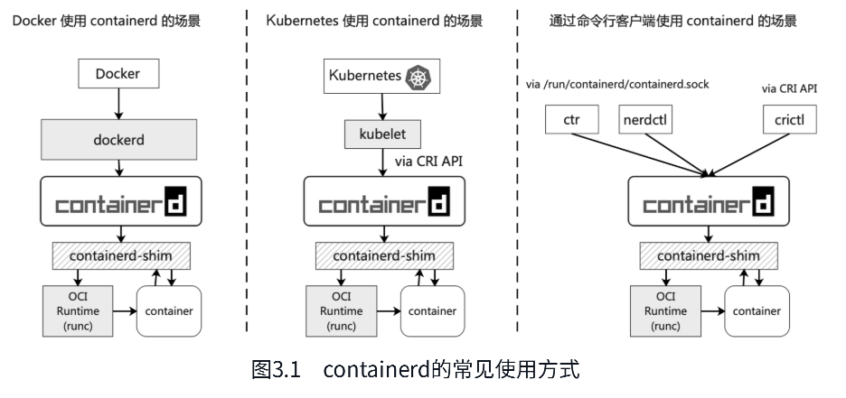
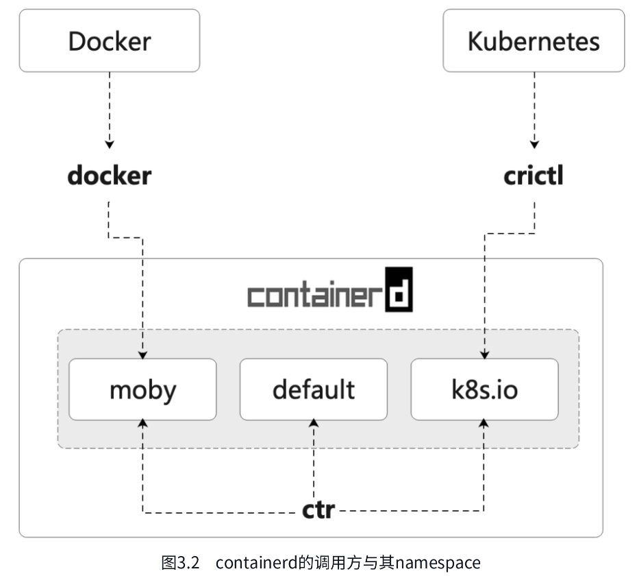
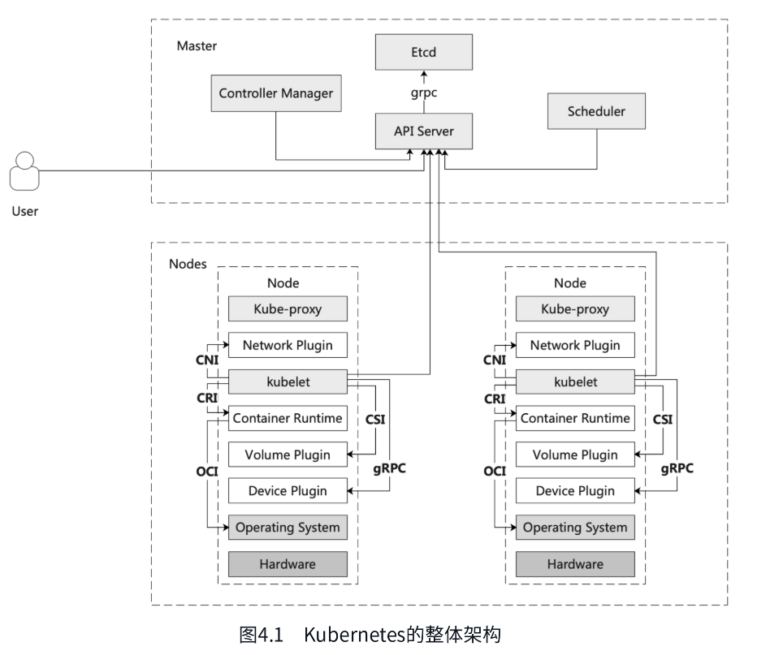
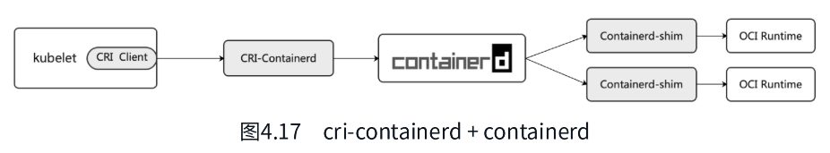
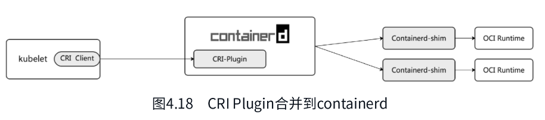
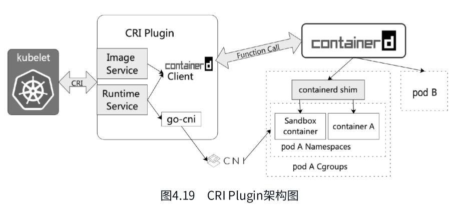

# 第3章 使用containerd

containerd 作为一个高级容器运行时，简单来说，是一个守护进程，在单个主机上管理完整的容器生命周期，包括创建、启动、停止容器以及存储镜像、配置挂载、配置网络等。

containerd 本身设计旨在嵌入更大的系统中。例如，Docker 底层通过 containerd 来运行容器，Kubernetes 通过 CRI 使用 containerd 来管理容器。当然，除了Docker与Kubernetes这种更上层的系统调用方式，还可以通过客户端命令行的方式来调用containerd，如ctr、nerdctl、crictl等命令行。containerd的几种常见的使用方式如图3.1所示。

## 3.2 ctr的使用

安装完 containerd 之后，ctr 也就默认安装好了。ctr 是 containerd 提供的客户端工具，内置在 containerd 项目中。执行 ctr --help 可以查看 ctr 支持的命令。

通过 help 命令可以看到 ctr 支持的命令有几大类：plugins、container、image、task 等。接下来详细介绍。

containerd 相比 Docker 多了 namespace 的概念，主要是用于对上层编排系统的支持。常见的 namespace 有3个：default、moby 和 k8s.io。

- default 是默认的 namespace，如果不指定 -n，则所有的镜像、容器操作都在 default 命名空间下，这一点一定要注意。
- moby 是 Docker 使用的 namespace。Docker 作为 containerd 的上层编排系统之一，底层对容器的管理也是通过containerd，它使用的 namespace 是 moby。
- k8s.io 是 kubelet 与 crictl 所使用的 namespace。注意，containerd 所使用的 namespace 与 k8s 中的 namespace不是一个概念。

不同项目使用 containerd namespace 的情况如图3.2所示。

## 3.3 nerdctl的使用

对于习惯使用 Docker 的用户而言，ctr 可能并不是很友好，于是 nerdctl 应运而生。nerdctl 是 containerd 官方提供的兼容 Docker 命令行的工具，支持 Docker CLI 关于容器生命周期管理的所有命令，并且支持 docker compose (nerdctl compose up)。因此，如果读者已经熟悉了 Docker 或者 podman 的使用，那么对 nerdctl 也一定不会陌生。

### nerdctl的设计初衷

nerdctl 并不是 Docker CLI 的复制品，因为兼容 Docker 并不是 nerdctl 的最终目标，nerdctl 的目标是促进 containerd 创新实验特性的发展。Docker 并不支持这些实验特征，如镜像延迟加载(stargz)、镜像加密(ocicrypt)等能力。

Docker 迟早也会支持这些新特性，但是重构 Docker 来完整地支持 containerd 似乎是不太可能的，~~因为 Docker 目前的设计为仅使用 containerd 的少数几个子系统~~。因此 containerd 的维护者们决定创建一个完全使用 containerd 的全新命令行工具：containerd CTL，即 nerdctl。nerdctl 与 Docker 分别调用 containerd 的架构如图3.3所示。

# 第4章 containerd与云原生生态

## 4.1 Kubernetes与CRI

kubelet: Node上最核心的组件，对上负责和 Master 通信，对下和容器运行时通信，负责容器的生命周期管理、容器网络、容器存储能力建设。

- 通过容器运行时接口(container runtime interface, CRI)与各种容器运行时通信，管理容器生命周期。
- 通过容器网络接口(container network interface, CNI)与容器网络插件通信，负责集群网络的管理。
- 通过容器存储接口(container storage interface, CSI)与容器存储插件通信，负责集群内容器存储资源的管理。

Network Plugin：网络插件，如 Flannel、Cilium、Calico 负责为容器配置网络，通过 CNI 被 kubelet 或者 CRI 的实现来调用，如 containerd 等。

Container Runtime：容器运行时，如 containerd、Docker 等，负责容器生命周期的管理，通过 CRI 被 kubelet 调用，通过 OCI 与操作系统交互，运行进程、资源隔离与限制等。

Device Plugin: Kubernets提供的一种设备插件框架，通过该接口可将硬件资源发布到 kubelet，如管理GPU、高性能网卡、FPGA等。

## 4.2 containerd与CRI Plugin

CRI Plugin 是 Kubernetes 容器运行时接口 CRI 的具体实现，在 containerd 1.0 版本之前是作为独立的二级制形式存在的（GitHub地址为https://github.com/containerd/cri，该仓库已于2022年3月9日归档，当前为只读状态）。如图4.17所示，它通过 gRPC 请求分别与 kubelet 和 containerd 交互。

cri-containerd 在 containerd 1.1 版本中合入了 containerd 主干代码（由containerd/cri/pkg移入containerd/containerd/pkg/cri），内置在 containerd 中，作为 containerd 的原生插件并默认开启。CRI Plugin 合入containerd 主线后，通过 kubelet 调用 containerd 的调用链如图4.18所示。

CRI Plugin 插件实现了 kubelet CRI 中的 ImageService 和 RuntimeService，其架构如图4.19所示。其中，ImageServer 和 RuntimeService 通过 containerd Client SDK 调用 containerd 接口来管理容器和镜像；RuntimeService通过 CNI 插件给 pod 配置容器网络，go-cni 为 containerd 封装的调用 CNI 插件的 go 代码库。

下面通过一个单容器的 pod 举例说明 pod 启动时 CRI Plugin 的工作流程。

(1) kubelet 通过 CRI 调用 CRI Plugin 中的 RunSandbox API，创建 pod 对应的 Sandbox 环境。

(2) 创建 Pod Sandbox 时，CRI Plugin 会创建 pod 网络命名空间，然后通过 CNI 配置容器网络；之后会为 Sandbox 创建并启动一个特殊的容器，即 Pause 容器，然后将该容器加入上述的网络命名空间中。

(3) 创建完 Pod Sandbox 后，kubelet 调用 CRI Plugin 的 ImageService API 拉取容器镜像，如果 node 上不存在该镜像，则 CRI Plugin 会调用 containerd 的接口去拉取镜像。

(4) kubelet 利用刚刚拉取的镜像调用 CRI Plugin 的 RuntimeService API，在 Pod Sandbox 中创建并启动容器。

(5) CRI Plugin 最终通过 containerd client sdk 调用 containerd 的接口创建容器，并在 pod 所在的Cgroups和namespace中启动容器。

经过上述过程之后，pod 和 pod 内的容器就正常启动了。