# 容器运行时介绍

在学习 Containerd 之前我们有必要对 Docker 的发展历史做一个简单的回顾。

## 容器运行时分类

当然最火大家最熟悉的容器运行时非 Docker 莫属了，Docker 凭借一己之力大大推进了容器技术的普及。当然随着容器生态的不断发展，业界也慢慢出现了其他的运行时，比如 Containerd、rkt、kata container、cri-o 等等，这些运行时提供的功能不尽相同，有些只有容器运行的功能，有些除运行容器之外还提供了容器镜像的管理功能。根据容器运行时提供的功能，我们可以将容器运行时分为低层运行时和高层运行时。

### 低层运行时

低层运行时主要负责容器的基本运行，它们通常需要配合高层运行时来提供更完整的容器管理功能。低层运行时一般遵循 Open Container Initiative (OCI) 规范。

1. **runc**：最典型的运行时，基于 Linux Namespace 和 Cgroups 技术实现。它是一个 CLI 工具，用于创建和运行符合 OCI 规范的容器。`runc` 是 Docker 和 containerd 等高层运行时的核心组件。
2. **crun**：类似于 `runc`，但具有更快的启动时间和更低的资源开销，特别是在处理大量小容器时表现出色。
3. **runv**：基于虚拟机管理程序的运行时，通过虚拟化 guest kernel，将容器和主机隔离开来，使得其边界更加清晰，代表实现是 Kata Container 和 Firecracker。
4. **Kata Containers**：它结合了轻量级虚拟机（如 KVM）和容器的优势，提供了更强的隔离性和安全性。Kata Containers 也是一个低层运行时，但它的隔离方式更接近虚拟机。
5. **runsc**：runc + safety，通过拦截应用程序的所有系统调用，提供安全隔离的轻量级容器运行时沙箱，代表实现是谷歌的 gVisor。

### 高层运行时

高层运行时不仅负责容器的创建和运行，还提供了容器镜像的管理、网络配置、卷管理等更高层次的功能。

1. **Docker**：最广为人知的容器运行时，提供了从镜像构建、容器运行到网络和存储管理的完整解决方案。Docker 背后的核心组件包括 `containerd` 和 `runc`。

2. **containerd**：最初是 Docker 的一部分，现在是一个独立的项目，并且被 Kubernetes 作为默认的容器运行时之一。`containerd` 提供了包含镜像管理、容器运行和存储等功能的完整容器生命周期管理。

3. **CRI-O**：专门为 Kubernetes 而设计的容器运行时，符合 Kubernetes 的 CRI（Container Runtime Interface）标准。CRI-O 使用 `runc` 或 `crun` 作为低层运行时。

4. **podman**：一个无守护进程的容器引擎，支持创建和管理 Open Containers Initiative (OCI) 容器和容器镜像。Podman 可以运行在 rootless 模式下，使非特权用户也可以创建和运行容器。

5. **LXC/LXD**：LXC 是一个低层次的容器技术，LXD 是更高层的管理工具，提供了类似虚拟机的体验。LXD 可以管理容器、存储池和网络等。

### 总结

容器技术的发展使得不同的运行时具备了不同的特性和适用场景。高层运行时负责更全面的容器管理，而低层运行时则专注于容器的运行和隔离。根据具体需求，选择合适的运行时组合可以使容器化应用更高效、安全和灵活。

## Docker
从 Docker 1.11 版本开始，Docker 容器运行就不是简单通过 Docker Daemon 来启动了，而是通过集成 containerd、runc 等多个组件来完成的。虽然 Docker Daemon 守护进程模块在不停的重构，但是基本功能和定位没有太大的变化，一直都是 CS 架构，守护进程负责和 Docker Client 端交互，并管理 Docker 镜像和容器。

现在的架构中组件 containerd 就会负责集群节点上容器的生命周期管理，并向上为 Docker Daemon 提供 gRPC 接口。
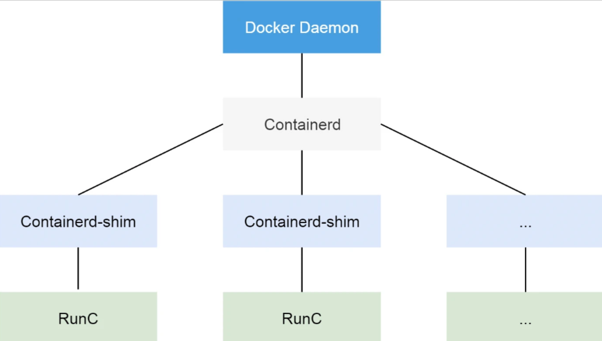

当我们要创建一个容器的时候，现在 Docker Daemon 并不能直接帮我们创建了，而是请求 containerd 来创建一个容器，containerd 收到请求后，也并不会直接去操作容器，而是创建一个叫做 containerd-shim 的进程，让这个进程去操作容器，容器进程是需要一个父进程来做状态收集、维持 stdin 、 fd 打开等工作的，假如这个父进程就是 containerd，那如果 containerd 挂掉的话，整个宿主机上所有的容器都得退出了，而引入 containerd-shim 这个垫片就可以来规避这个问题了。

然后创建容器需要做一些 namespaces 和 cgroups 的配置，以及挂载 root 文件系统等操作，这些操作其实已经有了标准的规范，那就是 OCI（开放容器标准），runc 就是它的一个参考实现（Docker 被逼无奈将 libcontainer 捐献出来改名为 runc 的），这个标准其实就是一个文档，主要规定了容器镜像的结构、以及容器需要接收哪些操作指令，比如 create、start、stop、delete 等这些命令。runc 就可以按照这个 OCI 文档来创建一个符合规范的容器，既然是标准肯定就有其他 OCI 实现，比如 Kata、gVisor 这些容器运行时都是符合 OCI 标准的。

所以真正启动容器是通过 containerd-shim 去调用 runc 来启动容器的，runc 启动完容器后本身会直接退出，containerd-shim 则会成为容器进程的父进程，负责收集容器进程的状态，上报给 containerd，并在容器中 pid 为 1 的进程退出后接管容器中的子进程进行清理，确保不会出现僵尸进程。

而 Docker 将容器操作都迁移到 containerd 中去是因为当前做 Swarm，想要进军 PaaS 市场，做了这个架构切分，让 Docker Daemon 专门去负责上层的封装编排，当然后面的结果我们知道 Swarm 在 Kubernetes 面前是惨败，然后 Docker 公司就把 containerd 项目捐献给了 CNCF 基金会，这个也是现在的 Docker 架构。

## CRI

### CRI概述

我们知道 Kubernetes 提供了一个 CRI 的容器运行时接口，那么这个 CRI 到底是什么呢？这个其实也和 Docker 的发展密切相关的。

在 Kubernetes 早期的时候，当时 Docker 实在是太火了，Kubernetes 当然会先选择支持 Docker，而且是通过硬编码的方式直接调用 Docker API，后面随着 Docker 的不断发展以及 Google 的主导，出现了更多容器运行时，Kubernetes 为了支持更多更精简的容器运行时，Google 就和红帽主导推出了 CRI 标准，用于将 Kubernetes 平台和特定的容器运行时（当然主要是为了干掉 Docker）解耦。

CRI（Container Runtime Interface 容器运行时接口）本质上就是 Kubernetes 定义的一组与容器运行时进行交互的接口，所以只要实现了这套接口的容器运行时都可以对接到 Kubernetes 平台上来。

不过 Kubernetes 推出 CRI 这套标准的时候还没有现在的统治地位，所以有一些容器运行时可能不会自身就去实现 CRI 接口，于是就有了 shim（垫片）， 一个 shim 的职责就是作为适配器将各种容器运行时本身的接口适配到 Kubernetes 的 CRI 接口上，其中 dockershim 就是 Kubernetes 对接 Docker 到 CRI 接口上的一个垫片实现。
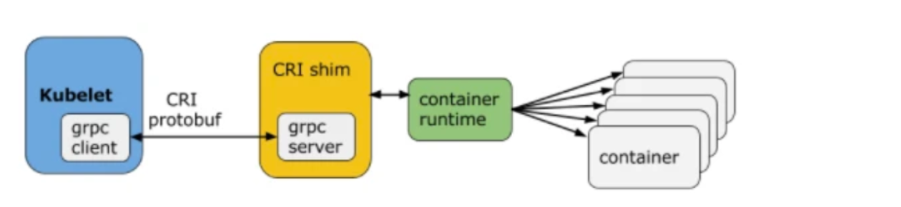

从上图可以看到，CRI 主要有 gRPC client、gRPC Server 和具体的容器运行时三个组件。其中 Kubelet 作为 gRPC 的客户端来调用 CRI 接口，CRI shim 作为 gRPC 服务端来响应 CRI 请求，负责将 CRI 请求的内容转换为具体的容器运行时 API，在 kubelet 和运行时之间充当翻译的角色。

具体的容器创建逻辑是，Kubernetes 在通过调度指定一个具体的节点运行 Pod，该节点的 Kubelet 在接到 Pod 创建请求后，调用一个叫作 GenericRuntime 的通用组件来发起创建 Pod 的 CRI 请求给 CRI shim；CRI shim 监听一个端口来响应 Kubelet，在收到 CRI 请求后，将其转化为具体的容器运行时指令，并调用相应的容器运行时来创建 Pod。

### CRI规范
所以任何容器运行时想要接入 Kubernetes，都需要实现一个自己的 CRI shim，来实现 CRI 接口规范。那么 CRI 有哪些接口需要实现呢？

最新的 CRI 定义位于 Kubernetes 源码包 staging/src/k8s.io/cri-api/pkg/apis/runtime/v1/api.proto，主要定义了两类接口：ImageService 和 RuntimeService，比之前的定义多了不少方法。

- ImageService 主要定义拉取镜像、查看和删除镜像等操作。
- RuntimeService 定义了容器相关的操作，包括管理容器的生命周期，以及与容器交互的调用（exec/attach/port-forward）等操作。

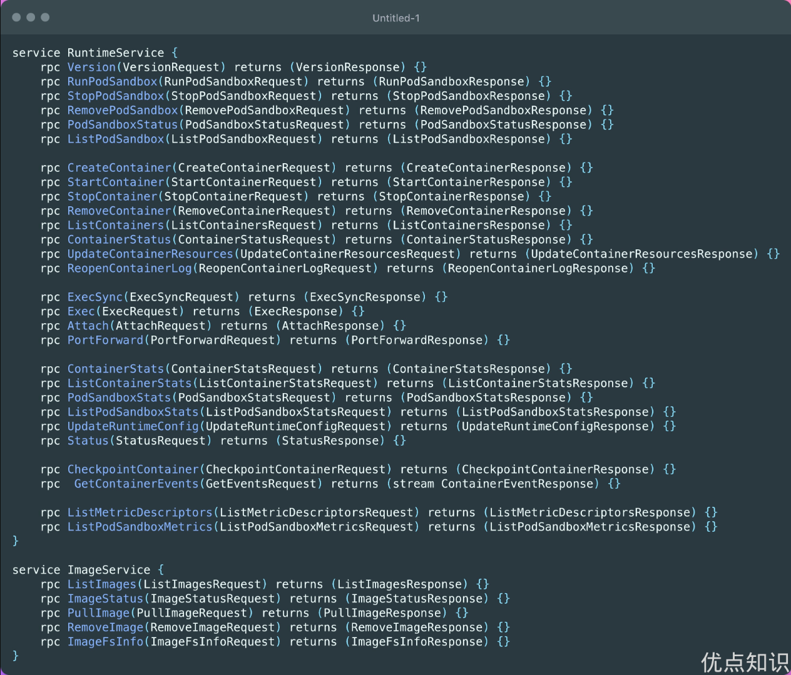

ImageService 的操作比较简单，就是拉取、删除、查看镜像状态及获取镜像列表这几个操作，下面我们着重介绍下 RuntimeService。

从接口中可以看出 RuntimeService 除了有 container 的管理接口外，还包含 PodSandbox 相关的管理接口和 exec、attach 等与容器交互的接口。

PodSandbox 这个概念对应的是 Kubernetes 里的 Pod，它描述了 Kubernetes 里的 Pod 与容器运行相关的属性或者信息，如 HostName、CgroupParent 等，设计这个的初衷是因为 Pod 里所有容器的资源和环境信息是共享的，但是不同的容器运行时实现共享的机制不同，如 Docker 中 Pod 会是一个 Linux 命名空间，各容器网络信息的共享通过创建 pause 容器的方法来实现，而 Kata Containers 则直接将 Pod 具化为一个轻量级的虚拟机；将这个逻辑抽象为 PodSandbox 接口，可以让不同的容器运行时在 Pod 实现上自由发挥，自己解释和实现 Pod 的逻辑。

Exec、Attach 和 PortForward 是三个和容器进行数据交互的接口，由于交互数据需要长链接来传输，这些接口被称为 Streaming API。CRI shim 依赖一套独立的 Streaming Server 机制来实现客户端与容器的交互需求。长连接比较消耗网络资源，为了避免因长连接给 kubelet 节点带来网络流量瓶颈，CRI 要求容器运行时启动一个单独的流服务器，让客户端直接与流服务器进行连同交互。

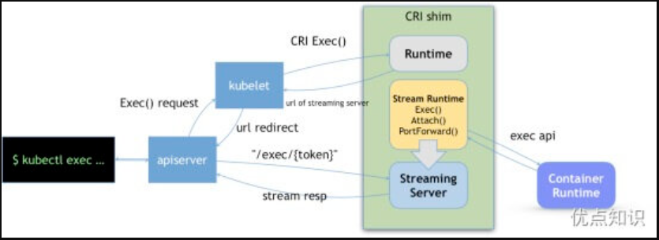

上图所示，kubectl exec 命令实现过程如下：
- 客户端发送 kubectl exec 命令给 apiserver；
- apiserver 调用 kubelet 的 Exec API；
- kubelet 调用 CRI 的 Exec 接口（具体的执行者为实现该接口的 CRI Shim ）；
- CRI Shim 向 kubelet 返回 Streaming Server 的地址和端口；
- kubelet 以 redirect 的方式返回给 apiserver
- apiserver 通过重定向来向 Streaming Server 发起真正的 /exec/{token} 请求，与它建立长连接，完成 Exec 的请求和响应。

kubelet 在引入 CRI 之后，主要的架构如下图所示，其中 Generic Runtime Manager 负责发送容器创建、删除等 CRI 请求，Container Runtime Interface(CRI) 负责定义 CRI 接口规范，具体的 CRI 实现可分为两种：kubelet 内置的 dockershim 和远端的 CRI shim。其中 dockershim 是 Kubernetes 自己实现的适配 Docker 接口的 CRI 接口实现，主要用来将 CRI 请求里的内容组装成 Docker API 请求发给 Docker Daemon；远端的 CRI shim 主要是用来匹配其他的容器运行时工具到 kubelet。

CRI shim 主要负责响应 kubelet 发送的 CRI 请求，并将请求转化为具体的运行时命令发送给具体的运行时（如 runc、kata 等）；Stream Server 用来响应客户端与容器的交互，除此之外，CRI 还提供接入 CNI 的能力以实现 Pod 网络的共享，常用的远端 CRI 的实现有 CRI-Containerd、CRI-O 等。

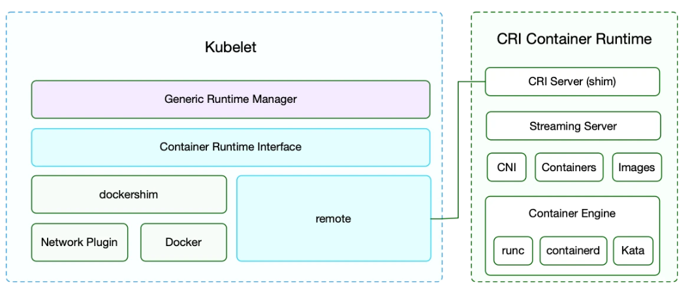


## 为何抛弃Docker
从上图可以看出，Kubernetes 把 dockershim 内置在了官方的代码库中，将 Docker 设计为 Kubernetes 默认的容器运行时工具。但是官方在 Kubernetes 1.20 版本的更新日志中声明已经废用对 Docker 的支持，在 Kubernetes 1.24 版本中，dockershim 代码也如期被删除。

那 Kubernetes 为何要抛弃 Docker 呢？这和 Docker 的整体架构也是有关系的，Docker 最初是一个单体引擎，主要负责容器镜像的制作、上传、拉取及容器的运行及管理。

随着容器技术的繁荣发展，为了促进容器技术相关的规范生成和 Docker 自身项目的发展，Docker 将单体引擎拆分为三部分，分别为 runc、containerd 和 dockerd，其中 runc 主要负责容器的运行和生命周期的管理、 containerd 主要负责容器镜像的下载和解压等镜像管理功能、dockerd 主要负责提供镜像构建、上传等功能同时提供容器存储和网络的映射功能，同时也是 Docker 服务器端的守护进程，用来响应 Docker 客户端发来的各种容器、镜像管理的任务。

Docker 公司将 runc 捐献给了 OCI，将 containerd 捐献给了 CNCF，剩下的 dockerd 作为 Docker 运行时由 Docker 公司自己维护。

如前所述，Kubernetes 在引入 CRI 之后，kubelet 需要通过 CRI shim 去调用具体的容器运行时工具，不过这里同样也有一个例外，那就是 Docker，由于 Docker 当时的江湖地位很高，Kubernetes 是直接内置了 dockershim 在 kubelet 中的，所以如果你使用的是 Docker 这种容器运行时的话是不需要单独去安装配置适配器之类的，当然这个举动似乎也麻痹了 Docker 公司。


现在如果我们使用的是 Docker 的话，当我们在 Kubernetes 中创建一个 Pod 的时候，首先就是 kubelet 通过 CRI 接口调用 dockershim，请求创建一个容器，kubelet 可以视作一个简单的 CRI Client，而 dockershim 就是接收请求的 Server，不过他们都是在 kubelet 内置的。

dockershim 收到请求后，转化成 Docker Daemon 能识别的请求，发到 Docker Daemon 上请求创建一个容器，请求到了 Docker Daemon 后续就是 Docker 创建容器的流程了，去调用 containerd，然后创建 containerd-shim 进程，通过该进程去调用 runc 去真正创建容器。

其实我们仔细观察也不难发现使用 Docker 的话其实是调用链比较长的，真正容器相关的操作其实 containerd 就完全足够了，Docker 太过于复杂笨重了，当然 Docker 深受欢迎的很大一个原因就是提供了很多对用户操作比较友好的功能，但是对于 Kubernetes 来说压根不需要这些功能，因为都是通过接口去操作容器的，所以自然也就可以将容器运行时切换到 containerd 来。

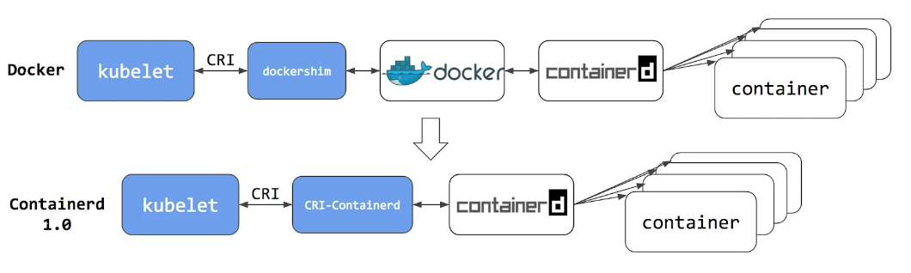

切换到 containerd 可以消除掉中间环节，操作体验也和以前一样，但是由于直接用容器运行时调度容器， 因此你以前用来检查这些容器的 Docker 工具就不能使用了。

你不能再使用 docker ps 或 docker inspect 命令来获取容器信息。由于不能列出容器，因此也不能获取日志、停止容器，甚至不能通过 docker exec 在容器中执行命令。当然我们仍然可以下载镜像，或者用 docker build 命令构建镜像，但用 Docker 构建、下载的镜像，对于容器运行时和 Kubernetes，均不可见。为了在 Kubernetes 中使用，需要把镜像推送到镜像仓库中去。

从上图可以看出在 containerd 1.0 中，对 CRI 的适配是通过一个单独的 CRI-Containerd 进程来完成的，这是因为最开始 containerd 还要去适配其他的系统（比如 swarm），所以没有直接实现 CRI，所以这个对接工作就交给 CRI-Containerd 这个 shim 了。

然后到了 containerd 1.1 版本后就去掉了 CRI-Containerd 这个 shim，直接把适配逻辑作为插件的方式集成到了 containerd 主进程中，现在这样的调用就更加简洁了。

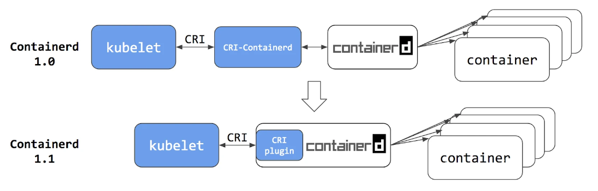

与此同时 Kubernetes 社区也做了一个专门用于 Kubernetes 的 CRI 运行时 CRI-O，直接兼容 CRI 和 OCI 规范。

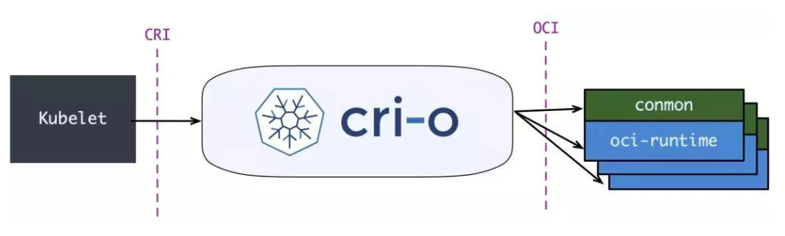

这个方案和 containerd 的方案显然比默认的 dockershim 简洁很多，不过由于大部分用户都比较习惯使用 Docker，所以大家还是更喜欢使用 dockershim 方案。

但是随着 CRI 方案的发展，以及其他容器运行时对 CRI 的支持越来越完善，Kubernetes 社区在 2020 年 7 月份就开始着手移除 dockershim 方案了：https://github.com/kubernetes/enhancements/tree/master/keps/sig-node/2221-remove-dockershim，现在的移除计划是在 1.20 版本中将 kubelet 中内置的 dockershim 代码分离，将内置的 dockershim 标记为维护模式，当然这个时候仍然还可以使用 dockershim，目标是在 1.23/1.24 版本发布没有 dockershim 的版本（代码还在，但是要支持开箱即用的 docker 需要自己构建 kubelet，会在某个宽限期过后从 kubelet 中删除内置的 dockershim 代码）。

那么这是否就意味这 Kubernetes 不再支持 Docker 了呢？当然不是的，这只是废弃了内置的 dockershim 功能而已，Docker 和其他容器运行时将一视同仁，不会单独对待内置支持，如果我们还想直接使用 Docker 这种容器运行时应该怎么办呢？可以将 dockershim 的功能单独提取出来独立维护一个 cri-dockerd 即可，就类似于 containerd 1.0 版本中提供的 CRI-Containerd，当然还有一种办法就是 Docker 官方社区将 CRI 接口内置到 Dockerd 中去实现。

但是我们也清楚 Dockerd 也是去直接调用的 Containerd，而 containerd 1.1 版本后就内置实现了 CRI，所以 Docker 也没必要再去单独实现 CRI 了，当 Kubernetes 不再内置支持开箱即用的 Docker 以后，最好的方式当然也就是直接使用 Containerd 这种容器运行时，而且该容器运行时也已经经过了生产环境实践的，接下来我们就来学习下 Containerd 的使用。

# Containerd的使用

我们知道很早之前的 Docker Engine 中就有了 containerd，只不过现在是将 containerd 从 Docker Engine 里分离出来，作为一个独立的开源项目，目标是提供一个更加开放、稳定的容器运行基础设施。分离出来的 containerd 将具有更多的功能，涵盖整个容器运行时管理的所有需求，提供更强大的支持。

containerd 是一个工业级标准的容器运行时，它强调简单性、健壮性和可移植性，containerd 可以负责干下面这些事情：

- 管理容器的生命周期（从创建容器到销毁容器）
- 拉取/推送容器镜像
- 存储管理（管理镜像及容器数据的存储）
- 调用 runc 运行容器（与 runc 等容器运行时交互）
- 管理容器网络接口及网络

## 架构

containerd 作为守护程序，它管理其主机系统完整的容器生命周期，从镜像传输和存储到容器执行和监测，再到底层存储到网络附件等等。

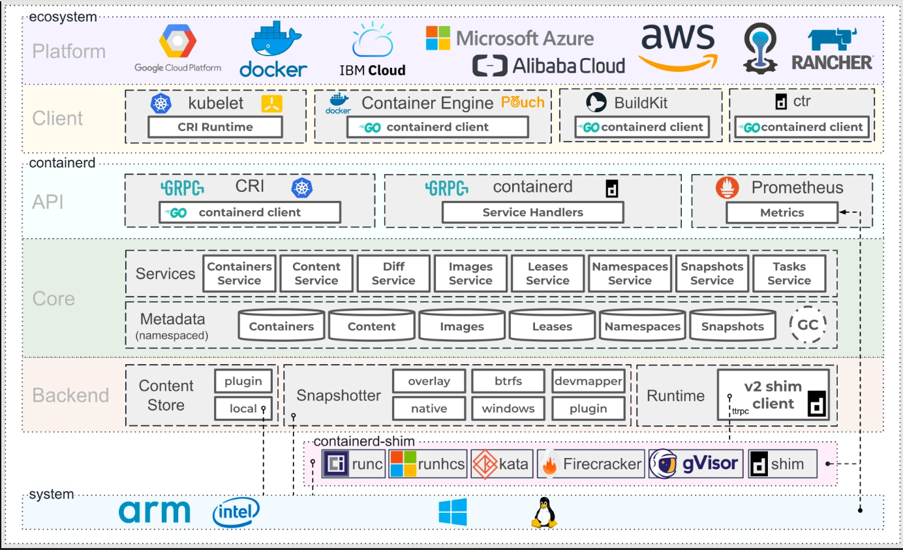

上图是 containerd 官方提供的架构图，可以看出 containerd 采用的也是 C/S 架构，服务端通过 unix domain socket 暴露低层的 gRPC API 接口出去，客户端通过这些 API 管理节点上的容器，每个 containerd 只负责一台机器，Pull 镜像、对容器的操作（启动、停止等）、网络、存储都是由 containerd 完成。具体运行容器由 runc 负责，实际上只要是符合 OCI 规范的容器都可以支持。

为了解耦，containerd 将系统划分成了不同的组件，每个组件都由一个或多个模块协作完成（Core 部分），每一种类型的模块都以插件的形式集成到 Containerd 中，而且插件之间是相互依赖的，例如，上图中的每一个长虚线的方框都表示一种类型的插件，包括 Service Plugin、Metadata Plugin、GC Plugin、Runtime Plugin 等，其中 Service Plugin 又会依赖 Metadata Plugin、GC Plugin 和 Runtime Plugin。每一个小方框都表示一个细分的插件，例如 Metadata Plugin 依赖 Containers Plugin、Content Plugin 等。比如:

- Content Plugin: 提供对镜像中可寻址内容的访问，所有不可变的内容都被存储在这里。
- Snapshot Plugin: 用来管理容器镜像的文件系统快照，镜像中的每一层都会被解压成文件系统快照，类似于 Docker 中的 graphdriver。

总体来看 containerd 可以分为三个大块：Storage、Metadata 和 Runtime。

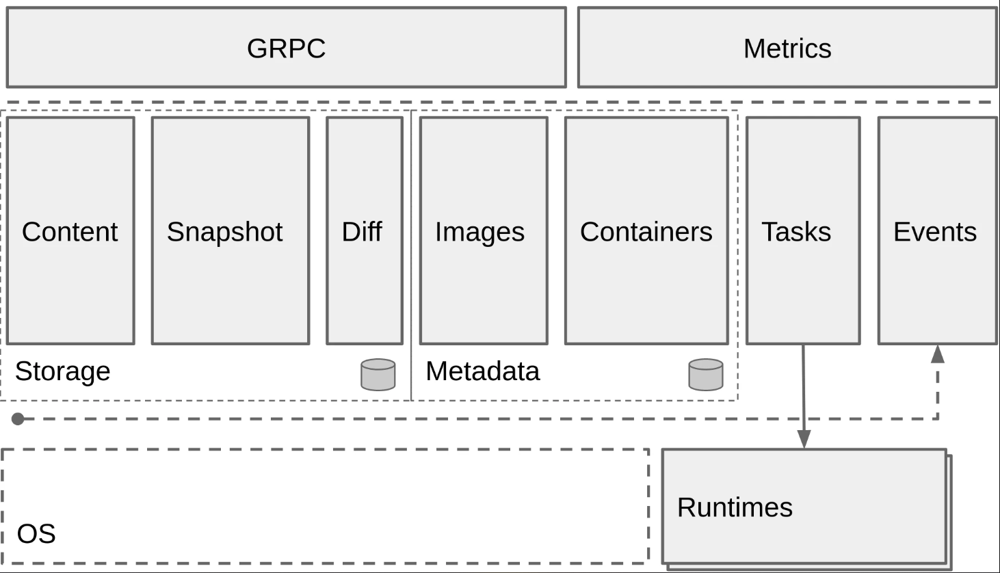

## 安装

这里我使用的系统是 CentOS 7.6 (可通过`lsb_release -a`命令查看)，首先需要安装 seccomp 依赖：

```shell
➜  ~ rpm -qa |grep libseccomp
libseccomp-2.3.1-4.el7.x86_64
# 如果没有安装 libseccomp 包则执行下面的命令安装依赖
➜  ~ yum install wget -y
➜  ~ wget http://mirror.centos.org/centos/7/os/x86_64/Packages/libseccomp-2.3.1-4.el7.x86_64.rpm
➜  ~ yum install libseccomp-2.3.1-4.el7.x86_64.rpm -y
```

由于 containerd 需要调用 runc，所以也需要先安装 runc，不过 containerd 提供了一个包含相关依赖的压缩包 `cri-containerd-cni-${VERSION}.${OS}-${ARCH}.tar.gz`，可以直接使用这个包来进行安装（其实cri-xx都含有runc，验证方式是下载tar.gz，然后通过tar -tvf xxx.tar.gz，就可以看到含有runc可执行文件）。首先从 [release 页面](https://github.com/containerd/containerd/releases)下载最新版本的压缩包，当前为 1.5.5 版本（最新的 1.5.7 版本在 CentOS7 下面执行 runc 会报错：https://github.com/containerd/containerd/issues/6091）：

```shell
~ wget https://github.com/containerd/containerd/releases/download/v1.5.5/cri-containerd-cni-1.5.5-linux-amd64.tar.gz

# https://github.com/containerd/containerd/releases 中主要包含下面三类
containerd-1.7.22-linux-amd64.tar.gz
cri-containerd-1.7.22-linux-amd64.tar.gz # 这是专门为 Kubernetes 集成设计的 containerd 安装包，包含了符合 Container Runtime Interface (CRI) 的功能模块。这意味着它可以更好地与 Kubernetes 一起工作，通过 CRI 接口与 Kubernetes 进行通信。
cri-containerd-cni-1.7.22-linux-amd64.tar.gz # 这个安装包除了包含 cri-containerd 的所有功能之外，还包括了 CNI（Container Network Interface）插件。这使得它更适合在 Kubernetes 集群中使用，因为它提供了网络插件，能够更方便地管理容器的网络设置。

# https://github.com/containerd/containerd/blob/main/docs/getting-started.md
FAQ: For Kubernetes, do I need to download cri-containerd-(cni-)<VERSION>-<OS-<ARCH>.tar.gz too?

Answer: No.

As the Kubernetes CRI feature has been already included in containerd-<VERSION>-<OS>-<ARCH>.tar.gz, you do not need to download the cri-containerd-.... archives to use CRI.

The cri-containerd-... archives are deprecated, do not work on old Linux distributions, and will be removed in containerd 2.0.

```

直接将压缩包解压到系统的各个目录中：

```shell
# -C /: 这个选项告诉 tar 程序在解压缩之前先切换到根目录 /。这意味着所有解压缩出来的文件和目录将会被放置在根目录下
tar -C / -xzf cri-containerd-cni-1.5.5-linux-amd64.tar.gz
```

当然要记得将 `/usr/local/bin` 和 `/usr/local/sbin` 追加到 `~/.bashrc` 文件的 PATH 环境变量中：

```shell
# 使用 export 命令直接在命令行中设置的环境变量只对当前会话有效，新打开的终端会话不会继承这些变化。
export PATH=$PATH:/usr/local/bin:/usr/local/sbin

# 永久修改
echo 'export PATH="$PATH:/usr/local/bin:/usr/local/sbin"' >> ~/.bashrc
```

然后执行下面的命令使其立即生效：

```shell
source ~/.bashrc
```

containerd 的默认配置文件为 `/etc/containerd/config.toml`，可以通过如下所示的命令生成一个默认的配置：

```shell
mkdir -p /etc/containerd
containerd config default > /etc/containerd/config.toml
```

由于上面下载的 containerd 压缩包中包含一个 `etc/systemd/system/containerd.service` 的文件，这样我们就可以通过 systemd 来配置 containerd 作为守护进程运行了，内容如下所示： 

```shell
[root@master ~]# cat /etc/systemd/system/containerd.service
# Copyright The containerd Authors.
#
# Licensed under the Apache License, Version 2.0 (the "License");
# you may not use this file except in compliance with the License.
# You may obtain a copy of the License at
#
#     http://www.apache.org/licenses/LICENSE-2.0
#
# Unless required by applicable law or agreed to in writing, software
# distributed under the License is distributed on an "AS IS" BASIS,
# WITHOUT WARRANTIES OR CONDITIONS OF ANY KIND, either express or implied.
# See the License for the specific language governing permissions and
# limitations under the License.

[Unit]
Description=containerd container runtime
Documentation=https://containerd.io
After=network.target local-fs.target

[Service]
ExecStartPre=-/sbin/modprobe overlay
ExecStart=/usr/local/bin/containerd

Type=notify
Delegate=yes
KillMode=process
Restart=always
RestartSec=5
# Having non-zero Limit*s causes performance problems due to accounting overhead
# in the kernel. We recommend using cgroups to do container-local accounting.
LimitNPROC=infinity
LimitCORE=infinity
LimitNOFILE=infinity
# Comment TasksMax if your systemd version does not supports it.
# Only systemd 226 and above support this version.
TasksMax=infinity
OOMScoreAdjust=-999

[Install]
WantedBy=multi-user.target
```

这里有两个重要的参数：

- Delegate: 这个选项允许 containerd 以及运行时自己管理自己创建容器的 cgroups。如果不设置这个选项，systemd 就会将进程移到自己的 cgroups 中，从而导致 containerd 无法正确获取容器的资源使用情况。

- KillMode: 是 systemd 服务单元文件中的一个配置选项，它定义了当服务停止时如何处理与该服务相关联的进程。以下是 KillMode 可以设置的几个值及其含义：

- - control-group 或 cgroup（默认值）: 当主进程被终止时，systemd 会尝试杀死所有属于服务的 cgroup 的进程。也就是说，它会杀死该服务启动的所有子进程。
  - process：只有服务的主进程会被杀死。与服务关联的其他进程将不会被 systemd 直接终止。
  - mixed：主进程会收到 SIGTERM 信号，而 cgroup 中的其他进程会收到 SIGKILL 信号。这是介于 control-group 和 process 之间的一种方式，对主进程更为温和，但对其他进程则立即强制终止。
  - none：systemd 不会尝试杀死任何进程。服务的停止责任完全交由服务本身来处理。

我们需要将 KillMode 的值设置为 process，这样可以确保升级或重启 containerd 时不杀死现有的容器。

现在就可以启动 containerd 了，直接执行下面的命令即可：

```shell
systemctl enable containerd --now
systemctl status containerd
```

启动完成后就可以使用 containerd 的本地 CLI 工具 ctr 了，比如查看版本：

```shell
[root@master ~]# ctr version
Client:
  Version:  v1.6.10
  Revision: 770bd0108c32f3fb5c73ae1264f7e503fe7b2661
  Go version: go1.18.8

Server:
  Version:  v1.6.10
  Revision: 770bd0108c32f3fb5c73ae1264f7e503fe7b2661
  UUID: d620def4-303d-4303-88e1-4d95abc1706c
```


## 配置

首先来查看下上面默认生成的配置文件 `/etc/containerd/config.toml`：

```toml
disabled_plugins = []
imports = []
oom_score = 0
plugin_dir = ""
required_plugins = []
root = "/var/lib/containerd"
state = "/run/containerd"
version = 2

[cgroup]
  path = ""

[debug]
  address = ""
  format = ""
  gid = 0
  level = ""
  uid = 0

[grpc]
  address = "/run/containerd/containerd.sock"
  gid = 0
  max_recv_message_size = 16777216
  max_send_message_size = 16777216
  tcp_address = ""
  tcp_tls_cert = ""
  tcp_tls_key = ""
  uid = 0

[metrics]
  address = ""
  grpc_histogram = false

[plugins]

  [plugins."io.containerd.gc.v1.scheduler"]
    deletion_threshold = 0
    mutation_threshold = 100
    pause_threshold = 0.02
    schedule_delay = "0s"
    startup_delay = "100ms"

  [plugins."io.containerd.grpc.v1.cri"]
    disable_apparmor = false
    disable_cgroup = false
    disable_hugetlb_controller = true
    disable_proc_mount = false
    disable_tcp_service = true
    enable_selinux = false
    enable_tls_streaming = false
    ignore_image_defined_volumes = false
    max_concurrent_downloads = 3
    max_container_log_line_size = 16384
    netns_mounts_under_state_dir = false
    restrict_oom_score_adj = false
    sandbox_image = "k8s.gcr.io/pause:3.5"
    selinux_category_range = 1024
    stats_collect_period = 10
    stream_idle_timeout = "4h0m0s"
    stream_server_address = "127.0.0.1"
    stream_server_port = "0"
    systemd_cgroup = false
    tolerate_missing_hugetlb_controller = true
    unset_seccomp_profile = ""

    [plugins."io.containerd.grpc.v1.cri".cni]
      bin_dir = "/opt/cni/bin"
      conf_dir = "/etc/cni/net.d"
      conf_template = ""
      max_conf_num = 1

    [plugins."io.containerd.grpc.v1.cri".containerd]
      default_runtime_name = "runc"
      disable_snapshot_annotations = true
      discard_unpacked_layers = false
      no_pivot = false
      snapshotter = "overlayfs"

      [plugins."io.containerd.grpc.v1.cri".containerd.default_runtime]
        base_runtime_spec = ""
        container_annotations = []
        pod_annotations = []
        privileged_without_host_devices = false
        runtime_engine = ""
        runtime_root = ""
        runtime_type = ""

        [plugins."io.containerd.grpc.v1.cri".containerd.default_runtime.options]

      [plugins."io.containerd.grpc.v1.cri".containerd.runtimes]

        [plugins."io.containerd.grpc.v1.cri".containerd.runtimes.runc]
          base_runtime_spec = ""
          container_annotations = []
          pod_annotations = []
          privileged_without_host_devices = false
          runtime_engine = ""
          runtime_root = ""
          runtime_type = "io.containerd.runc.v2"

          [plugins."io.containerd.grpc.v1.cri".containerd.runtimes.runc.options]
            BinaryName = ""
            CriuImagePath = ""
            CriuPath = ""
            CriuWorkPath = ""
            IoGid = 0
            IoUid = 0
            NoNewKeyring = false
            NoPivotRoot = false
            Root = ""
            ShimCgroup = ""
            SystemdCgroup = false

      [plugins."io.containerd.grpc.v1.cri".containerd.untrusted_workload_runtime]
        base_runtime_spec = ""
        container_annotations = []
        pod_annotations = []
        privileged_without_host_devices = false
        runtime_engine = ""
        runtime_root = ""
        runtime_type = ""

        [plugins."io.containerd.grpc.v1.cri".containerd.untrusted_workload_runtime.options]

    [plugins."io.containerd.grpc.v1.cri".image_decryption]
      key_model = "node"

    [plugins."io.containerd.grpc.v1.cri".registry]
      config_path = ""

      [plugins."io.containerd.grpc.v1.cri".registry.auths]

      [plugins."io.containerd.grpc.v1.cri".registry.configs]

      [plugins."io.containerd.grpc.v1.cri".registry.headers]

      [plugins."io.containerd.grpc.v1.cri".registry.mirrors]

    [plugins."io.containerd.grpc.v1.cri".x509_key_pair_streaming]
      tls_cert_file = ""
      tls_key_file = ""

  [plugins."io.containerd.internal.v1.opt"]
    path = "/opt/containerd"

  [plugins."io.containerd.internal.v1.restart"]
    interval = "10s"

  [plugins."io.containerd.metadata.v1.bolt"]
    content_sharing_policy = "shared"

  [plugins."io.containerd.monitor.v1.cgroups"]
    no_prometheus = false

  [plugins."io.containerd.runtime.v1.linux"]
    no_shim = false
    runtime = "runc"
    runtime_root = ""
    shim = "containerd-shim"
    shim_debug = false

  [plugins."io.containerd.runtime.v2.task"]
    platforms = ["linux/amd64"]

  [plugins."io.containerd.service.v1.diff-service"]
    default = ["walking"]

  [plugins."io.containerd.snapshotter.v1.aufs"]
    root_path = ""

  [plugins."io.containerd.snapshotter.v1.btrfs"]
    root_path = ""

  [plugins."io.containerd.snapshotter.v1.devmapper"]
    async_remove = false
    base_image_size = ""
    pool_name = ""
    root_path = ""

  [plugins."io.containerd.snapshotter.v1.native"]
    root_path = ""

  [plugins."io.containerd.snapshotter.v1.overlayfs"]
    root_path = ""

  [plugins."io.containerd.snapshotter.v1.zfs"]
    root_path = ""

[proxy_plugins]

[stream_processors]

  [stream_processors."io.containerd.ocicrypt.decoder.v1.tar"]
    accepts = ["application/vnd.oci.image.layer.v1.tar+encrypted"]
    args = ["--decryption-keys-path", "/etc/containerd/ocicrypt/keys"]
    env = ["OCICRYPT_KEYPROVIDER_CONFIG=/etc/containerd/ocicrypt/ocicrypt_keyprovider.conf"]
    path = "ctd-decoder"
    returns = "application/vnd.oci.image.layer.v1.tar"

  [stream_processors."io.containerd.ocicrypt.decoder.v1.tar.gzip"]
    accepts = ["application/vnd.oci.image.layer.v1.tar+gzip+encrypted"]
    args = ["--decryption-keys-path", "/etc/containerd/ocicrypt/keys"]
    env = ["OCICRYPT_KEYPROVIDER_CONFIG=/etc/containerd/ocicrypt/ocicrypt_keyprovider.conf"]
    path = "ctd-decoder"
    returns = "application/vnd.oci.image.layer.v1.tar+gzip"

[timeouts]
  "io.containerd.timeout.shim.cleanup" = "5s"
  "io.containerd.timeout.shim.load" = "5s"
  "io.containerd.timeout.shim.shutdown" = "3s"
  "io.containerd.timeout.task.state" = "2s"

[ttrpc]
  address = ""
  gid = 0
  uid = 0
```

这个配置文件比较复杂，可以将重点放在 plugins 配置上面，仔细观察可以发现每一个顶级配置块的命名都是 `plugins."io.containerd.xxx.vx.xxx"` 这种形式，每一个顶级配置块都表示一个插件，其中 `io.containerd.xxx.vx` 表示插件的类型，vx 后面的 xxx 表示插件的 ID，可以通过 ctr 查看插件列表：

```shell
[root@master containerd]# ctr plugin ls
TYPE                                  ID                       PLATFORMS      STATUS
io.containerd.content.v1              content                  -              ok
。。。。。。
io.containerd.service.v1              snapshots-service        -              ok
io.containerd.runtime.v1              linux                    linux/amd64    ok
io.containerd.monitor.v1              cgroups                  linux/amd64    ok
io.containerd.service.v1              tasks-service            -              ok
io.containerd.grpc.v1                 introspection            -              ok
io.containerd.internal.v1             restart                  -              ok
。。。。。。
io.containerd.grpc.v1                 version                  -              ok
io.containerd.tracing.processor.v1    otlp                     -              skip
io.containerd.internal.v1             tracing                  -              ok
io.containerd.grpc.v1                 cri                      linux/amd64    ok
```

顶级配置块下面的子配置块表示该插件的各种配置，比如 cri 插件下面就分为 containerd、cni 和 registry 的配置，而 containerd 下面又可以配置各种 runtime。比如现在要为镜像配置一个加速器，那么就需要在 cri 配置块下面的 registry 配置块下面进行配置 registry.mirrors：

```toml
[plugins."io.containerd.grpc.v1.cri".registry]
  [plugins."io.containerd.grpc.v1.cri".registry.mirrors]
    [plugins."io.containerd.grpc.v1.cri".registry.mirrors."docker.io"]
      endpoint = ["https://atckcdf3.mirror.aliyuncs.com"]
    [plugins."io.containerd.grpc.v1.cri".registry.mirrors."k8s.gcr.io"]
      endpoint = ["https://registry.aliyuncs.com/k8sxio"]
```

- registry.mirrors."xxx": 表示需要配置 mirror 的镜像仓库，例如 registry.mirrors."docker.io" 表示配置 docker.io 的 mirror。
- endpoint: 表示提供 mirror 的镜像加速服务，比如可以注册一个阿里云的镜像服务来作为 docker.io 的 mirror。

另外在默认配置中还有两个关于存储的配置路径：

```toml
root = "/var/lib/containerd"
state = "/run/containerd"
```

其中 root 是用来保存持久化数据，包括 Snapshots、Content、Metadata 以及各种插件的数据，每一个插件都有自己单独的目录，Containerd 本身不存储任何数据，它的所有功能都来自于已加载的插件。

而另外的 state 是用来保存运行时的临时数据的，包括 sockets、pid、挂载点、运行时状态以及不需要持久化的插件数据。

修改完镜像之后，重新启动containerd

```shell
systemctl restart containerd
```

### 镜像加速

参考资料：https://blog.csdn.net/IOT_AI/article/details/131975562

```
root@containerd:~#
root@containerd:~# nerdctl --debug=true image pull nginx:alpine
DEBU[0000] verifying process skipped
DEBU[0000] Found hosts dir "/etc/containerd/certs.d"
DEBU[0000] Ignoring hosts dir "/etc/docker/certs.d"      error="stat /etc/docker/certs.d: no such file or directory"
DEBU[0000] The image will be unpacked for platform {"amd64" "linux" "" [] ""}, snapshotter "overlayfs".
DEBU[0000] fetching                                      image="registry.k8s.io/sig-storage/csi-provisioner:v3.5.0"
DEBU[0000] loading host directory                        dir=/etc/containerd/certs.d/registry.k8s.io
DEBU[0000] resolving                                     host=k8s.m.daocloud.io
DEBU[0000] do request                                    host=k8s.m.daocloud.io request.header.accept="application/vnd.docker.distribution.manifest.v2+json, application/vnd.docker.distribution.manifest.list.v2+json, application/vnd.oci.image.manifest.v1+json, application/vnd.oci.image.index.v1+json, */*" request.header.user-agent=containerd/1.7.1+unknown request.method=HEAD url="https://k8s.m.daocloud.io/v2/sig-storage/csi-provisioner/manifests/v3.5.0?ns=registry.k8s.io"
registry.k8s.io/sig-storage/csi-provisioner:v3.5.0: resolving      |--------------------------------------|
elapsed: 0.6 s                                      total:   0.0 B (0.0 B/s)
DEBU[0000] fetch response received                       host=k8s.m.daocloud.io response.header.cache-status=MISS response.header.connection=keep-alive response.header.content-length=2035 response.header.content-type=application/vnd.docker.distribution.manifest.list.v2+json response.header.date="Fri, 28 Jul 2023 02:32:08 GMT" response.header.docker-content-digest="sha256:d078dc174323407e8cc6f0f9abd4efaac5db27838f1564d0253d5e3233e3f17f" response.header.docker-distribution-api-version=registry/2.0 response.header.etag="\"sha256:d078dc174323407e8cc6f0f9abd4efaac5db27838f1564d0253d5e3233e3f17f\"" response.header.server=nginx response.header.x-content-type-options=nosniff response.status="200 OK" url="https://k8s.m.daocloud.io/v2/sig-storage/csi-provisioner/manifests/v3.5.0?ns=registry.k8s.io"
DEBU[0000] resolved                                      desc.digest="sha256:d078dc174323407e8cc6f0f9abd4efaac5db27838f1564d0253d5e3233e3f17f" host=k8s.m.daocloud.io
DEBU[0000] loading host directory                        dir=/etc/containerd/certs.d/registry.k8s.io
DEBU[0000] fetch                                         digest="sha256:d078dc174323407e8cc6f0f9abd4efaac5db27838f1564d0253d5e3233e3f17f" mediatype=application/vnd.docker.distribution.manifest.list.v2+json size=2035
DEBU[0000] do request                                    digest="sha256:d078dc174323407e8cc6f0f9abd4efaac5db27838f1564d0253d5e3233e3f17f" mediatype=application/vnd.docker.distribution.manifest.list.v2+json request.header.accregistry.k8s.io/sig-storage/csi-provisioner:v3.5.0:                            resolved       |++++++++++++++++++++++++++++++++++++++|
index-sha256:d078dc174323407e8cc6f0f9abd4efaac5db27838f1564d0253d5e3233e3f17f: downloading    |--------------------------------------|    0.0 B/2.0 KiB
elapsed: 0.9 s                                                                 total:   0.0 B (0.0 B/s)
DEBU[0001] fetch response received                       digest="sha256:d078dc174323407e8cc6f0f9abd4efaac5db27838f1564d0253d5e3233e3f17f" mediatype=application/vnd.docker.distribution.manifest.list.v2+json response.header.cache-status=MISS response.header.connection=keep-alive response.header.content-length=2035 response.header.content-type=application/vnd.docker.distribution.manifest.list.v2+json response.header.date="Fri, 28 Jul 2023 02:32:09 GMT" response.header.docker-content-digest="sha256:d078dc174323407e8cc6f0f9abd4efaac5db27838f1564d0253d5e3233e3f17f" response.header.docker-distribution-api-version=registry/2.0 response.header.etag="\"sha256:d078dc174323407e8cc6f0f9abd4efaac5db27838f1564d0253d5e3233e3f17f\"" response.header.server=nginx response.header.x-content-type-options=nosniff response.status="200 OK" size=2035 url="https://k8s.m.daocloud.io/v2/sig-storage/csi-provisioner/manifests/sha256:d078dc174323407e8cc6f0f9abd4efaac5db27838f1564d0253d5e3233e3f17f?ns=registry.k8s.io"
DEBU[0001] fetch                                         digest="sha256:555c963e93ba4469b1f3a5750305bac30dd6f1cdbc78788e0c083fcad24e1427" mediatype=application/vnd.docker.distribution.manifest.v2+json size=2403
registry.k8s.io/sig-storage/csi-provisioner:v3.5.0:                               resolved       |++++++++++++++++++++++++++++++++++++++|
index-sha256:d078dc174323407e8cc6f0f9abd4efaac5db27838f1564d0253d5e3233e3f17f:    done           |++++++++++++++++++++++++++++++++++++++|
manifest-sha256:555c963e93ba4469b1f3a5750305bac30dd6f1cdbc78788e0c083fcad24e1427: downloading    |--------------------------------------|    0.0 B/2.3 KiB
elapsed: 1.2 s                                                                    total:  2.0 Ki (1.7 KiB/s)
DEBU[0001] fetch response received                       digest="sha256:555c963e93ba4469b1f3a5750305bac30dd6f1cdbc78788e0c083fcad24e1427" mediatype=application/vnd.docker.distribution.manifest.v2+json response.header.cache-status=MISS response.header.connection=keep-alive response.header.content-length=2403 response.header.content-type=application/vnd.docker.distribution.manifest.v2+json response.header.date="Fri, 28 Jul 2023 02:32:09 GMT" response.header.docker-content-digest="sha256:555c963e93ba4469b1f3a5750305bac30dd6f1cdbc78788e0c083fcad24e1427" response.header.docker-distribution-api-version=registry/2.0 response.header.etag="\"sha256:555c963e93ba4469b1f3a5750305bac30dd6f1cdbc78788e0c083fcad24e1427\"" response.header.server=nginx response.header.x-content-type-options=nosniff response.status="200 OK" size=2403 url="https://k8s.m.daocloud.io/v2/sig-storage/csi-provisioner/manifests/sha256:555c963e93ba4469b1f3a5750305bac30dd6f1cdbc78788e0c083fcad24e1427?ns=registry.k8s.io"
registry.k8s.io/sig-storage/csi-provisioner:v3.5.0:                               resolved       |++++++++++++++++++++++++++++++++++++++|
index-sha256:d078dc174323407e8cc6f0f9abd4efaac5db27838f1564d0253d5e3233e3f17f:    done           |++++++++++++++++++++++++++++++++++++++|
manifest-sha256:555c963e93ba4469b1f3a5750305bac30dd6f1cdbc78788e0c083fcad24e1427: done           |++++++++++++++++++++++++++++++++++++++|
config-sha256:bf3c3249d9a3062d98e4890d1a81b660e18b706643e3633a13a3aaaf76bf00b8:   downloading    |--------------------------------------|    0.0 B/2.5 KiB
elapsed: 1.6 s                                                                    total:  4.3 Ki (2.7 KiB/s)
DEBU[0001] fetch response received                       digest="sha256:bf3c3249d9a3062d98e4890d1a81b660e18b706643e3633a13a3aaaf76bf00b8" mediatype=application/vnd.docker.container.image.v1+json response.header.accept-ranges=bytes response.header.connection=keep-alive response.header.content-length=2541 response.header.content-type=application/octet-stream response.header.date="Fri, 28 Jul 2023 02:28:51 GMT" response.header.etag="\"AQAAADwQbzn_wQZL4cGWH7HiWhM3_AJg\"" response.header.last-modified="Thu, 27 Apr 2023 23:03:54 GMT" response.header.server=nginx response.header.vary="Accept-Encoding,Origin" response.status="200 OK" size=2541 url="https://k8s.m.daocloud.io/v2/sig-storage/csi-provisioner/blobs/sha256:bf3c3249d9a3062d98e4890d1a81b660e18b706643e3633a13a3aaaf76bf00b8?ns=registry.k8s.io"
DEBU[0001] fetch                                         digest="sha256:fff4e558ad3a0d44f9ec0bf32771df4a102c6d93fce253dd3eb6657865b78a49" mediatype=application/vnd.docker.image.rootfs.diff.tar.gzip size=716282
DEBU[0001] fetch                                         digest="sha256:1e3d9b7d145208fa8fa3ee1c9612d0adaac7255f1bbc9ddea7e461e0b317805c" mediatype=application/vnd.docker.image.rootfs.diff.tar.gzip size=113
DEBU[0001] fetch                                         digest="sha256:10f855b03c8aee4fb0b9b7031c333640d684bd9ee6045f11f9892c7fea394701" mediatype=application/vnd.docker.image.rootfs.diff.tar.gzip size=103735
DEBU[0001] fetch                                         digest="sha256:fe5ca62666f04366c8e7f605aa82997d71320183e99962fa76b3209fdfbb8b58" mediatype=application/vnd.docker.image.rootfs.diff.tar.gzip size=21202
DEBU[0001] fetch                                         digest="sha256:6a0243a6417a8582ce3ef1a15252bfabfd17c7ea69a0acd7fff4b9d6cd8c8f40" mediatype=application/vnd.docker.image.rootfs.diff.tar.gzip size=27370029
DEBU[0001] fetch                                         digest="sha256:fcb6f6d2c9986d9cd6a2ea3cc2936e5fc613e09f1af9042329011e43057f3265" mediatype=application/vnd.docker.image.rootfs.diff.tar.gzip size=317
DEBU[0001] fetch                                         digest="sha256:5627a970d25e752d971a501ec7e35d0d6fdcd4a3ce9e958715a686853024794a" mediatype=application/vnd.docker.image.rootfs.diff.tar.gzip size=130562
DEBU[0001] fetch                                         digest="sha256:e8c73c638ae9ec5ad70c49df7e484040d889cca6b4a9af056579c3d058ea93f0" mediatype=application/vnd.docker.image.rootfs.diff.tar.gzip size=198
DEBU[0001] fetch                                         digest="sha256:4aa0ea1413d37a58615488592a0b827ea4b2e48fa5a77cf707d0e35f025e613f" mediatype=application/vnd.docker.image.rootfs.diff.tar.gzip size=385
DEBU[0001] fetch                                         digest="sha256:7c881f9ab25e0d86562a123b5fb56aebf8aa0ddd7d48ef602faf8d1e7cf43d8c" mediatype=application/vnd.docker.image.rootfs.diff.tar.gzip size=355
DEBU[0001] do request                                    digest="sha256:7c881f9ab25e0d86562a123b5fb56aebf8aa0ddd7d48ef602faf8d1e7cf43d8c" mediatype=application/vnd.docker.image.rootfs.diff.tar.gzip request.header.accept="application/vnd.docker.image.rootfs.diff.tar.gzip, */*" request.header.user-agent=containerd/1.7.1+unknown request.method=GET size=355 url="https://k8s.m.daocloud.io/v2/sig-storage/csi-provisioner/blobs/sha256:7c881f9ab25e0d86562a123b5fb56aebf8aa0ddd7d48ef602faf8d1e7cf43d8c?ns=registry.k8s.io"
DEBU[0001] do request                                    digest="sha256:fff4e558ad3a0d44f9ec0bf32771df4a102c6d93fce253dd3eb6657865b78a49" mediatype=application/vnd.docker.image.rootfs.diff.tar.gzip request.header.accept="application/vnd.docker.image.rootfs.diff.tar.gzip, */*" request.header.user-agent=containerd/1.7.1+unknown request.method=GET size=716282 url="https://k8s.m.daocloud.io/v2/sig-storage/csi-provisioner/blobs/sha256:fff4e558ad3a0d44f9ec0bf32771df4a102c6d93fce253dd3eb6657865b78a49?ns=registry.k8s.io"
DEBU[0001] do request                                    digest="sha256:fcb6f6d2c9986d9cd6a2ea3cc2936e5fc613e09f1af9042329011e43057f3265" mediatype=application/vnd.docker.image.rootfs.diff.tar.gzip request.header.accept="application/vnd.docker.image.rootfs.diff.tar.gzip, */*" request.header.user-agent=containerd/1.7.1+unknown request.method=GET size=317 url="https://k8s.m.daocloud.io/v2/sig-storage/csi-provisioner/blobs/sha256:fcb6f6d2c9986d9cd6a2ea3cc2936e5fc613e09f1af9042329011e43057f3265?ns=registry.k8s.io"
DEBU[0001] do request                                    digest="sha256:10f855b03c8aee4fb0b9b7031c333640d684bd9ee6045f11f9892c7fea394701" mediatype=application/vnd.docker.image.rootfs.diff.tar.gzip request.header.accept="application/vnd.docker.image.rootfs.diff.tar.gzip, */*" request.header.user-agent=containerd/1.7.1+unknown request.method=GET size=103735 url="https://k8s.m.daocloud.io/v2/sig-storage/csi-provisioner/blobs/sha256:10f855b03c8aee4fb0b9b7031c333640d684bd9ee6045f11f9892c7fea394701?ns=registry.k8s.io"
DEBU[0001] do request                                    digest="sha256:1e3d9b7d145208fa8fa3ee1c9612d0adaac7255f1bbc9ddea7e461e0b317805c" mediatype=application/vnd.docker.image.rootfs.diff.tar.gzip request.header.accept="application/vnd.docker.image.rootfs.diff.tar.gzip, */*" request.header.user-agent=containerd/1.7.1+unknown request.method=GET size=113 url="https://k8s.m.daocloud.io/v2/sig-storage/csi-provisioner/blobs/sha256:1e3d9b7d145208fa8fa3ee1c9612d0adaac7255f1bbc9ddea7e461e0b317805c?ns=registry.k8s.io"
DEBU[0001] do request                                    digest="sha256:fe5ca62666f04366c8e7f605aa82997d71320183e99962fa76b3209fdfbb8b58" mediatype=application/vnd.docker.image.rootfs.diff.tar.gzip request.header.accept="application/vnd.docker.image.rootfs.diff.tar.gzip, */*" request.header.user-agent=containerd/1.7.1+unknown request.method=GET size=21202 url="https://k8s.m.daocloud.io/v2/sig-storage/csi-provisioner/blobs/sha256:fe5ca62666f04366c8e7f605aa82997d71320183e99962fa76b3209fdfbb8b58?ns=registry.k8s.io"
DEBU[0001] do request                                    digest="sha256:e8c73c638ae9ec5ad70c49df7e484040d889cca6b4a9af056579c3d058ea93f0" mediatype=application/vnd.docker.image.rootfs.diff.tar.gzip request.header.accept="application/vnd.docker.image.rootfs.diff.tar.gzip, */*" request.header.user-agent=containerd/1.7.1+unknown request.method=GET size=198 url="https://k8s.m.daocloud.io/v2/sig-storage/csi-provisioner/blobs/sha256:e8c73c638ae9ec5ad70c49df7e484040d889cca6b4a9af056579c3d058ea93f0?ns=registry.k8s.io"
DEBU[0001] do request                                    digest="sha256:5627a970d25e752d971a501ec7e35d0d6fdcd4a3ce9e958715a686853024794a" mediatype=application/vnd.docker.image.rootfs.diff.tar.gzip request.header.accept="application/vnd.docker.image.rootfs.diff.tar.gzip, */*" request.header.user-agent=containerd/1.7.1+unknown request.method=GET size=130562 url="https://k8s.m.daocloud.io/v2/sig-storage/csi-provisioner/blobs/sha256:5627a970d25e752d971a501ec7e35d0d6fdcd4a3ce9e958715a686853024794a?ns=registry.k8s.io"
DEBU[0001] do request                                    digest="sha256:6a0243a6417a8582ce3ef1a15252bfabfd17c7ea69a0acd7fff4b9d6cd8c8f40" mediatype=application/vnd.docker.image.rootfs.diff.tar.gzip request.header.accept="appregistry.k8s.io/sig-storage/csi-provisioner:v3.5.0:                               resolved       |++++++++++++++++++++++++++++++++++++++|
index-sha256:d078dc174323407e8cc6f0f9abd4efaac5db27838f1564d0253d5e3233e3f17f:    done           |++++++++++++++++++++++++++++++++++++++|
manifest-sha256:555c963e93ba4469b1f3a5750305bac30dd6f1cdbc78788e0c083fcad24e1427: done           |++++++++++++++++++++++++++++++++++++++|
config-sha256:bf3c3249d9a3062d98e4890d1a81b660e18b706643e3633a13a3aaaf76bf00b8:   done           |++++++++++++++++++++++++++++++++++++++|
registry.k8s.io/sig-storage/csi-provisioner:v3.5.0:                               resolved       |++++++++++++++++++++++++++++++++++++++|
index-sha256:d078dc174323407e8cc6f0f9abd4efaac5db27838f1564d0253d5e3233e3f17f:    done           |++++++++++++++++++++++++++++++++++++++|
manifest-sha256:555c963e93ba4469b1f3a5750305bac30dd6f1cdbc78788e0c083fcad24e1427: done           |++++++++++++++++++++++++++++++++++++++|
config-sha256:bf3c3249d9a3062d98e4890d1a81b660e18b706643e3633a13a3aaaf76bf00b8:   done           |++++++++++++++++++++++++++++++++++++++|
registry.k8s.io/sig-storage/csi-provisioner:v3.5.0:                               resolved       |++++++++++++++++++++++++++++++++++++++|
index-sha256:d078dc174323407e8cc6f0f9abd4efaac5db27838f1564d0253d5e3233e3f17f:    done           |++++++++++++++++++++++++++++++++++++++|
manifest-sha256:555c963e93ba4469b1f3a5750305bac30dd6f1cdbc78788e0c083fcad24e1427: done           |++++++++++++++++++++++++++++++++++++++|
config-sha256:bf3c3249d9a3062d98e4890d1a81b660e18b706643e3633a13a3aaaf76bf00b8:   done           |++++++++++++++++++++++++++++++++++++++|
registry.k8s.io/sig-storage/csi-provisioner:v3.5.0:                               resolved       |++++++++++++++++++++++++++++++++++++++|
index-sha256:d078dc174323407e8cc6f0f9abd4efaac5db27838f1564d0253d5e3233e3f17f:    done           |++++++++++++++++++++++++++++++++++++++|
manifest-sha256:555c963e93ba4469b1f3a5750305bac30dd6f1cdbc78788e0c083fcad24e1427: done           |++++++++++++++++++++++++++++++++++++++|
config-sha256:bf3c3249d9a3062d98e4890d1a81b660e18b706643e3633a13a3aaaf76bf00b8:   done           |++++++++++++++++++++++++++++++++++++++|
registry.k8s.io/sig-storage/csi-provisioner:v3.5.0:                               resolved       |++++++++++++++++++++++++++++++++++++++|
index-sha256:d078dc174323407e8cc6f0f9abd4efaac5db27838f1564d0253d5e3233e3f17f:    done           |++++++++++++++++++++++++++++++++++++++|
manifest-sha256:555c963e93ba4469b1f3a5750305bac30dd6f1cdbc78788e0c083fcad24e1427: done           |++++++++++++++++++++++++++++++++++++++|
config-sha256:bf3c3249d9a3062d98e4890d1a81b660e18b706643e3633a13a3aaaf76bf00b8:   done           |++++++++++++++++++++++++++++++++++++++|
registry.k8s.io/sig-storage/csi-provisioner:v3.5.0:                               resolved       |++++++++++++++++++++++++++++++++++++++|
index-sha256:d078dc174323407e8cc6f0f9abd4efaac5db27838f1564d0253d5e3233e3f17f:    done           |++++++++++++++++++++++++++++++++++++++|
manifest-sha256:555c963e93ba4469b1f3a5750305bac30dd6f1cdbc78788e0c083fcad24e1427: done           |++++++++++++++++++++++++++++++++++++++|
config-sha256:bf3c3249d9a3062d98e4890d1a81b660e18b706643e3633a13a3aaaf76bf00b8:   done           |++++++++++++++++++++++++++++++++++++++|
registry.k8s.io/sig-storage/csi-provisioner:v3.5.0:                               resolved       |++++++++++++++++++++++++++++++++++++++|
index-sha256:d078dc174323407e8cc6f0f9abd4efaac5db27838f1564d0253d5e3233e3f17f:    done           |++++++++++++++++++++++++++++++++++++++|
manifest-sha256:555c963e93ba4469b1f3a5750305bac30dd6f1cdbc78788e0c083fcad24e1427: done           |++++++++++++++++++++++++++++++++++++++|
config-sha256:bf3c3249d9a3062d98e4890d1a81b660e18b706643e3633a13a3aaaf76bf00b8:   done           |++++++++++++++++++++++++++++++++++++++|
registry.k8s.io/sig-storage/csi-provisioner:v3.5.0:                               resolved       |++++++++++++++++++++++++++++++++++++++|
index-sha256:d078dc174323407e8cc6f0f9abd4efaac5db27838f1564d0253d5e3233e3f17f:    done           |++++++++++++++++++++++++++++++++++++++|
manifest-sha256:555c963e93ba4469b1f3a5750305bac30dd6f1cdbc78788e0c083fcad24e1427: done           |++++++++++++++++++++++++++++++++++++++|
config-sha256:bf3c3249d9a3062d98e4890d1a81b660e18b706643e3633a13a3aaaf76bf00b8:   done           |++++++++++++++++++++++++++++++++++++++|
registry.k8s.io/sig-storage/csi-provisioner:v3.5.0:                               resolved       |++++++++++++++++++++++++++++++++++++++|
index-sha256:d078dc174323407e8cc6f0f9abd4efaac5db27838f1564d0253d5e3233e3f17f:    done           |++++++++++++++++++++++++++++++++++++++|
manifest-sha256:555c963e93ba4469b1f3a5750305bac30dd6f1cdbc78788e0c083fcad24e1427: done           |++++++++++++++++++++++++++++++++++++++|
config-sha256:bf3c3249d9a3062d98e4890d1a81b660e18b706643e3633a13a3aaaf76bf00b8:   done           |++++++++++++++++++++++++++++++++++++++|
registry.k8s.io/sig-storage/csi-provisioner:v3.5.0:                               resolved       |++++++++++++++++++++++++++++++++++++++|
index-sha256:d078dc174323407e8cc6f0f9abd4efaac5db27838f1564d0253d5e3233e3f17f:    done           |++++++++++++++++++++++++++++++++++++++|
manifest-sha256:555c963e93ba4469b1f3a5750305bac30dd6f1cdbc78788e0c083fcad24e1427: done           |++++++++++++++++++++++++++++++++++++++|
config-sha256:bf3c3249d9a3062d98e4890d1a81b660e18b706643e3633a13a3aaaf76bf00b8:   done           |++++++++++++++++++++++++++++++++++++++|
registry.k8s.io/sig-storage/csi-provisioner:v3.5.0:                               resolved       |++++++++++++++++++++++++++++++++++++++|
registry.k8s.io/sig-storage/csi-provisioner:v3.5.0:                               resolved       |++++++++++++++++++++++++++++++++++++++|
index-sha256:d078dc174323407e8cc6f0f9abd4efaac5db27838f1564d0253d5e3233e3f17f:    done           |++++++++++++++++++++++++++++++++++++++|
manifest-sha256:555c963e93ba4469b1f3a5750305bac30dd6f1cdbc78788e0c083fcad24e1427: done           |++++++++++++++++++++++++++++++++++++++|
config-sha256:bf3c3249d9a3062d98e4890d1a81b660e18b706643e3633a13a3aaaf76bf00b8:   done           |++++++++++++++++++++++++++++++++++++++|
layer-sha256:fff4e558ad3a0d44f9ec0bf32771df4a102c6d93fce253dd3eb6657865b78a49:    done           |++++++++++++++++++++++++++++++++++++++|
layer-sha256:6a0243a6417a8582ce3ef1a15252bfabfd17c7ea69a0acd7fff4b9d6cd8c8f40:    done           |++++++++++++++++++++++++++++++++++++++|
layer-sha256:fcb6f6d2c9986d9cd6a2ea3cc2936e5fc613e09f1af9042329011e43057f3265:    done           |++++++++++++++++++++++++++++++++++++++|
layer-sha256:e8c73c638ae9ec5ad70c49df7e484040d889cca6b4a9af056579c3d058ea93f0:    done           |++++++++++++++++++++++++++++++++++++++|
layer-sha256:1e3d9b7d145208fa8fa3ee1c9612d0adaac7255f1bbc9ddea7e461e0b317805c:    done           |++++++++++++++++++++++++++++++++++++++|
layer-sha256:10f855b03c8aee4fb0b9b7031c333640d684bd9ee6045f11f9892c7fea394701:    done           |++++++++++++++++++++++++++++++++++++++|
layer-sha256:5627a970d25e752d971a501ec7e35d0d6fdcd4a3ce9e958715a686853024794a:    done           |++++++++++++++++++++++++++++++++++++++|
layer-sha256:7c881f9ab25e0d86562a123b5fb56aebf8aa0ddd7d48ef602faf8d1e7cf43d8c:    done           |++++++++++++++++++++++++++++++++++++++|
layer-sha256:4aa0ea1413d37a58615488592a0b827ea4b2e48fa5a77cf707d0e35f025e613f:    done           |++++++++++++++++++++++++++++++++++++++|
layer-sha256:fe5ca62666f04366c8e7f605aa82997d71320183e99962fa76b3209fdfbb8b58:    done           |++++++++++++++++++++++++++++++++++++++|
elapsed: 5.5 s                                                                    total:  27.0 M (4.9 MiB/s)
root@containerd:~#
root@containerd:~# nerdctl images
REPOSITORY                                     TAG       IMAGE ID        CREATED           PLATFORM       SIZE        BLOB SIZE
registry.k8s.io/sig-storage/csi-provisioner    v3.5.0    d078dc174323    21 seconds ago    linux/amd64    66.1 MiB    27.0 MiB
root@containerd:~#
root@containerd:~#


```


## 使用

Docker CLI 工具提供了需要增强用户体验的功能，containerd 同样也提供一个对应的 CLI 工具：ctr，不过 ctr 的功能没有 docker 完善，但是关于镜像和容器的基本功能都是有的，接下来就先简单介绍下 ctr 的使用。

直接输入 ctr 命令即可获得所有相关的操作命令使用方式：

```shell
[root@master certs.d]# ctr
NAME:
   ctr -
        __
  _____/ /______
 / ___/ __/ ___/
/ /__/ /_/ /
\___/\__/_/

containerd CLI


USAGE:
   ctr [global options] command [command options] [arguments...]

VERSION:
   v1.6.10

DESCRIPTION:
```


### 镜像操作

#### 拉取镜像

拉取镜像可以使用 `ctr image pull` 来完成，比如拉取 Docker Hub 官方镜像 nginx:alpine，需要注意的是镜像地址需要加上 docker.io Host 地址：

```shell
# 由于使用在/etc/containerd/config.toml配置文件当中打开config_path配置，指向镜像仓库配置目录这种方式
# 所以ctr拉取镜像的时候必须手动添加--hosts-dir选项才可以通过镜像加速

# 注意：对于nerdctl命令来说，会自动使用/etc/containerd/certs.d目录下的配置镜像加速，但是对于ctr命令，需要指定--hosts-dir=/etc/containerd/certs.d。
[root@master ~]# ctr image pull --hosts-dir=/etc/containerd/certs.d  docker.io/library/nginx:alpine
```

也可以使用 `--platform` 选项指定对应平台的镜像(后面介绍了镜像的多架构概念)。当然对应的也有推送镜像的命令 `ctr image push`，如果是私有镜像则在推送的时候可以通过 `--user` 来自定义仓库的用户名和密码。

```shell
ctr image pull --platform linux/arm64 docker.io/library/nginx:alpine
```


#### 列出本地镜像

```shell
[root@master ~]# ctr image ls
REF                                                TYPE                                                      DIGEST                                                                  SIZE     PLATFORMS                                                                                                LABELS
docker.io/library/nginx:alpine                     application/vnd.oci.image.index.v1+json                   sha256:a5127daff3d6f4606be3100a252419bfa84fd6ee5cd74d0feaca1a5068f97dcf 17.7 MiB linux/386,linux/amd64,linux/arm/v6,linux/arm/v7,linux/arm64/v8,linux/ppc64le,linux/s390x,unknown/unknown -
k8s.gcr.io/kube-apiserver:v1.17.3                  application/vnd.docker.distribution.manifest.list.v2+json sha256:33400ea29255bd20714b6b8092b22ebb045ae134030d6bf476bddfed9d33e900 48.3 MiB linux/amd64,linux/arm,linux/arm64,linux/ppc64le,linux/s390x                                              -
registry.k8s.io/sig-storage/csi-provisioner:v3.5.0 application/vnd.docker.distribution.manifest.list.v2+json sha256:d078dc174323407e8cc6f0f9abd4efaac5db27838f1564d0253d5e3233e3f17f 27.0 MiB linux/amd64,linux/arm/v7,linux/arm64,linux/ppc64le,linux/s390x                                           -

# 使用 -q（--quiet） 选项可以只打印镜像名称。
[root@master ~]# ctr image ls -q
docker.io/library/nginx:alpine
k8s.gcr.io/kube-apiserver:v1.17.3
registry.k8s.io/sig-storage/csi-provisioner:v3.5.0
```


#### 检测本地镜像

```shell
[root@master ~]# ctr image check
REF                                                TYPE                                                      DIGEST                                                                  STATUS           SIZE              UNPACKED
docker.io/library/nginx:alpine                     application/vnd.oci.image.index.v1+json                   sha256:a5127daff3d6f4606be3100a252419bfa84fd6ee5cd74d0feaca1a5068f97dcf complete (9/9)   17.7 MiB/17.7 MiB true
k8s.gcr.io/kube-apiserver:v1.17.3                  application/vnd.docker.distribution.manifest.list.v2+json sha256:33400ea29255bd20714b6b8092b22ebb045ae134030d6bf476bddfed9d33e900 complete (3/3)   48.3 MiB/48.3 MiB true
registry.k8s.io/sig-storage/csi-provisioner:v3.5.0 application/vnd.docker.distribution.manifest.list.v2+json sha256:d078dc174323407e8cc6f0f9abd4efaac5db27838f1564d0253d5e3233e3f17f complete (11/11) 27.0 MiB/27.0 MiB true

```

主要查看其中的 STATUS，complete 表示镜像是完整可用的状态。


#### 重新打标签

同样的也可以重新给指定的镜像打一个 Tag：

```shell
~ ctr image tag docker.io/library/nginx:alpine harbor.k8s.local/course/nginx:alpine
harbor.k8s.local/course/nginx:alpine
~ ctr image ls -q
docker.io/library/nginx:alpine
harbor.k8s.local/course/nginx:alpine
```


#### 删除镜像

不需要使用的镜像也可以使用 `ctr image rm` 进行删除：

```shell
➜  ~ ctr image rm harbor.k8s.local/course/nginx:alpine
harbor.k8s.local/course/nginx:alpine
➜  ~ ctr image ls -q
docker.io/library/nginx:alpine
```


#### 将镜像导出为压缩包

```shell
➜  ~  ctr image export --all-platforms  nginx.tar.gz docker.io/library/nginx:alpine
```

--all-platforms：这个选项指定导出镜像应包含所有平台的镜像层，而不仅仅是当前平台的。如果镜像是多架构的（即包含为不同操作系统和/或不同架构准备的版本），这个选项会导出所有架构的版本。

如果在执行 docker pull 或类似命令时只拉取了与当前平台匹配的镜像层，那么本地就只有这个特定平台的镜像数据。在这种情况下，使用 `ctr image export --all-platforms` 命令试图导出一个包含所有平台镜像层的归档文件，那将不会成功导出那些未拉取的平台层。简而言之，你不能导出你本地没有的数据。

要导出包含所有平台镜像层的镜像，你需要先确保已经拉取了包含这些层的镜像。对于 Docker 和 containerd，可以通过特定的命令和选项来拉取所有平台的镜像层。

要确定一个镜像是否为多架构的，可以使用 Docker 命令行工具 docker 或其他兼容的工具来检查镜像的元数据。这些元数据包括一个名为 manifest list 的对象，其中列出了镜像支持的所有平台和相应的镜像版本。

使用 docker CLI 检查多架构镜像的步骤如下：

1. 确保你安装了 Docker 并且已经登录到相应的容器镜像仓库（如 Docker Hub）。
2. 使用 `docker manifest inspect` 命令来获取镜像的 manifest list。例如：

```shell
docker manifest inspect docker.io/library/nginx:alpine
```

3. 在返回的信息中，查找 manifests 字段，该字段下会列出所有相关的架构和平台信息，例如：

```yaml
"manifests": [
  {
    "digest": "sha256:...",
    "mediaType": "application/vnd.docker.distribution.manifest.v2+json",
    "platform": {
      "architecture": "amd64",
      "os": "linux"
    }
  },
  {
    "digest": "sha256:...",
    "mediaType": "application/vnd.docker.distribution.manifest.v2+json",
    "platform": {
      "architecture": "arm64",
      "os": "linux"
    }
  },
  // 更多平台和架构的列表...
]
```

如果你看到多个不同 architecture 和 os 的组合，这意味着这个镜像是多架构的。镜像支持多架构是为了确保镜像可以在不同的硬件平台和操作系统上运行。这种跨平台的兼容性是通过使用 清单文件（manifests）来实现的，它允许单一的镜像标签（如 ubuntu:latest）引用多个不同架构和操作系统版本的镜像。这样，用户就可以在任何支持的平台上使用相同的镜像名称拉取和运行容器，而 Docker 会自动选择与当前系统匹配的镜像版本。

当你执行 docker pull 命令时，Docker 客户端会发送当前机器的架构信息给 Docker 仓库，仓库然后返回与该架构相匹配的镜像版本。这样，无论你的环境是 AMD64、ARM64，还是其他架构，Docker 都能自动获取适合的镜像。

#### 从压缩包导入镜像

```shell
➜  ~ ctr image import nginx.tar.gz
```


### 容器操作

容器相关操作可以通过 ctr container 获取。

#### 创建容器

```
➜  ~ ctr container create docker.io/library/nginx:alpine nginx
```

#### 列出容器

```shell
➜  ~ ctr container ls
CONTAINER    IMAGE                             RUNTIME
nginx        docker.io/library/nginx:alpine    io.containerd.runc.v2

# 同样可以加上 -q 选项精简列表内容
➜  ~ ctr container ls -q
nginx
```

#### 查看容器详细配置

类似于 docker inspect 功能

```shell
➜  ~ ctr container info nginx
{
    "ID": "nginx",
    "Labels": {
        "io.containerd.image.config.stop-signal": "SIGQUIT"
    },
    "Image": "docker.io/library/nginx:alpine",
    "Runtime": {
        "Name": "io.containerd.runc.v2",
        "Options": {
            "type_url": "containerd.runc.v1.Options"
        }
    },
    "SnapshotKey": "nginx",
    "Snapshotter": "overlayfs",
    "CreatedAt": "2021-08-12T08:23:13.792871558Z",
    "UpdatedAt": "2021-08-12T08:23:13.792871558Z",
    "Extensions": null,
    "Spec": {
......
```

#### 删除容器

```shell
➜  ~ ctr container rm nginx
➜  ~ ctr container ls
CONTAINER    IMAGE    RUNTIME
```

### 任务

上面通过 `container create` 命令创建的容器，并没有处于运行状态，只是一个静态的容器。一个 container 对象只是包含了运行一个容器所需的资源及相关配置数据，表示 namespaces、rootfs 和容器的配置都已经初始化成功了，只是用户进程还没有启动。

一个容器真正运行起来是由 task 任务实现的，task 可以为容器设置网卡，还可以配置工具来对容器进行监控等。task 相关操作可以通过 `ctr task` 获取，如下通过 task 来启动容器：

```shell
➜  ~ ctr task start -d nginx
/docker-entrypoint.sh: /docker-entrypoint.d/ is not empty, will attempt to perform configuration
/docker-entrypoint.sh: Looking for shell scripts in /docker-entrypoint.d/
```

启动容器后可以通过 `task ls` 查看正在运行的容器：

```shell
➜  ~ ctr task ls
TASK     PID     STATUS
nginx    3630    RUNNING
```

同样也可以使用 exec 命令进入容器进行操作：

```shell
➜  ~ ctr task exec --exec-id 0 -t nginx sh
/ #
```

不过这里需要注意必须要指定 `--exec-id` 参数，这个 id 可以随便写，只要唯一就行。

暂停容器，和 docker pause 类似的功能：

```
➜  ~ ctr task pause nginx
```

暂停后容器状态变成了 PAUSED：

```shell
➜  ~ ctr task ls
TASK     PID     STATUS
nginx    3630    PAUSED
```

同样也可以使用 resume 命令来恢复容器：

```shell
➜  ~ ctr task resume nginx
➜  ~ ctr task ls
TASK     PID     STATUS
nginx    3630    RUNNING
```

不过需要注意 ctr 没有 stop 容器的功能，只能暂停或者杀死容器。杀死容器可以使用 task kill 命令：

```shell
➜  ~ ctr task kill nginx
➜  ~ ctr task ls
TASK     PID     STATUS
nginx    3630    STOPPED
```

杀掉容器后可以看到容器的状态变成了 STOPPED。同样也可以通过 task rm 命令删除 task：

```shell
➜  ~ ctr task rm nginx
➜  ~ ctr task ls
TASK    PID    STATUS
```

除此之外还可以获取容器的 cgroup 相关信息，可以使用 task metrics 命令用来获取容器的内存、CPU 和 PID 的限额与使用量。

```shell
# 重新启动容器
➜  ~ ctr task metrics nginx
ID       TIMESTAMP
nginx    2021-08-12 08:50:46.952769941 +0000 UTC

METRIC                   VALUE
memory.usage_in_bytes    8855552
memory.limit_in_bytes    9223372036854771712
memory.stat.cache        0
cpuacct.usage            22467106
cpuacct.usage_percpu     [2962708 860891 1163413 1915748 1058868 2888139 6159277 5458062]
pids.current             9
pids.limit               0
```

还可以使用 task ps 命令查看容器中所有进程在宿主机中的 PID：

```shell
➜  ~ ctr task ps nginx
PID     INFO
3984    -
4029    -
4030    -
4031    -
4032    -
4033    -
4034    -
4035    -
4036    -
➜  ~ ctr task ls
TASK     PID     STATUS
nginx    3984    RUNNING
```

其中第一个 PID 3984 就是容器中的 1 号进程。

### 命名空间

另外 containerd 中也支持命名空间的概念，比如查看命名空间：

```shell
➜  ~ ctr ns ls
NAME    LABELS
default
```

如果不指定，ctr 默认使用的是 default 空间。同样也可以使用 `ns create` 命令创建一个命名空间：

```shell
➜  ~ ctr ns create test
➜  ~ ctr ns ls
NAME    LABELS
default
test
```

使用 remove 或者 rm 可以删除 namespace：

```shell
➜  ~ ctr ns rm test
test
➜  ~ ctr ns ls
NAME    LABELS
default
```

有了命名空间后就可以在操作资源的时候指定 namespace，比如查看 test 命名空间的镜像，可以在操作命令后面加上 -n test 选项：

```shell
➜  ~ ctr -n test image ls
REF TYPE DIGEST SIZE PLATFORMS LABELS
```

我们知道 Docker 其实也是默认调用的 containerd，事实上 Docker 使用的 containerd 下面的命名空间默认是 moby，而不是 default，所以假如使用 docker 启动容器，那么也可以通过 ctr -n moby 来定位下面的容器：

```shell
➜  ~ ctr -n moby container ls
```

同样 Kubernetes 下使用的 containerd 默认命名空间是 k8s.io，所以可以使用 ctr -n k8s.io 来查看 Kubernetes 下面创建的容器。

### Docker与Containerd

当安装 Docker 之后会同时安装和配置 `containerd`。`containerd` 是 Docker 的核心组件之一，它负责管理容器的生命周期，包括镜像的拉取、容器的创建和销毁、存储和网络的管理等。

安装 Docker 之后，就可以通过以下命令来验证 `containerd` 是否已经安装和运行：

```shell
# 检查 containerd 版本
containerd --version

# 检查 containerd 服务状态
systemctl status containerd

# 通过ctr命令检查版本
ctr version
```

moby命名空间下为空的原因是因为存储目录不一样。containerd的镜像存储在/var/lib/containerd，docker的镜像存储在/var/lib/docker

**docker容器启动和contained的关系**

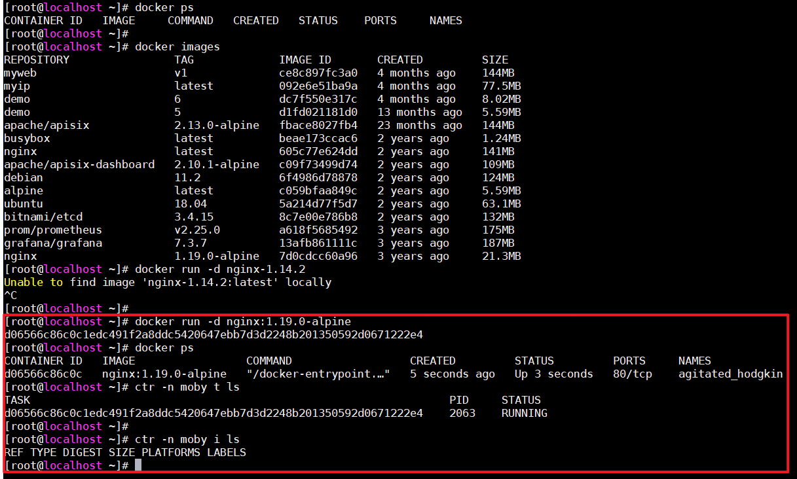

## 命令行工具Nerdctl

前面介绍了可以使用 ctr 操作管理 containerd 镜像容器，但是大家都习惯了使用 docker cli，ctr 使用起来可能还是不太顺手，为了能够让大家更好的转到 containerd 上面来，社区提供了一个新的命令行工具：nerdctl。nerdctl 是一个与 docker cli 风格兼容的 containerd 客户端工具，而且直接兼容 docker compose 的语法，这就大大提高了直接将 containerd 作为本地开发、测试或者单机容器部署使用的效率。

### 安装

同样直接在  [GitHub Release](https://github.com/containerd/nerdctl/releases) 页面（有基本的安装说明）下载对应的压缩包解压到 PATH 路径下即可：

```shell
# 如果没有安装 containerd，则可以下载 nerdctl-full-<VERSION>-linux-amd64.tar.gz 包进行安装
# Minimal (nerdctl-1.7.7-linux-amd64.tar.gz): nerdctl only
# Full (nerdctl-full-1.7.7-linux-amd64.tar.gz): Includes dependencies such as containerd, runc, and CNI
# 对于Full包，包含了众多组件，如下：
# nerdctl (full distribution)
- nerdctl: v1.7.7
- containerd: v1.7.22
- runc: v1.1.14
- CNI plugins: v1.5.1
- BuildKit: v0.15.2
- Stargz Snapshotter: v0.15.1
- imgcrypt: v1.1.11
- RootlessKit: v2.3.1
- slirp4netns: v1.3.1
- bypass4netns: v0.4.1
- fuse-overlayfs: v1.13
- containerd-fuse-overlayfs: v1.0.8
- Kubo (IPFS): v0.29.0
- Tini: v0.19.0
- buildg: v0.4.1


# tar Cxzvvf /usr/local/bin nerdctl-1.7.7-linux-amd64.tar.gz    -C /usr/local/bin表示将工作目录切换到/usr/local/bin目录
# x选项用于从归档文件中提取内容（解压缩）
# z表示处理一个.tar.gz或.tgz文件，它们是使用gzip压缩的tar归档文件
# v表示在解压缩过程中显示每个文件的处理信息，即显示解压缩过程中的详细输出
# f filename表示操作的目标是指定的归档文件。在这个例子中，目标文件是nerdctl-1.7.7-linux-amd64.tar.gz

➜  ~ wget https://github.com/containerd/nerdctl/releases/download/v0.12.1/nerdctl-0.12.1-linux-amd64.tar.gz
# tar -zxvf nerdctl-0.12.1-linux-amd64.tar.gz nerdctl  
# 从 nerdctl-0.12.1-linux-amd64.tar.gz 归档文件中提取出名为 nerdctl 的文件，并将其放在当前目录下。而其他文件将不会处理
➜  ~ mkdir -p /usr/local/containerd/bin/ && tar -zxvf nerdctl-0.12.1-linux-amd64.tar.gz nerdctl && mv nerdctl /usr/local/containerd/bin/
# 这个命令创建了一个符号链接，使可以通过/usr/local/bin/nerdctl来访问和执行实际存放在/usr/local/containerd/bin/nerdctl的nerdctl工具
➜  ~ ln -s /usr/local/containerd/bin/nerdctl /usr/local/bin/nerdctl
[root@master ~]# nerdctl version
WARN[0000] unable to determine buildctl version: exec: "buildctl": executable file not found in $PATH
Client:
 Version:       v1.7.7
 OS/Arch:       linux/amd64
 Git commit:    5882c720f4e7f358fb26b759e514b3ae9dd8ea83
 buildctl:
  Version:

Server:
 containerd:
  Version:      v1.6.10
  GitCommit:    770bd0108c32f3fb5c73ae1264f7e503fe7b2661
 runc:
  Version:      1.1.4
  GitCommit:    v1.1.4-0-g5fd4c4d1

# buildctl：这是BuildKit的客户端工具，BuildKit是一个用于构建容器镜像的高效构建器，作为 Docker 和containerd的一个组件来使用。
# nerdctl工具在执行nerdctl version命令时，无法找到并确定buildctl的版本，因为系统中没有找到buildctl可执行文件。
```

安装完成后接下来学习下 nerdctl 命令行工具的使用。

### 命令

#### Run&Exec

##### nerdctl run

和 docker run 类似可以使用 nerdctl run 命令运行容器，例如：

```shell
➜  ~ nerdctl run -d -p 80:80 --name=nginx --restart=always nginx:alpine
docker.io/library/nginx:alpine:                                                   resolved       |++++++++++++++++++++++++++++++++++++++|
index-sha256:bead42240255ae1485653a956ef41c9e458eb077fcb6dc664cbc3aa9701a05ce:    done           |++++++++++++++++++++++++++++++++++++++| manifest-sha256:ce6ca11a3fa7e0e6b44813901e3289212fc2f327ee8b1366176666e8fb470f24: done           |++++++++++++++++++++++++++++++++++++++| config-sha256:7ce0143dee376bfd2937b499a46fb110bda3c629c195b84b1cf6e19be1a9e23b:   done           |++++++++++++++++++++++++++++++++++++++| elapsed: 5.3 s                                                                    total:  3.1 Ki (606.0 B/s)                                       6e489777d2f73dda8a310cdf8da9df38353c1aa2021d3c2270b30eff1806bcf8
```

可选的参数使用和 docker run 基本一致，比如 -i、-t、--cpus、--memory 等选项，可以使用 `nerdctl run --help` 获取可使用的命令选项：

```shell
[root@master ~]# nerdctl run --help
Run a command in a new container. Optionally specify "ipfs://" or "ipns://" scheme to pull image from IPFS.

Usage: nerdctl run [flags] IMAGE [COMMAND] [ARG...]

Flags:
      --add-host strings                               Add a custom host-to-IP mapping (host:ip)
  -a, --attach strings                                 Attach STDIN, STDOUT, or STDERR
      --blkio-weight uint16                            Block IO (relative weight), between 10 and 1000, or 0 to disable (default 0)
      --cap-add strings                                Add Linux capabilities
。。。。。。
```

##### nerdctl exec

同样也可以使用 exec 命令执行容器相关命令，例如：

```shell
➜  ~ nerdctl exec -it nginx /bin/sh
/ # date
Thu Aug 19 06:43:19 UTC 2021
/ #
```


#### 容器管理

**nerdctl ps：列出容器**

使用 nerdctl ps 命令可以列出所有容器。

```shell
[root@master ~]# nerdctl ps
CONTAINER ID    IMAGE                             COMMAND                   CREATED           STATUS    PORTS                 NAMES
6e489777d2f7    docker.io/library/nginx:alpine    "/docker-entrypoint.…"    10 minutes ago    Up        0.0.0.0:80->80/tcp    nginx
```

同样可以使用 -a 选项显示所有的容器列表，默认只显示正在运行的容器，不过需要注意的是 `nerdctl ps` 命令并没有实现 docker ps 下面的 --filter、--format、--last、--size 等选项。

**nerdctl inspect：获取容器的详细信息**

```shell
[root@master ~]# nerdctl inspect nginx
[
    {
        "Id": "6e489777d2f73dda8a310cdf8da9df38353c1aa2021d3c2270b30eff1806bcf8",
        "Created": "2021-08-19T06:35:46.403464674Z",
        "Path": "/docker-entrypoint.sh",
        "Args": [
            "nginx",
            "-g",
            "daemon off;"
        ],
        "State": {
            "Status": "running",
            "Running": true,
            "Paused": false,
            "Pid": 2002,
            "ExitCode": 0,
            "FinishedAt": "0001-01-01T00:00:00Z"
        },
        "Image": "docker.io/library/nginx:alpine",
        "ResolvConfPath": "/var/lib/nerdctl/1935db59/containers/default/6e489777d2f73dda8a310cdf8da9df38353c1aa2021d3c2270b30eff1806bcf8/resolv.conf",
        "LogPath": "/var/lib/nerdctl/1935db59/containers/default/6e489777d2f73dda8a310cdf8da9df38353c1aa2021d3c2270b30eff1806bcf8/6e489777d2f73dda8a310cdf8da9df38353c1aa2021d3c2270b30eff1806bcf8-json.log",
        "Name": "nginx",
        "Driver": "overlayfs",
        "Platform": "linux",
        "AppArmorProfile": "nerdctl-default",
        "NetworkSettings": {
            "Ports": {
                "80/tcp": [
                    {
                        "HostIp": "0.0.0.0",
                        "HostPort": "80"
                    }
                ]
            },
            "GlobalIPv6Address": "",
            "GlobalIPv6PrefixLen": 0,
            "IPAddress": "10.4.0.3",
            "IPPrefixLen": 24,
            "MacAddress": "f2:b1:8e:a2:fe:18",
            "Networks": {
                "unknown-eth0": {
                    "IPAddress": "10.4.0.3",
                    "IPPrefixLen": 24,
                    "GlobalIPv6Address": "",
                    "GlobalIPv6PrefixLen": 0,
                    "MacAddress": "f2:b1:8e:a2:fe:18"
                }
            }
        }
    }
]
```

可以看到显示结果和 docker inspect 也基本一致的。

**nerdctl logs：获取容器日志**

查看容器日志是平时经常会使用到的一个功能，同样可以使用 nerdctl logs 来获取日志数据：

```

```


#### 镜像管理

**nerdctl images：镜像列表**

```shell
[root@master ~]# nerdctl images
REPOSITORY    TAG       IMAGE ID        CREATED           SIZE
alpine        latest    eb3e4e175ba6    6 days ago        5.9 MiB
nginx         alpine    bead42240255    29 minutes ago    16.0 KiB
```

需要注意的是没有实现 docker images 的一些选项，比如 --all、--digests、--filter、--format。

**nerdctl pull：拉取镜像**

```shell
[root@master ~]# nerdctl pull busybox
docker.io/library/busybox:latest:                                                 resolved       |++++++++++++++++++++++++++++++++++++++|
index-sha256:c230832bd3b0be59a6c47ed64294f9ce71e91b327957920b6929a0caa8353140:    done           |++++++++++++++++++++++++++++++++++++++|
manifest-sha256:9186e638ccc30c5d1a2efd5a2cd632f49bb5013f164f6f85c48ed6fce90fe38f: done           |++++++++++++++++++++++++++++++++++++++|
config-sha256:6fd955f66c231c1a946653170d096a28ac2b2052a02080c0b84ec082a07f7d12:   done           |++++++++++++++++++++++++++++++++++++++|
layer-sha256:2fce1e0cdfc5e77c450679c5cce031e1da81ec99eee897bec1b0faf76d51f574:    done           |++++++++++++++++++++++++++++++++++++++|
elapsed: 69.1s                                                                    total:  2.1 Mi (30.6 KiB/s)
```

**nerdctl push：推送镜像**

当然在推送镜像之前也可以使用 nerdctl login 命令登录到镜像仓库，然后再执行 push 操作。

可以使用 `nerdctl login --username xxx --password xxx` 进行登录，使用 `nerdctl logout` 可以注销退出登录。

**nerdctl tag：镜像标签**

使用 tag 命令可以为一个镜像创建一个别名镜像：

```shell
[root@master ~]# nerdctl images
REPOSITORY    TAG                  IMAGE ID        CREATED           SIZE
busybox       latest               0f354ec1728d    6 minutes ago     1.3 MiB
nginx         alpine               bead42240255    41 minutes ago    16.0 KiB
[root@master ~]# nerdctl tag nginx:alpine harbor.k8s.local/course/nginx:alpine
[root@master ~]# nerdctl images
REPOSITORY                       TAG                  IMAGE ID        CREATED           SIZE
busybox                          latest               0f354ec1728d    7 minutes ago     1.3 MiB
nginx                            alpine               bead42240255    41 minutes ago    16.0 KiB
harbor.k8s.local/course/nginx    alpine               bead42240255    2 seconds ago     16.0 KiB
```

**nerdctl save：导出镜像**

使用 save 命令可以导出镜像为一个 tar 压缩包。

```shell
[root@master ~]# nerdctl save -o busybox.tar.gz busybox:latest
[root@master ~]# ls -lh busybox.tar.gz
-rw-r--r-- 1 root root 761K Aug 19 15:19 busybox.tar.gz
```

**nerdctl rmi：删除镜像**

```shell
[root@master ~]# nerdctl rmi busybox
Untagged: docker.io/library/busybox:latest@sha256:0f354ec1728d9ff32edcd7d1b8bbdfc798277ad36120dc3dc683be44524c8b60
Deleted: sha256:5b8c72934dfc08c7d2bd707e93197550f06c0751023dabb3a045b723c5e7b373
```

**nerdctl load：导入镜像**

使用 load 命令可以将上面导出的镜像再次导入：

```shell
[root@master ~]# nerdctl load -i busybox.tar.gz
unpacking docker.io/library/busybox:latest (sha256:0f354ec1728d9ff32edcd7d1b8bbdfc798277ad36120dc3dc683be44524c8b60)...done
```

使用 -i 或 --input 选项指定需要导入的压缩包。

#### 镜像构建

镜像构建是平时非常重要的一个需求，我们知道 ctr 并没有构建镜像的命令，而现在又不使用 Docker 了，那么如何进行镜像构建了，幸运的是 nerdctl 就提供了 `nerdctl build` 这样的镜像构建命令。（其实我们很少使用nerdctl build来构建镜像，一般都使用docker来构建镜像，然后将镜像推送到镜像仓库，K8S平台直接拉取即可）

**nerdctl build：从 Dockerfile 构建镜像**

比如现在定制一个 nginx 镜像，新建一个如下所示的 Dockerfile 文件：       

```dockerfile
FROM nginx:alpine
RUN echo 'Hello Nerdctl From Containerd' > /usr/share/nginx/html/index.html
```

然后在文件所在目录执行镜像构建命令：

```shell
[root@localhost ~]# vi Dockerfile
[root@localhost ~]# cat Dockerfile
FROM nginx:alpine
RUN echo 'Hello Nerdctl From Containerd' > /usr/share/nginx/html/index.html

[root@localhost ~]#
[root@localhost ~]# nerdctl build -t nginx:nerdctl -f Dockerfile .
ERRO[0000] `buildctl` needs to be installed and `buildkitd` needs to be running, see https://github.com/moby/buildkit  error="failed to ping to host unix:///run/buildkit-default/buildkitd.sock: exec: \"buildctl\": executable file not found in $PATH\nfailed to ping to host unix:///run/buildkit/buildkitd.sock: exec: \"buildctl\": executable file not found in $PATH"
FATA[0000] no buildkit host is available, tried 2 candidates: failed to ping to host unix:///run/buildkit-default/buildkitd.sock: exec: "buildctl": executable file not found in $PATH
failed to ping to host unix:///run/buildkit/buildkitd.sock: exec: "buildctl": executable file not found in $PATH
# 还记得安装nerdctl后，通过nerdctl version 查看版本号时给出的警告吗，警告就是说没有buildctl

# 安装BuildKit之后，执行nerdctl build时出现的错误是无法拉取镜像，但是nerdctl pull可以拉取？？？
```

**BuildKit安装**

参考资料：https://juejin.cn/post/7228838667472371768

BuildKit is composed of the buildkitd daemon and the buildctl client. While the `buildctl` client is available for Linux, macOS, and Windows, the `buildkitd` daemon is only available for Linux and *Windows currently.

The `buildkitd` daemon requires the following components to be installed:

- [runc](https://github.com/opencontainers/runc) or [crun](https://github.com/containers/crun)
- [containerd](https://github.com/containerd/containerd) (if you want to use containerd worker)

使用二进制方式安装，从[BuildKit的GitHub发布页面](https://github.com/moby/buildkit/releases)下载预编译的二进制文件，然后将其复制到系统的某个目录，并确保该目录在`$PATH`中。

```shell
# 创建解压的目录
mkdir /usr/local/buildkit

# 解压到指定的目录
tar -zxvf  buildkit-v0.15.2.linux-amd64.tar.gz -C /usr/local/buildkit

# 修改PATH环境变量
echo 'export PATH=/usr/local/buildkit/bin:$PATH' >> /etc/profile  # 注意这里的echo 要使用单引号，单引号会原样输出，双引号会解析变量
source /etc/profile  # 使刚才配置生效

# 创建buildkitd自启动服务
cat <<EOF > /usr/lib/systemd/system/buildkitd.service
[Unit]
Description=buildkitd
After=network.target

[Service]
ExecStart=/usr/local/buildkit/bin/buildkitd  --oci-worker=false --containerd-worker=true

[Install]
WantedBy=multi-user.target
EOF

# 重新加载Unit file
systemctl daemon-reload
# 启动服务
systemctl start buildkitd
# 开机自启动
systemctl enable buildkitd
```

**使用buildctl 打包镜像**

编写一个Dockerfile

```dockerfile
FROM alpine
RUN echo "built with BuildKit!" >  file
CMD ["/bin/sh"]
```

使用上面的Dockerfile构建镜像

```shell
# 将输出导出到本地tar包
# --local 用于将本地文件暴露给builder， context为构建的上下文环境，dockerfile为dockerfile文件位置
# --frontend 是运行在BuildKit内部的组件，并将构建的定义转为LLB，同时frontend也是BuildKit镜像repo源
buildctl build \
--frontend=dockerfile.v0 \
--local context=. \
--local dockerfile=. \
--output type=docker,name=myimage,dest=out.tar

# 可以看到当前目录生成了out.tar
[root@master ~]# ls out.tar 
out.tar

# 将out.tar导入到containerd中的某个命名空间下
ctr -n test image import out.tar

# 查看镜像
[root@master ~]# ctr -n test image ls
REF                              TYPE                                                 DIGEST                                                                  SIZE    PLATFORMS   LABELS 
docker.io/library/myimage:latest application/vnd.docker.distribution.manifest.v2+json sha256:27817447c583499d123a6a84880f04219bc201042b2ca723587a769151e2dece 3.2 MiB linux/amd64 -
```

对于构建镜像时我本地测试无法拉取基础镜像，但是nerdctl pull可以拉取，这个问题目前个人无法解决，先暂时放置。