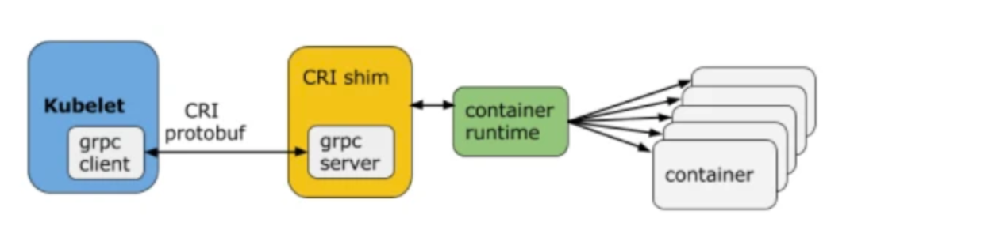
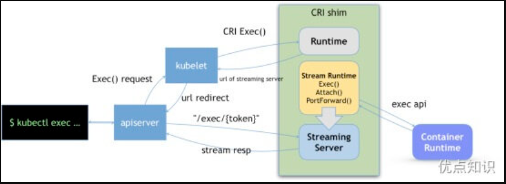
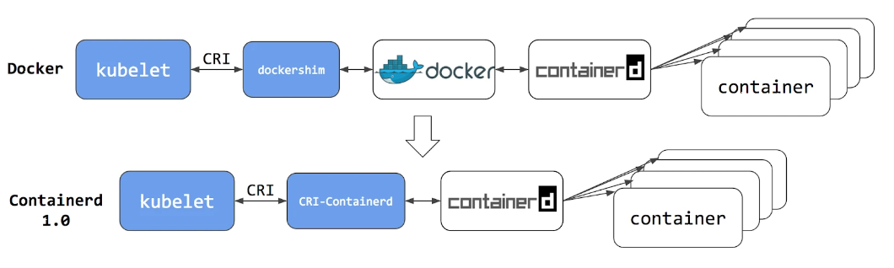
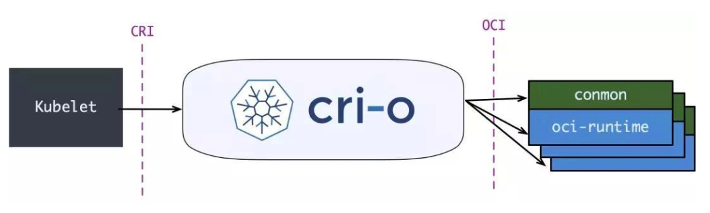
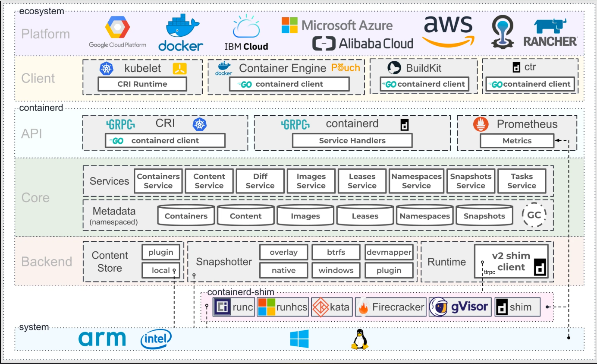
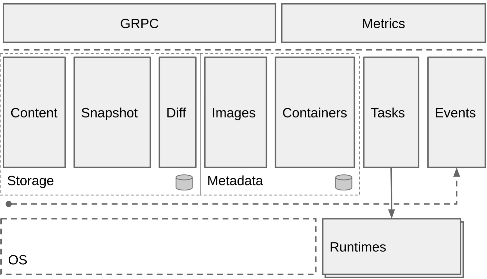

# 容器运行时介绍

在学习 Containerd 之前我们有必要对 Docker 的发展历史做一个简单的回顾。

## 容器运行时分类

当然最火大家最熟悉的容器运行时非 Docker 莫属了，Docker 凭借一己之力大大推进了容器技术的普及。当然随着容器生态的不断发展，业界也慢慢出现了其他的运行时，比如 Containerd、rkt、kata container、cri-o 等等，这些运行时提供的功能不尽相同，有些只有容器运行的功能，有些除运行容器之外还提供了容器镜像的管理功能。根据容器运行时提供的功能，我们可以将容器运行时分为低层运行时和高层运行时。

### 低层运行时

低层运行时主要负责容器的基本运行，它们通常需要配合高层运行时来提供更完整的容器管理功能。低层运行时一般遵循 Open Container Initiative (OCI) 规范。

1. **runc**：最典型的运行时，基于 Linux Namespace 和 Cgroups 技术实现。它是一个 CLI 工具，用于创建和运行符合 OCI 规范的容器。`runc` 是 Docker 和 containerd 等高层运行时的核心组件。
2. **crun**：类似于 `runc`，但具有更快的启动时间和更低的资源开销，特别是在处理大量小容器时表现出色。
3. **runv**：基于虚拟机管理程序的运行时，通过虚拟化 guest kernel，将容器和主机隔离开来，使得其边界更加清晰，代表实现是 Kata Container 和 Firecracker。
4. **Kata Containers**：它结合了轻量级虚拟机（如 KVM）和容器的优势，提供了更强的隔离性和安全性。Kata Containers 也是一个低层运行时，但它的隔离方式更接近虚拟机。
5. **runsc**：runc + safety，通过拦截应用程序的所有系统调用，提供安全隔离的轻量级容器运行时沙箱，代表实现是谷歌的 gVisor。

### 高层运行时

高层运行时不仅负责容器的创建和运行，还提供了容器镜像的管理、网络配置、卷管理等更高层次的功能。

1. **Docker**：最广为人知的容器运行时，提供了从镜像构建、容器运行到网络和存储管理的完整解决方案。Docker 背后的核心组件包括 `containerd` 和 `runc`。

2. **containerd**：最初是 Docker 的一部分，现在是一个独立的项目，并且被 Kubernetes 作为默认的容器运行时之一。`containerd` 提供了包含镜像管理、容器运行和存储等功能的完整容器生命周期管理。

3. **CRI-O**：专门为 Kubernetes 而设计的容器运行时，符合 Kubernetes 的 CRI（Container Runtime Interface）标准。CRI-O 使用 `runc` 或 `crun` 作为低层运行时。

4. **podman**：一个无守护进程的容器引擎，支持创建和管理 Open Containers Initiative (OCI) 容器和容器镜像。Podman 可以运行在 rootless 模式下，使非特权用户也可以创建和运行容器。

5. **LXC/LXD**：LXC 是一个低层次的容器技术，LXD 是更高层的管理工具，提供了类似虚拟机的体验。LXD 可以管理容器、存储池和网络等。

### 总结

容器技术的发展使得不同的运行时具备了不同的特性和适用场景。高层运行时负责更全面的容器管理，而低层运行时则专注于容器的运行和隔离。根据具体需求，选择合适的运行时组合可以使容器化应用更高效、安全和灵活。

## Docker
从 Docker 1.11 版本开始，Docker 容器运行就不是简单通过 Docker Daemon 来启动了，而是通过集成 containerd、runc 等多个组件来完成的。虽然 Docker Daemon 守护进程模块在不停的重构，但是基本功能和定位没有太大的变化，一直都是 CS 架构，守护进程负责和 Docker Client 端交互，并管理 Docker 镜像和容器。

现在的架构中组件 containerd 就会负责集群节点上容器的生命周期管理，并向上为 Docker Daemon 提供 gRPC 接口。


当我们要创建一个容器的时候，现在 Docker Daemon 并不能直接帮我们创建了，而是请求 containerd 来创建一个容器，containerd 收到请求后，也并不会直接去操作容器，而是创建一个叫做 containerd-shim 的进程，让这个进程去操作容器，容器进程是需要一个父进程来做状态收集、维持 stdin 、 fd 打开等工作的，假如这个父进程就是 containerd，那如果 containerd 挂掉的话，整个宿主机上所有的容器都得退出了，而引入 containerd-shim 这个垫片就可以来规避这个问题了。

然后创建容器需要做一些 namespaces 和 cgroups 的配置，以及挂载 root 文件系统等操作，这些操作其实已经有了标准的规范，那就是 OCI（开放容器标准），runc 就是它的一个参考实现（Docker 被逼无奈将 libcontainer 捐献出来改名为 runc 的），这个标准其实就是一个文档，主要规定了容器镜像的结构、以及容器需要接收哪些操作指令，比如 create、start、stop、delete 等这些命令。runc 就可以按照这个 OCI 文档来创建一个符合规范的容器，既然是标准肯定就有其他 OCI 实现，比如 Kata、gVisor 这些容器运行时都是符合 OCI 标准的。

所以真正启动容器是通过 containerd-shim 去调用 runc 来启动容器的，runc 启动完容器后本身会直接退出，containerd-shim 则会成为容器进程的父进程，负责收集容器进程的状态，上报给 containerd，并在容器中 pid 为 1 的进程退出后接管容器中的子进程进行清理，确保不会出现僵尸进程。

而 Docker 将容器操作都迁移到 containerd 中去是因为当前做 Swarm，想要进军 PaaS 市场，做了这个架构切分，让 Docker Daemon 专门去负责上层的封装编排，当然后面的结果我们知道 Swarm 在 Kubernetes 面前是惨败，然后 Docker 公司就把 containerd 项目捐献给了 CNCF 基金会，这个也是现在的 Docker 架构。

## CRI
我们知道 Kubernetes 提供了一个 CRI 的容器运行时接口，那么这个 CRI 到底是什么呢？这个其实也和 Docker 的发展密切相关的。

在 Kubernetes 早期的时候，当时 Docker 实在是太火了，Kubernetes 当然会先选择支持 Docker，而且是通过硬编码的方式直接调用 Docker API，后面随着 Docker 的不断发展以及 Google 的主导，出现了更多容器运行时，Kubernetes 为了支持更多更精简的容器运行时，Google 就和红帽主导推出了 CRI 标准，用于将 Kubernetes 平台和特定的容器运行时（当然主要是为了干掉 Docker）解耦。

CRI（Container Runtime Interface 容器运行时接口）本质上就是 Kubernetes 定义的一组与容器运行时进行交互的接口，所以只要实现了这套接口的容器运行时都可以对接到 Kubernetes 平台上来。

不过 Kubernetes 推出 CRI 这套标准的时候还没有现在的统治地位，所以有一些容器运行时可能不会自身就去实现 CRI 接口，于是就有了 shim（垫片）， 一个 shim 的职责就是作为适配器将各种容器运行时本身的接口适配到 Kubernetes 的 CRI 接口上，其中 dockershim 就是 Kubernetes 对接 Docker 到 CRI 接口上的一个垫片实现。


从上图可以看到，CRI 主要有 gRPC client、gRPC Server 和具体的容器运行时三个组件。其中 Kubelet 作为 gRPC 的客户端来调用 CRI 接口，CRI shim 作为 gRPC 服务端来响应 CRI 请求，负责将 CRI 请求的内容转换为具体的容器运行时 API，在 kubelet 和运行时之间充当翻译的角色。

具体的容器创建逻辑是，Kubernetes 在通过调度指定一个具体的节点运行 Pod，该节点的 Kubelet 在接到 Pod 创建请求后，调用一个叫作 GenericRuntime 的通用组件来发起创建 Pod 的 CRI 请求给 CRI shim；CRI shim 监听一个端口来响应 Kubelet，在收到 CRI 请求后，将其转化为具体的容器运行时指令，并调用相应的容器运行时来创建 Pod。

### CRI规范
所以任何容器运行时想要接入 Kubernetes，都需要实现一个自己的 CRI shim，来实现 CRI 接口规范。那么 CRI 有哪些接口需要实现呢？

最新的 CRI 定义位于 Kubernetes 源码包 staging/src/k8s.io/cri-api/pkg/apis/runtime/v1/api.proto，主要定义了两类接口：ImageService 和 RuntimeService，比之前的定义多了不少方法。

- ImageService 主要定义拉取镜像、查看和删除镜像等操作。
- RuntimeService 定义了容器相关的操作，包括管理容器的生命周期，以及与容器交互的调用（exec/attach/port-forward）等操作。


ImageService 的操作比较简单，就是拉取、删除、查看镜像状态及获取镜像列表这几个操作，下面我们着重介绍下 RuntimeService。

从接口中可以看出 RuntimeService 除了有 container 的管理接口外，还包含 PodSandbox 相关的管理接口和 exec、attach 等与容器交互的接口。

PodSandbox 这个概念对应的是 Kubernetes 里的 Pod，它描述了 Kubernetes 里的 Pod 与容器运行相关的属性或者信息，如 HostName、CgroupParent 等，设计这个的初衷是因为 Pod 里所有容器的资源和环境信息是共享的，但是不同的容器运行时实现共享的机制不同，如 Docker 中 Pod 会是一个 Linux 命名空间，各容器网络信息的共享通过创建 pause 容器的方法来实现，而 Kata Containers 则直接将 Pod 具化为一个轻量级的虚拟机；将这个逻辑抽象为 PodSandbox 接口，可以让不同的容器运行时在 Pod 实现上自由发挥，自己解释和实现 Pod 的逻辑。

Exec、Attach 和 PortForward 是三个和容器进行数据交互的接口，由于交互数据需要长链接来传输，这些接口被称为 Streaming API。CRI shim 依赖一套独立的 Streaming Server 机制来实现客户端与容器的交互需求。长连接比较消耗网络资源，为了避免因长连接给 kubelet 节点带来网络流量瓶颈，CRI 要求容器运行时启动一个单独的流服务器，让客户端直接与流服务器进行连同交互。



上图所示，kubectl exec 命令实现过程如下：
- 客户端发送 kubectl exec 命令给 apiserver；
- apiserver 调用 kubelet 的 Exec API；
- kubelet 调用 CRI 的 Exec 接口（具体的执行者为实现该接口的 CRI Shim ）；
- CRI Shim 向 kubelet 返回 Streaming Server 的地址和端口；
- kubelet 以 redirect 的方式返回给 apiserver
- apiserver 通过重定向来向 Streaming Server 发起真正的 /exec/{token} 请求，与它建立长连接，完成 Exec 的请求和响应。

kubelet 在引入 CRI 之后，主要的架构如下图所示，其中 Generic Runtime Manager 负责发送容器创建、删除等 CRI 请求，Container Runtime Interface(CRI) 负责定义 CRI 接口规范，具体的 CRI 实现可分为两种：kubelet 内置的 dockershim 和远端的 CRI shim。其中 dockershim 是 Kubernetes 自己实现的适配 Docker 接口的 CRI 接口实现，主要用来将 CRI 请求里的内容组装成 Docker API 请求发给 Docker Daemon；远端的 CRI shim 主要是用来匹配其他的容器运行时工具到 kubelet。

CRI shim 主要负责响应 kubelet 发送的 CRI 请求，并将请求转化为具体的运行时命令发送给具体的运行时（如 runc、kata 等）；Stream Server 用来响应客户端与容器的交互，除此之外，CRI 还提供接入 CNI 的能力以实现 Pod 网络的共享，常用的远端 CRI 的实现有 CRI-Containerd、CRI-O 等。


## 为何抛弃Docker
从上图可以看出，Kubernetes 把 dockershim 内置在了官方的代码库中，将 Docker 设计为 Kubernetes 默认的容器运行时工具。但是官方在 Kubernetes 1.20 版本的更新日志中声明已经废用对 Docker 的支持，在 Kubernetes 1.24 版本中，dockershim 代码也如期被删除。

那 Kubernetes 为何要抛弃 Docker 呢？这和 Docker 的整体架构也是有关系的，Docker 最初是一个单体引擎，主要负责容器镜像的制作、上传、拉取及容器的运行及管理。

随着容器技术的繁荣发展，为了促进容器技术相关的规范生成和 Docker 自身项目的发展，Docker 将单体引擎拆分为三部分，分别为 runc、containerd 和 dockerd，其中 runc 主要负责容器的运行和生命周期的管理、 containerd 主要负责容器镜像的下载和解压等镜像管理功能、dockerd 主要负责提供镜像构建、上传等功能同时提供容器存储和网络的映射功能，同时也是 Docker 服务器端的守护进程，用来响应 Docker 客户端发来的各种容器、镜像管理的任务。

Docker 公司将 runc 捐献给了 OCI，将 containerd 捐献给了 CNCF，剩下的 dockerd 作为 Docker 运行时由 Docker 公司自己维护。

如前所述，Kubernetes 在引入 CRI 之后，kubelet 需要通过 CRI shim 去调用具体的容器运行时工具，不过这里同样也有一个例外，那就是 Docker，由于 Docker 当时的江湖地位很高，Kubernetes 是直接内置了 dockershim 在 kubelet 中的，所以如果你使用的是 Docker 这种容器运行时的话是不需要单独去安装配置适配器之类的，当然这个举动似乎也麻痹了 Docker 公司。


现在如果我们使用的是 Docker 的话，当我们在 Kubernetes 中创建一个 Pod 的时候，首先就是 kubelet 通过 CRI 接口调用 dockershim，请求创建一个容器，kubelet 可以视作一个简单的 CRI Client，而 dockershim 就是接收请求的 Server，不过他们都是在 kubelet 内置的。

dockershim 收到请求后，转化成 Docker Daemon 能识别的请求，发到 Docker Daemon 上请求创建一个容器，请求到了 Docker Daemon 后续就是 Docker 创建容器的流程了，去调用 containerd，然后创建 containerd-shim 进程，通过该进程去调用 runc 去真正创建容器。

其实我们仔细观察也不难发现使用 Docker 的话其实是调用链比较长的，真正容器相关的操作其实 containerd 就完全足够了，Docker 太过于复杂笨重了，当然 Docker 深受欢迎的很大一个原因就是提供了很多对用户操作比较友好的功能，但是对于 Kubernetes 来说压根不需要这些功能，因为都是通过接口去操作容器的，所以自然也就可以将容器运行时切换到 containerd 来。



切换到 containerd 可以消除掉中间环节，操作体验也和以前一样，但是由于直接用容器运行时调度容器， 因此你以前用来检查这些容器的 Docker 工具就不能使用了。

你不能再使用 docker ps 或 docker inspect 命令来获取容器信息。由于不能列出容器，因此也不能获取日志、停止容器，甚至不能通过 docker exec 在容器中执行命令。当然我们仍然可以下载镜像，或者用 docker build 命令构建镜像，但用 Docker 构建、下载的镜像，对于容器运行时和 Kubernetes，均不可见。为了在 Kubernetes 中使用，需要把镜像推送到镜像仓库中去。

从上图可以看出在 containerd 1.0 中，对 CRI 的适配是通过一个单独的 CRI-Containerd 进程来完成的，这是因为最开始 containerd 还会去适配其他的系统（比如 swarm），所以没有直接实现 CRI，所以这个对接工作就交给 CRI-Containerd 这个 shim 了。

然后到了 containerd 1.1 版本后就去掉了 CRI-Containerd 这个 shim，直接把适配逻辑作为插件的方式集成到了 containerd 主进程中，现在这样的调用就更加简洁了。


与此同时 Kubernetes 社区也做了一个专门用于 Kubernetes 的 CRI 运行时 CRI-O，直接兼容 CRI 和 OCI 规范。



这个方案和 containerd 的方案显然比默认的 dockershim 简洁很多，不过由于大部分用户都比较习惯使用 Docker，所以大家还是更喜欢使用 dockershim 方案。

但是随着 CRI 方案的发展，以及其他容器运行时对 CRI 的支持越来越完善，Kubernetes 社区在 2020 年 7 月份就开始着手移除 dockershim 方案了：https://github.com/kubernetes/enhancements/tree/master/keps/sig-node/2221-remove-dockershim，现在的移除计划是在 1.20 版本中将 kubelet 中内置的 dockershim 代码分离，将内置的 dockershim 标记为维护模式，当然这个时候仍然还可以使用 dockershim，目标是在 1.23/1.24 版本发布没有 dockershim 的版本（代码还在，但是要支持开箱即用的 docker 需要自己构建 kubelet，会在某个宽限期过后从 kubelet 中删除内置的 dockershim 代码）。

那么这是否就意味这 Kubernetes 不再支持 Docker 了呢？当然不是的，这只是废弃了内置的 dockershim 功能而已，Docker 和其他容器运行时将一视同仁，不会单独对待内置支持，如果我们还想直接使用 Docker 这种容器运行时应该怎么办呢？可以将 dockershim 的功能单独提取出来独立维护一个 cri-dockerd 即可，就类似于 containerd 1.0 版本中提供的 CRI-Containerd，当然还有一种办法就是 Docker 官方社区将 CRI 接口内置到 Dockerd 中去实现。

但是我们也清楚 Dockerd 也是去直接调用的 Containerd，而 containerd 1.1 版本后就内置实现了 CRI，所以 Docker 也没必要再去单独实现 CRI 了，当 Kubernetes 不再内置支持开箱即用的 Docker 以后，最好的方式当然也就是直接使用 Containerd 这种容器运行时，而且该容器运行时也已经经过了生产环境实践的，接下来我们就来学习下 Containerd 的使用。

# Containerd的使用

我们知道很早之前的 Docker Engine 中就有了 containerd，只不过现在是将 containerd 从 Docker Engine 里分离出来，作为一个独立的开源项目，目标是提供一个更加开放、稳定的容器运行基础设施。分离出来的 containerd 将具有更多的功能，涵盖整个容器运行时管理的所有需求，提供更强大的支持。

containerd 是一个工业级标准的容器运行时，它强调简单性、健壮性和可移植性，containerd 可以负责干下面这些事情：

- 管理容器的生命周期（从创建容器到销毁容器）
- 拉取/推送容器镜像
- 存储管理（管理镜像及容器数据的存储）
- 调用 runc 运行容器（与 runc 等容器运行时交互）
- 管理容器网络接口及网络

## 架构

containerd 作为守护程序，它管理其主机系统完整的容器生命周期，从镜像传输和存储到容器执行和监测，再到底层存储到网络附件等等。



上图是 containerd 官方提供的架构图，可以看出 containerd 采用的也是 C/S 架构，服务端通过 unix domain socket 暴露低层的 gRPC API 接口出去，客户端通过这些 API 管理节点上的容器，每个 containerd 只负责一台机器，Pull 镜像、对容器的操作（启动、停止等）、网络、存储都是由 containerd 完成。具体运行容器由 runc 负责，实际上只要是符合 OCI 规范的容器都可以支持。

为了解耦，containerd 将系统划分成了不同的组件，每个组件都由一个或多个模块协作完成（Core 部分），每一种类型的模块都以插件的形式集成到 Containerd 中，而且插件之间是相互依赖的，例如，上图中的每一个长虚线的方框都表示一种类型的插件，包括 Service Plugin、Metadata Plugin、GC Plugin、Runtime Plugin 等，其中 Service Plugin 又会依赖 Metadata Plugin、GC Plugin 和 Runtime Plugin。每一个小方框都表示一个细分的插件，例如 Metadata Plugin 依赖 Containers Plugin、Content Plugin 等。比如:

- Content Plugin: 提供对镜像中可寻址内容的访问，所有不可变的内容都被存储在这里。
- Snapshot Plugin: 用来管理容器镜像的文件系统快照，镜像中的每一层都会被解压成文件系统快照，类似于 Docker 中的 graphdriver。

总体来看 containerd 可以分为三个大块：Storage、Metadata 和 Runtime。



## 安装

这里我使用的系统是 CentOS 7.6 (可通过`lsb_release -a`命令查看)，首先需要安装 seccomp 依赖：

```shell
➜  ~ rpm -qa |grep libseccomp
libseccomp-2.3.1-4.el7.x86_64
# 如果没有安装 libseccomp 包则执行下面的命令安装依赖
➜  ~ yum install wget -y
➜  ~ wget http://mirror.centos.org/centos/7/os/x86_64/Packages/libseccomp-2.3.1-4.el7.x86_64.rpm
➜  ~ yum install libseccomp-2.3.1-4.el7.x86_64.rpm -y
```

由于 containerd 需要调用 runc，所以也需要先安装 runc，不过 containerd 提供了一个包含相关依赖的压缩包 `cri-containerd-cni-${VERSION}.${OS}-${ARCH}.tar.gz`，可以直接使用这个包来进行安装。首先从 [release 页面](https://github.com/containerd/containerd/releases)下载最新版本的压缩包，当前为 1.5.5 版本（最新的 1.5.7 版本在 CentOS7 下面执行 runc 会报错：https://github.com/containerd/containerd/issues/6091）：

```shell
~ wget https://github.com/containerd/containerd/releases/download/v1.5.5/cri-containerd-cni-1.5.5-linux-amd64.tar.gz
# 如果有限制，也可以替换成下面的 URL 加速下载，我测试的时候该url已经无法访问了，可以在window下载好拷贝到linux中
# wget https://download.fastgit.org/containerd/containerd/releases/download/v1.5.5/cri-containerd-cni-1.5.5-linux-amd64.tar.gz

# https://github.com/containerd/containerd/releases 中主要包含下面三类
containerd-1.7.22-linux-amd64.tar.gz
cri-containerd-1.7.22-linux-amd64.tar.gz # 这是专门为 Kubernetes 集成设计的 containerd 安装包，包含了符合 Container Runtime Interface (CRI) 的功能模块。这意味着它可以更好地与 Kubernetes 一起工作，通过 CRI 接口与 Kubernetes 进行通信。
cri-containerd-cni-1.7.22-linux-amd64.tar.gz # 这个安装包除了包含 cri-containerd 的所有功能之外，还包括了 CNI（Container Network Interface）插件。这使得它更适合在 Kubernetes 集群中使用，因为它提供了网络插件，能够更方便地管理容器的网络设置。

```

直接将压缩包解压到系统的各个目录中：

```shell
# -C /: 这个选项告诉 tar 程序在解压缩之前先切换到根目录 /。这意味着所有解压缩出来的文件和目录将会被放置在根目录下
tar -C / -xzf cri-containerd-cni-1.5.5-linux-amd64.tar.gz
```

当然要记得将 `/usr/local/bin` 和 `/usr/local/sbin` 追加到 `~/.bashrc` 文件的 PATH 环境变量中：

```shell
# 使用 export 命令直接在命令行中设置的环境变量只对当前会话有效，新打开的终端会话不会继承这些变化。
export PATH=$PATH:/usr/local/bin:/usr/local/sbin

# 永久修改
echo 'export PATH="$PATH:/usr/local/bin:/usr/local/sbin"' >> ~/.bashrc
```

然后执行下面的命令使其立即生效：

```shell
source ~/.bashrc
```

containerd 的默认配置文件为 `/etc/containerd/config.toml`，可以通过如下所示的命令生成一个默认的配置：

```shell
mkdir -p /etc/containerd
containerd config default > /etc/containerd/config.toml
```

由于上面下载的 containerd 压缩包中包含一个 `etc/systemd/system/containerd.service` 的文件，这样我们就可以通过 systemd 来配置 containerd 作为守护进程运行了，内容如下所示： 

```shell
[root@master ~]# cat /etc/systemd/system/containerd.service
# Copyright The containerd Authors.
#
# Licensed under the Apache License, Version 2.0 (the "License");
# you may not use this file except in compliance with the License.
# You may obtain a copy of the License at
#
#     http://www.apache.org/licenses/LICENSE-2.0
#
# Unless required by applicable law or agreed to in writing, software
# distributed under the License is distributed on an "AS IS" BASIS,
# WITHOUT WARRANTIES OR CONDITIONS OF ANY KIND, either express or implied.
# See the License for the specific language governing permissions and
# limitations under the License.

[Unit]
Description=containerd container runtime
Documentation=https://containerd.io
After=network.target local-fs.target

[Service]
ExecStartPre=-/sbin/modprobe overlay
ExecStart=/usr/local/bin/containerd

Type=notify
Delegate=yes
KillMode=process
Restart=always
RestartSec=5
# Having non-zero Limit*s causes performance problems due to accounting overhead
# in the kernel. We recommend using cgroups to do container-local accounting.
LimitNPROC=infinity
LimitCORE=infinity
LimitNOFILE=infinity
# Comment TasksMax if your systemd version does not supports it.
# Only systemd 226 and above support this version.
TasksMax=infinity
OOMScoreAdjust=-999

[Install]
WantedBy=multi-user.target
```

这里有两个重要的参数：

- Delegate: 这个选项允许 containerd 以及运行时自己管理自己创建容器的 cgroups。如果不设置这个选项，systemd 就会将进程移到自己的 cgroups 中，从而导致 containerd 无法正确获取容器的资源使用情况。

- KillMode: 是 systemd 服务单元文件中的一个配置选项，它定义了当服务停止时如何处理与该服务相关联的进程。以下是 KillMode 可以设置的几个值及其含义：

- - control-group 或 cgroup（默认值）: 当主进程被终止时，systemd 会尝试杀死所有属于服务的 cgroup 的进程。也就是说，它会杀死该服务启动的所有子进程。
  - process：只有服务的主进程会被杀死。与服务关联的其他进程将不会被 systemd 直接终止。
  - mixed：主进程会收到 SIGTERM 信号，而 cgroup 中的其他进程会收到 SIGKILL 信号。这是介于 control-group 和 process 之间的一种方式，对主进程更为温和，但对其他进程则立即强制终止。
  - none：systemd 不会尝试杀死任何进程。服务的停止责任完全交由服务本身来处理。

我们需要将 KillMode 的值设置为 process，这样可以确保升级或重启 containerd 时不杀死现有的容器。

现在就可以启动 containerd 了，直接执行下面的命令即可：

```shell
systemctl enable containerd --now
systemctl status containerd
```

启动完成后就可以使用 containerd 的本地 CLI 工具 ctr 了，比如查看版本：

```shell
[root@master ~]# ctr version
Client:
  Version:  v1.6.10
  Revision: 770bd0108c32f3fb5c73ae1264f7e503fe7b2661
  Go version: go1.18.8

Server:
  Version:  v1.6.10
  Revision: 770bd0108c32f3fb5c73ae1264f7e503fe7b2661
  UUID: d620def4-303d-4303-88e1-4d95abc1706c
```


## 配置

我们首先来查看下上面默认生成的配置文件 `/etc/containerd/config.toml`：

```toml
disabled_plugins = []
imports = []
oom_score = 0
plugin_dir = ""
required_plugins = []
root = "/var/lib/containerd"
state = "/run/containerd"
version = 2

[cgroup]
  path = ""

[debug]
  address = ""
  format = ""
  gid = 0
  level = ""
  uid = 0

[grpc]
  address = "/run/containerd/containerd.sock"
  gid = 0
  max_recv_message_size = 16777216
  max_send_message_size = 16777216
  tcp_address = ""
  tcp_tls_cert = ""
  tcp_tls_key = ""
  uid = 0

[metrics]
  address = ""
  grpc_histogram = false

[plugins]

  [plugins."io.containerd.gc.v1.scheduler"]
    deletion_threshold = 0
    mutation_threshold = 100
    pause_threshold = 0.02
    schedule_delay = "0s"
    startup_delay = "100ms"

  [plugins."io.containerd.grpc.v1.cri"]
    disable_apparmor = false
    disable_cgroup = false
    disable_hugetlb_controller = true
    disable_proc_mount = false
    disable_tcp_service = true
    enable_selinux = false
    enable_tls_streaming = false
    ignore_image_defined_volumes = false
    max_concurrent_downloads = 3
    max_container_log_line_size = 16384
    netns_mounts_under_state_dir = false
    restrict_oom_score_adj = false
    sandbox_image = "k8s.gcr.io/pause:3.5"
    selinux_category_range = 1024
    stats_collect_period = 10
    stream_idle_timeout = "4h0m0s"
    stream_server_address = "127.0.0.1"
    stream_server_port = "0"
    systemd_cgroup = false
    tolerate_missing_hugetlb_controller = true
    unset_seccomp_profile = ""

    [plugins."io.containerd.grpc.v1.cri".cni]
      bin_dir = "/opt/cni/bin"
      conf_dir = "/etc/cni/net.d"
      conf_template = ""
      max_conf_num = 1

    [plugins."io.containerd.grpc.v1.cri".containerd]
      default_runtime_name = "runc"
      disable_snapshot_annotations = true
      discard_unpacked_layers = false
      no_pivot = false
      snapshotter = "overlayfs"

      [plugins."io.containerd.grpc.v1.cri".containerd.default_runtime]
        base_runtime_spec = ""
        container_annotations = []
        pod_annotations = []
        privileged_without_host_devices = false
        runtime_engine = ""
        runtime_root = ""
        runtime_type = ""

        [plugins."io.containerd.grpc.v1.cri".containerd.default_runtime.options]

      [plugins."io.containerd.grpc.v1.cri".containerd.runtimes]

        [plugins."io.containerd.grpc.v1.cri".containerd.runtimes.runc]
          base_runtime_spec = ""
          container_annotations = []
          pod_annotations = []
          privileged_without_host_devices = false
          runtime_engine = ""
          runtime_root = ""
          runtime_type = "io.containerd.runc.v2"

          [plugins."io.containerd.grpc.v1.cri".containerd.runtimes.runc.options]
            BinaryName = ""
            CriuImagePath = ""
            CriuPath = ""
            CriuWorkPath = ""
            IoGid = 0
            IoUid = 0
            NoNewKeyring = false
            NoPivotRoot = false
            Root = ""
            ShimCgroup = ""
            SystemdCgroup = false

      [plugins."io.containerd.grpc.v1.cri".containerd.untrusted_workload_runtime]
        base_runtime_spec = ""
        container_annotations = []
        pod_annotations = []
        privileged_without_host_devices = false
        runtime_engine = ""
        runtime_root = ""
        runtime_type = ""

        [plugins."io.containerd.grpc.v1.cri".containerd.untrusted_workload_runtime.options]

    [plugins."io.containerd.grpc.v1.cri".image_decryption]
      key_model = "node"

    [plugins."io.containerd.grpc.v1.cri".registry]
      config_path = ""

      [plugins."io.containerd.grpc.v1.cri".registry.auths]

      [plugins."io.containerd.grpc.v1.cri".registry.configs]

      [plugins."io.containerd.grpc.v1.cri".registry.headers]

      [plugins."io.containerd.grpc.v1.cri".registry.mirrors]

    [plugins."io.containerd.grpc.v1.cri".x509_key_pair_streaming]
      tls_cert_file = ""
      tls_key_file = ""

  [plugins."io.containerd.internal.v1.opt"]
    path = "/opt/containerd"

  [plugins."io.containerd.internal.v1.restart"]
    interval = "10s"

  [plugins."io.containerd.metadata.v1.bolt"]
    content_sharing_policy = "shared"

  [plugins."io.containerd.monitor.v1.cgroups"]
    no_prometheus = false

  [plugins."io.containerd.runtime.v1.linux"]
    no_shim = false
    runtime = "runc"
    runtime_root = ""
    shim = "containerd-shim"
    shim_debug = false

  [plugins."io.containerd.runtime.v2.task"]
    platforms = ["linux/amd64"]

  [plugins."io.containerd.service.v1.diff-service"]
    default = ["walking"]

  [plugins."io.containerd.snapshotter.v1.aufs"]
    root_path = ""

  [plugins."io.containerd.snapshotter.v1.btrfs"]
    root_path = ""

  [plugins."io.containerd.snapshotter.v1.devmapper"]
    async_remove = false
    base_image_size = ""
    pool_name = ""
    root_path = ""

  [plugins."io.containerd.snapshotter.v1.native"]
    root_path = ""

  [plugins."io.containerd.snapshotter.v1.overlayfs"]
    root_path = ""

  [plugins."io.containerd.snapshotter.v1.zfs"]
    root_path = ""

[proxy_plugins]

[stream_processors]

  [stream_processors."io.containerd.ocicrypt.decoder.v1.tar"]
    accepts = ["application/vnd.oci.image.layer.v1.tar+encrypted"]
    args = ["--decryption-keys-path", "/etc/containerd/ocicrypt/keys"]
    env = ["OCICRYPT_KEYPROVIDER_CONFIG=/etc/containerd/ocicrypt/ocicrypt_keyprovider.conf"]
    path = "ctd-decoder"
    returns = "application/vnd.oci.image.layer.v1.tar"

  [stream_processors."io.containerd.ocicrypt.decoder.v1.tar.gzip"]
    accepts = ["application/vnd.oci.image.layer.v1.tar+gzip+encrypted"]
    args = ["--decryption-keys-path", "/etc/containerd/ocicrypt/keys"]
    env = ["OCICRYPT_KEYPROVIDER_CONFIG=/etc/containerd/ocicrypt/ocicrypt_keyprovider.conf"]
    path = "ctd-decoder"
    returns = "application/vnd.oci.image.layer.v1.tar+gzip"

[timeouts]
  "io.containerd.timeout.shim.cleanup" = "5s"
  "io.containerd.timeout.shim.load" = "5s"
  "io.containerd.timeout.shim.shutdown" = "3s"
  "io.containerd.timeout.task.state" = "2s"

[ttrpc]
  address = ""
  gid = 0
  uid = 0
```

这个配置文件比较复杂，可以将重点放在 plugins 配置上面，仔细观察可以发现每一个顶级配置块的命名都是 `plugins."io.containerd.xxx.vx.xxx"` 这种形式，每一个顶级配置块都表示一个插件，其中 `io.containerd.xxx.vx` 表示插件的类型，vx 后面的 xxx 表示插件的 ID，我们可以通过 ctr 查看插件列表：

```shell
[root@master containerd]# ctr plugin ls
TYPE                                  ID                       PLATFORMS      STATUS
io.containerd.content.v1              content                  -              ok
io.containerd.snapshotter.v1          aufs                     linux/amd64    skip
io.containerd.snapshotter.v1          btrfs                    linux/amd64    skip
io.containerd.snapshotter.v1          devmapper                linux/amd64    error
io.containerd.snapshotter.v1          native                   linux/amd64    ok
io.containerd.snapshotter.v1          overlayfs                linux/amd64    ok
io.containerd.snapshotter.v1          zfs                      linux/amd64    skip
io.containerd.metadata.v1             bolt                     -              ok
io.containerd.differ.v1               walking                  linux/amd64    ok
io.containerd.event.v1                exchange                 -              ok
io.containerd.gc.v1                   scheduler                -              ok
io.containerd.service.v1              introspection-service    -              ok
io.containerd.service.v1              containers-service       -              ok
io.containerd.service.v1              content-service          -              ok
io.containerd.service.v1              diff-service             -              ok
io.containerd.service.v1              images-service           -              ok
io.containerd.service.v1              leases-service           -              ok
io.containerd.service.v1              namespaces-service       -              ok
io.containerd.service.v1              snapshots-service        -              ok
io.containerd.runtime.v1              linux                    linux/amd64    ok
io.containerd.runtime.v2              task                     linux/amd64    ok
io.containerd.monitor.v1              cgroups                  linux/amd64    ok
io.containerd.service.v1              tasks-service            -              ok
io.containerd.grpc.v1                 introspection            -              ok
io.containerd.internal.v1             restart                  -              ok
io.containerd.grpc.v1                 containers               -              ok
io.containerd.grpc.v1                 content                  -              ok
io.containerd.grpc.v1                 diff                     -              ok
io.containerd.grpc.v1                 events                   -              ok
io.containerd.grpc.v1                 healthcheck              -              ok
io.containerd.grpc.v1                 images                   -              ok
io.containerd.grpc.v1                 leases                   -              ok
io.containerd.grpc.v1                 namespaces               -              ok
io.containerd.internal.v1             opt                      -              ok
io.containerd.grpc.v1                 snapshots                -              ok
io.containerd.grpc.v1                 tasks                    -              ok
io.containerd.grpc.v1                 version                  -              ok
io.containerd.tracing.processor.v1    otlp                     -              skip
io.containerd.internal.v1             tracing                  -              ok
io.containerd.grpc.v1                 cri                      linux/amd64    ok
```


## 使用


### 镜像操作


### 容器操作


### 任务


### 命名空间


### Docker与Ctr


## 命令行工具Nerdctl


### 安装


### 命令


