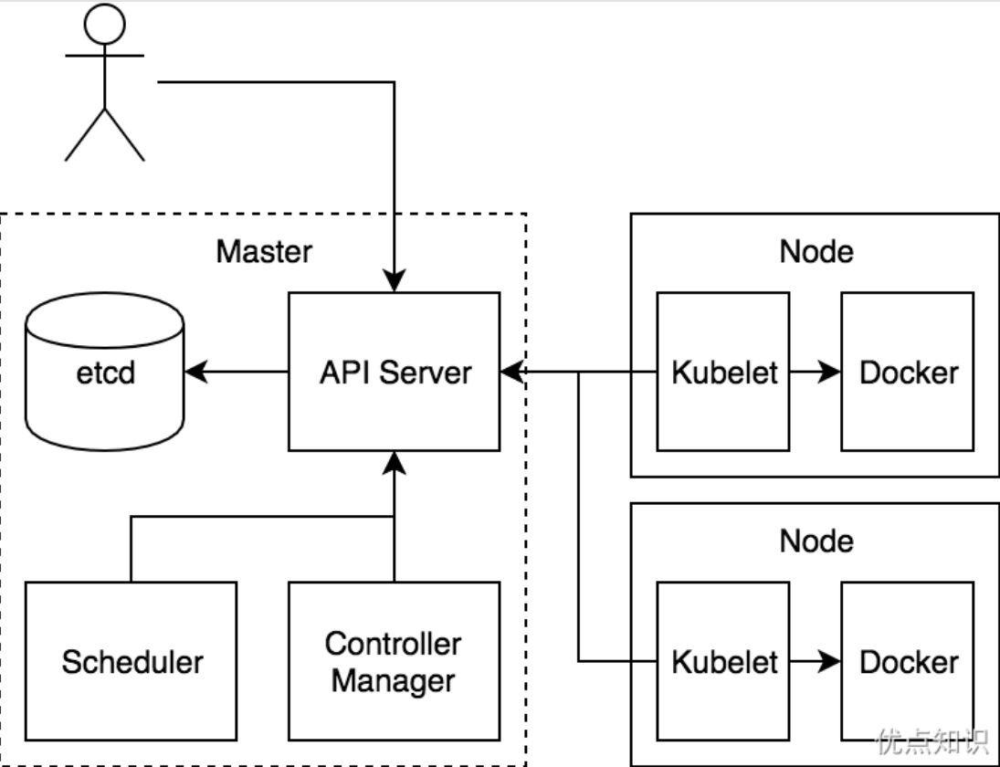
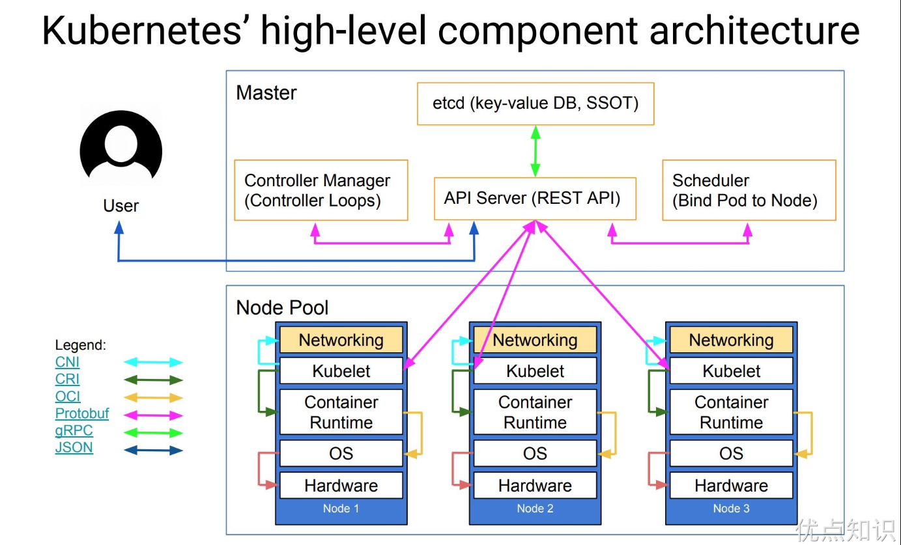

# K8S 简介

Kubernetes（简称 K8s） 的出现是容器化技术发展的必然结果，容器化是应用程序级别的虚拟化，运行在单个内核上有多个独立的用户空间实例，这些实例就是容器。容器提供了将应用程序的代码、运行时、系统工具、系统库和配置打包到一个实例中的标准方法，而且容器是共享一个内核的。

由于容器技术的兴起，导致大量的容器应用出现，所以就出现了一些用来支持应用程序容器化部署和组织的容器编排技术，一些流行的开源容器编排工具有 Docker Swarm、Kubernetes 等，但是在发展过程中 Kubernetes 现在已经成为了容器编排领域事实上的一个标准了。

Kubernetes 是 Google 团队发起的一个开源项目，它的目标是管理跨多个主机的容器，用于自动部署、扩展和管理容器化的应用程序，主要实现语言为 Go 语言，它的理论基础来源与 Google 内部的 Borg 项目，所以 Kubernetes 项目的理论基础就比其他开源项目要“先进”很多，因为 Borg 系统一直以来就被称为 Google 公司内部最强大的“私密武器”。

## 架构

Kubernetes 项目依托着 Borg 项目的理论优势，确定了一个如下图所示的全局架构图：

从上面可以看出 Kubernetes 由 Master 和 Node 两种节点组成，这两种角色分别对应着控制节点和工作节点。

其中 Master 节点由三个独立的组件组成，它们分别是负责整个集群通信的 API 服务的 kube-apiserver、负责容器调度的 kube-scheduler 以及负责维护集群状态的 kube-controller-manager 组件。整个集群的数据都是通过 kube-apiserver 保存到 etcd 数据库中的，而其他所有组件的通信也都是通过 kube-apiserver 来与 etcd 数据库进行通信的，都不会直接和 etcd 进行通信。

工作节点上最核心的组件就是 kubelet，当然还有底层的容器运行时，比如 Docker，其中 kubelet 就是主要来实现和底层的容器运行时进行通信的，这个通信的过程也被 Kubernetes 抽象成了一个 CRI（Container Runtime Interface）的远程调用接口，这个接口里面定义了容器运行时的所有标准操作，比如创建容器、删除容器等等。所以对于 Kubernetes 来说它根本不关心你部署的到底是什么容器运行时，只要你这个容器运行时可以实现 CRI 接口就可以被 Kubernetes 来管理。

kubelet 的另外一个重要功能就是调用网络插件（CNI）和存储插件（CSI）为容器配置网络和存储功能，同样的 kubelet 也是把这两个重要功能通过接口暴露给外部了，所以如果我们想要实现自己的网络插件，只需要使用 CNI 就可以很方便的对接到 Kubernetes 集群当中去。

可能下面的架构图看上去更清晰一些：

## 组件

## 核心资源对象

# 集群部署