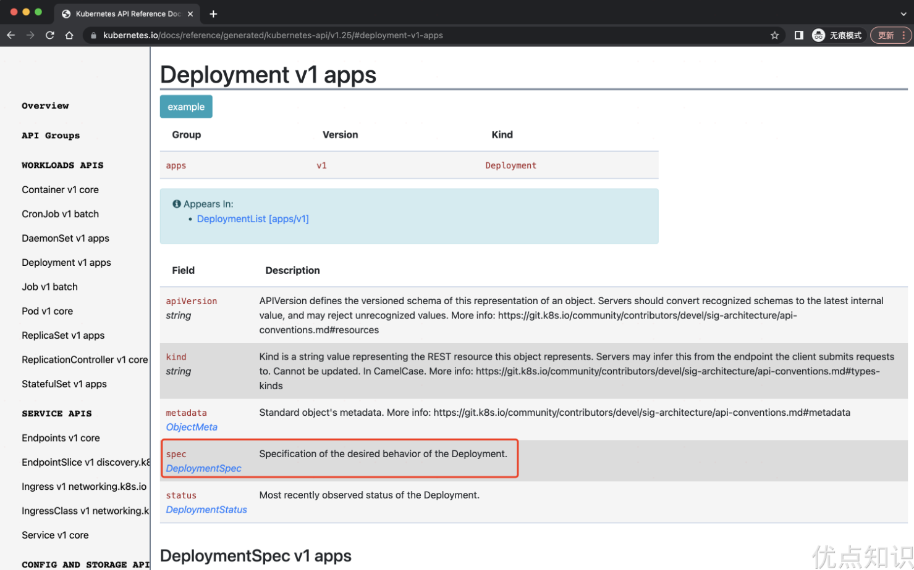
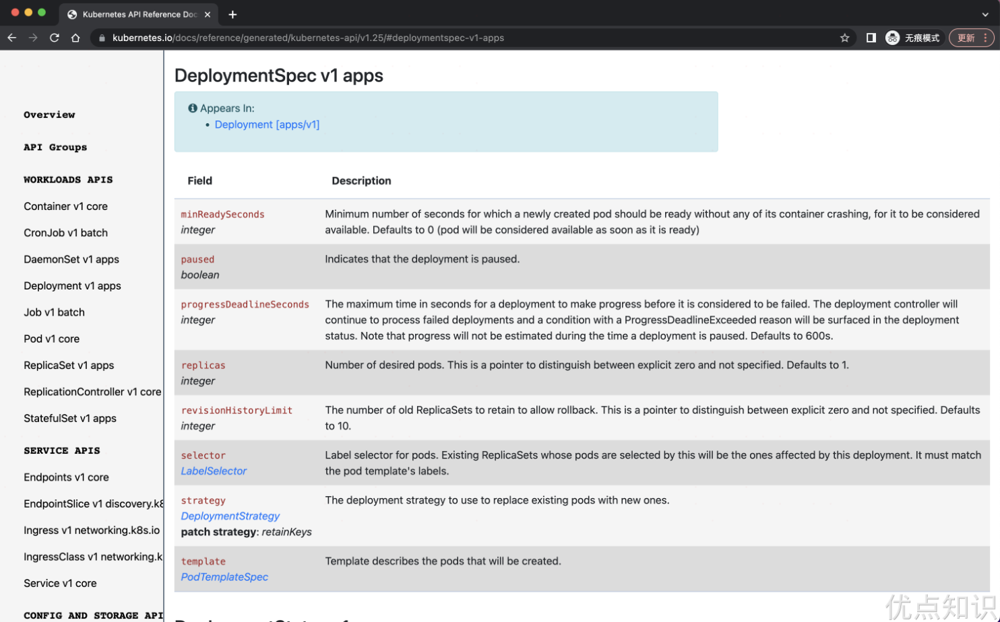
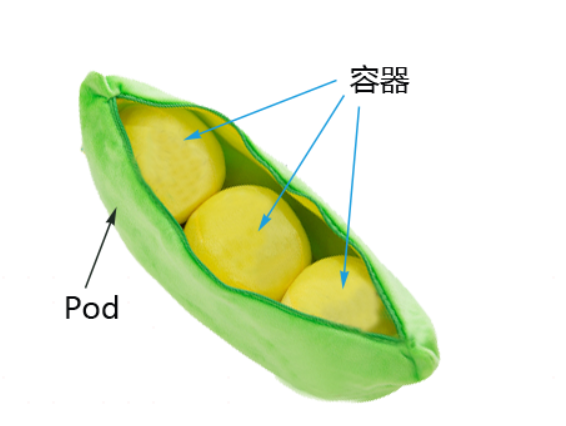
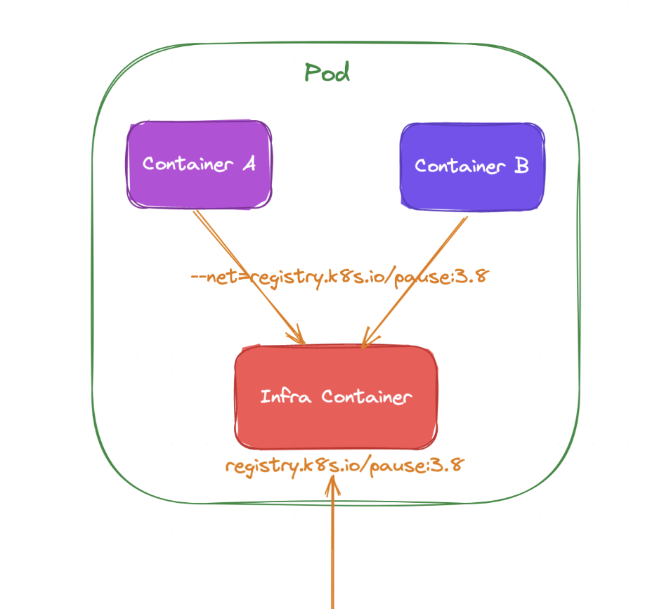
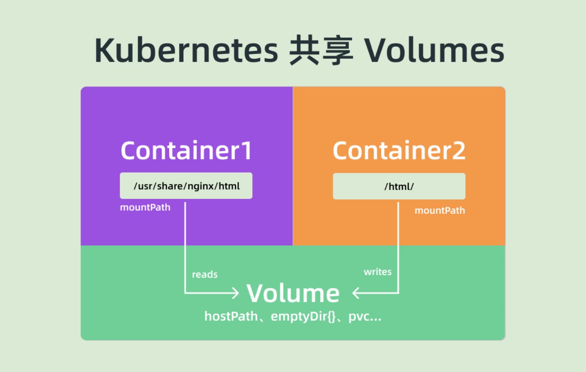
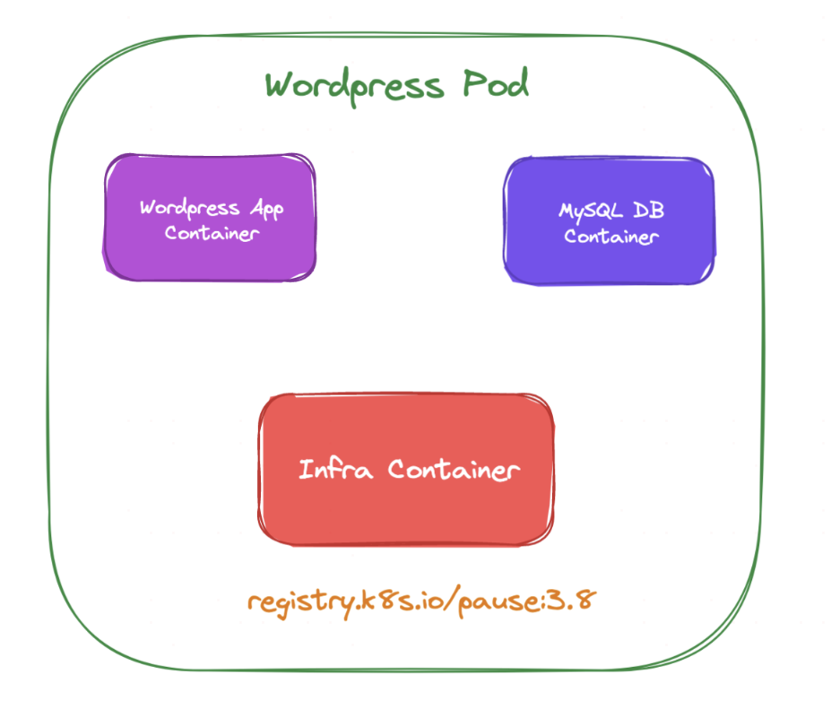
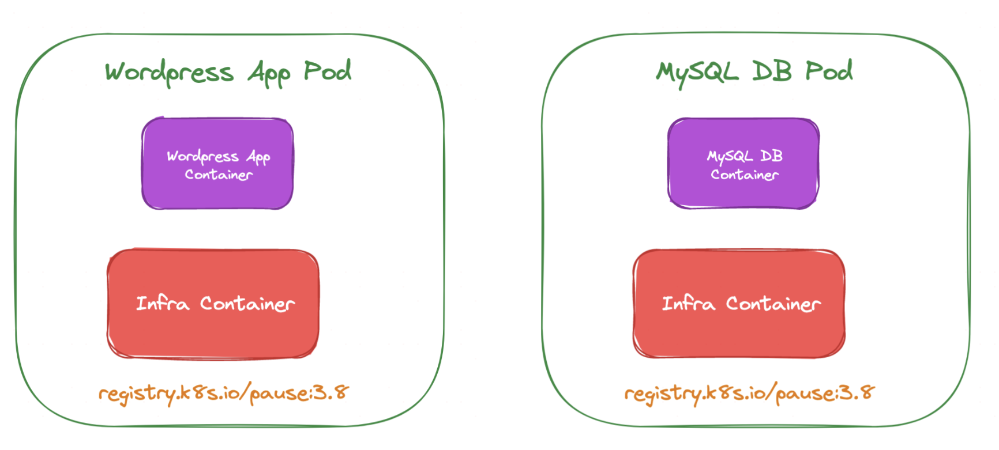

# Pod 基础原理

前面已经搭建了 Kubernetes 集群，接下来就可以正式开始学习 Kubernetes 的使用，在这之前还需要先了解下 YAML 文件。要在 K8s 集群里面运行自己的应用，首先需要知道几个概念。

第一个当然就是应用的镜像，因为在集群中运行的是容器，所以首先需要将应用打包成镜像。镜像、Kubernetes 集群都准备好之后，其实就可以把应用部署到集群中了。但是镜像到集群中运行这个过程如何完成呢？必然有一个地方可以来描述应用，然后把这份描述告诉集群，最后集群按照这个描述来部署应用。

在 Docker 环境下面是直接通过命令 `docker run` 来运行应用，在 Kubernetes 环境下同样也可以用类似 `kubectl run` 这样的命令来运行应用，但在 Kubernetes 中却是不推荐使用命令行的方式，而是希望使用称为资源清单的东西来描述应用，资源清单可以用 YAML 或者 JSON 文件来编写，一般来说 YAML 文件更方便阅读和理解，所以课程中都会使用 YAML 文件来进行描述。

通过一个资源清单文件来定义好一个应用后，就可以通过 kubectl 工具来直接运行它：

```shell
kubectl create -f xxxx.yaml
# 或者
kubectl apply -f xxxx.yaml
```

我们知道 kubectl 是直接操作 APIServer 的，所以就相当于把清单提交给了 APIServer，然后集群获取到清单描述的应用信息后存入到 etcd 数据库中，然后 kube-scheduler 组件发现这个时候有一个 Pod 还没有绑定到节点上，就会对这个 Pod 进行一系列的调度，把它调度到一个最合适的节点上，然后把这个节点和 Pod 绑定到一起（写回到etcd），然后节点上的 kubelet 组件这个时候 watch 到有一个 Pod 被分配过来了，就去把这个 Pod 的信息拉取下来，然后根据描述通过容器运行时把容器创建出来，最后当然同样把 Pod 状态再写回到 etcd 中去，这样就完成了整个的创建流程。

## 第一个容器化应用

现在通过 YAML 文件编写了一个如下的资源清单，命名为 `nginx-deployment.yaml`：

```yaml
apiVersion: apps/v1  # API版本
kind: Deployment  # API对象类型
metadata:
  name: nginx-deploy
  labels:
    chapter: first-app
spec:
  selector:
    matchLabels:
      app: nginx
  replicas: 2  # Pod 副本数量
  template:  # Pod 模板
    metadata:
      labels:
        app: nginx
    spec:
      containers:
      - name: nginx
        image: nginx:1.7.9
        ports:
        - containerPort: 80
```

然后直接用 kubectl 命令来创建这个应用：

```shell
[root@localhost ~]# kubectl create -f nginx-deployment.yaml
deployment.apps/nginx-deploy created
[root@localhost ~]# kubectl get pod -owide
NAME                            READY   STATUS    RESTARTS   AGE   IP           NODE           NOMINATED NODE   READINESS GATES
nginx-deploy-7759cfdc55-8qblg   1/1     Running   0          52s   10.244.2.2   demo-worker  
```

可以看到在集群中生成两个 Pod 出来，而整个资源清单文件对应到 Kubernetes 中就是一个 API Object（API 对象），按照这些对象的要求填充上对应的属性后，提交给 Kubernetes 集群，就可以创建出对应的资源对象。比如这里定义的是一个 Deployment 类型的 API 对象，按照这个 API 对象的要求填充了一些属性，就会创建出对应的资源对象，可以通过下面的命令来获取：

```shell
[root@localhost ~]# kubectl get deployment
NAME           READY   UP-TO-DATE   AVAILABLE   AGE
nginx-deploy   2/2     2            2           100s
```

Deployment 这个资源对象就是用来定义多副本应用的对象，而且还支持滚动更新，上面的资源清单中的描述中有一个属性 `replicas: 2`，所以最后生成两个副本的 Pod。

而这个 Deployment 定义的副本 Pod 具体是什么样的，是通过下面的 Pod 模板来定义的，就是 `template` 下面的定义，这个模板中定义的 Pod 中只有一个名为 `nginx` 的容器，容器使用的镜像是 `nginx:1.7.9`（`spec.containers[0].image`），并且这个容器监听的端口是 80（`spec.containers[0].ports[0].containerPort`），另外还为 Pod 添加了一个 `app: nginx` 这样的 Label 标签，这里需要非常注意的是上面的 `selector.matchLabels` 区域就是来表示 Deployment 来管理哪些 Pod 的，所以这个地方需要和 Pod 模板中的 Label 标签保持一致，这个 Label 标签是非常重要的。

另外也可以发现每个 API 对象都有一个 Metadata 的字段，用来表示该对象的元数据，比如定义 name、namespace 等，比如上面 Deployment 和 Pod 模板中都有这个字段，至于为什么 Pod 模板中没有 name 这个元信息呢，这是因为 Deployment 这个控制器会自动在它自己的 name 基础上生成 Pod 名，不过 Deployment 下面定义的 Label 标签就没有 Pod 中定义的 Label 标签那么重要了，只是起到一个对该对象标识和过滤的作用，比如在查询对象的时候可以带上标签来进行过滤：

```shell
[root@localhost ~]# kubectl get deployment -l chapter=first-app
NAME           READY   UP-TO-DATE   AVAILABLE   AGE
nginx-deploy   2/2     2            2           12m
[root@localhost ~]# kubectl get pods -l app=nginx
NAME                            READY   STATUS    RESTARTS   AGE
nginx-deploy-7759cfdc55-8qblg   1/1     Running   0          12m
nginx-deploy-7759cfdc55-rjm5j   1/1     Running   0          12m
[root@localhost ~]#
```

到这里就完成了第一个应用的容器化部署，但是往往在部署应用的过程中或多或少会遇到一些问题，这个时候可以使用一个 `kubectl describe` 命令来查看资源对象的详细信息，比如用下面的命令来查看 Pod 的详细信息：

```shell
[root@localhost ~]# kubectl describe pod nginx-deploy-7759cfdc55-8qblg
Name:             nginx-deploy-7759cfdc55-8qblg
Namespace:        default
Priority:         0
Service Account:  default
Node:             demo-worker/172.19.0.4
Start Time:       Tue, 20 Feb 2024 02:47:51 -0500
Labels:           app=nginx
                  pod-template-hash=7759cfdc55
Annotations:      <none>
Status:           Running
IP:               10.244.2.2
IPs:
  IP:           10.244.2.2
Controlled By:  ReplicaSet/nginx-deploy-7759cfdc55
Containers:
  nginx:
    Container ID:   containerd://d75942dff7edd4f970bacef16b622101acc395e178f67b666c296144ae3a5227
    Image:          nginx:1.7.9
    Image ID:       sha256:35d28df486f6150fa3174367499d1eb01f22f5a410afe4b9581ac0e0e58b3eaf
    Port:           80/TCP
    Host Port:      0/TCP
    State:          Running
      Started:      Tue, 20 Feb 2024 02:48:27 -0500
    Ready:          True
    Restart Count:  0
    Environment:    <none>
    Mounts:
      /var/run/secrets/kubernetes.io/serviceaccount from kube-api-access-kxbb2 (ro)
Conditions:
  Type              Status
  Initialized       True
  Ready             True
  ContainersReady   True
  PodScheduled      True
Volumes:
  kube-api-access-kxbb2:
    Type:                    Projected (a volume that contains injected data from multiple sources)
    TokenExpirationSeconds:  3607
    ConfigMapName:           kube-root-ca.crt
    ConfigMapOptional:       <nil>
    DownwardAPI:             true
QoS Class:                   BestEffort
Node-Selectors:              <none>
Tolerations:                 node.kubernetes.io/not-ready:NoExecute op=Exists for 300s
                             node.kubernetes.io/unreachable:NoExecute op=Exists for 300s
Events:
  Type    Reason     Age   From               Message
  ----    ------     ----  ----               -------
  Normal  Scheduled  13m   default-scheduler  Successfully assigned default/nginx-deploy-7759cfdc55-8qblg to demo-worker
  Normal  Pulling    13m   kubelet            Pulling image "nginx:1.7.9"
  Normal  Pulled     13m   kubelet            Successfully pulled image "nginx:1.7.9" in 35.526955018s
  Normal  Created    13m   kubelet            Created container nginx
  Normal  Started    13m   kubelet            Started container nginx
[root@localhost ~]#
```

可以看到很多这个 Pod 的详细信息，比如调度到的节点、状态、IP 等，一般我们比较关心的是下面的 Events 部分，就是事件。

在 Kubernetes 创建资源对象的过程中，对该对象的一些重要操作，都会被记录在这个对象的 Events 里面，可以通过 `kubectl describe` 指令查看对应的结果，所以这个指令也会是以后排错过程中经常使用的命令，一定要记住这个重要的命令。比如上面描述的这个 Pod，可以看到它被创建之后，被调度器调度（Successfully assigned）到了 `demo-work` 节点上，然后再去拉取镜像，然后创建定义的 nginx 容器，最后启动定义的容器。

另外一个方面如果想对应用进行升级的话应该怎么办呢？这个操作在日常工作中还是非常常见的，而在 Kubernetes 这里也是非常简单的，只需要修改资源清单文件即可，比如把镜像升级到最新版本 `nginx:latest`：

```yaml
    spec:
      containers:
        - name: nginx
          image: nginx:latest # 这里被从 1.7.9 修改为latest
          ports:
            - containerPort: 80
```

然后可以通过 `kubectl apply`命令来直接更新，这个命令也是推荐使用的，我们不必关心当前的操作是创建，还是更新，执行的命令始终是 `kubectl apply`，Kubernetes 则会根据 YAML 文件的内容变化，自动进行具体的处理，所以无论是创建还是更新都可以直接使用这个命令：

```shell
kubectl apply -f nginx-deployment.yaml
```

通过这个命令就可以来更新应用了，由于这里使用的是一个 Deployment 的控制器，所以会滚动更新应用，可以通过在命令后面加上 `--watch` 参数来查看 Pod 的更新过程：

```shell
[root@localhost ~]# kubectl get pods -l app=nginx --watch
NAME                            READY   STATUS              RESTARTS   AGE
nginx-deploy-547d878d89-7whb5   0/1     ContainerCreating   0          11s
nginx-deploy-7759cfdc55-8qblg   1/1     Running             0          22m
nginx-deploy-7759cfdc55-rjm5j   1/1     Running             0          22m
nginx-deploy-547d878d89-7whb5   1/1     Running             0          31s
nginx-deploy-547d878d89-g5ndc   0/1     Pending             0          1s
nginx-deploy-547d878d89-g5ndc   0/1     Pending             0          1s
nginx-deploy-547d878d89-g5ndc   0/1     ContainerCreating   0          1s
nginx-deploy-7759cfdc55-8qblg   1/1     Terminating         0          22m
nginx-deploy-7759cfdc55-8qblg   0/1     Terminating         0          22m
nginx-deploy-7759cfdc55-8qblg   0/1     Terminating         0          22m
nginx-deploy-7759cfdc55-8qblg   0/1     Terminating         0          22m
```

可以看到更新过程是先杀掉了一个 Pod，然后又重新创建了一个新的 Pod，然后又杀掉一个旧的 Pod，再创建一个新的 Pod，这样交替替换的，最后剩下两个新的 Pod，这就是所说的滚动更新。滚动更新对于应用持续提供服务是非常重要的手段，在日常工作中更新应用肯定会采用这种方式。

最后，如果需要把应用从集群中删除掉，可以用 `kubectl delete` 命令来清理：

```shell
[root@localhost ~]# kubectl delete -f nginx-deployment.yaml
deployment.apps "nginx-deploy" deleted
[root@localhost ~]# kubectl get pods -l app=nginx
No resources found in default namespace.
[root@localhost ~]#
```

# YAML 文件

上面在 Kubernetes 中部署了我们的第一个容器化应用，要部署应用最重要的就是编写应用的资源清单文件。那么如何编写资源清单文件呢？日常使用的时候都是使用 YAML 文件来编写，但是现状却是大部分同学对 JSON 更加熟悉，对 YAML 文件的格式不是很熟悉，所以也导致很多同学在编写资源清单的时候似懂非懂的感觉，所以在了解如何编写资源清单之前非常有必要来了解下 YAML 文件的用法。

YAML 是专门用来写配置文件的语言，非常简洁和强大，远比 JSON 格式方便。YAML语言（发音 /ˈjæməl/）的设计目标，就是方便人类读写。它实质上是一种通用的数据串行化格式。

它的基本语法规则如下：

* 大小写敏感
* 使用缩进表示层级关系
* 缩进时不允许使用Tab键，只允许使用空格
* 缩进的空格数目不重要，只要相同层级的元素左侧对齐即可
* `#` 表示注释，从这个字符一直到行尾，都会被解析器忽略

在 Kubernetes 中，我们只需要了解两种结构类型就行了：

* Lists（列表）
* Maps（字典）

也就是说，你可能会遇到 Lists 的 Maps 和 Maps 的 Lists，等等。不过不用担心，只要掌握了这两种结构也就可以了，其他更加复杂的暂不讨论。

## Maps

首先来看看 Maps，我们都知道 Map 是字典，就是一个 `key:value` 的键值对，Maps 可以让我们更加方便的去书写配置信息，例如：

```yaml
---
apiVersion: v1
kind: Pod
```

第一行的 `---`是分隔符，是可选的，在单一文件中，可用连续三个连字号 `---`区分多个文件。这里可以看到，有两个键：kind 和 apiVersion，他们对应的值分别是：v1 和 Pod。上面的 YAML 文件转换成 JSON 格式的话，你肯定就容易明白了：

```json
{
    "apiVersion": "v1",
    "kind": "pod"
}
```

再创建一个相对复杂一点的 YAML 文件，创建一个 KEY 对应的值不是字符串而是一个 Maps：

```yaml
apiVersion: v1
kind: Pod
metadata:
  name: ydzs-site
  labels:
    app: web
```

上面的 YAML 文件，`metadata` 这个 KEY 对应的值就是一个 Maps，而且嵌套的 labels 这个 KEY 的值又是一个 Map，你可以根据你自己的情况进行多层嵌套。

上面也提到了 YAML 文件的语法规则，YAML 处理器是根据行缩进来知道内容之间的关联性的。比如上面的 YAML 文件，用了两个空格作为缩进，空格的数量并不重要，但是得保持一致，并且至少要求一个空格。我们可以看到 name 和 labels 是相同级别的缩进，所以 YAML 处理器就知道了他们属于同一个 Map，而 app 是 labels 的值是因为 app 的缩进更大。

> 注意：在 YAML 文件中绝对不要使用 tab 键来进行缩进。

## Lists

Lists就是列表，说白了就是数组，在 YAML 文件中可以这样定义：

```yaml
args:
  - Cat
  - Dog
  - Fish

---
env:
- a
- b
- c 
```

你可以有任何数量的项在列表中，每个项的定义以破折号（-）开头的，与父元素之间可以缩进也可以不缩进。对应的 JSON 格式如下：

```json
{
    "args": [ 'Cat', 'Dog', 'Fish' ]
}
```

当然，Lists 的子项也可以是 Maps，Maps 的子项也可以是 Lists 如下所示：

```yaml
apiVersion: v1
kind: Pod
metadata:
  name: ydzs-site
  labels:
    app: web
spec:
  containers:
    - name: front-end
      image: nginx
      ports:
        - containerPort: 80
    - name: flaskapp-demo
      image: cnych/flaskapp
      ports:
        - containerPort: 5000
```

比如这个 YAML 文件，定义了一个叫 containers 的 List 对象，每个子项都由 name、image、ports 组成。是不是觉得用 JSON 格式的话文件明显比 YAML 文件更复杂了呢？

## 如何编写资源清单

上面了解了 YAML 文件的基本语法，现在至少可以保证编写的 YAML 文件语法是合法的，那要怎么编写符合 Kubernetes API 对象的资源清单呢？比如我们怎么知道 Pod、Deployment 这些资源对象有哪些功能、有哪些字段呢？

一些简单的资源对象可能可以凭借记忆写出对应的资源清单，但是 Kubernetes 发展也非常快，版本迭代也很快，每个版本中资源对象可能又有很多变化，那么有没有一种办法可以让我们做到有的放矢呢？

实际上是有的，最简单的方法就是查找 Kubernetes API 文档，比如现在使用的是 v1.25.4 版本的集群，可以通过地址 [https://kubernetes.io/docs/reference/generated/kubernetes-api/v1.25/](https://kubernetes.io/docs/reference/generated/kubernetes-api/v1.25/) 查找到对应的 API 文档，在这个文档中可以找到所有资源对象的一些字段。

比如要了解创建一个 Deployment 资源对象需要哪些字段，可以打开上面的 API 文档页面，在左侧侧边栏找到 Deployment v1 apps，点击下面的 Write Operations，然后点击 Create，然后查找到创建 Deployment 需要提交的 Body 参数。


就可以看到创建 Deployment 需要的一些字段，比如 apiVersion、kind、metadata、spec 等，而且每个字段都有对应的文档说明，比如想要了解 DeploymentSpec 下面有哪些字段，继续点击进去查看就行：


每个字段具体什么含义以及每个字段下面是否还有其他字段都可以这样去追溯。

但是如果平时编写资源清单的时候都这样去查找文档势必会效率低下，Kubernetes 也考虑到了这点，所以可以直接通过 kubectl 命令行工具来获取这些字段信息，同样的，比如要获取 Deployment 的字段信息，可以通过 `kubectl explain` 命令来了解：

```shell
[root@localhost ~]# kubectl explain deployment
GROUP:      apps
KIND:       Deployment
VERSION:    v1

DESCRIPTION:
    Deployment enables declarative updates for Pods and ReplicaSets.

FIELDS:
  apiVersion    <string>
    APIVersion defines the versioned schema of this representation of an object.
    Servers should convert recognized schemas to the latest internal value, and
    may reject unrecognized values. More info:
    https://git.k8s.io/community/contributors/devel/sig-architecture/api-conventions.md#resources

  kind  <string>
    Kind is a string value representing the REST resource this object
    represents. Servers may infer this from the endpoint the client submits
    requests to. Cannot be updated. In CamelCase. More info:
    https://git.k8s.io/community/contributors/devel/sig-architecture/api-conventions.md#types-kinds

  metadata      <ObjectMeta>
    Standard object's metadata. More info:
    https://git.k8s.io/community/contributors/devel/sig-architecture/api-conventions.md#metadata

  spec  <DeploymentSpec>
    Specification of the desired behavior of the Deployment.

  status        <DeploymentStatus>
    Most recently observed status of the Deployment.


[root@localhost ~]#

```

可以看到上面的信息和在 API 文档中查看到的基本一致，比如我们看到其中 spec 字段是一个 `<Object>`类型的，证明该字段下面是一个对象，可以继续去查看这个字段下面的详细信息：

```shell
[root@localhost ~]# kubectl explain deployment.spec
GROUP:      apps
KIND:       Deployment
VERSION:    v1

FIELD: spec <DeploymentSpec>

DESCRIPTION:
    Specification of the desired behavior of the Deployment.
    DeploymentSpec is the specification of the desired behavior of the
    Deployment.

FIELDS:
  minReadySeconds       <integer>
    Minimum number of seconds for which a newly created pod should be ready
    without any of its container crashing, for it to be considered available.
    Defaults to 0 (pod will be considered available as soon as it is ready)

  paused        <boolean>
    Indicates that the deployment is paused.

  progressDeadlineSeconds       <integer>
    The maximum time in seconds for a deployment to make progress before it is
    considered to be failed. The deployment controller will continue to process
    failed deployments and a condition with a ProgressDeadlineExceeded reason
    will be surfaced in the deployment status. Note that progress will not be
    estimated during the time a deployment is paused. Defaults to 600s.

  replicas      <integer>
    Number of desired pods. This is a pointer to distinguish between explicit
    zero and not specified. Defaults to 1.

  revisionHistoryLimit  <integer>
    The number of old ReplicaSets to retain to allow rollback. This is a pointer
    to distinguish between explicit zero and not specified. Defaults to 10.

  selector      <LabelSelector> -required-
    Label selector for pods. Existing ReplicaSets whose pods are selected by
    this will be the ones affected by this deployment. It must match the pod
    template's labels.

  strategy      <DeploymentStrategy>
    The deployment strategy to use to replace existing pods with new ones.

  template      <PodTemplateSpec> -required-
    Template describes the pods that will be created.


[root@localhost ~]#
```

如果一个字段显示的是 `required`，这就证明该自动是必填的，也就是在创建这个资源对象的时候必须声明这个字段，每个字段的类型也都为其进行了说明，所以有了 `kubectl explain` 这个命令就完全可以写出一个不熟悉的资源对象的清单说明，这个命令也是必须要记住的，会在以后的工作中为我们提供很大的帮助。

# Pod 是什么



前面的课程中了解了 Kubernetes 的基本架构，以及如何使用资源清单在集群中部署一个应用。也了解到了 Pod 是 Kubernetes 集群中最基本的调度单元，平时在集群中部署的应用都是以 Pod 为单位的，而并不是我们熟知的容器，这样设计的目的是什么呢？为何不直接使用容器呢？

## 为什么需要 Pod

假设 Kubernetes 中调度的基本单元就是容器，对于一个非常简单的应用可以直接被调度直接使用，没有什么问题，但是往往还有很多应用程序是由多个进程组成的，有的同学可能会说把这些进程都打包到一个容器中去不就可以了吗？理论上是可以实现的，但是不要忘记了容器运行时管理的进程是 pid=1 的主进程，其他进程死掉了就会成为僵尸进程，没办法进行管理了，这种方式本身也不是容器推荐的运行方式，一个容器最好只干一件事情，所以在真实的环境中不会使用这种方式。

GPT解释：在传统的Linux系统中，init进程（`PID 1`）负责系统初始化和进程管理，包括僵尸进程的回收。在容器中，`PID 1`进程需要承担相似的责任，如果容器内的子进程终止，`PID 1`进程需要回收它们，否则终止的进程会变成僵尸进程。僵尸进程虽然不执行任何操作，但仍然占用系统资源，如进程表项。

那么就把这个应用的进程进行拆分，拆分成一个一个的容器总可以了吧？但是不要忘记一个问题，拆分成一个一个的容器后，是不是就有可能出现一个应用下面的某个进程容器被调度到了不同的节点上呀？往往应用内部的进程与进程间通信（通过 IPC 或者共享本地文件之类）都是要求在本地进行的，也就是需要在同一个节点上运行。（Pod允许多个容器共存，共享网络和存储资源，同时保持进程隔离。）

所以需要一个更高级别的结构来将这些容器绑定在一起，并将他们作为一个基本的调度单元进行管理，这样就可以保证这些容器始终在同一个节点上面，这也就是 Pod 设计的初衷。

## Pod 原理

在一个 Pod 下面运行几个关系非常密切的容器进程，这样一来这些进程本身又可以受到容器的管控，又具有几乎一致的运行环境，也就完美解决了上面提到的问题。

其实 Pod 也只是一个逻辑概念，真正起作用的还是 Linux 容器的 Namespace 和 Cgroup 这两个最基本的概念，Pod 被创建出来其实是一组共享了一些资源的容器而已。首先 Pod 里面的所有容器，都是共享的同一个 `Network Namespace`，但是涉及到文件系统的时候，默认情况下 Pod 里面的容器之间的文件系统是完全隔离的，但是可以通过声明来共享同一个 Volume。

可以指定新创建的容器和一个已经存在的容器共享一个 `Network Namespace`，在运行容器（docker 容器）的时候只需要指定 `--net=container:目标容器名` 这个参数就可以了，但是这种模式有一个明显的问题那就是容器的启动有先后顺序问题，那么 Pod 是怎么来处理这个问题的呢？那就是加入一个中间容器（没有什么架构是加一个中间件解决不了的），这个容器叫做 `Infra` 容器，而且这个容器在 Pod 中永远都是第一个被创建的容器，这样是不是其他容器都加入到这个 Infra 容器就可以了，这样就完全实现了 Pod 中的所有容器都和 Infra 容器共享同一个 `Network Namespace` 了，如下图所示：



所以当部署完成 Kubernetes 集群的时候，首先需要保证在所有节点上可以拉取到默认的 Infra 镜像，默认情况下 Infra 镜像地址为 `registry.k8s.io/pause:3.8`，这个容器占用的资源非常少，但是这个镜像默认是需要科学上网的，所以很多时候在部署应用的时候一直处于 `Pending` 状态或者报 `sandbox image` 相关的错误信息，大部分是因为所有 Pod 最先启动的容器镜像都拉不下来，肯定启动不了，启动不了其他容器肯定也就不能启动：

```sh
[root@master ~]# kubelet --help |grep infra
      --pod-infra-container-image string                         Specified image will not be pruned by the image garbage collector. CRI implementations have their own configuration to set this image. (default "registry.k8s.io/pause:3.8") (DEPRECATED: will be removed in 1.27. Image garbage collector will get sandbox image information from CRI.)
[root@master ~]#
```

从上面图中可以看出普通的容器加入到了 Infra 容器的 `Network Namespace` 中，所以这个 Pod 下面的所有容器就是共享同一个 `Network Namespace`，普通容器不会创建自己的网卡、配置自己的 IP，而是和 Infra 容器共享 IP、端口范围等，而且容器之间的进程可以通过 lo 网卡设备（虚拟网卡）进行通信：

* 容器之间是可以直接使用 localhost 进行通信；
* 看到的网络设备信息都是和 Infra 容器完全一样的；
* 意味着同一个 Pod 下面的容器运行的多个进程不能绑定相同的端口；
* 而且 Pod 的生命周期只跟 Infra 容器一致，而与容器 A 和 B 无关。

对于文件系统 Kubernetes 是怎么实现让一个 Pod 中的容器共享的呢？默认情况下容器的文件系统是互相隔离的，要实现共享只需要在 Pod 的顶层声明一个 Volume，然后在需要共享这个 Volume 的容器中声明挂载即可。



比如下面的示例：

```yaml
apiVersion: v1
kind: Pod
metadata:
  name: counter
spec:
  volumes:
  - name: varlog
    hostPath:
      path: /var/log/counter
  containers:
  - name: count
    image: busybox
    args:
    - /bin/sh
    - -c
    - >
      i=0;
      while true;
      do
        echo "$i: $(date)" >> /var/log/1.log;
        i=$((i+1));
        sleep 1;
      done
    volumeMounts:
    - name: varlog
      mountPath: /var/log
  - name: count-log
    image: busybox
    args: [/bin/sh, -c, 'tail -n+1 -f /opt/log/1.log']
    volumeMounts:
    - name: varlog
      mountPath: /opt/log
```

示例中在 Pod 的顶层声明了一个名为 `varlog` 的 Volume，而这个 Volume 的类型是 `hostPath`，也就意味这个宿主机的 `/var/log/counter` 目录将被这个 Pod 共享，共享给谁呢？在需要用到这个数据目录的容器上声明挂载即可，也就是通过 `volumeMounts` 声明挂载的部分，这样 Pod 就实现了容器共享文件系统，而且数据被持久化到了宿主机目录上。

这个方式也是 Kubernetes 中一个非常重要的设计模式：sidecar 模式的常用方式。典型的场景就是容器日志收集，比如上面的这个应用，其中应用的日志是被输出到容器的 `/var/log` 目录上的，这个时候可以把 Pod 声明的 Volume 挂载到容器的 ` /var/log` 目录上，然后在这个 Pod 里面同时运行一个 sidecar 容器，它也声明挂载相同的 Volume 到自己容器的 `/opt/log` （或其他）目录上，这样 sidecar 容器就只需要从 `/opt/log` 目录下面不断消费日志发送到 Elasticsearch 中存储起来就完成了最基本的应用日志的基本收集工作了。

除了这个应用场景之外更多的还是利用 Pod 中所有容器共享同一个 `Network Namespace` 这个特性，这样就可以把 Pod 网络相关的配置和管理交给一个 sidecar 容器来完成，完全不需要去干涉用户容器，这个特性在现在非常火热的 Service Mesh（服务网格）中应用非常广泛，典型的应用就是 Istio，不过也不用着急，后面也会和大家一起探讨的。

## 存储卷

参考资料：https://www.cnblogs.com/hongdada/p/11586514.html

Kubernetes的存储卷有自己的生命周期，它的生命周期与使用的它Pod生命周期一致。因此，相比于在Pod中运行的容器来说，存储卷的存在时间会比的其中的任何容器都长。当然，当Pod停止存在时，存储卷也将不再存在。在Kubernetes支持多种类型的卷，而Pod可以同时使用各种类型和任意数量的存储卷。

在Pod中通过指定下面的字段来使用存储卷：

- spec.volumes：通过此字段提供指定的存储卷
- spec.containers.volumeMounts：通过此字段将存储卷挂接到容器中

### emptryDir

emptyDir类型的Volume在Pod分配到Node上时被创建，Kubernetes会在Node上自动分配一个目录，因此无需指定宿主机Node上对应的目录文件。 这个目录的初始内容为空，当Pod从Node上移除时，emptyDir中的数据会被永久删除。

emptyDir Volume 主要用于某些应用程序无需永久保存的临时目录、多个容器的共享目录等。

```yaml
apiVersion: v1
kind: Pod
metadata:
  name: test-pd
spec:
  containers:
  - image: gcr.io/google_containers/test-webserver
    name: test-container
    volumeMounts:
    - mountPath: /cache
      name: cache-volume
  volumes:
  - name: cache-volume
    emptyDir: {}
```

### hostPath

hostPath 类型的存储卷用于将宿主机的文件系统的文件或目录挂到Pod中，除了需要指定 `path` 字段之外，在使用hostPath 类型的存储卷时，也可以设置 `type`，`type` 支持的枚举值见下表。另外在使用 hostPath 时，需要注意下面的事项：

- 具有相同配置的Pod（例如：从同一个podTemplate创建的），可能会由于 Node 的文件不同，而行为不同。这是因为各个节点上的文件系统可能不一致。
- 在宿主机上创建的文件或目录，默认情况下只有 `root` 用户具有写权限。您要么在容器中以 `root` 身份运行进程，要么在主机上修改的文件或目录的权限，以便具备写入内容到 hostPath 的存储卷中。

|         值          |                             行为                             |
| :-----------------: | :----------------------------------------------------------: |
|                     | 空字符串（默认）是用于向后兼容，这意味着在挂接主机路径存储卷之前不执行任何检查。 |
| `DirectoryOrCreate` | 如果 path 指定目录不存在，则会在宿主机上创建一个新的目录，并设置目录权限为0755，此目录与kubelet拥有一样的组和拥有者。 |
|     `Directory`     |                   path 指定的目录必需存在                    |
|   `FileOrCreate`    | 如果 path 指定的文件不存在，则会在宿主机上创建一个空的文件，设置权限为0644，此文件与kubelet拥有一样的组和拥有者。 |
|       `File`        |                   path 指定的文件必需存在                    |
|      `Socket`       |                path 指定的UNIX socket必需存在                |
|    `CharDevice`     |                 path 指定的字符设备必需存在                  |
|    `BlockDevice`    |                 path 指定的块设备必须存在。                  |

下面是使用 hostPath 作为存储卷的YAML文件，此YAML文件定义了一个名称为 `test-pd` 的Pod资源。它通过hostPath 类型的存储卷，将Pod宿主机上的`/data`挂接到容器中的`/teset-pd`目录。

```yaml
apiVersion: v1
kind: Pod
metadata:
  name: test-pd
spec:
  containers:
  - image: k8s.gcr.io/test-webserver
    name: test-container
    # 指定在容器中挂接路径
    volumeMounts:
    - mountPath: /test-pd
      name: test-volume
  # 指定所提供的存储卷
  volumes:
  - name: test-volume
    hostPath:
      # 宿主机上的目录
      path: /data
      # this field is optional
      type: Directory
```

### nfs

在Kubernetes中，可以通过 nfs 类型的存储卷将现有的NFS（网络文件系统）到的挂接到Pod中。在移除Pod时，NFS中的内容被不会被删除，只是将存储卷卸载而已。这意味着可以预先在NFS中填充数据，并且可以在Pod之间共享数据。NFS可以被同时挂接到多个Pod中，并能同时进行写入。需要注意的是：在使用 nfs 存储卷之前，必须已正确部署和运行NFS服务器，并已经设置了共享目录。

下面是一个 redis 部署的YAML配置文件，redis 在容器中的持久化数据保存在`/data`目录下；存储卷使用 nfs，nfs 的服务地址为：`192.168.8.150`，存储路径为：`/k8s-nfs/redis/data`。容器通过 `volumeMounts.name` 的值确定所使用的存储卷

```yaml
# for versions before 1.9.0 use apps/v1beta2
apiVersion: apps/v1
kind: Deployment
metadata:
  name: redis
spec:
  selector:
    matchLabels:
      app: redis
  revisionHistoryLimit: 2
  template:
    metadata:
      labels:
        app: redis
    spec:
      containers:
      # 应用的镜像
      - image: redis
        name: redis
        imagePullPolicy: IfNotPresent
        # 应用的内部端口
        ports:
        - containerPort: 6379
          name: redis6379
        env:
        - name: ALLOW_EMPTY_PASSWORD
          value: "yes"
        - name: REDIS_PASSWORD
          value: "redis"   
        # 持久化挂接位置，在docker中 
        volumeMounts:
        - name: redis-persistent-storage
          mountPath: /data
      volumes:
      # 宿主机上的目录
      - name: redis-persistent-storage
        nfs:
          path: /k8s-nfs/redis/data
          server: 192.168.8.150
```

### persistentVolumeClaim

persistentVolumeClaim类型存储卷将PersistentVolume挂接到Pod中作为存储卷。使用此类型的存储卷，用户并不知道存储卷的详细信息。

此处定义名为busybox-deployment的部署YAML配置文件，使用的镜像为busybox。基于busybox镜像的容器需要对/mnt目录下的数据进行持久化，在YAML文件指定使用名称为nfs的PersistenVolumeClaim对容器的数据进行持久化。

```yaml
# This mounts the nfs volume claim into /mnt and continuously
# overwrites /mnt/index.html with the time and hostname of the pod. 
apiVersion: v1
kind: Deployment
metadata:  
  name: busybox-deployment
spec:  
  replicas: 2  
  selector:    
    name: busybox-deployment
  template:    
    metadata:      
      labels:        
        name: busybox-deployment    
    spec:      
      containers:      
      - image: busybox        
        command:          
        - sh          
        - -c          
        - 'while true; do date > /mnt/index.html; hostname >> /mnt/index.html; sleep $(($RANDOM % 5 + 5)); done'        
        imagePullPolicy: IfNotPresent        
        name: busybox        
        volumeMounts:          
        # name must match the volume name below          
        - name: nfs            
          mountPath: "/mnt"     
     volumes:      
     - name: nfs        
       persistentVolumeClaim:          
         claimName: nfs-pvc
```


### subPath

有时，可以在一个pod中，将同一个卷共享，使其有多个用处。`volumeMounts.subPath`特性可以用来指定卷中的一个子目录，而不是直接使用卷的根目录。

这里有一个使用LAMP栈（Linux Apache Mysql PHP）的 pod 示例，该 pod 使用了一个共享的卷。HTML内容映射在它的 html 子目录，而数据库则保存在它的 mysql 目录

```yaml
apiVersion: v1
kind: Pod
metadata:
  name: my-lamp-site
spec:
    containers:
    - name: mysql
      image: mysql
      volumeMounts:
      - mountPath: /var/lib/mysql
        name: site-data
        subPath: mysql
    - name: php
      image: php
      volumeMounts:
      - mountPath: /var/www/html
        name: site-data
        subPath: html
    volumes:
    - name: site-data
      persistentVolumeClaim:
        claimName: my-lamp-site-data
```

### secret


## 容器端口

```shell
[root@master ~]# kubectl explain pod.spec.containers.ports
KIND:     Pod
VERSION:  v1

RESOURCE: ports <[]Object>

DESCRIPTION:
     List of ports to expose from the container. Not specifying a port here DOES
     NOT prevent that port from being exposed. Any port which is listening on
     the default "0.0.0.0" address inside a container will be accessible from
     the network. Modifying this array with strategic merge patch may corrupt
     the data. For more information See
     https://github.com/kubernetes/kubernetes/issues/108255. Cannot be updated.

     ContainerPort represents a network port in a single container.

FIELDS:
   containerPort        <integer> -required-
     Number of port to expose on the pod's IP address. This must be a valid port
     number, 0 < x < 65536.

   hostIP       <string>
     What host IP to bind the external port to.

   hostPort     <integer>
     Number of port to expose on the host. If specified, this must be a valid
     port number, 0 < x < 65536. If HostNetwork is specified, this must match
     ContainerPort. Most containers do not need this.

   name <string>
     If specified, this must be an IANA_SVC_NAME and unique within the pod. Each
     named port in a pod must have a unique name. Name for the port that can be
     referred to by services.

   protocol     <string>
     Protocol for port. Must be UDP, TCP, or SCTP. Defaults to "TCP".
     Possible enum values:
     - `"SCTP"` is the SCTP protocol.
     - `"TCP"` is the TCP protocol.
     - `"UDP"` is the UDP protocol.
```

**`ports` 字段详解**

- `ports` 字段是一个数组，每个元素表示一个容器中需要暴露的网络端口。
- 不指定端口并不会阻止该端口被暴露。容器中监听在 `0.0.0.0` 地址的任何端口都可以从网络中访问。
- 通过策略合并补丁修改该数组可能会导致数据损坏（参见相关的 GitHub 讨论）。

**具体字段**

1. **containerPort** (`<integer>` - required)
   - **描述**：在 Pod 的 IP 地址上暴露的端口号。
   - **范围**：必须是有效的端口号，范围是 `1` 到 `65535`。
   - **用途**：指定应用程序在容器内监听的端口。

2. **hostIP** (`<string>`)
   - **描述**：将容器内部的端口映射到宿主机的特定IP地址和端口上。
   - **用途**：这种配置在某些特定的场景下是非常有用的，例如需要直接从宿主机访问某个容器中的服务时。

3. **hostPort** (`<integer>`)
   - **描述**：在宿主机上暴露的端口号。
   - **范围**：有效端口号，范围是 `1` 到 `65535`。
   - **注意**：如果指定了 `HostNetwork`，那么该值必须与 `containerPort` 匹配。
   
4. **name** (`<string>`)
   - **描述**：为端口指定的名称，必须是 IANA 服务名称并在 Pod 中唯一。
   - **用途**：便于服务引用端口时使用友好的名称，而不是直接使用数字端口号。

5. **protocol** (`<string>`)
   - **描述**：端口使用的协议。
   - **默认值**：`TCP`，此为默认协议。
   - **可能的值**：
     - `"TCP"`：传输控制协议，适用于大多数应用。
     - `"UDP"`：用户数据报协议，适用于需要快速、实时传输的应用。
     - `"SCTP"`：流控制传输协议，适用于需要消息排序和多流传输的应用。

## args

```shell
[root@master ~]# kubectl explain pod.spec.containers.args
KIND:     Pod
VERSION:  v1

FIELD:    args <[]string>

DESCRIPTION:
     Arguments to the entrypoint. The container image's CMD is used if this is
     not provided. Variable references $(VAR_NAME) are expanded using the
     container's environment. If a variable cannot be resolved, the reference in
     the input string will be unchanged. Double $$ are reduced to a single $,
     which allows for escaping the $(VAR_NAME) syntax: i.e. "$$(VAR_NAME)" will
     produce the string literal "$(VAR_NAME)". Escaped references will never be
     expanded, regardless of whether the variable exists or not. Cannot be
     updated. More info:
     https://kubernetes.io/docs/tasks/inject-data-application/define-command-argument-container/#running-a-command-in-a-shell
```

在 Kubernetes 中，`args` 字段用于为容器的入口点（`ENTRYPOINT`）提供参数。这些参数影响容器启动时执行的命令，和 Docker 中的 `CMD` 类似。在 `Pod` 的 `spec.containers` 中配置 `args` 可以帮助你精确控制容器的行为。

1. 作用：
   - `args` 指定要传递给容器入口点（`ENTRYPOINT`）的命令行参数。
   - 如果未提供 `args`，容器镜像的默认 `CMD` 将被使用。

2. 变量引用：
   - `args` 支持环境变量引用，格式为 `$(VAR_NAME)`。这些变量将在容器的环境中进行解析。
   - 如果引用的变量不存在，引用将保持不变，即不会被替换。

3. 转义机制：
   - 使用双 `$` (`$$`) 可以转义美元符号。这对于想要在字符串中保持字面 `$(VAR_NAME)` 而不进行变量解析时很有用。例如，`"$$(VAR_NAME)"` 将被解析为字符串文字 `"$(VAR_NAME)"`。
   - 转义的引用不会被解析，即使变量存在。

4. 不可更新：
   - 一旦 Pod 创建，`args` 字段不能被更新。这是因为它定义了启动时的容器行为，属于不可变配置。

**使用例子**

假设你有一个需要启动时传递参数的容器镜像：

```yaml
apiVersion: v1
kind: Pod
metadata:
  name: example-pod
spec:
  containers:
  - name: example-container
    image: myapp:latest
    command: ["myapp"]
    args: ["--port", "$(MY_PORT)", "--env", "production"]
    env:
    - name: MY_PORT
      value: "8080"
```

- **command**: 定义了入口点命令（`ENTRYPOINT`），此处为 `myapp`。
- **args**: 提供了启动参数 `--port` 和 `--env`。
  - `$(MY_PORT)` 将被替换为环境变量 `MY_PORT` 的值，即 `8080`。
  - `"--env", "production"` 直接作为参数传递。

**应用场景**

- **可配置化启动**：使用 `args` 可以轻松地传递不同的启动参数，使应用在不同环境下灵活运行。
- **环境变量集成**：能够动态解析环境变量，使得配置更加灵活和可维护。
- **参数化应用**：通过提供不同的 `args`，可以在不同的启动条件下改变应用行为。

这种配置方式为容器提供了灵活的启动选项，使得同一镜像可以在不同场景下使用不同的配置运行，增强了应用的适应能力和可移植性。

## command

```shell
[root@master ~]# kubectl explain pod.spec.containers.command
KIND:     Pod
VERSION:  v1

FIELD:    command <[]string>

DESCRIPTION:
     Entrypoint array. Not executed within a shell. The container image's
     ENTRYPOINT is used if this is not provided. Variable references $(VAR_NAME)
     are expanded using the container's environment. If a variable cannot be
     resolved, the reference in the input string will be unchanged. Double $$
     are reduced to a single $, which allows for escaping the $(VAR_NAME)
     syntax: i.e. "$$(VAR_NAME)" will produce the string literal "$(VAR_NAME)".
     Escaped references will never be expanded, regardless of whether the
     variable exists or not. Cannot be updated. More info:
     https://kubernetes.io/docs/tasks/inject-data-application/define-command-argument-container/#running-a-command-in-a-shell
```

在 Kubernetes 中，`command` 字段用于指定容器启动时执行的命令，这个字段相当于容器镜像中的 `ENTRYPOINT`。通过配置 `command`，你可以替换镜像中的默认启动命令，从而灵活控制容器的启动行为。

1. 作用：
   - `command` 字段指定了容器的入口点命令（ENTRYPOINT）。
   - 如果未提供 `command`，则使用镜像的默认 `ENTRYPOINT`。

2. 执行行为：
   - `command` 的内容作为数组提供，表示要执行的命令及其各个部分。
   - 这些命令不是在 Shell 中执行的，因此不像在 Shell 中输入命令那样可以使用 Shell 特性。

3. 变量引用：
   - 支持环境变量引用，格式为 `$(VAR_NAME)`。这些变量会基于容器中的环境变量进行替换。
   - 如果引用的变量不存在，引用将保持不变（即不会被替换）。

4. 转义机制：
   - 使用双 `$` (`$$`) 可以转义美元符号，以便在字符串中保持字面 `$(VAR_NAME)`，不进行变量解析。例如，`"$$(VAR_NAME)"` 将解析为字符串文字 `"$(VAR_NAME)"`。
   - 转义的变量引用不会被解析，即使变量存在。

5. 不可更新：
   - 一旦 Pod 被创建，`command` 字段不能被更新，因为它定义了容器的启动行为。

**使用例子**

假设你有一个容器镜像，默认的入口点是 `/bin/bash`，但你希望使用不同的启动命令：

```yaml
apiVersion: v1
kind: Pod
metadata:
  name: example-pod
spec:
  containers:
  - name: example-container
    image: myapp:latest
    command: ["/myapp"]
    args: ["--port", "$(MY_PORT)", "--env", "production"]
    env:
    - name: MY_PORT
      value: "8080"
```

- **command**: 指定要执行的命令为 `/myapp`，这将替换镜像中的默认 `ENTRYPOINT`。
- **args**: 提供命令行参数 `--port` 和 `--env`，其中 `$(MY_PORT)` 将被替换为环境变量 `MY_PORT` 的值（即 `8080`）。


## env

```shell
[root@master ~]# kubectl explain pod.spec.containers.env
KIND:     Pod
VERSION:  v1

RESOURCE: env <[]Object>

DESCRIPTION:
     List of environment variables to set in the container. Cannot be updated.

     EnvVar represents an environment variable present in a Container.

FIELDS:
   name <string> -required-
     Name of the environment variable. Must be a C_IDENTIFIER.

   value        <string>
     Variable references $(VAR_NAME) are expanded using the previously defined
     environment variables in the container and any service environment
     variables. If a variable cannot be resolved, the reference in the input
     string will be unchanged. Double $$ are reduced to a single $, which allows
     for escaping the $(VAR_NAME) syntax: i.e. "$$(VAR_NAME)" will produce the
     string literal "$(VAR_NAME)". Escaped references will never be expanded,
     regardless of whether the variable exists or not. Defaults to "".

   valueFrom    <Object>
     Source for the environment variable's value. Cannot be used if value is not
     empty.
```

在 Kubernetes 中，`env` 字段用于在容器中设置环境变量。这些环境变量可以用于配置应用程序的运行时行为，比如数据库连接字符串、API 密钥或其他需要在容器启动时配置的信息。

1. 作用：
   - `env` 是一个环境变量列表，用于在容器启动时注入必要的配置信息。
   - 环境变量在容器内的应用程序中可以通过标准的方式（如在大多数编程语言中通过环境变量接口）进行访问。

2. 不可更新：
   - 一旦 Pod 创建后，`env` 列表是不可更新的。这是因为环境变量在容器启动时注入，改变它们意味着需要重启容器。

**具体字段**

1. **name (`<string>` - required)**：
   - **描述**：环境变量的名称，必须是符合 C 标识符命名规范的字符串。
   - **用途**：代表在容器内应用程序中使用的变量标识符。

2. **value (`<string>`)**：
   - **描述**：环境变量的值，可以包含对其他环境变量的引用。
   - **变量引用**：
     - 支持格式为 `$(VAR_NAME)` 的变量引用，这些引用会根据容器内先前定义的环境变量和服务环境变量进行解析。
     - 如果引用的变量不存在，引用将保持不变。
     - 双 `$` (`$$`) 用于转义美元符号，使得 `$(VAR_NAME)` 被视为字面字符串。例如，`"$$(VAR_NAME)"` 会解读为 `"$(VAR_NAME)"`。
   - **默认值**：如果不设置，默认为空字符串。

3. **valueFrom (`<Object>`)**：
   - **描述**：用于从其他来源获取环境变量的值。
   - **用途**：提供一种动态定义环境变量的方法，可以从 Kubernetes 资源中提取环境变量值。
   - **注意**：`valueFrom` 不能与 `value` 一起使用。

`valueFrom` 的常见用法

- ConfigMapKeyRef：从 ConfigMap 中获取值。
- SecretKeyRef：从 Secret 中获取值。
- FieldRef：引用 Pod 字段（如 Pod 名称、命名空间等）。
- ResourceFieldRef：从资源请求和限制中获取值。

**示例**

```yaml
apiVersion: v1
kind: Pod
metadata:
  name: example-pod
spec:
  containers:
  - name: example-container
    image: myapp:latest
    env:
    - name: MY_ENV_VAR
      value: "some_value"
    - name: MY_DB_HOST
      valueFrom:
        configMapKeyRef:
          name: my-config
          key: database_host
    - name: MY_SECRET_KEY
      valueFrom:
        secretKeyRef:
          name: my-secret
          key: api_key
```

- MY_ENV_VAR：直接设置为 `"some_value"`。
- MY_DB_HOST：从名为 `my-config` 的 ConfigMap 中获取 `database_host` 键的值。
- MY_SECRET_KEY：从名为 `my-secret` 的 Secret 中获取 `api_key` 键的值。

通过合理设置 `env` 字段，你可以使 Kubernetes 中的应用更灵活、可配置，并能够根据不同的环境需求动态调整。


## 如何划分 Pod

上面介绍了 Pod 的实现原理，了解到应该把关系紧密的容器划分到同一个 Pod 中运行，那么怎么来区分“关系紧密”呢？举一个简单的示例，比如 Wordpress 应用，是一个典型的前端服务器和后端数据服务的应用，那么你认为应该使用一个 Pod 还是两个 Pod 呢？

如果在同一个 Pod 中同时运行服务器程序和后端的数据库服务这两个容器，理论上肯定是可行的，但是不推荐这样使用，我们知道一个 Pod 中的所有容器都是同一个整体进行调度的，但是对于我们这个应用 Wordpress 和 MySQL 数据库一定需要运行在一起吗？当然不需要，甚至可以将 MySQL 部署到集群之外对吧？所以 Wordpress 和 MySQL 即使不运行在同一个节点上也是可行的，只要能够访问到即可。



但是如果你非要强行部署到同一个 Pod 中呢？从某个角度来说是错误的，比如现在应用访问量非常大，一个 Pod 已经满足不了需求了，怎么办呢？扩容对吧，但是扩容的目标也是 Pod，并不是容器，比如再添加一个 Pod，这个时候就有两个 Wordpress 的应用和两个 MySQL 数据库了，而且这两个 Pod 之间的数据是互相独立的，因为 MySQL 数据库并不是简单的增加副本就可以共享数据了，所以这个时候就得分开部署，采用第二种方案。这个时候只需要单独扩容 Wordpress 这个 Pod，后端的 MySQL 数据库并不会受到扩容的影响。



将多个容器部署到同一个 Pod 中的最主要参考就是应用可能由一个主进程和一个或多个的辅助进程组成，比如上面日志收集的 Pod，需要其他的 sidecar 容器来支持日志的采集。所以判断是否需要在 Pod 中使用多个容器的时候，可以按照如下的几个方式来判断：

* 这些容器是否一定需要一起运行，是否可以运行在不同的节点上
* 这些容器是一个整体还是独立的组件
* 这些容器一起进行扩缩容会影响应用吗

基本上能够回答上面的几个问题就能够判断是否需要在 Pod 中运行多个容器了。

> 其实在理解 Pod 的时候，有一个比较好的类比的方式就是把 Pod 看成之前的 “虚拟机”，而容器就是虚拟机中运行的一个用户程序，这样就可以很好的来理解 Pod 的设计。
