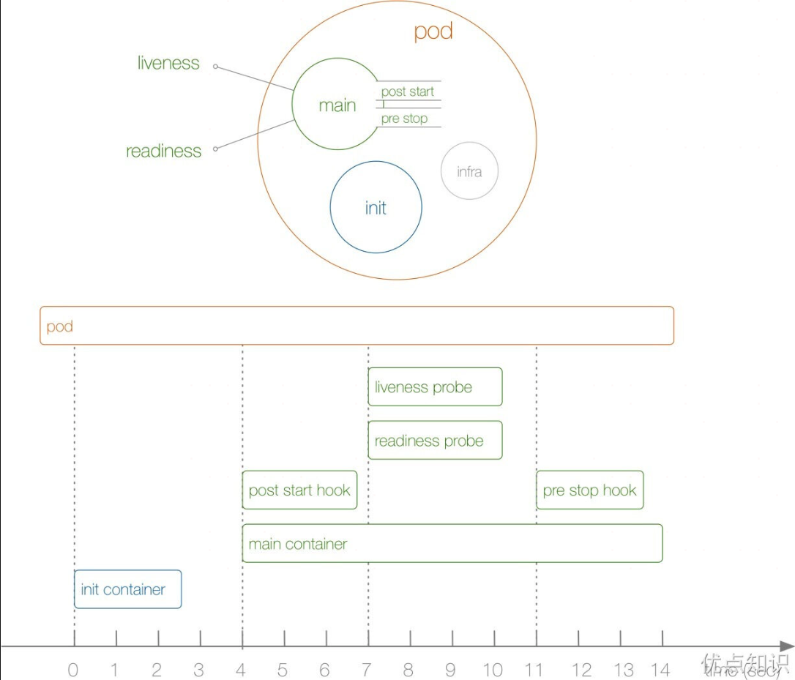
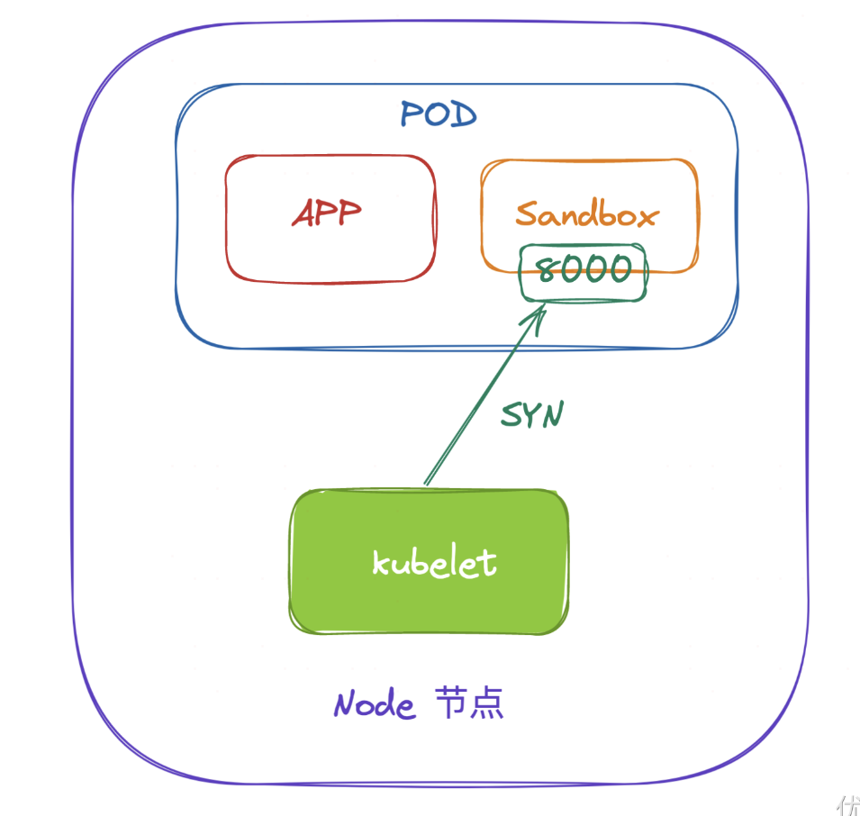
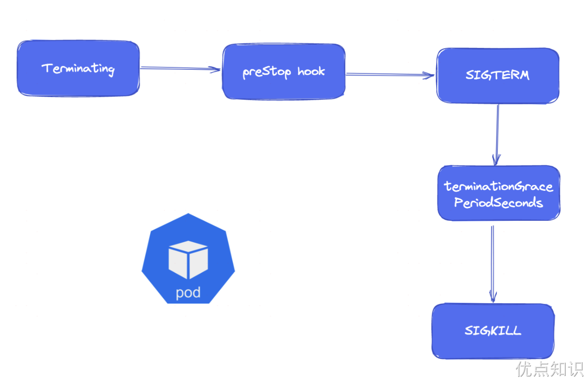

# Pod生命周期

前面了解了 Pod 的设计原理，接下来了解 Pod 的生命周期。下图展示了一个 Pod 的完整生命周期过程，其中包含 Init Container、Pod Hook、健康检查三个主要部分，接下来就来分别介绍影响 Pod 生命周期的部分。



首先在介绍 Pod 的生命周期之前，先了解下 Pod 的状态，因为 Pod 状态可以反应出当前 Pod 的具体状态信息，也是我们分析排错的一个必备的方式。

## Pod 状态

先了解 Pod 的状态值，我们可以通过 `kubectl explain pod.status` 命令来了解关于 Pod 状态的一些信息，Pod 的状态定义在 PodStatus 对象中，其中有一个 `phase` 字段，下面是 `phase` 的可能取值：

- 挂起（Pending）：Pod 信息已经提交给了集群，但是还没有被调度器调度到合适的节点或者 Pod 里的镜像正在下载
- 运行中（Running）：该 Pod 已经绑定到了一个节点上，Pod 中所有的容器都已被创建。至少有一个容器正在运行或者正在启动、重启的过程中
- 成功（Succeeded）：Pod 中的所有容器都被成功终止，并且不会再重启。所有容器都正常退出，通常是因为它们的任务（例如批处理任务）已经完成且没有错误。
- 失败（Failed）：Pod 中的所有容器都已终止，并且至少有一个容器是因错误而失败。容器以非零状态码退出或者被系统终止，这表明有某种错误导致了容器的终止。
- 未知（Unknown）：无法获取 Pod 的状态，通常是由于和 Pod 所在主机的通信错误。这种状态在2015年后因实现改进而很少被设置，但仍可能在某些特殊错误下出现。


## 容器状态

Kubernetes 会跟踪 Pod 中每个容器的状态，就像它跟踪 Pod 总体上的[阶段](https://kubernetes.io/zh-cn/docs/concepts/workloads/pods/pod-lifecycle/#pod-phase)一样。 你可以使用[容器生命周期回调](https://kubernetes.io/zh-cn/docs/concepts/containers/container-lifecycle-hooks/) 来在容器生命周期中的特定时间点触发事件。

一旦[调度器](https://kubernetes.io/zh-cn/docs/reference/command-line-tools-reference/kube-scheduler/)将 Pod 分派给某个节点，`kubelet` 就通过[容器运行时](https://kubernetes.io/zh-cn/docs/setup/production-environment/container-runtimes)开始为 Pod 创建容器。容器的状态有三种：`Waiting`（等待）、`Running`（运行中）和 `Terminated`（已终止）。

要检查 Pod 中容器的状态，你可以使用 `kubectl describe pod <pod 名称>`。 其输出中包含 Pod 中每个容器的状态。

每种状态都有特定的含义：

**`Waiting` （等待）**

如果容器并不处在 `Running` 或 `Terminated` 状态之一，它就处在 `Waiting` 状态。 处于 `Waiting` 状态的容器仍在运行它完成启动所需要的操作：例如， 从某个容器镜像仓库拉取容器镜像，或者向容器应用 [Secret](https://kubernetes.io/zh-cn/docs/concepts/configuration/secret/) 数据等等。 当你使用 `kubectl` 来查询包含 `Waiting` 状态的容器的 Pod 时，你也会看到一个 Reason 字段，其中给出了容器处于等待状态的原因。

**`Running`（运行中）**

`Running` 状态表明容器正在执行状态并且没有问题发生。 如果配置了 `postStart` 回调，那么该回调已经执行且已完成。 如果你使用 `kubectl` 来查询包含 `Running` 状态的容器的 Pod 时， 你也会看到关于容器进入 `Running` 状态的信息。

**`Terminated`（已终止）**

当一个容器进入 `Terminated` 状态时，意味着它已经开始执行并随后停止。这可以是因为容器完成了它的任务，也可以是因为遇到了错误或其他条件导致的终止。如果你使用 `kubectl` 来查询包含 `Terminated` 状态的容器的 Pod 时， 你会看到容器进入此状态的原因、退出代码以及容器执行期间的起止时间。

如果容器配置了 `preStop` 回调，则该回调会在容器进入 `Terminated` 状态之前执行。


## Pod重启策略

```shell
[root@master ~]# kubectl explain pod.spec.restartPolicy
KIND:     Pod
VERSION:  v1

FIELD:    restartPolicy <string>

DESCRIPTION:
     Restart policy for all containers within the pod. One of Always, OnFailure,
     Never. Default to Always. More info:
     https://kubernetes.io/docs/concepts/workloads/pods/pod-lifecycle/#restart-policy

     Possible enum values:
     - `"Always"`
     - `"Never"`
     - `"OnFailure"`
```

Pod 的 `spec` 中包含一个 `restartPolicy` 字段，其可能取值包括 Always、OnFailure 和 Never。默认值是 Always。

`restartPolicy` 应用于 Pod 中的[应用容器](https://kubernetes.io/zh-cn/docs/reference/glossary/?all=true#term-app-container)和常规的 [Init 容器](https://kubernetes.io/zh-cn/docs/concepts/workloads/pods/init-containers/)。 [Sidecar 容器](https://kubernetes.io/zh-cn/docs/concepts/workloads/pods/sidecar-containers/)忽略 Pod 级别的 `restartPolicy` 字段：在 Kubernetes 中，Sidecar 被定义为 `initContainers` 内的一个条目，其容器级别的 `restartPolicy` 被设置为 `Always`。 对于因错误而退出的 Init 容器，如果 Pod 级别 `restartPolicy` 为 `OnFailure` 或 `Always`， 则 kubelet 会重新启动 Init 容器。

- `Always`：只要容器终止就自动重启容器。
- `OnFailure`：只有在容器错误退出（退出状态非零）时才重新启动容器。
- `Never`：不会自动重启已终止的容器。

当 kubelet 根据配置的重启策略处理容器重启时，仅适用于同一 Pod 内替换容器并在同一节点上运行的重启。当 Pod 中的容器退出时，`kubelet` 会以指数级回退延迟机制（10 秒、20 秒、40 秒......）重启容器， 上限为 300 秒（5 分钟）。一旦容器顺利执行了 10 分钟， kubelet 就会重置该容器的重启延迟计时器。 

# Pod中的容器

## Init容器

了解 Pod 状态后，首先来了解 Pod 中最先启动的 Init Container，也就是常说的初始化容器。Init Container 就是用来做初始化工作的容器，可以是一个或者多个，如果有多个的话，这些容器会按定义的顺序依次执行。

一个 Pod 里面的所有容器是共享数据卷（要主动声明）和 Network Namespace 的，所以 Init Container 里面产生的数据可以被主容器使用到。从上面的 Pod 生命周期的图中可以看出初始化容器是独立与主容器之外的，只有所有的初始化容器执行完之后，主容器才会被启动。那么初始化容器有哪些应用场景呢：

- 等待其他模块 Ready：这个可以用来解决服务之间的依赖问题，比如我们有一个 Web 服务，该服务又依赖于另外一个数据库服务，但是在我们启动这个 Web 服务的时候我们并不能保证依赖的这个数据库服务就已经就绪了，所以可能会出现一段时间内 Web 服务连接数据库异常。要解决这个问题的话就可以在 Web 服务的 Pod 中使用一个 InitContainer，在这个初始化容器中去检查数据库是否已经准备好了，准备好之后初始化容器就结束退出，然后主容器的 Web 服务才开始启动，这个时候去连接数据库就不会有问题了。
- 做初始化配置：比如检测所有已经存在的成员节点，为主容器准备好集群的配置信息，这样主容器起来后就能用这个配置信息加入集群。
- 其它场景：比如将 Pod 注册到一个中央数据库、配置中心等。


比如现在来实现一个功能，在 Nginx Pod 启动之前去重新初始化首页内容，如下所示的资源清单(init-pod.yaml）：

```yaml
apiVersion: v1
kind: Pod
metadata:
  name: init-demo
spec:
  volumes:
    - name: workdir
      emptyDir: {}
  initContainers:
    - name: install
      image: busybox
      command:
        - wget
        - "-O"
        - "/work-dir/index.html"
        - http://www.baidu.com # https
      volumeMounts:
        - name: workdir
          mountPath: "/work-dir"
  containers:
    - name: web
      image: nginx
      ports: # ports 字段是一个数组，每个元素表示一个容器中需要暴露的网络端口。不指定端口并不会阻止该端口被暴露。
        - containerPort: 80
      volumeMounts:
        - name: workdir
          mountPath: /usr/share/nginx/html
```

上面的资源清单中首先在 Pod 顶层声明了一个名为 `workdir` 的 Volume，这里使用的是一个 `emptyDir{}` 类型的数据卷，这个是一个临时的目录，数据会保存在 kubelet 的工作目录下面，生命周期等同于 Pod 的生命周期。

然后定义了一个初始化容器，该容器会下载一个网页的 html 代码文件到 `/work-dir` 目录下面，但是由于我们又将该目录声明挂载到了全局的 Volume，同样的主容器 nginx 也将目录 `/usr/share/nginx/html` 声明挂载到了全局的 Volume，所以在主容器的该目录下面会同步初始化容器中创建的 `index.html` 文件。

直接创建上面的 Pod：

```shell
➜  ~ kubectl apply -f init-pod.yaml
```

创建完成后可以查看该 Pod 的状态：

```shell
➜  ~ kubectl get pods
NAME                            READY   STATUS     RESTARTS   AGE
init-demo                       0/1     Init:0/1   0          4s
```

可以发现 Pod 现在的状态处于 `Init:0/1` 状态，意思就是现在第一个初始化容器还在执行过程中，此时我们可以查看 Pod 的详细信息：

```shell
[root@localhost ~]# kubectl describe pod init-demo
Name:             init-demo
Namespace:        default
Priority:         0
Service Account:  default
Node:             demo-worker/172.19.0.4
Start Time:       Tue, 20 Feb 2024 22:19:16 -0500
Labels:           <none>
Annotations:      <none>
Status:           Running
IP:               10.244.2.4
IPs:
  IP:  10.244.2.4
Init Containers: # Init容器详细信息如下：
  install: # 容器名称
    Container ID:  containerd://f63a72b687506c246b82c01e1bc063738e1a99534319d58dcb74e784bf6eb6b4
    Image:         busybox
    Image ID:      docker.io/library/busybox@sha256:6d9ac9237a84afe1516540f40a0fafdc86859b2141954b4d643af7066d598b74
    Port:          <none>
    Host Port:     <none>
    Command:
      wget
      -O
      /work-dir/index.html
      http://www.baidu.com
    State:          Terminated # 容器状态为Terminated
      Reason:       Completed  # 具体原因是Completed
      Exit Code:    0          # 退出码为0,表明是正常退出
      Started:      Tue, 20 Feb 2024 22:19:34 -0500
      Finished:     Tue, 20 Feb 2024 22:19:34 -0500
    Ready:          True
    Restart Count:  0
    Environment:    <none>
    Mounts:
      /var/run/secrets/kubernetes.io/serviceaccount from kube-api-access-446wm (ro)
      /work-dir from workdir (rw)
Containers:
  web: # 容器名称
    Container ID:   containerd://005bd732d4372e6d6499c79c369edad369f66be50ce3aec150b4b9763fad4065
    Image:          nginx
    Image ID:       docker.io/library/nginx@sha256:c26ae7472d624ba1fafd296e73cecc4f93f853088e6a9c13c0d52f6ca5865107
    Port:           80/TCP
    Host Port:      0/TCP
    State:          Running
      Started:      Tue, 20 Feb 2024 22:19:41 -0500
    Ready:          True
    Restart Count:  0
    Environment:    <none>
    Mounts:
      /usr/share/nginx/html from workdir (rw)
      /var/run/secrets/kubernetes.io/serviceaccount from kube-api-access-446wm (ro)
Conditions:
  Type              Status
  Initialized       True
  Ready             True
  ContainersReady   True
  PodScheduled      True
Volumes:
  workdir:
    Type:       EmptyDir (a temporary directory that shares a pod's lifetime) # 卷的类型
    Medium:
    SizeLimit:  <unset>
  kube-api-access-446wm:
    Type:                    Projected (a volume that contains injected data from multiple sources)
    TokenExpirationSeconds:  3607
    ConfigMapName:           kube-root-ca.crt
    ConfigMapOptional:       <nil>
    DownwardAPI:             true
QoS Class:                   BestEffort
Node-Selectors:              <none>
Tolerations:                 node.kubernetes.io/not-ready:NoExecute op=Exists for 300s
                             node.kubernetes.io/unreachable:NoExecute op=Exists for 300s
Events:
  Type    Reason     Age   From               Message
  ----    ------     ----  ----               -------
  Normal  Scheduled  39s   default-scheduler  Successfully assigned default/init-demo to demo-worker
  Normal  Pulling    37s   kubelet            Pulling image "busybox"
  Normal  Pulled     22s   kubelet            Successfully pulled image "busybox" in 15.723733725s
  Normal  Created    22s   kubelet            Created container install
  Normal  Started    21s   kubelet            Started container install
  Normal  Pulling    20s   kubelet            Pulling image "nginx"
  Normal  Pulled     15s   kubelet            Successfully pulled image "nginx" in 5.228256821s
  Normal  Created    15s   kubelet            Created container web
  Normal  Started    14s   kubelet            Started container web
[root@localhost ~]#
```

从上面的描述信息可以看到初始化容器已经启动了，初始化容器执行完成后退出会变成 `Completed` 状态，然后才会启动主容器。待到主容器也启动完成后，Pod 就会变成 `Running` 状态，然后去访问下 Pod 主页，验证下是否有初始化容器中下载的页面信息：

```shell
[root@master yamlDir]# kubectl get pod -owide
NAME        READY   STATUS    RESTARTS   AGE    IP           NODE    NOMINATED NODE   READINESS GATES
init-demo   1/1     Running   0          133m   10.244.1.5   node1   <none>           <none>
[root@master yamlDir]# curl 10.244.1.5
<!DOCTYPE html>
<!--STATUS OK--><html> <head><meta http-equiv=content-type content=text/html;charset=utf-8><meta http-equiv=X-UA-Compatible content=IE=Edge><meta content=always name=referrer><link rel=stylesheet type=text/css href=http://s1.bdstatic.com/r/www/cache/bdorz/baidu.min.css><title>百度一下，你就知道</title></head> <body link=#0000cc> <div id=wrapper> <div id=head> <div class=head_wrapper> <div class=s_form> <div class=s_form_wrapper> <div id=lg>  </div> <form id=form name=f action=//www.baidu.com/s class=fm> <input type=hidden name=bdorz_come value=1> <input type=hidden name=ie value=utf-8> <input type=hidden name=f value=8> <input type=hidden name=rsv_bp value=1> <input type=hidden name=rsv_idx value=1> <input type=hidden name=tn value=baidu><span class="bg s_ipt_wr"><input id=kw name=wd class=s_ipt value maxlength=255 autocomplete=off autofocus></span><span class="bg s_btn_wr"><input type=submit id=su value=百度一下 class="bg s_btn"></span> </form> </div> </div> <div id=u1> <a href=http://news.baidu.com name=tj_trnews class=mnav>新闻</a> <a href=http://www.hao123.com name=tj_trhao123 class=mnav>hao123</a> <a href=http://map.baidu.com name=tj_trmap class=mnav>地图</a> <a href=http://v.baidu.com name=tj_trvideo class=mnav>视频</a> <a href=http://tieba.baidu.com name=tj_trtieba class=mnav>贴吧</a> <noscript> <a href=http://www.baidu.com/bdorz/login.gif?login&tpl=mn&u=http%3A%2F%2Fwww.baidu.com%2f%3fbdorz_come%3d1 name=tj_login class=lb>登录</a> </noscript> <script>document.write('<a href="http://www.baidu.com/bdorz/login.gif?login&tpl=mn&u='+ encodeURIComponent(window.location.href+ (window.location.search === "" ? "?" : "&")+ "bdorz_come=1")+ '" name="tj_login" class="lb">登录</a>');</script> <a href=//www.baidu.com/more/ name=tj_briicon class=bri style="display: block;">更多产品</a> </div> </div> </div> <div id=ftCon> <div id=ftConw> <p id=lh> <a href=http://home.baidu.com>关于百度</a> <a href=http://ir.baidu.com>About Baidu</a> </p> <p id=cp>©2017 Baidu <a href=http://www.baidu.com/duty/>使用百度前必读</a>  <a href=http://jianyi.baidu.com/ class=cp-feedback>意见反馈</a> 京ICP证030173号   </p> </div> </div> </div> </body> </html>
[root@master yamlDir]#
```

可以看到主容器内容已经变成初始化容器中下载的网页内容。

### 理解Init容器

每个 [Pod](https://kubernetes.io/zh-cn/docs/concepts/workloads/pods/) 中可以包含多个容器， 应用运行在这些容器里面，同时 Pod 也可以有一个或多个先于应用容器启动的 Init 容器。

Init 容器与普通的容器非常像，除了如下两点：

- 它们总是运行到完成。（理解这点很重要，它们通常不能定义长时间运行的任务，因为它们的设计目的是在完成其任务后立即退出）
- 每个都必须在下一个启动之前成功完成。

如果 Pod 的 Init 容器失败，kubelet 会不断地重启该 Init 容器直到该容器成功为止。 然而，如果 Pod 对应的 `restartPolicy` 值为 "Never"，并且 Pod 的 Init 容器失败， 则 Kubernetes 会将整个 Pod 状态设置为失败。

**与普通容器的不同之处**

Init 容器支持应用容器的全部字段和特性，包括资源限制、 [数据卷](https://kubernetes.io/zh-cn/docs/concepts/storage/volumes/)和安全设置。 然而，Init 容器对资源请求和限制的处理稍有不同， 在下面[容器内的资源共享](https://kubernetes.io/zh-cn/docs/concepts/workloads/pods/init-containers/#resource-sharing-within-containers)节有说明。

常规的 Init 容器（即不包括边车容器）不支持 `lifecycle`、`livenessProbe`、`readinessProbe` 或 `startupProbe` 字段。Init 容器必须在 Pod 准备就绪之前完成运行；而边车容器在 Pod 的生命周期内继续运行， 它支持一些探针。有关边车容器的细节请参阅[边车容器](https://kubernetes.io/zh-cn/docs/concepts/workloads/pods/sidecar-containers/)。

如果为一个 Pod 指定了多个 Init 容器，这些容器会按顺序逐个运行。 每个 Init 容器必须运行成功，下一个才能够运行。当所有的 Init 容器运行完成时， Kubernetes 才会为 Pod 初始化应用容器并像平常一样运行。

**与边车容器的不同之处**

Init 容器在主应用容器启动之前运行并完成其任务。 与[边车容器](https://kubernetes.io/zh-cn/docs/concepts/workloads/pods/sidecar-containers)不同， Init 容器不会持续与主容器一起运行。

Init 容器按顺序完成运行，等到所有 Init 容器成功完成之后，主容器才会启动。

Init 容器不支持 `lifecycle`、`livenessProbe`、`readinessProbe` 或 `startupProbe`， 而边车容器支持所有这些[探针](https://kubernetes.io/zh-cn/docs/concepts/workloads/pods/pod-lifecycle/#types-of-probe)以控制其生命周期。

Init 容器与主应用容器共享资源（CPU、内存、网络），但不直接与主应用容器进行交互。 不过这些容器可以使用共享卷进行数据交换。

### 使用 Init 容器

因为 Init 容器具有与应用容器分离的单独镜像，其启动相关代码具有如下优势：

- Init 容器可以包含一些安装过程中应用容器中不存在的实用工具或个性化代码。 例如，没有必要仅为了在安装过程中使用类似 `sed`、`awk`、`python` 或 `dig` 这样的工具而去 `FROM` 一个镜像来生成一个新的镜像。
- 与同一 Pod 中的多个应用容器相比，Init 容器能以不同的文件系统视图运行。因此，Init 容器可以被赋予访问应用容器不能访问的 [Secret](https://kubernetes.io/zh-cn/docs/concepts/configuration/secret/) 的权限。
- 由于 Init 容器必须在应用容器启动之前运行完成，因此 Init 容器提供了一种机制来阻塞或延迟应用容器的启动，直到满足了一组先决条件。 一旦前置条件满足，Pod 内的所有的应用容器会并行启动。
- Init 容器可以安全地运行实用程序或自定义代码，而在其他方式下运行这些实用程序或自定义代码可能会降低应用容器镜像的安全性。 通过将不必要的工具分开，你可以限制应用容器镜像的被攻击范围。

**示例**

下面是一些如何使用 Init 容器的想法：

- 等待一个 Service 完成创建，通过类似如下 Shell 命令：

  ```shell
  for i in {1..100}; do sleep 1; if nslookup myservice; then exit 0; fi; done; exit 1
  ```

- 注册这个 Pod 到远程服务器，通过在命令中调用 API，类似如下：

  ```shell
  curl -X POST http://$MANAGEMENT_SERVICE_HOST:$MANAGEMENT_SERVICE_PORT/register -d 'instance=$(<POD_NAME>)&ip=$(<POD_IP>)'
  ```

- 在启动应用容器之前等一段时间，使用类似命令：

  ```shell
  sleep 60
  ```

- 克隆 Git 仓库到[卷](https://kubernetes.io/zh-cn/docs/concepts/storage/volumes/)中。
- 将配置值放到配置文件中，运行模板工具为主应用容器动态地生成配置文件。 例如，在配置文件中存放 `POD_IP` 值，并使用 Jinja 生成主应用配置文件。

**使用 Init 容器的情况**

下面的例子定义了一个具有 2 个 Init 容器的简单 Pod。 第一个等待 `myservice` 启动， 第二个等待 `mydb` 启动。 一旦这两个 Init 容器都启动完成，Pod 将启动 `spec` 节中的应用容器。

```yaml
apiVersion: v1
kind: Pod
metadata:
  name: myapp-pod
  labels:
    app.kubernetes.io/name: MyApp
spec:
  containers:
  - name: myapp-container
    image: busybox:1.28
    command: ['sh', '-c', 'echo The app is running! && sleep 3600']
  initContainers:
  - name: init-myservice
    image: busybox:1.28
    # until ...; do ...; done   这是一个 Shell 循环结构。until 循环会一直执行其内部命令直到条件成功（即命令返回状态为 0 时）。
    command: ['sh', '-c', "until nslookup myservice.$(cat /var/run/secrets/kubernetes.io/serviceaccount/namespace).svc.cluster.local; do echo waiting for myservice; sleep 2; done"]
  - name: init-mydb
    image: busybox:1.28
    command: ['sh', '-c', "until nslookup mydb.$(cat /var/run/secrets/kubernetes.io/serviceaccount/namespace).svc.cluster.local; do echo waiting for mydb; sleep 2; done"]
```

你通过运行下面的命令启动 Pod：

```shell
kubectl apply -f myapp.yaml

# 输出类似于：
pod/myapp-pod created
```

使用下面的命令检查其状态：

```shell
kubectl get -f myapp.yaml

# 输出类似于：
NAME        READY     STATUS     RESTARTS   AGE
myapp-pod   0/1       Init:0/2   0          6m
```

或者查看更多详细信息：

```shell
kubectl describe -f myapp.yaml
```

输出类似于：

```shell
Name:          myapp-pod
Namespace:     default
[...]
Labels:        app.kubernetes.io/name=MyApp
Status:        Pending # 此时pod的状态为Pending
[...]
Init Containers:
  init-myservice: # 第一个init容器
[...]
    State:         Running  # 此时第一个init容器状态为 Running
[...]
  init-mydb:      # 第二个init容器
[...]
    State:         Waiting # 由于第一个init容器为Running，所以第二个init容器状态为 Waiting
      Reason:      PodInitializing
    Ready:         False
[...]
Containers:
  myapp-container:
[...]
    State:         Waiting # 由于init容器并未完成，应用容器状态就为 Waiting
      Reason:      PodInitializing
    Ready:         False
[...]
Events:
  FirstSeen    LastSeen    Count    From                      SubObjectPath                           Type          Reason        Message
  ---------    --------    -----    ----                      -------------                           --------      ------        -------
  16s          16s         1        {default-scheduler }                                              Normal        Scheduled     Successfully assigned myapp-pod to 172.17.4.201
  16s          16s         1        {kubelet 172.17.4.201}    spec.initContainers{init-myservice}     Normal        Pulling       pulling image "busybox"
  13s          13s         1        {kubelet 172.17.4.201}    spec.initContainers{init-myservice}     Normal        Pulled        Successfully pulled image "busybox"
  13s          13s         1        {kubelet 172.17.4.201}    spec.initContainers{init-myservice}     Normal        Created       Created container init-myservice
  13s          13s         1        {kubelet 172.17.4.201}    spec.initContainers{init-myservice}     Normal        Started       Started container init-myservice
```

如需查看 Pod 内 Init 容器的日志，请执行：

```shell
kubectl logs myapp-pod -c init-myservice # 查看第一个 Init 容器
kubectl logs myapp-pod -c init-mydb      # 查看第二个 Init 容器
```

在这一刻，Init 容器将会等待至发现名称为 `mydb` 和 `myservice` 的[服务](https://kubernetes.io/zh-cn/docs/concepts/services-networking/service/)。

如下为创建这些 Service 的配置文件：

```yaml
---
apiVersion: v1
kind: Service
metadata:
  name: myservice
spec:
  ports:
  - protocol: TCP
    port: 80
    targetPort: 9376
---
apiVersion: v1
kind: Service
metadata:
  name: mydb
spec:
  ports:
  - protocol: TCP
    port: 80
    targetPort: 9377
```

创建 `mydb` 和 `myservice` 服务的命令：

```shell
kubectl apply -f services.yaml

# 输出类似于：
service/myservice created
service/mydb created
```

这样你将能看到这些 Init 容器执行完毕，随后 `my-app` 的 Pod 进入 `Running` 状态：

```shell
kubectl get -f myapp.yaml

# 输出类似于：
NAME        READY     STATUS    RESTARTS   AGE
myapp-pod   1/1       Running   0          9m
```

这个简单例子应该能为你创建自己的 Init 容器提供一些启发。


## Sidecar容器

边车容器是与**主应用容器**在同一个 [Pod](https://kubernetes.io/zh-cn/docs/concepts/workloads/pods/) 中运行的辅助容器。 这些容器通过提供额外的服务或功能（如日志记录、监控、安全性或数据同步）来增强或扩展主应用容器的功能， 而无需直接修改主应用代码。

**Kubernetes 将边车容器作为 [Init 容器](https://kubernetes.io/zh-cn/docs/concepts/workloads/pods/init-containers/)的一个特例来实现， Pod 启动后，边车容器仍保持运行状态。 本文档使用术语"常规 Init 容器"来明确指代仅在 Pod 启动期间运行的容器。**

Kubernetes 1.28 在 [Init 容器](https://kubernetes.io/zh-cn/docs/concepts/workloads/pods/init-containers/)中添加了一个新的 `restartPolicy` 字段， 该字段在 `SidecarContainers` [特性门控](https://kubernetes.io/zh-cn/docs/reference/command-line-tools-reference/feature-gates/)启用时可用（该特性自 Kubernetes v1.29 起默认启用）。

```yaml
apiVersion: v1
kind: Pod
spec:
  initContainers:
  - name: secret-fetch
    image: secret-fetch:1.0
  - name: network-proxy
    image: network-proxy:1.0
    restartPolicy: Always
  containers:
  ...
```

该字段是可选的，如果对其设置，则唯一有效的值为 Always。设置此字段会更改 Init 容器的行为，如下所示：

- 如果容器退出则会重新启动
- 任何后续的 Init 容器在 [startupProbe](https://kubernetes.io/zh-cn/docs/tasks/configure-pod-container/configure-liveness-readiness-startup-probes/#define-startup-probes) 成功完成后立即启动，而不是等待可重新启动 Init 容器退出
- 由于可重新启动的 Init 容器资源现在添加到主容器的资源请求总和中，所以 Pod 使用的资源计算发生了变化。

[Pod 终止](https://kubernetes.io/zh-cn/docs/concepts/workloads/pods/pod-lifecycle/#pod-termination)继续仅依赖于主容器。 **`restartPolicy` 为 `Always` 的 Init 容器（称为边车）**不会阻止 Pod 在主容器退出后终止。

可重新启动的 Init 容器的以下属性使其非常适合边车部署模式：

- 无论你是否设置 `restartPolicy`，初始化容器都有一个明确定义的启动顺序， 因此你可以确保你的边车在其所在清单中声明的后续任何容器之前启动。
- 边车容器不会延长 Pod 的生命周期，因此你可以在短生命周期的 Pod 中使用它们，而不会对 Pod 生命周期产生改变。
- 边车容器在退出时将被重新启动，这提高了弹性，并允许你使用边车来为主容器提供更可靠地服务。


**与应用容器的区别**

边车容器与同一 Pod 中的**应用容器**并行运行。不过边车容器不执行主应用逻辑，而是为主应用提供支持功能。

边车容器具有独立的生命周期。它们可以独立于应用容器启动、停止和重启。 这意味着你可以更新、扩展或维护边车容器，而不影响主应用。

边车容器与主容器共享相同的网络和存储命名空间。这种共存使它们能够紧密交互并共享资源。

**与 Init 容器的区别**

边车容器与主容器并行工作，扩展其功能并提供附加服务。

边车容器与主应用容器同时运行。它们在整个 Pod 的生命周期中都处于活动状态，并且可以独立于主容器启动和停止。 与 [Init 容器](https://kubernetes.io/zh-cn/docs/concepts/workloads/pods/init-containers/)不同， 边车容器支持[探针](https://kubernetes.io/zh-cn/docs/concepts/workloads/pods/pod-lifecycle/#types-of-probe)来控制其生命周期。

边车容器可以直接与主应用容器交互，因为与 Init 容器一样， 它们总是与应用容器共享相同的网络，并且还可以选择共享卷（文件系统）。

Init 容器在主容器启动之前停止，因此 Init 容器无法与 Pod 中的应用程序容器交换消息。 所有数据传递都是单向的（例如，Init 容器可以将信息放入 `emptyDir` 卷中）。


## Ephemeral容器


## 容器生命周期

Pod 是 Kubernetes 集群中的最小单元，而 Pod 是由容器组成的，所以在讨论 Pod 的生命周期的时候我们可以先来讨论下容器的生命周期。实际上 Kubernetes 为容器提供了生命周期的钩子，就是我们说的 Pod Hook，Pod Hook 是由 kubelet 发起的，当容器中的进程启动之前或者容器中的进程终止之前运行，可以同时为 Pod 中的所有容器都配置 hook。

Kubernetes 为我们提供了两种钩子函数：

* PostStart：Kubernetes 在容器创建后立即发送 postStart 事件，然而 postStart 处理函数的调用不保证早于容器的入口点（entrypoint） 的执行。Kubernetes 的容器管理逻辑会一直阻塞等待 postStart 处理函数执行完毕，只有 postStart 处理函数执行完毕，Pod的状态才会变成 RUNNING。没有参数传递给处理程序。
* PreStop：这个钩子在容器终止之前立即被调用。它是阻塞的，所以它必须在删除容器的调用发出之前完成。主要用于优雅关闭应用程序、通知其他系统等。在容器因 API 请求或者管理事件（诸如存活态探针、启动探针失败、资源抢占、资源竞争等） 而被终止之前，此回调会被调用。 如果容器已经处于已终止或者已完成状态，则对 preStop 回调的调用将失败。 在用来停止容器的 TERM 信号被发出之前，回调必须执行结束。 Pod 的终止宽限周期在 `PreStop` 回调被执行之前即开始计数， 所以无论回调函数的执行结果如何，容器最终都会在 Pod 的终止宽限期内被终止。 没有参数会被传递给处理程序。

我们应该让钩子函数尽可能的轻量，当然有些情况下，长时间运行命令是合理的，比如在停止容器之前预先保存状态。

另外我们有两种方式来实现上面的钩子函数：

* Exec - 用于执行一段特定的命令，不过要注意的是该命令消耗的资源会被计入容器。
* HTTP - 对容器上的特定的端点执行 HTTP 请求。

以下示例中，定义了一个 Nginx Pod，其中设置了 PostStart 钩子函数，即在容器创建成功后，写入一句话到 `/usr/share/message` 文件中：

```yaml
# pod-poststart.yaml
apiVersion: v1
kind: Pod
metadata:
  name: hook-demo1
spec:
  containers:
  - name: hook-demo1
    image: nginx
    lifecycle:
      postStart:
        exec:
          command: ["/bin/sh", "-c", "echo Hello from the postStart handler > /usr/share/message"]
```

直接创建上面的 Pod：

```shell
[root@master yamlDir]# kubectl apply -f pod-poststart.yaml
pod/hook-demo1 created
[root@master yamlDir]# kubectl get pods
NAME         READY   STATUS    RESTARTS   AGE
hook-demo1   1/1     Running   0          35s
[root@master yamlDir]#
```

创建成功后可以查看容器中 `/usr/share/message` 文件是否内容正确：

```shell
[root@master yamlDir]# kubectl exec hook-demo1 -- cat /usr/share/message
Hello from the postStart handler
```

以下示例中，定义了一个 Nginx Pod，其中设置了 PreStop 钩子函数，即在容器退出之前，优雅的关闭 Nginx：

```yaml
# pod-prestop.yaml
apiVersion: v1
kind: Pod
metadata:
  name: hook-demo2
spec:
  containers:
    - name: hook-demo2
      image: nginx
      lifecycle:
        preStop:
          exec:
            command: ["/usr/sbin/nginx", "-s", "quit"] # 优雅退出
---
apiVersion: v1
kind: Pod
metadata:
  name: hook-demo3
spec:
  volumes:
    - name: message
      hostPath:
        path: /tmp
  containers:
    - name: hook-demo2
      image: nginx
      ports:
        - containerPort: 80
      volumeMounts:
        - name: message
          mountPath: /usr/share/
      lifecycle:
        preStop:
          exec:
            command:
              [
                "/bin/sh",
                "-c",
                "echo Hello from the preStop Handler > /usr/share/message",
              ]
```

上面定义的两个 Pod，一个是利用 preStop 来进行优雅删除，另外一个是利用 preStop 来做一些信息记录的事情，同样直接创建上面的 Pod：

```shell
[root@master yamlDir]# kubectl apply -f pod-prestop.yaml
pod/hook-demo2 created
pod/hook-demo3 created
[root@master yamlDir]# kubectl get pods -owide
NAME         READY   STATUS    RESTARTS   AGE     IP           NODE    NOMINATED NODE   READINESS GATES
hook-demo2   1/1     Running   0          3m23s   10.244.2.4   node2   <none>           <none>
hook-demo3   1/1     Running   0          3m23s   10.244.2.5   node2   <none>           <none>
```

创建完成后，可以直接删除 hook-demo2 这个 Pod，在容器删除之前会执行 preStop 里面的优雅关闭命令，这个用法在后面滚动更新的时候用来保证应用零宕机非常有用。第二个 Pod 我们声明了一个 `hostPath` 类型的 Volume，在容器里面声明挂载到了这个 Volume，所以当删除 Pod，退出容器之前，在容器里面输出的信息也会同样的保存到宿主机（Pod 被调度到的目标节点）的 `/tmp` 目录下面。

现在来删除 hook-demo3 这个 Pod，按照设定在容器退出之前会执行 preStop 里面的命令，也就是会往 message 文件中输出一些信息：

```shell
➜  ~ kubectl delete pod hook-demo3
pod "hook-demo3" deleted
➜  ~ ls /tmp/
message
➜  ~ cat /tmp/message
Hello from the preStop Handler
```

另外 Hook 调用的日志没有暴露给 Pod，如果处理程序由于某种原因失败，它将产生一个事件。对于 PostStart，这是 FailedPostStartHook 事件，对于 PreStop，是 FailedPreStopHook 事件，比如修改下面的 `lifecycle-events.yaml` 文件，将 postStart 命令更改为 badcommand 并应用它。

```yaml
# lifecycle-events.yaml
apiVersion: v1
kind: Pod
metadata:
  name: lifecycle-demo
spec:
  containers:
    - name: lifecycle-demo-container
      image: nginx
      lifecycle:
        postStart:
          exec:
            command:
              [
                "badcommand",
                "-c",
                "echo Hello from the postStart handler > /usr/share/message",
              ]
        preStop:
          exec:
            command:
              [
                "/bin/sh",
                "-c",
                "nginx -s quit; while killall -0 nginx; do sleep 1; done",
              ]
```

应用后可以通过运行 `kubectl describe pod lifecycle-demo` 后来查看一些结果事件的示例输出：

```shell
Events:
  Type     Reason               Age                From               Message
  ----     ------               ----               ----               -------
  Normal   Scheduled            11s                default-scheduler  Successfully assigned default/lifecycle-demo to node1
  Normal   Pulled               11s                kubelet            Successfully pulled image "nginx" in 365.440243ms
  Normal   Created              11s                kubelet            Created container lifecycle-demo-container
  Normal   Started              11s                kubelet            Started container lifecycle-demo-container
  # 可以看到下面的 FailedPostStartHook 事件
  Warning  FailedPostStartHook  11s                kubelet            Exec lifecycle hook ([badcommand -c echo Hello from the postStart handler > /usr/share/message]) for Container "lifecycle-demo-container" in Pod "lifecycle-demo_default(e3b248fd-dd8e-4756-8ab1-deadcd066f02)" failed - error: rpc error: code = Unknown desc = failed to exec in container: failed to start exec "6ded53e6bc13fd97f7f5dd6e08199b241b124d9aff9768c1ef6c7ceee4d7b414": OCI runtime exec failed: exec failed: unable to start container process: exec: "badcommand": executable file not found in $PATH: unknown, message: ""
  Normal   Killing              11s                kubelet            FailedPostStartHook
  Normal   Pulling              10s (x2 over 11s)  kubelet            Pulling image "nginx"
[root@master yamlDir]#
```

# Pod 健康检查

在 Pod 的整个生命周期中，能影响到 Pod 的还有健康检查这一部分。在 Kubernetes 集群当中，可以通过配置 `liveness probe`（存活探针）、`readiness probe`（就绪探针） 以及 `startup probe`（启动探针） 来影响容器的生命周期：

* kubelet 使用 liveness probe 来确定应用程序是否正在运行，即是否还活着。如果存活态探测失败，则 kubelet 会杀死容器， 并且容器将根据其[重启策略](https://kubernetes.io/zh-cn/docs/concepts/workloads/pods/pod-lifecycle/#restart-policy)决定未来。如果容器不提供存活探针， 则默认状态为 `Success`。
* kubelet 使用 readiness probe 来确定容器是否已经就绪可以接收流量过来了。只有当 Pod 中的容器都处于就绪状态的时候 kubelet 才会认定该 Pod 处于就绪状态，因为一个 Pod 下面可能会有多个容器。如果就绪态探测失败，端点控制器将从与 Pod 匹配的所有服务的端点列表中删除该 Pod 的 IP 地址，这样流量就不会被路由到这个 Pod 。如果容器不提供就绪态探针，则默认状态为 `Success`。
* kubelet 使用 startup probe 来指示容器中的应用是否已经启动。如果提供了启动探针，则所有其他探针都会被禁用，直到该探针成功为止。如果启动探测失败，kubelet 将杀死容器，而容器依其重启策略进行重启。如果容器没有提供启动探测，则默认状态为 Success。

**何时使用存活探针**

如果容器中的进程能够在遇到问题或不健康的情况下自行崩溃，则不一定需要存活态探针；kubelet 将根据 Pod 的 restartPolicy 自动执行修复操作。如果你希望容器在探测失败时被杀死并重新启动，那么请指定一个存活态探针， 并指定 restartPolicy 为 Always 或 OnFailure。

**何时使用就绪探针**

如果要仅在探测成功时才开始向 Pod 发送请求流量，请指定就绪态探针。 在这种情况下，就绪态探针可能与存活态探针相同，但是规约中的就绪态探针的存在意味着 Pod 将在启动阶段不接收任何数据，并且只有在探针探测成功后才开始接收数据。

如果你希望容器能够自行进入维护状态，也可以指定一个就绪态探针， 检查某个特定于就绪态的因此不同于存活态探测的端点。

如果你的应用程序对后端服务有严格的依赖性，你可以同时实现存活态和就绪态探针。 当应用程序本身是健康的，存活态探针检测通过后，就绪态探针会额外检查每个所需的后端服务是否可用。 这可以帮助你避免将流量导向只能返回错误信息的 Pod。

如果你的容器需要在启动期间加载大型数据、配置文件或执行迁移， 你可以使用[启动探针](https://kubernetes.io/zh-cn/docs/concepts/workloads/pods/pod-lifecycle/#when-should-you-use-a-startup-probe)。 

> 请注意，如果你只是想在 Pod 被删除时能够排空请求，则不一定需要使用就绪态探针；在删除 Pod 时，Pod 会自动将自身置于未就绪状态，无论就绪态探针是否存在。 等待 Pod 中的容器停止期间，Pod 会一直处于未就绪状态。

**何时使用启动探针**

如果容器需要在启动期间加载大型数据、配置文件等操作，那么这时我们可以使用启动探针。该探针在 Kubernetes v1.20 版本才变成稳定状态，对于所包含的容器需要较长时间才能启动就绪的 Pod 而言，启动探针是有用的。你不再需要配置一个较长的存活态探测时间间隔，只需要设置另一个独立的配置选项，对启动期间的容器执行探测，从而允许使用远远超出存活态时间间隔所允许的时长。

> 建议先看“探针参数”这小结，了解参数基本含义，才有利于理解后面的说明。

如果不使用启动探针而只依赖存活探针（Liveness Probe），可能会导致一些问题，尤其是在容器需要较长时间启动的情况下。这些问题包括：

1. 频繁重启：如果存活探针的initialDelaySeconds设置得过短，存活探针可能会在容器还未完成启动和初始化过程时就开始检查容器的健康状态。如果此时容器未能通过健康检查，Kubernetes会认为容器不健康，导致Pod被重启。这种过早的重启会打断容器的启动过程，可能导致容器永远无法成功启动。
2. 延长启动时间：为了避免频繁重启，您可能需要将存活探针的initialDelaySeconds设置得非常长，以确保容器有足够的时间完成启动。然而，这意味着在容器实际启动完成后，Kubernetes需要更长时间才能开始对其进行健康检查，这会延迟发现容器在启动后出现的任何问题。

因此，启动探针（Startup Probe）的出现帮助解决了这些问题。它允许容器在启动期间有一个较长的时间窗口来完成复杂的初始化，而不会受到存活探针的干扰。一旦容器启动并通过了启动探针的检查，存活探针和就绪探针将接管后续的健康检查工作，它们通常有更严格的检查频率和失败阈值，以确保容器在运行过程中维持健康状态。这样，即使您需要容器在启动时加载大量数据或进行复杂配置，也可以有效地避免不必要的重启，并且在容器运行时可以及时响应任何潜在问题。

如果你的容器启动时间通常超出存活态探针的 `initialDelaySeconds + failureThreshold × periodSeconds` 总值，你应该设置一个启动探针，对存活态探针所使用的同一端点执行检查。 periodSeconds 的默认值是 10 秒，还应该将其 failureThreshold 设置得足够高，以便容器有充足的时间完成启动，并且避免更改存活态探针所使用的默认值。 

## 探针参数

### initialDelaySeconds

initialDelaySeconds 参数在启动探针（Startup Probe）、存活探针（Liveness Probe）和就绪探针（Readiness Probe）中都存在，并且它们各自的含义是类似的。

对于所有这三种类型的探针，initialDelaySeconds 指定了容器启动后，探针开始执行检查之前的等待时间。这个参数的主要目的是给容器足够的时间来完成启动过程中的初始化工作，例如加载配置文件、连接数据库、预热缓存等，以避免在容器尚未准备好时就开始进行健康检查。

下面分别解释每种探针的initialDelaySeconds参数含义：

* 启动探针（Startup Probe）: initialDelaySeconds 设置了容器启动后到启动探针开始执行第一次检查之间的延迟时间。由于启动探针的目的是在启动阶段给予容器足够的时间来初始化，通常这个值会设置得相对较长。如果定义了启动探针，则存活探针和就绪探针的延迟将在启动探针已成功之后才开始计算。 如果 `periodSeconds` 的值大于 `initialDelaySeconds`，则 `initialDelaySeconds` 将被忽略。默认是 0 秒，最小值是 0。
* 存活探针（Liveness Probe）: initialDelaySeconds 在这里设置的是容器启动后到存活探针开始工作之间的延迟时间（如果你的容器有一个启动探针，存活探针的 initialDelaySeconds 计时将从启动探针成功后的那个时刻开始）。
* 就绪探针（Readiness Probe）: initialDelaySeconds 定义了从容器启动到就绪探针开始检查容器是否准备好接受流量之间的延迟时间。这个参数的设置需要足够容器完成启动并准备好接受请求。

在设置这些参数时，你需要根据容器启动和初始化的时间来调整initialDelaySeconds的值，以确保探针检查既不会过早导致失败，也不会过晚才开始执行，影响服务的响应速度。在调整这些参数时，也要考虑到应用程序的具体行为和需求。

### periodSeconds

periodSeconds 参数指定了探针执行检查的频率，即探针之间的时间间隔。这个参数同样适用于启动探针（Startup Probe）、存活探针（Liveness Probe）和就绪探针（Readiness Probe）。

以下是periodSeconds 在不同类型探针中的含义：

* 启动探针（Startup Probe）: 在启动探针中，periodSeconds 指定了在容器启动期间探针之间的时间间隔。由于启动探针主要用于在容器启动时检查其状态，这个时间间隔通常可以设置得比其他探针大，以减少在容器还未完全启动时对其进行过多的检查。
* 存活探针（Liveness Probe）: 对于存活探针，periodSeconds 设置了探针在容器运行期间执行检查的频率。这个参数可以根据容器的特性和预期恢复速度进行调整。设置得太长可能会延迟发现容器无响应的问题，而设置得太短可能导致容器在短时间的性能波动或暂时网络延迟时被过早重启。
* 就绪探针（Readiness Probe）: 就绪探针中的periodSeconds 决定了探针检查Pod是否准备好接收流量的频率。这个频率应当足够快，能及时反映Pod的就绪状态变化，但又不应该太快，以免在Pod暂时不可用时立即将其标记为未就绪。

在设置这个参数时，需要根据您的应用程序特性和业务需求进行权衡，确保探针能够有效地监测应用程序的健康状况而不会引起不必要的性能开销。

### 实践两种参数

以下是两个示例 YAML 文件，分别展示了 `initialDelaySeconds` 和 `periodSeconds` 的不同设置，以及如何在 Kubernetes 中观察它们的行为。

**示例 1: `initialDelaySeconds` 小于 `periodSeconds`**

在这个例子中，`initialDelaySeconds` 小于 `periodSeconds`。首次探针检查会在 `initialDelaySeconds` 之后开始，然后每隔 `periodSeconds` 进行检查。

假设 `initialDelaySeconds` = 5 秒，`periodSeconds` = 10 秒：

- 容器启动。
- 等待 5 秒（`initialDelaySeconds`），然后探针第一次执行。
- 接下来每隔 10 秒（`periodSeconds`）再次执行探针。
- 执行的时间点：5，15，25，35，45......

```yaml
apiVersion: v1
kind: Pod
metadata:
  name: liveness-probe-example-1
spec:
  containers:
  - name: example-container
    image: registry.k8s.io/busybox
    imagePullPolicy: IfNotPresent
    args:
    - /bin/sh
    - -c
    - sleep 3600  # 模拟一个长时间运行的进程
    livenessProbe:
      exec:
        command:
        - echo
        - "Checking liveness"
      initialDelaySeconds: 5  # 首次检查延迟
      periodSeconds: 10       # 每次检查的间隔
```

**示例 2: `initialDelaySeconds` 大于 `periodSeconds`**

在这个例子中，`initialDelaySeconds` 大于 `periodSeconds`。首次探针检查仍然会在 `initialDelaySeconds` 之后进行，然后每隔 `periodSeconds` 进行检查。

假设 `initialDelaySeconds` = 10 秒，`periodSeconds` = 5 秒：

- 容器启动。
- 等待 10 秒（`initialDelaySeconds`），然后探针第一次执行。
- 接下来每隔 5 秒（`periodSeconds`）再次执行探针。

```yaml
apiVersion: v1
kind: Pod
metadata:
  name: liveness-probe-example-2
spec:
  containers:
  - name: example-container
    image: registry.k8s.io/busybox
    imagePullPolicy: IfNotPresent
    args:
    - /bin/sh
    - -c
    - sleep 3600  # 模拟一个长时间运行的进程
    livenessProbe:
      exec:
        command:
        - echo
        - "Checking liveness"
      initialDelaySeconds: 10  # 首次检查延迟
      periodSeconds: 5         # 每次检查的间隔
```

**验证方法**

1. **部署 Pod**：将这两个 Pod 部署到 Kubernetes 集群中，使用 `kubectl apply -f <yaml_file>` 命令。
2. **观察探针行为**：使用 `kubectl describe pod <pod_name>` 来观察探针的行为，特别是 `Events` 部分，查看探针执行的时间和结果。
3. **日志记录**：如果集成了日志系统，可以通过查看日志来确认探针执行的时间和结果。


### failureThreshold

failureThreshold 参数也适用于启动探针（Startup Probe）、存活探针（Liveness Probe）和就绪探针（Readiness Probe）。这个参数定义了在Kubernetes认定探针失败之前，探针允许连续失败的最大次数。

对于每种类型的探针，failureThreshold 的含义如下：

* 启动探针（Startup Probe）: 对于启动探针，failureThreshold 表示在启动期间允许探针连续失败的最大次数。如果探针在达到这个失败次数之前没有成功，Kubernetes会认为容器启动失败，并将重启Pod。启动探针的失败阈值通常设置得较大，以给予容器充分的时间来完成长时间的启动过程。
* 存活探针（Liveness Probe）: 在存活探针中，failureThreshold 表示在Kubernetes尝试重启容器之前它可以连续失败的最大次数。如果探针连续失败次数超过这个阈值，Kubernetes会认为容器处于不健康状态，并执行重启操作。这有助于恢复那些陷入死锁或无法自我修复的容器。
* 就绪探针（Readiness Probe）: 对于就绪探针，failureThreshold 设置了在Kubernetes将Pod标记为“未就绪”之前，探针可以连续失败的最大次数。就绪探针表明Pod是否已准备好接受流量。如果连续失败次数超过阈值，服务发现机制会停止向该Pod发送请求，直到探针再次连续成功。

在设置failureThreshold 时，应当考虑应用程序的特性和容忍度。例如，对于那些即使暂时无法响应也不能立即重启的关键应用程序，你可能需要设置一个较高的failureThreshold 值。而对于可以快速重启并恢复的无状态服务，一个较低的阈值可能更合适。

### timeoutSeconds

timeoutSeconds 参数在 Kubernetes 中用于设置探针（Probe）等待响应的超时时间。这个参数对于启动探针（Startup Probe）、存活探针（Liveness Probe）和就绪探针（Readiness Probe）都有相同的含义和作用。当 kubelet 执行任何一种类型的探针时，它会等待指定的 timeoutSeconds 时间长度以接收探针的响应。

如果在这个时间段内，探针没有得到容器的响应（例如，HTTP GET 探针没有返回响应，或者 TCP Socket 探针没有成功建立连接），探针就会被认为是失败的。这个参数帮助 Kubernetes 管理探针的超时行为，确保在合理的时间内得到探针的结果，避免因为等待响应而导致的长时间挂起。

### successThreshold

successThreshold 参数在 Kubernetes 探针配置中定义了探针必须连续成功的最小次数，才能被认为是成功的。这个参数对启动探针（Startup Probe）、存活探针（Liveness Probe）和就绪探针（Readiness Probe）的含义有所不同。

* 启动探针（Startup Probe）: successThreshold 指定了在探针被认为成功之前，应用程序必须连续通过探针检查的次数。启动探针一般用于应用程序启动时的初始化过程，可以有较长的时间间隔和失败阈值，以确保应用有足够的时间完成启动过程。一旦启动探针连续成功达到 successThreshold 指定的次数，就会认为应用程序已经成功启动，此后存活探针和就绪探针将接管后续的检查。
* 存活探针（Liveness Probe）: successThreshold 通常设置为 1。这意味着只要存活探针检测到一次成功响应，就认为应用是存活的。由于存活探针的目的是检测应用是否运行正常，因此它不需要多次连续成功，只要能够响应一次成功检测，就足以表明应用仍然在运行。
* 就绪探针（Readiness Probe）: successThreshold 也通常设置为 1。这是因为就绪探针用于确定容器是否准备好接收流量。一旦就绪探针成功，Kubernetes 会认为服务已准备好并开始向其发送流量。然而，根据情况，您可能会希望就绪探针在将服务标记为就绪之前连续成功几次，以确保服务的稳定性，这时可以将 successThreshold 设置为大于 1 的值。

## 探针实践

### 存活探针-EXEC

许多长时间运行的应用最终会进入损坏状态，除非重新启动，否则无法被恢复。 Kubernetes 提供了存活探针来发现并处理这种情况。

在本练习中，你会创建一个 Pod，其中运行一个基于 `registry.k8s.io/busybox` 镜像的容器。 下面是这个 Pod 的配置文件。（[`pods/probe/exec-liveness.yaml`](https://raw.githubusercontent.com/kubernetes/website/main/content/zh-cn/examples/pods/probe/exec-liveness.yaml)）

```yaml
apiVersion: v1
kind: Pod
metadata:
  labels:
    test: liveness
  name: liveness-exec
spec:
  containers:
  - name: liveness
    image: registry.k8s.io/busybox
    args: # 使用 args 替换掉镜像默认的启动命令 CMD [/bin/sh]
    - /bin/sh
    - -c
    - touch /tmp/healthy; sleep 30; rm -f /tmp/healthy; sleep 600
    livenessProbe:
      exec:
        command:
        - cat
        - /tmp/healthy
      initialDelaySeconds: 5
      periodSeconds: 5
```


## 容器探测

probe 是由 kubelet 对容器执行的定期诊断，要执行诊断，kubelet 既可以在容器内执行代码，也可以发出一个网络请求。使用探针来检查容器有四种不同的方法。每个探针都必须准确定义为这四种机制中的一种：

* exec：在容器内执行指定命令，如果命令退出时返回码为 0 则认为诊断成功。
* grpc：使用 gRPC 执行一个远程过程调用，目标应该实现 gRPC 健康检查。如果响应的状态是 SERVING，则认为诊断成功，不过需要注意 gRPC 探针是一个 Alpha 特性，只有在启用了 GRPCContainerProbe 特性门时才能使用。
* httpGet：对容器的 IP 地址上指定端口和路径执行 HTTP GET 请求，如果响应的状态码大于等于 200 且小于 400，则诊断被认为是成功的。
* tcpSocket：使用此配置，kubelet 将尝试在指定端口上打开容器的套接字。如果可以建立连接，容器被认为是健康的，如果不能就认为是失败的。实际上就是检查端口。

每次探测都将获得以下三种结果之一：

* Success（成功）：容器通过了诊断。
* Failure（失败）：容器未通过诊断。
* Unknown（未知）：诊断失败，因此不会采取任何行动。

### EXEC探测

先来演示下存活探针的使用方法，首先用 exec 执行命令的方式来检测容器的存活，如下：

```yaml
# liveness-exec.yaml
apiVersion: v1
kind: Pod
metadata:
  name: liveness-exec
spec:
  containers:
    - name: liveness
      image: busybox
      args:
        - /bin/sh
        - -c
        - touch /tmp/healthy; sleep 30; rm -rf /tmp/healthy; sleep 600
      livenessProbe:
        exec:
          command:
            - cat
            - /tmp/healthy
        initialDelaySeconds: 5
        periodSeconds: 5
```

这里用到一个新的属性 livenessProbe，下面通过 exec 执行一段命令:

* periodSeconds：表示让 kubelet 每隔 5 秒执行一次存活探针，也就是每 5 秒执行一次上面的 cat /tmp/healthy 命令，如果命令执行成功了，将返回 0，那么 kubelet 就会认为当前这个容器是存活的，如果返回的是非 0 值，那么 kubelet 就会把该容器杀掉然后重启它。默认是 10 秒，最小 1 秒。
* initialDelaySeconds：表示在第一次执行探针之前要等待 5 秒，这样能够确保容器能够有足够的时间启动起来。大家可以想象下，如果第一次执行探针等候的时间太短，是不是很有可能容器还没正常启动起来，所以存活探针很可能始终都是失败的，这样就会无休止的重启下去了，对吧？

我们在容器启动的时候，执行了如下命令：

```
/bin/sh -c "touch /tmp/healthy; sleep 30; rm -rf /tmp/healthy; sleep 600"
```

意思是说在容器最开始的时候创建了一个 /tmp/healthy 文件，然后睡眠30s，在这 30 秒内执行 cat /tmp/healthy 命令都会返回一个成功的返回码。30 秒后，我们删除这个文件，现在执行 cat /tmp/healthy 是不是就会失败了（默认检测失败 3 次才认为失败），所以这个时候就会重启容器了。

我们来创建下该 Pod，然后在 30 秒内，查看 Pod 的 Event：

```shell
➜  ~ kubectl apply -f liveness-exec.yaml
➜  ~ kubectl describe pod liveness-exec
Name:         liveness-exec
Namespace:    default
......
Events:
  Type     Reason     Age               From               Message
  ----     ------     ----              ----               -------
  Normal   Scheduled  68s               default-scheduler  Successfully assigned default/liveness-exec to node1
  Normal   Pulling    68s               kubelet            Pulling image "busybox"
  Normal   Pulled     52s               kubelet            Successfully pulled image "busybox" in 15.352808024s
  Normal   Created    52s               kubelet            Created container liveness
  Normal   Started    52s               kubelet            Started container liveness
  Warning  Unhealthy  8s (x3 over 18s)  kubelet            Liveness probe failed: cat: can't open '/tmp/healthy': No such file or directory
  Normal   Killing    8s                kubelet            Container liveness failed liveness probe, will be restarted

```

我们可以观察到容器是正常启动的，再隔一会儿查看下 Pod 的 Event，在最下面有一条信息显示 liveness probe 失败了，容器将要重启。然后可以查看到 Pod 的 RESTARTS 值加 1 了：

```
➜  ~ kubectl get pods
NAME            READY   STATUS    RESTARTS      AGE
liveness-exec   1/1     Running   1 (16s ago)   106s
```

### HTTP GET探测

同样的，还可以使用 HTTP GET 请求来配置存活探针，这里使用一个 liveness 镜像来验证演示下：

```yaml
# liveness-http.yaml
apiVersion: v1
kind: Pod
metadata:
  name: liveness-http
spec:
  containers:
    - name: liveness
      image: cnych/liveness
      args:
        - /server
      livenessProbe:
        httpGet:
          path: /healthz
          port: 8080
          httpHeaders:
            - name: X-Custom-Header
              value: Awesome
        initialDelaySeconds: 3
        periodSeconds: 3
```

同样的，根据 periodSeconds 属性我们可以知道 kubelet 需要每隔 3 秒执行一次 liveness Probe，该探针将向容器中的 server 的 8080 端口发送一个 HTTP GET 请求。如果 server 的 /healthz 路径的 handler 返回一个成功的返回码，kubelet 就会认定该容器是活着的并且很健康，如果返回失败的返回码，kubelet 将杀掉该容器并重启它。initialDelaySeconds 指定 kubelet 在该执行第一次探测之前需要等待 3 秒钟。

> 通常来说，任何大于等于200小于400的状态码都会认定是成功的返回码。其他返回码都会被认为是失败的返回码。

可以来查看下上面的 healthz 的实现：

```go
http.HandleFunc("/healthz", func(w http.ResponseWriter, r *http.Request) {
    duration := time.Now().Sub(started)
    if duration.Seconds() > 10 {
        w.WriteHeader(500)
        w.Write([]byte(fmt.Sprintf("error: %v", duration.Seconds())))
    } else {
        w.WriteHeader(200)
        w.Write([]byte("ok"))
    }
})
```

大概意思就是最开始前 10s 返回状态码 200，10s 过后就返回状态码 500。所以当容器启动 3 秒后，kubelet 开始执行健康检查。第一次健康检查会成功，因为是在 10s 之内，但是 10 秒后，健康检查将失败，因为现在返回的是一个错误的状态码了，所以 kubelet 将会杀掉和重启容器。

同样的，来创建该 Pod 测试下效果，10 秒后，查看 Pod 的 event，确认 liveness probe 失败并重启了容器：

```shell
➜  ~ kubectl apply -f liveness-http.yaml
➜  ~ kubectl describe pod liveness-http
Name:         liveness-http
Namespace:    default
......
Events:
  Type     Reason     Age                From               Message
  ----     ------     ----               ----               -------
  Normal   Scheduled  44s                default-scheduler  Successfully assigned default/liveness-http to node2
  Normal   Pulled     41s                kubelet            Successfully pulled image "cnych/liveness" in 3.359937074s
  Normal   Pulling    21s (x2 over 45s)  kubelet            Pulling image "cnych/liveness"
  Warning  Unhealthy  21s (x3 over 29s)  kubelet            Liveness probe failed: HTTP probe failed with statuscode: 500
  Normal   Killing    21s                kubelet            Container liveness failed liveness probe, will be restarted
  Normal   Created    6s (x2 over 41s)   kubelet            Created container liveness
  Normal   Started    6s (x2 over 41s)   kubelet            Started container liveness
  Normal   Pulled     6s                 kubelet            Successfully pulled image "cnych/liveness" in 15.300179047s
➜  ~ kubectl get pods
NAME            READY   STATUS    RESTARTS      AGE
liveness-http   1/1     Running   2 (16s ago)   76s

```

其实对于这个接口我们还可以在集群内部调用，如下：

```shell
[root@master yamlDir]# kubectl get pod -owide
NAME            READY   STATUS    RESTARTS      AGE   IP            NODE    NOMINATED NODE   READINESS GATES
liveness-http   1/1     Running   1 (18s ago)   51s   10.244.1.11   node1   <none>           <none>

[root@master yamlDir]# curl http://10.244.1.11:8080/healthz
ok[root@master yamlDir]#

```

### TCP探测

此外对于 HTTP 和 TCP 存活检测可以使用命名的 port，例如：

```yaml
ports:
  - name: liveness-port
    containerPort: 8080
    hostPort: 8080
livenessProbe:
  httpGet:
    path: /healthz
    port: liveness-port
```

在 Kubernetes Pod 配置中，containerPort 和 hostPort 有着不同的用途：

1. containerPort: 这是容器应用程序监听的端口。这是一个告知 Kubernetes 及使用者该容器期望在哪个端口上接收流量的信息。尽管指定 containerPort 对容器的运行并不是必需的（即容器不会因为没有指定 containerPort 而无法监听某个端口），但它在文档化和配置中起着重要的作用，尤其是当使用服务来暴露你的应用时。
2. hostPort: 这是将容器端口映射到宿主机（即运行 Pod 的物理机器或虚拟机）上的端口。当你设置了 hostPort，意味着任何到宿主机该端口的流量都会被转发到容器的 containerPort。使用 hostPort 可以让外部系统能够直接访问在容器内运行的服务，但它也可能导致端口冲突，并且限制了 Pod 的调度，因为该 Pod 只能调度到具有空闲指定端口的节点上。因此，尽管 hostPort 提供了一个简单的方式来暴露服务，但在生产环境中，通常推荐使用其他方法，如 Kubernetes Service 或 Ingress，来暴露服务。

简单来说，containerPort 是容器内部的端口，而 hostPort 是宿主机的端口，它们之间可以进行映射。这种映射允许从外部网络直接访问容器内的应用，但通常建议使用更灵活的服务暴露方法。

不过需要注意应尽量避免使用 TCP 探测，当 kubelet 执行 tcpSocket 探针时，它会向容器的 IP 地址以及在探针配置中指定的端口发送一个 TCP SYN 包。如果容器正在监听该端口，则会收到这个 SYN 包，并且回应一个 TCP ACK 包（作为 TCP 三次握手的一部分）。kubelet 在收到 ACK 响应后，知道该容器的端口是可达的，并认为探针是成功的。如果没有收到响应，或者尝试连接时发生错误，探针就会失败。当程序死锁或 hang 住的情况，这些并不影响端口监听，所以探测结果还是健康，流量打到表面健康但实际不健康的 Pod 上，就无法处理请求，从而引发业务故障。



有时候，会有一些现有的应用在启动时需要较长的初始化时间，前面我们提到了探针里面有一个 initialDelaySeconds 的属性，可以来配置第一次执行探针的等待时间，对于启动非常慢的应用这个参数非常有用，比如 Jenkins、Gitlab 这类应用，但是如何设置一个合适的初始延迟时间呢？这个就和应用具体的环境有关系了，所以这个值往往不是通用的，这样的话可能就会导致一个问题，我们的资源清单在别的环境下可能就会健康检查失败了。这个时候我们就可以使用 startupProbe（启动探针），该探针将推迟所有其他探针，直到 Pod 完成启动为止，使用方法和存活探针一样。技巧就是使用相同的命令来设置启动探测，针对 HTTP 或 TCP 检测，可以通过将 failureThreshold * periodSeconds 参数设置为足够长的时间来应对糟糕情况下的启动时间。

```yaml
ports:
  - name: liveness-port
    containerPort: 8080
    hostPort: 8080

livenessProbe:
  httpGet:
    path: /healthz
    port: liveness-port
  failureThreshold: 1
  periodSeconds: 10

startupProbe:
  httpGet:
    path: /healthz
    port: liveness-port
  failureThreshold: 30 # 尽量设置大点
  periodSeconds: 10
```

比如上面这里的配置表示我们的慢速容器最多可以有 5 分钟（30 个检查 * 10 秒= 300s）来完成启动。

有的时候，应用程序可能暂时无法对外提供服务，例如，应用程序可能需要在启动期间加载大量数据或配置文件。在这种情况下，你不想杀死应用程序，也不想对外提供服务。那么这个时候我们就可以使用 readiness probe 来检测和减轻这些情况，Pod 中的容器可以报告自己还没有准备，不能处理 Kubernetes 服务发送过来的流量。存活探针和就绪探针如果同时使用的话就可以确保流量不会到达还未准备好的容器，准备好过后，如果应用程序出现了错误，则会重新启动容器。

就绪探针的配置和存活探针的配置相似，唯一区别就是要使用 readinessProbe 字段，而不是 livenessProbe 字段。

```yaml
readinessProbe:
  exec:
    command:
      - cat
      - /tmp/healthy
  initialDelaySeconds: 5
  periodSeconds: 5
```

> 如果你的容器对外提供了服务，监听了端口，那么都应该配上就绪探针，就绪探针不通过就视为 Pod 不健康，然后会自动将不健康的 Pod 剔除，避免将业务流量转发给异常 Pod。

另外除了上面的 initialDelaySeconds 和 periodSeconds 属性外，探针还可以配置如下几个参数：

官方文档：[https://kubernetes.io/zh-cn/docs/tasks/configure-pod-container/configure-liveness-readiness-startup-probes/](https://kubernetes.io/zh-cn/docs/tasks/configure-pod-container/configure-liveness-readiness-startup-probes/) 可仔细阅读并验证。

* timeoutSeconds：探测超时时间，默认 1 秒，最小 1 秒。
* successThreshold：探针在失败后，被视为成功的最小连续成功数。默认值是 1。 存活和启动探测的这个值必须是 1。最小值是 1。
* failureThreshold：最少连续探测失败多少次才被认定为失败，默认是 3，最小值是 1。

# Pod 的终止



Kubernetes (k8s) 中的 Pod 终止过程是由多个步骤组成的，它确保在移除 Pod 之前，容器能够优雅地关闭。下面是 Pod 终止过程的一般步骤：

1. **终止请求**：当要删除一个 Pod 时（可以通过 `kubectl delete pod <pod-name>` 发出），Kubernetes API 会收到一个终止请求。默认的宽限期是 30 秒。

2. **API 服务器更新 Pod 状态**：Kubernetes API 服务器将 Pod 的状态更新为 `Terminating`，并且在内部设置一个宽限期计时器。

3. **停止新的请求**：如果 Pod 位于 Kubernetes Service 后面，该 Pod 将从 Service 的端点列表中移除，以停止新的请求转发到该 Pod。

4. **发送 SIGTERM 信号**：Kubelet（Kubernetes 节点上的代理）监听 API 服务器的变化，当它检测到 Pod 状态变为 `Terminating` 时，它会向 Pod 中的所有容器发送 SIGTERM 信号，告知它们即将关闭。这允许容器执行它们的关闭程序，比如关闭服务器、保存状态、完成当前处理中的请求等。

5. **宽限期结束**：在 SIGTERM 信号发送后，宽限期开始，容器应该在这段时间内完成所有的关闭操作。如果容器在宽限期结束之前成功关闭（即进程正常退出），则容器被认为已经优雅地关闭。

6. **发送 SIGKILL 信号**：如果容器在宽限期结束时仍然在运行，Kubelet 将强制杀死容器，发送 SIGKILL 信号。这将立即终止容器的所有进程。

7. **清理 Pod**：一旦所有容器都已停止运行，Kubelet 会完成清理工作，这包括释放所有的网络资源和存储卷等。在所有资源被清理后，Pod 会从 etcd 中被删除，这样 API 服务器上的 Pod 对象也会消失。

8. **Pod 消失**：此时，Pod 不再存在于 Kubernetes 集群中。

这个过程旨在确保服务的稳定性和数据的完整性，允许容器有机会优雅地关闭并释放资源。如果开发者知道容器需要更长的时间来关闭，他们可以通过设置 `spec.terminationGracePeriodSeconds` 属性为 Pod 配置更长的宽限期。此外，如果 Pod 中的容器捕获了 SIGTERM 信号，它们可以执行自定义的关闭逻辑以优雅地停止服务。

```yaml
apiVersion: v1
kind: Pod
metadata:
  name: demo-pod
spec:
  terminationGracePeriodSeconds: 60  # 自定义宽限期为60秒
  containers:
  - name: demo-container
    image: nginx
    lifecycle:
      preStop:
        exec:
          command: ["/bin/sh", "-c", "sleep 30; echo 'Cleaning up...'"]
```

设置适当的 `terminationGracePeriodSeconds` 是非常重要的，它需要根据应用的具体关闭要求来决定。如果设置得太短，应用可能没有足够的时间来优雅地保存状态和关闭；如果设置得太长，可能会导致服务停止的时间不必要地延长，特别是在自动伸缩或滚动更新的场景下。因此，根据应用的特性和需求来调整宽限期是调优 Kubernetes 应用的一个重要方面。

## 强制终止 Pod

默认情况下，所有的删除操作都会有 30 秒钟的宽限期限。kubectl delete 命令支持 --grace-period= 选项，允许你重载默认值，设定自己希望的期限值。

将宽限期限强制设置为 0 意味着立即从 APIServer 删除 Pod，如果 Pod 仍然运行于某节点上，强制删除操作会触发 kubelet 立即执行清理操作。

> 你必须在设置 --grace-period=0 的同时额外设置 --force 参数才能发起强制删除请求。

执行强制删除操作时，APIServer 不再等待来自 kubelet 关于 Pod 已经在原来运行的节点上终止执行的确认消息。APIServer 直接删除 Pod 对象，这样新的与之同名的 Pod 即可以被创建。在节点侧，被设置为立即终止的 Pod 仍然会在被强行杀死之前获得一点点的宽限时间。

对于已失败的 Pod 而言，对应的 API 对象仍然会保留在集群的 API 服务器上，直到用户或者控制器进程显式地将其删除。控制面组件会在 Pod 个数超出所配置的阈值 （根据 kube-controller-manager 的 terminated-pod-gc-threshold 设置）时删除已终止的 Pod（phase 值为 Succeeded 或 Failed）。这一行为会避免随着时间不断创建和终止 Pod 而引起的资源泄露问题。
