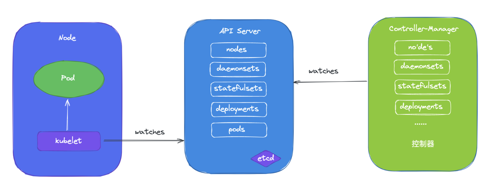
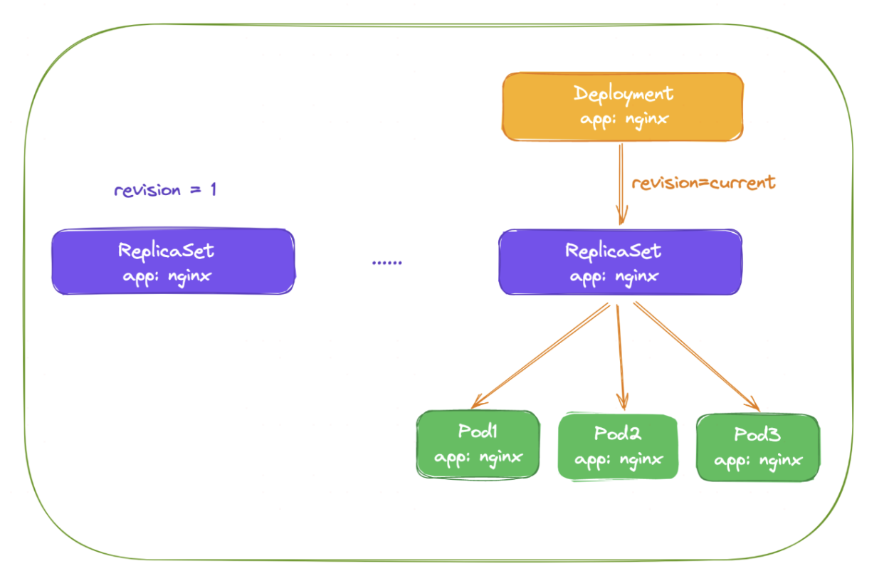
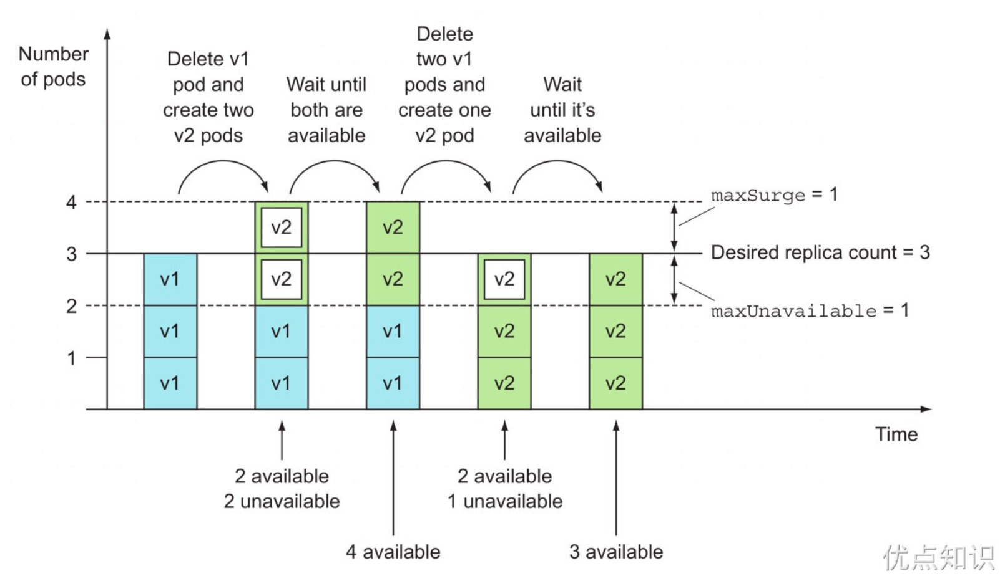

# 控制器

前面学习了 Pod 的原理和一些基本使用，但是在实际使用的时候并不会直接使用 Pod，而是会使用各种更高层级的控制器，Kubernetes 中运行了一系列控制器来确保集群的当前状态与期望状态保持一致，它们就是 Kubernetes 的大脑。例如，ReplicaSet 控制器负责维护集群中运行的 Pod 数量；Node 控制器负责监控节点的状态，并在节点出现故障时及时做出响应。总而言之，在 Kubernetes 中，每个控制器只负责某种类型的特定资源。

通过前面的课程学习我们知道了 master 的各组件中，API Server 仅负责将资源存储于 etcd 中，并将其变动通知给各其他组件，如 `kubelet`、`kube-scheduler`、`kube-proxy` 和 `kube-controller-manager` 等，`kube-scheduler` 监控到处于未绑定状态的 Pod 对象出现时就启动调度器为其挑选最合适的工作节点，另外 Kubernetes 的核心功能之一还在于要确保各资源对象的当前状态（`status`）已匹配用户期望的状态（`spec`），使当前状态不断地向期望状态“调谐”（`Reconcile`）来完成容器应用管理，这些就是 kube-controller-manager 的任务，kube-controller-manager 是一个独立的组件，但是它却包含了很多功能不同的控制器。



Kubernetes 控制器会监听资源的 `创建/更新/删除` 事件，并触发 `Reconcile` 调谐函数，整个调整过程被称作 `Reconcile Loop（调谐循环）` 或者 `Sync Loop（同步循环）`。Reconcile 是一个使用资源对象的命名空间和资源对象名称来调用的函数，使得资源对象的实际状态与资源清单中定义的状态保持一致。调用完成后，Reconcile 会将资源对象的状态更新为当前实际状态。

实现调谐功能是依靠的 Kubernetes 实现的核心机制之一的 `List-Watch`，在资源对象的状态发生变动时，由 API Server 负责写入 etcd 并通过触发机制主动通知给相关的客户端程序以确保其不会错过任何一个事件。控制器通过 API Server 的 Watch 接口实时监控目标资源对象的变动并执行调谐操作，但并不会与其他控制器进行任何交互。

# ReplicaSet

## 基本概念

假如现在有一个 Pod 正在提供线上的服务，来想想一下我们可能会遇到的一些场景：

- 某次运营活动非常成功，网站访问量突然暴增
- 运行当前 Pod 的节点发生故障了，Pod 不能正常提供服务了

第一种情况，可能比较好应对，活动之前我们可以大概计算下会有多大的访问量，提前多启动几个 Pod 副本，活动结束后再把多余的 Pod 杀掉，虽然有点麻烦，但是还是能够应对这种情况的。

第二种情况，可能某天夜里收到大量报警说服务挂了，然后起来打开电脑在另外的节点上重新启动一个新的 Pod，问题可以解决。

但是如果都人工的去解决遇到的这些问题，似乎又回到了以前刀耕火种的时代了是吧？如果有一种工具能够来帮助自动管理 Pod 就好了，Pod 挂了自动帮我在合适的节点上重新启动一个 Pod，这样是不是遇到上面的问题都不需要手动去解决了。

而 ReplicaSet 这种资源对象就可以来帮助我们实现这个功能，ReplicaSet（RS） 的主要作用就是维持一组 Pod 副本的运行，保证一定数量的 Pod 在集群中正常运行，ReplicaSet 控制器会持续监听它所控制的这些 Pod 的运行状态，在 Pod 发生故障数量减少或者增加时会触发调谐过程，始终保持副本数量一定。

## 基础实践

和 Pod 一样仍然还是通过 YAML 文件来描述 ReplicaSet 资源对象，如下 YAML 文件是一个常见的 ReplicaSet 定义：

```yaml
# nginx-rs.yaml
apiVersion: apps/v1
kind: ReplicaSet
metadata:
  name: nginx-rs
  namespace: default
spec:
  replicas: 3 # 期望的 Pod 副本数量，默认值为1
  selector: # Label Selector，必须匹配 Pod 模板中的标签
    matchLabels:
      app: nginx
  template: # Pod 模板
    metadata:
      labels:
        app: nginx
    spec:
      containers:
        - name: nginx
          image: nginx
          ports:
            - containerPort: 80
```

上面的 YAML 文件结构和之前定义的 Pod 看上去没太大两样，有常见的 apiVersion、kind、metadata，在 spec 下面描述 ReplicaSet 的基本信息，其中包含 3 个重要内容：

- replias：表示期望的 Pod 的副本数量
- selector：Label Selector，用来匹配要控制的 Pod 标签，需要和下面的 Pod 模板中的标签一致
- template：Pod 模板，实际上就是以前定义的 Pod 内容，相当于把一个 Pod 的描述以模板的形式嵌入到了 ReplicaSet 中来。

> Pod 模板这个概念非常重要，因为后面讲解到的大多数控制器，都会使用 Pod 模板来统一定义它所要管理的 Pod。更有意思的是，我们还会看到其他类型的对象模板，比如 Volume 的模板等。

上面就是定义的一个普通的 ReplicaSet 资源清单文件，ReplicaSet 控制器会通过定义的 Label Selector 标签去查找集群中的 Pod 对象。

直接来创建上面的资源对象：

```shell
➜  ~ kubectl apply -f nginx-rs.yaml
replicaset.apps/nginx-rs created
➜  ~ kubectl get rs nginx-rs
NAME       DESIRED   CURRENT   READY   AGE
nginx-rs   3         3         3       17m
```

通过查看 RS 可以看到当前资源对象的描述信息，包括 DESIRED、CURRENT、READY 的状态值，创建完成后，可以利用如下命令查看下 Pod 列表：

```shell
[root@master yamlDir]# kubectl get pods -l app=nginx
NAME             READY   STATUS    RESTARTS   AGE
nginx-rs-75gxb   1/1     Running   0          84s
nginx-rs-j95t5   1/1     Running   0          84s
nginx-rs-z465f   1/1     Running   0          84s
```

可以看到现在有 3 个 Pod，这 3 个 Pod 就是在 RS 中声明的 3 个副本，比如删除其中一个 Pod：

```shell
[root@master yamlDir]# kubectl delete pod nginx-rs-75gxb
pod "nginx-rs-75gxb" deleted
```

然后再查看 Pod 列表：

```shell
[root@master yamlDir]# kubectl get pods -l app=nginx
NAME             READY   STATUS    RESTARTS   AGE
nginx-rs-j95t5   1/1     Running   0          3m8s
nginx-rs-vlhht   1/1     Running   0          30s
nginx-rs-z465f   1/1     Running   0          3m8s
```

可以看到又重新出现了一个 Pod，这个就是上面所说的 ReplicaSet 控制器为我们做的工作，在 YAML 文件中声明 3 个副本，然后现在删除一个副本，就变成两个，这个时候 ReplicaSet 控制器监控到 Pod 数量和期望的 3 不一致，所以就需要启动一个新的 Pod 来保持 3 个副本，这个过程就是调谐的过程。同样可以查看 RS 的描述信息来查看到相关的事件信息：

```shell
[root@master yamlDir]# kubectl describe rs nginx-rs
Name:         nginx-rs
Namespace:    default
Selector:     app=nginx
Labels:       <none>
Annotations:  <none>
Replicas:     3 current / 3 desired
Pods Status:  3 Running / 0 Waiting / 0 Succeeded / 0 Failed
Pod Template:
  Labels:  app=nginx
  Containers:
   nginx:
    Image:        nginx
    Port:         80/TCP
    Host Port:    0/TCP
    Environment:  <none>
    Mounts:       <none>
  Volumes:        <none>
Events:
  Type    Reason            Age    From                   Message
  ----    ------            ----   ----                   -------
  Normal  SuccessfulCreate  3m39s  replicaset-controller  Created pod: nginx-rs-75gxb
  Normal  SuccessfulCreate  3m39s  replicaset-controller  Created pod: nginx-rs-j95t5
  Normal  SuccessfulCreate  3m39s  replicaset-controller  Created pod: nginx-rs-z465f
  # 由replicaset-controller 新建的 pod
  Normal  SuccessfulCreate  61s    replicaset-controller  Created pod: nginx-rs-vlhht
```

可以发现最开始通过 ReplicaSet 控制器创建了 3 个 Pod，后面删除 Pod 后， ReplicaSet 控制器又创建了一个 Pod，和上面的描述是一致的。如果这个时候把 RS 资源对象的 Pod 副本更改为 2 `spec.replicas=2`，这个时候我们来更新下资源对象：

```shell
[root@master yamlDir]# kubectl apply -f nginx-rs.yaml
replicaset.apps/nginx-rs configured
[root@master yamlDir]# kubectl describe rs nginx-rs
Name:         nginx-rs
Namespace:    default
Selector:     app=nginx
Labels:       <none>
Annotations:  <none>
Replicas:     2 current / 2 desired
Pods Status:  2 Running / 0 Waiting / 0 Succeeded / 0 Failed
Pod Template:
  Labels:  app=nginx
  Containers:
   nginx:
    Image:        nginx
    Port:         80/TCP
    Host Port:    0/TCP
    Environment:  <none>
    Mounts:       <none>
  Volumes:        <none>
Events:
  Type    Reason            Age    From                   Message
  ----    ------            ----   ----                   -------
  Normal  SuccessfulCreate  5m40s  replicaset-controller  Created pod: nginx-rs-75gxb
  Normal  SuccessfulCreate  5m40s  replicaset-controller  Created pod: nginx-rs-j95t5
  Normal  SuccessfulCreate  5m40s  replicaset-controller  Created pod: nginx-rs-z465f
  Normal  SuccessfulCreate  3m2s   replicaset-controller  Created pod: nginx-rs-vlhht
  # replicaset-controller 删除了一个 pod
  Normal  SuccessfulDelete  13s    replicaset-controller  Deleted pod: nginx-rs-vlhht
```

可以看到 Replicaset 控制器在发现资源声明中副本数变更为 2 后，就主动去删除了一个 Pod。

另外被 ReplicaSet 持有的 Pod 有一个 `metadata.ownerReferences` 指针指向当前的 ReplicaSet，表示当前 Pod 的所有者，这个引用主要会被集群中的垃圾收集器使用以清理失去所有者的 Pod 对象。可以通过将 Pod 资源描述信息导出查看：

```shell
[root@master yamlDir]# kubectl get pod nginx-rs-j95t5 -oyaml
apiVersion: v1
kind: Pod
metadata:
  creationTimestamp: "2024-02-23T02:50:17Z"
  generateName: nginx-rs-
  labels:
    app: nginx
  name: nginx-rs-j95t5
  namespace: default
  # 所属的引用
  ownerReferences:
  - apiVersion: apps/v1
    blockOwnerDeletion: true
    controller: true
    kind: ReplicaSet
    name: nginx-rs
    uid: 110356bb-356f-45e4-a485-a3df349db744
  resourceVersion: "458566"
  uid: 655fcace-9b78-4465-a594-8ce96d82d450
```

# Deployment

## 基本概念

前面学习了 ReplicaSet 控制器，了解到该控制器是用来维护集群中运行的 Pod 数量的，但是往往在实际操作的时候，我们反而不会去直接使用 RS，而是会使用更上层的控制器，比如接下来要学习的主角 Deployment。

Deployment 一个非常重要的功能就是实现了 Pod 的滚动更新，比如应用更新了，只需要更新容器镜像，然后修改 Deployment 里面的 Pod 模板镜像，那么 Deployment 就会用滚动更新（Rolling Update）的方式来升级现在的 Pod。

这个能力是非常重要的，因为对于线上的服务需要做到不中断服务，所以滚动更新就成了必须的一个功能。而 Deployment 这个能力的实现，依赖的就是前面的 ReplicaSet 这个资源对象，实际上可以通俗的理解就是每个 Deployment 就对应集群中的一次部署，这样就更好理解了。

## 基础实践

Deployment 资源对象的格式和 ReplicaSet 几乎一致，如下资源对象就是一个常见的 Deployment 资源类型：

```yaml
# nginx-deploy.yaml
apiVersion: apps/v1
kind: Deployment
metadata:
  name: nginx-deploy
  namespace: default
spec:
  replicas: 3 # 期望的 Pod 副本数量，默认值为1
  selector: # Label Selector，必须匹配 Pod 模板中的标签
    matchLabels:
      app: nginx
  template: # Pod 模板
    metadata:
      labels:
        app: nginx
    spec:
      containers:
        - name: nginx
          image: nginx
          ports:
            - containerPort: 80
```

这里只是将类型替换成了 Deployment，可以先来创建下这个资源对象：

```shell
➜  ~ kubectl apply -f nginx-deploy.yaml
deployment.apps/nginx-deploy created
➜  ~ kubectl get deployment
NAME           READY   UP-TO-DATE   AVAILABLE   AGE
nginx-deploy   3/3     3            3           58s
# 创建完成后，查看 Pod 状态：
[root@master yamlDir]# kubectl get pods -l app=nginx
NAME                           READY   STATUS    RESTARTS   AGE
nginx-deploy-ff6774dc6-2c9fj   1/1     Running   0          20s
nginx-deploy-ff6774dc6-dnkqs   1/1     Running   0          20s
nginx-deploy-ff6774dc6-h2dkj   1/1     Running   0          20s
```

到这里发现和之前的 RS 对象是否没有什么两样，都是根据`spec.replicas`来维持的副本数量，随意查看一个 Pod 的描述信息：

```shell
[root@master yamlDir]# kubectl describe pod nginx-deploy-ff6774dc6-2c9fj
Name:             nginx-deploy-ff6774dc6-2c9fj
Namespace:        default
Priority:         0
Service Account:  default
Node:             node1/192.168.220.147
Start Time:       Thu, 22 Feb 2024 22:19:16 -0500
# 这是pod的Labels
Labels:           app=nginx # 这是YAML中定义的
                  pod-template-hash=ff6774dc6 # 这是RS添加的
Annotations:      <none>
Status:           Running
IP:               10.244.1.15
IPs:
  IP:           10.244.1.15
# 这里可以看到被什么控制
Controlled By:  ReplicaSet/nginx-deploy-ff6774dc6
```

我们仔细查看其中有这样一个信息 `Controlled By: ReplicaSet/nginx-deploy-ff6774dc6`，什么意思？是不是表示当前这个 Pod 的控制器是一个 ReplicaSet 对象啊，我们不是创建的一个 Deployment 吗？为什么 Pod 会被 RS 所控制呢？那我们再去看下这个对应的 RS 对象的详细信息如何呢：

```shell
[root@master yamlDir]# kubectl describe rs nginx-deploy-ff6774dc6
Name:           nginx-deploy-ff6774dc6
Namespace:      default
# RS的选择器，其中就有pod-template-hash=ff6774dc6这个label
Selector:       app=nginx,pod-template-hash=ff6774dc6
Labels:         app=nginx
                pod-template-hash=ff6774dc6
Annotations:    deployment.kubernetes.io/desired-replicas: 3
                deployment.kubernetes.io/max-replicas: 4
                deployment.kubernetes.io/revision: 1
# 被什么控制
Controlled By:  Deployment/nginx-deploy
Replicas:       3 current / 3 desired
Pods Status:    3 Running / 0 Waiting / 0 Succeeded / 0 Failed
Pod Template:
  Labels:  app=nginx
           pod-template-hash=ff6774dc6
  Containers:
   nginx:
    Image:        nginx
    Port:         80/TCP
    Host Port:    0/TCP
    Environment:  <none>
    Mounts:       <none>
  Volumes:        <none>
Events:
  Type    Reason            Age    From                   Message
  ----    ------            ----   ----                   -------
  Normal  SuccessfulCreate  2m52s  replicaset-controller  Created pod: nginx-deploy-ff6774dc6-2c9fj
  Normal  SuccessfulCreate  2m52s  replicaset-controller  Created pod: nginx-deploy-ff6774dc6-h2dkj
  Normal  SuccessfulCreate  2m52s  replicaset-controller  Created pod: nginx-deploy-ff6774dc6-dnkqs
```

Deployment 控制器将 `pod-template-hash` 标签添加到 Deployment 所创建的每个 ReplicaSet 。

此标签可确保 Deployment 的子 ReplicaSet 不重叠。 标签是通过对 ReplicaSet 的 `PodTemplate` 进行哈希处理。 所生成的哈希值被添加到 ReplicaSet 选择算符、Pod 模板标签，并存在于在 ReplicaSet 可能拥有的任何现有 Pod 中。

其中有这样的一个信息：`Controlled By: Deployment/nginx-deploy`，明白了吧？意思就是Pod 依赖的控制器 RS 实际上被 Deployment 控制着呢，我们可以用下图来说明 Pod、ReplicaSet、Deployment 三者之间的关系：



通过上图可以很清楚的看到，定义了 3 个副本的 Deployment 与 ReplicaSet 和 Pod 的关系，就是一层一层进行控制的。而 Deployment 是通过管理 ReplicaSet 来实现水平扩展/收缩以及滚动更新两个功能的。

## 水平伸缩

水平扩展/收缩的功能比较简单，因为 ReplicaSet 就可以实现，所以 Deployment 控制器只需要去修改它控制的 ReplicaSet 的 Pod 副本数量就可以了。比如现在把 Pod 的副本调整到 4 个，那么 Deployment 所对应的 ReplicaSet 就会自动创建一个新的 Pod 出来，这样就水平扩展了，我们可以使用一个新的命令 `kubectl scale` 命令来完成这个操作：

```shell
➜  ~ kubectl scale deployment nginx-deploy --replicas=4
deployment.apps/nginx-deployment scaled
# 扩展完成后可以查看当前的 RS 对象：
[root@master yamlDir]# kubectl get rs
NAME                     DESIRED   CURRENT   READY   AGE
nginx-deploy-ff6774dc6   4         4         3       166m
```

可以看到期望的 Pod 数量已经变成 4 了，只是 Pod 还没准备完成，所以 READY 状态数量还是 3，同样查看 RS 的详细信息：

```shell
[root@master yamlDir]# kubectl describe rs nginx-deploy-ff6774dc6
...
Events:
  Type    Reason            Age   From                   Message
  ----    ------            ----  ----                   -------
  Normal  SuccessfulCreate  69s   replicaset-controller  Created pod: nginx-deploy-ff6774dc6-ntlwl
```

可以看到 ReplicaSet 控制器增加了一个新的 Pod，同样的 Deployment 资源对象的事件中也可以看到完成了扩容的操作：

```shell
[root@master yamlDir]# kubectl describe deployment nginx-deploy
...
Events:
  Type    Reason             Age    From                   Message
  ----    ------             ----   ----                   -------
  Normal  ScalingReplicaSet  2m16s  deployment-controller  Scaled up replica set nginx-deploy-ff6774dc6 to 4 from 3
```


## 滚动更新

如果只是水平扩展/收缩这两个功能，就完全没必要设计 Deployment 这个资源对象了，Deployment 最突出的一个功能是支持滚动更新，比如现在需要把应用容器更改为 `nginx:1.7.9` 版本，修改后的资源清单文件如下所示：

```yaml
apiVersion: apps/v1
kind: Deployment
metadata:
  name: nginx-deploy
  namespace: default
spec:
  replicas: 3
  selector:
    matchLabels:
      app: nginx
  minReadySeconds: 5
  strategy:
    type: RollingUpdate # 指定更新策略：RollingUpdate和Recreate
    rollingUpdate:
      maxSurge: 1
      maxUnavailable: 1
  template:
    metadata:
      labels:
        app: nginx
    spec:
      containers:
        - name: nginx
          image: nginx:1.7.9
          ports:
            - containerPort: 80
```

与前面相比较，除了更改了镜像之外，还指定了更新策略：

```yaml
minReadySeconds: 5
strategy:
  type: RollingUpdate
  rollingUpdate:
    maxSurge: 1
    maxUnavailable: 1
```

### 策略与属性

`.spec.strategy` 策略指定用于用新 Pod 替换旧 Pod 的策略。 `.spec.strategy.type` 可以是 `Recreate` 或 `RollingUpdate`。`RollingUpdate` 是默认值。

如果 `.spec.strategy.type==Recreate`，在创建新 Pod 之前，所有现有的 Pod 会被杀死。这会确保为了升级而创建新 Pod 之前原来的 Pod 都已终止。如果升级一个 Deployment， 所有旧版本的 Pod 都会立即被终止，控制器等待这些 Pod 被成功移除之后， 才会创建新版本的 Pod。如果手动删除一个 Pod，其生命周期是由 ReplicaSet 来控制的， 后者会立即创建一个替换 Pod（即使旧的 Pod 仍然处于 Terminating 状态）。

Deployment 会在 `.spec.strategy.type==RollingUpdate`时，采取滚动更新的方式更新 Pod。你可以指定 `maxUnavailable` 和 `maxSurge` 来控制滚动更新过程。

- **minReadySeconds**：`minReadySeconds` 是一个可选字段，用于指定新创建的 Pod 在没有任意容器崩溃情况下的最小就绪时间， 只有超出这个时间 Pod 才被视为可用。默认值为 0（Pod 在准备就绪后立即将被视为可用）。

  这个时间延迟允许额外的检查，以确保新启动的 Pod 是健康的，而不只是通过了就绪探针的检查。这有助于减少因 Pods 不健康而错误地推出的风险。在这个例子中，`minReadySeconds: 5` 意味着 Pod 在启动并成功通过就绪探针检查后至少 5 秒钟之后，才能被视为就绪。

- **maxSurge**：`.spec.strategy.rollingUpdate.maxSurge` 是一个可选字段，用来指定可以创建的超出期望 Pod 个数的 Pod 数量。此值可以是绝对数（例如，5）或期望 Pod 数的百分比（例如，10%）。 如果 `MaxUnavailable` 为 0，则此值不能为 0。百分比值会通过向上取整转换为绝对数。 此字段的默认值为 25%。

  例如，当此值为 30% 时，启动滚动更新后，会立即对新的 ReplicaSet 扩容，同时保证新旧 Pod 的总数不超过期望 Pod 总数的 130%。一旦旧 Pod 被杀死，新的 ReplicaSet 可以进一步扩容， 同时确保更新期间的任何时候运行中的 Pod 总数最多为期望 Pod 总数的 130%。

- **maxUnavaible**：`.spec.strategy.rollingUpdate.maxUnavailable` 是一个可选字段， 用来指定更新过程中不可用的 Pod 的个数上限。该值可以是绝对数字（例如，5），也可以是期望 Pod 数的百分比（例如，10%）。百分比值会转换成绝对数并去除小数部分。 如果 `.spec.strategy.rollingUpdate.maxSurge` 为 0，则此值不能为 0。 默认值为 25%。

  例如，当此值设置为 30% 时，滚动更新开始时会立即将旧 ReplicaSet 缩容到期望 Pod 个数的70%。 新 Pod 准备就绪后，可以继续缩容旧有的 ReplicaSet，然后对新的 ReplicaSet 扩容， 确保在更新期间可用的 Pod 总数在任何时候都至少为所需的 Pod 个数的 70%。



### RS变化

现在来直接更新上面的 Deployment 资源对象：

```
kubectl apply -f nginx-deploy.yaml
```

更新后，可以执行下面的 `kubectl rollout status` 命令来查看此次滚动更新的状态：

```shell
➜  ~ kubectl rollout status deployment/nginx-deploy
Waiting for deployment "nginx-deploy" rollout to finish: 2 out of 3 new replicas have been updated...
```

从上面的信息可以看出滚动更新已经有两个 Pod 已经更新完成了，在滚动更新过程中，还可以执行如下的命令来暂停更新：

```shell
➜  ~ kubectl rollout pause deployment/nginx-deploy
deployment.apps/nginx-deploy paused
```

这个时候滚动更新就暂停了，此时可以查看下 Deployment 的详细信息：

```shell
➜  ~ kubectl describe deploy nginx-deploy
Name:                   nginx-deploy
Namespace:              default
CreationTimestamp:      Sat, 16 Nov 2019 16:01:24 +0800
Labels:                 <none>
Annotations:            deployment.kubernetes.io/revision: 2
                        kubectl.kubernetes.io/last-applied-configuration:
                          {"apiVersion":"apps/v1","kind":"Deployment","metadata":{"annotations":{},"name":"nginx-deploy","namespace":"default"},"spec":{"minReadySec...
# deploy的选择器就只有YAML中定义的
Selector:               app=nginx
# 可以看到，期望3个副本，更新了2个副本，当前总共4个，可用4个
Replicas:               3 desired | 2 updated | 4 total | 4 available | 0 unavailable
# 下面就是yaml中声明的滚动更新属性
StrategyType:           RollingUpdate
MinReadySeconds:        5
RollingUpdateStrategy:  1 max unavailable, 1 max surge
......
# 展示了RS
OldReplicaSets:  nginx-deploy-85ff79dd56 (2/2 replicas created)
NewReplicaSet:   nginx-deploy-5b7b9ccb95 (2/2 replicas created)
Events:
  Type    Reason             Age    From                   Message
  ----    ------             ----   ----                   -------
  # 这是26分钟之前，水平扩容为4时的事件，原来的RS为nginx-deploy-85ff79dd56
  Normal  ScalingReplicaSet  26m    deployment-controller  Scaled up replica set nginx-deploy-85ff79dd56 to 4
  # 旧的 nginx-deploy-85ff79dd56 缩容到3
  Normal  ScalingReplicaSet  3m44s  deployment-controller  Scaled down replica set nginx-deploy-85ff79dd56 to 3
  # 新的RS nginx-deploy-5b7b9ccb95 启动第一个Pod
  Normal  ScalingReplicaSet  3m44s  deployment-controller  Scaled up replica set nginx-deploy-5b7b9ccb95 to 1
  # 旧的 nginx-deploy-85ff79dd56 缩容到2
  Normal  ScalingReplicaSet  3m44s  deployment-controller  Scaled down replica set nginx-deploy-85ff79dd56 to 2
  # 新的RS nginx-deploy-5b7b9ccb95 启动第二个Pod
  Normal  ScalingReplicaSet  3m44s  deployment-controller  Scaled up replica set nginx-deploy-5b7b9ccb95 to 2
```

仔细观察 Events 事件区域的变化，上面用 `kubectl scale` 命令将 Pod 副本调整到了 4，现在更新时副本声明变成 3 ，所以 Deployment 控制器首先是将之前控制的 `nginx-deploy-85ff79dd56` 这个 RS 资源对象进行缩容操作，然后滚动更新开始了，可以发现 Deployment 为一个新的 `nginx-deploy-5b7b9ccb95` RS 资源对象首先新建了一个新的 Pod，然后将之前的 RS 对象缩容到 2 了，再然后新的 RS 对象扩容到 2，后面由于暂停滚动升级了，所以没有后续的事件了，大家有看明白这个过程吧。

这个过程就是滚动更新的过程，启动一个新的 Pod，杀掉一个旧的 Pod，然后再启动一个新的 Pod，这样滚动更新下去，直到全都变成新的 Pod，这个时候系统中应该存在 4 个 Pod，因为我们设置的策略 maxSurge=1，所以在升级过程中是允许的，而且是两个新的 Pod，两个旧的 Pod：

```shell
➜  ~ kubectl get pods -l app=nginx
NAME                            READY   STATUS    RESTARTS   AGE
# 它们属于两个RS
nginx-deploy-5b7b9ccb95-k6pkh   1/1     Running   0          11m
nginx-deploy-5b7b9ccb95-l6lmx   1/1     Running   0          11m
nginx-deploy-85ff79dd56-7r76h   1/1     Running   0          75m
nginx-deploy-85ff79dd56-txc4h   1/1     Running   0          75m
```

查看 Deployment 的状态也可以看到当前的 Pod 状态：

```shell
➜  ~ kubectl get deployment
NAME           READY   UP-TO-DATE   AVAILABLE   AGE
nginx-deploy   4/3     2            4           75m
```

这个时候可以使用 `kubectl rollout resume` 来恢复我们的滚动更新：

```shell
➜  ~ kubectl rollout resume deployment/nginx-deploy
deployment.apps/nginx-deploy resumed
➜  ~ kubectl rollout status deployment/nginx-deploy
Waiting for deployment "nginx-deploy" rollout to finish: 2 of 3 updated replicas are available...
deployment "nginx-deploy" successfully rolled out
```

看到上面的信息证明滚动更新已经成功了，同样可以查看下资源状态：

```shell
➜  ~ kubectl get pod -l app=nginx
NAME                            READY   STATUS    RESTARTS   AGE
nginx-deploy-5b7b9ccb95-gmq7v   1/1     Running   0          115s
nginx-deploy-5b7b9ccb95-k6pkh   1/1     Running   0          15m
nginx-deploy-5b7b9ccb95-l6lmx   1/1     Running   0          15m
➜  ~ kubectl get deployment
NAME           READY   UP-TO-DATE   AVAILABLE   AGE
nginx-deploy   3/3     3            3           79m
# 这个时候我们查看 ReplicaSet 对象，可以发现会出现两个：
➜  ~ kubectl get rs -l app=nginx
NAME                      DESIRED   CURRENT   READY   AGE
nginx-deploy-5b7b9ccb95   3         3         3       18m
nginx-deploy-85ff79dd56   0         0         0       81m
```

从上面可以看出滚动更新之前使用的 RS 资源对象的 Pod 副本数已经变成 0 了，而滚动更新后的 RS 资源对象变成了 3 个副本，可以导出之前的 RS 对象查看：

```yaml
➜  ~ kubectl get rs nginx-deploy-85ff79dd56 -o yaml
apiVersion: apps/v1
kind: ReplicaSet
metadata:
  annotations:
    deployment.kubernetes.io/desired-replicas: "3"
    deployment.kubernetes.io/max-replicas: "4"
    deployment.kubernetes.io/revision: "1"
  creationTimestamp: "2019-11-16T08:01:24Z"
  generation: 5
  labels:
    app: nginx
    pod-template-hash: 85ff79dd56
  name: nginx-deploy-85ff79dd56
  namespace: default
  ownerReferences:
  - apiVersion: apps/v1
    blockOwnerDeletion: true
    controller: true
    kind: Deployment
    name: nginx-deploy
    uid: b0fc5614-ef58-496c-9111-740353bd90d4
  resourceVersion: "2140545"
  selfLink: /apis/apps/v1/namespaces/default/replicasets/nginx-deploy-85ff79dd56
  uid: 8eca2998-3610-4f80-9c21-5482ba579892
spec:
  # 副本数被调整为0
  replicas: 0
  selector:
    matchLabels:
      app: nginx
      pod-template-hash: 85ff79dd56
  template:
    metadata:
      creationTimestamp: null
      labels:
        app: nginx
        pod-template-hash: 85ff79dd56
    spec:
      containers:
      - image: nginx
        imagePullPolicy: Always
        name: nginx
        ports:
        - containerPort: 80
          protocol: TCP
        resources: {}
        terminationMessagePath: /dev/termination-log
        terminationMessagePolicy: File
      dnsPolicy: ClusterFirst
      restartPolicy: Always
      schedulerName: default-scheduler
      securityContext: {}
      terminationGracePeriodSeconds: 30
status:
  observedGeneration: 5
  replicas: 0
```

仔细观察这个资源对象里面的描述信息除了副本数变成了 `replicas=0` 之外，和更新之前没有什么区别吧？大家看到这里想到了什么？有了这个 RS 的记录存在，是不是我们就可以回滚了啊？而且还可以回滚到前面的任意一个版本。我们可以通过命令 `rollout history` 来获取：

```shell
➜  ~ kubectl rollout history deployment nginx-deploy
deployment.apps/nginx-deploy
REVISION  CHANGE-CAUSE
1         <none>
2         <none>
```

其实 `rollout history` 中记录的 `revision` 是和 ReplicaSets 一一对应。如果手动删除某个 ReplicaSet，对应的`rollout history` 就会被删除，也就是说你无法回滚到这个 `revison` 了，同样我们还可以查看一个 `revison` 的详细信息：

```shell
➜  ~ kubectl rollout history deployment nginx-deploy --revision=1
deployment.apps/nginx-deploy with revision #1
Pod Template:
  Labels:       app=nginx
        pod-template-hash=85ff79dd56 # 通过这个label，可以确定是第一个版本
  Containers:
   nginx:
    Image:      nginx
    Port:       80/TCP
    Host Port:  0/TCP
    Environment:        <none>
    Mounts:     <none>
  Volumes:      <none>
```

假如现在要直接回退到当前版本的前一个版本，可以直接使用如下命令进行操作：

```shell
➜  ~ kubectl rollout undo deployment nginx-deploy
# 当然也可以回退到指定的revision版本：
➜  ~ kubectl rollout undo deployment nginx-deploy --to-revision=1
deployment "nginx-deploy" rolled back
```

回滚的过程中同样可以查看回滚状态：

```shell
➜  ~ kubectl rollout status deployment/nginx-deploy
Waiting for deployment "nginx-deploy" rollout to finish: 1 old replicas are pending termination...
Waiting for deployment "nginx-deploy" rollout to finish: 1 old replicas are pending termination...
Waiting for deployment "nginx-deploy" rollout to finish: 1 old replicas are pending termination...
Waiting for deployment "nginx-deploy" rollout to finish: 2 of 3 updated replicas are available...
Waiting for deployment "nginx-deploy" rollout to finish: 2 of 3 updated replicas are available...
deployment "nginx-deploy" successfully rolled out
```

这个时候查看对应的 RS 资源对象可以看到 Pod 副本已经回到之前的 RS 里面去了：

```shell
➜  ~ kubectl get rs -l app=nginx
NAME                      DESIRED   CURRENT   READY   AGE
nginx-deploy-5b7b9ccb95   0         0         0       31m
nginx-deploy-85ff79dd56   3         3         3       95m
```

不过需要注意的是回滚的操作同样也会导致 history 的 revision 递增：

```shell
➜  ~ kubectl rollout history deployment nginx-deploy
deployment.apps/nginx-deploy
REVISION  CHANGE-CAUSE
2         <none>
3         <none>
```