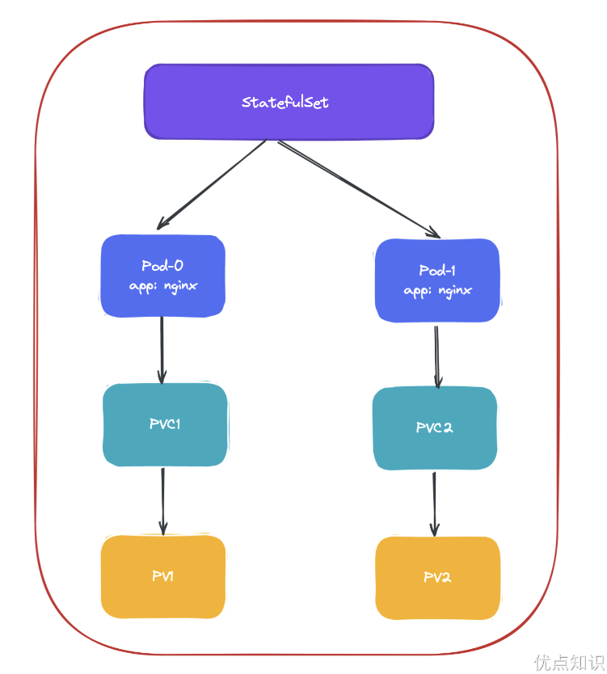
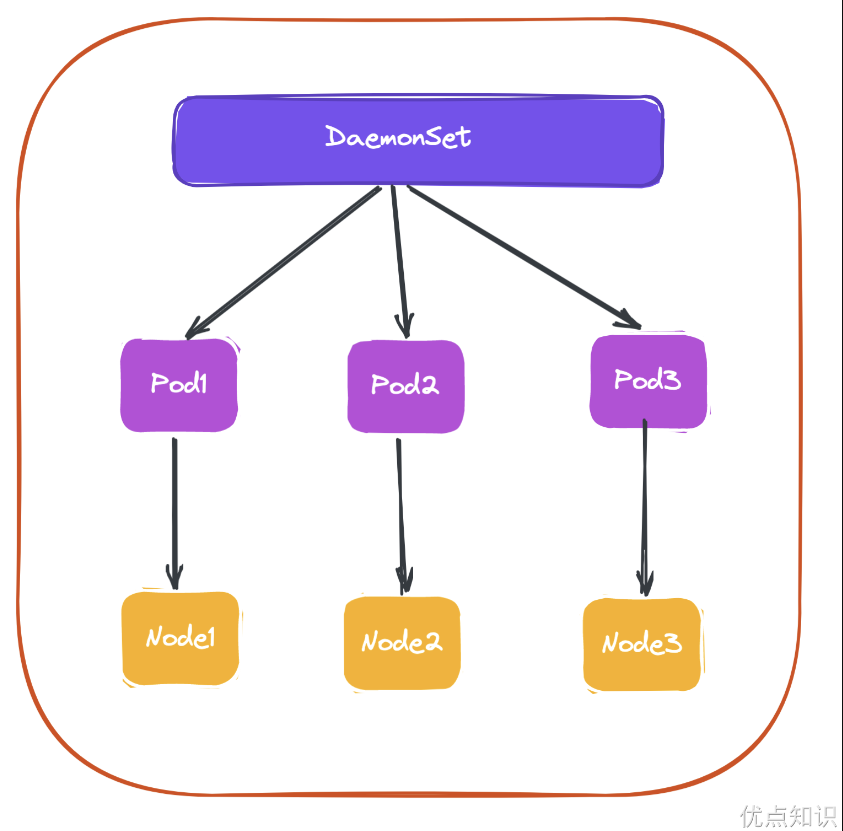

# 简介

前面学习了 Deployment 和 ReplicaSet 两种资源对象的使用，在实际使用的过程中，Deployment 并不能编排所有类型的应用，对无状态服务编排是非常容易的，但是对于有状态服务就无能为力了。我们需要先明白一个概念：什么是有状态服务，什么是无状态服务。

- 无状态服务（Stateless Service）：该服务运行的实例不会在本地存储需要持久化的数据，并且多个实例对于同一个请求响应的结果是完全一致的。比如前面讲解的 WordPress 实例，是不是可以同时启动多个实例，但是访问任意一个实例得到的结果都是一样的吧？因为它唯一需要持久化的数据是存储在 MySQL 数据库中的，所以可以说 WordPress 这个应用是无状态服务，但是 MySQL 数据库就不是了，因为需要把数据持久化到本地。
- 有状态服务（Stateful Service）：就和上面的概念是对立的了，该服务运行的实例需要在本地存储持久化数据。比如上面的 MySQL 数据库，现在运行在节点 A，那么数据就存储在节点 A 上面的，如果这个时候把该服务迁移到节点 B 去的话，那么就没有之前的数据了，因为需要去对应的数据目录里面查询数据，而此时没有任何数据。

现在对有状态和无状态有一定的认识了吧，比如我们常见的 WEB 应用，是通过 Session 来保持用户的登录状态的，如果我们将 Session 持久化到节点上，那么该应用就是一个有状态的服务了，因为我现在登录进来你把我的 Session 持久化到节点 A 上了，下一次请求被路由到节点 B 上去了，但是节点 B 上根本就没有我当前的 Session 数据，就会被认为是未登录状态了，这样就导致我前后两次请求得到的结果不一致了。

所以一般为了横向扩展，都会把这类 WEB 应用改成无状态的服务，怎么改？将 Session 数据存入一个公共的地方，比如 Redis 里面，是不是就可以了，对于一些客户端请求 API 的情况，我们就不使用 Session 来保持用户状态，改成用 Token 也是可以的。

无状态服务利用前面的 Deployment 可以很好的进行编排，对应有状态服务，需要考虑的细节就要多很多了。容器化应用程序最困难的任务之一，就是设计有状态分布式组件的部署体系结构。

由于无状态组件没有预定义的启动顺序、集群要求、点对点 TCP 连接、唯一的网络标识符、正常的启动和终止要求等，因此可以很容易地进行容器化。

诸如数据库、大数据分析系统、分布式 key/value 存储、消息中间件需要有复杂的分布式体系结构，都可能会用到上述功能。为此，Kubernetes 引入了 StatefulSet 这种资源对象来支持这种复杂的需求。StatefulSet 类似于 ReplicaSet，但是它可以处理 Pod 的启动顺序，为保留每个 Pod 设置唯一标识，具有以下几个功能特性：

- 稳定的、唯一的网络标识符
- 稳定的、持久化的存储
- 有序的、优雅的部署和缩放
- 有序的、优雅的删除和终止
- 有序的、自动滚动更新

# Headless Service

在我们学习 StatefulSet 对象之前，我们还必须了解一个新的概念：Headless Service。Service 其实在之前我们和大家提到过，Service 是应用服务的抽象，通过 Labels 为应用提供负载均衡和服务发现，每个 Service 都会自动分配一个 cluster IP 和 DNS 名，在集群内部我们可以通过该地址或者通过 FDQN 的形式来访问服务。

在集群中我们是通过部署 CoreDNS 组件来为 Kubernetes 集群提供 DNS 服务的，CoreDNS 同样通过 watch 到 APIServer 中的新服务来为每个服务创建一组 DNS 记录。如果在整个集群中都启用了 DNS，则所有 Pod 都应该能够通过其 DNS 名称自动解析服务。

例如，如果你在 Kubernetes 命名空间 my-ns 中有一个名为 my-service 的 Service 服务，则控制平面和 CoreDNS 会其创建一个 my-service.my-ns 的 DNS 记录（全路径为 my-service.my-ns.svc.cluster.local），my-ns 命名空间中的 Pod 应该能够通过名称 my-service 来找到服务（当然 my-service.my-ns 也可以工作）。而其他命名空间中的 Pod 必须将名称限定为 my-service.my-ns，这些名称将解析为 Service 服务分配的 cluster IP，然后该 Service 就会将请求代理到其关联的 Endpoints 列表中的某个 Pod 上去了，所以 Service 这里的作用有点类似于 Nginx 代理。

对于 DNS 的使用实际上也有两种情况：

- 第一种就是普通的 Service，我们访问 my-service.my-ns.svc.cluster.local 的时候是通过集群中的 DNS 服务解析到的 my-service 这个 Service 的 cluster IP 。所有发送到该 IP 的流量都会被 kube-proxy 捕获并分发到 Service 后面的 Pod 中。而 Headless Service 不分配 VIP，kube-proxy 也不会处理发往 Headless Service 的流量。
- 第二种情况就是 Headless Service，对于这种情况，我们访问 my-service.my-ns.svc.cluster.local 的时候是直接解析到的 my-service 代理的某一个具体的 Pod 的 IP 地址，中间少了 cluster IP 的转发，这就是二者的最大区别。Headless Service 不需要分配一个 VIP(也称为 cluster IP)，kube-proxy 不会处理它们。当你尝试解析 my-service.my-ns.svc.cluster.local 时，DNS 会返回后端 Pod 的 IP 地址列表，而不是单一的 VIP。由于没有 kube-proxy 进行负载均衡，所有负载均衡逻辑都需要客户端来实现。这可能意味着客户端需要知道如何处理 Pod 列表，并决定如何分发请求。

比如我们定义一个如下的 Headless Service：

```yaml
# headless-svc.yaml
apiVersion: v1
kind: Service
metadata:
  name: nginx
  namespace: default
  labels:
    app: nginx
spec:
  ports:
    - name: http
      port: 80
  clusterIP: None
  selector:
    app: nginx
```

实际上 Headless Service 在定义上和普通的 Service 几乎一致, 只是他配置的 clusterIP=None，所以，这个 Service 被创建后并不会被分配一个 cluster IP，而是会以 DNS 记录的方式暴露出它所代理的 Pod，而且还有一个非常重要的特性，对于 Headless Service 所代理的所有 Pod 的 IP 地址都会绑定一个如下所示的 DNS 记录：

```
<pod-name>.<svc-name>.<namespace>.svc.cluster.local
```

这个 DNS 记录正是 Kubernetes 集群为 Pod 分配的一个唯一标识，只要我们知道 Pod 的名字，以及它对应的 Service 名字，就可以组装出这样一条 DNS 记录访问到 Pod 的 IP 地址，这个能力是非常重要的，接下来我们就来看下 StatefulSet 资源对象是如何结合 Headless Service 提供服务的。

# StatefulSet

在开始之前，我们先准备两个 1G 的存储卷（PV），如果你使用的是 Kind 搭建的集群，则可以忽略该步骤，因为 Kind 搭建的集群会自动提供一个 local-path-provisioner 组件，该组件会自动生成 PV。在后面的课程中我们也会和大家详细讲解 PV 和 PVC 的使用方法的，如果不是 Kind 搭建的集群可以先手动创建下面的 PV 对象：

```yaml
# pv.yaml
apiVersion: v1
kind: PersistentVolume
metadata:
  name: pv001
spec:
  capacity:
    storage: 1Gi
  accessModes:
    - ReadWriteOnce
  hostPath:
    path: /tmp/pv001

---
apiVersion: v1
kind: PersistentVolume
metadata:
  name: pv002
spec:
  capacity:
    storage: 1Gi
  accessModes:
    - ReadWriteOnce
  hostPath:
    path: /tmp/pv002
```

然后直接创建 PV 即可：

```shell
[root@master yamlDir]# kubectl apply -f pv.yaml
persistentvolume/pv001 created
persistentvolume/pv002 created
[root@master yamlDir]# kubectl get pv
NAME    CAPACITY   ACCESS MODES   RECLAIM POLICY   STATUS      CLAIM   STORAGECLASS   REASON   AGE
pv001   1Gi        RWO            Retain           Available                                   15s
pv002   1Gi        RWO            Retain           Available                                   15s
```

可以看到成功创建了两个 PV 对象，状态是：Available。

## 特性

然后接下来声明一个如下所示的 StatefulSet 资源清单：

```yaml
# nginx-sts.yaml
apiVersion: v1
kind: Service
metadata:
  name: nginx
  namespace: default
  labels:
    app: nginx
spec:
  ports:
    - name: http
      port: 80
  clusterIP: None
  selector:
    app: nginx
---
apiVersion: apps/v1
kind: StatefulSet
metadata:
  name: web
  namespace: default
spec:
  serviceName: "nginx"
  replicas: 2
  selector:
    matchLabels:
      app: nginx
  template:
    metadata:
      labels:
        app: nginx
    spec:
      containers:
        - name: nginx
          image: nginx:1.7.9
          ports:
            - name: web
              containerPort: 80
          volumeMounts:
            - name: www
              mountPath: /usr/share/nginx/html
  volumeClaimTemplates:
    - metadata:
        name: www
      spec:
        accessModes: ["ReadWriteOnce"]
        resources:
          requests:
            storage: 1Gi
```

从上面的资源清单中可以看出和我们前面的 Deployment 基本上也是一致的，也是通过声明的 Pod 模板来创建 Pod 的，另外上面资源清单中和 volumeMounts 进行关联的不是 volumes 而是一个新的属性：volumeClaimTemplates，该属性会自动创建一个 PVC 对象，其实这里就是一个 PVC 的模板，和 Pod 模板类似，PVC 被创建后会自动去关联当前系统中和他合适的 PV 进行绑定。

除此之外，还多了一个 serviceName: "nginx" 的字段，serviceName 就是管理当前 StatefulSet 的服务名称，该服务必须在 StatefulSet 之前存在（实际测试并不是必须存在，但是如果要做 DNS 解析则必须存在），Pod 会遵循以下格式获取 DNS/主机名：pod-specific-string.serviceName..svc.cluster.local，其中 pod-specific-string 由 StatefulSet 控制器管理。



StatefulSet 的拓扑结构和其他用于部署的资源对象其实比较类似，比较大的区别在于 StatefulSet 引入了 PV 和 PVC 对象来持久存储服务产生的状态，这样所有的服务虽然可以被杀掉或者重启，但是其中的数据由于 PV 的原因不会丢失。

现在我们来直接创建对应的 StatefulSet 对象了：

```shell
[root@master yamlDir]# kubectl apply -f nginx-sts.yaml
service/nginx created
statefulset.apps/web created
[root@master yamlDir]# kubectl get svc nginx
NAME    TYPE        CLUSTER-IP   EXTERNAL-IP   PORT(S)   AGE
nginx   ClusterIP   None         <none>        80/TCP    28s
[root@master yamlDir]# kubectl get pvc
NAME        STATUS   VOLUME   CAPACITY   ACCESS MODES   STORAGECLASS   AGE
www-web-0   Bound    pv001    1Gi        RWO                           45s
www-web-1   Bound    pv002    1Gi        RWO                           35s
```

可以看到这里通过 Volume 模板自动生成了两个 PVC 对象，也自动和 PV 进行了绑定。这个时候我们可以快速通过一个 --watch 参数来查看 Pod 的创建过程：

```shell
➜  ~ kubectl get pods -l app=nginx --watch
NAME                      READY   STATUS              RESTARTS   AGE
web-0                     0/1     ContainerCreating   0          1s
web-0                     1/1     Running             0          2s
web-1                     0/1     Pending             0          0s
web-1                     0/1     Pending             0          0s
web-1                     0/1     ContainerCreating   0          0s
web-1                     1/1     Running             0          6s
```


## 管理策略


## 更新策略

前面课程中我们学习了 Deployment 的升级策略，在 StatefulSet 中同样也支持两种升级策略：onDelete 和 RollingUpdate，同样可以通过设置 .spec.updateStrategy.type 进行指定。

- OnDelete: 当 .spec.updateStrategy.type 被设置为 OnDelete 时，StatefulSet 的自动更新功能将被禁用。这意味着当 StatefulSet 的 .spec.template 发生变化时，新的 Pod 不会自动创建。必须手动删除旧的 Pod，然后 StatefulSet 控制器才会使用新的 Pod 模板创建新的 Pod。这种策略允许管理员控制更新过程，例如，管理员可以在维护窗口期间逐个删除 Pod 以触发更新。虽然 OnDelete 策略不要求管理员按特定的顺序删除 Pod，但按逆序删除 Pod（从最后一个开始）通常是个好习惯。
- RollingUpdate：当 .spec.updateStrategy.type 被设置为 RollingUpdate 时（这是默认设置），StatefulSet 控制器将自动滚动更新所有 Pods。在这种策略下，控制器会依照 StatefulSet 中 Pod 的顺序（通常是从最后一个开始）逐一更新 Pod。在更新每个 Pod 之前，控制器会等待前一个 Pod 成功更新并处于 Ready 状态。这保证了众多的应用实例中始终有一个子集是正常运行的，从而最小化了更新带来的影响。不过需要注意 StatefulSet 的 Pod 在部署时是顺序从 0~n 的，而在滚动更新时，这些 Pod 则是按逆序的方式即 n~0 一次删除并创建。


### 滚动更新

RollingUpdate 更新策略会更新一个 StatefulSet 中的所有 Pod，采用与序号索引相反的顺序进行更新。

```
[root@master yamlDir]# kubectl explain sts.spec.updateStrategy.rollingUpdate
KIND:     StatefulSet
VERSION:  apps/v1

RESOURCE: rollingUpdate <Object>

DESCRIPTION:
     RollingUpdate is used to communicate parameters when Type is
     RollingUpdateStatefulSetStrategyType.

     RollingUpdateStatefulSetStrategy is used to communicate parameter for
     RollingUpdateStatefulSetStrategyType.

FIELDS:
   maxUnavailable       <string>
     The maximum number of pods that can be unavailable during the update. Value
     can be an absolute number (ex: 5) or a percentage of desired pods (ex:
     10%). Absolute number is calculated from percentage by rounding up. This
     can not be 0. Defaults to 1. This field is alpha-level and is only honored
     by servers that enable the MaxUnavailableStatefulSet feature. The field
     applies to all pods in the range 0 to Replicas-1. That means if there is
     any unavailable pod in the range 0 to Replicas-1, it will be counted
     towards MaxUnavailable.

   partition    <integer>
     Partition indicates the ordinal at which the StatefulSet should be
     partitioned for updates. During a rolling update, all pods from ordinal
     Replicas-1 to Partition are updated. All pods from ordinal Partition-1 to 0
     remain untouched. This is helpful in being able to do a canary based
     deployment. The default value is 0.

```

从上面文档可以看出 StatefulSet 的滚动更新策略只支持 maxUnavailable、partition 两个属性，我们先按照属性的默认值进行测试。

重新创建前面的 StatefulSet 应用：

```
➜ kubectl apply -f nginx-sts.yaml
```

然后我们通过 kubectl patch 更新容器镜像（当然也可以直接修改 yaml 文件）：

```
➜ kubectl patch statefulset web --type='json' -p='[{"op": "replace", "path":"/spec/template/spec/containers/0/image", "value":"nginx:latest"}]'
```

然后此时我们来监控 StatefulSet 中的 Pod：

```
➜ kubectl get pod -l app=nginx -w
```

会输出如下所示的内容：

```
[root@master yamlDir]# kubectl get pod -l app=nginx -w
NAME    READY   STATUS              RESTARTS   AGE
web-0   1/1     Running             0          2m10s
web-1   0/1     ContainerCreating   0          10s
web-1   1/1     Running             0          25s
web-0   1/1     Terminating         0          2m25s
web-0   0/1     Terminating         0          2m26s
web-0   0/1     Pending             0          0s
web-0   0/1     ContainerCreating   0          0s
web-0   1/1     Running             0          2s
```

StatefulSet 里的 Pod 采用和序号相反的顺序更新，在更新下一个 Pod 前，StatefulSet 控制器终止 Pod 并等待它们变成 Running 和 Ready。

同样我们还可以使用 kubectl rollout status sts/<名称> 来查看 StatefulSet 的滚动更新状态。

```
[root@master yamlDir]# kubectl rollout status sts/web
partitioned roll out complete: 2 new pods have been updated...
```


### 分段更新

另外 StatefulSet 的滚动升级还支持 Partitions的特性，可以通过 .spec.updateStrategy.rollingUpdate.partition 进行设置。这个属性用于控制分阶段进行滚动更新。在滚动更新期间，所有从 Replicas-1 到 Partition 的 Pod 都将被更新。从 Partition-1 到 0 的所有 Pod 保持不变。这在进行金丝雀部署时非常有用。默认值是 0。

现在我们来重新创建如下所示的 StatefulSet，设置 4 个副本（这里注意将pv增加两个），并配置滚动更新的 partition 为 2：

```yaml
# nginx-sts-parts.yaml
apiVersion: v1
kind: Service
metadata:
  name: nginx
  namespace: default
  labels:
    app: nginx
spec:
  ports:
    - name: http
      port: 80
  clusterIP: None
  selector:
    app: nginx
---
apiVersion: apps/v1
kind: StatefulSet
metadata:
  name: web
  namespace: default
spec:
  serviceName: nginx
  replicas: 4
  updateStrategy:
    type: RollingUpdate
    rollingUpdate:
      partition: 2
  selector:
    matchLabels:
      app: nginx
  template:
    metadata:
      labels:
        app: nginx
    spec:
      containers:
        - name: nginx
          image: nginx:1.7.9
          ports:
            - name: web
              containerPort: 80
          volumeMounts:
            - name: www
              mountPath: /usr/share/nginx/html
  volumeClaimTemplates:
    - metadata:
        name: www
      spec:
        accessModes: ["ReadWriteOnce"]
        resources:
          requests:
            storage: 1Gi
```

直接创建上面的资源清单：

```
[root@master yamlDir]# kubectl apply -f nginx-sts-parts.yaml
service/nginx unchanged
statefulset.apps/web configured
[root@master yamlDir]# kubectl get pod -l app=nginx -owide
NAME    READY   STATUS    RESTARTS   AGE   IP            NODE    NOMINATED NODE   READINESS GATES
web-0   1/1     Running   0          8s    10.244.1.13   node1   <none>           <none>
web-1   1/1     Running   0          7s    10.244.2.11   node2   <none>           <none>
web-2   1/1     Running   0          6s    10.244.1.14   node1   <none>           <none>
web-3   1/1     Running   0          4s    10.244.2.12   node2   <none>           <none>
```

现在我们来更新应用镜像版本触发一次滚动更新：

```
➜ kubectl patch statefulset web --type='json' -p='[{"op": "replace", "path":"/spec/template/spec/containers/0/image", "value":"nginx:latest"}]'
```

则正常 web-3 和 web-2 两个 Pod 会被更新成新的版本。当指定了 partition 时，如果更新了 StatefulSet 的 .spec.template，则所有序号大于或等于 partition 的 Pod 都将被更新，如果一个序号小于分区的 Pod 被删除或者终止，它将被按照原来的配置恢复。

```
[root@master yamlDir]# kubectl get pod -l app=nginx -w
NAME    READY   STATUS    RESTARTS   AGE
web-0   1/1     Running   0          3m15s
web-1   1/1     Running   0          3m14s
web-2   1/1     Running   0          3m13s
web-3   1/1     Running   0          3m11s
web-3   1/1     Terminating   0          3m27s
web-3   0/1     Terminating   0          3m28s
web-3   0/1     Pending       0          0s
web-3   0/1     ContainerCreating   0          0s
web-3   1/1     Running             0          2s
web-2   1/1     Terminating         0          3m32s
web-2   0/1     Terminating         0          3m32s
web-2   0/1     Pending             0          0s
web-2   0/1     ContainerCreating   0          0s
web-2   1/1     Running             0          1s
```

现在就出现了两个版本同时提供服务的情况了，这是不是就是我们常说的金丝雀发布？

在实际的项目中，其实我们还是很少会去直接通过 StatefulSet 来部署我们的有状态服务的，除非你自己能够完全能够 hold 住，对于一些特定的服务，我们可能会使用更加高级的 Operator 来部署，比如 etcd-operator、prometheus-operator 等等，这些应用都能够很好的来管理有状态的服务，而不是单纯的使用一个 StatefulSet 来部署一个 Pod 就行，因为对于有状态的应用最重要的还是数据恢复、故障转移等等。

# DaemonSet

通过该控制器名称可以看出用法：Daemon，就是用来部署守护进程的，DaemonSet用于在每个 Kubernetes 节点中将守护进程的副本作为后台进程运行，说白了就是在每个节点部署一个 Pod 副本，当节点加入到 Kubernetes 集群中，Pod 会被调度到该节点上运行，当节点从集群只能够被移除后，该节点上的这个 Pod 也会被移除，当然，如果我们删除 DaemonSet，所有和这个对象相关的 Pods 都会被删除。那么在哪种情况下我们会需要用到这种业务场景呢？其实这种场景还是比较普通的，比如：

- 集群存储守护程序，如 glusterd、ceph 要部署在每个节点上以提供持久性存储；
- 节点监控守护进程，如 Prometheus 监控集群，可以在每个节点上运行一个 node-exporter 进程来收集监控节点的信息；
- 日志收集守护程序，如 fluentd 或 logstash，在每个节点上运行以收集容器的日志
- 节点网络插件，比如 flannel、calico，在每个节点上运行为 Pod 提供网络服务。

这里需要特别说明的一个就是关于 DaemonSet 运行的 Pod 的调度问题，正常情况下，Pod 运行在哪个节点上是由 Kubernetes 的调度器策略来决定的，然而，由 DaemonSet 控制器创建的 Pod 实际上提前已经确定了在哪个节点上了（Pod 创建时指定了.spec.nodeName），所以：

- DaemonSet 并不关心一个节点的 unshedulable 字段，这个我们会在后面的调度章节和大家讲解的。
- DaemonSet 可以创建 Pod，即使调度器还没有启动。

下面我们直接使用一个示例来演示下，在每个节点上部署一个 Nginx Pod：

```yaml
# nginx-ds.yaml
apiVersion: apps/v1
kind: DaemonSet
metadata:
  name: nginx-ds
  namespace: default
spec:
  selector:
    matchLabels:
      k8s-app: nginx
  template:
    metadata:
      labels:
        k8s-app: nginx
    spec:
      containers:
        - image: nginx:1.7.9
          name: nginx
          ports:
            - name: http
              containerPort: 80
```

然后直接创建即可：

```shell
➜  ~ kubectl apply -f nginx-ds.yaml
daemonset.apps/nginx-ds created
```

创建完成后，我们查看 Pod 的状态：

```shell
[root@master yamlDir]# kubectl get nodes
NAME     STATUS   ROLES           AGE     VERSION
master   Ready    control-plane   4d10h   v1.25.4
node1    Ready    <none>          4d10h   v1.25.4
node2    Ready    <none>          4d10h   v1.25.4
[root@master yamlDir]# kubectl get pods -l k8s-app=nginx -o wide
NAME             READY   STATUS    RESTARTS   AGE   IP            NODE    NOMINATED NODE   READINESS GATES
nginx-ds-x8s6j   1/1     Running   0          26s   10.244.1.16   node1   <none>           <none>
nginx-ds-xgrnh   1/1     Running   0          26s   10.244.2.14   node2   <none>           <none>
```

我们观察可以发现除了 control-plane 节点之外的 2 个节点上都有一个相应的 Pod 运行，因为 master 节点上默认被打上了污点，所以默认情况下不能调度普通的 Pod 上去，后面讲解调度器的时候会和大家学习如何调度上去。

基本上我们可以用下图来描述 DaemonSet 的拓扑图：



集群中的 Pod 和 Node 是一一对应的，而 DaemonSet 会管理全部机器上的 Pod 副本，负责对它们进行更新和删除。

那么，DaemonSet 控制器是如何保证每个 Node 上有且只有一个被管理的 Pod 呢？

- 首先控制器从 Etcd 获取到所有的 Node 列表，然后遍历所有的 Node。
- 根据资源对象定义是否有调度相关的配置，然后分别检查 Node 是否符合要求。
- 在可运行 Pod 的节点上检查是否已有对应的 Pod，如果没有，则在这个 Node 上创建该 Pod；如果有，并且数量大于 1，那就把多余的 Pod 从这个节点上删除；如果有且只有一个 Pod，那就说明是正常情况。

实际上当我们学习了资源调度后，我们也可以自己用 Deployment 来实现 DaemonSet 的效果，这里我们明白 DaemonSet 如何使用的即可，当然该资源对象也有对应的更新策略，有 OnDelete 和 RollingUpdate 两种方式，默认是滚动更新。


