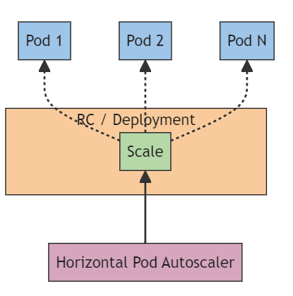
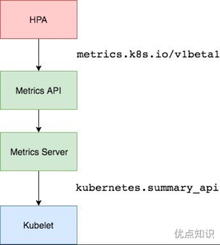

# Pod水平自动扩缩

> 参考资料：https://kubernetes.io/zh-cn/docs/tasks/run-application/horizontal-pod-autoscale/

在 Kubernetes 中，**HorizontalPodAutoscaler** 自动更新工作负载资源 （例如 [Deployment](https://kubernetes.io/zh-cn/docs/concepts/workloads/controllers/deployment/) 或者 [StatefulSet](https://kubernetes.io/zh-cn/docs/concepts/workloads/controllers/statefulset/)）， 目的是自动扩缩工作负载以满足需求。

水平扩缩意味着对增加的负载的响应是部署更多的 [Pod](https://kubernetes.io/zh-cn/docs/concepts/workloads/pods/)。 这与“垂直（Vertical）”扩缩不同，对于 Kubernetes， 垂直扩缩意味着将更多资源（例如：内存或 CPU）分配给已经为工作负载运行的 Pod。

如果负载减少，并且 Pod 的数量高于配置的最小值， HorizontalPodAutoscaler 会指示工作负载资源（Deployment、StatefulSet 或其他类似资源）缩减。水平 Pod 自动扩缩不适用于无法扩缩的对象（例如：[DaemonSet](https://kubernetes.io/zh-cn/docs/concepts/workloads/controllers/daemonset/)。）

**HorizontalPodAutoscaler 被实现为 Kubernetes API 资源和[控制器](https://kubernetes.io/zh-cn/docs/concepts/architecture/controller/)。**资源决定了控制器的行为。 在 Kubernetes [控制平面](https://kubernetes.io/zh-cn/docs/reference/glossary/?all=true#term-control-plane)内运行的水平 Pod 自动扩缩控制器会定期调整其目标（例如：Deployment）的所需规模，以匹配观察到的指标， 例如，平均 CPU 利用率、平均内存利用率或你指定的任何其他自定义指标。

## HPA如何工作的



<center style="color:#C0C0C0;text-decoration:underline">图 1. HorizontalPodAutoscaler 控制 Deployment 及其 ReplicaSet 的规模</center>

Kubernetes 将水平 Pod 自动扩缩实现为一个间歇运行的控制回路（它不是一个连续的过程）。间隔由 [`kube-controller-manager`](https://kubernetes.io/zh-cn/docs/reference/command-line-tools-reference/kube-controller-manager/) 的 `--horizontal-pod-autoscaler-sync-period` 参数设置（默认间隔为 15 秒）。

在每个时间段内，控制器管理器都会根据每个 HorizontalPodAutoscaler 定义中指定的指标查询资源利用率。 控制器管理器找到由 `scaleTargetRef` 定义的目标资源，然后根据目标资源的 `.spec.selector` 标签选择 Pod， 并从资源指标 API（针对每个 Pod 的资源指标）或自定义指标 API（适用于所有其他指标）获取指标。

- 对于按 Pod 统计的资源指标（如 CPU），控制器从 HorizontalPodAutoscaler 所指定的每个Pod的资源指标 API 中获取指标。如果设置了目标使用率，控制器获取每个 Pod 中的容器[资源使用](https://kubernetes.io/zh-cn/docs/concepts/configuration/manage-resources-containers/#requests-and-limits)情况， 并计算资源使用率。如果设置了 target 值，将直接使用原始数据（不再计算百分比）。 接下来，控制器根据所有目标 Pod 的平均资源使用率或原始值计算出扩缩的比例，进而计算出目标副本数。

  需要注意的是，如果 Pod 某些容器不支持资源采集，那么控制器将不会使用该 Pod 的 CPU 使用率。 下面的[算法细节](https://kubernetes.io/zh-cn/docs/tasks/run-application/horizontal-pod-autoscale/#algorithm-details)章节将会介绍详细的算法。

- 如果 Pod 使用自定义指标，控制器机制与资源指标类似，区别在于自定义指标只使用原始值，而不是使用率。

- 如果 Pod 使用对象指标和外部指标。 这个指标将直接与目标设定值相比较，并生成一个上面提到的扩缩比例。 在 `autoscaling/v2` 版本 API 中，这个指标也可以根据 Pod 数量平分后再计算。

HorizontalPodAutoscaler 的常见用途是将其配置为从[聚合 API](https://kubernetes.io/zh-cn/docs/concepts/extend-kubernetes/api-extension/apiserver-aggregation/) （`metrics.k8s.io`、`custom.metrics.k8s.io` 或 `external.metrics.k8s.io`）获取指标。 `metrics.k8s.io` API 通常由名为 Metrics Server 的插件提供，需要单独启动。有关资源指标的更多信息， 请参阅 [Metrics Server](https://kubernetes.io/zh-cn/docs/tasks/debug/debug-cluster/resource-metrics-pipeline/#metrics-server)。

HPA 通常从三个聚合 API 中获取这些指标数据：

- metrics.k8s.io：这个 API 提供了每个 Pod 的资源使用数据，通常由一个名为 Metrics Server 的组件提供。Metrics Server 需要被单独部署并启动，它聚集了集群内部的监控数据，并通过标准的 Kubernetes API 暴露这些数据。
- custom.metrics.k8s.io：这个 API 用于提供自定义指标数据，是适用于不基于每个 Pod 的指标。
- external.metrics.k8s.io：这个 API 用于提供来自集群外部的指标，比如来自其它监控系统的数据。

HorizontalPodAutoscaler 控制器访问相应支持扩缩的工作负载资源（例如：Deployment 和 StatefulSet）。 这些资源每个都有一个名为 `scale` 的子资源，该接口允许你动态设置副本的数量并检查它们每个当前的状态。 有关 Kubernetes API 子资源的一般信息， 请参阅 [Kubernetes API 概念](https://kubernetes.io/zh-cn/docs/reference/using-api/api-concepts/)。

## 算法细节

从最基本的角度来看，Pod 水平自动扩缩控制器根据当前指标和期望指标来计算扩缩比例。

```
期望副本数 = ceil[当前副本数 * (当前指标 / 期望指标)]
desiredReplicas = ceil[currentReplicas * ( currentMetricValue / desiredMetricValue )]
```

例如，如果当前指标值为 `200m`，而期望值为 `100m`，则副本数将加倍， 因为 `200.0 / 100.0 == 2.0` 如果当前值为 `50m`，则副本数将减半， 因为 `50.0 / 100.0 == 0.5`。如果比率足够接近 1.0（在全局可配置的容差范围内，默认为 0.1）， 则控制平面会跳过扩缩操作。

如果 HorizontalPodAutoscaler 指定的是 `targetAverageValue` 或 `targetAverageUtilization`， 那么将会把指定 Pod 度量值的平均值做为 `currentMetricValue`。

在检查容差并决定最终值之前，控制平面还会考虑是否缺少任何指标， 以及有多少 Pod [`Ready`](https://kubernetes.io/zh-cn/docs/concepts/workloads/pods/pod-lifecycle/#pod-conditions)。所有设置了删除时间戳的 Pod（带有删除时间戳的对象正在关闭/移除的过程中）都会被忽略， 所有失败的 Pod 都会被丢弃。

如果某个 Pod 缺失度量值，它将会被搁置，只在最终确定扩缩数量时再考虑。

当使用 CPU 指标来扩缩时，任何还未就绪（还在初始化，或者可能是不健康的）状态的 Pod 或最近的指标度量值采集于就绪状态前的 Pod，该 Pod 也会被搁置。

先暂时跳过后面原理部分。。。。。。


## K8S API 聚合层

使用聚合层（Aggregation Layer），用户可以通过附加的 API 扩展 Kubernetes， 而不局限于 Kubernetes 核心 API 提供的功能。 这里的附加 API 可以是现成的解决方案，比如 [metrics server](https://github.com/kubernetes-sigs/metrics-server)， 或者你自己开发的 API。

聚合层不同于 [定制资源定义（Custom Resource Definitions）](https://kubernetes.io/zh-cn/docs/concepts/extend-kubernetes/api-extension/custom-resources/)。 后者的目的是让 [kube-apiserver](https://kubernetes.io/zh-cn/docs/concepts/architecture/#kube-apiserver) 能够识别新的对象类别（Kind）。

聚合层在 kube-apiserver 进程内运行。在扩展资源注册之前，聚合层不做任何事情。 要注册 API，你可以添加一个 **APIService** 对象，用它来 “申领” Kubernetes API 中的 URL 路径。 自此以后，聚合层将把发给该 API 路径的所有内容（例如 `/apis/myextension.mycompany.io/v1/…`） 转发到已注册的 APIService。

APIService 的最常见实现方式是在集群中某 Pod 内运行**扩展 API 服务器（Extension API Server）**。 如果你在使用扩展 API 服务器来管理集群中的资源，该扩展 API 服务器（也被写成 "extension-apiserver"） 一般需要和一个或多个[控制器](https://kubernetes.io/zh-cn/docs/concepts/architecture/controller/)一起使用。 apiserver-builder 库同时提供构造扩展 API 服务器和控制器框架代码。

扩展 API 服务器（Extension API Server）与 kube-apiserver 之间需要存在低延迟的网络连接。 发现请求需要在五秒钟或更短的时间内完成到 kube-apiserver 的往返。

如果你的扩展 API 服务器无法满足这一延迟要求，应考虑如何更改配置以满足需要。

## 滚动更新时扩缩

Kubernetes 允许你在 Deployment 上执行滚动更新。在这种情况下，Deployment 为你管理下层的 ReplicaSet。 当你为一个 Deployment 配置自动扩缩时，你要为每个 Deployment 绑定一个 HorizontalPodAutoscaler。 HorizontalPodAutoscaler 管理 Deployment 的 `replicas` 字段。 Deployment Controller 负责设置下层 ReplicaSet 的 `replicas` 字段， 以便确保在上线及后续过程副本个数合适。

如果你对一个副本个数被自动扩缩的 StatefulSet 执行滚动更新，该 StatefulSet 会直接管理它的 Pod 集合（不存在类似 ReplicaSet 这样的中间资源）。

## 对资源指标的支持

HPA 的任何目标资源都可以基于其中的 Pod 的资源用量来实现扩缩。 在定义 Pod 规约时，类似 `cpu` 和 `memory` 这类资源请求必须被设定。 这些设定值被用来确定资源利用量并被 HPA 控制器用来对目标资源完成扩缩操作。 要使用基于资源利用率的扩缩，可以像下面这样指定一个指标源：

```yaml
type: Resource
resource:
  name: cpu
  target:
    type: Utilization
    averageUtilization: 60
```

基于这一指标设定，HPA 控制器会维持扩缩目标中的 Pods 的平均资源利用率在 60%。 利用率是 Pod 的当前资源用量与其请求值之间的比值。 关于如何计算利用率以及如何计算平均值的细节可参考[算法](https://kubernetes.io/zh-cn/docs/tasks/run-application/horizontal-pod-autoscale/#algorithm-details)小节。

### 容器资源指标


## 根据自定义指标进行缩放


## 基于多个指标的缩放


# Metrics Server

> 参考资料：https://github.com/kubernetes-sigs/metrics-server

Metrics Server 从 Kubelet 收集资源指标，并通过[Metrics API](https://github.com/kubernetes/metrics)在 Kubernetes apiserver 中公开，以供[Horizontal Pod Autoscaler](https://kubernetes.io/docs/tasks/run-application/horizontal-pod-autoscale/)和[Vertical Pod Autoscaler](https://github.com/kubernetes/autoscaler/tree/master/vertical-pod-autoscaler/)使用。 Metrics API 还可以通过`kubectl top`访问，从而更轻松地调试自动缩放流水线。

> Metrics Server 仅用于自动缩放目的。例如，请勿将其用于将指标转发到监控解决方案，或作为监控解决方案指标的来源。

Metrics Server offers: 

- A single deployment that works on most clusters (see [Requirements](https://github.com/kubernetes-sigs/metrics-server?tab=readme-ov-file#requirements))
- Fast autoscaling, collecting metrics every 15 seconds.
  快速自动缩放，每 15 秒收集一次指标。
- Resource efficiency, using 1 mili core of CPU and 2 MB of memory for each node in a cluster.
  资源效率，集群中每个节点使用 1 mili 核心 CPU 和 2 MB 内存。
- Scalable support up to 5,000 node clusters.
  可扩展支持多达 5,000 个节点集群。

You can use Metrics Server for:
您可以将 Metrics Server 用于：

- CPU/Memory based horizontal autoscaling (learn more about [Horizontal Autoscaling](https://kubernetes.io/docs/tasks/run-application/horizontal-pod-autoscale/))
  基于 CPU/内存的水平自动缩放（了解有关[水平自动缩放](https://kubernetes.io/docs/tasks/run-application/horizontal-pod-autoscale/)的更多信息）
- Automatically adjusting/suggesting resources needed by containers (learn more about [Vertical Autoscaling](https://github.com/kubernetes/autoscaler/tree/master/vertical-pod-autoscaler/))
  自动调整/建议容器所需的资源（了解有关[垂直自动缩放](https://github.com/kubernetes/autoscaler/tree/master/vertical-pod-autoscaler/)的更多信息）

Don't use Metrics Server when you need:
当您需要以下功能时，请勿使用 Metrics Server：

- Non-Kubernetes clusters 非 Kubernetes 集群
- An accurate source of resource usage metrics
  资源使用指标的准确来源
- Horizontal autoscaling based on other resources than CPU/Memory
  基于CPU/内存以外的其他资源的水平自动缩放

For unsupported use cases, check out full monitoring solutions like [Prometheus](https://github.com/prometheus/prometheus).
对于不受支持的用例，请查看[Prometheus](https://github.com/prometheus/prometheus)等完整的监控解决方案。

有了 Metrics Server，集群管理员和用户就可以通过 Kubernetes 标准的 API 接口来访问监控数据。这样做的好处是可以使用 Kubernetes 生态内的工具和客户端库来获取和处理监控数据，而不需要依赖于特定的监控解决方案的 API。这为 Kubernetes 的监控和自动扩缩提供了一种统一和标准化的方法。

```
https://10.96.0.1/apis/metrics.k8s.io/v1beta1/namespaces/<namespace-name>/pods/<podname>
```

比如当访问上面的 API 的时候，就可以获取到该 Pod 的资源数据，这些数据其实是来自于 `kubelet` 的 `Summary API` 采集而来的。不过需要说明的是这里可以通过标准的 API 来获取资源监控数据，并不是因为 Metrics Server 就是 APIServer 的一部分，而是通过 Kubernetes 提供的 `Aggregator` 汇聚插件来实现的，是独立于 APIServer 之外运行的。



## 聚合API

Aggregator 允许开发人员编写一个自己的服务，把这个服务注册到 Kubernetes 的 APIServer 里面去，这样就可以像原生的 APIServer 提供的 API 使用自己的 API ，把自己的服务运行在 Kubernetes 集群里面，然后 Kubernetes 的 Aggregator 通过 Service 名称就可以转发到我们自己写的 Service 里面去。这样这个聚合层就带来了很多好处：

- 增加了 API 的扩展性，开发人员可以编写自己的 API 服务来暴露他们想要的 API。
- 丰富了 API，核心 kubernetes 团队阻止了很多新的 API 提案，通过允许开发人员将他们的 API 作为单独的服务公开，这样就无须社区繁杂的审查了。
- 开发分阶段实验性 API，新的 API 可以在单独的聚合服务中开发，当它稳定之后，在合并会 APIServer 就很容易了。

## 安装

所以现在要使用 HPA，就需要在集群中安装 Metrics Server 服务，要安装 Metrics Server 就需要开启 Aggregator，因为 Metrics Server 就是通过该代理进行扩展的，不过我们集群是通过 Kubeadm 搭建的，默认已经开启了，如果是二进制方式安装的集群，需要单独配置 `kube-apsierver` 添加如下所示的参数：

```shell
--requestheader-client-ca-file=<path to aggregator CA cert>
--requestheader-allowed-names=aggregator
--requestheader-extra-headers-prefix=X-Remote-Extra-
--requestheader-group-headers=X-Remote-Group
--requestheader-username-headers=X-Remote-User
--proxy-client-cert-file=<path to aggregator proxy cert>
--proxy-client-key-file=<path to aggregator proxy key>
```

如果 `kube-proxy` 没有和 APIServer 运行在同一台主机上，那么需要确保启用了如下 `kube-apsierver` 的参数：

```shell
--enable-aggregator-routing=true
```

对于这些证书的生成方式，我们可以查看官方文档：https://github.com/kubernetes-sigs/apiserver-builder-alpha/blob/master/docs/concepts/auth.md。

Aggregator 聚合层启动完成后，就可以来安装 Metrics Server 了，可以获取该仓库的官方安装资源清单：

```shell
# 官方仓库地址：https://github.com/kubernetes-sigs/metrics-server
☸ ➜ wget https://github.com/kubernetes-sigs/metrics-server/releases/download/v0.6.2/components.yaml
```

在部署之前，修改 `components.yaml` 的镜像地址为：

```yaml
hostNetwork: true  # 使用hostNetwork模式
containers:
- name: metrics-server
  image: cnych/metrics-server:v0.6.2
```

等部署完成后，可以查看 Pod 日志是否正常：

```shell
[root@master yamlDir]# kubectl apply -f components.yaml
serviceaccount/metrics-server created
clusterrole.rbac.authorization.k8s.io/system:aggregated-metrics-reader created
clusterrole.rbac.authorization.k8s.io/system:metrics-server created
rolebinding.rbac.authorization.k8s.io/metrics-server-auth-reader created
clusterrolebinding.rbac.authorization.k8s.io/metrics-server:system:auth-delegator created
clusterrolebinding.rbac.authorization.k8s.io/system:metrics-server created
service/metrics-server created
deployment.apps/metrics-server created
apiservice.apiregistration.k8s.io/v1beta1.metrics.k8s.io created
[root@master yamlDir]# kubectl get apiservice
NAME                                   SERVICE                      AVAILABLE                  AGE
v1.storage.k8s.io                      Local                        True                       7d1h
v1beta1.metrics.k8s.io                 kube-system/metrics-server   False (MissingEndpoints)   5m50s
..
[root@master yamlDir]#  kubectl get pods -n kube-system -l k8s-app=metrics-server
NAME                             READY   STATUS    RESTARTS   AGE
metrics-server-df98fb78f-9b4dv   0/1     Running   0          85s
[root@master yamlDir]# kubectl logs -f metrics-server-df98fb78f-9b4dv -n kube-system
I0226 09:27:38.775961       1 serving.go:342] Generated self-signed cert (/tmp/apiserver.crt, /tmp/apiserver.key)
E0226 09:27:39.109894       1 scraper.go:140] "Failed to scrape node" err="Get \"https://192.168.220.147:10250/metrics/resource\": x509: cannot validate certificate for 192.168.220.147 because it doesn't contain any IP SANs" node="node1"
I0226 09:27:39.112388       1 configmap_cafile_content.go:201] "Starting controller" name="client-ca::kube-system::extension-apiserver-authentication::client-ca-file"
I0226 09:27:39.112435       1 shared_informer.go:240] Waiting for caches to sync for client-ca::kube-system::extension-apiserver-authentication::client-ca-file
I0226 09:27:39.112487       1 secure_serving.go:266] Serving securely on [::]:4443
I0226 09:27:39.112512       1 dynamic_serving_content.go:131] "Starting controller" name="serving-cert::/tmp/apiserver.crt::/tmp/apiserver.key"
I0226 09:27:39.112699       1 requestheader_controller.go:169] Starting RequestHeaderAuthRequestController
I0226 09:27:39.112709       1 shared_informer.go:240] Waiting for caches to sync for RequestHeaderAuthRequestController
I0226 09:27:39.112727       1 configmap_cafile_content.go:201] "Starting controller" name="client-ca::kube-system::extension-apiserver-authentication::requestheader-client-ca-file"
I0226 09:27:39.112730       1 shared_informer.go:240] Waiting for caches to sync for client-ca::kube-system::extension-apiserver-authentication::requestheader-client-ca-file
I0226 09:27:39.113642       1 tlsconfig.go:240] "Starting DynamicServingCertificateController"
W0226 09:27:39.113649       1 shared_informer.go:372] The sharedIndexInformer has started, run more than once is not allowed
E0226 09:27:39.129327       1 scraper.go:140] "Failed to scrape node" err="Get \"https://192.168.220.146:10250/metrics/resource\": x509: cannot validate certificate for 192.168.220.146 because it doesn't contain any IP SANs" node="master"
E0226 09:27:39.147903       1 scraper.go:140] "Failed to scrape node" err="Get \"https://192.168.220.148:10250/metrics/resource\": x509: cannot validate certificate for 192.168.220.148 because it doesn't contain any IP SANs" node="node2"
I0226 09:27:39.212650       1 shared_informer.go:247] Caches are synced for client-ca::kube-system::extension-apiserver-authentication::client-ca-file
I0226 09:27:39.212769       1 shared_informer.go:247] Caches are synced for client-ca::kube-system::extension-apiserver-authentication::requestheader-client-ca-file
I0226 09:27:39.212874       1 shared_informer.go:247] Caches are synced for RequestHeaderAuthRequestController
E0226 09:27:54.122512       1 scraper.go:140] "Failed to scrape node" err="Get \"https://192.168.220.146:10250/metrics/resource\": x509: cannot validate certificate for 192.168.220.146 because it doesn't contain any IP SANs" node="master"
E0226 09:27:54.124524       1 scraper.go:140] "Failed to scrape node" err="Get \"https://192.168.220.147:10250/metrics/resource\": x509: cannot validate certificate for 192.168.220.147 because it doesn't contain any IP SANs" node="node1"
E0226 09:27:54.129561       1 scraper.go:140] "Failed to scrape node" err="Get \"https://192.168.220.148:10250/metrics/resource\": x509: cannot validate certificate for 192.168.220.148 because it doesn't contain any IP SANs" node="node2"
I0226 09:28:03.655805       1 server.go:187] "Failed probe" probe="metric-storage-ready" err="no metrics to serve"
E0226 09:28:09.119735       1 scraper.go:140] "Failed to scrape node" err="Get \"https://192.168.220.148:10250/metrics/resource\": x509: cannot validate certificate for 192.168.220.148 because it doesn't contain any IP SANs" node="node2"
```

因为部署集群的时候，CA 证书并没有把各个节点的 IP 签上去，所以这里 Metrics Server 通过 IP 去请求时，提示签的证书没有对应的 IP（错误：`x509: cannot validate certificate for xxxx because it doesn't contain any IP SANs`），可以添加一个 `--kubelet-insecure-tls` 参数跳过证书校验：

```shell
      - args:
        - --cert-dir=/tmp
        - --secure-port=4443
        - --kubelet-preferred-address-types=InternalIP,ExternalIP,Hostname
        - --kubelet-use-node-status-port
        - --metric-resolution=15s
        - --kubelet-insecure-tls
```

然后再重新安装即可成功！可以通过如下命令来验证：

```shell
➜  ~ kubectl apply -f components.yaml
[root@master yamlDir]#  kubectl get pods -n kube-system -l k8s-app=metrics-server
NAME                              READY   STATUS    RESTARTS   AGE
metrics-server-7c5487d558-sr5vp   1/1     Running   0          3m13s
[root@master yamlDir]# kubectl get apiservice
NAME                                   SERVICE                      AVAILABLE   AGE
v1beta1.metrics.k8s.io                 kube-system/metrics-server   True        15m
...
```

现在可以通过 `kubectl top` 命令来获取到资源数据了，证明 Metrics Server 已经安装成功了。


## 测试CPU

> 参考资料：https://kubernetes.io/zh-cn/docs/tasks/run-application/horizontal-pod-autoscale/

现在用 Deployment 来创建一个 Nginx Pod，然后利用 HPA 来进行自动扩缩容。资源清单如下所示：

```yaml
# hpa-demo.yaml
apiVersion: apps/v1
kind: Deployment
metadata:
  name: hpa-demo
spec:
  selector:
    matchLabels:
      app: nginx
  template:
    metadata:
      labels:
        app: nginx
    spec:
      containers:
        - name: nginx
          image: nginx
          ports:
            - containerPort: 80
```

然后直接创建 Deployment，注意一定先把之前创建的具有 `app=nginx` 的 Pod 先清除掉：

```shell
➜  ~ kubectl apply -f hpa-demo.yaml
deployment.apps/hpa-demo created
➜  ~ kubectl get pods -l app=nginx
NAME                        READY   STATUS    RESTARTS   AGE
hpa-demo-7848d4b86f-khndb   1/1     Running   0          56s
```

现在来创建一个 HPA 资源对象，可以使用 `kubectl autoscale` 命令来创建：

```shell
[root@master yamlDir]# kubectl autoscale deployment hpa-demo --cpu-percent=10 --min=1 --max=10
horizontalpodautoscaler.autoscaling/hpa-demo autoscaled
[root@master yamlDir]# kubectl get hpa
NAME       REFERENCE             TARGETS         MINPODS   MAXPODS   REPLICAS   AGE
hpa-demo   Deployment/hpa-demo   0%/10%   1         10        0          7s
```

此命令创建了一个关联资源 `hpa-demo` 的 HPA，最小的 Pod 副本数为 1，最大为 10。HPA 会根据设定的 cpu 使用率（10%）动态的增加或者减少 Pod 数量。使用 `kubectl autoscale` 命令创建的 `Horizontal Pod Autoscaler (HPA)` 对象默认会继承被扩缩资源的名称。因此，如果没有显式指定 HPA 对象的名称，HPA 的名称将与目标 Deployment 的名称相同。如果想要指定不同于 Deployment 名称的 HPA 对象名称，可以通过创建 HPA 的 YAML 配置文件来实现。然而，使用 `kubectl autoscale` 命令将不提供这样的选项，它简化了 HPA 创建流程，使用目标资源的名称作为 HPA 对象的名称。

当然我们依然还是可以通过创建 YAML 文件的形式来创建 HPA 资源对象。如果不知道怎么编写的话，可以查看上面命令行创建的 HPA 的 YAML 文件：

```shell
[root@master yamlDir]# kubectl get hpa hpa-demo -o yaml
apiVersion: autoscaling/v2
kind: HorizontalPodAutoscaler
metadata:
  creationTimestamp: "2024-02-26T10:01:27Z"
  name: hpa-demo
  namespace: default
  resourceVersion: "857928"
  uid: 5eea4cf9-14ec-45d1-aef0-a2a2c4f48b5e
# 可以仔细看看下面的 spec :
spec:
  maxReplicas: 10
  metrics:
  - resource:
      name: cpu
      target:
        averageUtilization: 10
        type: Utilization
    type: Resource
  minReplicas: 1
  scaleTargetRef:
    apiVersion: apps/v1
    kind: Deployment
    name: hpa-demo
status:
  conditions:
  - lastTransitionTime: "2024-02-26T10:01:42Z"
    message: the HPA controller was able to get the target's current scale
    reason: SucceededGetScale
    status: "True"
    type: AbleToScale
  - lastTransitionTime: "2024-02-26T10:01:42Z"
    message: 'the HPA was unable to compute the replica count: failed to get cpu utilization:
      missing request for cpu'
    reason: FailedGetResourceMetric
    status: "False"
    type: ScalingActive
  currentMetrics: null
  currentReplicas: 1
  desiredReplicas: 0
[root@master yamlDir]#
```

然后根据上面的 YAML 文件就可以自己来创建一个基于 YAML 的 HPA 描述文件。但是发现上面信息里面出现了一些 Fail 信息，来查看下这个 HPA 对象的信息：

```shell
[root@master yamlDir]# kubectl describe hpa hpa-demo
Warning: autoscaling/v2beta2 HorizontalPodAutoscaler is deprecated in v1.23+, unavailable in v1.26+; use autoscaling/v2 HorizontalPodAutoscaler
Name:                                                  hpa-demo
Namespace:                                             default
Labels:                                                <none>
Annotations:                                           <none>
CreationTimestamp:                                     Mon, 26 Feb 2024 05:01:27 -0500
Reference:                                             Deployment/hpa-demo
Metrics:                                               ( current / target )
  resource cpu on pods  (as a percentage of request):  0% (0) / 10%
Min replicas:                                          1
Max replicas:                                          10
Deployment pods:                                       1 current / 1 desired
Conditions:
  Type           Status  Reason                   Message
  ----           ------  ------                   -------
  AbleToScale    True    SucceededGetScale        the HPA controller was able to get the target's current scale
  ScalingActive  False   FailedGetResourceMetric  the HPA was unable to compute the replica count: failed to get cpu utilization: missing request for cpu
Events:
  Type     Reason                        Age                   From                       Message
  ----     ------                        ----                  ----                       -------
  Warning  FailedComputeMetricsReplicas  47s (x12 over 3m32s)  horizontal-pod-autoscaler  invalid metrics (1 invalid out of 1), first error is: failed to get cpu resource metric value: failed to get cpu utilization: missing request for cpu
  Warning  FailedGetResourceMetric       32s (x13 over 3m32s)  horizontal-pod-autoscaler  failed to get cpu utilization: missing request for cpu
[root@master yamlDir]#
```

可以看到上面的事件信息里面出现了 `failed to get cpu utilization: missing request for cpu` 这样的错误信息。这是因为上面创建的 Pod 对象没有添加 `requests` 资源声明，这样导致 HPA 读取不到 CPU 指标信息，所以如果要想让 HPA 生效，对应的 Pod 资源必须添加 `requests` 资源声明，更新我们的资源清单文件：

```yaml
apiVersion: apps/v1
kind: Deployment
metadata:
  name: hpa-demo
spec:
  selector:
    matchLabels:
      app: nginx
  template:
    metadata:
      labels:
        app: nginx
    spec:
      containers:
        - name: nginx
          image: nginx
          ports:
            - containerPort: 80
          resources:
            requests:
              memory: 50Mi
              cpu: 50m
```

然后重新更新 Deployment，重新创建 HPA 对象：

```shell
[root@master yamlDir]# kubectl apply -f hpa-demo.yaml
deployment.apps/hpa-demo configured

[root@master yamlDir]# kubectl get pods -o wide -l app=nginx
NAME                      READY   STATUS    RESTARTS   AGE   IP            NODE    NOMINATED NODE   READINESS GATES
hpa-demo-f5597c99-cx56j   1/1     Running   0          21s   10.244.1.24   node1   <none>           <none>
[root@master yamlDir]# kubectl delete hpa hpa-demo
horizontalpodautoscaler.autoscaling "hpa-demo" deleted
[root@master yamlDir]# kubectl autoscale deployment hpa-demo --cpu-percent=10 --min=1 --max=10
horizontalpodautoscaler.autoscaling/hpa-demo autoscaled
[root@master yamlDir]# kubectl describe hpa hpa-demo
Warning: autoscaling/v2beta2 HorizontalPodAutoscaler is deprecated in v1.23+, unavailable in v1.26+; use autoscaling/v2 HorizontalPodAutoscaler
Name:                                                  hpa-demo
Namespace:                                             default
Labels:                                                <none>
Annotations:                                           <none>
CreationTimestamp:                                     Mon, 26 Feb 2024 05:12:38 -0500
Reference:                                             Deployment/hpa-demo
Metrics:                                               ( current / target )
  resource cpu on pods  (as a percentage of request):  0% (0) / 10%
Min replicas:                                          1
Max replicas:                                          10
Deployment pods:                                       1 current / 1 desired
Conditions:
  Type            Status  Reason            Message
  ----            ------  ------            -------
  AbleToScale     True    ReadyForNewScale  recommended size matches current size
  ScalingActive   True    ValidMetricFound  the HPA was able to successfully calculate a replica count from cpu resource utilization (percentage of request)
  ScalingLimited  True    TooFewReplicas    the desired replica count is less than the minimum replica count
Events:           <none>
[root@master yamlDir]#
```

现在可以看到 HPA 资源对象已经正常了，现在来增大负载进行测试，来创建一个 `busybox` 的 Pod，并且循环访问上面创建的 Pod：

```shell
➜  ~ kubectl run -it --image busybox test-hpa --restart=Never --rm /bin/sh
If you don't see a command prompt, try pressing enter.
/ # while true; do wget -q -O- http://10.244.1.24; done
```

然后观察 Pod 列表，可以看到，HPA 已经开始工作：

```shell
# 这是压力测试跑了一段时间之后的结果：
[root@master yamlDir]# kubectl get hpa
NAME       REFERENCE             TARGETS   MINPODS   MAXPODS   REPLICAS   AGE
hpa-demo   Deployment/hpa-demo   48%/10%   1         10        10         49m
# 可以看到副本已经扩展到最大10了
[root@master ~]# kubectl get pod -w -owide
NAME                                     READY   STATUS              RESTARTS       AGE    IP             NODE     NOMINATED NODE   READINESS GATES
hpa-demo-f5597c99-t2ns7                  0/1     Pending             0              0s     <none>         <none>   <none>           <none>
hpa-demo-f5597c99-b5v5j                  0/1     Pending             0              0s     <none>         <none>   <none>           <none>
hpa-demo-f5597c99-l6zhx                  0/1     Pending             0              0s     <none>         <none>   <none>           <none>
hpa-demo-f5597c99-t2ns7                  0/1     ContainerCreating   0              0s     <none>         node2    <none>           <none>
hpa-demo-f5597c99-b5v5j                  0/1     ContainerCreating   0              0s     <none>         node1    <none>           <none>
hpa-demo-f5597c99-l6zhx                  0/1     ContainerCreating   0              0s     <none>         node2    <none>           <none>
hpa-demo-f5597c99-b5v5j                  1/1     Running             0              4s     10.244.1.24    node1    <none>           <none>
hpa-demo-f5597c99-t2ns7                  1/1     Running             0              6s     10.244.2.195   node2    <none>           <none>
hpa-demo-f5597c99-l6zhx                  1/1     Running             0              8s     10.244.2.196   node2    <none>           <none>
hpa-demo-f5597c99-7h5st                  0/1     Pending             0              0s     <none>         <none>   <none>           <none>
hpa-demo-f5597c99-mhv8t                  0/1     Pending             0              0s     <none>         node2    <none>           <none>
hpa-demo-f5597c99-pckw2                  0/1     Pending             0              0s     <none>         node1    <none>           <none>
hpa-demo-f5597c99-7h5st                  0/1     ContainerCreating   0              0s     <none>         node1    <none>           <none>
hpa-demo-f5597c99-8z5j8                  0/1     Pending             0              0s     <none>         node2    <none>           <none>
hpa-demo-f5597c99-mhv8t                  0/1     ContainerCreating   0              0s     <none>         node2    <none>           <none>
hpa-demo-f5597c99-pckw2                  0/1     ContainerCreating   0              0s     <none>         node1    <none>           <none>
hpa-demo-f5597c99-8z5j8                  0/1     ContainerCreating   0              0s     <none>         node2    <none>           <none>
hpa-demo-f5597c99-7h5st                  1/1     Running             0              4s     10.244.1.25    node1    <none>           <none>
hpa-demo-f5597c99-mhv8t                  1/1     Running             0              5s     10.244.2.197   node2    <none>           <none>
hpa-demo-f5597c99-8z5j8                  1/1     Running             0              11s    10.244.2.198   node2    <none>           <none>
hpa-demo-f5597c99-7bqzb                  0/1     Pending             0              0s     <none>         <none>   <none>           <none>
hpa-demo-f5597c99-c6vf6                  0/1     Pending             0              0s     <none>         <none>   <none>           <none>
hpa-demo-f5597c99-7bqzb                  0/1     ContainerCreating   0              0s     <none>         node1    <none>           <none>
hpa-demo-f5597c99-c6vf6                  0/1     ContainerCreating   0              0s     <none>         node1    <none>           <none>
hpa-demo-f5597c99-pckw2                  1/1     Running             0              20s    10.244.1.26    node1    <none>           <none>
hpa-demo-f5597c99-7bqzb                  1/1     Running             0              13s    10.244.1.27    node1    <none>           <none>
hpa-demo-f5597c99-c6vf6                  1/1     Running             0              22s    10.244.1.28    node1    <none>           <none>

```

可以看到已经自动拉起了很多新的 Pod，最后会定格在了上面设置的 10 个 Pod；同时查看Deploy、RS的描述信息：

```shell
[root@master yamlDir]# kubectl describe deploy hpa-demo
Name:                   hpa-demo
Namespace:              default
CreationTimestamp:      Wed, 23 Oct 2024 04:40:06 -0400
Labels:                 <none>
Annotations:            deployment.kubernetes.io/revision: 1
Selector:               app=nginx
Replicas:               10 desired | 10 updated | 10 total | 10 available | 0 unavailable
StrategyType:           RollingUpdate
MinReadySeconds:        0
RollingUpdateStrategy:  25% max unavailable, 25% max surge
Pod Template:
  Labels:  app=nginx
  Containers:
   nginx:
    Image:      nginx
    Port:       80/TCP
    Host Port:  0/TCP
    Requests:
      cpu:        50m
      memory:     50Mi
    Environment:  <none>
    Mounts:       <none>
  Volumes:        <none>
Conditions:
  Type           Status  Reason
  ----           ------  ------
  Progressing    True    NewReplicaSetAvailable
  Available      True    MinimumReplicasAvailable
OldReplicaSets:  <none>
NewReplicaSet:   hpa-demo-f5597c99 (10/10 replicas created)
Events:
  Type    Reason             Age    From                   Message
  ----    ------             ----   ----                   -------
  # 最开始RS的副本数设置为1
  Normal  ScalingReplicaSet  54m    deployment-controller  Scaled up replica set hpa-demo-f5597c99 to 1
  # RS的副本数从1调整为4
  Normal  ScalingReplicaSet  3m21s  deployment-controller  Scaled up replica set hpa-demo-f5597c99 to 4 from 1
  # RS的副本数从4调整为8
  Normal  ScalingReplicaSet  3m6s   deployment-controller  Scaled up replica set hpa-demo-f5597c99 to 8 from 4
  # RS的副本数从8调整为10
  Normal  ScalingReplicaSet  2m51s  deployment-controller  Scaled up replica set hpa-demo-f5597c99 to 10 from 8

[root@master yamlDir]# kubectl describe rs hpa-demo-f5597c99
Name:           hpa-demo-f5597c99
Namespace:      default
Selector:       app=nginx,pod-template-hash=f5597c99
Labels:         app=nginx
                pod-template-hash=f5597c99
Annotations:    deployment.kubernetes.io/desired-replicas: 10
                deployment.kubernetes.io/max-replicas: 13
                deployment.kubernetes.io/revision: 1
Controlled By:  Deployment/hpa-demo
Replicas:       10 current / 10 desired # 当前10副本 / 期望10副本
Pods Status:    10 Running / 0 Waiting / 0 Succeeded / 0 Failed
Pod Template:
  Labels:  app=nginx
           pod-template-hash=f5597c99
  Containers:
   nginx:
    Image:      nginx
    Port:       80/TCP
    Host Port:  0/TCP
    Requests:
      cpu:        50m
      memory:     50Mi
    Environment:  <none>
    Mounts:       <none>
  Volumes:        <none>
Events:
  Type    Reason            Age    From                   Message
  ----    ------            ----   ----                   -------
  # 可以看到最开始RS controller 只创建了一个 pod
  Normal  SuccessfulCreate  53m    replicaset-controller  Created pod: hpa-demo-f5597c99-2rtbl
  # 后面的9个pod为水平自动扩展
  Normal  SuccessfulCreate  2m58s  replicaset-controller  Created pod: hpa-demo-f5597c99-t2ns7
  Normal  SuccessfulCreate  2m58s  replicaset-controller  Created pod: hpa-demo-f5597c99-b5v5j
  Normal  SuccessfulCreate  2m58s  replicaset-controller  Created pod: hpa-demo-f5597c99-l6zhx
  Normal  SuccessfulCreate  2m43s  replicaset-controller  Created pod: hpa-demo-f5597c99-7h5st
  Normal  SuccessfulCreate  2m43s  replicaset-controller  Created pod: hpa-demo-f5597c99-pckw2
  Normal  SuccessfulCreate  2m43s  replicaset-controller  Created pod: hpa-demo-f5597c99-mhv8t
  Normal  SuccessfulCreate  2m43s  replicaset-controller  Created pod: hpa-demo-f5597c99-8z5j8
  Normal  SuccessfulCreate  2m28s  replicaset-controller  Created pod: hpa-demo-f5597c99-7bqzb
  Normal  SuccessfulCreate  2m28s  replicaset-controller  Created pod: hpa-demo-f5597c99-c6vf6
```

查看 HPA 资源的对象了解工作过程：

```shell
# 这个时候已经缩容了
[root@master yamlDir]# kubectl describe hpa hpa-demo
Warning: autoscaling/v2beta2 HorizontalPodAutoscaler is deprecated in v1.23+, unavailable in v1.26+; use autoscaling/v2 HorizontalPodAutoscaler
Name:                                                  hpa-demo
Namespace:                                             default
Labels:                                                <none>
Annotations:                                           <none>
CreationTimestamp:                                     Wed, 23 Oct 2024 04:41:54 -0400
Reference:                                             Deployment/hpa-demo
Metrics:                                               ( current / target )
  resource cpu on pods  (as a percentage of request):  0% (0) / 10%
Min replicas:                                          1
Max replicas:                                          10
Deployment pods:                                       1 current / 1 desired
Conditions:
  Type            Status  Reason            Message
  ----            ------  ------            -------
  AbleToScale     True    ReadyForNewScale  recommended size matches current size
  ScalingActive   True    ValidMetricFound  the HPA was able to successfully calculate a replica count from cpu resource utilization (percentage of request)
  ScalingLimited  True    TooFewReplicas    the desired replica count is less than the minimum replica count
Events:
  Type    Reason             Age   From                       Message
  ----    ------             ----  ----                       -------
  # hpa 设置size为4
  Normal  SuccessfulRescale  19m   horizontal-pod-autoscaler  New size: 4; reason: cpu resource utilization (percentage of request) above target
  Normal  SuccessfulRescale  19m   horizontal-pod-autoscaler  New size: 8; reason: cpu resource utilization (percentage of request) above target
  Normal  SuccessfulRescale  19m   horizontal-pod-autoscaler  New size: 10; reason: cpu resource utilization (percentage of request) above target
  # 所有指标在 target 之下，设置size为1
  Normal  SuccessfulRescale  12m   horizontal-pod-autoscaler  New size: 1; reason: All metrics below target

```

这个时候来关掉 `busybox` 来减少负载，然后等待一段时间观察下 HPA 和 Deployment 对象：

```shell
[root@master yamlDir]# kubectl get deployment hpa-demo
NAME       READY   UP-TO-DATE   AVAILABLE   AGE
hpa-demo   1/1     1            1           75m
[root@master yamlDir]# kubectl get hpa
NAME       REFERENCE             TARGETS   MINPODS   MAXPODS   REPLICAS   AGE
hpa-demo   Deployment/hpa-demo   0%/10%    1         10        1          74m
```

从 Kubernetes v1.12 版本开始我们可以通过设置 kube-controller-manager 组件的`--horizontal-pod-autoscaler-downscale-stabilization` 参数来设置一个持续时间，用于指定在当前操作完成后，HPA 必须等待多长时间才能执行另一次缩放操作。默认为 5 分钟，也就是默认需要等待 5 分钟后才会开始自动缩放。

可以看到副本数量已经由 10 变为 1，当前我们只是演示了 CPU 使用率这一个指标，在后面的课程中我们还会学习到根据自定义的监控指标来自动对 Pod 进行扩缩容。

## 测试内存

# HPA Spec

```shell
[root@master yamlDir]# kubectl explain hpa.spec
KIND:     HorizontalPodAutoscaler
VERSION:  autoscaling/v2

RESOURCE: spec <Object>

DESCRIPTION:
     spec is the specification for the behaviour of the autoscaler. More info:
     https://git.k8s.io/community/contributors/devel/sig-architecture/api-conventions.md#spec-and-status.

     HorizontalPodAutoscalerSpec describes the desired functionality of the
     HorizontalPodAutoscaler.

FIELDS:
   behavior     <Object>
     behavior configures the scaling behavior of the target in both Up and Down
     directions (scaleUp and scaleDown fields respectively). If not set, the
     default HPAScalingRules for scale up and scale down are used.

   maxReplicas  <integer> -required-
     maxReplicas is the upper limit for the number of replicas to which the
     autoscaler can scale up. It cannot be less that minReplicas.

   metrics      <[]Object>
     metrics contains the specifications for which to use to calculate the
     desired replica count (the maximum replica count across all metrics will be
     used). The desired replica count is calculated multiplying the ratio
     between the target value and the current value by the current number of
     pods. Ergo, metrics used must decrease as the pod count is increased, and
     vice-versa. See the individual metric source types for more information
     about how each type of metric must respond. If not set, the default metric
     will be set to 80% average CPU utilization.

   minReplicas  <integer>
     minReplicas is the lower limit for the number of replicas to which the
     autoscaler can scale down. It defaults to 1 pod. minReplicas is allowed to
     be 0 if the alpha feature gate HPAScaleToZero is enabled and at least one
     Object or External metric is configured. Scaling is active as long as at
     least one metric value is available.

   scaleTargetRef       <Object> -required-
     scaleTargetRef points to the target resource to scale, and is used to the
     pods for which metrics should be collected, as well as to actually change
     the replica count.
```

1. **behavior** (`<Object>`)

   - 描述: 配置目标资源在扩展和缩减方向上的行为（分别对应 `scaleUp` 和 `scaleDown` 字段）。如果不设置，将使用默认的 `HPAScalingRules`。

   - 用途: 用于细粒度控制扩展和缩减的速度和稳定性。

   - 示例:

     ```yaml
     behavior:
       scaleUp:
         stabilizationWindowSeconds: 300
         policies:
           - type: Pods
             value: 4
             periodSeconds: 15
       scaleDown:
         stabilizationWindowSeconds: 300
         policies:
           - type: Percent
             value: 100
             periodSeconds: 15
     ```

2. **maxReplicas** (`<integer> -required-`)

   - 描述: 设置 HPA 可以扩展的最大副本数。

   - 限制: 必须大于或等于 `minReplicas`。

   - 用途: 防止资源过度消耗，确保系统稳定。

   - 示例:

     ```yaml
     maxReplicas: 10
     ```

3. **metrics** (`<[]Object>`)

   - 描述: 包含用于计算期望副本数的指标规格。计算方法是`期望副本数 = ceil[当前副本数 * (当前指标 / 期望指标)]`。因此，使用的指标必须随着 Pod 数量的增加而减少，反之亦然。

   - 默认值: 如果未设置，将使用默认的 80% 平均 CPU 利用率。

   - 用途: 用于定义自动伸缩的触发条件和阈值。

   - 示例:

     ```yaml
     metrics:
       - type: Resource
         resource:
           name: cpu
           target:
             type: Utilization
             averageUtilization: 50
       - type: Pods
         pods:
           metricName: requests_per_second
           targetAverageValue: 100
     ```

4. **minReplicas** (`<integer>`)

   - 描述: 设置 HPA 可以缩减的最小副本数。

   - 默认值: 默认为 1 个 Pod。

   - 特殊情况: 如果启用了 `HPAScaleToZero` 特性门控，并且至少配置了一个 Object 或 External 指标，则允许设置为 0。

   - 用途: 防止资源浪费，确保系统在低负载时也能正常运行。

   - 示例:

     ```yaml
     minReplicas: 2
     ```

5. **scaleTargetRef** (`<Object> -required-`)

   - 描述: 指向要扩展的目标资源，并用于确定收集指标的 Pod 以及实际更改的 Pod 副本数。

   - 用途: 指定要监控和扩展的目标资源。

   - 字段:

     - `apiVersion`: 目标资源的 API 版本。
     - `kind`: 目标资源的类型（例如 `Deployment`、`ReplicaSet` 等）。
     - `name`: 目标资源的名称。

   - 示例:

     ```yaml
     scaleTargetRef:
       apiVersion: apps/v1
       kind: Deployment
       name: my-deployment
     ```

## metrics

```shell
[root@master yamlDir]# kubectl explain hpa.spec.metrics
KIND:     HorizontalPodAutoscaler
VERSION:  autoscaling/v2

RESOURCE: metrics <[]Object>

DESCRIPTION:
     metrics contains the specifications for which to use to calculate the
     desired replica count (the maximum replica count across all metrics will be
     used). The desired replica count is calculated multiplying the ratio
     between the target value and the current value by the current number of
     pods. Ergo, metrics used must decrease as the pod count is increased, and
     vice-versa. See the individual metric source types for more information
     about how each type of metric must respond. If not set, the default metric
     will be set to 80% average CPU utilization.

     MetricSpec specifies how to scale based on a single metric (only `type` and
     one other matching field should be set at once).

FIELDS:
   containerResource    <Object>
     containerResource refers to a resource metric (such as those specified in
     requests and limits) known to Kubernetes describing a single container in
     each pod of the current scale target (e.g. CPU or memory). Such metrics are
     built in to Kubernetes, and have special scaling options on top of those
     available to normal per-pod metrics using the "pods" source. This is an
     alpha feature and can be enabled by the HPAContainerMetrics feature flag.

   external     <Object>
     external refers to a global metric that is not associated with any
     Kubernetes object. It allows autoscaling based on information coming from
     components running outside of cluster (for example length of queue in cloud
     messaging service, or QPS from loadbalancer running outside of cluster).

   object       <Object>
     object refers to a metric describing a single kubernetes object (for
     example, hits-per-second on an Ingress object).

   pods <Object>
     pods refers to a metric describing each pod in the current scale target
     (for example, transactions-processed-per-second). The values will be
     averaged together before being compared to the target value.

   resource     <Object>
     resource refers to a resource metric (such as those specified in requests
     and limits) known to Kubernetes describing each pod in the current scale
     target (e.g. CPU or memory). Such metrics are built in to Kubernetes, and
     have special scaling options on top of those available to normal per-pod
     metrics using the "pods" source.

   type <string> -required-
     type is the type of metric source. It should be one of "ContainerResource",
     "External", "Object", "Pods" or "Resource", each mapping to a matching
     field in the object. Note: "ContainerResource" type is available on when
     the feature-gate HPAContainerMetrics is enabled
```

### 字段详解

`metrics` 字段包含用于计算期望副本数的指标规格。HPA 会根据这些指标来决定是否需要扩展或缩减 Pod 的数量。期望的副本数是通过将目标值与当前值的比率乘以当前的 Pod 数量来计算的。因此，使用的指标必须随着 Pod 数量的增加而减少，反之亦然。如果未设置，将使用默认的 80% 平均 CPU 利用率。

1. **containerResource** (`<Object>`)
   - 描述: `containerResource` 字段用于定义一个描述当前扩缩目标中每个 Pod 的单个容器的资源指标（例如 CPU 或内存）。这是一个 Alpha 功能，可以通过启用 `HPAContainerMetrics` 特性标志来激活。
   - 用途: 用于基于单个容器的资源使用情况进行扩展。
   - 示例:
     ```yaml
       metrics:
         - type: ContainerResource
           containerResource:
             container: web-container # 指定扩缩目标中每个 Pod 中的容器名称
             name: cpu # 指定要监控的资源名称，通常是 cpu 或 memory
             target: 
            type: Utilization # 目标值的类型，可以是 Utilization 或 AverageValue
               averageUtilization: 50
     ```
   
2. **external** (`<Object>`)
   
   - 描述: `external` 字段用于定义一个全局指标，该指标与任何 Kubernetes 对象无关。这允许 HPA 基于来自集群外部组件的信息进行扩展或缩减操作，例如云消息服务中的队列长度或集群外部负载均衡器的 QPS。
   - 用途: 用于基于外部系统的指标进行扩展。
   - 示例:
     ```yaml
     external:
       metric: # 通过名称和选择器标识目标指标。
         name: queue_length
       target:
       # AverageValue: 表示指标的平均值
       # Value: 表示指标的绝对值
      type: AverageValue # 目标值的类型，可以是 AverageValue 或 Value。
         averageValue: "10"
     ```
   
3. **object** (`<Object>`)
   - **描述**: `object` 字段用于定义一个描述单个 Kubernetes 对象的指标（例如每秒的请求数量，针对某个 Ingress 对象）。这允许 HPA 基于特定 Kubernetes 对象的性能指标来进行扩展或缩减操作。
   - **用途**: 用于基于单个 Kubernetes 对象的指标进行扩展。
   - **示例**:
     ```yaml
     object:
       describedObject: # 指定要描述的对象，包括对象的类型、名称和 API 版本。
         apiVersion: networking.k8s.io/v1
         kind: Ingress
         name: my-ingress
       metric: # 通过名称和选择器标识目标指标。
         name: requests_per_second
       target:
         type: Value # 目标值的类型，可以是 AverageValue 或 Value。
         value: "100"
     ```

4. **pods** (`<Object>`)
   - 描述: `pods` 字段用于定义一个描述当前扩缩目标中每个 Pod 的指标（例如每秒处理的事务数）。这些值将被平均后再与目标值进行比较。这允许 HPA 根据每个 Pod 的性能指标来进行扩展或缩减操作。
   
   - 用途: 用于基于每个 Pod 的指标进行扩展。
   
   - 示例:
     ```yaml
     pods:
       metric: # 通过名称和选择器标识目标指标。
         name: transactions_processed_per_second
       target:
         type: AverageValue # 目标值的类型，可以是 AverageValue 或 AverageUtilization。
      averageValue: "100"
     ```
     
   - 注册指标
   
     - **Prometheus**: 如果你使用 Prometheus 作为监控系统，确保指标名称与 Prometheus 中注册的指标名称一致。Prometheus 指标通常遵循特定的命名约定，例如 `http_requests_total`。
     - **自定义指标**: 如果你使用自定义指标，确保这些指标已经在你的监控系统中注册，并且可以通过 Kubernetes 的指标 API 访问。
   
     
   
5. **resource** (`<Object>`)
   
   资源类型：https://kubernetes.io/docs/concepts/configuration/manage-resources-containers/
   
   - 描述: resource是指 Kubernetes 中已知的资源指标（例如在 requests 和 limits 中指定的那些），用于描述当前扩缩目标中的每个 Pod（例如 CPU 或内存）。在与目标进行比较之前，将这些值平均起来。
   - 用途: 用于基于每个 Pod 的资源使用情况进行扩展。
   - 示例:
     ```yaml
     resource:
       name: cpu # 指定要监控的资源名称，通常为 cpu 或 memory。
       target:
     ```
    # Utilization: 表示资源利用率的百分比。如果设置为 50，则表示目标是使所有 Pod 的平均 CPU 利用率达到请求 CPU 的 50%。
       # AverageValue: 表示资源的平均值。如果设置为 "100Mi"，则表示目标是使所有 Pod 的平均内存使用量达到 100 MiB。
       # Value: 这是度量的具体目标值，表示为一个数量（quantity）。
         type: Utilization # 指定目标值的类型，可以是 Utilization 或 AverageValue 或 Value。
         averageUtilization: 50
     ```
   
     ```
   
6. **type** (`<string> -required-`)
   - 描述: 指定指标源的类型。必须是以下之一："ContainerResource"、"External"、"Object"、"Pods" 或 "Resource"，并且应与相应的字段匹配。
     注意：当特性门 HPAContainerMetrics 启用时，“ContainerResource” 类型可用

   - 用途: 用于指定使用的指标类型。

   - 示例:
     ```yaml
     type: Resource
     ```

### 总结

`hpa.spec.metrics` 字段用于定义 HPA 使用的指标，以决定是否需要扩展或缩减 Pod 的数量。通过设置不同类型的指标（如 CPU 资源、Pods 指标、外部指标等），你可以灵活地控制应用程序的自动伸缩行为。每个指标类型都有其特定的用途和配置方式，确保你选择合适的指标来满足你的需求。


## behavior

```shell
[root@master ~]# kubectl explain hpa.spec.behavior
KIND:     HorizontalPodAutoscaler
VERSION:  autoscaling/v2

RESOURCE: behavior <Object>

DESCRIPTION:
     behavior configures the scaling behavior of the target in both Up and Down
     directions (scaleUp and scaleDown fields respectively). If not set, the
     default HPAScalingRules for scale up and scale down are used.

     HorizontalPodAutoscalerBehavior configures the scaling behavior of the
     target in both Up and Down directions (scaleUp and scaleDown fields
     respectively).

FIELDS:
   scaleDown    <Object>
     scaleDown is scaling policy for scaling Down. If not set, the default value
     is to allow to scale down to minReplicas pods, with a 300 second
     stabilization window (i.e., the highest recommendation for the last 300sec
     is used).

   scaleUp      <Object>
     scaleUp is scaling policy for scaling Up. If not set, the default value is
     the higher of:
     * increase no more than 4 pods per 60 seconds
     * double the number of pods per 60 seconds No stabilization is used.
```

### 工作负载扩缩的稳定性

在使用 HorizontalPodAutoscaler 管理一组副本的规模时，由于评估的指标的动态特性， 副本的数量可能会经常波动。这有时被称为 **抖动（thrashing）** 或 **波动（flapping）**。 它类似于控制论中的 **滞后（hysteresis）** 概念。

### 扩缩策略

如果使用 `v2` HorizontalPodAutoscaler API，可以使用 `behavior` 字段 （请参阅 [API 参考](https://kubernetes.io/zh-cn/docs/reference/kubernetes-api/workload-resources/horizontal-pod-autoscaler-v2/#HorizontalPodAutoscalerSpec)） 来配置单独的放大和缩小行为。可以通过在行为字段下设置 `scaleUp` 和/或 `scaleDown` 来指定这些行为。

你可以指定一个“稳定窗口”，以防止扩缩目标的副本计数发生[波动](https://kubernetes.io/zh-cn/docs/tasks/run-application/horizontal-pod-autoscale/#flapping)。 扩缩策略还允许你在扩缩时控制副本的变化率。

可以在规约的 `behavior` 部分中指定一个或多个扩缩策略。当指定多个策略时， 允许最大更改量的策略是默认选择的策略。以下示例显示了缩小时的这种行为：

```yaml
behavior:
  scaleDown:
    policies:
    - type: Pods
      value: 4
      periodSeconds: 60
    - type: Percent
      value: 10
      periodSeconds: 60
```


### 字段详解

`behavior` 字段用于配置目标对象在向上扩展（`scaleUp`）和向下扩展（`scaleDown`）时的行为。如果未设置，将使用默认的 `HPAScalingRules` 进行扩展和缩减。

1. **scaleDown** (`<Object>`)
   - 描述: 配置向下扩展的策略。如果未设置，默认值是允许缩减到 `minReplicas` 个 Pod，并且使用 300 秒的稳定窗口（即，过去 300 秒内的最高推荐值）。
   - 字段:
     - stabilizationWindowSeconds (`<integer>`): 稳定窗口的时间（以秒为单位），默认值为 300 秒。
     - policies (`<[]Object>`): 一个策略列表，用于定义如何进行缩减。
       - type (`<string>`): 策略类型，可以是 `Pods` 或 `Percent`。
         - Pods: 表示按 Pod 数量进行缩减。
         - Percent: 表示按 Pod 数量的百分比进行缩减。
       - value (`<integer>`): 策略的具体值。
       - periodSeconds (`<integer>`): 策略的有效时间窗口（以秒为单位）。必须大于零且小于等于 1800 秒（30 分钟）。

2. **scaleUp** (`<Object>`)
   - 描述: 配置向上扩展的策略。如果未设置，默认值是：
     - 每 60 秒最多增加 4 个 Pod。
     - 每 60 秒最多将 Pod 数量翻倍。
     - 不使用稳定窗口。
   - 字段:
     - **stabilizationWindowSeconds** (`<integer>`): 稳定窗口的时间（以秒为单位），默认值为 0 秒。
     - **policies** (`<[]Object>`): 一个策略列表，用于定义如何进行扩展。
       - **type** (`<string>`): 策略类型，可以是 `Pods` 或 `Percent`。
         - **Pods**: 表示按 Pod 数量进行扩展。
         - **Percent**: 表示按 Pod 数量的百分比进行扩展。
       - **value** (`<integer>`): 策略的具体值。
       - **periodSeconds** (`<integer>`): 策略的应用周期（以秒为单位）。

### 示例

假设你有一个 HPA 定义如下：

```yaml
apiVersion: autoscaling/v2
kind: HorizontalPodAutoscaler
metadata:
  name: example-hpa
spec:
  maxReplicas: 10
  minReplicas: 2
  scaleTargetRef:
    apiVersion: apps/v1
    kind: Deployment
    name: my-deployment
  behavior:
    scaleDown:
      stabilizationWindowSeconds: 300
      policies:
        - type: Pods
          value: 2
          periodSeconds: 60
        - type: Percent
          value: 10
          periodSeconds: 60
    scaleUp:
      stabilizationWindowSeconds: 0
      policies:
        - type: Pods
          value: 4
          periodSeconds: 60
        - type: Percent
          value: 20
          periodSeconds: 60
```

在这个示例中：

1. **scaleDown**:
   - **stabilizationWindowSeconds: 300**: 设置稳定窗口时间为 300 秒。
   - **policies**:
     - **type: Pods**, **value: 2**, **periodSeconds: 60**: 每 60 秒最多减少 2 个 Pod。
     - **type: Percent**, **value: 10**, **periodSeconds: 60**: 每 60 秒最多减少 10% 的 Pod 数量。

2. **scaleUp**:
   - **stabilizationWindowSeconds: 0**: 不使用稳定窗口。
   - **policies**:
     - **type: Pods**, **value: 4**, **periodSeconds: 60**: 每 60 秒最多增加 4 个 Pod。
     - **type: Percent**, **value: 20**, **periodSeconds: 60**: 每 60 秒最多增加 20% 的 Pod 数量。

### 解释

- **scaleDown.stabilizationWindowSeconds**: 设置向下扩展时的稳定窗口时间，这里是 300 秒。
- **scaleDown.policies**: 定义向下扩展的具体策略。
  - **type: Pods**: 按 Pod 数量进行缩减。
  - **value: 2**: 每次最多减少 2 个 Pod。
  - **periodSeconds: 60**: 每 60 秒应用一次此策略。
  - **type: Percent**: 按 Pod 数量的百分比进行缩减。
  - **value: 10**: 每次最多减少 10% 的 Pod 数量。
  - **periodSeconds: 60**: 每 60 秒应用一次此策略。

- **scaleUp.stabilizationWindowSeconds**: 设置向上扩展时的稳定窗口时间，这里是 0 秒，表示不使用稳定窗口。
- **scaleUp.policies**: 定义向上扩展的具体策略。
  - **type: Pods**: 按 Pod 数量进行扩展。
  - **value: 4**: 每次最多增加 4 个 Pod。
  - **periodSeconds: 60**: 每 60 秒应用一次此策略。
  - **type: Percent**: 按 Pod 数量的百分比进行扩展。
  - **value: 20**: 每次最多增加 20% 的 Pod 数量。
  - **periodSeconds: 60**: 每 60 秒应用一次此策略。

### 注意事项

1. **稳定窗口**:
   - **scaleDown.stabilizationWindowSeconds**: 设置为大于 0 的值时，HPA 将在指定的时间内考虑最高的推荐值，以避免频繁的缩减操作。
   - **scaleUp.stabilizationWindowSeconds**: 设置为 0 时，HPA 不会使用稳定窗口，可以更快地响应扩展需求。

2. **策略组合**:
   - 可以同时使用多个策略（例如 `Pods` 和 `Percent`），HPA 会选择最严格的策略进行扩展或缩减。

3. **测试和验证**:
   - 在正式使用前，建议先进行测试和验证，确保 HPA 能够按照预期的行为进行扩展和缩减。

### 总结

`hpa.spec.behavior` 字段用于详细配置 HPA 在向上扩展和向下扩展时的行为。通过设置 `scaleDown` 和 `scaleUp` 的子字段，你可以精确控制 HPA 如何根据当前负载情况进行扩展和缩减。如果有任何进一步的问题，请随时提问。


### 示例

假设你有一个 HPA 定义如下：

```yaml
apiVersion: autoscaling/v2
kind: HorizontalPodAutoscaler
metadata:
  name: example-hpa
spec:
  maxReplicas: 10
  minReplicas: 2
  scaleTargetRef:
    apiVersion: apps/v1
    kind: Deployment
    name: my-deployment
  metrics:
    - type: Resource
      resource:
        name: cpu
        target:
          type: Utilization
          averageUtilization: 50
    - type: Pods
      pods:
        metricName: requests_per_second
        targetAverageValue: 100
  behavior:
    scaleUp:
      stabilizationWindowSeconds: 300
      policies:
        - type: Pods
          value: 4
          periodSeconds: 15
    scaleDown:
      stabilizationWindowSeconds: 300
      policies:
        - type: Percent
          value: 100
          periodSeconds: 15
```

在这个示例中：

1. maxReplicas: 10:
   - HPA 可以扩展的最大副本数为 10。

2. minReplicas: 2:
   - HPA 可以缩减的最小副本数为 2。

3. scaleTargetRef:
   - 指向名为 `my-deployment` 的 `Deployment` 资源。

4. metrics:
   - 使用两个指标来决定扩展和缩减：
     - CPU 利用率平均达到 50%。
     - 每个 Pod 的 `requests_per_second` 指标平均值达到 100。

5. behavior:
   - 扩展时，稳定窗口为 300 秒，每次扩展最多增加 4 个 Pod，每 15 秒检查一次。
   - 缩减时，稳定窗口为 300 秒，每次缩减最多减少 100% 的 Pod，每 15 秒检查一次。


`hpa.spec` 字段用于定义 HPA 的行为和配置，确保应用程序的性能和资源利用率保持在最佳状态。通过设置 `maxReplicas`、`minReplicas`、`metrics` 和 `behavior`，你可以控制 HPA 的扩展和缩减行为，从而更好地管理 Pod 的副本数量。如果有任何进一步的问题，请随时提问。

# 


# VPA

该篇章暂时先放置

