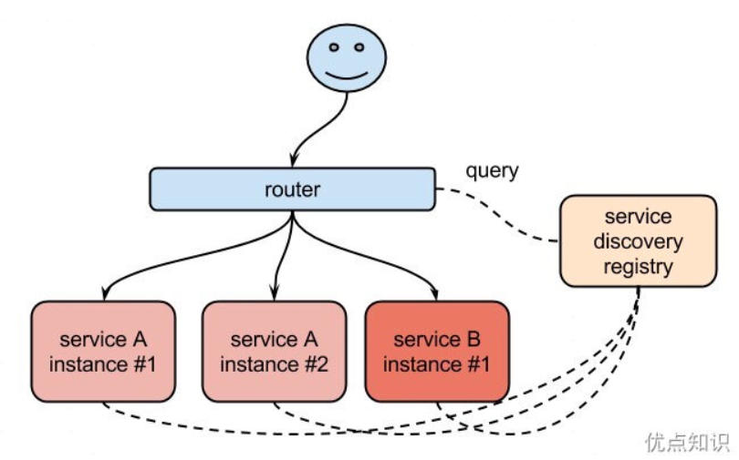
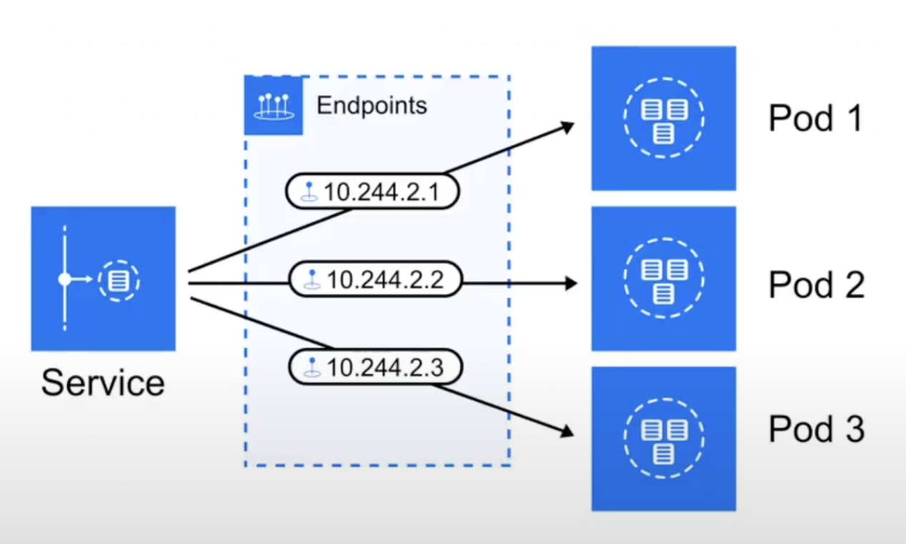
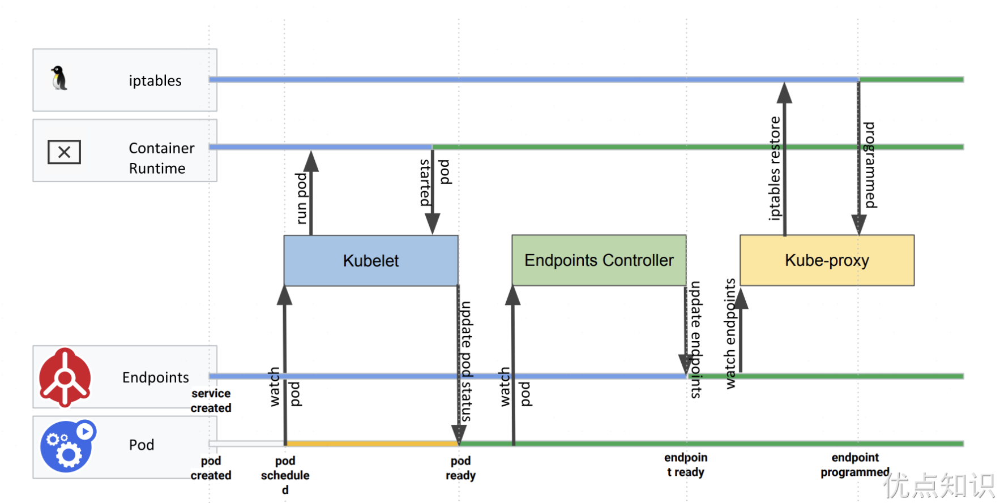
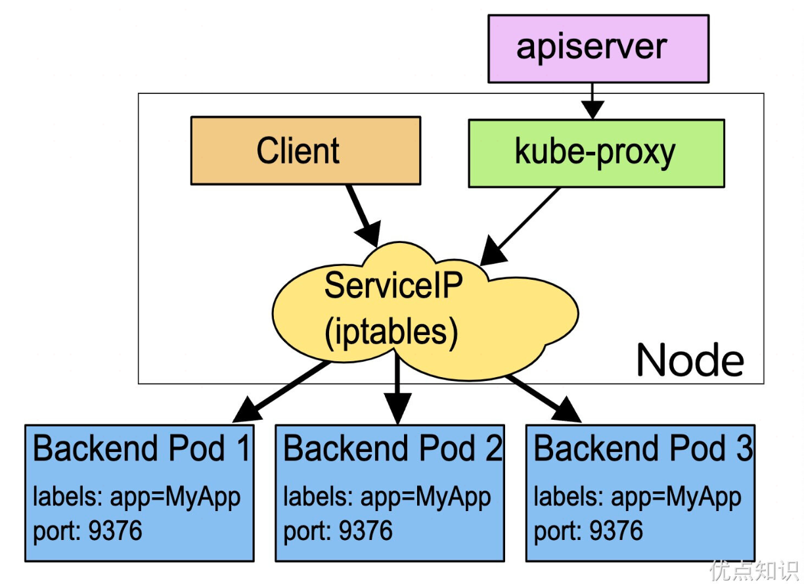
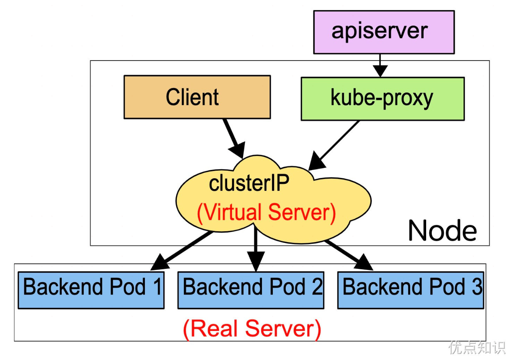
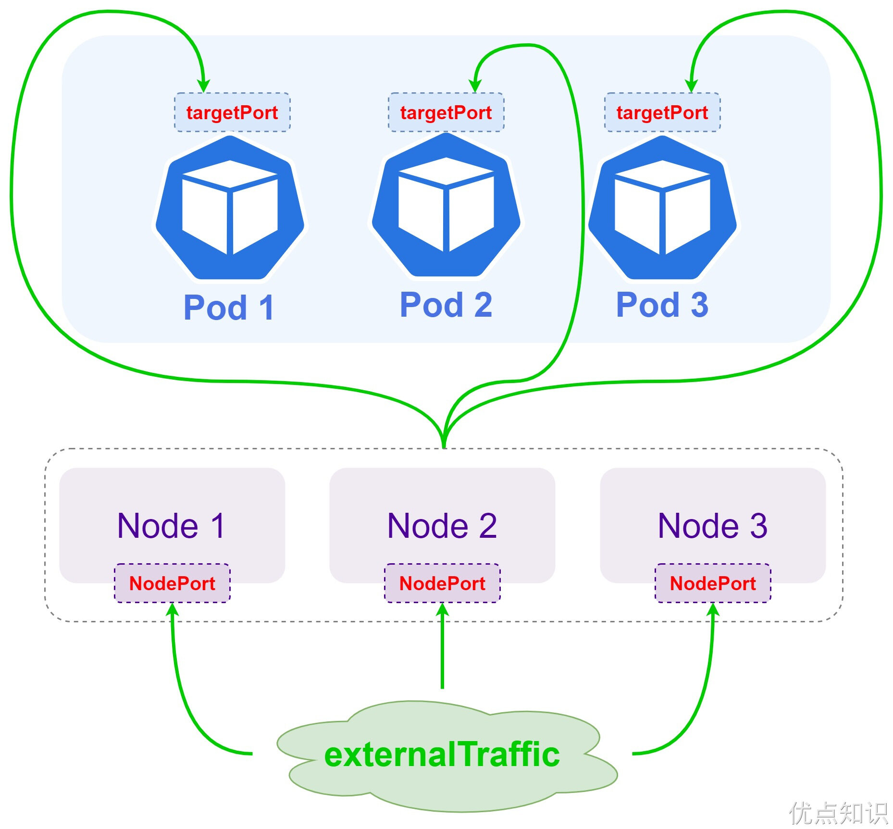
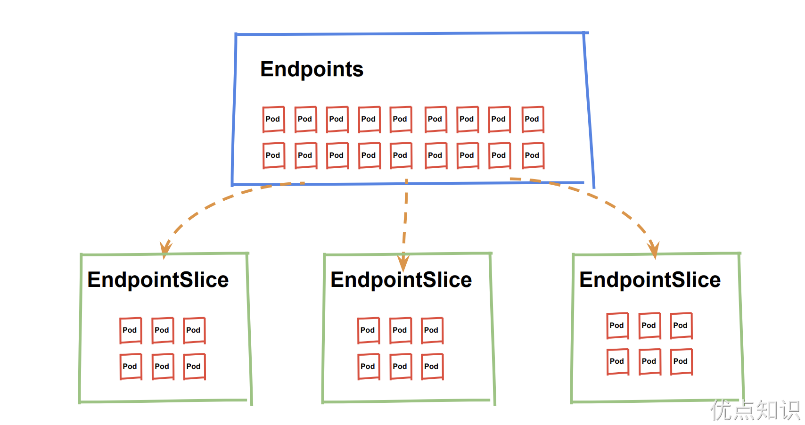
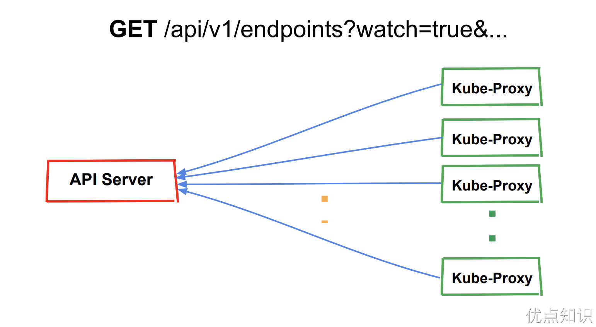
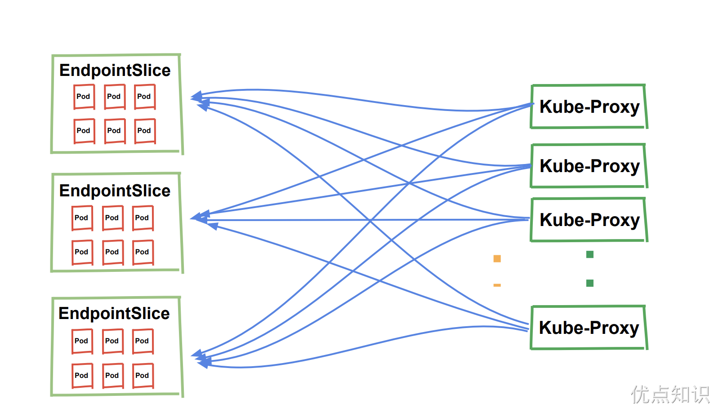

# Service
通过之前的学习知道可以用 ReplicaSet 和 Deployment 来动态的创建和销毁 Pod，每个 Pod 都有自己的 IP 地址，但是如果 Pod 重建后它的 IP 很有可能也就变化了。这就会带来一个问题：比如有一些后端的 Pod 集合为集群中的其他应用提供 API 服务，如果我们在前端应用中把所有的这些后端的 Pod 的地址都写死，然后以某种方式去访问其中一个 Pod 的服务，这样看上去是可以工作的，但是如果这个 Pod 挂掉然后重新启动起来，是不是 IP 地址非常有可能就变了，这个时候前端就极大可能访问不到后端的服务。

遇到这样的问题该怎么解决呢？在没有使用 Kubernetes 之前，相信可能很多同学都遇到过这样的问题：比如在部署一个 WEB 服务的时候，前端一般部署一个 Nginx 作为服务的入口，然后 Nginx 后面肯定就是挂载大量后端服务，很早以前可能是手动更改 Nginx 配置中的 `upstream` 选项，来动态改变提供服务的数量，到后面出现了一些服务发现的工具，比如 Consul、ZooKeeper 还有我们熟悉的 ETCD 等工具，有了这些工具过后我们就可以只需要把服务注册到这些服务发现中心去就可以，然后让这些工具动态的去更新 Nginx 的配置就可以了，我们完全不用去手工的操作了，是不是非常方便。



同样的，要解决上面遇到的问题是不是实现一个服务发现的工具也可以解决？没错的，当 Pod 被销毁或者新建过后，可以把这个 Pod 的地址注册到服务发现中心就可以了，但是这样的话前端应用就不能直接去连接后台的 Pod 集合了，应该连接到一个能够做服务发现的中间件上面，对吧？

为解决这个问题 Kubernetes 就为我们提供了这样的一个对象——Service，Service 是一种抽象的对象，它定义了一组 Pod 的逻辑集合和一个用于访问它们的策略，其实这个概念和微服务非常类似。一个 Service 下面包含的 Pod 集合是由 Label Selector 来决定的。

比如上面的例子，假如后端运行了 3 个副本，这些副本都是可以替代的，因为前端并不关心它们使用的是哪一个后端服务。尽管由于各种原因后端的 Pod 集合会发生变化，但是前端却不需要知道这些变化，也不需要自己用一个列表来记录这些后端的服务，Service 的这种抽象就可以帮我们达到这种解耦的目的。

## 三种IP
在继续往下学习 Service 之前，需要先弄明白 Kubernetes 系统中的三种 IP，因为经常有同学混乱。
- Node IP：Node 节点的 IP 地址
- Pod IP: Pod 的 IP 地址
- Cluster IP: Service 的 IP 地址

首先，Node IP 是 Kubernetes 集群中节点的物理网卡 IP 地址(一般为内网)，所有属于这个网络的服务器之间都可以直接通信，所以 Kubernetes 集群外要想访问 Kubernetes 集群内部的某个节点或者服务，肯定得通过 Node IP 进行通信（这个时候一般是通过外网 IP ）。

然后 Pod IP 是每个 Pod 的 IP 地址，它是网络插件进行分配的，前面已经讲解过。

最后 Cluster IP 是一个虚拟的 IP，仅仅作用于 Kubernetes Service 这个对象，由 Kubernetes 自己来进行管理和分配地址。

## 定义Service
定义 Service 的方式和前面定义的各种资源对象的方式类似，例如，假定有一组 Pod 服务，它们对外暴露了 8080 端口，同时都被打上了 `app=myapp` 这样的标签，那么就可以像下面这样来定义一个 Service 对象：
```yaml
apiVersion: v1
kind: Service
metadata:
  name: myservice
spec:
  selector:
    app: myapp
  ports:
    - protocol: TCP
      port: 80
      targetPort: 8080
      name: myapp-http
```
然后通过使用 `kubectl apply -f myservice.yaml` 就可以创建一个名为 `myservice` 的 Service 对象，它会将请求代理到使用 TCP 端口为 8080，具有标签 `app=myapp` 的 Pod 上，这个 Service 会被系统分配一个上面说的 `Cluster IP`，该 Service 还会持续的监听 `selector` 下面的 Pod，会把这些 Pod 信息更新到一个名为 `myservice` 的 Endpoints 对象上去，这个对象就类似于上面说的 Pod 集合了。



需要注意的是，Service 能够将接收端口映射到任意的 `targetPort`。默认情况下，`targetPort` 将被设置为与 `port` 字段相同的值。可能更有趣的是，`targetPort` 可以是字符串，引用了 backend Pod 端口的名称，因实际指派给该端口名称的端口号在每个 backend Pod 中可能并不相同，所以对于部署和设计 Service，这种方式会提供更大的灵活性。

另外 Service 能够支持 TCP 和 UDP 协议，默认是 TCP 协议。

```shell
[root@master yamlDir]# kubectl explain svc.spec.ports
KIND:     Service
VERSION:  v1

RESOURCE: ports <[]Object>

DESCRIPTION:
     The list of ports that are exposed by this service. More info:
     https://kubernetes.io/docs/concepts/services-networking/service/#virtual-ips-and-service-proxies

     ServicePort contains information on service's port.

FIELDS:
   appProtocol  <string>
     The application protocol for this port. This field follows standard
     Kubernetes label syntax. Un-prefixed names are reserved for IANA standard
     service names (as per RFC-6335 and
     https://www.iana.org/assignments/service-names). Non-standard protocols
     should use prefixed names such as mycompany.com/my-custom-protocol.

   name <string>
     The name of this port within the service. This must be a DNS_LABEL. All
     ports within a ServiceSpec must have unique names. When considering the
     endpoints for a Service, this must match the 'name' field in the
     EndpointPort. Optional if only one ServicePort is defined on this service.

   nodePort     <integer>
     The port on each node on which this service is exposed when type is
     NodePort or LoadBalancer. Usually assigned by the system. If a value is
     specified, in-range, and not in use it will be used, otherwise the
     operation will fail. If not specified, a port will be allocated if this
     Service requires one. If this field is specified when creating a Service
     which does not need it, creation will fail. This field will be wiped when
     updating a Service to no longer need it (e.g. changing type from NodePort
     to ClusterIP). More info:
     https://kubernetes.io/docs/concepts/services-networking/service/#type-nodeport

   port <integer> -required-
     The port that will be exposed by this service.

   protocol     <string>
     The IP protocol for this port. Supports "TCP", "UDP", and "SCTP". Default
     is TCP.

     Possible enum values:
     - `"SCTP"` is the SCTP protocol.
     - `"TCP"` is the TCP protocol.
     - `"UDP"` is the UDP protocol.

   targetPort   <string>
     Number or name of the port to access on the pods targeted by the service.
     Number must be in the range 1 to 65535. Name must be an IANA_SVC_NAME. If
     this is a string, it will be looked up as a named port in the target Pod's
     container ports. If this is not specified, the value of the 'port' field is
     used (an identity map). This field is ignored for services with
     clusterIP=None, and should be omitted or set equal to the 'port' field.
     More info:
     https://kubernetes.io/docs/concepts/services-networking/service/#defining-a-service
```

1. **appProtocol** (`<string>`): 应用程序协议，遵循标准的 Kubernetes 标签语法。
   - 用途: 用于指定非标准协议。未加前缀的名称保留给 IANA 标准服务名称（如 RFC-6335 和 [IANA 服务名称](https://www.iana.org/assignments/service-names) 所定义）。
   - 示例: `"mycompany.com/my-custom-protocol"`
2. **name** (`<string>`): 服务端口的名称，必须符合 DNS_LABEL 规范。
   - 用途: 同一 `ServiceSpec` 内的所有端口名称必须唯一。如果服务只有一个端口，此字段可以省略。
   - 示例: `"http"`
3. **nodePort** (`<integer>`): 当服务类型为 `NodePort` 或 `LoadBalancer` 时，每个节点上暴露的端口号。
   - 用途: 通常由系统分配。如果指定了一个值且在有效范围内且未被使用，将会使用该值；否则操作将失败。如果未指定，系统将分配一个端口。如果在不需要时指定了此字段（例如，将服务类型从 `NodePort` 改为 `ClusterIP`），更新操作将失败。
   - 示例: `30000`
   - 范围: 30000-32767（默认范围）
4. **port** (`<integer> -required-`): 服务将暴露的端口号。
   - 用途: 必填字段，用于定义服务监听的端口。
   - 示例: `80`
5. **protocol** (`<string>`): 该端口使用的 IP 协议，支持 "TCP"、"UDP" 和 "SCTP"。默认值为 "TCP"。
   - 可能的枚举值：
     - `"SCTP"`: SCTP 协议
     - `"TCP"`: TCP 协议
     - `"UDP"`: UDP 协议
   - 示例: `"TCP"`
6. **targetPort** (`<string>`): 访问目标 Pod 上的端口号。可以是数字或名称。
   - 用途: 如果是数字，必须在 1 到 65535 之间。如果是名称，将在目标 Pod 的容器端口中查找。如果未指定，将使用 `port` 字段的值（即身份映射）。对于 `clusterIP=None` 的服务，此字段将被忽略，应省略或设置为与 `port` 字段相同的值。
   - 示例: `"8080"` 或 `"http"`

# kube-proxy
前面讲到过，在 Kubernetes 集群中，每个 Node 会运行一个 `kube-proxy` 进程，负责为 Service 实现一种 VIP（虚拟 IP，就是上面说的 `clusterIP`）的代理形式，现在的 Kubernetes 中默认是使用的 `iptables` 这种模式来代理。



## iptables
这种模式，`kube-proxy` 会 `watch` 到 `apiserver` 对 Service 、Endpoints 对象进行添加和移除的操作。对每个 Service，它会添加上 `iptables` 规则，从而捕获到达该 Service 的 `clusterIP`（虚拟 IP）和端口的请求，进而将请求重定向到 Service 的一组 backend 中的某一个 Pod 上面。我们还可以使用 Pod readiness 探针验证后端 Pod 可以正常工作，以便 iptables 模式下的 kube-proxy 仅看到测试正常的后端，这样做意味着可以避免将流量通过 `kube-proxy` 发送到已知失败的 Pod 中，所以对于线上的应用来说一定要做 `readiness` 探针。



iptables 模式的 `kube-proxy` 默认的策略是，随机选择一个后端 Pod。

比如当创建 backend Service 时，Kubernetes 会给它指派一个虚拟 IP 地址，比如 10.0.0.1。假设 Service 的端口是 1234，该 Service 会被集群中所有的 kube-proxy 实例观察到。当 kube-proxy 看到一个新的 Service，它会安装一系列的 iptables 规则，从 VIP 重定向到 per-Service 规则。 该 per-Service 规则连接到 per-Endpoint 规则，该 per-Endpoint 规则会重定向（目标 NAT）到后端的 Pod。

## ipvs
除了 iptables 模式之外，kubernetes 也支持 ipvs 模式，在 ipvs 模式下，kube-proxy watch Kubernetes 服务和端点，调用 netlink 接口相应地创建 IPVS 规则， 并定期将 IPVS 规则与 Kubernetes 服务和端点同步。该控制循环可确保 IPVS 状态与所需状态匹配。访问服务时，IPVS 　将流量定向到后端 Pod 之一。

IPVS 代理模式基于类似于 iptables 模式的 netfilter 钩子函数，但是使用哈希表作为基础数据结构，并且在内核空间中工作。 所以与 iptables 模式下的 kube-proxy 相比，IPVS 模式下的 kube-proxy 重定向通信的延迟要短，并且在同步代理规则时具有更好的性能。与其他代理模式相比，IPVS 模式还支持更高的网络流量吞吐量。所以对于较大规模的集群会使用 ipvs 模式的 kube-proxy，只需要满足节点上运行 ipvs 的条件，然后我们就可以直接将 kube-proxy 的模式修改为 ipvs，如果不满足运行条件会自动降级为 iptables 模式，现在都推荐使用 ipvs 模式，可以大幅度提高 Service 性能。

IPVS 提供了更多选项来平衡后端 Pod 的流量，默认是 rr，有如下一些策略：
- rr: round-robin
- lc: least connection (smallest number of open connections)
- dh: destination hashing
- sh: source hashing
- sed: shortest expected delay
- nq: never queue

不过现在只能整体修改策略，可以通过 kube-proxy 中配置 –ipvs-scheduler 参数来实现，暂时不支持特定的 Service 进行配置。



我们也可以实现基于客户端 IP 的会话亲和性，可以将 `service.spec.sessionAffinity` 的值设置为 "ClientIP" （默认值为 "None"）即可，此外还可以通过适当设置 `service.spec.sessionAffinityConfig.clientIP.timeoutSeconds` 来设置最大会话停留时间（默认值为 10800 秒，即 3 小时）:
```yaml
apiVersion: v1
kind: Service
spec:
  sessionAffinity: ClientIP
  ...
```
Service 只支持两种形式的会话亲和性服务：None 和 ClientIP，不支持基于 cookie 的会话亲和性，这是因为 Service 不是在 HTTP 层面上工作的，处理的是 TCP 和 UDP 包，并不关心其中的载荷内容，因为 cookie 是 HTTP 协议的一部分，Service 并不知道它们，所有会话亲和性不能基于 Cookie。

# Service使用
我们在定义 Service 的时候可以指定一个自己需要的类型 Service，如果不指定的话默认是 ClusterIP类型。

我们可以使用的服务类型如下：
- ClusterIP：通过集群的内部 IP 暴露服务，选择该值，服务只能够在集群内部可以访问，这也是默认的服务类型。
- NodePort：通过每个 Node 节点上的 IP 和静态端口（NodePort）暴露服务。NodePort 服务会路由到 ClusterIP 服务，这个 ClusterIP 服务会自动创建。通过请求 NodeIp:NodePort，可以从集群的外部访问一个 NodePort 服务。
- LoadBalancer：使用云提供商的负载均衡器，可以向外部暴露服务。外部的负载均衡器可以路由到 NodePort 服务和 ClusterIP 服务，这个需要结合具体的云厂商进行操作。
- ExternalName：通过返回 CNAME 和它的值，可以将服务映射到 `externalName` 字段的内容（例如， `foo.bar.example.com`）。

## NodePort 类型
如果设置 type 的值为 "NodePort"，Kubernetes master 将从给定的配置范围内（默认：30000-32767）分配端口，每个 Node 将从该端口（每个 Node 上的同一端口）代理到 Service。该端口将通过 Service 的 spec.ports[*].nodePort 字段被指定，如果不指定的话会自动生成一个端口。



需要注意的是，Service 将能够通过 spec.ports[].nodePort 和 spec.clusterIp:spec.ports[].port 而对外可见。

接下来我们来给大家创建一个 NodePort 的服务来访问我们前面的 Nginx 服务：
```yaml
apiVersion: v1
kind: Service
metadata:
  name: myservice
spec:
  selector:
    app: myapp
  type: NodePort
  ports:
    - protocol: TCP
      port: 80
      targetPort: 80
      name: myapp-http
```
创建该 Service:
```sh
➜  ~ kubectl apply -f service-demo.yaml
```
然后我们可以查看 Service 对象信息：
```sh
➜  ~ kubectl get svc
NAME         TYPE        CLUSTER-IP      EXTERNAL-IP   PORT(S)        AGE
kubernetes   ClusterIP   10.96.0.1       <none>        443/TCP        27d
myservice    NodePort    10.104.57.198   <none>        80:32560/TCP   14h
```
我们可以看到 myservice 的 TYPE 类型已经变成了 NodePort，后面的 PORT(S) 部分也多了一个 32560 的映射端口。

## ExternalName
ExternalName 是 Service 的特例，它没有 selector，也没有定义任何的端口和 Endpoint。对于运行在集群外部的服务，它通过返回该外部服务的别名这种方式来提供服务。
```yaml
kind: Service
apiVersion: v1
metadata:
  name: my-service
  namespace: prod
spec:
  type: ExternalName
  externalName: my.database.example.com
```
这段配置定义了一个名为 `my-service` 的 Service，当在 prod 命名空间内的其他服务尝试连接到 `my-service.prod.svc.cluster.local` 时，Kubernetes 集群内部的 DNS 服务会解析并返回一个 CNAME 记录 `my.database.example.com`。这意味着任何试图访问 `my-service.prod.svc.cluster.local` 的尝试都会被 DNS 重定向到 `my.database.example.com`。

访问这个服务的工作方式与其它的相同，唯一不同的是重定向发生在 DNS 层，而且不会进行代理或转发。如果后续决定要将数据库迁移到 Kubernetes 集群中，可以启动对应的 Pod，增加合适的 Selector 或 Endpoint，修改 Service 的 `type`，完全不需要修改调用的代码，这样就完全解耦了。

除了可以直接通过 `externalName` 指定外部服务的域名之外，我们还可以通过自定义 Endpoints 来创建 Service，前提是 `clusterIP=None`，名称要和 Service 保持一致，如下所示：

```yaml
apiVersion: v1
kind: Service
metadata:
  name: etcd-k8s
  namespace: kube-system
  labels:
    k8s-app: etcd
spec:
  type: ClusterIP
  clusterIP: None
  ports:
    - name: port
      port: 2379

---
apiVersion: v1
kind: Endpoints
metadata:
  name: etcd-k8s # 名称必须和 Service 一致
  namespace: kube-system
  labels:
    k8s-app: etcd
subsets:
  - addresses:
      - ip: 10.151.30.57 # 外部etcd的ip地址，Service 将连接重定向到 endpoint
    ports:
      - name: port
        port: 2379 # endpoint 的目标端口
```
上面这个服务就是将外部的 etcd 服务引入到 Kubernetes 集群中来。

## externalIPs
Service 的属性中还有一个 `externalIPs` 的属性，从 Kubernetes 官网文档可以看到该属性的相关描述：

> 如果外部的 IP 路由到集群中一个或多个 Node 上，Kubernetes Service 会被暴露给这些 externalIPs。通过外部 IP（作为目的 IP 地址）进入到集群，传到 Service 的端口上的流量，将会被路由到 Service 的 Endpoint 上，externalIPs 不会被 Kubernetes 管理，它属于集群管理员的职责范畴。

这里最重要的一点就是确保使用哪个 IP 来访问 Kubernetes 集群，使用外部 IP Service 类型，我们可以将 Service 绑定到连接集群的 IP。

> 参考文档：https://www.fadhil-blog.dev/blog/kubernetes-external-ip/。

# externalTrafficPolicy 属性
参考资料：https://www.cnblogs.com/zhangmingcheng/p/17637712.html


# Endpoints 与 Endpointslices
我们已经知道在 Service 创建时，Kubernetes 会根据 Service 关联一个 Endpoints 资源，若 Service 没有定义 selector 字段，将不会自动创建 Endpoints。Endpoints 是 Kubernetes 中的一个资源对象，存储在 etcd 中，用来记录一个 Service 对应一组 Pod 的访问地址，一个 Service 只有一个 Endpoints 资源，Endpoints 资源会去观测 Pod 集合，只要服务中的某个 Pod 发生变更，Endpoints 就会进行同步更新。

比如现在我们部署如下所示 3 个副本的 httpbin 测试应用：

```yaml
# httpbin-deploy.yaml
apiVersion: apps/v1
kind: Deployment
metadata:
  name: httpbin
spec:
  replicas: 3
  selector:
    matchLabels:
      app: httpbin
  template:
    metadata:
      labels:
        app: httpbin
    spec:
      containers:
        - name: httpbin
          image: kennethreitz/httpbin:latest
          imagePullPolicy: IfNotPresent
          ports:
            - containerPort: 80
              name: http
---
apiVersion: v1
kind: Service
metadata:
  name: httpbin
spec:
  selector:
    app: httpbin
  ports:
    - name: http
      port: 80
      protocol: TCP
      targetPort: 80
  type: ClusterIP
```
在该应用中我们定义了 3 个副本，然后创建了一个 Service 对象来关联这些 Pod，直接应用该资源清单即可：

```sh
[root@master service]# kubectl apply -f httpbin-deploy.yaml
deployment.apps/httpbin created
service/httpbin created
[root@master service]# kubectl get pods -l app=httpbin -owide
NAME                       READY   STATUS    RESTARTS   AGE    IP            NODE    NOMINATED NODE   READINESS GATES
httpbin-75d9685444-jdm4n   1/1     Running   0          110s   10.244.2.36   node2   <none>           <none>
httpbin-75d9685444-k9nxn   1/1     Running   0          110s   10.244.1.63   node1   <none>           <none>
httpbin-75d9685444-kx4d9   1/1     Running   0          110s   10.244.1.64   node1   <none>           <none>
[root@master service]# kubectl get svc httpbin
NAME      TYPE        CLUSTER-IP     EXTERNAL-IP   PORT(S)   AGE
httpbin   ClusterIP   10.104.24.78   <none>        80/TCP    119s
[root@master service]# kubectl get endpoints httpbin
NAME      ENDPOINTS                                      AGE
httpbin   10.244.1.63:80,10.244.1.64:80,10.244.2.36:80   2m7s
[root@master service]# kubectl get endpoints httpbin -oyaml
apiVersion: v1
kind: Endpoints
metadata:
  annotations:
    endpoints.kubernetes.io/last-change-trigger-time: "2024-03-05T01:27:55Z"
  creationTimestamp: "2024-03-05T01:26:14Z"
  name: httpbin
  namespace: default
  resourceVersion: "1794292"
  uid: 4b9a924a-3927-4e87-b92f-03e7c9a01adf
subsets:
- addresses:
  - ip: 10.244.1.63
    nodeName: node1
    targetRef:
      kind: Pod
      name: httpbin-75d9685444-k9nxn
      namespace: default
      uid: 44e6f798-80f5-4852-8426-307537583a85
  - ip: 10.244.1.64
    nodeName: node1
    targetRef:
      kind: Pod
      name: httpbin-75d9685444-kx4d9
      namespace: default
      uid: 51c7e24e-a67b-495c-ac09-1da87b2564f0
  - ip: 10.244.2.36
    nodeName: node2
    targetRef:
      kind: Pod
      name: httpbin-75d9685444-jdm4n
      namespace: default
      uid: 9ac2f514-eef2-4636-83c6-0de4e504d34f
  ports:
  - name: http
    port: 80
    protocol: TCP
```
由于我们这里创建了一个 Service 对象，所以也会自动创建一个对应的 Endpoints 对象，只有当 Pod 正常运行后才会被包含到 Endpoints 对象中去，所以往往如果是线上应用我们都是强烈推荐为 Pod 配置上 readiness probe 的，当应用还未就绪的时候就不会进入 Endpoints，也就不会对外提供服务了，当应用下线后就从该对象中摘掉。

从上述示例可以看到，Endpoints 中的所有网络端点，分别对应了每个 Pod 的 IP 地址，也就是上面对象中的 subsets 里面的数据。

## Endpoints 的不足之处
但实际上 Endpoints 也有它的一些不足之处，比如：

- Kubernetes 限制单个 Endpoints 对象中可以容纳的端点数量。当一个服务有超过 1000 个后备端点时，Kubernetes 会截断 Endpoints 对象中的数据，这种情况下，Kubernetes 选择最多 1000 个可能的后端端点来存储到 Endpoints 对象中，并在 Endpoints 中配置上 endpoints.kubernetes.io/over-capacity: truncated 注解。如果后端 Pod 的数量低于 1000，控制平面会移除该注解。
- 一个 Service 只有一个 Endpoints 资源，这意味着它需要为支持相应服务的每个 Pod 存储 IP 等网络信息。这导致 Endpoints 资源变的十分巨大，其中一个端点发生了变更，将会导致整个 Endpoints 资源更新。当业务需要进行频繁端点更新时，一个巨大的 API 资源被相互传递，而这会影响到 Kubernetes 组件的性能，并且会产生大量的网络流量和额外的处理。

所以当你的应用规模达到了上千规模的话，我们就不能使用原有的这种方案了，一个新的对象 Endpointslices 就出现了，Endpointslices 为 Endpoints 提供了一种可扩缩和可拓展的替代方案，缓解处理大量网络端点带来的性能问题，还能为一些诸如拓扑路由的额外功能提供一个可扩展的平台，该特性在 Kubernetes v1.21+ 的版本中已提供支持。


默认情况下，控制面创建和管理的 EndpointSlice 将包含不超过 100 个端点，但是我们可以使用 kube-controller-manager 的 `--max-endpoints-per-slice` 标志设置此值，其最大值为 1000。

## 为什么需要 Endpointslices？
为了说明这些问题的严重程度，这里举一个简单的例子。假设我们有一个 2000 个 Pod 副本的服务，它最终生成的 Endpoints 资源对象会很大（比如 1.5MB (etcd 具有最大请求大小限制 1.5MB)，还会截断成 1000），在生产环境中，如果该服务发生滚动更新或节点迁移，那么 Endpoints 资源将会频繁变更，当该列表中的某个网络端点发生了变化，那么就要将完整的 Endpoint 资源分发给集群中的每个节点。如果我们在一个具有 3000 个节点的大型集群中，这会是个很大的问题，每次更新将跨集群发送 4.5GB 的数据（1.5MB * 3000，即 Endpoint 大小 * 节点个数），并且每次端点更新都要发送这么多数据。想象一下，如果进行一次滚动更新，共有 2000 个 Pod 全部被替换，那么传输的数据量将会是 TB 级数据。这不进对集群内的网络带宽浪费巨大，而对 Master 的冲击非常大，会影响 Kubernetes 整体的性能。


如果使用了 Endpointslices，假设一个服务后端有 2000 个 Pod，我们可以让每个 Endpointslices 存储 100 个端点，最终将获得 20 个 Endpointslices。添加或删除 Pod 时，只需要更新其中 1 个 Endpointslice 资源即可。在 Kubernetes 中进行滚动更新时，最终所有旧的 Pod 都将被新的 Pod 替换掉。这意味着，尽管每次只有一部分 Pod 被替换（以及相应的 EndpointSlice 被更新），但在整个滚动更新过程完成后，所有相关的 EndpointSlices 都将经历至少一次更新，以反映新的 Pod 端点。

这个过程是逐渐发生的，更新操作分散在整个滚动更新周期中。例如，如果一个服务有 20 个 EndpointSlices，每个包含 100 个端点，随着滚动更新的进行，每个新 Pod 变为就绪状态并且对应的旧 Pod 被移除，只有包含这些 Pod 的 EndpointSlices 会被更新。更新发生在不同的时间点，仅影响那些对应于正在更新的 Pod 所在的 EndpointSlices。这种分布式和渐进式的更新过程的好处是，它减少了在任何给定时间对网络和 Kubernetes 控制平面的影响。EndpointSlices 的设计旨在提高大规模服务的效率，即使在滚动更新期间，EndpointSlices 的更新也比原先使用单个 Endpoints 对象要更优化和有效率。这种分片策略允许 Kubernetes 控制平面更有效地处理后端服务端点的增加、删除和更新，特别是在大型或高度动态的环境中。

在流量高峰时，服务为了承载流量，扩容出大量的 Pod，Endpoints 资源会被频繁更新，这两者使用场景的差异就变得非常明显。更重要的是，既然服务的所有 Pod IP 都不需要存储在单个资源中，那么我们也就不必担心 etcd 中存储的对象的大小限制。

所以我们可以了解到 Endpoints 和 Endpointslice 两种资源的不同之处了。
- Endpoints 适用场景：
  - 有弹性伸缩需求，Pod 数量较少，传递资源不会造成大量网络流量和额外处理。
  - 无弹性伸缩需求，Pod 数量不会太多。
- Endpointslice 适用场景:
  - 有弹性需求，且 Pod 数量较多（几百上千）。
  - Pod 数量很多（几百上千），因为 Endpoints 网络端点最大数量限制为 1000，所以超过 1000 的 Pod 必须得用 Endpointslice。

## EndpointSlice 使用
EndpointSlice 控制器会 Watch Service 和 Pod 来自动创建和更新 EndpointSlices 对象，然后 kube-proxy 同样会 Watch Service 和 EndpointSlices 对象来更新 iptables 或 ipvs proxy 规则。

由于默认情况下，控制面创建和管理的 EndpointSlice 将包含不超过 100 个端点，为了测试方便，我们这里将其修改为 5，将 kube-controller-manager 的 `--max-endpoints-per-slice` 标志设置为 5，最大值为 1000。如何修改呢
<details>

```sh
[root@master service]# cat /etc/kubernetes/manifests/kube-controller-manager.yaml
apiVersion: v1
kind: Pod
metadata:
  creationTimestamp: null
  labels:
    component: kube-controller-manager
    tier: control-plane
  name: kube-controller-manager
  namespace: kube-system
spec:
  containers:
  - command:
    - kube-controller-manager
    - --allocate-node-cidrs=true
    - --authentication-kubeconfig=/etc/kubernetes/controller-manager.conf
    - --authorization-kubeconfig=/etc/kubernetes/controller-manager.conf
    - --bind-address=127.0.0.1
    - --client-ca-file=/etc/kubernetes/pki/ca.crt
    - --cluster-cidr=10.244.0.0/16
    - --cluster-name=kubernetes
    - --max-endpoints-per-slice=5 # 增加此行即可
    - --cluster-signing-cert-file=/etc/kubernetes/pki/ca.crt
    - --cluster-signing-key-file=/etc/kubernetes/pki/ca.key
```
</details>

由于kube-controller-manager.yaml以静态pod的方式运行，所以修改后就会自动重启controller-manager。

比如我们现在创建如下的资源对象：
<details>

```yaml
# httpbin-deploy-slice.yaml
apiVersion: apps/v1
kind: Deployment
metadata:
  name: httpbin
spec:
  replicas: 17
  selector:
    matchLabels:
      app: httpbin
  template:
    metadata:
      labels:
        app: httpbin
    spec:
      containers:
        - name: httpbin
          image: kennethreitz/httpbin:latest
          imagePullPolicy: IfNotPresent
          ports:
            - containerPort: 80
              name: http
---
apiVersion: v1
kind: Service
metadata:
  name: httpbin
spec:
  selector:
    app: httpbin
  ports:
    - name: http
      port: 80
      protocol: TCP
      targetPort: 80
  type: ClusterIP
```
</details>

直接应用即可：
```sh
[root@master service]# kubectl apply -f httpbin-deploy-slice.yaml
deployment.apps/httpbin created
service/httpbin created
```
当 Pod 和 Service 创建后便会自动创建 EndpointSlices 对象了，我们先看看增加`--max-endpoints-per-slice=5`参数之前的示例：
```sh
[root@master service]# kubectl apply -f httpbin-deploy-slice.yaml
deployment.apps/httpbin created
service/httpbin created
[root@master service]# kubectl get svc httpbin
NAME      TYPE        CLUSTER-IP      EXTERNAL-IP   PORT(S)   AGE
httpbin   ClusterIP   10.106.168.34   <none>        80/TCP    86s
[root@master service]# kubectl get endpointslice
NAME            ADDRESSTYPE   PORTS   ENDPOINTS                                          AGE
httpbin-mkzdj   IPv4          80      10.244.2.38,10.244.2.37,10.244.1.66 + 14 more...   97s
kubernetes      IPv4          6443    192.168.220.146                                    14d
```
接下来我们看看配置参数之后的示例：
```sh
[root@master service]# kubectl apply -f httpbin-deploy-slice.yaml
deployment.apps/httpbin created
service/httpbin created
[root@master service]# kubectl get svc httpbin
NAME      TYPE        CLUSTER-IP       EXTERNAL-IP   PORT(S)   AGE
httpbin   ClusterIP   10.104.157.137   <none>        80/TCP    7s
[root@master service]# kubectl get endpoints
NAME         ENDPOINTS                                                   AGE
httpbin      10.244.1.83:80,10.244.1.84:80,10.244.1.85:80 + 14 more...   25s
kubernetes   192.168.220.146:6443                                        14d
[root@master service]# kubectl get endpointslice
NAME            ADDRESSTYPE   PORTS   ENDPOINTS                                         AGE
httpbin-2grs6   IPv4          80      10.244.2.53,10.244.2.54,10.244.1.83 + 2 more...   34s
httpbin-2l9cg   IPv4          80      10.244.2.55,10.244.1.84,10.244.2.57 + 2 more...   29s
httpbin-5zspv   IPv4          80      10.244.1.91,10.244.1.90                           27s
httpbin-cmbm6   IPv4          80      10.244.1.89,10.244.2.58,10.244.1.87 + 2 more...   29s
kubernetes      IPv4          6443    192.168.220.146                                   14d
```
由于我们这里配置的每个 EndpointSlice 最多有 5 个 Endpoint，一共 17 个副本，所以这里自动创建了 4 个 EndpointSlices 对象，当然现在 kube-proxy 组件会 Watch 所有的这个 4 个对象。


但是当我们更新一个 Pod 的时候只有包含该 Pod 的 EndpointSlice 对象变更，该对象中包含的 Endpoints 列表非常少，这就大大提升了性能。我们可以查看任意一个 EndpointSlice 对象，如下所示：
<details>

```sh
[root@master service]# kubectl get endpointslice httpbin-2grs6 -oyaml
addressType: IPv4
apiVersion: discovery.k8s.io/v1
endpoints:
- addresses:
  - 10.244.2.53
  conditions:
    ready: true
    serving: true
    terminating: false
  nodeName: node2
  targetRef:
    kind: Pod
    name: httpbin-75d9685444-n7t4p
    namespace: default
    uid: 8f58b878-0500-4c39-92c1-a48c288c6483
- addresses:
  - 10.244.2.54
  conditions:
    ready: true
    serving: true
    terminating: false
  nodeName: node2
  targetRef:
    kind: Pod
    name: httpbin-75d9685444-8jjxc
    namespace: default
    uid: 32cbd4ba-c09a-4fe3-b169-4d485859e678
- addresses:
  - 10.244.1.83
  conditions:
    ready: true
    serving: true
    terminating: false
  nodeName: node1
  targetRef:
    kind: Pod
    name: httpbin-75d9685444-x2blt
    namespace: default
    uid: 3ea30375-6afd-4ed2-b3de-b5c513fe278b
- addresses:
  - 10.244.2.56
  conditions:
    ready: true
    serving: true
    terminating: false
  nodeName: node2
  targetRef:
    kind: Pod
    name: httpbin-75d9685444-rh66r
    namespace: default
    uid: 1d08c336-e05f-4bd3-9143-1b0d1e8e737d
- addresses:
  - 10.244.1.85
  conditions:
    ready: true
    serving: true
    terminating: false
  nodeName: node1
  targetRef:
    kind: Pod
    name: httpbin-75d9685444-lmn64
    namespace: default
    uid: 09348c93-ab65-47e5-b701-95998e325187
kind: EndpointSlice
metadata:
  annotations:
    endpoints.kubernetes.io/last-change-trigger-time: "2024-03-05T03:20:07Z"
  creationTimestamp: "2024-03-05T03:20:05Z"
  generateName: httpbin-
  generation: 6
  labels:
    endpointslice.kubernetes.io/managed-by: endpointslice-controller.k8s.io
    kubernetes.io/service-name: httpbin
  name: httpbin-2grs6
  namespace: default
  ownerReferences:
  - apiVersion: v1
    blockOwnerDeletion: true
    controller: true
    kind: Service
    name: httpbin
    uid: 57738117-4715-4434-b596-ac64ac61a156
  resourceVersion: "1804601"
  uid: 6c199e29-a171-4b34-88dd-c266cc4ab890
ports:
- name: http
  port: 80
  protocol: TCP
```
</details>

从上面可以看到 EndpointSlice 对象中通过 endpoints 属性来保存 Endpoint 数据，每个 Endpoint 中 包含 Pod IP、节点名以及关联的 Pod 对象信息，其中还包括一个 conditions 属性。
```yaml
- addresses:
  - 10.244.2.53
  conditions:
    ready: true
    serving: true
    terminating: false
  nodeName: node2
  targetRef:
    kind: Pod
    name: httpbin-75d9685444-n7t4p
    namespace: default
    uid: 8f58b878-0500-4c39-92c1-a48c288c6483
```
EndpointSlice 存储了可能对使用者有用的、有关端点的状态，分别是 ready、serving 和 terminating:
- Ready（就绪）：ready 是映射 Pod 的 Ready 状况的。对于处于运行中的 Pod，它的 Ready 状况被设置为 True，应该将此 EndpointSlice 状况也设置为 true。出于兼容性原因，当 Pod 处于终止过程中，ready 永远不会为 true。
- Serving（服务中）：serving 状况与 ready 状况相同，不同之处在于它不考虑终止状态。如果 EndpointSlice API 的使用者关心 Pod 终止时的就绪情况，就应检查此状况。
- Terminating（终止中）：terminating 是表示端点是否处于终止中的状况，对于 Pod 来说，这是设置了删除时间戳的 Pod。

此外 EndpointSlice 中的每个端点都可以包含一定的拓扑信息，拓扑信息包括端点的位置，对应节点、可用区的信息，这些信息体现为 EndpointSlices 的如下端点字段：
- nodeName - 端点所在的 Node 名称
- zone - 端点所处的可用区。

为了确保多个实体可以管理 EndpointSlice 而且不会相互产生干扰， Kubernetes 定义了标签 endpointslice.kubernetes.io/managed-by，用来标明哪个实体在管理某个 EndpointSlice。 端点切片控制器会在自己所管理的所有 EndpointSlice 上将该标签值设置为 endpointslice-controller.k8s.io，管理 EndpointSlice 的其他对象也应该为此标签设置一个唯一值。

此外还有一个地址类型 AddressType：IPv4、IPv6、FQDN(全限定域名)。

> 关于 Service 的使用还有很多其他特性，比如 LoadBalancer，我们将在后面的课程中慢慢接触到。
