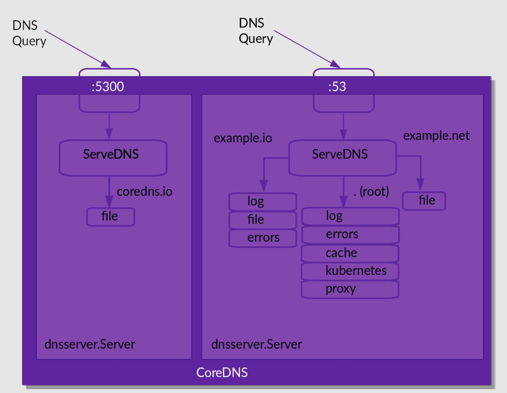

# 服务发现
前面讲解了 Service 的用法，我们可以通过 Service 生成的 `ClusterIP(VIP)` 来访问 Pod 提供的服务，但是在使用的时候还有一个问题：我们怎么知道某个应用的 VIP 呢？比如我们有两个应用，一个是 API 应用，一个是 DB 应用，两个应用都是通过 Deployment 进行管理的，并且都通过 Service 暴露出了端口提供服务。API 需要连接到 DB 这个应用，我们只知道DB 对应的 Service 的名称，但是并不知道它的 VIP 地址，如果我们知道了 VIP 的地址是不是就行了？

## 环境变量
为了解决上面的问题，在之前的版本中，Kubernetes 采用了环境变量的方法，每个 Pod 启动的时候，会通过环境变量设置所有服务的 VIP 和 PORT 信息，这样 Pod 中的应用可以通过读取环境变量来获取依赖服务的地址信息，这种方法使用起来相对简单，但是有一个很大的问题就是依赖的服务必须在 Pod 启动之前就存在，不然是不会被注入到环境变量中的。比如我们首先创建一个 Nginx 服务：
```yaml
# test-nginx.yaml
apiVersion: apps/v1
kind: Deployment
metadata:
  name: nginx-deploy
spec:
  replicas: 2
  selector:
    matchLabels:
      app: nginx
  template:
    metadata:
      labels:
        app: nginx
    spec:
      containers:
        - name: nginx
          image: nginx:1.7.9
          ports:
            - containerPort: 80
---
apiVersion: v1
kind: Service
metadata:
  name: nginx-service
  labels:
    name: nginx-service
spec:
  ports:
    - port: 5000
      targetPort: 80
  selector:
    app: nginx
```
创建上面的服务：
```sh
[root@master dns]# kubectl apply -f test-nginx.yaml
deployment.apps/nginx-deploy created
service/nginx-service created
[root@master dns]# kubectl get pods
NAME                            READY   STATUS    RESTARTS   AGE
nginx-deploy-7759cfdc55-mpslb   1/1     Running   0          80s
nginx-deploy-7759cfdc55-zxn57   1/1     Running   0          80s
[root@master dns]# kubectl get svc
NAME            TYPE        CLUSTER-IP      EXTERNAL-IP   PORT(S)    AGE
kubernetes      ClusterIP   10.96.0.1       <none>        443/TCP    15d
nginx-service   ClusterIP   10.98.134.163   <none>        5000/TCP   87s
```
可以看到两个 Pod 和一个名为 `nginx-service` 的服务创建成功了，该 Service 监听的端口是 5000，同时它会把流量转发给它代理的所有 Pod（这里就是拥有 `app: nginx` 标签的两个 Pod）。

现在再来创建一个普通的 Pod，观察下该 Pod 中的环境变量是否包含上面的 `nginx-service` 的服务信息：
```yaml
# test-pod.yaml
apiVersion: v1
kind: Pod
metadata:
  name: test-pod
spec:
  containers:
    - name: test-service-pod
      image: busybox
      command: ["/bin/sh", "-c", "env"]
```
然后创建该测试的 Pod：
```sh
[root@master dns]# kubectl apply -f test-pod.yaml
pod/test-pod created
```
等 Pod 创建完成后，我们查看日志信息：
```sh
[root@master dns]# kubectl logs test-pod
KUBERNETES_PORT=tcp://10.96.0.1:443
KUBERNETES_SERVICE_PORT=443
HOSTNAME=test-pod
SHLVL=1
HOME=/root
NGINX_SERVICE_PORT_5000_TCP_ADDR=10.98.134.163 # 注入环境变量的nginx-service服务的CLUSTER-IP
NGINX_SERVICE_PORT_5000_TCP_PORT=5000 # 注入的PORT
NGINX_SERVICE_PORT_5000_TCP_PROTO=tcp # 注入的PROTO
KUBERNETES_PORT_443_TCP_ADDR=10.96.0.1
PATH=/usr/local/sbin:/usr/local/bin:/usr/sbin:/usr/bin:/sbin:/bin
NGINX_SERVICE_SERVICE_HOST=10.98.134.163 # 
NGINX_SERVICE_PORT_5000_TCP=tcp://10.98.134.163:5000
KUBERNETES_PORT_443_TCP_PORT=443
KUBERNETES_PORT_443_TCP_PROTO=tcp
NGINX_SERVICE_PORT=tcp://10.98.134.163:5000
NGINX_SERVICE_SERVICE_PORT=5000 # 
KUBERNETES_PORT_443_TCP=tcp://10.96.0.1:443
KUBERNETES_SERVICE_PORT_HTTPS=443
KUBERNETES_SERVICE_HOST=10.96.0.1
PWD=/
```
可以看到打印了很多环境变量信息，其中就包括刚刚创建的 `nginx-service` 这个服务，有 HOST、PORT、PROTO、ADDR 等，也包括其他已经存在的 Service 的环境变量，现在如果我们需要在这个 Pod 里面访问 `nginx-service` 的服务，我们可以直接通过 `NGINX_SERVICE_SERVICE_HOST` 和 `NGINX_SERVICE_SERVICE_PORT` 就可以了，但是如果这个 Pod 启动起来的时候 `nginx-service` 服务还没启动起来，在环境变量中我们是无法获取到这些信息的，当然我们可以通过 `initContainer` 之类的方法来确保 `nginx-service` 启动后再启动 Pod，但是这种方法毕竟增加了 Pod 启动的复杂性，所以这不是最优的方法，局限性太多了。

# DNS
这部分可以看`CS_Base/Network/应用层/DNS.md`文章，详细介绍了 DNS 这门技术。

# CoreDNS
到这其实能够发现 DNS 就是一种最早的服务发现手段，虽然服务器 IP 地址可能会变动，但是通过相对不会变动的域名，总是可以找到提供对应服务的服务器。

在微服务架构中，确实存在两种常见的服务注册和发现机制：配置管理中心（如 Zookeeper 和 ETCD）和 DNS 服务。让我们来简单地介绍一下它们各自的工作方式和优缺点：
1. 配置管理中心（例如 Zookeeper、ETCD、Consul）：
   - 这些系统通常具备分布式的、一致性的键值存储，用于存储和管理服务的元数据，包括服务的位置（IP地址和端口）、健康检查信息、配置设置等。
   - 服务在启动时将自己的信息注册到配置管理中心，消费者服务通过查询配置管理中心来发现服务的当前位置。
   - 这些工具通常提供服务健康检测、故障转移、服务同步、分布式锁等高级功能。
   - 它们通常对网络分区和系统故障有很好的容忍度，并能提供一致性保证。
   - 缺点可能包括运维复杂性高，因为需要维护另一个分布式系统，以及可能的性能瓶颈，因为所有服务注册和发现操作都要通过它来完成。

2. DNS 服务（例如 CoreDNS、SkyDNS）：
   - DNS 服务注册机制相对简单。服务通过 DNS 记录（通常是A记录）注册自己的存在和网络位置。
   - 当服务消费者需要连接到某个服务时，它会进行 DNS 查询来解析服务的实际地址。
   - DNS 服务通常易于集成和使用，大多数语言和环境都内置了 DNS 解析功能，且基础设施通常已经有了对 DNS的支持。
   - DNS 缓存可以提高效率，减少对实际 DNS 服务器的查询次数。
   - 缺点可能包括 DNS 缓存可能导致服务位置信息过时，以及没有内置的健康检查和服务同步机制。

在选择服务注册和发现机制时，需要考虑到应用场景、系统的复杂性、团队的运维能力、对一致性和容错性的要求等因素。例如，如果系统需要对注册信息的一致性和及时更新有很高的要求，可能会倾向于使用 Zookeeper 或 ETCD。如果系统可以容忍一些延迟，并且希望简化运维，使用 DNS 可能是一个更简单的选择。

由于上面介绍的环境变量这种方式的局限性，我们需要一种更加智能的方案，其实可以思考一种比较理想的方案：那就是可以直接使用 Service 的名称，因为 Service 的名称不会变化，不需要去关心分配的 ClusterIP 的地址，因为这个地址并不是固定不变的，所以如果直接使用 Service 的名字，然后对应 ClusterIP 地址的转换能够自动完成就很好了。名字和 IP 直接的转换是不是和我们平时访问的网站非常类似啊？他们之间的转换功能通过 DNS 就可以解决了，同样的，Kubernetes 也提供了 DNS 的方案来解决上面的服务发现问题。

CoreDNS 其实就是一个 DNS 服务，而 DNS 作为一种常见的服务发现手段，所以很多开源项目以及工程师都会使用 CoreDNS 为集群提供服务发现的功能，Kubernetes 就在集群中使用 CoreDNS 解决服务发现的问题。CoreDNS 是基于 Go 编写的 HTTP/2 Web 服务器 Caddy 构建的，其大多数功能都是由插件来实现的，插件和服务本身都使用了 Caddy 提供的一些功能。现在的 K8s 集群默认直接安装的就是 CoreDNS ：
```sh
[root@master dns]# kubectl get pods -n kube-system -l k8s-app=kube-dns
NAME                       READY   STATUS    RESTARTS       AGE
coredns-7b884d5cb7-lrl72   1/1     Running   2 (5d5h ago)   15d
coredns-7b884d5cb7-nw9hl   1/1     Running   2 (5d5h ago)   15d
```
CoreDNS 内部采用插件机制，所有功能都是插件形式编写，用户也可以扩展自己的插件，以下是 Kubernetes 部署 CoreDNS 时的默认配置：
```sh
[root@master service]# kubectl get cm coredns -n kube-system -o yaml
apiVersion: v1
data:
  Corefile: |
    .:53 {
        errors
        log # 启用log插件
        template IN AAAA .
        health {
           lameduck 5s
        }
        ready
        kubernetes cluster.local in-addr.arpa ip6.arpa {
           pods insecure
           fallthrough in-addr.arpa ip6.arpa
           ttl 30
        }
        prometheus :9153
        forward . /etc/resolv.conf {
           max_concurrent 1000
        }
        cache 30
        loop
        reload
        loadbalance
    }
kind: ConfigMap
metadata:
  creationTimestamp: "2024-02-19T08:25:16Z"
  name: coredns
  namespace: kube-system
  resourceVersion: "1962829"
  uid: 865eb8a8-bd30-458f-a40c-9d30623289dc
```


## 简介

> 官方文档：https://coredns.io/manual/toc/

CoreDNS 是一个 DNS 服务器。它是用[Go](https://golang.org/)编写的。CoreDNS 与其他 DNS 服务器不同，例如（都很优秀） [BIND](https://www.isc.org/bind/) 、 [Knot](https://www.knot-dns.cz/) 、 [PowerDNS](https://www.powerdns.com/) 和 [Unbound](https://www.unbound.net/) ，因为它非常灵活，几乎所有功能都外包给插件。插件可以独立运行，也可以协同工作来执行“DNS 功能”。

有些插件本身并不创建响应，例如[指标](https://coredns.io/plugins/metrics)或[缓存](https://coredns.io/plugins/cache)，但会添加功能。然后有一些插件可以生成响应。它们也可以做其他任何事情：有与[Kubernetes](https://coredns.io/plugins/kubernetes)通信以提供服务发现的插件，有从[文件](https://coredns.io/plugins/file)或[数据库](https://coredns.io/explugins/pdsql)读取数据的插件。

编写新[插件](https://coredns.io/manual/toc/#writing-plugins)应该很容易，但需要了解 Go 并深入了解 DNS 的工作原理。 CoreDNS 抽象出了很多 DNS 细节，这样您就可以专注于编写您需要的插件功能。

## 安装

```shell
# 1、拉取镜像
docker pull coredns/coredns

# 2、创建配置文件
mkdir -p /etc/coredns
echo "
.:53 {
    hosts {
        # ip host
        1.1.1.1 aa.bb.com
        fallthrough
    }
    # forward . dns-1 dns-2
    forward . 114.114.114.114
    log
}
">> /etc/coredns/corefile

# 3、启动服务
docker run -d --name dns -p 53:53 -p 53:53/udp -v /etc/coredns:/etc/coredns/ coredns/coredns:latest -conf /etc/coredns/corefile

# 4、测试
[root@localhost coredns]# dig @127.0.0.1 -p 53 aa.bb.com

; <<>> DiG 9.11.4-P2-RedHat-9.11.4-26.P2.el7_9.15 <<>> @127.0.0.1 -p 53 aa.bb.com
; (1 server found)
;; global options: +cmd
;; Got answer:
;; ->>HEADER<<- opcode: QUERY, status: NOERROR, id: 56243
;; flags: qr aa rd; QUERY: 1, ANSWER: 1, AUTHORITY: 0, ADDITIONAL: 1
;; WARNING: recursion requested but not available

;; OPT PSEUDOSECTION:
; EDNS: version: 0, flags:; udp: 4096
;; QUESTION SECTION:
;aa.bb.com.                     IN      A

;; ANSWER SECTION:
aa.bb.com.              3600    IN      A       1.1.1.1

;; Query time: 1 msec
;; SERVER: 127.0.0.1#53(127.0.0.1)
;; WHEN: Tue Nov 19 16:33:15 CST 2024
;; MSG SIZE  rcvd: 63
```


## 插件

一旦 CoreDNS 启动并解析了配置，它就会运行服务器。每个服务器均由其服务的区域和端口定义。每个服务器都有自己的插件链。

当 CoreDNS 处理查询时，会执行以下步骤：

1. 如果有多个服务器配置侦听所查询的端口，它将检查哪一个服务器具有该查询的最特定区域（最长后缀匹配）。例如，如果有两台服务器，一台用于`example.org` ，一台用于`a.example.org` ，并且查询针对`www.a.example.org` ，则它将被路由到后者。

2. 一旦找到服务器，它将经过插件链（此服务器配置的插件链）进行路由。这总是以相同的顺序发生。该（静态）排序在[`plugin.cfg`](https://github.com/coredns/coredns/blob/master/plugin.cfg)中定义。

3. 每个插件都会检查查询并确定是否应该处理它。现在可能会发生一些事情：

   1. 该插件应处理此查询。

   2. 该插件不处理此查询。

   3. 查询由该插件处理，但在处理到一半时决定它仍然想要调用链中的下一个插件。我们在启用它的关键字之后将此称为失败。

   4. 查询由该插件处理，添加“提示”并调用下一个插件。此提示提供了一种“查看”（最终）响应并据此采取行动的方法。

处理查询意味着插件将通过回复来响应客户端。目前，CoreDNS 附带的所有插件都属于这四组之一。这篇 [博文](https://coredns.io/2017/06/08/how-queries-are-processed-in-coredns/) 详细讲述了CoreDNS中如何处理查询。

### 查询已处理

该插件处理查询。它查找（或生成，或插件作者决定此插件执行的任何操作）响应并将其发送回客户端。查询处理在此停止，不会调用下一个插件。 [*whoami*](https://coredns.io/plugins/whoami)是一个像这样工作的（简单）插件。

*whoami* 插件实际上并不是那么有用，但可以用于拥有一个简单（快速）的端点来测试客户端。当 *whoami* 返回响应时，它会在附加部分中将您客户端的 IP 地址作为 A 或 AAAA 记录。回复始终有一个空的答案部分。端口和传输作为 SRV 记录包含在附加部分中，传输可以是“tcp”或“udp”。

```shell
[root@localhost coredns]# cat corefile

.:53 {
    hosts {
        # ip host
        1.1.1.1 aa.bb.com
        fallthrough
    }
    # forward . dns-1 dns-2
    forward . 114.114.114.114
    log
}
example.org { # 测试
    whoami
}
[root@localhost coredns]# dig @127.0.0.1 -p 53 example.org A

; <<>> DiG 9.11.4-P2-RedHat-9.11.4-26.P2.el7_9.15 <<>> @127.0.0.1 -p 53 example.org A
; (1 server found)
;; global options: +cmd
;; Got answer:
;; ->>HEADER<<- opcode: QUERY, status: NOERROR, id: 29449
;; flags: qr aa rd; QUERY: 1, ANSWER: 0, AUTHORITY: 0, ADDITIONAL: 3
;; WARNING: recursion requested but not available

;; OPT PSEUDOSECTION:
; EDNS: version: 0, flags:; udp: 4096
;; QUESTION SECTION:
;example.org.                   IN      A

;; ADDITIONAL SECTION: # 附件部分
example.org.            0       IN      A       172.17.0.1 # 客户端的IP
_udp.example.org.       0       IN      SRV     0 0 38572 .

;; Query time: 1 msec
;; SERVER: 127.0.0.1#53(127.0.0.1)
;; WHEN: Tue Nov 19 16:54:46 CST 2024
;; MSG SIZE  rcvd: 102

[root@localhost coredns]# ip addr
1: lo: <LOOPBACK,UP,LOWER_UP> mtu 65536 qdisc noqueue state UNKNOWN group default qlen 1000
......
2: ens33: <BROADCAST,MULTICAST,UP,LOWER_UP> mtu 1500 qdisc pfifo_fast state UP group default qlen 1000
    link/ether 00:0c:29:ae:55:f9 brd ff:ff:ff:ff:ff:ff
    inet 192.168.220.149/24 brd 192.168.220.255 scope global noprefixroute ens33
......
3: docker0: <BROADCAST,MULTICAST,UP,LOWER_UP> mtu 1500 qdisc noqueue state UP group default
    link/ether 02:42:99:ef:fc:6d brd ff:ff:ff:ff:ff:ff
    inet 172.17.0.1/16 brd 172.17.255.255 scope global docker0 # 对应的IP为docker0网卡的IP地址
......
```


### 查询未处理

如果插件决定不处理查询，它只会调用链中的下一个插件。如果链中的最后一个插件决定不处理查询，CoreDNS 会将 SERVFAIL 返回给客户端。


### 查询通过Fallthrough进行处理

在这种情况下，插件会处理查询，但它从后端得到的答复是这样的：它希望链中的其他插件也看看。如果提供了*fallthrough* （并启用了！），则调用下一个插件。类似这样工作的插件是 [*主机*](https://coredns.io/plugins/hosts) 插件。首先，尝试在主机表（ `/etc/hosts` ）中查找，如果找到答案，则返回该答案。如果没有，它将**转至(fallthrough)**下一个，希望其他插件可以向客户端返回一些内容。


### 查询处理时带有Hint

这种类型的插件将处理查询，并且**总是**调用下一个插件。但是，它提供了一个提示，允许它查看将写入客户端的响应。执行此操作的插件是[*prometheus*](https://coredns.io/plugins/metrics) 。它计算持续时间，但实际上不对 DNS 请求执行任何操作 - 它仅传递请求并检查返回路径上的一些元数据。


## 配置

大多数用户使用 Corefile 来配置 CoreDNS。当 CoreDNS 启动并且未给出`-conf`标志时，它将在当前目录中查找名为`Corefile`的文件。该文件由一个或多个服务器块组成，每个服务器块都会列出一个或多个插件，这些插件可以使用指令进一步配置。

Corefile 中插件的顺序**并不决定**插件链的顺序，插件的执行顺序由`plugin.cfg`中的顺序决定。Corefile 中的注释以`#`开头。该行的其余部分将被视为注释。

CoreDNS 在其配置中支持环境变量替换，它们可以在 Corefile 中的任何位置使用，语法为`{$ENV_VAR}` ，CoreDNS 在解析 Corefile 时替换变量的内容。

### 服务器块

每个服务器块都以服务器应具有权威的区域开始。在区域名称或区域名称列表（用空格分隔）之后，使用左大括号打开服务器块。服务器块用右大括号封闭。以下服务器块指定负责根区域以下所有区域的服务器： `.` ；基本上，该服务器应该处理每个可能的查询：

```json
. {
    # Plugins defined here.
}
```

服务器块可以选择指定要侦听的端口号，默认为端口 53（DNS 的标准端口），此 Corefile 指示 CoreDNS 创建一个侦听端口 1053 的服务器：

```json
.:1053 {
    # Plugins defined here.
}
```

> 注意：如果您显式定义服务器的侦听端口，则**不能**使用*`-dns.port`*选项覆盖它。

使用 已分配给服务器的区域 指定服务器块并在同一端口上运行它是错误的，此 Corefile 将在启动时生成错误：

```json
.:1054 {

}

.:1054 {

}
```

将第二个端口号更改为 1055 使这些服务器块成为两个不同的服务器。请注意，如果您使用[*绑定*](https://coredns.io/plugins/bind)插件，则可以让同一区域在同一端口上侦听，前提是它们绑定到不同的接口或 IP 地址。自 CoreDNS 1.8.4 起支持此处使用的语法。

```json
.:1054 {
    bind lo
    whoami
}

.:1054 {
    bind eth0
    whoami
}
```

启动时会打印类似以下内容：

```txt
.:1054 on ::1
.:1054 on 192.168.86.22
.:1054 on 127.0.0.1
```

### 插件

在最简单的形式中，您可以通过在服务器块中使用插件的名称来添加插件：

```corefile
. {
    chaos
}
```

*Chaos*插件使 CoreDNS 回答 CH 类中的查询 - 这对于识别服务器非常有用，通过上述配置，CoreDNS 在收到请求时将回答其版本：

```sh
$ dig @localhost -p 1053 CH version.bind TXT
...
;; ANSWER SECTION:
version.bind.		0	CH	TXT	"CoreDNS-1.0.5"
...
```

大多数插件允许使用指令进行更多配置。对于[*Chaos*](https://coredns.io/plugins/chaos)插件，我们可以指定`VERSION`和`AUTHORS`如其语法所示：

> #### [Syntax 句法](https://coredns.io/manual/toc/#syntax)
>
> ```
>   chaos [VERSION] [AUTHORS...]
> ```
>
> - **VERSION** 是要返回的版本。如果未设置，则默认为`CoreDNS-<version>` 。
> - **AUTHORS** 是作者要返回的内容。默认是 OWNER 文件中指定的所有人员。

因此，这向*Chaos*插件添加了一些指令，使 CoreDNS 将以`CoreDNS-001`作为其版本进行响应：

```corefile
. {
    chaos CoreDNS-001 info@coredns.io
}
```

其他具有更多配置选项的插件有一个插件块，它与服务器块一样，包含在左大括号和右大括号中：

```txt
. {
    plugin {
       # Plugin Block
    }
}
```

我们可以将所有这些结合起来并得到以下 Corefile，它设置了在两个不同端口上服务的 4 个区域：

```json
coredns.io:5300 {
    file db.coredns.io
}

example.io:53 {
    log
    errors
    file db.example.io
}

example.net:53 {
    file db.example.net
}

.:53 {
    kubernetes
    forward . 8.8.8.8
    log
    errors
    cache
}
```

当由 CoreDNS 解析时，这将导致以下设置：



## 设置

在这里你可以找到一堆 CoreDNS 的配置，所有设置均假设您不是 root 用户，因此无法开始侦听端口 53，我们将使用端口 1053，并使用`-dns.port`标志。在每个设置中，使用的配置文件是 CoreDNS 的默认配置文件，名为`Corefile` ，这意味着我们不需要使用`-conf`标志指定配置文件，换句话说，我们启动 CoreDNS `./coredns -dns.port=1053 -conf Corefile` ，可以缩写为`./coredns -dns.port=1053` 。

所有 DNS 查询都将使用[`dig`](https://en.wikipedia.org/wiki/Dig_(command))工具生成，这是调试 DNS 的黄金标准。我们在这里使用的完整命令行是：

```shell
$ dig -p 1053 @localhost +noall +answer <name> <type>
```

但我们在下面的设置中缩短了它，所以`dig www.example.org A`其实就是 `dig -p 1053 @localhost +noall +answer www.example.org A`

### 从文件进行权威服务

此设置使用[*文件*](https://coredns.io/plugins/file)插件。请注意，外部[*Redis*](https://coredns.io/explugins/redis)插件支持从 Redis 数据库提供权威服务。让我们继续使用*file*进行设置。

我们在这里创建的文件是一个 DNS 区域文件，它可以有任何名称（*文件*插件不关心）。我们放入文件中的数据适用于区域`example.org.` 。

在当前目录中，创建一个名为`db.example.org`的文件，并将以下内容放入其中：

```shell
$ORIGIN example.org. # 设置区域文件的起始点
# $ORIGIN example.org. 表示所有后续的域名记录都将以 example.org. 为根。例如，www 实际上表示 www.example.org.。

# 定义 SOA（Start of Authority）记录，这是区域文件中的第一个记录，包含关于该区域的重要信息。
# @：表示当前区域的根域名，即 example.org.。
# 3600：TTL（Time to Live），表示这条记录在其他 DNS 服务器上的缓存时间，单位为秒。
@	3600 IN	SOA sns.dns.icann.org. noc.dns.icann.org. (
				2017042745 ; serial
				7200       ; refresh (2 hours)
				3600       ; retry (1 hour)
				1209600    ; expire (2 weeks)
				3600       ; minimum (1 hour)
				)

	3600 IN NS a.iana-servers.net. # 定义 NS（Name Server）记录，指定该区域的权威名称服务器。
	3600 IN NS b.iana-servers.net.

# www：主机名，表示 www.example.org.。
www     IN A     127.0.0.1 # 定义 A（Address）记录，将主机名解析为 IPv4 地址。
        IN AAAA  ::1 # 义 AAAA（Address v6）记录，将主机名解析为 IPv6 地址。
```

最后两行定义名称`www.example.org.`有两个地址：`127.0.0.1` 和 (IPv6) `::1`。

接下来，创建这个最小的`Corefile`来处理该域的查询并添加[*日志*](https://coredns.io/plugins/log)插件以启用查询日志记录：

```json
example.org {
    file db.example.org
    log
}
```

启动 CoreDNS 并使用`dig`查询它：

```shell
[root@localhost coredns]# dig @localhost -p 53  www.example.org AAAA

; <<>> DiG 9.11.4-P2-RedHat-9.11.4-26.P2.el7_9.15 <<>> @localhost -p 53 www.example.org AAAA
; (2 servers found)
;; global options: +cmd
;; Got answer:
;; ->>HEADER<<- opcode: QUERY, status: NOERROR, id: 39532
;; flags: qr aa rd; QUERY: 1, ANSWER: 1, AUTHORITY: 2, ADDITIONAL: 1
;; WARNING: recursion requested but not available

;; OPT PSEUDOSECTION:
; EDNS: version: 0, flags:; udp: 4096
;; QUESTION SECTION: # 问题节
;www.example.org.               IN      AAAA

;; ANSWER SECTION: # 回答节
www.example.org.        3600    IN      AAAA    ::1

;; AUTHORITY SECTION: # 权威节
example.org.            3600    IN      NS      a.iana-servers.net.
example.org.            3600    IN      NS      b.iana-servers.net.

;; Query time: 0 msec
;; SERVER: ::1#53(::1)
;; WHEN: Wed Nov 20 09:50:10 CST 2024
;; MSG SIZE  rcvd: 173
```

如果它正常工作。由于*日志*插件，我们还应该看到正在被记录的查询：

```
[INFO] [::1]:44390 - 63751 "AAAA IN www.example.org. udp 45 false 4096" NOERROR qr,aa,rd,ra 121 0.000106009s
```

### 转发

可以将 CoreDNS 配置为使用 [*转发*](https://coredns.io/plugins/forward) 插件将流量转发到递归器。在这里，我们将使用 forward 并重点关注最基本的设置：转发到 Google Public DNS (8.8.8.8) 和 Quad9 DNS (9.9.9.9)。

我们希望所有命中 CoreDNS 的查询都转发到 8.8.8.8 或 9.9.9.9：

```corefile
. {
    forward . 8.8.8.8 9.9.9.9
    log
}
```

在这里，我们选择了所有名称 ( `.` )。例如： `forward example.com 8.8.8.8 9.9.9.9` 只会转发`example.com.`域名。

启动 CoreDNS 并使用`dig`进行测试：

```sh
$ dig www.example.org AAAA
www.example.org.	25837	IN	AAAA	2606:2800:220:1:248:1893:25c8:194
```

### 将域转发到不同的上游

您可能遇到的一种常见情况是，对`example.org`的查询需要转到 8.8.8.8，其余的应通过`/etc/resolv.conf`中的名称服务器进行解析。有两种方法可以在 Corefile 中实现：

1. 在单个服务器块中使用多个 [*转发*](https://coredns.io/plugins/forward) 插件声明：

```txt
. {
    forward example.org 8.8.8.8
    forward . /etc/resolv.conf
    log
}
```

2. 使用多个服务器块，每个服务器块对应您要路由的每个域：

```corefile
example.org {
    forward . 8.8.8.8
    log
}

. {
    forward . /etc/resolv.conf
    log
}
```

这将域路由留给了 CoreDNS，它还处理 DS 查询等特殊情况。使用两个较小的服务器块（而不是一个）不会产生任何负面影响，只是您的 Corefile 会稍长一些。诸如片段和[*导入之类*](https://coredns.io/plugins/import)的东西会有所帮助。

### 递归解析器

CoreDNS本身是没有能力作为一个递归查询的DNS服务器（Recursive DNS），但是它有着众多的插件，可以通过插件来实现对域名的递归查询和缓存等功能从而加速客户端的DNS查询性能。


## 使用
CoreDNS 的 Service 地址一般情况下是固定的，类似于 kubernetes 这个 Service 地址一般就是第一个 IP 地址 10.96.0.1，CoreDNS 的 Service 地址就是 10.96.0.10，该 IP 被分配后，kubelet 会将使用 `--cluster-dns=<dns-service-ip>` 参数配置的 DNS 传递给每个容器。DNS 名称也需要域名，可以使用参数`--cluster-domain = <default-local-domain>` 在 kubelet 中配置：
```sh
[root@master dns]# cat /var/lib/kubelet/config.yaml
...
clusterDNS:
- 10.96.0.10
clusterDomain: cluster.local
...
```
我们前面说了如果我们建立的 Service 如果支持域名形式进行解析，就可以解决我们的服务发现的功能，那么利用 CoreDNS 可以将 Service 生成怎样的 DNS 记录呢？
- 普通的 Service：会生成 `servicename.namespace.svc.cluster.local` 的域名，会解析到 Service 对应的 ClusterIP 上，在不同命名空间 Pod 之间的调用可以简写成 `servicename.namespace`，如果处于同一个命名空间下面，甚至可以只写成 `servicename` 即可访问。
- Headless Service：无头服务，就是把 clusterIP 设置为 None 的，会被解析为指定 Pod 的 IP 列表，同样还可以通过 `podname.servicename.namespace.svc.cluster.local` 访问到具体的某一个 Pod。

接下来我们来使用一个简单 Pod 来测试下 CoreDNS 的使用。
```yaml
# dns-utils.yaml
apiVersion: v1
kind: Pod
metadata:
  name: dnsutils
spec:
  containers:
    - name: dnsutils
      image: cnych/jessie-dnsutils:1.3
      command:
        - sleep
        - "infinity"
      imagePullPolicy: IfNotPresent
  restartPolicy: Always
```
直接应用上面的资源清单即可：
```sh
[root@master dns]# kubectl apply -f dns-utils.yaml
pod/dnsutils created
[root@master dns]# kubectl get pods dnsutils
NAME       READY   STATUS    RESTARTS   AGE
dnsutils   1/1     Running   0          100s
```
一旦 Pod 处于运行状态，我们就可以在该环境里执行 `nslookup` 命令，如果你看到类似下列的内容，则表示 DNS 是正常运行的。
```sh
[root@master dns]# kubectl exec -it dnsutils -- /bin/bash
root@dnsutils:/# cat /etc/resolv.conf
search default.svc.cluster.local svc.cluster.local cluster.local
nameserver 10.96.0.10
options ndots:5
root@dnsutils:/# nslookup httpbin.default
Server:         10.96.0.10
Address:        10.96.0.10#53

Name:   httpbin.default.svc.cluster.local
Address: 10.102.140.211

[root@master dns]# kubectl exec -it dnsutils -- nslookup kubernetes.default
Server:         10.96.0.10
Address:        10.96.0.10#53

Name:   kubernetes.default.svc.cluster.local
Address: 10.96.0.1
```
如果 nslookup 命令执行失败，可以先检查下本地的 DNS 配置，查看 resolv.conf 文件的内容：
```sh
kubectl exec -it dnsutils -- cat /etc/resolv.conf
```
正常该文件内容如下所示：
```sh
search default.svc.cluster.local svc.cluster.local cluster.local
nameserver 10.96.0.10
options ndots:5
```
可以看到 nameserver 的地址 10.96.0.10，该 IP 地址即是在安装 CoreDNS 插件的时候集群分配的一个固定的 IP 地址，我们可以通过下面的命令进行查看：
```sh
[root@master service]# kubectl get svc kube-dns -n kube-system
NAME       TYPE        CLUSTER-IP   EXTERNAL-IP   PORT(S)                  AGE
kube-dns   ClusterIP   10.96.0.10   <none>        53/UDP,53/TCP,9153/TCP   16d
```
也就是说我们这个 Pod 现在默认的 nameserver 就是 kube-dns 的地址，现在我们来访问下前面我们创建的 nginx-service 服务，先在 Pod 中添加 wget 命令：
```sh
☸ ➜ kubectl exec -it dnsutils -- /bin/bash
root@dnsutils:/# apt-get install wget -y
```
然后我们去访问下 nginx-service 服务：
```sh
root@dnsutils:/# wget -q -O- nginx-service.default.svc.cluster.local
```
但是上面我们使用 wget 命令去访问 nginx-service 服务域名的时候被 hang 住了，没有得到期望的结果，这是因为上面我们建立 Service 的时候暴露的端口是 5000：
```sh
/ # wget -q -O- nginx-service.default.svc.cluster.local:5000
<!DOCTYPE html>
<html>
<head>
...
```
加上 5000 端口，就正常访问到服务，再试一试访问：nginx-service.default.svc、nginx-service.default、nginx-service，不出意外这些域名都可以正常访问到期望的结果。

到这里我们是不是就实现了在集群内部通过 Service 的域名形式进行互相通信了，大家下去试着看看访问不同 namespace 下面的服务呢？

我们再来总结一下，在 Kubernetes 集群内部，域名的全称是 servicename.namespace.svc.cluster.local，服务名就是 K8s 的 Service 名称，比如当我们执行 curl s 的时候，必须就有一个名为 s 的 Service 对象，在容器内部，会根据 /etc/resolve.conf 进行解析，使用 nameserver 10.96.0.10 进行解析，然后用字符串 s 依次带入 search 域进行查找，分别是：s.default.svc.cluster.local -> s.svc.cluster.local -> s.cluster.local，直到找到为止。

所以，我们执行 curl s，或者执行 curl s.default，都可以完成 DNS 请求，这 2 个不同的操作，会分别进行不同的 DNS 查找步骤：
```sh
// curl s，可以一次性找到（s + default.svc.cluster.local）
s.default.svc.cluster.local

// curl s.default，第一次找不到（s.default + default.svc.cluster.local）
s.default.default.svc.cluster.local

// 第二次查找可以找到（s.default + svc.cluster.local）
s.default.svc.cluster.local
```
那么问题来了，curl s 要比 curl s.default 效率高吗？

答案是肯定的，因为 curl s.default 多经过了一次 DNS 查询，当执行 curl s.default，也就使用了带有命名空间的内部域名时，容器的第一个 DNS 请求是：
```sh
// s.default + default.svc.cluster.local
s.default.default.svc.cluster.local
```
当请求不到 DNS 结果时，使用下面的搜索域
```sh
// s.default + svc.cluster.local
s.default.svc.cluster.local
```
进行请求，此时才可以得到正确的 DNS 解析。
### ndots
其实 /etc/resolv.conf 这个文件，并不止包含 nameserver 和 search 域，还包含了非常重要的一项：ndots，上面我们没有提及这个配置项。
```sh
root@dnsutils:/# cat /etc/resolv.conf
search default.svc.cluster.local svc.cluster.local cluster.local
nameserver 10.96.0.10
options ndots:5
```
ndots:5 表示如果查询的域名包含的点 . 不到 5 个，那么进行 DNS 查找，将使用非完全限定名称（或者叫非绝对域名），如果你查询的域名包含点数大于等于 5，那么 DNS 查询，默认会使用绝对域名进行查询。

比如我们请求的域名是 a.b.c.d.e，这个域名中有 4 个点，那么容器中进行 DNS 请求时，会使用非绝对域名进行查找，使用非绝对域名，会按照 /etc/resolv.conf 中的 search 域，走一遍追加匹配：
```sh
a.b.c.d.e.default.svc.cluster.local.
a.b.c.d.e.svc.cluster.local.
a.b.c.d.e.cluster.local.
```
直到找到为止，如果走完了 search 域还找不到，则使用 `a.b.c.d.e.` 作为绝对域名进行 DNS 查找。

我们通过抓包分析一个具体案例，由于 CoreDNS 容器往往不具备 bash，所以无法通过 kubectl exec 的方式进入容器内抓包，我们可以给 CoreDNS 添加上 log 插件来记录解析日志。
```sh
[root@master dns]# kubectl get pods -n kube-system -l k8s-app=kube-dns -o wide
NAME                       READY   STATUS    RESTARTS       AGE   IP            NODE    NOMINATED NODE   READINESS GATES
coredns-7b884d5cb7-lrl72   1/1     Running   2 (5d9h ago)   16d   10.244.1.53   node1   <none>           <none>
coredns-7b884d5cb7-nw9hl   1/1     Running   2 (5d9h ago)   16d   10.244.1.54   node1   <none>           <none>
```
由于 CoreDNS 的 Pod 存在多个，那么 DNS 请求，可能会均分到所有 DNS 服务的容器上，我们如果只查看单个 DNS 服务容器抓到的包，可能就不全了，所以我们可以指定特定的一个 Pod 来进行 DNS 解析：
1. 域名中点数少于 5 个的情况，比如对域名 a.b.c.d.ccccc 进行 DNS 解析请求：
```sh
root@dnsutils:/# nslookup a.b.c.d.ccccc 10.244.1.53
Server:         10.244.1.53
Address:        10.244.1.53#53

** server can't find a.b.c.d.ccccc: NXDOMAIN
```
对应 CoreDNS Pod（10.244.1.53 这个 Pod）的日志如下所示：
```sh
[INFO] 10.244.1.94:47753 - 21685 "A IN a.b.c.d.ccccc.default.svc.cluster.local. udp 57 false 512" NXDOMAIN qr,aa,rd 150 0.000229522s
[INFO] 10.244.1.94:34785 - 26616 "A IN a.b.c.d.ccccc.svc.cluster.local. udp 49 false 512" NXDOMAIN qr,aa,rd 142 0.000101s
[INFO] 10.244.1.94:38307 - 5505 "A IN a.b.c.d.ccccc.cluster.local. udp 45 false 512" NXDOMAIN qr,aa,rd 138 0.000138671s
[INFO] 10.244.1.94:46722 - 26008 "A IN a.b.c.d.ccccc. udp 31 false 512" NXDOMAIN qr,rd,ra 106 0.052698984s
```
从上面的日志可以看出当点数少于 5 个的时候，先加上搜索域去进行解析的，解析失败后切换到下一个搜索域继续，最后再加一个 . 进行解析 `a.b.c.d.ccccc.`。

我们可以再请求一个正常的域名验证下：
```sh
root@dnsutils:/# nslookup youdianzhishi.com 10.244.1.53
Server:         10.244.1.53
Address:        10.244.1.53#53

Non-authoritative answer:
Name:   youdianzhishi.com
Address: 39.106.22.102
```
对应 CoreDNS 的日志为：
```sh
[INFO] 10.244.1.94:43143 - 58152 "A IN youdianzhishi.com.default.svc.cluster.local. udp 61 false 512" NXDOMAIN qr,aa,rd 154 0.000192382s
[INFO] 10.244.1.94:39001 - 30804 "A IN youdianzhishi.com.svc.cluster.local. udp 53 false 512" NXDOMAIN qr,aa,rd 146 0.00030292s
[INFO] 10.244.1.94:43279 - 23256 "A IN youdianzhishi.com.cluster.local. udp 49 false 512" NXDOMAIN qr,aa,rd 142 0.001037704s
[INFO] 10.244.1.94:37520 - 4249 "A IN youdianzhishi.com. udp 35 false 512" NOERROR qr,rd,ra 68 0.004803367s
```
可以看到仍然是先走 search 域最后再添加的一个 . 进行解析，也就是绝对域名，这样来看肯定就存在浪费请求的情况，当然我们在请求的时候直接手动在域名后面加上一个 . 直接变成绝对域名解析也是可以避免走 search 域的：
```sh
root@dnsutils:/# nslookup youdianzhishi.com. 10.244.1.53
```
对应的 CoreDNS 日志：
```sh
[INFO] 10.244.1.94:44870 - 56582 "A IN youdianzhishi.com. udp 35 false 512" NOERROR qr,rd,ra 68 0.004477358s
```
2. 域名中点数>=5 个的情况，比如对域名 a.b.c.d.e.ccccc 进行 DNS 解析请求：
```sh
root@dnsutils:/# nslookup a.b.c.d.e.ccccc 10.244.1.53
Server:         10.244.1.53
Address:        10.244.1.53#53

** server can't find a.b.c.d.e.ccccc: NXDOMAIN
```
对应 CoreDNS 的日志如下所示：
```sh
[INFO] 10.244.1.94:59235 - 19501 "A IN a.b.c.d.e.ccccc. udp 33 false 512" NXDOMAIN qr,rd,ra 108 0.182389345s
```
可以看到现在没有进行 search 域匹配了。

上面我们提到了可以在请求的域名末尾加一个 . 来对 DNS 请求进行优化，但是我们平时在使用的时候没有这种习惯。在 Kubernetes 中，默认设置了 ndots 值为 5，是因为，这个默认值是为了最小化与外部 DNS 名称的潜在冲突，并确保集群内服务的顺畅解析。如果在域名中有 5 个或更多的点，DNS 查询将直接被发送到 nameserver 进行解析，而不会追加任何搜索列表中的后缀。这对于访问集群外部资源而言是重要的，因为它减少了不必要的 DNS 流量和潜在的解析延迟。

但是我们也可以自己去定制这个长度，为自己的业务 Pod 单独配置 ndots 即可，如下所示：
```yaml
# dns-demo.yaml
apiVersion: v1
kind: Pod
metadata:
  name: dns-demo
spec:
  containers:
    - name: dnsutils
      image: cnych/jessie-dnsutils:1.3
      command:
        - sleep
        - "infinity"
      imagePullPolicy: IfNotPresent
  restartPolicy: Always
  dnsConfig:
    options:
      - name: ndots
        value: "1"
```
创建该 Pod 后，我们可以查看下对应的 /etc/resolv.conf 文件：
```sh
[root@master dns]# kubectl exec -it dns-demo -- /bin/bash
root@dns-demo:/# cat /etc/resolv.conf
search default.svc.cluster.local svc.cluster.local cluster.local
nameserver 10.96.0.10
options ndots:1
```
可以看到对应的 ndots 值现在是 1 了。现在我们来做一次 dns 解析，再观察下对应的 CoreDNS 日志：
```sh
root@dns-demo:/# nslookup youdianzhishi.com 10.244.1.53
Server:         10.244.1.53
Address:        10.244.1.53#53

Non-authoritative answer:
Name:   youdianzhishi.com
Address: 39.106.22.102
```
对应的 CoreDNS 日志：
```sh
[INFO] 10.244.1.99:50636 - 32084 "A IN youdianzhishi.com. udp 35 false 512" NOERROR qr,rd,ra 68 0.004958279s
```
可以看到直接就是绝对域名的形式进行解析了，所以这种方法也是可以对解析过程进行优化的。

### 补充说明
我们这里是给 CoreDNS 添加的一个 log 插件来观察的解析日志，在实际的工作中可能我们可能也需要对一些应用进行抓包观察，可能单纯通过日志没办法获取相关信息，而该应用镜像中又不包含抓包需要的 tcpdump 命令，这个时候应该如何来进行抓包呢？

我们这里还是以 CoreDNS 为例，要抓去 DNS 容器的包，就需要先进入到该容器的网络中去。
```sh
[root@master dns]# kubectl get pods -n kube-system -l k8s-app=kube-dns -o wide
NAME                       READY   STATUS    RESTARTS       AGE   IP            NODE    NOMINATED NODE   READINESS GATES
coredns-7b884d5cb7-lrl72   1/1     Running   2 (5d9h ago)   16d   10.244.1.53   node1   <none>           <none>
coredns-7b884d5cb7-nw9hl   1/1     Running   2 (5d9h ago)   16d   10.244.1.54   node1   <none>           <none>
```
比如 coredns-7b884d5cb7-lrl72 Pod 位于节点 node1，我们可以先进入该节点，使用 crictl 命令找到该 Pod 对应的容器 ID：
```sh
[root@node1 ~]# crictl ps
CONTAINER           IMAGE               CREATED             STATE               NAME                ATTEMPT             POD ID              POD
...
889382c3922e3       5185b96f0becf       5 days ago          Running             coredns             2                   e4fa1fdba350e       coredns-7b884d5cb7-lrl72
...
```
我们这里对应的容器 ID 就是 889382c3922e3，通过下面的命令找到它的 Pid：
```sh
[root@node1 ~]# crictl inspect -o go-template --template '{{.info.pid}}' 889382c3922e3
2955
```
然后进入该容器的网络 Namespace 中去：
```sh
nsenter -n -t 2955
```
然后使用 tcpdump 命令抓取 DNS 网络包：
```sh
tcpdump -i eth0 udp dst port 53
```
同样在上面的容器中进行 youdianzhishi.com 域名查找：
```sh
root@dns-demo:/# nslookup youdianzhishi.com 10.244.1.53
```
此时就可以看到对应的数据包：
```sh
[root@node1 ~]# tcpdump -i eth0 udp dst port 53
tcpdump: verbose output suppressed, use -v or -vv for full protocol decode
listening on eth0, link-type EN10MB (Ethernet), capture size 262144 bytes

06:21:54.607871 IP 10.244.1.99.38548 > node1.domain: 58127+ A? youdianzhishi.com. (35)
06:21:54.608237 IP node1.60486 > dns.google.domain: 27290+ [1au] A? youdianzhishi.com. (46)
06:21:54.608328 IP node1.37158 > dns.google.domain: 28055+ PTR? 53.1.244.10.in-addr.arpa. (42)
06:21:55.623360 IP node1.51826 > dns.google.domain: 21229+ PTR? 99.1.244.10.in-addr.arpa. (42)
06:21:56.645782 IP node1.39344 > dns.google.domain: 30345+ PTR? 8.8.8.8.in-addr.arpa. (38)
```
当然也可以利用 kubectl-debug 这样的工具进行辅助调试，但是进入容器网络命名空间进行抓包是最基本的知识点，需要我们掌握。


# K8S基于DNS的服务发现

> https://github.com/kubernetes/dns/blob/master/docs/specification.md

本文档是基于 DNS 的 Kubernetes 服务发现规范。虽然 Kubernetes 中的服务发现可以通过其他协议和机制提供，但 DNS 非常常用，并且是强烈推荐的附加组件。默认 Kube-DNS 实现不需要提供实际的 DNS 服务本身。本文档旨在为实现之间的通用性提供基准。

## 资源记录

任何基于 DNS 的 Kubernetes 服务发现解决方案都必须提供下述资源记录 (RR)，才能被视为符合本规范。

### 定义

在下面的 RR 描述中，不在尖括号中的值`< >`是文字。尖括号中的值的含义在下面或在具体记录的描述中定义。

- `<zone>` = 配置的集群域，例如 cluster.local
- `<ns>` = 命名空间
- `<ttl>` = 记录的标准 DNS 生存时间值

在下面的RR描述中，有两个名词需要进行解释说明一下。

*hostname 主机名*

- 按照优先顺序，端点(endpoint)的主机名是：
  - 端点的`hostname`值。
  - 系统为端点分配的唯一标识符。本规范没有规定该标识符的确切格式和来源。但是，必须可以使用它来识别服务上下文中的特定端点。这在未显式定义端点主机名的情况下使用。

*ready 准备好*

- 如果端点的地址位于 EndpointSubset 对象的`addresses`字段中，或者相应的服务具有 `service.alpha.kubernetes.io/tolerate-unready-endpoints` 注释设置为`true` 。


### 架构版本记录

必须有一个名为 `dns-version.<zone>.` 的`TXT`记录，它包含此集群中使用的 DNS 架构的[语义版本](http://semver.org/)。

- 记录格式：
  - `dns-version.<zone>. <ttl> IN TXT <schema-version>`
- Question Example：
  - `dns-version.cluster.local. IN TXT`
- Answer Example：
  - `dns-version.cluster.local. 28800 IN TXT "1.1.0"`

本地测试：

```shell
# 输出当前集群的kube-dns信息
[root@master ~]# kubectl get pod  -n kube-system -owide -l k8s-app=kube-dns
NAME                       READY   STATUS    RESTARTS       AGE   IP            NODE     NOMINATED NODE   READINESS GATES
coredns-7b884d5cb7-fvz8d   1/1     Running   11 (30h ago)   38d   10.244.0.47   master   <none>           <none>
coredns-7b884d5cb7-jgndj   1/1     Running   11 (30h ago)   38d   10.244.2.17   node2    <none>           <none>
[root@master ~]# kubectl get svc  -n kube-system -owide -l k8s-app=kube-dns
NAME       TYPE        CLUSTER-IP   EXTERNAL-IP   PORT(S)                  AGE    SELECTOR
kube-dns   ClusterIP   10.96.0.10   <none>        53/UDP,53/TCP,9153/TCP   274d   k8s-app=kube-dns

# 使用coredns的POD IP进行测试
[root@master ~]# dig @10.244.0.47 -p 53  dns-version.cluster.local.  TXT
......
;; ANSWER SECTION:
dns-version.cluster.local. 30   IN      TXT     "1.1.0"
......
# 使用kube-dns Service的Cluster-IP进行测试
[root@master ~]# dig @10.96.0.10 -p 53  dns-version.cluster.local.  TXT
......
;; ANSWER SECTION:
dns-version.cluster.local. 30   IN      TXT     "1.1.0"
......

```


### ClusterIP服务的记录

假设在命名空间 `<ns>` 中有一个名为`<service>`的 Service，且 ClusterIP 为 `<cluster-ip>`，则必须存在以下记录。

#### A / AAAA记录

如果`<cluster-ip>`是 IPv4 地址，则必须存在以下形式的`A`记录。

- Record Format:
  - `<service>.<ns>.svc.<zone>. <ttl> IN A <cluster-ip>`
- Question Example:
  - `kubernetes.default.svc.cluster.local. IN A`
- Answer Example:
  - `kubernetes.default.svc.cluster.local. 4 IN A 10.3.0.1`

如果`<cluster-ip>`是 IPv6 地址，则必须存在以下形式的`AAAA`记录。

- Record Format:
  - `<service>.<ns>.svc.<zone>. <ttl> IN AAAA <cluster-ip>`
- Question Example:
  - `kubernetes.default.svc.cluster.local. IN AAAA`
- Answer Example:
  - `kubernetes.default.svc.cluster.local. 4 IN AAAA 2001:db8::1`

#### SRV记录

对于服务中名称为`<port>`且端口编号为`<port-number>`使用协议`<proto>`的每个端口，必须存在以下形式的`SRV`记录。

- Record Format:
  - `_<port>._<proto>.<service>.<ns>.svc.<zone>. <ttl> IN SRV <priority> <weight> <port-number> <service>.<ns>.svc.<zone>.`

优先级`<priority>`和权重`<weight>`是[RFC2782](https://tools.ietf.org/html/rfc2782)中描述的数字，本规范未规定其值。

未命名的端口没有`SRV`记录。

- Question Example:
  - `_https._tcp.kubernetes.default.svc.cluster.local. IN SRV`
- Answer Example:
  - `_https._tcp.kubernetes.default.svc.cluster.local. 30 IN SRV 10 100 443 kubernetes.default.svc.cluster.local.`

响应的附加部分可能包括`SRV`记录中引用的服务`A` / `AAAA`记录。

本地测试：

```shell
# 先输出service的具体信息
[root@master ~]# kubectl get svc -owide kubernetes -oyaml
apiVersion: v1
kind: Service
metadata:
  creationTimestamp: "2024-02-19T08:25:14Z"
  labels:
    component: apiserver
    provider: kubernetes
  name: kubernetes
  namespace: default
  resourceVersion: "199"
  uid: 065b4c17-abb2-44c4-b2f8-604537f5dcf7
spec:
  clusterIP: 10.96.0.1
  clusterIPs:
  - 10.96.0.1
  internalTrafficPolicy: Cluster
  ipFamilies:
  - IPv4
  ipFamilyPolicy: SingleStack
  ports:
  - name: https
    port: 443
    protocol: TCP
    targetPort: 6443
  sessionAffinity: None
  type: ClusterIP
# 再观察SRV记录是否符合上面定义的service信息
[root@master ~]# dig @10.244.0.47 -p 53  _https._tcp.kubernetes.default.svc.cluster.local. IN SRV
......
;; QUESTION SECTION:
;_https._tcp.kubernetes.default.svc.cluster.local. IN SRV

;; ANSWER SECTION:
_https._tcp.kubernetes.default.svc.cluster.local. 30 IN SRV 0 100 443 kubernetes.default.svc.cluster.local.

;; ADDITIONAL SECTION:
kubernetes.default.svc.cluster.local. 30 IN A   10.96.0.1
```

#### PTR记录

给定 IPv4 服务 ClusterIP `<a>.<b>.<c>.<d>` ，必须存在以下形式的`PTR`记录。

- Record Format:
  - `<d>.<c>.<b>.<a>.in-addr.arpa. <ttl> IN PTR <service>.<ns>.svc.<zone>.`
- Question Example:
  - `1.0.3.10.in-addr.arpa. IN PTR`
- Answer Example:
  - `1.0.3.10.in-addr.arpa. 14 IN PTR kubernetes.default.svc.cluster.local.`

给定一个 IPv6 服务 ClusterIP，......


### Headless服务的记录

给定命名空间`<ns>`中的无头服务`<service>` （即没有 ClusterIP 的服务），必须存在以下记录。

#### A / AAAA记录

IPv4 地址为`<endpoint-ip>`的无头服务的每个就绪端点都必须有一条`A`记录，如下所示。如果无头服务没有就绪的端点，则答案应该是`NXDOMAIN` 。

- Record Format:
  - `<service>.<ns>.svc.<zone>. <ttl> IN A <endpoint-ip>`
- Question Example:
  - `headless.default.svc.cluster.local. IN A`
- Answer Example: 

```
    headless.default.svc.cluster.local. 4 IN A 10.3.0.1
    headless.default.svc.cluster.local. 4 IN A 10.3.0.2
    headless.default.svc.cluster.local. 4 IN A 10.3.0.3
```

对于主机名为`<hostname>`和 IPv4 地址为`<endpoint-ip>`的每个就绪端点，还必须有以下形式的`A`记录。如果给定主机名有多个 IPv4 地址，则必须为每个 IP 返回一条这样的`A`记录。

- Record Format: 

  - `<hostname>.<service>.<ns>.svc.<zone>. <ttl> IN A <endpoint-ip>`

- Question Example: 

  - `my-pet.headless.default.svc.cluster.local. IN A`

- Answer Example: 

  - `my-pet.headless.default.svc.cluster.local. 4 IN A 10.3.0.100`

IPv6 地址为`<endpoint-ip>`无头服务的每个就绪端点都必须有一条`AAAA`记录，如下所示。如果无头服务没有就绪的端点，则答案应该是`NXDOMAIN` 。

- Record Format: 

  - `<service>.<ns>.svc.<zone>. <ttl> IN AAAA <endpoint-ip>`

- Question Example: 

  - `headless.default.svc.cluster.local. IN AAAA`

- Answer Example: 

```
    headless.default.svc.cluster.local. 4 IN AAAA 2001:db8::1
    headless.default.svc.cluster.local. 4 IN AAAA 2001:db8::2
    headless.default.svc.cluster.local. 4 IN AAAA 2001:db8::3
```

对于主机名为`<hostname>`和 IPv6 地址为`<endpoint-ip>`的每个就绪端点，还必须有以下形式的`AAAA`记录。如果给定主机名有多个 IPv6 地址，则必须为每个 IP 返回一个此类`AAAA`记录。

- Record Format:
  - `<hostname>.<service>.<ns>.svc.<zone>. <ttl> IN AAAA <endpoint-ip>`
- Question Example:
  - `my-pet.headless.default.svc.cluster.local. IN AAAA`
- Answer Example:
  - `my-pet.headless.default.svc.cluster.local. 4 IN AAAA 2001:db8::1`

#### SRV记录

对于主机名为`<hostname>`的就绪终端点和（使用协议为`<proto>` 、名称为`<port>`且端口号为`<port-number>`）服务中的端口的每个组合，必须存在以下形式的`SRV`记录。

- Record Format:
  - `_<port>._<proto>.<service>.<ns>.svc.<zone>. <ttl> IN SRV <priority> <weight> <port-number> <hostname>.<service>.<ns>.svc.<zone>.`

这意味着如果有**N 个**就绪端点并且服务定义了**M 个**命名端口，则该服务将有**N** ✖️ **M 个**`SRV` RR。

优先级`<priority>`和权重`<weight>`是[RFC2782](https://tools.ietf.org/html/rfc2782)中描述的数字，本规范未规定其值。

未命名的端口没有`SRV`记录。

- Question Example:
  - `_https._tcp.headless.default.svc.cluster.local. IN SRV`
- Answer Example: 

```
_https._tcp.headless.default.svc.cluster.local. 4 IN SRV 10 100 443 my-pet.headless.default.svc.cluster.local.
_https._tcp.headless.default.svc.cluster.local. 4 IN SRV 10 100 443 my-pet-2.headless.default.svc.cluster.local.
_https._tcp.headless.default.svc.cluster.local. 4 IN SRV 10 100 443 438934893.headless.default.svc.cluster.local.
```

响应的附加部分可能包括`SRV`记录中引用的`A` / `AAAA`记录。


# Pod 的 DNS 策略
DNS 策略可以单独对 Pod 进行设定，目前 Kubernetes 支持以下特定 Pod 的 DNS 策略。这些策略可以在 Pod 规范中的 dnsPolicy 字段设置：
- Default: 有人说 Default 的方式，是使用宿主机的方式，这种说法并不准确。这种方式其实是让 kubelet 来决定使用何种 DNS 策略。而 kubelet 默认的方式，就是使用宿主机的 `/etc/resolv.conf`（可能这就是有人说使用宿主机的 DNS 策略的方式吧），但是，kubelet 是可以灵活来配置使用什么文件来进行 DNS 策略的，我们完全可以使用 kubelet 的参数 `–resolv-conf=/etc/resolv.conf` 来决定你的 DNS 解析文件地址。
- ClusterFirst: 这种方式，表示 Pod 内的 DNS 使用集群中配置的 DNS 服务，简单来说，就是使用 Kubernetes 中 kubedns 或 coredns 服务进行域名解析。如果解析不成功，才会使用宿主机的 DNS 配置进行解析。
- ClusterFirstWithHostNet：在某些场景下，我们的 Pod 是用 HostNetwork 模式启动的，一旦用 HostNetwork 模式，表示这个 Pod 中的所有容器，都要使用宿主机的 `/etc/resolv.conf` 配置进行 DNS 查询，但如果你还想继续使用 Kubernetes 的 DNS 服务，那就将 dnsPolicy 设置为 ClusterFirstWithHostNet。
- None: 表示空的 DNS 设置，这种方式一般用于想要自定义 DNS 配置的场景，往往需要和 dnsConfig 配合一起使用达到自定义 DNS 的目的。

> 需要注意的是 Default 并不是默认的 DNS 策略，如果未明确指定 dnsPolicy，则使用 ClusterFirst。

下面的示例显示了一个 Pod，其 DNS 策略设置为 ClusterFirstWithHostNet，因为它已将 hostNetwork 设置为 true。
```yaml
apiVersion: v1
kind: Pod
metadata:
  name: busybox
  namespace: default
spec:
  containers:
    - image: busybox:1.28
      command:
        - sleep
        - "3600"
      imagePullPolicy: IfNotPresent
      name: busybox
  restartPolicy: Always
  hostNetwork: true
  dnsPolicy: ClusterFirstWithHostNet
```

# Pod 的 DNS 配置
Pod 的 DNS 配置可让用户对 Pod 的 DNS 设置进行更多控制。dnsConfig 字段是可选的，它可以与任何 dnsPolicy 设置一起使用。 但是，当 Pod 的 dnsPolicy 设置为 "None" 时，必须指定 dnsConfig 字段。

用户可以在 dnsConfig 字段中指定以下属性：
- nameservers：将用作于 Pod 的 DNS 服务器的 IP 地址列表，最多可以指定 3 个 IP 地址。当 Pod 的 dnsPolicy 设置为 "None" 时，列表必须至少包含一个 IP 地址，否则此属性是可选的。所列出的服务器将合并到从指定的 DNS 策略生成的基本名称服务器，并删除重复的地址。
- searches：用于在 Pod 中查找主机名的 DNS 搜索域的列表。此属性是可选的。 指定此属性时，所提供的列表将合并到根据所选 DNS 策略生成的基本搜索域名中。重复的域名将被删除，Kubernetes 最多允许 6 个搜索域。
- options：可选的对象列表，其中每个对象可能具有 name 属性（必需）和 value 属性（可选）。此属性中的内容将合并到从指定的 DNS 策略生成的选项。重复的条目将被删除。

以下是具有自定义 DNS 设置的 Pod 示例：
```yaml
apiVersion: v1
kind: Pod
metadata:
  namespace: default
  name: dns-example
spec:
  containers:
    - name: test
      image: nginx
  dnsPolicy: "None"
  dnsConfig:
    nameservers:
      - 1.2.3.4
    searches:
      - ns1.svc.cluster-domain.example
      - my.dns.search.suffix
    options:
      - name: ndots
        value: "2"
      - name: edns0
```
创建上面的 Pod 后，容器 test 会在其 `/etc/resolv.conf` 文件中获取以下内容：
```sh
nameserver 1.2.3.4
search ns1.svc.cluster-domain.example my.dns.search.suffix
options ndots:2 edns0
```