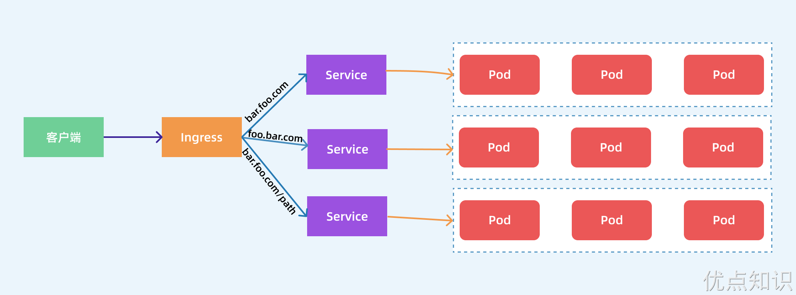
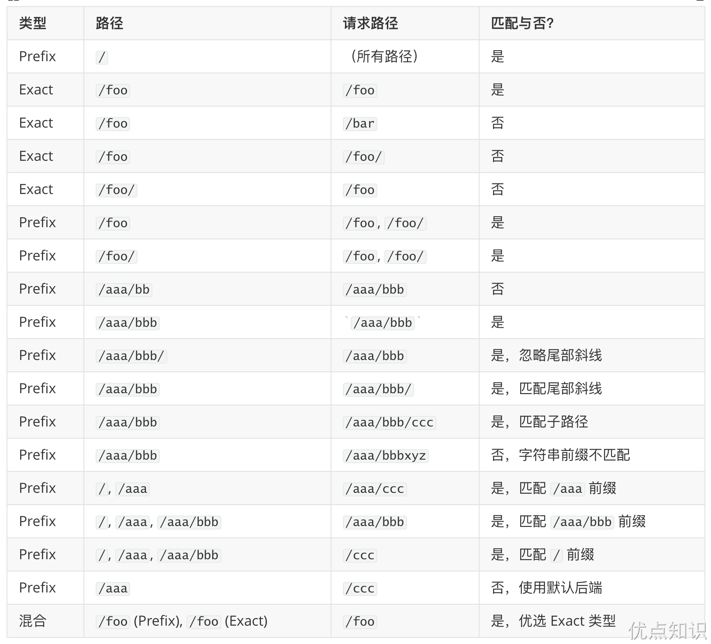
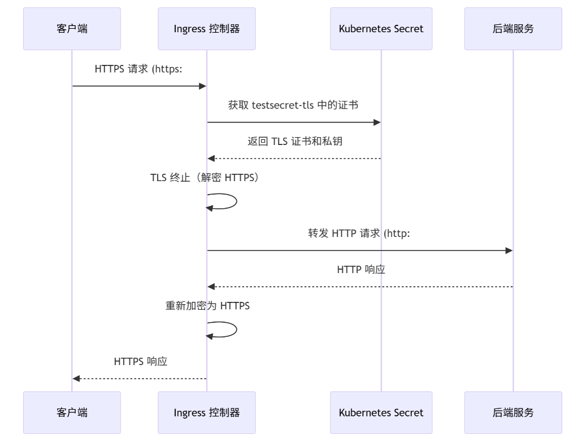
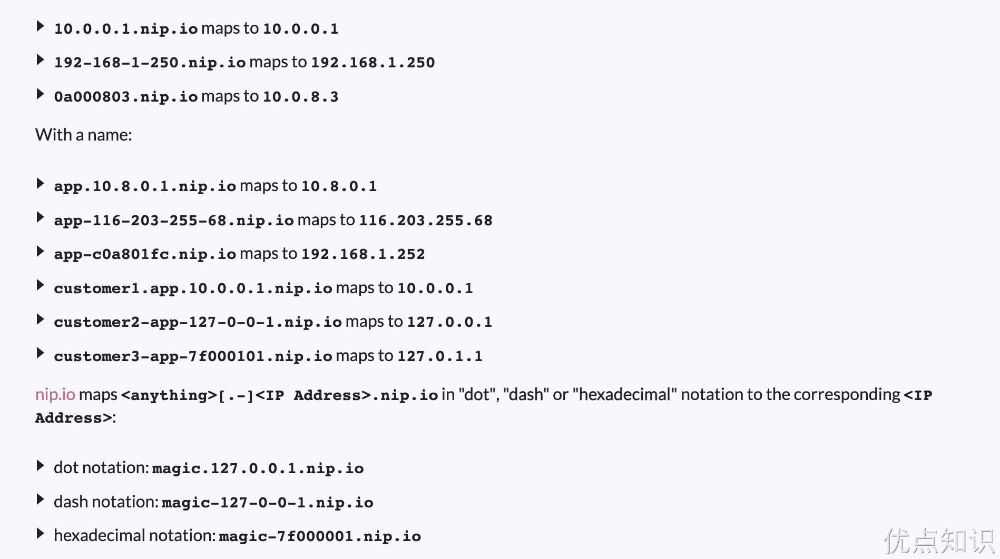

# Ingress
Kubernetes 从 v1.1 版本开始引入 Ingress 资源对象，用于将 Kubernetes 集群外的客户端请求路由到集群中的服务上，同时提供了7层(HTTP和HTTPS)路由功能。Ingress 在 Kubernetes v1.19 版本中达到 Stable 阶段，目前不再更新Ingress资源的特性，其在未来会逐步过渡到 Gateway API 中。

Kubernetes 使用了一个 Ingress 资源，用于定义策略和一个提供路由转发服务的 Ingress Controller，二者相结合实现了基于灵活的 Ingress 策略定义的服务路由功能。如果是对 Kubernetes 集群外的客户端提供服务，那么 Ingress Controller 实现的是类似于边缘路由器(Edge Router)的功能。需要注意的是，Ingress 只能使用 HTTP 和 HTTPS 协议提供服务，对于使用其他网络协议(如TCP)的服务，可以通过设置 Service 的类型(type)为 NodePort 或 LoadBalancer 来对集群外的客户端提供服务。

使用 Ingress 提供路由服务时，Ingress Controller 基于 Ingress 规则将客户端请求直接转发到 Service 对应的后端 Endpoint(Pod)上，这样会跳过 kube-proxy 设置的路由转发规则，以提高网络转发效率。


Ingress Controller 需要实现基于不同 HTTP URL 向后转发的负载分发规则，并可以灵活设置7层负载分发策略。目前 Ingress Controller 已经有许多实现方案，包括 Nginx、HAProxy、Kong、Traefik、Skipper、Istio 等开源软件的实现。

在 Kubernetes 中，Ingress Controller 会持续监控 API Server 的 /ingress 接口(用户定义的转发到后端服务的规则)的变化。当 /ingress 接口后端的服务信息发生变化时，Ingress Controller 会自动更新其转发规则。

本例基于 Nginx 提供的 Ingress Controller 进行说明。Nginx Ingress Controller 可以以 DaemonSet 或 Deployment 模式进行部署，通常可以考虑通过设置 nodeSelector 或亲和性调度策略来将其调度到固定的几个 Node 上提供服务。  

对于客户端应用如何通过网络访问 Ingress Controller，可以通过在容器级别设置 hostPort，将 80 和 443 端口号映射到宿主机上，这样客户端应用可以通过 URL 地址“http://\<NodeIP>:80”或“https://\<NodeIP>:443”访问 Ingress Controller，也可以配置 Pod  使用 hostNetwork 模式直接监听宿主机网卡的IP地址和端口号，或者使用 Service 的 NodePort 将端口号映射到宿主机上。

Ingress 资源对象是 Kubernetes 内置定义的一个对象，将外部的请求转发到集群内不同的 Service 上。



Ingress Controller 可以理解为一个监听器，通过不断地监听 kube-apiserver，实时感知后端 Service、Pod 的变化，当得到这些信息变化后，Ingress Controller 再结合 Ingress 的配置，更新反向代理负载均衡器，达到服务发现的作用。

# 定义
一个常见的 Ingress 资源清单如下所示：
```yaml
apiVersion: networking.k8s.io/v1
kind: Ingress
metadata:
  name: demo-ingress
  annotations:
    nginx.ingress.kubernetes.io/rewrite-target: /
spec:
  rules:
    - http:
        paths:
          - path: /testpath
            pathType: Prefix
            backend:
              service:
                name: test
                port:
                  number: 80
```
上面这个 Ingress 资源的定义，配置了一个路径为 `/testpath` 的路由，所有 `/testpath/**` 的入站请求，会被 Ingress 转发至名为 test 的服务的 80 端口的 / 路径下。可以将 Ingress 狭义的理解为 Nginx 中的配置文件 nginx.conf。

此外 Ingress 经常使用注解 annotations 来配置一些选项，当然这具体取决于 Ingress 控制器的实现方式，不同的 Ingress 控制器支持不同的注解。

Ingress 资源清单描述可以使用 kubectl explain 命令了解详情：
```sh
[root@master ingress]# kubectl explain ingress.spec
KIND:     Ingress
VERSION:  networking.k8s.io/v1

RESOURCE: spec <Object>

DESCRIPTION:
     Spec is the desired state of the Ingress. More info:
     https://git.k8s.io/community/contributors/devel/sig-architecture/api-conventions.md#spec-and-status

     IngressSpec describes the Ingress the user wishes to exist.

FIELDS:
   defaultBackend       <Object>
     DefaultBackend is the backend that should handle requests that don't match
     any rule. If Rules are not specified, DefaultBackend must be specified. If
     DefaultBackend is not set, the handling of requests that do not match any
     of the rules will be up to the Ingress controller.

   ingressClassName     <string>
     IngressClassName is the name of an IngressClass cluster resource. Ingress
     controller implementations use this field to know whether they should be
     serving this Ingress resource, by a transitive connection (controller ->
     IngressClass -> Ingress resource). Although the
     `kubernetes.io/ingress.class` annotation (simple constant name) was never
     formally defined, it was widely supported by Ingress controllers to create
     a direct binding between Ingress controller and Ingress resources. Newly
     created Ingress resources should prefer using the field. However, even
     though the annotation is officially deprecated, for backwards compatibility
     reasons, ingress controllers should still honor that annotation if present.

   rules        <[]Object>
     A list of host rules used to configure the Ingress. If unspecified, or no
     rule matches, all traffic is sent to the default backend.

   tls  <[]Object>
     TLS configuration. Currently the Ingress only supports a single TLS port,
     443. If multiple members of this list specify different hosts, they will be
     multiplexed on the same port according to the hostname specified through
     the SNI TLS extension, if the ingress controller fulfilling the ingress
     supports SNI.
```
从上面描述可以看出 Ingress 资源对象中有几个重要的属性：defaultBackend、ingressClassName、rules、tls。

## Rules
其中核心部分是 rules 属性的配置，每个路由规则都在下面进行配置：
- host：可选字段，如果没有提供该字段，Ingress 控制器会将所有到达它的 HTTP(S) 请求路由到与 `IngressRuleValue` 匹配的服务，而不管请求的 HTTP Host 头部是什么。如果提供了 host 域名，则 rules 则会匹配该域名的相关请求，此外 host 可以是精确匹配（例如 foo.bar.com）或者使用通配符来匹配（例如 *.foo.com）。
- http.paths：定义访问的路径列表，比如上面定义的 /testpath，每个路径都有一个由 `backend.service.name` 和 `backend.service.port.number` 定义关联的 Service 后端，在控制器将流量路由到引用的服务之前，host 和 path 都必须匹配传入的请求才行。
- backend：该字段其实就是用来定义后端的 Service 服务，与路由规则中 host 和 path 匹配的流量会将发送到对应的 backend 后端去。

> 此外一般情况下在 Ingress 控制器中会配置一个 defaultBackend 默认后端，当请求不匹配任何 Ingress 中的路由规则时会使用该后端。defaultBackend 通常是 Ingress 控制器的配置选项，而非在 Ingress 资源中指定。

## Resource
backend 后端除了可以引用一个 Service 服务之外，还可以通过一个 resource 资源进行关联。
```sh
[root@master ingress]# kubectl explain ingress.spec.rules.http.paths.backend.resource
KIND:     Ingress
VERSION:  networking.k8s.io/v1

RESOURCE: resource <Object>

DESCRIPTION:
     Resource is an ObjectRef to another Kubernetes resource in the namespace of
     the Ingress object. If resource is specified, a service.Name and
     service.Port must not be specified. This is a mutually exclusive setting
     with "Service".

     TypedLocalObjectReference contains enough information to let you locate the
     typed referenced object inside the same namespace.

FIELDS:
   apiGroup     <string>
     APIGroup is the group for the resource being referenced. If APIGroup is not
     specified, the specified Kind must be in the core API group. For any other
     third-party types, APIGroup is required.

   kind <string> -required-
     Kind is the type of resource being referenced

   name <string> -required-
     Name is the name of resource being referenced
```
Resource 是当前 Ingress 对象命名空间下引用的另外一个 Kubernetes 资源对象，但是需要注意的是 Resource 与 Service 配置是互斥的，只能配置一个。resource 使用 TypedLocalObjectReference 类型来包含足够的信息，以便于定位同一命名空间中的引用对象。
- apiGroup（可选）: 是被引用资源的 API 组。如果未指定 apiGroup，则默认引用的资源必须属于核心 API 组。对于第三方资源类型，必须指定 API 组。
- kind（必需）: 是被引用资源的类型。这告诉 Kubernetes 要寻找哪种类型的资源。
- name（必需）: 是被引用资源的名称。这指定了具体的资源实例。

使用 resource 字段，你可以将流量路由到命名空间中的不同类型的资源，这为更灵活的流量管理提供了可能。例如，你可以引用一个 Kubernetes API 对象，而不是传统的服务。

## PathType
`pathType` 是 Kubernetes Ingress 资源定义中 `ingress.spec.rules.http.paths` 部分的一个字段，用来确定如何解释和匹配 URL 路径。`pathType` 可以有以下几种值：

- **Exact**: 表示必须完全匹配 URL 路径，且区分大小写。这意味着，只有当请求的路径完全等于 Ingress 中定义的路径时，请求才会被路由到相应的后端服务。例如，如果设置为 `/foo`，则只有对 `/foo` 的请求才会匹配；对 `/foo/` 或 `/foo/bar` 的请求则不会匹配。
- **Prefix**: 基于 URL 路径前缀进行匹配，其中前缀是以 `/` 分割的，匹配区分大小写。路径元素是指以 `/` 分隔符分割的路径中的标签列表。请注意，如果路径的最后一个元素是请求路径最后一个元素的子串，那么它不会匹配。例如 `/foo/bar` 会匹配 `/foo/bar/baz`，但不会匹配 `/foo/barbaz`。
- **ImplementationSpecific**: `ImplementationSpecific` 的解释由 `IngressClass` 决定。不同的 Ingress 控制器实现可以将其视为独立的 `PathType`，或者将其视为与 `Prefix` 或 `Exact` 类型相同。Ingress 控制器的实现必须支持所有路径类型。

实际上，`pathType` 字段允许 Ingress 控制器正确地理解并匹配进入集群的请求路径。例如，如果开发者希望某个服务处理所有以 `/images` 开头的请求，他们可以使用 `Prefix` 类型，而如果仅希望精确匹配 `/images` 这个特定路径，则使用 `Exact` 类型。`ImplementationSpecific` 类型则留给了 Ingress 控制器的实现者来决定如何进行路径匹配，它提供了更大的灵活性，以适应特定的需求或使用场景。

可以查看下表了解更多的匹配场景（来自官网）：



> 在某些情况下，Ingress 中的多条路径会匹配同一个请求，这种情况下最长的匹配路径优先，如果仍然有两条同等的匹配路径，则精确路径类型优先于前缀路径类型。

## IngressClass
ingressClassName 是 Kubernetes Ingress 资源的一个属性，它用于指定与 Ingress 关联的 IngressClass 资源的名称。Ingress 控制器使用这个字段来判断它们是否应该服务于特定的 Ingress 资源。这种关联是这样的：Ingress 控制器 -> IngressClass -> Ingress 资源。

管理员可以定义一个或多个 IngressClass，每个都有一个与之关联的 Ingress 控制器。这样，Ingress 资源就能够声明它们想要使用的特定 IngressClass（通过 ingressClassName 字段），从而允许多个 Ingress 控制器互不干扰地在同一个 Kubernetes 集群中运行。例如：
```yaml
apiVersion: networking.k8s.io/v1
kind: IngressClass
metadata:
  name: external-lb
spec:
  controller: nginx-ingress-internal-controller
  parameters:
    apiGroup: k8s.example.com
    kind: IngressParameters
    name: external-lb
```
在 Kubernetes 的 `IngressClass` 资源中，`parameters` 字段允许你为特定的 Ingress 控制器提供额外的配置参数。这些参数可以是任何与控制器相关的配置。`parameters` 字段引用一个 Kubernetes 资源对象，该对象包含了这些额外的配置选项。

例如，假设你有一个自定义的 Ingress 控制器参数资源，它可以定义一些自定义的日志设置或者安全策略。自定义资源对象（例如 `IngressParameters`）的结构、支持的字段和它们的含义都是由 Ingress 控制器的开发者定义的。所以你需要查看控制器文档来确定哪些参数可配置，并了解如何设置这些参数，指导你如何在自定义资源中设定这些选项。

```yaml
apiVersion: k8s.example.com/v1alpha1
kind: IngressParameters
metadata:
  name: external-lb-params
spec:
  logLevel: "debug"
  enableCustomHeaders: true
```

然后在 `IngressClass` 中，你可以通过引用这个参数资源来为控制器指定这些参数：

```yaml
apiVersion: networking.k8s.io/v1
kind: IngressClass
metadata:
  name: external-lb
spec:
  controller: example.com/ingress-controller
  parameters:
    apiGroup: k8s.example.com
    kind: IngressParameters
    name: external-lb-params
```

当 Ingress 控制器处理与这个 `IngressClass` 相关联的 Ingress 资源时，它将会查找名称为 `external-lb-params` 的 `IngressParameters` 资源，并使用它来获取配置参数。 控制器将会按照这些参数来调整它的行为。

通过创建多个 `IngressClass` 资源，每个都有不同的 `parameters` 配置，你可以使得不同的 `Ingress` 资源在归属于同一个 Ingress 控制器的情况下展现不同的行为。每个 `IngressClass` 可以有特定的配置，这些配置对应于该类的所有 Ingress 资源。这种设计允许管理员为不同的应用或不同的组织需求创建具有独立配置的 Ingress 环境，即使它们在同一个 Kubernetes 集群中并且由同一个 Ingress 控制器管理。

例如，你可能要为生产环境的 Ingress 设置不同的性能调优参数，而对于开发环境则设置不同的参数。另外，某些 Ingress 可能需要特定的安全策略或其他中间件插件。通过为这些不同的需求创建独立的 `IngressClass` 对象，并为它们指定不同的 `parameters`，你就可以在不改变 Ingress 控制器本身的情况下实现这些定制化的行为。

Ingress 中的 spec.ingressClassName 属性就可以用来指定对应的 IngressClass，并进而由 IngressClass 关联到对应的 Ingress 控制器，如：

```yaml
apiVersion: networking.k8s.io/v1
kind: Ingress
metadata:
  name: myapp
spec:
  ingressClassName: external-lb # 上面定义的 IngressClass 对象名称
  defaultBackend:
    service:
      name: myapp
      port:
        number: 80
```
在早期版本的 Kubernetes 中，ingressClassName 字段还不存在，因此，用户通常会使用 kubernetes.io/ingress.class 注解来为 Ingress 资源和 Ingress 控制器之间建立直接关联。这个注解虽然没有被正式定义，但被广泛支持，并且在实践中起到了类似 ingressClassName 字段的作用。

然而，随着 Kubernetes 的发展，官方推荐使用 ingressClassName 字段来替代 kubernetes.io/ingress.class 注解。新创建的 Ingress 资源应该更倾向于使用这个字段。尽管如此，出于向后兼容的考虑，即使 kubernetes.io/ingress.class 注解已被官方废弃，Ingress 控制器仍然应该兼容这个注解。

不过需要注意的是 spec.ingressClassName 与老版本的 kubernetes.io/ingress.class 注解的作用并不完全相同，因为 ingressClassName 字段引用的是 IngressClass 资源的名称，IngressClass 资源中除了指定了 Ingress 控制器的名称之外，还可能会通过 spec.parameters 属性定义一些额外的配置。

由于一个集群中可能有多个 Ingress 控制器，所以我们还可以将一个特定的 IngressClass 对象标记为集群默认是 Ingress 类。只需要将一个 IngressClass 资源的 `ingressclass.kubernetes.io/is-default-class` 注解设置为 true 即可，这样未指定 ingressClassName 字段的 Ingress 就会使用这个默认的 IngressClass。

> 如果集群中有多个 IngressClass 被标记为默认，准入控制器将阻止创建新的未指定 ingressClassName 的 Ingress 对象。最好的方式还是确保集群中最多只能有一个 IngressClass 被标记为默认。

## TLS
Ingress 资源对象还可以用来配置 HTTPS 服务，可以通过设定包含 TLS 私钥和证书的 Secret 来保护 Ingress。需要注意 TLS Secret 必须包含名为 tls.crt 和 tls.key 的键名，例如：
```yaml
apiVersion: v1
kind: Secret
metadata:
  name: testsecret-tls
  namespace: default
data:
  tls.crt: base64 编码的 cert
  tls.key: base64 编码的 key
type: kubernetes.io/tls
```
需要在 Ingress 资源对象中引用该 Secret，这将通知 Ingress Controller 使用 TLS 加密客户端到负载均衡器的网络通道。用户需要确保在 TLS 证书( tls.crt )中相应 host 的全限定域名(FQDN)被包含在其 CN(Common Name) 配置中。  




```yaml
apiVersion: networking.k8s.io/v1
kind: Ingress
metadata:
  name: tls-example-ingress
spec:
  tls:
    - hosts:
        - https-example.foo.com
      secretName: testsecret-tls
  rules:
    - host: https-example.foo.com
      http:
        paths:
          - path: /
            pathType: Prefix
            backend:
              service:
                name: service1
                port:
                  number: 80
```
现在了解了如何定义 Ingress 资源对象，但是仅创建 Ingress 资源本身没有任何效果。还需要部署 Ingress 控制器，现在普遍用得较多的是 Ingress-nginx、Apisix 以及 Traefik，Traefik 的性能比 Ingress-nginx 差，但是配置使用要简单许多。

# Ingress-nginx
Ingress 资源对象只是一个路由请求描述配置文件，要让其真正生效还需要对应的 Ingress 控制器才行，Ingress 控制器有很多，这里我们先介绍使用最多的 Ingress-nginx，它是基于 Nginx 的 Ingress 控制器。

## 安装
Ingress-nginx 所在的节点需要能够访问外网，这样域名可以解析到这些节点上直接使用，可以让 Ingress-nginx 绑定节点的 80 和 443 端口，所以可以使用 hostPort 或者 hostNetwork 模式，当然对于线上环境来说为了保证高可用，一般是需要运行多个 Ingress-nginx 实例，然后可以用一个 nginx/haproxy 作为入口，通过 keepalived 来访问边缘节点的 vip 地址。

> 所谓边缘节点即集群内部用来向集群外暴露服务能力的节点，集群外部的服务通过该节点来调用集群内部的服务，边缘节点是集群内外交流的一个 Endpoint。

安装 Ingress-nginx 有多种方式，我们这里直接使用下面的命令进行一键安装：
```sh
kubectl apply -f https://raw.githubusercontent.com/kubernetes/ingress-nginx/controller-v1.5.1/deploy/static/provider/cloud/deploy.yaml
# 可以替换对应的两个镜像
# cnych/ingress-nginx:v1.5.1
# cnych/ingress-nginx-kube-webhook-certgen:v20220916-gd32f8c343
```
上面的命令执行后会自动创建一个名为 ingress-nginx 的命名空间，会生成如下几个 Pod：
```sh
[root@master yamlDir]# kubectl get pods -n ingress-nginx
NAME                                        READY   STATUS      RESTARTS   AGE
ingress-nginx-admission-create-67dnp        0/1     Completed   0          4m59s
ingress-nginx-admission-patch-gw2g6         0/1     Completed   0          4m59s
ingress-nginx-controller-68b46f9864-k5lxm   1/1     Running     0          4m59s
```
此外还会创建如下两个 Service 对象：
```sh
[root@master yamlDir]# kubectl get svc -n ingress-nginx
NAME                                 TYPE           CLUSTER-IP       EXTERNAL-IP   PORT(S)                      AGE
ingress-nginx-controller             LoadBalancer   10.106.233.117   <pending>     80:30230/TCP,443:31984/TCP   5m24s
ingress-nginx-controller-admission   ClusterIP      10.108.97.28     <none>        443/TCP                      5m24s
```
其中 ingress-nginx-controller-admission 是为准入控制器提供服务的，我们也是强烈推荐开启该准入控制器，这样当我们创建不合要求的 Ingress 对象后就会直接被拒绝了，另外一个 ingress-nginx-controller 就是 ingress 控制器对外暴露的服务，我们可以看到默认是一个 LoadBalancer 类型的 Service，我们知道该类型是用于云服务商的，我们这里在本地环境，暂时不能使用，但是可以通过它的 NodePort 来对外暴露，后面我们会提供在本地测试环境提供 LoadBalancer 的方式。

到这里 Ingress-nginx 就部署成功了，安装完成后还会创建一个名为 nginx 的 IngressClass 对象：
```sh
[root@master yamlDir]# kubectl get ingressclass
NAME    CONTROLLER             PARAMETERS   AGE
nginx   k8s.io/ingress-nginx   <none>       14m
[root@master yamlDir]# kubectl get ingressclass nginx -o yaml
apiVersion: networking.k8s.io/v1
kind: IngressClass
metadata:
  annotations:
    kubectl.kubernetes.io/last-applied-configuration: |
      {"apiVersion":"networking.k8s.io/v1","kind":"IngressClass","metadata":{"annotations":{},"labels":{"app.kubernetes.io/component":"controller","app.kubernetes.io/instance":"ingress-nginx","app.kubernetes.io/name":"ingress-nginx","app.kubernetes.io/part-of":"ingress-nginx","app.kubernetes.io/version":"1.5.1"},"name":"nginx"},"spec":{"controller":"k8s.io/ingress-nginx"}}
  creationTimestamp: "2024-03-07T13:24:05Z"
  generation: 1
  labels:
    app.kubernetes.io/component: controller
    app.kubernetes.io/instance: ingress-nginx
    app.kubernetes.io/name: ingress-nginx
    app.kubernetes.io/part-of: ingress-nginx
    app.kubernetes.io/version: 1.5.1
  name: nginx
  resourceVersion: "170253"
  uid: 591f07c1-14fc-4485-8ef0-5453a5a356d0
spec:
  controller: k8s.io/ingress-nginx
```
这里我们只提供了一个 controller 属性，对应的值和 ingress-nginx 的启动参数中的 controller-class 一致的。
```sh
apiVersion: apps/v1
kind: Deployment
metadata:
  ...
  name: ingress-nginx-controller
  namespace: ingress-nginx
spec:
    ...
    spec:
      containers:
      - args:
        - /nginx-ingress-controller
        - --publish-service=$(POD_NAMESPACE)/ingress-nginx-controller
        - --election-id=ingress-nginx-leader
        - --controller-class=k8s.io/ingress-nginx
        - --ingress-class=nginx
        - --configmap=$(POD_NAMESPACE)/ingress-nginx-controller
        - --validating-webhook=:8443
        - --validating-webhook-certificate=/usr/local/certificates/cert
        - --validating-webhook-key=/usr/local/certificates/key
```

# 第一个示例
安装成功后，现在我们来为一个 nginx 应用创建一个 Ingress 资源，如下所示：
```yaml
# my-nginx.yaml
apiVersion: apps/v1
kind: Deployment
metadata:
  name: my-nginx
spec:
  selector:
    matchLabels:
      app: my-nginx
  template:
    metadata:
      labels:
        app: my-nginx
    spec:
      containers:
        - name: my-nginx
          image: nginx
          ports:
            - containerPort: 80
---
apiVersion: v1
kind: Service
metadata:
  name: my-nginx
  labels:
    app: my-nginx
spec:
  ports:
    - port: 80
      protocol: TCP
      name: http
  selector:
    app: my-nginx
---
apiVersion: networking.k8s.io/v1
kind: Ingress
metadata:
  name: my-nginx
  namespace: default
spec:
  ingressClassName: nginx # 使用 nginx 的 IngressClass（关联的 ingress-nginx 控制器）
  rules:
    - host: first-ingress.192.168.58.176.nip.io
      http:
        paths:
          - path: /
            pathType: Prefix
            backend:
              service: # 将所有请求发送到 my-nginx 服务的 80 端口
                name: my-nginx
                port:
                  number: 80
# 不过需要注意大部分Ingress控制器都不是直接转发到Service
# 而是只是通过Service来获取后端的Endpoints列表，直接转发到Pod，这样可以减少网络跳转，提高性能
```
注意我们这里配置的域名是 `first-ingress.192.168.58.176.nip.io`，该地址其实会直接映射到 `192.168.58.176` 上面，该 IP 地址就是我的 Master 节点地址(任意节点均可以)，因为我们这里 ingress 控制器是通过 NodePort 对外进行暴露的，所以可以通过 `域名:nodePort` 来访问服务。`nip.io` 是由 PowerDNS 提供支持的开源服务，允许我们可以直接通过使用以下格式将任何主机名映射到主机IP地址，这样就不需要在 etc/hosts 文件中配置映射，对于 Ingress 测试非常方便。



这里直接创建上面的资源对象即可：
```sh
[root@master yamlDir]# kubectl apply -f my-nginx.yaml
deployment.apps/my-nginx created
service/my-nginx created
ingress.networking.k8s.io/my-nginx created
[root@master yamlDir]# kubectl get ingress
NAME       CLASS   HOSTS                                 ADDRESS   PORTS   AGE
my-nginx   nginx   first-ingress.192.168.58.176.nip.io             80      8s
```
在上面的 Ingress 资源对象中我们使用配置 `ingressClassName: nginx` 指定让我们安装的 Ingress-nginx 这个控制器来处理我们的 Ingress 资源，配置的匹配路径类型为前缀的方式去匹配 /，将来自域名 `first-ingress.192.168.58.176.nip.io` 的所有请求转发到 my-nginx 服务的后端 Endpoints 中去，注意访问的时候需要带上 NodePort 端口。
```sh
[root@master yamlDir]# curl first-ingress.192.168.58.176.nip.io:30230
<!DOCTYPE html>
<html>
<head>
<title>Welcome to nginx!</title>
...
```
前面我们也提到了 Ingress-nginx 控制器的核心原理就是将 Ingress 这些资源对象映射翻译成 Nginx 配置文件 nginx.conf，我们可以通过查看控制器中的配置文件来验证这点：
```sh
[root@master yamlDir]# kubectl exec -it ingress-nginx-controller-68b46f9864-k5lxm -n ingress-nginx -- cat /etc/nginx/nginx.conf

http {
...
        upstream upstream_balancer {
                server 0.0.0.1; # placeholder

                balancer_by_lua_block {
                        balancer.balance()
                }

                keepalive 320;
                keepalive_time 1h;
                keepalive_timeout  60s;
                keepalive_requests 10000;
        }
        ## start server first-ingress.192.168.58.176.nip.io
        server {
                location / {

                        set $namespace      "default";
                        set $ingress_name   "my-nginx";
                        set $service_name   "my-nginx";
                        set $service_port   "80";
                        set $location_path  "/";
                        set $global_rate_limit_exceeding n;

                        set $balancer_ewma_score -1;
                        set $proxy_upstream_name "default-my-nginx-80";
                        set $proxy_host          $proxy_upstream_name;
                        set $pass_access_scheme  $scheme;

                        set $pass_server_port    $server_port;

                        set $best_http_host      $http_host;
                        set $pass_port           $pass_server_port;
                }
        }
        ...
}
```
可以在 nginx.conf 配置文件中看到上面新增的 Ingress 资源对象的相关配置信息，不过需要注意的是现在并不会为每个 backend 后端都创建一个 upstream 配置块，现在是使用 Lua 程序进行动态处理的，所以没有直接看到后端的 Endpoints 相关配置数据。

此外我们也可以安装一个 kubectl 插件 https://kubernetes.github.io/ingress-nginx/kubectl-plugin 来辅助使用 ingress-nginx，要安装该插件的前提需要先安装 krew，然后执行下面的命令即可：
```sh
➜ kubectl krew install ingress-nginx
```

# 工作流程

Ingress-nginx 是一个为 Kubernetes 提供 Ingress 功能的控制器，它使用 NGINX 作为反向代理和负载均衡器。以下是它的工作大致流程：

1. **部署 Ingress-nginx 控制器**：首先，你需要在你的 Kubernetes 集群中部署 Ingress-nginx 控制器。通常这个控制器会以 Pod 的形式运行，并且会在集群中创建 Service 来暴露它自己（经常使用的是 LoadBalancer 类型的 Service）。

2. **监听 Ingress 资源的变化**：Ingress-nginx 控制器会持续监听 Kubernetes 集群中的 Ingress 资源的创建、更新和删除事件。

3. **生成 NGINX 配置**：当探测到 Ingress 资源的变化时，控制器会根据 Ingress 规则生成相应的 NGINX 配置。这些规则定义了外部请求如何路由到集群内不同的服务。

4. **应用配置**：Ingress-nginx 控制器将生成的配置写入到 NGINX 服务器的配置文件中。如果需要，它会无缝重载 NGINX 以确保新的配置生效，而不影响正在处理的请求。

5. **请求路由**：用户或外部系统发起的请求到达 Ingress-nginx 控制器暴露的服务地址（例如，通过 LoadBalancer 的 IP 地址）。NGINX 根据配置决定如何路由这些请求到 Kubernetes 集群内的正确服务。

6. **服务发现和健康检查**：Ingress-nginx 控制器通过内部机制来发现服务端点（即 Pod 的 IP 地址）并且可能会对它们执行健康检查。

7. **处理流量**：最后，NGINX 作为反向代理，按照配置的规则将请求转发到正确的 Pod。如果服务背后有多个副本的 Pod，NGINX 还会执行负载均衡。

8. **发送响应**：被请求的 Pod 处理完请求后，响应会被发送回 NGINX，然后 NGINX 将响应返回给客户端。

Ingress-nginx 控制器的关键在于将 Ingress 规则翻译成有效的 NGINX 配置，并且确保这些配置与 Kubernetes 中的服务声明和 Pod 状态保持同步。这使得从集群外部访问集群内部服务变得简单和高效。