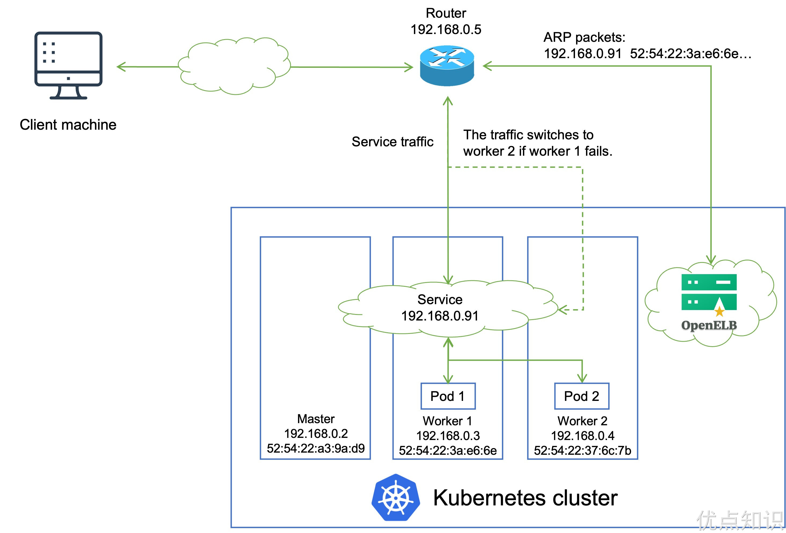

# LoadBalancer
MetalLB 是一个为裸机 Kubernetes 集群提供负载均衡的解决方案。它旨在填补 Kubernetes 在没有云提供商负载均衡解决方案时的空白，允许你在本地或私有云环境中使用标准的 LoadBalancer 类型的 Service。在社区中目前比较流行的应该是 MetalLB 和 OpenELB 这两个项目。

# MetalLB

> https://github.com/metallb/metallb 在持续不断的更新中，目前8k左右

MetalLB 是裸机 Kubernetes 集群的负载均衡器实现，使用标准路由协议，主要用于暴露 K8s 集群的服务到集群外部访问，MetalLB 可以让我们在 K8s 集群中创建服务类型为 LoadBalancer 的服务，并且无需依赖云厂商提供的 LoadBalancer。

它具有两个共同提供此服务的工作负载：地址分配（address allocation）和外部公告（external announcement），对应在 K8s 中部署的 Speaker 和 Controller：
1. **Controller**：它负责观察 Kubernetes 集群的服务变化。当一个新的 LoadBalancer 类型的 Service 被创建时，Controller 会分配一个 IP 地址给它。这个 IP 地址来源于 MetalLB 的配置地址池中。

2. **Speaker**：它运行在 Kubernetes 集群的每个节点上。Speaker 负责将由 Controller 分配的 IP 地址公布到本地网络中。它使用标准的网络协议，如 ARP（地址解析协议）或 BGP（边界网关协议），来通告 Service 的 IP 地址。这确保了当外部设备向分配给 LoadBalancer Service 的 IP 地址发送数据包时，这些数据包能够被路由到 Kubernetes 集群中的正确节点上。

MetalLB 的工作流程可以简化为以下几个步骤：

1. **安装和配置**：首先，你安装 MetalLB 到你的 Kubernetes 集群，并配置一个或多个 IP 地址池。这些 IP 地址池是 MetalLB 可以分配给 LoadBalancer Services 的地址范围。

2. **Service 创建**：当你创建一个类型为 LoadBalancer 的 Service 时，Kubernetes API 会通知 MetalLB。

3. **IP 地址分配**：MetalLB 的 Controller 检测到新的 LoadBalancer Service 并从配置的地址池中选择一个 IP 地址分配给它。

4. **网络广播**：MetalLB 的 Speaker 组件在本地网络中宣告这个新的 IP 地址。根据配置，Speaker 可以使用 ARP 或 BGP 协议来执行这一任务。

5. **接收流量**：现在，外部设备（如路由器或交换机）知道如何将流量路由到分配给 Service 的 IP 地址，流量随后被发送到 Kubernetes 集群。

6. **流量转发**：一旦流量到达 Kubernetes 集群，标准的 Kubernetes Service 和 Endpoint 机制接管，确保流量被转发到后端的 Pods。

7. **响应处理**：后端 Pods 处理请求，并将响应通过节点和 Service IP 地址发送回客户端。

MetalLB 提供了一个在不依赖外部设备的情况下在内部网络上进行负载均衡的简单方法。这对于在没有云服务商支持的私有数据中心或在本地环境中运行 Kubernetes 集群的用户来说是非常有用的。

## 外部流量如何到达集群节点

当一个外部设备（如客户端计算机、路由器等）发送数据包到分配给 Kubernetes LoadBalancer Service 的 IP 地址时，必须有一种机制确保这些数据包被正确地路由到 Kubernetes 集群中的某个节点。这是 MetalLB Speaker 组件的职责所在，它使用两种不同的协议（ARP 或 BGP）来实现这个目的：

1. **ARP 模式**：
   - 当使用基于 ARP（地址解析协议）的模式时，Speaker 组件会对本地网络上的 ARP 请求做出响应，这些请求在寻找分配给 LoadBalancer Service 的 IP 地址的物理（MAC）地址。
   - 当一个设备想要发送数据包到这个 IP 地址时，它首先会在本地网络发出一个 ARP 请求：“这个 IP 地址的 MAC 地址是什么？”
   - 在集群中运行的 MetalLB Speaker 会侦听这些 ARP 请求，并以集群节点的 MAC 地址作为响应。结果是，发送设备将能够通过正确的 MAC 地址发送数据包到集群节点。
   - 这样，数据包就被直接发送到了响应 ARP 请求的节点。然后 Kubernetes 自身的 Service 和 Endpoints 机制会将流量路由到正确的 Pod。

2. **BGP 模式**：
   - 在基于 BGP（边界网关协议）的模式中，每个 MetalLB Speaker 与外部 BGP 路由器建立对话关系。
   - MetalLB Speaker 宣布分配给 LoadBalancer Service 的 IP 地址，并通过 BGP 路由更新告诉外部路由器如何到达该地址。
   - 以这种方式，集群外的路由器学习到如何将流量路由到集群中的一个或多个节点。这些节点将作为入口点，接收外部流量并将其转发到正确的服务。

在这两种模式下，MetalLB 的 Speaker 组件都起到了关键作用，它们确保集群外部的设备可以将流量发送到 Kubernetes 集群的服务上。一旦流量到达集群节点，标准的 Kubernetes Service 和 Endpoints 就会接管，确保流量被转发到正确的后端 Pod。这使得使用 MetalLB 的 Kubernetes 集群就像是使用了一个传统的、外部的负载均衡器一样，但实际上是完全由集群内部的机制实现的。

### ARP模式下响应哪个节点MAC地址呢？

在 MetalLB 的 ARP 模式下，多个 Speaker 实例会协调响应 ARP 请求，以确保只有一个节点响应特定的负载均衡 IP 地址。MetalLB 使用一种称为 "leader election" 的机制，来决定哪个节点应该响应给定的 ARP 请求。这个过程如下：

1. **领导选举**：MetalLB 的 Speaker 组件会在集群中进行领导选举，来决定哪一个 Speaker 实例（响应哪个节点的 MAC 地址）会成为负责某个特定负载均衡 IP 地址的领导。当 Speaker 实例被选为领导时，它将确保在其节点的网络接口上配置该 Service IP 地址。这样，当该节点收到目标是该 Service IP 地址的流量时，它能够接收并处理。

2. **ARP 响应**：只有当选为领导的 Speaker 实例才会响应对于特定负载均衡器 IP 地址的 ARP 请求。其他 Speaker 实例不会响应相同的 ARP 请求，以此避免冲突。

3. **故障转移**：如果领导节点变得不可用（例如，宕机或网络故障），MetalLB 其他 Speaker 实例会重新选举新的领导。新的领导会开始响应 ARP 请求，确保服务的持续可用性。

4. **流量路由**：外部设备（如路由器）收到 ARP 响应后，会将流量发送到响应节点的 MAC 地址。这个节点就成为了流量的入口点。

5. **Kubernetes 服务转发**：一旦流量到达 Kubernetes 集群的节点，标准的 Kubernetes 服务和端点机制就会接管，将流量路由到正确的后端 Pod。

MetalLB 的这种设计确保了即使在多节点的环境中，对于每个负载均衡器 IP 地址，也只有一个节点在任何时候响应 ARP 请求，这样就保证了流量的正确路由和服务的高可用性。

### BGP模式下流量过程

在 MetalLB 的 BGP 模式下，流量路由的学习和决策是通过 BGP 协议完成的。BGP 是一种核心的互联网路由协议，用来在不同网络自治系统（AS）之间交换路由和可达性信息。MetalLB 利用这种协议来通知外部路由器 Kubernetes 集群内的路由信息。

以下是在 BGP 模式下，外部路由器学习路由到 Kubernetes 集群节点的步骤：

1. **BGP 会话建立**：Kubernetes 集群中的每个 MetalLB Speaker 实例与外部的 BGP 路由器建立一个 BGP 会话（或称为对等连接）。这个连接允许它们交换路由信息。

2. **通告路由**：当一个新的 LoadBalancer 类型的 Service 创建时，MetalLB 的 Controller 会分配一个 IP 地址给这个 Service。每个 Speaker 实例会将分配给 Service 的 IP 地址作为可达路由通告到它和外部 BGP 路由器之间建立的 BGP 会话中。

3. **选择路由路径**：外部 BGP 路由器根据收到的路由通告和 BGP 协议的路由选择算法来决定最优路径。根据 BGP 配置，可能有多种因素影响这个决策，包括路径属性、路由策略和本地优先级等。

4. **流量转发**：一旦外部路由器决定了最优路径，所有发送到 LoadBalancer IP 地址的流量都会被路由到选定的 Kubernetes 节点。

5. **故障转移与高可用性**：如果特定的 Kubernetes 节点变得不可用，Speaker 实例会更新 BGP 路由信息以反映这一变化。外部路由器根据新的路由信息更新路由决策，将流量重定向到其他可用的节点。

6. **动态负载均衡**：MetalLB 可以配置为使用 BGP 属性（如多路径）来实现跨多个节点的流量分发，这样可以实现对 Kubernetes 集群节点的负载均衡。（“多路径”（Multipath）是一个可选功能，它允许路由器在具有相同成本的多条路径间分发流量，即使这些路径可能通过不同的相邻 BGP 对等体（邻居）。当启用多路径时，BGP 会将它认为等价的多条路径安装到路由表中，而不仅仅是选择一条最佳路径。）

整个过程是动态的，允许 Kubernetes 集群在不断变化的网络条件下自适应地管理外部流量的路由。这种方法可以提供对于 LoadBalancer 类型 Service 的高度可用性和故障转移能力，同时也使得集群能够以原生的方式与现有的网络基础设施集成。


## 准备工作
在开始部署 MetalLB 之前，我们需要确定部署环境能够满足最低要求：
- 一个 K8s 集群，要求版本不低于 1.13.0，且没有负载均衡器相关插件
- K8s 集群上的 CNI 组件和 MetalLB 兼容
- 预留一段 IPv4 地址给 MetalLB 作为 LoadBalance 的 VIP 使用(在MetalLB的情况下，VIP用作集群外部可以访问的、代表Kubernetes服务的稳定IP地址。)
- 如果使用的是 MetalLB 的 BGP 模式，还需要路由器支持 BGP 协议
- 如果使用的是 MetalLB 的 Layer2 模式，因为使用了 memberlist 算法来实现选主，因此需要确保各个 K8s 节点之间的 7946 端口可达（包括 TCP 和 UDP 协议），当然也可以根据自己的需求配置为其他端口

MetalLB 官方给出了对主流的一些 CNI 的兼容情况，MetalLB 主要还是利用了 K8s 自带的 kube-proxy 组件做流量转发，因此对大多数的 CNI 兼容情况都相当不错。
| 网络插件   | 兼容性                                      |
|------------|---------------------------------------------|
| Antrea     | Yes (Tested on version 1.4 and 1.5)         |
| Calico     | Mostly (see known issues)                   |
| Canal      | Yes                                         |
| Cilium     | Yes                                         |
| Flannel    | Yes                                         |
| Kube-ovn   | Yes                                         |
| Kube-router| Mostly (see known issues)                   |
| Weave Net  | Mostly (see known issues)                   |

## 安装
部署 Layer2 模式需要把 K8s 集群中的 ipvs 配置打开 strictARP，开启之后 K8s 集群中的 kube-proxy 会停止响应 kube-ipvs0 网卡之外其他网卡的 arp 请求，而由 MetalLB 接手处理。我们只需要在 K8s 集群中编辑 kube-proxy 配置即可：
```sh
$ kubectl edit configmap -n kube-system kube-proxy
# ......
apiVersion: kubeproxy.config.k8s.io/v1alpha1
kind: KubeProxyConfiguration
mode: "ipvs"
ipvs:
  strictARP: true
```
我们这里使用 Layer2 模式，直接使用下面的命令一键安装即可：
```sh
[root@master yamlDir]# kubectl apply -f https://raw.githubusercontent.com/metallb/metallb/v0.13.7/config/manifests/metallb-native.yaml
namespace/metallb-system created
customresourcedefinition.apiextensions.k8s.io/addresspools.metallb.io created
customresourcedefinition.apiextensions.k8s.io/bfdprofiles.metallb.io created
customresourcedefinition.apiextensions.k8s.io/bgpadvertisements.metallb.io created
customresourcedefinition.apiextensions.k8s.io/bgppeers.metallb.io created
customresourcedefinition.apiextensions.k8s.io/communities.metallb.io created
customresourcedefinition.apiextensions.k8s.io/ipaddresspools.metallb.io created
customresourcedefinition.apiextensions.k8s.io/l2advertisements.metallb.io created
serviceaccount/controller created
serviceaccount/speaker created
role.rbac.authorization.k8s.io/controller created
role.rbac.authorization.k8s.io/pod-lister created
clusterrole.rbac.authorization.k8s.io/metallb-system:controller created
clusterrole.rbac.authorization.k8s.io/metallb-system:speaker created
rolebinding.rbac.authorization.k8s.io/controller created
rolebinding.rbac.authorization.k8s.io/pod-lister created
clusterrolebinding.rbac.authorization.k8s.io/metallb-system:controller created
clusterrolebinding.rbac.authorization.k8s.io/metallb-system:speaker created
secret/webhook-server-cert created
service/webhook-service created
deployment.apps/controller created
daemonset.apps/speaker created
validatingwebhookconfiguration.admissionregistration.k8s.io/metallb-webhook-configuration created
```
上面的命令会创建一个 metallb-system 的命名空间，并会安装多个 CRD 资源（后续讲解）:
```sh
[root@master yamlDir]# kubectl get pods -n metallb-system
NAME                          READY   STATUS    RESTARTS   AGE
controller-84d6d4db45-gldw2   1/1     Running   0          102s
speaker-d6s82                 1/1     Running   0          102s
speaker-gg6xs                 1/1     Running   0          102s
speaker-v6bw5                 1/1     Running   0          102s
```
到这里就部署成功了。对于 2 层模式的配置使用是最简单的，它的工作方式是直接响应你本地网络上的 ARP 请求，把机器的 MAC 地址给客户端。

## 使用
先看看安装MetalLb之后给我们生成的CRD
```sh
[root@master yamlDir]# kubectl get crd |grep metallb
addresspools.metallb.io        2024-03-07T15:43:27Z
bfdprofiles.metallb.io         2024-03-07T15:43:27Z
bgpadvertisements.metallb.io   2024-03-07T15:43:27Z
bgppeers.metallb.io            2024-03-07T15:43:27Z
communities.metallb.io         2024-03-07T15:43:27Z
ipaddresspools.metallb.io      2024-03-07T15:43:27Z
l2advertisements.metallb.io    2024-03-07T15:43:27Z
```
要 Layer2 模式进行配置，需要创建一个 IPAddressPool 资源对象，用来指定用于分配的 IP 池，比如我们这里创建如下所示的一个分配给 LB 的 IP 池对象：
```yaml
# ip-pool.yaml
apiVersion: metallb.io/v1beta1
kind: IPAddressPool
metadata:
  name: ip-pool
  namespace: metallb-system
spec:
  addresses:
    - 192.168.58.10-192.168.58.30 # 分配给LB的IP池，与节点处于同一网段
```
然后需要创建一个广播声明，可以关联上面的 IP 池对象，这样会使用关联的 IP 池地址。为了通告来自 IPAddressPool 的 IP，L2Advertisement 实例必须关联到 IPAddressPool。
```yaml
# advertise.yaml
apiVersion: metallb.io/v1beta1
kind: L2Advertisement
metadata:
  name: l2adver
  namespace: metallb-system
spec:
  ipAddressPools:
    - ip-pool # 如果不配置则会通告所有的IP池地址
```
比如上面的配置可以让 MetalLB 控制从 `192.168.58.10 - 192.168.58.30` 的 IP 地址。

直接创建上面的两个资源对象：
```sh
[root@master yamlDir]# kubectl apply -f ip-pool.yaml
ipaddresspool.metallb.io/ip-pool created
[root@master yamlDir]# kubectl get ipaddresspool -n metallb-system
NAME      AUTO ASSIGN   AVOID BUGGY IPS   ADDRESSES
ip-pool   true          false             ["192.168.58.10-192.168.58.30"]
[root@master yamlDir]#
[root@master yamlDir]# kubectl apply -f advertise.yaml
l2advertisement.metallb.io/l2adver created
[root@master yamlDir]# kubectl get l2Advertisement -n metallb-system
NAME      IPADDRESSPOOLS   IPADDRESSPOOL SELECTORS   INTERFACES
l2adver   ["ip-pool"]
```
这样我们就可以创建使用 LoadBalancer 类型的 Service 了。这个时候看一下之前安装Ingress-nginx时创建的LoadBalancer、ingress：
```sh
[root@master yamlDir]# kubectl get svc -n ingress-nginx
NAME                                 TYPE           CLUSTER-IP       EXTERNAL-IP     PORT(S)                      AGE
ingress-nginx-controller             LoadBalancer   10.110.188.242   192.168.58.10   80:31138/TCP,443:30807/TCP   96s
ingress-nginx-controller-admission   ClusterIP      10.98.151.85     <none>          443/TCP                      96s
[root@master yamlDir]# kubectl get ingress
NAME       CLASS   HOSTS                                 ADDRESS         PORTS   AGE
my-nginx   nginx   first-ingress.192.168.58.176.nip.io   192.168.58.10   80      9h
```
发现已经为我们分配了EXTERNAL-IP。那我们来测试一下：
```yaml
# ingress-lb-demo.yaml
apiVersion: apps/v1
kind: Deployment
metadata:
  name: ingress-lb-demo-my-nginx
spec:
  selector:
    matchLabels:
      app: ingress-lb-demo-my-nginx
  template:
    metadata:
      labels:
        app: ingress-lb-demo-my-nginx
    spec:
      containers:
        - name: ingress-lb-demo-my-nginx
          image: nginx
          ports:
            - containerPort: 80
---
apiVersion: v1
kind: Service
metadata:
  name: ingress-lb-demo-my-nginx
  labels:
    app: ingress-lb-demo-my-nginx
spec:
  ports:
    - port: 80
      protocol: TCP
      name: http
  selector:
    app: ingress-lb-demo-my-nginx
---
apiVersion: networking.k8s.io/v1
kind: Ingress
metadata:
  name: ingress-lb-demo-my-nginx
  namespace: default
spec:
  ingressClassName: nginx # 使用 nginx 的 IngressClass（关联的 ingress-nginx 控制器）
  rules:
    - host: first-ingress.192.168.58.10.nip.io
      http:
        paths:
          - path: /
            pathType: Prefix
            backend:
              service: # 将所有请求发送到 ingress-lb-demo-my-nginx 服务的 80 端口
                name: ingress-lb-demo-my-nginx
                port:
                  number: 80
# 不过需要注意大部分Ingress控制器都不是直接转发到Service
# 而是只是通过Service来获取后端的Endpoints列表，直接转发到Pod，这样可以减少网络跳转，提高性能
```
测试一下, 发现在K8s任意节点均可以，在宿主机也可以访问：
```sh
[root@master yamlDir]# curl first-ingress.192.168.58.10.nip.io
<!DOCTYPE html>
<html>
<head>
<title>Welcome to nginx!</title>
...

C:\Users\eden>curl first-ingress.192.168.58.10.nip.io
<!DOCTYPE html>
<html>
<head>
<title>Welcome to nginx!</title>
<style>
...
```
接下来我们使用下面的资源对象来测试下：
```yaml
# test-lb.yaml
apiVersion: apps/v1
kind: Deployment
metadata:
  name: nginx
spec:
  selector:
    matchLabels:
      app: nginx
  template:
    metadata:
      labels:
        app: nginx
    spec:
      containers:
        - name: nginx
          image: nginx:1.7.9
          ports:
            - name: http
              containerPort: 80
---
apiVersion: v1
kind: Service
metadata:
  name: nginx
spec:
  ports:
    - name: http
      port: 80
      protocol: TCP
      targetPort: 80
  selector:
    app: nginx
  type: LoadBalancer
```
直接应用上面的资源清单：
```sh
[root@master ingress]# kubectl apply -f test-lb.yaml
deployment.apps/nginx created
service/nginx created
[root@master ingress]# kubectl get pods -l app=nginx
NAME                    READY   STATUS    RESTARTS   AGE
nginx-c867699c9-j96pw   1/1     Running   0          9s
[root@master ingress]# kubectl get svc nginx
NAME    TYPE           CLUSTER-IP     EXTERNAL-IP      PORT(S)        AGE
nginx   LoadBalancer   10.98.111.47   192.168.220.11   80:31717/TCP   15s
```
仔细观察上面的 Service 对象，其中的 EXTERNAL-IP 就是 MetalLB 为我们分配的 IP 地址，我们可以直接通过该 IP 地址来访问该服务：
```sh
[root@master ingress]# curl 192.168.220.11
<!DOCTYPE html>
<html>
<head>
<title>Welcome to nginx!</title>
<style>
...
```
上面我们创建的 Service 是自动从地址池中为我们分配的一个 IP 地址，此外我们也可以在 Service 对象中明确配置使用哪个 IP:
```yaml
apiVersion: v1
kind: Service
metadata:
  name: nginx2
spec:
  ports:
  - name: http
    port: 80
    protocol: TCP
    targetPort: 80
  selector:
    app: nginx
  type: LoadBalancer
  loadBalancerIP: 192.168.220.20
```
比如上面的对象我们可以通过 `spec.loadBalancerIP` 来明确指定需要使用的 IP 地址：
```sh
[root@master ingress]# kubectl apply -f custom-ip-lb-demo.yaml
service/nginx2 created
[root@master ingress]# kubectl get svc nginx2
NAME     TYPE           CLUSTER-IP      EXTERNAL-IP      PORT(S)        AGE
nginx2   LoadBalancer   10.110.236.34   192.168.220.20   80:31229/TCP   10s
```

我们可以看出 MetalLB 的二层模式是非常简单的（另一种 BGP 模式需要路由器支持），只要保证 IP 地址池与集群是同一个网段即可。当然缺点也很明显。
1. **流量瓶颈**：
   在 Layer 2 模式下，确实存在一个节点会成为所有流量的入口点的问题。这个节点称为领导节点，因为它负责响应 ARP 查询并处理发往虚拟 IP（VIP）的所有流量。如果这个节点的资源有限或者流量量非常大，它就可能成为瓶颈。

2. **故障转移时间**：
   MetalLB 在 Layer 2 模式下使用 `memberlist` 库来处理节点间的通信和领导选举。当 VIP 所在的节点宕机时，确实可能需要一些时间才能检测到宕机并进行新的领导选举。这个时间通常比基于 VRRP 协议的解决方案（如 Keepalived）的故障转移时间要长。

3. **VIP 所在节点的定位**：
   在较大规模的集群中，确定哪个节点当前是 VIP 的领导节点可能变得棘手。MetalLB 没有提供一个内置的、用户友好的工具来直接显示这些信息。尽管可以通过分析节点上的 MetalLB Speaker Pod 的日志来找出领导节点，但这并不直观，也不适合自动化监控和管理。

为了克服这些限制，一些用户可能会选择使用诸如：

- **BGP 模式**：如果您的网络环境支持 BGP，那么使用 MetalLB 的 BGP 模式可能是一个更好的选择，因为它能够在多个节点间分摊流量，并提供更快的故障转移。

- **外部负载均衡器**：对于需要更加高级的负载均衡特性的环境，可能会考虑使用外部专用负载均衡器，如 F5、HAProxy、或者云提供商提供的负载均衡服务。

- **自定义解决方案**：在某些情况下，组织可能会选择开发自定义的负载均衡解决方案，或者加强 MetalLB 的监控和管理工具。

尽管有这些限制，对于许多使用场景来说，MetalLB 的 Layer 2 模式仍然是一个简单而有效的解决方案，特别是在不需要大量流量或高级路由功能的小型或中型部署中。

> MetalLB 项目目前处于 beta 阶段，但已被多个人员和公司用于生产和非生产集群中。根据错误报告的频率，暂时未发现有较大的 BUG 出现。意思就是现在还没发布稳定版本，但是目前使用来看还是非常稳定的。

# OpenELB

> https://github.com/openelb/openelb 目前已有一段时间未更新了，不到2k

除了比较流行的 MetalLB 之外，最近国内青云开源的另外一个负载均衡器 OpenELB 也有不少热度。OpenELB 之前叫 PorterLB，是为物理机（Bare-metal）、边缘（Edge）和私有化环境设计的负载均衡器插件，可作为 Kubernetes、K3s、KubeSphere 的 LB 插件对集群外暴露 LoadBalancer 类型的服务，现阶段是 CNCF 沙箱项目，核心功能包括：
- 基于 BGP 、 Layer2 和 VIP 模式的负载均衡
- 基于路由器 ECMP 的负载均衡
- IP 地址池管理
- 使用 CRD 进行 BGP 配置



## 与 MetalLB 对比
OpenELB 作为后起之秀，采用了更加 Kubernetes-native 的实现方式，可以直接通过 CRD 进行配置管理（现在 MetalLB 也采用 CRD 方式进行配置），下面是关于 OpenELB 与 MetaLB 的简单对比。

- **云原生架构**：在 OpenELB 中，不管是地址管理，还是 BGP 配置管理，你都可以使用 CRD 来配置。对于习惯了 Kubectl 的用户而言， OpenELB 十分友好，在 MetalLB 中，需通过 ConfigMap 来配置，感知它们的状态需要通过查看监控或者日志。
- **灵活的地址管理**：OpenELB 通过 EIP 这个自定义资源对象来管理地址，它定义子资源 Status 来存储地址分配状态，这样就不会存在分配地址时各副本发生冲突的情况。
- **使用 gobgp 发布路由**：不同于 MetalLB 自己实现 BGP 协议， OpenELB 采用标准的 gobgp 来发布路由，这样做的好处如下：
  - 开发成本低，且有 gobgp 社区支持
  - 可以利用 gobgp 丰富特性
  - 通过 BgpConf/BgpPeer CRD 动态配置 gobgp，用户无需重启 OpenELB 即可动态加载最新的配置信息
  - gobgp 作为 lib 使用时， 社区提供了基于 protobuf 的 API，OpenELB 在实现 BgpConf/BgpPeer CRD 时也是参照该 API，并保持兼容
  - OpenELB 也提供 status 用于查看 BGP neighbor 配置，状态信息丰富
- **架构简单，资源占用少**：OpenELB 目前只用部署 Deployment 即可，通过多副本实现高可用，部分副本崩溃后并不会影响已建立的正常连接。BGP 模式下， Deployment 不同副本都会与路由器建立连接用于发布等价路由，所以正常情况下我们部署两个副本即可。在 Layer 2 模式下，不同副本之间通过 Kubernetes 提供的 Leader Election 机制选举 Leader，进而应答 ARP/NDP。

## 安装
在 Kubernetes 集群中，安装 OpenELB 后，会安装一个 openelb-manager Pod，openelb-manager Pod 为整个 Kubernetes 集群实现了 OpenELB 的功能。我们也可以扩展 openelb-manager 副本，将多个 OpenELB 副本分配给多个集群节点，保证高可用。

要安装使用 OpenELB 非常简单，直接使用下面的命令即可一键安装：
```sh
# 注意如果不能获取 k8s.gcr.io 镜像，需要替换其中的镜像，在yaml中给出了注释说明
☸ ➜ kubectl apply -f https://raw.githubusercontent.com/openelb/openelb/master/deploy/openelb.yaml
```
上面的资源清单会部署一个名为 openelb-manager 的 Deployment 资源对象，openelb-manager 的 Pod 为整个 Kubernetes 集群实现了 OpenELB 的功能，为保证高可用，可以将该控制器扩展为两个副本。第一次安装的时候还会为 admission webhook 配置 https 证书，安装完成后查看 Pod 的状态是否正常：
```sh
[root@master ingress]# kubectl get pods -n openelb-system
NAME                               READY   STATUS      RESTARTS   AGE
openelb-admission-create-nh6cv     0/1     Completed   0          4m1s
openelb-admission-patch-lxd5r      0/1     Completed   0          4m
openelb-keepalive-vip-79zwm        1/1     Running     0          87s
openelb-keepalive-vip-sn9bw        1/1     Running     0          87s
openelb-manager-5c484bd7cd-jjvtd   1/1     Running     0          4m1s
[root@master ingress]# kubectl get validatingwebhookconfiguration
NAME                            WEBHOOKS   AGE
ingress-nginx-admission         1          6m55s
metallb-webhook-configuration   7          86m
openelb-admission               1          65s
[root@master ingress]# kubectl get mutatingwebhookconfigurations
NAME                WEBHOOKS   AGE
openelb-admission   1          87s
```
此外还会安装几个相关的 CRD 用户 OpenELB 配置：
```sh
[root@master ingress]# kubectl get crd |grep kubesphere
bgpconfs.network.kubesphere.io   2024-03-08T08:28:54Z
bgppeers.network.kubesphere.io   2024-03-08T08:28:54Z
eips.network.kubesphere.io       2024-03-08T08:28:54Z
```

## 配置
接下来同样来演示下如何使用 layer2 模式的 OpenELB，首先需要保证所有 Kubernetes 集群节点必须在同一个二层网络（在同一个路由器下）。同样首先需要为 kube-proxy 启用 strictARP，以便 Kubernetes 集群中的所有网卡停止响应其他网卡的 ARP 请求，而由 OpenELB 处理 ARP 请求。
```sh
$ kubectl edit configmap -n kube-system kube-proxy
# ......
apiVersion: kubeproxy.config.k8s.io/v1alpha1
kind: KubeProxyConfiguration
mode: "ipvs"
ipvs:
  strictARP: true
```
接下来就可以创建一个 Eip 对象来充当 OpenELB 的 IP 地址池了，创建一个如下所示的资源对象：
```sh
apiVersion: network.kubesphere.io/v1alpha2
kind: Eip
metadata:
  name: eip-pool
spec:
  address: 196.168.220.10-196.168.220.30
  protocol: layer2
  disable: false
  interface: eth0
```
这里我们通过 address 属性指定了 IP 地址池，可以填写一个或多个 IP 地址（要注意不同 Eip 对象中的 IP 段不能重叠），将被 OpenELB 使用。值格式可以是：
- IP 地址，例如 192.168.0.100
- IP 地址/子网掩码，例如 192.168.0.0/24
- IP 地址 1-IP 地址 2，例如 192.168.0.91-192.168.0.100

protocol 属性用来指定 Eip 对象用于哪种 OpenELB 模式，可以配置为 layer2、bgp 或 vip，默认为 bgp 模式，我们这里使用 layer2 模式，所以需要显示指定。interface 是用来指定 OpenELB 监听 ARP 或 NDP 请求的网卡，该字段仅在协议设置为 layer2 时有效，我这里的环境是 eth0 网卡。disable 表示是否禁用 Eip 对象。

创建完成 Eip 对象后可以通过 Status 来查看该 IP 池的具体状态：
```sh
[root@master ingress]# kubectl apply -f eip-pool.yaml
eip.network.kubesphere.io/eip-pool created
[root@master ingress]# kubectl get eip
NAME       CIDR                            USAGE   TOTAL
eip-pool   196.168.220.10-196.168.220.30           21
[root@master ingress]# kubectl get eip eip-pool -oyaml
apiVersion: network.kubesphere.io/v1alpha2
kind: Eip
metadata:
  annotations:
    kubectl.kubernetes.io/last-applied-configuration: |
      {"apiVersion":"network.kubesphere.io/v1alpha2","kind":"Eip","metadata":{"annotations":{},"name":"eip-pool"},"spec":{"address":"196.168.220.10-196.168.220.30","disable":false,"interface":"eth0","protocol":"layer2"}}
  creationTimestamp: "2024-03-08T08:50:20Z"
  finalizers:
  - finalizer.ipam.kubesphere.io/v1alpha1
  generation: 2
  name: eip-pool
  resourceVersion: "2199254"
  uid: 34b07520-0973-440d-8fab-a77a1aaedf8d
spec:
  address: 196.168.220.10-196.168.220.30
  interface: eth0
  protocol: layer2
status:
  firstIP: 196.168.220.10
  lastIP: 196.168.220.30
  poolSize: 21
  v4: true
```
Eip 对象创建完成后，会自动填充 status 属性，我们创建 Eip 对象的时候，不需要配置这些字段，但是对于我们排查问题比较有帮助：
- occupied：Eip 对象中的 IP 地址是否已用完。
- usage：指定 Eip 对象中有多少个 IP 地址已经分配给 Services。
- used：指定使用的 IP 地址和使用 IP 地址的服务。服务以命名空间/服务名称格式显示（例如，default/test-svc）。
- poolSize：Eip 对象中的 IP 地址总数。
- firstIP：Eip 对象中的第一个 IP 地址。
- lastIP：Eip 对象中的最后一个 IP 地址。
- v4：地址族是否为 IPv4，目前，OpenELB 仅支持 IPv4，该值只能为 true。
- ready：用于 BGP/ARP/NDP 路由发布的 Eip 关联程序是否已经初始化。

到这里 LB 的地址池就准备好了，接下来我们创建一个简单的服务，通过 LB 来进行暴露，如下所示：
```yaml
# openelb-test.yaml
apiVersion: apps/v1
kind: Deployment
metadata:
  name: nginx
spec:
  selector:
    matchLabels:
      app: nginx
  template:
    metadata:
      labels:
        app: nginx
    spec:
      containers:
      - name: nginx
        image: nginx
        ports:
        - containerPort: 80
---
apiVersion: v1
kind: Service
metadata:
  name: nginx
  annotations:
    lb.kubesphere.io/v1alpha1: openelb
    protocol.openelb.kubesphere.io/v1alpha1: layer2
    eip.openelb.kubesphere.io/v1alpha2: eip-pool
spec:
  selector:
    app: nginx
  type: LoadBalancer
  ports:
  - name: http
    port: 80
    targetPort: 80
```
这里同样我们部署一个简单的 nginx 服务，然后创建一个 LoadBalancer 类型的 Service 来暴露我们的 nginx 服务，注意这里我们为 Service 添加了几个 annotations 注解：
- lb.kubesphere.io/v1alpha1: openelb 用来指定该 Service 使用 OpenELB
- protocol.openelb.kubesphere.io/v1alpha1: layer2 表示指定 OpenELB 用于 Layer2 模式
- eip.openelb.kubesphere.io/v1alpha2: eip-pool 用来指定了 OpenELB 使用的 Eip 对象，如果未配置此注解，OpenELB 会自动使用与协议匹配的第一个可用 Eip 对象，此外也可以删除此注解并添加 spec:loadBalancerIP 字段来将特定 IP 地址分配给 Service。

同样直接应用上面的资源对象即可：
```sh
☸ ➜ kubectl apply -f openelb-test.yaml
☸ ➜ kubectl get svc nginx
NAME    TYPE           CLUSTER-IP      EXTERNAL-IP   PORT(S)        AGE
nginx   LoadBalancer   10.106.241.57   196.168.220.10     80:30088/TCP   8m55s
```
创建完成后可以看到 Service 服务被分配了一个 EXTERNAL-IP，然后我们就可以通过该地址来访问上面的 nginx 服务了：
```sh
☸ ➜ curl 172.18.0.10
<!DOCTYPE html>
<html>
...
```
此外 OpenElB 还支持 BGP 和 VIP 模式以及集群多路由的场景，更新使用方法可以查看官方文档 https://openelb.io/docs/overview/ 了解更多相关信息。