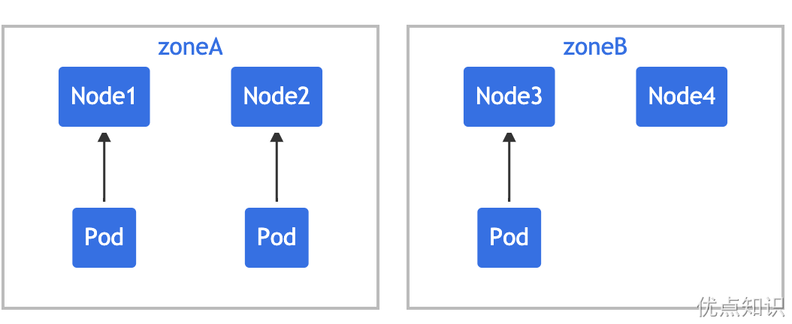
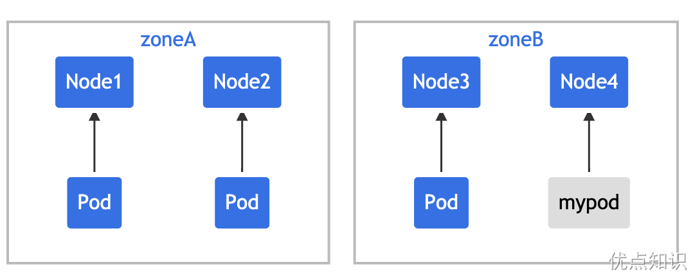
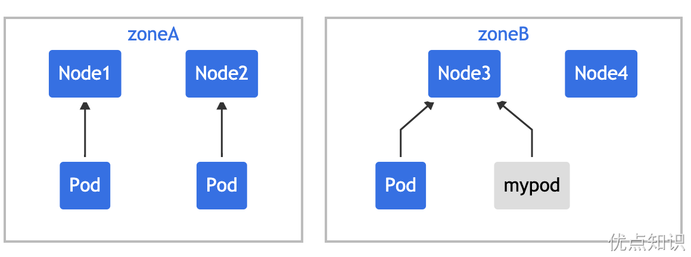
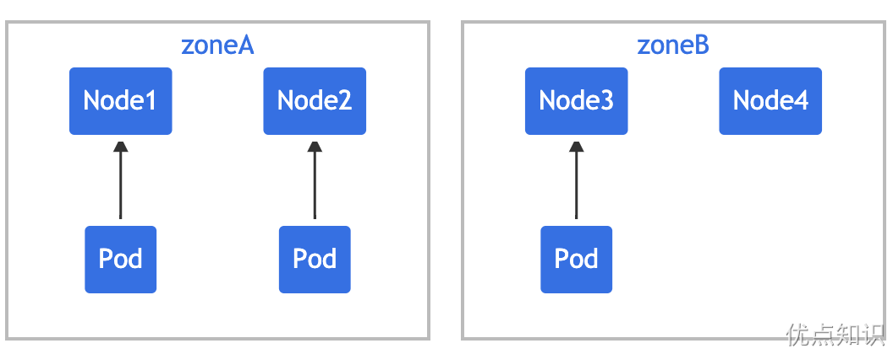
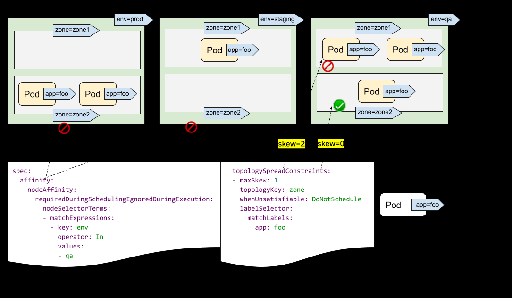
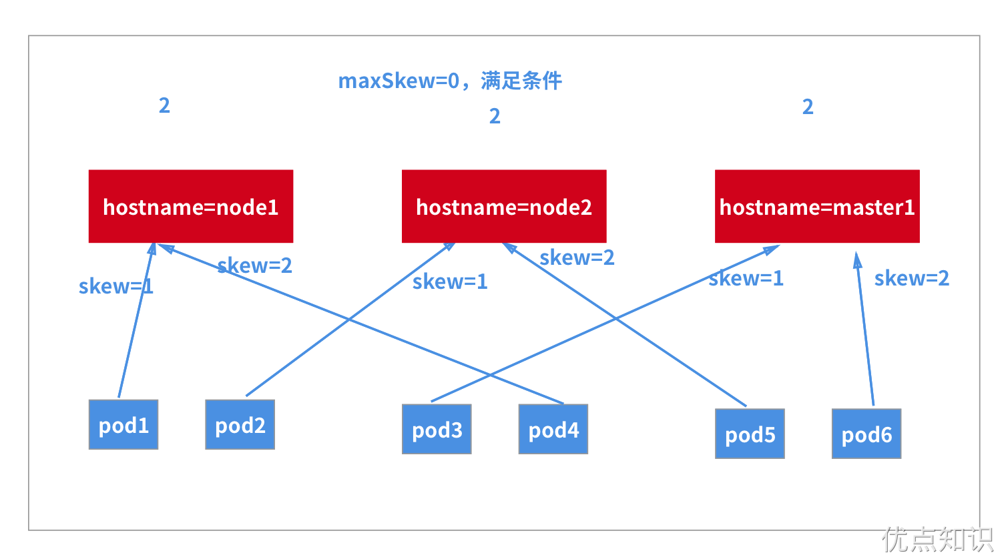

# Pod 拓扑分布约束
在 k8s 集群调度中，亲和性相关的概念本质上都是控制 Pod 如何被调度 —— 堆叠或打散。podAffinity 以及 podAntiAffinity 两个特性对 Pod 在不同拓扑域的分布进行了一些控制，podAffinity 可以将无数个 Pod 调度到特定的某一个拓扑域，这是堆叠的体现；podAntiAffinity 则可以控制一个拓扑域只存在一个 Pod，这是打散的体现。但这两种情况都太极端了，在不少场景下都无法达到理想的效果，例如为了实现容灾和高可用，将业务 Pod 尽可能均匀的分布在不同可用区就很难实现。

PodTopologySpread（Pod 拓扑分布约束） 特性的提出正是为了对 Pod 的调度分布提供更精细的控制，以提高服务可用性以及资源利用率，`PodTopologySpread` 由 `EvenPodsSpread` 特性门所控制，在 v1.16 版本第一次发布，并在 v1.18 版本进入 beta 阶段默认启用。
# 使用规范
在 Pod 的 Spec 规范中新增了一个 `topologySpreadConstraints` 字段即可配置拓扑分布约束，如下所示：
```yaml
spec:
  topologySpreadConstraints:
    - maxSkew: <integer>
      topologyKey: <string>
      whenUnsatisfiable: <string>
      labelSelector: <object>
```
由于这个新增的字段是在 Pod spec 层面添加，因此更高层级的控制 (Deployment、DaemonSet、StatefulSet) 也能使用 PodTopologySpread 功能。


结合上图来理解 `topologySpreadConstraints` 中各个字段的含义和作用：
- `labelSelector`: 用来查找匹配的 Pod。我们能够计算出每个拓扑域中匹配该 label selector 的 Pod 数量，在上图中，假如 label selector 是 `app:foo`，那么 zone1 的匹配个数为 2， zone2 的匹配个数为 0。
- `topologyKey`: 是 Node label 的 key，如果两个 Node 的 label 同时具有该 key 并且值相同，就说它们在同一个拓扑域。在上图中，指定 `topologyKey` 为 `zone`， 则具有 `zone=zone1` 标签的 Node 被分在一个拓扑域，具有 `zone=zone2` 标签的 Node 被分在另一个拓扑域。
- `maxSkew`: 这个属性理解起来不是很直接，它描述了 Pod 在不同拓扑域中不均匀分布的最大程度（指定拓扑类型中任意两个拓扑域中匹配的 Pod 之间的最大允许差值），它必须大于零。每个拓扑域都有一个 skew 值，计算的公式是: `skew[i] = 拓扑域[i]中匹配的 Pod 个数 - min{其他拓扑域中匹配的 Pod 个数}`。在上图中，我们新建一个带有 `app=foo` 标签的 Pod：
  - 如果该 Pod 被调度到 zone1，那么 zone1 中的 skew 值变为 3，zone2 中的 skew 值变为 0 (zone1 有 3 个匹配的 Pod，zone2 有 0 个匹配的 Pod )
  - 如果该 Pod 被调度到 zone2，那么 zone1 中的 skew 值变为 2，zone2 中的 skew 值变为 1(zone2 有 1 个匹配的 Pod，拥有全局最小匹配 Pod 数的拓扑域正是 zone2 自己 )，则它满足`maxSkew: 1`的约束（差值为 1）
- `whenUnsatisfiable`: 描述了如果 Pod 不满足分布约束条件该采取何种策略：
  - `DoNotSchedule` (默认) 告诉调度器不要调度该 Pod，因此也可以叫作硬策略；
  - `ScheduleAnyway` 如果找不到完全满足约束的节点，调度器会考虑所有可能的节点，并选择一个会导致最小 skew 的节点。这意味着调度器会尽量减少拓扑域之间的 Pod 数量差异，但不会以牺牲 Pod 调度为代价。因此也可以叫作软策略。

# 单个拓扑约束
假设拥有一个 4 节点集群，其中标记为`foo:bar`的 3 个 Pod 分别位于 node1、node2 和 node3 中：


如果希望新来的 Pod 均匀分布在现有的可用区域，则可以按如下设置其约束：
```yaml
kind: Pod
apiVersion: v1
metadata:
  name: mypod
  labels:
    foo: bar
spec:
  topologySpreadConstraints:
    - maxSkew: 1
      topologyKey: zone
      whenUnsatisfiable: DoNotSchedule
      labelSelector:
        matchLabels:
          foo: bar
  containers:
    - name: pause
      image: k8s.gcr.io/pause:3.1
```
`topologyKey: zone` 意味着均匀分布将只应用于存在标签键值对为 `zone:<any value>` 的节点。 `whenUnsatisfiable: DoNotSchedule`  告诉调度器如果新的 Pod 不满足约束，则不可调度。如果调度器将新的 Pod 放入 "zoneA"，Pods 分布将变为 `[3, 1]`，因此实际的偏差为 `2(3 - 1)`，这违反了`maxSkew: 1`的约定。此示例中，新 Pod 只能放置在 "zoneB" 上：


或者


可以调整 Pod 约束以满足各种要求：
- 将 `maxSkew` 更改为更大的值，比如 "2"，这样新的 Pod 也可以放在 "zoneA" 上。
- 将 `topologyKey` 更改为 "node"，以便将 Pod 均匀分布在节点上而不是区域中。 在上面的例子中，如果  `maxSkew` 保持为 "1"，那么传入的 Pod 只能放在 "node4" 上。
- 将 `whenUnsatisfiable: DoNotSchedule` 更改为 `whenUnsatisfiable: ScheduleAnyway`， 以确保新的 Pod 可以被调度。

# 多个拓扑约束
上面是单个 Pod 拓扑分布约束的情况，下面的例子建立在前面例子的基础上来对多个 Pod 拓扑分布约束进行说明。假设你拥有一个 4 节点集群，其中 3 个标记为 `foo:bar` 的 Pod 分别位于 node1、node2 和 node3 上：


可以使用 2 个 `TopologySpreadConstraint` 来控制 Pod 在区域和节点两个维度上的分布：
```yaml
# two-constraints.yaml
kind: Pod
apiVersion: v1
metadata:
  name: mypod
  labels:
    foo: bar
spec:
  topologySpreadConstraints:
    - maxSkew: 1
      topologyKey: zone
      whenUnsatisfiable: DoNotSchedule
      labelSelector:
        matchLabels:
          foo: bar
    - maxSkew: 1
      topologyKey: node
      whenUnsatisfiable: DoNotSchedule
      labelSelector:
        matchLabels:
          foo: bar
  containers:
    - name: pause
      image: k8s.gcr.io/pause:3.1
```
在这种情况下，为了匹配第一个约束，新的 Pod 只能放置在 "zoneB" 中；而在第二个约束中， 新的 Pod 只能放置在 "node4" 上，最后两个约束的结果加在一起，唯一可行的选择是放置 在 "node4" 上。

多个约束之间是可能存在冲突的，为了克服这种情况，可以增加`maxSkew`或修改其中一个约束让其使用`whenUnsatisfiable: ScheduleAnyway`。

# 与 NodeSelector/NodeAffinity 一起使用
仔细观察可能会发现并没有类似于`topologyValues`的字段来限制 Pod 将被调度到哪些拓扑去，默认情况会搜索所有节点并按 topologyKey 对其进行分组。有时这可能不是理想的情况，比如假设有一个集群，其节点标记为`env=prod`、`env=staging`和`env=qa`，现在想跨区域将 Pod 均匀地放置到 qa 环境中，是否可行?

答案是肯定的，可以结合`NodeSelector`或`NodeAffinity`一起使用，`PodTopologySpread` 会计算满足选择器的节点之间的传播约束。


如上图所示可以通过指定 `spec.affinity.nodeAffinity` 将搜索范围限制为 `qa` 环境，在该范围内 Pod 将被调度到一个满足 `topologySpreadConstraints` 的区域，这里就只能被调度到 `zone=zone2` 的节点上去了。

这里详细解释一下这个图，集群中分别有一批节点被打上`env=prod`、`env=staging`和`env=qa`标签，而这三个环境中都有一批节点属于`zone=zone1`，另一批节点属于`zone=zone2`；现在需要先筛选出`env=qa`这批节点，再通过`topologySpreadConstraints`来将pod均匀分布到此qa环境的node节点中。

# 集群默认约束
除了为单个 Pod 设置拓扑分布约束，也可以为集群设置默认的拓扑分布约束，默认拓扑分布约束在且仅在以下条件满足 时才会应用到 Pod 上：
- Pod 没有在其`.spec.topologySpreadConstraints`设置任何约束；
- Pod 隶属于某个服务、副本控制器、ReplicaSet 或 StatefulSet。

可以在调度方案（Schedulingg Profile）中将默认约束作为`PodTopologySpread`插件参数的一部分来进行设置。 约束的设置采用和前面 Pod 中的规范一致，只是`labelSelector`必须为空。配置的示例可能看起来像下面这个样子：
```yaml
apiVersion: kubescheduler.config.k8s.io/v1beta1
kind: KubeSchedulerConfiguration

profiles:
  - pluginConfig:
      - name: PodTopologySpread
        args:
          defaultConstraints:
            - maxSkew: 1
              topologyKey: topology.kubernetes.io/zone
              whenUnsatisfiable: ScheduleAnyway
          defaultingType: List
```

# 课后习题
如果想在每个节点（或指定的一些节点）上运行 2 个（或多个）Pod 副本，如何实现？

这里以我们的集群为例，加上 master 节点一共有 3 个节点，每个节点运行 2 个副本，总共就需要 6 个 Pod 副本，要在 master 节点上运行，则同样需要添加容忍，如果只想在一个节点上运行 2 个副本，则可以使用拓扑分布约束来进行细粒度控制，对应的资源清单如下所示：
```yaml
apiVersion: apps/v1
kind: Deployment
metadata:
  name: topo-demo
spec:
  replicas: 6
  selector:
    matchLabels:
      app: topo
  template:
    metadata:
      labels:
        app: topo
    spec:
      tolerations:
        - key: "node-role.kubernetes.io/master"
          operator: "Exists"
          effect: "NoSchedule"
      containers:
        - image: nginx
          name: nginx
          ports:
            - containerPort: 80
              name: ngpt
      topologySpreadConstraints:
        - maxSkew: 1
          topologyKey: kubernetes.io/hostname
          whenUnsatisfiable: DoNotSchedule
          labelSelector:
            matchLabels:
              app: topo
```
这里重点需要关注的就是 `topologySpreadConstraints` 部分的配置，选择使用 kubernetes.io/hostname 为拓扑域，相当于就是 3 个节点都是独立的，`maxSkew: 1` 表示最大的分布不均匀度为 1，所以只能出现的调度结果就是每个节点运行 2 个 Pod。


直接创建上面的资源即可验证。可以看到符合我们的预期，每个节点上运行了 2 个 Pod 副本，如果是要求每个节点上运行 3 个 Pod 副本呢？大家也可以尝试去练习下。