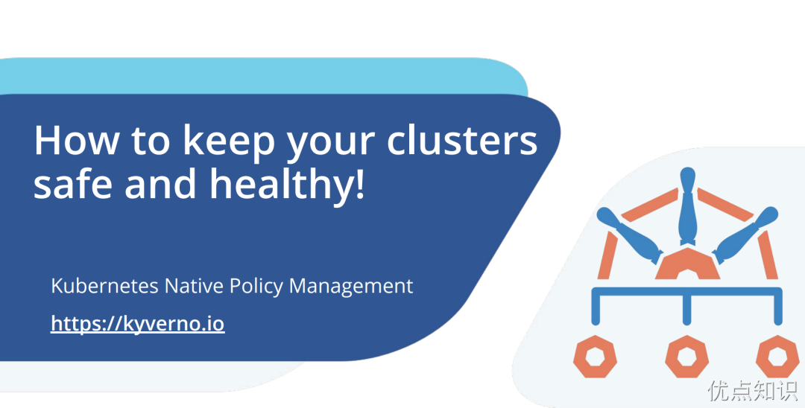
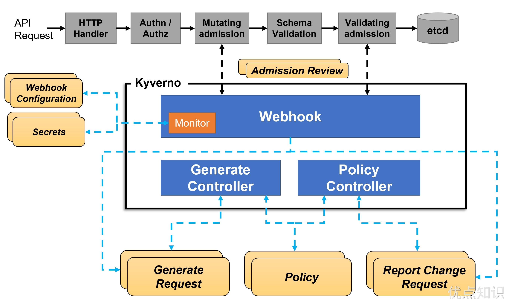
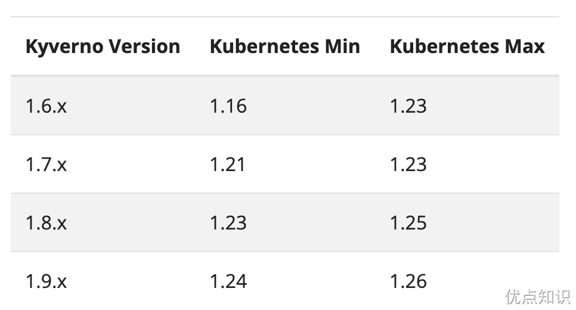
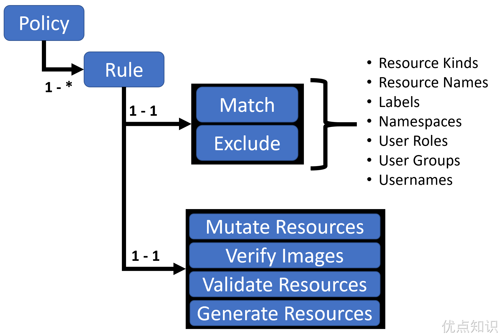

# Kyverno
Kyverno 是来自 Nirmata 的开源项目，后来捐赠给了 CNCF。Kyverno 是一个具有验证和变异能力的 Kubernetes 策略引擎，但是它还有生成资源的功能，还加入了 API 对象查询的能力。Kyverno 原本就是为 Kubernetes 编写的，除了对象生成功能之外，还无需专用语言即可编写策略。


同样 Kyverno 在 Kubernetes 集群中也是作为动态准入控制器运行的。Kyverno 从 kube-apiserver 接收验证和修改准入 webhook HTTP 回调，并应用匹配策略返回执行准入策略或拒绝请求的结果。Kyverno 策略可以使用资源 Kind、name 和标签选择器匹配资源，而且名称中支持通配符。

策略执行是通过 Kubernetes events 来捕获的，Kyverno 还报告现有资源的策略违规行为。下图显示了 Kyverno 的整体架构：


Kyverno 的高可用安装可以通过运行多个副本来完成，并且 Kyverno 的每个副本将具有多个执行不同功能的控制器。Webhook 处理来自 Kubernetes APIServer 的 AdmissionReview 请求，其 Monitor 组件创建和管理所需的配置。PolicyController watch 策略资源并根据配置的扫描间隔启动后台扫描，GenerateController 管理生成资源的生命周期。

# 安装
首先需要保证你的 Kubernetes 集群版本必须高于 v1.14，要安装的版本也和 Kubernetes 版本有关系。


我们这里已经是 v1.26.x 版本了，所以选择安装最新的 1.9.2 版本即可。

你可以选择直接从最新版本的资源清单安装 Kyverno，直接执行下面的命令即可：
```sh

```
此外同样可以使用 Helm 来进行一键安装：
```sh

```
安装完成会创建一个 kube-kyverno 命名空间，同样也包含一些相关的 CRD：
```sh

```
可以看出安装完成后创建了几个 validatingwebhookconfiguration 与 mutatingwebhookconfigurations 对象。

# 策略与规则
使用 Kyverno 其实就是对策略和规则的应用，Kyverno 策略是规则的集合，每个规则都包含一个 match 声明、一个可选的 exclude 声明以及 validate、mutate、generate 或 verifyImages 声明之一组成，每个规则只能包含一个 validate、mutate、generate 或 verifyImages 子声明。


策略可以定义为集群范围的资源（ClusterPolicy）或命名空间级别资源（Policy）。
- Policy 将仅适用于定义它们的 namespace 内的资源
- ClusterPolicy 应用于匹配跨所有 namespace 的资源

# 策略定义
编写策略其实就是定义 Policy 或者 ClusterPolicy 对象。

## 验证资源
验证规则基本上是我们使用最常见和最实用的规则类型，当用户或进程创建新资源时，Kyverno 将根据验证规则检查该资源的属性，如果验证通过，则允许创建资源。如果验证失败，则创建被阻止。比如现在我们添加一个策略，要求所有的 pod 都包含一个 kyverno 的标签：
```sh

```
上面策略文件中添加了一个 validationFailureAction=[Audit, Enforce] 属性：
- 当处于 Audit 模式下，每当创建违反规则集的一个或多个规则的资源时，会允许 admission review 请求，并将结果添加到报告中。
- 当处于 Enforce 模式下，资源在创建时立即被阻止，报告中不会有。

然后就是下面使用 rules 属性定义的规则集合，match 用于表示匹配的资源资源，validate 表示验证方式，这里我们定义 kyverno: "?*" 这样的标签表示必须有这样的一个标签 key。

直接应用上面的策略对象即可：
```sh

```
现在我们添加一个不带标签 kyverno 的 Pod：
```sh

```
可以看到提示，需要一个 kyverno 标签，同样我们也可以通过查看 Events 事件来了解策略应用情况：
```sh

```
如果创建的 Pod 带有 kyverno 标签则可以正常创建：
```sh

```
如果将 validationFailureAction 的值更改为 Audit，则即使我们创建的 Pod 不带有 kyverno 标签，也可以创建成功，但是我们可以在 PolicyReport 对象中看到对应的违规报告：
```sh

```
从上面的报告资源中可以看到违反策略的资源对象。

## 变更规则
变更规则可以用于修改匹配到规则的资源（比如规则设置了 metadata 字段可以和资源的 metadata 进行合并），就是根据我们设置的规则来修改对应的资源。

比如现在我们添加如下所示一个策略，给所有包含 nginx 镜像的 pod 都加上一个标签（kyverno=nginx）：
```sh

```
直接应用上面这个策略对象即可：
```sh

```
现在我们使用 nginx 镜像直接创建一个 Pod：
```sh

```
可以看到 Pod 创建成功后包含了一个 kyverno=nginx 标签，由于有 kyverno 标签，所以上面的验证策略也是通过的，可以正常创建。

## 生成资源
生成规则可用于在创建新资源或更新源时创建其他资源，例如为命名空间创建新 RoleBindings 或 Secret 等。

比如现在我们一个需求是将某个 Secret 同步到其他命名空间中去（比如 TLS 密钥、镜像仓库认证信息），手动复制这些 Secret 比较麻烦，则我们可以使用 Kyverno 来创建一个策略帮助我们同步这些 Secret。比如在 default 命名空间中有一个名为 regcred 的 Secret 对象，需要复制到另外的命名空间，如果源 Secret 发生更改，它还将向复制的 Secret 同步更新。
```sh

```
先在 default 命名空间中准备我们的 Secret 对象：
```sh

```
然后应用上面的同步 Secret 策略：
```sh

```
现在我们创建一个新的命名空间：
```sh

```
可以看到在新建的命名空间中多了一个 regcred 的 Secret 对象。

更多的 Kyverno 策略可以直接查看官方网站：https://kyverno.io/policies，可以在该网站上面根据策略类型、分类、主题等进行筛选。Kyverno 在灵活、强大和易用之间取得了一个很好的平衡，不需要太多学习时间，就能够提供相当方便的功能，官网提供了大量的针对各种场景的样例，非常值得使用。

比如我们可以创建一个如下所示的策略限制 NGINX Ingress 的路径值（CVE-2021-25745 安全问题，在 NGINX Ingress v1.2.0 中修复）：
```sh

```
