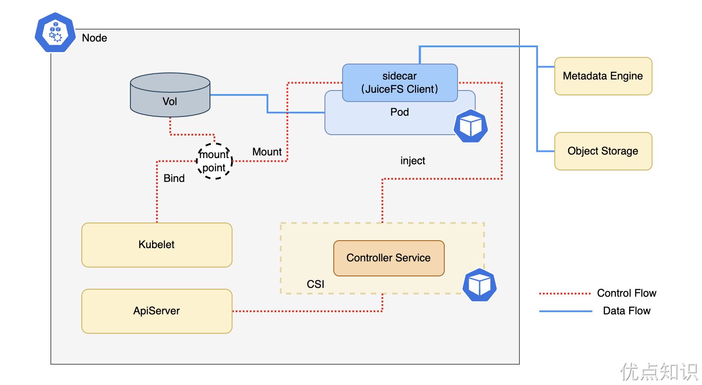
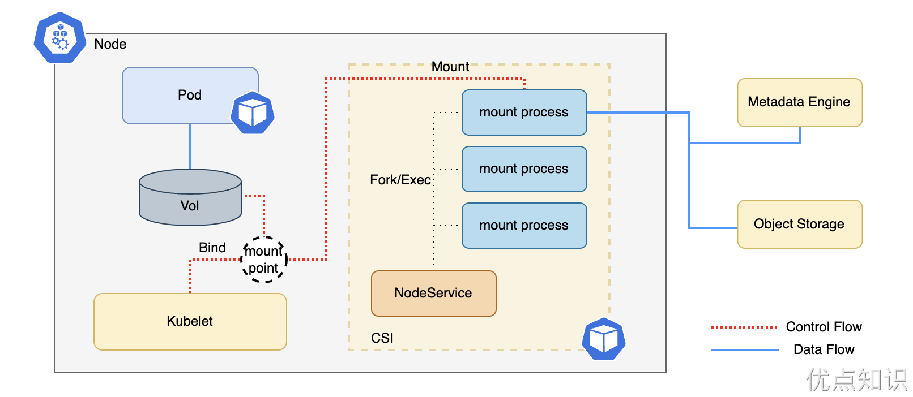
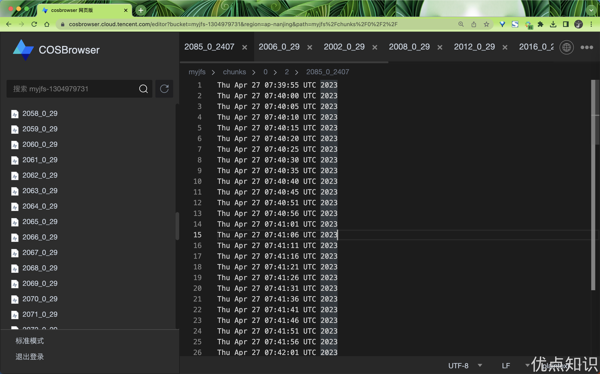

# K8s 中使用 JuiceFS
前⾯我们已经学习了 JuiceFS 的基本使⽤，接下来我们来了解下如何在 Kubernetes 集群中使⽤ JuiceFS。 JuiceFS⾮常适合⽤作 Kubernetes 集群的存储层。

# 以 hostPath 方式挂载 JuiceFS
如果你仅仅需要在 Kubernetes 容器中简单使用 JuiceFS，没有其他任何复杂要求（比如隔离性、权限控制），那么完全可以以 hostPath 卷的方式使用 JuiceFS，搭建起来也十分简单。

首先安装前文的方式在 Kubernetes 节点上统一安装、挂载 JuiceFS。

然后在 Pod 的资源清单文件定义中使用 hostPath 卷，直接将宿主机上的 JuiceFS 子目录挂载到容器中即可：
```sh

```
相比以 CSI 驱动的方式来使用 JuiceFS，hostPath 更为简单直接，出问题也更易排查，但也要注意：
- 为管理方便，一般所有容器都在使用同一个宿主机挂载点，缺乏隔离可能导致数据安全问题，未来也无法在不同应用中单独调整 JuiceFS 挂载参数。请谨慎评估。
- 所有节点都需要提前挂载 JuiceFS，因此集群加入新节点，需要在初始化流程里进行安装和挂载，否则新节点没有 JuiceFS 挂载点，容器将无法创建。
- 宿主机上的 JuiceFS 挂载进程所占用的系统资源（如 CPU、内存等）不受 Kubernetes 控制，有可能占用较多宿主机资源。可以考虑用 system-reserved 来适当调整 Kubernetes 的系统资源预留值，为 JuiceFS 挂载进程预留更多资源。
- 如果宿主机上的 JuiceFS 挂载进程意外退出，将会导致应用 Pod 无法正常访问挂载点，此时需要重新挂载 JuiceFS 文件系统并重建应用 Pod。作为对比，JuiceFS CSI 驱动提供 「挂载点自动恢复」功能来解决这个问题。

如果你使用 Docker 作为 Kubernetes 容器运行环境，最好令 JuiceFS 先于 Docker 启动，否则在节点重启的时候，偶尔可能出现容器启动时，JuiceFS 尚未挂载好的情况，此时便会因该依赖问题启动失败。以 systemd 为例，可以用下方 unit file 来配置启动顺序：
```sh

```

# 以 CSI 驱动方式挂载 JuiceFS
JuiceFS CSI 驱动遵循 CSI 规范，实现了容器编排系统与 JuiceFS 文件系统之间的接口。在 Kubernetes 下，JuiceFS 可以用 PersistentVolume 的形式提供给 Pod 使用。

## CSI 驱动运行模式
整体上 JuiceFS CSI 驱动包含以下组件：JuiceFS CSI Controller（StatefulSet） 以及 JuiceFS CSI Node Service（DaemonSet）。

### 容器挂载模式

### Sidecar 模式
Mount Pod 需要由 CSI Node 创建，考虑到 CSI Node 是一个 DaemonSet 组件，如果你的 Kubernetes 集群不支持部署 DaemonSet（比如一些云服务商提供的 Serverless Kubernetes 服务），那么 CSI Node 将无法部署，也就无法正常使用 CSI 驱动。对于这种情况，可以选择使用 CSI 驱动的 Sidecar 模式，让 JuiceFS 客户端运行在 Sidecar 容器中。

以 Sidecar 模式安装 CSI 驱动，所部署的组件只有 CSI Controller，不再需要 CSI Node。对于需要使用 CSI 驱动的 Kubernetes 命名空间，CSI Controller 会监听容器变动，检查是否使用了 JuiceFS PVC，并根据情况为其注入 Sidecar 容器。


创建和使用的流程大致如下：
- CSI Controller 启动时，向 API Server 注册 Webhook；
- 应用 Pod 指定使用 JuiceFS PVC；
- API Server 在创建应用 Pod 前调用 CSI Controller 的 Webhook 接口；
- CSI Controller 向应用 Pod 中注入 Sidecar 容器，容器中运行着 JuiceFS 客户端；
- API Server 创建应用 Pod，Sidecar 容器启动后运行 JuiceFS 客户端执行挂载，应用容器启动后可直接访问文件系统。

使用 Sidecar 模式需要注意：
- 运行环境需要支持 FUSE，也就是支持以特权容器（Privileged）运行；
- 不同于 Mount Pod 的容器挂载方式，Sidecar 容器注入进了应用 Pod，因此将无法进行任何复用，大规模场景下，请尤其注意资源规划和分配；
- Sidecar 容器和应用容器的挂载点共享是通过 hostPath 实现的，是一个有状态服务，如果 Sidecar 容器发生意外重启，应用容器中的挂载点不会自行恢复，需要整个 Pod 重新创建（相较下，Mount Pod 模式则支持挂载点自动恢复）；
- 不要直接从 Mount Pod 模式升级成 Sidecar 模式。已有的 Mount Pod 在 Sidecar 模式下将无法回收。并且一般而言，考虑到 Sidecar 不支持复用，我们不推荐从 Mount Pod 模式迁移为 Sidecar 模式；
- 对于启用了 Sidecar 注入的命名空间，CSI Controller 会监听该命名空间下创建的所有容器，检查 PVC 的使用并查询获取相关信息。如果希望最大程度地减小开销，可以在该命名空间下，对不使用 JuiceFS PV 的应用 Pod 打上 disable.sidecar.juicefs.com/inject: true 标签，让 CSI Controller 忽略这些不相关的容器。

### 进程挂载模式
相较于采用独立 Mount Pod 的容器挂载方式或 Sidecar 模式，CSI 驱动还提供无需独立 Pod 的进程挂载模式，在这种模式下，CSI Node Service 容器中将会负责运行一个或多个 JuiceFS 客户端，该节点上所有需要挂载的 JuiceFS PV，均在 CSI Node Service 容器中以进程模式执行挂载。


由于所有 JuiceFS 客户端均在 CSI Node Service 容器中运行，CSI Node Service 将需要更大的资源声明，推荐将其资源请求调大到至少 1 CPU 和 1GiB 内存，资源约束调大到至少 2 CPU 和 5GiB 内存，或者根据实际场景资源占用进行调整。

在 Kubernetes 中，容器挂载模式无疑是更加推荐的 CSI 驱动用法，但脱离 Kubernetes 的某些场景，则可能需要选用进程挂载模式。在 v0.10 之前，JuiceFS CSI 驱动仅支持进程挂载模式。而 v0.10 及之后版本则默认为容器挂载模式。

## CSI 驱动安装
这里我们选择使用 Helm 来进行安装，首先配置 JuiceFS CSI 驱动的 Helm chart
```sh

```
首先我们需要检查下 kubelet 根目录：
```sh

```
如果结果不为空或者 /var/lib/kubelet，则代表该集群的 kubelet 的根目录（--root-dir）做了修改，需要在 values.yaml 中将 kubeletDir 根据实际情况进行设置：
```sh

```
这里我们还是以腾讯云 COS 和元数据服务存入 Redis 为例进行说明，首先我们需要在腾讯云 COS 中创建一个 Bucket，我这里的地址为 https://myjfs-1304979731.cos.ap-nanjing.myqcloud.com，然后获取到 COS 的 SecretID 和 SecretKey，对应的 Redis 服务如下所示：
```sh

```
然后我们就可以将这些信息填入到 values.yaml 中：
```sh

```
然后我们就可以使用 Helm 来安装 CSI 驱动：
```sh

```
部署完成后查看对应的 CSI 驱动 Pod 状态：
```sh

```
可以看到安装成功后自动创建一个 StorageClass，后面我们就可以直接使用该 StorageClass 来自动创建 PV：
```sh

```
部署完成后我们可以安装上面的提示来创建一个 PVC 和 Pod 进行测试下：
```sh

```
直接应用上面的资源文件即可：
```sh

```
默认情况下 JuiceFS CSI 采用容器挂载（Mount Pod）模式，会让 JuiceFS 客户端运行在独立的 Pod 中，所以当我们创建上面的 Pod 后，会先创建一个独立的 Mount Pod：
```sh

```
可以看到 Mount Pod 已经成功挂载了 JuiceFS 文件系统，接下来我们再看下我们创建的 Pod：
```sh

```
可以看到我们创建的 Pod 和 PVC 都已经成功绑定到了 PV 上，接下来我们进入 Pod 中查看下：
```sh

```
这个时候 Pod 中的 /data 目录已经成功挂载了 JuiceFS 文件系统，我们可以前往 Mount Pod 中查看下：
```sh

```
当然现在在对象存储中去查看也是可以看到文件的：


到这里就表明我们已经成功的将 JuiceFS 文件系统挂载到了 Kubernetes 中。

## 静态 PV
上面我们安装 JuiceFS CSI Driver 后自动创建了一个 StorageClass，所以我们可以直接使用这个 StorageClass 来创建 PVC，但是如果我们想要使用静态 PV 的话，我们就需要手动创建 PV 和 PVC，下面我们就来看下如何创建静态 PV。

首先手动创建一个 PV，创建所需的资源定义示范如下：
```sh

```
然后再创建一个应用 Pod，并在其中引用上面的 PVC：
```sh

```
同样直接应用上面的 YAML 文件即可：
```sh

```
正常创建后 PVC 和 PV 就会绑定在一起了，Pod 也能正常运行了：
```sh

```
这个时候其实还会自动创建一个 Mount Pod，用来管理我们这里的静态 PV 的挂载：
```sh

```
在 JuiceFS 挂载点看到上方容器写入的 out.txt 了。

此外如果想要在不同命名空间中共享同一个文件系统，只需要让不同 PV 使用相同的文件系统认证信息（Secret）即可：
```sh

```
这样也就不会重复创建 Mount Pod 了。默认情况下，仅在多个应用 Pod 使用相同 PV 时，Mount Pod 才会被复用。如果你希望进一步降低开销，可以更加激进地复用 Mount Pod，让使用相同 StorageClass 创建出来的所有 PV，都复用同一个 Mount Pod（当然复用只能发生在同一个节点）。不同的应用 Pod，将会绑定挂载点下不同的路径，实现一个挂载点为多个应用容器提供服务。

为相同 StorageClass PV 复用 Mount Pod，需要为 CSI Node Service 添加 STORAGE_CLASS_SHARE_MOUNT 这个环境变量：
```sh

```
但是高度复用意味着更低的隔离程度，如果 Mount Pod 发生意外，挂载点异常，影响面也会更大，因此如果你决定启用该复用策略，请务必同时启用「挂载点自动恢复」（JuiceFS CSI 驱动自 v0.10.7 开始支持挂载点自动恢复：当 Mount Pod 遭遇故障，重启或重新创建 Mount Pod 以后，应用容器也能继续工作。），以及合理增加 「Mount Pod 的资源请求」。