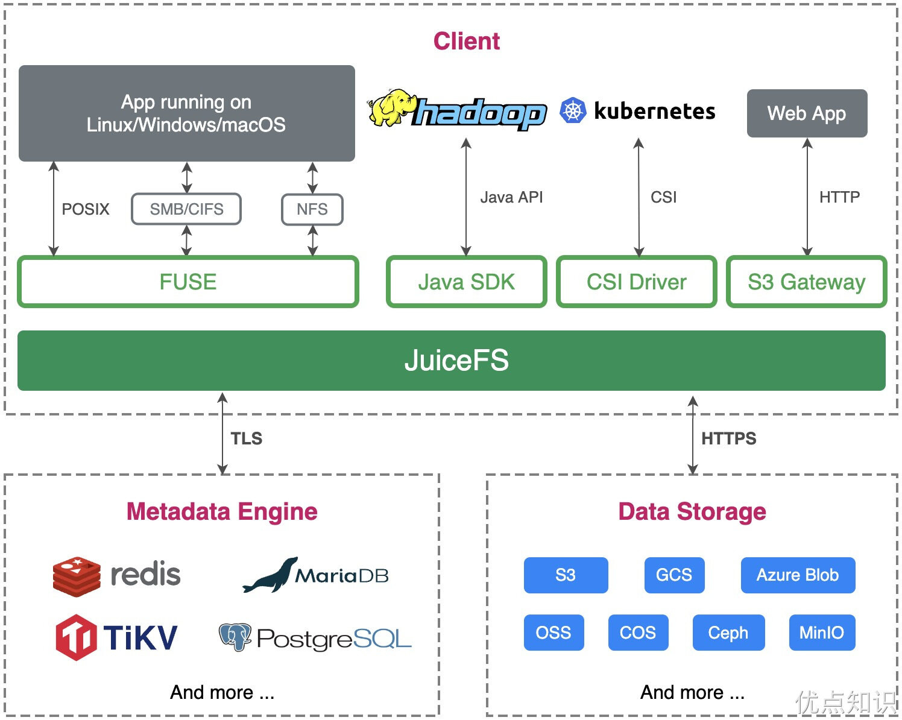
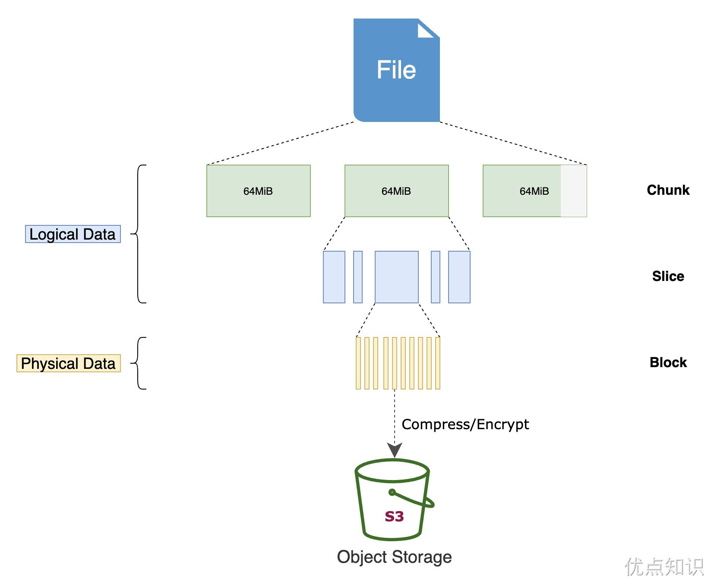
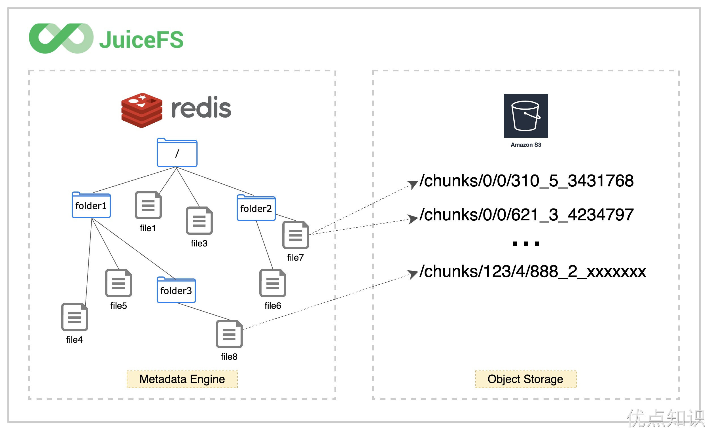
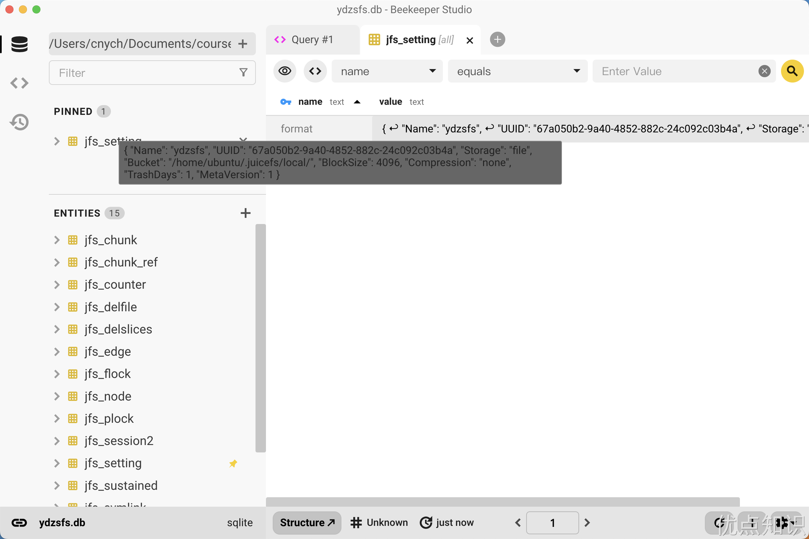
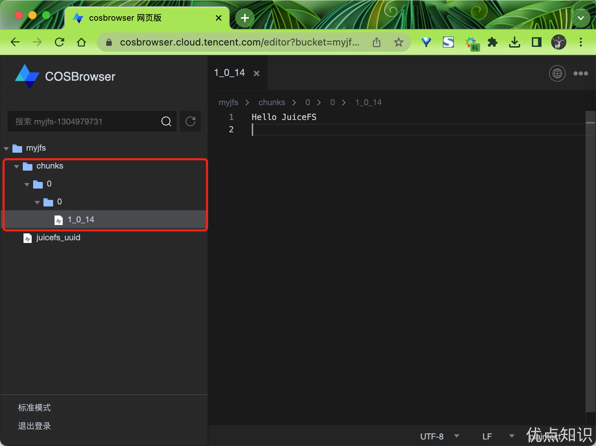
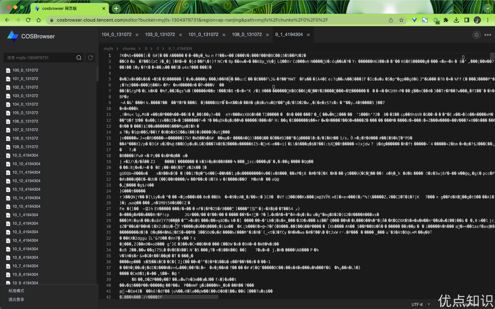

# JuiceFS
JuiceFS 是一款面向云原生设计的高性能分布式文件系统，在 Apache 2.0 开源协议下发布。提供完备的 POSIX 兼容性，可将几乎所有对象存储接入本地作为海量本地磁盘使用，亦可同时在跨平台、跨地区的不同主机上挂载读写。

# 简介
JuiceFS 采用 「数据」与「元数据」分离存储 的架构，从而实现文件系统的分布式设计。文件数据本身会被切分保存在对象存储（例如 Amazon S3），而元数据则可以保存在 Redis、MySQL、TiKV、SQLite 等多种数据库中，你可以根据场景与性能要求进行选择。

JuiceFS 提供了丰富的 API，适用于各种形式数据的管理、分析、归档、备份，可以在不修改代码的前提下无缝对接大数据、机器学习、人工智能等应用平台，为其提供海量、弹性、低价的高性能存储。运维人员不用再为可用性、灾难恢复、监控、扩容等工作烦恼，专注于业务开发，提升研发效率。同时运维细节的简化，对 DevOps 极其友好。

## 核心特性
- POSIX 兼容：像本地文件系统一样使用，无缝对接已有应用，无业务侵入性；
- HDFS 兼容：完整兼容 HDFS API，提供更强的元数据性能；
- S3 兼容：提供 S3 网关 实现 S3 协议兼容的访问接口；
- 云原生：通过 Kubernetes CSI 驱动 轻松地在 Kubernetes 中使用 JuiceFS；
- 分布式设计：同一文件系统可在上千台服务器同时挂载，高性能并发读写，共享数据；
- 强一致性：确认的文件修改会在所有服务器上立即可见，保证强一致性；
- 强悍性能：毫秒级延迟，近乎无限的吞吐量（取决于对象存储规模），查看性能测试结果；
- 数据安全：支持传输中加密（encryption in transit）和静态加密（encryption at rest），查看详情；
- 文件锁：支持 BSD 锁（flock）和 POSIX 锁（fcntl）；
- 数据压缩：支持 LZ4 和 Zstandard 压缩算法，节省存储空间。

## 应用场景
JuiceFS 为海量数据存储设计，可以作为很多分布式文件系统和网络文件系统的替代，特别是以下场景：
- 大数据分析：HDFS 兼容；与主流计算引擎（Spark、Presto、Hive 等）无缝衔接；无限扩展的存储空间；运维成本几乎为 0；性能远好于直接对接对象存储。
- 机器学习：POSIX 兼容，可以支持所有机器学习、深度学习框架；方便的文件共享还能提升团队管理、使用数据效率。
- Kubernetes：JuiceFS 支持 Kubernetes CSI；为容器提供解耦的文件存储，令应用服务可以无状态化；方便地在容器间共享数据。
- 共享工作区：可以在任意主机挂载；没有客户端并发读写限制；POSIX 兼容已有的数据流和脚本操作。
- 数据备份：在无限平滑扩展的存储空间备份各种数据，结合共享挂载功能，可以将多主机数据汇总至一处，做统一备份。

## 数据隐私
JuiceFS 是开源软件，你可以在 GitHub 找到完整的源代码。在使用 JuiceFS 存储数据时，数据会按照一定的规则被拆分成数据块并保存在你自己定义的对象存储或其它存储介质中，数据所对应的元数据则存储在你自己定义的数据库中。

## 架构
JuiceFS 整体上主要由三个部分组成。


- 客户端（Client）：所有文件读写，乃至于碎片合并、回收站文件过期删除等后台任务，均在客户端中发生。所以客户端需要同时与对象存储和元数据引擎打交道。客户端支持众多接入方式：
- 通过 FUSE，JuiceFS 文件系统能够以 POSIX 兼容的方式挂载到服务器，将海量云端存储直接当做本地存储来使用。
- 通过 Hadoop Java SDK，JuiceFS 文件系统能够直接替代 HDFS，为 Hadoop 提供低成本的海量存储。
- 通过 Kubernetes CSI 驱动，JuiceFS 文件系统能够直接为 Kubernetes 提供海量存储。
- 通过 S3 网关，使用 S3 作为存储层的应用可直接接入，同时可使用 AWS CLI、s3cmd、MinIO client 等工具访问 JuiceFS 文件系统。
- 通过 WebDAV 服务，以 HTTP 协议，以类似 RESTful API 的方式接入 JuiceFS 并直接操作其中的文件。
- 数据存储（Data Storage）：文件将会切分上传保存在对象存储服务，既可以使用公有云的对象存储，也可以接入私有部署的自建对象存储。JuiceFS 支持几乎所有的公有云对象存储，同时也支持 OpenStack Swift、Ceph、MinIO 等私有化的对象存储。
- 元数据引擎（Metadata Engine）：用于存储文件元数据（metadata），包含以下内容：
- 常规文件系统的元数据：文件名、文件大小、权限信息、创建修改时间、目录结构、文件属性、符号链接、文件锁等。
- JuiceFS 独有的元数据：文件的 chunk 及 slice 映射关系、客户端 session 等。

JuiceFS 采用多引擎设计，目前已支持 Redis、TiKV、MySQL/MariaDB、PostgreSQL、SQLite 等作为元数据服务引擎，也将陆续实现更多元数据存储引擎。


## JuiceFS 如何存储文件
与传统文件系统只能使用本地磁盘存储数据和对应的元数据的模式不同，JuiceFS 会将数据格式化以后存储在对象存储，同时会将文件的元数据存储在专门的元数据服务中，这样的架构让 JuiceFS 成为一个强一致性的高性能分布式文件系统。

任何存入 JuiceFS 的文件都会被拆分成一个或多个 「Chunk」（最大 64 MiB）。而每个 Chunk 又由一个或多个 「Slice」 组成。Chunk 的存在是为了对文件做切分，优化大文件性能，而 Slice 则是为了进一步优化各类文件写操作，二者同为文件系统内部的逻辑概念。Slice 的长度不固定，取决于文件写入的方式。每个 Slice 又会被进一步拆分成 「Block」（默认大小上限为 4 MiB），成为最终上传至对象存储的最小存储单元。


所以我们在对象存储平台的文件浏览器中找不到存入 JuiceFS 的源文件，存储桶中只有一个 chunks 目录和一堆数字编号的目录和文件，这正是经过 JuiceFS 拆分存储的数据块。与此同时，文件与 Chunks、Slices、Blocks 的对应关系等元数据信息存储在元数据引擎中。正是这样的分离设计，让 JuiceFS 文件系统得以高性能运作。


JuiceFS 的存储设计，还有着以下技术特点：
- 对于任意大小的文件，JuiceFS 都不进行合并存储，这也是为了性能考虑，避免读放大。
- 提供强一致性保证，但也可以根据场景需要与缓存功能一起调优，比如通过设置出更激进的元数据缓存，牺牲一部分一致性，换取更好的性能。。
- 支持并默认开启「回收站」功能，删除文件后保留一段时间才彻底清理，最大程度避免误删文件导致事故。

# 安装
JuiceFS 是采用 Go 语言开发的，所以具有良好的跨平台能力，支持在几乎所有主流架构的各类操作系统上运行，包括且不限于 Linux、macOS、Windows 等。

JuiceFS 客户端只有一个二进制文件，可以下载预编译的版本直接解压使用，也可以用源代码手动编译，也可以直接使用一键安装脚本 curl -sSL https://d.juicefs.com/install | sh - 自动下载安装最新版 JuiceFS 客户端。

> 如果你在 Mac 下面使用，需要先安装 FUSE for macOS，这是因为 macOS 默认不支持 FUSE 接口。

```sh

```

## 单机模式
JuiceFS 文件系统由「对象存储」和「数据库」共同驱动，除了对象存储，还支持使用本地磁盘、WebDAV 和 HDFS 等作为底层存储。这里我们首先使用本地磁盘和 SQLite 数据库快速创建一个单机文件系统用以了解和体验 JuiceFS。

当然首先需要安装 JuiceFS 的客户端，然后接下来我们就可以使用 juicefs format 命令来创建一个 JuiceFS 文件系统了，该命令的格式为：
```sh

```
从命令可以看出格式化文件系统需要提供 3 种信息：
- [command options]：设定文件系统的存储介质，留空则默认使用本地磁盘作为存储介质，路径为 $HOME/.juicefs/local、/var/jfs 或 C:/jfs/local
- META-URL：用来设置元数据存储，即数据库相关的信息，通常是数据库的 URL 或文件路径
- NAME：是文件系统的名称

比如我们这里创建一个名为 ydzsfs 的文件系统，则可以使用如下所示的命令：
```sh

```
从返回的信息中可以看到，该文件系统使用 SQLite 作为元数据存储引擎，数据库文件位于当前目录，文件名为 ydzsfs.db，保存了 ydzsfs 文件系统的所有信息，它构建了完善的表结构，将用作所有数据的元信息的存储。


由于没有指定任何存储相关的选项，客户端默认使用本地磁盘作为存储介质，根据返回的信息， ydzsfs 的存储路径为 file:///home/ubuntu/.juicefs/local/ydzsfs/，即当前用户主目录下的 .juicefs/local/ydzsfs/。
```sh

```
这样我们就成功创建了一个文件系统了，接下来我们就可以使用 juicefs mount 命令来挂载文件系统了，该命令的一般格式为：
```sh

```
与创建文件系统的命令类似，挂载文件系统需要提供以下信息：
- [command options]：用来指定文件系统相关的选项，例如：-d 可以实现后台挂载；
- META-URL：用来设置元数据存储，即数据库相关的信息，通常是数据库的 URL 或文件路径；
- MOUNTPOINT：指定文件系统的挂载点。

由于 SQLite 是单文件数据库，挂载时要注意数据库文件的的路径，JuiceFS 同时支持相对路径和绝对路径。比如我们这里可以使用以下命令将 ydzsfs 文件系统挂载到 ./jfs 文件夹：
```sh

```
默认情况下，客户端会在前台挂载文件系统，程序会一直运行在当前终端进程中，使用 Ctrl + C 组合键或关闭终端窗口，文件系统会被卸载。

为了让文件系统可以在后台保持挂载，你可以在挂载时指定 -d 或 --background 选项，即让客户端在守护进程中挂载文件系统：
```sh

```
接下来，任何存入挂载点 ~/jfs 的文件，都会按照 JuiceFS 的文件存储格式被拆分成特定的「数据块」并存入 $HOME/.juicefs/local/ydzsfs 目录中，相对应的「元数据」会全部存储在 ydzsfs.db 数据库中。

最后执行以下命令可以将挂载点 ~/jfs 卸载：
```sh

```
当然，在你能够确保数据安全的前提下，也可以在卸载命令中添加 --force 或 -f 参数，强制卸载文件系统。

## 使用对象存储

通过前面的基本介绍我们可以对 JuiceFS 的工作方式有一个基本的认识，接下来我们仍然使用 SQLite 存储元数据，但是把本地存储换成「对象存储」，做一个更有实用价值的方案。

几乎所有主流的云计算平台都有提供对象存储服务，如亚马逊 S3、阿里云 OSS 等，JuiceFS 支持几乎所有的对象存储服务。一般来说，创建对象存储通常只需要 2 个环节：
- 创建 Bucket 存储桶，拿到 Endpoint 地址；
- 创建 Access Key ID 和 Access Key Secret，即对象存储 API 的访问密钥。

以腾讯云 COS 为例，创建好的资源大概像下面这样：
- Bucket Endpoint：https://myjfs-1304979731.cos.ap-shanghai.myqcloud.com
- Access Key ID：ABCDEFGHIJKLMNopqXYZ
- Access Key Secret：ZYXwvutsrqpoNMLkJiHgfeDCBA

我们这里以腾讯云 COS 服务为例来进行演示，首先创建一个 Bucket 存储桶，命名为 myjfs，然后创建一个子账号，命名为 juicefs，并为其创建一个 API 密钥，如下图所示：
```sh

```
在上述命令中，我们指定了对象存储的相关配置信息：
- --storage：设置存储类型，比如 cos、oss、s3 等；
- --bucket：设置对象存储的 Endpoint 地址；
- --access-key：设置对象存储 API 访问密钥 Access Key ID；
- --secret-key：设置对象存储 API 访问密钥 Access Key Secret。

创建完成即可进行挂载：
```sh

```
挂载命令与使用本地存储时完全一样，这是因为创建文件系统时，对象存储相关的信息已经写入了 myjfs.db 数据库，因此客户端不需要额外提供对象存储认证信息，也没有本地配置文件。

相比使用本地磁盘，SQLite 和对象存储的组合实用价值更高。从应用的角度看，这种形式等同于将容量几乎无限的对象存储接入到了本地计算机，让你可以像使用本地磁盘那样使用云存储。

进一步的，该文件系统的所有数据都存储在云端的对象存储，因此可以把 myjfs.db 数据库复制到其他安装了 JuiceFS 客户端的计算机上进行挂载和读写。也就是说，任何一台计算机只要能够读取到存储了元数据的数据库，那么它就能够挂载读写该文件系统。

比如现在我们在 ~/jfs 目录下面任意创建一些文件：
```sh

```
正常创建完成后该文件会按照 JuiceFS 的文件存储格式被拆分成特定的「数据块」并上传到对象存储中去，相对应的「元数据」会全部存储在 myjfs.db 数据库中。


很显然，SQLite 这种单文件数据库很难实现被多台计算机同时访问。如果把 SQLite 改为 Redis、PostgreSQL、MySQL 等能够通过网络被多台计算机同时读写访问的数据库，那么就可以实现 JuiceFS 文件系统的分布式挂载读写。

## 分布式模式
前面我们通过采用「对象存储」和「SQLite」数据库的组合，实现了一个可以在任意主机上挂载的文件系统。得益于对象存储可以被网络上任何有权限的计算机访问的特点，我们只需要把 SQLite 数据库文件复制到任何想要访问该存储的计算机，就可以实现在不同计算机上访问同一个 JuiceFS 文件系统。

很显然，想要依靠在计算机之间复制 SQLite 数据库的方式进行文件系统共享，虽然可行，但文件的实时性是得不到保证的。受限于 SQLite 这种单文件数据库无法被多个计算机同时读写访问的情况，为了能够让一个文件系统可以在分布式环境中被多个计算机同时挂载读写，我们需要采用支持通过网络访问的数据库，比如 Redis、PostgreSQL、MySQL 等。

接下来我们将 SQLite 数据库替换成基于网络的数据库，从而实现 JuiceFS 文件系统的分布式挂载读写。JuiceFS 目前支持的基于网络的数据库有：
- 键值数据库：Redis、TiKV
- 关系型数据库：PostgreSQL、MySQL、MariaDB

不同的数据库性能和稳定性表现也各不相同，比如 Redis 是内存型键值数据库，性能极为出色，但可靠性相对较弱。PostgreSQL 是关系型数据库，相比之下性能没有内存型强悍，但它的可靠性要更强。

我们这里以 Redis 为例来演示分布式模式的使用，我们就直接在 K8s 集群中部署一个简单的 Redis 服务来进行说明：
```sh

```
直接应用该资源清单即可：
```sh

```
然后接下来我们就可以利用前面的对象存储和这里的 Redis 来创建一个分布式的 JuiceFS 文件系统了，使用如下所示命令：
```sh

```
文件系统创建完毕以后，包含对象存储密钥等信息会完整的记录到数据库中，JuiceFS 客户端只要拥有数据库地址、用户名和密码信息，就可以挂载读写该文件系统，所以 JuiceFS 客户端不需要本地配置文件。

由于这个文件系统的「数据」和「元数据」都存储在基于网络的服务中，因此在任何安装了 JuiceFS 客户端的计算机上都可以同时挂载该文件系统进行共享读写，例如：
```sh

```

### 数据强一致性保证
对于多客户端同时挂载读写同一个文件系统的情况，JuiceFS 提供「关闭再打开（close-to-open）」一致性保证，即当两个及以上客户端同时读写相同的文件时，客户端 A 的修改在客户端 B 不一定能立即看到。但是，一旦这个文件在客户端 A 写入完成并关闭，之后在任何一个客户端重新打开该文件都可以保证能访问到最新写入的数据，不论是否在同一个节点。

### 调大缓存提升性能
由于「对象存储」是基于网络的存储服务，不可避免会产生访问延时。为了解决这个问题，JuiceFS 提供并默认启用了缓存机制，即划拨一部分本地存储作为数据与对象存储之间的一个缓冲层，读取文件时会异步地将数据缓存到本地存储。

缓存机制让 JuiceFS 可以高效处理海量数据的读写任务，默认情况下，JuiceFS 会在 $HOME/.juicefs/cache 或 /var/jfsCache 目录设置 100GiB 的缓存。在速度更快的 SSD 上设置更大的缓存空间可以有效提升 JuiceFS 的读写性能。

你可以使用 --cache-dir 调整缓存目录的位置，使用 --cache-size 调整缓存空间的大小，例如：
```sh

```
> 注意：JuiceFS 进程需要具有读写 --cache-dir 目录的权限。

上述命令将缓存目录设置在了 /mycache 目录，并指定缓存空间为 500GiB。

当挂载好文件系统以后可以通过 juicefs bench 命令对文件系统进行基础的性能测试和功能验证，确保 JuiceFS 文件系统能够正常访问且性能符合预期。
```sh

```
运行 juicefs bench 命令以后会根据指定的并发度（默认为 1）往 JuiceFS 文件系统中写入及读取 N 个大文件（默认为 1）及 N 个小文件（默认为 100），并统计读写的吞吐和单次操作的延迟，以及访问元数据引擎的延迟。

测试后可以去对象存储中查看多了很多数据了。


## 生产环境部署
为了保证 JuiceFS 文件系统能符合生产环境的要求，这里我们给出了如下一些生产环境部署的建议。

1. 监控指标收集与可视化

    务必收集 JuiceFS 客户端的监控指标并通过 Grafana 可视化。

2. 元数据自动备份
> 元数据自动备份是自 JuiceFS v1.0.0 版本开始加入的特性

元数据对 JuiceFS 文件系统非常关键，一旦丢失或损坏将可能影响大批文件甚至整个文件系统。因此必须对元数据进行定期备份。

元数据自动备份特性默认开启，备份间隔为 1 小时，备份的元数据会经过压缩后存储至对应的对象存储中（与文件系统的数据隔离）。备份由 JuiceFS 客户端执行，备份期间会导致其 CPU 和内存使用量上升，默认情况下可认为会在所有客户端中随机选择一个执行备份操作。

特别注意默认情况下当文件系统的文件数达到一百万时，元数据自动备份功能将会关闭，需要配置一个更大的备份间隔（--backup-meta 选项）才会再次开启。备份间隔每个客户端独立配置，设置 --backup-meta 0 则表示关闭元数据自动备份特性。

> 注意：备份元数据所需的时间取决于具体的元数据引擎，不同元数据引擎会有不同的性能表现。

3. 回收站

> 回收站是自 JuiceFS v1.0.0 版本开始加入的特性

回收站默认开启，文件被删除后的保留时间默认配置为 1 天，可以有效防止数据被误删除时造成的数据丢失风险。

不过回收站开启以后也可能带来一些副作用，如果应用需要经常删除文件或者频繁覆盖写文件，会导致对象存储使用量远大于文件系统用量。这本质上是因为 JuiceFS 客户端会将对象存储上被删除的文件或者覆盖写时产生的需要垃圾回收的数据块持续保留一段时间。因此，在部署 JuiceFS 至生产环境时就应该考虑好合适的回收站配置，回收站保留时间可以通过以下方式配置（如果将 --trash-days 设置为 0 则表示关闭回收站特性）：
- 新建文件系统：通过 juicefs format 的 --trash-days <value> 选项设置
- 已有文件系统：通过 juicefs config 的 --trash-days <value> 选项修改

4. 客户端后台任务
同一个 JuiceFS 文件系统的所有客户端在运行过程中共享一个后台任务集，每个任务定时执行，且具体执行的客户端随机选择。具体的后台任务包括：
- 清理待删除的文件和对象
- 清理回收站中的过期文件和碎片
- 清理长时间未响应的客户端会话
- 自动备份元数据

由于这些任务执行时会占用一定资源，因此可以为业务较繁重的客户端配置 --no-bgjob 选项来禁止其参与后台任务。

> 注意：请保证至少有一个 JuiceFS 客户端可以执行后台任务

5. 客户端日志滚动
   
当后台运行 JuiceFS 挂载点时，客户端默认会将日志输出到本地文件中。取决于挂载文件系统时的运行用户，本地日志文件的路径稍有区别。root 用户对应的日志文件路径是 /var/log/juicefs.log，非 root 用户的日志文件路径是 $HOME/.juicefs/juicefs.log。

本地日志文件默认不会滚动，生产环境中为了确保日志文件不占用过多磁盘空间需要手动配置。以下是一个日志滚动的示例配置：
```sh

```
通过 logrotate -d /etc/logrotate.d/juicefs 命令可以验证配置文件的正确性。

前面我们已经学习了 JuiceFS 的基本使用，接下来我们来了解下如何在 Kubernetes 集群中使用 JuiceFS。JuiceFS 非常适合用作 Kubernetes 集群的存储层，。