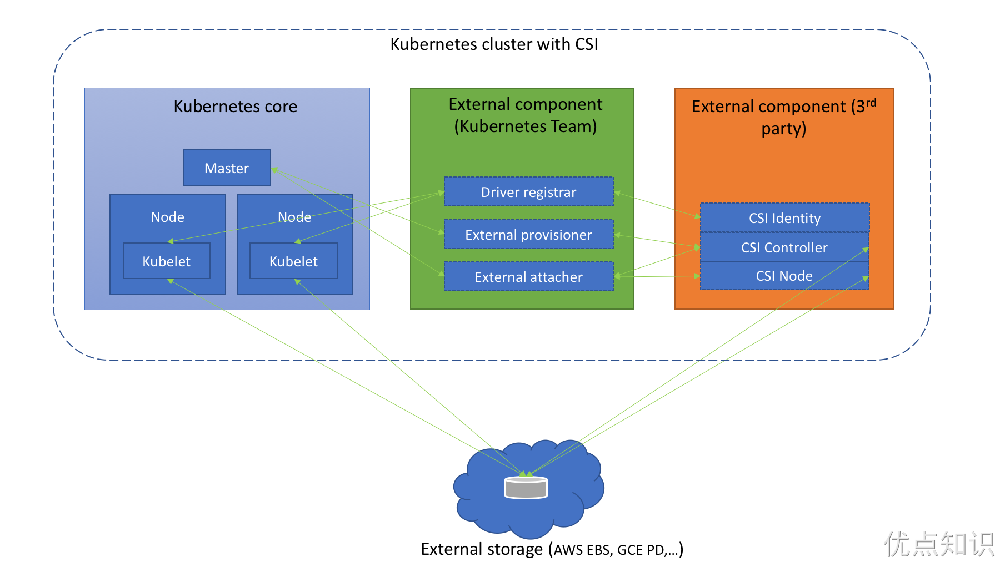
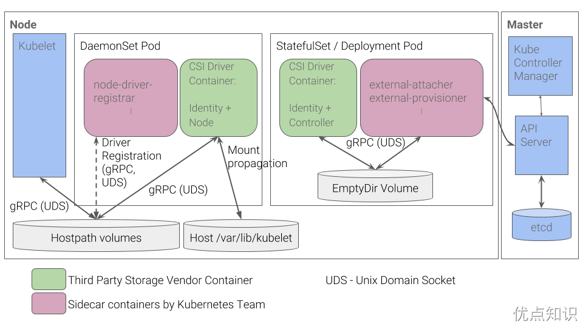

# 存储插件
前面的章节中我们介绍了在 Kubernetes 中的持久化存储的使用，了解了 PV、PVC 以及 StorageClass 的使用方法，从本地存储到 NFS 共享存储都有学习，到这里我们其实已经可以完成应用各种场景的数据持久化了，但是难免在实际的使用过程中会遇到各种各样的问题，要解决这些问题最好的方式就是来了解下 Kubernetes 中存储的实现原理。

Kubernetes 默认情况下就提供了主流的存储卷接入方案，我们可以执行命令 kubectl explain pod.spec.volumes 查看到支持的各种存储卷，另外也提供了插件机制，允许其他类型的存储服务接入到 Kubernetes 系统中来，在 Kubernetes 中就对应 In-Tree 和 Out-Of-Tree 两种方式，In-Tree 就是在 Kubernetes 源码内部实现的，和 Kubernetes 一起发布、管理的，但是更新迭代慢、灵活性比较差，Out-Of-Tree 是独立于 Kubernetes 的，目前主要有 CSI 和 FlexVolume 两种机制，开发者可以根据自己的存储类型实现不同的存储插件接入到 Kubernetes 中去，其中 CSI 是现在也是以后主流的方式，所以当然我们的重点也会是 CSI 的使用介绍。

# FlexVolume
FlexVolume 提供了一种扩展 Kubernetes 存储插件的方式，用户可以自定义自己的存储插件。要使用 FlexVolume 需要在每个节点上安装存储插件二进制文件，该二进制需要实现 FlexVolume 的相关接口，默认存储插件的存放路径为 `/usr/libexec/kubernetes/kubelet-plugins/volume/exec/<vendor~driver>/<driver>`，VolumePlugins 组件会不断 watch 这个目录来实现插件的添加、删除等功能。

其中 vendor~driver 的名字需要和 Pod 中flexVolume.driver 的字段名字匹配，例如：
```sh

```
对应的 Pod 中的 flexVolume.driver 属性为：foo/cifs。

在我们实现自定义存储插件的时候，需要实现 FlexVolume 的部分接口，因为要看实际需求，并不一定所有接口都需要实现。比如对于类似于 NFS 这样的存储就没必要实现 attach/detach 这些接口了，因为不需要，只需要实现 init/mount/umount 3 个接口即可。
- init: `<driver executable> init` - `kubelet/kube-controller-manager` 初始化存储插件时调用，插件需要返回是否需要要 attach 和 detach 操作
- attach: `<driver executable> attach <json options> <node name>` - 将存储卷挂载到 Node 节点上
- detach: `<driver executable> detach <mount device> <node name>` - 将存储卷从 Node 上卸载
- waitforattach: `<driver executable> waitforattach <mount device> <json options>` - 等待 attach 操作成功（超时时间为 10 分钟）
- isattached: `<driver executable> isattached <json options> <node name>` - 检查存储卷是否已经挂载
- mountdevice: `<driver executable> mountdevice <mount dir> <mount device> <json options>` - 将设备挂载到指定目录中以便后续 bind mount 使用
- unmountdevice: `<driver executable> unmountdevice <mount device>` - 将设备取消挂载
- mount: `<driver executable> mount <mount dir> <json options>` - 将存储卷挂载到指定目录中
- unmount: `<driver executable> unmount <mount dir>` - 将存储卷取消挂载

实现上面的这些接口需要返回如下所示的 JSON 格式的数据：
```sh

```
比如我们来实现一个 NFS 的 FlexVolume 插件，最简单的方式就是写一个脚本，然后实现 init、mount、unmount 3 个命令即可，然后按照上面的 JSON 格式返回数据，最后把这个脚本放在节点的 FlexVolume 插件目录下面即可。

下面就是官方给出的一个 NFS 的 FlexVolume 插件示例，可以从 https://github.com/kubernetes/examples/blob/master/staging/volumes/flexvolume/nfs 获取脚本：
```sh

```
将上面脚本命名成 nfs，放置到 node1 节点对应的插件下面： /usr/libexec/kubernetes/kubelet-plugins/volume/exec/ydzs~nfs/nfs，并设置权限为 700：
```sh

```
这个时候我们部署一个应用到 node1 节点上，并用 flexVolume 来持久化容器中的数据（当然也可以通过定义 flexvolume 类型的 PV、PVC 来使用），如下所示：
```sh

```
其中 flexVolume.driver 就是插件目录 ydzs~nfs 对应的 ydzs/nfs 名称，flexVolume.options 中根据上面的 nfs 脚本可以得知里面配置的是 NFS 的 Server 地址和挂载目录路径，直接创建上面的资源对象：
```sh

```
我们可以查看到 Pod 的本地持久化目录是被 mount 到了 NFS 上面，证明上面我们的 FlexVolume 插件是正常的。

> 当我们要去真正的 mount NFS 的时候，就是通过 kubelet 调用 VolumePlugin，然后直接执行命令 `/usr/libexec/kubernetes/kubelet-plugins/volume/exec/ydzs~nfs/nfs mount <mount dir> <json param>` 来完成的，就相当于平时我们在宿主机上面手动挂载 NFS 的方式一样的，所以存储插件 nfs 是一个可执行的二进制文件或者 shell 脚本都是可以的。

# CSI
既然已经有了 FlexVolume 插件了，为什么还需要 CSI 插件呢？上面我们使用 FlexVolume 插件的时候可以看出 FlexVolume 插件实际上相当于就是一个普通的 shell 命令，类似于平时我们在 Linux 下面执行的 ls 命令一样，只是返回的信息是 JSON 格式的数据，并不是我们通常认为的一个常驻内存的进程，而 CSI 是一个更加完善、编码更加方便友好的一种存储插件扩展方式。

CSI 是 Container Storage Interface 的简称，旨在能为容器编排引擎和存储系统间建立一套标准的存储调用接口，通过该接口能为容器编排引擎提供存储服务。在 CSI 之前，K8s 里提供存储服务基本上是通过 in-tree 的方式来提供，如下图：


这种方式需要将存储提供者的代码逻辑放到 K8s 的代码库中运行，调用引擎与插件间属于强耦合，这种方式会带来一些问题：
- 存储插件需要一同随 K8s 发布
- K8s 社区需要对存储插件的测试、维护负责
- 存储插件的问题有可能会影响 K8s 部件正常运行
- 存储插件享有 K8s 部件同等的特权存在安全隐患
- 存储插件开发者必须遵循 K8s 社区的规则开发代码

基于这些问题和挑战，CO（Container Orchestrator）厂商提出 Container Storage Interface 用来定义容器存储标准，它独立于 Kubernetes Storage SIG，由 Kubernetes、Mesos、Cloud Foundry 三家一起推动。CSI 规范定义了存储提供商实现 CSI 兼容插件的最小操作集合和部署建议，CSI 规范的主要焦点是声明插件必须实现的接口。

在 Kubernetes 上整合 CSI 插件的整体架构如下图所示：


Kubernetes CSI 存储体系主要由两部分组成：
- Kubernetes 外部组件：包含 Driver registrar、External provisioner、External attacher 三部分，这三个组件是从 Kubernetes 原本的 in-tree 存储体系中剥离出来的存储管理功能，实际上是 Kubernetes 中的一种外部 controller，它们 watch kubernetes 的 API 资源对象，根据 watch 到的状态来调用下面提到的第二部分的 CSI 插件来实现存储的管理和操作。这部分是 Kubernetes 团队维护的，插件开发者完全不必关心其实现细节。
- Driver registra：一个 Sidecar 容器，向 Kubernetes 注册 CSI Driver，添加 Drivers 的一些信息
- External provisioner：也是一个 Sidecar 容器，watch Kubernetes 的 PVC 对象，调用对应 CSI 的 Volume 创建、删除等操作
- External attacher：一个 Sidecar 容器，watch Kubernetes 系统里的 VolumeAttachment 对象，调用对应 CSI 的 ControllerPublish 和 ControllerUnpublish 操作来完成对应 Volume 的 Attach/Detach。而 Volume 的 Mount/Unmount 阶段并不属于外部组件，当真正需要执行 Mount 操作的时候，kubelet 会去直接调用下面的 CSI Node 服务来完成 Volume 的 Mount/UnMount 操作。
- CSI 存储插件: 这部分正是开发者需要实现的 CSI 插件部分，都是通过 gRPC 实现的服务，一般会用一个二进制文件对外提供服务，主要包含三部分：CSI Identity、CSI Controller、CSI Node。
- CSI Identity — 主要用于负责对外暴露这个插件本身的信息，确保插件的健康状态。
    ```sh

    ```
- CSI Controller - 主要实现 Volume 管理流程当中的 Provision 和 Attach 阶段，Provision 阶段是指创建和删除 Volume 的流程，而 Attach 阶段是指把存储卷附着在某个节点或脱离某个节点的流程，另外只有块存储类型的 CSI 插件才需要 Attach 功能。
    ```sh

    ```
- CSI Node — 负责控制 Kubernetes 节点上的 Volume 的相关功能。其中 Volume 的挂载被分成了 NodeStageVolume 和 NodePublishVolume 两个阶段。NodeStageVolume 接口主要是针对块存储类型的 CSI 插件而提供的，块设备在 "Attach" 阶段被附着在 Node 上后，需要挂载至 Pod 对应目录上，但因为块设备在 linux 上只能 mount 一次，而在 kubernetes volume 的使用场景中，一个 volume 可能被挂载进同一个 Node 上的多个 Pod 实例中，所以这里提供了 NodeStageVolume 这个接口，使用这个接口把块设备格式化后先挂载至 Node 上的一个临时全局目录，然后再调用 NodePublishVolume 使用 linux 中的 bind mount 技术把这个全局目录挂载进 Pod 中对应的目录上。
    ```sh

    ```
只需要实现上面的接口就可以实现一个 CSI 插件了。虽然 Kubernetes 并未规定 CSI 插件的打包安装，但是提供了以下建议来简化我们在 Kubernetes 上容器化 CSI Volume 驱动程序的部署方案，具体的方案介绍可以查看 CSI 规范介绍文档 https://github.com/container-storage-interface/spec/blob/master/spec.md


按照上图的推荐方案，CSI Controller 负责 Volumes 的创建删除等操作，整个集群只需要部署一个，以 StatefulSet 或者 Deployment 方式部署均可，CSI Node 部分负责 Volumes 的 attach、detach 等操作，需要在每个节点部署一个，所以用 DaemonSet 方式部署，因为这两部分实现在同一个 CSI 插件程序中，因此只需要把这个 CSI 插件与 External Components 以容器方式部署在同一个 Pod 中，把这个 CSI 插件与 Driver registrar 以容器方式部署在 DaemonSet 的 Pod 中，即可完成 CSI 的部署。

比如在训练营第一期中我们使用的 Rook 部署的 Ceph 集群就实现了 CSI 插件的（包括前面的 JuiceFS CSI 方式）:
```sh

```
这里其实是实现了 RBD 和 CephFS 两种 CSI，用 DaemonSet 在每个节点上运行了一个包含 Driver registra 容器的 Pod，当然和节点相关的操作比如 Mount/Unmount 也是在这个 Pod 里面执行的，其他的比如 Provision、Attach 都是在另外的 csi-rbdplugin-provisioner-xxx Pod 中执行的。

# 测试
现在我们来测试通过 CSI 的形式使用 NFS 存储，当然首先我们需要在 Kubernetes 集群中安装 NFS CSI 的驱动，https://github.com/kubernetes-csi/csi-driver-nfs 就是一个 NFS 的 CSI 驱动实现的项目。

如果能访问 github 则可以直接使用下面的命令一键安装 NFS CSI 驱动程序：
```sh

```
也可以本地安装或者是有 Helm Chart：
```sh

```
和上面介绍的部署方式基本上也是一致的，首先会用 DaemonSet 的形式在每个节点上运行了一个包含 Driver registra 容器的 Pod，当然和节点相关的操作比如 Mount/Unmount 也是在这个 Pod 里面执行的，其他的比如 Provision、Attach 都是在另外的 csi-nfs-controller-xxx Pod 中执行的。
```sh

```
当 csi 的驱动安装完成后我们就可以通过 csi 的方式来使用我们的 nfs 存储了。

比如我们创建
```sh

```
直接创建上面的资源对象后我们的 PV 和 PVC 就绑定在一起了：
```sh

```
这里的核心配置是 PV 中的 csi 属性的配置，需要通过 csi.driver 来指定我们要使用的驱动名称，比如我们这里使用 nfs 的名称为 nfs.csi.k8s.io，然后就是根据具体的驱动配置相关的参数。

同样还可以创建一个用于动态创建 PV 的 StorageClass 对象：
```sh

```
对于我们普通用户来说使用起来都是一样的，只需要管理员提供何时的 PV 或 StorageClass 即可，这里我们就使用的 CSI 的形式来提供 NFS 的存储。
