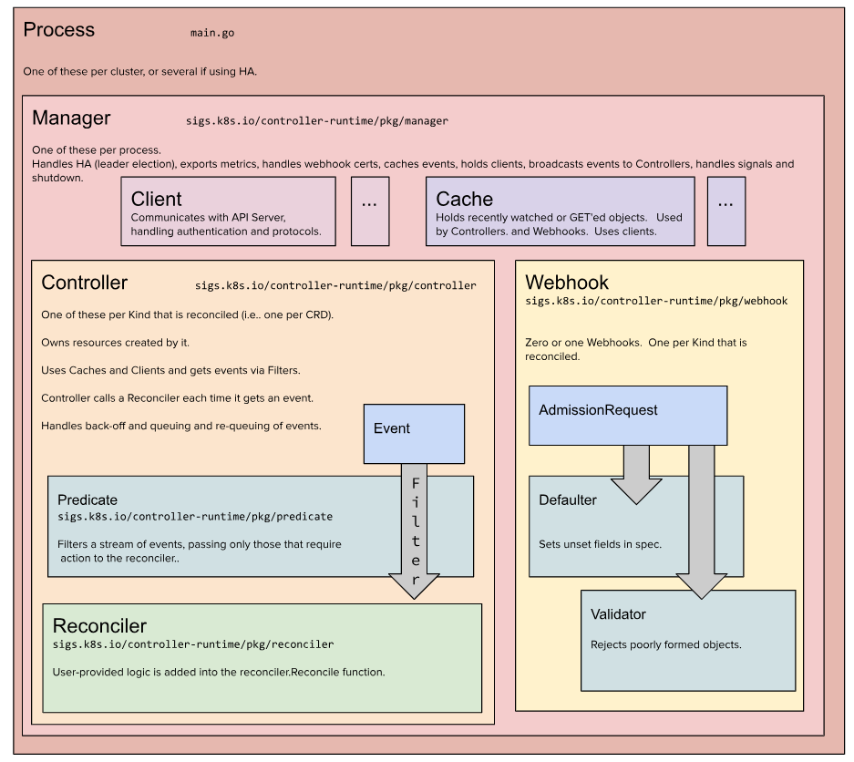

# 认识k8s-operator

# 1 释惑

Operator VS Controller

- Operator 操作器，对一个对象进行维护操作的一组自动化的工具
- Controller 实现Operator的一部分，是手段，是方法。

# 2 再说声明式 API

## 2.1 计算1+1

我要计算1+1，需要什么？

- 需要提交计算请求
- 计算
- 返回计算结果

## 2.2 RESTful API 的设计

- 定义一个路径
- 提交这个计算请求
- 计算
- 返回结算结果

## 2.3 声明式 API 的设计

- 定义一个结构
- 注册这个结构
- 提交符合这个结构的请求
- 计算
- 返回计算结果

# 3 认识kubebuilder

## 3.1 kubebuilder简介

- github仓库 `https://github.com/kubernetes-sigs/kubebuilder`
- 官方文档 `https://book.kubebuilder.io/introduction.html`
- 中文翻译 `https://xuejipeng.github.io/kubebuilder-doc-cn/` 但是此文档还未完成，后续是否继续未知，所以朋友们尽量看官方文档。

## 3.2 kubebuilder安装

在 ubuntu 中安装

```shell
# download kubebuilder and install locally.
curl -L -o kubebuilder https://go.kubebuilder.io/dl/latest/$(go env GOOS)/$(go env GOARCH)
chmod +x kubebuilder && sudo mv kubebuilder /usr/local/bin/

kubebuilder version
```

本节课要演示使用的 kubebuilder 版本为：v3.6.0

## 3.3 架构图



# 4 kubebuilder命令行工具解析

- --help 帮助文档
- --plugins strings 指定插件，插件的可选项如下

```shell
root@eden:~# kubebuilder --help
CLI tool for building Kubernetes extensions and tools.

Usage:
  kubebuilder [flags]
  kubebuilder [command]

Examples:
The first step is to initialize your project:
    kubebuilder init [--plugins=<PLUGIN KEYS> [--project-version=<PROJECT VERSION>]]

<PLUGIN KEYS> is a comma-separated list of plugin keys from the following table
and <PROJECT VERSION> a supported project version for these plugins.

                             Plugin keys | Supported project versions
-----------------------------------------+----------------------------
               base.go.kubebuilder.io/v4 |                          3
 deploy-image.go.kubebuilder.io/v1-alpha |                          3
                    go.kubebuilder.io/v4 |                          3
         grafana.kubebuilder.io/v1-alpha |                          3
      kustomize.common.kubebuilder.io/v2 |                          3

For more specific help for the init command of a certain plugins and project version
configuration please run:
    kubebuilder init --help --plugins=<PLUGIN KEYS> [--project-version=<PROJECT VERSION>]

Default plugin keys: "go.kubebuilder.io/v4" # 注意：默认值
Default project version: "3"                # 注意：默认值


Available Commands:
  alpha       Alpha-stage subcommands
  completion  Load completions for the specified shell
  create      Scaffold a Kubernetes API or webhook
  edit        Update the project configuration
  help        Help about any command
  init        Initialize a new project
  version     Print the kubebuilder version

Flags:
  -h, --help                     help for kubebuilder
      --plugins strings          plugin keys to be used for this subcommand execution
      --project-version string   project version (default "3")

Use "kubebuilder [command] --help" for more information about a command.
```

具体的说明在这里 `https://book.kubebuilder.io/plugins/available-plugins.html`有兴趣的朋友们可以看一下。

# 5 创建我们第一个operator

## 5.1 准备工作

- 创建工程目录

```
mkdir -p ~/repos/demo
cd ~/repos/demo
```

- 初始化 git

```
git init
```

- 初始化 go mod

```shell
go mod init mashibing.com/demo/app
```

- 提交一个版本，作为开始基线

```shell
git add .
git commit -m "go mod init"
```

## 5.2 初始化 kubebuilder

命令如下：

```
kubebuilder init --domain mashibing.com
```

提交一个版本，便于稍后查看都做了什么：

```shell
git add .
git commit -m "kuberbuild init"
```

## 5.3 创建 api

命令如下：

```shell
kubebuilder create api --group demo --version v1 --kind App
```

提交一个版本，便于稍后查看都做了什么：

```shell
git add .
git commit -m "kuberbuild create api"
```

# 6 简单分析两个命令都做了什么

> 代码仓库：https://github.com/EdenZ77/demo

## 6.1 init 命令

- 创建了必要的基础代码
- 创建了管理项目的makefile文件
- 创建了必要的配置文件

### makefile

我们先看看帮助文档，下面的帮助文档是通过指定格式来解析生成的，相当灵活，值得借鉴。

```shell
root@debian:~/golang/src/github.com/onexstack/demo# make help

Usage:
  make <target>

General
  help             Display this help.

Development
  manifests        Generate WebhookConfiguration, ClusterRole and CustomResourceDefinition objects.
  generate         Generate code containing DeepCopy, DeepCopyInto, and DeepCopyObject method implementations.
  fmt              Run go fmt against code.
  vet              Run go vet against code.
  test             Run tests.
  setup-test-e2e   Set up a Kind cluster for e2e tests if it does not exist
  test-e2e         Run the e2e tests. Expected an isolated environment using Kind.
  cleanup-test-e2e  Tear down the Kind cluster used for e2e tests
  lint             Run golangci-lint linter
  lint-fix         Run golangci-lint linter and perform fixes
  lint-config      Verify golangci-lint linter configuration

Build
  build            Build manager binary.
  run              Run a controller from your host.
  docker-build     Build docker image with the manager.
  docker-push      Push docker image with the manager.
  docker-buildx    Build and push docker image for the manager for cross-platform support
  build-installer  Generate a consolidated YAML with CRDs and deployment.

Deployment
  install          Install CRDs into the K8s cluster specified in ~/.kube/config.
  uninstall        Uninstall CRDs from the K8s cluster specified in ~/.kube/config. Call with ignore-not-found=true to ignore resource not found errors during deletion.
  deploy           Deploy controller to the K8s cluster specified in ~/.kube/config.
  undeploy         Undeploy controller from the K8s cluster specified in ~/.kube/config. Call with ignore-not-found=true to ignore resource not found errors during deletion.

Dependencies
  kustomize        Download kustomize locally if necessary.
  controller-gen   Download controller-gen locally if necessary.
  setup-envtest    Download the binaries required for ENVTEST in the local bin directory.
  envtest          Download setup-envtest locally if necessary.
  golangci-lint    Download golangci-lint locally if necessary.
```

### +kubebuilder

Kubebuilder 使用 `controller-gen`工具来扫描和生成代码，`controller-gen`会递归扫描项目中的所有 Go 文件，查找以 `// +kubebuilder:`开头的特殊注释，根据标记生成相应的代码。

这就是 Kubebuilder 的代码生成机制，让工具能够安全地修改用户代码而不破坏现有逻辑。这些注释是 Kubebuilder 的"脚手架锚点"。

```go
// 包级别标记（控制代码生成范围），为此包生成deepcopy方法
// groupversion_info.go
// +kubebuilder:object:generate=true
// +groupName=demo.mashibing.com  # 基于 --group 参数
package v1
```

```go
// 类型级别标记（定义CRD行为）
// +kubebuilder:object:root=true           // 这是一个根类型（CRD）
// +kubebuilder:subresource:status         // 启用状态子资源
// +kubebuilder:validation:Optional        // 验证规则

AppList上的 // +kubebuilder:object:root=true
这个根类型作用体现在不同的地方：
1、在 zz_generated.deepcopy.go中：
// DeepCopyObject 方法被生成，说明标记生效了
func (in *AppList) DeepCopyObject() runtime.Object {
    if c := in.DeepCopy(); c != nil {
        return c
    }
    return nil
}
2、在 CRD 中的体现：
spec:
  names:
    kind: App           # 主资源类型
    listKind: AppList   # 👈 这里！列表类型自动关联
    plural: apps
    singular: app
```

#### 状态子资源

`// +kubebuilder:subresource:status`是一个非常重要的标记，它启用了 Kubernetes 的状态子资源（Status Subresource）机制。

权限分离：

```go
// 用户/管理员只能操作主资源（更新 spec）
kubectl apply -f app.yaml  # 只能修改 spec

// 控制器只能操作状态子资源（更新 status）
// 控制器代码中使用：
err := r.Status().Update(ctx, &app)


// 用户只能修改 spec
kubectl patch app my-app --type='merge' -p='{"spec":{"action":"hello"}}'  # ✅ 允许

// 用户不能直接修改 status
kubectl patch app my-app --type='merge' -p='{"status":{"result":"hello"}}'  # ❌ 拒绝

// 控制器可以安全更新 status
err := r.Status().Update(ctx, &app)  # ✅ 控制器专用方法
```

启用后，CRD 会包含：

```
apiVersion: apiextensions.k8s.io/v1
kind: CustomResourceDefinition
spec:
  versions:
  - name: v1
    subresources:
      status: {}  # 👈 这里！
```

更安全的权限控制：

```yaml
# 控制器的 RBAC 权限
apiVersion: rbac.authorization.k8s.io/v1
kind: ClusterRole
rules:
- apiGroups: ["demo.mashibing.com"]
  resources: ["apps"]
  verbs: ["get", "list", "watch"]        # 只能读取主资源
- apiGroups: ["demo.mashibing.com"]  
  resources: ["apps/status"]
  verbs: ["get", "patch", "update"]      # 可以更新状态子资源

# 用户的 RBAC 权限  
apiVersion: rbac.authorization.k8s.io/v1
kind: ClusterRole
rules:
- apiGroups: ["demo.mashibing.com"]
  resources: ["apps"]
  verbs: ["get", "list", "watch", "update", "patch"]  # 可以修改主资源
# 用户默认没有 apps/status 的更新权限
```


## 6.2 create api 命令

- 创建了api相关的代码
- 更新了api相关的配置


## 6.3 新增group、kind

可以在当前项目根目录继续增加 kind，如下：

```shell
root@debian:~/golang/src/github.com/onexstack/demo# kubebuilder create api --group demo --version v1 --kind Bpp
INFO Create Resource [y/n]
y
INFO Create Controller [y/n]
y
INFO Writing kustomize manifests for you to edit...
INFO Writing scaffold for you to edit...
INFO api/v1/bpp_types.go
INFO api/v1/groupversion_info.go
INFO internal/controller/suite_test.go
INFO internal/controller/bpp_controller.go
INFO internal/controller/bpp_controller_test.go
INFO Update dependencies
INFO Running make
/root/golang/src/github.com/onexstack/demo/bin/controller-gen object:headerFile="hack/boilerplate.go.txt" paths="./..."
Next: implement your new API and generate the manifests (e.g. CRDs,CRs) with:
$ make manifests
root@debian:~/golang/src/github.com/onexstack/demo#
```

但是，Kubebuilder 默认不支持多组（multi-group）项目，默认是单组项目模式。

```shell
root@debian:~/golang/src/github.com/onexstack/demo# kubebuilder create api --group webapp --version v1 --kind Backend
INFO Create Resource [y/n]
y
INFO Create Controller [y/n]
y
Error: failed to create API: unable to inject the resource to "base.go.kubebuilder.io/v4": multiple groups are not allowed by default, to enable multi-group visit https://kubebuilder.io/migration/multi-group.html
```


# 7 kustomize 介绍

Kustomize 是一个定制 Kubernetes 配置的工具，一般有以下能力：

- 生成资源
- 设置资源字段
- 组合和定制资源集合

## 7.1 生成资源

- ConfigMap 的数据一般来源于 config.yaml 之类的配置文件，使用 configMapGenerator，从文件中生成ConfigMap。

```shell
cat <<EOF >config.yaml
foo: bar
EOF

cat <<EOF >./kustomization.yaml
configMapGenerator:
- name: example-configmap-c
  files:
  - config.yaml
EOF
```

在执行完 `kubectl kustomize ./` 之后，生成的 configMap 资源为:

```yaml
apiVersion: v1
data:
  config.yaml: |
    foo: bar
kind: ConfigMap
metadata:
  name: example-configmap-c-b5bdf7982h
```

- Secret 针对敏感数据，同样它来源一般来自其他地方，比如 password.txt 密钥文件，使用 secretGenerator。

```shell
cat <<EOF >./password.txt
username=admin
password=secret
EOF

cat <<EOF >./kustomization.yaml
secretGenerator:
- name: example-secret-p
  files:
  - password.txt
EOF
```

在执行完 `kubectl kustomize ./` 之后，生成的 secret 资源为:

```yaml
apiVersion: v1
data:
  password.txt: dXNlcm5hbWU9YWRtaW4KcGFzc3dvcmQ9c2VjcmV0Cg==
kind: Secret
metadata:
  name: example-secret-p-c4kts5h4ta
type: Opaque
```

## 7.2 资源设置字段

在一个项目中为 Kubernetes 的所有资源设置统一字段或者增加前后缀是很常见的。如：

- 为所有资源设置相同的命名空间
- 添加相同的名称前缀或后缀
- 添加相同的标签(labels)集合
- 添加相同的注解(annotations)集合

```shell
cat <<EOF >./deployment.yaml
apiVersion: apps/v1
kind: Deployment
metadata:
  name: nginx-deployment
  labels:
    app: nginx
spec:
  selector:
    matchLabels:
      app: nginx
  template:
    metadata:
      labels:
        app: nginx
    spec:
      containers:
      - name: nginx
        image: nginx
EOF

cat <<EOF >./kustomization.yaml
namespace: mashibing
namePrefix: pro-
nameSuffix: "-app"
commonLabels:
  app: web
commonAnnotations:
  sync: true
resources:
- deployment.yaml
EOF
```

在执行完 `kubectl kustomize ./` 之后，生成的 deployment 资源为:

```yaml
apiVersion: apps/v1
kind: Deployment
metadata:
  annotations:
    sync: true
  labels:
    app: web
  name: pro-nginx-deployment-app
  namespace: mashibing
spec:
  selector:
    matchLabels:
      app: web
  template:
    metadata:
      annotations:
        sync: true
      labels:
        app: web
    spec:
      containers:
      - image: nginx
        name: nginx
```

通用标签 (commonLabels)

```yaml
# 原始标签: app: nginx
# 被 commonLabels 覆盖为:
labels:
  app: web  # 所有地方的 app 标签都变成了 web

# 包括:
# - metadata.labels
# - spec.selector.matchLabels  
# - spec.template.metadata.labels
```


## 7.3 组合和定制资源集合

```shell
cat <<EOF > deployment.yaml
apiVersion: apps/v1
kind: Deployment
metadata:
  name: myweb
spec:
  selector:
    matchLabels:
      run: myweb
  replicas: 2
  template:
    metadata:
      labels:
        run: myweb
    spec:
      containers:
      - name: myweb
        image: nginx
        ports:
        - containerPort: 80
EOF

cat <<EOF > service.yaml
apiVersion: v1
kind: Service
metadata:
  name: myweb
  labels:
    run: myweb
spec:
  ports:
  - port: 80
    protocol: TCP
  selector:
    run: my-nginx
EOF

cat <<EOF > ./kustomization.yaml
resources:
- deployment.yaml
- service.yaml
EOF
```

在执行 `kubectl kustomize ./` 之后：

```yaml
apiVersion: apps/v1
kind: Deployment
metadata:
  name: myweb
spec:
  selector:
    matchLabels:
      run: myweb
  replicas: 2
  template:
    metadata:
      labels:
        run: myweb
    spec:
      containers:
      - name: myweb
        image: nginx
        ports:
        - containerPort: 80
---
apiVersion: v1
kind: Service
metadata:
  name: myweb
  labels:
    run: myweb
spec:
  ports:
  - port: 80
    protocol: TCP
  selector:
    run: my-nginx
```

## 7.4 Kustomize 的目录结构要求

标准的 Kubebuilder 项目结构

```shell
# default下的kustomization.yaml文件
namespace: demo-system
namePrefix: demo-
resources:
- ../crd
- ../rbac
- ../manager

root@debian:~/golang/src/github.com/onexstack/demo# tree -L 3 config/
config/
|-- crd
|   |-- bases
|   |   `-- demo.mashibing.com_apps.yaml
|   |-- kustomization.yaml		# ← 必须有！
|   `-- kustomizeconfig.yaml
|-- default
|   |-- kustomization.yaml		# ← 你提供的这个文件
|   |-- manager_metrics_patch.yaml
|   `-- metrics_service.yaml
|-- manager
|   |-- kustomization.yaml		# ← 必须有！
|   `-- manager.yaml
|-- rbac
|   |-- kustomization.yaml		# ← 必须有！
|   |-- role.yaml
|   |-- role_binding.yaml
|   `-- service_account.yaml
```

当运行 `bin/kustomize build config/default`时：

- 读取 `config/default/kustomization.yaml`
- 递归处理每个 `resources`条目：
  - 找到 `../crd/kustomization.yaml`→ 处理 CRD 资源
  - 找到 `../rbac/kustomization.yaml`→ 处理 RBAC 资源
  - 找到 `../manager/kustomization.yaml`→ 处理 Manager 资源
- 应用所有转换（命名空间、前缀、补丁等）
- 输出合并后的 YAML

处理顺序：从内到外

```shell
原始资源文件 (YAML)
    ↓
子目录 kustomization.yaml 处理 (第一层转换)  
    ↓
父目录 kustomization.yaml 处理 (第二层转换)
    ↓
最终输出
```

关注点分离

- 子层 kustomization：处理组件特定的配置（如镜像版本）
- 父层 kustomization：处理环境特定的配置（如命名空间、前缀）

# 8 编写我们的operator

## 8.1 编写结构定义部分

修改文件 `api/v1/app_types.go`

## 8.2 编写业务逻辑部分

修改文件 `controllers/app_controller.go`

# 9 运行我们的operator

运行之前需要将Makefile文件中“Dependencies”部分的依赖安装完成。

## 9.1 Makefile文件介绍


## 9.2 执行命令

```shell
make generate
make manifests
make install
make build
make run

# 在K8S集群中apply CR
root@debian:~/golang/src/github.com/onexstack/demo# kubectl apply -f config/samples/demo_v1_app.yaml
app.demo.mashibing.com/app-sample created
root@debian:~/golang/src/github.com/onexstack/demo# kubectl get apps
NAME         AGE
app-sample   29s
root@debian:~/golang/src/github.com/onexstack/demo# kubectl get apps app-sample -oyaml
apiVersion: demo.mashibing.com/v1
kind: App
metadata:
  annotations:
    kubectl.kubernetes.io/last-applied-configuration: |
      {"apiVersion":"demo.mashibing.com/v1","kind":"App","metadata":{"annotations":{},"labels":{"app.kubernetes.io/managed-by":"kustomize","app.kubernetes.io/name":"demo"},"name":"app-sample","namespace":"default"},"spec":{"action":"Hello","object":"World"}}
  creationTimestamp: "2025-10-13T03:33:51Z"
  generation: 1
  labels:
    app.kubernetes.io/managed-by: kustomize
    app.kubernetes.io/name: demo
  name: app-sample
  namespace: default
  resourceVersion: "39726"
  uid: 40fb544d-8bf9-4d2e-821e-8b55157f83ba
spec:
  action: Hello
  object: World
status:
  result: Hello,World
  

root@master:~# kubectl api-resources
NAME                                SHORTNAMES                                      APIVERSION                        NAMESPACED   KIND
apps                                                                                demo.mashibing.com/v1             true         App
```

