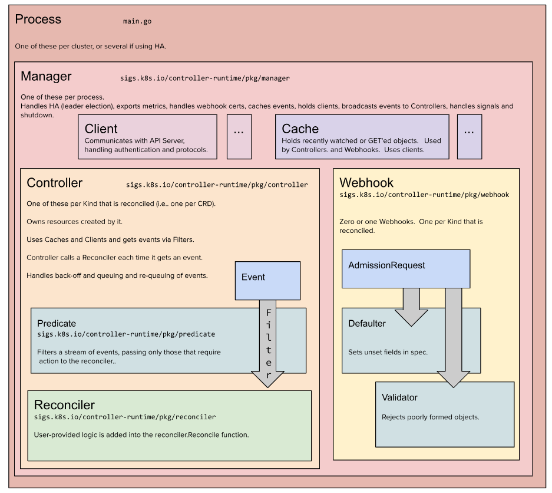

# 认识k8s-operator

# 1 释惑

Operator VS Controller

- Operator 操作器，对一个对象进行维护操作的一组自动化的工具
- Controller 实现Operator的一部分，是手段，是方法。

# 2 再说声明式 API

## 2.1 计算1+1

我要计算1+1，需要什么？

- 需要提交计算请求
- 计算
- 返回计算结果

## 2.2 RESTful API 的设计

- 定义一个路径
- 提交这个计算请求
- 计算
- 返回结算结果

## 2.3 声明式 API 的设计

- 定义一个想要的结构
- 注册这个结构
- 提交符合这个结构的请求
- 计算
- 返回计算结果


## 2.4 总结

- RESTful API 是交互式的，一次请求一次响应。
- RESTful API 是没有状态的，每次请求中没有一个组件来维护它的上下文。这也是HTTP的特点。
- k8s 的声明式 API 是声明一个最终的期望状态，并不是命令式的一步一步达到期望。

# 3 认识kubebuilder

## 3.1 kubebuilder简介

- github仓库 `https://github.com/kubernetes-sigs/kubebuilder`
- 官方文档 `https://book.kubebuilder.io/introduction.html`
- 中文翻译 `https://xuejipeng.github.io/kubebuilder-doc-cn/` 但是此文档还未完成，后续是否继续未知，所以朋友们尽量看官方文档。

## 3.2 kubebuilder安装

在 ubuntu 中安装

```shell
# download kubebuilder and install locally.
curl -L -o kubebuilder https://go.kubebuilder.io/dl/latest/$(go env GOOS)/$(go env GOARCH)
chmod +x kubebuilder && sudo mv kubebuilder /usr/local/bin/

kubebuilder version
```

本节课要演示使用的kubebuilder版本为：v3.6.0

## 3.3 架构图



# 4 kubebuilder命令行工具解析

- --help 帮助文档
- --plugins strings 指定插件，插件的可选项如下

```shell
root@eden:~# kubebuilder --help
CLI tool for building Kubernetes extensions and tools.

Usage:
  kubebuilder [flags]
  kubebuilder [command]

Examples:
The first step is to initialize your project:
    kubebuilder init [--plugins=<PLUGIN KEYS> [--project-version=<PROJECT VERSION>]]

<PLUGIN KEYS> is a comma-separated list of plugin keys from the following table
and <PROJECT VERSION> a supported project version for these plugins.

                             Plugin keys | Supported project versions
-----------------------------------------+----------------------------
               base.go.kubebuilder.io/v4 |                          3
 deploy-image.go.kubebuilder.io/v1-alpha |                          3
                    go.kubebuilder.io/v4 |                          3
         grafana.kubebuilder.io/v1-alpha |                          3
      kustomize.common.kubebuilder.io/v2 |                          3

For more specific help for the init command of a certain plugins and project version
configuration please run:
    kubebuilder init --help --plugins=<PLUGIN KEYS> [--project-version=<PROJECT VERSION>]

Default plugin keys: "go.kubebuilder.io/v4" # 注意：默认值
Default project version: "3"                # 注意：默认值


Available Commands:
  alpha       Alpha-stage subcommands
  completion  Load completions for the specified shell
  create      Scaffold a Kubernetes API or webhook
  edit        Update the project configuration
  help        Help about any command
  init        Initialize a new project
  version     Print the kubebuilder version

Flags:
  -h, --help                     help for kubebuilder
      --plugins strings          plugin keys to be used for this subcommand execution
      --project-version string   project version (default "3")

Use "kubebuilder [command] --help" for more information about a command.
```

具体的说明在这里 `https://book.kubebuilder.io/plugins/available-plugins.html`有兴趣的朋友们可以看一下。

# 5 创建我们第一个operator

## 5.1 准备工作

- 创建工程目录

```
mkdir -p ~/repos/demo
cd ~/repos/demo
```

- 初始化 git

```
git init
```

- 初始化 go mod

```shell
go mod init mashibing.com/demo/app
```

- 提交一个版本，作为开始基线

```shell
git add .
git commit -m "go mod init"
```

## 5.2 初始化 kubebuilder

命令如下：

```
kubebuilder init --domain mashibing.com
```

提交一个版本，便于稍后查看都做了什么：

```shell
git add .
git commit -m "kuberbuild init"
```

## 5.3 创建 api

命令如下：

```shell
kubebuilder create api --group demo --version v1 --kind App
```

提交一个版本，便于稍后查看都做了什么：

```shell
git add .
git commit -m "kuberbuild create api"
```

# 6 简单分析两个命令都做了什么

> 代码仓库：https://github.com/EdenZ77/demo-1

## 6.1 init 命令

- 创建了必要的基础代码
- 创建了管理项目的makefile文件
- 创建了必要的配置文件

## 6.2 create api 命令

- 创建了api相关的代码
- 更新了api相关的配置

# 7 kustomize 介绍

Kustomize 是一个定制 Kubernetes 配置的工具，一般有以下能力：

- 生成资源
- 设置资源字段
- 组合和定制资源集合

## 7.1 生成资源

- ConfigMap 的数据一般来源于 config.yaml 之类的配置文件，使用 configMapGenerator，从文件中生成ConfigMap。

```shell
cat <<EOF >config.yaml
foo: bar
EOF

cat <<EOF >./kustomization.yaml
configMapGenerator:
- name: example-configmap-c
  files:
  - config.yaml
EOF
```

在执行完 `kubectl kustomize ./` 之后，生成的 configMap 资源为:

```yaml
apiVersion: v1
data:
  config.yaml: |
    foo: bar
kind: ConfigMap
metadata:
  name: example-configmap-c-b5bdf7982h
```

- Secret 针对敏感数据，同样它真正来源一般来自其他地方，比如 password.txt 密钥文件，使用 secretGenerator。

```shell
cat <<EOF >./password.txt
username=admin
password=secret
EOF

cat <<EOF >./kustomization.yaml
secretGenerator:
- name: example-secret-p
  files:
  - password.txt
EOF
```

在执行完 `kubectl kustomize ./` 之后，生成的 secret 资源为:

```yaml
apiVersion: v1
data:
  password.txt: dXNlcm5hbWU9YWRtaW4KcGFzc3dvcmQ9c2VjcmV0Cg==
kind: Secret
metadata:
  name: example-secret-p-c4kts5h4ta
type: Opaque
```

## 7.2 资源设置字段

在一个项目中为 Kubernetes 的所有资源设置统一字段或者增加前后缀是很常见的。如：

- 为所有资源设置相同的命名空间
- 添加相同的名称前缀或后缀
- 添加相同的标签(labels)集合
- 添加相同的注解(annotations)集合

```shell
cat <<EOF >./deployment.yaml
apiVersion: apps/v1
kind: Deployment
metadata:
  name: nginx-deployment
  labels:
    app: nginx
spec:
  selector:
    matchLabels:
      app: nginx
  template:
    metadata:
      labels:
        app: nginx
    spec:
      containers:
      - name: nginx
        image: nginx
EOF

cat <<EOF >./kustomization.yaml
namespace: mashibing
namePrefix: pro-
nameSuffix: "-app"
commonLabels:
  app: web
commonAnnotations:
  sync: true
resources:
- deployment.yaml
EOF
```

在执行完 `kubectl kustomize ./` 之后，生成的 deployment 资源为:

```yaml
apiVersion: apps/v1
kind: Deployment
metadata:
  annotations:
    sync: true
  labels:
    app: web
  name: pro-nginx-deployment-app
  namespace: mashibing
spec:
  selector:
    matchLabels:
      app: web
  template:
    metadata:
      annotations:
        sync: true
      labels:
        app: web
    spec:
      containers:
      - image: nginx
        name: nginx
```

## 7.3 组合和定制资源集合

```shell
cat <<EOF > deployment.yaml
apiVersion: apps/v1
kind: Deployment
metadata:
  name: myweb
spec:
  selector:
    matchLabels:
      run: myweb
  replicas: 2
  template:
    metadata:
      labels:
        run: myweb
    spec:
      containers:
      - name: myweb
        image: nginx
        ports:
        - containerPort: 80
EOF

cat <<EOF > service.yaml
apiVersion: v1
kind: Service
metadata:
  name: myweb
  labels:
    run: myweb
spec:
  ports:
  - port: 80
    protocol: TCP
  selector:
    run: my-nginx
EOF

cat <<EOF > ./kustomization.yaml
resources:
- deployment.yaml
- service.yaml
EOF
```

在执行 `kubectl kustomize ./` 之后：

```yaml
apiVersion: apps/v1
kind: Deployment
metadata:
  name: myweb
spec:
  selector:
    matchLabels:
      run: myweb
  replicas: 2
  template:
    metadata:
      labels:
        run: myweb
    spec:
      containers:
      - name: myweb
        image: nginx
        ports:
        - containerPort: 80
---
apiVersion: v1
kind: Service
metadata:
  name: myweb
  labels:
    run: myweb
spec:
  ports:
  - port: 80
    protocol: TCP
  selector:
    run: my-nginx
```

# 8 编写我们的operator

## 8.1 编写结构定义部分

修改文件 `api/v1/app_types.go`

## 8.2 编写业务逻辑部分

修改文件 `controllers/app_controller.go`

# 9 运行我们的operator

## 9.1 Makefile文件介绍

- generate 生成crd文件
- manifests 生成部署需要的文件
- build 编译operator
- install 安装crd
- run 运行operator

## 9.2 执行命令

```
make generate
make manifests
make build
make install
make run
```

