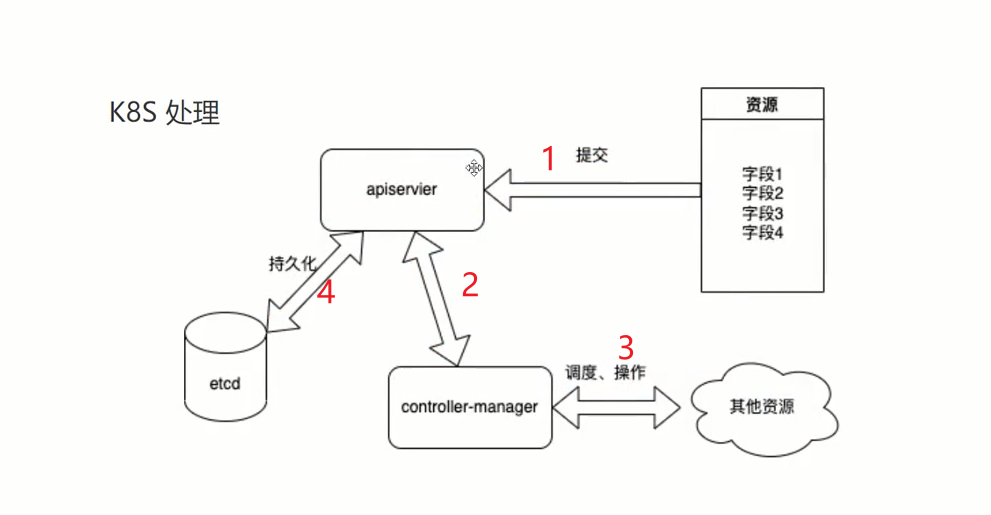
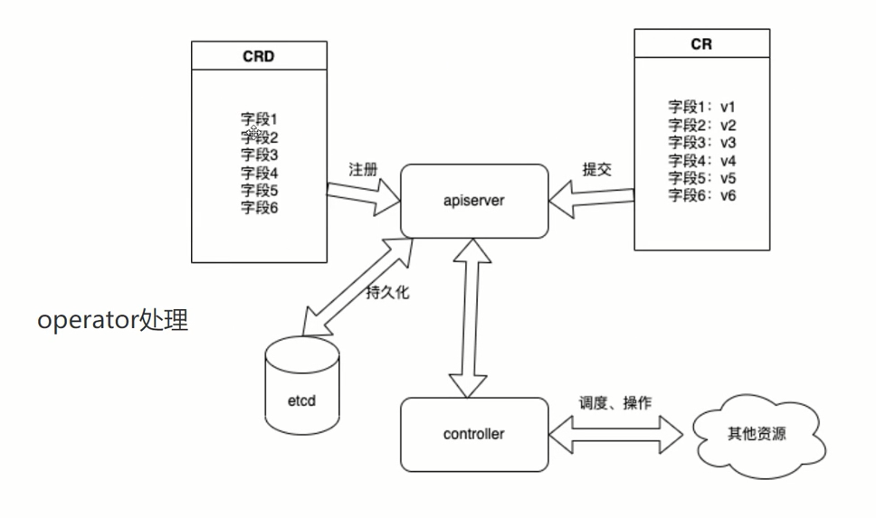
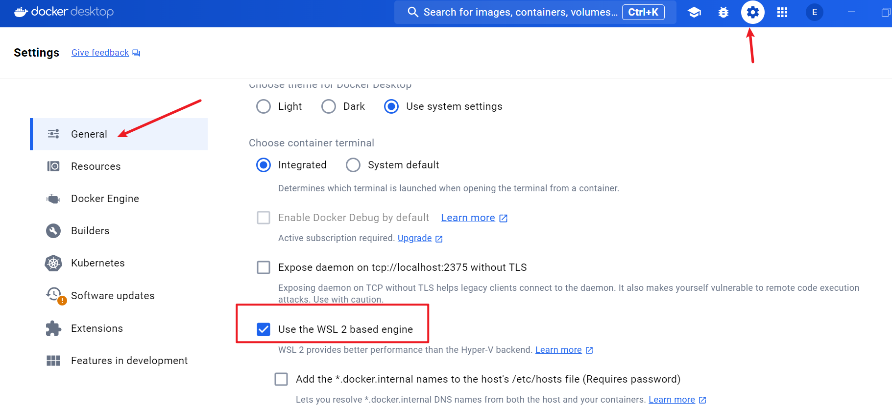
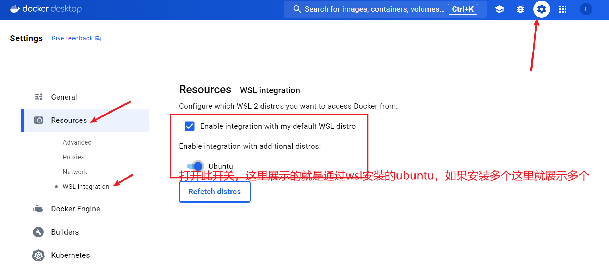

# 基本概念

**k8s管理资源的方式（声明式）**

- 先定义我要管理成什么样
- 再实现如何达成这个目的



该图片展示了k8s处理资源的经典流程。

**什么是operator**

- k8s扩展的一种方式
- 我们根据自己的需要，在k8s中自定义工作方式
- 需要提供两个东西：1. 什么样的结果（期望）。2. 如何达到这个结果



在CRD注册之后，就可以提交CR了，CR就是根据CRD字段的定义来提交对应的字段值，apiserver则根据不同的CRD找到不同的controller。


**开发的内容**

- 定义这个东西的形态（CRD）
- 制定制造的方法（Controller）
- 把制造的东西暴露出去（通过apiserver暴露）


# 环境安装

本次我没有使用视频的方式，而是用Ubuntu来搭建环境。

## wsl

以管理员模式打开PowerShell

```shell
wsl --set-default-version 2
wsl --update
wsl --install -d Ubuntu
wsl -l -v

# 进入wsl
wsl

# 终止Ubuntu实例
wsl --terminate Ubuntu
# 重新启动Ubuntu实例
wsl -d Ubuntu
# 终止所有运行的WSL发行版
wsl --shutdown

```


## docker

```
https://docs.docker.com/desktop/install/windows-install/
```

docker是C/S架构，我们这里安装的docker desktop其实是服务端，会被挂载到WSL中，所以docker desktop需要启用WSL 2，并整合WSL。然后我们需要在WSL 2中安装的Ubuntu中安装docker客户端。

启用WSL



整合WSL并关联安装的ubuntu系统



然后“Apply & restart”。我们这里安装

接着以管理员模式打开PowerShell，安装docker客户端即可

```shell
# 先执行wsl，进入Ubuntu系统
apt-get update
apt-get install docker.io
```

配置docker镜像

```shell

cat > /etc/docker/daemon.json <<EOF
{
  "registry-mirrors": ["https://hub3.767778.xyz"],
  "insecure-registries": ["hub3.767778.xyz"],
  "exec-opts": ["native.cgroupdriver=systemd"]
}
EOF

# 重启Docker服务
systemctl daemon-reload && systemctl restart docker

```


## golang1.19

我推荐在wsl中使用gvm安装和管理，方便在需要不同版本的时候切换，地址https://github.com/moovweb/gvm

安装gvm命令

```
bash < <(curl -s -S -L https://raw.githubusercontent.com/moovweb/gvm/master/binscripts/gvm-installer)
```


安装golang

```shell
gvm install go1.4 -B

gvm use go1.4

export GOROOT_BOOTSTRAP=$GOROOT

gvm install go1.19

gvm use go1.19 --default
```


在Ubuntu上面安装golang

```shell
wget https://mirrors.aliyun.com/golang/go1.20.linux-amd64.tar.gz
sudo tar -C /usr/local -xzf go1.20.linux-amd64.tar.gz

vim ~/.bashrc
export PATH=$PATH:/usr/local/go/bin
source ~/.bashrc
go env -w GOPROXY=https://goproxy.cn,direct


echo 'export PATH=$PATH:/root/go/bin' >> ~/.bashrc
source ~/.bashrc

```


## kubectl

```shell
# 不需要代理
vim ~/.bashrc
export http_proxy=http://192.168.1.6:10809
export https_proxy=https://192.168.1.6:10809
export no_proxy="localhost,127.0.0.1,localaddress,.localdomain.com"
source

curl -LO "https://dl.k8s.io/release/$(curl -L -s https://dl.k8s.io/release/stable.txt)/bin/linux/amd64/kubectl"

mv kubectl /usr/local/bin/
```


## 安装kind和k8s

```shell
go install sigs.k8s.io/kind@latest
# go install 会将安装的二进制文件放在 $GOPATH/bin 目录中。根据你提供的 go env 输出，你的 GOPATH 是 /root/go，因此二进制文件应该在 /root/go/bin 目录中。
echo 'export PATH=$PATH:/root/go/bin' >> ~/.bashrc
source ~/.bashrc

kind create cluster --image kindest/node:v1.28.9

# 注意kind版本和kindest/node的版本对应关系
```

