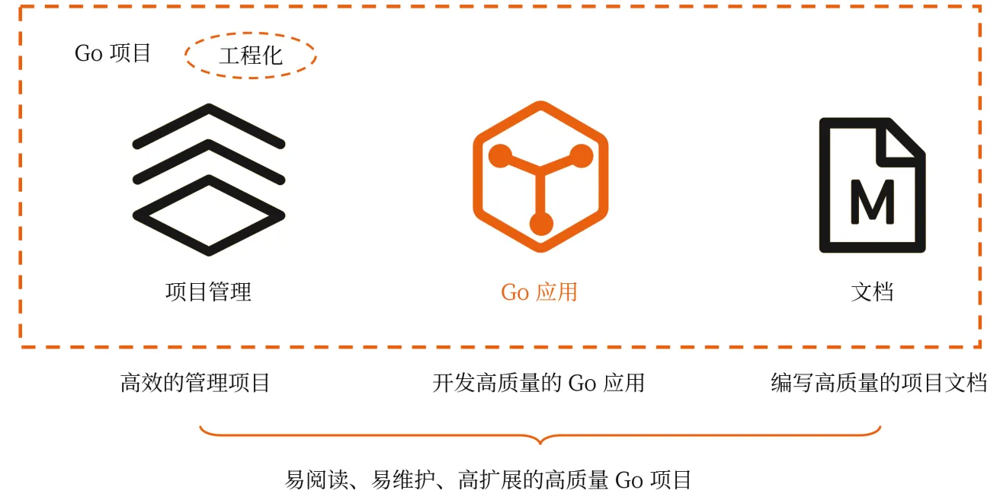
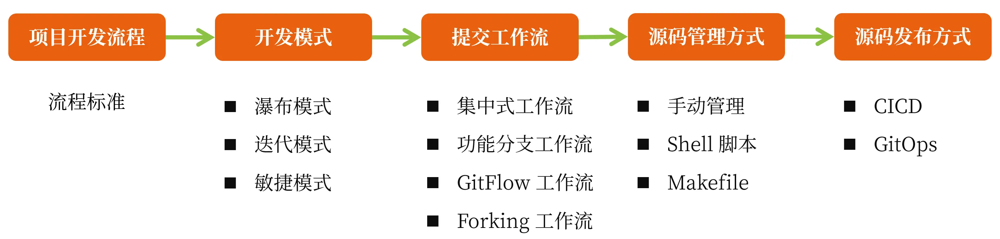
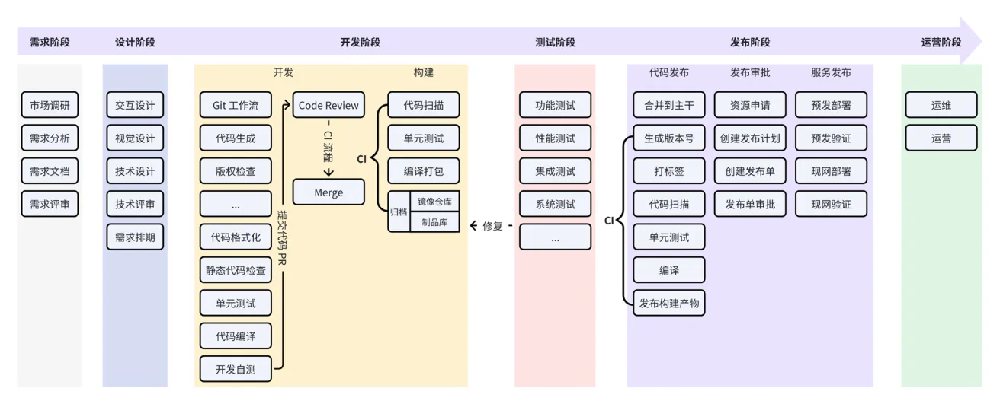
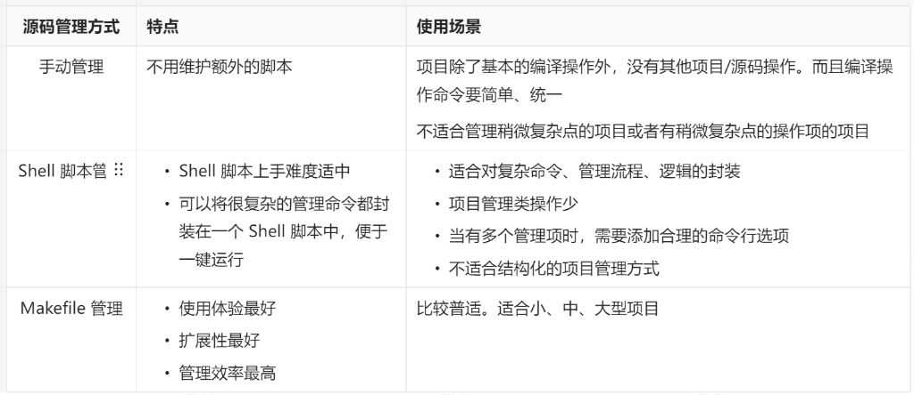
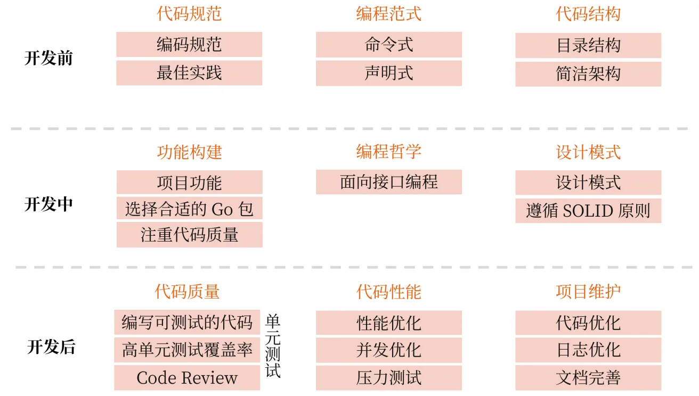

# 总览

Go 项目开发中我的一些开发"原则"：

- 原则一：简洁 > 性能
- 原则二：易读 > 代码量
- 原则三：进度再赶，开发时也要思考代码的最佳实现方式

在我看来一个高质量的 Go 项目应该具备以下特点：

1. **项目管理高效：**能够便捷高效的管理 Go 项目，例如：代码编译、单元测试、代码生成、代码静态检查等；
2. **代码质量高：**代码结构清晰、简洁、可扩展；代码逻辑实现清晰、简洁、可扩展；符合 Go 代码开发规范、最佳实践；代码稳定、性能高等；
3. **文档质量高：**拥有全面的文档，而且文档内容格式规范、质量高、更新及时等。

# 项目管理

项目管理有很多方面，如果想高效的管理你的项目，在我看来要有一个统一的视图，通常涉及到的管理点，如下图所示：

为了能够给你清晰的介绍**项目开发流程**，我将整个项目开发流程，绘制成了下面一张图：

在项目开发中，一个项目几乎都是由多个开发者共同完成的。对于一个大型项目，共同开发者的数量可能达到十几个、几十个、甚至更多。这么多开发者，每天都在提交代码，每天都在重复执行：静态代检查、代码编译、镜像构建、单元测试、Protobuf文件编译等操作。如果没有一个统一、高效的项目管理，你很可能会面临以下 2 个核心难题：

1. **执行结果不一致带来一些潜在的问题和沟通成本**：不同开发者，相同的操作每个人执行的命令和结果都是不一样的。不一致的结果，可能会程序运行结果不一致，并带来一些沟通成本；
2. **执行效率低下：**一些操作需要执行复杂的命令，如果手动操作，效率低下，而且容易犯错；
3. **不知道如何操作：**一个项目，尤其是大型项目，通常包含各种操作项，其中不乏一些复杂的操作项，如果不能有效规整这些操作项，对于一个新开发者，甚至经常操作的开发者，经常会出现不知道如何操作，要翻阅操作笔记的难境，这会拖累你的开发效率和开发体验。

那么，如何解决以上问题呢？答案是要选择一个合适的**源码管理方式**。在项目开发中，通常可以选择以下 3 种源码管理方式：

通过上面的对比，你应该不难知道最佳的项目管理方式其实是：Makefile 管理。[OneX](https://github.com/superproj/onex) 项目有 12w 行代码、近 29 个服务，但整个项目操作、管理非常便捷高效，其中核心原因便是采用了 Makefile 的管理方式。

# Go应用

我们来从一个全局的视角，来看下如何开发一个 Go 应用

# 项目文档

编写文档是一个必不可少的开发工作。那么一个项目需要编写哪些文档，又该如何编写呢？我认为项目中最需要的 3 类文档是 README 文档、项目文档和 API 接口文档。

