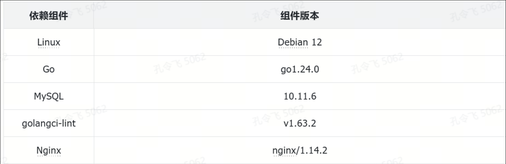
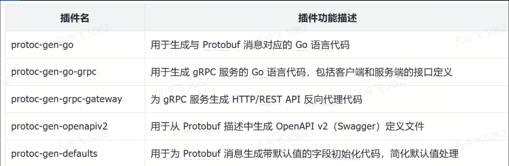

本课程依托于一个小而美的博客项目（[miniblog](https://github.com/onexstack/miniblog) 项目），通过讲解博客项目开发过程中的设计思路、相关技术及编程方法，教会你从零开发一个优秀的 Go 项目。为了使你接下来的学习更加高效，本节课会先教你完整部署博客项目。

## 实战项目介绍

本课程旨在帮助你快速掌握 Go 项目开发的核心知识，重点不在于具体的业务实现，而在于开发 Go 项目的方法与实践。为降低学习成本，同时提供足够的业务复杂度以承载课程的核心内容，本课程选择实现一个简化的博客系统（简称 miniblog）。选择博客系统作为实战项目的原因如下：

- **业务逻辑广泛熟知：**开发者几乎都撰写过博客，对写博客的基本流程已十分熟悉，因此可以快速理解本项目所要实现的业务功能；
- **业务逻辑简单：**项目功能仅包含博客系统的基本功能，如用户注册、登录，以及博客创建（仅包括标题和内容），从而降低了业务复杂度，使你能专注于核心开发知识的学习。

miniblog 项目实现了两大功能模块：用户管理和博客管理。用户管理包括用户注册、登录、获取用户列表与详情，更新用户信息及修改用户密码等操作。博客管理则提供创建博客、获取博客列表与详情，更新博客内容以及删除博客的功能。

miniblog 除了实现博客系统的基本功能外，还集成了许多 Go 项目开发中高频使用的技术和最佳实践，具体包括：

- 软件架构：采用三层简洁架构，确保项目结构清晰、易维护；
- 高频 Go 包：使用了 Go 项目开发中常用的 Go 包，如 gorm、casbin、govalidator、jwt-go、gin、cobra、viper、pflag、zap、pprof、grpc、protobuf、grpc-gateway、uuid、testify、sync、kratos 等；
- 目录结构：项目遵循 project-layout 规范，采用标准化的目录结构；
- 认证与授权：实现了基于 JWT 的认证和基于 Casbin 的授权功能；
- 日志与错误处理：设计了独立的日志包和错误包，设计了合理的错误返回方式及业务错误码；
- 构建与管理：使用高质量的 Makefile 对项目进行管理；
- 代码质量：通过 golangci-lint 工具对代码进行静态检查，确保代码处在一个较高的质量水平上；
- 测试覆盖：包含单元测试、性能测试、模糊测试和示例测试等多种测试案例；
- 丰富的 Web 功能：支持请求 ID、优雅关停、中间件、跨域处理、异常恢复等功能；
- 多种服务器类型：实现了 gRPC 服务器、HTTP 服务器和 HTTP 反向代理服务器；
- 多种数据交换格式：支持 JSON 和 Protobuf 数据格式；
- 开发规范：遵循多种开发规范，包括代码规范、版本规范、接口规范、日志规范、错误规范以及提交规范等；
- API 设计：接口设计遵循 RESTful API 规范，并提供 OpenAPI 3.0 和 Swagger 2.0 格式的 API 文档。

因此，miniblog 不仅是一个简单的博客系统，更是一个涵盖 Go 项目开发核心实践的优秀实战项目。

## 如何部署 miniblog 项目？

本课程以 Linux 系统为基础进行部署，因此，为避免环境差异引发的问题，建议优先使用 Linux 系统进行开发和部署。Go 的跨平台特性使得在 macOS 或 Windows 系统上理论上也可以完成部署，但需要你根据具体系统进行相应的配置和调整。

miniblog 项目依赖的核心组件及版本如下图所示：



你可以通过以下两步来完成 miniblog 项目的部署：

1. 部署开发和运行环境；
2. miniblog 项目安装和配置。

## 部署开发和运行环境

本节将准备并配置适用于 miniblog 项目的开发与运行环境。由于绝大多数企业选择在 Linux 系统上部署软件，为了与企业的生产环境保持一致，本课程同样使用 Linux 系统来部署 miniblog 项目。

在项目开发过程中，miniblog 依赖一些 Linux 软件，因此需要提前安装这些依赖，以避免因缺少依赖而导致错误。此外，Go 是一种编译型语言，源代码需经过编译生成可执行的二进制文件，因此还需要安装 Go 的编译环境。

此外，miniblog 的 Web 服务包含一个 gRPC 服务，gRPC 服务通过 Protobuf 文件定义接口，并使用 protoc 编译器将 Protobuf 文件编译为对应的服务端和客户端 Go 代码。因此，还需安装 Protobuf 的编译环境。

### 准备一台 Linux 服务器

准备 Linux 服务器的方法有多种，最简单、经济的方式是购买一台 Linux 云服务器。另一种方法是使用虚拟机工具，如 VMware Workstation（适用于 Windows）或 VirtualBox（适用于 macOS），或者在本地安装 Linux 系统。为了高效、顺利地编译 Go 源码，建议 Linux 服务器的配置至少为 1 核 CPU 和 2GB 内存。

在选择 Linux 服务器时，可以考虑不同的发行版，比如 Debian、CentOS 或 Ubuntu。需要注意的是，不同发行版的包管理器各不相同，这会导致软件安装方法有所差异。miniblog 项目基于 Debian 12 系统进行开发和部署，为了减少因环境差异带来的问题，强烈建议使用 Debian 12 或至少基于 Debian 系列的系统来部署 miniblog 项目。

### 依赖安装和配置

在 Linux 系统上部署 miniblog 项目需要依赖一些 APT 包，这些依赖分为直接依赖和间接依赖。为了避免后续操作中因缺少依赖导致的编译失败、命令执行错误等问题，本节将提前安装这些依赖包。以下是依赖安装和配置的具体步骤。

#### 1. 配置 sudoers

在使用 Linux 系统时，为了提高系统的安全性，通常建议使用普通用户登录系统。当需要安装软件时，可能会涉及到 root 权限，此时一般通过 sudo 命令来执行安装操作。因此，需要提前为普通用户（比如用户名为 going 的用户）配置 sudo 权限。具体配置方法如下：

首先，以 root 用户登录 Linux 系统，然后执行以下命令：

```
# echo 'going ALL=(ALL:ALL) NOPASSWD: ALL' >> /etc/sudoers
```

上述命令中，going 是需要配置的普通用户名。配置完成 sudoers 文件后，即可使用普通用户 going 登录 Linux 系统，并通过 sudo 命令安装软件。

#### 2. 安装依赖

在 Debian 系统上，你可以使用 apt 命令安装所需的依赖。具体安装命令如下：

```
$ sudo apt -y install make gawk gettext tcl tk tcl-dev jq tk-dev
```

如果系统提示“xxx is already the newest version”，则表示 xxx 包已安装在系统中，可以直接忽略这类提示信息。

#### 3. 安装与配置 Git

由于部署 miniblog 项目或执行 go get 命令等操作都需要通过 Git 工具来下载安装包，因此必须安装 Git 工具。具体安装与配置方法如以下代码所示：

可参考 `CNCF/Docker基础/Debian12_Go环境.md`

### Go 编译环境安装和配置

安装 Go 编译环境的步骤相对简单，只需下载源码包并配置相应的环境变量。具体步骤如下：

可参考 `CNCF/Docker基础/Debian12_Go环境.md`

### Protobuf 编译环境安装

miniblog 项目实现了一个 gRPC 服务器，该服务器使用 Protobuf 作为数据交换格式。因此，需要安装 Protobuf 文件的编译器 protoc 工具及其相关编译插件。安装过程相对简单，具体分为以下两步：

#### 1. 安装 protoc 命令

安装命令如下：

```shell
$ cd /tmp/
$ wget https://github.com/protocolbuffers/protobuf/releases/download/v29.1/protoc-29.1-linux-x86_64.zip
$ mkdir protobuf-29.1/
$ unzip protoc-29.1-linux-x86_64.zip -d protobuf-29.1/
$ cd protobuf-29.1/
$ sudo cp -a include/* /usr/local/include/
$ sudo cp bin/protoc /usr/local/bin/
$ protoc --version # 查看 protoc 版本，成功输出版本号，说明安装成功
libprotoc 29.1
```

#### 2. 安装编译插件

protoc 编译工具依赖一些编译插件来生成相应的 Go 代码。miniblog 项目所依赖的编译插件如下图所示：



上表所示的编译插件安装命令如下：

```shell
$ go install google.golang.org/protobuf/cmd/protoc-gen-go@v1.35.2
$ go install google.golang.org/grpc/cmd/protoc-gen-go-grpc@v1.5.1
$ go install github.com/grpc-ecosystem/grpc-gateway/v2/protoc-gen-grpc-gateway@v2.24.0
$ go install github.com/grpc-ecosystem/grpc-gateway/v2/protoc-gen-openapiv2@v2.24.0
$ go install github.com/onexstack/protoc-gen-defaults@v0.0.2
```

首次执行 go install 命令时，由于本地没有缓存，需要下载所有的 Go 依赖模块，因此安装速度可能会较慢，请耐心等待。你可以通过添加 -x 参数来打印详细的安装过程，从中查看具体哪个步骤耗时较长。

## miniblog 项目安装和配置

安装好 Go 编译环境后，便可以开始部署 miniblog 项目。安装和配置分为以下四个步骤：

1. miniblog 项目快速部署；
2. 安装和配置 MariaDB 数据库；
3. 安装和配置 miniblog 服务；
4. 启动 Swagger API 文档。

### 1. miniblog 项目快速部署

miniblog 是一个教学项目。为了尽可能降低初始部署的复杂度，miniblog 提供了快速部署模式。你只需执行以下命令即可完成快速部署：

```shell
$ mkdir -p $GOPATH && cd $GOPATH
$ mkdir -p $HOME/golang/src/github.com/onexstack
$ cd $HOME/golang/src/github.com/onexstack
$ git clone -b v1.0.0 --depth=1 https://github.com/onexstack/miniblog
$ cd miniblog
$ go work init . # 初始化 Go 工作区
$ go work use . # 将 miniblog 项目添加到当前 Go 工作区中
$ make build BINS=mb-apiserver # 编译源码
$ _output/platforms/linux/amd64/mb-apiserver # 启动服务
$ curl http://127.0.0.1:5555/healthz # 测试是否成功安装（HTTPS 协议，新终端中执行）
{"timestamp":"2025-02-01 23:50:29"}
$ go run examples/client/health/main.go # 测试健康检查接口（gRPC 协议）
$ go run examples/client/user/main.go # 测试用户相关接口（gRPC 协议）
$ go run examples/client/post/main.go # 测试博客相关接口（gRPC 协议）
```

