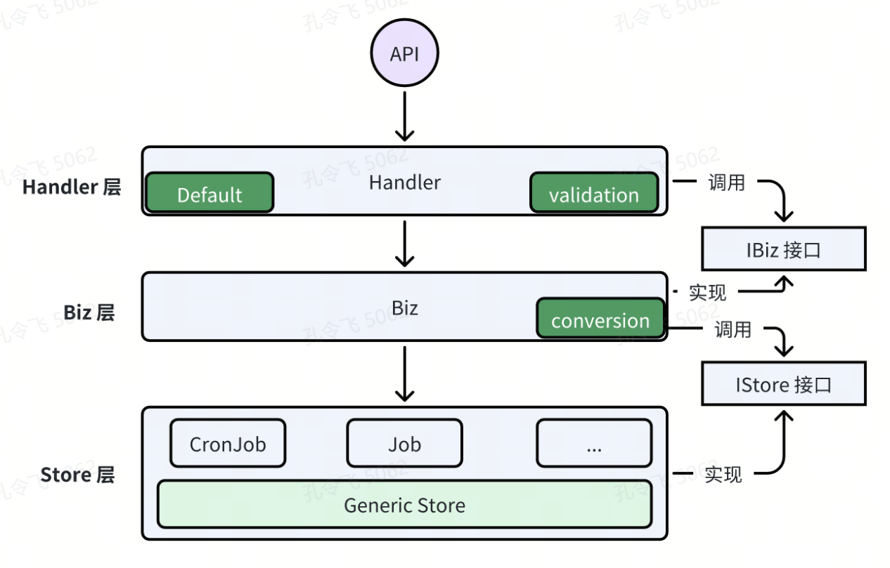
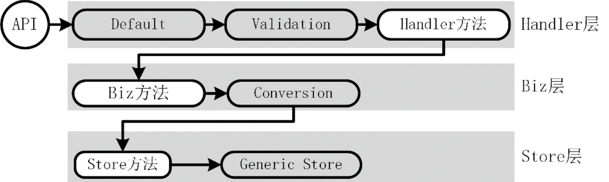
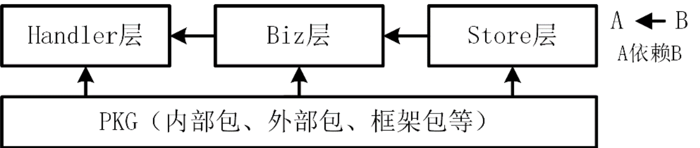
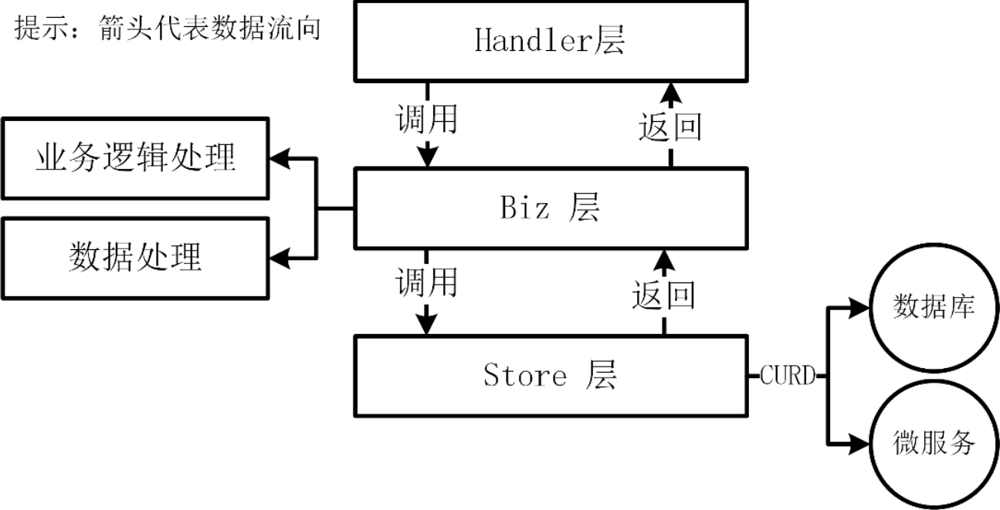
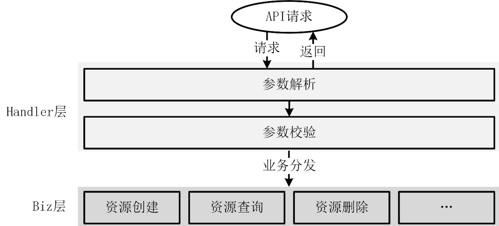
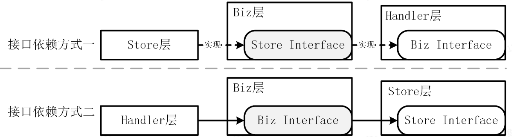
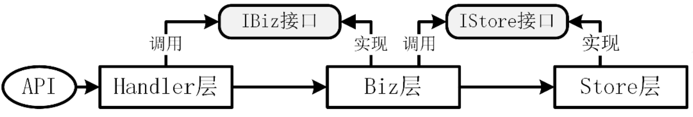

在开发项目之前，需要先设计一个合理的软件架构。一个好的软件架构不仅可以大大提高项目的迭代速度，还可以降低项目的阅读和维护难度。目前，行业中有多种流行的软件架构，例如：MVC 架构、六边形架构、洋葱架构、简洁架构等。在 Go 项目开发中，用的最多的是简洁架构。

本节课会详细介绍简洁架构，以及 miniblog 项目的简洁架构设计和实现方法。

## miniblog 简洁架构实现

任何实现简洁架构规定的五个约束的软件架构均可称为简洁架构。miniblog 项目参考业界简洁架构的实现，也设计实现了一种简洁架构。与其他简洁架构的最大区别在于，miniblog 的简洁架构设计更加简单实用，省略了一部分分层特性，仅保留了必要的分层，但带来了更大的易读性和可维护性。

miniblog 项目的简洁架构设计如下图所示。

整个软件架构一共分为以下三层：

- **Handler 层：**负责 API 接口请求的参数解析、参数校验、业务逻辑处理分发、参数返回逻辑。在 Handler 层中，还有 Default 和 Validation 模块，分别用来给请求参数设置默认值，并校验请求参数的合法性；
- **Biz 层：**包括了具体的业务逻辑实现。Biz 层根据 REST 资源类型分为不同的模块，内部的模块间可交叉调用。在 Biz 层还有 Conversion 模块，用来进行结构体类型转换；
- **Store 层：**数据访问层（包括访问数据库或第三方微服务），用来跟数据库/微服务交互执行数据的 CURD 操作。该层做了进一步的抽象，抽象出了通用的 Store 层，Generic Store 之上 REST 资源的数据存储操作，均可继承 Generic Store 的方法实现，而不需要自行再实现一套。

上图所示的简洁架构，还具有以下特点：

- 简洁架构提供了清晰的分层结构，各层功能明确，职责分明；
- 通过接口解耦每一层，从而实现代码的可测性、独立性和扩展性；
- 代码依赖由上向下（图中的有向箭头表示依赖规则），单向单层依赖，提供了清晰的依赖关系，使代码易于理解和维护。

上述三个特点也使得整个软件代码具有很高的易读性和可维护性。上图所示的简洁架构有三层，但这不意味着简洁架构只有三层。如果有需要你可以对层进行增减。虽然层数可变，但是依赖关系是固定的，即：单向依赖。

上图所示的简洁架构中，API 请求的数据流转路径如下图所示。

请求到来后，先经过 Default 模块，用来给请求参数设置默认值。之后，经过 Validation 模块，用来对请求参数进行校验。校验通过后，会经过 Handler 方法，Handler 方法会处理请求，并将请求转发到 Biz 层的 Biz 方法中。在 Biz 方法中需要进行数据转换，在 miniblog 项目中，会将 Biz 层的数据结构转换为 Store 层的数据结构，并调用 Store 层的方法，对数据进行 CURD 操作。Store 层的方法继承自 Generic Store，所以最终是调用 Generic Store 完成对数据的 CURD 操作。

### 简洁架构中的依赖规则

简洁架构能够工作的关键是依赖规则，这条规则规定：代码依赖应该由上向下，单向依赖。这种依赖包含代码名称、函数/方法、变量或任何其他软件实体。也就是说，下层不应该感知到上层的任何对象。上层中声明的数据格式不应被下层使用。

除了上述层与层之间的包依赖关系外，各层还可以导入项目所需的其他 Go 包，例如内部包、外部包或框架包等。然而，必须确保依赖关系的合理性，避免出现循环依赖。

上述包导入关系如下图所示。

### 简洁架构中的分层设计

miniblog的简洁架构一共分为了三层：存储层（Store）、业务层（Biz）、处理器层（Handler）。每一层都承载了不同的功能。

#### 存储层（Store）

存储层在某些简洁架构设计中也称为 Frameworks&Drivers 层或基础设施层。存储层负责与数据库、外部服务等进行交互，作为应用程序的数据引擎进行数据的输入和输出。需要注意的是，存储层仅对数据库或外部服务执行 CRUD 操作，不封装任何业务逻辑。

此外，存储层还承担数据转换的任务：将从数据库或微服务获取的数据转换为处理器层和业务层能够识别的数据结构，同时将处理器层和业务层的数据格式转换为数据库或外部服务可识别的数据格式。

#### 业务层（Biz）

业务层在（Biz，Business）某些简洁架构设计中也称为 Usecases 层。业务层是领域模型的应用层，负责协调各个实体和值对象之间的交互，以完成具体的业务需求。业务层会受到业务逻辑变更的影响，但不会被其他层所影响，例如用户界面和数据库等。

业务层功能如下图所示。

在实际的企业应用开发中，业务层是变更最频繁的一层。

#### 处理器层（Handler）

处理器层在某些简洁架构设计中也称为控制器层。处理器层负责接收 HTTP/RPC 请求，并进行参数解析、参数校验、业务逻辑处理分发、请求返回等操作。处理器层的核心目的是将用户的输入转化为领域模型的操作，并将结果返回给用户。在这一层还包括其他适配器，用于将数据从外部形式转换为业务层可以使用的内部形式。

处理器层会将请求转发给业务层，业务层处理后返回，返回数据在处理器层中被整合再加工，最终返回给请求方。处理器层相当于实现了业务路由的功能。具体流程如下图所示。

> 提示：
>
> 在 MVC 架构中，处理器层通常用 Controller 来表示，而在 gRPC 服务中则用 Service。为了统一 MVC 架构中的处理器层名称与 gRPC 服务中的处理器层名称，这里统一使用 Handler 来表示处理器层。在大多数 Go 项目中，包括一些优秀的开源项目（如 Kubernetes、Gin、Echo 等），处理请求的层通常被命名为 Handler，而非 Controller 或其他名称。Handler 准确地表达了其职责，即负责处理（handling）请求。

### 接口依赖关系

在简洁架构的设计中，各层之间通过接口进行解耦，以便减少依赖关系，同时增强系统的扩展性。接口依赖有以下两种模式：

- **接口依赖方式一：**外层组件声明所需的能力，内层组件则实现这些能力；
- **接口依赖方式二：**内层组件首先提供所需能力（接口），外层组件才能调用这些能力。外层组件的能力依赖于内层组件的能力。

接口依赖模式如下图所示。

在接口依赖方式一种，包的导入关系为内层导入外层。在接口依赖方式二中，包的导入关系为外层导入内层。miniblog 项目采用了第二种接口依赖方式，即在开发过程中优先开发内层组件，然后再开发外层组件。具体的开发流程为：先开发 Store 层、Biz 层，最后是 Handler 层。

### 层之间的通信

处理器层、业务层和存储层之间均通过接口进行通信。通过接口通信，一方面可以支持同一个功能有不同的实现（也就是说具有插件化能力）。另一方面，接口解耦了不同层的具体实现，使得每一层变得独立且可测试。层之间通信模式如下图所示。

## 简洁架构如何测试

处理器层、业务层和存储层之间通过接口进行通信。通过接口通信的一个好处是，可以让各层变得可测试。本节将讨论如何测试各层的代码。

### 存储层测试

存储层依赖于数据库，如果调用了其他微服务，则还会依赖第三方服务。开发者可以通过 sqlmock 来模拟数据库连接，通过 httpmock 来模拟 HTTP 请求。

### 业务层测试

业务层依赖于存储层，这意味着该层需要存储层的支持才能进行测试。可以使用 golang/mock 来模拟存储层，测试用例可以参考 Test_postBiz_Delete，代码中使用 golang/mock 工具生成了存储层的 Mock 方法 NewMockPostStore 和 NewMockIStore。

### 处理器层测试

处理器层依赖于业务层，这意味着该层需要业务层的支持进行测试。同样可以通过 golang/mock 来模拟业务层，测试用例可参考 TestHandler_DeletePost。