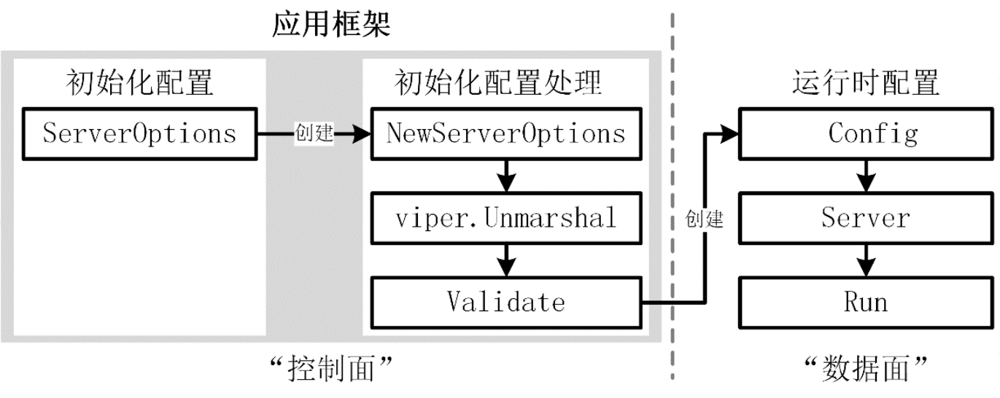

Go 项目开发的核心目标是构建一个能够满足产品需求的稳定应用。那么，该如何构建这样的应用呢？不同的开发者往往会采用不同的构建方式。

有些开发者将所有代码逻辑集中放在一个 main 函数中，有些开发者则将不同的逻辑代码分散放入不同文件中，同时构建出结构化的 main 函数。尽管两种方式最终都能实现产品需求，但其带来的结果却截然不同：

- 有些开发者编写的代码结构混乱，难以阅读，且后期维护困难。改动一个功能时，可能会意外影响其他功能。并且功能改动时，需要花费更多的时间；
- 有些开发者编写的代码结构清晰，易于阅读和维护，功能之间隔离度高，代码变更互不干扰，可以很快的完成功能变更。

作为一名 Go 开发者，应从一开始就养成构建健壮应用的习惯，并掌握相关的构建技巧。合格的应用构建方式应具备以下几个特点：

- **应用代码结构清晰：**清晰的结构不仅便于阅读，还能减少后期改动引发的缺陷；
- **应用代码按功能隔离：**良好的隔离性可以确保后续代码变更不会相互干扰。例如，功能类代码的变更不会影响应用框架；
- **应用代码具有扩展性：**能够清楚地知道在哪一部分添加新的功能代码，并且在添加后，整个应用框架的逻辑仍然保持一致。

本节课将展示如何构建一个健壮、可扩展的应用。

## 应用程序组成及构建方法

想要构建一个应用，首先需要了解应用程序的组成部分。一个 Go 应用通常由以下 3 部分组成：应用配置、应用启动框架、应用业务逻辑处理。在 Go 项目开发时，要选用合适的方式来构建这 3 部分功能，最终构建出一个能承载业务功能的优秀应用框架。

### 设计合理的应用仓库组织方式

在我的开发生涯中，发现很多开发者喜欢将一个应用的不同组件放在不同的仓库中，或者将不同应用的组件放在一个大仓中，这两种方式都会带来一些维护成本。

一个企业级应用通常会包含多个组件，例如：miniblog 项目就包含了 mb-apiserver、gen-gorm-model 两个组件。应用内各个组件之间的代码依赖、功能复用通常会比较密集。应用之间的代码依赖、功能复用相对较少。

如果将一个应用的不同组件，分别存放在不同的仓库中，不利于功能复用，并且组件源码分散存放，不利于同一个应用的代码维护。

所以，在企业应用开发中，建议以应用维度聚合应用中不同组件的源码。这种方式，既能够避免大仓带来的包升级困难、应用维护困难，又能够在同一应用，不同组件之间复用源码仓库管理功能、并提高不同组件之间的代码复用度。

### 应用配置

应用配置用于对应用程序进行配置。例如，可通过配置指定应用需要连接的 MySQL 地址、监听的 HTTP 端口等。这些为什么需要通过配置来指定？主要有以下 3 个原因：

- **不修改代码即可连接不同的环境：**例如，测试环境、开发环境与线上环境可能使用不同的 MySQL 地址，通过配置可以实现环境间的切换，而无需对程序代码进行修改；
- **安全性：**一些敏感信息不宜直接硬编码到代码中，需要通过配置的方式存放在配置文件中，这些配置文件会保存在比较安全的环境下；
- **提高发布效率与应用程序的稳定性：**通过修改配置而不是改动应用代码来改变应用行为，一方面可以快速实现期望的功能，另一方面也提高了程序的稳定性（配置变更通常比代码变更更加安全）。

那么，应用程序可以从哪些地方读取配置？通常可以从以下 4 个来源读取：

- **命令行选项（option）：**指以 - 或 -- 开头的选项参数，通常包含 0 或 1 个值，例如，--out-format=json 或 --help；
- **命令行参数（argument）：**指非选项参数，命令行中除了 option 以外的部分即为 argument，例如：pip install click 命令中的 install click；
- **配置文件：**通常为 YAML、JSON、TOML、INI、XML 等格式的文本文件；
- **分布式配置存储服务：**例如 Apollo、Etcd、Consul、Nacos 等。

虽然可以自行从零开发一种读取配置的方法，但更推荐使用社区成熟的 Go 包来读取不同位置的配置：

- **命令行选项、命令行参数：**可以使用 os 包、flag 包、pflag 包来读取。其中，os 包用于读取命令行参数，flag 包适合小型项目的简单参数解析，pflag 兼容 flag 包并支持高级功能，是大型开源项目中常用的命令行选项/参数解析工具；
- **配置文件：**可以使用支持特定配置文件格式的包（如 YAML 的 ghodss/yaml，JSON 的 encoding/json 等），或选择支持多种格式的工具包，例如 viper、configor、koanf 等；
- **环境变量：**可通过 os.Getenvf 方法或 envconfig 包读取环境变量；
- **分布式配置存储服务：**此类服务通常提供官方客户端包，例如 go.etcd.io/etcd/client/v3（Etcd）、github.com/hashicorp/consul/api（Consul）、github.com/nacos-group/nacos-sdk-go（Nacos）等。

推荐使用 pflag 处理命令行参数和命令行选项，选择 viper 等支持多种格式的 Go 包处理配置文件，通过 os.Getenv 或 envconfig 解析环境变量，根据需要选用 Apollo、Etcd、Consul 工具从配置中心中读取配置。

对于一个 Go 应用，通常需要解析以下类型的配置：命令行选项、命令行参数和配置文件。基于上述分析，这里建议使用 pflag 与 viper 来实现这些功能。值得一提的是：viper 支持绑定 pflag 参数，通过这种绑定方式，可统一管理 pflag 与 viper 中的配置项。

尽管环境变量不适合作为应用程序的主要配置方式，但在某些场景下依然非常适用：

- **内容敏感：**针对一些敏感的配置内容，不适合通过命令行选项或配置文件直接以明文形式暴露时，可以通过环境变量加载这些配置内容；
- **临时配置：**例如，测试时需要对某用户进行特殊处理，可通过环境变量传递用户名，而无需为这种临时场景修改代码或新增命令行选项。

### 应用启动框架

应用启动框架可以理解为一个 main 函数，只不过这个 main 函数具有代码结构，并可能分散在多个 Go 源码文件中。在这个框架中，可以读取配置文件、初始化业务逻辑、启动 Web 服务等。示例代码如代码清单 5-1 所示。

```go
  package main

  import (
      "fmt"
      "net/http"

      "github.com/spf13/pflag"
  )

  const helpText = `Usage: main [flags] arg [arg...]
  This is a very simple app framework (does nothing).
  Flags:`

  var (
      addr  = pflag.String("addr", ":8777", "The address to listen to.")
      help  = pflag.BoolP("help", "h", false, "Show this help message.")
      usage = func() {
          fmt.Println(helpText)
          pflag.PrintDefaults()
      }
  )

  func main() {
      // 1. 命令行参数处理：解析，并读取命令行参数
      pflag.Usage = usage
      pflag.Parse()
      if *help {
          pflag.Usage()
          return
      }

      // 2. 业务处理：初始化路由
      http.HandleFunc("/", func(w http.ResponseWriter, r *http.Request) {
          fmt.Fprint(w, "Hello world")
      })
      server := http.Server{Addr: *addr}
      fmt.Printf("Starting http server at %s\n", *addr)

      // 3. 业务处理：启动 HTTP Web 服务
      if err := server.ListenAndServe(); err != nil {
          panic(err)
      }
  }
```

上述 main 函数可以认为是最简单的平铺式应用框架。这个框架没有特定的功能，只是内嵌了启动服务需要的基本操作，例如：打印帮助信息、读取配置、初始化路由和启动 Web 服务。

当业务逻辑简单时，使用上述平铺式应用框架仍然可以保持代码的可读性和可维护性。但随着应用逻辑的复杂化，上述代码将变得冗长且难以维护。这时，需要引入一个优秀的应用框架来构建和管理应用程序。

业界有许多这样的应用框架，其中以下几款框架较为受欢迎（按星星数量排序）：cobra、urfave/cli、kingpin。其中，cobra 最受欢迎。cobra 功能强大、易用，代码质量高，许多优秀的开源项目（如 Kubernetes、Docker、Etcd、Hugo 等）均使用 cobra 构建应用。此外，它可以与 pflag 组合，提供更强大且易用的命令行参数处理能力。

### 应用业务逻辑处理

应用的业务逻辑因具体业务的不同而差别较大。一般而言，一个 Go 应用通常会执行以下类别的业务逻辑处理（可能涉及其中一个或多个）：

- 初始化缓存；
- 初始化并创建各类存储客户端，例如：Redis、MySQL、Kafka、MongoDB、Etcd 等；
- 初始化并创建其他服务的客户端；
- 初始化并启动 Web 服务，例如：HTTP、HTTPS、gRPC；
- 启动异步任务，这些异步任务可以执行任何业务需要的操作，例如：监听 kube-apiserver 的变更、定期从第三方服务拉取数据并缓存、注册/metrics 路由并监听指定端口、启动 Kafka 消费队列等。

### 最佳构建方法

可以使用 pflag、viper 和 cobra 来构建一个功能强大的应用程序，这一方法也是当前大多数团队的首选。pflag、viper 和 cobra 功能强大，每个包都包含丰富的内容供学习，并且互联网上也有许多相关教程，因此本节不再详细介绍。如果需要，可以阅读 docs/book/ 目录下的 [pflag.md](https://github.com/onexstack/miniblog/blob/master/docs/book/pflag.md)、[viper.md](https://github.com/onexstack/miniblog/blob/master/docs/book/viper.md) 和 [cobra.md](https://github.com/onexstack/miniblog/blob/master/docs/book/cobra.md) 文件学习。

提升 Go 开发能力的重要方法之一是阅读优秀开源项目的源码。pflag、viper 和 cobra 这三个包功能强大，代码质量很高。在学习本课程的过程中，还可以通过阅读这三个项目的源码，进一步提高自身的开发能力。

## miniblog 应用构建模型

miniblog 项目使用 pflag、viper、cobra 三个强大的 Go 包来构建应用的命令行选项、配置文件和应用启动框架。为了能够在未来承载更多的应用功能、应用配置，并且确保应用代码的可读性、可维护性和可扩展性，miniblog 项目参考 Kubernetes 的应用构建方式，设计了 miniblog 项目的应用构建模型，如图 5-1 所示。



在 miniblog 的应用构建模型中，有两大类配置：初始化配置和运行时配置。


初始化配置，是在程序启动时，通过命令行选项、环境变量或配置文件设置的配置。这类配置受限于配置方式，可能会缺少应用运行时需要的配置，例如 MySQL 客户端连接实例、第三方微服务客户端连接实例等配置（不可能通过命令行选项传递一个 MySQL 客户端连接实例）。这些连接实例，一般会基于初始化配置来创建或初始化。因此，在 miniblog 应用构建模型中，还有一个运行时配置。运行时配置包含了服务运行时依赖的配置，


初始化配置可能有很多配置项，并不是所有的配置项在程序启动时都需要设置，这类配置项一般可通过默认值来设置。所以在程序启动时，会通过 NewServerOptions 函数来创建一个带有默认值的初始化配置项变量。之后，通过命令行选项、环境变量、配置文件等方式来覆盖变量中指定的配置项，从而达到仅设置必要的配置项即可运行程序的目的，以此简化应用启动时的配置。


在 miniblog 应用构建模型中，还有一个步骤 viper.Unmarshal，这一步操作可以将 viper 读取的配置文件中的配置项保存在初始化配置变量中，从而用配置文件中的配置项覆盖默认的配置项。


此外，为了确保初始化配置可用，还需要对初始化配置进行校验，然后基于初始化配置创建一个运行时配置 Config。之后，便可以使用运行时配置 Config 来创建一个服务实例，并调用服务实例的 Run 方法，启动服务。


为了提高程序的稳定性和可维护性，miniblog 将初始化配置、应用框架构建部分代码保存在 cmd/mb-apiserver/app 目录下。将运行时配置及运行时代码保存在 internal/apiserver 目录中。从而达到类似于软件架构中“控制面”和“数据面”分开的效果。


在应用规模小、配置简单的情况下，初始化配置和运行时配置一般能保持一致。但是当应用规模变大时，使用运行时配置，专门管理程序运行时的配置项，会大大降低应用代码的维护复杂度。

## 构建 miniblog 应用框架


本节课前半部分，详细介绍了 miniblog 项目的应用构建思路和设计方法。本节课接下来，会手把手教你从零开始构建一个 Go 应用。


miniblog 使用 cobra 来构建 Go 应用框架。使用 cobra 框架，需要创建 *cobra.Command 类型的对象。为了保证 main 文件代码清晰易读，需要将创建 *cobra.Command 类型对象的代码保存到 cmd/mb-apiserver/app/server.go 文件中。


你可以根据需要重命名 server.go 文件名，例如，将其重命名为 app.go、miniblog.go 等名称。关于文件命名，根据我的开发经验，我有以下建议：如果没有特殊命名需要，可以考虑将文件名命名为项目无关的名称，例如 server.go。这样就可以在所有同类项目中，保持文件名一致，从而减轻再理解成本。另外，如果你想复制该项目，并魔改为一个新项目，这类项目无关的命名方式，可以减轻新项目，重新命名文件名的工作量。