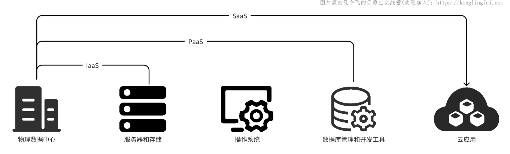

## 什么是云计算？

云原生（Cloud Native），从云原生三个字中，我们意识到云原生一定是跟云计算相关的概念，为了能够让你更好的理解云原生，这里我先来简单介绍下云计算。

### 云计算服务模型

云计算会提供很多资源，这些资源不仅包括了基础资源（CPU、内存、网络、存储等），还包括在其上搭建的各类开发平台、应用等，这些开发平台和应用，也能够通过互联网按需购买。根据提供的资源类型（也称作服务模型）又可以分为以下 3 类：

- 基础设施即服务（IaaS，Infrastructure as a Service）：通过虚拟化技术、动态的提供基础计算资源（如 CPU、内存、网络、存储等），用户可通过网络获得自己需要的计算资源，运行自己的业务系统；
- 平台即服务（PaaS，Platform as a Service）：提供用于开发、测试和管理软件应用的平台（如云函数、API 网关、容器服务、云原生数据库、消息队列等）。
- 软件即服务（SaaS，Platform as a Service）：提供通过网络访问的软件应用（如腾讯会议、腾讯文档等）。

### 云计算部署模型

另外，上述各类云服务又根据部署模型，分为以下几类：

1. 公有云（Public Cloud）：公有云是由云服务提供商（如亚马逊 AWS、微软 Azure、腾讯云等）提供的基于互联网的云计算服务。公有云以多租户模式运行，多个客户共享同一基础设施，包括计算、存储、网络等资源。公有云具有弹性扩展、按需付费、无需管理基础设施等特点，适用于中小型企业和个人用户；
2. 私有云（Private Cloud）：私有云是由企业自己搭建和管理的云计算基础设施，用于满足特定的安全和合规性需求。私有云可以部署在企业的数据中心或托管在第三方数据中心，只有企业内部的用户可以访问和使用。私有云提供了更高的控制权和定制性，但需要企业自行投入资源和成本来构建和维护；
3. 社区云（Community Cloud）：社区云是由一群组织或企业共同使用和管理的云计算平台，旨在满足特定行业或共同需求的用户。社区云可以在公有云或私有云的基础上构建，提供特定行业或共同用户群体所需的定制化功能和服务；
4. 混合云（Hybrid Cloud）：混合云是将公有云和私有云相结合的一种云计算模型。通过混合云，企业可以在私有云中处理敏感数据和应用，同时利用公有云的弹性和可扩展性来处理突发负载和大规模计算需求。混合云可以通过虚拟化和容器技术来实现不同云环境之间的数据和应用的无缝迁移和交互；
5. 边缘云（Edge Cloud）：边缘云是分布在网络边缘侧，提供实时数据处理、分析决策的小规模云数据中心；
6. 专有云（Dedicated Cloud）：专有云是介于公有云与私有云之间的一种形态。本质是公有云服务商将一系列软硬件资源隔离出来，定向为某一客户所用，从而获得比公有云更好的隔离性，比私有云更好的灵活性。简单理解，专有云是公有云中的私有云；

## 什么是云原生？

云原生目前没有一个官方的定义，其定义也会因时间、组织的不同而在不断变化。云原生一直在发展变化之中，解释权不归某个人或组织所有。