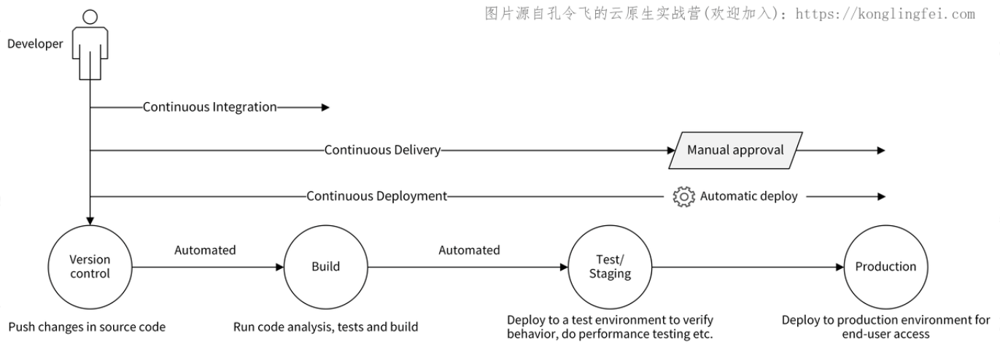

## 云原生中有哪些核心技术栈？

Pivotal 公司和 CNCF 定义下的云原生在不同阶段分别包含了不同的技术栈，当前包含的技术栈如下（Pivotal 和 CNCF 的技术栈并集）：

1. 微服务；
2. 容器；
3. 服务网格（Service Mesh）；
4. 声明式 API；
5. 不可变基础设施；
6. 持续集成和持续交付（CI/CD）；
7. DevOps.

但在我看来，云原生核心技术栈中，还应该包括以下技术栈：

1. Kubernetes;
2. Serverless.

上面这些云原生核心技术栈，都是以 Kubernetes 为基石来构建的。接下来，我就来详细给你介绍这些技术栈。

## 持续集成和持续交付（CI/CD）

CI/CD 技术通过自动化的手段，来快速执行代码检查、测试、构建、部署等任务，从而提高研发效率，确保我们的应用可以快速迭代升级。

CI/CD 包含了 3 个核心概念。

1. **CI**：Continuous Integration，持续集成；
2. **CD**：Continuous Delivery，持续交付；
3. **CD**：Continuous Deployment，持续部署。

CI 容易理解，但两个 CD 很多开发者区分不开。这里，我来详细说说这 3 个核心概念。

**首先是持续集成。**它的含义为：频繁地（一天多次）将开发者的代码合并到主干上。它的流程为：在开发人员完成代码开发，并 push 到 Git 仓库后，CI 工具可以立即对代码进行扫描、（单元）测试和构建，并将结果反馈给开发者。持续集成通过后，会将代码合并到主干。

CI 流程可以使应用软件的问题在开发阶段就暴露出来，这会让开发人员交付代码时更有信心。因为 CI 流程内容比较多，而且执行比较频繁，所以 CI 流程需要有自动化工具来支撑。

**其次是持续交付，**它指的是一种能够使软件在较短的循环中可靠发布的软件方法。

持续交付在持续集成的基础上，将构建后的产物自动部署在目标环境中。这里的目标环境，可以是测试环境、预发环境或者现网环境。

通常来说，持续部署可以自动地将服务部署到测试环境或者预发环境。因为部署到现网环境存在一定的风险，所以如果部署到现网环境，需要手工操作。手工操作的好处是，可以使相关人员评估发布风险，确保发布的正确性。

**最后是持续部署，**持续部署在持续交付的基础上，将经过充分测试的代码自动部署到生产环境，整个流程不再需要相关人员的审核。持续部署强调的是自动化部署，是交付的最高阶段。

我们可以借助下面这张图，来了解持续集成、持续交付、持续部署的关系。

持续集成、持续交付和持续部署强调的是持续性，也就是能够支持频繁的集成、交付和部署，这离不开自动化工具的支持，离开了这些工具，CI/CD 就不再具有可实施性。持续集成的核心点在**代码**，持续交付的核心点在**可交付的产物**，持续部署的核心点在**自动部署。**