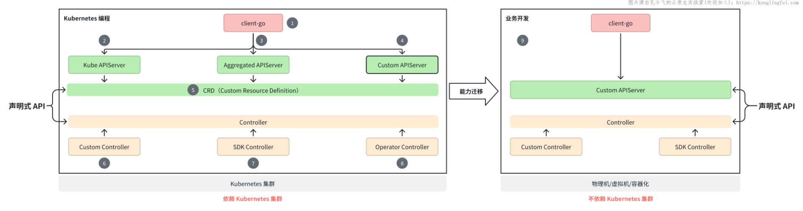

## 云原生开发实战课有哪些内容？

本套课程的具体教学内容有以下 4 大块：

1. **Kubernetes 核心知识：**本课程是一门基于 Kubernetes 的开发实战课，所以在课程讲解过程中，也会介绍很多 Kubernetes 的核心知识。另外，你可以配套学习支线课程：Kubernetes 入门与实战，以此来学习 Kubernetes，并具备 Kubernetes 相关技能。
2. **Kubernetes 源码分析：**本套课程中包含了 Kubernetes 中核心组件：kube-apiserver、client-go、kube-scheduler 的源码分析。通过学习一个优秀的开源项目源码，提升你的研发能力和天花板，一箭双雕。
3. **Kubernetes 编程：**教会你如何进行 Kubernetes 编程，因为 Kubernetes 是云原生的基石，学会 Kubernetes 编程，可以使你具备必要的开发能力，从而参与到企业的云原生化的改造工作中去；
4. **声明式编程：**Kubernetes 是分布式架构的王者，其架构设计理念和方法、代码设计方法和实现以及跟 Kubernetes 相关的周边工具、代码库、项目等，都很值得我们去学习。构建 Kubernetes 的基石是声明式 API，本套课程会尝试迁移 Kubernetes 的声明式 API 编程方法到我们的业务开发中去，从而使得我们即使不从事云原生相关的工作，也能够以 Kubernetes 的软件构建方式去开发我们的业务，进而提高工作绩效和个人收益。实际上，当你采用云原生中的先进的架构设计、代码实现方法去开发业务代码时，老板对你的能力认可可能也是最高的。

另外，学习完本套课程，还能完美的解决以下这个经常被同学们问起的问题：我想学习 Kubernetes 或者未来转岗到云原生相关的开发岗位中去，但是我们工作中用不到 Kubernetes，我该如何才能实现上述 2 个目标呢？解决方案很简单，就是学习本套课程。

因为本套课程，其中一个核心内容是采用声明式编程范式去开发你的业务应用，课程中整个声明式编程范式的构建方法跟 Kubernetes 的构建方法完全一样，底层引用的包、SDK 都跟 Kubernetes 保持完全一致。所以，工作中，你完全可以采用声明式编程范式去开发你的业务代码，在开发的过程中，你其实顺带已经学习或实战了 Kubernetes 编程。

上面啰嗦了一大堆，其实是想告诉你：**不管你是否从事云原生相关的开发，云原生开发实战课都非常值得去学习**。

本套课程的具体内容，可以概括为以下图示：

本套课程具体包括以下几个子模块：

1. Kubernetes 核心源码剖析：剖析 kubernetes 核心源码，让你从源码层面对 kubernetes 有更多了解；
2. client-go 开发实战：全面剖析 client-go 源码，并编写代码进行 client-go 实战；
3. 聚合 API 服务器：在 Kubernetes 上部署一个 API 服务，并通过 Kubernetes API 接口来访问；
4. 自定义 API 服务器：开发一个 kube-apiserver 风格的 API 服务器；
5. 自定义资源：编写并安装一个 CRD；
6. 自定义控制器：开发一个功能完备的 Kubernetes Controller；
7. 基于controller-runtime框架实现一个 Controller；
8. Kubernetes Operator 开发：开发一个 Kubernetes Operator；
9. 业务开发实战：使用声明式编程范式，开发业务应用。

其中（2， 3，4， 5） + （6， 7， 8） 组合就是 Kubernetes 编程中很出名的 CRD + Controller 模式，该模式使用声明式 API 编程范式来实现业务功能。