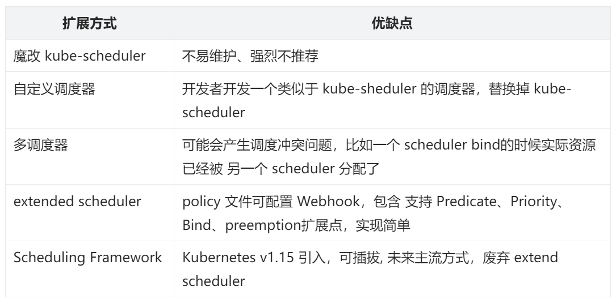
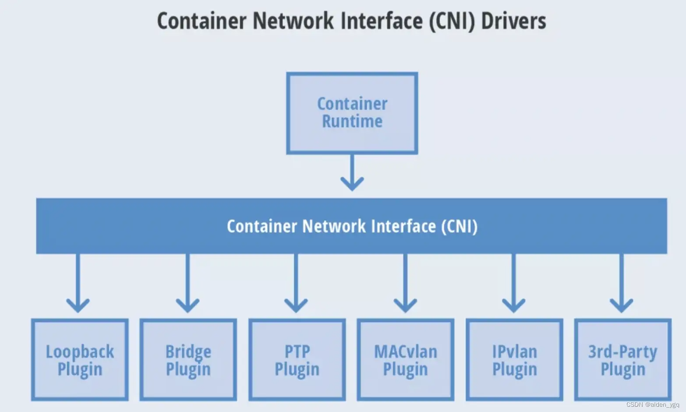
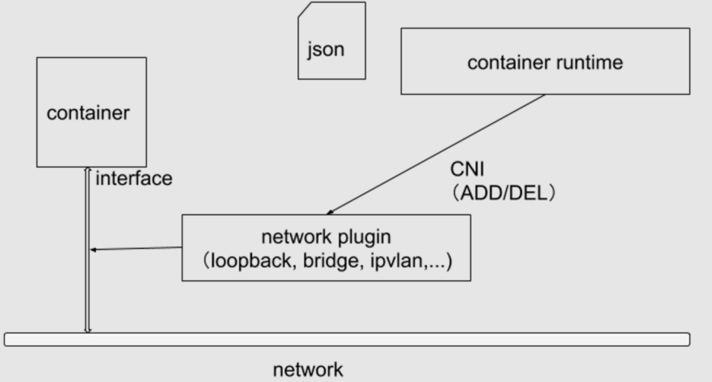
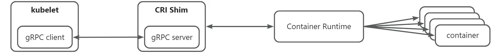

在上一节课中，我概括了 Kubernetes 中现有的扩展能力，并介绍了横向层、客户端层、API层具有的扩展能力。本节课，我继续讲解 Kubernetes 扩展能力部分中的控制面层、基础设施层。

### 控制面层

控制面层的扩展能力有以下 3 个：

1. 自定义控制器；
2. Cloud Provider Interface（CPI）
3. 调度器扩展；
4. KMS。

#### 自定义控制器

控制器是 Kubernetes 中非常重要的概念，控制器会 Watch 特定资源的变更，并根据资源变更，进行调和处理，使资源始终处在期望的状态。

Kubernetes 有很多内置的资源，这些资源大部分都有内置的控制器，对这些资源进行调和，处理资源相关的业务逻辑。例如：deployment-controller、daemonset-controller、replicaset-controller 等。更多内置的控制器见 [controller_names.go#L45](https://github.com/kubernetes/kubernetes/blob/v1.31.1/cmd/kube-controller-manager/names/controller_names.go#L45)

但是只有内置的控制器，很多时候满足不了公司业务的需求。例如：我们新安装了一个 CRD 资源，需要对这个 CRD 资源进行调和。另外，对于 Kubernetes 内置的 CRD 资源，我们可能也需要进行一些调和，最典型的场景比如：编写一个控制器，Watcher Service 资源，根据 Service 资源的变更，将 Pod 的 Endpoint 注册到公司内部的服务中心中（例如 consul）。幸运的是，Kubernetes 支持自定义控制器。

开发自定义控制器也非常简单，例如：可以使用 kubebuilder 工具、sigs.k8s.io/controller-runtime包，或者直接基于 [sample-controller](https://github.com/kubernetes/sample-controller) 魔改一个。至于具体如何开发自定义控制器，**Kubernetes 开发实战课**中会详细介绍。

#### Cloud Provider Interface（CPI）

在没有 CPI 之前，，跟公有云的对接涉及到很多组件的功能改造和添加，比如 Controller Manager、API Server、kubelet。当新支持一种云时，就要在它核心组件里去改动，这种方式很不优雅，也不灵活。

因此，Kubernetes 新加入了一种 CPI 扩展机制，公有云厂商可以根据 CPI 开发自己的 cloud-controller-manager，cloud-controller-manager 中包含了多种 controller，这些 controller 用来处理跟云厂商环境有紧密耦合关系的逻辑，例如：负载均衡、存储、网络等资源的 CURD。

例如：vsphere 就开发了自己的 CPI 扩展组件：[cloud-provider-vsphere](https://github.com/kubernetes/cloud-provider-vsphere/)。关于 CPI 的更多介绍，可参考：

1. [Overview of the Cloud Provider Interface](https://cloud-provider-vsphere.sigs.k8s.io/concepts/cpi_overview)；
2. [CPI - Cloud Provider Interface](https://cloud-provider-vsphere.sigs.k8s.io/cloud_provider_interface)。

#### 调度器扩展

Kubernetes 在运行 Pod 时，需要根据一系列调度算法，将 Pod 调度到合适的 Worker 节点上。Kubernetes 内置了大量的调度算法。但是在企业中，这些调度算法一般情况下并不能完全满足需求。

例如：云厂商或者企业有自己的节点拓扑、监控系统、有自己的调度诉求，这些非标的架构和需求，原生的 Kubernetes 调度器很可能没法满足，因此业务通常有自己调度算法需求。

为了满足业务自定义调度策略的刚需，Kubernetes 支持通过多种方式去扩展调度器。支持自定义调度器，还有一个很大的好处，就是业务不用担心因为自己开发调度插件或者算法，不被 Kuberentes 社区接纳导致，无法丝滑的使用 Kubernetes 的问题。

Kubernetes 支持以下调度器扩展方式：



以下是一个 Pod 使用自定义调度器的 YAML 示例：

```yaml
apiVersion: v1  
kind: Pod  
metadata:  
  name: custom-scheduler-pod  
spec:  
  schedulerName: custom-scheduler  # 指定自定义调度器的名称  
  containers:  
    - name: my-container  
      image: nginx:latest  
      ports:  
        - containerPort: 80  
  # 其他 Pod 配置可以根据需要添加
```

上面的 Pod YAML 资源定义中，指定了 spec.schedulerName字段，该字段指定了调度器的名字 custom-scheduler，custom-scheduler就是自定义调度器。

Kubernetes 在最初的时候，还通过了  extended scheduler 扩展机制，就是通过 kube-scheduler 在启动的时候，加载一个配置文件，配置文件中配置了一个 Webhook 地址，Kubernetes 在调度时，会调用该 Webhook，对预选、优选、Bind 进行补充。在使用 extender 之前，我们必须在 scheduler policy 配置文件中定义 extender相关信息，如下：

```go
// k8s.io/kubernetes/pkg/scheduler/apis/config/legacy_types.go
// Extender holds the parameters used to communicate with the extender. If a verb is unspecified/empty,
// it is assumed that the extender chose not to provide that extension.
type Extender struct {
	// URLPrefix at which the extender is available
	URLPrefix string
	// Verb for the filter call, empty if not supported. This verb is appended to the URLPrefix when issuing the filter call to extender.
	FilterVerb string
	// Verb for the preempt call, empty if not supported. This verb is appended to the URLPrefix when issuing the preempt call to extender.
	PreemptVerb string
	// Verb for the prioritize call, empty if not supported. This verb is appended to the URLPrefix when issuing the prioritize call to extender.
	PrioritizeVerb string
	// The numeric multiplier for the node scores that the prioritize call generates.
	// The weight should be a positive integer
	Weight int64
	// Verb for the bind call, empty if not supported. This verb is appended to the URLPrefix when issuing the bind call to extender.
	// If this method is implemented by the extender, it is the extender's responsibility to bind the pod to apiserver. Only one extender
	// can implement this function.
	BindVerb string
	// EnableHTTPS specifies whether https should be used to communicate with the extender
	EnableHTTPS bool
	// TLSConfig specifies the transport layer security config
	TLSConfig *ExtenderTLSConfig
	// HTTPTimeout specifies the timeout duration for a call to the extender. Filter timeout fails the scheduling of the pod. Prioritize
	// timeout is ignored, k8s/other extenders priorities are used to select the node.
	HTTPTimeout time.Duration
	// NodeCacheCapable specifies that the extender is capable of caching node information,
	// so the scheduler should only send minimal information about the eligible nodes
	// assuming that the extender already cached full details of all nodes in the cluster
	NodeCacheCapable bool
	// ManagedResources is a list of extended resources that are managed by
	// this extender.
	// - A pod will be sent to the extender on the Filter, Prioritize and Bind
	//   (if the extender is the binder) phases iff the pod requests at least
	//   one of the extended resources in this list. If empty or unspecified,
	//   all pods will be sent to this extender.
	// - If IgnoredByScheduler is set to true for a resource, kube-scheduler
	//   will skip checking the resource in predicates.
	// +optional
	ManagedResources []ExtenderManagedResource
	// Ignorable specifies if the extender is ignorable, i.e. scheduling should not
	// fail when the extender returns an error or is not reachable.
	Ignorable bool
}
```

这里面主要关注如下几个字段：

- URLPrefix：extender 访问地址；
- FilterVerb：extender 预选接口，scheduler 在默认预选策略完成后会调用该接口完成自定义预选算法；
- PrioritizeVerb：extender 优选接口，scheduler 在默认优选策略完成后会调用该接口完成自定义优选算法；
- Weight：表示 extender 优选算法对应的权重。

policy 配置示例如下：

```json
{
  "predicates": [
    {
      "name": "HostName"
    },
    {
      "name": "MatchNodeSelector"
    },
    {
      "name": "PodFitsResources"
    }
  ],
  "priorities": [
    {
      "name": "LeastRequestedPriority",
      "weight": 1
    }
  ],
  "extenders": [
    {
      "urlPrefix": "http://127.0.0.1:12345/api/scheduler",
      "filterVerb": "filter",
      "enableHttps": false
    }
  ]
}
```

传递给 extender 预选接口的参数结构如下（位于文件 [k8s.io/kube-scheduler/extender/v1/types.go](https://github.com/kubernetes/kube-scheduler/blob/v0.31.1/extender/v1/types.go#L73) 中）：

```go
// ExtenderArgs represents the arguments needed by the extender to filter/prioritize
// nodes for a pod.
type ExtenderArgs struct {
	// Pod being scheduled
	Pod *v1.Pod
	// List of candidate nodes where the pod can be scheduled; to be populated
	// only if ExtenderConfig.NodeCacheCapable == false
	Nodes *v1.NodeList
	// List of candidate node names where the pod can be scheduled; to be
	// populated only if ExtenderConfig.NodeCacheCapable == true
	NodeNames *[]string
}
```

传递给extender优选接口的参数结构和预选相同（位于文件 [k8s.io/kube-scheduler/extender/v1/types.go](https://github.com/kubernetes/kube-scheduler/blob/v0.31.1/extender/v1/types.go#L73) 中）：

```go
// ExtenderArgs represents the arguments needed by the extender to filter/prioritize
// nodes for a pod.
type ExtenderArgs struct {
    // Pod being scheduled
    Pod *v1.Pod
    // List of candidate nodes where the pod can be scheduled; to be populated
    // only if Extender.NodeCacheCapable == false
    Nodes *v1.NodeList
    // List of candidate node names where the pod can be scheduled; to be
    // populated only if Extender.NodeCacheCapable == true
    NodeNames *[]string
}
```

现在 Kubernetes 社区推荐使用 sheduler-plugin 代替 extender scheduler。

 

Kubernetes 的调度器扩展能力非常强，就不在这里详细介绍了，如果你像了解更多的 Kubernetes 调度扩展能力，可以在我的 **Kubernetes 调度器开发实战课**中进行学习。

#### KMS

在企业的生产级的 Kubernetes 集群中，当 Kubernetes 向 Etcd 存储数据时，以前都是明文保存的。但是像 Secret 这类资源，为了安全期间，企业期望以加密的形式存储。Kubernetes 提供了 KMS 扩展机制，支持向 Etcd 存储数据时，以加密的方式，或者对接外部的 Key Management 管理系统，加密内容，然后进行存储。

 

使用 KMS 扩展机制的流程如下：

1. **插件实现：**开发者实现一个符合 KMS 规范的插件，该插件负责与特定的密钥管理系统进行交互;
2. **Kubernetes 配置：**在 Kubernetes 集群中配置 KMS 插件，使其能够被 API 服务器和其他组件使用;
3. **密钥请求：**当 Kubernetes 需要加密或解密数据时，它会调用 KMS 插件，插件会与外部密钥管理系统进行交互，执行相应的操作;
4.  **状态更新：**KMS 插件会将操作结果返回给 Kubernetes，更新密钥的状态，并确保用户能够在 Kubernetes 中正确使用这些密钥。

### 基础设施层

Kubernetes 集群部署在企业的生产环境中，这些环境底层的基础设施也是各不相同的。Kuberentes 为此提供了多种扩展机制，来对不同的底层资源进行扩展。当前基础设施层提供了以下扩展机制：

1. **CNI：**Container Network Interface，用来扩展 Kubernetes 的网络，以适配不同的企业网络环境。CNI 插件负责管理容器之间的网络连接、IP 地址分配和网络策略等；
2. **CRI：**Container Runtime Interface，容器运行时的标准接口，允许 Kubernetes 与不同的容器运行时（如 Docker、containerd 和 CRI-O）进行交互。通过 CRI，Kubernetes 可以管理容器的生命周期，包括创建、启动、停止和删除等操作；
3. **CSI：**Container Storage Interface，存储插件的标准接口，允许用户集成不同的存储解决方案。CSI 插件负责管理存储卷的生命周期，包括创建、删除和挂载等操作，支持多种存储后端；
4. **Device Plugin：**Device Plugin 允许用户管理和调度特定硬件设备（如 GPU、FPGA 和其他加速器）。通过 Device Plugin，用户可以向 Kubernetes 集群注册设备，并在 Pod 中请求使用这些设备
5. **Extended Resources：**Extended Resources 允许用户在调度时使用自定义的资源类型。用户可以定义额外的资源（如特定的硬件或软件资源），并在 Pod 规范中请求这些资源，从而实现更灵活的资源管理。

接下来，我分别来街上上述基础设施层的扩展能力。

#### CNI（Container Network Interface）

Kubernetes 本身并没有实现自己的容器网络，而是借助 CNI 标准，通过插件化的方式来集成各种网络插件，实现集群内部网络相互通信。

CNI（Container Network Interface，容器网络的 API 接口），是 Google 和 CoreOS 联合定制的网络标准，它是在 RKT 网络提议的基础上发展起来的，综合考虑了灵活性、扩展性、IP 分配、多网卡等因素。Kubernetes 网络的发展方向是希望通过 Plugin 的方式来集成不同的网络方案， CNI 就是这一努力的结果。

CNI 旨在为容器平台提供网络的标准化，为解决容器网络连接和容器销毁时的资源释放，提供了一套框架。所以 CNI 可以支持大量不同的网络模式，并且容易实现。不同的容器平台（e.g. Kubernetes、Mesos 和 RKT）能够通过相同的接口调用不同的网络组件。

CNI（容器网络接口）是一个云原生计算基金会项目，它包含了一些规范和库，用于编写在 Linux 容器中配置网络接口的一系列插件。CNI 只关注容器的网络连接，并在容器被删除时移除所分配的资源。



##### Kubernetes 网络模型设计的原则

1. 所有的Pod能够不通过NAT就能相互访问。
2. 所有的节点能够不通过NAT就能相互访问。
3. 容器内看见的IP地址和外部组件看到的容器IP是一样的

Kubernetes 的集群里，IP 地址是以 Pod 为单位进行分配的，每个 Pod 都拥有一个独立的 IP 地址。一个 Pod 内部的所有容器共享一个网络栈，即宿主机上的一个网络命名空间，包括它们的 IP 地址、网络设备、配置等都是共享的。也就是说，Pod 里面的所有容器能通过 localhost:port 来连接对方。

CNI 专门用于设置和删除容器的网络连通性。容器运行时通过 CNI 调用网络插件来完成容器的网络设置。

##### CNI 运行机制

容器运行时在启动时会从 CNI 的配置目录中读取 JSON 格式的配置文件，文件后缀为 .conf、.conflist、.json。如果配置目录中包含多个文件，一般情况下，会以名字排序选用第一个配置文件作为默认的网络配置，并加载获取其中指定的 CNI 插件名称和配置参数。



关于容器网络管理，容器运行时一般需要配置两个参数 --cni-bin-dir 和 --cni-conf-dir。有一种特殊情况，Kubelet 内置的 Docker 作为容器运行时，是由 Kubelet 来查找 CNI 插件的，运行插件来为容器设置网络，这两个参数应该配置在 Kubelet 处：

1. cni-bin-dir：网络插件的可执行文件所在目录。默认是 /opt/cni/bin。
2. cni-conf-dir：网络插件的配置文件所在目录。默认是 /etc/cni/net.d。

##### CNI 接口

CNI设计规范具体内容见：[Container Network Interface Specification](https://github.com/containernetworking/cni/blob/spec-v0.4.0/SPEC.md)。

CNI 插件必须实现一个可执行文件，这个文件可以被容器管理系统（例如 rkt 或 Kubernetes）调用。

CNI 插件负责将网络接口插入容器网络命名空间（例如，veth 对的一端），并在主机上进行任何必要的改变（例如将 veth 的另一端连接到网桥）。然后将 IP 分配给接口，并通过调用适当的 IPAM 插件来设置与 “IP 地址管理” 部分一致的路由。

CNI API 接口定义：（见 [containernetworking/cni/blob/main/libcni/api.go#L103](https://github.com/containernetworking/cni/blob/main/libcni/api.go#L103)）

```go
type CNI interface {
	AddNetworkList(ctx context.Context, net *NetworkConfigList, rt *RuntimeConf) (types.Result, error)
	CheckNetworkList(ctx context.Context, net *NetworkConfigList, rt *RuntimeConf) error
	DelNetworkList(ctx context.Context, net *NetworkConfigList, rt *RuntimeConf) error
	GetNetworkListCachedResult(net *NetworkConfigList, rt *RuntimeConf) (types.Result, error)
	GetNetworkListCachedConfig(net *NetworkConfigList, rt *RuntimeConf) ([]byte, *RuntimeConf, error)


	AddNetwork(ctx context.Context, net *PluginConfig, rt *RuntimeConf) (types.Result, error)
	CheckNetwork(ctx context.Context, net *PluginConfig, rt *RuntimeConf) error
	DelNetwork(ctx context.Context, net *PluginConfig, rt *RuntimeConf) error
	GetNetworkCachedResult(net *PluginConfig, rt *RuntimeConf) (types.Result, error)
	GetNetworkCachedConfig(net *PluginConfig, rt *RuntimeConf) ([]byte, *RuntimeConf, error)


	ValidateNetworkList(ctx context.Context, net *NetworkConfigList) ([]string, error)
	ValidateNetwork(ctx context.Context, net *PluginConfig) ([]string, error)


	GCNetworkList(ctx context.Context, net *NetworkConfigList, args *GCArgs) error
	GetStatusNetworkList(ctx context.Context, net *NetworkConfigList) error


	GetCachedAttachments(containerID string) ([]*NetworkAttachment, error)


	GetVersionInfo(ctx context.Context, pluginType string) (version.PluginInfo, error)
}
```

也就是说，任何一个 CNI 插件必须实现以上 Go 接口中的方法。

##### **社区当前的 CNI 插件有哪些？**

Kubernetes 社区当前有很多满足 CNI 规范的网络插件实现，例如：[Flannel](https://link.zhihu.com/?target=https%3A//github.com/flannel-io/flannel)、[Calico](https://link.zhihu.com/?target=https%3A//www.tigera.io/project-calico/)、[Weave Net](https://link.zhihu.com/?target=https%3A//www.weave.works/docs/net/latest/overview/)、[Cillium](https://link.zhihu.com/?target=https%3A//cilium.io/)和 [其他网络插件](https://link.zhihu.com/?target=https%3A//github.com/containernetworking/cni%233rd-party-plugins)。当前用的比较多的网络插件是 Cillium。

#### CSI（Container Storage Interface）

CSI（容器存储接口），在 Kubernetes 中它最初支持最原始的 HostPath、EmptyDir，后来就是 NFS 以及像 Ceph，Gluster 这一类的存储系统。这些存储系统也要在 Kubernetes 的代码库中做相应支持。在这种情况下，社区觉得这种方式扩展性还是太差，希望能够把它独立出一个接口，这就产生了 CSI。以上就是出现容器存储接口的动机。

现在存储插件的开发和 Kubernetes 的发布紧紧地耦合在一起，它依赖于 Kubernetes 版本。Kubernetes 的开发者社区要对所有存储插件的测试和维护来负责。如果你的存储插件里有些 bug 崩溃掉了也会导致其他一些组件随之挂掉。

再就是存储插件还要获取 Kubernetes 组件的全部权限，这也是 Kubernetes 本身不希望看到的。还有一点需要强调，插件开发者可能并不希望看到插件代码公开到社区中。

**CSI 的架构主要包括以下组件：**

1. **CSI Driver：**由存储供应商提供的插件，实现了 CSI 定义的标准接口。包括 Controller Service 和 Node Service 两部分；
2. **CSI Controller：**运行在 Kubernetes 控制平面，用于处理与存储卷相关的管理操作（如创建、删除、附加等）；
3. **CSI Node：**运行在每个 Kubernetes 节点上，用于处理卷的挂载和卸载操作；
4. **External Provisioner：**一个 Kubernetes 控制器，用于根据 PVC（PersistentVolumeClaim）动态创建存储卷；
5. **External Attacher：**一个 Kubernetes 控制器，用于管理卷的附加和分离操作；
6. **External Resizer：**一个 Kubernetes 控制器，用于调整卷的大小；
7. **External Snapshotter：**一个 Kubernetes 控制器，用于管理卷的快照操作。

**CSI 定义了一组标准的 gRPC 接口，主要包括：**

1. CreateVolume：创建一个新的存储卷；
2. DeleteVolume：删除一个存储卷；
3. ControllerPublishVolume：将存储卷附加到指定的节点；
4. ControllerUnpublishVolume：从指定节点分离存储卷；
5. NodeStageVolume：在节点上准备存储卷，使其可以被挂载；
6. NodeUnstageVolume：在节点上解除存储卷的准备状态；
7. NodePublishVolume：将存储卷挂载到指定的路径；
8. NodeUnpublishVolume：从指定路径卸载存储卷；
9. CreateSnapshot：创建存储卷的快照；
10. DeleteSnapshot：删除存储卷的快照。

**部署 CSI 插件一般包括以下步骤：**

1. 安装 CSI Driver：使用存储供应商提供的部署清单文件，在 Kubernetes 集群中安装 CSI Driver；
2. 创建 StorageClass：定义 StorageClass 资源，指定要使用的 CSI Driver；
3. 创建 PVC：用户创建 PVC（PersistentVolumeClaim），指定所需的 StorageClass；
4. 使用 PVC：在 Pod 中使用 PVC，Kubernetes 会自动处理卷的创建、附加和挂载。

具体的 CSI 规范见：[Container Storage Interface (CSI)](https://github.com/container-storage-interface/spec/blob/master/spec.md)。Kubernetes 中 CSI 的设计文档可参考 ：[CSI Volume Plugins in Kubernetes Design Doc](https://github.com/kubernetes/design-proposals-archive/blob/main/storage/container-storage-interface.md)。

当前 Kubernetes 支持了不少存储插件，例如：NFS、HostPath、VFS 等。

#### CRI（Container Runtime Interface）

CRI（容器运行时接口），它能利用 kubelet 对接各种不同的容器运行时，同时你不需要重新编译 kubelet。这是它的简要示意图：



kubelet 只要做一个简要的 gRPC client 来支持 CRI 接口，在特定的容器进行时和 kubelet 之间有一个 shim 层（垫片），利用这个垫片来做适配。在 kubelet 需要支持一个新的运行时时，只需你在运行时那一方做垫片，而 kubelet 不需要做改动。下面列是现在一些支持 CRI 的容器运行时：docker、containerd、cri-o、rktlet、virtlet 等。

当前用的最多的容器运行时是 containerd。像腾讯、字节、阿里这种一线互联网公司，用的都是 containerd。

#### Extended Resources

Kubernetes 支持对 CPU、内存、硬盘资源的管理（分配、释放、查询等），但在企业生产环境中，经常会有自定义资源需要分配给 Pod，例如 ENI、GPU 等，这时候 Kubernetes 没办法天然支持。这种情况下，如果要使 Kubernetes 支持，就需要修改 Kubernetes 源码，例如：kube-apiserver、kubelet、kube-controller-manager 等。显然，这种针对 Kubernetes 自身组件的变更，不仅会给 Kubernetes 带来非标的维护成本，还会让企业在自身需求的特性上，受限于 Kubernetes 社区的接纳度和进度。

为了解决这种问题，Kubernetes 提供了 Extended Resources 资源扩展。Extended Resources 允许企业根据需要自定义资源类型。自定义资源类型，其实跟 CPU、Memory 资源类型的使用比较类似，都是在 Pod 中声明需要的资源及数量。例如，在 Pod 中我们通过设置 Request 和 Limit 来声明需要的 CPU、Memory 资源：

```yaml
apiVersion: v1  
kind: Pod  
metadata:  
  name: example-pod  
spec:  
  containers:  
  - name: example-container  
    image: nginx:latest  
    resources:  
      requests:  
        memory: "256Mi"  # 请求256Mi的内存  
        cpu: "500m"      # 请求500毫核的CPU  
      limits:  
        memory: "512Mi"  # 限制最大512Mi的内存  
        cpu: "1"         # 限制最大1个CPU
```

使用自定义资源的 Pod YAML 配置如下：

```yaml
apiVersion: v1  
kind: Pod  
metadata:  
  name: gpu-example-pod  
spec:  
  containers:  
  - name: gpu-example-container  
    image: tensorflow/tensorflow:latest-gpu  
    resources:  
      limits:  
        nvidia.com/gpu: 1  # 请求1个NVIDIA GPU  
      requests:  
        memory: "1Gi"      # 请求1Gi的内存  
        cpu: "1"           # 请求1个CPU
```

上面的 YAML 配置了 nvidia.com/gpu自定义资源的使用。nvidia.com/gpu资源可以通过 kube-apiserver 进行 CURD 操作。

上面，我介绍了 kubernetes extended resources 特性，我们通过 kube-apiserver 来配置 Pod，以声明对某个资源的需求及使用量。那么，kubelet 在启动 Pod 时候，如果根据这些自定义资源配置，在节点上申请资源并使用资源的呢？也或者，节点上的自定义资源，如何上报到 Node 资源上，以供 kubelet 在调度时进行分配呢？很明显，还 缺失 了一环。这一环，其实就是 Kubernetes Device Plugin 需要实现的功能。

接下来，我就来介绍下 Kubernetes Device Plugin 扩展机制。

#### Device Plugin

Kubernetes 原生支持 CPU、内存、GPU 等资源。但如果我需要支持 FPGA、GPU、高性能 NIC 或支持其他的 InfiniBand 类设备，用户就需要再往 Kubernetes 里创建但可能存在稳定性影响。

Kubernetes 提供了 Device Plugin（设备插件）机制，允许用户将特定的硬件设备注册到 Kubelet 上。从而允许 Kubelet 管理和使用这些特定硬件资源。

kubelet 提供了一个 Registration 的 gRPC 服务：

```
service Registration {
    rpc Register(RegisterRequest) returns (Empty) {}
}
```

设备插件可以通过此 gRPC 服务在 kubelet 进行注册。在注册期间，设备插件需要发送下面几样内容：

1. 设备插件的 UNIX 套接字；
2. 设备插件的 API 版本；
3. ResourceName 是需要公布的。这里 ResourceName 需要遵循[扩展资源命名方案](https://kubernetes.io/zh-cn/docs/concepts/configuration/manage-resources-containers/#extended-resources)， 类似于 vendor-domain/resourcetype。（比如 NVIDIA GPU 就被公布为 nvidia.com/gpu。）

成功注册后，设备插件就向 kubelet 发送它所管理的设备列表，然后 kubelet 负责将这些资源发布到 API 服务器，作为 kubelet 节点状态更新的一部分。

比如，设备插件在 kubelet 中注册了 `hardware-vendor.example/foo` 并报告了节点上的两个运行状况良好的设备后，节点状态将更新以通告该节点已安装 2 个 "Foo" 设备并且是可用的。

然后，用户可以请求设备作为 Pod 定义的一部分， 参见 [Container](https://kubernetes.io/zh-cn/docs/reference/kubernetes-api/workload-resources/pod-v1/#Container)。 请求扩展资源类似于 Pod Request 和 Limit 的设置方式， 其他资源，有以下区别：

1. 扩展资源仅可作为整数资源使用，并且不能被过量使用；
2. 设备不能在容器之间共享；

假设 Kubernetes 集群正在运行一个设备插件，该插件在一些节点上公布的资源为 hardware-vendor.example/foo。 下面就是一个 Pod 示例，请求此资源以运行一个工作负载的示例：

```yaml
---
apiVersion: v1
kind: Pod
metadata:
  name: demo-pod
spec:
  containers:
    - name: demo-container-1
      image: registry.k8s.io/pause:2.0
      resources:
        limits:
          hardware-vendor.example/foo: 2
#
# 这个 Pod 需要两个 hardware-vendor.example/foo 设备
# 而且只能够调度到满足需求的节点上
#
# 如果该节点中有 2 个以上的设备可用，其余的可供其他 Pod 使用
```

关于 Device Plugin 的更多详细介绍可学习我的 **Kubernetes 调度器开发实战课**。也可以参考官方文档：[Device Plugins](https://kubernetes.io/docs/concepts/extend-kubernetes/compute-storage-net/device-plugins/)。

上从面，我们其实可以知道，**Extened Resources 和 Device Plugin 的关系：****Extended Resources 提供了一种方式来描述和管理特定的硬件资源，而 Device Plugin 提供了实现和部署这些资源的机制。Device Plugin 会在节点上运行，并向 Kubernetes 注册它发现的资源，然后这些资源就可以在 Pods 中通过 Extended Resources 进行声明和使用**。

#### Virtual Kubelet

Kubernetes 在运行 Pod 资源时，其实是通过 kubelet 在节点上启动了一个容器。但其实，Pod 资源不仅仅可以以容器的形式在节点上创建。Pod 资源还可以根据需要再我们期望的位置，以我们期望的形式进行部署。

Kubernetes 提供的 virtual kubelet 机制，可以支持我们将 Pod 部署在我们期望的位置，以及期望的部署形态。这里，举个 virtual kubelet 使用最常见的场景。

大家知道，最近几年 serverless 很火，在 Serverless 领域中，会有一种 Pod 形态，例如：火山引擎的 VCI、腾讯云的 EKS、或者超级节点。这些 Serverless 容器其实底层就是用 virtual kubelet 扩展能力来实现的。

铺垫了这么多，那么什么是 virtual kubelet 呢？Virtual Kubelet 是一个开源项目，也是 Kubernetes 的一个扩展能力，旨在为 Kubernetes 提供一种轻量级的、可扩展的节点抽象。它允许 Kubernetes 集群与外部资源（如云服务、边缘计算设备或其他容器管理平台）进行集成，从而扩展 Kubernetes 的能力。通过 Virtual Kubelet，用户可以将工作负载调度到这些外部资源上，而无需在 Kubernetes 集群中实际运行这些节点。

上面的解释有抽象，这里我通过 virtual kubelet 的运行原理，来让你更清晰的了解 virtual kubelet 的功能及使用方式。在使用 kubelet 的过程中， kubelet 会上报本地 Node 节点的资源，例如：CPU、Memory、Device Storage 等资源到 kube-apiserver 中。同理，virtual kubelet 也会上报资源，但这个资源时虚拟资源，例如：运服务厂商的虚拟机配额等。

当，调度器根据 Node 节点的资源创建 Pod 后，kubelet 会 watch Pod 中的资源定义，并根据这些资源定义来调用本地的容器运行时，从而创建出容器。同理，virtual kubelet 也会 Watch Pod 中的资源定义，但创建的资源及运行状态，是可以自定义的，例如：virtual kubelt 可能通过 HTTP API 的方式来创建一台轻量级虚拟机，并在轻量级虚拟机中启动一个容器。

通过这种方式，virtual kubelet 允许你自定义资源类型，及 Pod 创建方式，从而满足企业更为复杂多变的资源运行形态。

## 小结

本节课详细介绍了控制面层合基础设施层具有的 Kubernetes 扩展能力，有些扩展能力是我们在使用 Kubernetes 中耳熟能行、必须的扩展机制：

- 控制面层：自定义控制器、CPI、调度器扩展、KMS；
- 基础设施层：CNI、CSI、CRI、Extended Resources、Device Plugin、Virtual Kubelet。