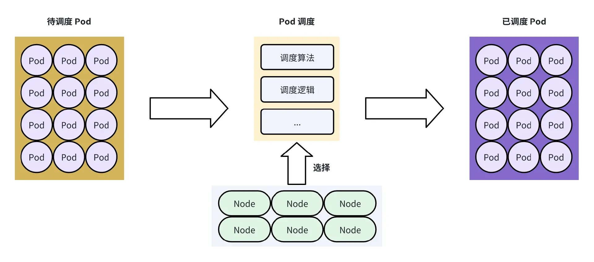
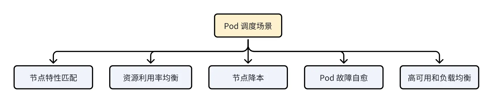

Kubernetes 有 5 大核心组件：kube-apiserver、kube-controller-manager、kube-scheduler、kubelet、kube-proxy。这 5 大核心组件缺一不可，每个组件负责不同的功能。其中，kube-scheduler 主要用来负责 Pod 的调度。那么 Kubernetes 中 Pod 有哪些调度方法？Kubernetes 调度器又是什么，负责什么样的功能呢？

本章将会详细介绍 Pod 的调度方法及 Kubernetes 调度器的核心内容。

## Kubernetes 中的 Pod 调度方法

Kubernetes 调度器用来调度 Kubernetes 集群中的 Pod。其实，在 Kubernetes 中 Pod 的调度方式有很多，其中调度器是最主要的 Pod 调度方式。本节课，我来详细给你介绍 Kubernetes 中 Pod 的调度方法。

### 什么是 Pod 调度？

在 Kubernetes 中，Pod 调度，指的是通过一系列的调度算法、调度逻辑，最终决定将 Pod 调度到哪个节点运行。

假设你创建一个 Deployment 资源，副本数是 100，那么这时候，Kubernetes 集群中就会新增 100 个 待调度的 Pod，Pod 状态为 Pending。这时候，kube-scheduler 调度器会根据 Pod 的 Spec 定义、集群中当前节点列表及节点资源信息，根据配置的调度插件（每个插件实现一类调度策略/算法），从这些 Node 列表中，选择出最适合调度 Pod 的节点，并将 Pod 调度到该节点上（设置 Pod 的 spec.nodeName字段值为节点的名字即可）。之后，该节点的 kubelet 就会根据 Pod 的 Spec 定义在几点上启动 Pod。

### 为什么要实现 Pod 调度？

一个 Kubernetes 集群中，包括很多个 Node 节点，v1.24 及以上的版本，支持多达 5000 个 Node。这些 Node 存在着或多或少的差异，例如：

1. **机型不同、配置不同：**例如有些节点可能是 16C256G，有的节点可能是 32C512G；
2. **机器部署的环境不同：**不同的节点环境会影响 Pod 的运行。例如：位于不同的机架、机房、是否支持 IPV6 等，会直接影响 Pod 的网络环境；
3. **机器上的可用资源量不同：**有的节点当前 CPU 或内存资源已经分配完成，有的节点空闲资源还很多；
4. **节点的可用性不同：**有的节点处在健康的状态，有的节点可能因为各种原因处在宕机、网络不可达、高负载的等状态；
5. **节点的设备资源不同：**有的节点只有 CPU，而有的节点可能会有 GPU 卡。

上面这些异同，会直接影响到 Pod 在这些节点上能否成功运行，以及能否稳定的运行。

此外，企业为了降本增效，期望整个集群的资源利用率处在一个较高的水位，但同时整个集群的 Pod 、节点等资源又能够稳定运行，处在一个健康的水位：

1. **Pod 稳定运行：**Pod 能够稳定运行和调度；
2. **高资源利用率：**在保证 Pod 稳定运行的前提下，尽可能提高整个集群的资源利用率。集群的资源利用率越高，企业的成本越低，因为可以将空闲的节点退掉，或者减少机器的采购数量。

Pod 稳定运行和高资源利用率，在资源利用率达到一定阈值之后，二者往往呈现出一种互斥的关系：

因为节点/集群资源利用率越高，意味着节点/集群的负载越高，节点负载过高，会影响 Pod 的稳定运行，因为 Pod 中的进程可能因为高负载导致无法调度或延时调度，这就会导致一些请求超时失败，验证的甚至会导致机器宕机。

在提高集群资源利用率的过程中， 提高 Pod 一个有效的解决办法时，将负载均衡到所有节点，避免单节点负载过高。。这就需要，Pod 在调度的时候，能够根据 Pod 数量、Pod 过往的 CPU 和内存利用率、节点的负载和数量等数据，将 Pod 调度到空闲的节点上，以分担其他节点的压力。

另外，在降本场景下，我们还希望能够在节点负载达到某个阈值之前（根据过往经验，在节点负载在 40% ～ 45% 以下时，其上的 Pod 绝大部分情况下可以稳定运行不受影响），尽可能将 Pod 调度到节点上，以空出其他节点，从而销毁空闲节点，从而节省企业成本。这也需要 Pod 在调度的时候，能够尽量将 Pod 调度到一个节点上。

另外，在一个节点上的 Pod 因为节点故障而异常、或者 Panic 退出之后，Kubernetes 也需要将 Pod 调度到其他健康的节点上，并启动。这种自愈能力，也是 Kubernetes 如此受欢迎的一个重要原因。

另外，在很多时候，我们为了实现应用的高可用，往往需要应用多副本部署，并且为了尽可能提高容灾级别，需要尽可能将这些应用实例打散在不同的节点、机架、机房、园区甚至地域进行部署。要实现 Pod 的打散部署，也需要调度 Pod。

这些调度场景总结如下：

上面的场景是在将应用部署到 Kubernetes 集群中，面临的最常见、最核心的诉求，这些诉求的解决，依赖于 Pod 调度。

所以，在 Kubernetes 中，Pod 调度是非常核心、非常重要的一个能力，也是企业在使用 Kubernetes 中，最刚需、最频繁需要二开的一个能力。

### Kubernetes 调度 Pod 的方式有哪些？

Kubernetes 提供了大量的调度机制，用来调度一个 Pod。在 Kubernetes 开发、运维的工作中，我们有必要了解下所有这些 Pod 调度方法。

总的来说，Pod 调度方法如下图所示：

上图罗列了 Kubernets 中的各个调度方法。其中绝大部分调度方法是在 kube-scheduler 中，以调度插件的形式实现的，例如绿色部分的调度方法。

另外，Kubernetes 还支持调度器扩展，支持 以下 3 种调度器扩展方式：自定义调度器、Scheduler Extender、Scheduling Framework 这 3 种调度器扩展方式，后文会详细介绍，这里不再介绍。

此外，Kubernetes 中的一些内置资源也会创建 Pod。创建出来的 Pod 最终是由 Kubernetes 调度器完成调度的。但由这些内资资源根据某种策略创建出来的 Pod，也可以理解我是 Pod 调度的一种。当前有以下内置资源支持创建 Pod，不同资源创建 Pod 的方式不同：

1. **DaemonSet：**会在 Kubernetes 集群中的所有节点上创建 Pod；
2. **Deployment/StatefulSet/ReplicaSet：**会创建指定副本数的 Pod，并始终确保 Pod 副本数为期望的个数；
3. **CronJob：**会根据 spec.schedule指定的 Cron 格式的字符串（例如：*/5 * * * * 说明每 5 分钟执行一次），来周期性的创建 Pod；
4. **Job：**用于一次性常见指定数量的 Pod。Pod 完成后，Job 会记录成功或失败的状态。

上面列举了很多 Pod 调度方法，这些方法在本套课程中会一一详细介绍。这里，列出来，供你总结性学习。

## Kubernetes 调度器简介

上面我们列举了很多 Pod 的调度方法，其中一大半的方法是由 Kubernetes 调度器来完成的。Kubernetes 调度器指的是 [kube-scheduler](https://github.com/kubernetes/kubernetes/tree/v1.31.1/cmd/kube-scheduler) 组件。

kube-scheduler 是 Kubernetes 的默认调度器，负责根据一系列可配置的策略和算法将 Pods 分配到最合适运行的节点上。

## Kubernetes 调度器的演进历史

为了让你更为完整的了解 Kubernetes 调度器。本小节，我来给你介绍下 Kubernetes 调度器的演进历史。Kubernetes 调度器的演进时间线如下图所示：

通过上述 Kubernetes 调度器演进时间线，可以知道从 2020 年 Scheduling Framework 特性发布以来，调度器的架构基本已经趋于稳定。调度器近年来也加强了 AI 场景和异构资源的调度支持，并且越来越关注于调度器性能优化、指标监控、调度器测试等能力的构建。

在整个调度器的演进历史中，每个版本都会对调度器进行一些或小或大的变更，这些变更主要聚焦于以下几点：

- Bug 修复、新功能添加；
- 调度性能优化、调度器可观测性提升；
- 新的调度插件/算法支持；
- 调度器相关特性版本升级；
- 目录结构调整、代码结构调整、代码优化；
- 命令行 Flag 弃用、新增、变更等；
- ...

## Pod 调度器流程概览

kube-scheduler 在启动后会通过 List-Watch 的方式，监听来自 kube-apiseraver 的 Pod、Node、PV、PVC 等资源的变更事件。

会将 Pod 变更事件放在 Scheduling Queue（调度队列）中。 Scheduling Cycle（调度循环）会不断地从Scheduling Queue 中 POP 带调度的 Pod，执行调度流程。

会将 Node、Pod、PV、PVC 等资源，缓存在 Cache 中，缓存在 Cache 中的信息是经过加工的信息。在Scheduling Cycle 中会被直接使用，以提高调度性能。

主循环从队列 POP 出一个 Pod 进入 Scheduling Cycle，在这里依次执行预过滤、打分等插件逻辑，结合 Cache 中的资源快照挑选可行节点。如果没有节点满足需求，则走 Preemption 分支尝试抢占低优先级 Pod。若仍失败，则把当前 Pod 标记为不可调度并回到队列等待下次机会。

一旦确认“Schedulable”，调度器进入 Binding Cycle，将所选节点写回 Pod.spec.nodeName 并调用 Bind 扩展或直接向 apiserver 发起 Bind 请求。绑定成功后，调度器的任务告一段落，Pod 对象被标记为已绑定，接下来由目标节点上的 kubelet 接管，完成镜像拉取、容器创建等运行阶段。

整个流程依靠事件驱动、缓存快照和多阶段插件体系实现高吞吐与实时性，并通过重回队列、抢占等机制保证在资源紧张时仍能尽量满足调度需求。

## Kubernetes 调度器的扩展方式

在企业的生产集群中，通常都会对调度器进行轻度或深度的定制或扩展，那么调度器有哪些扩展方式呢？通常我们可以通过以下 3 种方式来扩展 Kubernetes 调度器：

上面 3 种调度器扩展方法中，Scheduler Extender 和 Scheduling Framework 2 种扩展方式，是 Kubernetes 调度器自身提供的扩展机制，也是企业常使用的方式。在调度器没有支持 Scheduling Framework 扩展方式之前，各大公有云厂商，很多都采用了 Scheduler Extender 调度器扩展方式。但在社区推出了 Scheduling Framework 扩展范式之后，越来越多的厂商选择使用 Scheduling Framework 方式来扩展调度器。

### 自定义调度器

自定义调度器指的是开发一个新的调度器组件来调度Pod。自定义调度器的开发方式多种多样，例如：可以直接基于 kue-scheduler 魔改一套，也可以使用 Scheduling Framework 开发一个新的调度器。

不建议直接基于 kube-scheduler 魔改一个新的调度器作为自定义调度器，因为魔改的 kube-scheduler 后期很难跟 Kubernetes 项目的 kube-scheduler 组件在代码、特性、架构等方面保持一致。

#### 自定义调度器部署方式

根据自定义调度器的部署方式又分为以下2种：

1. 默认调度器：也即新的调度器组件替换掉kube-scheduler，集群中只有一个调度器组件在运行；
2. 多调度器：多调度器指的是 Kubernetes 集群中，同时部署 2 个及以上的调度器组件来调度 Pod，不同调度器调度分配给它的 Pod。例如：同时部署kube-sheduler和新的调度器组件。这些自定义调度器只会调度 Pod .spec.schedulerName 字段值为自己名字的 Pod。这里需要注意，多调度器场景下，也要设置默认的调度器。否则，一个 Pod 如何没有指定 .spec.schedulerName，那么这个 Pod 会一直处在 Pending 状态，无法得到调度，这不是我们期望看到的状态。所以，我们需要给 Pod 设置一个默认的调度器。

#### 自定义调度器架构

在开发自定义调度器时，有以下4种常见的架构设计方式：

1. **单体式调度器：**使用复杂的调度算法结合集群的全局信息，计算出高质量的放置点，不过延迟较高。如 Google 的 Borg， 开源的 Kubernetes 调度器；
2. **两级调度器：**通过将资源调度和作业调度分离，解决单体式调度器的局限性。两级调度器采用**悲观并发**的模型实现多调度器并发调度，允许根据特定的应用做不同的作业调度逻辑，且同时保持了不同作业之间共享集群资源的特性，可是无法实现高优先级应用的抢占。具有代表性的系统是 Apache Mesos 和 Hadoop YARN。
3. **共享状态调度器：**通过半分布式的方式来解决单体调度器和两级调度器的局限性，多个实例间采用**乐观并发**的方式解决冲突：每个调度器都拥有一份集群全量状态的副本，且调度器独立对集群状态副本进行更新，一旦本地的状态副本发生变化，整个集群的状态信息就会被更新。并引入一个**协调器**来解决冲突。具有代表性的系统是 Google 的 Omega， 微软的 Apollo， 字节跳动的 Godel。
4. **全分布式调度器：**多个调度器实例，各自使用较为简单的调度算法以实现针对大规模的高吞吐、低延迟并行任务的放置。与两级调度调度框架不同的是，每个调度器并没有负责的分区。作业可以提交给任意的调度器，并且每个调度器可以将作业发送到集群中任何的节点上执行。该架构因为去掉了中心化的冲突解决，吞吐量相对较高；但因为是基于最少知识做出快速决策而设计，无法支持或承担复杂或特定应用的调度策略。代表性系统如加州大学的 Sparrow。
5. **混合调度器：**将工作负载分散到集中式和分布式组件上，对长时间运行的任务使用复杂算法，对短时间运行的任务则依赖于分布式布局。微软 Mercury 就采取了这种这种方案。

#### 基于共享状态的双调度器

集群中同时存在两个调度器，一个负责调度在线业务，一个负责调度离线作业。阿里 Sigma + Fuxi， 腾讯 Caelus 调度器均类似该方案。在具体实现上，以腾讯 Caelus 为例：

1. kube-scheduler: K8s 原生调度器，负责在线业务调度
2. mg-scheduler: 自研 Batch 调度器，负责离线作业调度
3. coordinator: 协调器，负责在离线调度器冲突时的仲裁

#### 基于共享状态的统一调度器

以字节跳动的 Godel 调度器为例：

#### 自定义调度器优缺点

自定义调度器有优点，也有缺点。整体来说缺点大于优点，其优缺点如下：

优点

1. 可以突破原生 Scheduler 的单体架构限制，通过架构扩展进一步提升性能；
2. 可以完全定制，可扩展性强。

缺点

1. 研发和维护成本高，社区的新功能或插件可能难以复用；
2. Kubernetes 版本升级时，可能存在兼容性风险；
3. 纯自研，用户和开发者的熟悉度与接受程度相对较低。

### Scheduler Extender 调度器扩展

Scheduler Extender 是早期的 Scheduler 扩展方式，本质上是一种 Webhook：Scheduler 在一些特定的扩展点，对 Extender 组件发起 RPC 调用，获取调度策略的结果。

可以通过 Scheduler Extender 的方式，在原生 Scheduler 的基础上，实现 Gang/Binpack/拓扑感知调度/GPU 共享调度等功能。

使用 Scheduler Extender 的方式扩展调度器，优点是可以以对 kube-scheduler 代码无侵入的方式来扩展自定义的调度策略，这种方式维护成本相较于自定义调度器，维护成本较低。但这种方法也有缺点，主要缺点如下：

1. **性能差：**通过 RPC 方式调用，且引入 JSON 编解码开销，性能远低于本地函数调用，对调度器性能影响较大；
2. **可扩展性差：**
3. 可扩展点有限，只有 Filter/Priority/Bind/Permit 几个阶段；
4. 可扩展的位置固定，只能在默认调度策略全部执行完后调用。
5. **无法共享 Cache：**Extender 无法共享 Scheduler 的 Cache， 如果 RPC 调用的参数无法满足 Extender 的需求，需要自行与 kube-apiserver 通信，并额外建立 Cache。

### Scheduling Framework 方式扩展

因为 Scheduler Extender 调度器扩展方式有一些缺点，所以 Kubernetes 社区开发出了一种新的调度器扩展方式：Scheduling Framework。Scheduling Framework 在 v1.15 版本 Alpha 发布，在 v1.19 版本 GA。，是当前 Kubernetes 社区推荐的一种扩展方式，已经被大量一线企业采用。 

Scheduling Framework 机制在原有的调度流程中定义了丰富扩展点接口，可以通过实现扩展点所定义的接口来实现插件，将插件注册到扩展点。Scheduling Framework 在执行调度流程时，运行到相应的扩展点时，会调用注册的插件，影响调度决策的结果。因此，开发者可以通过实现一系列 Plugin， 支持我们对调度的扩展需求。

#### Multi Scheduling Profiles 特性支持

随着 Kubernetes 调度器扩展能力的演进，在 v1.18 版本，Kubernetes 发布了处于 Alpha 阶段（ v1.19 Beta，v1.22 GA）的 Multi Scheduling Profiles 扩展能力。该特性使得 kube-scheduler 可以实现对于不同 Workload 的差异化调度策略支持，比如：

1. 在线业务 Pod 可能需要经过 Spread 策略打散；
2. 离线作业 Pod 可能需要经过 Gang/Binpack 等策略。

使用 Multi Scheduling Profiles 特性也很简单，只需要在 KubeSchedulerConfiguration 配置文件中定义一系列 Profile， 每个 Profile 拥有特定的名称，并支持配置一系列 Plugin 组合。之后，在 Pod 定义的 .spec.schedulerName 字段，引用上述某个 Profile 的名称即可。kube-scheduler 在调度该 Pod 的过程中，只会执行 Profile 中指定的插件。

#### Scheduling Framework 优缺点

使用 Scheduling Framework 来扩展调度器也有一些优缺点，整体来说是优点大于缺点。优缺点如下：

优点

1. 标准化：相比纯自研调度器，用户和开发者对原生调度器的熟悉程度和接受程度更高；
2. 可扩展性好：良好的插件机制，且可扩展点多，能够满足各种定制化的需求；
3. 性能：相比 Extender 模式，拥有较好的性能。

缺点

仍然为单实例运行模式，性能可能比自研共享状态架构的调度器差。

## 总结

Kubernetes 集群拥有多种调度手段以决定 Pod 落到哪台节点上运行，其中最核心的是由 kube-scheduler 承担的统一调度流程。

Pod 为什么需要调度？原因来自节点硬件、资源利用率、可用性及拓扑差异等多维度差异，以及企业对“高资源利用率”与“业务稳定”之间平衡的追求。

随着集群规模与业务类型日益多样，社区为调度器提供了三条主要扩展路径：完全自研的“自定义调度器”、通过 Webhook 调用的 Scheduler Extender，以及当下最被推荐的 Scheduling Framework 插件体系。

在框架模式下，开发者可在多个扩展点插入自研插件，并借助 Multi Scheduling Profiles 针对不同工作负载组合不同插件，实现诸如打散、Binpack、Gang 等策略。

对比来看，自定义调度器灵活却维护成本高，Extender 侵入小但性能与扩展点受限，而 Scheduling Framework 在标准、性能与可扩展性之间取得了较好平衡，因此逐渐成为企业定制调度的主流选择。