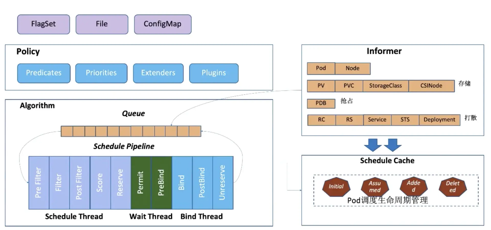
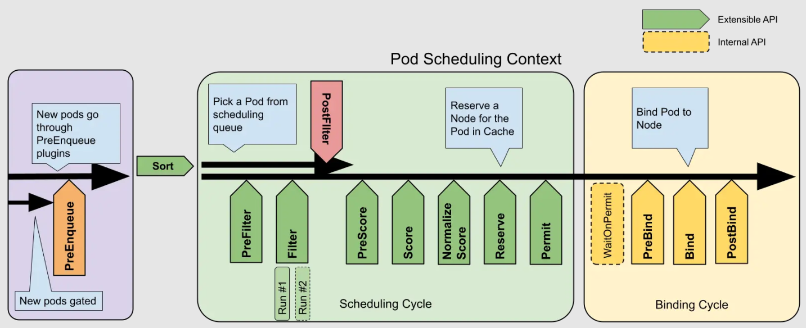
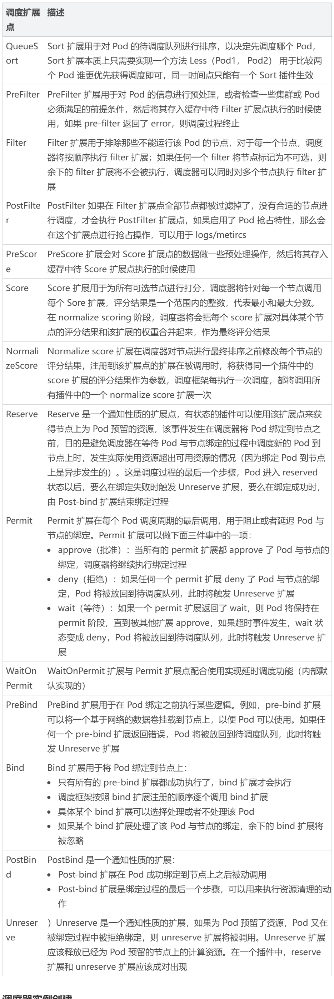
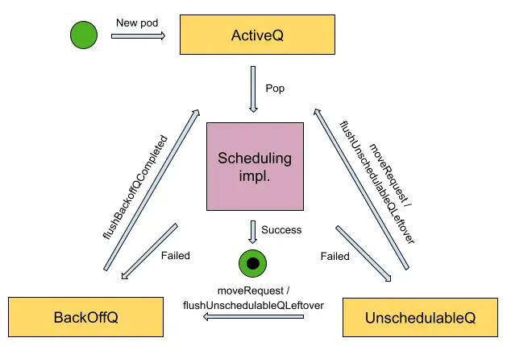
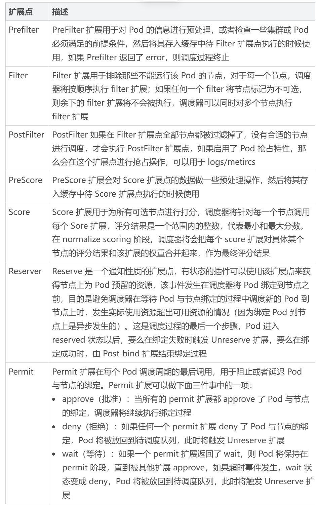

上一节课面，我们学习了kube-scheduler应用具体是如何构建的。本小节，我们就来看下kube-scheduler的调度原理。

kube-scheduler源码很多，如何才能把kube-scheduler讲通、讲透是一个很有挑战性的工作。这里，我通过自顶向下的讲解逻辑，即先给你介绍整个调度原理，再根据调度顺序，介绍调度原理中，每个关键点的代码实现。

通过介绍调度原理，及其关联的代码实现，既让我们能够掌握kube-scheduler的核心实现，又不至于，让我们读完代码后，串联不了整个调度逻辑。

## 启动调度流程

先来，从最上层视角，来看下 kube-scheduler 具体是如何启动调度流程的。整个kube-scheduler核心调度逻辑通过sched.Run(ctx)来启动，sched.Run()代码如下：

```go
// Run begins watching and scheduling. It starts scheduling and blocked until the context is done.
func (sched *Scheduler) Run(ctx context.Context) {
    logger := klog.FromContext(ctx)
    // 启动调度队列，调度队列会 Watch kube-apiserver，并存储待调度的 Pod
    sched.SchedulingQueue.Run(logger)


    // We need to start scheduleOne loop in a dedicated goroutine,
    // because scheduleOne function hangs on getting the next item
    // from the SchedulingQueue.
    // If there are no new pods to schedule, it will be hanging there
    // and if done in this goroutine it will be blocking closing
    // SchedulingQueue, in effect causing a deadlock on shutdown.
    // 不断轮训，执行 sched.scheduleOne 函数，sched.scheduleOne 函数会消费调度队列中待调度的 Pod，
    // 执行调度流程，完成 Pod 的调度。
    go wait.UntilWithContext(ctx, sched.scheduleOne, 0)                    
    <-ctx.Done()
    // 清理并释放资源
    sched.SchedulingQueue.Close()
}
```

## kube-scheduler 调度模型

上一小节，我简单介绍了 kube-scheduler 的调度入口函数（调度流程的 main 函数），之后，我们便可以从"main"函数开始，逐步往下走读代码，从而学习整个 kube-scheduler 的调度流程。

但往下跟读代码之前，我们有必要先来了解下 kube-scheduler 的调度模型。调度模型图如下：



kube-scheduler的调度原理如上图所示，主要分为 3 大部分：

1. **Policy：**Scheduler 的调度策略启动配置目前支持三种方式，配置文件 / 命令行参数 / ConfigMap。调度策略可以配置指定调度主流程中要用哪些过滤器 （Predicates）、打分器 （Priorities） 、外部扩展的调度器 （Extenders），以及最新支持的 SchedulerFramwork 的自定义扩展点 （Plugins）；
2. **Informer：**Scheduler 在启动的时候通过 K8s 的 informer 机制以 List+Watch 从 kube-apiserver 获取调度需要的数据例如：Pods、Nodes、Persistant Volume（PV）， Persistant Volume Claim（PVC） 等等，并将这些数据做一定的预处理，作为调度器的的 Cache
3. **调度流水线：**通过 Informer 将需要调度的 Pod 插入 Queue 中，Pipeline 会循环从 Queue Pop 等待调度的 Pod 放入 Pipeline 执行。调度流水线 （Schedule Pipeline） 主要有三个阶段：Scheduler Thread，Wait Thread，Bind Thread。
4. **Scheduler Thread 阶段**： 从如上的架构图可以看到 Schduler Thread 会经历 Pre Filter -> Filter -> Post Filter-> Score -> Reserve，可以简单理解为 Filter -> Score -> Reserve。Filter 阶段用于选择符合 Pod Spec 描述的 Nodes；Score 阶段用于从 Filter 过后的 Nodes 进行打分和排序；Reserve 阶段将 Pod 跟排序后的最优 Node 的 NodeCache 中，表示这个 Pod 已经分配到这个 Node 上， 让下一个等待调度的 Pod 对这个 Node 进行 Filter 和 Score 的时候能看到刚才分配的 Pod
5. **Wait Thread 阶段：** 这个阶段可以用来等待 Pod 关联的资源的 Ready 等待，例如等待 PVC 的 PV 创建成功，或者 Gang 调度中等待关联的 Pod 调度成功等；
6. **Bind Thread 阶段：** 用于将 Pod 和 Node 的关联持久化 Kube APIServer；

整个调度流水线只有在 Scheduler Thread 阶段是串行的一个 Pod 一个 Pod 的进行调度，在 Wait 和 Bind 阶段 Pod 都是异步并行执行。

## Scheduling Framework 调度框架

在真实的企业开发中，业务对 kube-scheduler 的调度需求，各种各样。为了能够灵活的支持业务多样性的调度需求，又最小化对 kube-scheduler 调度实现，kube-scheduler 从 v1.15 版本开始，引入了一种非常灵活的调度框架。

调度框架是面向 Kubernetes 调度器的一种插件架构， 它由一组直接编译到调度程序中的“插件” API 组成。 这些 API 允许大多数调度功能以插件的形式实现，同时使调度“核心”保持简单且可维护。 请参考[调度框架的设计提案](https://github.com/kubernetes/enhancements/blob/master/keps/sig-scheduling/624-scheduling-framework/README.md) 获取框架设计的更多技术信息。

调度框架定义了一些扩展点。调度器插件注册后在一个或多个扩展点处被调用。 这些插件中的一些可以改变调度决策，而另一些仅用于提供信息。每个插件支持不同的调度扩展点，一个插件可以在多个扩展点处注册，以执行更复杂或有状态的任务。

每次调度一个 Pod 的尝试都分为两个阶段，即**调度周期**和**绑定周期。**调度周期为 Pod 选择一个节点，绑定周期将该决策应用于集群。 调度周期和绑定周期一起被称为“调度上下文”。调度周期是串行运行的，而绑定周期可能是同时运行的。如果确定 Pod 不可调度或者存在内部错误，则可以终止调度周期或绑定周期。 Pod 将返回队列并重试。

下图显示了一个 Pod 的调度上下文以及调度框架公开的扩展点。 在此图片中，“过滤器”等同于“断言”，“评分”相当于“优先级函数”。



调度扩展点功能描述如下：



## 调度器实例创建

kube-scheduler的调度逻辑的运行依托于[Scheduler](https://github.com/kubernetes/kubernetes/blob/v1.28.4/pkg/scheduler/scheduler.go#L63)结构体类型的实例，Scheduler结构体中包含了调度逻辑运行时需要的各类数据和方法。Scheduler结构体类型的实例创建逻辑如下（代码释义见注释）：

```go
// 位于文件 cmd/kube-scheduler/app/server.go 中
func Setup(ctx context.Context, opts *options.Options, outOfTreeRegistryOptions ...Option) (*schedulerserverconfig.CompletedConfig, *scheduler.Scheduler, error) {
    // 设置默认 KubeSchedulerConfiguration 配置。注意：这里只是设置一个默认值，后面 opts.ComponentConfig 还会根据具体的配置文件进行重新设置。
    if cfg, err := latest.Default(); err != nil {
        return nil, nil, err
    } else {
        opts.ComponentConfig = cfg
    }


    // 检查 *options.Options 各字段的值合法。提前校验，降低出错成本。
    if errs := opts.Validate(); len(errs) > 0 {
        return nil, nil, utilerrors.NewAggregate(errs)
    }


    // 将 *options.Options 中的值（其实就是命令行选项设置的值）转换为 *schedulerappconfig.Config 类型的变量，*schedulerappconfig.Config 是启动 kube-scheduler 应用需要的配置文件。
    // 注意：opts.Config 中会根据是否设置 `--config` 参数来决定是否从 --config 指定的配置文件中加载 KubeSchedulerConfiguration 类型的配置。
    // SharedInformerFactory 和 DynamicSharedInformerFactory 也是在opts.Config 中被创建的。
    c, err := opts.Config(ctx)
    if err != nil {
        return nil, nil, err
    }


    // 补全需要的字段
    cc := c.Complete()


    // 初始化一个 runtime.Registry 类型的变量，用来保存所有的Out-Of-Tree 插件（其实就是自定义调度插件），后面会详细介绍。
    outOfTreeRegistry := make(runtime.Registry)
    for _, option := range outOfTreeRegistryOptions {
        if err := option(outOfTreeRegistry); err != nil {
            return nil, nil, err
        }
    }


    recorderFactory := getRecorderFactory(&cc)
    completedProfiles := make([]kubeschedulerconfig.KubeSchedulerProfile, 0)
    // 创建调度器实例，该实例用来运行所有的 kube-scheduler 调度逻辑。
    sched, err := scheduler.New(ctx,
                                cc.Client,
                                cc.InformerFactory, // SharedInformerFactory类型的Informer，用于跟踪已知 API 组、API 版本资源对象的变化
                                cc.DynInformerFactory, // DynamicSharedInformerFactory 类型的Informer，为动态客户端提供对共享informer和lister的访问
                                recorderFactory,
                                // 使用选项模式，来对 Sheduler 对象进行配置
                                scheduler.WithComponentConfigVersion(cc.ComponentConfig.TypeMeta.APIVersion), // 设置 KubeSchedulerConfiguration 的 APIVersion，无实际功能作用
                                scheduler.WithKubeConfig(cc.KubeConfig), 
                                scheduler.WithProfiles(cc.ComponentConfig.Profiles...), // 设置自定义的调度策略
                                scheduler.WithPercentageOfNodesToScore(cc.ComponentConfig.PercentageOfNodesToScore), 
                                scheduler.WithFrameworkOutOfTreeRegistry(outOfTreeRegistry),
                                scheduler.WithPodMaxBackoffSeconds(cc.ComponentConfig.PodMaxBackoffSeconds),
                                scheduler.WithPodInitialBackoffSeconds(cc.ComponentConfig.PodInitialBackoffSeconds),
                                scheduler.WithPodMaxInUnschedulablePodsDuration(cc.PodMaxInUnschedulablePodsDuration),
                                scheduler.WithExtenders(cc.ComponentConfig.Extenders...),
                                scheduler.WithParallelism(cc.ComponentConfig.Parallelism),
                                scheduler.WithBuildFrameworkCapturer(func(profile kubeschedulerconfig.KubeSchedulerProfile) {
                                    // Profiles are processed during Framework instantiation to set default plugins and configurations. Capturing them for logging
                                    completedProfiles = append(completedProfiles, profile)
                                }),
                               )
    if err != nil {
        return nil, nil, err
    }
    if err := options.LogOrWriteConfig(klog.FromContext(ctx), opts.WriteConfigTo, &cc.ComponentConfig, completedProfiles); err != nil {
        return nil, nil, err
    }


    return &cc, sched, nil
}
```

上述代码使用了多个scheduler.WithXXX来对 Scheduler 进行设置，具体支持的设置如下：

```go
type schedulerOptions struct {
    // KubeSchedulerConfiguration 的 APIVersion，例如：kubescheduler.config.k8s.io/v1，没有实际作用。
    componentConfigVersion string
    // 访问 kube-apiserver 的 REST 客户端
    kubeConfig             *restclient.Config
    // Overridden by profile level percentageOfNodesToScore if set in v1.
    // 节点得分所使用的节点百分比，如果在 v1 中设置了 profile 级别的 percentageOfNodesToScore，则会被覆盖
    percentageOfNodesToScore          int32
    // Pod 的初始退避时间
    podInitialBackoffSeconds          int64
    // Pod 的最大退避时间
    podMaxBackoffSeconds              int64
    // 最大不可调度 Pod 的持续时间
    podMaxInUnschedulablePodsDuration time.Duration
    // Contains out-of-tree plugins to be merged with the in-tree registry.
    // 包含了外部插件，用于与内部注册表进行合并
    frameworkOutOfTreeRegistry frameworkruntime.Registry
    // 调度器的配置文件
    profiles                   []schedulerapi.KubeSchedulerProfile
    // 调度器的扩展程序
    extenders                  []schedulerapi.Extender
    // 用于捕获构建调度框架的函数
    frameworkCapturer          FrameworkCapturer
    // 调度器的并行度
    parallelism                int32
    // 表示是否应用默认配置文件
    applyDefaultProfile        bool
}
```

另外，上述这些配置项，我们都可以通过KubeSchedulerConfiguration类型的配置文件来进行配置。KubeSchedulerConfiguration可配置的字段如下：

```go
type KubeSchedulerConfiguration struct {
    // TypeMeta包含API版本和类型。在kube-scheduler中，从版本化的KubeSchedulerConfiguration类型转换为此内部类型后，
    // 我们将APIVersion字段设置为我们转换的类型的scheme组/版本。这是在cmd/kube-scheduler中的两个地方完成的：
    // (1) 从文件加载配置时，(2) 生成默认配置。根据此字段中设置的版本化类型，我们做出决策；例如
    // (1) 在验证期间检查已移除插件的使用情况，(2) 将配置写入文件，(3) 初始化调度器。
    metav1.TypeMeta


    // Parallelism定义了调度Pod的算法中的并行度。必须大于0。默认值为16。
    Parallelism int32


    // LeaderElection定义了领导者选举客户端的配置。
    LeaderElection componentbaseconfig.LeaderElectionConfiguration


    // ClientConnection指定了代理服务器在与apiserver通信时使用的kubeconfig文件和客户端连接设置。
    ClientConnection componentbaseconfig.ClientConnectionConfiguration
    // HealthzBindAddress是健康检查服务器要提供服务的IP地址和端口。
    HealthzBindAddress string
    // MetricsBindAddress是度量服务器要提供服务的IP地址和端口。
    MetricsBindAddress string


    // DebuggingConfiguration包含了与调试相关功能的配置
    // TODO: 我们可能希望将其设置为子结构，如Debugging componentbaseconfig.DebuggingConfiguration
    componentbaseconfig.DebuggingConfiguration


    // PercentageOfNodesToScore 允许调度器在找到一定数量的可调度节点之后就停止继续寻找可调度节点。
    // 这有助于提高调度器的性能。调度器始终尝试找到至少"minFeasibleNodesToFind"个适合的节点，无论此标志的值如何。
    // 例如：如果集群大小为500个节点，此标志的值为30，则一旦找到150个适合的节点，调度器就停止继续查找更多适合的节点。
    // 当值为0时，将对节点的默认百分比（根据集群大小为5%--50%）进行评分。它会被profile级别的PercentageOfNodesToScore覆盖。
    PercentageOfNodesToScore *int32


    // PodInitialBackoffSeconds是不可调度Pod的初始退避时间。
    // 如果指定了，必须大于0。如果此值为null，则将使用默认值（1秒）。
    PodInitialBackoffSeconds int64


    // PodMaxBackoffSeconds是不可调度Pod的最大退避时间。
    // 如果指定了，必须大于或等于podInitialBackoffSeconds。如果此值为null，则将使用默认值（10秒）。
    PodMaxBackoffSeconds int64


    // Profiles是kube-scheduler支持的调度配置文件。Pod可以通过设置其关联的调度器名称来选择在特定配置文件下调度。
    // 如果Pod没有指定任何调度器名称，并且此处存在"default-scheduler"配置文件，则将使用"default-scheduler"配置文件进行调度。
    Profiles []KubeSchedulerProfile


    // Extenders是调度器扩展程序的列表，每个扩展程序都包含了与扩展程序通信的值。这些扩展程序被所有调度器配置文件共享。
    Extenders []Extender


    // DelayCacheUntilActive指定何时开始缓存。
    // 当 DelayCacheUntilActive 为 true 时，调度器在启动时不会立即填充 informer 缓存，而会等待成为领导者后再开始填充缓存。
    // 当 DelayCacheUntilActive 为 false 时，调度器在启动时会立即开始填充 informer 缓存。
    DelayCacheUntilActive bools
}
```

Setup函数中，最终通过scheduler.New函数来创建一个*Sheduler实例，其代码如下（代码解析见注释）：

```go
// New returns a Scheduler
func New(ctx context.Context,
         client clientset.Interface,
         informerFactory informers.SharedInformerFactory,
         dynInformerFactory dynamicinformer.DynamicSharedInformerFactory,
         recorderFactory profile.RecorderFactory,
         opts ...Option) (*Scheduler, error) {


    logger := klog.FromContext(ctx)
    stopEverything := ctx.Done()


    options := defaultSchedulerOptions
    for _, opt := range opts {
        opt(&options)
    }
    // 设置默认的调度策略
    if options.applyDefaultProfile {
        var versionedCfg configv1.KubeSchedulerConfiguration
        scheme.Scheme.Default(&versionedCfg)
        cfg := schedulerapi.KubeSchedulerConfiguration{}
        if err := scheme.Scheme.Convert(&versionedCfg, &cfg, nil); err != nil {
            return nil, err
        }
        options.profiles = cfg.Profiles
    }


    // 创建一个In-Tree Registry用来保存 kube-scheduer 自带的调度插件，后面会详细介绍
    registry := frameworkplugins.NewInTreeRegistry()
    // 将In-Tree调度插件和Out-Of-Tree调度插件进行合并，后面会详细介绍
    if err := registry.Merge(options.frameworkOutOfTreeRegistry); err != nil {
        return nil, err
    }


    metrics.Register()


    // 构建 Extender 调度器插件，后面会详细介绍
    extenders, err := buildExtenders(logger, options.extenders, options.profiles)
    if err != nil {
        return nil, fmt.Errorf("couldn't build extenders: %w", err)
    }


    // 创建  Pod、Node 的 lister，用来 List & Watch Pod 和 Node 资源
    podLister := informerFactory.Core().V1().Pods().Lister()
    nodeLister := informerFactory.Core().V1().Nodes().Lister()


    snapshot := internalcache.NewEmptySnapshot()
    metricsRecorder := metrics.NewMetricsAsyncRecorder(1000, time.Second, stopEverything)


    // 根据调度器策略和调度插件，创建调度框架集合。每一个调度策略，都有一个调度框架。该调度框架负责Pod的调度。
    profiles, err := profile.NewMap(ctx, options.profiles, registry, recorderFactory,
                                    frameworkruntime.WithComponentConfigVersion(options.componentConfigVersion),
                                    frameworkruntime.WithClientSet(client),
                                    frameworkruntime.WithKubeConfig(options.kubeConfig),
                                    frameworkruntime.WithInformerFactory(informerFactory),
                                    frameworkruntime.WithSnapshotSharedLister(snapshot),
                                    frameworkruntime.WithCaptureProfile(frameworkruntime.CaptureProfile(options.frameworkCapturer)),
                                    frameworkruntime.WithParallelism(int(options.parallelism)),
                                    frameworkruntime.WithExtenders(extenders),
                                    frameworkruntime.WithMetricsRecorder(metricsRecorder),
                                   )
    if err != nil {
        return nil, fmt.Errorf("initializing profiles: %v", err)
    }


    if len(profiles) == 0 {
        return nil, errors.New("at least one profile is required")
    }


    preEnqueuePluginMap := make(map[string][]framework.PreEnqueuePlugin)
    queueingHintsPerProfile := make(internalqueue.QueueingHintMapPerProfile)
    for profileName, profile := range profiles {
        preEnqueuePluginMap[profileName] = profile.PreEnqueuePlugins()
        queueingHintsPerProfile[profileName] = buildQueueingHintMap(profile.EnqueueExtensions())
    }


    // 创建调度队列
    podQueue := internalqueue.NewSchedulingQueue(
        profiles[options.profiles[0].SchedulerName].QueueSortFunc(),
        informerFactory,
        internalqueue.WithPodInitialBackoffDuration(time.Duration(options.podInitialBackoffSeconds)*time.Second),
        internalqueue.WithPodMaxBackoffDuration(time.Duration(options.podMaxBackoffSeconds)*time.Second),
        internalqueue.WithPodLister(podLister),
        internalqueue.WithPodMaxInUnschedulablePodsDuration(options.podMaxInUnschedulablePodsDuration),
        internalqueue.WithPreEnqueuePluginMap(preEnqueuePluginMap),
        internalqueue.WithQueueingHintMapPerProfile(queueingHintsPerProfile),
        internalqueue.WithPluginMetricsSamplePercent(pluginMetricsSamplePercent),
        internalqueue.WithMetricsRecorder(*metricsRecorder),
    )


    for _, fwk := range profiles {
        fwk.SetPodNominator(podQueue)
    }
    
    // 创建缓存，主要用来缓存 Node、Pod等信息，用来提高调度性能
    schedulerCache := internalcache.New(ctx, durationToExpireAssumedPod)


    // Setup cache debugger.
    debugger := cachedebugger.New(nodeLister, podLister, schedulerCache, podQueue)
    debugger.ListenForSignal(ctx)


    sched := &Scheduler{
        Cache:                    schedulerCache,
        client:                   client,
        nodeInfoSnapshot:         snapshot,
        percentageOfNodesToScore: options.percentageOfNodesToScore,
        Extenders:                extenders,
        StopEverything:           stopEverything,
        SchedulingQueue:          podQueue,
        Profiles:                 profiles,
        logger:                   logger,
    }
    
    // 设置 NextPod 的具体实现
    sched.NextPod = podQueue.Pop
    // 设置 sched.SchedulePod 的实现为 sched.schedulePod
    // sched.schedulePod 具体用来调度一个Pod，后面会详细介绍
    sched.applyDefaultHandlers()


    // 添加 EventHandlers，根据 Pod、Node 资源的更新情况，将资源放入合适的Cache中。根据CSINode、CSIDriver、PersistentVolume等资源的更新状态将PreEnqueueCkeck中的Pod放到BackoffQueue、ActiveQueue。
    if err = addAllEventHandlers(sched, informerFactory, dynInformerFactory, unionedGVKs(queueingHintsPerProfile)); err != nil {
        return nil, fmt.Errorf("adding event handlers: %w", err)
    }


    return sched, nil
}
```

## 调度插件设置

kube-scheduler是通过一系列的调度插件最终完成 Pod 调度的。在启动kube-scheduler时，首先要加载调度插件。调度插件又分为in-tree 和 out-of-tree 2 种：

1. In-tree 插件（内建插件）：这些插件是作为 Kubernetes 核心组件的一部分直接编译和交付的。它们与 Kubernetes 的源代码一起维护，并与 Kubernetes 版本保持同步。这些插件以静态库形式打包到kube-scheduler二进制文件中，因此在使用时不需要单独安装和配置。一些常见的 in-tree 插件包括默认的调度算法、Packed Scheduling 等。
2. Out-of-tree 插件（外部插件）：这些插件是作为独立项目开发和维护的，它们与 Kubernetes 核心代码分开，并且可以单独部署和更新。本质上，out-of-tree 插件是基于 Kubernetes 的调度器扩展点进行开发的。这些插件以独立的二进制文件形式存在，并通过自定义的方式与 kube-scheduler 进行集成。为了使用 out-of-tree 插件，您需要单独安装和配置它们，并在 kube-scheduler 的配置中指定它们。

可以看到 in-tree 插件与 Kubernetes 的核心代码一起进行维护和发展，而 out-of-tree插件可以单独开发并以独立的二进制文件部署。因此 out-of-tree插件具有更大的灵活性，可以根据需求进行自定义和扩展，而 in-tree 插件受限于 Kubernetes 核心代码的功能和限制。对于版本升级in-tree插件与 Kubernetes 版本保持同步，而 out-of-tree 插件可以单独进行版本升级或兼容。一般开发都是采用out-of-tree 这个机制。

## 调度策略初始化

上面，kube-scheduler 加载并初始化了 Out-Of-Tree 插件和 In-Tree 插件。但还不能够进行调度。因为还没有初始化调度策略。调度策略，用来执行具体的调度逻辑。

kube-schedler在调度时，会选定一个调度策略，并使用该调度策略进行调度。同时，kube-scheduler也支持自定义调度策略。kube-scheduler支持以下 3 种调度策略：

1. Scheduler Extender：社区最初提供的方案是通过 Extender 的形式来扩展 scheduler。Extender 是外部服务，支持 Filter、Preempt、Prioritize 和 Bind 的扩展，scheduler 运行到相应阶段时，通过调用 Extender 注册的 webhook 来运行扩展的逻辑，影响调度流程中各阶段的决策结果；
2. Multiple schedulers：Scheduler 在 Kubernetes 集群中其实类似于一个特殊的 Controller，通过监听 Pod 和 Node 的信息，给 Pod 挑选最佳的节点，更新 Pod 的 spec.NodeName 的信息来将调度结果同步到节点。所以对于部分有特殊的调度需求的用户，有些开发者通过自研 Custom Scheduler 来完成以上的流程，然后通过和 default-scheduler 同时部署的方式，来支持自己特殊的调度需求。在Pod.Spec.SchedulerName字段中，可以设置该 Pod 的调度策略，默认为：default；
3. Scheduling Framework：Scheduling Framework 在原有的调度流程中， 定义了丰富扩展点接口，开发者可以通过实现扩展点所定义的接口来实现插件，将插件注册到扩展点。Scheduling Framework 在执行调度流程时，运行到相应的扩展点时，会调用用户注册的插件，影响调度决策的结果。通过这种方式来将用户的调度逻辑集成到 Scheduling Framework 中。

kube-scheduler源码分析中，只会涉及 Scheduler Extender 和 Scheduling Framework，因为 Multiple schedulers 中的 Custom Scheduler 实现已经不属于kube-scheduler代码了。

这里，我们来看下kube-scheduler是如何设置调度策略的。kube-scheduler调度策略的设置是在scheduler.New函数中设置的，相关代码段如下：

```go
func New(ctx context.Context,
         client clientset.Interface,
         informerFactory informers.SharedInformerFactory,
         dynInformerFactory dynamicinformer.DynamicSharedInformerFactory,
         recorderFactory profile.RecorderFactory,
         opts ...Option) (*Scheduler, error) {
    ...
    // applyDefaultProfile 值恒为 false，该代码分支不会运行
    if options.applyDefaultProfile {
        var versionedCfg configv1.KubeSchedulerConfiguration
        scheme.Scheme.Default(&versionedCfg)
        cfg := schedulerapi.KubeSchedulerConfiguration{}
        if err := scheme.Scheme.Convert(&versionedCfg, &cfg, nil); err != nil {
            return nil, err
        }
        options.profiles = cfg.Profiles
    }


    registry := frameworkplugins.NewInTreeRegistry()
    if err := registry.Merge(options.frameworkOutOfTreeRegistry); err != nil {
        return nil, err
    }


    metrics.Register()


    extenders, err := buildExtenders(logger, options.extenders, options.profiles)
    if err != nil {
        return nil, fmt.Errorf("couldn't build extenders: %w", err)
    }


    ...


    profiles, err := profile.NewMap(ctx, options.profiles, registry, recorderFactory,
                                    frameworkruntime.WithComponentConfigVersion(options.componentConfigVersion),
                                    frameworkruntime.WithClientSet(client),
                                    frameworkruntime.WithKubeConfig(options.kubeConfig),
                                    frameworkruntime.WithInformerFactory(informerFactory),
                                    frameworkruntime.WithSnapshotSharedLister(snapshot),
                                    frameworkruntime.WithCaptureProfile(frameworkruntime.CaptureProfile(options.frameworkCapturer)),
                                    frameworkruntime.WithParallelism(int(options.parallelism)),
                                    frameworkruntime.WithExtenders(extenders),
                                    frameworkruntime.WithMetricsRecorder(metricsRecorder),
                                   )
    if err != nil {
        return nil, fmt.Errorf("initializing profiles: %v", err)
    }


    if len(profiles) == 0 {
        return nil, errors.New("at least one profile is required")
    }
    preEnqueuePluginMap := make(map[string][]framework.PreEnqueuePlugin)
    queueingHintsPerProfile := make(internalqueue.QueueingHintMapPerProfile)
    for profileName, profile := range profiles {
        preEnqueuePluginMap[profileName] = profile.PreEnqueuePlugins()
        queueingHintsPerProfile[profileName] = buildQueueingHintMap(profile.EnqueueExtensions())
    }


    podQueue := internalqueue.NewSchedulingQueue(
        profiles[options.profiles[0].SchedulerName].QueueSortFunc(),
        informerFactory,
        internalqueue.WithPodInitialBackoffDuration(time.Duration(options.podInitialBackoffSeconds)*time.Second),
        internalqueue.WithPodMaxBackoffDuration(time.Duration(options.podMaxBackoffSeconds)*time.Second),
        internalqueue.WithPodLister(podLister),
        internalqueue.WithPodMaxInUnschedulablePodsDuration(options.podMaxInUnschedulablePodsDuration),
        internalqueue.WithPreEnqueuePluginMap(preEnqueuePluginMap),
        internalqueue.WithQueueingHintMapPerProfile(queueingHintsPerProfile),
        internalqueue.WithPluginMetricsSamplePercent(pluginMetricsSamplePercent),
        internalqueue.WithMetricsRecorder(*metricsRecorder),
    )


    for _, fwk := range profiles {
        fwk.SetPodNominator(podQueue)
    }
    
    ...
    
    sched := &Scheduler{
        ...
        Profiles:                 profiles,
        ...
    }
    ...
}
```

为了能够让你直观清晰的看到kube-scheduler初始化调度策略的流程，我仅列出了相关的代码段。

**首先，**根据options.applyDefaultProfile是否为true，来决定是否设置默认的调度策略。我们在Setup函数中调用scheduler.New函数时，传入了scheduler.WithProfiles(cc.ComponentConfig.Profiles...)配置，结合 WithProfiles的具体实现，可知 applyDefaultProfile值为false：

```go
func WithProfiles(p ...schedulerapi.KubeSchedulerProfile) Option {
    return func(o *schedulerOptions) {
        o.profiles = p
        o.applyDefaultProfile = false
    }
}
```

因为applyDefaultProfile值为false，所以options.profiles的值，其实就是KubeSchedulerConfiguration配置文件中Profiles部分所设置的调度策略。

**接着，**调用registry := frameworkplugins.NewInTreeRegistry()创建了调度插件注册表，注册表中，保存了所有的 in-tree 和 out-of-tree 调度插件。

**接着，**调用 buildExtenders来来构建 Extender 调度策略。buildExtenders调用方式如下：

```go
extenders, err := buildExtenders(logger, options.extenders, options.profiles)
if err != nil {
    return nil, fmt.Errorf("couldn't build extenders: %w", err)
}
```

options.extender是通过KubeSchedulerConfiguration配置文件中的字段来设置的（字段释义见注释）：

```go
type KubeSchedulerConfiguration struct {
    ...
    Extenders []Extender
    ...
}


type Extender struct {
    // URLPrefix是extender可用的URL前缀
    URLPrefix string
    // FilterVerb是过滤调用的动词，如果不支持则为空。当向extender发出过滤调用时，此动词将附加到URLPrefix。
    FilterVerb string
    // PreemptVerb是抢占调用的动词，如果不支持则为空。当向extender发出抢占调用时，此动词将附加到URLPrefix。
    PreemptVerb string
    // PrioritizeVerb是优先调用的动词，如果不支持则为空。当向extender发出优先调用时，此动词将附加到URLPrefix。
    PrioritizeVerb string
    // Prioritize调用生成的节点分数的数值乘数。
    // 权重应为正整数
    Weight int64
    // BindVerb是绑定调用的动词，如果不支持则为空。当向extender发出绑定调用时，此动词将附加到URLPrefix。
    // 如果此方法由extender实现，则由extender负责将Pod绑定到apiserver。只有一个extender可以实现此函数。
    BindVerb string
    // EnableHTTPS指定是否应使用https与extender通信
    EnableHTTPS bool
    // TLSConfig指定传输层安全配置
    TLSConfig *ExtenderTLSConfig
    // HTTPTimeout指定与extender的调用的超时持续时间。过滤超时会导致Pod的调度失败。优先超时将被忽略，k8s/其他extender的优先级将用于选择节点。
    HTTPTimeout metav1.Duration
    // NodeCacheCapable指定extender是否能够缓存节点信息，因此调度器应该只发送有关符合条件的节点的最小信息，假设extender已经缓存了集群中所有节点的完整详细信息
    NodeCacheCapable bool
    // ManagedResources是由此extender管理的扩展资源的列表。
    // - 如果Pod请求了此列表中至少一个扩展资源，则Pod将在过滤、优先和绑定（如果extender是绑定者）阶段发送到extender。如果为空或未指定，则所有Pod将发送到此extender。
    // - 如果资源的IgnoredByScheduler设置为true，kube-scheduler将跳过在谓词中检查该资源。
    // +optional
    ManagedResources []ExtenderManagedResource
    // Ignorable指定extender是否可忽略，即当extender返回错误或不可访问时，调度不应失败。
    Ignorable bool
}
```

可以看到 Extender 类型的调度器插件其实就是一个 HTTP 服务器，通过请求 HTTP 服务，来决定调度是否成功。kube-scheduler 支持设置多个 Extender 类型的调度插件。

buildExtenders函数会返回[]framework.Extender类型的变量，framework.Extender接口定义如下：

```go
type Extender interface {
    // Name returns a unique name that identifies the extender.
    Name() string


    // Filter based on extender-implemented predicate functions. The filtered list is
    // expected to be a subset of the supplied list.
    // The failedNodes and failedAndUnresolvableNodes optionally contains the list
    // of failed nodes and failure reasons, except nodes in the latter are
    // unresolvable.
    Filter(pod *v1.Pod, nodes []*v1.Node) (filteredNodes []*v1.Node, failedNodesMap extenderv1.FailedNodesMap, failedAndUnresolvable extenderv1.FailedNodesMap, err error)


    // Prioritize based on extender-implemented priority functions. The returned scores & weight
    // are used to compute the weighted score for an extender. The weighted scores are added to
    // the scores computed by Kubernetes scheduler. The total scores are used to do the host selection.
    Prioritize(pod *v1.Pod, nodes []*v1.Node) (hostPriorities *extenderv1.HostPriorityList, weight int64, err error)


    // Bind delegates the action of binding a pod to a node to the extender.
    Bind(binding *v1.Binding) error


    // IsBinder returns whether this extender is configured for the Bind method.
    IsBinder() bool
    // IsInterested returns true if at least one extended resource requested by
    // this pod is managed by this extender.
    IsInterested(pod *v1.Pod) bool


    // ProcessPreemption returns nodes with their victim pods processed by extender based on
    // given:
    //   1. Pod to schedule
    //   2. Candidate nodes and victim pods (nodeNameToVictims) generated by previous scheduling process.
    // The possible changes made by extender may include:
    //   1. Subset of given candidate nodes after preemption phase of extender.
    //   2. A different set of victim pod for every given candidate node after preemption phase of extender.
    ProcessPreemption(
        pod *v1.Pod,
        nodeNameToVictims map[string]*extenderv1.Victims,
        nodeInfos NodeInfoLister,
    ) (map[string]*extenderv1.Victims, error)


    // SupportsPreemption returns if the scheduler extender support preemption or not.
    SupportsPreemption() bool


    // IsIgnorable returns true indicates scheduling should not fail when this extender
    // is unavailable. This gives scheduler ability to fail fast and tolerate non-critical extenders as well.
    IsIgnorable() bool
}
```

通过framework.Extender接口定义，我们不难发现，Extender 类型的调度策略，只支持以下调度阶段的处理： Filter、Preempt、Prioritize 和 Bind。

**接着，**通过profile.NewMap创建了调度策略。并将调度策略保存在Map类型的变量中。Map类型定义如下：

```
type Map map[string]framework.Framework
```

可以看到 profiles 中保存了所有的调度策略，map 的 key 是调度策略的名称，value 是调度策略框架。通过 key 查找到需要用到的调度策略，通过 value 来执行具体的 Pod 调度。framework.Framework定义如下：

```go
type Framework interface {
    Handle


    // PreEnqueuePlugins returns the registered preEnqueue plugins.
    PreEnqueuePlugins() []PreEnqueuePlugin


    // EnqueueExtensions returns the registered Enqueue extensions.
    EnqueueExtensions() []EnqueueExtensions


    // QueueSortFunc returns the function to sort pods in scheduling queue
    QueueSortFunc() LessFunc


    // RunPreFilterPlugins runs the set of configured PreFilter plugins. It returns
    // *Status and its code is set to non-success if any of the plugins returns
    // anything but Success. If a non-success status is returned, then the scheduling
    // cycle is aborted.
    // It also returns a PreFilterResult, which may influence what or how many nodes to
    // evaluate downstream.
    RunPreFilterPlugins(ctx context.Context, state *CycleState, pod *v1.Pod) (*PreFilterResult, *Status)


    // RunPostFilterPlugins runs the set of configured PostFilter plugins.
    // PostFilter plugins can either be informational, in which case should be configured
    // to execute first and return Unschedulable status, or ones that try to change the
    // cluster state to make the pod potentially schedulable in a future scheduling cycle.
    RunPostFilterPlugins(ctx context.Context, state *CycleState, pod *v1.Pod, filteredNodeStatusMap NodeToStatusMap) (*PostFilterResult, *Status)


    // RunPreBindPlugins runs the set of configured PreBind plugins. It returns
    // *Status and its code is set to non-success if any of the plugins returns
    // anything but Success. If the Status code is "Unschedulable", it is
    // considered as a scheduling check failure, otherwise, it is considered as an
    // internal error. In either case the pod is not going to be bound.
    RunPreBindPlugins(ctx context.Context, state *CycleState, pod *v1.Pod, nodeName string) *Status


    // RunPostBindPlugins runs the set of configured PostBind plugins.
    RunPostBindPlugins(ctx context.Context, state *CycleState, pod *v1.Pod, nodeName string)


    // RunReservePluginsReserve runs the Reserve method of the set of
    // configured Reserve plugins. If any of these calls returns an error, it
    // does not continue running the remaining ones and returns the error. In
    // such case, pod will not be scheduled.
    RunReservePluginsReserve(ctx context.Context, state *CycleState, pod *v1.Pod, nodeName string) *Status


    // RunReservePluginsUnreserve runs the Unreserve method of the set of
    // configured Reserve plugins.
    RunReservePluginsUnreserve(ctx context.Context, state *CycleState, pod *v1.Pod, nodeName string)


    // RunPermitPlugins runs the set of configured Permit plugins. If any of these
    // plugins returns a status other than "Success" or "Wait", it does not continue
    // running the remaining plugins and returns an error. Otherwise, if any of the
    // plugins returns "Wait", then this function will create and add waiting pod
    // to a map of currently waiting pods and return status with "Wait" code.
    // Pod will remain waiting pod for the minimum duration returned by the Permit plugins.
    RunPermitPlugins(ctx context.Context, state *CycleState, pod *v1.Pod, nodeName string) *Status


    // WaitOnPermit will block, if the pod is a waiting pod, until the waiting pod is rejected or allowed.
    WaitOnPermit(ctx context.Context, pod *v1.Pod) *Status


    // RunBindPlugins runs the set of configured Bind plugins. A Bind plugin may choose
    // whether or not to handle the given Pod. If a Bind plugin chooses to skip the
    // binding, it should return code=5("skip") status. Otherwise, it should return "Error"
    // or "Success". If none of the plugins handled binding, RunBindPlugins returns
    // code=5("skip") status.
    RunBindPlugins(ctx context.Context, state *CycleState, pod *v1.Pod, nodeName string) *Status


    // HasFilterPlugins returns true if at least one Filter plugin is defined.
    HasFilterPlugins() bool


    // HasPostFilterPlugins returns true if at least one PostFilter plugin is defined.
    HasPostFilterPlugins() bool


    // HasScorePlugins returns true if at least one Score plugin is defined.
    HasScorePlugins() bool


    // ListPlugins returns a map of extension point name to list of configured Plugins.
    ListPlugins() *config.Plugins


    // ProfileName returns the profile name associated to a profile.
    ProfileName() string


    // PercentageOfNodesToScore returns percentageOfNodesToScore associated to a profile.
    PercentageOfNodesToScore() *int32


    // SetPodNominator sets the PodNominator
    SetPodNominator(nominator PodNominator)
}
```

可以看到framework.Framework中包含了，各个调度扩展点的调用方法，每个扩展点，又可能包含多个调度插件。后面会详细介绍，具体是如何调度 Pod 的。

这里，我们再来看下profile.NewMap具体是如何创建调度策略的 map 结构体的。NewMap定义如下：

```go
func NewMap(ctx context.Context, cfgs []config.KubeSchedulerProfile, r frameworkruntime.Registry, recorderFact RecorderFactory,
            opts ...frameworkruntime.Option) (Map, error) {
    m := make(Map)
    v := cfgValidator{m: m}


    for _, cfg := range cfgs {
        p, err := newProfile(ctx, cfg, r, recorderFact, opts...)
        if err != nil {
            return nil, fmt.Errorf("creating profile for scheduler name %s: %v", cfg.SchedulerName, err)
        }
        if err := v.validate(cfg, p); err != nil {
            return nil, err
        }
        m[cfg.SchedulerName] = p
    }
    return m, nil
}
```

通过上述代码，不难发现，NewMap 遍历KubeSchedulerConfiguration配置文件中的Profiles字段。针对每一个调度策略配置，调用newProfile创建framework.Framework，并以 map 的形式保存在Map类型的变量中。framework.Framework是一个接口类型，其具体实现为：[frameworkImpl](https://github.com/kubernetes/kubernetes/blob/v1.28.4/pkg/scheduler/framework/runtime/framework.go#L49)。frameworkImpl是一个非常重要的结构体，可以理解为是一个具体的调度引擎。frameworkImpl包含了很多方法，这些方法用来完成一次完整的 Pod 调度。

**接着，**调用internalqueue.NewSchedulingQueue创建了一个优先级调度队列，并使用调度策略对调度队列进行了设置。

调度器在对 Pod 进行调度时，需要首先初始化并加载kube-scheduler调度插件。并根据配置初始化调度策略。这里，我们来看下kube-scheduler具体如何实现这些功能的。

上述代码设置了默认的调度策略。这里，我们来看下具体是如何设置的。调度策略的配置KubeSchedulerProfile（配置文档见 [KubeSchedulerProfile 配置说明](https://kubernetes.io/zh-cn/docs/reference/config-api/kube-scheduler-config.v1/#kubescheduler-config-k8s-io-v1-KubeSchedulerProfile)）定义如下：

```go
// KubeSchedulerProfile is a scheduling profile.
type KubeSchedulerProfile struct {
    // SchedulerName是与此配置文件关联的调度器的名称。
    // 如果SchedulerName与Pod的"spec.schedulerName"匹配，那么Pod将使用此配置文件进行调度。
    SchedulerName string


    // PercentageOfNodesToScore 允许调度器在找到一定数量的可调度节点之后就停止继续寻找可调度节点。
    // 这有助于提高调度器的性能。调度器始终尝试找到至少"minFeasibleNodesToFind"个适合的节点，无论此标志的值如何。
    // 例如：如果集群大小为500个节点，此标志的值为30，则一旦找到150个适合的节点，调度器就停止继续查找更多适合的节点。
    // 当值为0时，将对节点的默认百分比（根据集群大小为5%--50%）进行评分。
    PercentageOfNodesToScore *int32


    // Plugins指定应启用或禁用的一组插件。
    // 已启用的插件是除默认插件外应启用的插件。已禁用的插件是应禁用的任何默认插件。
    // 如果未为扩展点指定已启用或已禁用的插件，则将使用该扩展点的默认插件（如果有）。
    // 如果指定了QueueSort插件，则必须为所有配置文件指定相同的QueueSort插件和PluginConfig。
    Plugins *Plugins


    // PluginConfig是每个插件的自定义插件参数的可选集合。
    // 对于插件省略配置参数等同于使用该插件的默认配置。
    PluginConfig []PluginConfig
}
```

我们在创建 Scheduler 时，可以指定调度器配置，也可不指定。如果不指定调度器配置，则会使用默认的调度器配置，默认的调度器的各项配置是在[SetDefaults_KubeSchedulerConfiguration](https://github.com/kubernetes/kubernetes/blob/v1.28.4/pkg/scheduler/apis/config/v1/defaults.go#L105)设置的。默认调度器的设置代码如下：

```go
// SetDefaults_KubeSchedulerConfiguration sets additional defaults
func SetDefaults_KubeSchedulerConfiguration(obj *configv1.KubeSchedulerConfiguration) {
    ...


    if len(obj.Profiles) == 0 {
        obj.Profiles = append(obj.Profiles, configv1.KubeSchedulerProfile{})
    }
    // Only apply a default scheduler name when there is a single profile.
    // Validation will ensure that every profile has a non-empty unique name.
    if len(obj.Profiles) == 1 && obj.Profiles[0].SchedulerName == nil {
        // 设置默认调度器的名称为 default-scheduler
        obj.Profiles[0].SchedulerName = pointer.String(v1.DefaultSchedulerName)
    }


    // Add the default set of plugins and apply the configuration.
    for i := range obj.Profiles {
        prof := &obj.Profiles[i]
        setDefaults_KubeSchedulerProfile(logger, prof)
    }
    ...
}


func setDefaults_KubeSchedulerProfile(logger klog.Logger, prof *configv1.KubeSchedulerProfile) {
    // Set default plugins.
    prof.Plugins = mergePlugins(logger, getDefaultPlugins(), prof.Plugins)
    // 设置默认插件的配置
    scheme := GetPluginArgConversionScheme()
    existingConfigs := sets.New[string]()
    for j := range prof.PluginConfig {
        existingConfigs.Insert(prof.PluginConfig[j].Name)
        args := prof.PluginConfig[j].Args.Object
        if _, isUnknown := args.(*runtime.Unknown); isUnknown {
            continue
        }
        scheme.Default(args)
    }


    // Append default configs for plugins that didn't have one explicitly set.
    for _, name := range pluginsNames(prof.Plugins) {
        if existingConfigs.Has(name) {
            continue
        }
        gvk := configv1.SchemeGroupVersion.WithKind(name + "Args")
        args, err := scheme.New(gvk)
        if err != nil {
            // This plugin is out-of-tree or doesn't require configuration.
            continue
        }
        scheme.Default(args)
        args.GetObjectKind().SetGroupVersionKind(gvk)
        prof.PluginConfig = append(prof.PluginConfig, configv1.PluginConfig{
            Name: name,
            Args: runtime.RawExtension{Object: args},
        })
    }
}
```

上述代码中，我们可以看到针对每一个自定义调度策略，都会通过mergePlugin将策略中的调度插件和kube-scheduler中默认的调度插件进行合并。通过getDefaultPlugins可以获取默认的调度插件（默认的调度插件后面会详细介绍）：

```go
func getDefaultPlugins() *v1.Plugins {
    plugins := &v1.Plugins{
        MultiPoint: v1.PluginSet{
            Enabled: []v1.Plugin{
                {Name: names.PrioritySort},
                {Name: names.NodeUnschedulable},
                {Name: names.NodeName},
                {Name: names.TaintToleration, Weight: pointer.Int32(3)},
                {Name: names.NodeAffinity, Weight: pointer.Int32(2)},
                {Name: names.NodePorts},
                {Name: names.NodeResourcesFit, Weight: pointer.Int32(1)},
                {Name: names.VolumeRestrictions},
                {Name: names.EBSLimits},
                {Name: names.GCEPDLimits},
                {Name: names.NodeVolumeLimits},
                {Name: names.AzureDiskLimits},
                {Name: names.VolumeBinding},
                {Name: names.VolumeZone},
                {Name: names.PodTopologySpread, Weight: pointer.Int32(2)},
                {Name: names.InterPodAffinity, Weight: pointer.Int32(2)},
                {Name: names.DefaultPreemption},
                {Name: names.NodeResourcesBalancedAllocation, Weight: pointer.Int32(1)},
                {Name: names.ImageLocality, Weight: pointer.Int32(1)},
                {Name: names.DefaultBinder},
            },
        },
    }
    // 根据 FeatureGate 开启更多的调度插件，例如：SchedulingGates、DynamicResources。
    applyFeatureGates(plugins)


    return plugins
}
```

## 调度队列管理

上面我介绍了kube-scheduler在启动时，需要加载的调度插件和调度策略。可以理解为kube-scheduler的静态部分。接下来要介绍的调度队列管理、调度 Pod 流程是kube-scheduler的动态部分，是调度器的最核心逻辑。

kube-scheduler会从调度队列中获取需要调度的 Pod 和目标 Node 列表，通过调度流程，最终将 Pod 调度到合适的 Node 节点上。

### 创建调度队列

先来看下，调度队列是如何创建的。

在scheduler.New中，通过以下代码创建了优先级调度队列 podQueue：

```go
func New(ctx context.Context,
         client clientset.Interface,
         informerFactory informers.SharedInformerFactory,
         dynInformerFactory dynamicinformer.DynamicSharedInformerFactory,
         recorderFactory profile.RecorderFactory,
         opts ...Option) (*Scheduler, error) {


    ...


    // 首先遍历 profiles 获取其对应的已注册好的 PreEnqueuePlugins 插件，这些插件会在 Pods 被添加到 activeQ 之前调用。
    preEnqueuePluginMap := make(map[string][]framework.PreEnqueuePlugin)
    queueingHintsPerProfile := make(internalqueue.QueueingHintMapPerProfile)
    for profileName, profile := range profiles {
        preEnqueuePluginMap[profileName] = profile.PreEnqueuePlugins()
        queueingHintsPerProfile[profileName] = buildQueueingHintMap(profile.EnqueueExtensions())
    }


    // 初始化一个优先队列作为调度队列
    podQueue := internalqueue.NewSchedulingQueue(
        profiles[options.profiles[0].SchedulerName].QueueSortFunc(),
        informerFactory,
        // 设置 pod 的 Initial阶段的 Backoff 的持续时间
        internalqueue.WithPodInitialBackoffDuration(time.Duration(options.podInitialBackoffSeconds)*time.Second),
        // 最大backoff持续时间
        internalqueue.WithPodMaxBackoffDuration(time.Duration(options.podMaxBackoffSeconds)*time.Second),
        internalqueue.WithPodLister(podLister),
        // 设置一个pod在 unschedulablePods 队列停留的最长时间
        internalqueue.WithPodMaxInUnschedulablePodsDuration(options.podMaxInUnschedulablePodsDuration),
        internalqueue.WithPreEnqueuePluginMap(preEnqueuePluginMap),
        internalqueue.WithQueueingHintMapPerProfile(queueingHintsPerProfile),
        // 指标相关
        internalqueue.WithPluginMetricsSamplePercent(pluginMetricsSamplePercent),
        internalqueue.WithMetricsRecorder(*metricsRecorder),
    )
    ...
    sched := &Scheduler{
        Cache:                    schedulerCache,
        client:                   client,
        nodeInfoSnapshot:         snapshot,
        percentageOfNodesToScore: options.percentageOfNodesToScore,
        Extenders:                extenders,
        StopEverything:           stopEverything,
        SchedulingQueue:          podQueue,
        Profiles:                 profiles,
        logger:                   logger,
    }
    sched.NextPod = podQueue.Pop
    sched.applyDefaultHandlers()


    if err = addAllEventHandlers(sched, informerFactory, dynInformerFactory, unionedGVKs(queueingHintsPerProfile)); err != nil {
        return nil, fmt.Errorf("adding event handlers: %w", err)
    }


    return sched, nil
}
```

podQueue数据结构如下：

```go
type PriorityQueue struct {
    *nominator


    stop  chan struct{}
    clock clock.Clock


    // pod initial backoff duration.
    podInitialBackoffDuration time.Duration
    // pod maximum backoff duration.
    podMaxBackoffDuration time.Duration
    // the maximum time a pod can stay in the unschedulablePods.
    podMaxInUnschedulablePodsDuration time.Duration


    cond sync.Cond


    // inFlightPods holds the UID of all pods which have been popped out for which Done
    // hasn't been called yet - in other words, all pods that are currently being
    // processed (being scheduled, in permit, or in the binding cycle).
    //
    // The values in the map are the entry of each pod in the inFlightEvents list.
    // The value of that entry is the *v1.Pod at the time that scheduling of that
    // pod started, which can be useful for logging or debugging.
    inFlightPods map[types.UID]*list.Element
    // inFlightEvents holds the events received by the scheduling queue
    // (entry value is clusterEvent) together with in-flight pods (entry
    // value is *v1.Pod). Entries get added at the end while the mutex is
    // locked, so they get serialized.
    //
    // The pod entries are added in Pop and used to track which events
    // occurred after the pod scheduling attempt for that pod started.
    // They get removed when the scheduling attempt is done, at which
    // point all events that occurred in the meantime are processed.
    //
    // After removal of a pod, events at the start of the list are no
    // longer needed because all of the other in-flight pods started
    // later. Those events can be removed.
    inFlightEvents *list.List


    // activeQ is heap structure that scheduler actively looks at to find pods to
    // schedule. Head of heap is the highest priority pod.
    activeQ *heap.Heap
    // podBackoffQ is a heap ordered by backoff expiry. Pods which have completed backoff
    // are popped from this heap before the scheduler looks at activeQ
    podBackoffQ *heap.Heap
    // unschedulablePods holds pods that have been tried and determined unschedulable.
    unschedulablePods *UnschedulablePods
    // schedulingCycle represents sequence number of scheduling cycle and is incremented
    // when a pod is popped.
    schedulingCycle int64
    // moveRequestCycle caches the sequence number of scheduling cycle when we
    // received a move request. Unschedulable pods in and before this scheduling
    // cycle will be put back to activeQueue if we were trying to schedule them
    // when we received move request.
    // TODO: this will be removed after SchedulingQueueHint goes to stable and the feature gate is removed.
    moveRequestCycle int64


    // preEnqueuePluginMap is keyed with profile name, valued with registered preEnqueue plugins.
    preEnqueuePluginMap map[string][]framework.PreEnqueuePlugin
    // queueingHintMap is keyed with profile name, valued with registered queueing hint functions.
    queueingHintMap QueueingHintMapPerProfile


    // closed indicates that the queue is closed.
    // It is mainly used to let Pop() exit its control loop while waiting for an item.
    closed bool


    nsLister listersv1.NamespaceLister


    metricsRecorder metrics.MetricAsyncRecorder
    // pluginMetricsSamplePercent is the percentage of plugin metrics to be sampled.
    pluginMetricsSamplePercent int


    // isSchedulingQueueHintEnabled indicates whether the feature gate for the scheduling queue is enabled.
    isSchedulingQueueHintEnabled bool
}
```

PriorityQueue优先级队列中，包含了以下 3 个重要的子队列：activeQ、backoffQ、unschedulableQ：

1. activeQ：Scheduler 启动的时候所有等待被调度的 Pod 都会进入 activieQ，activeQ 会按照 Pod 的 priority 进行排序，Scheduler Pipepline 会从 activeQ 获取一个 Pod 并执行调度流程（Pipepline），当调度失败之后会直接根据情况选择进入 unschedulableQ 或者 backoffQ，如果在当前 Pod 调度期间 Node Cache、Pod Cache 等 Scheduler Cache 有变化就进入 backoffQ，否则进入 unschedulableQ；
2. podBackoffQ（backoffQ）：称为退避队列。 持有从 unschedulablePods 中移走的 Pod， 并将在其 *backoff periods* 退避期结束时移动到 activeQ 队列。Pod 在退避队列中等待并定期尝试进行重新调度。重新调度的频率会按照一个指数级的算法定时增加，从而充分探索可用的资源，直到找到可以分配给该 Pod 的节点；
3. unschedulablePods（unschedulableQ）：不可调度 Pod 的列表，也可以将其理解为不可调度队列 *unschedulable queue* 。持有已尝试进行调度且当前确定为不可调度的 Pod。

unschedulableQ 会定期较长时间（例如 60 秒）刷入 activeQ 或者 backoffQ，或者在 Scheduler Cache 发生变化的时候触发关联的 Pod 刷入 activeQ 或者 backoffQ；backoffQ 会以 backoff 机制相比 unschedulableQ 比较快地让待调度的 Pod 进入 activeQ 进行重新调度。

提示：Node Cache、Pod Cache 有变化，就意味着调度失败的 Pod 可能会在新的调度上下文中，被调度成功，所以需要放在activeQ 中。

Pod 在 3 个队列的移动过程如下图所示：



三个队列都是 Kubernetes 调度器的三个基本导向队列，调度器将使用其内置策略和其他算法来对它们进行维护和管理。

在创建调度队列时，对队列进行了以下设置：

- 指定了队列中 Pod 排序方法：默认为调度策略列表中，第一个调度策略的 QueueSortFunc 函数；
- PodInitialBackoffDuration：定义在尝试调度失败后的初始回退时间间隔。当调度器无法成功调度 Pod 时，会等待一段时间后再尝试重新调度。这个参数指定了初始的等待时间间隔；
- PodMaxBackoffDuration：定义在尝试调度失败后的最大回退时间间隔。如果调度器多次尝试调度失败，会逐渐增加等待时间间隔，但不会超过此参数定义的最大值；
- PodMaxInUnschedulablePodsDuration：定义 Pod 在无法调度的情况下最大的等待时间。如果 Pod 一直无法被调度成功，会在达到此参数定义的最大等待时间后被放弃；
- PreEnqueuePluginMap：一个映射，将调度器的预调度插件与其配置进行关联。预调度插件在调度器尝试将 Pod 放入调度队列之前运行，用于对 Pod 进行预处理或过滤；
- QueueingHintMapPerProfile：一个映射，将调度器的队列提示（queueing hint）与调度器配置文件中的配置文件进行关联。队列提示是指在调度器中为 Pod 提供的提示，以影响其在调度队列中的位置和优先级；
- PluginMetricsSamplePercent：定义插件度量指标采样的百分比。在 Kubernetes 调度器中，插件可以生成度量指标来监控其性能和效果。此参数定义了对多少调度周期进行度量指标采样。

上面，我们创建了优先级调度队列，那么 Pod 具体是入队和出队的呢？入队和出队，是 Pod 调度中非常关键的流程：

- 入队：新增一个待调度的 Pod；
- 出队：去除一个待调度的 Pod 进行调度。

接下来，我们就来看下 kube-scheduler 中 Pod 具体是如何入队和出队的。

### Pod 入队列

在 kube-scheduler 中通过 Kubernetes EventHandler 的方式，来在 Pod、Node 有变更时，将 Pod 添加到指定的调度队列中和缓冲中，将 Node 添加到缓存中：

1. 如果len(pod.Spec.NodeName) == 0，说明 Pod 还没有被调度过，则会将 Pod 添加到activeQ或podBackoffQ；

### Pod 出队列（准备调度）

在 cmd/kube-scheduler/app/server.go文件中，通过sched.Run启动了调度器。sched.Run函数实现如下：

```go
func (sched *Scheduler) Run(ctx context.Context) {
    logger := klog.FromContext(ctx)
    sched.SchedulingQueue.Run(logger)


    // We need to start scheduleOne loop in a dedicated goroutine,
    // because scheduleOne function hangs on getting the next item
    // from the SchedulingQueue.
    // If there are no new pods to schedule, it will be hanging there
    // and if done in this goroutine it will be blocking closing
    // SchedulingQueue, in effect causing a deadlock on shutdown.
    go wait.UntilWithContext(ctx, sched.scheduleOne, 0)


    <-ctx.Done()
    sched.SchedulingQueue.Close()
}
```

首先，通过调用 sched.SchedulingQueue.Run()启用优先队列服务。

```go
// Run starts the goroutine to pump from podBackoffQ to activeQ
func (p *PriorityQueue) Run(logger klog.Logger) {
    go wait.Until(func() {
        p.flushBackoffQCompleted(logger)
    }, 1.0*time.Second, p.stop)
    go wait.Until(func() {
        p.flushUnschedulablePodsLeftover(logger)
    }, 30*time.Second, p.stop)
}
```

这里就干两件事：

1. 每 1秒执行一个 p.flushBackoffQCompleted() 函数，将所有已完成的 Pod 从 backoffQ 队列移动到 activeQ 队列
2. 每 30秒 执行一次 flushUnschedulablePodsLeftover() 函数，将所有停留在 unschedulablePods 中时间超出 podMaxInUnschedulablePodsDuration 的 Pod 移动到 backoffQ 或 activeQ 队列

接着，go wait.UntilWithContext(ctx, sched.scheduleOne, 0)会新建一个 goroutine，在 goroutine 中，会不断的循环执行sched.scheduleOne。sched.scheduleOne用来从 Pod 调度队列中取出一个待调度的 Pod，根据调度策略和插件进行 Pod 调度。

## 调度 Pod 流程（调度始点：scheduleOne函数）

调度流程，是 kube-scheduler 最核心的流程。为了能够让你充分了解 kube-scheduler 的调度逻辑，接下来会很啰嗦的，给你解析每个核心调度方法的具体实现。

scheduleOne函数实现了对一个 Pod 的完整调度逻辑，其实现代码如下：

```go
// scheduleOne does the entire scheduling workflow for a single pod. It is serialized on the scheduling algorithm's host fitting.
func (sched *Scheduler) scheduleOne(ctx context.Context) {
    logger := klog.FromContext(ctx)
    // 从 scheduler 的待调度 pod 队列中取出一个 pod 进行调度
    podInfo, err := sched.NextPod(logger)
    if err != nil {
        logger.Error(err, "Error while retrieving next pod from scheduling queue")
        return
    }
    // 如果获取的 podInfo 或p odInfo.Pod 为 nil，说明队列中暂无需要调度的 Pod，直接退出当前调度循环
    if podInfo == nil || podInfo.Pod == nil {
        return
    }


    pod := podInfo.Pod
    // TODO(knelasevero): Remove duplicated keys from log entry calls
    // When contextualized logging hits GA
    // https://github.com/kubernetes/kubernetes/issues/111672
    logger = klog.LoggerWithValues(logger, "pod", klog.KObj(pod))
    ctx = klog.NewContext(ctx, logger)
    logger.V(4).Info("About to try and schedule pod", "pod", klog.KObj(pod))
    // sched.frameworkForPod(pod) 函数调用，会根据 pod.Spec.SchedulerName 获取 pod 指定的调度策略的名字。
    // 之后，从调度策略注册表中，获取个该调度策略的 framework.Framework，framework.Framework包含了调度需要的调度插件。
    fwk, err := sched.frameworkForPod(pod)
    if err != nil {
        // This shouldn't happen, because we only accept for scheduling the pods
        // which specify a scheduler name that matches one of the profiles.
        logger.Error(err, "Error occurred")
        return
    }
    // 检查是否需要调度，以下 Pod 不会被调度：
    // 1. 如果 Pod 正在被删除中，则不会调度该 Pod；
    // 2. 如果该 Pod 已经被 Assumed 过，则不会调度该 Pod。被 Assumed 过的 Pod 会被存放到一个叫 assumedPods 的缓存中。
    if sched.skipPodSchedule(ctx, fwk, pod) {
        return
    }


    logger.V(3).Info("Attempting to schedule pod", "pod", klog.KObj(pod))


    // Synchronously attempt to find a fit for the pod.
    start := time.Now()
    // 如果 Pod 能够被调度，会使用 framework.NewCycleState() 函数，创建一个新的调度周期状态对象state，
    // 用来保存调度过程中的状态信息，比如已经被调度的 Pod、还未被调度的 Pod 等。
    // 这个调度周期状态对象在 kube-scheduler 的调度过程中会被使用，来记录和管理调度的状态，具体通常会包含以下信息：
    // 1. 已经被调度的 Pod 列表：记录已经被成功调度到节点上的 Pod。
    // 2. 待调度的 Pod 列表：记录还未被调度的 Pod。
    // 3. 节点状态信息：记录集群中各个节点的状态，比如资源利用情况、标签信息等。
    // 4. 调度器的配置信息：记录调度器的配置参数，比如调度策略、优先级规则等。
    // 这些信息会在 kube-scheduler 的调度循环中被不断更新和引用，以保证调度器能够根据最新的状态信息为新的 Pod 进行合适的节点选择。
    state := framework.NewCycleState()
    state.SetRecordPluginMetrics(rand.Intn(100) < pluginMetricsSamplePercent)


    // Initialize an empty podsToActivate struct, which will be filled up by plugins or stay empty.
    podsToActivate := framework.NewPodsToActivate()
    state.Write(framework.PodsToActivateKey, podsToActivate)


    schedulingCycleCtx, cancel := context.WithCancel(ctx)
    defer cancel()


    // 调用 sched.schedulingCycle 函数，进入到调度循环中，调度循环的输出是调度结果。
    scheduleResult, assumedPodInfo, status := sched.schedulingCycle(schedulingCycleCtx, state, fwk, podInfo, start, podsToActivate)
    if !status.IsSuccess() {
        sched.FailureHandler(schedulingCycleCtx, fwk, assumedPodInfo, status, scheduleResult.nominatingInfo, start)
        return
    }


    // bind the pod to its host asynchronously (we can do this b/c of the assumption step above).
    // 如果调度成功，则会创建一个 goroutine，该 goroutine 是一个绑定循环，用来异步的将待调度的 Pod 和分配的 Node 进行绑定，
    // 也即设置 pod.Spec.NodeName 字段。可以看到，调度 Pod 是同步的，但是绑定 Pod 的调度结果时，是异步的，以提高调度并发。
    go func() {
        bindingCycleCtx, cancel := context.WithCancel(ctx)
        defer cancel()


        metrics.Goroutines.WithLabelValues(metrics.Binding).Inc()
        defer metrics.Goroutines.WithLabelValues(metrics.Binding).Dec()
        // 进度到绑定循环中，绑定循环后面会详细介绍
        status := sched.bindingCycle(bindingCycleCtx, state, fwk, scheduleResult, assumedPodInfo, start, podsToActivate)
        if !status.IsSuccess() {
            sched.handleBindingCycleError(bindingCycleCtx, state, fwk, assumedPodInfo, start, scheduleResult, status)
            return
        }
        // Usually, DonePod is called inside the scheduling queue,
        // but in this case, we need to call it here because this Pod won't go back to the scheduling queue.
        // 标记 Pod 调度完成
        sched.SchedulingQueue.Done(assumedPodInfo.Pod.UID)
    }()
}
```

### 调度循环（Scheduling Cycle）

当获取到一个待调度的 Pod 后，就会调用sched.schedulingCycle进入到调度循环中。schedulingCycle函数执行 Pod 调度逻辑。schedulingCycle函数中，会按顺序依次执行以下调度扩展点：



因为schedulingCycle比较重要，所以，这里我列出完整的代码，并在核心的代码调用出，加上注释，以使你了解 schedulingCycle函数中的核心调度逻辑：

```go
// schedulingCycle tries to schedule a single Pod.
func (sched *Scheduler) schedulingCycle(
    ctx context.Context,
    state *framework.CycleState,
    fwk framework.Framework,
    podInfo *framework.QueuedPodInfo,
    start time.Time,
    podsToActivate *framework.PodsToActivate,
) (ScheduleResult, *framework.QueuedPodInfo, *framework.Status) {
    logger := klog.FromContext(ctx)
    // 获取调度的 Pod 对象，类型为 *v1.Pod
    pod := podInfo.Pod
    // 尝试调度该 Pod 到合适的 Node 上，Node 列表通过 sched.nodeInfoSnapshot.NodeInfos().List() 方法来获取
    scheduleResult, err := sched.SchedulePod(ctx, fwk, state, pod)
    if err != nil {
        // 如果返回的调度错误是 ErrNoNodesAvailable，则调度失败，退出调度循环
        if err == ErrNoNodesAvailable {
            status := framework.NewStatus(framework.UnschedulableAndUnresolvable).WithError(err)
            return ScheduleResult{nominatingInfo: clearNominatedNode}, podInfo, status
        }


        fitError, ok := err.(*framework.FitError)
        if !ok {
            logger.Error(err, "Error selecting node for pod", "pod", klog.KObj(pod))
            return ScheduleResult{nominatingInfo: clearNominatedNode}, podInfo, framework.AsStatus(err)
        }


        // SchedulePod() may have failed because the pod would not fit on any host, so we try to
        // preempt, with the expectation that the next time the pod is tried for scheduling it
        // will fit due to the preemption. It is also possible that a different pod will schedule
        // into the resources that were preempted, but this is harmless.
        // 执行 PostFilter 调度扩展点
        if !fwk.HasPostFilterPlugins() {
            logger.V(3).Info("No PostFilter plugins are registered, so no preemption will be performed")
            return ScheduleResult{}, podInfo, framework.NewStatus(framework.Unschedulable).WithError(err)
        }


        // Run PostFilter plugins to attempt to make the pod schedulable in a future scheduling cycle.
        // 如果调度失败，并且调度策略的插件列表中，有插件实现了 PostFilter 扩展点，则执行调度抢占逻辑
        result, status := fwk.RunPostFilterPlugins(ctx, state, pod, fitError.Diagnosis.NodeToStatusMap)
        msg := status.Message()
        fitError.Diagnosis.PostFilterMsg = msg
        if status.Code() == framework.Error {
            logger.Error(nil, "Status after running PostFilter plugins for pod", "pod", klog.KObj(pod), "status", msg)
        } else {
            logger.V(5).Info("Status after running PostFilter plugins for pod", "pod", klog.KObj(pod), "status", msg)
        }


        var nominatingInfo *framework.NominatingInfo
        if result != nil {
            nominatingInfo = result.NominatingInfo
        }
        return ScheduleResult{nominatingInfo: nominatingInfo}, podInfo, framework.NewStatus(framework.Unschedulable).WithError(err)
    }


    metrics.SchedulingAlgorithmLatency.Observe(metrics.SinceInSeconds(start))
    // Tell the cache to assume that a pod now is running on a given node, even though it hasn't been bound yet.
    // This allows us to keep scheduling without waiting on binding to occur.
    assumedPodInfo := podInfo.DeepCopy()
    assumedPod := assumedPodInfo.Pod
    // assume modifies `assumedPod` by setting NodeName=scheduleResult.SuggestedHost
    // 调用 sched.assume，在 scheduler 的 cache 中记录这个 pod 已经调度了，因为更新 pod 的 nodeName 是异步操作，
    // 防止 pod 被重复调度
    err = sched.assume(logger, assumedPod, scheduleResult.SuggestedHost)
    if err != nil {
        // This is most probably result of a BUG in retrying logic.
        // We report an error here so that pod scheduling can be retried.
        // This relies on the fact that Error will check if the pod has been bound
        // to a node and if so will not add it back to the unscheduled pods queue
        // (otherwise this would cause an infinite loop).
        return ScheduleResult{nominatingInfo: clearNominatedNode}, assumedPodInfo, framework.AsStatus(err)
    }


    // Run the Reserve method of reserve plugins.
    // 执行 Reserve 插件扩展点，Reserve 是一个通知性质的扩展点，有状态的插件可以使用该扩展点来获得节点上为 Pod 预留的资源，
    // 该事件发生在调度器将 Pod 绑定到节点之前，目的是避免调度器在等待 Pod 与节点绑定的过程中调度新的 Pod 到节点上时，
    // 发生实际使用资源超出可用资源的情况（因为绑定 Pod 到节点上是异步发生的）。这是调度过程的最后一个步骤，
    // Pod 进入 reserved 状态以后，要么在绑定失败时触发 Unreserve 扩展，要么在绑定成功时，由 Post-bind 扩展结束绑定过程。
    if sts := fwk.RunReservePluginsReserve(ctx, state, assumedPod, scheduleResult.SuggestedHost); !sts.IsSuccess() {
        // trigger un-reserve to clean up state associated with the reserved Pod
        fwk.RunReservePluginsUnreserve(ctx, state, assumedPod, scheduleResult.SuggestedHost)
        if forgetErr := sched.Cache.ForgetPod(logger, assumedPod); forgetErr != nil {
            logger.Error(forgetErr, "Scheduler cache ForgetPod failed")
        }


        if sts.IsRejected() {
            fitErr := &framework.FitError{
                NumAllNodes: 1,
                Pod:         pod,
                Diagnosis: framework.Diagnosis{
                    NodeToStatusMap: framework.NodeToStatusMap{scheduleResult.SuggestedHost: sts},
                },
            }
            fitErr.Diagnosis.AddPluginStatus(sts)
            return ScheduleResult{nominatingInfo: clearNominatedNode}, assumedPodInfo, framework.NewStatus(sts.Code()).WithError(fitErr)
        }
        return ScheduleResult{nominatingInfo: clearNominatedNode}, assumedPodInfo, sts
    }


    // Run "permit" plugins.
    // 执行 Permit 插件扩展点，用于阻止或者延迟 Pod 与节点的绑定。Permit 扩展可以做下面三件事中的一项：
    // 1. approve（批准）：当所有的 permit 扩展都 approve 了 Pod 与节点的绑定，调度器将继续执行绑定过程；
    // 2. deny（拒绝）：如果任何一个 permit 扩展 deny 了 Pod 与节点的绑定，Pod 将被放回到待调度队列，此时将触发 Unreserve 扩展；
    // 3. wait（等待）：如果一个 permit 扩展返回了 wait，则 Pod 将保持在 permit 阶段，直到被其他扩展 approve。
    //    如果超时事件发生，wait 状态变成 deny，Pod 将被放回到待调度队列，此时将触发 Unreserve 扩展
    //    为某些资源预留（reserve）空间，以确保在节点上可以为指定的 Pod 预留需要的资源。
    runPermitStatus := fwk.RunPermitPlugins(ctx, state, assumedPod, scheduleResult.SuggestedHost)
    if !runPermitStatus.IsWait() && !runPermitStatus.IsSuccess() {
        // trigger un-reserve to clean up state associated with the reserved Pod
        fwk.RunReservePluginsUnreserve(ctx, state, assumedPod, scheduleResult.SuggestedHost)
        if forgetErr := sched.Cache.ForgetPod(logger, assumedPod); forgetErr != nil {
            logger.Error(forgetErr, "Scheduler cache ForgetPod failed")
        }


        if runPermitStatus.IsRejected() {
            fitErr := &framework.FitError{
                NumAllNodes: 1,
                Pod:         pod,
                Diagnosis: framework.Diagnosis{
                    NodeToStatusMap: framework.NodeToStatusMap{scheduleResult.SuggestedHost: runPermitStatus},
                },
            }
            fitErr.Diagnosis.AddPluginStatus(runPermitStatus)
            return ScheduleResult{nominatingInfo: clearNominatedNode}, assumedPodInfo, framework.NewStatus(runPermitStatus.Code()).WithError(fitErr)
        }


        return ScheduleResult{nominatingInfo: clearNominatedNode}, assumedPodInfo, runPermitStatus
    }


    // At the end of a successful scheduling cycle, pop and move up Pods if needed.
    if len(podsToActivate.Map) != 0 {
        sched.SchedulingQueue.Activate(logger, podsToActivate.Map)
        // Clear the entries after activation.
        podsToActivate.Map = make(map[string]*v1.Pod)
    }


    return scheduleResult, assumedPodInfo, nil
}
```

schedulingCycle 函数会调用sched.SchedulePod来进行 Pod 调度，sched.SchedulePod的具体实现如下：

```go
// schedulePod tries to schedule the given pod to one of the nodes in the node list.
// If it succeeds, it will return the name of the node.
// If it fails, it will return a FitError with reasons.
func (sched *Scheduler) schedulePod(ctx context.Context, fwk framework.Framework, state *framework.CycleState, pod *v1.Pod) (resultScheduleResult, err error) {
    trace := utiltrace.New("Scheduling", utiltrace.Field{Key: "namespace", Value: pod.Namespace}, utiltrace.Field{Key: "name", Value: pod.Name})
    defer trace.LogIfLong(100 * time.Millisecond)
    // 更新调度器的缓存快照，以确保调度器的节点信息是最新的
    if err := sched.Cache.UpdateSnapshot(klog.FromContext(ctx), sched.nodeInfoSnapshot); err != nil {
        return result, err
    }
    trace.Step("Snapshotting scheduler cache and node infos done")
    // 如果缓存快照中，没有可调度的 Node，则直接返回 ErrNoNodesAvailable 错误
    if sched.nodeInfoSnapshot.NumNodes() == 0 {
        return result, ErrNoNodesAvailable
    }
    // 调用 sched.findNodesThatFitPod 方法，查找适合调度给定 Pod 的节点，获取可行节点列表、诊断信息和可能的错误
    feasibleNodes, diagnosis, err := sched.findNodesThatFitPod(ctx, fwk, state, pod)
    if err != nil {
        return result, err
    }
    trace.Step("Computing predicates done")
    // 如果没有找到适合的节点，返回一个 FitError，其中包含未能调度的 Pod、所有节点数量和诊断信息
    if len(feasibleNodes) == 0 {
        return result, &framework.FitError{
            Pod:         pod,
            NumAllNodes: sched.nodeInfoSnapshot.NumNodes(),
            Diagnosis:   diagnosis,
        }
    }


    // When only one node after predicate, just use it.
    // 如果只有一个适合的节点，则直接将 Pod 调度到该节点上
    if len(feasibleNodes) == 1 {
        return ScheduleResult{
            SuggestedHost:  feasibleNodes[0].Name,
            EvaluatedNodes: 1 + len(diagnosis.NodeToStatusMap),
            FeasibleNodes:  1,
        }, nil
    }
    // 调用 prioritizeNodes 方法对可行节点进行优先级排序，获取一个优先级列表
    // prioritizeNodes 函数中执行了 PreScore、Score 扩展点
    priorityList, err := prioritizeNodes(ctx, sched.Extenders, fwk, state, pod, feasibleNodes)
    if err != nil {
        return result, err
    }
    // 调用 selectHost 方法选择最终的节点，并返回建议的节点名称、评估节点的数量和可行节点的数量
    host, _, err := selectHost(priorityList, numberOfHighestScoredNodesToReport)
    trace.Step("Prioritizing done")


    return ScheduleResult{
        SuggestedHost:  host,
        EvaluatedNodes: len(feasibleNodes) + len(diagnosis.NodeToStatusMap),
        FeasibleNodes:  len(feasibleNodes),
    }, err
}
```

schedulePod 根据一系列的调度扩展点，最终为 Pod 选择一个最佳调度节点。schedulePod方法中，有以下 3 个核心函数调用：

- sched.findNodesThatFitPod(ctx, fwk, state, pod)：查找适合调度给定 Pod 的节点，获取可行节点列表、诊断信息和可能的错误；
- prioritizeNodes(ctx, sched.Extenders, fwk, state, pod, feasibleNodes)：对可行节点进行优先级排序，获取一个优先级列表；
- selectHost(priorityList, numberOfHighestScoredNodesToReport)：选择最终的节点，并返回建议的节点名称、评估节点的数量和可行节点的数量。

接下来，我们分别来看下 findNodesThatFitPod、prioritizeNodes、selectHost 函数的具体实现。

findNodesThatFitPod 方法实现了 kube-scheduler 调度扩展点中的 PreFilter、Filter 扩展点，具体实现代码如下：

```go
// findNodesThatFitPod 实现了 kube-scheduler 调度扩展点中的以下扩展点：PreFilter、Filter 扩展点
func (sched *Scheduler) findNodesThatFitPod(ctx context.Context, fwk framework.Framework, state *framework.CycleState, pod *v1.Pod) ([]*v1.Node,framework.Diagnosis, error) {
    logger := klog.FromContext(ctx)
    diagnosis := framework.Diagnosis{
        NodeToStatusMap: make(framework.NodeToStatusMap),
    }
    // 获取待调度的节点列表
    allNodes, err := sched.nodeInfoSnapshot.NodeInfos().List()
    if err != nil {
        return nil, diagnosis, err
    }
    // 执行 PreFilter 扩展点
    preRes, s := fwk.RunPreFilterPlugins(ctx, state, pod)
    // 如果预过滤结果不成功，根据状态处理不同情况
    // 1. 如果状态不是被拒绝，则将所有节点标记为相同状态，并记录预过滤消息；
    // 2. 返回相应的诊断信息和错误。
    if !s.IsSuccess() {
        if !s.IsRejected() {
            return nil, diagnosis, s.AsError()
        }
        // All nodes in NodeToStatusMap will have the same status so that they can be handled in the preemption.
        // Some non trivial refactoring is needed to avoid this copy.
        for _, n := range allNodes {
            diagnosis.NodeToStatusMap[n.Node().Name] = s
        }


        // Record the messages from PreFilter in Diagnosis.PreFilterMsg.
        msg := s.Message()
        diagnosis.PreFilterMsg = msg
        logger.V(5).Info("Status after running PreFilter plugins for pod", "pod", klog.KObj(pod), "status", msg)
        diagnosis.AddPluginStatus(s)
        return nil, diagnosis, nil
    }


    // "NominatedNodeName" can potentially be set in a previous scheduling cycle as a result of preemption.
    // This node is likely the only candidate that will fit the pod, and hence we try it first before iterating over all nodes.
    if len(pod.Status.NominatedNodeName) > 0 {
        feasibleNodes, err := sched.evaluateNominatedNode(ctx, pod, fwk, state, diagnosis)
        if err != nil {
            logger.Error(err, "Evaluation failed on nominated node", "pod", klog.KObj(pod), "node", pod.Status.NominatedNodeName)
        }
        // Nominated node passes all the filters, scheduler is good to assign this node to the pod.
        if len(feasibleNodes) != 0 {
            return feasibleNodes, diagnosis, nil
        }
    }


    nodes := allNodes
    if !preRes.AllNodes() {
        nodes = make([]*framework.NodeInfo, 0, len(preRes.NodeNames))
        for n := range preRes.NodeNames {
            nInfo, err := sched.nodeInfoSnapshot.NodeInfos().Get(n)
            if err != nil {
                return nil, diagnosis, err
            }
            nodes = append(nodes, nInfo)
        }
    }
    // 运行 Filter 扩展点，对节点进行过滤，获取符合条件的节点列表
    feasibleNodes, err := sched.findNodesThatPassFilters(ctx, fwk, state, pod, &diagnosis, nodes)
    // always try to update the sched.nextStartNodeIndex regardless of whether an error has occurred
    // this is helpful to make sure that all the nodes have a chance to be searched
    processedNodes := len(feasibleNodes) + len(diagnosis.NodeToStatusMap)
    sched.nextStartNodeIndex = (sched.nextStartNodeIndex + processedNodes) % len(nodes)
    if err != nil {
        return nil, diagnosis, err
    }


    feasibleNodes, err = findNodesThatPassExtenders(ctx, sched.Extenders, pod, feasibleNodes, diagnosis.NodeToStatusMap)
    if err != nil {
        return nil, diagnosis, err
    }
    return feasibleNodes, diagnosis, nil
}
```

prioritizeNodes 函数代码实现如下：

```go
// prioritizeNodes prioritizes the nodes by running the score plugins,
// which return a score for each node from the call to RunScorePlugins().
// The scores from each plugin are added together to make the score for that node, then
// any extenders are run as well.
// All scores are finally combined (added) to get the total weighted scores of all nodes
func prioritizeNodes(
    ctx context.Context,
    extenders []framework.Extender,
    fwk framework.Framework,
    state *framework.CycleState,
    pod *v1.Pod,
    nodes []*v1.Node,
) ([]framework.NodePluginScores, error) {
    logger := klog.FromContext(ctx)
    // If no priority configs are provided, then all nodes will have a score of one.
    // This is required to generate the priority list in the required format
    if len(extenders) == 0 && !fwk.HasScorePlugins() {
        result := make([]framework.NodePluginScores, 0, len(nodes))
        for i := range nodes {
            result = append(result, framework.NodePluginScores{
                Name:       nodes[i].Name,
                TotalScore: 1,
            })
        }
        return result, nil
    }


    // Run PreScore plugins.
    preScoreStatus := fwk.RunPreScorePlugins(ctx, state, pod, nodes)
    if !preScoreStatus.IsSuccess() {
        return nil, preScoreStatus.AsError()
    }


    // Run the Score plugins.
    nodesScores, scoreStatus := fwk.RunScorePlugins(ctx, state, pod, nodes)
    if !scoreStatus.IsSuccess() {
        return nil, scoreStatus.AsError()
    }


    // Additional details logged at level 10 if enabled.
    loggerVTen := logger.V(10)
    if loggerVTen.Enabled() {
        for _, nodeScore := range nodesScores {
            for _, pluginScore := range nodeScore.Scores {
                loggerVTen.Info("Plugin scored node for pod", "pod", klog.KObj(pod), "plugin", pluginScore.Name, "node", nodeScore.Name, "score", pluginScore.Score)
            }
        }
    }


    if len(extenders) != 0 && nodes != nil {
        // allNodeExtendersScores has all extenders scores for all nodes.
        // It is keyed with node name.
        allNodeExtendersScores := make(map[string]*framework.NodePluginScores, len(nodes))
        var mu sync.Mutex
        var wg sync.WaitGroup
        for i := range extenders {
            if !extenders[i].IsInterested(pod) {
                continue
            }
            wg.Add(1)
            go func(extIndex int) {
                metrics.Goroutines.WithLabelValues(metrics.PrioritizingExtender).Inc()
                defer func() {
                    metrics.Goroutines.WithLabelValues(metrics.PrioritizingExtender).Dec()
                    wg.Done()
                }()
                prioritizedList, weight, err := extenders[extIndex].Prioritize(pod, nodes)
                if err != nil {
                    // Prioritization errors from extender can be ignored, let k8s/other extenders determine the priorities
                    logger.V(5).Info("Failed to run extender's priority function. No score given by this extender.", "error", err, "pod", klog.KObj(pod), "extender", extenders[extIndex].Name())
                    return
                }
                mu.Lock()
                defer mu.Unlock()
                for i := range *prioritizedList {
                    nodename := (*prioritizedList)[i].Host
                    score := (*prioritizedList)[i].Score
                    if loggerVTen.Enabled() {
                        loggerVTen.Info("Extender scored node for pod", "pod", klog.KObj(pod), "extender", extenders[extIndex].Name(), "node", nodename, "score", score)
                    }


                    // MaxExtenderPriority may diverge from the max priority used in the scheduler and defined by MaxNodeScore,
                    // therefore we need to scale the score returned by extenders to the score range used by the scheduler.
                    finalscore := score * weight * (framework.MaxNodeScore / extenderv1.MaxExtenderPriority)


                    if allNodeExtendersScores[nodename] == nil {
                        allNodeExtendersScores[nodename] = &framework.NodePluginScores{
                            Name:   nodename,
                            Scores: make([]framework.PluginScore, 0, len(extenders)),
                        }
                    }
                    allNodeExtendersScores[nodename].Scores = append(allNodeExtendersScores[nodename].Scores, framework.PluginScore{
                        Name:  extenders[extIndex].Name(),
                        Score: finalscore,
                    })
                    allNodeExtendersScores[nodename].TotalScore += finalscore
                }
            }(i)
        }
        // wait for all go routines to finish
        wg.Wait()
        for i := range nodesScores {
            if score, ok := allNodeExtendersScores[nodes[i].Name]; ok {
                nodesScores[i].Scores = append(nodesScores[i].Scores, score.Scores...)
                nodesScores[i].TotalScore += score.TotalScore
            }
        }
    }


    if loggerVTen.Enabled() {
        for i := range nodesScores {
            loggerVTen.Info("Calculated node's final score for pod", "pod", klog.KObj(pod), "node", nodesScores[i].Name, "score", nodesScores[i].TotalScore)
        }
    }
    return nodesScores, nil
}
```

selectHost 函数代码如下：

```go
// selectHost takes a prioritized list of nodes and then picks one
// in a reservoir sampling manner from the nodes that had the highest score.
// It also returns the top {count} Nodes,
// and the top of the list will be always the selected host.
func selectHost(nodeScoreList []framework.NodePluginScores, count int) (string, []framework.NodePluginScores, error) {
    // 如果 nodeScoreList 为空，说明其中没有适合调度的 Node，直接返回空的列表
    if len(nodeScoreList) == 0 {
        return "", nil, errEmptyPriorityList
    }


    var h nodeScoreHeap = nodeScoreList
    heap.Init(&h)
    cntOfMaxScore := 1
    selectedIndex := 0    // The top of the heap is the NodeScoreResult with the highest score.
    sortedNodeScoreList := make([]framework.NodePluginScores, 0, count)
    sortedNodeScoreList = append(sortedNodeScoreList, heap.Pop(&h).(framework.NodePluginScores))


    // This for-loop will continue until all Nodes with the highest scores get checked for a reservoir sampling,
    // and sortedNodeScoreList gets (count - 1) elements.
    for ns := heap.Pop(&h).(framework.NodePluginScores); ; ns = heap.Pop(&h).(framework.NodePluginScores) {
        if ns.TotalScore != sortedNodeScoreList[0].TotalScore && len(sortedNodeScoreList) == count {
            break
        }


        if ns.TotalScore == sortedNodeScoreList[0].TotalScore {
            cntOfMaxScore++
            if rand.Intn(cntOfMaxScore) == 0 {
                // Replace the candidate with probability of 1/cntOfMaxScore
                selectedIndex = cntOfMaxScore - 1
            }
        }


        sortedNodeScoreList = append(sortedNodeScoreList, ns)


        if h.Len() == 0 {
            break
        }
    }


    if selectedIndex != 0 {
        // replace the first one with selected one
        previous := sortedNodeScoreList[0]
        sortedNodeScoreList[0] = sortedNodeScoreList[selectedIndex]
        sortedNodeScoreList[selectedIndex] = previous
    }


    if len(sortedNodeScoreList) > count {
        sortedNodeScoreList = sortedNodeScoreList[:count]
    }


    return sortedNodeScoreList[0].Name, sortedNodeScoreList, nil
}
```

### 绑定循环（Binding Cycle）

在 scheduleOne 函数中，当调度循环（sched.schedulingCycle函数调用）返回了一个可用的节点后，接下来就需要进入到绑定循环中。绑定循环，可以将该 Node 和待调度的 Pod，进行绑定。所谓的绑定，其实就是设置 Pod.Spec.NodeName 字段的值为节点的名字（通常是 IP 地址）。

这里，我们再次回顾下scheduleOne函数的实现，scheduleOne函数实现了对 Pod 的整个调度流程，主要包含了调度循环和绑定循环。为了提高调度效率，绑定循环是在 goroutine 中进行绑定的。代码概览如下：

```go
func (sched *Scheduler) scheduleOne(ctx context.Context) {
    // ...


    // 1. 调度循环
    scheduleResult, assumedPodInfo, status := sched.schedulingCycle(schedulingCycleCtx, state, fwk, podInfo, start, podsToActivate)
    if !status.IsSuccess() {
        sched.FailureHandler(schedulingCycleCtx, fwk, assumedPodInfo, status, scheduleResult.nominatingInfo, start)
        return
    }


    // ...


    // bind the pod to its host asynchronously (we can do this b/c of the assumption step above).
    go func() {
        // ....


        // 2. 绑定循环
        status := sched.bindingCycle(bindingCycleCtx, state, fwk, scheduleResult, assumedPodInfo, start, podsToActivate)
        if !status.IsSuccess() {
            sched.handleBindingCycleError(bindingCycleCtx, state, fwk, assumedPodInfo, start, scheduleResult, status)
            return
        }
        // Usually, DonePod is called inside the scheduling queue,
        // but in this case, we need to call it here because this Pod won't go back to the scheduling queue.
        sched.SchedulingQueue.Done(assumedPodInfo.Pod.UID)
    }()
}
```

所以，接下来，我们来看下sched.bindingCycle函数的具体实现，以此来了解 kube-scheduler 是如何将 Node 绑定给 Pod 的。sched.bindingCycle实现了 PreBind、Bind 和 PostBind 调度扩展点。

sched.bindingCycle函数代码如下：

```go
// bindingCycle tries to bind an assumed Pod.
func (sched *Scheduler) bindingCycle(
    ctx context.Context,
    state *framework.CycleState,
    fwk framework.Framework,
    scheduleResult ScheduleResult,
    assumedPodInfo *framework.QueuedPodInfo,
    start time.Time,
    podsToActivate *framework.PodsToActivate) *framework.Status {
    logger := klog.FromContext(ctx)


    assumedPod := assumedPodInfo.Pod


    // Run "permit" plugins.
    // 如果 Pod 处在等待状态，则等待 Pod 被所有的 Permit 插件 allow 或者 reject。否则，阻塞在此
    if status := fwk.WaitOnPermit(ctx, assumedPod); !status.IsSuccess() {
        if status.IsRejected() {
            fitErr := &framework.FitError{
                NumAllNodes: 1,
                Pod:         assumedPodInfo.Pod,
                Diagnosis: framework.Diagnosis{
                    NodeToStatusMap:      framework.NodeToStatusMap{scheduleResult.SuggestedHost: status},
                    UnschedulablePlugins: sets.New(status.Plugin()),
                },
            }
            return framework.NewStatus(status.Code()).WithError(fitErr)
        }
        return status
    }


    // Run "prebind" plugins.
    // 执行 PreBind 调度扩展点
    if status := fwk.RunPreBindPlugins(ctx, state, assumedPod, scheduleResult.SuggestedHost); !status.IsSuccess() {
        return status
    }


    // Run "bind" plugins.
    // 执行 Bind 调度扩展点
    if status := sched.bind(ctx, fwk, assumedPod, scheduleResult.SuggestedHost, state); !status.IsSuccess() {
        return status
    }


    // Calculating nodeResourceString can be heavy. Avoid it if klog verbosity is below 2.
    logger.V(2).Info("Successfully bound pod to node", "pod", klog.KObj(assumedPod), "node", scheduleResult.SuggestedHost, "evaluatedNodes",            scheduleResult.EvaluatedNodes, "feasibleNodes", scheduleResult.FeasibleNodes)
    metrics.PodScheduled(fwk.ProfileName(), metrics.SinceInSeconds(start))
    metrics.PodSchedulingAttempts.Observe(float64(assumedPodInfo.Attempts))
    if assumedPodInfo.InitialAttemptTimestamp != nil {
        metrics.PodSchedulingDuration.WithLabelValues(getAttemptsLabel(assumedPodInfo)).Observe(metrics.SinceInSeconds(*assumedPodInfo.                 InitialAttemptTimestamp))
        metrics.PodSchedulingSLIDuration.WithLabelValues(getAttemptsLabel(assumedPodInfo)).Observe(metrics.SinceInSeconds(*assumedPodInfo.              InitialAttemptTimestamp))
    }
    // Run "postbind" plugins.
    // 执行 PostBind 调度扩展点
    fwk.RunPostBindPlugins(ctx, state, assumedPod, scheduleResult.SuggestedHost)


    // At the end of a successful binding cycle, move up Pods if needed.
    if len(podsToActivate.Map) != 0 {
        sched.SchedulingQueue.Activate(logger, podsToActivate.Map)
        // Unlike the logic in schedulingCycle(), we don't bother deleting the entries
        // as `podsToActivate.Map` is no longer consumed.
    }


    return nil
}
```

## 总结

kube-scheduler 的核心调度流程从 sched.Run() 展开：首先通过 SchedulingQueue.Run() 启动三段式优先级队列（activeQ、backoffQ、unschedulableQ），随后在独立的 goroutine 中不断调用 scheduleOne 消费待调度 Pod。

在调度器实例创建阶段，系统会读取 KubeSchedulerConfiguration，加载 in-tree 与 out-of-tree 插件，构建 Extender，生成每个 Profile 对应的 framework.Framework，并据此确定队列的排序函数等运行参数。

Scheduling Framework 将一次调度分为串行执行的“调度周期”和并发执行的“绑定周期”。调度周期依次经过 PreFilter、Filter、(PostFilter)、PreScore、Score、Reserve、Permit 等扩展点：先筛掉不合规节点，再为可行节点打分排序，并在 Reserve 阶段做资源预留；若所有插件都批准，进入绑定周期。

绑定周期在 goroutine 中异步完成 PreBind、Bind、PostBind，实现最终的 Pod.Spec.NodeName 写入。整个架构既保持默认调度逻辑的高效，又允许开发者通过插件或 Extender 对关键节点进行定制，从而满足企业多样化的调度需求。