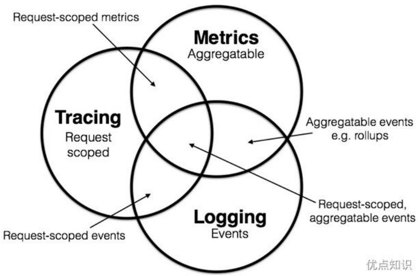
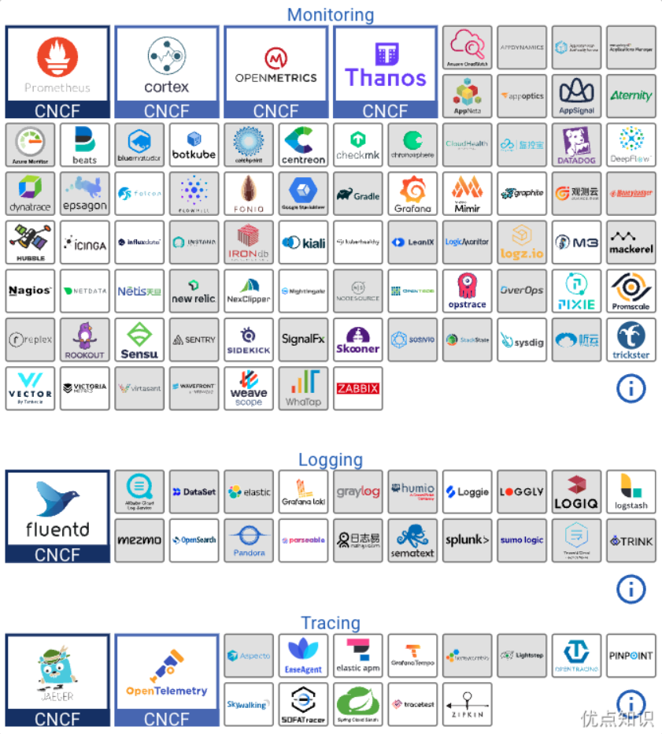

# 可观测性概念

可观测性是描述我们对系统中所发生情况的理解程度，需要能够在问题出现时指出问题，快速地响应，并尽可能快速地解决。为了获得这种洞察力，我们就需要可观测的系统。

学术界一般会将可观测性分解为三个更具体方向进行研究，分别是：事件日志、链路追踪和聚合指标，这三个方向各有侧重，但不是完全独立，它们天然就有重合或者可以结合之处。



假如你平时只开发单体系统，从未接触过分布式系统的观测工作，很有可能只会对日志这一项感到熟悉，其他两项会相对陌生。尽管分布式系统中追踪和指标的必要性和复杂程度确实比单体系统时要更高，但是在单体时代，实际上你肯定也已经接触过以上全部三项的工作，只是并未意识到而已：

- 日志（Logging）：日志的职责是记录离散事件，通过这些记录事后分析出程序的行为，譬如曾经调用过什么方法，曾经操作过哪些数据，等等。输出日志的确很容易，但收集和分析日志却会很复杂，面对成千上万的集群节点，面对迅速滚动的日志信息，面对数以TB计算的文本，传输与归集都并不简单。对大多数程序员来说，分析日志也许就是最常遇见也最有实践可行性的“大数据系统”了。

- 追踪（Tracing）：单体系统时代追踪的范畴基本只局限于堆栈的追踪（Stack Tracing）；微服务时代，追踪就不只局限于调用栈了，一个外部请求需要内部若干服务的联动响应，这时候完整的调用轨迹将跨越多个服务，因此，分布式系统中的追踪在国内常被称为全链路追踪，许多资料中也称它为分布式追踪。追踪的主要目的是排查故障，如分析调用链的哪一部分、哪个方法出现错误或阻塞，输入输出是否符合预期，等等。

- 指标（Metrics）：指标是指对系统中某一类信息的统计聚合。指标的主要目的是监控和预警，如某些指标达到风险阈值时触发报警，以便自动处理或者提醒管理员介入。

目前针对可观测性的产品已经是一片红海，经过多年的角逐，日志和指标这两个领域的胜利者算是基本尘埃落定。日志收集和分析大多被统一到 Elastic Stack（ELK）技术线上，对于云原生时代，可能会将其中的 Logstash 用 Fluentd 取代，让 ELK 变成 EFK，当然现在也出现了类似于 Grafana Loki 和基于 ClickHouse 的日志系统，对 Elastic Stack 技术栈有不少冲击。

对于指标方面，随着 Kubernetes 成为容器编排领域的标准，Prometheus 也击败了指标领域里以 Zabbix 为代表的众多前辈，成为了云原生时代指标监控的事实标准，虽然从市场角度来说 Prometheus 还没有达到 Kubernetes 那种举世无敌的程度，但是从社区活跃度上看，Prometheus 已占有绝对的优势，Kubernetes 是 CNCF 第一个孵化毕业的项目，Prometheus 是 CNCF 第二个毕业的项目，在 Google 和 CNCF 的推动下，Prometheus 必然前途不可限量。

追踪方面的情况与日志和指标有所不同，追踪是与具体网络协议、程序语言密切相关的，收集日志不必关心这段日志是由 Java 程序输出的还是由 Golang 程序输出的，对程序来说它们就只是一段非结构化文本而已；同理，指标对程序来说也只是一个个聚合的数据指标而已。但链路追踪就不一样，各个服务之间是使用 HTTP 还是 gRPC 来进行通信会直接影响追踪的实现，各个服务是使用 Java、Golang 还是 Node.js 来编写，也会直接影响到进程内调用栈的追踪方式。这决定了追踪工具本身有较强的侵入性，通常是以插件式的探针来实现；也决定了追踪领域很难出现一家独大的情况，通常要有多种产品来针对不同的语言和网络。近年来各种链路追踪产品层出不穷，市面上主流的工具既有像 Datadog 这样的商业方案，也有 Google Stackdriver Trace 这样的云计算厂商产品，还有像 SkyWalking、Zipkin、Jaeger 这样来自开源社区的优秀产品。



由 OpenTracing 进化而来 OpenTelemetry 融合了日志、追踪、指标三者所长，有望成为三者兼备的统一可观测性解决方案。

# Prometheus简介

Prometheus 受启发于 Google 的 Brogmon 监控系统（相似的 Kubernetes 是从 Google 的 Brog 系统演变而来），从 2012 年开始由前 Google 工程师在 Soundcloud 采用 Go 语言编写的开源软件，并且于 2015 年早期对外发布早期版本。到 2016 年 Prometheus 成为继 Kubernetes 之后，成为 CNCF 的第二个成员。


## 监控目标

在《SRE：Google 运维解密》一书中指出，监控系统需要能够有效的支持白盒监控和黑盒监控。通过白盒能够了解其内部的实际运行状态，通过对监控指标的观察能够预判可能出现的问题，从而对潜在的不确定因素进行优化。而黑盒监控，常见的如 HTTP 探针、TCP 探针等，可以在系统或者服务在发生故障时能够快速通知相关的人员进行处理。通过建立完善的监控体系，从而达到以下目的：

- 长期趋势分析：通过对监控样本数据的持续收集和统计，对监控指标进行长期趋势分析。例如，通过对磁盘空间增长率的判断，我们可以提前预测在未来什么时间节点上需要对资源进行扩容。  
- 对照分析：两个版本的系统运行资源使用情况的差异如何？在不同容量情况下系统的并发和负载变化如何？通过监控能够方便的对系统进行跟踪和比较。  
- 告警：当系统出现或者即将出现故障时，监控系统需要迅速反应并通知管理员，从而能够对问题进行快速的处理或者提前预防问题的发生，避免出现对业务的影响。  
- 故障分析与定位：当问题发生后，需要对问题进行调查和处理。通过对不同监控指标以及历史数据的分析，能够找到并解决问题。  
- 数据可视化：通过可视化仪表盘能够直接获取系统的运行状态、资源使用情况、以及服务运行状态等直观的信息。


## Prometheus 优势

Prometheus 是一个开源的完整监控解决方案相比于传统监控系统，Prometheus 具有以下优点：

**易于管理**

Prometheus 核心部分只有一个单独的二进制文件，不存在任何的第三方依赖(数据库，缓存等等)。Prometheus 基于 Pull 模型的架构方式，可以在任何地方搭建我们的监控系统。对于一些复杂的情况，还可以使用 Prometheus 服务发现的能力动态管理监控目标。

**强大的数据模型**

所有采集的监控数据均以 metrics 的形式保存在内置的时间序列数据库当中，所有的样本除了基本的指标名称以外，还包含一组用于描述该样本特征的标签。如下所示：

```ruby
http_request_status{code='200',endpoint='/api/path',env='prod'} => [value1@timestamp1, value2@timestamp2...]   
http_request_status{code='200',endpoint='/api/path2',env='prod'} => [value1@timestamp1, value2@timestamp2...]
```

每一条时间序列由指标名称以及一组标签唯一标识，每条时间序列按照时间的先后顺序存储一系列的样本值。基于 Labels 可以方便地对监控数据进行聚合，过滤，裁剪。

**强大的查询语言PromQL**

Prometheus 内置了一个强大的数据查询语言 PromQL，通过 PromQL 可以实现对监控数据的查询、聚合。同时 PromQL 也被应用于数据可视化(如 Grafana)以及告警当中。

**高效**

对于监控系统而言，大量的监控任务必然导致有大量的数据产生。而 Prometheus 可以高效地处理这些数据，对于单一 Prometheus Server 实例而言它可以处理：数以百万的监控指标；每秒处理数十万的数据点。

**可扩展**

Prometheus 是如此简单，因此你可以在每个数据中心、每个团队运行独立的 Prometheus Severer，因为只有一个单独的二进制文件，没有其他依赖。Prometheus 对于联邦集群的支持，可以让多个 Prometheus 实例产生一个逻辑集群，当单实例 Prometheus Server 处理的任务量过大时，通过使用功能分片+联邦集群对其进行扩展。

**易于集成**

使用 Prometheus 可以快速搭建监控服务，并且可以非常方便地在应用程序中进行集成。目前支持 Java、Python、Go、Ruby、.Net、Node.js 等等语言的客户端 SDK，基于这些 SDK 可以快速让应用程序加入到 Prometheus 的监控当中，或者开发自己的监控数据收集程序，此外 Prometheus 社区还提供了大量第三方实现的监控数据采集支持，比如 Consul、Redis、MySQL、EC2、PostgreSQL 等等。

**可视化**

Prometheus Server 中自带了一个 Prometheus UI，通过这个 UI 可以方便地直接对数据进行查询，并且支持直接以图形化的形式展示数据。同时 Grafana 也提供了完整的 Prometheus 支持，基于 Grafana 可以创建更加精美的监控图标，当然我们也可以自己基于 Prometheus 提供的 API 实现自己的监控可视化 UI。

## Prometheus系统架构

下图演示了Prometheus系统的整体架构。


Target 是 Prometheus 抓取指标的来源。目标可以是服务器、服务、Kubernetes Pod、应用程序端点等。

默认情况下，prometheus 会在目标 http 接口的 /metrics 路径下查找指标。可以在目标配置中更改默认路径。这意味着，如果您不指定自定义指标路径，Prometheus 会在 /metrics 下查找指标。

Exporter 就像在目标上运行的代理。它将指标从特定系统转换为 prometheus 可以理解的格式。它可以是系统指标，如 CPU、内存等，也可以是 Java JMX 指标、MySQL 指标等。


**Push Gateway (推送网关)**

- **含义**： 一个特殊的中间组件。由于 Prometheus 主要基于 Pull（拉取）模型，它无法监控那些生命周期短、临时存在的任务（如批处理作业），因为这些任务在 Prometheus 来抓取时可能已经消失了。
- **作用**： 这类短期任务在运行结束时，将指标**推送（Push）** 到 Push Gateway 暂存起来。随后，Prometheus Server 再从 Push Gateway 那里**拉取**这些指标。**注意：它只是一个缓存中转站，不是替代 Pull 模式。**


### 服务发现

一、为什么需要服务发现？

在传统静态基础设施中，服务器的 IP 地址和主机名相对固定。你可以在 Prometheus 的配置文件 `prometheus.yml`中直接写死要监控的目标（`static_configs`）。

```
scrape_configs:
  - job_name: 'static-app'
    static_configs:
      - targets: ['10.0.1.15:9090', '10.0.1.16:9090'] # 直接写死IP
```

但在云原生环境中，这会带来巨大问题：

- IP 动态变化： 在 Kubernetes 中，Pod 被调度到哪个节点、其 IP 是多少都是随机的。容器重启或更新后，IP 就会改变。
- 弹性伸缩： 应用实例会根据负载自动增加或减少。手动维护一个目标列表是完全不现实的。
- 维护成本高： 每上线一个新服务、扩缩容一个实例，都需要人工修改 Prometheus 配置并重启服务，极易出错且无法扩展。

服务发现就是为了解决这个问题：让 Prometheus 自动知道它应该去监控谁。

二、服务发现是如何工作的？

服务发现的核心思想是：**Prometheus Server 不再从配置文件中读取静态的 IP 列表，而是通过查询一个外部来源（如 Kubernetes API、Consul 目录服务），动态地获取当前所有需要监控的目标列表。**

这个过程在图中体现为 **“Discover Targets”** 的箭头。

工作流程拆解：

1. **注册（Registration）**：当一个新服务或实例启动时，它（或其编排工具）会将自己**注册**到一个**服务注册中心**。例如：在 Kubernetes 中，一个 Pod 启动后，Kubelet 会将其注册到 Kubernetes API Server。在 Consul 中，服务可以通过配置文件或 HTTP API 自行注册。
2. **发现（Discovery）**：Prometheus Server 根据你在 `scrape_configs`中配置的**服务发现类型**（如 `kubernetes_sd_configs`, `consul_sd_configs`），定期（根据 `refresh_interval`）去查询对应的服务注册中心。例如，配置了 Kubernetes SD，Prometheus 就会去访问 Kubernetes API，询问“当前所有命名空间下带有特定注解（annotation）的 Pod 有哪些？”。
3. **拉取列表更新（Targets Update）**：服务注册中心返回一个最新的、健康的服务实例列表（包含 IP、端口、标签等信息）给 Prometheus。Prometheus 立即更新其内部的抓取目标列表，开始从新发现的实例抓取数据，并停止抓取已消失的实例。
4. **抓取（Scraping）**：Prometheus 根据更新后的目标列表，正常地通过 HTTP 去拉取各个目标的 `/metrics`指标。

**整个流程是自动的、周期性的，无需任何人工干预。**


通常来说在监控系统中有两种方法可以获取监控指标：拉取式采集（Pull-Based Metrics Collection）和推送式采集(Push-Based Metrics Collection）。所谓 Pull 是指指标系统主动从目标系统中拉取指标，相对地，Push 就是由目标系统主动向指标系统推送指标。这两种方式并没有绝对的好坏优劣，以前很多老牌的指标度量系统，如 Ganglia、Graphite、StatsD 等是基于 Push 的，而以 Prometheus、Datadog、Collectd 为代表的系统则采取了 Pull 方式。Push 还是 Pull 的权衡，不仅仅在指标中才有，所有涉及客户端和服务端通讯的场景，都会涉及该谁主动的问题。

一般来说，指标系统只会支持其中一种指标采集方式，因为指标系统的网络连接数量，以及对应的线程或者协程数可能非常庞大，如何采集指标将直接影响到整个指标系统的架构设计。Prometheus基于Pull架构的同时还能够有限度地兼容Push式采集，是因为它有Push Gateway的存在，如上图所示，这是一个位于PrometheusServer外部的相对独立的模块，将外部推送来的指标放到Push Gateway中暂存，然后再等候PrometheusServer从Push Gateway中去拉取，所以对于Prometheus本身而言只是Pull模式。Prometheus设计Push Gateway的本意是为了解决Pull的一些固有缺陷，譬如目标系统位于内网，通过NAT访问外网，外网的Prometheus是无法主动连接目标系统的，这就只能由目标系统主动推送数据；又譬如某些小型短生命周期服务，可能还等不及Prometheus来拉取，服务就已经结束运行了，因此也只能由服务自己Push来保证度量的及时和准确。

Prometheus 只允许通过 HTTP 访问 metrics 端点这一种访问方式。如果目标提供了 HTTP 的 metrics 端点（如 Kubernetes、Etcd 等本身就带有 Prometheus 的 Client Library）就直接访问，否则就需要一个专门的 Exporter 来充当媒介。

Exporter是Prometheus提出的概念，它是目标应用的代表，既可以独立运行，也可以与应用运行在同一个进程中，只要集成Prometheus的Client Library便可。Exporter以HTTP协议返回符合Prometheus格式要求的文本数据给Prometheus服务器。现在社区中已经有大量各种用途的Exporter（比如MySQL、Redis、Kafka等等），让Prometheus的监控范围几乎能涵盖所有用户所关心的目标，绝大多数用户都只需要针对自己系统业务方面的度量指标编写Exporter即可。

另外我们还可以配置Prometheus根据收集的指标数据生成报警，但是Prometheus不会直接把报警通知发送给我们，而是将原始报警转发到Alertmanager服务，Alertmanager是作为单独的服务运行的，可以从多个Prometheus服务上接收报警，并可以对这些报警进行分组、汇总和路由，最后可以通过Email、Slack、企业微信、Webhook或其他通知服务来发送通知。

## 数据模型

Prometheus 采集的监控数据都是以指标（metric）的形式存储在内置的 TSDB 数据库中，这些数据都是时间序列：一个带时间戳的数据，这些数据具有一个标识符和一组样本值。除了存储的时间序列，Prometheus 还可以根据查询请求产生临时的、衍生的时间序列作为返回结果。

# 时间序列

Prometheus 会将所有采集到的样本数据以时间序列的形式保存在内存数据库中，并定时刷新到硬盘上，时间序列是按照时间戳和值的序列方式存放的，我们可以称之为向量，每一条时间序列都由一个指标名称和一组标签（键值对）来唯一标识。

- 指标名称反映了被监控样本的含义，如 http_request_total 表示的是对应服务器处理的 HTTP 请求总数。  
标签可以用来区分不同的维度，如 method="GET" 与 method="POST" 就可以用来区分这两种不同的 HTTP 请求指标数据。

  
(syntactic sugar for special label_name_)

如下所示，可以将时间序列理解为一个以时间为Y轴的数字矩阵：

```latex
\(\begin{array}{rl} & \mathrm{\Lambda}\\ & \mid \mathrm{\Lambda}\dots \dots \dots \dots \dots \dots \dots \dots \dots \dots \dots \dots \dots \dots \dots \dots \dots \dots \dots \\ & \mid \mathrm{\Lambda}\dots \dots \dots \dots \dots \dots \dots \dots \dots \dots \dots \dots \dots \dots \dots \dots \\ & \mid \mathrm{\Lambda}\dots \dots \dots \dots \dots \dots \dots \dots \dots \dots \dots \\ & \mid \mathrm{\Lambda}\dots \dots \dots \dots \dots \dots \dots \dots \dots \\ & \mid \mathrm{\Lambda}\dots \dots \dots \dots \dots \dots \dots \dots \\ & \mid \mathrm{\Lambda}\dots \dots \dots \dots \dots \dots \dots \\ & \mid \mathrm{\Lambda}\dots \dots \dots \dots \dots \dots \\ & \mid \mathrm{\Lambda}\dots \dots \dots \dots \dots \dots \\ & \mid \mathrm{\Lambda}\dots \dots \dots \dots \dots \\ & \mid 0 <   0 > - - - - - - - - - - - - - - - - - - - - - - - - - - - - - - - - - - - - - - - - - - - - - - - - - - - - - - - - - - - - - - - - - - - - - - - - - - - - - - - - - - - - - - - - - - - - - - - - - - - - .\\ & 0 <   0 > 0 <   0 > 0 <   0 > 0 <   0 > 0 <   0 > 0 <   0 > 0 <   0 > 0 <   0 > 0 <   0 > 0 <   0 > 0 <   0 > 0 <   0 > 0 <   0 > 0 <   0 > 0 <   0 > 1\\ & 0 <   0 > 0 <   0 > 0 <   0 > 0 <   0 > 0 <   0 > 0 <   0 > 0 <   0 > 0 <   0 > 0 <   0 > 0 <   0 > 0 <   0 > 0 <   0 > 0 <   0 > 0 <   0> 1\\ & 0 <   0 > 0 <   0 > 0 <   0 > 0 <   0 > 0 <   0 > 0 <   0 > 0 <   0 > 0 <   0 > 0 <   0 > 0 <   0 > 0 <   0 > 0 <   0 > 0 <   0 > 0 <
```

需要注意的是指标名称只能由 ASCII 字符、数字、下划线以及冒号组成，同时必须匹配正则表达式 [a-zA-Z_]:[a-zA-Z0-9_:]*（冒号不能用来定义指标名称，是用来表示用户自定义的记录规则）。标签的名称只能由 ASCII 字符、数字以及下划线组成并满足正则表达式 [a-zA-Z_][a-zA-Z0-9_]*，其中以 作为前缀的标签，是系统保留的关键字，只能在系统内部使用，标签的值则可以包含任何 Unicode 编码的字符。

# 样本

时间序列中的每一个点就称为一个样本（sample），样本由以下3个部分组成：

。指标：指标名称和描述当前样本特征的标签集  
时间戳：精确到毫秒的时间戳数  
样本值：一个64位浮点数

如下所示：

```perl
>>> metric  
>>> timestamp ->>>> -value->  
http_request_total{status="200", method="GET"}@1434417560938 => 94355  
http_request_total{status="200", method="GET"}@1434417561287 => 94334
```

```txt
http_request_total{status="404", method="GET"}@1434417560938 => 38473  
http_request_total{status="404", method="GET"}@1434417561287 => 38544
```

```txt
http_request_total{status="200", method="POST"}@1434417560938 => 4748  
http_request_total{status="200", method="POST"}@1434417561287 => 4785
```

# 指标

想要暴露Prometheus指标服务只需要暴露一个HTTP端点，并提供Prometheus基于文本格式的指标数据即可。这种指标格式是非常友好的，基本上的格式看起来类似于下面的这段代码：

```txt
# HELP http_requestsonal The total number of processed HTTP requests. #TYPEhttp_requestsonal counter http_requestsonal{status  $= 1$  200}8556 http_requestsonal{status  $= 1$  404}20 http_requestsonal{status  $= 1$  500}68
```

其中 # 开头的行是注释信息，用来描述下面提供的指标含义，其他未注释行代表一个样本（带有指标名、标签和样本值），使其非常容易从系统和服务中暴露指标出来。

事实上所有的指标也都是通过如下所示的格式来标识的：

```txt
$>$  <>metric name  $>\{>$  <>label name  $\Rightarrow = >$  <>label value>,...}
```

例如，指标名称是http_request_total，标签集为method="POST",endpoint="/messages"，那么我们可以用下面的方式来标识这个指标：

```hcl
http_request_total{method="POST", endpoint="/messages"}
```

而事实上Prometheus的底层实现中指标名称实际上是以name=<metric name>的形式保存在数据库中的，所以上面的指标也等同与下面的指标：

```txt
\_name  $\equiv$  "http_request_total",method  $=$  "POST",endpoint  $=$  "/messages"}
```

所以也可以认为一个指标就是一个标签集，只是这个标签集里面一定包含一个 __name__ 的标签来定义这个指标的名称。

# 存储格式

Prometheus 按照两个小时为一个时间窗口，将两小时内产生的数据存储在一个块（Block）中，每个块都是一个单独的目录，里面包含该时间窗口内的所有样本数据（chunks）、元数据文件（meta.json）以及索引文件（index）。

其中索引文件会将指标名称和标签索引到样本数据的时间序列中，如果该期间通过 API 删除时间序列，删除记录会保存在单独的逻辑文件 tombstone 当中。

当前样本数据所在的块会被直接保存在内存数据库中，不会持久化到磁盘中，为了确保Prometheus发生崩溃或重启时能够恢复数据，Prometheus启动时会通过预写日志（write-ahead-log(WAL)）来重新播放记录，从而恢复数据，预写日志文件保存在wal目录中，wal文件包括还没有被压缩的原始数据，所以比常规的块文件大得多。

Prometheus 保存块数据的目录结构如下所示：

```txt
01FB9HHY61KAN6BRDYPTXDX9YF  
| chunks  
| 000001  
| index  
| meta.json  
| tombstones  
- 01FB9Q76Z0J10WJZX3PYQYJ96R  
| chunks  
| 000001  
| index  
| meta.json  
| tombstones  
- chunks_head  
| 000014  
| 000015  
| lock  
| queries.active  
| wal  
| 00000011  
| 00000012  
| 00000013  
| 00000014  
| checkpoint.00000010  
| 00000000  
7 directories, 17 files
```

接下来我们将来了解下Prometheus的基本使用。

# 指标类型

从存储上来讲所有的监控指标都是相同的，但是在不同的场景下这些指标又有一些细微的差异。例如，在 NodeExporter 返回的样本中指标 node_load1 反应的是当前系统的负载状态，随着时间的变化这个指标返回的样本数据是在不断变化的。而指标 node_cpuSeconds_total 所获取到的样本数据却不同，它是一个持续增大的值，因为其反应的是 CPU 的累计使用时间，从理论上讲只要系统不关机，这个值是会一直变大。

为了能够帮助用户理解和区分这些不同监控指标之间的差异，Prometheus 定义了 4 种不同的指标类型：Counter（计数器）、Gauge（仪表盘）、Histogram（直方图）、Summary（摘要）。

在 metrics 接口中返回的样本数据中，其注释中也包含了该样本的类型。例如：

```python
# HELP node_cpuSeconds_total Seconds the cpus spent in each mode. # TYPE node_cpuSeconds_total counter node_cpuSeconds_total{cpu="cpu0",mode="idle"} 362812.7890625
```

# Counter

Counter(只增不减的计数器)类型的指标其工作方式和计数器一样，只增不减，这是最好理解也是最常用的指标形式，所以它对于存储诸如服务的HTTP请求数量或使用的CPU时间之类的信息非常有用。譬如业务指标像销售额、货物库存量、职工人数等等；技术指标像服务调用次数、网站访问人数等都属于计数器指标。这些指标不会减少。

# 指标类型：Counter


http_requeststotal 1000000

现在的值

cpuSeconds_total 3000

@ 22:00

http_requestsonal 970000

之前时间点的值

cpuSeconds_total 2400

@ 21:00

http_requestsonal - http_requestsontal

offset  $1\mathrm{h} = 30000$

变化/率（增加或减少）

# 优点知识

可能你会觉得一直增加的数据没什么用处，了解服务从开始有多少请求有什么价值吗？但是需要记住，每个指标都存储了时间戳的，所有你的 HTTP 请求数现在可能是 1000 万，但是 Prometheus 也会记录之前某个时间点的值，我们可以去查询过去某个时间范围内的请求变化数，当然更多的时候我们想要看到的是请求数增加或减少的速度有多快，因此通常情况对于 Counter 指标我们都是去查看变化率而不是本身的数字。PromQL 内置的聚合函数可以让用户对这些数据进行进一步的分析，例如，可以通过 rate() 函数获取 HTTP 请求的增长率：

rate(http_requestsonal[5m])

# Gauge

与 Counter 不同，Gauge（可增可减的仪表盘）类型的指标侧重于反应系统的当前状态，因此这类指标的样本数据可增可减。比如网站访问总人数是计数器，而网站在线人数则是 Gauge 类型的监控指标。由于 Gauge 指标仍然带有时间戳存储，所有我们可以看到随时间变化的值，通常可以直接把它们绘制出来，这样就可以看到值本身而不是变化率了，通过 Gauge 指标，用户可以直接查看系统的当前状态。

# 指标类型：Gauge


http_requestsonline 2000

memory_allocated_bytes 4.832e+09

@ 22:00

http_requestsonline 900

memory_allocated_bytes 3.642e+09

@ 21:00

memory_allocated_bytes / (1024*1024*1024)

$= 4.5$

# 优点知识

# Histogram and Summary

除了 Counter 和 Gauge 类型的监控指标以外，Prometheus 还定义了 Histogram 和 Summary 的指标类型。  
Histogram 和 Summary 主用用于统计和分析样本的分布情况。

在大多数情况下人们都倾向于使用某些量化指标的平均值，例如CPU的平均使用率、页面的平均响应时间，这种方式也有很明显的问题，以系统API调用的平均响应时间为例：如果大多数API请求都维持在100ms的响应时间范围内，而个别请求的响应时间需要5s，那么就会导致某些WEB页面的平均响应时间落到中位数上，而这种现象被称为长尾问题。

为了区分是平均的慢还是长尾的慢，最简单的方式就是按照请求延迟的范围进行分组。例如，统计延迟在  $0 \sim 10\mathrm{ms}$  之间的请求数有多少而  $10 \sim 20\mathrm{ms}$  之间的请求数又有多少。通过这种方式可以快速分析系统慢的原因。Histogram 和 Summary 都是为了能够解决这样的问题存在的，通过 Histogram 和 Summary 类型的监控指标，我们可以快速了解监控样本的分布情况。

# Summary

Summary（摘要）用于记录某些东西的平均大小，可能是计算所需的时间或处理的文件大小，摘要会显示两个相关的信息：count（事件发生的次数）和sum（所有事件的总大小），如下图计算摘要指标可以返回次数为3和总和15，也就意味着3次计算总共需要15s来处理，平均每次计算需要花费5s；下一个样本的次数为10，总和为113，那么平均值为11.3，因为两组指标都记录有时间戳，所以我们可以使用摘要来构建一个图表，显示平均值的变化率，比如图上的语句表示的是5分钟时间段内的平均速率。

# 指标类型：Summary


calculationSeconds_count 3

calculationSeconds_sum 15

@ 21:00

calculationSeconds_count 10

calculationSeconds_sum 113

@ 21:01

rate(calculationSeconds_sum[5m]) /

rate(calculationSeconds_count[5m]

avg

优点知识

例如，指标 prometheus tsdb WAL_fsync_durationSeconds 的指标类型为 Summary，它记录了 Prometheus Server 中 wal_fsync 的处理时间，通过访问 Prometheus Server 的 /metrics 地址，可以获取到以下监控样本数据：

# HELP prometheus tsdb_wal_fsync_duration_seconds Duration of WAL fsync.

TYPE prometheus tsdb WAL fsync duration seconds summary

prometheus-tsdb_wal_fsync_durationSeconds{quantile="0.5"} 0.012352463

prometheus-tsdb_wal_fsync_durationSeconds{quantile="0.9"} 0.014458005

prometheus tsdb_wal_fsync_durationSeconds{quantile="0.99"} 0.017316173

prometheus tsdb wal_fsync_duration_secondly_sum 2.888716127000002

prometheus-tsdb WAL fsync_duration_second_count 216

从上面的样本中可以得知当前PrometheusServer进行walfsync操作的总次数为216次，耗时

2.888716127000002s。其中中位数（quantile=0.5）的耗时为0.012352463，9分位数（quantile=0.9）的耗时为0.014458005s。

分位图是统计学中通过比较各分位数的分布情况的工具，用于验证实际值与理论值的差距，评估理论值与实际值之间的拟合度。例如我们说“高考成绩一般符合正态分布”，这句话的意思是：高考成绩高低分的人数都较少，中等成绩的较多，将人数按不同分数段统计，得出的统计结果一般能够与正态分布的曲线较好地拟合。

# Histogram

摘要非常有用，但是平均值会隐藏一些细节，上图中10与113的总和包含非常广的范围，如果我们想查看时间花在什么地方了，那么我们就需要Histogram（直方图）了。直方图以bucket桶的形式记录数据，所以我们可能有一个桶用于需要1s或更少的计算，另一个桶用于5秒或更少、10秒或更少、20秒或更少、60秒或更少。该指标返回每个存储桶的计数，其中3个在5秒或更短的时间内完成，6个在10秒或更短的时间内完成。Prometheus中的直方图是累积的，因此所有10次计算都属于60秒或更少的时间段，而在这10次中，有9次的处理时间为20秒或更少，这显示了数据的分布。所以可以看到我们的大部分计算都在10秒以下，只有一个超过20秒，这对于计算百分位数很有用。

# 指标类型：Histogram


```txt
calculationSeconds_bucket{le="1"} 0  
calculationSeconds_bucket{le="5"} 3  
calculationSeconds_bucket{le="10"} 6  
calculationSeconds_bucket{le="20"} 9  
calculationSeconds_bucket{le="60"} 10
```

```txt
calculationSeconds_bucket{le="20" / calculationSeconds_bucket{le="+Inf"}
```

优点知识

在PrometheusServer自身返回的样本数据中，我们也能找到类型为Histogram的监控指标prometheus_tdb_compaction_chunk_range.SecondsexBucket：

```tcl
# HELP prometheus_tdb_compaction_chunk_range.Seconds Final time range of chunks on their first compaction
# TYPE prometheus_tdb_compaction_chunk_range.Seconds histogram
prometheus_tdb_compaction_chunk_range.Seconds_bucket{le="100"} 71
prometheus_tdb_compaction_chunk_range.Seconds_bucket{le="400"} 71
prometheus_tdb_compaction_chunk_range.Seconds_bucket{le="1600"} 71
prometheus_tdb_compaction_chunk_range.Seconds_bucket{le="6400"} 71
prometheus_tdb_compaction_chunk_range.Seconds_bucket{le="25600"} 405
prometheus_tdb_compaction_chunk_range.Seconds_bucket{le="102400"} 25690
prometheus_tdb_compaction_chunk_range.Seconds_bucket{le="409600"} 71863
prometheus_tdb_compaction_chunk_range.Seconds_bucket{le="1.6384e+06"} 115928
prometheus_tdb_compaction_chunk_range.Seconds_bucket{le="6.5536e+06"} 2.5687892e+07
prometheus_tdb_compaction_chunk_range.Seconds_bucket{le="2.62144e+07"} 2.5687896e+07
prometheus_tdb_compaction_chunk_range.Seconds_bucket{le="+Inf"} 2.5687896e+07
prometheus_tdb_compaction_chunk_range.Seconds_sum 4.7728699529576e+13
prometheus_tdb_compaction_chunk_range.Seconds_count 2.5687896e+07
```

与 Summary 类型的指标相似之处在于 Histogram 类型的样本同样会反应当前指标的记录的总数(以 __count 作为后缀)以及其值的总量（以 __sum 作为后缀），不同在于 Histogram 指标直接反应了在不同区间内样本的个数，区间通过标签 le 进行定义。

直方图是常见的二维统计图，它的两个坐标分别是统计样本和该样本对应的某个属性的度量，以长条图的形式表示具体数值。譬如经济报告中要衡量某个地区历年的GDP变化情况，常会以GDP为纵坐标，时间为横坐标构成直方图来呈现。

# 安装配置

前面我们提到了Prometheus是采用Go语言开发的，直接使用独立的二进制文件即可部署。下面我们就将在我们的Linux机器上来下载安装Prometheus。

在 Prometheus 官网 https://prometheus.io/download/#prometheus 获取适用于 Linux 的 Prometheus 安装包，这里我们选择最新的 2.44.0 版本，我们这里是 Linux 系统，所以选择下载 prometheus-2.44.0-linux-amd64.tar.gz，其他系统请自行选择。

```txt
$\text{念} \rightarrow$  wgethttps://github.com/prometheus/prometheus/releases/download/v2.44.0/prometheus- 2.44.0.linux-amd64.tar.gz #如果被限制可以使用下面的加速地址下载 #wgethttps://ghdl.geizhuqw.qf/https://github.com/prometheus/prometheus/releases/download/v2.44.0/prometheus- 2.44.0.linux-amd64.tar.gz
```

解压压缩包：

```batch
$\otimes \rightarrow$  tar -xvf prometheus-2.44.0-linux-amd64.tar.gz
```

切换到解压缩后的目录，执行 prometheus --version 命令查看是否正常：

$\text{念} \rightarrow$  cd prometheus-2.44.0.linux-amd64

$\text{念} \rightarrow$  ./prometheus --version

prometheus, version 2.44.0 (branch: HEAD, revision: 1ac5131f698ebc60f13fe2727f89b115a41f6558)

build user: root@739e8181c5db

build date: 20230514-06:18:11

go version: go1.20.4

platform: linux/amd64

tags: netgo,builtinassets,stronglabels

到这里 Prometheus 就安装完成了（当然我们也可以使用 systemd 或者 docker 的方式来管理），接下来在启动之前我们需要为其创建一个配置文件。

Prometheus 通过主动抓取监控目标上的 metrics 这个 HTTP 端点来收集指标，由于 Prometheus 本身也暴露 metrics 指标接口，所以自然它也可以抓取并监控其自身的运行状况，下面我们就用收集自身的数据为例进行配置说明。

将以下Prometheus配置保存为prometheus.yml文件（覆盖根目录中的prometheus.yml文件）：

```yaml
prometheus.yml  
global:  
    scrape_interval: 5s #抓取频率  
scrape_config:  
    - job_name:"prometheus"  
    static_config:  
        - targets:["localhost:9090"]
```

上面配置了Prometheus每5s从自身抓取指标。global 区域用于配置一些全局配置和默认值，scrape_config部分是用来告诉Prometheus要抓取哪些目标的。

注意：5秒钟的抓取间隔是非常激进的，但对于我们这里的演示目的来说还是非常有用的，因为我们希望可以快速获得数据。在实际情况下，间隔通常在10到60秒之间。

在我们这里使用 static_config 属性手动列举了抓取的目标（以 <host>：<port> 格式），不过一般生产环境配置使用一个或多个服务发现来发现目标，完整的配置可以参考官方文档

https://prometheus.io/docs/prometheus/latest/configuration/configuration/，后续我们也会不断接触相关的配置。

接下来我们就可以使用新创建的配置文件启动Prometheus：

$\text{念} \rightarrow$  ./prometheus

ts=2023-05-

25T03:27:54.987Z caller  $\equiv$  main.go:531 level  $\equiv$  info msg  $=$  "No time or size retention was set so using the default time retention" duration ts=2023-05-

25T03:27:54.987Z caller  $\equiv$  main.go:575 level  $\equiv$  info msg="Starting Prometheus Server" mode  $\equiv$  server version  $=$  " (version=2.44.0, branch  $\equiv$  HEAD, revision  $\equiv$  1ac5131f698ebc60f13fe2727f89b115a41f6558)"

ts=2023-05-25T03:27:54.987Z caller  $\equiv$  main.go:580 level  $\equiv$  info build_context  $=$

(go=go1.20.4, platform=linux/amd64, user=root@739e8181c5db, date=20230514-06:18:11, tags=netgo,builtinassets,stronglabels)"

ts=2023-05-25T03:27:54.987Z caller  $\equiv$  main.go:581 level  $\equiv$  info host_details  $=$  "Linux 5.4.0-132-generic #148Ubuntu SMP Mon Oct 17 16:02:06 UTC 2022 x86_64 master1 (none)"

ts=2023-05-25T03:27:54.987Z caller=main.go:582 level=info fd_limit  $=$  "soft  $\equiv$  1048576,hard  $\equiv$  1048576)"

ts=2023-05-25T03:27:54.987Z caller=main.go:583 level=info vm_limits=" (soft=unlimited, hard=unlimited)" ts=2023-05-

25T03:27:54.989Z caller  $\equiv$  web.go:562 level  $\equiv$  info component  $\equiv$  web msg  $=$  "Start listening for connections" address  $= 0.0.0.0$  :9090 ts  $= 2023 - 05 - 25$  T03:27:54.990Z caller  $\equiv$  main.go:1016 level  $\equiv$  info msg  $=$  "Starting TSDB ...

ts=2023-05-25T03:27:54.992Z caller=head.go:588 level=info component=tsdb msg="Replaying on-disk memory mappable chunks if any"

ts=2023-05-25T03:27:54.992Z caller=head.go:669 level=info component=tsdb msg="On-disk memory mappable chunks replay completed" duration=1.974μs  
ts=2023-05-

25T03:27:54.992Z caller=head.go:677 level=info component=tsdb msg="Replaying WAL, this may take a while" ts=2023-05-

25T03:27:54.992Z caller=head.go:748 level=info component=tsdb msg="WAL segment loaded" segment=0 maxSegment=0 ts=2023-05-

25T03:27:54.992Z caller=head.go:785 level=info component=tsdb msg="WAL replay completed" checkpoint_replay_duration=21.672 ts=2023-05-

25T03:27:54.992Z caller  $\equiv$  tls_config.go:232 level  $\equiv$  info component  $\equiv$  web msg  $=$  "Listening on" address=

[:]:9090

ts=2023-05-

25T03:27:54.993Z caller=tls_config.go:235 level=info component  $\equiv$  web msg  $=$  "TLS is disabled." http2=false address=

[:]:9090

ts=2023-05-25T03:27:54.993Z caller=main.go:1037 level=info fs_type=EXT4_SUPER_MAGIC

ts=2023-05-25T03:27:54.993Z caller=main.go:1040 level=info msg="TSDB started"

ts=2023-05

25T03:27:54.993Z caller  $\equiv$  main.go:1220 level  $\equiv$  info msg  $=$  "Loading configuration file" filename  $\equiv$  prometheus.yml

ts=2023-05

25T03:27:54.994Z caller  $\equiv$  main.go:1257 level  $\equiv$  info msg  $=$  "Completed loading of configuration file" filename  $\equiv$  prometheus.yml totalDur

ts=2023-05

25T03:27:54.994Z caller=main.go:1001 level=info msg="Server is ready to receive web requests."

ts=2023-05-

25T03:27:54.994Z caller=manager.go:995 level=info component="rule manager" msg="Starting rule manager...”

默认情况下，Prometheus将其数据库存储在 ./data 目录中（可以使用 --storage.tsdb.path 标志进行配置），并默认从文件 prometheus.yml（使用 --config.file 配置）中读取其配置。

正常情况下 Prometheus 会启动并在 http://<host-ip>:9090/ 上显示相关状态信息，几秒钟过后会从其自身的 HTTP 指标端点收集关于自己的数据，我们也可以直接在浏览器中访问它的指标端点来验证 Prometheus 是否正在提供关于自己的指标：http://<host-ip>:9090/metrics。

当启动 Prometheus 后，我们可以检查下它是否正确的抓取了配置的目标，可以在浏览器中访问 http://<host-ip>:9090/targets 来查看所有的抓取目标列表：


如果我们配置的抓取本身的 prometheus 这个任务显示的绿色的 UP 状态，证明 Prometheus 已经正常抓取自身的监控指标了。

如果在抓取过程中出现任何问题（DNS解析失败、连接超时等等错误），抓取目标都会显示为DOWN，同时还有一条错误消息，提供有关抓取失败的相关信息，可以帮助我们快速发现错误配置或不健康的目标。

例如，如果你将Prometheus配置在错误的端口上进行抓取（9091而不是9090），targets目标页面将显示connection refused错误。


优点知识

优点知识

Prometheus 内置了用于 PromQL 查询的表达式查询界面，浏览器中导航至 http://<host-ip>:9090/graph 并选择 Table 视图即可：


优点知识

Table 选项卡显示了表达式的每个输出序列的最新值，而 Graph 选项卡是绘制随时间变化的值，当然会在图形对于服务端和浏览器来说是比较耗性能的，所以一般情况都是先在 Table 下尝试查询可能比较耗时的表达式，然后将表达式的查询时间范围缩小，再切换到 Graph 下面进行图形绘制是一个更好的做法。

比如我们这里可以查询下面的指标，表示自进程开始以来被摄入 Prometheus 本地存储中的样本总数：

prometheus-tsdb_head_samples.appended_total


Remove Panel

优点知识

然后可以使用下面的表达式了查询1分钟内平均每秒摄取的样本数：

rate(prometheus-tsdb_head_samples.appended_total[1m])


Add Panel

优点知识

我们可以在Table和Graph视图下面切换查看表达式查询的结果。

# PromQL 基础

Prometheus 通过指标名称（metrics name）以及对应的一组标签（labelset）唯一定义一条时间序列。指标名称反映了监控样本的基本标识，而 label 则在这个基本特征上为采集到的数据提供了多种特征维度。用户可以基于这些特征维度过滤，聚合，统计从而产生新的计算后的一条时间序列。

PromQL 是 Prometheus 内置的数据查询语言，其提供对时间序列数据丰富的查询，聚合以及逻辑运算能力的支持。并且被广泛应用在 Prometheus 的日常应用当中，包括对数据查询、可视化、告警处理当中，可以这么说，PromQL 是 Prometheus 所有应用场景的基础。

# 示例应用

为了尽可能详细地给大家演示 PromQL 指标查询，这里我们将 Fork 一个开源的 Prometheus 演示服务来进行查询，这样可以让我们更加灵活地对指标数据进行控制，项目仓库地址：

https://github.com/cnych/prometheus_demo_service，这是一个Go语言开发的服务，我们可以自己构建应用。

首先准备golang环境：

$\text{念} \rightarrow$  wget https://go.dev/dl/go1.20.4.linux-amd64.tar.gz  
$\text{串} \rightarrow$  rm -rf /usr/local/go && tar -C /usr/local -xzf go1.20.4.linux-amd64.tar.gz  
配置环境变量，可以将下面命令添加到/etc/profile中  
$\text{串}\rightarrow$  export PATH  $\equiv$  \$PATH:/usr/local/go/bin  
执行go命令验证  
$\text{念} \rightarrow$  go version  
go version go1.20.4 linux/amd64

然后clone代码构建：

首先clone代码(建议使用ssh模式，你懂的~)  
$\Leftrightarrow$  git clone https://github.com/cnych/prometheus_demo.service  
$\text{喜} \rightarrow$  cd prometheus_demo_service  
配置GOPROXY代理  
$\text{念} \rightarrow$  export GOPROXY=https://goproxy.cn  
构建  
$\oplus \rightarrow$  env GOOS=linux GOARCH  $\equiv$  amd64 go build -o Prometheus_demo service

$\text{喜} \rightarrow$  ps-aux|grep demo

root 15224 2.9 0.1 834120 14836 pts/0 SI 10:39 0:00 ./prometheus_demo_service --listen-address=:10000

root 15333 3.0 0.2 899656 16888 pts/0 SI 10:39 0:00 ./prometheus_demo service --listen-address=:10001

root 15353 2.7 0.1 907596 14896 pts/0 SI 10:39 0:00 ./prometheus demo service --listen-

address:10002

上面3个服务都在 /metrics 端点暴露了一些指标数据，我们可以通过请求来验证：

$\text{念} \rightarrow$  curl http://localhost:10000/metrics

# HELP demo api_http_request_in_progress The current number of API HTTP requests in progress.

TYPE demo_api_http_requestsin_progress gauge

demo api_http_requestsin_progress1

# HELP demo api_request_durationSeconds A histogram of the API HTTP request durations in seconds.

TYPE demo api_request_duration_seconds histogram

demo api_request_durationSeconds_bucket{method="GET",path="/api/bar",status="200",le="0.0001"} 0

demo api_request_durationSeconds_bucket {method="GET", path="/api/bar", status="200", le="0.00015000000000000001" } 0

demo api_request_durationSeconds_bucket{method="GET",path="/api/bar",status="200",le="0.00022500000000000002"} 0

#.....

我们可以把这3个服务配置到Prometheus抓取任务中，这样后续就可以使用这几个服务来进行PromQL查询说明了。

完整的 prometheus.yml 配置文件如下所示：

global:

scrape_interval: 5s #抓取频率

scrapeconfigs:

-job_name:"prometheus"

staticConfigs:

- targets: ["localhost:9090"]

配置demo抓取任务

- job_name: demo

scrape interval: 15s

scrape timeout: 10s

static config:

targets:

- demo-service-0:10000  
- demo-service-1:10001  
- demo-service-2:10002

这里我们将3个服务配置到名为demo的抓取任务中，为了看上去更加清晰，这里我们使用demo-service-

<index>来代替服务地址，直接在Prometheus所在节点的 /etc/hosts 文件中添加上对应服务的映射：

$\text{念} \rightarrow$  cat /etc/hosts

\*\*\*\*

127.0.0.1 localhost demo-service-0 demo-service-1 demo-service-2


$\otimes \rightarrow$  /prometheus

启动后可以在 /targets 页面查看是否在正确抓取监控指标：


优点知识

该演示服务模拟了一些用于我们测试的监控指标，包括：

。暴露请求计数和响应时间（以path、method和响应状态码status为标签key）的HTTPAPI服务  
- 一个定期的批处理任务，它暴露了最后一次成功运行的时间戳和处理的字节数  
有关CPU数量及其使用情况的综合指标  
有关内存使用情况的综合指标  
○ 有关磁盘总大小及其使用情况的综合指标  
。其他指标……

我们将在后面查询各个指标时了解更多关于它们的信息。

# 查询基础

在继续深入学习 PromQL 查询细节之前，我们先来看看 PromQL 查询的一些理论基础。

# 结果类型

在查询 Prometheus 时，有两个类型的概念经常出现，区分它们很重要。

。抓取目标报告的指标类型：counter、gauge、histogram、summary。  
- PromQL 表达式的结果数据类型：字符串、标量、瞬时向量或区间向量。

PromQL实际上没有直接的指标类型的概念，只关注表达式的结果类型。每个PromQL表达式都有一个类型，每个函数、运算符或其他类型的操作都要求其参数是某种表达式类型。例如，rate()函数要求它的参数是一个区间向量，但是rate()本身评估为一个瞬时向量输出。

PromQL中可能的表达式类型包括：

string(字符串)：字符串只会作为某些函数（如 label_join() 和 label_replace()）的参数出现。  
- scalar(标量)：一个单一的数字值，如1.234，这些数字可以作为某些函数的参数，如topk(3,...)，也会出现在算术运算中。  
- instant vector(瞬时向量)：一组标记的时间序列，每个序列有一个样本，都在同一个时间戳，瞬时向量可以由TSDB时间序列选择器直接产生，如node_cpuSeconds_total，也可以由任何函数或其他转换来获取。

```txt
node_cpuSeconds_total{cpu="0", mode="idle"}  $\rightarrow$  19165078.75 @ timestamp_1  
node_cpuSeconds_total{cpu="0", mode="system"}  $\rightarrow$  381598.72 @ timestamp_1  
node_cpuSeconds_total{cpu="0", mode="user"}  $\rightarrow$  23211630.97 @ timestamp_1
```

range_vector（区间向量）：一组标记的时间序列，每个序列都有一个随时间变化的样本范围。在PromQL中只有两种方法可以生成区间向量：在查询中使用字面区间向量选择器（如node_cpuSeconds_total[5m]），或使用子查询表达式（如expression>[5m:10s]），当想要在指定的时间窗口内聚合一个序列的行为时，区间向量非常有用，就像rate(node_cpuSeconds_total[5m])计算每秒增加率一样，在node_cpuSeconds_total指标的最近5分钟内求平均值。

```onnx
node_cpuSeconds_total{cpu="0", mode="idle"}  
→ 19165078.75 @ timestamp_1, 19165136.3 @ timestamp_2, 19165167.72 @ timestamp_3  
node_cpuSeconds_total{cpu="0", mode="system"}  
→ 381598.72 @ timestamp_1, 381599.98 @ timestamp_2, 381600.58 @ timestamp_3  
node_cpuSeconds_total{cpu="0", mode="user"}  
→ 23211630.97 @ timestamp_1, 23211711.34 @ timestamp_2, 23211748.64 @ timestamp_3
```

# 查询类型和评估时间

PromQL 查询中对时间的引用只有相对引用，比如 [5m]，表示过去 5 分钟，那么如何指定一个绝对的时间范围，或在一个表格中显示查询结果的时间戳？在 PromQL 中，这样的时间参数是与表达式分开发送到 Prometheus 查询 API 的，确切的时间参数取决于你发送的查询类型， Prometheus 有两种类型的 PROMQL 查询：瞬时查询和区间查询。

# 瞬时查询

瞬时查询用于类似表格的视图，你想在一个时间点上显示 PromQL 查询的结果。一个瞬时查询有以下参数：

- PromQL 表达式  
一个评估的时间戳

在查询的时候可以选择查询过去的数据，比如 foo[1h] 表示查询 foo 序列最近 1 个小时的数据，访问过去的数据，对于计算一段时间内的比率或平均数等聚合会非常有用。


在Prometheus的WebUI界面中表格视图中的查询就是瞬时查询，API接口 /api/v1/query? query=xxxx&time=xxxx 中的 query 参数就是PromQL表达式，time 参数就是评估的时间戳。瞬时查询可以返回任何有效的PromQL表达式类型（字符串、标量、即时和范围向量）。

# 区间查询

区间查询主要用于图形，想在一个指定的时间范围内显示一个PromQL表达式，范围查询的工作方式与即时查询完全相同，这些查询在指定时间范围的评估步长中进行评估。当然，这在后台是高度优化的，在这种情况下，Prometheus实际上并没有运行许多独立的即时查询。区间查询包括以下一些参数：

- PromQL 表达式  
$\mathrm{O}$  开始时间  
结束时间  
$\circ$  评估步长

在开始时间和结束时间之间的每个评估步长上评估表达式后，单独评估的时间片被拼接到一个单一的区间向量中。区间查询允许传入瞬时向量类型或标量类型的表达式，但始终返回一个范围向量（标量或瞬时向量在一个时间范围内被评估的结果）。

在Prometheus的WebUI界面中图形视图中的查询就是区间查询，API接口 /api/v1/query_range?

query=xxx&start=xxxx&end=xxxx&step=14 中的 query 参数就是 PromQL 表达式，start 为开始时间， end 为结束时间，step 为评估的步长。


# 选择序列

本节我们将学习如何用不同的方式来选择数据，如何在单个时间戳或一段时间范围内基于标签过滤数据，以及如何使用移动时间的方式来选择数据。

# 过滤指标名称

最简单的PromQL查询就是直接选择具有指定指标名称的序列，例如，以下查询将返回所有具有指标名称

demo api_request_duration_seconds_count 的序列：

demo api_request_duration_second_count

该查询将返回许多具有相同指标名称的序列，但有不同的标签组合（instance、job、method、path和status等。输出结果如下所示：

  
Remove Panel

Add Panel

优点知识

# 根据标签过滤

如果我们只查询demo api_request_durationSeconds_count中具有method="GET"标签的那些指标序列，则可以在指标名称后用大括号加上这个过滤条件：

```txt
demo api_request_duration_seconds_count{method="GET"}
```

此外我们还可以使用逗号来组合多个标签匹配器：

```json
demo api_request_durationSeconds_count{instance="demo-service-0:10000",method="GET",job="demo"}
```

上面将得到demo任务下面demo-service-0:10000这个实例且method="GET"的指标序列数据：


优惠知识

需要注意的是组合使用多个匹配条件的时候，是过滤所有条件都满足的时间序列。

除了相等匹配之外，Prometheus还支持其他几种匹配器类型：

$\circ \quad ! =$  ：不等于  
$\text{。}$ $\equiv \sim$  ：正则表达式匹配  
。！\~：正则表达式不匹配

甚至我们还可以完全省略指标名称，比如直接查询所有 path 标签以 /api 开头的所有序列：

```txt
{path  $=$  "/api.*"}
```

该查询会得到一些具有不同指标名称的序列：

```txt
demo api_request_durationSeconds_bucket([instance="demo-service-2:10002", job="demo", le="1.683411219602823", method="POST", path="/api/bar", status="500")] 283  
demo api_request_durationSeconds_bucket([instance="demo-service-2:10002", job="demo", le="1.683411219602823", method="POST", path="/api/foof", status="200")] 13918  
demo api_request_durationSeconds_bucket([instance="demo-service-2:10002", job="demo", le="1.683411219602823", method="POST", path="/api/foof", status="500")] 541  
demo api_request_durationSeconds_count([instance="demo-service-0:10000", job="demo", method="GET", path="/api/bar", status="200")] 78506  
demo api_request_durationSeconds_count([instance="demo-service-0:10000", job="demo", method="GET", path="/api/bar", status="500")] 288  
demo api_request_durationSeconds_count([instance="demo-service-0:10000", job="demo", method="GET", path="/api/foof", status="200")] 139347  
demo api_request_durationSeconds_count([instance="demo-service-0:10000", job="demo", method="GET", path="/api/foof", status="500")] 1082  
demo api_request_durationSeconds_count([instance="demo-service-0:10000", job="demo", method="GET", path="/api/nonexistent", status="404")] 4769  
demo api_request_durationSeconds_count([instance="demo-service-0:10000", job="demo", method="POST", path="/api/bar", status="200")] 17614  
demo api_request_durationSeconds_count([instance="demo-service-0:10000", job="demo", method="POST", path="/api/bar", status="500")] 2
```

前面我们说过在Prometheus内部，指标名称本质上是一个名为name的特性标签，所以查询demo api_request_durationSeconds_count实际上和下面的查询方式是等效的：

```txt
$\{\_ \text{name\_} =$  "demo api_request_duration_seconds_count"}
```

按上面的方法编写的选择器，可以得到一个瞬时向量，其中包含所有选定序列的单个最新值。事实上有些函数要求你不是传递一个单一的值，而是传递一个序列在一段时间范围内的值，也就是前面我们说的区间向量。这个时候我们可以通过附加一个[<数字><单位>]形式的持续时间指定符，将即时向量选择器改变为范围向量选择器（例如[5m]表示5分钟）。

比如要查询最近5分钟的可用内存，可以执行下面的查询语句：

```txt
demo_memoryusage_bytes{type="free"[5m]
```

将得到如下所示的查询结果：


Add Panel

Remove Panel

优点知识

可以使用的有效的时间单位为：

ms-毫秒  
s-秒  
m - 分钟  
o h - 小时  
。d-天  
$\mathrm{y}$  -年

有时我们还需要以时移方式访问过去的数据，通常用来与当前数据进行比较。要将过去的数据时移到当前位置，可以使用 offset <duration> 修饰符添加到任何范围或即时序列选择器进行查询（例如 my_metric offset 5m 或 my_metric[1m] offset 7d）。

例如，要选择一个小时前的可用内存，可以使用下面的查询语句：

demo_memoryusage_bytes{type="free"offset1h

这个时候查询的值则是一个小时之前的数据：


Add Panel

优点知识

# 变化率

通常来说直接绘制一个原始的 Counter 类型的指标数据用处不大，因为它们会一直增加，一般来说是不会去直接关心这个数值的，因为 Counter 一旦重置，总计数就没有意义了，比如我们直接执行下面的查询语句：

```txt
demo api_request_duration_second_count{job="demo"}
```

可以得到下图所示的图形：


可以看到所有的都是不断增长的，一般来说我们更想要知道的是 Counter 指标的变化率，PromQL 提供了不同的函数来计算变化率。

# rate

用于计算变化率的最常见函数是 rate()，rate() 函数用于计算在指定时间范围内计数器平均每秒的增加量。因为是计算一个时间范围内的平均值，所以我们需要在序列选择器之后添加一个范围选择器。

例如我们要计算demo api_request_duration_second_count在最近五分钟内的每秒平均变化率，则可以使用下面的查询语句：

```txt
ratedemo api_request_duration_second_count[5m])
```

可以得到如下所示的图形：


现在绘制的图形看起来显然更加有意义了，进行rate计算的时候是选择指定时间范围下的第一和最后一个样本进行计算，下图是表示的是计算方式：


优点知识

往往我们需要的是绘制一个图形，那么就需要进行区间查询，指定一个时间范围内进行多次计算，将结果串联起来形成一个图形：

  
最终得到的数据点为：...、0.57、0.5、0.72、1.1

优点知识

注意：当被抓取指标进的程重启时，Counter指标可能会重置为0，但rate()函数会自动处理这个问题，它会假设Counter指标的值只要是减少了就认为是被重置了，然后它可以调整后续的样本，例如，如果时间序列的值为[5,10,4,6]，则将其视为[5,10,14,16]。

另外我们需要注意当把 rate() 与一个聚合运算符（例如 sum()）或一个随时间聚合的函数（任何以 over_time 结尾的函数）结合起来使用时，总是先取用 rate() 函数，然后再进行聚合，否则，当你的目标重新启动时，rate() 函数无法检测到 Counter 的重置。

# erate

由于使用 rate 函数去计算样本的平均增长速率，容易陷入长尾问题当中，其无法反应在时间窗口内样本数据的突发变化。

例如，对于主机而言在2分钟的时间窗口内，可能在某一个由于访问量或者其它问题导致CPU占用  $100\%$  的情况，但是通过计算在时间窗口内的平均增长率却无法反应出该问题。

为了解决该问题，PromQL 提供了另外一个灵敏度更高的函数 irate(v range-vector)。irate 同样用于计算区间向量的计算率，但是其反应出的是瞬时增长率。

- irate 函数是通过区间向量中最后两个样本数据来计算区间向量的增长速率。这种方式可以避免在时间窗口范围内的长尾问题，并且体现出更好的灵敏度，通过 irate 函数绘制的图标能够更好的反应样本数据的瞬时变化状态。那既然是使用最后两个点计算，那为什么还要指定类似于 [1m] 的时间范围呢？这个 [1m] 不是用来计算的，irate 在计算的时候会最多向前在 [1m] 范围内找点，如果超过 [1m] 没有找到数据点，这个点的计算就放弃了。


优点知识

由于 rate() 提供了更平滑的结果，因此在长期趋势分析或者告警中更推荐使用 rate 函数，因为当速率只出现一个短暂的峰值时，不应该触发该报警。

使用irate()函数上面的表达式会出现一些短暂下降的图形：


# increase

除了计算每秒速率，你还可以使用 increase() 函数查询指定时间范围内的总增量，它基本上相当于速率乘以时间范围选择器中的秒数：

```python
increasedemo api_request_duration_second_count{job="demo"[1h])
```

比如上面表达式的结果和使用rate()函数计算的结果整体图形趋势都是一样的，只是Y轴的数据不一样而已，一个表示数量，一个表示百分比。

还有另外一个 predict_LINEAR() 函数可以预测一个 Gauge 类型的指标在未来指定一段时间内的值，例如我们可以根据过去 15 分钟的变化情况，来预测一个小时后的磁盘使用量是多少，可以用如下所示的表达式来查询：

```batch
predict_LINEARdemo_disk_use_bytes{job  $=$  "demo"[15m],3600)
```


这个函数可以用于报警，告诉我们磁盘是否会在几个小时候内用完。

# 聚合

我们知道Prometheus的时间序列数据是多维数据模型，我们经常就有根据各个维度进行汇总的需求。

# 基于标签聚合

例如我们想知道我们的demo服务每秒处理的请求数，那么可以将单个的速率相加就可以。

```lisp
sum(ratedemo api_request_duration_seconds_count{job="demo"[5m]))
```

可以得到如下所示的结果：


但是我们可以看到绘制出来的图形没有保留任何标签维度，一般来说可能我们希望保留一些维度，例如，我们可能更希望计算每个instance和path的变化率，但并不关心单个method或者status的结果，这个时候我们可以在sum()聚合器中添加一个without()的修饰符：

```txt
sum without(method, status) (rate demo api_request_durationSeconds_count{job="demo"[5m]))
```

上面的查询语句相当于用 by() 修饰符来保留需要的标签的取反操作：

```txt
sum by(object, path, job) (ratedemo api_request_durationSeconds_count{job = "demo"[5m]))
```

现在得到的 sum 结果是就是按照 instance、path、job 来进行分组去聚合的了：


这里的分组概念和SQL语句中的分组去聚合就非常类似了。

除了 sum() 之外，Prometheus 还支持下面的这些聚合器：

o sum()：对聚合分组中的所有值进行求和  
min()：获取一个聚合分组中最小值  
$\circ$  max（）：获取一个聚合分组中最大值  
o avg()：计算聚合分组中所有值的平均值  
。stddev()：计算聚合分组中所有数值的标准差  
。stdvar()：计算聚合分组中所有数值的标准方差  
count()：计算聚合分组中所有序列的总数  
count_values()：计算具有相同样本值的元素数量  
bottomk(k,...）：计算按样本值计算的最小的k个元素  
topk(k,...) : 计算最大的 k 个元素的样本值  
quantile(φ, ...) : 计算维度上的 φ-分位数(0≤φ≤1)  
group（...）：只是按标签分组，并将样本值设为1。

# 基于时间聚合

前面我们已经学习了如何使用 sum()、avg() 和相关的聚合运算符从标签维度进行聚合，这些运算符在一个时间内对多个序列进行聚合，但是有时候我们可能想在每个序列中按时间进行聚合，例如想深入了解一个序列在一段时间内的最大值、最小值或者平均值。

为了基于时间来计算这些聚合，PromQL 提供了一些与标签聚合运算符类似的函数，但是在这些函数名前面附加了_over_time()：

avg_over_time(range-vector)：区间向量内指标的平均值。  
- min_over_time(range-vector)：区间向量内指标的最小值。  
$\circ$  max_over_time(range-vector)：区间向量内指标的最大值。  
sum_over_time(range-vector)：区间向量内指标的求和。  
count_over_time(range-vector)：区间向量内每个指标的样本数据个数。  
quantile_over_time(scalar, range-vector) : 区间向量内每个指标的样本数据值分位数。  
stddev_over_time(range-vector)：区间向量内每个指标的总体标准差。  
- stdvar_over_time(range-vector)：区间向量内每个指标的总体标准方差。

例如，我们查询demo实例中使用的goroutine的原始数量，可以使用查询语句go_goroutines{job="demo"}，这会产生一些尖锐的峰值图：


我们可以通过对图中的每一个点来计算10分钟内的goroutines数量进行平均来使图形更加平滑：

```txt
avg_over_time(go_goroutines{job="demo"[10m])
```

这个查询结果生成的图表看起来就平滑很多了：


# 子查询

上面所有的 `over_time()` 函数都需要一个范围向量作为输入，通常情况下只能由一个区间向量选择器来产生，比如 my_metric[5m]。但是如果现在我们想使用例如 `max_over_time()` 函数来找出过去一天中 demo 服务的最大请求率应该怎么办呢？

请求率 rate 并不是一个我们可以直接选择时间的原始值，而是一个计算后得到的值，比如：

```txt
ratedemo api_request_duration_seconds_count{job="demo"[5m])
```

如果我们直接将表达式传入max_over_time()并附加一天的持续时间查询的话就会产生错误：

```txt
#ERROR!   
max_over_time(   
rate( demo_api_request_durationalsecncs_count{job  $=$  "demo}[5m] )[1d]
```

实际上Prometheus是支持子查询的，它允许我们首先以指定的步长在一段时间内执行内部查询，然后根据子查询的结果计算外部查询。子查询的表示方式类似于区间向量的持续时间，但需要冒号后添加了一个额外的步长参数：

```latex
[ \left\lfloor \frac{\text{duration}}{\text{resolution}} \right\rfloor ]。
```

这样我们可以重写上面的查询语句，告诉Prometheus在一天的范围内评估内部表达式，步长分辨率为15s：

```txt
max_over_time(   
rate( demo_api_request_durationalseconds_count{job  $=$  "demo"}[5m]
```

```txt
)[1d:15s] # 在1天内明确地评估内部查询，步长为15秒
```

上面的语句相当于表示以 15s 为步长计算过去一天内的最大变化率。此外我们也可以省略冒号后的步长，在这种情况下，Prometheus 会使用配置的全局 evaluation_interval 参数进行评估内部表达式：

```python
max_over_time(   
rate( demo_api_request_durationalseconds_count{job  $=$  "demo"}[5m] )[1d:]
```

这样就可以得到过去一天中demo服务最大的5分钟请求率，不过冒号仍然是需要的，以明确表示运行子查询。

# 运算

Prometheus的查询语言支持基本的逻辑运算和算术运算。

# 算术运算符

在Prometheus系统中支持下面的二元算术运算符：

```txt
+加法  
-减法  
*乘法  
/除法  
%模  
^幂等
```

最简单的我们可以将一个数字计算当做一个PromQL语句，用于标量与标量之间计算，比如：

```javascript
$(2 + 3 / 6)^{*}2^{2}$
```

可以得到如下所示的结果：


图形中返回的是一个值为10的标量（scalar）类型的数据。

二元运算同样适用于向量和标量之间，例如我们可以将一个字节数除以两次1024来转换为MiB，如下查询语句：

```txt
demo_batch_last_run_procesed_bytes{job="demo"}/1024/1024
```

最后计算的结果就是MiB单位的了：


另外PromQL的一个强大功能就是可以让我们在向量与向量之间进行二元运算。

例如demo api_request_durationSeconds_sum的数据包含了在path、method、status等不同维度上花费的总时间，指标demo api_request_durationSeconds_count包含了上面同维度下的请求总次数。则我们可以用下面的语句来查询过去5分钟的平均请求持续时间：

```javascript
rate demo api_request_durationSeconds_sum{job="demo"[5m]}/ rate demo api_request_durationSeconds_count{job="demo"[5m])
```

PromQL会通过相同的标签集自动匹配操作符左边和右边的元素，并将二元运算应用到它们身上。由于上面两个指标的标签集合都是一致的，所有可以得到相同标签集的平均请求延迟结果：

  
Remove Panel

优点知识

# 向量匹配

# 一对一

上面的示例其实就是一对一的向量匹配，但是一对一向量匹配也有两种情况，就是是否按照所有标签匹配进行计算，下图是匹配所有标签的情况：

# OneToOne 匹配

(subset of labels)

在一个有效的即时向量中，根据定义，所有元素都有一个唯一的键值标签组合

默认情况下，对于向量左边的每一个元素，操作符都会尝试在右边找到一个匹配的元素  
匹配是通过比较所有的标签来完成的  
○没有匹配的元素会被丢弃

```txt
foo{color=red,size=small} 4
foo{color=green,size=medium} 8 + bar{color=blue,size=large} 7 => {color=red,size=small} 9
foo{color=blue,size=large} 16 + bar{color=red,size=small} 5
foo{} + bar{} => {color, size}
```

图中我们两个指标 foo 和 bar，分别生成了 3 个序列：

```txt
TYPE foo gauge  
foo{color="red", size="small"} 4  
foo{color="green", size="medium"} 8  
foo{color="blue", size="large"} 16  
# TYPE bar gauge  
bar{color="green", size="xlarge"} 2  
bar{color="blue", size="large"} 7  
bar{color="red", size="small"} 5
```

当我们执行查询语句 foo{} + bar{} 的时候，对于向量左边的每一个元素，操作符都会尝试在右边里面找到一个匹配的元素，匹配是通过比较所有的标签来完成的，没有匹配的元素会被丢弃，我们可以看到其中的 foo{color="green", size="medium"} 与 bar{color="green", size="xlarge"} 两个序列的标签是不匹配的，其余两个序列标签匹配，所以计算结果会抛弃掉不匹配的序列，得到的结果为其余序列的值相加。

上面例子中其中不匹配的标签主要是因为第二个 size 标签不一致造成的，那么如果我们在计算的时候忽略掉这个标签可以吗？如下图所示：

# OneToOne 匹配

(subset of labels)

示例中的两个向量中的 color 标签都具有唯一的标签值

如果通过所有标签进行匹配是不可取的，则可以使用"on"或"ignoring"关键字指定一个标签子集。  
oOn/ignoring并不会影响两边向量的基数，它必须仍然是1:1的。

```txt
foo{color=red,size  $\equiv$  small}4 bar{color  $\equiv$  green,size=xlarge}2 {color  $\equiv$  blue}23 foo{color  $\equiv$  green,size  $\equiv$  medium}8 + bar{color  $\equiv$  blue,size  $\equiv$  large}7 => {color  $\equiv$  green}10   
foo{color  $\equiv$  blue,size  $\equiv$  large}16 bar{color  $\equiv$  red,size  $\equiv$  small}5 {color  $\equiv$  red}9 OR foo{} + on（color）bar{} 由此产生的向量将 on中列出的所有构 配的元素。或所有 ignoring列出的
```

同样针对上面的两个指标，我们在进行计算的时候可以使用 on 或者 ignoring 修饰符来指定用于匹配的标签进行计算，由于示例中两边的标签都具有 color 标签，所以在进行计算的时候我们可以基于该标签（on（color））或者忽略其他的标签（ignoring（size））进行计算，这样得到的结果就是所以匹配的标签序列相加的结果，要注意结果中的标签也是匹配的标签。

# 一对多与多对一

上面讲解的一对一的向量计算是最直接的方式，在多数情况下，on或者ignoring修饰符有助于是查询返回合理的结果，但通常情况用于计算的两个向量之间并不是一对一的关系，更多的是一对多或者多对一的关系，对于这种场景我们就不能简单使用上面的方式进行处理了。

多对一和一对多两种匹配模式指的是一侧的每一个向量元素可以与多侧的多个元素匹配的情况，在这种情况下，必须使用group修饰符：group_left或者group_right来确定哪一个向量具有更高的基数（充当多的角色）。多对一和一

对多两种模式一定是出现在操作符两侧表达式返回的向量标签不一致的情况，因此同样需要使用ignoring和on修饰符来排除或者限定匹配的标签列表。

例如demo_num_cpus指标告诉我们每个实例的CPU核心数量，只有instance和job这两个标签维度。


而demo_cpuusageSeconds_total指标则多了一个mode标签的维度，将每个mode模式（idle、system、user）的CPU使用情况分开进行了统计。


如果要计算每个模式的CPU使用量除以核心数，我们需要告诉除法运算符按照demo_cpuusagealsecnds_total指标上额外的mode标签维度对结果进行分组，我们可以使用group_left（表示左边的向量具有更高的基数）修饰符来实现。同时，我们还需要通过on()修饰符明确将所考虑的标签集减少到需要匹配的标签列表：

```txt
ratedemo_cpuusagealseconstotal{job  $=$  "demo"[5m]）/on(job,instance) group_leftdemo_num_cpus{job  $=$  "demo"}
```

上面的表达式可以正常得到结果：


除了 on() 之外，还可以使用相反的 ignoring() 修饰符，可以用来将一些标签维度从二元运算操作匹配中忽略掉，如果在操作符的右侧有额外的维度，则应该使用 group_right（表示右边的向量具有更高的基数）修饰符。

ratedemo_cpuusage_secondstotal{job  $=$  "demo}[5m])

/ignoring(mode) group_left

demo_num_cpus{job="demo"}

得到的结果和前面用 on() 查询的结果是一致的。

# 直方图

在这一节中，我们将学习直方图指标，了解如何根据这些指标来计算分位数。Prometheus 中的直方图指标允许一个服务记录一系列数值的分布。直方图通常用于跟踪请求的延迟或响应大小等指标值，当然理论上它是可以跟踪任何根据某种分布而产生波动数值的大小。Prometheus 直方图是在客户端对数据进行的采样，它们使用的一些可配置的（例如延迟）bucket 桶对观察到的值进行计数，然后将这些 bucket 作为单独的时间序列暴露出来。

下图是一个非累积直方图的例子：

  
优点知识

在Prometheus内部，直方图被实现为一组时间序列，每个序列代表指定桶的计数（例如10ms以下的请求数、25ms以下的请求数、50ms以下的请求数等）。在Prometheus中每个bucket桶的计数器是累加的，这意味着较大值的桶也包括所有低数值的桶的计数。在作为直方图一部分的每个时间序列上，相应的桶由特殊的le标签表示。le代表的是小于或等于。

与上面相同的直方图在Prometheus中的累积直方图如下所示：


我们在演示的demo服务中暴露了一个直方图指标demo api_request_duration_seconds_bucket，用于跟踪API请求时长的分布，由于这个直方图为每个跟踪的维度导出了26个bucket，因此这个指标有很多时间序列。我们可以先来看下来自一个服务实例的一个请求维度组合的直方图，查询语句如下所示：

```txt
demo api_request_duration_secondsbucket{instance="demo-service0:10000", method  $=$  "POST", path  $=$  "/api/bar", status  $=$  "200", job  $=$  "demo"}
```

正常我们可以看到26个序列，每个序列代表一个bucket，由le标签标识：


直方图可以帮助我们了解这样的问题，比如“我有多少个请求超过了100ms的时间？”（当然需要直方图中配置了一个以100ms为边界的桶），又比如“我  $99\%$  的请求是在多少延迟下完成的？”，这类数值被称为百分位数或分位数。在Prometheus中这两个术语几乎是可以通用，只是百分位数指定在0-100范围内，而分位数表示在0和1之间，所以第99个百分位数相当于目标分位数0.99。

如果你的直方图桶粒度足够小，那么我们可以使用 histogram_quantile(φ scalar, b instant-vector) 函数用于计算历史数据指标一段时间内的分位数。该函数将目标分位数（0 ≤ φ ≤ 1）和直方图指标作为输入，就是大家平时讲的 pxx，p50 就是中位数，参数 b 一定是包含 le 这个标签的瞬时向量，不包含就无从计算分位数了，但是计算的分位数是一个预估值，并不完全准确，因为这个函数是假定每个区间内的样本分布是线性分布来计算结果值的，预估的准确度取决于 bucket 区间划分的粒度，粒度越大，准确度越低。

回到我们的演示服务，我们可以尝试计算所有维度在所有时间内的第90个百分点位数，也就是  $90\%$  的请求的持续时间。

```txt
BAD!  
histogram_quantile(0.9, demo_api_request_duration_secondsbucket{job="demo"})
```

但是这个查询方式是有一点问题的，当单个服务实例重新启动时，bucket 的 Counter 计数器会被重置，而且我们常常想看看现在的延迟是多少（比如在过去 5 分钟内），而不是整个时间内的指标。我们可以使用 rate() 函数应用于底层直方图计数器来实现这一点，该函数会自动处理 Counter 重置，又可以只计算每个桶在指定时间窗口内的平均增长。

我们可以这样去计算过去5分钟内第90个百分点数的API延迟：

```txt
GOOD!  
histogram_QUantile(0.9, ratedemo_api_request_durationSeconds_bucket{job="demo"[5m]})
```

这个查询就好很多了。

Table Graph

Load time: 230ms Resolution: 14s Result series: 27


这个查询会显示每个维度（job、instance、path、method和status）的第90个百分点，但是我们可能对单独的这些维度并不感兴趣，想把他们中的一些指标聚合起来，这个时候我们可以在查询的时候使用Prometheus的sum运算符与histogramquanlte()函数结合起来，计算出聚合的百分位，假设在我们想要聚合的维度之间，直方图桶的配置方式相同（桶的数量相同，上限相同），我们可以将不同维度之间具有相同le标签值的桶加在一起，得到一个聚合直方图。然后，我们可以使用该聚合直方图作为histogramquanlte()函数的输入。

下面的查询计算了第90个百分点位数的延迟，但只按job、instance和path维度进行聚合结果：

# Prometheus

Alerts Graph Status Help Classic UI


Remove Panel

Add Panel

优点知识

# 集合操作

有的时候我们需要过滤或将一组时间序列与另一组时间序列进行合并，Prometheus 提供了 3 个在瞬时向量之间操作的集合运算符。

and（集合交集）：比如对较高错误率触发报警，但是只有当对应的总错误率超过某个阈值的时候才会触发报警  
or（集合并集）：对序列进行并集计算


  
优点知识

对于 and 运算符，如果找到一个匹配的，左边的序列就会成为输出结果的一部分，如果右边没有匹配的序列，则不会输出任何结果。

例如我们想筛选出第90个百分点延迟高于50ms的所有HTTP端点，但只针对每秒收到多个请求的维度组合，查询方式如下所示：

```python
histogram_quantile(0.9, ratedemo_api_request_durationSeconds_bucket{job="demo"[5m]}) > 0.05
and ratedemo_api_request_durationSeconds_count{job="demo"[5m]} > 1

histogram_QUantile(0.9,ratedemo_api_request_duration_secondsbucket(job="demo"[5m]))>0.05 and

date(doc_request_durationSeconds_count['job="demo"][5m])>1


Execute

Tab

Graph


​```c
实例  $=$  "demo-service-0:10000", job  $=$  "demo", method  $=$  "POST", path  $=$  "/api/bar", status  $=$  "200"  
​```c
实例= "demo-service-0:10000", job = "demo", method = "POST", path="/api/foo", status = "200")  
​```c
实例 = "demo-service-1:10001", job = "demo", method = "POST", path = "/api/bar", status = "200"  
​```python
instance = "demo-service-1:10001", job = "demo", method = "POST", path = "/api/foo", status = "200"  
​```c
实例 = "demo-service-2:10002", job = "demo", method = "POST", path = "/api/bar", status = "200"  
​```c
实例 = "demo-service-2:10002", job = "demo", method = "POST", path = "/api/foo", status = "200"

Click: select series, CMD + click: toggle multiple series

优点知识

有的时候我们也需要对两组时间序列进行合并操作，而不是交集，这个时候我们可以使用 or 集合运算符，产生的结果是运算符左侧的序列，加上来自右侧但左侧没有匹配标签集的时间序列。比如我们要列出所有低于 10 或者高于 30 的请求率，则可以用下面的表达式来查询：

ratedemo api_request_durationSeconds_count{job="demo"[5m])  $> <   > 10$  or ratedemo api_request_durationSeconds_count{job="demo"[5m]  $) > 30$


我们可以看到在图中使用值过滤器和集合操作会导致时间序列在图中有断点现象，这取决于他们在图中的时间间隔下是否能够与过滤器进行匹配，所以一般情况下，我们建议只在告警规则中使用这种过滤操作。

还有一个unless操作符，它只会保留左边的时间序列，如果右边不存在相等的标签集合的话。
```