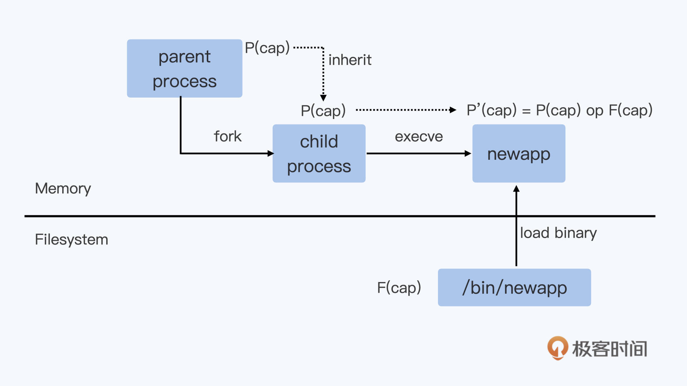

# 19 | 容器安全（1）：我的容器真的需要privileged权限吗?
你好，我是程远。从今天这一讲，我们进入到了容器安全的模块。

容器安全是一个很大的话题，容器的安全性很大程度是由容器的架构特性所决定的。比如容器与宿主机共享Linux内核，通过Namespace来做资源的隔离，通过shim/runC的方式来启动等等。

这些容器架构特性，在你选择使用容器之后，作为使用容器的用户，其实你已经没有多少能力去对架构这个层面做安全上的改动了。你可能会说用 [Kata Container](https://katacontainers.io/)、 [gVisor](https://gvisor.dev/) 就是安全“容器”了。不过，Kata或者gVisor只是兼容了容器接口标准，而内部的实现完全是另外的技术了。

那么对于使用容器的用户，在运行容器的时候，在安全方面可以做些什么呢？我们主要可以从这两个方面来考虑：第一是赋予容器合理的capabilities，第二是在容器中以非root用户来运行程序。

为什么是这两点呢？我通过两讲的内容和你讨论一下，这一讲我们先来看容器的capabilities的问题。

## 问题再现

刚刚使用容器的同学，往往会发现用缺省 `docker run` 的方式启动容器后，在容器里很多操作都是不允许的，即使是以root用户来运行程序也不行。

我们用下面的 [例子](https://github.com/chengyli/training/tree/main/security/capability) 来重现一下这个问题。我们先运行 `make image` 做个容器镜像，然后运行下面的脚本：

```shell
# docker run --name iptables -it registry/iptables:v1 bash
[root@0b88d6486149 /]# iptables -L
iptables v1.8.4 (nf_tables): Could not fetch rule set generation id: Permission denied (you must be root)

[root@0b88d6486149 /]# id
uid=0(root) gid=0(root) groups=0(root)

```

在这里，我们想在容器中运行 `iptables` 这个命令，来查看一下防火墙的规则，但是执行命令之后，你会发现结果输出中给出了"Permission denied (you must be root)"的错误提示，这个提示要求我们用root用户来运行。

不过在容器中，我们现在已经是以root用户来运行了，么为什么还是不可以运行"iptables"这条命令呢？

你肯定会想到，是不是容器中又做了别的权限限制？如果你去查一下资料，就会看到启动容器有一个"privileged"的参数。我们可以试一下用上这个参数，没错，我们用了这个参数之后，iptables这个命令就执行成功了。

```shell
# docker stop iptables;docker rm iptables
iptables
iptables
# docker run --name iptables --privileged -it registry/iptables:v1 bash
[root@44168f4b9b24 /]# iptables -L
Chain INPUT (policy ACCEPT)
target     prot opt source               destination

Chain FORWARD (policy ACCEPT)
target     prot opt source               destination

Chain OUTPUT (policy ACCEPT)
target     prot opt source               destination

```

看上去，我们用了一个配置参数就已经解决了问题，似乎很容易。不过这里我们可以进一步想想，用"privileged"参数来解决问题，是不是一个合理的方法呢？用它会有什么问题吗？

要回答这些问题，我们先来了解一下"privileged"是什么意思。从Docker的 [代码](https://github.com/moby/moby/blob/17.03.x/daemon/exec_linux.go#L25) 里，我们可以看到，如果配置了privileged的参数的话，就会获取所有的capabilities，那什么是capabilities呢？

```shell
            if ec.Privileged {
                        p.Capabilities = caps.GetAllCapabilities()
            }

```

## 基本概念

### Linux capabilities

要了解Linux capabilities的定义，我们可以先查看一下"Linux Programmer's Manual"中关于 [Linux capabilities](https://man7.org/linux/man-pages/man7/capabilities.7.html) 的描述。

在Linux capabilities出现前，进程的权限可以简单分为两类，第一类是特权用户的进程（进程的有效用户ID是0，简单来说，你可以认为它就是root用户的进程），第二类是非特权用户的进程（进程的有效用户ID是非0，可以理解为非root用户进程）。

特权用户进程可以执行Linux系统上的所有操作，而非特权用户在执行某些操作的时候就会被内核限制执行。其实这个概念，也是我们通常对Linux中root用户与非root用户的理解。

从kernel 2.2开始，Linux把特权用户所有的这些“特权”做了更详细的划分，这样被划分出来的每个单元就被称为capability。

所有的capabilities都在 [Linux capabilities](https://man7.org/linux/man-pages/man7/capabilities.7.html) 的手册列出来了，你也可以在内核的文件 [capability.h](https://github.com/torvalds/linux/blob/v5.4/include/uapi/linux/capability.h#L113) 中看到所有capabilities的定义。

对于任意一个进程，在做任意一个特权操作的时候，都需要有这个特权操作对应的capability。

比如说，运行iptables命令，对应的进程需要有CAP\_NET\_ADMIN这个capability。如果要mount一个文件系统，那么对应的进程需要有CAP\_SYS\_ADMIN这个capability。

我还要提醒你的是，CAP\_SYS\_ADMIN这个capability里允许了大量的特权操作，包括文件系统，交换空间，还有对各种设备的操作，以及系统调试相关的调用等等。

在普通Linux节点上，非root用户启动的进程缺省没有任何Linux capabilities，而root用户启动的进程缺省包含了所有的Linux capabilities。

我们可以做个试验，对于root用户启动的进程，如果把CAP\_NET\_ADMIN这个capability移除，看看它是否还可以运行iptables。

在这里我们要用到 [capsh](https://man7.org/linux/man-pages/man1/capsh.1.html) 这个工具，对这个工具不熟悉的同学可以查看超链接。接下来，我们就用capsh执行下面的这个命令：

```shell
# sudo /usr/sbin/capsh --keep=1 --user=root   --drop=cap_net_admin  --   -c './iptables -L;sleep 100'
Chain INPUT (policy ACCEPT)
target     prot opt source               destination

Chain FORWARD (policy ACCEPT)
target     prot opt source               destination

Chain OUTPUT (policy ACCEPT)
target     prot opt source               destination
iptables: Permission denied (you must be root).

```

这时候，我们可以看到即使是root用户，如果把"CAP\_NET\_ADMIN"给移除了，那么在执行iptables的时候就会看到"Permission denied (you must be root)."的提示信息。

同时，我们可以通过/proc文件系统找到对应进程的status，这样就能确认进程中的CAP\_NET\_ADMIN是否已经被移除了。

```shell
# ps -ef | grep sleep
root     22603 22275  0 19:44 pts/1    00:00:00 sudo /usr/sbin/capsh --keep=1 --user=root --drop=cap_net_admin -- -c ./iptables -L;sleep 100
root     22604 22603  0 19:44 pts/1    00:00:00 /bin/bash -c ./iptables -L;sleep 100

# cat /proc/22604/status | grep Cap
CapInh:            0000000000000000
CapPrm:          0000003fffffefff
CapEff:             0000003fffffefff
CapBnd:          0000003fffffefff
CapAmb:         0000000000000000

```

运行上面的命令查看 /proc//status里Linux capabilities的相关参数之后，我们可以发现，输出结果中包含5个Cap参数。

这里我给你解释一下， 对于当前进程，直接影响某个特权操作是否可以被执行的参数，是"CapEff"，也就是"Effective capability sets"，这是一个bitmap，每一个bit代表一项capability是否被打开。

在Linux内核 [capability.h](https://github.com/torvalds/linux/blob/v5.4/include/uapi/linux/capability.h#L203) 里把CAP\_NET\_ADMIN的值定义成12，所以我们可以看到"CapEff"的值是"0000003fffffefff"，第4个数值是16进制的"e"，而不是f。

这表示CAP\_NET\_ADMIN对应的第12-bit没有被置位了（0xefff = 0xffff & (~(1 << 12))），所以这个进程也就没有执行iptables命令的权限了。

对于进程status中其他几个capabilities相关的参数，它们还需要和应用程序文件属性中的capabilities协同工作，这样才能得到新启动的进程最终的capabilities参数的值。

我们看下面的图，结合这张图看后面的讲解：



如果我们要新启动一个程序，在Linux里的过程就是先通过fork()来创建出一个子进程，然后调用execve()系统调用读取文件系统里的程序文件，把程序文件加载到进程的代码段中开始运行。

就像图片所描绘的那样，这个新运行的进程里的相关capabilities参数的值，是由它的父进程以及程序文件中的capabilities参数值计算得来的。

具体的计算过程你可以看 [Linux capabilities](https://man7.org/linux/man-pages/man7/capabilities.7.html) 的手册中的描述，也可以读一下网上的这两篇文章：

- [Capabilities: Why They Exist and How They Work](https://blog.container-solutions.com/linux-capabilities-why-they-exist-and-how-they-work)
- [Linux Capabilities in Practice](https://blog.container-solutions.com/linux-capabilities-in-practice)

我就不对所有的进程和文件的capabilities集合参数和算法挨个做解释了，感兴趣的话你可以自己详细去看看。

这里你只要记住最重要的一点， **文件中可以设置capabilities参数值，并且这个值会影响到最后运行它的进程。** 比如，我们如果把iptables的应用程序加上 CAP\_NET\_ADMIN的capability，那么即使是非root用户也有执行iptables的权限了。

```shell
$ id
uid=1000(centos) gid=1000(centos) groups=1000(centos),10(wheel)
$ sudo setcap cap_net_admin+ep ./iptables
$ getcap ./iptables
./iptables = cap_net_admin+ep
$./iptables -L
Chain INPUT (policy ACCEPT)
target     prot opt source               destination

Chain FORWARD (policy ACCEPT)
target     prot opt source               destination
DOCKER-USER  all  --  anywhere             anywhere
DOCKER-ISOLATION-STAGE-1  all  --  anywhere             anywhere
ACCEPT     all  --  anywhere             anywhere             ctstate RELATED,ESTABLISHED
DOCKER     all  --  anywhere             anywhere
ACCEPT     all  --  anywhere             anywhere
ACCEPT     all  --  anywhere             anywhere
…

```

好了，关于Linux capabilities的内容到这里我们就讲完了，其实它就是把Linux root用户原来所有的特权做了细化，可以更加细粒度地给进程赋予不同权限。

## 解决问题

我们搞懂了Linux capabilities之后，那么对privileged的容器也很容易理解了。 **Privileged的容器也就是允许容器中的进程可以执行所有的特权操作。**

因为安全方面的考虑，容器缺省启动的时候，哪怕是容器中root用户的进程，系统也只允许了15个capabilities。这个你可以查看 [runC spec文档中的security](https://github.com/opencontainers/runc/blob/v1.0.0-rc92/libcontainer/SPEC.md#security) 部分，你也可以查看容器init进程status里的Cap参数，看一下容器中缺省的capabilities。

```shell
# docker run --name iptables -it registry/iptables:v1 bash
[root@e54694652a42 /]# cat /proc/1/status  |grep Cap
CapInh:            00000000a80425fb
CapPrm:          00000000a80425fb
CapEff:              00000000a80425fb
CapBnd:          00000000a80425fb
CapAmb:         0000000000000000

```

我想提醒你，当我们发现容器中运行某个程序的权限不够的时候，并不能“偷懒”把容器设置为"privileged"，也就是把所有的capabilities都赋予了容器。

因为容器中的权限越高，对系统安全的威胁显然也是越大的。比如说，如果容器中的进程有了CAP\_SYS\_ADMIN的特权之后，那么这些进程就可以在容器里直接访问磁盘设备，直接可以读取或者修改宿主机上的所有文件了。

所以，在容器平台上是基本不允许把容器直接设置为"privileged"的，我们需要根据容器中进程需要的最少特权来赋予capabilities。

我们结合这一讲开始的例子来说说。在开头的例子中，容器里需要使用iptables。因为使用iptables命令，只需要设置CAP\_NET\_ADMIN这个capability就行。那么我们只要在运行Docker的时候，给这个容器再多加一个NET\_ADMIN参数就可以了。

```shell
# docker run --name iptables --cap-add NET_ADMIN -it registry/iptables:v1 bash
[root@cfedf124dcf1 /]# iptables -L
Chain INPUT (policy ACCEPT)
target     prot opt source               destination

Chain FORWARD (policy ACCEPT)
target     prot opt source               destination

Chain OUTPUT (policy ACCEPT)
target     prot opt source               destination

```

## 重点小结

这一讲我们主要学习了如何给容器赋予合理的capabilities。

那么，我们自然需要先来理解什么是Linux capabilities。 **其实Linux capabilities就是把Linux root用户原来所有的特权做了细化，可以更加细粒度地给进程赋予不同权限。**

对于Linux中的每一个特权操作都有一个对应的capability，对于一个capability，有的对应一个特权操作，有的可以对应很多个特权操作。

每个Linux进程有5个capabilities集合参数，其中Effective集合里的capabilities决定了当前进程可以做哪些特权操作，而其他集合参数会和应用程序文件的capabilities集合参数一起来决定新启动程序的capabilities集合参数。

对于容器的root用户，缺省只赋予了15个capabilities。如果我们发现容器中进程的权限不够，就需要分析它需要的最小capabilities集合，而不是直接赋予容器"privileged"。

因为"privileged"包含了所有的Linux capabilities, 这样"privileged"就可以轻易获取宿主机上的所有资源，这会对宿主机的安全产生威胁。所以，我们要根据容器中进程需要的最少特权来赋予capabilities。

## 思考题

你可以查看一下你的Linux系统里ping程序文件有哪些capabilities，看看有什么办法，能让Linux普通用户没有执行ping的能力。

欢迎你在留言区和我交流互动。如果学完这一讲让你有所收获，也欢迎转发给你的同事、或者朋友，一起交流探讨容器安全的问题。