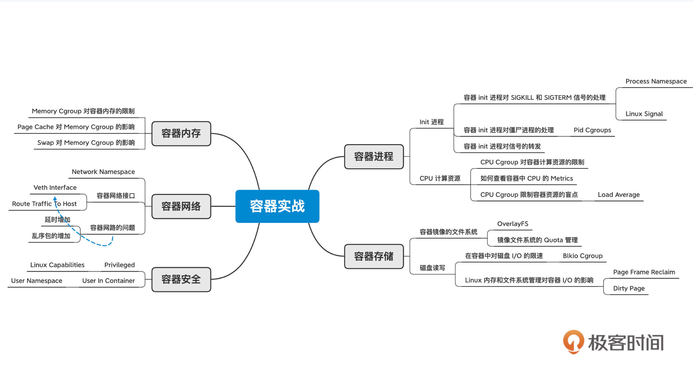

# 开篇词 | 一个态度两个步骤，成为容器实战高手
你好，我是李程远，欢迎你加入我的极客时间专栏。从今天开始，我想和你聊一聊，怎么解决容器里的各种问题。

先来介绍一下我自己吧。我毕业于浙江大学计算机系，第一份工作是开发基于Xen的Linux虚拟机，接下来的十几年，我的工作始终围绕着Linux系统。

在2013年，我加入eBay，从事云平台方面的工作，最先接触的是OpenStack云平台。

一直到了2015年的时候，我们的团队开始做Kubernetes，要用Kubernetes来管理eBay整个云平台。我们需要迁移所有eBay的应用程序，把它们从原来的物理机或者虚拟机迁移到容器的环境里。

在Kubernetes具体落地的过程中，我们碰到了形形色色的容器问题。

首先，我们都知道，容器是一种轻量级的隔离技术。而轻量级隔离造成了一些 **行为模式** 的不同，比如原来运行在虚拟机里的CPU监控程序，移到容器之后，再用原来的算法计算容器CPU使用率就不适用了。

然后呢，从 **隔离程度** 这个方面考虑，CPU、memory、IO （disk and network）真的能做到精确隔离吗？

其实还是有问题的，比如想让多个用户容器运行在一个节点上，我们就需要保证，每个容器的磁盘容量在一定的限额范围内，还需要合理分配磁盘读写性能。

第三个方面，就是 **处理性能敏感的应用。** 容器技术的引入，会带来新的开销，那么肯定会影响性能。

比如说，原来运行在物理机上、有极高性能要求的程序，在迁移到容器后，我们还需要对容器网络做优化，对Cgroup做优化。只有做了这样的优化，我们才能保证迁移过来的程序，当它们运行在容器里的时候，性能差异控制在2%以内（当时做迁移的标准）。

另外，如果涉及高内存使用的应用，我们做迁移的时候，还要考虑PageCache、Swap，还有HugePage等等问题，在叠加了Cgroup之后，会带来新的变化。

综合来看，我们遇到的问题有的很简单，看一下源代码，写个测试代码验证一下，一两个小时就可以搞定。但有的问题却很复杂，我们需要尝试不同的测试，反复查看各种源代码，陆陆续续花费一两个月的时间解决。

通过5年的不断努力，我和我的团队逐渐把eBay所有的业务都迁移到了容器中。现在，我们的云平台上运行着百万个容器。

## 怎么理解容器的知识体系？

可以说，从我接触容器知识到能够得心应手地解决各种容器问题，这个过程还真是有点磕磕绊绊。

一开始，我被各种各样的问题所淹没，觉得容器的内容太复杂了，没有一个系统性的解决方法。我只能是见招拆招，一个个解决，就这样，随着我解决的问题越来越多，我也开始思考，是不是有一些规律性的东西。

容器问题虽然有很多类型，既有基本功能问题，也有性能问题，还有不少稳定性问题。但大部分问题， **最终都会归结到Linux操作系统上。**

比如，容器里进程被OOM Kill了，这个OOM Killer就是Linux里常见的内存保护机制；容器的进程引起平均负载增高，而平均负载也是在Linux里被反复讨论的概念；还有，容器使用的OverlayFS系统，看上去和Linux常用的XFS、Ext4系统不同，但是它也是Linux内核维护的一种文件系统。

我们都知道，Linux操作系统不外乎是 **进程管理、内存管理、文件系统、网络协议栈，再加上一些安全管理。** 这样一梳理，容器的问题就都可以投射到Linux操作系统这些模块上了，是不是一下子感觉清晰了很多？

当然了，容器还有自己的特殊性，Linux内核原来的特性加上Namespace和Cgroups会带来的变化。

所以，我们在对应到每个模块上分析问题的时候，还需要考虑到Namespace和Cgroups。这两个概念是容器技术的基石，我们课程中要讨论的容器相关问题，多少都会和Namespace或者Cgroups相关。

总之就是一句话， **我们可以结合Linux操作系统的主要模块，把容器的知识结构系统地串联起来，同时看到Namespace和Cgroups带来的特殊性。**

## 怎么解决容器问题？

心中有了容器的知识体系，我们也就能在容器实践中解决具体的问题了。结合我自己这么多年的经历，我总结了一条经验， **解决容器问题需要一个态度+两个步骤。**

在解决容器问题的过程中，我们常见的误区就是浅尝辄止，不去挖掘问题的根本原因。我之前也碰到过这种情况，接下来我就拿一个具体的例子来说明。

有一次团队一位同学问我，怎么让Kubernetes节点上的容器，从内部触发自己的容器重启啊？

我试了一下，在容器中把第1号进程杀了，然后容器退出，Kubernetes自动地把容器带回来，就能实现类似的自动重启功能了，同事试了也可以，认为问题解决了，也挺开心的。我也没有多想，以为自己找到方法了。

后来又有一个同事和我说，这样做没有效果啊。我这才发现问题没那么简单，是我想当然了。

所以，我又花时间理了理Linux信号的基本知识，trace了一下内核代码，终于让我找到了真正的原因，那就是对于发送给1号进程的信号，内核会根据不同的类型、不同的注册状态，采取不同的处理方式。

你看，这是一个挺简单的问题，就是kill一下容器里的1号进程。你或许也遇到过，如果你也和我开始时的态度一样，就很可能会错过找到真正答案的机会。这就是我说的，解决容器问题时我们需要的一个态度：不要浅尝辄止，要刨根问底。

态度有了，那如果我们在线上碰到了更加复杂的问题，又该怎么解决呢？这就需要两个步骤了。

我们的第一步，就是 **化繁为简，重现问题。**

想要做到这一点，倒推回去，还是需要我们对基本的概念足够了解。只有对每个模块的概念都很清晰，我们才能对复杂问题做拆分。

能够对问题做拆分是不是就够了呢？其实还不够，我自己有一个判断标准，就是还要能够写模拟程序，看是否可以用最简单的程序来重现问题。 **如果我们能用简单的代码程序重现问题，那么问题也就解决了一半。**

接下来我们还需要进行第二步，就是想办法 **把黑盒系统变成白盒系统。**

我在前面提到过，容器的问题大多都会归结到Linux系统上。Linux系统从内核、库函数以及服务程序上看，虽然都是开源的，但是它运行在生产环境的时候，几乎就是一个黑盒。

之所以说系统是黑盒，一方面是因为这个系统太庞大，太复杂了；另一方面，在实际运行的时候，只有很少的log会记录运行的过程和参数。所以，在出问题的时候，我们无法知道问题对应的代码，我们也不可能在生产环境中随心所欲地加debug log。

因此，我们就需要想点办法把它变成白盒，才能去排查和解决问题。具体怎么做呢？这里需要我们熟练地掌握调试工具，这样才能把某些函数变成“白盒”，从而找到复杂问题的根本原因，再对症下药。

这里我想提醒你的是，我们熟练掌握工具有个重要前提，就是从全局上去掌握Linux系统以及容器，回归到底层原理去看问题。可以说，你把基础概念吃透了，练好了“内功心法”，有了这个底子，工具运用是水到渠成的事儿。

## 我是怎么设计这门课的？

讲到这里，估计你会有个问题，这“一个态度两个步骤”很好理解啊，我也了解到了，但是怎么才能真正地掌握这些知识、拥有解决问题的思路呢？

这就是我们这门课想要实现的目标了，那就是带你走进一个个具体的案例中，体验解决问题的全过程，在实战中习得知识和技能。

所以，在这门课程里，我会把零散的知识点体系化，按照类似操作系统的模块划分，为你讲述我所理解的容器。

我们将一起学习容器进程、容器内存、容器存储、 容器网络、容器安全这几部分内容。在每一节课中，我们都会解决一个实际问题或者研究一个现象。围绕这个问题，我会为你讲解相关的知识点，并带着你结合实际的操作做理解，最终解决问题或者解释现象。

我们要实现两个学习目标。

**第一，系统掌握容器核心点：Namespace和Cgroups。**

**第二，理解Namespace和Cgroups对Linux原来模块的影响，看看它们是如何影响一些传统操作系统的行为。**

比如Memory Cgroup，对Pagecache和Swap空间有怎样的影响；再比如在proc文件系统下，我们的网络参数应用了Network Namespace之后，需要如何重新设置等等。

当我们一起把容器知识的框架搭建起来，把里面的核心概念、底层逻辑掌握之后，你其实就可以解决容器的大部分问题了。但是，我知道，你一定还有个问题，那就是工具呢？不讲了吗？我真的可以水到渠成吗？

不要着急，这里我要做个特别说明，课程结束后，我会给你做一个专题加餐。目前，我是这么设计的，我选择了一个真实案例，就是在生产环境中容器网络延时不稳定的问题。

在这个案例中，我们会用到 **perf，ftrace，bcc/ebpf这几个Linux调试工具**，了解它们的原理，熟悉它们在调试问题的不同阶段所发挥的作用，然后用这些工具一起来解决现实场景中复杂的容器问题。

为什么一定要把这个专题放到课程结束后呢？因为我需要给你留一段消化吸收的时间，这里我安排了一个月时间。

希望你能利用这一个月，把整个课程的内容复习一遍，把基本功打扎实，你才能在专题学习里彻底掌握这几个工具，遇到类似问题时也能有清晰的解决思路，这样这个专题的学习效率也才能更高。

之所以一定要这么安排，也是想跟你表达我的一个观点，就是工具很重要，但是工具不是最重要的。

所有学习，我们一定是先掌握知识体系，一定不能陷入唯工具论的思维框架里。我知道，这样的安排似乎只是我的一家之言，但这恰恰就是我想通过这门课交付给你的，因为这些真的是我自己的经验之谈，是我的受益点。这么学看似慢了，但其实只有这样，我们走的才是捷径。

好了，介绍完了课程设计和学习目标，还有一件事特别重要，我要特别提醒下。

在这个容器课程中，每一讲里都会有一些小例子，所以需要 **你有一台安装有Linux的机器，或者用VirtualBox安装一个虚拟机来跑Linux。Linux的版本建议是CentOS 8 或者是Ubuntu 20.04。**

希望你提前做好准备，这样在学习的过程中，你就能跟着我的讲解进行一些实际的操作，对容器知识也会有更加深刻的印象。

你还可以拉上身边的小伙伴，组团来学习这门课程，共同学习、互相鼓励的氛围会让你的学习体验更好。另外，有什么想法或者疑问，你都可以通过留言区和我交流、互动。

最后，我想和你说， **容器是一个很好的技术窗口，它可以帮助你在这个瞬息万变的计算机世界里看到后面那些“不变”的技术，只有掌握好那些“不变”的技术，你才可以更加从容地去接受技术的瞬息万变。**

我希望，这个专栏能帮你打开容器这扇窗，让你看到更精彩的风景，建立起你自己的容器知识体系。从今天开始，跟着我一起搞懂容器，提升实力，吃透原理，在技术之路上一起前进吧！