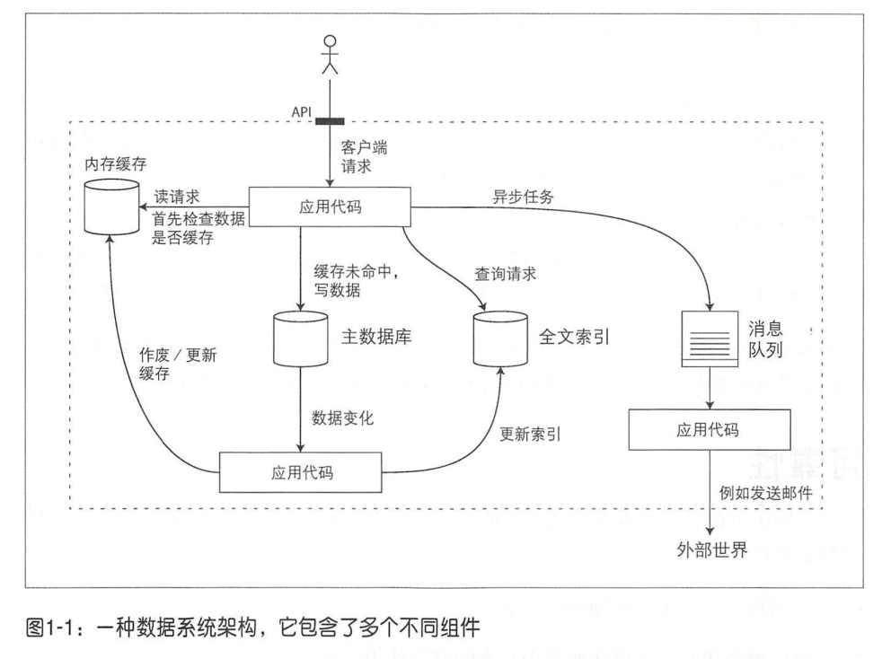

# 第1章 可靠、可扩展与可维护的应用系统

当今许多新型应用都属于数据密集型（data-intensive），而不是计算密集型(compute-intensive）。对于这些类型应用，CPU的处理能力往往不是第一限制性因素，关键在于数据量、数据的复杂度及数据的快速多变性。  

数据密集型应用通常也是基于标准模块构建而成，每个模块负责单一的常用功能。例如，许多应用系统都包含以下模块：  

- 数据库：用以存储数据，这样之后应用可以再次访问。
- 高速缓存：缓存那些复杂或操作代价昂贵的结果，以加快下一次访问。
- 索引：用户可以按关键字搜索数据并支持各种过滤。
- 流式处理：持续发送消息至另一个进程，处理采用异步方式。
- 批处理：定期处理大量的累积数据。

这些模块也许看上去习以为常，主要是因为这些“数据处理系统”（datasystems）  

已经做了非常漂亮的抽象，以至于我们已经习惯于拿来即用，而没有做太多深入地思考。由于目前业界已有很多数据方案可供选择，当需要构建一个新应用时，相信大多数开发者不会从头开始，例如写一个全新的数据存储引擎。  

但情况并非如此简单。确实已有很多数据库系统，但因为需求和设计目标的差异，个中精妙都不尽相同。缓存和索引方案与之类似。因此在构建某个特定应用时，我们总是需要弄清楚哪些组件、哪些方法最适合自己，并且当单个组件无法满足需求而必须组合使用时，总要面临更多的技术挑战。  

本书既介绍系统原理，也注重具体实践，通过二者结合的章节之旅慢慢展示如何构建数据密集型应用。我们还将探索现有工具的相同之处、差异所在，以及它们如何达成预设目标。  

在本章，我们将首先探讨所关注的核心设计目标：可靠、可扩展与可维护的数据系统。澄清本源，解析处理之道，建立后续章节所需的基本要点。在接下来的章节中，我们将层层推进，深入探讨系统设计时所面临的种种抉择与权衡。  

## 认识数据系统

我们通常将数据库、队列、高速缓存等视为不同类型的系统。虽然数据库和消息队列存在某些相似性，例如两者都会保存数据（至少一段时间），但他们却有着截然不同的访问模式，这就意味着不同的性能特征和设计实现。  

那么为什么本书将它们归为一大类即“数据系统”（datasystem）呢？  

首先，近年来出现了许多用于数据存储和处理的新工具。它们针对各种不同的应用场景进行优化，不适合再归为传统类型[1]。例如，Redis既可以用于数据存储也适用于消息队列，ApacheKafka作为消息队列也具备了持久化存储保证。系统之间的界限正在变得模糊。  

其次，越来越多的应用系统需求广泛，单个组件往往无法满足所有数据处理与存储需求。因而需要将任务分解，每个组件负责高效完成其中一部分，多个组件依靠应用层代码驱动有机衔接起来。  

举个例子，假定某个应用包含缓存层（例如Memcached）与全文索引服务器（如Elasticsearch或Solr），二者与主数据库保持关联，通常由应用代码负责缓存、索引与主数据库之间的同步，如图1-1所示（具体技术将在后面的章节中详细介绍）。  

设计数据系统或数据服务时， 一定会碰到很多棘手的问题。例如，当系统内出现了局部失效时，如何确保数据的正确性与完整性？当发生系统降级（ degrade ）时，该如何为客户提供一致的良好表现？负载增加时，系统如何扩展？友好的服务API该如何设计？

影响数据系统设计的因素有很多，其中包括相关人员技能和经验水平、遗留系统依赖性、交付周期、对不同风险因素的容忍度、监管合规等。这些因素往往因时因地而异。本书将专注于对大多数软件系统都极为重要的三个问题：

- 可靠性 （Reliability）

当出现意外情况如硬件、软件故障、人为失误等，系统应可以继续正常运转：虽然性能可能有所降低，但确保功能正确。具体请参阅本章后面的“可靠性” 一节 。

- 可扩展性（Scalability）

随着规模的增长 ，例如数据量 、流量或复杂性，系统应以合理的方式来匹配这种增长，具体请参阅本章后面的 “可扩展性 ” 一节。

- 可维护性 （Maintainability）

随着时间的推移，许多新的人员参与到系统开发和运维， 以维护现有功能或适配新场景等，系统都应高效运转。具体请参阅本章后面的“可维护性”一节。

### **可靠性**

每个人脑子里都有一个直观的认识 ， 即什么意味着可靠或者不可靠。对于软件，典型的期望包括：

- 应用程序执行用户所期望的功能。
- 可以容忍用户出现错误或者不正确的软件使用方怯 。
- 性能可以应对典型场景 、 合理负载压力和数据量。
- 系统可防止任何未经授权的访问和滥用。

如果所有上述目标都要支持才算 “正常工作”，那么我们可以认为可靠性大致意味着 ：即使发生了某些错误，系统仍可以继续正常工作。

可能出错的事情称为错误（ faults ）或故障，系统可应对错误则称为容错（ fault-­tolerant ）或者弹性（ resilient ）。 前一个词略显误导 ：似乎暗示着系统可以容忍各种可能的故障类型，显然实际中这是不可能的。举一个夸张一些的例子，如果整个地球（及其上的所有服务器）都被黑洞吞噬，那么要在这个级别容错就意味着必须在宇宙范围内进行系统冗余。试想，这将是天价的预算。因此，容错总是指特定类型的故障 ，这样的系统才更有实际意义。

注意， 故障与失效（ failure ） 不完全一 致 。故障通常被定义为组件偏离其正常规格，而失效意味系统作为一个整体停止，无法向用户提供所需的服务。我们不太可能将故障概率降低到零，因此通常设计容错机制来避免从故障引发系统失效。本书将介绍在不可靠组件基础上构建可靠性系统的相关技术。

在这种容错系统中，用于测试目的，可以故意提高故障发生概率，例如通过随机杀死某个进程，来确保系统仍保持健壮。很多关键的bug实际上正是由于错误处理不当而造成的。通过这种故意引发故障的方式，来持续检验、测试系统的容错机制，增加对真实发生故障时应对的信心。 Netflix的 Chaos Monkey系统就是这种测试的典型例子。

虽然我们通常倾向于容忍故障而不是预防故障，但是也存在“预防胜于治疗”的情况，安全问题就是一例，例如 ： 如果攻击者破坏了系统并窃取了敏感数据，则该事件造成的影响显然无法被撤销。然而，本书主要针对那些影响可以被消除的故障类型，接下来详细介绍。

#### **硬件故障**

当我们考虑系统故障时，对于硬件故障总是很容易想到 ： 硬盘崩溃，内存故障，电网停电，甚至有人误拔掉了网线。任何与大型数据中心合作过的人都可以告诉你，当有很多机器时，这类事情迟早会发生。

有研究证明硬盘的平均无故障时间（ MTTF ）约为 10 ～ 50年。因此，在一个包括10 000个磁盘的存储集群中，我们应该预期平均每天有一个磁盘发生故障。

我们的第一个反应通常是为硬件添加冗余来减少系统故障率。 例如对磁盘配置RAID ，服务器配备双电源，甚至热插拔CPU， 数据中心添加备用电源、发电机等。当一个组件发生故障，元余组件可以快速接管，之后再更换失效的组件。这种方法可能并不能完全防止硬件故障所引发的失效，但还是被普遍采用，且在实际中也确实可以让系统不间断运行长达数年。

#### **软件错误**

我们通常认为硬件故障之间多是相互独立的： 一台机器的磁盘出现故障并不意味着另一台机器的磁盘也要失效。除非存在某种弱相关（例如一些共性原因，如服务器机架中的温度过高），否则通常不太可能出现大量硬件组件同时失效的情况。

另一类故障则是系统内的软件问题。这些故障事先更加难以预料，而且因为节点之间是由软件关联的，因而往往会导致更多的系统故障 。 例如：

- 由于软件错误，导致当输入特定值时应用服务器总是崩溃。 例如， 2012年6月30日发生闰秒，由于Linux 内核中的一个bug ，导致了很多应用程序在该时刻发生挂起。
- 一个应用进程使用了某些共享如CPU、内存、磁盘或网络带宽 ，但却不幸失控跑飞了。
- 系统依赖于某些服务，但该服务突然变慢，甚至无响应或者开始返回异常的响应。
- 级联故障，其中某个组件的小故障触发另一个组件故障，进而引发更多的系统问题。

导致软件故障的bug通常会长时间处于引而不发的状态，直到碰到特定的触发条件。这也意味着系统软件其实对使用环境存在某种假设，而这种假设多数情况都可以满足，但是在特定情况下，假设条件变得不再成立 。

软件系统问题有时没有快速解决办法，而只能仔细考虑很多细节，包括认真检查依赖的假设条件与系统之间交互 ，进行全面的测试，进程隔离，允许进程崩愤并自动重启，反复评估，监控并分析生产环节的行为表现等。如果系统提供某些保证，例如，在消息队列中，输出消息的数量应等于输入消息的数量， 则可以不断地检查确认 ，如发现差异则立即告警。

#### **人为失误**

设计和构建软件系统总是由人类完成， 也是由人来运维这些系统。即使有时意图是好的，但人却无法做到万无一失。例如，一项针对大型互联网服务的调查发现，运维者的配置错误居然是系统下线的首要原因，而硬件问题（服务器或网络）仅在10%～25% 的故障中有所影响。

#### **可靠性的重要性**

可靠性绝不仅仅针对的是核电站和空中交管软件之类的系统，很多应用都需要可靠工作。商业软件中的错误会导致效率下降（如数据报告错误，甚至带来法律风险），电子商务网站的暂停会对营收和声誉带来巨大损失。

即使在所谓“非关键”应用中，我们也应秉持对用户负责的态度。例如一对父母，将其所有的照片以及他们孩子的视频存放在你的照片应用中。 如果不幸发生了数据库损坏，他们的感受可想而知，他们是否知道该如何从备份数据来执行恢复？

当然， 也会存在其他一些情况，例如面对不太确定的市场开发原型系统，或者服务的利润微薄，有时也会牺牲一些可靠性来降低开发成本或者运营开销，对此， 我们总是建议务必三思后行。

### **可扩展性**

即使系统现在工作可靠 ， 并不意味着它将来一定能够可靠运转。发生退化的一个常见原因是负载增加：例如也许并发用户从最初的 10 000个增长到 100 000个，或从 100万到 1000万；又或者系统目前要处理的数据量超出之前很多倍。

可扩展性是用来描述系统应对负载增加能力的术语。但是请注意，它并不是衡量一个系统的一维指标， 谈论“ X是可扩展 ”或“ Y不扩展”没有太大意义。相反，讨论可扩展性通常要考虑这类问题 ： “如果系统以某种方式增长，我们应对增长的措施有哪些”， “我们该如何添加计算资源来处理额外的负载” 。

#### **描述负载**

首先，我们需要简洁地描述系统当前的负载 ， 只有这样才能更好地讨论后续增长问题（例如负载加倍会意味着什么）。负载可以用称为负载参数的若干数字来描述。参数的最佳选择取决于系统的体系结构，它可能是Web服务器的每秒请求处理次数，数据库中写入的比例 ，聊天室的同时活动用户数量， 缓存命中率等。 有时平均值很重要 ，有时系统瓶颈来自于少数峰值 。

#### **描述性能**

描述系统负载之后，接下来设想如果负载增加将会发生什么。有两种考虑方式：

- 负载增加，但系统资源（如CPU、内存、网络带宽等）保持不变，系统性能会发生什么变化？
- 负载增加，如果要保持性能不变，需要增加多少资源？

这两个问题都会关注性能指标，所以我们先简要介绍一下如何描述系统性能。

在批处理系统如Hadoop 中 ，我们通常关心吞吐量 （ throughput ），即每秒可处理的记录条数 ，或者在某指定数据集上运行作业所需的总时间的 ；而在线系统通常更看重服务的响应时间（ response time），即客户端从发送请求到接收响应之间的间隔 。

即使是反复发送、处理相同的请求，每次可能都会产生略微不同的响应时间。实际情况往往更复杂，由于系统要处理各种不同的请求，晌应时间可能变化很大。因此，最好不要将响应时间视为一个固定的数字，而是可度量的一种数值分布。

我们经常考察的是服务请求的平均响应时间（严格来说，术语“平均值”并没有明确采用何种具体公式，但通常被理解为算术平均值：给定n个值，将所有值相加，并除以n ） 。然而，如果想知道更典型的响应时间，平均值并不是合适的指标 ，因为它掩盖了一些信息，无法告诉有多少用户实际经历了多少延迟。

因此最好使用百分位数（ percentiles ）。如果已经搜集到了响应时间信息，将其从最快到最慢排序，中位数（ median ）就是列表中间的响应时间。例如，如果中位数响应时间为200 ms ，那意味着有一半的请求响应不到 200 ms ，而另一半请求则需要更长的时间。

中位数指标非常适合描述多少用户需要等待多长时间： 一半的用户请求的服务时间少于中位数响应时间，另一半则多于中位数的时间。因此中位数也称为50百分位数，有时缩写为p50 。请注意，中位数对应单个请求 ：这也意味着如果某用户发了多个请求，那么它们中至少一个比中位数慢的概率远远大于50% 。

......

#### **应对负载增加的方法**

我们已经讨论了描述负载的参数以及衡量性能的相关指标，接下来讨论可扩展性：即当负载参数增加时， 应如何保持良好性能？

首先， 针对特定级别负载而设计的架构不太可能应付超出预设目标10倍的实际负载 。如果目标服务处于快速增长阶段，那么需要认真考虑每增加一个数量级的负载，架构应如何设计。

现在谈论更多的是如何在垂直扩展（即升级到更强大的机器）和水平扩展（即将负载分布到多个更小的机器）之间做取舍。在多台机器上分配负载也被称为无共享体系结构。在单台机器上运行的系统通常更简单，然而高端机器可能非常昂贵，且扩展水平有限，最终往往还是无法避免需要水平扩展。实际上，好的架构通常要做些实际取舍，例如，使用几个强悍的服务器仍可以比大量的小型虚拟机来得更简单、便宜。

某些系统具有弹性特征，它可以自动检测负载增加，然后自动添加更多计算资源，而其他系统则是手动扩展（人工分析性能表现，之后决定添加更多计算）。如果负载高度不可预测，则自动弹性系统会更加高效 ，但或许手动方式可以减少执行期间的意外情况（参阅第6章的“分区再平衡”）。

把无状态服务分布然后扩展至多台机器相对比较容易，而有状态服务从单个节点扩展到分布式多机环境的复杂性会大大增加。出于这个原因，直到最近通常的做法一直是，将数据库运行在一个节点上（采用垂直扩展策略）， 直到高扩展性或高可用性的要求迫使不得不做水平扩展。

然而，随着相关分布式系统专门组件和编程接口越来越好 ， 至少对于某些应用类型来讲，上述通常做法或许会发生改变。可以乐观设想 ，即使应用可能并不会处理大量数据或流量，但未来分布式数据系统将成为标配。在本书后续部分，我们将介绍多种分布式数据系统，不仅可以帮助提高可扩展性， 也会提高易用性与可维护性。

超大规模的系统往往针对特定应用而高度定制，很难有一种通用的架构。背后取舍因素包括数据读取量、写入量、待存储的数据量、数据的复杂程度、 响应时间要求、访问模式等，或者更多的是上述所有因素的叠加，再加上其他更复杂的问题。

例如，即使两个系统的数据吞吐量折算下来是一样的，但是为每秒处理 100000次请求（每个大小为 1KB ）而设计的系统，与为每分钟3个请求（每个大小为 2GB ）设计的系统会大不相同。

对于特定应用来说，扩展能力好的架构通常会做出某些假设，然后有针对性地优化设计，如哪些操作是最频繁的，哪些负载是少数情况。如果这些假设最终发现是错误的，那么可扩展性的努力就白费了，甚至会出现与设计预期完全相反的情况。对于早期的初创公司或者尚未定型的产品，快速迭代推出产品功能往往比投入精力来应对不可知的扩展性更为重要。

可扩展架构通常都是从通用模块逐步构建而来，背后往往有规律可循，所以本书将会讨论这些通用模块和常见模式，希望对读者有所借鉴。

### **可维护性**

众所周知，软件的大部分成本并不在最初的开发阶段，而是在于整个生命周期内持续的投入，这包括维护与缺陷修复，监控系统来保持正常运行、故障排查、适配新平台、搭配新场景、技术缺陷的完善以及增加新功能等。

不幸的是，许多从业人根本不喜欢维护这些所谓的遗留系统，例如修复他人埋下的错误，或者使用过时的开发平台，或者被迫做不喜欢的工作。坦白说，每一个遗留系统总有其过期的理由，所以很难给出一个通用的建议该如何处理它们。

但是，换个角度，我们可以从软件设计时开始考虑，尽可能较少维护期间的麻烦，甚至避免造出容易过期的系统。为此，我们将特别关注软件系统的三个设计原则 ：

- 可运维性

方便运营团队来保持系统平稳运行。

- 简单性

简化系统复杂性，使新工程师能够轻松理解系统。注意这与用户界面的简单性并不一样。

- 可演化性

后续工程师能够轻松地对系统进行改进，并根据需求变化将其适配到非典型场景，也称为可延伸性、易修改性或可塑性。

与可靠性和可扩展性类似，实现上述这些目标也没有简单的解决方案。接下来，我们首先建立对这三个特性的理解。

#### **可运维性：运维更轻松**

有人认为， “良好的操作性经常可以化解软件的局限性，而不规范的操作则可以轻松击垮软件”。虽然某些操作可以而且应该是自动化的 ，但最终还是需要人来执行配置并确保正常工作。

运营团队对于保持软件系统顺利运行至关重要。 一个优秀的运营团队通常至少负责以下内容:

- 监视系统的健康状况，并在服务出现异常状态时快速恢复服务。
- 追踪问题的原因，例如系统故障或性能下降。
- 保持软件和平台至最新状态， 例如安全补丁方面。
- 了解不同系统如何相互影响，避免执行带有破坏性的操作 。
- 预测未来可能的问题，并在问题发生之前及时解决（例如容量规划）。
- 建立用于部署、配置管理等良好的实践规范和工具包 。
- 执行复杂的维护任务， 例如将应用程序从一个平台迁移到另一个平台。
- 当配置更改时，维护系统的安全稳健。
- 制定流程来规范操作行为，并保持生产环境稳定 。
- 保持相关知识的传承（如对系统理解），例如发生团队人员离职或者新员工加入等。

良好的可操作性意味着使日常工作变得简单，使运营团队能够专注于高附加值的任务。数据系统设计可以在这方面贡献很多， 包括 ：

- 提供对系统运行时行为和内部的可观测性，方便监控。
- 支持自动化， 与标准工具集成 。
- 避免绑定特定的机器，这样在整个系统不间断运行的同时，允许机器停机维护。
- 提供良好的文档和易于理解的操作模式，诸如“如果我做了X ，会发生Y”。
- 提供良好的默认配置，且允许管理员在需要时方便地修改默认值。
- 尝试自我修复，在需要时让管理员手动控制系统状态 。
- 行为可预测，减少意外发生。

#### **简单性：简化复杂度**

小型软件项目通常可以写出简单而漂亮的代码 ，但随着项目越来越大，就会越来越复杂和难以理解。这种复杂性拖慢了开发效率，增加了维护成本。一个过于复杂的软件项目有时被称为一个“大泥潭”。

复杂性有各种各样的表现方式 ： 状态空间的膨胀，模块紧搞合，令人纠结的相互依赖关系， 不一致的命名和术语，为了性能而采取的特殊处理，为解决某特定问题而引人的特殊框架等。在参考文献中有很多这方面的讨论。

复杂性使得维护变得越来越困难， 最终会导致预算超支和开发进度滞后。对于复杂的软件系统，变更而引人潜在错误的风险会显著加大，最终开发人员更加难以准确理解、评估或者更加容易忽略相关系统行为，包括背后的假设，潜在的后果，设计之外的模块交互等。相反 ，降低复杂性可以大大提高软件的可维护性，因此简单性应该是我们构建系统的关键目标之一 。

简化系统设计并不意味着减少系统功能，而主要意味着消除意外方面的复杂性，正如Moseley和Marks把复杂性定义为一种“意外”，即它并非软件固有、被用户所见或感知，而是实现本身所衍生出来的问题。

消除意外复杂性最好手段之一是抽象。 一个好的设计抽象可以隐藏大量的实现细节，并对外提供干净、易懂的接口。 一个好的设计抽象可用于各种不同的应用程序。这样，复用远比多次重复实现更有效率；另一方面，也带来更高质量的软件，而质量过硬的抽象组件所带来的好处，可以使运行其上的所有应用轻松获益。

然而，设计好的抽象还是很有挑战性。在分布式系统领域中，虽然已有许多好的算法可供参考，但很多时候我们并不太清楚究竟该如何利用他们，封装到抽象接口之中，最终帮助将系统的复杂性降低到可靠控的级别。本书我们将广泛考察如何设计好的抽象，这样至少能够将大型系统的一部分抽象为定义明确、可重用的组件。

#### **可演化性：易于改变**

一成不变的系统需求几乎没有，想法和目标经常在不断变化：适配新的外部环境，新的用例，业务优先级的变化，用户要求的新功能，新平台取代旧平台，法律或监管要求的变化，业务增长促使架构的演变等。

在组织、流程方面 ，敏捷开发模式为适应变化提供了很好的参考。敏捷社区还发布了很多技术工具和模式，以帮助在频繁变化的环境中开发软件，例如测试驱动开发(TDD)和重构。

这些敏捷开发技术目前多数还只是针对小规模、本地模式（例如同一应用程序中的几个源代码文件）环境。本书将探索在更大的数据系统层面上提高敏捷性，系统由多个不同特性的应用或者服务协作而成 。 

我们的目标是可以轻松地修改数据系统，使其适应不断变化的需求，这和简单性与抽象性密切相关 ： 简单易懂的系统往往比复杂的系统更容易修改。这是一个非常重要的理念，我们将采用另一个不同的词来指代数据系统级的敏捷性 ， 即可演化性。

### **小结**

这一章我们探讨了一些关于数据密集型应用的基本原则，这些原则将指导如何阅读本书的其余部分。

一个应用必须完成预期的多种需求，主要包括功能性需求（即应该做什么，比如各种存储、检索、搜索和处理数据）和一些非功能性需求（ 即常规特性、例如安全性 、可靠性、合规性、可伸缩性、兼容性和可维护性） 。本章我们着重梳理讨论了可靠性、可扩展性和可维护性。

可靠性意味着即使发生故障，系统也可以正常工作。故障包括硬件（通常是随机的，不相关的）、软件（缺陷通常是系统的，更加难以处理）以及人为（总是很难避免时不时会出错）方面。容错技术可以很好地隐藏某种类型故障，避免影响最终用户。

可扩展性是指负载增加时， 有效保持系统性能的相关技术策略。为了讨论可扩展性，我们首先探讨了如何定量描述负载和性能。对于可扩展的系统，增加处理能力的同时，还可以在高负载情况下持续保持系统的高可靠性。

可维护性则意味着许多方面，但究其本质是为了让工程和运营团队更为轻松。良好的抽象可以帮助降低复杂性， 并使系统更易于修改和适配新场景。良好的可操作性意味着对系统健康状况有良好的可观测性和有效的管理方法。

然而知易行难，使应用程序可靠、可扩展或可维护并不容易。考虑到一些重要的模式和技术在很多不同应用中普遍适用，在接下来的几章中，我们就一些数据密集系统例子，分析它们如何实现上述这些目标。

# 第2章 数据模型与查询语言

# 第3章 数据存储与检索

从最基本的层面看，数据库只需做两件事情 ： 向它插入数据时，它就保存数据：之后查询时，它应该返回那些数据。

在第2章中，我们讨论了数据模型和查询语言，即关于应用开发人员向数据库指明数据格式并在之后如何查询的机制。本章我们主要从数据库的角度再来探讨同样的问题，即如何存储输入的数据，并在收到查询请求时，怎样重新找到数据。

作为一名应用系统开发人员，为什么要关注数据库内部的存储和检索呢？首先，你不太可能从头开始实现一套自己的存储引擎，往往只需要从众多现有的存储引擎中选择一个适合自己应用的存储引擎。 因此，为了针对你特定的工作负载而对数据库调优时，最好对存储引擎的底层机制有一个大概的了解。

特别地，针对事务型工作负载和针对分析型负载的存储引擎优化存在很大的差异。本章“事务处理与分析处理”和“面向列的存储”部分，将讨论一系列针对分析型进行优化的存储引擎。

我们首先讨论存储引擎 ，这些存储引擎用于大家比较熟悉的两种数据库，即传统的关系数据库和大多数所谓的NoSQL数据库。我们将研究两个存储引擎家族 ，即日志结构的存储引擎和面向页的存储引擎，比如B-tree 。

### **数据库核心：数据结构**

我们来看一个世界上最简单的数据库， 它由两个Bash 函数实现：

\#!/bin/bash db_set () {  echo "$1,$2" >> database } db_get () {  grep "^$1," database | sed -e "s/^$1,//" | tail -n 1 }

这两个函数实现了键值存储的功能。执行 db_set key value 会将 键（key） 和 值（value） 存储在数据库中。键和值（几乎）可以是你喜欢的任何东西，例如，值可以是 JSON 文档。然后调用 db_get key 会查找与该键关联的最新值并将其返回。

麻雀虽小，五脏俱全：

$ db_set 123456 '{"name":"London","attractions":["Big Ben","London Eye"]}' $ db_set 42 '{"name":"San Francisco","attractions":["Golden Gate Bridge"]}' $ db_get 42 {"name":"San Francisco","attractions":["Golden Gate Bridge"]}

底层的存储格式非常简单：一个文本文件，每行包含一条逗号分隔的键值对。每次对 db_set 的调用都会向文件末尾追加记录，所以每次更新键的时候旧版本的值不会被覆盖 —— 因而查找最新值的时候，需要找到文件中键最后一次出现的位置（因此 db_get 中使用了 tail -n 1 )。

$ db_set 42 '{"name":"San Francisco","attractions":["Exploratorium"]}' $ db_get 42 {"name":"San Francisco","attractions":["Exploratorium"]} $ cat database 123456,{"name":"London","attractions":["Big Ben","London Eye"]} 42,{"name":"San Francisco","attractions":["Golden Gate Bridge"]} 42,{"name":"San Francisco","attractions":["Exploratorium"]}

db_set 函数对于极其简单的场景其实有非常好的性能，因为在文件尾部追加写入通常是非常高效的。与 db_set 相似，许多数据库内部都使用日志（log），日志是一个仅支持追加（append-only）式更新的数据文件。虽然真正的数据库有更多更为复杂的问题需要考虑（例如并发控制、回收硬盘空间以控制日志文件大小、处理错误与部分完成写记录等），但基本原理是相同的。日志机制极其有用，我们还将在本书的其它部分多次提到它。

日志这个词通常指的是应用程序的运行输出日志，来记录发生了什么事情。在本书中，日志则是一个更为通用的含义，表示一个仅能追加的记录序列集合。它可能是人类不可读的，可能是二进制格式而只能被其他程序来读取。

另一方面，如果日志文件保存了大量的记录，那么 db_get 函数的性能会非常差。每次想查找一个键，db_get 必须从头到尾扫描整个数据库文件来查找键的出现位置。在算法术语中，查找的开销是 O(n） ，即如果数据库的记录条数加倍，则查找需要两倍的时间。这一点并不好。

为了高效地查找数据库中特定键的值 ， 需要新的数据结构： 索引。在本章中，我们将介绍一些索引结构并对它们进行比较 ；它们背后的基本想法都是保留一些额外的元数据，这些元数据作为路标，帮助定位想要的数据。如果希望用几种不同的方式搜索相同的数据，在数据的不同部分，我们可能定义多种不同的索引。

索引是基于原始数据派生而来的额外数据结构。很多数据库允许单独添加和删除索引，而不影响数据库的内容，它只会影响查询性能。维护额外的结构势必会引入开销，特别是在新数据写入时。对于写入，它很难超过简单地追加文件方式的性能，因为那已经是最简单的写操作了。由于每次写数据时，需要更新索引，因此任何类型的索引通常都会降低写的速度。

这里涉及存储系统中重要的权衡设计 ： 适当的索引可以加速读取查询，但每个索引都会减慢写速度。为此，默认情况下，数据库通常不会对所有内容进行索引 ，它需要应用开发人员或数据库管理员，基于对应用程序典型查询模式的了解，来手动选择索引。目的是为应用程序提供最有利加速的同时，避免引入过多不必要的开销 。

#### **哈希索引**

让我们从 键值数据（key-value Data） 索引开始。这不是你可以构建索引的唯一数据类型，但键值数据是很常见的。而且是其他更复杂索引的基础构造模块。

键值存储与大多数编程语言所内置的字典结构非常相似，通常采用hash map (或者hash table，哈希表)来实现。许多算法资料中都介绍过hash map，所以这里不再详细介绍它们工作的细节。既然我们已经可以用散列映射来表示内存中的数据结构，为什么不使用它来索引硬盘上的数据呢？

假设数据存储全部采用追加式文件组成，如之前的例子所示。那么最简单的索引策略就是:保存内存中的hash map，把每个键一一映射到数据文件中特定的字节偏移量这样就可以找到每个值的位置，如图3-1所示。每当在文件中追加新的key-value对时，还要更新hash map来反映刚刚写入数据的偏移量 （包括插入新的键和更新已有的键）。 当查找某个值时，使用 hash map来找到文件中的偏移量 ，即存储位置，然后读取其内容 。

​    

这听起来可能过于简单，但它的确是一个可行的方法 。事实上，这就是Bitcask (Riak中的默认存储引擎) 所采用的核心做法。 Bitcask可以提供高性能的读和写，只要所有的key可以放入内存（因为hash map需要保存在内存中） 。 而value数据量则可以超过内存大小，只需一次磁盘寻址，就可以将value从磁盘加载到内存。如果那部分数据文件已经在文件系统的缓存中，则读取根本不需要任何的磁盘I/O 。

像Bitcask这样的存储引擎非常适合每个键的值频繁更新的场景。例如， key可能是某个关于猫的视频URL, value是它播放的次数（每次有人单击播放按钮时就增加）。对于这种工作负载，有很多写操作，但是没有太多不同的key ，即每个key都有大量的写操作，但将所有key保存在内存中是可行的。

如上所述，只追加到一个文件，那么如何避免最终用尽磁盘空间？ 一个好的解决方案是将日志分解成一定大小的段，当文件达到一定大小时就关闭它，并将后续写入到新的段文件中。然后可以在这些段上执行压缩，如图 3-2所示 。 压缩意味着在日志中丢弃重复的键，并且只保留每个键最近的更新。

​    

此外，由于压缩往往使得段更小（假设键在段内被覆盖多次），也可以在执行压缩的同时将多个段合并在一起，如图 3-3 所示。由于段在写入后不会再进行修改，所以合并的段会被写入另一个新的文件。对于这些冻结段的合并和压缩过程可以在后台线程中完成，而且运行时，仍然可以用旧的段文件继续正常读取和写请求。当合并过程完成后，将读取请求切换到新的合并段上，而旧的段文件可以安全删除 。

​    

每个段现在都有自己的内存哈希表 ，将键映射到文件的偏移量。 为了找到键的值，首先检查最新的段的 hash map ；如果键不存在，检查第二最新的段，以此类推。由于合并过程可以维持较少的段数量 ，因此查找通常不需要检查很多 hash map 。还有很多细节方面的考虑才能使得这个简单的想法在实际中行之有效。简而言之，在真正地实现中有以下重要问题 ：

- 文件格式

csv不是日志的最佳格式 。 更快更简单的方法是使用二进制格式，首先以字节为单位来记录字符串的长度，之后跟上原始字符串（不需要转义）。

- 删除记录

如果要删除键和它关联的值，则必须在数据文件中追加一个特殊的删除记录（有时候称为墓碑）。当合并日志段时， 一旦发现墓碑标记，则会丢弃这个己删除键的所有值 。

- 崩溃恢复

如果数据库重新启动，则内存中的hash map将丢失 。原则上，可以通过从头到尾读取整个段文件，然后记录每个键的最新值的偏移量，来恢复每个段的 hash map 。 但是， 如果分段文件很大，可能扫描需要很长时间，这将使服务器重启变得缓慢。 Bitcask通过将每个段的 hash map的快照存储在磁盘上，可以更快地加载到内存中，以此加快恢复速度。

- 部分写入的记录

数据库随时可能崩溃，包括将记录追加到日志的过程中。 Bitcask文件包括校验值，这样可以发现损坏部分并丢弃。

- 并发控制

由于写入以严格的先后顺序追加到日志中，通常的实现选择是只有一个写线程。数据文件段是追加的， 并且是不可变的， 所以他们可以被多个线程同时读取。

一个追加的日志乍看起来似乎很浪费空间 ： 为什么不原地更新文件，用新值覆盖旧值？但是，结果证明追加式的设计非常不错，主要原因有以下几个 ：

- 追加和分段合并主要是顺序写，它通常比随机写入快得多，特别是在旋转式磁性硬盘上。在某种程度上，顺序写入在基于闪存的固态硬盘（ solid state drives,SSD ）上也是适合的。 我们将在本章后面的“比较B-tree和LSM-Trees”部分进一步讨论此问题 。
- 如果段文件是追加的或不可变的，则并发和崩溃恢复要简单得多。例如，不必担心在重写值时发生崩溃的情况，留下一个包含部分旧值和部分新值混杂在一起的文件。
- 合并旧段可以避免随着时间的推移数据文件出现碎片化的问题 。

但是，哈希表索引也有其局限性 ：

- 哈希表必须全部放入内存，所以如果有大量的键，就没那么幸运了。原则上，可以在磁盘上维护 hash map ，但不幸的是，很难使磁盘上的 hash map表现良好。它需要大量的随机访问 I/O ，当哈希变满时，继续增长代价昂贵，井且哈希冲突时需要复杂的处理逻辑。
- 区间查询效率不高。例如，不能简单地支持扫描kitty0000和 kitty9999 区间内的所有键，只能采用逐个查找的方式查询每一个键 。

在下一节中，我们将看到摆脱这些限制的其他索引结构。

#### **SSTables和LSM-Tree**

在图3-3中，每个日志结构的存储段都是一组key-value对的序列。这些 key-value对按照它们的写入顺序排列，并且对于出现在 日志中的同一个键，后出现的值优于之前的值。除此之外，文件中 key-value对的顺序并不重要。

现在简单地改变段文件的格式：要求key-value对的顺序按键排序。乍一看，这个要求似乎打破了顺序写规则，我们稍后会解释。

这种格式称为排序字符串表，或简称为SSTable。它要求每个键在每个合并的段文件中只能出现一次（压缩过程已经确保了）。 SSTable相比哈希索引的日志段，具有以下优点：

1、合并段更加简单高效，即使文件大于可用内存。方法类似于合并排序算法中使用的方法，如图3-4所示。并发读取多个输入段文件，比较每个文件的第一个键，把最小的键（根据排序顺序）拷贝到输出文件，并重复这个过程。这会产生一个新的按键排序的合并段文件。如果相同的键出现在多个输入段怎么办？请记住，每个段包含在某段时间内写入数据库的所有值。这意味着一个输入段中的所有值肯定比其他段中的所有值更新（假设总是合并相邻的段）。当多个段包含相同的键时，可以保留最新段的值，并丢弃旧段中的值。

2、在文件中查找特定的键时，不再需要在内存中保存所有键的索引。 以图3-5为例，假设正在查找键handiwork ，且不知道该键在段文件中的确切偏移。但是，如果知道键handbag和键handsome的偏移量 ，考虑到根据键排序，则键handiwork一定位于它们两者之间。这意味着可以跳到handbag的偏移，从那里开始扫描，直到找到handiwork。

所以，仍然需要一个内存索引来记录某些键的偏移，但它可以是稀疏的，由于可以很快扫描几千字节，对于段文件中每几千字节，只需要一个键就足够了。

​    

​    

3、由于读请求往往需要扫描请求范围内的多个key value对，可以考虑将这些记录保存到一个块中并在写磁盘之前将其压缩（如图 3-5 中阴影区域所示）。然后稀疏内存索引的每个条目指向压缩块的开头。除了节省磁盘空间，压缩还减少了I/O带宽的占用。

**构建和维护 SSTables**

到目前为止，似乎一切还算顺利，但是，考虑到写入可能以任意顺序出现，首先该如何让数据按键排序呢？在磁盘上维护排序结构是可行的（参阅本章后面的“ B-trees”），不过，将其保存在内存中更容易。内存排序有很多广为人知的树状数据结构，例如红黑树或AVL树。使用这些数据结构，可以按任意顺序插入键并以排序后的顺序，读取它们 。

存储引擎的基本工作流程如下 ：

- 当写入时，将其添加到内存中的平衡树数据结构中（例如红黑树）。这个内存中的树有时被称为内存表。
- 当内存表大于某个阈值（通常为几兆字节）时，将其作为 SSTable 文件写入磁盘。由于树已经维护了按键排序的 key - value对， 写磁盘可以比较高效。新的SSTable文件成为数据库的最新部分。当 SSTable写磁盘的同时 ，写入可以继续添加到一个新的内存表实例 。
- 为了处理读请求，首先尝试在内存表中查找键，然后是最新的磁盘段文件，接下来是次新的磁盘段文件，以此类推，直到找到目标（或为空）。
- 后台进程周期性地执行段合并与压缩过程，以合并多个段文件，并丢弃那些已被覆盖或删除的值 。

上述方案可以很好地工作。但它还存在一个问题 ： 如果数据库崩溃，最近的写入（在内存表中但尚未写入磁盘）将会丢失。为了避免该问题，可以在磁盘上保留单独的日志，每个写入都会立即追加到该日志，就像上一节所述。那个日志文件不需要按键排序，这并不重要，因为它的唯一目的是在崩溃后恢复内存表。每当将内存表写入SSTable时，相应的日志可以被丢弃。

**从SSTables到LSM-Tree**

这里描述的算法本质上是LevelDB 和RocksDB 所使用的，主要用于嵌入到其他应用程序的 key-value 存储引擎库。除此之外，LevelDB可以在Riak中用作Bitcask的替代品。在Cassandra和HBase中使用了类似的存储引擎，这两种引擎都受到了Google的Bigtable论文（它引入了 SSTable和内存表这两个术语）的启发。	

最初这个索引结构 由Patrick O'Neil等人以日志结构的合井树（ Log-Structured MergeTree ，或LSM-Tree) [IOJ命名，它建立在更早期的日志结构文件系统之上 l 门 l 。因此，基于合井和压缩排序文件原理的存储引擎通常都被称为LSM存储引擎。

#### **B-trees**

#### **对比B-tree和LSM-tree**

#### **其他索引结构**

### **事务处理与分析处理**

#### **数据仓库**

#### **星型与雪花型分析模式**

### **列式存储**

### **小结**

# 第4章 数据编码与演化

