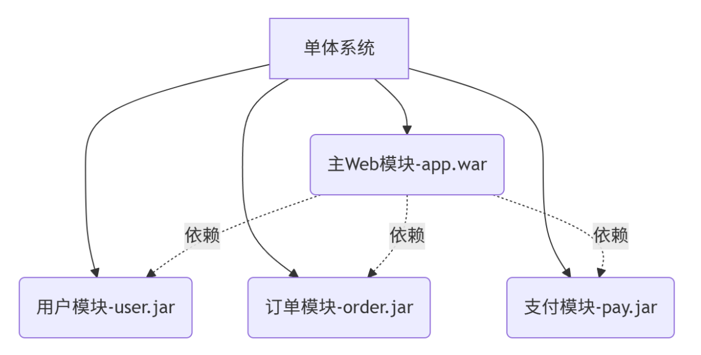
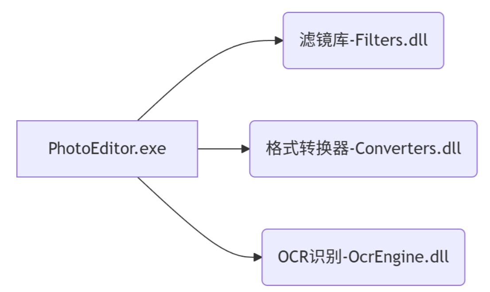
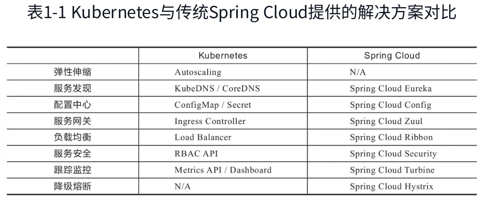
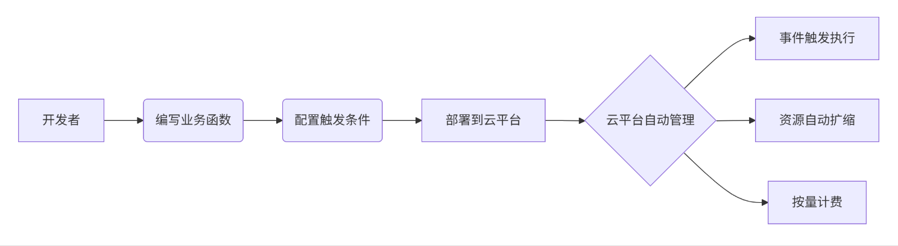
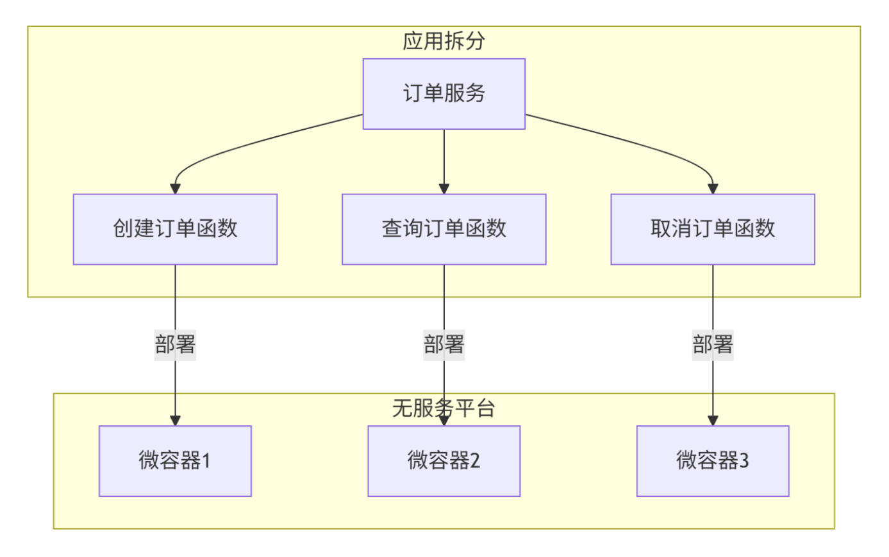
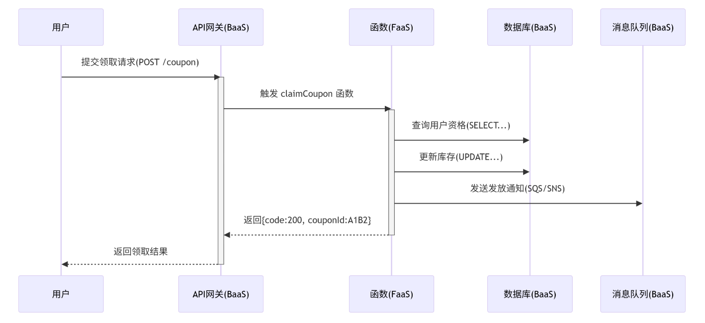

# 第1章　服务架构演进史

架构并不是被发明出来的，而是持续演进的结果。本章我们暂且放下代码与技术，借讨论历史之名，来梳理软件架构发展历程中出现过的名词术语，以全局的视角，从这些概念的起源去分析它们是什么，它们取代了什么，它们为什么能够在竞争中取得成功，为什么变得不可或缺，以及它们为什么会失败，在斗争中被淘汰，逐渐湮灭于历史的烟尘当中。

## 1.1 原始分布式时代

可能与绝大多数人的认知有些差异，“使用多个独立的分布式服务共同构建一个更大型系统”的设想与实际尝试，其实要比今天大家所了解的大型单体系统出现的时间更早。

计算机硬件有限的运算处理能力，已直接影响到了单台计算机上信息系统软件能够达到的最大规模。为突破硬件算力的限制，高校、研究机构、软硬件厂商开始分头探索，寻找使用多台计算机共同协作来支撑同一套软件系统的可行方案。这一阶段是对分布式架构最原始的探索，从结果来看，历史局限决定了它不可能一蹴而就地解决分布式的难题，但从过程来看，这个阶段的探索称得上成绩斐然，研究过程中的很多成果都对今天计算机科学的诸多领域产生了深远影响，并直接推动了后续软件架构的演化进程。譬如，......

为了避免UNIX系统的版本战争在分布式领域中重演，负责制定UNIX系统技术标准的“开放软件基金会”（Open Software Foundation，OSF，也即后来的“国际开放标准组织”）邀请了当时业界主流的计算机厂商一起参与，共同制订了名为“分布式运算环境”(Distributed Computing Environment，DCE)的分布式技术体系。......

由于OSF本身的UNIX背景，当时对这些技术的研究都带着浓厚的UNIX设计风格，有一个预设的重要原则是要使分布式环境中的服务调用、资源访问、数据存储等操作尽可能透明化、简单化，从而使开发人员不必过于关注他们访问的方法或其他资源是位于本地还是远程。这样的设计主旨非常符合UNIX一贯的设计哲学，然而这个过于理想化的目标背后其实蕴含着彼时根本不可能完美解决的技术困难。

尽管“调用远程方法”与“调用本地方法”只有两字之差，但若要兼顾简单、透明、性能、正确、鲁棒、一致等特点，两者的复杂度就完全不可同日而语了。且不说远程方法不能再依靠本地方法那些以内联为代表的传统编译优化来提升速度，光是“远程”二字带来的网络环境下的新问题，譬如，远程的服务在哪里（服务发现），有多少个（负载均衡），网络出现分区、超时或者服务出错了怎么办（熔断、隔离、降级），方法的参数与返回结果如何表示（序列化协议），信息如何传输（传输协议），服务权限如何管理（认证、授权），如何保证通信安全（网络安全层），如何令调用不同机器的服务返回相同的结果（分布式数据一致性）等一系列问题，全都需要设计者耗费大量精力。

面对重重困难与压力，DCE不仅从零开始、从无到有地回答了其中大部分问题，构建出大量的分布式基础组件与协议，而且真的尽力做到了相对“透明”，譬如在DFS上访问文件，如果不考虑性能差异，很难感受到它与本地磁盘文件系统有什么不同。可是，一旦考虑性能差异，那远程和本地的鸿沟是无比深刻的，两者的速度往往有着数量级上的差距，完全不可调和。尤其是在那个时代的机器硬件条件下，为了让程序在运行效率上可被用户接受，开发者只能在方法本身运行时间很长、可以相对忽略远程调用成本时的情况下考虑分布式。

开发一个能良好运作的分布式应用，需要极高的编程技巧和各方面的专业知识去支撑，这时候反而是人本身对软件规模的约束超过了机器算力上的约束。

对DCE的研究是计算机科学第一次对分布式有组织领导、有标准可循、有巨大投入的尝试，但无论是DCE还是稍后出现的CORBA，从结果来看，都不能称得上成功，因为将一个系统拆分到不同的机器中运行，为解决这样做带来的服务发现、跟踪、通信、容错、隔离、配置、传输、数据一致性和编码复杂度等方面的问题所付出的代价已远远超过了分布式所取得的收益。

摆在计算机科学面前有两条通往更大规模软件系统的道路：一条是尽快提升单机的处理能力，以避免分布式带来的种种问题；另一条是找到更完美的、解决如何构建分布式系统的解决方案。

20世纪80年代正是摩尔定律开始稳定发挥作用的黄金时期，微型计算机的性能以每两年增长一倍的惊人速度提升，硬件算力束缚软件规模的链条很快变得松动，信息系统进入以单台或少量几台计算机即可作为服务器来支撑大型信息系统运作的单体时代，且在很长的一段时间内，单体都将是软件架构的绝对主流。尽管如此，对于另外一条路，即对分布式计算、远程服务调用的探索也从未中断。

原始分布式时代提出的构建符合UNIX设计哲学的、如同本地调用一般简单透明的分布式系统的这个目标，是软件开发者对分布式系统最初的美好愿景，但迫于现实，它会在一定时期内被妥协、被舍弃。换句话说，分布式将会经过一段越来越复杂的发展过程。不过，在三十多年后的21世纪10年代，随着分布式架构逐渐成熟、完善，并取代单体成为大型软件的主流架构风格以后，这个美好的愿景终将会重新被开发者拾起。

## 1.2 单体系统时代

单体架构是今天绝大多数软件开发者都学习、实践过的一种软件架构，许多介绍微服务的图书和技术资料中也常把这种架构风格的应用称作“巨石系统”(Monolithic Application)。“单体架构”在整个软件架构演进的历史进程里，是出现时间最早、应用范围最广、使用人数最多、统治历史最长的一种架构风格，但“单体”这个名称，却是在微服务开始流行之后才“事后追认”所形成的概念。此前，并没有多少人将“单体”看作一种架构，如果你去查找软件架构的开发资料，可以轻易地找出大量以微服务为主题的图书和文章，却很难找出专门教你如何开发单体架构的任何形式的材料，这一方面体现了单体架构本身的简单性，另一方面也体现出在相当长的时间里，大家都已经习惯了软件架构就应该是单体这种样子。

剖析单体架构之前，我们有必要先厘清一个概念误区，在许多微服务的资料里，单体系统往往是以“反派角色”的身份登场的，譬如著名的微服务入门书《微服务架构设计模式》，第1章的名字就是“逃离单体的地狱”。这些材料所讲的单体系统，其实都有一个隐含定语：“大型的单体系统”。对于小型系统，单台机器就足以支撑其良好运行的系统，不仅易于开发、测试、部署，且由于系统中各个功能、模块、方法的调用过程都是进程内调用，不会发生进程间通信（Inter-Process Communication，IPC），因此连运行效率也是最高的，所以此时的单体架构完全不应该被贴上“反派角色”的标签，反倒是那些爱赶技术潮流却不顾需求现状的微服务吹捧者更像是个反派。单体系统的不足，必须在软件的性能需求超过了单机、软件的开发人员规模明显超过了“2 Pizza Team”范畴的前提下才有讨论的价值，因此，本书后续讨论中所说的单体，均特指“大型的单体系统”。也正是因此，本节中说到“单体是出现最早的架构风格”，与上一节开篇提到的“使用多个独立的分布式服务共同构建一个更大型系统的设想与实际尝试，反而要比今天大家所了解的大型单体系统出现的时间更早”实际并无矛盾。

尽管“Monolithic”这个词语本身的意思，“巨石”，确实带有一些“不可拆分”的隐含意味，但人们也不应该简单粗暴地把单体系统在维基百科上的定义“all in one piece”翻译成“铁板一块”，它其实更接近于“自给自足”（Self-Contained，在计算机中译为“自包含”）的含义。不过，这种“铁板一块”的译法不能全算作段子，笔者相信肯定有一部分人说起单体架构、巨石系统时，在脑海中闪过的第一个缺点就是它的不可拆分、难以扩展，因此才不能支撑越来越大的软件规模。这种想法看似合理，其实是有失偏颇的，至少不完整。

从纵向角度来看，笔者在实际生产环境里从未见过哪个大型现代信息系统是完全不分层的。分层架构(Layered Architecture)已是现在所有信息系统建设中普遍认可、采用的软件设计方法，无论是单体还是微服务，抑或是其他架构风格，都会对代码进行纵向层次划分，收到的外部请求在各层之间以不同形式的数据结构进行流转传递，触及最末端的数据库后按相反的顺序回馈响应。对于这个意义上的“可拆分”，单体架构完全不会展露出丝毫的弱势，反而可能会因更容易开发、部署、测试而获得更好的便捷性。

从横向角度来看，单体架构也支持按照技术、功能、职责等维度，将软件拆分为各种模块，以便重用和管理代码。单体系统并不意味着只能有一个整体的程序封装形式，如果需要，它完全可以由多个JAR、WAR、DLL、Assembly或者其他模块格式来构成。即使是从横向扩展(Scale Horizontally)的角度来衡量，在负载均衡器之后同时部署若干个相同的单体系统副本，以达到分摊流量压力的效果，也是非常常见的需求。

------

**示例1：Java企业级应用（JAR + WAR组合）**



```
deploy/
├── app.war        # 主Web应用
├── lib/
│   ├── user.jar   # 用户管理模块
│   ├── order.jar  # 订单处理模块
│   └── pay.jar    # 支付接口模块
```

运行时行为：

- 所有模块被同一个Tomcat容器加载
- 模块间通过直接方法调用通信（非网络）
- 最终体现为单一访问入口：`http://app:8080`

**示例2：.NET桌面应用（EXE + DLL组合）**



```
Program Files/PhotoEditor/
├── PhotoEditor.exe
├── Filters.dll
├── Converters.dll
└── OcrEngine.dll
```

工作方式：

1. 用户双击启动`PhotoEditor.exe`
2. EXE主程序动态加载所有DLL
3. 功能按钮直接调用DLL中的方法
4. 所有组件在同一个Windows进程中运行

------

在“拆分”这方面，单体系统的真正缺陷不在如何拆分，而在拆分之后的自治与隔离能力上。由于所有代码都运行在同一个进程内，所有模块、方法的调用都无须考虑网络分区、对象复制这些麻烦的事和性能损失，但在获得进程内调用的简单、高效等好处的同时，也意味着如果任何一部分代码出现缺陷，过度消耗了进程空间内的资源，所造成的影响也是全局性的、难以隔离的。譬如内存泄漏、线程爆炸、阻塞、死循环等问题，都将会影响整个程序，而不仅仅是影响某一个功能、模块本身的正常运作。如果出现问题的是某些更高层次的公共资源，譬如端口号或者数据库连接池泄漏，还将会影响整台机器甚至集群中其他单体副本的正常工作。

同样，由于所有代码都共享同一个进程，不能隔离，也就无法（其实还是有办法的，譬如使用OSGi这种运行时模块化框架，但是很别扭、很复杂）做到单独停止、更新、升级某一部分代码，所以从可维护性来说，单体系统也是不占优势的。对于单体系统，在对程序升级、修改时往往需要制定专门的停机更新计划，做灰度发布、A/B测试也相对更复杂。

如果说共享同一进程获得简单、高效的代价是同时损失了各个功能模块的自治与隔离能力，那这两者孰轻孰重呢？这个问题的潜台词似乎是在比较微服务、单体架构哪种更好用、更优秀。笔者认为“好用和优秀”不会是放之四海皆准的，这点不妨举一个浅显的例子加以说明。......

由于隔离能力的缺失，单体除了难以阻断错误传播、不便于动态更新程序以外，还面临难以技术异构的困难，每个模块的代码通常都需要使用一样的程序语言，乃至一样的编程框架去开发。单体系统的技术栈异构并非一定做不到，譬如JNI就可以让Java混用C或C++实现，但这通常是迫不得已的，并不是优雅的选择。

不过，以上列举的这些问题都还不是今天以微服务取代单体系统成为潮流趋势的根本原因，笔者认为最重要的原因是：单体系统很难兼容“Phoenix”的特性。这种架构风格潜在的要求是希望系统的每一个部件、每一处代码都尽量可靠，尽量不出或少出缺陷。然而战术层面再优秀，也很难弥补战略层面的不足。单体系统靠高质量来保证高可靠性的思路，在小规模软件上还能运作良好，但当系统规模越来越大时，交付一个可靠的单体系统就变得越来越具有挑战性。如本书前言所说，正是随着软件架构演进，构建可靠系统的观念从“追求尽量不出错”到正视“出错是必然”的转变，才是微服务架构得以挑战并逐步取代单体架构的底气所在。

为了允许程序出错，获得自治与隔离的能力，以及实现可以技术异构等目标，是继性能与算力之后，让程序再次选择分布式的理由。然而，开发分布式程序也并不意味着一定要依靠今天的微服务架构才能实现。在新旧世纪之交，人们曾经探索过几种服务拆分方法，将一个大的单体系统拆分为若干个更小的、不运行在同一个进程的独立服务，这些服务拆分方法后来带来了面向服务架构(Service-Oriented Architecture)的一段兴盛期，我们称其为“SOA时代”。

1.3 SOA时代

......

## 1.4 微服务时代

“微服务”这个技术名词最早在2005年就已经被提出，由Peter Rodgers博士在2005年的云计算博览会(Web Services Edge 2005)上首次使用，当时的说法是“Micro-Web-Service”，指的是一种专注于单一职责的、与语言无关的细粒度Web服务(Granular Web Service)。“微服务”一词并不是Peter Rodgers凭空创造出来的概念，它最初可以说是SOA发展时催生的产物，就如同EJB推广过程中催生了Spring和Hibernate那样，这一阶段的微服务是作为SOA的一种轻量化的补救方案而被提出的。时至今日，在英文版的维基百科上，仍然将微服务定义为SOA的一种变体，所以微服务在最初阶段与SOA、Web Service这些概念有所牵扯也完全可以理解，但现在来看，维基百科对微服务的定义已经颇有些过时了。

微服务的概念提出后，在将近十年的时间里面，它并没有受到太多追捧。如果只是对现有SOA架构的修修补补，确实难以唤起广大技术人员的更多关注。不过，在这十年时间里，微服务本身也在不断蜕变。2012年，在波兰克拉科夫举行的“33rd Degree Conference”大会上，Thoughtworks首席咨询师James Lewis做了题为“Microservices-Java,the UNIX Way”的主题演讲，其中提到了单一服务职责、康威定律、自动扩展、领域驱动设计等原则，却只字未提SOA，反而号召应该重拾UNIX的设计哲学(As Well Behaved UNIX Service)。微服务已经迫不及待地要脱离SOA的附庸，成为一种独立的架构风格，也许，未来还将是SOA的革命者。

微服务真正崛起是在2014年，相信阅读此文的大多数读者，也是从Martin Fowler与James Lewis合写的文章“Microservices：A Definition of This New Architectural Term”中首次了解微服务的。当然，这并不是指各位一定读过这篇文章，应该准确地说——今天大家所了解的“微服务”就是这篇文章中定义的“微服务”。此文首先给出了现代微服务的概念：“微服务是一种通过多个小型服务组合来构建单个应用的架构风格，这些服务围绕业务能力而非特定的技术标准来构建。各个服务可以采用不同的编程语言、不同的数据存储技术，运行在不同的进程之中。服务采取轻量级的通信机制和自动化的部署机制实现通信与运维。”此外，文中列举了微服务的九个核心的业务与技术特征，下面将其一一列出并解读。

**围绕业务能力构建(Organized around Business Capability)。**这里再次强调了康威定律的重要性，有怎样结构、规模、能力的团队，就会产生对应结构、规模、能力的产品。这个结论不是某个团队、某个公司遇到的巧合，而是必然的演化结果。如果本应该归属同一个产品内的功能被划分在不同团队中，必然会产生大量的跨团队沟通协作，而跨越团队边界无论在管理、沟通、工作安排上都有更高昂的成本，因此高效的团队自然会针对其进行改进，当团队、产品磨合稳定之后，团队与产品就会拥有一致的结构。

**分散治理(Decentralized Governance)。**这里是指服务对应的开发团队有直接对服务运行质量负责的责任，也有不受外界干预地掌控服务各个方面的权力，譬如选择与其他服务异构的技术来实现自己的服务。这一点在真正实践时多少存有宽松的处理余地，大多数公司都不会在某一个服务使用Java，另一个服务用Python，再下一个服务用Go，而是通常会用统一的主流语言，乃至统一的技术栈或专有的技术平台。微服务不提倡也并不反对这种“统一”，只要负责提供和维护基础技术栈的团队有被各方依赖的觉悟，有“经常被凌晨3点的闹钟吵醒”的心理准备就好。微服务更加强调的是在确实需要技术异构时，应能够有选择“不统一”的权利，譬如不应该强迫Node.js去开发报表页面，要做人工智能训练模型时可以选择Python，等等。

**通过服务来实现独立自治的组件(Componentization via Service)。**之所以强调通过“服务”(Service)而不是“类库”(Library)来构建组件，是因为类库在编译期静态链接到程序中，通过本地调用来提供功能，而服务是进程外组件，通过远程调用来提供功能。前文我们也已经分析过，尽管远程服务有更高昂的调用成本，但这是为组件带来自治与隔离能力的必要代价。

**产品化思维(Product not Project)。**避免把软件研发视作要去完成某种功能，而是视作一种持续改进、提升的过程。譬如，不应该把运维只看作运维团队的事，把开发只看作开发团队的事，团队应该为软件产品的整个生命周期负责，开发者不仅应该知道软件如何开发，还应该知道它如何运作，用户如何反馈，乃至售后支持工作是怎样进行的。注意，这里服务的用户不一定是最终用户，也可能是消费这个服务的另外一个服务。以前在单体架构下，程序的规模决定了无法让全部成员都关注完整的产品，如开发、运维、支持等不同职责的成员只关注自己的工作，但在微服务下，要求开发团队中每个人都具有产品化思维，关心整个产品的全部方面是具有可行性的。

**数据去中心化(Decentralized Data Management)。**微服务明确提倡数据应该按领域分散管理、更新、维护、存储。在单体服务中，一个系统的各个功能模块通常会使用同一个数据库。诚然，中心化的存储天生就更容易避免一致性问题，但是，同一个数据实体在不同服务的视角里，它的抽象形态往往是不同的。譬如，Bookstore应用中的书本，在销售领域中关注的是价格，在仓储领域中关注的是库存数量，在商品展示领域中关注的是书的介绍信息，如果使用中心化存储，所有领域都必须修改和映射到同一个实体之中，这很可能使不同服务相互影响而丧失独立性。尽管在分布式中处理好一致性问题也相当困难，很多时候都没办法使用传统的事务处理来保证，但是两害相权取其轻，即使有一些必要的代价，但仍是值得使用的。

**强终端弱管道(Smart Endpoint and Dumb Pipe)。**弱管道(Dumb Pipe)几乎是直接反对SOAP和ESB的通信机制。ESB可以处理消息的编码加工、业务规则转换等；BPM可以集中编排企业业务服务；SOAP有几十个WS-*协议族在处理事务、一致性、认证授权等一系列工作，这些构建在通信管道上的功能也许对系统中的某一部分服务是有必要的，但对于另外更多的服务则是强加进来的负担。如果服务需要上面的额外通信能力，就应该在服务自己的Endpoint上解决，而不是在通信管道上一揽子处理。微服务提倡使用类似于经典UNIX过滤器那样简单直接的通信方式，所以RESTful风格的通信在微服务中会是更合适的选择。

**容错性设计(Design for Failure)。**不再虚幻地追求服务永远稳定，而是接受服务总会出错的现实，要求在微服务的设计中，能够有自动的机制对其依赖的服务进行快速故障检测，在持续出错的时候进行隔离，在服务恢复的时候重新联通。所以“断路器”这类设施，对实际生产环境中的微服务来说并不是可选的外围组件，而是一个必需的支撑点，如果没有容错性设计，系统很容易被一两个服务崩溃所带来的雪崩效应淹没。可靠系统完全可能由会出错的服务组成，这是微服务最大的价值所在，也是本书前言中所说的“凤凰架构”的含义。

**演进式设计(Evolutionary Design)。**容错性设计承认服务会出错，演进式设计则承认服务会被报废淘汰。一个设计良好的服务，应该是能够报废的，而不是期望得到长存永生。假如系统中出现不可更改、无可替代的服务，这并不能说明这个服务多么优秀、多么重要，反而是一种系统设计上脆弱的表现，微服务所追求的自治、隔离，也是反对这种脆弱性的表现。

**基础设施自动化(Infrastructure Automation)。**基础设施自动化，如CI/CD的长足发展，显著减少了构建、发布、运维工作的复杂性。由于微服务架构下运维对象数量是单体架构运维对象数量的数量级倍，使用微服务的团队更加依赖于基础设施的自动化，人工是很难支撑成百上千乃至上万级别的服务的。

“Microservices”一文中对微服务特征的描写已经相当具体了，文中除了定义微服务是什么，还专门申明了微服务不是什么——微服务不是SOA的变体或衍生品，应该明确地与SOA划清界限，不再贴上任何SOA的标签。如此，微服务的概念才算是一种真正丰满、独立的架构风格，为它在未来几年时间里如明星一般闪耀崛起于技术舞台铺下了理论基础。

从以上微服务的定义和特征中，你应该可以明显地感觉到微服务追求的是更加自由的架构风格，摒弃了几乎所有SOA里可以抛弃的约束和规定，提倡以“实践标准”代替“规范标准”。可是，如果没有了统一的规范和约束，以前SOA解决的那些分布式服务的问题，不也就一下子都重新出现了吗？的确如此，对于服务的注册发现、跟踪治理、负载均衡、故障隔离、认证授权、伸缩扩展、传输通信、事务处理等问题，微服务中将不再有统一的解决方案。即使只讨论Java范围内会使用到的微服务，仅一个服务间远程调用问题，可以列入解决方案的候选清单的就有RMI(Sun/Oracle)、Thrift(Facebook)、Dubbo（阿里巴巴）、gRPC(Google)、Motan2（新浪）、Finagle(Twitter)、brpc（百度）、Arvo(Hadoop)、JSON-RPC、REST，等等；仅一个服务发现问题，可以选择的就有Eureka(Netflix)、Consul(HashiCorp)、Nacos（阿里巴巴）、ZooKeeper(Apache)、etcd(CoreOS)、CoreDNS(CNCF)，等等。其他领域也与此类似。

微服务所带来的自由是一把双刃开锋的宝剑，当软件架构者拿起这把宝剑，一刃指向SOA定下的复杂技术标准，将选择的权力夺回的同一时刻，另外一刃也正朝着自己映出冷冷的寒光。在微服务时代，软件研发本身的复杂度确实有所降低。一个简单服务，并不见得会同时面临分布式中的所有问题，也就没有必要背上SOA那百宝袋般沉重的技术包袱。需要解决什么问题，就引入什么工具；团队熟悉什么技术，就使用什么框架。此外，像Spring Cloud这样胶水式的全家桶工具集，通过一致的接口、声明和配置，进一步屏蔽了源自具体工具、框架的复杂性，降低了在不同工具、框架之间切换的成本，所以，作为一个普通的服务开发者，作为一个“螺丝钉”式的程序员，微服务架构是友善的。可是，微服务对架构者却是满满的“恶意”，对架构能力的要求已提升到史无前例的程度。笔者在本书的多处反复强调过，技术架构者的第一职责就是决策权衡，有利有弊才需要决策，有取有舍才需要权衡，如果架构者本身的知识面不足以覆盖所需要决策的内容，不清楚其中利弊，恐怕将无可避免地陷入选择困难症的境遇之中。

微服务时代充满着自由的气息，微服务时代充斥着迷茫的选择。软件架构不会止步于自由，微服务仍不是架构探索的终点，如果有下一个时代，笔者希望是信息系统拥有微服务的自由权利，围绕业务能力构建自己的服务而不受技术规范管束，但又不用以承担自行解决分布式的问题的责任为代价。管他什么利弊权衡！小孩子才做选择题，成年人全部都要！

## 1.5 后微服务时代

上节提到的分布式架构中出现的问题，如注册发现、跟踪治理、负载均衡、传输通信等，其实在SOA时代甚至从原始分布式时代起就已经存在了，只要是分布式架构的系统，就无法完全避免，但我们不妨换个思路来想一下，这些问题一定要由软件系统自己来解决吗？

如果不局限于采用软件的方式，这些问题几乎都有对应的硬件解决方案。譬如，某个系统需要伸缩扩容，通常会购买新的服务器，部署若干副本实例来分担压力；如果某个系统需要解决负载均衡问题，通常会布置负载均衡器，选择恰当的均衡算法来分流；如果需要解决传输安全问题，通常会布置TLS传输链路，配置好CA证书以保证通信不被窃听篡改；如果需要解决服务发现问题，通常会设置DNS服务器，让服务访问依赖稳定的记录名而不是易变的IP地址，等等。**随着计算机科学多年的发展，这些问题大多有了专职化的基础设施去解决，而在微服务时代，人们之所以选择在软件的代码层面而不是硬件的基础设施层面去解决这些分布式问题，很大程度上是因为由硬件构成的基础设施跟不上由软件构成的应用服务的灵活性的无奈之举。**软件可以只使用键盘命令就拆分出不同的服务，只通过拷贝、启动就能够实现伸缩扩容服务，硬件难道就不可以通过键盘命令变出相应的应用服务器、负载均衡器、DNS服务器、网络链路这些设施吗？

至此，估计大家已经听出下面要说的是虚拟化技术和容器化技术了。微服务时代所取得的成就，本身就离不开以Docker为代表的早期容器化技术的巨大贡献。**在此之前，笔者从来没有提过“容器”二字，这并不是刻意冷落，而是早期的容器只被简单地视为一种可快速启动的服务运行环境，目的是方便程序的分发部署，在这个阶段，针对单个应用进行封装的容器并未真正解决分布式架构问题。**尽管2014年微服务开始崛起的时候，Docker Swarm（2013年）和Apache Mesos（2012年）就已经存在，更早之前也出现了软件定义网络(Software-Defined Networking，SDN)、软件定义存储(Software-Defined Storage，SDS)等技术，但是，被业界广泛认可、普遍采用的通过虚拟化基础设施去解决分布式架构问题的开端，应该要从2017年Kubernetes取得容器战争的胜利开始算起。

2017年是容器生态发展历史中具有里程碑意义的一年。在这一年，长期作为Docker竞争对手的RKT容器一派的领导者CoreOS宣布放弃自己的容器管理系统Fleet，并将会在未来把所有容器管理的功能移至Kubernetes之上去实现。在这一年，容器管理领域的独角兽Rancher Labs宣布放弃其内置了数年的容器管理系统Cattle，提出“All-in-Kubernetes”战略。在这一年，Kubernetes的主要竞争者Apache Mesos在9月正式宣布了“Kubernetes on Mesos”集成计划，由竞争关系转为对Kubernetes提供支持。在这一年，Kubernetes的最大竞争者Docker Swarm的母公司Docker，终于在10月被迫宣布Docker要同时支持Swarm与Kubernetes两套容器管理系统，也即在事实上承认了Kubernetes的统治地位。这场已经持续了三年时间，以Docker Swarm、Apache Mesos与Kubernetes为主要竞争者的“容器编排战争”终于有了明确的结果。Kubernetes登基加冕是容器发展中一个时代的终章，也将是软件架构发展下一个纪元的开端。笔者在表1-1中列出了针对同一个分布式服务问题，Kubernetes中提供的基础设施层面的解决方案与传统Spring Cloud中提供的应用层面的解决方案的对比，尽管因为各自出发点不同，解决问题的方法和效果都有所差异，但这无疑是提供了一条全新的、前途更加广阔的解题思路。



“前途广阔”不仅仅是一句恭维赞赏的客气话，当虚拟化的基础设施从单个服务的容器扩展至由多个容器构成的服务集群、通信网络和存储设施时，软件与硬件的界限便已模糊。一旦虚拟化的硬件能够跟上软件的灵活性，那些与业务无关的技术性问题便有可能从软件层面剥离，悄无声息地在硬件基础设施之内解决，让软件得以只专注业务，真正围绕业务能力构建团队与产品。如此，DCE中未能实现的“透明的分布式应用”成为可能，Martin Flower设想的“凤凰服务器”成为可能，Chad Fowler提出的“不可变基础设施”也成为可能。**从软件层面独立应对分布式架构所带来的各种问题，发展到应用代码与基础设施软、硬一体，合力应对架构问题，这个新的时代现在常被媒体冠以“云原生”这个颇为抽象的名字加以宣传。云原生时代追求的目标与此前微服务时代追求的目标并没有本质改变，都是在服务架构演进的历史进程中，所以笔者更愿意称云原生时代为“后微服务时代”。**

Kubernetes成为容器战争胜利者标志着后微服务时代的开启，但Kubernetes仍然没能完美解决全部的分布式问题—“不完美”的意思是，仅从功能上看，单纯的Kubernetes反而不如之前的Spring Cloud方案。这是因为有一些问题处于应用系统与基础设施的边缘，使得很难完全在基础设施层面中精细化地处理。......

以上问题在通过Spring Cloud这类应用代码实现的微服务中并不难处理，既然是使用程序代码来解决问题，只要合乎逻辑，想要实现什么功能，只受限于开发人员的想象力与技术能力，但基础设施是针对整个容器来管理的，粒度相对粗犷，只能到容器层面，对单个远程服务则很难有效管控。类似的，在服务的监控、认证、授权、安全、负载均衡等方面都有可能面临细化管理的需求，譬如服务调用时的负载均衡，往往需要根据流量特征，调整负载均衡的层次、算法等，而DNS虽然能实现一定程度的负载均衡，但通常并不能满足这些额外的需求。

**为了解决这一类问题，虚拟化的基础设施很快完成了第二次进化，引入了今天被称为“服务网格”(Service Mesh)的“边车代理模式”(Sidecar Proxy)。**所谓“边车”是一种带垮斗的三轮摩托车，笔者小时候还算常见，现在基本就只在影视剧中才会看到了。在虚拟化场景中的边车指的是由系统自动在服务容器（通常是指Kubernetes的Pod）中注入一个通信代理服务器，相当于那个挎斗，以类似网络安全里中间人攻击的方式进行流量劫持，在应用毫无感知的情况下，悄然接管应用所有对外通信。这个代理除了实现正常的服务间通信外（称为数据平面通信），还接收来自控制器的指令（称为控制平面通信），根据控制平面中的配置，对数据平面通信的内容进行分析处理，以实现熔断、认证、度量、监控、负载均衡等各种附加功能。通过边车代理模式，便实现了既不需要在应用层面加入额外的处理代码，也提供了几乎不亚于程序代码的精细管理能力。

我们很难从概念上判定清楚一个与应用系统运行于同一资源容器之内的代理服务到底应该算软件还是基础设施，但它对应用是透明的，不需要改动任何软件代码就可以实现服务治理，这便足够了。服务网格在2018年才火起来，今天它仍然是个新潮的概念，未完全成熟，甚至连Kubernetes也还算是个新生事物。但笔者相信，未来Kubernetes将会成为服务器端的标准运行环境，如同现在的Linux系统；服务网格也将会成为微服务之间通信交互的主流模式，把“选择什么通信协议”“怎样调度流量”“如何认证授权”之类的技术问题隔离于程序代码之外，取代今天Spring Cloud全家桶中大部分组件的功能。微服务只需要考虑业务本身的逻辑，这才是最理想的智能终端解决方案。

业务与技术完全分离，远程与本地完全透明，也许这就是最好的时代了吧？

## 1.6 无服务时代

人们研究分布式架构，最初是因为单台机器的性能无法满足系统的运行需求，尽管在后来架构演进过程中，容错能力、技术异构、职责划分等各方面因素都成为架构需要考虑的问题，但获得更好的性能在架构设计需求中依然占很大的比重。对软件研发而言，不去做分布式无疑是最简单的，如果单台服务器的性能可以是无限的，那架构演进的结果肯定会与今天有很大差别，分布式也好，容器化也好，微服务也好，恐怕都未必会如期出现，最起码一定不是今天这个样子。

绝对意义上的无限性能必然是不存在的，但在云计算落地已有十余年的今天，相对意义的无限性能已经成为现实。

在工业界，2012年Iron.io公司率先提出了“无服务”（Serverless，应该翻译为“无服务器”才合适，但现在称“无服务”已形成习惯了）的概念；2014年，亚马逊发布了名为Lambda的商业化无服务计算平台，并在后续的几年里逐步得到开发者认可，发展为目前世界上最大的无服务运行平台；到了2018年，中国的阿里云、腾讯云等厂商也开始跟进，发布了旗下的无服务产品，“无服务”成为近期技术圈里的“新网红”之一。



在学术界，2009年，云计算概念刚提出的早期，在加州大学伯克利分校曾发表的论文“Above the Clouds:A Berkeley View of Cloud Computing”中预言的云计算的价值、演进和普及在接下来的十年里一一得到验证。2019年，加州大学伯克利分校发表的第二篇有着相同命名风格的论文“Cloud Programming Simplified:A Berkeley View on Serverless Computing”再次预言“无服务将会发展成为未来云计算的主要形式”。由此来看，“无服务”也同样是被主流学术界所认可的发展方向之一。

无服务现在还没有一个特别权威的“官方”定义，但它的概念并没有前面提到的各种架构那么复杂，本来无服务也是以“简单”为主要卖点的，**它只涉及两块内容：后端设施(Backend)和函数(Function)。**

**后端设施**是指数据库、消息队列、日志、存储等这类用于支撑业务逻辑运行，但本身无业务含义的技术组件，这些后端设施都运行在云中，在无服务中将它们称为“后端即服务”(Backend as a Service，BaaS)。

**函数**是指业务逻辑代码，这里函数的概念与粒度都已经很接近于程序编码角度的函数了，其区别是无服务中的函数运行在云端，不必考虑算力问题，也不必考虑容量规划（从技术角度可以不考虑，从计费的角度还是要掂量一下的），在无服务中将其称为“函数即服务”(Function as a Service，FaaS)。

**无服务的愿景是让开发者只需要纯粹地关注业务**：不需要考虑技术组件，后端的技术组件是现成的，可以直接取用，没有采购、版权和选型的烦恼；不需要考虑如何部署，部署过程完全托管到云端，由云端自动完成；不需要考虑算力，有整个数据中心支撑，算力可以认为是无限的；不需要操心运维，维护系统持续平稳运行是云计算服务商的责任而不再是开发者的责任。在UC Berkeley的论文中，把无服务架构下开发者不再关心这些技术层面的细节，类比成当年软件开发从汇编语言踏进高级语言的发展过程，开发者可以不去关注寄存器、信号、中断等与机器底层相关的细节，从而令生产力得到极大解放。

无服务架构的远期前景看起来是很美好的，但笔者自己对无服务架构短期内的发展并没有那么乐观。与单体架构、微服务架构不同，无服务架构有一些天生的特点决定了它现在不是，以后如果没有重大变革的话，估计也很难成为一种普适性的架构模式。无服务架构确实能够降低一些应用的开发和运维环节的成本，譬如不需要交互的离线大规模计算，又譬如多数Web资讯类网站、小程序、公共API服务、移动应用服务端等都契合于无服务架构所擅长的短链接、无状态、适合事件驱动的交互形式。但另一方面，对于那些信息管理系统、网络游戏等应用，或者说对于具有业务逻辑复杂、依赖服务端状态、响应速度要求较高、需要长链接等特征的应用，至少目前是相对不那么适合的。这是因为无服务天生“无限算力”的假设决定了它必须要按使用量（函数运算的时间和占用的内存）计费以控制消耗的算力的规模，因而函数不会一直以活动状态常驻服务器，请求到了才会开始运行，导致了函数会有冷启动时间，响应的性能可能不太好。目前无服务的冷启动过程大概是在数十到百毫秒级别，对于Java这类启动性能差的应用，甚至是接近秒的级别。

------



部署本质：

- 不是每个函数一个独立Docker镜像，而是共享基础镜像+代码注入
- 确实需要将应用拆分为独立函数单元（微服务的进一步细化）

无服务架构的本质是**将应用拆解为函数粒度执行单元**，云平台通过轻量级容器技术实现毫秒级资源分配。

核心差异总结表

|   **维度**   |           传统容器            |            无服务容器            |
| :----------: | :---------------------------: | :------------------------------: |
|   思维模式   |        “部署我的应用”         |        “部署这段业务逻辑”        |
|  冷启动时间  |    20s+ (Pod调度+应用启动)    |     100ms-2s (微容器初始化)      |
|  运维复杂度  |      需监控Pod/节点/集群      |     仅需关注函数错误率和延迟     |
| 扩容最小单位 | 整个Pod（包含一个或多个容器） |         单个函数容器实例         |
| 扩容触发条件 |    基于CPU/内存等指标阈值     |      每个请求到达时实时决策      |
|   扩容速度   |      分钟级（创建新Pod）      |              毫秒级              |
|   资源复用   |      Pod持续运行直到缩容      |  容器实例请求结束后保留一段时间  |
|   闲置成本   |       需要为闲置Pod付费       | 请求结束即停止计费（无闲置成本） |

无服务架构的本质是**责任转移**：

- BaaS（后端即服务）：云计算厂商提供现成技术组件（数据库/存储/消息队列等）
- FaaS（函数即服务）：开发者只需编写核心业务函数



**为什么擅长短链接、无状态、事件驱动的交互？**

1. 短链接（Short-lived Connections）
   - 无服务的本质：函数仅在请求到来时被激活，执行完成后立即释放资源（通常 <1秒~数分钟）。
   - 匹配场景：HTTP API、简单表单提交等交互，客户端发起请求 → 函数执行 → 返回结果 → 连接终止。
   - 案例：Web资讯网站（用户浏览页面时触发函数）、小程序API（点击事件触发计算）。
2. 无状态（Stateless）
   - 设计限制：函数执行环境不保留状态。每次调用都是全新实例，无法在内存中维持会话或数据。
   - 解决方案：依赖外部服务（如数据库、Redis）存储状态，自身只做轻量计算。
3. 事件驱动（Event-Driven）
   - 工作模式：由外部事件触发函数（如消息队列、存储桶文件变更、定时任务）。
   - 优势：按需启动资源，避免持续占用服务器。
   - 典型场景：
     - 离线计算（上传日志文件 → 触发数据分析函数）
     - IoT数据处理（设备上传数据 → 触发告警函数）

**底层逻辑**：无服务的按量计费模型（Pay-per-Use）决定了其资源必须"即用即弃"，这正是短链接、无状态、事件驱动的技术根源。

**为什么不适合复杂业务/有状态/长链接类应用？**

1. 冷启动延迟（Cold Start）

	- 问题本质：函数首次启动需初始化运行时环境（如加载语言解释器、依赖库）。
	- 致命场景：
		- 网络游戏：玩家操作需<100ms响应，冷启动直接突破阈值
		- 高频交易系统：毫秒级延迟导致策略失效

2. 服务端状态依赖（Stateful Workloads）

    - 设计冲突：函数实例无法常驻内存，导致：会话状态丢失（如用户购物车数据）

    - 替代方案局限：虽然可通过数据库存储状态，但频繁读写会：

      - 显著增加延迟
    - 抬高成本（数据库调用费用可能远超函数执行费）

3. 长连接需求（Long-Lived Connections）

- 资源模型冲突：

|       需求       |            无服务限制            |
| :--------------: | :------------------------------: |
| WebSocket长连接  | 函数默认超时5~15分钟（平台依赖） |
|   实时音视频流   |     流处理需持续占用计算资源     |
| 后台持续计算任务 |       最大超时通常≤15分钟        |


- 成本反噬：强行维持长连接需函数持续活动 → 失去按量计费优势 → 费用甚至高于传统服务器。


4. 复杂业务逻辑（Complex Logic）

- 调试复杂度：分布式函数调用链导致，日志追踪困难（需跨函数聚合）。

- 本地测试无法模拟真实环境。

------

无论如何，云计算毕竟是大势所趋，今天信息系统建设的概念和观点，在（较长尺度的）明天都是会转变成适应云端的，笔者并不怀疑Serverless+API的设计方式会成为以后其中一种主流的软件形式，届时无服务还会有更广阔的应用空间。

如果说微服务架构是分布式系统这条路当前所能做到的极致，那无服务架构，也许就是“不分布式”的云端系统这条路的起点。虽然在顺序上笔者将“无服务”安排到了“微服务”和“云原生”时代之后，但它们并没有继承替代关系，强调这点是为了避免有读者从两者的名称与安排的顺序中产生“无服务就会比微服务更加先进”的错误想法。笔者相信软件开发的未来不会只存在某一种“最先进的”架构风格，多种具有针对性的架构风格并存，是软件产业更有生命力的形态。笔者同样相信在软件开发的未来，多种架构风格将会融合互补，“分布式”与“不分布式”的边界将逐渐模糊，两条路线将在云端的数据中心中交汇。今天已经能初步看见一些使用无服务的云函数去实现微服务架构的苗头了，将无服务作为技术层面的架构，将微服务视为应用层面的架构，把它们组合起来使用是完全合理可行的。以后，无论是物理机、虚拟机、容器，抑或是无服务云函数，都会是微服务实现方案的候选项之一。

本节是架构演进历史的最后一节，如本章引言所说，我们谈历史，重点不在考古，而是借历史之名，理解每种架构出现的意义与淘汰的原因，为的是更好地解决今天的现实问题，寻找出未来架构演进的发展道路。

对于架构演进的未来发展，2014年，Martin Fowler与James Lewis在“Microservices”的结束语中曾写到，他们对于微服务日后能否被大范围推广，最多只持有谨慎乐观的态度。在无服务方兴未艾的今天，与那时微服务的情况十分相近，笔者对无服务日后的推广同样持谨慎乐观的态度。软件开发的最大挑战就在于只能在不完备的信息下决定当前要处理的问题。时至今日，依然很难预想在架构演进之路的前方，微服务和无服务之后还会出现何种形式的架构风格，但这也契合了图灵的那句名言：尽管目光所及之处，只是不远的前方，即使如此，依然可以看到那里有许多值得去完成的工作在等待我们。